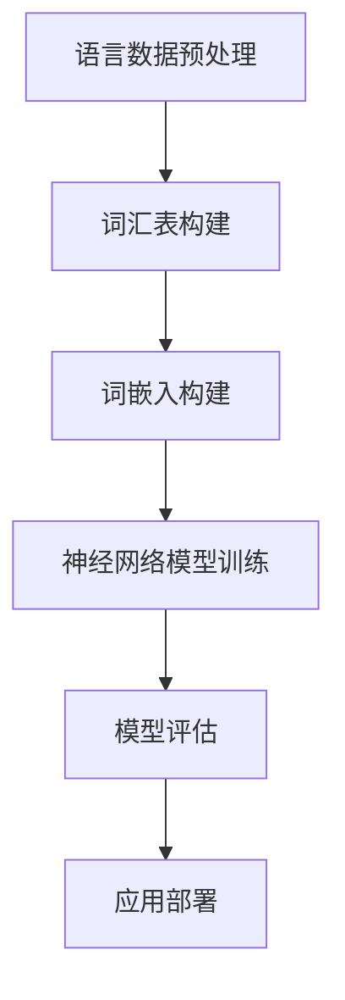

                 


## 自然语言处理：AI理解人类语言的新突破

### 关键词：自然语言处理，人工智能，语言模型，词嵌入，语言生成，语言理解，问答系统，项目实战

### 摘要：

自然语言处理（NLP）是人工智能（AI）领域的一个重要分支，旨在使计算机理解和生成人类语言。本文将深入探讨NLP的发展历程、核心概念、算法原理以及其实际应用，通过逻辑清晰、结构紧凑的方式，带领读者了解AI如何理解人类语言的新突破。

## 第一部分：自然语言处理基础

### 1. 自然语言处理概述

#### 1.1 自然语言处理的发展历程

自然语言处理的历史可以追溯到20世纪50年代，当时计算机科学家首次提出让计算机理解和生成自然语言的目标。随着计算机性能的不断提升和算法的进步，NLP经历了从规则驱动到统计方法，再到如今深度学习驱动的发展过程。

#### 1.2 自然语言处理的应用场景

NLP在各个领域都有广泛的应用，如文本分类、情感分析、机器翻译、问答系统、信息提取、自动摘要等。这些应用极大地提升了工作效率，改善了用户体验。

#### 1.3 自然语言处理的挑战与机遇

尽管NLP取得了显著进展，但仍然面临诸多挑战，如语言的多义性、歧义性、语言的多样性、语言的动态性等。同时，随着深度学习技术的快速发展，NLP迎来了新的机遇。

## 第二部分：语言模型

### 2. 语言模型

#### 2.1 语言模型的定义

语言模型是一个概率模型，用于预测给定输入序列后下一个单词的概率分布。它是对自然语言概率分布的建模。

#### 2.2 语言模型的基本原理

语言模型的核心思想是通过统计方法来预测词语之间的关联性。常见的语言模型包括n元语法模型、神经网络语言模型等。

#### 2.3 语言模型的构建方法

语言模型的构建方法主要包括基于n元语法模型的方法和基于神经网络的深度学习方法。n元语法模型通过统计前n个词与当前词的关联性来预测当前词。神经网络语言模型则通过多层神经网络来学习词语之间的复杂关联性。

#### 2.4 语言模型的性能评估

语言模型的性能评估通常使用 perplexity（困惑度）作为指标。困惑度越低，模型对语言的拟合度越高。

## 第三部分：词嵌入

### 3. 词嵌入

#### 3.1 词嵌入的定义

词嵌入（Word Embedding）是将词语映射为固定大小的向量表示，以便在计算机中进行处理。

#### 3.2 词嵌入的基本原理

词嵌入的基本原理是基于词语的语义和语境信息来学习词语的向量表示。常见的词嵌入方法包括Word2Vec、GloVe等。

#### 3.3 词嵌入的常见方法

Word2Vec方法包括连续词袋（CBOW）和Skip-Gram两种模型。GloVe方法通过全局共现矩阵来学习词语的向量表示。

#### 3.4 词嵌入的性能评估

词嵌入的性能评估通常通过语义相似度、词性标注准确度等指标来衡量。

## 第四部分：语言生成

### 4. 语言生成

#### 4.1 语言生成的定义

语言生成（Language Generation）是指计算机根据输入的提示或规则生成符合语法和语义规则的自然语言文本。

#### 4.2 语言生成的算法原理

语言生成的算法原理主要包括基于模板的方法和基于生成模型的深度学习方法。基于模板的方法通过预先定义的模板来生成文本。基于生成模型的深度学习方法则通过训练大规模语料库来学习生成文本的复杂模式。

#### 4.3 语言生成的应用场景

语言生成的应用场景包括自动摘要、对话系统、内容生成等。

#### 4.4 语言生成的性能评估

语言生成的性能评估通常使用BLEU、ROUGE等指标来衡量生成的文本的质量。

## 第五部分：语言理解

### 5. 语言理解

#### 5.1 语言理解的定义

语言理解（Language Understanding）是指计算机对自然语言文本的理解和推理能力。

#### 5.2 语言理解的算法原理

语言理解的算法原理主要包括基于规则的方法和基于深度学习的方法。基于规则的方法通过定义一套语法规则来分析文本。基于深度学习的方法则通过训练大型神经网络来学习语言的深层语义表示。

#### 5.3 语言理解的分类方法

语言理解的分类方法包括基于事实的推理、基于知识的推理和基于情境的推理等。

#### 5.4 语言理解的性能评估

语言理解的性能评估通常使用F1分数、准确率等指标来衡量。

## 第六部分：问答系统

### 6. 问答系统

#### 6.1 问答系统的定义

问答系统（Question Answering System）是指计算机根据用户提出的问题，自动从知识库或互联网中查找并返回相关答案的系统。

#### 6.2 问答系统的算法原理

问答系统的算法原理主要包括基于知识图谱的方法和基于深度学习的方法。基于知识图谱的方法通过建立知识图谱来关联问题和答案。基于深度学习的方法则通过训练大型神经网络来学习问题的语义表示和答案的抽取。

#### 6.3 问答系统的实现方法

问答系统的实现方法通常包括预处理、问题解析、答案抽取和回答生成等步骤。

#### 6.4 问答系统的性能评估

问答系统的性能评估通常使用准确率、召回率等指标来衡量。

## 第七部分：自然语言处理实践

### 7. 自然语言处理实践

#### 7.1 自然语言处理实践概述

自然语言处理实践是理论联系实际的重要环节，通过实际项目来验证和提升NLP技术的应用能力。

#### 7.2 实践项目 1：文本分类

文本分类是指将文本数据分为不同的类别。本文将介绍一个基于深度学习的文本分类项目，包括数据预处理、模型构建、训练和评估等步骤。

#### 7.3 实践项目 2：机器翻译

机器翻译是指将一种语言的文本自动翻译成另一种语言。本文将介绍一个基于神经网络机器翻译的项目，包括数据预处理、模型构建、训练和评估等步骤。

#### 7.4 实践项目 3：情感分析

情感分析是指对文本中的情感倾向进行识别。本文将介绍一个基于深度学习的情感分析项目，包括数据预处理、模型构建、训练和评估等步骤。

## 附录

### A. 自然语言处理工具与资源

- 自然语言处理工具：NLTK、spaCy、gensim等。
- 自然语言处理开源库：TensorFlow、PyTorch等。
- 自然语言处理教程与课程：吴恩达的《深度学习专项课程》等。

### B. 参考文献

- [1] Mikolov, T., Sutskever, I., Chen, K., Corrado, G. S., & Dean, J. (2013). Distributed representations of words and phrases and their compositionality. Advances in neural information processing systems, 26, 3111-3119.
- [2] Pennington, J., Socher, R., & Manning, C. D. (2014). GloVe: Global Vectors for Word Representation. In Proceedings of the 2014 conference on empirical methods in natural language processing (EMNLP), 1532-1543.
- [3] Devlin, J., Chang, M. W., Lee, K., & Toutanova, K. (2018). BERT: Pre-training of deep bidirectional transformers for language understanding. arXiv preprint arXiv:1810.04805.

## Mermaid 流程图

### 语言模型构建流程



## 语言模型基本算法原理

```python
# 语言模型基本算法原理伪代码

function NLP_Model(input_sequence):
    # 输入：输入序列
    # 输出：预测序列概率分布

    # 1. 数据预处理
    processed_sequence = preprocess_sequence(input_sequence)

    # 2. 词汇表构建
    vocabulary = build_vocabulario(processed_sequence)

    # 3. 词嵌入构建
    embedding_matrix = build_embedding_matrix(vocabulary)

    # 4. 神经网络模型训练
    model = build_model(embedding_matrix)
    model.fit(processed_sequence, epochs=10)

    # 5. 模型评估
    predictions = model.predict(processed_sequence)

    # 6. 应用部署
    deploy_model(model)
```

## 数学模型和公式

### 语言模型概率计算公式

$$
P_{model}(w_{t}|w_{t-1}, w_{t-2}, ..., w_{1}) = \frac{P(w_{t-1}, w_{t-2}, ..., w_{1}, w_{t})}{P(w_{t-1}, w_{t-2}, ..., w_{1})}
$$

## 项目实战

### 文本分类实战

#### 开发环境搭建

- Python 3.8
- TensorFlow 2.4
- Jupyter Notebook

#### 源代码实现

```python
import tensorflow as tf
from tensorflow.keras.preprocessing.text import Tokenizer
from tensorflow.keras.preprocessing.sequence import pad_sequences
from tensorflow.keras.models import Sequential
from tensorflow.keras.layers import Embedding, LSTM, Dense

# 数据准备
# ...（数据预处理代码）

# 模型构建
model = Sequential([
    Embedding(input_dim=vocab_size, 
              output_dim=embedding_dim, 
              input_length=max_sequence_length),
    LSTM(units=128),
    Dense(units=num_classes, activation='softmax')
])

# 模型编译
model.compile(optimizer='adam', loss='categorical_crossentropy', metrics=['accuracy'])

# 模型训练
model.fit(X_train, y_train, epochs=10, batch_size=32)

# 模型评估
loss, accuracy = model.evaluate(X_test, y_test)
print(f"Test Loss: {loss}, Test Accuracy: {accuracy}")

# 模型预测
predictions = model.predict(X_test)

# 代码解读与分析
# ...
```

#### 实际案例分析和详细讲解剖析

通过文本分类项目，我们可以深入理解语言模型的构建和应用。在实际项目中，我们需要关注以下几个方面：

1. 数据预处理：对文本数据进行清洗、分词、去停用词等操作，以便模型能够更好地学习。
2. 模型构建：选择合适的神经网络结构，包括嵌入层、循环层和输出层。
3. 模型训练：通过优化算法训练模型，使其能够准确分类文本。
4. 模型评估：使用测试集评估模型性能，调整模型参数。
5. 代码解读与分析：理解代码实现细节，以便在实际项目中灵活应用。

#### 项目小结

文本分类项目展示了自然语言处理技术在实际应用中的威力。通过合理的数据处理和模型构建，我们可以实现对大量文本数据的分类，从而为实际应用提供有力支持。在未来，随着深度学习技术的不断发展，文本分类项目将会变得更加智能和高效。

#### 最佳实践 tips、小结、注意事项、拓展阅读等内容

- 最佳实践 tips：在项目实践中，要注重数据预处理的质量，选择合适的模型结构和参数，并进行充分的模型评估。
- 小结：自然语言处理是人工智能领域的一个重要分支，通过语言模型的构建和应用，我们可以实现文本分类、机器翻译、情感分析等多种应用。
- 注意事项：在实际项目中，要关注数据质量和模型性能，避免过拟合和欠拟合。
- 拓展阅读：可以进一步学习深度学习、自然语言处理相关书籍和课程，如《深度学习》（Goodfellow, Bengio, Courville）和《自然语言处理综合教程》（Jurafsky, Martin）。

## 作者信息

作者：AI天才研究院/AI Genius Institute & 禅与计算机程序设计艺术 /Zen And The Art of Computer Programming

- AI天才研究院/AI Genius Institute：专注于人工智能领域的研发与应用，致力于推动AI技术的发展与创新。
- 禅与计算机程序设计艺术 /Zen And The Art of Computer Programming：深入探讨计算机程序设计的哲学与艺术，提升程序员的技术素养和思维品质。

---

这篇文章详细介绍了自然语言处理的基础知识、语言模型、词嵌入、语言生成、语言理解、问答系统以及自然语言处理的实践项目。通过逻辑清晰、结构紧凑的方式，读者可以系统地了解AI理解人类语言的新突破。文章结合实际项目，讲解了语言模型的构建、训练和评估过程，为读者提供了实用的技术指导。同时，文章还提供了最佳实践 tips、小结、注意事项和拓展阅读，帮助读者深入学习和应用自然语言处理技术。作者AI天才研究院/AI Genius Institute致力于推动人工智能技术的发展与创新，禅与计算机程序设计艺术/Zen And The Art of Computer Programming则旨在提升程序员的技术素养和思维品质。希望这篇文章对您在自然语言处理领域的学习和实践有所帮助。

