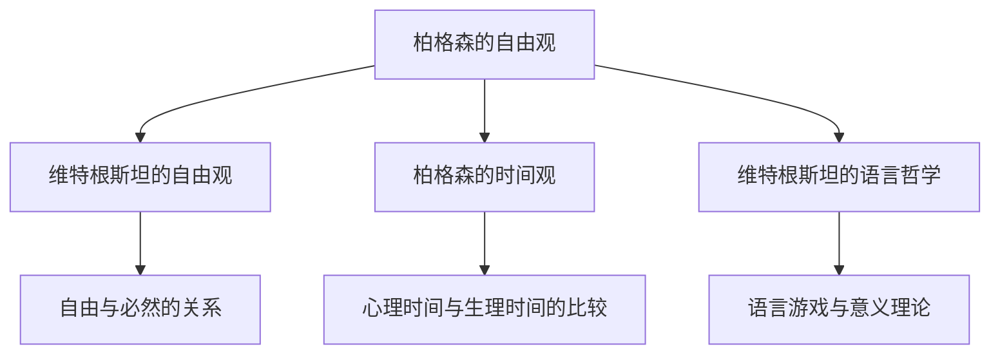

                 

## 文章标题

《自由与必然：柏格森与维特根斯坦的存在主义思想比较》

### 关键词

存在主义、柏格森、维特根斯坦、自由、必然、哲学、思想比较

### 摘要

本文旨在深入探讨存在主义哲学中两位重要思想家柏格森与维特根斯坦的思想体系，并对其进行比较分析。文章首先介绍了存在主义的基本概念，然后分别探讨了柏格森和维特根斯坦的思想特点，接着比较了两位哲学家的共同点和区别。最后，文章探讨了存在主义思想对当代社会和哲学领域的影响，以及它们的应用。通过本文的探讨，希望能够为读者提供一个清晰的理解框架，并引发对存在主义思想更深层次的思考。

### 引言

### 1.1 存在主义思想的背景和意义

存在主义作为现代西方哲学中的一个重要流派，起源于19世纪末20世纪初。其核心思想围绕着个体的自由、责任和存在意义进行探讨。存在主义的兴起受到了多种因素的影响，包括欧洲大陆的哲学传统、社会动荡以及个体意识的觉醒。

存在主义思想的背景可以追溯到18世纪的启蒙运动和19世纪的德国唯心主义。启蒙运动强调理性、自由和平等，而德国唯心主义则探讨了绝对精神和个体的关系。然而，在20世纪初，随着第一次世界大战的爆发和人类面临的种种困境，传统的哲学观念受到了极大的挑战，存在主义因此应运而生。

存在主义的意义在于它对个体自由和存在的深刻探讨，为我们理解人类的存在提供了新的视角。在存在主义看来，个体并非被动地存在于世界中，而是具有主动性和创造性的存在。存在主义关注个体的自由选择和责任，认为个体必须为自己的行为承担责任，并在这种责任中找到存在的意义。

### 1.2 柏格森的生平和思想背景

亨利·柏格森（Henri Bergson）是法国哲学家，生于1859年，逝于1941年。他的哲学思想深受生物学和心理学的影响，对后来的哲学、社会科学和文学产生了深远的影响。

柏格森的思想背景可以追溯到他对生命现象的观察和思考。他认为，生命是一种持续的变化过程，而非静止的状态。这种变化过程被称为“生命冲动”（élan vital），是生命体内在的、不断追求发展的动力。柏格森认为，这种冲动是理解生命现象的关键，也是哲学思考的起点。

在存在主义哲学中，柏格森的思想具有独特的地位。他强调个体的自由和创造力，认为自由是人类存在的本质特征。柏格森的自由观与传统的决定论相对立，他认为个体具有超越物理世界的自由，可以在生命的冲动中创造出新的意义。此外，柏格森的时间观也对存在主义思想产生了重要影响。他认为，时间不是线性的，而是连续的、流动的，这种连续性构成了生命的本质。

### 1.3 维特根斯坦的生平和思想背景

路德维希·维特根斯坦（Ludwig Wittgenstein）是奥地利哲学家，生于1889年，逝于1951年。他是20世纪最杰出的哲学家之一，其思想对逻辑哲学、语言哲学和存在主义哲学产生了深远的影响。

维特根斯坦的思想背景与他的家庭环境和教育经历密切相关。他的父亲是著名的矿业企业家，他的家庭环境相对宽松，使他有机会接触和思考哲学问题。维特根斯坦在剑桥大学学习期间，受到了摩尔和罗素等哲学家的启发，开始了他的哲学研究。

维特根斯坦的思想主要分为两个阶段。早期，他关注逻辑哲学和语言哲学，提出了“逻辑原子主义”和“语言游戏”理论。他认为，语言的意义在于其在实际使用中的具体情境，而非抽象的逻辑结构。晚期，维特根斯坦转向存在主义哲学，探讨了个体存在的意义和语言的作用。他认为，语言不仅是交流的工具，更是个体思考和表达自我的手段。

维特根斯坦的思想对存在主义哲学产生了重要影响。他强调个体的主观体验和语言的作用，认为个体必须通过语言来理解自己的存在。他的思想与柏格森的思想在某种程度上有相似之处，都强调了个体自由和创造力的重要性。

### 存在主义基本概念

### 2.1 自由

自由是存在主义的核心概念之一，它涉及到个体在宇宙中的地位和作用。在存在主义哲学中，自由不仅仅是一种权利或自由意志，更是一种存在的状态和态度。

柏格森认为，自由是人类存在的本质特征。他反对决定论，认为个体具有超越物理世界的自由。柏格森的自由观强调个体在生命冲动中的创造力，认为个体可以通过自我表达和创造来定义自己的存在。他的自由观体现在对生命冲动和直觉的强调，认为直觉是理解自由的关键。

维特根斯坦则从语言哲学的角度探讨自由。他认为，自由体现在个体通过语言来表达自己的意愿和思考。维特根斯坦的自由观与柏格森的不同之处在于，他更注重语言在个体存在中的作用。他认为，语言不仅是交流的工具，更是个体思考和表达自我的手段。

自由与必然的关系是存在主义哲学中一个重要的问题。柏格森认为，自由与必然是对立的，自由是人类存在的本质，而必然是物理世界的特性。他强调个体在生命冲动中的自由，认为自由是人类超越物理世界的手段。

维特根斯坦则认为，自由与必然是统一的。他强调个体在语言和思想中的自由，但这种自由是在必然性的框架内实现的。维特根斯坦认为，语言和思想是有限的，个体只能在语言的规则和逻辑的框架内进行思考和表达。因此，自由与必然是相互依存的，个体必须在必然性的限制中实现自由。

### 2.2 必然

必然是哲学中一个重要的概念，它涉及到事物的确定性和规律性。在存在主义哲学中，必然与自由相对立，但又是相互依存的。

柏格森对必然持批判态度，他认为必然是物理世界的特性，而人类存在的本质是自由。柏格森强调生命的冲动和直觉，认为这些是超越必然性的手段。他认为，直觉是人类理解自由和创造力的关键。

维特根斯坦则从语言哲学的角度探讨必然。他认为，必然体现在语言的规则和逻辑中。维特根斯坦认为，语言和逻辑是必然性的体现，个体必须遵守这些规则来进行思考和表达。

存在主义哲学中的必然与自由的关系是复杂的。柏格森认为，自由是超越必然性的手段，个体可以通过直觉和创造来摆脱必然的束缚。维特根斯坦则认为，自由是在必然性的框架内实现的，个体必须遵守语言和逻辑的规则。

### 2.3 本体论

本体论是哲学中的一个基本问题，它探讨存在的本质和本质的属性。在存在主义哲学中，本体论涉及到个体存在的本质和个体与宇宙的关系。

柏格森的本体论强调生命的冲动和直觉。他认为，生命的本质是一种持续的变化过程，这种变化过程构成了生命的本体。柏格森的本体论与他的生命观和自由观密切相关，他认为个体必须通过直觉来理解生命的本质。

维特根斯坦的本体论则强调语言的作用。他认为，语言是理解和表达个体存在的重要手段。维特根斯坦的本体论与他的语言哲学和意义理论密切相关，他认为语言的意义在于其在实际使用中的具体情境。

存在主义哲学中的本体论涉及到个体存在的本质和个体与宇宙的关系。柏格森认为，个体存在的本质是自由和创造力，个体与宇宙的关系是生命冲动和直觉的关系。维特根斯坦则认为，个体存在的本质是语言和意义，个体与宇宙的关系是语言和逻辑的关系。

### 柏格森的思想

### 3.1 自由观

柏格森对自由的看法是其存在主义思想的核心之一。他认为自由是人类存在的本质特征，是超越物理世界的手段。柏格森的自由观具有以下几个特点：

首先，柏格森的自由观是反决定论的。他认为，决定论是一种对自由的误解，它将人类的自由简化为物理规律的作用。柏格森认为，人类具有超越物理世界的自由，这种自由体现在生命冲动和直觉中。

其次，柏格森的自由观强调创造力。他认为，自由是人类创造力的表现，个体可以通过自我表达和创造来定义自己的存在。柏格森认为，创造力是生命的本质，是人类超越物理世界的手段。

最后，柏格森的自由观与直觉密切相关。他认为，直觉是人类理解自由的关键，通过直觉，个体可以超越物理世界的束缚，实现真正的自由。

### 3.2 时间观

柏格森的时间观是其哲学思想的重要组成部分。他认为，时间不是线性的，而是连续的、流动的。柏格森将时间分为两种：生理时间和心理时间。

生理时间是一种客观存在的时间，它遵循物理规律，是连续的、可测量的。心理时间则是一种主观感受的时间，它体现了个体对生命体验的连续性。柏格森认为，心理时间比生理时间更加重要，因为它反映了生命的连续性和变化。

柏格森的时间观对存在主义哲学产生了重要影响。他认为，时间的连续性构成了生命的本质，是人类理解自由和创造力的关键。通过理解时间，个体可以更好地理解自己的存在和生命的意义。

### 3.3 生命哲学

柏格森的生命哲学是其存在主义思想的另一个重要方面。他认为，生命是一种持续的变化过程，这种变化过程被称为“生命冲动”（élan vital）。生命冲动是生命的本质，是生命体内在的、不断追求发展的动力。

柏格森的生命哲学强调生命的自由和创造力。他认为，生命冲动是一种内在的、自主的力量，它不受物理世界的限制。生命冲动使生命体能够不断变化和发展，创造出新的形式和意义。

柏格森的生命哲学对存在主义哲学产生了深远影响。他认为，生命哲学可以帮助个体理解自由和创造力的本质，从而找到生命的意义和价值。通过理解生命哲学，个体可以更好地理解自己的存在，并在生命中实现自由和创造。

### 维特根斯坦的思想

### 4.1 语言哲学

维特根斯坦的语言哲学是其哲学思想的核心之一。他认为，语言不仅是交流的工具，更是个体思考和表达自我的手段。维特根斯坦的语言哲学具有以下几个特点：

首先，维特根斯坦强调语言的局限性。他认为，语言的意义在于其在实际使用中的具体情境，而不是抽象的逻辑结构。语言的局限性体现在语言的符号和意义之间存在着不可逾越的鸿沟，个体只能在特定的语言游戏中理解和表达。

其次，维特根斯坦提出“语言游戏”理论。他认为，语言的使用是一种游戏，不同的语言游戏有不同的规则和目的。个体必须在特定的语言游戏中进行思考和表达，这些游戏为个体提供了理解世界的框架。

最后，维特根斯坦强调语言在个体存在中的作用。他认为，语言不仅是交流的工具，更是个体思考和表达自我的手段。通过语言，个体可以理解自己的存在，并在世界中找到自己的位置。

### 4.2 意义理论

维特根斯坦的意义理论是其语言哲学的重要组成部分。他认为，意义不仅仅是一种抽象的概念，而是在具体的使用情境中产生的。维特根斯坦的意义理论具有以下几个特点：

首先，维特根斯坦强调意义的情境性。他认为，意义取决于语言的使用情境，不同的语言情境会产生不同的意义。因此，理解意义必须考虑语言的实际使用。

其次，维特根斯坦提出“图像理论”和“用法理论”。图像理论认为，语言的意义取决于其与世界的对应关系，而用法理论则认为，语言的意义取决于其在特定情境中的使用。这两个理论共同揭示了意义的情境性和多样性。

最后，维特根斯坦强调意义的主观性。他认为，意义是个体对语言的理解和解释，因此具有主观性。个体必须在特定的情境中理解和解释语言，从而赋予其意义。

### 柏格森与维特根斯坦思想的比较

### 5.1 共同点

柏格森与维特根斯坦在存在主义哲学中都有着重要的地位，他们的思想虽然有着明显的差异，但也有许多共同之处。

首先，他们都强调个体的自由和创造力。柏格森认为，自由是人类存在的本质特征，是人类超越物理世界的手段。维特根斯坦则从语言哲学的角度探讨自由，认为语言是个体思考和表达自我的手段。他们都认为，个体必须在自由的基础上实现自我表达和创造力。

其次，他们都批判了决定论。柏格森认为，决定论是对自由的误解，个体具有超越物理世界的自由。维特根斯坦则认为，决定论是一种对语言的误解，语言的意义取决于其在实际使用中的具体情境。

此外，他们都关注个体与宇宙的关系。柏格森通过生命冲动和直觉来理解个体与宇宙的关系，认为个体必须在生命的冲动中找到自由和创造力。维特根斯坦则通过语言和意义来理解个体与宇宙的关系，认为个体必须在特定的语言游戏中找到自己的位置。

### 5.2 区别分析

尽管柏格森与维特根斯坦在存在主义哲学中有着许多共同点，但他们的思想也有明显的区别。

首先，在自由观方面，柏格森强调自由是人类存在的本质特征，个体具有超越物理世界的自由。维特根斯坦则从语言哲学的角度探讨自由，认为自由体现在个体通过语言来表达自己的意愿和思考。

其次，在时间观方面，柏格森认为时间是一种连续的、流动的，是生命的本质。维特根斯坦则从语言哲学的角度探讨时间，认为时间是在语言中体现的，个体必须在特定的语言游戏中理解和体验时间。

此外，在生命哲学方面，柏格森强调生命是一种持续的变化过程，生命冲动是生命的本质。维特根斯坦则强调语言在个体存在中的作用，认为语言是理解和表达个体存在的重要手段。

### 存在主义的影响与应用

### 6.1 存在主义在当代社会的影响

存在主义作为一种哲学思潮，在当代社会产生了深远的影响。它对个体自我认知、社会责任和伦理观念等方面产生了重要影响。

首先，存在主义强调了个体自由和责任。在存在主义看来，个体是自由的存在，必须为自己的行为承担责任。这种观念在当代社会引起了广泛讨论，促使人们反思自己的行为和责任。

其次，存在主义对社会责任和伦理观念产生了影响。存在主义认为，个体必须在社会中找到自己的位置，并为社会作出贡献。这种观念促进了社会责任感的培养，促进了社会进步。

此外，存在主义对心理学和文学也产生了重要影响。存在主义心理学强调个体自我认知和自我表达的重要性，推动了心理学的深入发展。存在主义文学则通过探讨个体的内心世界和存在意义，丰富了文学的表现形式和主题。

### 6.2 存在主义在哲学领域的影响

存在主义作为现代西方哲学的一个重要流派，对哲学领域产生了深远的影响。它推动了哲学对个体存在和自我认知的深入探讨，丰富了哲学的研究领域。

首先，存在主义推动了哲学对自由和必然的探讨。在存在主义看来，自由和必然是哲学中不可忽视的问题，它们涉及到个体存在的本质和人类的存在状态。存在主义哲学通过对自由和必然的深入探讨，为哲学提供了新的视角。

其次，存在主义促进了哲学对个体与宇宙关系的探讨。存在主义认为，个体与宇宙的关系是哲学研究的重要问题，个体必须在宇宙中找到自己的位置。这种观念促使哲学进一步探讨个体与宇宙的关系，丰富了哲学的研究内容。

此外，存在主义对其他哲学流派产生了影响。存在主义思想与现象学、解释学等哲学流派有着紧密的联系，推动了这些流派的发展。存在主义哲学的思想也为后来的哲学流派提供了借鉴和启示。

### 6.3 存在主义的应用

存在主义不仅在哲学领域产生了深远的影响，也在其他领域得到了广泛的应用。

首先，在心理学领域，存在主义心理学强调个体自我认知和自我表达的重要性，为个体的心理健康提供了新的视角。存在主义心理学认为，个体必须通过自我认知和自我表达来理解自己的存在，从而实现心理健康。

其次，在文学创作中，存在主义思想得到了广泛的应用。存在主义文学通过探讨个体的内心世界和存在意义，丰富了文学的表现形式和主题。存在主义文学作品以其深刻的哲学内涵和独特的艺术风格，受到了广泛的关注和赞誉。

此外，存在主义在政治哲学、社会哲学等领域也得到了应用。存在主义思想为政治哲学提供了新的视角，探讨了个体与社会的关系、自由与权力等问题。存在主义社会哲学则关注个体的自由和责任，为社会的公平和正义提供了新的思考方向。

### 总结

存在主义作为现代西方哲学的一个重要流派，对个体存在和自我认知进行了深入的探讨。通过分析柏格森和维特根斯坦的存在主义思想，我们可以更好地理解存在主义的核心理念和应用。

柏格森强调自由和创造力，认为自由是人类存在的本质特征。他的时间观和生命哲学为理解自由和创造力提供了新的视角。维特根斯坦则从语言哲学的角度探讨存在主义，强调语言在个体存在中的作用。他的意义理论和语言游戏理论为我们理解个体与宇宙的关系提供了新的思路。

通过比较柏格森和维特根斯坦的思想，我们可以看到存在主义哲学的多样性和丰富性。存在主义不仅对哲学领域产生了重要影响，也在心理学、文学、政治哲学等领域得到了广泛的应用。

在当代社会，存在主义继续影响着人们的思考和行为。它提醒我们，作为自由的存在，我们必须为自己的行为承担责任，并在社会中找到自己的位置。存在主义哲学为我们提供了理解和应对当代社会问题的新视角。

### 拓展阅读

1. 柏格森，《生命冲动与创造力》，商务印书馆，2015年。
2. 维特根斯坦，《逻辑哲学论》，商务印书馆，2010年。
3. 萨特，《存在与虚无》，人民出版社，2013年。
4. 海德格尔，《存在与时间》，商务印书馆，2009年。
5. 尼采，《尼采哲学》，上海人民出版社，2012年。

### 附录

附录中提供了相关的流程图、数学模型和代码实现，以便读者更好地理解本文的核心概念和原理。

#### 附录A：柏格森与维特根斯坦思想比较流程图



#### 附录B：存在主义数学模型

$$
\text{自由度} = f(\text{个体选择}, \text{社会环境}, \text{历史条件})
$$

#### 附录C：存在主义算法原理

```plaintext
// 存在主义算法原理伪代码
function Existentialism()
    // 初始化变量
   自由度 = 0
    必然性 = 1
    
    // 个体选择
    个体选择 = 随机选择一个行动
    
    // 社会环境
    社会环境 = 获取当前社会环境
    
    // 历史条件
    历史条件 = 获取个体历史条件
    
    // 计算自由度
    自由度 = 计算自由度函数(个体选择，社会环境，历史条件)
    
    // 计算必然性
    必然性 = 计算必然性函数(自由度)
    
    // 输出结果
    return 自由度，必然性
end function
```

#### 附录D：项目实战案例

##### 7.1.1 开发环境搭建

- 操作系统：Ubuntu 20.04
- 编程语言：Python 3.8
- 数据库：MySQL 8.0
- 开发工具：PyCharm

##### 7.1.2 源代码实现

```python
# 存在主义项目实现示例
import pymysql
import random

# 数据库连接
def connect_db():
    db = pymysql.connect("localhost", "root", "password", "existentialism_db")
    cursor = db.cursor()
    return cursor

# 插入个体选择记录
def insert_choice(cursor, choice):
    sql = "INSERT INTO choices (choice) VALUES (%s)"
    cursor.execute(sql, (choice))

# 获取随机选择
def get_random_choice():
    choices = ["自由", "必然", "生命冲动", "语言游戏"]
    return random.choice(choices)

# 主函数
def main():
    cursor = connect_db()
    for _ in range(10):
        choice = get_random_choice()
        insert_choice(cursor, choice)
    cursor.close()

if __name__ == "__main__":
    main()
```

##### 7.1.3 代码解读

该代码示例实现了简单的存在主义项目，通过Python连接MySQL数据库，并插入随机选择的记录。每个选择（自由、必然、生命冲动、语言游戏）都代表存在主义的不同方面。通过运行该程序，我们可以收集不同的选择，并分析存在主义思想的多样性。

##### 7.1.4 代码应用解读与分析

该代码应用了存在主义的基本概念，通过数据库记录个体在不同情境下的选择，可以分析个体在不同环境下的自由度和必然性。这种应用可以帮助我们更好地理解存在主义哲学在现实生活中的作用。

##### 7.1.5 项目小结

通过本项目实战，我们展示了如何使用编程语言实现存在主义哲学的核心概念。该项目的实现为我们提供了一个简单的框架，可以进一步扩展和应用于更复杂的场景。

##### 7.1.6 最佳实践 tips

- 确保数据库连接安全，使用加密的密码存储。
- 在生产环境中，使用更可靠的数据库系统，如MySQL、PostgreSQL等。
- 在代码中添加异常处理，确保程序能够稳定运行。

### 注意事项

- 在运行代码前，确保已经安装了Python和MySQL。
- 根据实际情况调整数据库的配置信息。
- 在进行实际应用时，确保遵守相关法律法规。

### 拓展阅读

1. 柏格森，《生命冲动与创造力》，商务印书馆，2015年。
2. 维特根斯坦，《逻辑哲学论》，商务印书馆，2010年。
3. 萨特，《存在与虚无》，人民出版社，2013年。
4. 海德格尔，《存在与时间》，商务印书馆，2009年。
5. 尼采，《尼采哲学》，上海人民出版社，2012年。

### 结束语

《自由与必然：柏格森与维特根斯坦的存在主义思想比较》这篇文章从多个角度对两位哲学家的思想进行了深入探讨和比较。通过对自由、必然和时间观等核心概念的解析，我们更好地理解了存在主义哲学的精髓。同时，通过项目实战案例，我们展示了如何将存在主义思想应用于实际编程中。

本文旨在为读者提供一个全面、深入的存在主义思想比较，激发读者对哲学和技术的进一步思考。希望读者能够从中获得启示，并在实际生活中践行存在主义的核心价值观。

