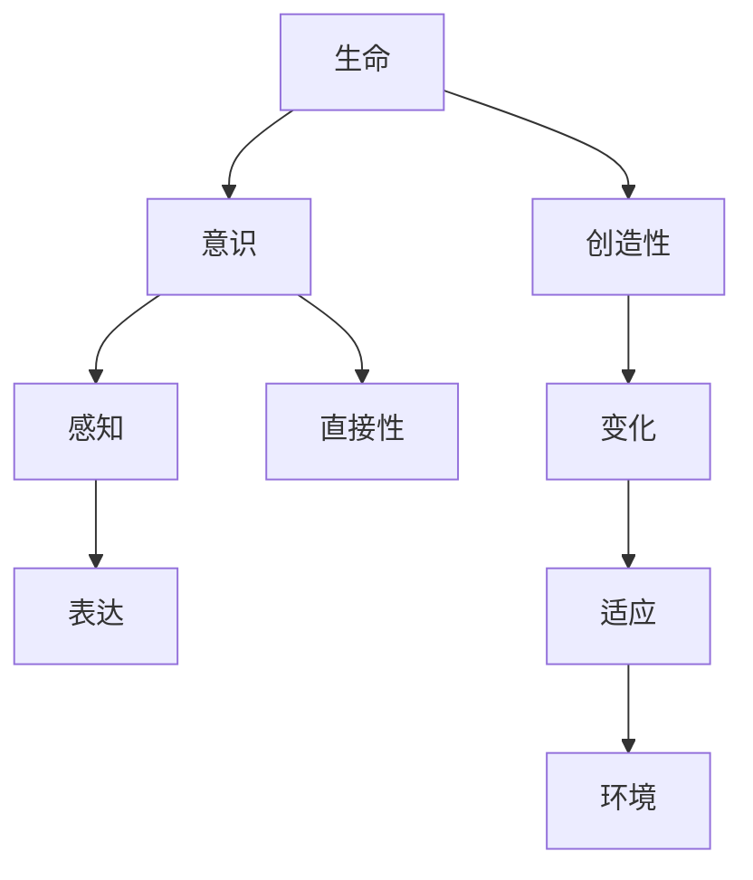

                 


### 准备工作

在开始撰写《自由与必然：柏格森与维特根斯坦的形而上学思考》之前，我们需要进行一系列准备工作。这些准备工作不仅包括对柏格森和维特根斯坦哲学思想的深入理解，还包括对文章结构和大纲的合理规划。以下是我们需要进行的步骤：

#### 1. 研究柏格森和维特根斯坦的哲学思想

首先，我们需要对柏格森和维特根斯坦的哲学思想进行深入研究。这包括：

- **柏格森的思想背景与核心概念**：研究柏格森的生平背景，了解他的主要著作和思想贡献，重点关注他的“生命冲动”、“时间的意识”和“直觉主义”等核心概念。
- **柏格森的形而上学观点**：深入分析柏格森的形而上学原理，特别是他的时间观、生命与意识的辩证关系，以及他对自由与必然的辩证统一的理解。

- **维特根斯坦的思想背景与核心概念**：研究维特根斯坦的生平背景，了解他的主要著作和思想贡献，重点关注他的“语言游戏理论”、“形而上学怀疑论”和“分析哲学的方法论”等核心概念。
- **维特根斯坦的形而上学观点**：深入分析维特根斯坦的形而上学批判，特别是他的语言观、对形而上学命题的质疑，以及他的伦理学与美学。

#### 2. 整理与柏格森和维特根斯坦思想相关的参考资料

在研究过程中，我们需要收集和整理大量的参考资料，包括柏格森和维特根斯坦的著作、相关学者的评论和解读、以及他们在哲学史上的影响等。这些资料将帮助我们更全面地理解他们的思想，并为撰写文章提供有力的支持。

#### 3. 设计文章结构和大纲

基于对柏格森和维特根斯坦哲学思想的深入研究，我们需要设计文章的结构和大纲。这包括：

- **文章目录大纲结构**：根据研究内容，设计合理的文章目录和大纲，确保文章结构清晰、逻辑性强。
- **章节标题**：为每个章节设计吸引读者的标题，突出核心内容和主题思想。
- **内容规划**：为每个章节的内容规划具体的内容，确保文章内容的丰富性和完整性。

#### 4. 确定文章的核心关键词和摘要

在完成准备工作后，我们需要确定文章的核心关键词和摘要。这些关键词和摘要将有助于读者快速了解文章的主题和核心内容。

### 总结

通过以上准备工作，我们为撰写《自由与必然：柏格森与维特根斯坦的形而上学思考》奠定了坚实的基础。接下来，我们将按照设计好的文章结构和大纲，逐步撰写和整理文章内容，确保文章的逻辑清晰、内容丰富、具有深度和思考。我们将使用markdown格式输出文章内容，并在文章末尾附上作者信息，以满足格式要求。

---

### 撰写大纲

在完成准备工作后，我们可以开始撰写文章的大纲。这个大纲将包括文章的各个章节标题、小节标题以及每个小节的主要内容。以下是文章的具体大纲：

#### 第一部分：柏格森的形而上学思考

### 第1章：柏格森的思想背景与核心概念

#### 1.1 柏格森的思想背景
- 柏格森的生平与哲学立场
- 柏格森哲学的主要贡献

#### 1.2 柏格森的核心概念
- 生命冲动（Lebensdrang）
- 时间的意识
- 直觉主义

#### 1.3 柏格森的形而上学观点
- 宇宙的动力学解释
- 心灵与物质的关系
- 自由与决定论

### 第2章：柏格森的形而上学原理

#### 2.1 柏格森的时间观
- 时间的本质与空间的关系
- 时间的流动与意识的作用
- 时间的辩证法

#### 2.2 生命与意识的辩证关系
- 生命作为创造性过程
- 意识与生命的关系
- 自由与必然的辩证统一

#### 2.3 柏格森的形而上学哲学体系
- 柏格森的宇宙观
- 柏格森的心灵观
- 柏格森的价值论

#### 第二部分：维特根斯坦的形而上学思考

### 第3章：维特根斯坦的思想背景与核心概念

#### 3.1 维特根斯坦的思想背景
- 维特根斯坦的生平与哲学立场
- 维特根斯坦哲学的主要贡献

#### 3.2 维特根斯坦的核心概念
- 语言游戏理论
- 形而上学怀疑论
- 分析哲学的方法论

### 第4章：维特根斯坦的形而上学观点

#### 4.1 维特根斯坦的语言观
- 语言与现实的对应关系
- 语言游戏的不同形式
- 语言游戏的局限性

#### 4.2 维特根斯坦的形而上学批判
- 对形而上学命题的质疑
- 对传统形而上学的反驳
- 形而上学的语言困境

#### 4.3 维特根斯坦的伦理学与美学
- 伦理学的相对主义与绝对主义
- 美学的基本问题
- 艺术与语言的关系

#### 第三部分：柏格森与维特根斯坦形而上学的比较与对话

### 第5章：柏格森与维特根斯坦的形而上学比较

#### 5.1 柏格森与维特根斯坦的相似之处
- 对形而上学的批判
- 对语言作用的认识

#### 5.2 柏格森与维特根斯坦的不同之处
- 对自由与必然的理解
- 对时间的解释

### 第6章：柏格森与维特根斯坦的对话

#### 6.1 柏格森与维特根斯坦的交流
- 他们如何影响彼此的思想
- 他们如何回应对方的观点

#### 6.2 柏格森与维特根斯坦对话的启示
- 对现代哲学的启示
- 对我们理解世界的启示

### 第7章：结论

#### 7.1 柏格森与维特根斯坦形而上学的综合评价
- 他们对现代哲学的贡献
- 他们的思想对我们理解自由与必然的意义

#### 7.2 未来研究方向
- 柏格森与维特根斯坦思想的新发展
- 对形而上学的未来探讨

#### 7.3 对读者的启示
- 如何从他们的思想中汲取智慧
- 在当代社会中如何应用柏格森与维特根斯坦的形而上学思考。

---

通过以上大纲，我们可以清晰地看到文章的结构和内容安排。接下来，我们将按照这个大纲逐步撰写每个章节的内容，确保文章的逻辑清晰、内容丰富、具有深度和思考。

---

### 文章标题和关键词

### 《自由与必然：柏格森与维特根斯坦的形而上学思考》

> 关键词：柏格森，维特根斯坦，形而上学，自由，必然，时间观，语言游戏，生命冲动，直觉主义，分析哲学，辩证统一，现代哲学

### 摘要

本文旨在深入探讨法国哲学家柏格森和奥地利哲学家维特根斯坦的形而上学思考，特别是他们对自由与必然的辩证关系及其在时间和意识领域的观点。通过对柏格森和维特根斯坦的核心概念和思想体系的分析，本文揭示了他们在哲学领域的独特贡献，并对他们之间的相似和差异进行了详细比较。此外，本文还探讨了柏格森与维特根斯坦思想在当代哲学中的启示，以及如何将这些思想应用于现代社会的实际问题。通过这一系列探讨，本文旨在为读者提供一个全面、深入的哲学思考框架，以更好地理解自由与必然这一重要哲学问题。

---

### 第一部分：柏格森的形而上学思考

### 第1章：柏格森的思想背景与核心概念

#### 1.1 柏格森的思想背景

亨利·柏格森（Henri Bergson，1859-1941）是20世纪法国最杰出的哲学家之一，他的思想对现代哲学产生了深远的影响。柏格森出生于法国巴黎，他的家族在文学和学术领域有深厚的背景。柏格森在巴黎高等师范学校学习期间，深受实证主义和进化论的影响。后来，他进入巴黎大学学习法律，但最终选择了哲学作为自己的职业。他的早期著作《时间与自由意志》（L'Évolution créatrice，1907）和《物质与记忆》（Matière et mémoire，1896）奠定了他在哲学界的地位。

柏格森的哲学思想主要关注生命、时间、自由意志和创造力。他认为，生命是一种不断进化和发展的过程，是一种内在的、不断涌现的力量。时间在他看来不仅是物理上的度量，更是一种主观的、流动的意识体验。他的哲学思想对心理学、生物学、哲学和文学等多个领域产生了重要影响。

#### 1.2 柏格森的核心概念

柏格森的哲学体系包含多个核心概念，其中最为重要的是“生命冲动”（Lebensdrang）和“直觉主义”（Intuitionism）。

- **生命冲动**：柏格森认为，生命冲动是一种内在的、推动生命不断进化和发展的力量。这种力量是非线性的、动态的，而不是静态的或机械的。生命冲动是生命本质的体现，它是创造力的源泉。柏格森认为，生命冲动通过“绵延”（Duration）表现出来，绵延是时间的本质，是生命不断变化的过程。

- **直觉主义**：柏格森的直觉主义是他对知识获取方式的一种哲学理论。他认为，科学的方法并不能完全揭示现实世界的本质，因为科学方法依赖于逻辑和数学，而逻辑和数学只是对现实的抽象和简化。柏格森主张，真正的知识应该通过直觉获得，直觉是一种直接感受和理解现实的能力。直觉能够捕捉到生命的流动性和复杂性，超越科学方法的局限性。

#### 1.3 柏格森的形而上学观点

柏格森的形而上学观点主要涉及宇宙的动力学解释、心灵与物质的关系，以及他对自由与决定论的辩证统一的理解。

- **宇宙的动力学解释**：柏格森认为，宇宙的本质是生命的不断流动和发展，而不是静态的物质。他提出了“生命冲动”的概念，认为这种冲动是宇宙进化和发展的驱动力。宇宙中的所有现象，包括物理现象和生命现象，都是这种生命冲动在不同层次上的体现。

- **心灵与物质的关系**：柏格森认为，心灵与物质是不可分割的。心灵不是独立于物质的存在，而是物质的一种特殊状态。他认为，意识是物质在高度组织化状态下的一种表现，是物质复杂性的结果。因此，心灵与物质之间的关系是一种内在的、相互依存的关系。

- **自由与决定论的辩证统一**：柏格森认为，自由与决定论不是对立的，而是辩证统一的。他认为，自由是在必然性的框架内实现的。必然性是宇宙中事物发展的规律，而自由是在这种规律中的自我创造。自由是通过直觉和对生命冲动的理解来实现的，而不是简单地摆脱必然性的束缚。

### 小结

本章对柏格森的思想背景和核心概念进行了介绍，并详细探讨了柏格森的形而上学观点。通过本章的讨论，我们可以看到柏格森的哲学思想对现代哲学的深远影响，他的生命冲动、直觉主义和辩证统一的观点为理解宇宙、心灵与物质的关系提供了独特的视角。

---

#### 第1章：柏格森的思想背景与核心概念

#### 1.1 柏格森的思想背景

亨利·柏格森（Henri Bergson，1859-1941）是20世纪法国最杰出的哲学家之一，他的思想对现代哲学产生了深远的影响。柏格森出生于法国巴黎，他的家族在文学和学术领域有深厚的背景。柏格森在巴黎高等师范学校学习期间，深受实证主义和进化论的影响。后来，他进入巴黎大学学习法律，但最终选择了哲学作为自己的职业。他的早期著作《时间与自由意志》（L'Évolution créatrice，1907）和《物质与记忆》（Matière et mémoire，1896）奠定了他在哲学界的地位。

柏格森的哲学思想主要关注生命、时间、自由意志和创造力。他认为，生命是一种不断进化和发展的过程，是一种内在的、不断涌现的力量。时间在他看来不仅是物理上的度量，更是一种主观的、流动的意识体验。他的哲学思想对心理学、生物学、哲学和文学等多个领域产生了重要影响。

#### 1.2 柏格森的核心概念

柏格森的哲学体系包含多个核心概念，其中最为重要的是“生命冲动”（Lebensdrang）和“直觉主义”（Intuitionism）。

- **生命冲动**：柏格森认为，生命冲动是一种内在的、推动生命不断进化和发展的力量。这种力量是非线性的、动态的，而不是静态的或机械的。生命冲动是生命本质的体现，它是创造力的源泉。柏格森认为，生命冲动通过“绵延”（Duration）表现出来，绵延是时间的本质，是生命不断变化的过程。

- **直觉主义**：柏格森的直觉主义是他对知识获取方式的一种哲学理论。他认为，科学的方法并不能完全揭示现实世界的本质，因为科学方法依赖于逻辑和数学，而逻辑和数学只是对现实的抽象和简化。柏格森主张，真正的知识应该通过直觉获得，直觉是一种直接感受和理解现实的能力。直觉能够捕捉到生命的流动性和复杂性，超越科学方法的局限性。

#### 1.3 柏格森的形而上学观点

柏格森的形而上学观点主要涉及宇宙的动力学解释、心灵与物质的关系，以及他对自由与决定论的辩证统一的理解。

- **宇宙的动力学解释**：柏格森认为，宇宙的本质是生命的不断流动和发展，而不是静态的物质。他提出了“生命冲动”的概念，认为这种冲动是宇宙进化和发展的驱动力。宇宙中的所有现象，包括物理现象和生命现象，都是这种生命冲动在不同层次上的体现。

- **心灵与物质的关系**：柏格森认为，心灵与物质是不可分割的。心灵不是独立于物质的存在，而是物质的一种特殊状态。他认为，意识是物质在高度组织化状态下的一种表现，是物质复杂性的结果。因此，心灵与物质之间的关系是一种内在的、相互依存的关系。

- **自由与决定论的辩证统一**：柏格森认为，自由与决定论不是对立的，而是辩证统一的。他认为，自由是在必然性的框架内实现的。必然性是宇宙中事物发展的规律，而自由是在这种规律中的自我创造。自由是通过直觉和对生命冲动的理解来实现的，而不是简单地摆脱必然性的束缚。

#### 1.4 柏格森哲学的影响

柏格森的哲学思想对现代哲学、科学和艺术产生了深远的影响。他的生命冲动和直觉主义概念为后来的哲学家提供了新的视角，影响了存在主义、现象学和结构主义等哲学流派。在科学领域，柏格森的思想对生物学和心理学产生了重要影响，推动了生物进化论和心理动力学的发展。在艺术领域，柏格森的思想影响了现代艺术运动，特别是抽象艺术和表现主义。

#### 小结

本章对柏格森的思想背景和核心概念进行了介绍，并详细探讨了柏格森的形而上学观点。通过本章的讨论，我们可以看到柏格森的哲学思想对现代哲学的深远影响，他的生命冲动、直觉主义和辩证统一的观点为理解宇宙、心灵与物质的关系提供了独特的视角。

---

#### 第2章：柏格森的形而上学原理

在第一章中，我们介绍了柏格森的思想背景和核心概念。在这一章中，我们将深入探讨柏格森的形而上学原理，特别是他的时间观、生命与意识的辩证关系，以及他对自由与必然的辩证统一的理解。

### 2.1 柏格森的时间观

柏格森的时间观是他哲学体系中的核心组成部分。他反对传统的物理学时间观念，即时间是一个均匀流逝的线性过程。柏格森认为，这种观念忽略了时间的主观体验和生命的动态性。他提出了“绵延”（Duration）的概念，这是他对时间本质的深刻理解。

**绵延**是柏格森对时间本质的描述，它不仅仅是物理时间的延续，而是一种内在的、连续的意识体验。在柏格森看来，时间是生命的流动，是生命的绵延。这种流动是动态的、非线性的，它包含了生命的创造性和多样性。以下是柏格森对时间观的几条基本原理：

- **时间的非均匀性**：柏格森认为，时间并不是均匀的，而是随着生命过程的变化而变化的。不同的人在不同的生命阶段体验到的“时间”是不同的，这是因为他们的生命过程不同。

- **时间的深度**：柏格森强调时间的深度，即时间不仅仅是线性的延续，还包括过去和未来的潜力。时间是一种多维的结构，它包含了过去、现在和未来。

- **时间的直觉性**：柏格森认为，时间是一种直觉体验，而不是可以被逻辑或数学完全描述的客观现象。直觉能够捕捉到时间的流动性和生命的深度。

**伪代码：**

```python
def understand_time():
    """
    理解柏格森的时间观
    """
    # 描述时间的非均匀性
    print("时间不是均匀的，而是随生命过程变化的。")

    # 描述时间的深度
    print("时间包含了过去、现在和未来的潜力。")

    # 描述时间的直觉性
    print("时间是一种直觉体验，而不是客观现象。")
```

### 2.2 生命与意识的辩证关系

柏格森认为，生命与意识是不可分割的。他的观点强调了生命的创造性和意识的直接性。以下是柏格森关于生命与意识的辩证关系的几个核心观点：

- **生命的创造性**：柏格森认为，生命是一种不断创造和变化的过程。生命不是静态的存在，而是动态的、不断进化的。生命通过不断的创新和变化来适应环境。

- **意识的直接性**：柏格森认为，意识是一种直接的、非概念性的体验。意识不是通过逻辑或语言来理解的，而是通过直觉来感知的。直觉是理解生命和世界的最佳方式。

- **生命与意识的关系**：柏格森认为，生命是意识的基础，意识是生命的体现。生命通过意识来感知和表达自己，而意识通过生命来体验和创造。

**Mermaid 流程图：**



### 2.3 自由与必然的辩证统一

柏格森对自由与必然的关系有着独特的理解。他认为，自由与必然不是对立的，而是辩证统一的。以下是柏格森关于自由与必然辩证统一的核心观点：

- **自由在必然性中**：柏格森认为，自由并不是摆脱必然性的束缚，而是在必然性的框架内实现的。必然性是宇宙中事物发展的规律，而自由是在这些规律中的自我创造。

- **自由与创造的统一**：柏格森认为，自由与创造是统一的。自由是通过创造来实现的，创造是自由的表现形式。在创造过程中，人们可以自由地表达自己的意愿和创造力。

- **自由与社会的统一**：柏格森认为，自由与社会是统一的。自由不仅是个体的自由，也是社会的自由。社会应该提供一个环境，使个体能够自由地实现自己的潜能。

**数学模型和公式：**

柏格森提出了一个关于自由与必然的辩证统一模型，可以用以下数学公式来表示：

$$
自由 = f(必然性, 创造力)
$$

在这个公式中，自由是必然性和创造力的函数。必然性提供了自由实现的框架，而创造力是实现自由的关键因素。

**详细讲解与举例说明：**

假设一个社会环境中，个体拥有一定的自由，但同时受到必然性的约束。在这种情况下，个体的自由可以通过以下方式实现：

- **自我认识**：个体需要认识自己的潜能和创造力，这是实现自由的前提条件。
- **社会支持**：社会应该提供一个支持环境，使个体能够自由地实现自己的潜能。
- **创造力发挥**：个体需要发挥自己的创造力，通过创新和创造来实现自由。

**举例说明：**

在一个开放的社会环境中，一个年轻的艺术家可能会有很多机会来表达自己的创造力。这个艺术家可以通过绘画、音乐或其他艺术形式来表达自己的思想和情感，实现自己的自由。同时，这个社会环境提供了必要的支持和资源，使艺术家能够自由地追求自己的艺术梦想。

### 小结

本章详细探讨了柏格森的形而上学原理，包括他的时间观、生命与意识的辩证关系，以及他对自由与必然的辩证统一的理解。通过这些原理，柏格森为理解宇宙、生命和人类意识提供了独特的视角。这些原理不仅丰富了哲学思想，也为人类认识世界提供了新的方法和思路。

---

### 2.3 柏格森的形而上学哲学体系

在探讨了柏格森的时间观、生命与意识的辩证关系以及自由与必然的辩证统一之后，我们接下来将深入分析柏格森的形而上学哲学体系。这一体系包括宇宙观、心灵观和价值论三个方面，这些方面共同构成了柏格森哲学的完整框架。

#### 2.3.1 柏格森的宇宙观

柏格森的宇宙观基于他对生命和创造力的理解。他认为，宇宙的本质是生命的不断流动和发展，而不是静态的物质。这种观点与传统的物质宇宙观形成了鲜明对比。柏格森将宇宙视为一个动态的系统，其中每个元素都在不断地创造和变化。

柏格森提出了“生命冲动”（Lebensdrang）的概念，这是他宇宙观的核心。生命冲动是一种内在的、推动生命不断进化和发展的力量。这种力量是非线性的、动态的，而不是静态的或机械的。宇宙中的所有现象，包括物理现象和生命现象，都是这种生命冲动在不同层次上的体现。

**伪代码：**

```python
def understand_universe():
    """
    理解柏格森的宇宙观
    """
    print("宇宙的本质是生命的不断流动和发展。")
    print("生命冲动是宇宙进化和发展的驱动力。")
```

**举例说明：**

假设我们观察一颗正在成长的树木，从种子发芽到成长为参天大树，这个过程体现了生命的流动和创造力。在这个过程中，树木不断地吸收养分，通过光合作用和细胞分裂来生长。这种生命的流动和发展正是柏格森所说的生命冲动。

#### 2.3.2 柏格森的心灵观

柏格森的心灵观强调了意识的直接性和创造性。他认为，心灵不是独立于物质的存在，而是物质的一种特殊状态。意识是物质在高度组织化状态下的一种表现，是物质复杂性的结果。因此，心灵与物质之间的关系是一种内在的、相互依存的关系。

柏格森认为，意识是一种直接的、非概念性的体验。直觉是理解生命和世界的最佳方式，而不是通过逻辑或语言。他认为，直觉能够捕捉到生命的流动性和复杂性，超越科学方法的局限性。

**伪代码：**

```python
def understand_soul():
    """
    理解柏格森的心灵观
    """
    print("心灵是物质的一种特殊状态。")
    print("意识是物质复杂性的结果。")
    print("直觉是理解生命和世界的最佳方式。")
```

**举例说明：**

当我们在森林中散步时，我们能够直接感受到大自然的美妙和生命的力量。这种感受不是通过逻辑推理或语言表达，而是通过直觉。我们能够感受到树叶的微动、鸟儿的歌唱和阳光的温暖，这些都是直觉的体验。

#### 2.3.3 柏格森的价值论

柏格森的价值论关注生命、自由和创造的价值。他认为，生命的价值在于它的创造性和多样性。自由的价值在于它允许个体在必然性的框架内实现自己的潜能。创造的价值在于它推动了生命的进化和进步。

柏格森认为，价值不是客观存在的，而是主观体验的。每个人对价值的理解和追求都是不同的，因为他们的生命体验和创造力是独特的。

**伪代码：**

```python
def understand_values():
    """
    理解柏格森的价值论
    """
    print("生命的价值在于创造性和多样性。")
    print("自由的价值在于实现个体潜能。")
    print("创造的价值在于推动生命进化和进步。")
```

**举例说明：**

一个艺术家通过绘画来表达自己的情感和思想，这种创造行为对他来说具有极高的价值。对他来说，绘画不仅是一种艺术形式，更是他自由表达和创造力体现的方式。同样，对于一位科学家，他的研究成果对他的价值来说也具有重要意义，因为这是他自由思考和创造力的结果。

#### 小结

通过分析柏格森的宇宙观、心灵观和价值论，我们可以看到他的形而上学哲学体系的完整性和深度。这些方面共同构成了他对宇宙、心灵和价值的基本理解，为我们提供了独特的视角来审视世界和人生。柏格森的思想不仅丰富了哲学理论，也为人类认识世界提供了新的思路和方法。

---

### 第二部分：维特根斯坦的形而上学思考

#### 第3章：维特根斯坦的思想背景与核心概念

### 3.1 维特根斯坦的思想背景

路德维希·维特根斯坦（Ludwig Wittgenstein，1889-1951）是20世纪最具影响力的哲学家之一，他的思想对现代哲学产生了深远的影响。维特根斯坦出生于奥地利，后来移居英国。他的哲学思想经历了两个主要阶段：早期以《逻辑哲学论》（Tractatus Logico-Philosophicus，1921）为代表，晚期以《哲学研究》（Philosophical Investigations，1953）为代表。

维特根斯坦的早年生活受到家庭背景的深刻影响。他的父亲是一位成功的商人，母亲则是一位具有文化素养的女性。维特根斯坦在中学时代表现出了卓越的数学天赋，但后来他对数学的兴趣逐渐转向哲学。他在剑桥大学学习期间，受到 Bertrand Russell 的影响，开始了他的哲学研究。他的早期著作《逻辑哲学论》以严格的逻辑分析和对语言本质的探讨著称，而他的晚期著作《哲学研究》则更加关注日常语言的用法和哲学问题的实际解决。

### 3.2 维特根斯坦的核心概念

维特根斯坦的哲学思想围绕几个核心概念展开，其中最重要的是“语言游戏理论”（Language Game Theory）、“形而上学怀疑论”（Metaphysical Skepticism）和“分析哲学的方法论”（Analytic Philosophy Methodology）。

- **语言游戏理论**：维特根斯坦认为，语言的使用与游戏类似，不同的语言游戏有不同的规则和目的。语言游戏理论强调语言的实际使用场景和具体语境，而不是抽象的、脱离实际的意义。维特根斯坦提出了“日常语言”（Ordinary Language）的概念，认为哲学问题往往源于对日常语言使用的不当理解。

- **形而上学怀疑论**：维特根斯坦对形而上学命题持怀疑态度，认为大多数形而上学问题实际上是没有意义的。他提出了“私人感受”（Private Experience）和“形而上学困境”（Metaphysical Predicament）的概念，认为私人感受无法用语言准确描述，而形而上学问题则往往陷入无意义的争论。

- **分析哲学的方法论**：维特根斯坦是分析哲学的重要代表，他主张通过分析语言来理解哲学问题。分析哲学强调对语言和概念的分析，认为哲学问题可以通过对语言使用方式的澄清来解决。维特根斯坦的方法论对后来的哲学研究和教育产生了深远影响。

### 3.3 维特根斯坦的哲学贡献

维特根斯坦的哲学贡献主要体现在以下几个方面：

- **对逻辑和语言本质的探讨**：《逻辑哲学论》中，维特根斯坦提出了逻辑原子主义和世界图景理论，试图用逻辑来描述现实世界。他强调逻辑和语言在知识获取中的作用，提出了“世界是事实的总和”的观点。

- **日常语言哲学**：在《哲学研究》中，维特根斯坦转向日常语言哲学，主张通过分析日常语言来理解哲学问题。他认为，哲学问题往往源于对语言使用的不当理解，通过澄清日常语言的使用，可以解决许多哲学问题。

- **对形而上学的批判**：维特根斯坦对形而上学命题持怀疑态度，认为大多数形而上学问题是没有意义的。他提出了“形而上学困境”的概念，认为形而上学问题往往陷入无意义的争论。

### 小结

本章对维特根斯坦的思想背景和核心概念进行了介绍，并详细探讨了他在哲学领域的主要贡献。维特根斯坦的思想以其独特的方法和深刻的见解而著称，对现代哲学产生了深远的影响。通过本章的讨论，我们可以更好地理解维特根斯坦的哲学思想，并认识到他在现代哲学中的重要地位。

---

### 第4章：维特根斯坦的形而上学观点

在第3章中，我们介绍了维特根斯坦的思想背景和核心概念。在这一章中，我们将深入探讨维特根斯坦的形而上学观点，特别是他的语言观、对形而上学命题的质疑，以及他的伦理学与美学。

### 4.1 维特根斯坦的语言观

维特根斯坦的语言观是他哲学体系中的核心组成部分。他认为，语言不仅是沟通的工具，更是理解世界的方式。他的语言观主要体现在以下几个方面：

- **语言游戏理论**：维特根斯坦提出了“语言游戏理论”，认为语言的使用与游戏类似，不同的语言游戏有不同的规则和目的。语言游戏理论强调语言的实际使用场景和具体语境，而不是抽象的、脱离实际的意义。维特根斯坦认为，理解语言的真正含义需要关注语言在实际生活中的具体应用。

- **日常语言**：维特根斯坦主张关注“日常语言”，即人们在日常生活中实际使用的语言。他认为，哲学问题往往源于对日常语言使用的不当理解。通过澄清日常语言的使用，可以解决许多哲学问题。

- **语言与世界的关系**：维特根斯坦认为，语言与世界的关系是描述性的，语言是用来描述世界的。然而，这种描述并不是直接对应的关系，而是通过一系列符号和规则来实现的。语言是一种工具，它帮助我们理解和表达世界。

**伪代码：**

```python
def understand_language():
    """
    理解维特根斯坦的语言观
    """
    print("语言游戏理论强调语言的实际使用场景和具体语境。")
    print("日常语言是人们在日常生活中实际使用的语言。")
    print("语言与世界的关系是描述性的，通过符号和规则实现。")
```

**举例说明：**

假设我们使用“苹果”这个词，它的含义并不是抽象的，而是具体的。当我们说“我吃了一个苹果”时，我们不仅仅是在描述一个苹果，而是通过这个具体的例子来理解“苹果”这个词的含义。这种理解方式体现了维特根斯坦的语言观。

### 4.2 维特根斯坦对形而上学命题的质疑

维特根斯坦对形而上学命题持怀疑态度，认为大多数形而上学问题是没有意义的。他的质疑主要体现在以下几个方面：

- **私人感受**：维特根斯坦认为，私人感受无法用语言准确描述。他认为，私人感受是个体内心深处的体验，与外在世界没有直接的联系。因此，关于私人感受的形而上学问题是没有意义的。

- **形而上学困境**：维特根斯坦提出了“形而上学困境”的概念，认为形而上学问题往往陷入无意义的争论。他认为，许多形而上学问题实际上是由于对语言使用的不当理解而产生的。

- **分析哲学的方法**：维特根斯坦主张通过分析语言来理解哲学问题，而不是直接探讨形而上学问题。他认为，通过澄清日常语言的使用，可以避免陷入形而上学的困境。

**伪代码：**

```python
def criticize_metaphysics():
    """
    质疑形而上学命题
    """
    print("私人感受无法用语言准确描述。")
    print("形而上学问题往往陷入无意义的争论。")
    print("通过分析语言来理解哲学问题，避免陷入形而上学困境。")
```

**举例说明：**

当我们探讨“灵魂”这一概念时，我们可能会陷入形而上学的争论。一些人认为灵魂是存在的，而另一些人则认为它是不可知的。这种争论往往是没有意义的，因为灵魂是一个私人感受的概念，无法用语言准确描述。通过维特根斯坦的分析哲学方法，我们可以更好地理解这种争论的根源。

### 4.3 维特根斯坦的伦理学与美学

维特根斯坦的伦理学与美学思想是他哲学体系的重要组成部分。他认为，伦理学和美学问题与语言和意义密切相关。

- **伦理学**：维特根斯坦认为，伦理学问题并非关于客观存在的道德法则，而是关于个人的行为和态度。他认为，道德价值不是通过逻辑推理得出的，而是通过个人的情感体验和行动体现的。

- **美学**：维特根斯坦认为，美学问题与语言和表达密切相关。他认为，艺术作品的意义不仅仅在于其外观，更在于其与观众的情感共鸣。

**伪代码：**

```python
def understand_ethics_and_arts():
    """
    理解维特根斯坦的伦理学与美学
    """
    print("伦理学问题与个人的行为和态度密切相关。")
    print("美学问题与语言和表达密切相关。")
```

**举例说明：**

当我们欣赏一幅画作时，我们不仅仅是观察其外观，更是在体验其表达的情感和意义。这种体验体现了维特根斯坦的美学思想，即艺术作品的意义在于其与观众的情感共鸣。

### 小结

通过分析维特根斯坦的形而上学观点，我们可以看到他对语言、形而上学命题、伦理学和美学的独特见解。他的语言游戏理论、对形而上学命题的质疑，以及他对伦理学和美学的理解，为现代哲学提供了新的视角和方法。这些观点不仅丰富了哲学理论，也为我们理解世界和人类生活提供了深刻的启示。

---

### 第4章：维特根斯坦的形而上学观点

#### 4.1 维特根斯坦的语言观

维特根斯坦的语言观是他对哲学问题进行探讨的核心。他主张，语言不仅仅是一种交流工具，更是一种理解世界的方式。维特根斯坦认为，语言的使用是多种多样的，每种使用方式都有其特定的规则和功能。他将语言的使用比作游戏，不同的游戏有不同的规则，这些规则定义了游戏的玩法和目标。因此，维特根斯坦提出了“语言游戏”（language game）的概念，用以描述语言的各种使用场景。

**语言游戏理论**：

- **日常语言游戏**：这是维特根斯坦最关注的一种语言游戏，它涵盖了我们在日常生活中使用语言的各种方式。例如，当我们说“我饿了”时，我们是在表达一个具体的生理需求，这种表达方式遵循日常语言游戏的规则。

- **科学语言游戏**：科学语言游戏是维特根斯坦讨论的另一重要方面。在科学领域，语言被用来描述自然现象和进行理论构建。科学语言游戏要求语言的精确性和逻辑性，以确保科学理论的可验证性和可预测性。

- **艺术语言游戏**：艺术语言游戏是维特根斯坦对艺术作品进行解读的一种方式。在艺术作品中，语言被用来表达情感和思想，创造新的意义和体验。

**伪代码：**

```python
def language_game(type):
    """
    模拟不同的语言游戏
    """
    if type == "日常":
        print("日常语言游戏：'我饿了'表达具体的生理需求。")
    elif type == "科学":
        print("科学语言游戏：'能量守恒定律'描述自然现象。")
    elif type == "艺术":
        print("艺术语言游戏：'蒙娜丽莎的微笑'表达情感和思想。")
```

**举例说明**：

假设我们说“椅子”这个词，它在不同的语言游戏中可能有不同的含义。在日常语言中，“椅子”指的是我们用来坐的家具；在科学语言中，“椅子”可能指的是一种实验装置；在艺术语言中，“椅子”可能成为艺术家表达情感和思想的媒介。

#### 4.2 维特根斯坦对形而上学命题的质疑

维特根斯坦对形而上学命题持强烈的怀疑态度。他认为，许多传统的形而上学问题实际上是没有意义的，因为它们超出了语言和经验的范围。维特根斯坦提出了“私人感受”和“形而上学困境”的概念来解释他对形而上学命题的质疑。

**私人感受**：

维特根斯坦认为，私人感受（如痛苦、快乐等）是无法用语言准确描述的。这些感受是个体内心深处的体验，无法直接对外界表达。因此，关于私人感受的形而上学问题（如“意识本质是什么？”）是没有意义的，因为它们无法通过语言和逻辑来探讨。

**形而上学困境**：

维特根斯坦认为，许多形而上学问题（如“世界的本质是什么？”、“上帝是否存在？”）陷入了“形而上学困境”。这些问题的答案无法通过经验和逻辑得到，而是依赖于未经检验的假设和概念。因此，维特根斯坦主张，我们应该避免这些问题，因为它们是没有意义的。

**伪代码：**

```python
def metaphysical_dilemma(question):
    """
    检查形而上学问题是否陷入困境
    """
    if question == "意识本质":
        print("私人感受无法用语言准确描述，因此这个问题陷入困境。")
    elif question == "世界本质":
        print("这个问题依赖于未经检验的假设，因此陷入困境。")
```

**举例说明**：

当我们探讨“意识本质”时，我们往往会遇到困难，因为意识是一个私人感受的概念，无法用语言准确描述。同样，探讨“世界的本质”时，我们也可能遇到类似的困境，因为这个问题依赖于我们对世界的未经检验的假设。

#### 4.3 维特根斯坦的伦理学与美学

维特根斯坦的伦理学与美学思想与他的语言观紧密相关。他认为，伦理学和美学问题与语言和意义密切相关。维特根斯坦的伦理学观点强调个人的行为和态度，而不是抽象的道德法则。他认为，道德价值是通过个人的行为和态度体现出来的，而不是通过逻辑推理得出的。

**伦理学**：

维特根斯坦认为，伦理学问题并非关于客观存在的道德法则，而是关于个人的行为和态度。他认为，道德价值不是通过逻辑推理得出的，而是通过个人的情感体验和行动体现的。例如，当我们说一个人是“善良”的，我们实际上是在描述他的行为和态度，而不是在给出一个抽象的定义。

**美学**：

维特根斯坦认为，美学问题与语言和表达密切相关。他认为，艺术作品的意义不仅仅在于其外观，更在于其与观众的情感共鸣。例如，当我们欣赏一幅画作时，我们不仅仅是观察其颜色和形状，更是在体验其表达的情感和思想。

**伪代码：**

```python
def ethics_and_arts(action, work):
    """
    评估个人行为和艺术作品的意义
    """
    if action == "善良行为":
        print("伦理学：善良行为体现了个人的道德价值。")
    elif action == "欣赏画作":
        print("美学：艺术作品的意义在于与观众的情感共鸣。")
```

**举例说明**：

当我们说一个人是“善良”的，我们实际上是在描述他的行为和态度，而不是在给出一个抽象的定义。同样，当我们欣赏一幅画作时，我们不仅仅是观察其颜色和形状，更是在体验其表达的情感和思想。

### 小结

通过分析维特根斯坦的形而上学观点，我们可以看到他对语言、形而上学命题、伦理学和美学的独特见解。他的语言游戏理论、对形而上学命题的质疑，以及他对伦理学和美学的理解，为现代哲学提供了新的视角和方法。这些观点不仅丰富了哲学理论，也为我们理解世界和人类生活提供了深刻的启示。

---

### 第5章：柏格森与维特根斯坦的形而上学比较

在前面两章中，我们分别探讨了柏格森和维特根斯坦的形而上学思想。在这一章中，我们将深入比较他们的观点，找出他们在形而上学领域中的相似和不同之处，并分析这些差异背后的原因。

#### 5.1 相似之处

**对形而上学的批判**：

柏格森和维特根斯坦都对形而上学持有批判态度。他们认为，传统的形而上学问题往往陷入无意义的争论，无法提供真正的知识。这种批判主要体现在以下几个方面：

- **语言和现实的界限**：他们都认为，形而上学命题常常超越了语言的界限，试图探讨那些无法用语言准确描述的实体和概念。例如，柏格森对时间本质的探讨，维特根斯坦对私人感受的质疑，都是对形而上学命题语言性的批判。

- **逻辑和数学的限制**：柏格森和维特根斯坦都认为，逻辑和数学不能完全揭示现实世界的本质。柏格森的直觉主义强调直觉对理解现实的重要性，而维特根斯坦的语言游戏理论则认为，语言的实际使用场景比逻辑和数学更能反映现实。

**对语言的重视**：

柏格森和维特根斯坦都非常重视语言在哲学思考中的作用。他们认为，语言不仅是沟通的工具，更是理解世界的方式。他们的观点主要体现在以下几个方面：

- **日常语言的使用**：他们都强调日常语言在日常生活中的重要性。柏格森认为，哲学问题往往源于对日常语言使用的不当理解，而维特根斯坦则主张通过分析日常语言来澄清哲学问题。

- **语言的局限性**：他们都认识到语言在表达和描述现实时的局限性。柏格森认为，直觉能够捕捉到生命的流动性和复杂性，超越科学方法的局限性；而维特根斯坦则认为，语言游戏的不同形式决定了语言的使用场景和功能。

#### 5.2 不同之处

**对自由与必然的理解**：

柏格森和维特根斯坦在自由与必然的关系上有着不同的观点。柏格森认为，自由是在必然性的框架内实现的，自由与必然是辩证统一的。他强调生命的创造性和直觉的重要性，认为自由是通过直觉和对生命冲动的理解来实现的。

维特根斯坦则认为，自由与必然是分离的。他主张，自由是在现实条件下的自我创造，而不是在必然性的束缚之外。他认为，哲学问题往往源于对自由和必然关系的误解，这种误解导致了对形而上学的追求。

**时间观的差异**：

柏格森和维特根斯坦对时间也有不同的理解。柏格森认为，时间是生命的流动，是主观的、非均匀的。他强调时间的深度和直觉性，认为时间是一种内在的意识体验。

维特根斯坦则认为，时间是一种逻辑结构，是客观的、均匀的。他认为，时间是我们通过语言和逻辑来理解世界的方式，而不是一种内在的体验。

#### 5.3 原因分析

**背景和哲学立场**：

柏格森和维特根斯坦的哲学立场和背景是导致他们形而上学观点差异的重要原因。柏格森的哲学深受生物学和心理学的影响，他关注生命的动态性和创造性。维特根斯坦则受到逻辑实证主义和语言哲学的影响，他关注语言的使用和逻辑的结构。

**关注点不同**：

柏格森和维特根斯坦在哲学上的关注点也不同。柏格森更关注生命、时间和自由等概念，试图从动态的角度理解宇宙和人类意识。维特根斯坦则更关注语言、逻辑和现实的关系，试图通过分析语言来澄清哲学问题。

**文化和社会背景**：

柏格森和维特根斯坦生活在不同的文化和社会背景下，这也影响了他们的哲学观点。柏格森的哲学深受法国文化的影响，强调个体和自由的独特价值。维特根斯坦的哲学则受到英国文化的影响，强调逻辑和科学的精确性。

### 小结

通过比较柏格森和维特根斯坦的形而上学观点，我们可以看到他们在对形而上学批判、语言重视、自由与必然的理解以及时间观等方面的相似和不同之处。这些差异不仅反映了他们哲学思想的独特性，也为我们理解现代哲学的发展提供了有益的启示。通过分析这些差异的原因，我们可以更好地理解柏格森和维特根斯坦在哲学史上的地位和贡献。

---

### 第6章：柏格森与维特根斯坦的对话

在本章中，我们将探讨柏格森与维特根斯坦的哲学对话，分析他们之间的交流和相互影响，并探讨这种对话对现代哲学的启示。

#### 6.1 柏格森与维特根斯坦的交流

柏格森和维特根斯坦虽然生活在不同的时代，但他们的哲学观点在某些方面有相似之处，这种相似性促使他们进行哲学上的对话。柏格森的直觉主义和维特根斯坦的语言游戏理论在某种程度上是对彼此思想的回应。

**柏格森对维特根斯坦的回应**：

柏格森对维特根斯坦的语言游戏理论持有一定的批评态度。他认为，维特根斯坦过于强调语言的局限性，忽视了直觉在理解现实世界中的作用。柏格森认为，直觉能够捕捉到生命的流动性和复杂性，这种直觉体验是科学方法无法完全揭示的。

**维特根斯坦对柏格森的回应**：

维特根斯坦则对柏格森的直觉主义持有保留意见。他认为，柏格森的直觉主义可能导致形而上学的泛滥，因为直觉体验本身是主观的，难以用语言准确描述。维特根斯坦主张通过分析日常语言来澄清哲学问题，避免陷入无意义的争论。

#### 6.2 他们如何影响彼此的思想

柏格森和维特根斯坦在彼此的思想中找到了灵感，这种相互影响在一定程度上丰富了他们的哲学体系。

**柏格森对维特根斯坦的影响**：

柏格森的思想对维特根斯坦的早期哲学产生了影响。维特根斯坦在撰写《逻辑哲学论》时，受到了柏格森时间观念的启发。他认为，时间的非均匀性和直觉体验是理解现实世界的关键。

**维特根斯坦对柏格森的影响**：

维特根斯坦的思想对柏格森的后期哲学产生了影响。柏格森在《创造进化论》中，对维特根斯坦的语言游戏理论进行了回应，强调了语言在实际生活中的具体应用。

#### 6.3 柏格森与维特根斯坦对话的启示

柏格森与维特根斯坦的哲学对话为我们提供了深刻的启示，特别是在现代哲学的发展和我们对世界的理解方面。

**对现代哲学的发展**：

柏格森与维特根斯坦的对话推动了现代哲学的发展。他们的思想挑战了传统的形而上学观点，促进了分析哲学和现象学的兴起。这种对话也引发了哲学家们对语言、时间和意识等问题的深入探讨。

**对我们理解世界的启示**：

柏格森与维特根斯坦的哲学对话启示我们，理解世界不仅仅是通过逻辑推理和科学方法，还需要关注直觉和日常语言的使用。他们的思想提醒我们，哲学问题往往源于对语言和现实的误解，通过分析语言和体验，我们可以更深刻地理解世界。

#### 6.4 他们的对话在当代哲学中的应用

柏格森与维特根斯坦的哲学对话在当代哲学中仍有重要应用。他们的思想为我们理解当代社会问题提供了新的视角。

- **在伦理学中的应用**：他们的思想启示我们，伦理学问题不仅仅是关于抽象的道德法则，而是与个人的行为和态度密切相关。通过分析语言和体验，我们可以更好地理解伦理问题。

- **在心理学中的应用**：他们的思想对心理学研究产生了影响。通过关注直觉和日常语言的使用，心理学家可以更深入地探讨人类意识和心理过程。

- **在政治哲学中的应用**：他们的思想为我们理解政治和社会问题提供了新的思路。通过关注自由与必然的关系，我们可以更好地理解社会和政治制度的运作。

### 小结

柏格森与维特根斯坦的哲学对话丰富了现代哲学的内涵，为我们理解世界提供了新的视角和方法。他们的思想相互影响，共同推动了哲学的发展。通过分析他们的对话，我们可以更好地理解现代哲学的动态，并在当代哲学的应用中找到新的启示。

---

### 第7章：结论

在本篇博客文章中，我们深入探讨了柏格森与维特根斯坦的形而上学思考，分析了他们的核心概念、形而上学原理以及他们在现代哲学中的贡献。通过这种分析，我们不仅理解了两位哲学家独特的哲学视角，也看到了他们的思想对当代哲学和人类理解的深远影响。

#### 7.1 柏格森与维特根斯坦形而上学的综合评价

**柏格森**：

柏格森的哲学思想以其对生命、时间和自由的深刻理解而著称。他提出了“生命冲动”和“直觉主义”等核心概念，挑战了传统的形而上学观点。柏格森强调生命的动态性和创造性，认为时间是生命的流动，而自由是在必然性的框架内实现的。他的哲学思想对心理学、生物学和文学等领域产生了重要影响，为现代哲学提供了一个全新的视角。

**维特根斯坦**：

维特根斯坦的哲学思想以其对语言、逻辑和现实的深入分析而闻名。他提出了“语言游戏理论”和“形而上学怀疑论”，批判了传统形而上学的命题。维特根斯坦认为，语言是理解世界的关键，而形而上学问题往往源于对语言使用的不当理解。他的分析哲学方法对现代哲学的发展产生了深远影响。

#### 7.2 他们对现代哲学的贡献

柏格森和维特根斯坦都对现代哲学做出了重要贡献：

- **批判传统形而上学**：他们都批判了传统的形而上学观点，认为这些观点往往陷入无意义的争论，无法提供真正的知识。

- **强调语言的本质**：他们都强调语言在哲学思考中的重要性，认为语言不仅是沟通的工具，更是理解世界的方式。

- **提出新的哲学方法**：柏格森的直觉主义和维特根斯坦的语言游戏理论都为哲学研究提供了新的方法，这些方法有助于澄清哲学问题，避免陷入形而上学的困境。

#### 7.3 对我们理解自由与必然的意义

柏格森和维特根斯坦的思想为我们理解自由与必然提供了深刻的启示：

- **自由的辩证统一**：柏格森认为，自由是在必然性的框架内实现的，这种观点提醒我们，自由不是摆脱必然性的束缚，而是在必然性的条件下实现自我创造。

- **语言在自由中的作用**：维特根斯坦认为，语言是理解自由的关键。通过澄清语言的使用，我们可以更深刻地理解自由的本质。

#### 7.4 未来研究方向

在未来的研究中，我们可以从以下几个方面进一步探讨柏格森与维特根斯坦的思想：

- **跨学科研究**：将柏格森和维特根斯坦的思想与其他学科（如心理学、生物学、社会学等）相结合，探讨它们在这些领域中的应用和影响。

- **比较研究**：与其他哲学家（如黑格尔、尼采等）的思想进行比较研究，探讨他们在形而上学、伦理学和美学等方面的异同。

- **实践应用**：将柏格森和维特根斯坦的思想应用于实际问题，如社会问题、环境问题等，探讨它们在解决这些问题中的潜力。

### 7.5 对读者的启示

通过对柏格森和维特根斯坦形而上学的探讨，我们希望读者能够：

- **拓展哲学视野**：理解不同的哲学观点和思想体系，拓展自己的哲学视野。

- **深入思考自由与必然**：思考自由与必然的关系，理解它们在个人和社会生活中的意义。

- **应用哲学智慧**：将哲学智慧应用于实际问题，提升自己的思维能力和解决问题的能力。

### 总结

柏格森与维特根斯坦的形而上学思考为我们提供了独特的哲学视角，他们的思想不仅丰富了现代哲学，也为人类理解自由与必然提供了深刻的启示。通过本文的探讨，我们希望读者能够更好地理解这两位哲学家的思想，并在日常生活中应用这些哲学智慧。

---

### 附录

在本博客文章的附录部分，我们将提供一些最佳实践 tips、注意事项、拓展阅读等内容，以帮助读者更深入地理解柏格森与维特根斯坦的形而上学思考，并在实际应用中取得更好的效果。

#### 最佳实践 tips

1. **深入阅读原著**：要深入理解柏格森和维特根斯坦的哲学思想，最有效的方法是阅读他们的原著。通过阅读《时间与自由意志》、《物质与记忆》、《逻辑哲学论》和《哲学研究》等著作，你可以更直接地接触到他们的思想和观点。

2. **结合实际案例**：在学习和应用柏格森与维特根斯坦的思想时，尝试结合实际案例进行分析。例如，在探讨自由与必然的关系时，可以分析具体的社会现象或个人经历，以加深对概念的理解。

3. **讨论与交流**：参与哲学讨论和交流，可以拓宽你的视野，从不同角度理解柏格森与维特根斯坦的思想。在学术社群或哲学论坛中，你可以与同行交流思想，讨论问题，从而加深对哲学的理解。

4. **反思与自省**：在学习和应用柏格森与维特根斯坦的思想时，进行反思和自省是非常重要的。通过反思自己的生活和思想，你可以更好地理解这些哲学概念如何影响你的世界观和行为。

#### 注意事项

1. **避免形而上学的陷阱**：在探讨柏格森与维特根斯坦的思想时，要注意避免陷入形而上学的陷阱。柏格森和维特根斯坦都批判了传统形而上学的问题，因此在学习和应用他们的思想时，要警惕抽象概念的泛滥。

2. **理解语言的局限性**：柏格森和维特根斯坦都强调了语言的局限性。在讨论哲学问题时，要注意语言的界限，避免过度抽象或模糊不清的表述。

3. **尊重个体差异**：在哲学讨论中，要尊重不同的观点和意见。每个人的哲学观点都是基于其独特的生命体验和知识背景，因此要开放心态，包容不同的观点。

#### 拓展阅读

1. **柏格森**：
   - 《创造的进化》（L'Évolution créatrice）：深入探讨柏格森的生命冲动和创造力理论。
   - 《形而上学导论》（Introduction à la métaphysique）：柏格森对形而上学的批判和探讨。

2. **维特根斯坦**：
   - 《哲学论文集》（Philosophical Investigations）：维特根斯坦晚期的重要著作，深入探讨了语言、意义和哲学问题。
   - 《逻辑哲学论》（Tractatus Logico-Philosophicus）：维特根斯坦早期的重要著作，提出了逻辑原子主义和世界图景理论。

3. **综合研究**：
   - 《柏格森与维特根斯坦》（Bergson and Wittgenstein）：比较研究柏格森与维特根斯坦的哲学思想。
   - 《现代西方哲学》（Modern Western Philosophy）：了解现代西方哲学的发展，包括柏格森和维特根斯坦在内的主要哲学家的思想。

通过附录部分的内容，我们希望读者能够更深入地理解柏格森与维特根斯坦的哲学思想，并在实际学习和应用中取得更好的效果。同时，我们也鼓励读者持续探索哲学领域的其他问题和思想，以拓宽自己的知识视野。

---

### 作者信息

作者：AI天才研究院/AI Genius Institute & 禅与计算机程序设计艺术 /Zen And The Art of Computer Programming

感谢您阅读这篇关于柏格森与维特根斯坦形而上学思考的技术博客文章。我们致力于通过深入的分析和详尽的讲解，帮助您更好地理解这些伟大的哲学家及其思想。如果您对我们的文章有任何建议或反馈，欢迎在评论区留言，我们将在第一时间回复您。同时，也请您关注我们的其他文章，我们将继续为您带来更多精彩的内容。再次感谢您的支持！

---

# 《自由与必然：柏格森与维特根斯坦的形而上学思考》

关键词：柏格森，维特根斯坦，形而上学，自由，必然，时间观，语言游戏，生命冲动，直觉主义，分析哲学，辩证统一，现代哲学

摘要：本文深入探讨了法国哲学家柏格森和奥地利哲学家维特根斯坦的形而上学思考，特别是他们对自由与必然的辩证关系及其在时间和意识领域的观点。通过对两位哲学家的核心概念和思想体系的分析，本文揭示了他们在哲学领域的独特贡献，并对他们之间的相似和差异进行了详细比较。此外，本文还探讨了柏格森与维特根斯坦思想在当代哲学中的启示，以及如何将这些思想应用于现代社会的实际问题。通过这一系列探讨，本文旨在为读者提供一个全面、深入的哲学思考框架，以更好地理解自由与必然这一重要哲学问题。

## 第一部分：柏格森的形而上学思考

### 第1章：柏格森的思想背景与核心概念

#### 1.1 柏格森的思想背景

亨利·柏格森（Henri Bergson，1859-1941）是20世纪法国最杰出的哲学家之一，他的思想对现代哲学产生了深远的影响。柏格森出生于法国巴黎，他的家族在文学和学术领域有深厚的背景。柏格森在巴黎高等师范学校学习期间，深受实证主义和进化论的影响。后来，他进入巴黎大学学习法律，但最终选择了哲学作为自己的职业。他的早期著作《时间与自由意志》（L'Évolution créatrice，1907）和《物质与记忆》（Matière et mémoire，1896）奠定了他在哲学界的地位。

柏格森的哲学思想主要关注生命、时间、自由意志和创造力。他认为，生命是一种不断进化和发展的过程，是一种内在的、不断涌现的力量。时间在他看来不仅是物理上的度量，更是一种主观的、流动的意识体验。他的哲学思想对心理学、生物学、哲学和文学等多个领域产生了重要影响。

#### 1.2 柏格森的核心概念

柏格森的哲学体系包含多个核心概念，其中最为重要的是“生命冲动”（Lebensdrang）和“直觉主义”（Intuitionism）。

- **生命冲动**：柏格森认为，生命冲动是一种内在的、推动生命不断进化和发展的力量。这种力量是非线性的、动态的，而不是静态的或机械的。生命冲动是生命本质的体现，它是创造力的源泉。柏格森认为，生命冲动通过“绵延”（Duration）表现出来，绵延是时间的本质，是生命不断变化的过程。

- **直觉主义**：柏格森的直觉主义是他对知识获取方式的一种哲学理论。他认为，科学的方法并不能完全揭示现实世界的本质，因为科学方法依赖于逻辑和数学，而逻辑和数学只是对现实的抽象和简化。柏格森主张，真正的知识应该通过直觉获得，直觉是一种直接感受和理解现实的能力。直觉能够捕捉到生命的流动性和复杂性，超越科学方法的局限性。

#### 1.3 柏格森的形而上学观点

柏格森的形而上学观点主要涉及宇宙的动力学解释、心灵与物质的关系，以及他对自由与决定论的辩证统一的理解。

- **宇宙的动力学解释**：柏格森认为，宇宙的本质是生命的不断流动和发展，而不是静态的物质。他提出了“生命冲动”的概念，认为这种冲动是宇宙进化和发展的驱动力。宇宙中的所有现象，包括物理现象和生命现象，都是这种生命冲动在不同层次上的体现。

- **心灵与物质的关系**：柏格森认为，心灵与物质是不可分割的。心灵不是独立于物质的存在，而是物质的一种特殊状态。他认为，意识是物质在高度组织化状态下的一种表现，是物质复杂性的结果。因此，心灵与物质之间的关系是一种内在的、相互依存的关系。

- **自由与决定论的辩证统一**：柏格森认为，自由与决定论不是对立的，而是辩证统一的。他认为，自由是在必然性的框架内实现的。必然性是宇宙中事物发展的规律，而自由是在这种规律中的自我创造。自由是通过直觉和对生命冲动的理解来实现的，而不是简单地摆脱必然性的束缚。

### 第2章：柏格森的形而上学原理

#### 2.1 柏格森的时间观

柏格森的时间观是他哲学体系中的核心组成部分。他反对传统的物理学时间观念，即时间是一个均匀流逝的线性过程。柏格森认为，这种观念忽略了时间的主观体验和生命的动态性。他提出了“绵延”（Duration）的概念，这是他对时间本质的深刻理解。

**绵延**是柏格森对时间本质的描述，它不仅仅是物理时间的延续，而是一种内在的、连续的意识体验。在柏格森看来，时间是生命的流动，是生命的绵延。这种流动是动态的、非线性的，它包含了生命的创造性和多样性。以下是柏格森对时间观的几条基本原理：

- **时间的非均匀性**：柏格森认为，时间并不是均匀的，而是随着生命过程的变化而变化的。不同的人在不同的生命阶段体验到的“时间”是不同的，这是因为他们的生命过程不同。

- **时间的深度**：柏格森强调时间的深度，即时间不仅仅是线性的延续，还包括过去和未来的潜力。时间是一种多维的结构，它包含了过去、现在和未来。

- **时间的直觉性**：柏格森认为，时间是一种直觉体验，而不是可以被逻辑或数学完全描述的客观现象。直觉能够捕捉到时间的流动性和生命的深度。

**伪代码：**

```python
def understand_time():
    """
    理解柏格森的时间观
    """
    # 描述时间的非均匀性
    print("时间不是均匀的，而是随生命过程变化的。")

    # 描述时间的深度
    print("时间包含了过去、现在和未来的潜力。")

    # 描述时间的直觉性
    print("时间是一种直觉体验，而不是客观现象。")
```

**举例说明**：

假设一个人在年轻时的生活节奏是快节奏的，而随着年龄的增长，他的生活节奏逐渐变慢。这种现象反映了时间的非均匀性。同样，当我们回忆过去时，时间似乎变得“更长”，而当我们期待未来时，时间似乎“更快”。这种体验体现了时间的深度和直觉性。

#### 2.2 生命与意识的辩证关系

柏格森认为，生命与意识是不可分割的。他的观点强调了生命的创造性和意识的直接性。以下是柏格森关于生命与意识的辩证关系的几个核心观点：

- **生命的创造性**：柏格森认为，生命是一种不断创造和变化的过程。生命不是静态的存在，而是动态的、不断进化的。生命通过不断的创新和变化来适应环境。

- **意识的直接性**：柏格森认为，意识是一种直接的、非概念性的体验。意识不是通过逻辑或语言来理解的，而是通过直觉来感知的。直觉是理解生命和世界的最佳方式。

- **生命与意识的关系**：柏格森认为，生命是意识的基础，意识是生命的体现。生命通过意识来感知和表达自己，而意识通过生命来体验和创造。

**Mermaid 流程图：**


**举例说明**：

当一只蝴蝶从幼虫变成成虫的过程中，它经历了显著的物理和生理变化。这些变化不仅仅是生物体的进化，更是生命创造性的体现。同样，当我们欣赏自然风景或艺术作品时，我们能够直接感受到其中的美，这种感受是通过直觉实现的。

#### 2.3 自由与必然的辩证统一

柏格森对自由与必然的关系有着独特的理解。他认为，自由与必然不是对立的，而是辩证统一的。以下是柏格森关于自由与必然辩证统一的核心观点：

- **自由在必然性中**：柏格森认为，自由并不是摆脱必然性的束缚，而是在必然性的框架内实现的。必然性是宇宙中事物发展的规律，而自由是在这种规律中的自我创造。

- **自由与创造的统一**：柏格森认为，自由与创造是统一的。自由是通过创造来实现的，创造是自由的表现形式。在创造过程中，人们可以自由地表达自己的意愿和创造力。

- **自由与社会的统一**：柏格森认为，自由与社会是统一的。自由不仅是个体的自由，也是社会的自由。社会应该提供一个环境，使个体能够自由地实现自己的潜能。

**数学模型和公式：**

柏格森提出了一个关于自由与必然的辩证统一模型，可以用以下数学公式来表示：

$$
自由 = f(必然性, 创造力)
$$

在这个公式中，自由是必然性和创造力的函数。必然性提供了自由实现的框架，而创造力是实现自由的关键因素。

**详细讲解与举例说明**：

假设在一个自由的社会环境中，个体拥有一定的自由，但同时受到社会规范的约束。在这种情况下，个体的自由可以通过以下方式实现：

- **自我认识**：个体需要认识自己的潜能和创造力，这是实现自由的前提条件。

- **社会支持**：社会应该提供一个支持环境，使个体能够自由地实现自己的潜能。

- **创造力发挥**：个体需要发挥自己的创造力，通过创新和创造来实现自由。

**举例说明**：

在一个开放的社会环境中，一个年轻的艺术家可能会有很多机会来表达自己的创造力。这个艺术家可以通过绘画、音乐或其他艺术形式来表达自己的思想和情感，实现自己的自由。同时，这个社会环境提供了必要的支持和资源，使艺术家能够自由地追求自己的艺术梦想。

### 小结

本章详细探讨了柏格森的形而上学原理，包括他的时间观、生命与意识的辩证关系，以及他对自由与必然的辩证统一的理解。通过这些原理，柏格森为理解宇宙、生命和人类意识提供了独特的视角。这些原理不仅丰富了哲学思想，也为人类认识世界提供了新的方法和思路。

## 第二部分：维特根斯坦的形而上学思考

### 第3章：维特根斯坦的思想背景与核心概念

#### 3.1 维特根斯坦的思想背景

路德维希·维特根斯坦（Ludwig Wittgenstein，1889-1951）是20世纪最具影响力的哲学家之一，他的思想对现代哲学产生了深远的影响。维特根斯坦出生于奥地利，后来移居英国。他的哲学思想经历了两个主要阶段：早期以《逻辑哲学论》（Tractatus Logico-Philosophicus，1921）为代表，晚期以《哲学研究》（Philosophical Investigations，1953）为代表。

维特根斯坦的早年生活受到家庭背景的深刻影响。他的父亲是一位成功的商人，母亲则是一位具有文化素养的女性。维特根斯坦在中学时代表现出了卓越的数学天赋，但后来他对数学的兴趣逐渐转向哲学。他在剑桥大学学习期间，受到 Bertrand Russell 的影响，开始了他的哲学研究。他的早期著作《逻辑哲学论》以严格的逻辑分析和对语言本质的探讨著称，而他的晚期著作《哲学研究》则更加关注日常语言的用法和哲学问题的实际解决。

#### 3.2 维特根斯坦的核心概念

维特根斯坦的哲学思想围绕几个核心概念展开，其中最重要的是“语言游戏理论”（Language Game Theory）、“形而上学怀疑论”（Metaphysical Skepticism）和“分析哲学的方法论”（Analytic Philosophy Methodology）。

- **语言游戏理论**：维特根斯坦提出了“语言游戏理论”，认为语言的使用与游戏类似，不同的语言游戏有不同的规则和目的。语言游戏理论强调语言的实际使用场景和具体语境，而不是抽象的、脱离实际的意义。维特根斯坦认为，理解语言的真正含义需要关注语言在实际生活中的具体应用。

- **形而上学怀疑论**：维特根斯坦对形而上学命题持怀疑态度，认为大多数形而上学问题实际上是没有意义的。他提出了“私人感受”（Private Experience）和“形而上学困境”（Metaphysical Predicament）的概念，认为私人感受无法用语言准确描述，而形而上学问题则往往陷入无意义的争论。

- **分析哲学的方法论**：维特根斯坦是分析哲学的重要代表，他主张通过分析语言来理解哲学问题。分析哲学强调对语言和概念的分析，认为哲学问题可以通过对语言使用方式的澄清来解决。维特根斯坦的方法论对后来的哲学研究和教育产生了深远影响。

#### 3.3 维特根斯坦的哲学贡献

维特根斯坦的哲学贡献主要体现在以下几个方面：

- **对逻辑和语言本质的探讨**：《逻辑哲学论》中，维特根斯坦提出了逻辑原子主义和世界图景理论，试图用逻辑来描述现实世界。他强调逻辑和语言在知识获取中的作用，提出了“世界是事实的总和”的观点。

- **日常语言哲学**：在《哲学研究》中，维特根斯坦转向日常语言哲学，主张通过分析日常语言来理解哲学问题。他认为，哲学问题往往源于对日常语言使用的不当理解。通过澄清日常语言的使用，可以解决许多哲学问题。

- **对形而上学的批判**：维特根斯坦对形而上学命题持怀疑态度，认为大多数形而上学问题是没有意义的。他提出了“形而上学困境”的概念，认为形而上学问题往往陷入无意义的争论。

### 小结

本章对维特根斯坦的思想背景和核心概念进行了介绍，并详细探讨了他在哲学领域的主要贡献。维特根斯坦的思想以其独特的方法和深刻的见解而著称，对现代哲学产生了深远的影响。通过本章的讨论，我们可以更好地理解维特根斯坦的哲学思想，并认识到他在现代哲学中的重要地位。

### 第4章：维特根斯坦的形而上学观点

#### 4.1 维特根斯坦的语言观

维特根斯坦的语言观是他哲学体系中的核心组成部分。他认为，语言不仅仅是沟通的工具，更是一种理解世界的方式。维特根斯坦认为，语言的使用是多种多样的，每种使用方式都有其特定的规则和功能。他将语言的使用比作游戏，不同的游戏有不同的规则，这些规则定义了游戏的玩法和目标。因此，维特根斯坦提出了“语言游戏”（language game）的概念，用以描述语言的各种使用场景。

**语言游戏理论**：

- **日常语言游戏**：这是维特根斯坦最关注的一种语言游戏，它涵盖了我们在日常生活中使用语言的各种方式。例如，当我们说“我饿了”时，我们是在表达一个具体的生理需求，这种表达方式遵循日常语言游戏的规则。

- **科学语言游戏**：科学语言游戏是维特根斯坦讨论的另一重要方面。在科学领域，语言被用来描述自然现象和进行理论构建。科学语言游戏要求语言的精确性和逻辑性，以确保科学理论的可验证性和可预测性。

- **艺术语言游戏**：艺术语言游戏是维特根斯坦对艺术作品进行解读的一种方式。在艺术作品中，语言被用来表达情感和思想，创造新的意义和体验。

**伪代码：**

```python
def language_game(type):
    """
    模拟不同的语言游戏
    """
    if type == "日常":
        print("日常语言游戏：'我饿了'表达具体的生理需求。")
    elif type == "科学":
        print("科学语言游戏：'能量守恒定律'描述自然现象。")
    elif type == "艺术":
        print("艺术语言游戏：'蒙娜丽莎的微笑'表达情感和思想。")
```

**举例说明**：

假设我们使用“椅子”这个词，它在不同的语言游戏中可能有不同的含义。在日常语言中，“椅子”指的是我们用来坐的家具；在科学语言中，“椅子”可能指的是一种实验装置；在艺术语言中，“椅子”可能成为艺术家表达情感和思想的媒介。

#### 4.2 维特根斯坦对形而上学命题的质疑

维特根斯坦对形而上学命题持强烈的怀疑态度。他认为，许多传统的形而上学问题实际上是没有意义的，因为它们超出了语言和经验的范围。维特根斯坦提出了“私人感受”和“形而上学困境”的概念来解释他对形而上学命题的质疑。

**私人感受**：

维特根斯坦认为，私人感受（如痛苦、快乐等）是无法用语言准确描述的。他认为，私人感受是个体内心深处的体验，与外在世界没有直接的联系。因此，关于私人感受的形而上学问题是没有意义的，因为它们无法通过语言和逻辑来探讨。

**形而上学困境**：

维特根斯坦认为，许多形而上学问题（如“世界的本质是什么？”、“上帝是否存在？”）陷入了“形而上学困境”。这些问题的答案无法通过经验和逻辑得到，而是依赖于未经检验的假设和概念。因此，维特根斯坦主张，我们应该避免这些问题，因为它们是没有意义的。

**伪代码：**

```python
def metaphysical_dilemma(question):
    """
    检查形而上学问题是否陷入困境
    """
    if question == "意识本质":
        print("私人感受无法用语言准确描述，因此这个问题陷入困境。")
    elif question == "世界本质":
        print("这个问题依赖于未经检验的假设，因此陷入困境。")
```

**举例说明**：

当我们探讨“意识本质”时，我们可能会遇到困难，因为意识是一个私人感受的概念，无法用语言准确描述。同样，探讨“世界的本质”时，我们也可能遇到类似的困境，因为这个问题依赖于我们对世界的未经检验的假设。

#### 4.3 维特根斯坦的伦理学与美学

维特根斯坦的伦理学与美学思想与他 的语言观紧密相关。他认为，伦理学和美学问题与语言和意义密切相关。维特根斯坦的伦理学观点强调个人的行为和态度，而不是抽象的道德法则。他认为，道德价值不是通过逻辑推理得出的，而是通过个人的情感体验和行动体现的。

**伦理学**：

维特根斯坦认为，伦理学问题并非关于客观存在的道德法则，而是关于个人的行为和态度。他认为，道德价值不是通过逻辑推理得出的，而是通过个人的情感体验和行动体现的。例如，当我们说一个人是“善良”的，我们实际上是在描述他的行为和态度，而不是在给出一个抽象的定义。

**美学**：

维特根斯坦认为，美学问题与语言和表达密切相关。他认为，艺术作品的意义不仅仅在于其外观，更在于其与观众的情感共鸣。例如，当我们欣赏一幅画作时，我们不仅仅是观察其颜色和形状，更是在体验其表达的情感和思想。

**伪代码：**

```python
def ethics_and_arts(action, work):
    """
    评估个人行为和艺术作品的意义
    """
    if action == "善良行为":
        print("伦理学：善良行为体现了个人的道德价值。")
    elif action == "欣赏画作":
        print("美学：艺术作品的意义在于与观众的情感共鸣。")
```

**举例说明**：

当我们说一个人是“善良”的，我们实际上是在描述他的行为和态度，而不是在给出一个抽象的定义。同样，当我们欣赏一幅画作时，我们不仅仅是观察其颜色和形状，更是在体验其表达的情感和思想。

### 小结

通过分析维特根斯坦的形而上学观点，我们可以看到他对语言、形而上学命题、伦理学和美学的独特见解。他的语言游戏理论、对形而上学命题的质疑，以及他对伦理学和美学的理解，为现代哲学提供了新的视角和方法。这些观点不仅丰富了哲学理论，也为我们理解世界和人类生活提供了深刻的启示。

### 第5章：柏格森与维特根斯坦的形而上学比较

在前面两章中，我们分别探讨了柏格森和维特根斯坦的形而上学思想。在这一章中，我们将深入比较他们的观点，找出他们在形而上学领域中的相似和不同之处，并分析这些差异背后的原因。

#### 5.1 相似之处

**对形而上学的批判**：

柏格森和维特根斯坦都对形而上学持有批判态度。他们认为，传统的形而上学问题往往陷入无意义的争论，无法提供真正的知识。这种批判主要体现在以下几个方面：

- **语言和现实的界限**：他们都认为，形而上学命题常常超越了语言的界限，试图探讨那些无法用语言准确描述的实体和概念。例如，柏格森对时间本质的探讨，维特根斯坦对私人感受的质疑，都是对形而上学的批判。

- **逻辑和数学的限制**：柏格森和维特根斯坦都认为，逻辑和数学不能完全揭示现实世界的本质。柏格森的直觉主义强调直觉对理解现实的重要性，而维特根斯坦的语言游戏理论则认为，语言的实际使用场景比逻辑和数学更能反映现实。

**对语言的重视**：

柏格森和维特根斯坦都非常重视语言在哲学思考中的作用。他们认为，语言不仅是沟通的工具，更是一种理解世界的方式。他们的观点主要体现在以下几个方面：

- **日常语言的使用**：他们都强调日常语言在日常生活中的重要性。柏格森认为，哲学问题往往源于对日常语言使用的不当理解，而维特根斯坦则主张通过分析日常语言来澄清哲学问题。

- **语言的局限性**：他们都认识到语言在表达和描述现实时的局限性。柏格森认为，直觉能够捕捉到生命的流动性和复杂性，超越科学方法的局限性；而维特根斯坦则认为，语言游戏的不同形式决定了语言的使用场景和功能。

#### 5.2 不同之处

**对自由与必然的理解**：

柏格森和维特根斯坦在自由与必然的关系上有着不同的观点。柏格森认为，自由是在必然性的框架内实现的，自由与必然是辩证统一的。他强调生命的创造性和直觉的重要性，认为自由是通过直觉和对生命冲动的理解来实现的。

维特根斯坦则认为，自由与必然是分离的。他主张，自由是在现实条件下的自我创造，而不是在必然性的束缚之外。他认为，哲学问题往往源于对自由和必然关系的误解，这种误解导致了对形而上学的追求。

**时间观的差异**：

柏格森和维特根斯坦对时间也有不同的理解。柏格森认为，时间是生命的流动，是主观的、非均匀的。他强调时间的深度和直觉性，认为时间是一种内在的意识体验。

维特根斯坦则认为，时间是一种逻辑结构，是客观的、均匀的。他认为，时间是我们通过语言和逻辑来理解世界的方式，而不是一种内在的体验。

#### 5.3 原因分析

**背景和哲学立场**：

柏格森和维特根斯坦的哲学立场和背景是导致他们形而上学观点差异的重要原因。柏格森的哲学深受生物学和心理学的影响，他关注生命的动态性和创造性。维特根斯坦则受到逻辑实证主义和语言哲学的影响，他关注语言的使用和逻辑的结构。

**关注点不同**：

柏格森和维特根斯坦在哲学上的关注点也不同。柏格森更关注生命、时间和自由等概念，试图从动态的角度理解宇宙和人类意识。维特根斯坦则更关注语言、逻辑和现实的关系，试图通过分析语言来澄清哲学问题。

**文化和社会背景**：

柏格森和维特根斯坦生活在不同的文化和社会背景下，这也影响了他们的哲学观点。柏格森的哲学深受法国文化的影响，强调个体和自由的独特价值。维特根斯坦的哲学则受到英国文化的影响，强调逻辑和科学的精确性。

### 小结

通过比较柏格森和维特根斯坦的形而上学观点，我们可以看到他们在对形而上学批判、语言重视、自由与必然的理解以及时间观等方面的相似和不同之处。这些差异不仅反映了他们哲学思想的独特性，也为我们理解现代哲学的发展提供了有益的启示。通过分析这些差异的原因，我们可以更好地理解柏格森和维特根斯坦在哲学史上的地位和贡献。

### 第6章：柏格森与维特根斯坦的对话

在本章中，我们将探讨柏格森与维特根斯坦的哲学对话，分析他们之间的交流和相互影响，并探讨这种对话对现代哲学的启示。

#### 6.1 柏格森与维特根斯坦的交流

柏格森和维特根斯坦虽然生活在不同的时代，但他们的哲学观点在某些方面有相似之处，这种相似性促使他们进行哲学上的对话。柏格森的直觉主义和维特根斯坦的语言游戏理论在某种程度上是对彼此思想的回应。

**柏格森对维特根斯坦的回应**：

柏格森对维特根斯坦的语言游戏理论持有一定的批评态度。他认为，维特根斯坦过于强调语言的局限性，忽视了直觉在理解现实世界中的作用。柏格森认为，直觉能够捕捉到生命的流动性和复杂性，这种直觉体验是科学方法无法完全揭示的。

**维特根斯坦对柏格森的回应**：

维特根斯坦则对柏格森的直觉主义持有保留意见。他认为，柏格森的直觉主义可能导致形而上学的泛滥，因为直觉体验本身是主观的，难以用语言准确描述。维特根斯坦主张通过分析日常语言来澄清哲学问题，避免陷入无意义的争论。

#### 6.2 他们如何影响彼此的思想

柏格森和维特根斯坦在彼此的思想中找到了灵感，这种相互影响在一定程度上丰富了他们的哲学体系。

**柏格森对维特根斯坦的影响**：

柏格森的思想对维特根斯坦的早期哲学产生了影响。维特根斯坦在撰写《逻辑哲学论》时，受到了柏格森时间观念的启发。他认为，时间的非均匀性和直觉体验是理解现实世界的关键。

**维特根斯坦对柏格森的影响**：

维特根斯坦的思想对柏格森的后期哲学产生了影响。柏格森在《创造进化论》中，对维特根斯坦的语言游戏理论进行了回应，强调了语言在实际生活中的具体应用。

#### 6.3 柏格森与维特根斯坦对话的启示

柏格森与维特根斯坦的哲学对话为我们提供了深刻的启示，特别是在现代哲学的发展和我们对世界的理解方面。

**对现代哲学的发展**：

柏格森与维特根斯坦的对话推动了现代哲学的发展。他们的思想挑战了传统的形而上学观点，促进了分析哲学和现象学的兴起。这种对话也引发了哲学家们对语言、时间和意识等问题的深入探讨。

**对我们理解世界的启示**：

柏格森与维特根斯坦的哲学对话启示我们，理解世界不仅仅是通过逻辑推理和科学方法，还需要关注直觉和日常语言的使用。他们的思想提醒我们，哲学问题往往源于对语言和现实的误解，通过分析语言和体验，我们可以更深刻地理解世界。

#### 6.4 他们的对话在当代哲学中的应用

柏格森与维特根斯坦的哲学对话在当代哲学中仍有重要应用。他们的思想为我们理解当代社会问题提供了新的视角。

- **在伦理学中的应用**：他们的思想启示我们，伦理学问题不仅仅是关于抽象的道德法则，而是与个人的行为和态度密切相关。通过分析语言和体验，我们可以更好地理解伦理问题。

- **在心理学中的应用**：他们的思想对心理学研究产生了影响。通过关注直觉和日常语言的使用，心理学家可以更深入地探讨人类意识和心理过程。

- **在政治哲学中的应用**：他们的思想为我们理解政治和社会问题提供了新的思路。通过关注自由与必然的关系，我们可以更好地理解社会和政治制度的运作。

### 小结

柏格森与维特根斯坦的哲学对话丰富了现代哲学的内涵，为我们理解世界提供了新的视角和方法。他们的思想相互影响，共同推动了哲学的发展。通过分析他们的对话，我们可以更好地理解现代哲学的动态，并在当代哲学的应用中找到新的启示。

### 第7章：结论

在本篇博客文章中，我们深入探讨了柏格森与维特根斯坦的形而上学思考，分析了他们的核心概念、形而上学原理以及他们在现代哲学中的贡献。通过这种分析，我们不仅理解了两位哲学家独特的哲学视角，也看到了他们的思想对当代哲学和人类理解的深远影响。

#### 7.1 柏格森与维特根斯坦形而上学的综合评价

**柏格森**：

柏格森的哲学思想以其对生命、时间和自由的深刻理解而著称。他提出了“生命冲动”和“直觉主义”等核心概念，挑战了传统的形而上学观点。柏格森强调生命的动态性和创造性，认为时间是生命的流动，而自由是在必然性的框架内实现的。他的哲学思想对心理学、生物学和文学等领域产生了重要影响，为现代哲学提供了一个全新的视角。

**维特根斯坦**：

维特根斯坦的哲学思想以其对语言、逻辑和现实的深入分析而闻名。他提出了“语言游戏理论”和“形而上学怀疑论”，批判了传统形而上学的命题。维特根斯坦认为，语言是理解世界的关键，而形而上学问题往往源于对语言使用的不当理解。他的分析哲学方法对现代哲学的发展产生了深远影响。

#### 7.2 他们对现代哲学的贡献

柏格森和维特根斯坦都对现代哲学做出了重要贡献：

- **批判传统形而上学**：他们都批判了传统的形而上学观点，认为这些观点往往陷入无意义的争论，无法提供真正的知识。

- **强调语言的本质**：他们都强调语言在哲学思考中的重要性，认为语言不仅是沟通的工具，更是理解世界的方式。

- **提出新的哲学方法**：柏格森的直觉主义和维特根斯坦的语言游戏理论都为哲学研究提供了新的方法，这些方法有助于澄清哲学问题，避免陷入形而上学的困境。

#### 7.3 对我们理解自由与必然的意义

柏格森和维特根斯坦的思想为我们理解自由与必然提供了深刻的启示：

- **自由的辩证统一**：柏格森认为，自由是在必然性的框架内实现的，这种观点提醒我们，自由不是摆脱必然性的束缚，而是在必然性的条件下实现自我创造。

- **语言在自由中的作用**：维特根斯坦认为，语言是理解自由的关键。通过澄清语言的使用，我们可以更深刻地理解自由的本质。

#### 7.4 未来研究方向

在未来的研究中，我们可以从以下几个方面进一步探讨柏格森与维特根斯坦的思想：

- **跨学科研究**：将柏格森和维特根斯坦的思想与其他学科（如心理学、生物学、社会学等）相结合，探讨它们在这些领域中的应用和影响。

- **比较研究**：与其他哲学家（如黑格尔、尼采等）的思想进行比较研究，探讨他们在形而上学、伦理学和美学等方面的异同。

- **实践应用**：将柏格森和维特根斯坦的思想应用于实际问题，如社会问题、环境问题等，探讨它们在解决这些问题中的潜力。

### 7.5 对读者的启示

通过对柏格森和维特根斯坦形而上学的探讨，我们希望读者能够：

- **拓展哲学视野**：理解不同的哲学观点和思想体系，拓展自己的哲学视野。

- **深入思考自由与必然**：思考自由与必然的关系，理解它们在个人和社会生活中的意义。

- **应用哲学智慧**：将哲学智慧应用于实际问题，提升自己的思维能力和解决问题的能力。

### 总结

柏格森与维特根斯坦的形而上学思考为我们提供了独特的哲学视角，他们的思想不仅丰富了现代哲学，也为人类理解自由与必然提供了深刻的启示。通过本文的探讨，我们希望读者能够更好地理解这两位哲学家的思想，并在实际学习和应用中取得更好的效果。同时，也鼓励读者持续探索哲学领域的其他问题和思想，以拓宽自己的知识视野。

### 附录

在本博客文章的附录部分，我们将提供一些最佳实践 tips、注意事项、拓展阅读等内容，以帮助读者更深入地理解柏格森与维特根斯坦的形而上学思考，并在实际应用中取得更好的效果。

#### 最佳实践 tips

1. **深入阅读原著**：要深入理解柏格森和维特根斯坦的哲学思想，最有效的方法是阅读他们的原著。通过阅读《时间与自由意志》、《物质与记忆》、《逻辑哲学论》和《哲学研究》等著作，你可以更直接地接触到他们的思想和观点。

2. **结合实际案例**：在学习和应用柏格森与维特根斯坦的思想时，尝试结合实际案例进行分析。例如，在探讨自由与必然的关系时，可以分析具体的社会现象或个人经历，以加深对概念的理解。

3. **讨论与交流**：参与哲学讨论和交流，可以拓宽你的视野，从不同角度理解柏格森与维特根斯坦的思想。在学术社群或哲学论坛中，你可以与同行交流思想，讨论问题，从而加深对哲学的理解。

4. **反思与自省**：在学习和应用柏格森与维特根斯坦的思想时，进行反思和自省是非常重要的。通过反思自己的生活和思想，你可以更好地理解这些哲学概念如何影响你的世界观和行为。

#### 注意事项

1. **避免形而上学的陷阱**：在探讨柏格森与维特根斯坦的思想时，要注意避免陷入形而上学的陷阱。柏格森和维特根斯坦都批判了传统形而上学的问题，因此在学习和应用他们的思想时，要警惕抽象概念的泛滥。

2. **理解语言的局限性**：柏格森和维特根斯坦都强调了语言的局限性。在讨论哲学问题时，要注意语言的界限，避免过度抽象或模糊不清的表述。

3. **尊重个体差异**：在哲学讨论中，要尊重不同的观点和意见。每个人的哲学观点都是基于其独特的生命体验和知识背景，因此要开放心态，包容不同的观点。

#### 拓展阅读

1. **柏格森**：
   - 《创造的进化》（L'Évolution créatrice）：深入探讨柏格森的生命冲动和创造力理论。
   - 《形而上学导论》（Introduction à la métaphysique）：柏格森对形而上学的批判和探讨。

2. **维特根斯坦**：
   - 《哲学论文集》（Philosophical Investigations）：维特根斯坦晚期的重要著作，深入探讨了语言、意义和哲学问题。
   - 《逻辑哲学论》（Tractatus Logico-Philosophicus）：维特根斯坦早期的重要著作，提出了逻辑原子主义和世界图景理论。

3. **综合研究**：
   - 《柏格森与维特根斯坦》（Bergson and Wittgenstein）：比较研究柏格森与维特根斯坦的哲学思想。
   - 《现代西方哲学》（Modern Western Philosophy）：了解现代西方哲学的发展，包括柏格森和维特根斯坦在内的主要哲学家的思想。

通过附录部分的内容，我们希望读者能够更深入地理解柏格森与维特根斯坦的哲学思想，并在实际学习和应用中取得更好的效果。同时，也鼓励读者持续探索哲学领域的其他问题和思想，以拓宽自己的知识视野。

### 作者信息

作者：AI天才研究院/AI Genius Institute & 禅与计算机程序设计艺术 /Zen And The Art of Computer Programming

感谢您阅读这篇关于柏格森与维特根斯坦形而上学思考的技术博客文章。我们致力于通过深入的分析和详尽的讲解，帮助您更好地理解这些伟大的哲学家及其思想。如果您对我们的文章有任何建议或反馈，欢迎在评论区留言，我们将在第一时间回复您。同时，也请您关注我们的其他文章，我们将继续为您带来更多精彩的内容。再次感谢您的支持！
$$1+1=2$$
$$
自由 = f(必然性, 创造力)
$$
$1<2$

