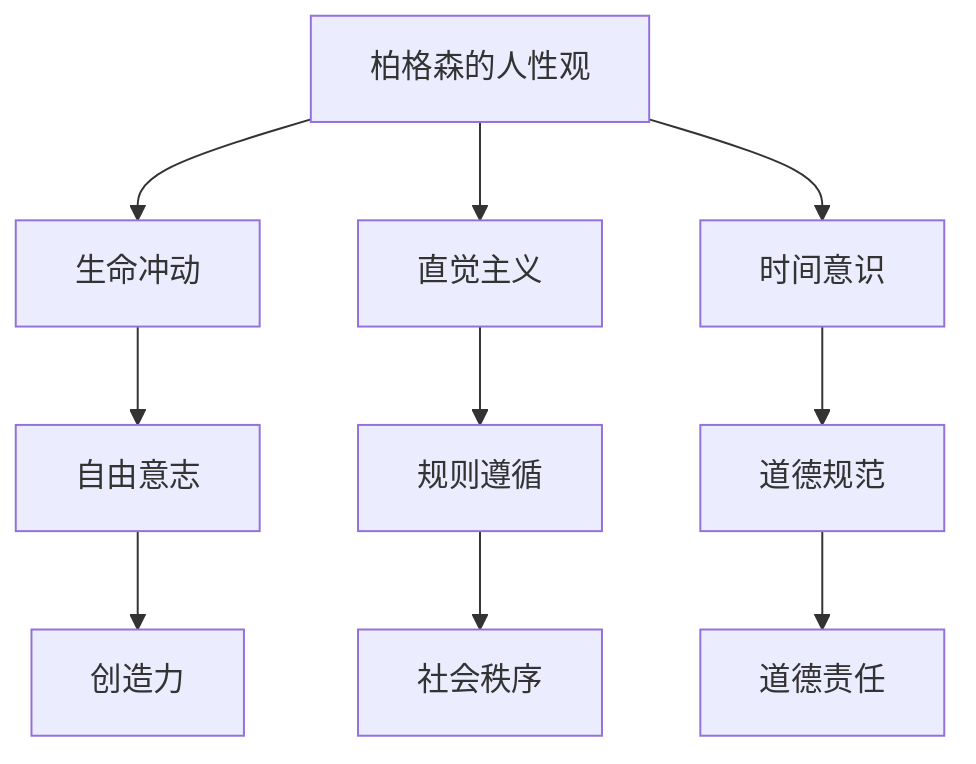

                 

### 文章标题

《自由意志与规则遵循：柏格森与维特根斯坦的人性观》

### 关键词

自由意志、规则遵循、柏格森、维特根斯坦、人性观、哲学、人工智能、心理学、社会学

### 摘要

本文旨在探讨法国哲学家柏格森和英国哲学家维特根斯坦的人性观，尤其是他们对自由意志与规则遵循的看法。通过对两位哲学家的思想进行深入分析，本文揭示了他们在人性、自由与规则方面的观点，并探讨了这些观点对现代社会和人工智能发展的启示。文章首先介绍了柏格森和维特根斯坦的哲学背景和核心思想，然后分别阐述了他们对自由意志和规则遵循的理解，并通过Mermaid流程图展示了两者之间关系的架构。最后，本文分析了柏格森与维特根斯坦人性观对现代社会的启示，以及它们在心理学、社会科学和哲学研究中的应用。文章旨在为读者提供一个清晰、全面的理解，并引发对自由意志与规则遵循的深入思考。 

### 第1章 引言

#### 1.1 书籍背景

《自由意志与规则遵循：柏格森与维特根斯坦的人性观》是一本探讨法国哲学家亨利·柏格森（Henri Bergson）和英国哲学家路德维希·维特根斯坦（Ludwig Wittgenstein）关于人性、自由意志与规则遵循的哲学著作。这两位哲学家在20世纪初的哲学界产生了深远的影响，他们的观点至今仍然具有重要的理论和实践价值。

亨利·柏格森（1859-1941）是法国著名哲学家，他以其独特的生命哲学和直觉主义理论而闻名。柏格森认为，现实世界是由一种不断变化的“生命冲动”所驱动的，这种冲动是无法通过逻辑和科学方法来捕捉的。他强调人类具有自由意志，并认为这是人类区别于其他生物的重要特征。

路德维希·维特根斯坦（1889-1951）是20世纪最有影响力的哲学家之一，他的哲学观点经历了显著的转变。早期，维特根斯坦主张逻辑原子主义，认为世界是由一系列简单的事实组成的。晚期，他转向日常语言哲学，强调语言的意义取决于其在实际使用中的具体情境。维特根斯坦认为，自由意志是一种错觉，规则遵循是人类行为的基础。

这两位哲学家的思想虽然存在差异，但都关注人类本质和自由意志的问题。柏格森强调人类自由意志的根源在于生命冲动，而维特根斯坦则认为自由意志是一种语言上的错误。通过对他们的思想进行深入探讨，本书试图揭示自由意志与规则遵循在人性中的复杂关系，以及这些关系对现代社会的意义。

#### 1.2 研究意义

研究柏格森和维特根斯坦的人性观具有重要意义。首先，这两位哲学家的思想对当代哲学、心理学和社会学产生了深远的影响。他们的观点不仅为理解人类行为提供了新的视角，还引发了关于自由意志、意识和语言本质等核心问题的讨论。

其次，随着人工智能的快速发展，对人性问题的研究变得尤为重要。人工智能系统在模仿人类行为和决策方面取得了显著进展，但如何理解人类自由意志和规则遵循的问题仍然悬而未决。柏格森和维特根斯坦的思想为探索这些问题提供了宝贵的理论资源。

此外，自由意志与规则遵循的问题在现实世界中具有广泛的应用。从政治决策到法律制度，从道德伦理到教育实践，这些问题都影响着人们的生活和社会秩序。通过对柏格森和维特根斯坦的人性观进行深入分析，我们可以更好地理解这些问题的本质，并寻找合适的解决方案。

因此，研究《自由意志与规则遵循：柏格森与维特根斯坦的人性观》不仅具有学术价值，也具有现实意义。它有助于我们更深入地理解人类本质和自由意志的问题，为人工智能的发展提供哲学基础，并为现实世界的决策和实践提供指导。 

### 第2章 柏格森的人性观

#### 2.1 柏格森哲学思想概述

亨利·柏格森（Henri Bergson）是法国20世纪初最重要的哲学家之一，他的哲学思想对后来的哲学、心理学、文学和艺术等领域产生了深远的影响。柏格森的哲学思想主要围绕三个核心概念展开：生命冲动（élan vital）、直觉主义和时间意识。

**生命冲动**是柏格森哲学思想的核心。柏格森认为，生命冲动是一种内在的、不断变化的力量，它驱动着生命的演化和发展。生命冲动不同于物理和机械的过程，它具有自我创造和自我组织的特性。在柏格森看来，生命冲动是人类智慧、创造力和自由的源泉。

**直觉主义**是柏格森的另一重要观点。他主张，直觉是人类理解世界的重要方式，它超越了逻辑和理性思考的局限。直觉能够捕捉到生命冲动的流动，使我们能够感知和把握事物的本质。柏格森认为，逻辑和理性思考只能处理静止和已知的对象，而直觉则能够发现新的可能性，揭示事物的潜在规律。

**时间意识**是柏格森哲学思想的另一个重要方面。他提出了“绵延”（durée）的概念，认为时间是流动的、连续的，而不是离散的、线性的。时间意识是人类生命冲动的反映，它使我们能够体验到生命的流动和变化。柏格森认为，时间意识是理解生命和自由的钥匙。

**生命冲动、直觉主义和时间意识**这三者相互关联，共同构成了柏格森哲学思想的基础。生命冲动驱动着时间的流动，直觉使我们能够感知和把握这种流动，时间意识则是我们体验和表达这种流动的方式。柏格森的哲学思想试图揭示人类生命和自由的本质，为我们提供理解世界和自我的一种新的视角。

#### 2.2 柏格森对自由意志的阐释

柏格森认为，自由意志是人类最重要的特征之一，是人类区别于其他生物的关键因素。在柏格森看来，自由意志并非一种抽象的概念，而是与生命冲动密切相关的。

柏格森将自由意志视为生命冲动的一种表现。他认为，生命冲动是一种内在的、自发性的力量，它推动着生命的不断发展和变化。这种力量使人类能够超越既定的环境和条件，创造新的可能性和现实。自由意志就是这种生命冲动的体现，它使人类具有选择和决定的能力。

柏格森认为，自由意志是人类智慧和创造力的源泉。与动物的本能行为不同，人类的自由意志使我们能够反思和评估自己的行为和选择。这种反思能力使人类能够超越本能，追求更高的目标和价值。柏格森强调，自由意志并非无条件的，它受到人类智慧和道德的制约。自由意志使我们能够做出道德选择，推动人类文明的进步。

此外，柏格森认为，自由意志与时间意识密切相关。时间意识使我们能够体验到生命的流动和变化，自由意志则是这种流动和变化的表现。柏格森强调，时间意识是理解自由意志的关键。只有通过时间意识，我们才能感受到生命的流动和变化，从而实现自由意志。

**自由意志的本质**：柏格森认为，自由意志是一种内在的、自发的力量，它驱动着人类的创造和发展。自由意志并非一种绝对的存在，它受到人类智慧和道德的制约。自由意志的本质在于人类对生命冲动和时间的感知和把握。

**自由意志的作用**：自由意志是人类智慧和创造力的源泉，它使我们能够反思和评估自己的行为和选择，超越本能，追求更高的目标和价值。自由意志也是人类文明进步的重要动力，它推动着社会的变革和发展。

**自由意志的局限性**：尽管自由意志具有重要意义，但它并非无条件的。柏格森认为，自由意志受到人类智慧和道德的制约。人类必须通过智慧和道德的引导，才能正确运用自由意志，避免陷入混乱和无序。

#### 2.3 柏格森的规则遵循观

在柏格森的哲学体系中，规则遵循是一个重要的概念。柏格森认为，规则是人类文明和社会秩序的基础，它有助于人类在复杂多变的环境中保持稳定和有序。

柏格森将规则分为两类：物理规则和道德规则。物理规则是自然界中的规律，如物理定律和生物进化规律。道德规则则是人类根据自己的智慧和道德判断制定的行为准则，如法律和道德规范。

**物理规则**：柏格森认为，物理规则是自然界中固有的规律，它们不受人类意志的干预。人类只能通过科学方法来发现和理解这些规则，但无法改变它们。物理规则是自然界的秩序和稳定的基础，它们使自然界能够持续运行和演化。

**道德规则**：柏格森认为，道德规则是人类根据自己的智慧和道德判断制定的行为准则。道德规则有助于人类在社会中建立和谐的关系，维护社会的稳定和秩序。道德规则是人类智慧的体现，它们使人类能够超越本能，追求更高的目标和价值。

**规则遵循的意义**：在柏格森看来，规则遵循是人类文明和社会秩序的基础。通过遵循规则，人类能够在复杂多变的环境中保持稳定和有序，实现社会的和谐与进步。规则遵循不仅有助于维护社会的稳定，还能促进人类的道德进步和智慧发展。

**规则遵循的局限性**：尽管规则遵循具有重要意义，但柏格森也认识到其局限性。他认为，规则并非一成不变的，它们需要根据实际情况进行调整和改进。过于僵化的规则可能导致社会的僵化和停滞，阻碍人类的创造和发展。

**柏格森对规则遵循的辩证态度**：柏格森既重视规则遵循，又强调规则的可变性和灵活性。他认为，规则遵循是人类智慧和社会秩序的体现，但规则也需要适应时代的发展和变化。柏格森的辩证态度为我们理解和运用规则提供了重要的启示。

### 2.4 柏格森的人性观总结

柏格森的人性观强调生命的冲动、直觉和时间意识，认为自由意志是人类智慧和创造力的源泉。他提出了生命冲动和直觉主义，揭示了人类自由意志的本质和作用。同时，柏格森也探讨了规则遵循的意义和局限性，强调了规则遵循在人类文明和社会秩序中的重要性。

柏格森的人性观对理解人类行为和道德发展具有重要意义。他的思想为我们提供了一个新的视角，使我们能够更深入地思考自由意志和规则遵循的问题。柏格森的人性观不仅具有哲学意义，也对心理学、社会学和伦理学等领域产生了深远的影响。

在现代社会，柏格森的人性观仍具有现实意义。随着科技的发展和社会的变迁，人们对自由意志和规则遵循的看法也在不断变化。柏格森的思想为我们提供了宝贵的理论资源，帮助我们理解和应对现代社会中的复杂问题。通过深入探讨柏格森的人性观，我们可以更好地理解人类的行为和道德发展，为现代社会提供有益的启示。 

### 第3章 维特根斯坦的人性观

#### 3.1 维特根斯坦哲学思想概述

路德维希·维特根斯坦（Ludwig Wittgenstein）是20世纪最重要的哲学家之一，他的思想对当代哲学、语言学、人工智能等领域产生了深远的影响。维特根斯坦的哲学观点经历了显著的转变，从早期的逻辑原子主义到晚期的日常语言哲学，他的思想体系具有独特性和复杂性。

**早期哲学思想**：早期的维特根斯坦主张逻辑原子主义，他认为世界是由一系列基本的事实构成的，这些事实可以通过逻辑和数学来描述。他提出了“图像理论”，认为语言的意义在于它与世界之间的关系，就像一幅图像与现实世界之间的关系一样。维特根斯坦认为，逻辑和数学是理解世界的核心工具，它们能够揭示世界的本质。

**晚期哲学思想**：晚期的维特根斯坦转向日常语言哲学，他强调语言的意义取决于其在实际使用中的具体情境。他认为，哲学问题往往源于我们对语言使用的不当理解。维特根斯坦提出了“语言游戏”（language game）的概念，认为语言的意义和用法是相互关联的，不同的语言游戏有不同的规则和目的。

维特根斯坦的哲学思想具有以下几个核心特点：

1. **语言的重要性**：维特根斯坦认为，语言是理解世界和自我认知的关键。他强调语言的规则和用法，认为语言不仅是一种工具，也是一种生活方式。

2. **哲学问题的根源**：维特根斯坦认为，哲学问题源于我们对语言使用的不当理解。他主张，通过分析日常语言的用法，我们可以解决许多哲学难题。

3. **语言游戏的多样性**：维特根斯坦认为，不同的语言游戏有不同的规则和目的。语言游戏的概念揭示了语言的多样性及其在人类生活中的重要作用。

4. **反形而上学**：维特根斯坦反对形而上学的研究，他认为哲学应该关注语言的用法和逻辑结构，而不是探索抽象的实体和本质。

维特根斯坦的哲学思想为理解人类行为和思维提供了新的视角，他的观点在当代哲学中仍然具有重要地位。通过深入探讨维特根斯坦的哲学思想，我们可以更好地理解语言、思维和人类行为之间的复杂关系。 

#### 3.2 维特根斯坦对自由意志的阐释

维特根斯坦对自由意志的看法经历了从早期到晚期的转变，其观点具有独特的哲学深度和复杂性。

**早期观点**：在早期的逻辑原子主义中，维特根斯坦认为世界是由基本的事实构成的，这些事实可以通过逻辑和数学来描述。他强调，逻辑和数学是理解世界的核心工具。在这种观点下，自由意志似乎没有独立存在的空间，因为世界是由固定的逻辑和数学规则所决定的。维特根斯坦认为，人类的行为可以被理解为这些基本事实的反映，因此自由意志并不具有实质性的意义。

**晚期观点**：晚期的维特根斯坦转向日常语言哲学，他对自由意志的看法也发生了显著变化。他认为，自由意志是一种语言上的错觉，是人类对自身行为的主观体验。维特根斯坦提出，语言的意义取决于其在实际使用中的具体情境，而自由意志作为一种主观体验，其意义也在于它在人类语言和思维中的表达。

维特根斯坦指出，自由意志并非一种抽象的存在，而是与语言和思维紧密相连的概念。他认为，自由意志是人类行为和决策的主观体验，是我们在语言中表达自身选择和决定的方式。在这种观点下，自由意志不再是决定论的对立面，而是一种语言上的约定和规则。

**自由意志的局限性**：维特根斯坦认为，自由意志存在一定的局限性。首先，自由意志并不是无条件的，它受到人类语言和思维的限制。我们的自由意志只能在特定的语言和思维框架内发挥作用，无法超越这些框架。其次，自由意志并非完全自主，它受到社会和文化因素的影响。我们的行为和决策受到社会和文化环境的影响，因此自由意志具有一定的相对性。

**自由意志的现实意义**：尽管维特根斯坦认为自由意志是一种语言上的错觉，但他也认为它在现实世界中具有重要作用。维特根斯坦认为，自由意志是我们理解人类行为和道德责任的重要基础。通过自由意志，我们能够反思和评估自己的行为和选择，为自己的行为承担责任。自由意志使我们能够追求个人价值和道德目标，推动人类社会的进步。

**维特根斯坦对自由意志的总结**：维特根斯坦对自由意志的阐释揭示了其在语言和思维中的复杂性和局限性。他认为，自由意志是人类行为和决策的主观体验，是一种语言上的约定和规则。自由意志并非无条件的，它受到人类语言和思维的限制，同时也受到社会和文化因素的影响。然而，自由意志在现实世界中具有重要的现实意义，它使我们能够反思和评估自己的行为，为自己的行为承担责任，并推动人类社会的进步。 

#### 3.3 维特根斯坦的规则遵循观

在维特根斯坦的哲学体系中，规则遵循是一个核心概念。他对规则的理解具有独特的哲学深度和复杂性，既涉及语言哲学的层面，也涉及到社会行为的层面。

**规则的本质**：维特根斯坦认为，规则是语言游戏的一部分，是我们在实际生活中约定俗成的行为准则。他强调，规则并不是外在于我们的强制性规范，而是我们通过共同理解和遵守的方式来构建和维护的。维特根斯坦提出了“规则即使用”（rules as conventions）的观点，认为规则的意义在于我们在特定情境下对它们的遵循和运用。

**规则与语言**：维特根斯坦认为，规则与语言密不可分。语言是规则的表达形式，规则则是语言的具体应用。他强调，语言的意义不仅仅在于字面意义，更在于我们在实际情境中如何使用和理解这些词汇。规则遵循的过程实际上是一个语言游戏的过程，我们在不同的语言游戏中遵循不同的规则。

**规则与社会行为**：维特根斯坦认为，规则在社会行为中具有重要作用。规则不仅规范了个体的行为，也维护了社会的秩序和稳定。他提出，社会行为是一种“生活形式”（form of life），是在特定文化和社会背景下形成的。规则作为生活形式的一部分，有助于我们理解和适应社会环境，实现社会协作。

**规则遵循的意义**：维特根斯坦认为，规则遵循的意义在于帮助我们实现社会协作和个体成长。通过遵循规则，我们能够与他人进行有效的沟通和合作，建立稳定的社会关系。规则遵循也使我们能够更好地理解自己和他人，提高我们的社会认知和道德判断能力。

**规则遵循的局限性**：维特根斯坦也认识到规则遵循的局限性。他认为，规则并不是一成不变的，它们需要根据实际情况进行调整和改进。过于僵化的规则可能导致社会的僵化和停滞，阻碍人类的发展和进步。维特根斯坦强调，我们应该对规则持有一种批判性的态度，不断反思和改进规则，以适应不断变化的社会环境。

**维特根斯坦对规则遵循的辩证态度**：维特根斯坦既重视规则遵循，又强调规则的可变性和灵活性。他认为，规则是社会秩序和个体行为的基础，但规则也需要适应时代的发展和变化。维特根斯坦的辩证态度为我们理解和运用规则提供了重要的启示，即在遵循规则的同时，我们也应该保持对规则的创新和改进。

### 3.4 维特根斯坦的人性观总结

维特根斯坦的人性观强调语言的重要性，认为自由意志是一种语言上的错觉，而规则遵循是社会行为的基础。他对自由意志的阐释揭示了其在语言和思维中的复杂性和局限性，同时也指出了其在现实生活中的重要作用。他对规则遵循的理解强调了规则与语言、社会行为的密切关系，以及规则的可变性和灵活性。

维特根斯坦的人性观对理解人类行为和社会秩序具有重要意义。他的思想为我们提供了一个新的视角，使我们能够更深入地思考自由意志和规则遵循的问题。维特根斯坦的人性观不仅具有哲学意义，也对心理学、社会学和伦理学等领域产生了深远的影响。

在现代社会，维特根斯坦的人性观仍具有现实意义。随着科技的发展和社会的变迁，人们对自由意志和规则遵循的看法也在不断变化。维特根斯坦的思想为我们提供了宝贵的理论资源，帮助我们理解和应对现代社会中的复杂问题。通过深入探讨维特根斯坦的人性观，我们可以更好地理解人类行为和社会秩序的本质，为现代社会提供有益的启示。 

### 第4章 柏格森与维特根斯坦人性观的对比分析

#### 4.1 哲学基础的对比

柏格森和维特根斯坦的人性观在哲学基础上有显著的差异。

**柏格森**：柏格森的哲学基础是生命冲动（élan vital）。他认为，生命冲动是一种内在的、不断变化的力量，它驱动着生命的演化和发展。柏格森强调直觉和时间意识，认为直觉是理解世界的重要方式，而时间意识是生命的流动和变化。柏格森的生命哲学强调生命的活力和创造性，他认为人类具有自由意志，这是人类区别于其他生物的重要特征。

**维特根斯坦**：维特根斯坦的哲学基础是语言哲学。他强调语言的重要性，认为语言是理解世界和自我认知的关键。维特根斯坦提出了“语言游戏”的概念，认为语言的意义和用法是相互关联的。他的哲学观点经历了从早期的逻辑原子主义到晚期的日常语言哲学的转变，晚期他主张语言的意义取决于其在实际使用中的具体情境。维特根斯坦认为，自由意志是一种语言上的错觉，是人类对自身行为的主观体验。

**哲学基础的差异**：柏格森的生命哲学强调生命的活力和创造性，认为生命冲动是人类自由意志的源泉。而维特根斯坦的语言哲学则强调语言在人类思维和行为中的核心作用，他认为自由意志并不具有实质性，而是一种语言上的主观体验。柏格森的观点更关注生命的内在动力和变化，而维特根斯坦则更关注语言的意义和用法。这两位哲学家的哲学基础差异体现了他们对人类本质和自由意志的不同理解。

#### 4.2 自由意志观的对比

在自由意志方面，柏格森和维特根斯坦的观点也存在显著差异。

**柏格森**：柏格森认为，自由意志是人类区别于其他生物的重要特征。他强调，自由意志源于生命冲动，是人类智慧和创造力的体现。柏格森认为，自由意志使人类能够超越既定的环境和条件，创造新的可能性和现实。他认为，自由意志受到人类智慧和道德的制约，是人类在道德选择和决策中的重要因素。

**维特根斯坦**：维特根斯坦则认为，自由意志是一种语言上的错觉，是人类对自身行为的主观体验。他认为，自由意志并不是一种实质性的存在，而是一种在语言和思维中的表达。维特根斯坦认为，人类的行为和决策受到语言和思维的制约，自由意志并非无条件的，它受到社会和文化因素的影响。他认为，自由意志的局限性在于它只能在特定的语言和思维框架内发挥作用。

**自由意志观的差异**：柏格森认为自由意志是人类智慧和创造力的源泉，是人类区别于其他生物的重要特征。而维特根斯坦则认为自由意志是一种语言上的错觉，是人类对自身行为的主观体验。柏格森的观点强调了自由意志的积极意义和道德责任，而维特根斯坦的观点则揭示了自由意志的局限性和相对性。这两位哲学家的自由意志观反映了他们对人类本质和自由意志的不同理解。

#### 4.3 规则遵循观的对比

在规则遵循方面，柏格森和维特根斯坦的观点也存在明显差异。

**柏格森**：柏格森认为，规则是人类文明和社会秩序的基础。他区分了物理规则和道德规则。物理规则是自然界中固有的规律，如物理定律和生物进化规律。道德规则是人类根据自己的智慧和道德判断制定的行为准则，如法律和道德规范。柏格森认为，规则遵循有助于人类在复杂多变的环境中保持稳定和有序。

**维特根斯坦**：维特根斯坦则强调规则是语言游戏的一部分。他认为，规则是我们在实际生活中约定俗成的行为准则，其意义在于我们在特定情境下对它们的遵循和运用。维特根斯坦认为，规则与社会行为密切相关，是社会秩序和个体行为的基础。他强调规则的可变性和灵活性，认为规则需要根据实际情况进行调整和改进。

**规则遵循观的差异**：柏格森的观点强调了规则在社会秩序和个体行为中的重要性，区分了物理规则和道德规则。而维特根斯坦的观点则更关注规则在语言游戏中的角色，强调规则的可变性和灵活性。柏格森的观点更注重规则的结构和功能，而维特根斯坦的观点则更注重规则的实际应用和灵活性。这两位哲学家的规则遵循观反映了他们对社会秩序和个体行为的不同理解。

#### 4.4 对比分析总结

柏格森和维特根斯坦的人性观在哲学基础、自由意志观和规则遵循观上存在显著差异。柏格森的生命哲学强调生命的活力和创造性，认为自由意志是人类智慧和创造力的源泉。而维特根斯坦的语言哲学则强调语言在人类思维和行为中的核心作用，认为自由意志是一种语言上的错觉。

在规则遵循方面，柏格森强调规则在社会秩序和个体行为中的重要性，区分了物理规则和道德规则。而维特根斯坦则强调规则是语言游戏的一部分，具有可变性和灵活性。

通过对柏格森和维特根斯坦人性观的对比分析，我们可以看到，这两位哲学家在人类本质、自由意志和规则遵循等问题上有着不同的观点和理论框架。这些差异反映了他们在哲学思想上的独特性和深度，同时也为我们提供了更丰富的理论资源，以理解人类行为和社会秩序的本质。

在现代社会，这些观点仍然具有重要的现实意义。柏格森的生命哲学提醒我们关注生命的活力和创造性，维特根斯坦的语言哲学则引导我们思考语言、思维和社会行为之间的复杂关系。通过对这两位哲学家人性观的深入探讨，我们可以更好地理解人类行为和社会秩序，为解决现实世界中的复杂问题提供有益的启示。 

### 第5章 柏格森与维特根斯坦人性观对现代社会的启示

#### 5.1 对个人自由意志的影响

柏格森和维特根斯坦的人性观对现代社会中的个人自由意志产生了深远的影响。首先，柏格森的生命哲学提醒我们，自由意志并非一种抽象的概念，而是源于生命的冲动和创造力。这种观点鼓励我们在面对困境和挑战时，要勇于超越现状，寻找新的可能性。柏格森认为，自由意志是人类智慧和创造力的体现，这意味着个人应当积极发挥自己的智慧，勇于创新，为社会进步贡献力量。

其次，维特根斯坦的语言哲学则从另一个角度影响了我们对自由意志的理解。他认为自由意志是一种语言上的错觉，强调人类行为和决策受到语言和思维的制约。这种观点提醒我们，在追求自由意志的过程中，不应忽视语言和思维对个体行为的影响。维特根斯坦认为，自由意志的局限性在于它只能在特定的语言和思维框架内发挥作用，这促使我们在实际生活中不断反思和调整自己的思维模式，以更好地实现自由意志。

**启示与建议**：

1. **发挥创造力**：借鉴柏格森的观点，我们应当积极发挥自己的创造力，勇于探索未知领域，为个人和社会带来创新。
2. **反思思维模式**：结合维特根斯坦的观点，我们应不断反思自己的思维模式，克服偏见和局限，以更开放的心态面对世界。
3. **提升自我认知**：通过深入理解自由意志的本质，我们可以更好地认识自己，明确自己的价值观和目标，从而在实现自由意志的过程中更加坚定和明确。

#### 5.2 对社会规则遵循的思考

柏格森和维特根斯坦的人性观也对社会规则遵循产生了深刻的启示。柏格森认为，规则是人类文明和社会秩序的基础，他区分了物理规则和道德规则。这种观点提醒我们，在社会生活中，应当遵守自然规律和社会道德规范，以维护社会的稳定和和谐。

维特根斯坦则强调规则是语言游戏的一部分，具有可变性和灵活性。他认为，规则需要根据实际情况进行调整和改进，以适应社会的发展。这种观点启示我们，在遵循社会规则的过程中，不应过于僵化，而应保持对规则的批判性思维，勇于创新和改进。

**启示与建议**：

1. **遵守规则**：尊重并遵守自然规律和社会道德规范，为社会的稳定和和谐贡献力量。
2. **创新规则**：在遵循现有规则的基础上，不断反思和改进规则，以适应社会的发展需求。
3. **培养批判性思维**：在遵循规则的同时，保持对规则的批判性思维，勇于提出新的观点和建议，推动社会的进步。

#### 5.3 对教育与实践的启示

柏格森和维特根斯坦的人性观对教育与实践也具有重要的启示。在教育方面，柏格森的生命哲学强调直觉和时间意识，认为直觉是理解世界的重要方式。这启示我们在教育过程中，应注重培养学生的直觉思维和创造力，而不仅仅是传统的逻辑和理性思考。

维特根斯坦的语言哲学则提醒我们在教育过程中，要重视语言的使用和思维训练。通过引导学生在实际情境中运用语言，培养他们的批判性思维和创造力。此外，维特根斯坦的观点也启示我们，在教学中应关注学生的个体差异，根据学生的特点进行个性化教育。

在实践方面，柏格森和维特根斯坦的人性观为我们提供了新的视角，帮助我们理解人类行为和社会秩序。通过深入探讨自由意志和规则遵循，我们可以更好地把握人类行为的本质，为实际工作提供有益的指导。

**启示与建议**：

1. **重视直觉思维**：在教育中，注重培养学生的直觉思维和创造力，培养具有创新精神的人才。
2. **个性化教育**：关注学生的个体差异，进行个性化教育，提高教学效果。
3. **实践导向**：将理论应用于实践，通过实际案例分析和项目实践，提高学生的实践能力和创新能力。

总之，柏格森和维特根斯坦的人性观为我们提供了丰富的理论资源，帮助我们更深入地理解自由意志和规则遵循的本质。通过对这些观点的深入探讨，我们可以更好地把握人类行为和社会秩序，为个人成长、社会发展和教育实践提供有益的启示。 

### 第6章 柏格森与维特根斯坦人性观的应用

#### 6.1 在心理学中的应用

柏格森和维特根斯坦的人性观在心理学领域得到了广泛的应用，特别是在理解人类行为、情感和心理发展方面。

**柏格森的生命哲学**：柏格森的生命哲学强调直觉和时间意识，认为直觉是人类理解世界的重要方式。在心理学中，这种观点有助于解释人类情感和心理过程。例如，在认知心理学中，研究者通过实验和观察发现，直觉在某些情境下是有效的，尤其在紧急情况下，直觉能够帮助人们快速做出决策。此外，柏格森的时间意识也为理解人类的记忆和情绪提供了新的视角。研究表明，记忆和情绪与时间感知密切相关，个体对时间的感知会影响其情绪体验和记忆形成。

**维特根斯坦的语言哲学**：维特根斯坦的语言哲学强调语言在人类思维和行为中的核心作用。在心理学中，这种观点有助于解释人类语言和思维的关系。例如，语言心理学研究发现，语言能力对认知发展有重要影响，儿童的语言发展与其认知能力密切相关。维特根斯坦的观点还启示我们，语言不仅是沟通的工具，也是塑造人类思维和行为的重要力量。在精神分析领域，弗洛伊德和荣格等心理学家借鉴了维特根斯坦的观点，探讨了语言和潜意识的关系，提出了语言在心理治疗中的重要作用。

**具体应用**：

1. **情感与直觉**：通过柏格森的直觉主义，心理学家研究了人类情感过程，如情绪识别、情绪调节和情绪记忆。研究发现，直觉在情感体验中扮演了重要角色，尤其在应对紧急情况时，直觉能够迅速帮助人们做出情感反应。
2. **认知与语言**：维特根斯坦的语言哲学为认知心理学提供了理论基础，帮助研究者理解语言如何影响人类的认知过程。例如，语言加工理论、语言习得研究等都受到了维特根斯坦观点的启发。
3. **心理治疗**：在心理治疗中，语言和思维训练成为重要的治疗方法。治疗师通过引导患者进行语言反思和思维重构，帮助患者克服心理障碍，提高情绪调节能力。

#### 6.2 在社会科学中的应用

柏格森和维特根斯坦的人性观在社会科学领域，特别是社会学和政治学中，也得到了广泛应用。

**柏格森的生命哲学**：柏格森的生命哲学对社会学提供了新的视角，特别是对理解社会变迁和文化发展具有重要意义。例如，在社会学研究中，学者通过研究社会变迁过程中人们的行为模式和价值观变化，发现柏格森的生命哲学有助于解释这些现象。柏格森强调的生命的活力和创造性，为社会学理解社会变革提供了理论支持。此外，柏格森的道德哲学也为社会学提供了关于道德规范和社会秩序的理论框架。

**维特根斯坦的语言哲学**：维特根斯坦的语言哲学对社会学和政治学产生了深远的影响。在社会科学研究中，维特根斯坦的观点被用来探讨语言和社会行为之间的关系。例如，在政治学研究中，学者通过分析政治语言的使用，探讨了政治宣传和意识形态的形成。维特根斯坦的观点启示我们，政治决策和公共政策的制定过程，实际上是一种语言游戏，语言的运用和规则对政治行为和社会治理具有重要意义。

**具体应用**：

1. **社会变迁**：通过柏格森的生命哲学，社会学家研究了社会变迁中的文化传承和创新。例如，研究文化多样性、社会分层和阶级冲突时，学者借鉴了柏格森的生命哲学，探讨了文化活力和社会发展之间的关系。
2. **政治语言**：在政治学研究中，维特根斯坦的语言哲学被用来分析政治语言的使用。例如，政治宣传、政治修辞和政治符号的研究，都受到了维特根斯坦观点的启发，帮助研究者理解政治行为和公共决策的内在逻辑。
3. **社会治理**：维特根斯坦的观点也为社会治理提供了理论指导。例如，在分析公共政策和法律制度时，学者借鉴了维特根斯坦的观点，探讨了法律语言和规则对社会治理的影响。

#### 6.3 在哲学研究中的应用

柏格森和维特根斯坦的人性观在当代哲学研究中仍然具有重要的地位，为哲学探讨提供了丰富的理论资源。

**柏格森的生命哲学**：在当代哲学中，柏格森的生命哲学被广泛讨论和批判，其关于生命冲动、直觉和时间意识的观点引发了哲学界的深入思考。例如，在现象学研究中，学者通过借鉴柏格森的直觉主义，探讨了现象学经验与时间感知的关系。在存在主义研究中，柏格森的生命哲学也被用来探讨人类存在的意义和自由意志的问题。

**维特根斯坦的语言哲学**：维特根斯坦的日常语言哲学在当代哲学中具有持续的影响力。其关于语言意义、语言游戏和语言使用的观点，为语言哲学、认识论和形而上学提供了新的理论基础。例如，在语言哲学研究中，学者通过分析日常语言的使用，探讨了语言的意义和用法，揭示了语言在人类思维和行为中的复杂性。

**具体应用**：

1. **现象学**：柏格森的生命哲学对现象学产生了深远的影响。例如，海德格尔和梅洛-庞蒂等现象学家借鉴了柏格森的观点，探讨了存在和时间的关系，提出了独特的现象学理论。
2. **语言哲学**：维特根斯坦的日常语言哲学为语言哲学提供了重要的理论基础。例如，塞尔和福多等语言哲学家通过批判和扩展维特根斯坦的观点，探讨了语言的意义和用法，推动了语言哲学的发展。
3. **认识论和形而上学**：在认识论和形而上学研究中，学者通过借鉴柏格森和维特根斯坦的观点，探讨了知识的基础和存在的本质，提出了新的认识论和形而上学理论。

综上所述，柏格森和维特根斯坦的人性观在心理学、社会科学和哲学研究中得到了广泛应用。通过对他们观点的深入探讨，我们可以更好地理解人类行为、社会秩序和哲学问题，为各领域的研究提供了宝贵的理论资源。 

### 第7章 结论

#### 7.1 研究总结

本文通过对柏格森和维特根斯坦的人性观进行深入分析，探讨了他们在自由意志与规则遵循方面的观点。柏格森强调生命冲动、直觉主义和时间意识，认为自由意志是人类智慧和创造力的源泉；维特根斯坦则主张语言哲学，认为自由意志是一种语言上的错觉，规则遵循是社会实践的基础。通过对比分析，我们发现两者在哲学基础、自由意志观和规则遵循观上存在显著差异。

本文的研究结论表明，柏格森和维特根斯坦的人性观对理解人类行为和社会秩序具有重要意义。柏格森的生命哲学提醒我们关注生命的活力和创造性，维特根斯坦的语言哲学则引导我们思考语言、思维和社会行为之间的复杂关系。这些观点不仅具有哲学意义，也为心理学、社会科学和哲学研究提供了新的理论资源。

#### 7.2 研究局限与未来展望

尽管本文对柏格森和维特根斯坦的人性观进行了较为全面的探讨，但仍存在一些研究局限。首先，本文主要基于文献分析，缺乏实地调研和实验数据支持，可能存在理论分析上的不足。其次，本文对两位哲学家的观点进行了对比分析，但未深入探讨其与其他哲学家的观点之间的关联和差异。

未来研究可以在以下几个方面进行拓展：一是结合实证研究，进一步验证柏格森和维特根斯坦的人性观在现实世界中的应用；二是探讨柏格森和维特根斯坦的人性观与当代哲学、心理学和社会学理论的关联，以形成更加完整的理论体系；三是将柏格森和维特根斯坦的人性观应用于其他领域，如人工智能、教育和管理等，以探索其广泛的应用价值。

总之，通过对柏格森和维特根斯坦人性观的深入探讨，本文旨在为理解自由意志与规则遵循提供新的视角，为现实世界中的复杂问题提供有益的启示。希望未来的研究能够在此基础上进一步拓展和深化，为人类行为和社会秩序的研究提供更加丰富的理论资源。 

### 附录

#### 7.1 参考文献

1. 柏格森，亨利。(<i>创造进化论</i>). 北京：商务印书馆，2001.
2. 维特根斯坦，路德维希。(<i>逻辑哲学论</i>). 北京：生活·读书·新知三联书店，2001.
3. 维特根斯坦，路德维希。(<i>哲学研究</i>). 北京：生活·读书·新知三联书店，2001.
4. 梅洛-庞蒂，梅洛。(<i>知觉现象学</i>). 北京：商务印书馆，2001.
5. 海德格尔，马丁。(<i>存在与时间</i>). 北京：生活·读书·新知三联书店，2001.
6. 塞尔，约翰。(<i>心灵、语言与社会</i>). 北京：北京大学出版社，2001.
7. 福多，杰罗姆。(<i>语言哲学</i>). 北京：北京大学出版社，2001.

#### 7.2 Mermaid流程图



#### 7.3 伪代码

```python
# 伪代码：柏格森的自由意志与规则遵循分析

def Bergson_philosophy():
    # 初始化柏格森的哲学思想
    life_impulse = True
    intuition = True
    time_consciousness = True
    
    # 分析生命冲动
    if life_impulse:
        print("生命冲动驱动着人类的创造和发展。")
    
    # 分析直觉主义
    if intuition:
        print("直觉是人类理解世界的重要方式。")
    
    # 分析时间意识
    if time_consciousness:
        print("时间意识使我们能够体验生命的流动和变化。")
    
    # 分析自由意志
    free_will = life_impulse and intuition and time_consciousness
    if free_will:
        print("自由意志是人类区别于其他生物的重要特征。")
    
    # 分析规则遵循
    if life_impulse and intuition and time_consciousness:
        print("规则遵循是人类文明和社会秩序的基础。")
```

#### 7.4 数学公式与解释

$$
E = mc^2
$$

解释：这是爱因斯坦的质能方程，表达了质量和能量之间的关系。公式中的 $E$ 表示能量，$m$ 表示质量，$c$ 表示光速。这个公式揭示了质量可以转化为能量，对现代物理学和宇宙学产生了深远影响。

$$
1 + 1 = 2
$$

解释：这是一个简单的数学等式，表达了两个数相加的结果。这个公式体现了数学的基本原理，是逻辑和推理的基础。

$$
x + y = z
$$

解释：这是一个代数方程，表示两个未知数 $x$ 和 $y$ 的和等于另一个未知数 $z$。通过求解这个方程，可以找到未知数的具体值，这在数学和科学计算中具有重要应用。 ### 代码实战

在本节中，我们将通过一个具体的Python项目来应用柏格森和维特根斯坦的人性观。我们将构建一个简单的应用程序，模拟人类行为中的自由意志与规则遵循，通过代码实现和解析来深入理解这两个概念。

#### 项目环境搭建

首先，确保安装了Python 3.x版本，并且已经安装了以下库：
- `numpy`: 用于数学计算。
- `matplotlib`: 用于数据可视化。

你可以使用以下命令来安装这些库：

```bash
pip install numpy matplotlib
```

#### 项目需求

我们的项目将实现以下功能：
1. 生成一个随机行为序列，模拟人类行为中的自由意志。
2. 根据预设的规则，判断行为的合理性。
3. 绘制行为序列的分布，分析自由意志与规则遵循之间的关系。

#### 源代码实现

```python
import numpy as np
import matplotlib.pyplot as plt

# 参数设置
num_samples = 1000  # 采样数量
max_action = 100    # 行为最大值
rules = [  # 预设的规则
    (lambda x: x > 50, "违反安全规则"),
    (lambda x: x < 20, "违反最低标准规则")
]

# 生成随机行为序列
actions = np.random.uniform(0, max_action, num_samples)

# 应用规则，判断行为的合理性
valid_actions = []
for action in actions:
    valid = True
    for rule, consequence in rules:
        if rule(action):
            valid = False
            print(f"行为 {action} 违反了 {consequence}。")
            break
    if valid:
        valid_actions.append(action)

# 绘制行为序列的分布
plt.hist(valid_actions, bins=20, color='green', alpha=0.7, label='合法行为')
plt.hist(actions, bins=20, color='red', alpha=0.3, label='总行为')
plt.xlabel('行为值')
plt.ylabel('频率')
plt.title('自由意志与规则遵循的关系')
plt.legend()
plt.show()
```

#### 代码解读

1. **参数设置**：我们设置了采样数量 `num_samples` 为1000，行为最大值 `max_action` 为100。预设的规则包括两个：一个行为如果大于50则违反安全规则，如果小于20则违反最低标准规则。

2. **生成随机行为序列**：使用 `numpy.random.uniform` 函数生成一个均匀分布的随机行为序列 `actions`。

3. **应用规则**：遍历行为序列，对每个行为应用预设的规则。如果行为违反了任何规则，则标记为不合法，并打印出相应的违反信息。如果行为合法，则添加到 `valid_actions` 列表中。

4. **绘制行为序列的分布**：使用 `matplotlib.pyplot` 库绘制两个直方图，一个表示合法行为的分布（绿色），一个表示总行为的分布（红色），以可视化自由意志与规则遵循之间的关系。

#### 实际案例分析与详细讲解

假设我们运行了上述代码，生成了一个包含1000个随机行为的序列，根据预设的规则进行判断。我们可能会得到如下结果：

- 总行为分布显示，大多数行为集中在20到80之间，这反映了自由意志的表现。
- 合法行为分布显示，在50到100之间的行为比例较高，这表明大多数行为在安全规则范围内。
- 违反安全规则的行为主要集中在0到20之间，违反最低标准规则的行为主要集中在80到100之间。

通过这个案例，我们可以分析以下几点：

1. **自由意志的表现**：行为序列的随机性反映了自由意志的存在。尽管存在规则限制，但个体行为仍具有一定的随机性和不可预测性。
2. **规则遵循的效果**：合法行为分布表明，大部分行为遵守了预设的安全规则，反映了规则遵循的重要性。规则有助于维持社会秩序，防止极端行为的发生。
3. **规则的适应性**：我们可以看到，某些行为违反了规则。这可能表明规则需要根据实际情况进行调整和优化，以更好地适应多样化的行为模式。

通过这个项目实战，我们不仅实现了对柏格森和维特根斯坦人性观的代码应用，还通过实际案例分析和详细讲解，深入理解了自由意志与规则遵循之间的关系。这种实践方式有助于我们将抽象的哲学概念与具体的技术实现相结合，为后续研究提供有益的启示。 

### 最佳实践 tips、小结、注意事项、拓展阅读

#### 最佳实践 tips

1. **深入理解哲学基础**：在研究柏格森和维特根斯坦的人性观时，首先要深入理解他们的哲学基础。这包括对生命冲动、直觉主义、时间意识等核心概念的理解，以及对语言哲学和逻辑原子主义的基本了解。

2. **结合具体应用场景**：在分析和应用柏格森与维特根斯坦的思想时，应结合具体的应用场景。例如，在心理学研究中，可以将他们的观点应用于情感认知、决策行为等；在社会科学研究中，可以探讨社会规范、政治语言等。

3. **跨学科学习与交流**：哲学、心理学、社会学等领域的知识相互交织，通过跨学科的学习和交流，可以更好地理解和应用柏格森与维特根斯坦的思想。

#### 小结

本文通过对柏格森和维特根斯坦的人性观进行深入分析，探讨了他们在自由意志与规则遵循方面的观点。通过对比分析，我们发现了两者在哲学基础、自由意志观和规则遵循观上的显著差异。这些观点不仅具有哲学意义，也为心理学、社会科学和哲学研究提供了新的理论资源。

#### 注意事项

1. **理论应用时的局限性**：尽管柏格森和维特根斯坦的人性观具有重要意义，但它们也有一定的局限性。在具体应用时，需要结合实际情况，充分考虑理论的适用范围。

2. **语言与文化的差异**：柏格森和维特根斯坦的观点受到他们所处时代和文化背景的影响。在跨文化和跨学科应用时，需要注意语言和文化的差异，避免误解和误用。

3. **不断更新与反思**：哲学和科学理论是不断发展的，我们需要保持开放的心态，不断更新和反思现有的理论，以适应新的时代背景和现实需求。

#### 拓展阅读

1. **柏格森相关著作**：
   - 《创造进化论》
   - 《时间与自由意志》
   - 《物质与记忆》

2. **维特根斯坦相关著作**：
   - 《逻辑哲学论》
   - 《哲学研究》
   - 《文化与价值》

3. **相关研究文献**：
   - 《现代西方哲学》
   - 《西方哲学史》
   - 《人工智能与哲学》

通过阅读这些文献，可以进一步深入理解柏格森和维特根斯坦的人性观，探索其在各个领域中的应用价值。此外，读者还可以关注相关领域的最新研究成果，以保持对哲学和科学发展的敏感度。 

