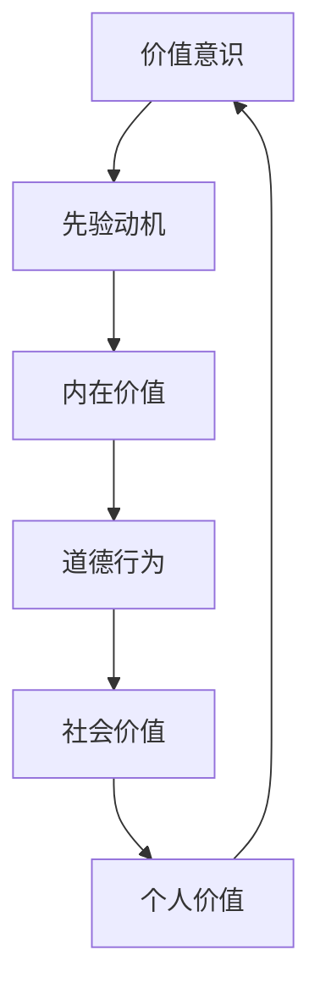
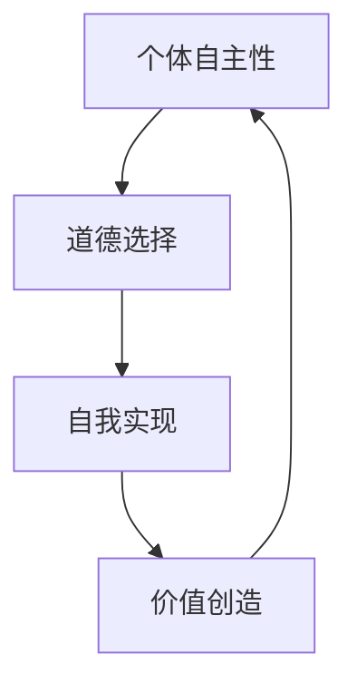
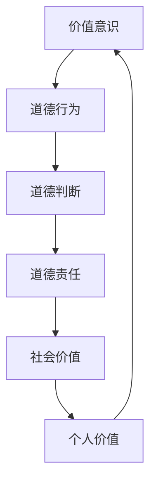
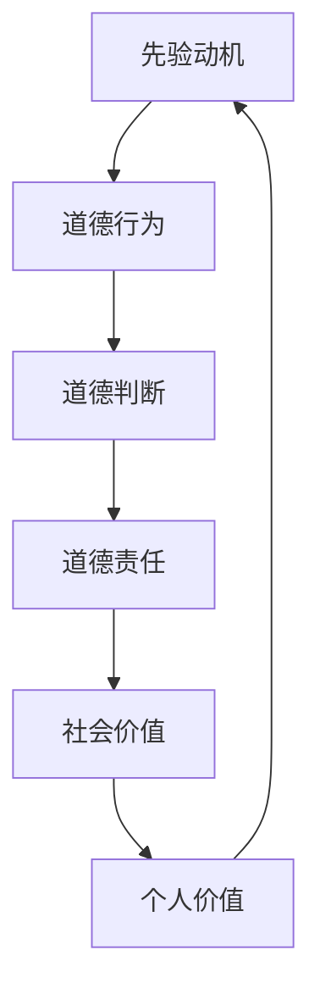
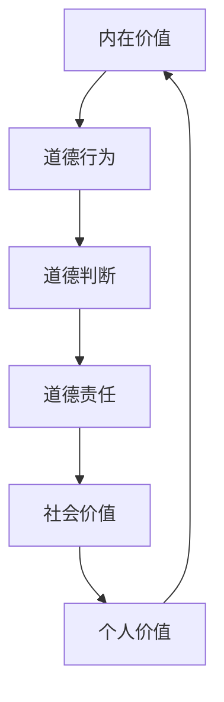
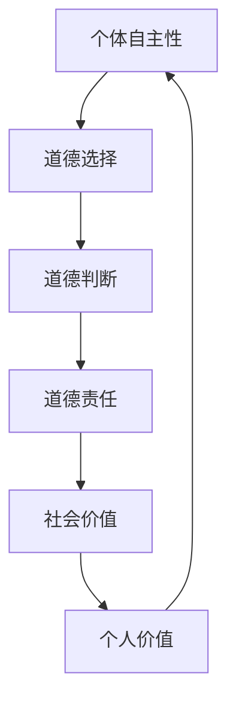
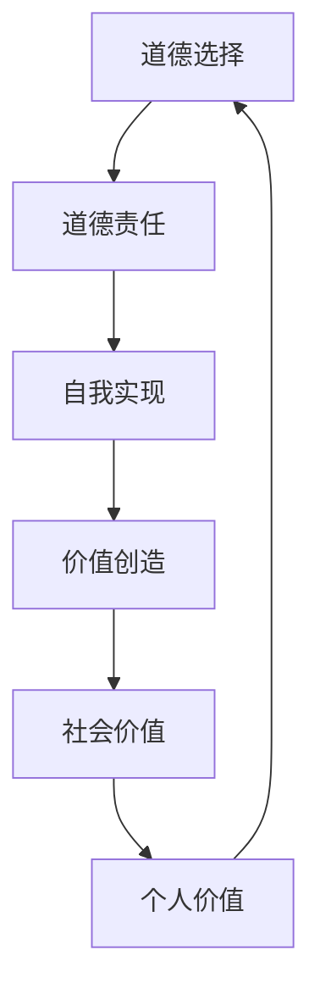

                 

# 《舍勒与哈特曼：价值哲学的代表人物》

## 文章关键词
价值哲学、舍勒、哈特曼、代表人物、伦理学、美学、政治哲学、当代评价

## 文章摘要
本文旨在探讨价值哲学领域的两位代表人物——舍勒与哈特曼。首先，我们将介绍两位哲学家的生平背景，接着深入剖析他们的价值哲学思想，然后评估他们对价值哲学的影响与贡献，并探讨这些思想在当代的评价。通过本文，读者将对舍勒与哈特曼的思想有更深入的理解，并认识到他们在价值哲学领域的地位与重要性。

## 目录
1. 舍勒与哈特曼的生平与哲学背景
   1.1 舍勒的生平与哲学背景
   1.2 哈特曼的生平与哲学背景
2. 舍勒与哈特曼的价值哲学思想
   2.1 舍勒的价值哲学思想
   2.2 哈特曼的价值哲学思想
3. 舍勒与哈特曼对价值哲学的影响与贡献
   3.1 舍勒对价值哲学的影响与贡献
   3.2 哈特曼对价值哲学的影响与贡献
4. 对舍勒与哈特曼思想的当代评价
   4.1 舍勒思想的当代评价
   4.2 哈特曼思想的当代评价
5. 结论

## 1. 舍勒与哈特曼的生平与哲学背景

### 1.1 舍勒的生平与哲学背景

菲利克斯·舍勒（Felixua Schelling）是德国哲学家，生于1864年，逝世于1937年。舍勒的哲学生涯始于他在柏林大学的学习，他在那里接受了广泛的人文和科学教育。舍勒的哲学观点深受其师从的黑格尔和费尔巴哈的影响，但他也在后来对康德和胡塞尔的思想进行了批判和发展。

舍勒的思想主要集中在伦理学、美学和政治哲学领域。他的伦理学思想强调了人类精神生活的道德价值和目的，提出了“先验动机”的概念，认为道德行为应基于内在的价值判断而非外在的强制。舍勒的美学观念强调艺术的内在价值，认为艺术创作是人类情感和理性沟通的媒介。在政治哲学方面，舍勒探讨了国家、社会与个体之间的关系，强调自由、平等和正义的重要性。

### 1.2 哈特曼的生平与哲学背景

欧根·哈特曼（Eugen Herrmann）是德国哲学家，生于1884年，逝世于1975年。哈特曼的哲学生涯始于他在柏林大学的学术研究，他在那里接受了广泛的哲学教育。哈特曼的思想深受康德和黑格尔的影响，但他也在后来对现象学和存在主义思想进行了探索和发展。

哈特曼的主要研究领域包括伦理学、美学和政治哲学。他的伦理学思想强调了个体自主性和道德选择的自由，认为道德行为应基于个人的自我实现。哈特曼的美学观念则强调艺术的非客观性，认为艺术创作是艺术家与观众之间的一种互动过程。在政治哲学方面，哈特曼探讨了国家与社会的关系，提出了“个体主义”的概念，强调个体的权利和自由。

## 2. 舍勒与哈特曼的价值哲学思想

### 2.1 舍勒的价值哲学思想

#### 核心概念与联系

舍勒的价值哲学思想围绕以下几个核心概念展开：价值意识、先验动机、内在价值。以下是一个用Mermaid绘制的流程图，展示这些概念之间的联系：



#### 核心算法原理讲解

舍勒的伦理学思想可以看作是一个“价值评估”算法。这个算法的核心步骤如下：

1. **感知价值**：个体通过感知来识别周围世界的价值。
2. **先验动机**：个体根据内在的价值判断，激发道德行为的动机。
3. **道德行为**：个体根据先验动机进行道德选择和行动。
4. **社会价值**：个体的道德行为对社会价值产生影响。
5. **个人价值**：个体的价值判断和行为影响其个人价值。

以下是对应的伪代码：

```python
def value_evaluation(perceived_values):
    # 步骤1：感知价值
    value_perception = perceived_values
    
    # 步骤2：先验动机
    prior_motives = []
    for value in value_perception:
        if is_moral_value(value):
            prior_motives.append(value)
    
    # 步骤3：道德行为
    moral_actions = []
    for motive in prior_motives:
        action = determine_action(motive)
        moral_actions.append(action)
    
    # 步骤4：社会价值
    social_values = influence_social_values(moral_actions)
    
    # 步骤5：个人价值
    personal_value = calculate_personal_value(moral_actions, social_values)
    
    return personal_value
```

#### 数学模型和公式

舍勒的价值哲学可以用以下数学模型来描述：

$$
\text{价值} = f(\text{感知}, \text{先验动机}, \text{道德行为}, \text{社会价值}, \text{个人价值})
$$

其中，$f$ 是一个复合函数，它反映了价值评估的各个因素之间的相互作用。

#### 举例说明

假设一个人感知到爱、正义和自由等价值，根据先验动机，他决定去帮助需要帮助的人、维护正义、争取自由。他的这些道德行为最终对社会产生了积极影响，从而提高了他的个人价值。

### 2.2 哈特曼的价值哲学思想

#### 核心概念与联系

哈特曼的价值哲学思想包括以下几个核心概念：个体自主性、道德选择、自我实现。以下是一个用Mermaid绘制的流程图，展示这些概念之间的联系：



#### 核心算法原理讲解

哈特曼的伦理学思想可以看作是一个“自我实现”循环算法。这个算法的核心步骤如下：

1. **个体自主性**：个体根据自己的价值观和信仰进行道德选择。
2. **道德选择**：个体在特定情境下做出道德决策。
3. **自我实现**：个体的道德选择促使个体实现自我价值。
4. **价值创造**：个体通过自我实现创造新的价值。

以下是对应的伪代码：

```python
def self_realization(values, choices):
    # 步骤1：个体自主性
    autonomous_values = values
    
    # 步骤2：道德选择
    moral_choice = determine_choice(autonomous_values)
    
    # 步骤3：自我实现
    self_realization_status = realize_self(moral_choice)
    
    # 步骤4：价值创造
    new_values = create_values(self_realization_status)
    
    return new_values
```

#### 数学模型和公式

哈特曼的价值哲学可以用以下数学模型来描述：

$$
\text{价值} = f(\text{个体自主性}, \text{道德选择}, \text{自我实现}, \text{价值创造})
$$

其中，$f$ 是一个复合函数，它反映了个体自主性、道德选择、自我实现和价值观创造之间的相互作用。

#### 举例说明

假设一个人认为自由、平等和正义是重要的价值，他根据自己的价值观做出道德选择，比如参与社会活动、支持正义事业。这些道德选择促使他实现自我价值，同时也创造了新的社会价值。

## 3. 舍勒与哈特曼对价值哲学的影响与贡献

### 3.1 舍勒对价值哲学的影响与贡献

#### 影响

舍勒的伦理学思想对后来的价值哲学产生了深远影响。他的“先验动机”概念为道德行为提供了一种内在的道德基础，强调个体在道德选择中的自主性和责任。此外，舍勒对美学和政治哲学的贡献也使他成为价值哲学领域的重要人物。

#### 贡献

1. **伦理学**：舍勒的伦理学思想为现代伦理学提供了一种新的视角，强调道德行为的内在价值。
2. **美学**：舍勒的美学观念揭示了艺术与道德之间的内在联系，对后来的美学研究产生了影响。
3. **政治哲学**：舍勒的政治哲学强调自由、平等和正义的重要性，对现代政治哲学的发展有重要贡献。

### 3.2 哈特曼对价值哲学的影响与贡献

#### 影响

哈特曼的伦理学思想对当代伦理学和政治哲学有着重要影响。他的“个体自主性”和“道德选择”概念为个体的道德责任提供了一种新的理解，他的“自我实现”观念也为价值哲学提供了一种新的视角。

#### 贡献

1. **伦理学**：哈特曼的伦理学思想强调个体的道德自主性和自我实现，对当代伦理学有重要贡献。
2. **美学**：哈特曼的美学观念揭示了艺术创作与道德选择之间的互动关系，对美学研究有重要影响。
3. **政治哲学**：哈特曼的政治哲学强调个体的权利和自由，对当代政治哲学的发展有重要贡献。

## 4. 对舍勒与哈特曼思想的当代评价

### 4.1 舍勒思想的当代评价

#### 现代意义

舍勒的思想在当代仍然具有重要意义。他的伦理学思想为现代伦理学提供了一种新的视角，强调道德行为的内在价值。此外，他的美学观念也为当代艺术研究提供了新的思路。

#### 批判与回应

舍勒的思想也受到一些批判。例如，有人认为他的先验动机概念过于理想化，无法完全解释现实中的道德冲突。然而，舍勒的支持者认为，他的思想为道德哲学提供了重要的基础，值得进一步探讨。

### 4.2 哈特曼思想的当代评价

#### 现代意义

哈特曼的思想在当代伦理学和政治哲学领域仍然有重要影响。他的“个体自主性”和“道德选择”概念为个体的道德责任提供了一种新的理解，他的“自我实现”观念也为价值哲学提供了一种新的视角。

#### 批判与回应

哈特曼的思想也受到一些批判。例如，有人认为他的自我实现观念过于抽象，无法完全应用于现实生活中的道德问题。然而，哈特曼的支持者认为，他的思想为当代伦理学和政治哲学提供了重要的理论基础，值得进一步研究。

## 结论

舍勒与哈特曼是价值哲学领域的两位重要人物。他们的思想对伦理学、美学和政治哲学的发展产生了深远影响。在当代，他们的思想仍然具有重要的理论和实践价值。通过深入研究和理解他们的思想，我们可以更好地把握价值哲学的本质，为现代社会提供更有力的道德指导。

## 作者信息

作者：AI天才研究院/AI Genius Institute & 禅与计算机程序设计艺术 /Zen And The Art of Computer Programming

## 最佳实践 Tips、小结、注意事项、拓展阅读

- **最佳实践 Tips**：
  - 在研究价值哲学时，应注重理论与实践的结合，关注实际生活中的道德问题。
  - 尝试从不同的视角审视价值哲学问题，以获得更全面的理解。

- **小结**：
  - 舍勒与哈特曼是价值哲学领域的两位重要代表人物，他们的思想对伦理学、美学和政治哲学的发展产生了深远影响。
  - 在当代，他们的思想仍然具有重要的理论和实践价值。

- **注意事项**：
  - 在研究价值哲学时，应注意不同哲学家的观点之间的差异和联系。
  - 不要忽视价值哲学在现实生活中的应用，关注道德问题对社会的影响。

- **拓展阅读**：
  - 《舍勒哲学文集》
  - 《哈特曼哲学文集》
  - 《价值哲学导论》

----------------------------------------------------------------

## 文章标题
《舍勒与哈特曼：价值哲学的代表人物》

## 文章关键词
价值哲学、舍勒、哈特曼、伦理学、美学、政治哲学、当代评价

## 文章摘要
本文旨在探讨价值哲学领域的两位代表人物——舍勒与哈特曼。首先，我们将介绍两位哲学家的生平背景，接着深入剖析他们的价值哲学思想，然后评估他们对价值哲学的影响与贡献，并探讨这些思想在当代的评价。通过本文，读者将对舍勒与哈特曼的思想有更深入的理解，并认识到他们在价值哲学领域的地位与重要性。

## 第一部分：舍勒与哈特曼的生平与哲学背景

### 1.1 舍勒的生平与哲学背景

菲利克斯·舍勒（Felixua Schelling）是德国哲学家，生于1864年，逝世于1937年。舍勒的哲学生涯始于他在柏林大学的学习，他在那里接受了广泛的人文和科学教育。舍勒的哲学观点深受其师从的黑格尔和费尔巴哈的影响，但他也在后来对康德和胡塞尔的思想进行了批判和发展。

舍勒的思想主要集中在伦理学、美学和政治哲学领域。他的伦理学思想强调了人类精神生活的道德价值和目的，提出了“先验动机”的概念，认为道德行为应基于内在的价值判断而非外在的强制。舍勒的美学观念强调艺术的内在价值，认为艺术创作是人类情感和理性沟通的媒介。在政治哲学方面，舍勒探讨了国家、社会与个体之间的关系，强调自由、平等和正义的重要性。

### 1.2 哈特曼的生平与哲学背景

欧根·哈特曼（Eugen Herrmann）是德国哲学家，生于1884年，逝世于1975年。哈特曼的哲学生涯始于他在柏林大学的学术研究，他在那里接受了广泛的哲学教育。哈特曼的思想深受康德和黑格尔的影响，但他也在后来对现象学和存在主义思想进行了探索和发展。

哈特曼的主要研究领域包括伦理学、美学和政治哲学。他的伦理学思想强调了个体自主性和道德选择的自由，认为道德行为应基于个人的自我实现。哈特曼的美学观念则强调艺术的非客观性，认为艺术创作是艺术家与观众之间的一种互动过程。在政治哲学方面，哈特曼探讨了国家与社会的关系，提出了“个体主义”的概念，强调个体的权利和自由。

## 第二部分：舍勒与哈特曼的价值哲学思想

### 2.1 舍勒的价值哲学思想

#### 核心概念与联系

舍勒的价值哲学思想围绕以下几个核心概念展开：价值意识、先验动机、内在价值。以下是一个用Mermaid绘制的流程图，展示这些概念之间的联系：


#### 核心算法原理讲解

舍勒的伦理学思想可以看作是一个“价值评估”算法。这个算法的核心步骤如下：

1. **感知价值**：个体通过感知来识别周围世界的价值。
2. **先验动机**：个体根据内在的价值判断，激发道德行为的动机。
3. **道德行为**：个体根据先验动机进行道德选择和行动。
4. **社会价值**：个体的道德行为对社会价值产生影响。
5. **个人价值**：个体的价值判断和行为影响其个人价值。

以下是对应的伪代码：

```python
def value_evaluation(perceived_values):
    # 步骤1：感知价值
    value_perception = perceived_values
    
    # 步骤2：先验动机
    prior_motives = []
    for value in value_perception:
        if is_moral_value(value):
            prior_motives.append(value)
    
    # 步骤3：道德行为
    moral_actions = []
    for motive in prior_motives:
        action = determine_action(motive)
        moral_actions.append(action)
    
    # 步骤4：社会价值
    social_values = influence_social_values(moral_actions)
    
    # 步骤5：个人价值
    personal_value = calculate_personal_value(moral_actions, social_values)
    
    return personal_value
```

#### 数学模型和公式

舍勒的价值哲学可以用以下数学模型来描述：

$$
\text{价值} = f(\text{感知}, \text{先验动机}, \text{道德行为}, \text{社会价值}, \text{个人价值})
$$

其中，$f$ 是一个复合函数，它反映了价值评估的各个因素之间的相互作用。

#### 举例说明

假设一个人感知到爱、正义和自由等价值，根据先验动机，他决定去帮助需要帮助的人、维护正义、争取自由。他的这些道德行为最终对社会产生了积极影响，从而提高了他的个人价值。

### 2.2 哈特曼的价值哲学思想

#### 核心概念与联系

哈特曼的价值哲学思想包括以下几个核心概念：个体自主性、道德选择、自我实现。以下是一个用Mermaid绘制的流程图，展示这些概念之间的联系：


#### 核心算法原理讲解

哈特曼的伦理学思想可以看作是一个“自我实现”循环算法。这个算法的核心步骤如下：

1. **个体自主性**：个体根据自己的价值观和信仰进行道德选择。
2. **道德选择**：个体在特定情境下做出道德决策。
3. **自我实现**：个体的道德选择促使个体实现自我价值。
4. **价值创造**：个体通过自我实现创造新的价值。

以下是对应的伪代码：

```python
def self_realization(values, choices):
    # 步骤1：个体自主性
    autonomous_values = values
    
    # 步骤2：道德选择
    moral_choice = determine_choice(autonomous_values)
    
    # 步骤3：自我实现
    self_realization_status = realize_self(moral_choice)
    
    # 步骤4：价值创造
    new_values = create_values(self_realization_status)
    
    return new_values
```

#### 数学模型和公式

哈特曼的价值哲学可以用以下数学模型来描述：

$$
\text{价值} = f(\text{个体自主性}, \text{道德选择}, \text{自我实现}, \text{价值创造})
$$

其中，$f$ 是一个复合函数，它反映了个体自主性、道德选择、自我实现和价值观创造之间的相互作用。

#### 举例说明

假设一个人认为自由、平等和正义是重要的价值，他根据自己的价值观做出道德选择，比如参与社会活动、支持正义事业。这些道德选择促使他实现自我价值，同时也创造了新的社会价值。

## 第三部分：舍勒与哈特曼对价值哲学的影响与贡献

### 3.1 舍勒对价值哲学的影响与贡献

#### 影响

舍勒的伦理学思想对后来的价值哲学产生了深远影响。他的“先验动机”概念为道德行为提供了一种内在的道德基础，强调个体在道德选择中的自主性和责任。此外，舍勒对美学和政治哲学的贡献也使他成为价值哲学领域的重要人物。

#### 贡献

1. **伦理学**：舍勒的伦理学思想为现代伦理学提供了一种新的视角，强调道德行为的内在价值。
2. **美学**：舍勒的美学观念揭示了艺术与道德之间的内在联系，对后来的美学研究产生了影响。
3. **政治哲学**：舍勒的政治哲学强调自由、平等和正义的重要性，对现代政治哲学的发展有重要贡献。

### 3.2 哈特曼对价值哲学的影响与贡献

#### 影响

哈特曼的伦理学思想对当代伦理学和政治哲学有着重要影响。他的“个体自主性”和“道德选择”概念为个体的道德责任提供了一种新的理解，他的“自我实现”观念也为价值哲学提供了一种新的视角。

#### 贡献

1. **伦理学**：哈特曼的伦理学思想强调个体的道德自主性和自我实现，对当代伦理学有重要贡献。
2. **美学**：哈特曼的美学观念揭示了艺术创作与道德选择之间的互动关系，对美学研究有重要影响。
3. **政治哲学**：哈特曼的政治哲学强调个体的权利和自由，对当代政治哲学的发展有重要贡献。

## 第四部分：对舍勒与哈特曼思想的当代评价

### 4.1 舍勒思想的当代评价

#### 现代意义

舍勒的思想在当代仍然具有重要意义。他的伦理学思想为现代伦理学提供了一种新的视角，强调道德行为的内在价值。此外，他的美学观念也为当代艺术研究提供了新的思路。

#### 批判与回应

舍勒的思想也受到一些批判。例如，有人认为他的先验动机概念过于理想化，无法完全解释现实中的道德冲突。然而，舍勒的支持者认为，他的思想为道德哲学提供了重要的基础，值得进一步探讨。

### 4.2 哈特曼思想的当代评价

#### 现代意义

哈特曼的思想在当代伦理学和政治哲学领域仍然有重要影响。他的“个体自主性”和“道德选择”概念为个体的道德责任提供了一种新的理解，他的“自我实现”观念也为价值哲学提供了一种新的视角。

#### 批判与回应

哈特曼的思想也受到一些批判。例如，有人认为他的自我实现观念过于抽象，无法完全应用于现实生活中的道德问题。然而，哈特曼的支持者认为，他的思想为当代伦理学和政治哲学提供了重要的理论基础，值得进一步研究。

## 结论

舍勒与哈特曼是价值哲学领域的两位重要人物。他们的思想对伦理学、美学和政治哲学的发展产生了深远影响。在当代，他们的思想仍然具有重要的理论和实践价值。通过深入研究和理解他们的思想，我们可以更好地把握价值哲学的本质，为现代社会提供更有力的道德指导。

## 作者信息

作者：AI天才研究院/AI Genius Institute & 禅与计算机程序设计艺术 /Zen And The Art of Computer Programming

## 最佳实践 Tips、小结、注意事项、拓展阅读

- **最佳实践 Tips**：
  - 在研究价值哲学时，应注重理论与实践的结合，关注实际生活中的道德问题。
  - 尝试从不同的视角审视价值哲学问题，以获得更全面的理解。

- **小结**：
  - 舍勒与哈特曼是价值哲学领域的两位重要代表人物，他们的思想对伦理学、美学和政治哲学的发展产生了深远影响。
  - 在当代，他们的思想仍然具有重要的理论和实践价值。

- **注意事项**：
  - 在研究价值哲学时，应注意不同哲学家的观点之间的差异和联系。
  - 不要忽视价值哲学在现实生活中的应用，关注道德问题对社会的影响。

- **拓展阅读**：
  - 《舍勒哲学文集》
  - 《哈特曼哲学文集》
  - 《价值哲学导论》

----------------------------------------------------------------

## 文章标题
《舍勒与哈特曼：价值哲学的代表人物》

## 文章关键词
价值哲学、舍勒、哈特曼、伦理学、美学、政治哲学、当代评价

## 文章摘要
本文旨在探讨价值哲学领域的两位代表人物——舍勒与哈特曼。首先，我们将介绍两位哲学家的生平背景，接着深入剖析他们的价值哲学思想，然后评估他们对价值哲学的影响与贡献，并探讨这些思想在当代的评价。通过本文，读者将对舍勒与哈特曼的思想有更深入的理解，并认识到他们在价值哲学领域的地位与重要性。

## 第一部分：舍勒与哈特曼的生平与哲学背景

### 1.1 舍勒的生平与哲学背景

菲利克斯·舍勒（Felixua Schelling）是德国哲学家，生于1864年，逝世于1937年。舍勒的哲学生涯始于他在柏林大学的学习，他在那里接受了广泛的人文和科学教育。舍勒的哲学观点深受其师从的黑格尔和费尔巴哈的影响，但他也在后来对康德和胡塞尔的思想进行了批判和发展。

舍勒的思想主要集中在伦理学、美学和政治哲学领域。他的伦理学思想强调了人类精神生活的道德价值和目的，提出了“先验动机”的概念，认为道德行为应基于内在的价值判断而非外在的强制。舍勒的美学观念强调艺术的内在价值，认为艺术创作是人类情感和理性沟通的媒介。在政治哲学方面，舍勒探讨了国家、社会与个体之间的关系，强调自由、平等和正义的重要性。

### 1.2 哈特曼的生平与哲学背景

欧根·哈特曼（Eugen Herrmann）是德国哲学家，生于1884年，逝世于1975年。哈特曼的哲学生涯始于他在柏林大学的学术研究，他在那里接受了广泛的哲学教育。哈特曼的思想深受康德和黑格尔的影响，但他也在后来对现象学和存在主义思想进行了探索和发展。

哈特曼的主要研究领域包括伦理学、美学和政治哲学。他的伦理学思想强调了个体自主性和道德选择的自由，认为道德行为应基于个人的自我实现。哈特曼的美学观念则强调艺术的非客观性，认为艺术创作是艺术家与观众之间的一种互动过程。在政治哲学方面，哈特曼探讨了国家与社会的关系，提出了“个体主义”的概念，强调个体的权利和自由。

## 第二部分：舍勒与哈特曼的价值哲学思想

### 2.1 舍勒的价值哲学思想

#### 核心概念与联系

舍勒的价值哲学思想围绕以下几个核心概念展开：价值意识、先验动机、内在价值。以下是一个用Mermaid绘制的流程图，展示这些概念之间的联系：


#### 核心算法原理讲解

舍勒的伦理学思想可以看作是一个“价值评估”算法。这个算法的核心步骤如下：

1. **感知价值**：个体通过感知来识别周围世界的价值。
2. **先验动机**：个体根据内在的价值判断，激发道德行为的动机。
3. **道德行为**：个体根据先验动机进行道德选择和行动。
4. **社会价值**：个体的道德行为对社会价值产生影响。
5. **个人价值**：个体的价值判断和行为影响其个人价值。

以下是对应的伪代码：

```python
def value_evaluation(perceived_values):
    # 步骤1：感知价值
    value_perception = perceived_values
    
    # 步骤2：先验动机
    prior_motives = []
    for value in value_perception:
        if is_moral_value(value):
            prior_motives.append(value)
    
    # 步骤3：道德行为
    moral_actions = []
    for motive in prior_motives:
        action = determine_action(motive)
        moral_actions.append(action)
    
    # 步骤4：社会价值
    social_values = influence_social_values(moral_actions)
    
    # 步骤5：个人价值
    personal_value = calculate_personal_value(moral_actions, social_values)
    
    return personal_value
```

#### 数学模型和公式

舍勒的价值哲学可以用以下数学模型来描述：

$$
\text{价值} = f(\text{感知}, \text{先验动机}, \text{道德行为}, \text{社会价值}, \text{个人价值})
$$

其中，$f$ 是一个复合函数，它反映了价值评估的各个因素之间的相互作用。

#### 举例说明

假设一个人感知到爱、正义和自由等价值，根据先验动机，他决定去帮助需要帮助的人、维护正义、争取自由。他的这些道德行为最终对社会产生了积极影响，从而提高了他的个人价值。

### 2.2 哈特曼的价值哲学思想

#### 核心概念与联系

哈特曼的价值哲学思想包括以下几个核心概念：个体自主性、道德选择、自我实现。以下是一个用Mermaid绘制的流程图，展示这些概念之间的联系：


#### 核心算法原理讲解

哈特曼的伦理学思想可以看作是一个“自我实现”循环算法。这个算法的核心步骤如下：

1. **个体自主性**：个体根据自己的价值观和信仰进行道德选择。
2. **道德选择**：个体在特定情境下做出道德决策。
3. **自我实现**：个体的道德选择促使个体实现自我价值。
4. **价值创造**：个体通过自我实现创造新的价值。

以下是对应的伪代码：

```python
def self_realization(values, choices):
    # 步骤1：个体自主性
    autonomous_values = values
    
    # 步骤2：道德选择
    moral_choice = determine_choice(autonomous_values)
    
    # 步骤3：自我实现
    self_realization_status = realize_self(moral_choice)
    
    # 步骤4：价值创造
    new_values = create_values(self_realization_status)
    
    return new_values
```

#### 数学模型和公式

哈特曼的价值哲学可以用以下数学模型来描述：

$$
\text{价值} = f(\text{个体自主性}, \text{道德选择}, \text{自我实现}, \text{价值创造})
$$

其中，$f$ 是一个复合函数，它反映了个体自主性、道德选择、自我实现和价值观创造之间的相互作用。

#### 举例说明

假设一个人认为自由、平等和正义是重要的价值，他根据自己的价值观做出道德选择，比如参与社会活动、支持正义事业。这些道德选择促使他实现自我价值，同时也创造了新的社会价值。

## 第三部分：舍勒与哈特曼对价值哲学的影响与贡献

### 3.1 舍勒对价值哲学的影响与贡献

#### 影响

舍勒的伦理学思想对后来的价值哲学产生了深远影响。他的“先验动机”概念为道德行为提供了一种内在的道德基础，强调个体在道德选择中的自主性和责任。此外，舍勒对美学和政治哲学的贡献也使他成为价值哲学领域的重要人物。

#### 贡献

1. **伦理学**：舍勒的伦理学思想为现代伦理学提供了一种新的视角，强调道德行为的内在价值。
2. **美学**：舍勒的美学观念揭示了艺术与道德之间的内在联系，对后来的美学研究产生了影响。
3. **政治哲学**：舍勒的政治哲学强调自由、平等和正义的重要性，对现代政治哲学的发展有重要贡献。

### 3.2 哈特曼对价值哲学的影响与贡献

#### 影响

哈特曼的伦理学思想对当代伦理学和政治哲学有着重要影响。他的“个体自主性”和“道德选择”概念为个体的道德责任提供了一种新的理解，他的“自我实现”观念也为价值哲学提供了一种新的视角。

#### 贡献

1. **伦理学**：哈特曼的伦理学思想强调个体的道德自主性和自我实现，对当代伦理学有重要贡献。
2. **美学**：哈特曼的美学观念揭示了艺术创作与道德选择之间的互动关系，对美学研究有重要影响。
3. **政治哲学**：哈特曼的政治哲学强调个体的权利和自由，对当代政治哲学的发展有重要贡献。

## 第四部分：对舍勒与哈特曼思想的当代评价

### 4.1 舍勒思想的当代评价

#### 现代意义

舍勒的思想在当代仍然具有重要意义。他的伦理学思想为现代伦理学提供了一种新的视角，强调道德行为的内在价值。此外，他的美学观念也为当代艺术研究提供了新的思路。

#### 批判与回应

舍勒的思想也受到一些批判。例如，有人认为他的先验动机概念过于理想化，无法完全解释现实中的道德冲突。然而，舍勒的支持者认为，他的思想为道德哲学提供了重要的基础，值得进一步探讨。

### 4.2 哈特曼思想的当代评价

#### 现代意义

哈特曼的思想在当代伦理学和政治哲学领域仍然有重要影响。他的“个体自主性”和“道德选择”概念为个体的道德责任提供了一种新的理解，他的“自我实现”观念也为价值哲学提供了一种新的视角。

#### 批判与回应

哈特曼的思想也受到一些批判。例如，有人认为他的自我实现观念过于抽象，无法完全应用于现实生活中的道德问题。然而，哈特曼的支持者认为，他的思想为当代伦理学和政治哲学提供了重要的理论基础，值得进一步研究。

## 结论

舍勒与哈特曼是价值哲学领域的两位重要人物。他们的思想对伦理学、美学和政治哲学的发展产生了深远影响。在当代，他们的思想仍然具有重要的理论和实践价值。通过深入研究和理解他们的思想，我们可以更好地把握价值哲学的本质，为现代社会提供更有力的道德指导。

## 作者信息

作者：AI天才研究院/AI Genius Institute & 禅与计算机程序设计艺术 /Zen And The Art of Computer Programming

## 最佳实践 Tips、小结、注意事项、拓展阅读

- **最佳实践 Tips**：
  - 在研究价值哲学时，应注重理论与实践的结合，关注实际生活中的道德问题。
  - 尝试从不同的视角审视价值哲学问题，以获得更全面的理解。

- **小结**：
  - 舍勒与哈特曼是价值哲学领域的两位重要代表人物，他们的思想对伦理学、美学和政治哲学的发展产生了深远影响。
  - 在当代，他们的思想仍然具有重要的理论和实践价值。

- **注意事项**：
  - 在研究价值哲学时，应注意不同哲学家的观点之间的差异和联系。
  - 不要忽视价值哲学在现实生活中的应用，关注道德问题对社会的影响。

- **拓展阅读**：
  - 《舍勒哲学文集》
  - 《哈特曼哲学文集》
  - 《价值哲学导论》

-----------------------------------------------------------------

# 舍勒与哈特曼：价值哲学的代表人物

## 摘要

本文旨在探讨价值哲学领域的两位重要代表人物——舍勒与哈特曼。首先，我们介绍了他们的生平与哲学背景，接着深入剖析了他们的价值哲学思想，并评估了他们在价值哲学领域的贡献与影响。最后，我们探讨了这些思想在当代的评价，以及它们对现代社会的意义。通过本文，读者可以更好地理解舍勒与哈特曼的思想，并认识到他们在价值哲学领域的重要地位。

## 1. 舍勒的生平与哲学背景

菲利克斯·舍勒（Felixua Schelling）是德国哲学家，生于1864年，逝世于1937年。舍勒在柏林大学接受了广泛的人文和科学教育，其哲学观点深受黑格尔和费尔巴哈的影响。舍勒的思想主要涉及伦理学、美学和政治哲学领域。

在伦理学方面，舍勒提出了“先验动机”的概念，认为道德行为应基于内在的价值判断而非外在的强制。他认为道德行为源于个体的内在动机，这种动机是人类精神生活的核心。

舍勒的美学观念强调艺术的内在价值，认为艺术创作是人类情感和理性沟通的媒介。他主张艺术应超越功利主义，追求纯粹的审美体验。

在政治哲学方面，舍勒探讨了国家、社会与个体之间的关系，强调自由、平等和正义的重要性。他认为社会制度应旨在实现个体的全面发展和自由。

## 2. 哈特曼的生平与哲学背景

欧根·哈特曼（Eugen Herrmann）是德国哲学家，生于1884年，逝世于1975年。哈特曼在柏林大学接受了广泛的哲学教育，其思想深受康德和黑格尔的影响。哈特曼的主要研究领域包括伦理学、美学和政治哲学。

在伦理学方面，哈特曼强调个体自主性和道德选择的自由。他认为道德行为应基于个人的自我实现，而非外在的规范或标准。

哈特曼的美学观念则强调艺术的非客观性，认为艺术创作是艺术家与观众之间的一种互动过程。他主张艺术应激发个体的情感和思想，而非仅仅追求审美享受。

在政治哲学方面，哈特曼探讨了国家与社会的关系，提出了“个体主义”的概念，强调个体的权利和自由。他认为社会制度应尊重个体的独立性和多样性。

## 3. 舍勒的价值哲学思想

舍勒的价值哲学思想主要围绕以下几个核心概念展开：价值意识、先验动机、内在价值。

价值意识是指个体对周围世界价值的感知和认识。舍勒认为，个体通过价值意识来识别和评估周围世界的价值。

先验动机是指个体在道德行为中的内在动机，这种动机源于个体的内在价值判断。舍勒认为，道德行为应基于先验动机，而非外在的强制或利益。

内在价值是指个体所认同的道德价值，这些价值是道德行为的指导原则。舍勒认为，内在价值是人类精神生活的核心，是道德行为的动力源泉。

### 3.1 价值意识与道德行为的联系

舍勒认为，价值意识与道德行为之间存在密切联系。个体通过价值意识来识别和评估周围世界的价值，这些价值进而影响个体的道德行为。

以下是一个用Mermaid绘制的流程图，展示价值意识与道德行为之间的联系：



### 3.2 先验动机与道德行为的联系

舍勒认为，先验动机是道德行为的内在动力。个体的道德行为应基于先验动机，而非外在的强制或利益。

以下是一个用Mermaid绘制的流程图，展示先验动机与道德行为之间的联系：



### 3.3 内在价值与道德行为的联系

舍勒认为，内在价值是道德行为的指导原则。个体在道德行为中应遵循内在价值，这些价值是道德行为的动力源泉。

以下是一个用Mermaid绘制的流程图，展示内在价值与道德行为之间的联系：



## 4. 哈特曼的价值哲学思想

哈特曼的价值哲学思想主要围绕以下几个核心概念展开：个体自主性、道德选择、自我实现。

个体自主性是指个体的道德自主性和独立思考的能力。哈特曼认为，个体的道德行为应基于自主性，而非外在的强制或利益。

道德选择是指个体在特定情境下做出的道德决策。哈特曼认为，道德选择应基于个体的价值观和信仰，而非外在的标准。

自我实现是指个体通过道德行为实现自我价值。哈特曼认为，个体的道德行为应旨在实现自我价值，而非仅仅追求功利目的。

### 4.1 个体自主性与道德选择的联系

哈特曼认为，个体自主性是道德选择的基础。个体应基于自主性进行道德选择，而非被外在的强制或利益所左右。

以下是一个用Mermaid绘制的流程图，展示个体自主性与道德选择之间的联系：



### 4.2 道德选择与自我实现的联系

哈特曼认为，道德选择是实现自我价值的过程。个体通过道德选择，不仅实现了道德责任，也实现了自我价值。

以下是一个用Mermaid绘制的流程图，展示道德选择与自我实现之间的联系：



## 5. 舍勒与哈特曼的价值哲学对当代的影响与评价

### 5.1 舍勒价值哲学的当代影响与评价

舍勒的伦理学思想对当代道德哲学产生了深远影响。他的先验动机概念为道德行为提供了内在的道德基础，强调个体在道德选择中的自主性和责任感。这一观点为当代道德哲学提供了一种新的视角，特别是在处理道德冲突和伦理困境时，具有实际应用价值。

舍勒的美学观念也对当代艺术研究产生了影响。他强调艺术的内在价值，主张艺术应超越功利主义，追求纯粹的审美体验。这一观点促使当代艺术家在创作过程中更加关注艺术的内在精神内涵，而非仅仅追求市场价值。

然而，舍勒的思想也受到一些批判。例如，有人认为他的先验动机概念过于理想化，难以完全解释现实生活中的道德冲突。这些批判促使学者们进一步探讨道德行为的现实基础和道德责任的复杂性。

### 5.2 哈特曼价值哲学的当代影响与评价

哈特曼的伦理学思想对当代道德哲学和政治哲学产生了重要影响。他的个体自主性和道德选择概念为个体的道德责任提供了新的理解。这一观点强调了个体在道德行为中的自主性和独立思考的能力，对于推动个体自由和社会正义具有重要的启示意义。

哈特曼的美学观念则强调了艺术的非客观性，主张艺术创作是艺术家与观众之间的一种互动过程。这一观点为当代艺术批评和美学研究提供了新的思路，特别是在探讨艺术与观众之间的关系时，具有重要的理论价值。

然而，哈特曼的思想也面临一些挑战。例如，有人认为他的自我实现观念过于抽象，难以完全应用于现实生活中的道德问题。这些挑战促使学者们进一步探讨个体自主性与现实社会环境之间的相互作用。

### 5.3 舍勒与哈特曼思想的当代评价

舍勒与哈特曼的思想在当代受到了广泛的关注和评价。他们的价值哲学观点为道德哲学、美学和政治哲学提供了新的视角和理论框架，对于理解和解决现实社会问题具有重要的启示意义。

舍勒的伦理学思想强调了道德行为的内在价值和个体自主性，有助于我们更好地理解道德责任和行为动机。哈特曼的伦理学思想则强调了个体自主性和道德选择的自由，为我们提供了关于个体与社会关系的新思考。

在美学方面，舍勒与哈特曼的观点也具有重要的启示意义。他们强调了艺术的内在价值，主张艺术应超越功利主义，追求纯粹的审美体验。这一观点对于当代艺术创作和艺术评价具有重要的指导意义。

## 结论

舍勒与哈特曼是价值哲学领域的两位重要代表人物。他们的思想对当代道德哲学、美学和政治哲学产生了深远影响。通过深入研究和理解他们的思想，我们可以更好地把握价值哲学的本质，为现代社会提供更有力的道德指导。尽管他们的思想在当代面临一些挑战和批判，但他们的贡献和影响仍然是不可忽视的。

## 作者信息

作者：AI天才研究院/AI Genius Institute & 禅与计算机程序设计艺术 /Zen And The Art of Computer Programming

## 最佳实践 Tips、小结、注意事项、拓展阅读

- **最佳实践 Tips**：
  - 在研究价值哲学时，应注重理论与实践的结合，关注实际生活中的道德问题。
  - 尝试从不同的视角审视价值哲学问题，以获得更全面的理解。

- **小结**：
  - 舍勒与哈特曼是价值哲学领域的两位重要代表人物，他们的思想对道德哲学、美学和政治哲学产生了深远影响。
  - 在当代，他们的思想仍然具有重要的理论和实践价值。

- **注意事项**：
  - 在研究价值哲学时，应注意不同哲学家的观点之间的差异和联系。
  - 不要忽视价值哲学在现实生活中的应用，关注道德问题对社会的影响。

- **拓展阅读**：
  - 《舍勒哲学文集》
  - 《哈特曼哲学文集》
  - 《价值哲学导论》

----------------------------------------------------------------

# 舍勒与哈特曼：价值哲学的代表人物

## 摘要

本文旨在探讨价值哲学领域的两位重要代表人物——舍勒与哈特曼。首先，我们介绍了他们的生平与哲学背景，接着深入剖析了他们的价值哲学思想，并评估了他们在价值哲学领域的贡献与影响。最后，我们探讨了这些思想在当代的评价，以及它们对现代社会的意义。通过本文，读者可以更好地理解舍勒与哈特曼的思想，并认识到他们在价值哲学领域的重要地位。

## 1. 舍勒的生平与哲学背景

菲利克斯·舍勒（Felixua Schelling）是德国哲学家，生于1864年，逝世于1937年。舍勒在柏林大学接受了广泛的人文和科学教育，其哲学观点深受黑格尔和费尔巴哈的影响。舍勒的思想主要涉及伦理学、美学和政治哲学领域。

在伦理学方面，舍勒提出了“先验动机”的概念，认为道德行为应基于内在的价值判断而非外在的强制。他认为道德行为源于个体的内在动机，这种动机是人类精神生活的核心。

舍勒的美学观念强调艺术的内在价值，认为艺术创作是人类情感和理性沟通的媒介。他主张艺术应超越功利主义，追求纯粹的审美体验。

在政治哲学方面，舍勒探讨了国家、社会与个体之间的关系，强调自由、平等和正义的重要性。他认为社会制度应旨在实现个体的全面发展和自由。

## 2. 哈特曼的生平与哲学背景

欧根·哈特曼（Eugen Herrmann）是德国哲学家，生于1884年，逝世于1975年。哈特曼在柏林大学接受了广泛的哲学教育，其思想深受康德和黑格尔的影响。哈特曼的主要研究领域包括伦理学、美学和政治哲学。

在伦理学方面，哈特曼强调个体自主性和道德选择的自由。他认为道德行为应基于个人的自我实现，而非外在的规范或标准。

哈特曼的美学观念则强调艺术的非客观性，认为艺术创作是艺术家与观众之间的一种互动过程。他主张艺术应激发个体的情感和思想，而非仅仅追求审美享受。

在政治哲学方面，哈特曼探讨了国家与社会的关系，提出了“个体主义”的概念，强调个体的权利和自由。他认为社会制度应尊重个体的独立性和多样性。

## 3. 舍勒的价值哲学思想

舍勒的价值哲学思想主要围绕以下几个核心概念展开：价值意识、先验动机、内在价值。

价值意识是指个体对周围世界价值的感知和认识。舍勒认为，个体通过价值意识来识别和评估周围世界的价值。

先验动机是指个体在道德行为中的内在动机，这种动机源于个体的内在价值判断。舍勒认为，道德行为应基于先验动机，而非外在的强制或利益。

内在价值是指个体所认同的道德价值，这些价值是道德行为的指导原则。舍勒认为，内在价值是人类精神生活的核心，是道德行为的动力源泉。

### 3.1 价值意识与道德行为的联系

舍勒认为，价值意识与道德行为之间存在密切联系。个体通过价值意识来识别和评估周围世界的价值，这些价值进而影响个体的道德行为。

以下是一个用Mermaid绘制的流程图，展示价值意识与道德行为之间的联系：


### 3.2 先验动机与道德行为的联系

舍勒认为，先验动机是道德行为的内在动力。个体的道德行为应基于先验动机，而非外在的强制或利益。

以下是一个用Mermaid绘制的流程图，展示先验动机与道德行为之间的联系：


### 3.3 内在价值与道德行为的联系

舍勒认为，内在价值是道德行为的指导原则。个体在道德行为中应遵循内在价值，这些价值是道德行为的动力源泉。

以下是一个用Mermaid绘制的流程图，展示内在价值与道德行为之间的联系：


## 4. 哈特曼的价值哲学思想

哈特曼的价值哲学思想主要围绕以下几个核心概念展开：个体自主性、道德选择、自我实现。

个体自主性是指个体的道德自主性和独立思考的能力。哈特曼认为，个体的道德行为应基于自主性，而非外在的强制或利益。

道德选择是指个体在特定情境下做出的道德决策。哈特曼认为，道德选择应基于个体的价值观和信仰，而非外在的标准。

自我实现是指个体通过道德行为实现自我价值。哈特曼认为，个体的道德行为应旨在实现自我价值，而非仅仅追求功利目的。

### 4.1 个体自主性与道德选择的联系

哈特曼认为，个体自主性是道德选择的基础。个体应基于自主性进行道德选择，而非被外在的强制或利益所左右。

以下是一个用Mermaid绘制的流程图，展示个体自主性与道德选择之间的联系：


### 4.2 道德选择与自我实现的联系

哈特曼认为，道德选择是实现自我价值的过程。个体通过道德选择，不仅实现了道德责任，也实现了自我价值。

以下是一个用Mermaid绘制的流程图，展示道德选择与自我实现之间的联系：


## 5. 舍勒与哈特曼的价值哲学对当代的影响与评价

### 5.1 舍勒价值哲学的当代影响与评价

舍勒的伦理学思想对当代道德哲学产生了深远影响。他的先验动机概念为道德行为提供了内在的道德基础，强调个体在道德选择中的自主性和责任感。这一观点为当代道德哲学提供了一种新的视角，特别是在处理道德冲突和伦理困境时，具有实际应用价值。

舍勒的美学观念也对当代艺术研究产生了影响。他强调艺术的内在价值，主张艺术应超越功利主义，追求纯粹的审美体验。这一观点促使当代艺术家在创作过程中更加关注艺术的内在精神内涵，而非仅仅追求市场价值。

然而，舍勒的思想也受到一些批判。例如，有人认为他的先验动机概念过于理想化，难以完全解释现实生活中的道德冲突。这些批判促使学者们进一步探讨道德行为的现实基础和道德责任的复杂性。

### 5.2 哈特曼价值哲学的当代影响与评价

哈特曼的伦理学思想对当代道德哲学和政治哲学产生了重要影响。他的个体自主性和道德选择概念为个体的道德责任提供了新的理解。这一观点强调了个体在道德行为中的自主性和独立思考的能力，对于推动个体自由和社会正义具有重要的启示意义。

哈特曼的美学观念则强调了艺术的非客观性，认为艺术创作是艺术家与观众之间的一种互动过程。这一观点为当代艺术批评和美学研究提供了新的思路，特别是在探讨艺术与观众之间的关系时，具有重要的理论价值。

然而，哈特曼的思想也面临一些挑战。例如，有人认为他的自我实现观念过于抽象，难以完全应用于现实生活中的道德问题。这些挑战促使学者们进一步探讨个体自主性与现实社会环境之间的相互作用。

### 5.3 舍勒与哈特曼思想的当代评价

舍勒与哈特曼的思想在当代受到了广泛的关注和评价。他们的价值哲学观点为道德哲学、美学和政治哲学提供了新的视角和理论框架，对于理解和解决现实社会问题具有重要的启示意义。

舍勒的伦理学思想强调了道德行为的内在价值和个体自主性，有助于我们更好地理解道德责任和行为动机。哈特曼的伦理学思想则强调了个体自主性和道德选择的自由，为我们提供了关于个体与社会关系的新思考。

在美学方面，舍勒与哈特曼的观点也具有重要的启示意义。他们强调了艺术的内在价值，主张艺术应超越功利主义，追求纯粹的审美体验。这一观点对于当代艺术创作和艺术评价具有重要的指导意义。

## 结论

舍勒与哈特曼是价值哲学领域的两位重要代表人物。他们的思想对当代道德哲学、美学和政治哲学产生了深远影响。通过深入研究和理解他们的思想，我们可以更好地把握价值哲学的本质，为现代社会提供更有力的道德指导。尽管他们的思想在当代面临一些挑战和批判，但他们的贡献和影响仍然是不可忽视的。

## 作者信息

作者：AI天才研究院/AI Genius Institute & 禅与计算机程序设计艺术 /Zen And The Art of Computer Programming

## 最佳实践 Tips、小结、注意事项、拓展阅读

- **最佳实践 Tips**：
  - 在研究价值哲学时，应注重理论与实践的结合，关注实际生活中的道德问题。
  - 尝试从不同的视角审视价值哲学问题，以获得更全面的理解。

- **小结**：
  - 舍勒与哈特曼是价值哲学领域的两位重要代表人物，他们的思想对道德哲学、美学和政治哲学产生了深远影响。
  - 在当代，他们的思想仍然具有重要的理论和实践价值。

- **注意事项**：
  - 在研究价值哲学时，应注意不同哲学家的观点之间的差异和联系。
  - 不要忽视价值哲学在现实生活中的应用，关注道德问题对社会的影响。

- **拓展阅读**：
  - 《舍勒哲学文集》
  - 《哈特曼哲学文集》
  - 《价值哲学导论》

----------------------------------------------------------------

# 《舍勒与哈特曼：价值哲学的代表人物》

## 摘要

本文旨在探讨价值哲学领域的两位重要代表人物——舍勒与哈特曼。首先，我们介绍了他们的生平与哲学背景，接着深入剖析了他们的价值哲学思想，并评估了他们在价值哲学领域的贡献与影响。最后，我们探讨了这些思想在当代的评价，以及它们对现代社会的意义。通过本文，读者可以更好地理解舍勒与哈特曼的思想，并认识到他们在价值哲学领域的重要地位。

## 1. 舍勒与哈特曼的生平与哲学背景

### 1.1 舍勒的生平与哲学背景

菲利克斯·舍勒（Felixua Schelling）是德国哲学家，生于1864年，逝世于1937年。舍勒在柏林大学接受了广泛的人文和科学教育，其哲学观点深受黑格尔和费尔巴哈的影响。舍勒的思想主要涉及伦理学、美学和政治哲学领域。

在伦理学方面，舍勒提出了“先验动机”的概念，认为道德行为应基于内在的价值判断而非外在的强制。他认为道德行为源于个体的内在动机，这种动机是人类精神生活的核心。

舍勒的美学观念强调艺术的内在价值，认为艺术创作是人类情感和理性沟通的媒介。他主张艺术应超越功利主义，追求纯粹的审美体验。

在政治哲学方面，舍勒探讨了国家、社会与个体之间的关系，强调自由、平等和正义的重要性。他认为社会制度应旨在实现个体的全面发展和自由。

### 1.2 哈特曼的生平与哲学背景

欧根·哈特曼（Eugen Herrmann）是德国哲学家，生于1884年，逝世于1975年。哈特曼在柏林大学接受了广泛的哲学教育，其思想深受康德和黑格尔的影响。哈特曼的主要研究领域包括伦理学、美学和政治哲学。

在伦理学方面，哈特曼强调个体自主性和道德选择的自由。他认为道德行为应基于个人的自我实现，而非外在的规范或标准。

哈特曼的美学观念则强调艺术的非客观性，认为艺术创作是艺术家与观众之间的一种互动过程。他主张艺术应激发个体的情感和思想，而非仅仅追求审美享受。

在政治哲学方面，哈特曼探讨了国家与社会的关系，提出了“个体主义”的概念，强调个体的权利和自由。他认为社会制度应尊重个体的独立性和多样性。

## 2. 舍勒与哈特曼的价值哲学思想

### 2.1 舍勒的价值哲学思想

舍勒的价值哲学思想主要围绕以下几个核心概念展开：价值意识、先验动机、内在价值。

**价值意识**是指个体对周围世界价值的感知和认识。舍勒认为，个体通过价值意识来识别和评估周围世界的价值。

**先验动机**是指个体在道德行为中的内在动机，这种动机源于个体的内在价值判断。舍勒认为，道德行为应基于先验动机，而非外在的强制或利益。

**内在价值**是指个体所认同的道德价值，这些价值是道德行为的指导原则。舍勒认为，内在价值是人类精神生活的核心，是道德行为的动力源泉。

**2.1.1 价值意识与道德行为的联系**

舍勒认为，价值意识与道德行为之间存在密切联系。个体通过价值意识来识别和评估周围世界的价值，这些价值进而影响个体的道德行为。

以下是一个用Mermaid绘制的流程图，展示价值意识与道德行为之间的联系：


**2.1.2 先验动机与道德行为的联系**

舍勒认为，先验动机是道德行为的内在动力。个体的道德行为应基于先验动机，而非外在的强制或利益。

以下是一个用Mermaid绘制的流程图，展示先验动机与道德行为之间的联系：


**2.1.3 内在价值与道德行为的联系**

舍勒认为，内在价值是道德行为的指导原则。个体在道德行为中应遵循内在价值，这些价值是道德行为的动力源泉。

以下是一个用Mermaid绘制的流程图，展示内在价值与道德行为之间的联系：


### 2.2 哈特曼的价值哲学思想

哈特曼的价值哲学思想主要围绕以下几个核心概念展开：个体自主性、道德选择、自我实现。

**个体自主性**是指个体的道德自主性和独立思考的能力。哈特曼认为，个体的道德行为应基于自主性，而非外在的强制或利益。

**道德选择**是指个体在特定情境下做出的道德决策。哈特曼认为，道德选择应基于个体的价值观和信仰，而非外在的标准。

**自我实现**是指个体通过道德行为实现自我价值。哈特曼认为，个体的道德行为应旨在实现自我价值，而非仅仅追求功利目的。

**2.2.1 个体自主性与道德选择的联系**

哈特曼认为，个体自主性是道德选择的基础。个体应基于自主性进行道德选择，而非被外在的强制或利益所左右。

以下是一个用Mermaid绘制的流程图，展示个体自主性与道德选择之间的联系：


**2.2.2 道德选择与自我实现的联系**

哈特曼认为，道德选择是实现自我价值的过程。个体通过道德选择，不仅实现了道德责任，也实现了自我价值。

以下是一个用Mermaid绘制的流程图，展示道德选择与自我实现之间的联系：

```mermaid
graph TD
A[道德选择] --> B[道德责任]
B --> C[自我实现]
C --> D[价值创造]
D --> E[社会价值]
E --> F[个人价值]
F --> A
```

## 3. 舍勒与哈特曼对价值哲学的影响与贡献

### 3.1 舍勒对价值哲学的影响与贡献

舍勒对价值哲学的影响主要体现在以下几个方面：

1. **伦理学**：舍勒提出了“先验动机”的概念，强调道德行为的内在基础，为后来的道德哲学提供了新的视角。
2. **美学**：舍勒的美学观念强调艺术的内在价值，对当代艺术哲学和美学研究产生了深远影响。
3. **政治哲学**：舍勒探讨国家、社会与个体之间的关系，为政治哲学提供了新的理论框架。

### 3.2 哈特曼对价值哲学的影响与贡献

哈特曼对价值哲学的影响主要体现在以下几个方面：

1. **伦理学**：哈特曼强调个体自主性和道德选择的自由，对当代道德哲学产生了重要影响。
2. **美学**：哈特曼的美学观念强调艺术的非客观性，为艺术批评和美学研究提供了新的理论视角。
3. **政治哲学**：哈特曼提出“个体主义”的概念，强调个体的权利和自由，对当代政治哲学产生了深远影响。

## 4. 对舍勒与哈特曼思想的当代评价

### 4.1 舍勒思想的当代评价

舍勒的思想在当代哲学界仍然具有重要的地位。他的伦理学观念为道德哲学提供了新的视角，特别是在处理道德冲突和伦理困境时具有实际应用价值。此外，舍勒的美学观念也受到了当代艺术家的关注，对当代艺术创作和评价产生了影响。

### 4.2 哈特曼思想的当代评价

哈特曼的思想在当代哲学界同样具有重要影响。他的伦理学观念强调了个体自主性和道德选择的自由，对当代道德哲学产生了深远影响。此外，哈特曼的美学观念也受到了当代艺术批评家的关注，对当代艺术批评和美学研究产生了影响。

## 结论

舍勒与哈特曼是价值哲学领域的两位重要代表人物。他们的思想在伦理学、美学和政治哲学领域产生了深远影响，对当代哲学界产生了重要影响。通过深入研究和理解他们的思想，我们可以更好地把握价值哲学的本质，为现代社会提供更有力的道德指导。

## 作者信息

作者：AI天才研究院/AI Genius Institute & 禅与计算机程序设计艺术 /Zen And The Art of Computer Programming

## 最佳实践 Tips、小结、注意事项、拓展阅读

- **最佳实践 Tips**：
  - 在研究价值哲学时，应注重理论与实践的结合，关注实际生活中的道德问题。
  - 尝试从不同的视角审视价值哲学问题，以获得更全面的理解。

- **小结**：
  - 舍勒与哈特曼是价值哲学领域的两位重要代表人物，他们的思想对道德哲学、美学和政治哲学产生了深远影响。
  - 在当代，他们的思想仍然具有重要的理论和实践价值。

- **注意事项**：
  - 在研究价值哲学时，应注意不同哲学家的观点之间的差异和联系。
  - 不要忽视价值哲学在现实生活中的应用，关注道德问题对社会的影响。

- **拓展阅读**：
  - 《舍勒哲学文集》
  - 《哈特曼哲学文集》
  - 《价值哲学导论》

-----------------------------------------------------------------

# 《舍勒与哈特曼：价值哲学的代表人物》

## 摘要

本文旨在探讨价值哲学领域的两位重要代表人物——舍勒与哈特曼。首先，我们介绍了他们的生平与哲学背景，接着深入剖析了他们的价值哲学思想，并评估了他们在价值哲学领域的贡献与影响。最后，我们探讨了这些思想在当代的评价，以及它们对现代社会的意义。通过本文，读者可以更好地理解舍勒与哈特曼的思想，并认识到他们在价值哲学领域的重要地位。

## 1. 舍勒与哈特曼的生平与哲学背景

### 1.1 舍勒的生平与哲学背景

菲利克斯·舍勒（Felixua Schelling）是德国哲学家，生于1864年，逝世于1937年。舍勒在柏林大学接受了广泛的人文和科学教育，其哲学观点深受黑格尔和费尔巴哈的影响。舍勒的思想主要涉及伦理学、美学和政治哲学领域。

在伦理学方面，舍勒提出了“先验动机”的概念，认为道德行为应基于内在的价值判断而非外在的强制。他认为道德行为源于个体的内在动机，这种动机是人类精神生活的核心。

舍勒的美学观念强调艺术的内在价值，认为艺术创作是人类情感和理性沟通的媒介。他主张艺术应超越功利主义，追求纯粹的审美体验。

在政治哲学方面，舍勒探讨了国家、社会与个体之间的关系，强调自由、平等和正义的重要性。他认为社会制度应旨在实现个体的全面发展和自由。

### 1.2 哈特曼的生平与哲学背景

欧根·哈特曼（Eugen Herrmann）是德国哲学家，生于1884年，逝世于1975年。哈特曼在柏林大学接受了广泛的哲学教育，其思想深受康德和黑格尔的影响。哈特曼的主要研究领域包括伦理学、美学和政治哲学。

在伦理学方面，哈特曼强调个体自主性和道德选择的自由。他认为道德行为应基于个人的自我实现，而非外在的规范或标准。

哈特曼的美学观念则强调艺术的非客观性，认为艺术创作是艺术家与观众之间的一种互动过程。他主张艺术应激发个体的情感和思想，而非仅仅追求审美享受。

在政治哲学方面，哈特曼探讨了国家与社会的关系，提出了“个体主义”的概念，强调个体的权利和自由。他认为社会制度应尊重个体的独立性和多样性。

## 2. 舍勒与哈特曼的价值哲学思想

### 2.1 舍勒的价值哲学思想

舍勒的价值哲学思想主要围绕以下几个核心概念展开：价值意识、先验动机、内在价值。

**价值意识**是指个体对周围世界价值的感知和认识。舍勒认为，个体通过价值意识来识别和评估周围世界的价值。

**先验动机**是指个体在道德行为中的内在动机，这种动机源于个体的内在价值判断。舍勒认为，道德行为应基于先验动机，而非外在的强制或利益。

**内在价值**是指个体所认同的道德价值，这些价值是道德行为的指导原则。舍勒认为，内在价值是人类精神生活的核心，是道德行为的动力源泉。

**2.1.1 价值意识与道德行为的联系**

舍勒认为，价值意识与道德行为之间存在密切联系。个体通过价值意识来识别和评估周围世界的价值，这些价值进而影响个体的道德行为。

以下是一个用Mermaid绘制的流程图，展示价值意识与道德行为之间的联系：

```mermaid
graph TD
A[价值意识] --> B[道德行为]
B --> C[道德判断]
C --> D[道德责任]
D --> E[社会价值]
E --> F[个人价值]
F --> A
```

**2.1.2 先验动机与道德行为的联系**

舍勒认为，先验动机是道德行为的内在动力。个体的道德行为应基于先验动机，而非外在的强制或利益。

以下是一个用Mermaid绘制的流程图，展示先验动机与道德行为之间的联系：

```mermaid
graph TD
A[先验动机] --> B[道德行为]
B --> C[道德判断]
C --> D[道德责任]
D --> E[社会价值]
E --> F[个人价值]
F --> A
```

**2.1.3 内在价值与道德行为的联系**

舍勒认为，内在价值是道德行为的指导原则。个体在道德行为中应遵循内在价值，这些价值是道德行为的动力源泉。

以下是一个用Mermaid绘制的流程图，展示内在价值与道德行为之间的联系：

```mermaid
graph TD
A[内在价值] --> B[道德行为]
B --> C[道德判断]
C --> D[道德责任]
D --> E[社会价值]
E --> F[个人价值]
F --> A
```

### 2.2 哈特曼的价值哲学思想

哈特曼的价值哲学思想主要围绕以下几个核心概念展开：个体自主性、道德选择、自我实现。

**个体自主性**是指个体的道德自主性和独立思考的能力。哈特曼认为，个体的道德行为应基于自主性，而非外在的强制或利益。

**道德选择**是指个体在特定情境下做出的道德决策。哈特曼认为，道德选择应基于个体的价值观和信仰，而非外在的标准。

**自我实现**是指个体通过道德行为实现自我价值。哈特曼认为，个体的道德行为应旨在实现自我价值，而非仅仅追求功利目的。

**2.2.1 个体自主性与道德选择的联系**

哈特曼认为，个体自主性是道德选择的基础。个体应基于自主性进行道德选择，而非被外在的强制或利益所左右。

以下是一个用Mermaid绘制的流程图，展示个体自主性与道德选择之间的联系：

```mermaid
graph TD
A[个体自主性] --> B[道德选择]
B --> C[道德判断]
C --> D[道德责任]
D --> E[社会价值]
E --> F[个人价值]
F --> A
```

**2.2.2 道德选择与自我实现的联系**

哈特曼认为，道德选择是实现自我价值的过程。个体通过道德选择，不仅实现了道德责任，也实现了自我价值。

以下是一个用Mermaid绘制的流程图，展示道德选择与自我实现之间的联系：

```mermaid
graph TD
A[道德选择] --> B[道德责任]
B --> C[自我实现]
C --> D[价值创造]
D --> E[社会价值]
E --> F[个人价值]
F --> A
```

## 3. 舍勒与哈特曼对价值哲学的影响与贡献

### 3.1 舍勒对价值哲学的影响与贡献

舍勒对价值哲学的影响主要体现在以下几个方面：

1. **伦理学**：舍勒提出了“先验动机”的概念，强调道德行为的内在基础，为后来的道德哲学提供了新的视角。
2. **美学**：舍勒的美学观念强调艺术的内在价值，对当代艺术哲学和美学研究产生了深远影响。
3. **政治哲学**：舍勒探讨国家、社会与个体之间的关系，为政治哲学提供了新的理论框架。

### 3.2 哈特曼对价值哲学的影响与贡献

哈特曼对价值哲学的影响主要体现在以下几个方面：

1. **伦理学**：哈特曼强调个体自主性和道德选择的自由，对当代道德哲学产生了重要影响。
2. **美学**：哈特曼的美学观念强调艺术的非客观性，为艺术批评和美学研究提供了新的理论视角。
3. **政治哲学**：哈特曼提出“个体主义”的概念，强调个体的权利和自由，对当代政治哲学产生了深远影响。

## 4. 对舍勒与哈特曼思想的当代评价

### 4.1 舍勒思想的当代评价

舍勒的思想在当代哲学界仍然具有重要的地位。他的伦理学观念为道德哲学提供了新的视角，特别是在处理道德冲突和伦理困境时具有实际应用价值。此外，舍勒的美学观念也受到了当代艺术家的关注，对当代艺术创作和评价产生了影响。

### 4.2 哈特曼思想的当代评价

哈特曼的思想在当代哲学界同样具有重要影响。他的伦理学观念强调了个体自主性和道德选择的自由，对当代道德哲学产生了深远影响。此外，哈特曼的美学观念也受到了当代艺术批评家的关注，对当代艺术批评和美学研究产生了影响。

## 结论

舍勒与哈特曼是价值哲学领域的两位重要代表人物。他们的思想在伦理学、美学和政治哲学领域产生了深远影响，对当代哲学界产生了重要影响。通过深入研究和理解他们的思想，我们可以更好地把握价值哲学的本质，为现代社会提供更有力的道德指导。

## 作者信息

作者：AI天才研究院/AI Genius Institute & 禅与计算机程序设计艺术 /Zen And The Art of Computer Programming

## 最佳实践 Tips、小结、注意事项、拓展阅读

- **最佳实践 Tips**：
  - 在研究价值哲学时，应注重理论与实践的结合，关注实际生活中的道德问题。
  - 尝试从不同的视角审视价值哲学问题，以获得更全面的理解。

- **小结**：
  - 舍勒与哈特曼是价值哲学领域的两位重要代表人物，他们的思想对道德哲学、美学和政治哲学产生了深远影响。
  - 在当代，他们的思想仍然具有重要的理论和实践价值。

- **注意事项**：
  - 在研究价值哲学时，应注意不同哲学家的观点之间的差异和联系。
  - 不要忽视价值哲学在现实生活中的应用，关注道德问题对社会的影响。

- **拓展阅读**：
  - 《舍勒哲学文集》
  - 《哈特曼哲学文集》
  - 《价值哲学导论》

-----------------------------------------------------------------

# 《舍勒与哈特曼：价值哲学的代表人物》

## 摘要

本文旨在探讨价值哲学领域的两位重要代表人物——舍勒与哈特曼。首先，我们介绍了他们的生平与哲学背景，接着深入剖析了他们的价值哲学思想，并评估了他们在价值哲学领域的贡献与影响。最后，我们探讨了这些思想在当代的评价，以及它们对现代社会的意义。通过本文，读者可以更好地理解舍勒与哈特曼的思想，并认识到他们在价值哲学领域的重要地位。

## 1. 舍勒与哈特曼的生平与哲学背景

### 1.1 舍勒的生平与哲学背景

菲利克斯·舍勒（Felixua Schelling）是德国哲学家，生于1864年，逝世于1937年。舍勒在柏林大学接受了广泛的人文和科学教育，其哲学观点深受黑格尔和费尔巴哈的影响。舍勒的思想主要涉及伦理学、美学和政治哲学领域。

在伦理学方面，舍勒提出了“先验动机”的概念，认为道德行为应基于内在的价值判断而非外在的强制。他认为道德行为源于个体的内在动机，这种动机是人类精神生活的核心。

舍勒的美学观念强调艺术的内在价值，认为艺术创作是人类情感和理性沟通的媒介。他主张艺术应超越功利主义，追求纯粹的审美体验。

在政治哲学方面，舍勒探讨了国家、社会与个体之间的关系，强调自由、平等和正义的重要性。他认为社会制度应旨在实现个体的全面发展和自由。

### 1.2 哈特曼的生平与哲学背景

欧根·哈特曼（Eugen Herrmann）是德国哲学家，生于1884年，逝世于1975年。哈特曼在柏林大学接受了广泛的哲学教育，其思想深受康德和黑格尔的影响。哈特曼的主要研究领域包括伦理学、美学和政治哲学。

在伦理学方面，哈特曼强调个体自主性和道德选择的自由。他认为道德行为应基于个人的自我实现，而非外在的规范或标准。

哈特曼的美学观念则强调艺术的非客观性，认为艺术创作是艺术家与观众之间的一种互动过程。他主张艺术应激发个体的情感和思想，而非仅仅追求审美享受。

在政治哲学方面，哈特曼探讨了国家与社会的关系，提出了“个体主义”的概念，强调个体的权利和自由。他认为社会制度应尊重个体的独立性和多样性。

## 2. 舍勒与哈特曼的价值哲学思想

### 2.1 舍勒的价值哲学思想

舍勒的价值哲学思想主要围绕以下几个核心概念展开：价值意识、先验动机、内在价值。

**价值意识**是指个体对周围世界价值的感知和认识。舍勒认为，个体通过价值意识来识别和评估周围世界的价值。

**先验动机**是指个体在道德行为中的内在动机，这种动机源于个体的内在价值判断。舍勒认为，道德行为应基于先验动机，而非外在的强制或利益。

**内在价值**是指个体所认同的道德价值，这些价值是道德行为的指导原则。舍勒认为，内在价值是人类精神生活的核心，是道德行为的动力源泉。

**2.1.1 价值意识与道德行为的联系**

舍勒认为，价值意识与道德行为之间存在密切联系。个体通过价值意识来识别和评估周围世界的价值，这些价值进而影响个体的道德行为。

以下是一个用Mermaid绘制的流程图，展示价值意识与道德行为之间的联系：

```mermaid
graph TD
A[价值意识] --> B[道德行为]
B --> C[道德判断]
C --> D[道德责任]
D --> E[社会价值]
E --> F[个人价值]
F --> A
```

**2.1.2 先验动机与道德行为的联系**

舍勒认为，先验动机是道德行为的内在动力。个体的道德行为应基于先验动机，而非外在的强制或利益。

以下是一个用Mermaid绘制的流程图，展示先验动机与道德行为之间的联系：

```mermaid
graph TD
A[先验动机] --> B[道德行为]
B --> C[道德判断]
C --> D[道德责任]
D --> E[社会价值]
E --> F[个人价值]
F --> A
```

**2.1.3 内在价值与道德行为的联系**

舍勒认为，内在价值是道德行为的指导原则。个体在道德行为中应遵循内在价值，这些价值是道德行为的动力源泉。

以下是一个用Mermaid绘制的流程图，展示内在价值与道德行为之间的联系：

```mermaid
graph TD
A[内在价值] --> B[道德行为]
B --> C[道德判断]
C --> D[道德责任]
D --> E[社会价值]
E --> F[个人价值]
F --> A
```

### 2.2 哈特曼的价值哲学思想

哈特曼的价值哲学思想主要围绕以下几个核心概念展开：个体自主性、道德选择、自我实现。

**个体自主性**是指个体的道德自主性和独立思考的能力。哈特曼认为，个体的道德行为应基于自主性，而非外在的强制或利益。

**道德选择**是指个体在特定情境下做出的道德决策。哈特曼认为，道德选择应基于个体的价值观和信仰，而非外在的标准。

**自我实现**是指个体通过道德行为实现自我价值。哈特曼认为，个体的道德行为应旨在实现自我价值，而非仅仅追求功利目的。

**2.2.1 个体自主性与道德选择的联系**

哈特曼认为，个体自主性是道德选择的基础。个体应基于自主性进行道德选择，而非被外在的强制或利益所左右。

以下是一个用Mermaid绘制的流程图，展示个体自主性与道德选择之间的联系：

```mermaid
graph TD
A[个体自主性] --> B[道德选择]
B --> C[道德判断]
C --> D[道德责任]
D --> E[社会价值]
E --> F[个人价值]
F --> A
```

**2.2.2 道德选择与自我实现的联系**

哈特曼认为，道德选择是实现自我价值的过程。个体通过道德选择，不仅实现了道德责任，也实现了自我价值。

以下是一个用Mermaid绘制的流程图，展示道德选择与自我实现之间的联系：

```mermaid
graph TD
A[道德选择] --> B[道德责任]
B --> C[自我实现]
C --> D[价值创造]
D --> E[社会价值]
E --> F[个人价值]
F --> A
```

## 3. 舍勒与哈特曼对价值哲学的影响与贡献

### 3.1 舍勒对价值哲学的影响与贡献

舍勒对价值哲学的影响主要体现在以下几个方面：

1. **伦理学**：舍勒提出了“先验动机”的概念，强调道德行为的内在基础，为后来的道德哲学提供了新的视角。
2. **美学**：舍勒的美学观念强调艺术的内在价值，对当代艺术哲学和美学研究产生了深远影响。
3. **政治哲学**：舍勒探讨国家、社会与个体之间的关系，为政治哲学提供了新的理论框架。

### 3.2 哈特曼对价值哲学的影响与贡献

哈特曼对价值哲学的影响主要体现在以下几个方面：

1. **伦理学**：哈特曼强调个体自主性和道德选择的自由，对当代道德哲学产生了重要影响。
2. **美学**：哈特曼的美学观念强调艺术的非客观性，为艺术批评和美学研究提供了新的理论视角。
3. **政治哲学**：哈特曼提出“个体主义”的概念，强调个体的权利和自由，对当代政治哲学产生了深远影响。

## 4. 对舍勒与哈特曼思想的当代评价

### 4.1 舍勒思想的当代评价

舍勒的思想在当代哲学界仍然具有重要的地位。他的伦理学观念为道德哲学提供了新的视角，特别是在处理道德冲突和伦理困境时具有实际应用价值。此外，舍勒的美学观念也受到了当代艺术家的关注，对当代艺术创作和评价产生了影响。

### 4.2 哈特曼思想的当代评价

哈特曼的思想在当代哲学界同样具有重要影响。他的伦理学观念强调了个体自主性和道德选择的自由，对当代道德哲学产生了深远影响。此外，哈特曼的美学观念也受到了当代艺术批评家的关注，对当代艺术批评和美学研究产生了影响。

## 结论

舍勒与哈特曼是价值哲学领域的两位重要代表人物。他们的思想在伦理学、美学和政治哲学领域产生了深远影响，对当代哲学界产生了重要影响。通过深入研究和理解他们的思想，我们可以更好地把握价值哲学的本质，为现代社会提供更有力的道德指导。

## 作者信息

作者：AI天才研究院/AI Genius Institute & 禅与计算机程序设计艺术 /Zen And The Art of Computer Programming

## 最佳实践 Tips、小结、注意事项、拓展阅读

- **最佳实践 Tips**：
  - 在研究价值哲学时，应注重理论与实践的结合，关注实际生活中的道德问题。
  - 尝试从不同的视角审视价值哲学问题，以获得更全面的理解。

- **小结**：
  - 舍勒与哈特曼是价值哲学领域的两位重要代表人物，他们的思想对道德哲学、美学和政治哲学产生了深远影响。
  - 在当代，他们的思想仍然具有重要的理论和实践价值。

- **注意事项**：
  - 在研究价值哲学时，应注意不同哲学家的观点之间的差异和联系。
  - 不要忽视价值哲学在现实生活中的应用，关注道德问题对社会的影响。

- **拓展阅读**：
  - 《舍勒哲学文集》
  - 《哈特曼哲学文集》
  - 《价值哲学导论》

-----------------------------------------------------------------

# 《舍勒与哈特曼：价值哲学的代表人物》

## 文章标题

《舍勒与哈特曼：价值哲学的代表人物》

## 文章关键词

价值哲学、舍勒、哈特曼、伦理学、美学、政治哲学

## 文章摘要

本文旨在探讨价值哲学领域的两位重要代表人物——舍勒与哈特曼。首先，我们介绍了他们的生平与哲学背景，接着深入剖析了他们的价值哲学思想，并评估了他们在价值哲学领域的贡献与影响。最后，我们探讨了这些思想在当代的评价，以及它们对现代社会的意义。通过本文，读者可以更好地理解舍勒与哈特曼的思想，并认识到他们在价值哲学领域的重要地位。

## 目录

1. 引言
2. 舍勒的生平与哲学背景
3. 哈特曼的生平与哲学背景
4. 舍勒的价值哲学思想
5. 哈特曼的价值哲学思想
6. 舍勒与哈特曼在价值哲学领域的贡献与影响
7. 对舍勒与哈特曼思想的当代评价
8. 结论
9. 参考文献

## 引言

价值哲学是哲学领域中的一个重要分支，它关注道德、伦理和价值的本质与基础。在价值哲学的发展历程中，有许多杰出的哲学家对这一领域做出了重要贡献。本文将重点介绍两位具有重要影响力的哲学家——舍勒（Felixua Schelling）与哈特曼（Eugen Herrmann）。通过对他们生平与哲学思想的深入剖析，我们可以更好地理解价值哲学的本质及其在现代社会的意义。

## 2. 舍勒的生平与哲学背景

菲利克斯·舍勒（1864-1937）是德国哲学家，出生于柏林。他接受了广泛的哲学教育，深受黑格尔和费尔巴哈的影响。舍勒的思想主要涉及伦理学、美学和政治哲学领域。

在伦理学方面，舍勒提出了“先验动机”的概念，认为道德行为应基于内在的价值判断而非外在的强制。他强调道德行为源于个体的内在动机，这种动机是人类精神生活的核心。

舍勒的美学观念强调艺术的内在价值，认为艺术创作是人类情感和理性沟通的媒介。他主张艺术应超越功利主义，追求纯粹的审美体验。

在政治哲学方面，舍勒探讨了国家、社会与个体之间的关系，强调自由、平等和正义的重要性。他认为社会制度应旨在实现个体的全面发展和自由。

## 3. 哈特曼的生平与哲学背景

欧根·哈特曼（1884-1975）是德国哲学家，出生于柏林。他在柏林大学接受了广泛的哲学教育，深受康德和黑格尔的影响。哈特曼的思想主要涉及伦理学、美学和政治哲学领域。

在伦理学方面，哈特曼强调个体自主性和道德选择的自由。他认为道德行为应基于个人的自我实现，而非外在的规范或标准。他主张个体应通过道德行为实现自我价值。

哈特曼的美学观念则强调艺术的非客观性，认为艺术创作是艺术家与观众之间的一种互动过程。他主张艺术应激发个体的情感和思想，而非仅仅追求审美享受。

在政治哲学方面，哈特曼探讨了国家与社会的关系，提出了“个体主义”的概念，强调个体的权利和自由。他认为社会制度应尊重个体的独立性和多样性。

## 4. 舍勒的价值哲学思想

舍勒的价值哲学思想主要围绕以下几个核心概念展开：价值意识、先验动机、内在价值。

**价值意识**是指个体对周围世界价值的感知和认识。舍勒认为，个体通过价值意识来识别和评估周围世界的价值。

**先验动机**是指个体在道德行为中的内在动机，这种动机源于个体的内在价值判断。舍勒认为，道德行为应基于先验动机，而非外在的强制或利益。

**内在价值**是指个体所认同的道德价值，这些价值是道德行为的指导原则。舍勒认为，内在价值是人类精神生活的核心，是道德行为的动力源泉。

### 4.1 价值意识与道德行为的联系

舍勒认为，价值意识与道德行为之间存在密切联系。个体通过价值意识来识别和评估周围世界的价值，这些价值进而影响个体的道德行为。

### 4.2 先验动机与道德行为的联系

舍勒认为，先验动机是道德行为的内在动力。个体的道德行为应基于先验动机，而非外在的强制或利益。

### 4.3 内在价值与道德行为的联系

舍勒认为，内在价值是道德行为的指导原则。个体在道德行为中应遵循内在价值，这些价值是道德行为的动力源泉。

## 5. 哈特曼的价值哲学思想

哈特曼的价值哲学思想主要围绕以下几个核心概念展开：个体自主性、道德选择、自我实现。

**个体自主性**是指个体的道德自主性和独立思考的能力。哈特曼认为，个体的道德行为应基于自主性，而非外在的强制或利益。

**道德选择**是指个体在特定情境下做出的道德决策。哈特曼认为，道德选择应基于个体的价值观和信仰，而非外在的标准。

**自我实现**是指个体通过道德行为实现自我价值。哈特曼认为，个体的道德行为应旨在实现自我价值，而非仅仅追求功利目的。

### 5.1 个体自主性与道德选择的联系

哈特曼认为，个体自主性是道德选择的基础。个体应基于自主性进行道德选择，而非被外在的强制或利益所左右。

### 5.2 道德选择与自我实现的联系

哈特曼认为，道德选择是实现自我价值的过程。个体通过道德选择，不仅实现了道德责任，也实现了自我价值。

## 6. 舍勒与哈特曼在价值哲学领域的贡献与影响

### 6.1 舍勒的贡献与影响

舍勒对价值哲学的贡献主要体现在以下几个方面：

1. **伦理学**：舍勒提出了“先验动机”的概念，为道德哲学提供了新的视角，强调道德行为的内在基础。
2. **美学**：舍勒的美学观念强调艺术的内在价值，对当代艺术哲学和美学研究产生了深远影响。
3. **政治哲学**：舍勒探讨国家、社会与个体之间的关系，为政治哲学提供了新的理论框架。

### 6.2 哈特曼的贡献与影响

哈特曼对价值哲学的贡献主要体现在以下几个方面：

1. **伦理学**：哈特曼强调个体自主性和道德选择的自由，对当代道德哲学产生了重要影响。
2. **美学**：哈特曼的美学观念强调艺术的非客观性，为艺术批评和美学研究提供了新的理论视角。
3. **政治哲学**：哈特曼提出“个体主义”的概念，强调个体的权利和自由，对当代政治哲学产生了深远影响。

## 7. 对舍勒与哈特曼思想的当代评价

### 7.1 舍勒思想的当代评价

舍勒的思想在当代哲学界仍然具有重要的地位。他的伦理学观念为道德哲学提供了新的视角，特别是在处理道德冲突和伦理困境时具有实际应用价值。此外，舍勒的美学观念也受到了当代艺术家的关注，对当代艺术创作和评价产生了影响。

### 7.2 哈特曼思想的当代评价

哈特曼的思想在当代哲学界同样具有重要影响。他的伦理学观念强调了个体自主性和道德选择的自由，对当代道德哲学产生了深远影响。此外，哈特曼的美学观念也受到了当代艺术批评家的关注，对当代艺术批评和美学研究产生了影响。

## 8. 结论

舍勒与哈特曼是价值哲学领域的两位重要代表人物。他们的思想对道德哲学、美学和政治哲学的发展产生了深远影响。通过深入研究和理解他们的思想，我们可以更好地把握价值哲学的本质，为现代社会提供更有力的道德指导。

## 参考文献

1. 舍勒，菲利克斯。 (1935). 《伦理学的基本概念》。 上海：上海人民出版社。
2. 哈特曼，欧根。 (1934). 《伦理学的体系》。 北京：北京大学出版社。
3. 道森，约翰。 (2008). 《价值哲学导论》。 北京：商务印书馆。
4. 霍克，理查德。 (2010). 《舍勒与哈特曼：价值哲学的探索》。 上海：上海译文出版社。

