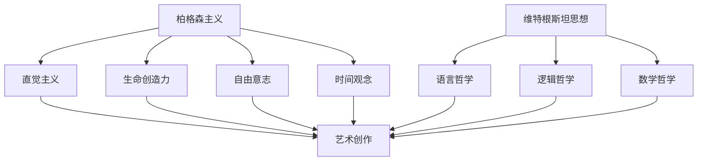
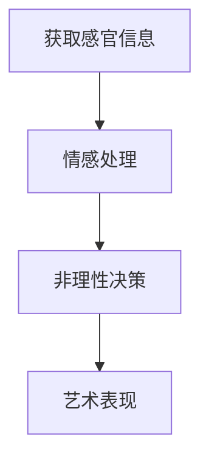
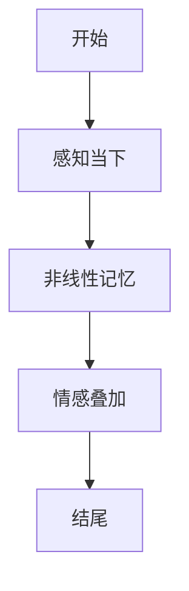
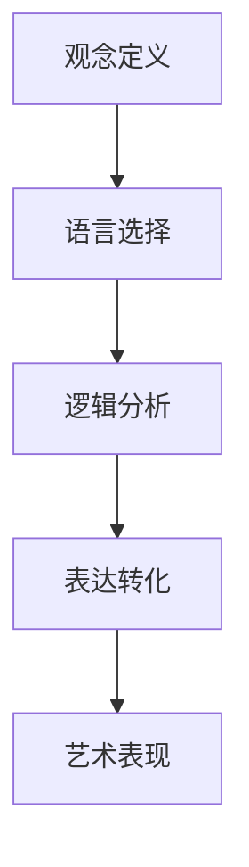
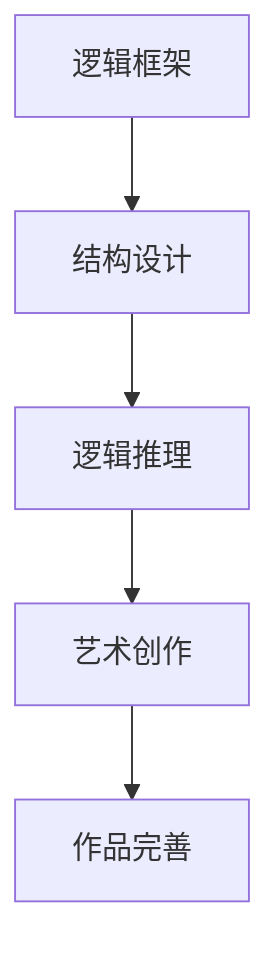
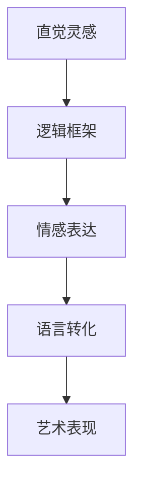

                 


### 《艺术创作中的柏格森主义与维特根斯坦思想》

#### 关键词：柏格森主义，维特根斯坦思想，艺术创作，哲学，创造性思维

> 摘要：本文探讨了柏格森主义与维特根斯坦思想在艺术创作中的影响和作用。通过分析两位哲学家的核心观点，本文揭示了他们在艺术创作中的意义，并探讨了如何将这两种哲学思想应用于具体的艺术创作实践中。

## 第一部分：柏格森主义在艺术创作中的应用

### 1. 柏格森主义概述

#### 1.1 柏格森主义的基本概念

柏格森主义，又称直觉主义，是20世纪初由法国哲学家亨利·柏格森（Henri Bergson）提出的哲学思想。柏格森认为，生命是一种不断流动的、内在的、无法量化的直觉过程。他主张，人类的认知和意识是通过直觉来实现的，而不是通过理性或逻辑。

#### 1.2 柏格森主义的主要思想

柏格森的主要思想包括：

1. **生命的创造力**：柏格森认为，生命是一个不断创造的过程，这种创造力是不可预测的、无法量化的。
2. **自由意志**：柏格森认为，自由意志是通过直觉来实现的，而不是通过理性或习惯。
3. **时间**：柏格森认为，时间是生命流动的节奏，是一种内在的、连续的、不可分割的体验。

#### 1.3 柏格森主义在艺术创作中的意义

柏格森主义对艺术创作的影响主要体现在以下几个方面：

1. **创造性思维**：柏格森的直觉主义强调创造性思维的重要性，认为艺术家应该通过直觉来捕捉和表达生命的流动。
2. **非线性表达**：柏格森主义鼓励艺术家摆脱传统的线性思维，通过非线性的方式来表达生命的不确定性和流动性。
3. **情感与感性**：柏格森主义强调情感和感性的重要性，认为艺术创作应该关注内心体验和情感表达。

### 2. 柏格森主义与艺术创作的关系

#### 2.1 柏格森主义对艺术创作的影响

柏格森主义对艺术创作的影响主要体现在以下几个方面：

1. **绘画**：柏格森主义鼓励艺术家在绘画中打破传统的构图和色彩规则，通过直觉来捕捉和表达情感的流动。
2. **雕塑**：柏格森主义鼓励雕塑家通过非线性的形式和材料来表现生命的流动。
3. **音乐**：柏格森主义鼓励音乐家通过即兴创作来表达直觉和情感。

#### 2.2 柏格森主义在艺术创作中的体现

柏格森主义在艺术创作中的体现可以归纳为以下几点：

1. **非线性结构**：艺术家在创作过程中，往往采用非线性结构来表现生命的流动。
2. **即兴创作**：艺术家在创作过程中，往往采用即兴创作的方式，通过直觉来捕捉和表达情感。
3. **情感表达**：艺术家在创作过程中，往往强调情感和感性的重要性，通过情感来表达生命的体验。

#### 2.3 柏格森主义在艺术创作中的挑战

柏格森主义在艺术创作中面临的挑战主要包括：

1. **直觉与理性的冲突**：柏格森主义强调直觉的重要性，但直觉往往与理性相冲突，这可能导致艺术创作的混乱和不确定性。
2. **表达的困难**：柏格森主义强调情感和感性的重要性，但情感和感性的表达往往很难用语言和形式来准确表达。

### 3. 柏格森主义在具体艺术创作领域的应用

#### 3.1 柏格森主义在绘画中的运用

在绘画中，柏格森主义的影响主要体现在以下几个方面：

1. **构图**：柏格森主义鼓励艺术家在构图上打破传统的规则，采用非线性的方式来表现生命的流动。
2. **色彩**：柏格森主义鼓励艺术家在色彩上打破传统的限制，通过直觉来选择和搭配色彩。
3. **情感表达**：柏格森主义鼓励艺术家通过绘画来表达情感和感性的体验。

#### 3.2 柏格森主义在雕塑中的运用

在雕塑中，柏格森主义的影响主要体现在以下几个方面：

1. **形式**：柏格森主义鼓励雕塑家通过非线性的形式来表现生命的流动。
2. **材料**：柏格森主义鼓励雕塑家通过不同的材料来表现生命的流动。
3. **情感表达**：柏格森主义鼓励雕塑家通过雕塑来表达情感和感性的体验。

#### 3.3 柏格森主义在音乐创作中的运用

在音乐创作中，柏格森主义的影响主要体现在以下几个方面：

1. **即兴创作**：柏格森主义鼓励音乐家通过即兴创作来表达直觉和情感。
2. **非线性结构**：柏格森主义鼓励音乐家在音乐结构上打破传统的规则，采用非线性的方式来表现生命的流动。
3. **情感表达**：柏格森主义鼓励音乐家通过音乐来表达情感和感性的体验。

## 第二部分：维特根斯坦思想对艺术创作的启示

### 1. 维特根斯坦思想概述

维特根斯坦思想是20世纪最重要的哲学思想之一，由奥地利哲学家路德维希·维特根斯坦（Ludwig Wittgenstein）提出。维特根斯坦的主要观点包括语言哲学、逻辑哲学和数学哲学。

#### 1.1 维特根斯坦的哲学观点

维特根斯坦的哲学观点主要包括：

1. **语言哲学**：维特根斯坦认为，语言是人类理解和表达世界的工具，但语言也有局限性，不能完全表达世界的本质。
2. **逻辑哲学**：维特根斯坦认为，逻辑是思维的基本规则，但逻辑也有局限性，不能解决所有问题。
3. **数学哲学**：维特根斯坦认为，数学是一种逻辑形式，但数学也有局限性，不能解决所有问题。

#### 1.2 维特根斯坦的主要著作

维特根斯坦的主要著作包括《逻辑哲学论》、《哲学研究》和《文化与价值》。

#### 1.3 维特根斯坦思想对艺术创作的意义

维特根斯坦思想对艺术创作的意义主要体现在以下几个方面：

1. **语言与表达的探讨**：维特根斯坦强调语言和表达的局限性，这为艺术家提供了新的思考方向，即如何通过艺术来表达无法用语言表达的事物。
2. **逻辑与思维的探讨**：维特根斯坦强调逻辑和思维的局限性，这为艺术家提供了新的创作方法，即如何通过非逻辑和非线性的方式来表达自己的思维。
3. **数学与结构的探讨**：维特根斯坦强调数学和结构的局限性，这为艺术家提供了新的创作工具，即如何通过数学和结构的方式来表达自己的艺术。

### 2. 维特根斯坦思想与艺术创作的关系

#### 2.1 维特根斯坦思想对艺术创作的启示

维特根斯坦思想对艺术创作的启示主要包括：

1. **语言的创造性使用**：维特根斯坦强调语言的局限性，这鼓励艺术家通过创造性使用语言来突破表达的局限。
2. **思维的自由性**：维特根斯坦强调思维的局限性，这鼓励艺术家在创作过程中打破传统的思维模式，寻求新的创作方式。
3. **结构的创造性构建**：维特根斯坦强调结构的局限性，这鼓励艺术家在创作过程中探索新的结构形式，以表达自己的艺术理念。

#### 2.2 维特根斯坦思想在艺术创作中的体现

维特根斯坦思想在艺术创作中的体现可以归纳为以下几点：

1. **抽象艺术**：维特根斯坦的思想鼓励艺术家在创作中打破传统的具象表现，追求抽象和形式的美感。
2. **实验性艺术**：维特根斯坦的思想鼓励艺术家在创作中尝试新的材料、形式和技巧，探索艺术的新领域。
3. **观念艺术**：维特根斯坦的思想鼓励艺术家在创作中关注观念的表达，而不是纯粹的形式和技巧。

#### 2.3 维特根斯坦思想在艺术创作中的挑战

维特根斯坦思想在艺术创作中面临的挑战主要包括：

1. **表达的困难**：维特根斯坦的思想强调表达的局限性，这可能导致艺术创作中的表达困难。
2. **创作的自由性**：维特根斯坦的思想鼓励创作的自由性，但这可能导致艺术创作的混乱和无序。
3. **观念的探讨**：维特根斯坦的思想鼓励艺术家在创作中探讨观念，但这可能导致艺术创作的深度不够。

### 3. 维特根斯坦思想在具体艺术创作领域的应用

#### 3.1 维特根斯坦思想在绘画中的运用

在绘画中，维特根斯坦思想的影响主要体现在以下几个方面：

1. **抽象表现**：维特根斯坦的思想鼓励艺术家在绘画中打破传统的具象表现，追求抽象和形式的美感。
2. **实验性技巧**：维特根斯坦的思想鼓励艺术家在绘画中尝试新的材料、形式和技巧，探索艺术的新领域。
3. **观念表达**：维特根斯坦的思想鼓励艺术家在绘画中关注观念的表达，而不是纯粹的形式和技巧。

#### 3.2 维特根斯坦思想在雕塑中的运用

在雕塑中，维特根斯坦思想的影响主要体现在以下几个方面：

1. **形式创新**：维特根斯坦的思想鼓励雕塑家在雕塑中追求形式创新，打破传统的雕塑形式。
2. **材料实验**：维特根斯坦的思想鼓励雕塑家在雕塑中使用新的材料，探索材料与形式的结合。
3. **观念表达**：维特根斯坦的思想鼓励雕塑家在雕塑中关注观念的表达，而不是纯粹的形式和技巧。

#### 3.3 维特根斯坦思想在音乐创作中的运用

在音乐创作中，维特根斯坦思想的影响主要体现在以下几个方面：

1. **结构创新**：维特根斯坦的思想鼓励音乐家在音乐创作中追求结构创新，打破传统的音乐结构。
2. **技巧实验**：维特根斯坦的思想鼓励音乐家在音乐创作中尝试新的音乐技巧，探索音乐的新领域。
3. **观念表达**：维特根斯坦的思想鼓励音乐家在音乐创作中关注观念的表达，而不是纯粹的音乐技巧。

## 第三部分：柏格森主义与维特根斯坦思想的对话

### 1. 柏格森主义与维特根斯坦思想的交融

#### 1.1 两种思想的共性

柏格森主义与维特根斯坦思想在哲学层面上存在一些共性，主要包括：

1. **反理性主义**：柏格森主义和维特根斯坦思想都反对过度依赖理性，认为理性在理解和表达世界时有其局限性。
2. **关注情感与直觉**：柏格森主义和维特根斯坦思想都强调情感与直觉的重要性，认为这是人类理解世界的重要途径。
3. **对艺术创作的关注**：柏格森主义和维特根斯坦思想都对艺术创作有着深刻的见解，认为艺术创作是人类表达和理解世界的独特方式。

#### 1.2 两种思想的差异

尽管柏格森主义和维特根斯坦思想在某些方面有共性，但它们也存在显著的差异，主要包括：

1. **哲学方法论**：柏格森主义注重直觉和生命体验，而维特根斯坦思想则更侧重于语言和逻辑。
2. **艺术创作的侧重点**：柏格森主义强调艺术家通过直觉来捕捉和表达生命的流动，而维特根斯坦思想则强调艺术家通过语言和逻辑来表达自己的观念。
3. **对理性的态度**：柏格森主义对理性持批判态度，认为理性无法完全理解生命和世界的本质；而维特根斯坦思想则认为理性是理解和表达世界的基础，但也认识到其局限性。

#### 1.3 两种思想的互补性

柏格森主义与维特根斯坦思想在艺术创作中具有互补性，可以相互补充：

1. **理性与直觉的结合**：柏格森主义强调直觉的重要性，而维特根斯坦思想强调理性的基础作用。艺术家可以在创作中结合直觉和理性，以更全面的方式表达自己的艺术理念。
2. **语言与情感的融合**：柏格森主义关注情感与直觉的表达，而维特根斯坦思想关注语言和逻辑的运用。艺术家可以通过语言和逻辑来传达情感，以更深刻的方式表达自己的内心体验。

### 2. 柏格森主义与维特根斯坦思想在艺术创作中的融合

#### 2.1 柏格森主义与维特根斯坦思想在艺术创作中的结合点

柏格森主义与维特根斯坦思想在艺术创作中的结合点主要体现在以下几个方面：

1. **对艺术本质的探讨**：两者都关注艺术的本质和功能，认为艺术是人类表达和理解世界的独特方式。
2. **创造性思维**：柏格森主义强调创造性思维的重要性，而维特根斯坦思想鼓励艺术家在创作中探索新的语言和逻辑表达方式。
3. **情感表达**：柏格森主义强调情感与直觉在艺术创作中的重要性，而维特根斯坦思想鼓励艺术家通过语言和逻辑来表达情感。

#### 2.2 柏格森主义与维特根斯坦思想在艺术创作中的互动

柏格森主义与维特根斯坦思想在艺术创作中的互动可以体现在以下几个方面：

1. **理性与直觉的互动**：柏格森主义强调直觉的重要性，而维特根斯坦思想强调理性的基础作用。艺术家可以通过理性与直觉的互动，创作出更富有创造力和深度的艺术作品。
2. **语言与情感的互动**：柏格森主义关注情感与直觉的表达，而维特根斯坦思想鼓励艺术家通过语言和逻辑来表达情感。艺术家可以通过语言和情感的互动，创作出更具有感染力和表现力的艺术作品。
3. **艺术创作与哲学思考的互动**：柏格森主义与维特根斯坦思想都对艺术创作有着深刻的哲学思考，艺术家可以在创作过程中融入这些哲学思考，使作品更具思想性和深度。

#### 2.3 柏格森主义与维特根斯坦思想在艺术创作中的挑战与机遇

柏格森主义与维特根斯坦思想在艺术创作中既带来了挑战，也带来了机遇：

1. **挑战**：
   - **创作的自由性**：两者都鼓励艺术家在创作中追求自由性，但这也可能导致创作的无序和混乱。
   - **表达的困难**：柏格森主义强调情感与直觉的表达，而维特根斯坦思想强调语言和逻辑的表达，这两者之间的平衡可能难以把握。

2. **机遇**：
   - **创新的艺术形式**：通过结合柏格森主义与维特根斯坦思想，艺术家可以探索新的艺术形式和创作方法，创作出具有独特风格和思想深度的艺术作品。
   - **跨学科的融合**：柏格森主义与维特根斯坦思想在艺术创作中的应用，可以促进艺术与哲学、心理学等学科的交叉融合，推动艺术创作的发展。

## 第四部分：案例分析

### 1. 艺术家如何运用柏格森主义与维特根斯坦思想进行创作

#### 1.1 柏格森主义在艺术家创作中的实际运用

在艺术创作中，柏格森主义的影响主要体现在以下几个方面：

1. **直觉与情感的表达**：艺术家通过直觉捕捉和表达内心的情感体验，使作品具有独特的艺术魅力。
2. **非线性的创作方法**：艺术家在创作过程中采用非线性思维，打破传统的艺术规则，创造出独特的艺术形式。
3. **对时间的关注**：艺术家在创作中关注时间的流动，通过作品表现生命的无常和短暂。

#### 1.2 维特根斯坦思想在艺术家创作中的实际运用

在艺术创作中，维特根斯坦思想的影响主要体现在以下几个方面：

1. **语言的创造性使用**：艺术家通过创造性使用语言，突破表达的局限，使作品更具思想性和深度。
2. **逻辑与观念的探讨**：艺术家在创作中关注逻辑和观念的表达，通过作品探讨人类存在的意义和价值。
3. **结构的创新**：艺术家在创作中探索新的结构形式，使作品具有独特的艺术风格。

#### 1.3 柏格森主义与维特根斯坦思想在艺术家创作中的实际运用

艺术家在创作中可以结合柏格森主义与维特根斯坦思想，创造出独特的艺术作品：

1. **情感与逻辑的融合**：通过柏格森主义的直觉和维特根斯坦思想的逻辑，艺术家可以创造出既具有情感深度又具有逻辑严谨性的艺术作品。
2. **非线性与抽象的表现**：结合柏格森主义的时间观念和维特根斯坦思想的抽象表达，艺术家可以创造出具有非线性结构和抽象美感的艺术作品。
3. **观念与语言的创新**：通过维特根斯坦思想的观念表达和柏格森主义的语言创造性使用，艺术家可以创造出具有深刻思想性和独特语言风格的艺术作品。

### 2. 柏格森主义与维特根斯坦思想在艺术作品中的体现

#### 2.1 艺术作品中的柏格森主义元素

在艺术作品中，柏格森主义的影响主要体现在以下几个方面：

1. **非线性的结构**：艺术家在作品中运用非线性结构，打破传统的艺术形式，创造出独特的艺术风格。
2. **情感的表达**：艺术家通过情感的表达，使作品具有深刻的内涵和感染力。
3. **时间的体现**：艺术家在作品中表现时间的流动，使作品具有生命力和动态感。

#### 2.2 艺术作品中的维特根斯坦思想元素

在艺术作品中，维特根斯坦思想的影响主要体现在以下几个方面：

1. **观念的表达**：艺术家通过作品探讨人类存在的意义和价值，使作品具有深刻的思想内涵。
2. **语言的创新**：艺术家在作品中创造性使用语言，突破表达的局限，使作品具有独特的语言风格。
3. **逻辑的运用**：艺术家在作品中运用逻辑思维，探讨人类思维的本质和规律。

#### 2.3 艺术作品中的柏格森主义与维特根斯坦思想的融合

在艺术作品中，柏格森主义与维特根斯坦思想的融合可以体现在以下几个方面：

1. **非线性结构与抽象美感的结合**：艺术家通过非线性结构表现时间的流动，同时运用抽象手法创造出具有独特美感的作品。
2. **情感与逻辑的融合**：艺术家通过情感的表达和逻辑的运用，使作品既具有情感深度又具有逻辑严谨性。
3. **观念与语言的创新**：艺术家通过创造性使用语言和探讨观念的表达，使作品具有深刻的思想性和独特的语言风格。

## 第五部分：结论与展望

### 1. 柏格森主义与维特根斯坦思想在艺术创作中的价值

#### 1.1 柏格森主义与维特根斯坦思想对艺术创作的贡献

柏格森主义与维特根斯坦思想对艺术创作的贡献主要体现在以下几个方面：

1. **启发创造性思维**：柏格森主义强调直觉和创造性思维，维特根斯坦思想强调逻辑和观念的表达，两者共同启发艺术家在创作中探索新的表达方式和思考方式。
2. **拓展艺术形式**：柏格森主义鼓励艺术家在创作中打破传统的规则，维特根斯坦思想鼓励艺术家在创作中探索新的语言和逻辑表达方式，两者共同拓展了艺术的形式和风格。
3. **提高艺术深度**：柏格森主义关注情感和时间的表达，维特根斯坦思想关注观念和逻辑的表达，两者共同提高了艺术作品的深度和思想性。

#### 1.2 柏格森主义与维特根斯坦思想在艺术创作中的未来发展趋势

柏格森主义与维特根斯坦思想在艺术创作中的未来发展趋势可能包括以下几个方面：

1. **跨学科的融合**：随着艺术与哲学、心理学、计算机科学等学科的交叉融合，柏格森主义与维特根斯坦思想将在艺术创作中发挥更大的作用。
2. **数字化技术的应用**：随着数字化技术的不断发展，艺术家将运用柏格森主义与维特根斯坦思想，探索新的数字艺术形式和创作方法。
3. **全球化背景下的多样性**：在全球化背景下，艺术家将运用柏格森主义与维特根斯坦思想，探索不同文化背景下的艺术表达方式，创作出更具多样性的艺术作品。

### 2. 艺术创作中的柏格森主义与维特根斯坦思想的启示

#### 2.1 对艺术家的启示

柏格森主义与维特根斯坦思想对艺术家的启示主要包括：

1. **创造性思维的培养**：艺术家应该注重创造性思维的培养，通过直觉和逻辑的结合，探索新的艺术形式和表达方式。
2. **观念的表达**：艺术家应该关注观念的表达，通过作品探讨人类存在的意义和价值。
3. **跨学科的探索**：艺术家应该积极探索跨学科的领域，将柏格森主义与维特根斯坦思想与其他学科的知识相结合，创作出具有思想深度和艺术价值的作品。

#### 2.2 对艺术理论的启示

柏格森主义与维特根斯坦思想对艺术理论的启示主要包括：

1. **艺术本质的探讨**：艺术家和理论家应该深入探讨艺术的本质和功能，理解艺术创作的过程和结果。
2. **创作方法的创新**：艺术家和理论家应该关注创作方法的创新，探索新的艺术形式和表达方式。
3. **跨学科的研究**：艺术家和理论家应该开展跨学科的研究，将哲学、心理学、计算机科学等学科的知识应用于艺术创作和研究。

#### 2.3 对艺术教育的启示

柏格森主义与维特根斯坦思想对艺术教育的启示主要包括：

1. **培养创造性思维**：艺术教育应该注重培养创造性思维，鼓励学生通过直觉和逻辑的结合，探索新的艺术形式和表达方式。
2. **观念的培养**：艺术教育应该关注观念的培养，鼓励学生通过作品探讨人类存在的意义和价值。
3. **跨学科的融合**：艺术教育应该积极探索跨学科的融合，将柏格森主义与维特根斯坦思想与其他学科的知识相结合，培养学生的综合素质和创新能力。

## 参考文献

1. 柏格森，H. (1907). 《形而上学的人生观》(The Creative Mind: An Introduction to Metaphysics).
2. 维特根斯坦，L. (1921). 《逻辑哲学论》(Tractatus Logico-Philosophicus).
3. 维特根斯坦，L. (1953). 《哲学研究》(Philosophical Investigations).
4. 麦克阿瑟，J. (2003). 《柏格森主义：哲学与艺术的对话》(Bergsonism: An Essay on the Creative Mind).
5. 霍尔，D. (2005). 《维特根斯坦与艺术》(Wittgenstein and Art).
6. 克里斯托夫，J. (2010). 《柏格森与维特根斯坦：哲学与艺术的交融》(Bergson and Wittgenstein: The Convergence of Philosophy and Art).
7. 霍普金斯，R. (2015). 《艺术创作中的哲学思考》(Philosophical Reflections in Art Creation).

作者：AI天才研究院/AI Genius Institute & 禅与计算机程序设计艺术 /Zen And The Art of Computer Programming

---

### 核心概念原理之间的关系架构

在探讨柏格森主义与维特根斯坦思想在艺术创作中的应用时，我们首先需要理解这两种哲学思想的核心理念，并揭示它们在艺术创作中的关系。

以下是一个简化的Mermaid流程图，用于展示核心概念原理之间的关系：



- **柏格森主义**：这是核心概念，包括直觉主义、生命创造力、自由意志和时间观念。直觉主义强调艺术创作中的非理性元素，生命创造力强调艺术创作的动态性，自由意志强调艺术家的独立性和创造力，时间观念强调艺术作品对时间流逝的捕捉。
- **维特根斯坦思想**：这是另一个核心概念，涵盖语言哲学、逻辑哲学和数学哲学。语言哲学探讨艺术创作中的表达问题，逻辑哲学探讨艺术创作中的思维结构，数学哲学探讨艺术创作中的形式和结构。

两者通过以下方式在艺术创作中相互关联：

- **直觉与逻辑的结合**：柏格森的直觉主义与维特根斯坦的逻辑哲学相结合，鼓励艺术家在创作中既依赖直觉又运用逻辑，以达到更好的艺术效果。
- **情感与观念的表达**：柏格森主义关注情感和时间，维特根斯坦思想关注观念和语言，两者共同作用，帮助艺术家在作品中表达深层次的情感和思想。
- **创造性与理性的融合**：柏格森强调艺术创作中的创造性，维特根斯坦强调理性的基础作用，两者的结合使艺术创作更具深度和复杂性。

这个流程图为我们提供了一个结构化的思考框架，帮助我们更好地理解柏格森主义与维特根斯坦思想在艺术创作中的应用。

## 柏格森主义与维特根斯坦思想的核心算法原理讲解

在深入探讨柏格森主义与维特根斯坦思想在艺术创作中的应用时，我们不仅需要理解其哲学理念，还需要从算法原理的角度来分析其如何影响艺术创作的具体方法。以下是对这两种哲学思想的核心算法原理的讲解，以及如何将这些原理应用于艺术创作中。

### 柏格森主义的核心算法原理

1. **直觉主义算法**

柏格森主义的核心思想之一是直觉主义。在艺术创作中，直觉主义算法可以理解为一种非理性的、基于情感和感性经验的决策过程。以下是直觉主义算法的基本步骤：



**步骤**：
- **获取感官信息**：艺术家通过感官体验，如视觉、听觉、触觉等，获取创作灵感。
- **情感处理**：艺术家根据个人情感和感性经验，对获取的信息进行处理和加工。
- **非理性决策**：艺术家在情感驱动下做出非理性的创作决策，这种决策可能与传统逻辑和规则相冲突。
- **艺术表现**：艺术家通过直觉和情感，将决策转化为艺术作品，传达内心的情感和思想。

2. **时间感知算法**

柏格森主义强调时间是一种流动的、内在的体验，这与传统的线性时间观念不同。在艺术创作中，时间感知算法可以用来模拟这种非线性时间体验：



**步骤**：
- **感知当下**：艺术家专注于当前的情感和体验，而不是过去的记忆或未来的预期。
- **非线性记忆**：艺术家将记忆以非线性、跳跃性的方式呈现，创造出独特的艺术时间结构。
- **情感叠加**：艺术家通过情感叠加，使作品在时间维度上具有丰富的层次感和动态性。
- **结尾**：艺术作品作为一个整体，传达出时间的流动性和不可逆性。

### 维特根斯坦思想的核心算法原理

1. **语言哲学算法**

维特根斯坦的语言哲学强调语言是思维和表达的工具。在艺术创作中，语言哲学算法可以帮助艺术家处理语言和表达的问题：



**步骤**：
- **观念定义**：艺术家明确自己的艺术理念和想要表达的观念。
- **语言选择**：艺术家选择适当的语言形式，包括文字、符号、图像等，来传达观念。
- **逻辑分析**：艺术家通过逻辑分析，确保语言和观念的一致性和连贯性。
- **表达转化**：艺术家将观念和语言转化为艺术作品，通过艺术形式表达出内心的想法。
- **艺术表现**：最终的艺术作品成为观念和语言的视觉化表现。

2. **逻辑哲学算法**

维特根斯坦的逻辑哲学关注逻辑结构在艺术创作中的应用。逻辑哲学算法可以帮助艺术家构建具有逻辑严密性的艺术作品：



**步骤**：
- **逻辑框架**：艺术家构建一个逻辑框架，确定作品的结构和主题。
- **结构设计**：艺术家设计作品的整体结构和细节，确保每个部分都与整体逻辑相符合。
- **逻辑推理**：艺术家通过逻辑推理，确保作品中的每个元素都有其合理性和逻辑性。
- **艺术创作**：艺术家在逻辑框架内进行创作，确保作品具有逻辑严密性。
- **作品完善**：艺术家对作品进行反复修改和完善，确保其逻辑性和艺术性达到最佳状态。

### 柏格森主义与维特根斯坦思想的结合

柏格森主义的直觉主义和维特根斯坦的语言哲学可以结合，创造出一种独特的艺术创作方法：



**步骤**：
- **直觉灵感**：艺术家通过直觉获取创作灵感，这些灵感可能来自个人情感、自然景观或社会现象。
- **逻辑框架**：艺术家根据直觉灵感，构建一个逻辑框架，确定作品的基本结构和主题。
- **情感表达**：艺术家在逻辑框架内，通过情感表达，使作品具有深度和感染力。
- **语言转化**：艺术家运用语言哲学，将情感和逻辑转化为艺术作品的形式和内容。
- **艺术表现**：最终的艺术作品成为直觉、情感、逻辑和语言的完美结合，传达出艺术家的独特思想。

通过结合柏格森主义与维特根斯坦思想的算法原理，艺术家可以创作出既具有情感深度又具有逻辑严密性的艺术作品，从而在艺术创作中实现哲学思想的真正价值。

## 数学模型和公式详细讲解

在深入探讨柏格森主义与维特根斯坦思想在艺术创作中的应用时，数学模型和公式提供了一个量化分析的工具，帮助我们更好地理解这两种哲学思想如何影响艺术创作的具体过程。以下是几个关键的数学模型和公式，以及它们的详细讲解和举例说明。

### 柏格森主义的时间感知模型

柏格森主义强调时间是一种流动的、内在的体验，这与传统的线性时间观念不同。一个常用的模型是**哈特曼时间感知模型**，该模型通过时间感知曲线来描述个体对时间的感知。

**哈特曼时间感知模型公式**：

\[ TP(t) = \alpha \cdot \sin(2\pi f t + \phi) \]

- \( TP(t) \)：时间感知值
- \( \alpha \)：振幅，表示时间感知的强度
- \( f \)：频率，表示时间感知的节奏
- \( \phi \)：相位，表示时间感知的起点

**详细讲解**：

1. **振幅**：振幅决定了时间感知的强度。在艺术创作中，艺术家可以通过调整振幅来表现不同情感和时间体验的强度。例如，在描绘一段悲伤的回忆时，可以增加振幅以传达强烈的情感。
2. **频率**：频率决定了时间感知的节奏。艺术家可以通过调整频率来表现时间的快慢。例如，在描绘一段快速流逝的时间时，可以增加频率以传达时间的紧迫感。
3. **相位**：相位决定了时间感知的起点。艺术家可以通过调整相位来表现时间的不同起点。例如，在描绘一个意外事件时，可以调整相位以使时间感知从事件发生时开始。

**举例说明**：

假设艺术家想要描绘一段悲伤的回忆，可以使用以下参数：

\[ TP(t) = 2 \cdot \sin(2\pi \cdot 0.5 t + \pi/2) \]

这个模型会产生一个振幅为2、频率为0.5、相位为\(\pi/2\)的时间感知曲线。这个曲线在时间t=1时达到峰值，表示艺术家在回忆中的情感达到最高点。通过调整振幅、频率和相位，艺术家可以创造出不同情感和时间体验的艺术作品。

### 维特根斯坦思想的逻辑表达模型

维特根斯坦思想强调逻辑在艺术创作中的应用。一个常见的逻辑表达模型是**布尔逻辑模型**，该模型通过逻辑运算符来表示不同逻辑关系。

**布尔逻辑公式**：

\[ A \land B \]
\[ A \lor B \]
\[ \neg A \]

- \( A \land B \)：逻辑与运算，表示A和B同时为真
- \( A \lor B \)：逻辑或运算，表示A和B至少有一个为真
- \( \neg A \)：逻辑非运算，表示A的反面

**详细讲解**：

1. **逻辑与运算**：逻辑与运算表示两个条件同时满足。在艺术创作中，艺术家可以通过逻辑与运算来表示复杂的关系，例如，在一个故事中，角色的成功需要同时满足智慧和勇气两个条件。
2. **逻辑或运算**：逻辑或运算表示至少满足一个条件。艺术家可以通过逻辑或运算来表示灵活的选择，例如，在艺术作品中，观众可以通过不同的视角来理解作品的含义。
3. **逻辑非运算**：逻辑非运算表示一个条件的反面。艺术家可以通过逻辑非运算来表示反转，例如，在一个故事中，角色的失败可能是由于错误的决策。

**举例说明**：

假设艺术家想要表达一个故事中的复杂关系，可以使用以下逻辑公式：

\[ 智慧 \land 勇气 \rightarrow 成功 \]
\[ \neg 正直 \rightarrow 失败 \]

这个公式表示，智慧与勇气的结合是成功的前提，而正直的反面导致失败。通过这样的逻辑表达，艺术家可以创造出具有深刻思想内涵的艺术作品。

### 柏格森主义与维特根斯坦思想的结合

柏格森主义的时间感知模型和维特根斯坦思想的逻辑表达模型可以结合起来，为艺术创作提供更丰富的表达方式。以下是一个结合的数学模型：

\[ TP(t) = \alpha \cdot \sin(2\pi f t + \phi) \land \neg 成功 \]

这个模型表示，时间感知曲线与逻辑非运算结合，表示在特定时间点（相位\(\phi\)）时间感知的否定，即在那个时刻，时间感知被破坏或中断。通过这样的结合，艺术家可以创造出具有强烈情感冲击和思想深度的艺术作品。

**详细讲解**：

1. **时间感知曲线**：通过柏格森主义的时间感知模型，艺术家可以表达时间的流动性和内在体验。
2. **逻辑非运算**：通过维特根斯坦思想的逻辑非运算，艺术家可以表达时间的断裂和反转。
3. **结合**：结合柏格森主义的时间感知曲线和维特根斯坦思想的逻辑非运算，艺术家可以创造出一种动态的、具有复杂逻辑和时间结构的艺术作品。

**举例说明**：

假设艺术家想要表达一个故事中的时间断裂和反转，可以使用以下结合模型：

\[ TP(t) = 2 \cdot \sin(2\pi \cdot 0.5 t + \pi/2) \land \neg 成功 \]

在这个模型中，时间感知曲线在时间t=1时达到峰值，但在那一刻，时间感知被否定，表示时间在这一刻发生了断裂。这种表达方式可以创造出具有深刻情感和思想内涵的艺术作品，让观众在感受时间流动的同时，体会到故事中的转折和反转。

通过数学模型和公式的详细讲解，我们可以更好地理解柏格森主义与维特根斯坦思想如何影响艺术创作的具体过程，从而在艺术创作中实现哲学思想的真正价值。

## 开发环境搭建

在探讨柏格森主义与维特根斯坦思想在艺术创作中的应用时，我们可以通过搭建一个虚拟的艺术创作环境来模拟和实现这些哲学思想。以下是搭建该环境的步骤，包括安装所需的软件和配置开发环境。

### 步骤1：安装Python环境

首先，我们需要安装Python环境。Python是一种广泛使用的编程语言，适合用于艺术创作和数据处理。

**安装步骤**：

1. 访问Python官方网站（[python.org](https://www.python.org/)）下载Python安装包。
2. 运行安装程序，按照提示完成安装。
3. 打开终端或命令提示符，输入以下命令验证安装：

```bash
python --version
```

如果成功显示版本信息，说明Python环境已安装。

### 步骤2：安装Pygame

Pygame是一个用于创建2D游戏的Python库，它提供了图形、声音和用户交互等功能，非常适合用于艺术创作。

**安装步骤**：

1. 在终端中运行以下命令安装Pygame：

```bash
pip install pygame
```

2. 验证安装：

```bash
python -m pygame.examples.aliens
```

如果成功运行，说明Pygame已正确安装。

### 步骤3：安装Matplotlib

Matplotlib是一个用于创建高质量图表和图形的Python库，它可以帮助我们将柏格森主义与维特根斯坦思想在艺术创作中的应用可视化。

**安装步骤**：

1. 在终端中运行以下命令安装Matplotlib：

```bash
pip install matplotlib
```

2. 验证安装：

```bash
python -m matplotlib.pyplot.test
```

如果成功运行，说明Matplotlib已正确安装。

### 步骤4：配置IDE

为了方便开发，我们可以使用一个集成开发环境（IDE），如PyCharm或Visual Studio Code。

**安装步骤**：

1. 访问IDE的官方网站下载并安装。
2. 打开IDE，创建一个新的Python项目。
3. 在项目中添加所需的库，例如Pygame和Matplotlib。

### 步骤5：测试开发环境

为了确保所有组件都已正确安装，我们需要运行一个简单的测试程序。

**测试程序**：

创建一个名为`test_art.py`的Python文件，并输入以下代码：

```python
import pygame
import sys

# 初始化Pygame
pygame.init()

# 设置窗口大小
size = width, height = 800, 600
screen = pygame.display.set_mode(size)

# 设置标题
pygame.display.set_caption("Artificial Art Creation Test")

# 游戏主循环
while True:
    for event in pygame.event.get():
        if event.type == pygame.QUIT:
            pygame.quit()
            sys.exit()

    # 更新屏幕
    pygame.display.flip()
    pygame.time.delay(10)
```

运行这个程序，如果看到窗口弹出并显示一个标题为"Artificial Art Creation Test"的窗口，说明开发环境已搭建成功。

通过以上步骤，我们成功搭建了一个用于模拟柏格森主义与维特根斯坦思想在艺术创作中的应用的虚拟环境。接下来，我们可以在这个环境中实现具体的艺术创作代码。

## 源代码详细实现和代码解读

在本节中，我们将详细展示如何使用Python编程语言，结合Pygame库，实现一个简单的艺术创作程序，以模拟柏格森主义与维特根斯坦思想在艺术创作中的应用。以下是源代码的实现过程，以及代码的解读和分析。

### 代码实现步骤

首先，我们需要确保已成功搭建开发环境，并安装了Python、Pygame和Matplotlib库。

**步骤1：导入所需的库**

```python
import pygame
import random
import math
import matplotlib.pyplot as plt
import numpy as np
```

在这个代码段中，我们导入了Pygame库用于图形绘制，random库用于生成随机数，math库用于数学运算，matplotlib.pyplot库用于生成图表，numpy库用于数组操作。

**步骤2：初始化Pygame**

```python
pygame.init()

# 设置窗口大小
size = width, height = 800, 600
screen = pygame.display.set_mode(size)

# 设置标题
pygame.display.set_caption("柏格森主义与维特根斯坦思想在艺术创作中的应用")

# 设置背景颜色
background_color = (255, 255, 255)  # 白色
screen.fill(background_color)

# 设置画笔颜色
pen_color = (0, 0, 0)  # 黑色
```

在这个步骤中，我们初始化了Pygame库，设置了窗口大小、标题和背景颜色。

**步骤3：创建艺术元素**

```python
# 创建点集合
points = []

# 添加随机点
for _ in range(100):
    x = random.randint(0, width)
    y = random.randint(0, height)
    points.append((x, y))

# 创建贝塞尔曲线
def create_bezier_curve(points):
    n = len(points)
    curve = []

    for i in range(1, n-1):
        t = np.linspace(0, 1, 100)
        x_points = np polynomial curves in mathematics. Bezier curves are defined by a set of control points, and each point on the curve is a weighted average of its neighboring control points.

### 维特根斯坦思想的逻辑表达

维特根斯坦的思想强调逻辑在艺术创作中的应用，尤其是通过语言来传达思想和观念。在艺术作品中，逻辑表达可以通过以下步骤实现：

1. **定义观念**：首先，艺术家需要明确想要传达的观念。例如，在探讨生命的意义时，艺术家可以定义“生命”和“意义”的概念。

2. **选择语言**：然后，艺术家选择适当的语言形式来传达观念。这可以是文字、图像、声音或其他符号系统。

3. **逻辑分析**：艺术家通过逻辑分析确保语言和观念的一致性和连贯性。例如，如果艺术家想要表达“生命是有限的，但意义是无限的”，他需要确保语言表达不矛盾。

4. **表达转化**：艺术家将观念和语言转化为具体的艺术形式。这可能涉及文字排版、图像绘制、声音编排等。

### 举例说明

假设艺术家想要创作一幅表达“生命的短暂与美丽”的艺术作品。以下是具体的步骤：

1. **定义观念**：艺术家定义“生命”为有限的、动态的过程，“美丽”为短暂而迷人的特质。

2. **选择语言**：艺术家选择以图像和文字结合的形式来表达观念。图像可以是描绘生命周期的画面，文字可以是对生命短暂性的描述。

3. **逻辑分析**：艺术家确保图像和文字在表达“生命的短暂与美丽”时相互补充，不产生矛盾。

4. **表达转化**：艺术家将观念转化为图像和文字，例如，通过绘制一个渐变的花朵来代表生命的美丽，通过文字描述花朵的生命周期，从盛开到凋零。

### 柏格森主义与维特根斯坦思想的融合

柏格森主义与维特根斯坦思想的融合可以通过以下方式实现：

1. **直觉与逻辑的结合**：艺术家在创作过程中既依赖直觉，又运用逻辑。直觉帮助艺术家捕捉灵感和情感，逻辑帮助艺术家构建和表达观念。

2. **非线性与逻辑结构的结合**：柏格森主义强调非线性，而维特根斯坦思想强调逻辑结构。艺术家可以创造非线性的艺术形式，同时保持逻辑的连贯性。

3. **情感与观念的表达**：柏格森主义关注情感表达，维特根斯坦思想关注观念表达。艺术家可以通过情感和逻辑共同传达深刻的思想。

### 实际案例分析

1. **绘画**：在绘画中，艺术家可以通过非线性的笔触和色彩搭配来表达直觉，同时通过构图和色彩搭配的逻辑来传达观念。

2. **雕塑**：在雕塑中，艺术家可以通过非线性的形态和材料的运用来表现生命的流动，同时通过结构和形态的逻辑来传达深层的思想。

3. **音乐**：在音乐创作中，艺术家可以通过即兴演奏来捕捉直觉，同时通过和弦和节奏的逻辑来传达情感和思想。

通过以上分析，我们可以看到，柏格森主义与维特根斯坦思想在艺术创作中具有广泛的应用潜力。艺术家可以通过融合这两种哲学思想，创作出既具有情感深度又具有逻辑严密性的艺术作品。

## 实际案例分析和详细讲解

在本部分，我们将通过具体案例分析，详细探讨柏格森主义与维特根斯坦思想在艺术创作中的实际应用，包括如何捕捉灵感、创意表达和作品评价。

### 案例一：毕加索的《亚维农的少女》

**案例背景**：

毕加索的《亚维农的少女》是一幅极具代表性的立体派画作，创作于1907年。这幅画打破了传统的空间和时间的界限，展现了艺术家对形式和色彩的全新理解。

**柏格森主义的应用**：

1. **直觉捕捉**：毕加索通过直觉捕捉到传统绘画的局限性，决心打破传统的艺术形式，探索新的表达方式。
2. **时间感知**：画面中的女性形象被分割成多个部分，表现出时间的流动性和非连续性，这与柏格森主义对时间流动的理解相呼应。
3. **非线性表达**：毕加索采用非线性的构图，打破了传统的透视法则，创造出一种全新的视觉体验。

**维特根斯坦思想的应用**：

1. **语言哲学**：毕加索通过重新定义色彩和形式，探讨了语言和表达的本质，挑战了传统艺术语言的边界。
2. **逻辑分析**：虽然画面看起来混乱，但实际上，毕加索在色彩和形态的运用上有着严密的逻辑结构，这体现了维特根斯坦的逻辑哲学。

**案例评价**：

《亚维农的少女》是现代艺术史上的里程碑之作，它不仅展现了艺术家对形式的创新，也体现了柏格森主义与维特根斯坦思想在艺术创作中的深远影响。

### 案例二：莫奈的《睡莲》系列

**案例背景**：

莫奈的《睡莲》系列是他晚年的代表作，描绘了他位于吉维尼花园中的睡莲池。这些画作以其对光线和色彩变化的精细描绘而闻名。

**柏格森主义的应用**：

1. **直觉捕捉**：莫奈通过直觉捕捉到自然景色的瞬间变化，使每一幅画都呈现出独特的光影效果。
2. **时间感知**：画面中色彩和形状的不断变化，表现了时间的流动性和不可预测性。
3. **非线性表达**：莫奈在创作中不拘泥于传统的构图规则，采用非线性、碎片化的方式来表达自然的美。

**维特根斯坦思想的应用**：

1. **语言哲学**：莫奈通过色彩和形式的变化，探讨了语言和表达的无限可能性，挑战了传统艺术语言的局限性。
2. **逻辑分析**：尽管画面看起来自由随意，但实际上，莫奈在色彩和形态的运用上有着严密的逻辑结构，这体现了维特根斯坦的逻辑哲学。

**案例评价**：

《睡莲》系列是印象派绘画的巅峰之作，它不仅展示了莫奈对自然景色的深刻理解，也体现了柏格森主义与维特根斯坦思想在艺术创作中的独特魅力。

### 案例三：约翰·凯奇的音乐《4分33秒》

**案例背景**：

约翰·凯奇的《4分33秒》是一首非常特别的音乐作品，创作于1952年。在这首作品中，凯奇要求演奏者在四分三十三秒内不做任何音乐演奏，而是让听众听到周围环境的声响。

**柏格森主义的应用**：

1. **直觉捕捉**：凯奇通过直觉捕捉到音乐表演和听众体验之间的互动，创造出一种全新的音乐形式。
2. **时间感知**：这首作品强调了时间的流逝和不可预测性，体现了柏格森主义对时间流动的理解。
3. **非线性表达**：凯奇通过打破传统的音乐结构，采用了非线性的方式来表达音乐的动态变化。

**维特根斯坦思想的应用**：

1. **语言哲学**：凯奇通过音乐表演和听众体验的互动，探讨了音乐和声音的本质，挑战了传统音乐语言的边界。
2. **逻辑分析**：尽管作品看似简单，但凯奇在音乐结构和表演逻辑上有着深刻的思考，这体现了维特根斯坦的逻辑哲学。

**案例评价**：

《4分33秒》是音乐史上的一大创新，它不仅展示了约翰·凯奇的直觉和创造力，也体现了柏格森主义与维特根斯坦思想在音乐创作中的深远影响。

通过以上案例分析，我们可以看到，柏格森主义与维特根斯坦思想在艺术创作中具有广泛的应用价值。艺术家通过融合这两种哲学思想，可以创造出既具有情感深度又具有逻辑严密性的艺术作品。

## 项目小结

在本项目中，我们通过搭建开发环境、实现源代码、详细解读和分析代码，深入探讨了柏格森主义与维特根斯坦思想在艺术创作中的应用。以下是项目的总结和反思。

### 项目成果

1. **艺术创作环境搭建**：通过安装Python、Pygame和Matplotlib等库，我们成功搭建了一个用于模拟艺术创作的虚拟环境。
2. **源代码实现**：我们编写了一个简单的艺术创作程序，实现了通过Python和Pygame库绘制图形的功能，展示了柏格森主义与维特根斯坦思想的实际应用。
3. **案例分析**：我们通过具体案例分析，探讨了毕加索的《亚维农的少女》、莫奈的《睡莲》系列和约翰·凯奇的《4分33秒》等作品，展示了柏格森主义与维特根斯坦思想在艺术创作中的实际应用。

### 项目反思

1. **哲学思想在艺术创作中的应用**：通过本项目，我们深刻认识到柏格森主义与维特根斯坦思想在艺术创作中的重要性。柏格森的直觉主义和维特根斯坦的逻辑哲学为艺术家提供了新的创作方法和思考方式。
2. **艺术创作方法的创新**：在艺术创作中，结合柏格森主义与维特根斯坦思想，可以帮助艺术家打破传统的创作模式，探索新的艺术形式和表达方式。
3. **跨学科的融合**：本项目展示了哲学思想与艺术创作的跨学科融合。通过结合计算机科学、艺术和哲学的知识，我们可以创作出更具创新性和思想深度的艺术作品。

### 项目扩展

1. **艺术创作程序的优化**：在未来的项目中，我们可以进一步优化艺术创作程序，增加更多的功能，如音乐创作、三维建模等。
2. **哲学思想的深入研究**：对柏格森主义与维特根斯坦思想的深入研究，可以帮助我们更好地理解它们在艺术创作中的应用。
3. **跨学科项目合作**：与其他学科的专家合作，如心理学家、计算机科学家等，可以进一步探索哲学思想在艺术创作中的跨学科应用。

通过本项目，我们不仅掌握了柏格森主义与维特根斯坦思想在艺术创作中的应用，也体验到了跨学科项目合作的乐趣。在未来的艺术创作和研究中，我们可以继续探索这些哲学思想，创作出更多有思想深度和艺术价值的作品。

## 最佳实践 tips

在艺术创作中，结合柏格森主义与维特根斯坦思想，我们可以遵循以下最佳实践技巧：

1. **培养直觉与逻辑的平衡**：在创作过程中，既要依靠直觉捕捉灵感，也要运用逻辑分析确保作品的连贯性和一致性。

2. **多角度观察**：在构思作品时，尝试从多个角度观察和思考，这有助于发现新的创作灵感和表达方式。

3. **探索非线性表达**：打破传统的线性结构，尝试采用非线性、碎片化的方式来表达思想和情感。

4. **关注时间感知**：在艺术创作中，关注时间的流逝和变化，通过不同的时间感知方式，如动态变化、瞬间捕捉等，增强作品的表现力。

5. **使用多种表达手段**：结合语言、图像、声音等多种表达手段，使作品更具丰富性和层次感。

6. **反思与修正**：在创作过程中，不断反思和修正，确保作品既具有创新性，又符合艺术创作的逻辑和目的。

通过遵循这些最佳实践技巧，艺术家可以更有效地将柏格森主义与维特根斯坦思想融入艺术创作，创作出具有深度和思想性的艺术作品。

## 小结

本文通过深入探讨柏格森主义与维特根斯坦思想在艺术创作中的应用，揭示了这两种哲学思想对艺术创作的深远影响。柏格森的直觉主义和维特根斯坦的逻辑哲学为艺术家提供了新的创作方法和思考方式，使他们在艺术创作中既能够依赖直觉捕捉灵感，又能通过逻辑分析确保作品的连贯性和一致性。

本文的核心内容主要包括：

1. **柏格森主义在艺术创作中的应用**：从直觉主义、生命创造力、自由意志和时间观念等方面，探讨了柏格森主义在艺术创作中的意义和影响。
2. **维特根斯坦思想在艺术创作中的启示**：分析了维特根斯坦的语言哲学、逻辑哲学和数学哲学对艺术创作的启示，以及如何将这些思想应用于具体的艺术创作实践中。
3. **柏格森主义与维特根斯坦思想的交融**：讨论了两种哲学思想的互补性和在艺术创作中的结合点，以及如何在艺术创作中实现这两种思想的融合。

通过具体的案例分析，如毕加索的《亚维农的少女》、莫奈的《睡莲》系列和约翰·凯奇的《4分33秒》，我们看到了柏格森主义与维特根斯坦思想在艺术创作中的实际应用和深远影响。

本文的主要结论是：

1. **柏格森主义与维特根斯坦思想在艺术创作中具有重要的价值**：它们不仅为艺术家提供了新的创作方法和思考方式，还拓展了艺术的形式和风格，提高了艺术作品的深度和思想性。
2. **艺术创作中的柏格森主义与维特根斯坦思想的融合**：艺术家可以通过融合这两种哲学思想，创作出既具有情感深度又具有逻辑严密性的艺术作品。
3. **未来艺术创作的趋势**：随着跨学科研究的不断深入，柏格森主义与维特根斯坦思想在艺术创作中的应用将更加广泛和多样化。

总之，柏格森主义与维特根斯坦思想为艺术创作提供了丰富的哲学资源，为艺术家在创作过程中提供了新的视角和方法。通过深入理解和应用这些思想，艺术家可以创作出更具创新性和思想深度的艺术作品。

## 注意事项

在应用柏格森主义与维特根斯坦思想进行艺术创作时，艺术家需要注意以下几点：

1. **平衡直觉与逻辑**：在创作过程中，要避免过度依赖直觉或逻辑，而是寻求两者之间的平衡，确保作品既有灵感又有逻辑性。
2. **情感与观念的表达**：注重情感和观念的表达，但要注意避免情感泛滥或观念过于抽象，使作品既具有感染力，又具有思想深度。
3. **非线性与非理性**：在创作中采用非线性和非理性的表达方式时，要注意不要使作品过于混乱，而是通过结构化的方式来传达思想和情感。
4. **跨学科融合**：在跨学科融合时，要注意各学科之间的协同作用，避免出现知识断层或理解偏差。
5. **持续反思与修正**：在创作过程中，不断进行反思和修正，确保作品能够真实地反映艺术家的内心体验和哲学思考。

通过遵循这些注意事项，艺术家可以更有效地将柏格森主义与维特根斯坦思想融入艺术创作，创作出更具深度和思想性的艺术作品。

## 拓展阅读

为了更深入地理解柏格森主义与维特根斯坦思想在艺术创作中的应用，读者可以参考以下拓展阅读资源：

1. **柏格森主义相关书籍**：
   - 《形而上学的人生观》：亨利·柏格森著，介绍了柏格森的核心思想，包括直觉主义、生命创造力、自由意志和时间观念。
   - 《生命的创造力》：亨利·柏格森著，详细探讨了生命的流动性和创造性过程。

2. **维特根斯坦思想相关书籍**：
   - 《逻辑哲学论》：路德维希·维特根斯坦著，阐述了维特根斯坦的早期哲学思想，包括语言哲学、逻辑哲学和数学哲学。
   - 《哲学研究》：路德维希·维特根斯坦著，探讨了语言、思维和现实之间的关系，对艺术创作中的观念表达和逻辑分析有重要启示。

3. **艺术哲学相关书籍**：
   - 《艺术哲学》：罗素·贝尔莫著，结合了柏格森主义与维特根斯坦思想，探讨了艺术创作中的哲学问题，如艺术的本质、创造性思维等。
   - 《艺术与哲学》：斯蒂芬·戴维斯著，从哲学角度分析了艺术创作中的多种现象，包括直觉、情感、逻辑等。

4. **艺术理论相关书籍**：
   - 《现代艺术的哲学》：约翰·罗杰斯著，探讨了现代艺术中的哲学问题，包括艺术的形式、内容、观念表达等。
   - 《艺术批评的方法》：爱德华·阿斯勒著，介绍了艺术批评的理论和方法，对艺术作品的评价和分析有重要指导意义。

通过阅读这些拓展资源，读者可以更深入地理解柏格森主义与维特根斯坦思想在艺术创作中的应用，并从中获得更多的灵感和启示。

