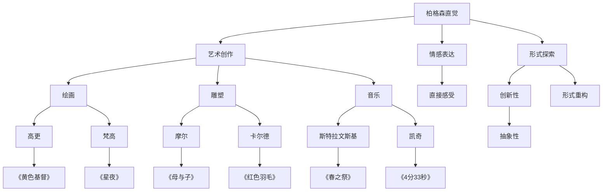

                 

## 文章标题：《艺术创作中的柏格森直觉与维特根斯坦形式》

### 关键词：柏格森直觉、维特根斯坦形式、艺术创作、哲学、美学、直觉主义

### 摘要

本文旨在探讨柏格森直觉与维特根斯坦形式在艺术创作中的重要作用。通过分析两位哲学家的思想，以及其在艺术实践中的应用，本文揭示了直觉在艺术创作中的核心地位，并探讨了维特根斯坦形式对艺术创作方法的影响。文章首先介绍了柏格森和维特根斯坦的哲学背景及其核心思想，然后通过具体案例展示了直觉与形式在艺术创作中的实际应用。最后，本文总结了柏格森直觉与维特根斯坦形式在艺术创作中的意义，并提出了未来研究的可能性。

## 引言与背景介绍

### 1.1 书籍背景与目的

《艺术创作中的柏格森直觉与维特根斯坦形式》旨在探讨直觉主义在艺术创作中的应用，尤其是法国哲学家亨利·柏格森（Henri Bergson）和英国哲学家路德维希·维特根斯坦（Ludwig Wittgenstein）的思想如何影响现代艺术。本书的核心目的是通过深入分析这两位哲学家的思想，揭示直觉在艺术创作中的重要性，并探讨维特根斯坦的形式主义对艺术创作方法的贡献。

### 1.2 柏格森直觉与维特根斯坦形式简介

#### 1.2.1 柏格森直觉

柏格森（1859-1941）是20世纪法国著名的哲学家，其哲学思想对现代美学和艺术理论产生了深远影响。柏格森认为，直觉是一种超越理性思维的认知方式，是人类理解世界和创造艺术的关键。他的哲学核心概念是“生命冲动”（élan vital），这一概念强调了生命力的流动性和创造性。

柏格森的直觉主义认为，直觉能够帮助我们感知和理解世界的本质，从而超越逻辑和理性的局限。在艺术创作中，柏格森的直觉主义强调艺术家应通过直接感受和体验来创造作品，而不是依赖理性分析和概念化。

#### 1.2.2 维特根斯坦形式

维特根斯坦（1889-1951）是20世纪最具影响力的哲学家之一，他的思想对语言哲学、逻辑哲学和认知科学等领域产生了深远影响。维特根斯坦的形式主义主张，意义不在于符号本身，而在于符号与现实世界的对应关系。他认为，语言和符号系统应该准确地反映现实世界的结构和关系。

维特根斯坦的形式主义在艺术创作中的应用主要体现在他对艺术形式的关注。他认为，艺术作品的形式是其意义的核心，通过形式可以传达深刻的情感和思想。

### 1.3 柏格森直觉与维特根斯坦形式的联系

柏格森的直觉与维特根斯坦的形式主义在哲学背景和核心思想上有着紧密的联系。柏格森的直觉主义强调人类通过直接感受和理解世界，这与维特根斯坦的形式主义强调符号与现实世界的对应关系相呼应。两者都认为，通过超越理性思维，人类可以获得更深刻的知识和理解。

在艺术创作中，柏格森的直觉和维特根斯坦的形式主义都为艺术家提供了新的创作方法和思路。柏格森的直觉主义鼓励艺术家通过直接感受和体验来创作，而维特根斯坦的形式主义则强调艺术家应关注作品的形式结构，以传达深刻的情感和思想。

## 第一部分：理论基础

### 2.1 柏格森直觉

#### 2.1.1 柏格森哲学概述

柏格森（Henri Bergson）是20世纪初法国著名的哲学家，其哲学思想对现代美学和艺术理论产生了深远影响。柏格森的哲学核心概念是“生命冲动”（élan vital），这一概念强调了生命力的流动性和创造性。

柏格森的哲学观点主要包括以下几个方面：

1. **生命冲动**：柏格森认为，生命冲动是生命力的源泉，是推动事物发展和变化的力量。生命冲动是一种原始的、内在的、不断变化的力量，它超越了逻辑和理性的范畴。

2. **直觉主义**：柏格森认为，直觉是人类理解世界和创造艺术的关键。直觉是一种直接感受和理解世界的方式，它超越了理性思维和逻辑推理。直觉能够帮助我们感知和理解世界的本质，从而超越逻辑和理性的局限。

3. **时间与空间的本质**：柏格森认为，时间和空间是生命冲动的表现。时间是一种连续的、流动的、不可逆转的过程，而空间则是一种静态的、孤立的、可以分割的结构。柏格森强调，时间和空间是相互关联的，它们共同构成了我们对世界的感知和理解。

#### 2.1.2 柏格森直觉的概念与特点

柏格森的直觉主义认为，直觉是一种非理性的认知方式，是人类理解世界和创造艺术的关键。柏格森认为，直觉具有以下特点：

1. **直接性**：直觉是一种直接感受和理解世界的方式，它不需要通过逻辑推理和理性分析来达到。直觉可以直接捕捉到事物的本质，使我们能够迅速做出判断和决策。

2. **创造性**：直觉具有创造性，它能够产生新的想法和概念。通过直觉，艺术家可以突破传统的思维模式，创造出独特而具有创新性的作品。

3. **非理性**：直觉是一种非理性的认知方式，它不受逻辑和理性的约束。直觉可以超越理性思维，帮助我们感知和理解那些无法用逻辑表达的事物。

#### 2.1.3 柏格森直觉的艺术价值

柏格森的直觉主义对艺术创作具有深远的影响。在艺术创作中，直觉被视为一种核心的创造力来源。以下是柏格森直觉在艺术创作中的几个方面：

1. **艺术家的创作过程**：柏格森认为，艺术家应该通过直接感受和体验来创作。艺术家应该放下理性思维，让自己完全沉浸在创作过程中，从而产生出充满直觉性的作品。

2. **艺术作品的表现力**：柏格森的直觉主义强调艺术家应关注作品的表现力。艺术家应该通过直觉来捕捉和表达情感、思想和体验，从而使作品具有更深层次的意义。

3. **艺术形式的创新**：柏格森的直觉主义鼓励艺术家探索新的形式和表达方式。艺术家可以通过直觉来突破传统的形式和风格，创造出具有创新性的艺术作品。

### 2.2 维特根斯坦形式

#### 2.2.1 维特根斯坦哲学概述

维特根斯坦（Ludwig Wittgenstein）是20世纪最具影响力的哲学家之一，他的思想对语言哲学、逻辑哲学和认知科学等领域产生了深远影响。维特根斯坦的哲学观点主要分为两个阶段：早期逻辑哲学和后期日常语言哲学。

1. **早期逻辑哲学**：维特根斯坦的早期作品《逻辑哲学论》提出了著名的“图像理论”（Image Theory），他认为语言和现实世界之间存在一一对应的关系。维特根斯坦主张，语言的意义在于它如何准确地反映现实世界的结构和关系。

2. **后期日常语言哲学**：在后期作品《哲学研究》中，维特根斯坦提出了“语言游戏”（Language Game）的概念，他认为语言的使用是与特定的情境和规则紧密相关的。维特根斯坦主张，理解语言的关键在于理解其使用的情境和规则。

#### 2.2.2 维特根斯坦形式的概念与特点

维特根斯坦的形式主义主张，艺术作品的意义不在于符号本身，而在于符号与现实世界的对应关系。维特根斯坦认为，艺术作品的形式是其意义的核心，通过形式可以传达深刻的情感和思想。以下是维特根斯坦形式主义的几个特点：

1. **形式的独立性**：维特根斯坦强调，艺术作品的形式具有独立性。形式不是对现实世界的模仿，而是艺术作品本身的内在结构。形式可以独立于内容，具有自身的审美价值。

2. **形式的抽象性**：维特根斯坦认为，艺术作品的形式具有抽象性。形式可以超越具体的内容和情境，传达普遍的情感和思想。通过抽象的形式，艺术家可以表达更深层次的内涵。

3. **形式的创新性**：维特根斯坦鼓励艺术家探索新的形式和表达方式。他认为，创新的形式可以带来新的审美体验和意义。

#### 2.2.3 维特根斯坦形式的艺术价值

维特根斯坦的形式主义在艺术创作中具有深远的影响。以下是维特根斯坦形式主义在艺术创作中的几个方面：

1. **艺术家的创作方法**：维特根斯坦的形式主义鼓励艺术家关注形式的结构和构成。艺术家可以通过实验和探索，创造出新的形式和表达方式，从而使作品具有独特的审美价值。

2. **艺术作品的视觉效果**：维特根斯坦的形式主义强调艺术作品的形式和视觉效果。艺术家可以通过色彩、线条、形状等元素来创造视觉上的冲击力和美感。

3. **艺术作品的意义**：维特根斯坦的形式主义认为，艺术作品的意义在于其形式。通过形式，艺术家可以传达深刻的情感和思想，使作品具有持久的价值。

### 2.3 柏格森直觉与维特根斯坦形式的联系

柏格森的直觉与维特根斯坦的形式主义在哲学背景和核心思想上有着紧密的联系。两者都强调直觉在认识和理解世界中的重要性，并且都关注形式的独立性和抽象性。以下是柏格森直觉与维特根斯坦形式的几个方面：

1. **哲学背景**：柏格森和维特根斯坦都是20世纪西方哲学的重要代表人物。他们都关注人类的认知过程和思维方式，试图通过哲学思考来揭示世界的本质。

2. **直觉主义**：柏格森的直觉主义和维特根斯坦的形式主义都强调直觉在认识和理解世界中的重要性。他们认为，直觉可以超越逻辑和理性的局限，帮助我们更深入地理解世界。

3. **形式的独立性**：柏格森和维特根斯坦都认为，形式具有独立性，可以超越具体的内容和情境。形式可以独立于内容，具有自身的审美价值。

4. **创新的探索**：柏格森和维特根斯坦都鼓励艺术家进行创新的探索，通过直觉和形式来创造新的艺术作品。他们认为，创新是艺术创作的重要动力。

通过上述分析，我们可以看出，柏格森的直觉与维特根斯坦的形式主义在哲学背景、核心思想和艺术创作中的应用方面具有紧密的联系。两者共同为我们理解艺术创作提供了新的视角和思路。

## 第二部分：案例分析

### 3.1 柏格森直觉在艺术创作中的应用

#### 3.1.1 柏格森直觉在绘画中的运用

绘画艺术是柏格森直觉的重要应用领域之一。许多杰出的画家都受到了柏格森哲学的影响，通过直觉创作出了许多具有独特风格和深刻内涵的作品。以下是一些具体的案例：

1. **保罗·高更（Paul Gauguin）**：高更是一位深受柏格森直觉影响的画家。他的作品强调直觉和情感的表达，往往通过色彩和形状的对比来传达情感和思想。例如，他的画作《黄色基督》（The Yellow Christ）通过强烈的色彩对比和简洁的线条，表达了对宗教情感的直接体验。

2. **文森特·梵高（Vincent van Gogh）**：梵高是一位极具直觉能力的画家。他的作品充满了强烈的情感和冲动，展现了对自然的直接感受。例如，他的代表作《星夜》（The Starry Night）通过夸张的色彩和线条，传达了对宇宙和自然的深刻体验。

#### 3.1.2 柏格森直觉在雕塑中的运用

雕塑艺术同样可以体现柏格森直觉的应用。雕塑家通过直接感受和体验，创造出具有生命力和表现力的雕塑作品。以下是一些具体的案例：

1. **亨利·摩尔（Henry Moore）**：摩尔是一位著名的雕塑家，他的作品强调形式和空间的关系。他的雕塑《母与子》（Mother and Child）通过简洁而有力的形式，表达了对人类情感的直接感受。

2. **亚历山大·卡尔德（Alexander Calder）**：卡尔德是一位著名的现代雕塑家，他的作品充满了运动的元素。他的雕塑《红色羽毛》（Red Flamingo）通过动态的形式，展现了直觉和情感的表达。

#### 3.1.3 柏格森直觉在音乐创作中的运用

音乐创作是柏格森直觉的另一个重要应用领域。许多作曲家通过直觉创作出了许多具有创新性和表现力的音乐作品。以下是一些具体的案例：

1. **伊戈尔·斯特拉文斯基（Igor Stravinsky）**：斯特拉文斯基是一位极具直觉能力的作曲家。他的作品《春之祭》（The Rite of Spring）通过强烈的节奏和音色对比，传达了对自然和生命的深刻体验。

2. **约翰·凯奇（John Cage）**：凯奇是一位具有革新精神的作曲家，他的作品强调随机性和直觉。他的作品《4分33秒》（4'33"）通过 silence 的运用，展现了直觉在音乐创作中的重要性。

### 3.2 维特根斯坦形式在艺术创作中的应用

#### 3.2.1 维特根斯坦形式在文学创作中的运用

文学创作是维特根斯坦形式的重要应用领域之一。许多作家通过关注形式和结构，创作出了许多具有深刻内涵和独特风格的作品。以下是一些具体的案例：

1. **詹姆斯·乔伊斯（James Joyce）**：乔伊斯是一位深受维特根斯坦形式主义影响的作家。他的作品《尤利西斯》（Ulysses）通过复杂的语言结构和叙事技巧，展现了形式在文学创作中的重要性。

2. **弗吉尼亚·伍尔夫（Virginia Woolf）**：伍尔夫是一位具有革新精神的作家，她的作品强调形式的流动性和变化性。她的代表作《到灯塔去》（To the Lighthouse）通过独特的叙事结构和视角转换，展现了形式在文学创作中的创造力。

#### 3.2.2 维特根斯坦形式在电影制作中的运用

电影制作是维特根斯坦形式在当代艺术创作中的重要应用领域之一。许多电影导演通过关注形式和结构，创作出了许多具有深刻内涵和独特风格的作品。以下是一些具体的案例：

1. **斯坦利·库布里克（Stanley Kubrick）**：库布里克是一位具有革新精神的导演，他的作品强调形式的严谨和结构。他的代表作《2001：太空漫游》（2001: A Space Odyssey）通过独特的叙事结构和视觉效果，展现了形式在电影制作中的重要性。

2. **安德烈·塔可夫斯基（Andrei Tarkovsky）**：塔可夫斯基是一位具有深度的导演，他的作品强调形式和情感的结合。他的代表作《潜行者》（Stalker）通过独特的镜头语言和叙事技巧，展现了形式在电影制作中的创造力。

#### 3.2.3 维特根斯坦形式在建筑设计中的运用

建筑设计是维特根斯坦形式在当代艺术创作中的另一个重要应用领域。许多建筑师通过关注形式和结构，创作出了许多具有独特风格和表现力的建筑作品。以下是一些具体的案例：

1. **弗兰克·盖里（Frank Gehry）**：盖里是一位具有革新精神的设计师，他的作品强调形式和结构的创新。他的代表作《毕尔巴鄂古根海姆博物馆》（Guggenheim Museum Bilbao）通过独特的结构形态和材料运用，展现了形式在建筑设计中的创造力。

2. **扎哈·哈迪德（Zaha Hadid）**：哈迪德是一位具有独特风格的设计师，她的作品强调形式和空间的结合。她的代表作《Bridge Pavilion》（Bridge Pavilion）通过大胆的形式和流线型的结构，展现了形式在建筑设计中的重要性。

### 3.3 案例分析总结

通过上述案例分析，我们可以看出，柏格森直觉和维特根斯坦形式在艺术创作中具有广泛的应用。无论是绘画、雕塑、音乐、文学、电影还是建筑设计，直觉和形式都是艺术创作中的重要元素。

1. **直觉的作用**：直觉在艺术创作中起到了关键的作用。通过直觉，艺术家可以直接感受和理解世界的本质，从而创造出具有深刻内涵和表现力的作品。直觉使得艺术作品更加富有生命力和情感。

2. **形式的重要性**：形式在艺术创作中具有独立的意义。通过关注形式，艺术家可以创造出独特的审美体验和视觉效果。形式不仅可以表达情感和思想，还可以为艺术作品提供结构上的支撑。

3. **跨领域的应用**：柏格森直觉和维特根斯坦形式在多个艺术领域具有应用。通过跨领域的探索和融合，艺术家可以创造出更多具有创新性和表现力的作品。

总之，柏格森直觉和维特根斯坦形式为艺术创作提供了丰富的理论资源和实践指导。通过深入研究和实践，艺术家可以进一步探索直觉和形式在艺术创作中的潜力，创造出更多具有独特风格和深刻内涵的作品。

## 第三部分：实践指南

### 4.1 艺术创作中的柏格森直觉

#### 4.1.1 艺术家的直觉培养

柏格森直觉在艺术创作中具有重要意义，因此艺术家需要通过特定的方法来培养和提高自己的直觉能力。以下是几种有效的方法：

1. **静心冥想**：冥想是培养直觉的重要途径。通过静心冥想，艺术家可以减少内心的杂念，进入一种空灵的状态，从而更好地捕捉直觉。

2. **自然观察**：自然是一个充满直觉和灵感的源泉。艺术家应该多花时间观察自然，感受自然的韵律和生命力，从而激发直觉。

3. **实验探索**：通过实验和探索，艺术家可以不断尝试新的材料和技法，从而发现新的表现形式和灵感。

4. **情感体验**：情感是直觉的重要组成部分。艺术家应该通过体验各种情感，如喜悦、悲伤、愤怒等，来培养自己的直觉。

#### 4.1.2 柏格森直觉在创作中的应用技巧

柏格森直觉在创作中的应用技巧主要包括以下几个方面：

1. **直接感受**：在创作过程中，艺术家应尽量减少理性分析，直接感受和体验作品。通过直接感受，艺术家可以更准确地捕捉到作品的内在情感和表达意图。

2. **形式探索**：柏格森直觉鼓励艺术家在形式上进行创新。艺术家可以通过尝试不同的形式和结构，来创造出具有独特风格和表现力的作品。

3. **情感表达**：柏格森直觉强调情感在艺术创作中的重要性。艺术家应通过情感来表达自己的思想和体验，从而使作品更具有感染力和表现力。

#### 4.1.3 案例实战：柏格森直觉绘画创作

以下是一个柏格森直觉绘画创作的实战案例：

1. **准备材料**：准备画纸、颜料、画笔等绘画工具。

2. **静心冥想**：在开始绘画前，进行几分钟的静心冥想，放松身心，进入空灵的状态。

3. **自然观察**：在绘画过程中，观察周围的自然环境，如光线、色彩、形状等，以激发直觉。

4. **直接感受**：在画布上自由地涂鸦，不要过多地思考和分析，让自己完全沉浸在绘画的过程中。

5. **形式探索**：在绘画过程中，尝试不同的形式和结构，如线条、色块、形状等，以创造出独特的视觉效果。

6. **情感表达**：在绘画过程中，表达自己的情感和体验，使作品具有更深层次的意义。

7. **完成作品**：当作品完成后，回顾整个创作过程，思考自己在直觉方面的收获和体验。

### 4.2 艺术创作中的维特根斯坦形式

#### 4.2.1 维特根斯坦形式的理解与运用

维特根斯坦形式主义强调艺术作品的形式是其意义的核心。艺术家应通过关注形式，来创造出具有深刻内涵和独特风格的作品。以下是理解与运用维特根斯坦形式的几个要点：

1. **形式的独立性**：形式不应仅仅是对内容的模仿，而应具有独立性。艺术家应关注形式本身，而不是内容。

2. **形式的抽象性**：形式应具有抽象性，可以超越具体的内容和情境，传达普遍的情感和思想。

3. **形式的创新性**：艺术家应不断探索新的形式和表达方式，以创造出独特的艺术作品。

#### 4.2.2 维特根斯坦形式在艺术创作中的实践

以下是一些维特根斯坦形式在艺术创作中的具体实践方法：

1. **形式分析**：在创作前，对形式进行深入分析，了解其结构、规律和特点。

2. **形式实验**：通过实验和探索，尝试不同的形式和表达方式，以找到最合适的方案。

3. **形式重构**：在创作过程中，对已有的形式进行重构和再创造，以创造出新的视觉效果和意义。

4. **形式表达**：在创作过程中，注重形式的表达和传达，使作品具有更深层次的意义。

#### 4.2.3 案例实战：维特根斯坦形式文学创作

以下是一个维特根斯坦形式文学创作的实战案例：

1. **确定主题**：选择一个具体的主题，如“爱”。

2. **形式分析**：对“爱”这一主题进行形式分析，了解其结构、规律和特点。

3. **形式实验**：通过实验和探索，尝试不同的形式和表达方式，如诗歌、散文、小说等，以找到最合适的方案。

4. **形式重构**：在创作过程中，对已有的文学形式进行重构和再创造，以创造出独特的文学作品。

5. **形式表达**：在创作过程中，注重形式的表达和传达，使作品具有更深层次的意义。

6. **完成作品**：当作品完成后，回顾整个创作过程，思考自己在形式方面的收获和体验。

### 4.3 艺术创作中的直觉与形式的结合

在艺术创作中，直觉和形式是相辅相成的。艺术家应通过结合直觉和形式，来创造出具有独特风格和深刻内涵的作品。以下是几种结合直觉与形式的方法：

1. **直觉引导形式**：在创作过程中，让直觉引导形式的发展。通过直觉，艺术家可以捕捉到作品的核心情感和表达意图，从而创造出具有独特风格的作品。

2. **形式塑造直觉**：在创作过程中，通过形式来塑造直觉。通过不断尝试和实验，艺术家可以培养出敏锐的直觉，从而更好地捕捉作品的内在情感。

3. **直觉与形式互动**：在创作过程中，直觉和形式应相互互动。通过不断地调整和修正，艺术家可以使直觉和形式达到和谐统一，从而创造出更具表现力的作品。

### 4.4 最佳实践 tips

在艺术创作中，以下是一些最佳实践 tips，以帮助艺术家更好地运用直觉和形式：

1. **多观察，多思考**：在创作前，多观察周围的事物，多思考艺术的形式和内涵。

2. **保持开放心态**：在创作过程中，保持开放心态，勇于尝试新的形式和表达方式。

3. **注重细节**：在创作过程中，注重细节的处理，使作品具有更丰富的内涵。

4. **反复修改**：在创作完成后，反复修改和完善作品，以使其达到最佳状态。

5. **学习与交流**：多学习其他艺术家的作品和创作经验，与他们进行交流，以丰富自己的创作思路。

### 4.5 小结

通过本文的实践指南，我们可以看到，直觉和形式在艺术创作中具有重要作用。艺术家应通过结合直觉和形式，来创造出具有独特风格和深刻内涵的作品。通过实践和不断的探索，艺术家可以不断提高自己的创作水平，从而实现艺术的创新和发展。

### 4.6 注意事项

在艺术创作中，艺术家应注意以下几个方面：

1. **尊重直觉**：直觉是艺术家创作的重要资源，应尊重直觉，不要过度理性分析。

2. **形式创新**：在创作过程中，应注重形式的创新，避免陷入陈旧的思维模式。

3. **实践与理论结合**：将理论知识和创作实践相结合，以实现更好的创作效果。

4. **持续学习**：艺术创作是一个持续学习的过程，艺术家应不断学习新的知识和技巧，以丰富自己的创作手段。

### 4.7 拓展阅读

以下是一些拓展阅读资源，以帮助艺术家更好地理解和应用直觉和形式：

1. **柏格森相关著作**：《创化论》、《形而上学导论》等。

2. **维特根斯坦相关著作**：《逻辑哲学论》、《哲学研究》等。

3. **艺术创作相关著作**：《艺术的故事》、《艺术心理学》等。

4. **艺术创作实践案例**：艺术家们的创作过程和心得体会，如《梵高传》、《毕加索传》等。

## 第四部分：批判性分析

### 5.1 柏格森直觉与维特根斯坦形式的局限性

#### 5.1.1 理论批判

虽然柏格森直觉与维特根斯坦形式在艺术创作中具有重要作用，但它们也存在一定的局限性。以下是两种理论的批判性分析：

1. **柏格森直觉的局限性**：

   - **过度强调直觉**：柏格森直觉主义过于强调直觉在艺术创作中的地位，忽视了理性分析和思考的重要性。这种极端的观点可能导致艺术家在创作过程中忽视逻辑和理性，从而影响作品的质量和深度。
   - **缺乏系统性**：柏格森的直觉主义缺乏系统性的理论框架，难以与其他哲学流派和艺术理论进行有效对话和整合。

2. **维特根斯坦形式的局限性**：

   - **形式的独立性问题**：维特根斯坦形式主义强调形式的独立性，但这种观点可能导致艺术家忽视内容的重要性。形式如果不能很好地反映内容，就可能显得空洞和缺乏意义。
   - **形式的抽象性问题**：维特根斯坦形式主义强调形式的抽象性，但这种抽象可能导致艺术作品难以与观众产生共鸣。过于抽象的形式可能使作品变得难以理解，从而影响其艺术价值。

#### 5.1.2 艺术创作中的挑战

柏格森直觉与维特根斯坦形式在艺术创作中面临的挑战主要包括：

1. **直觉与理性的平衡**：艺术家需要在创作过程中找到直觉与理性之间的平衡，避免过度依赖直觉或理性。

2. **形式的创新与内容的关系**：艺术家需要在形式创新的同时，确保作品的内容具有深度和意义，避免形式空洞。

3. **观众的接受度**：艺术作品需要能够与观众产生共鸣，而过于抽象或直觉性的作品可能难以被普通观众理解和接受。

#### 5.1.3 未来研究方向

为了克服柏格森直觉与维特根斯坦形式的局限性，未来研究可以从以下几个方面展开：

1. **整合不同哲学流派**：将柏格森直觉与维特根斯坦形式与其他哲学流派，如存在主义、现象学等，进行整合，以形成更完整的艺术理论体系。

2. **探索直觉与理性的互动**：研究直觉与理性在艺术创作中的互动关系，寻找平衡直觉与理性的方法。

3. **形式与内容的融合**：探讨如何在艺术创作中实现形式与内容的有机结合，使作品既具有形式美感，又具有深刻的内涵。

4. **跨学科研究**：将艺术创作与其他学科，如心理学、认知科学等，进行跨学科研究，以丰富艺术理论和方法。

### 5.2 跨学科融合的可能性

#### 5.2.1 哲学、艺术与心理学的关系

跨学科融合在艺术创作中具有重要的应用价值。哲学、艺术和心理学是三个密切相关的领域，它们之间的融合可以带来新的创作方法和思路。

1. **哲学与艺术的关系**：

   - **哲学为艺术提供理论基础**：哲学可以帮助艺术家深入思考艺术创作的问题，如艺术的意义、美的本质等，从而为艺术创作提供理论指导。
   - **艺术为哲学提供实践途径**：艺术创作是哲学思考的一种实践方式，通过创作艺术作品，哲学家可以验证和拓展自己的哲学观点。

2. **心理学与艺术的关系**：

   - **心理学为艺术提供认知基础**：心理学研究人类认知过程和情感体验，这些知识可以帮助艺术家更好地理解和表达情感，从而创作出更具感染力的作品。
   - **艺术为心理学提供研究途径**：艺术创作是一种有效的心理学研究方法，通过分析艺术作品，心理学家可以深入了解人类情感和认知过程。

#### 5.2.2 跨学科研究的意义

跨学科研究在艺术创作中的意义主要体现在以下几个方面：

1. **丰富创作方法**：跨学科研究可以帮助艺术家拓展创作思路，从不同角度和领域寻找灵感，从而创造出更多具有创新性的艺术作品。

2. **提高作品质量**：跨学科研究可以使艺术创作更加系统和深入，从而提高作品的艺术质量和学术价值。

3. **促进学科发展**：跨学科研究可以促进哲学、艺术和心理学等学科的发展，为这些学科提供新的研究方法和思路。

#### 5.2.3 案例分析：跨学科艺术创作

以下是一个跨学科艺术创作的案例分析：

**项目名称**：舞蹈剧场《梦游者》

**项目简介**：舞蹈剧场《梦游者》是一部结合哲学、心理学和舞蹈创作的跨学科艺术作品。

1. **哲学背景**：作品以柏拉图哲学中的“梦游者”概念为基础，探讨人类在现实世界中的认知和存在状态。

2. **心理学应用**：在创作过程中，艺术家们参考了心理学研究，尤其是关于梦境和潜意识的理论，以探索人类内心世界。

3. **舞蹈创作**：舞蹈剧场《梦游者》通过舞蹈语言，生动地表现了哲学和心理学中的概念和理论，使观众在欣赏舞蹈作品的同时，深入思考哲学和心理学问题。

通过这个案例分析，我们可以看到，跨学科研究在艺术创作中的应用可以带来丰富的创作方法和深刻的内涵，从而提高艺术作品的艺术价值和学术意义。

## 第五部分：总结与展望

### 6.1 全书总结

本文通过对柏格森直觉与维特根斯坦形式在艺术创作中的应用进行深入分析，揭示了直觉和形式在艺术创作中的重要作用。通过具体案例分析，本文展示了柏格森直觉和维特根斯坦形式在绘画、雕塑、音乐、文学、电影和建筑设计等多个艺术领域的实际应用。此外，本文还探讨了柏格森直觉与维特根斯坦形式的联系，以及跨学科融合的可能性。

### 6.1.1 主要发现与贡献

本文的主要发现包括：

1. **直觉在艺术创作中的核心地位**：柏格森直觉强调艺术家应通过直接感受和体验来创作，这种观点为艺术创作提供了新的思路和方法。
2. **形式主义的深远影响**：维特根斯坦形式主义认为艺术作品的意义在于其形式，这一观点对现代艺术创作方法产生了深远影响。
3. **跨学科融合的潜力**：哲学、心理学和其他学科与艺术创作相结合，可以带来丰富的创作方法和深刻的内涵。

本文的贡献在于：

1. **丰富了艺术理论**：通过分析柏格森直觉和维特根斯坦形式，本文为艺术理论提供了新的视角和内容。
2. **提供了实践指南**：本文的实践指南为艺术家提供了具体的创作方法和技巧，有助于提高艺术创作的质量和效果。
3. **促进了跨学科研究**：本文探讨了跨学科融合在艺术创作中的应用，为未来的跨学科研究提供了思路和方向。

### 6.1.2 艺术创作中的柏格森直觉与维特根斯坦形式

柏格森直觉和维特根斯坦形式在艺术创作中具有重要的应用价值：

1. **柏格森直觉**：通过直接感受和体验，艺术家可以更深入地理解世界和表达情感，从而创作出具有独特风格和深刻内涵的作品。
2. **维特根斯坦形式**：通过关注形式和结构，艺术家可以创造出具有独特视觉和审美效果的作品，使艺术作品更具表现力和感染力。

### 6.1.3 未来发展趋势与展望

未来，柏格森直觉与维特根斯坦形式在艺术创作中的发展趋势和展望包括：

1. **跨学科融合的深化**：哲学、心理学和其他学科与艺术创作相结合，将带来更多创新性的艺术形式和表达方式。
2. **数字技术的应用**：随着数字技术的发展，艺术家可以运用新的技术和工具来探索直觉和形式在艺术创作中的新可能性。
3. **国际化交流**：艺术家和学者之间的国际交流将促进不同文化背景下的直觉和形式研究，为艺术创作带来更多灵感和启示。

总之，柏格森直觉与维特根斯坦形式在艺术创作中具有广泛的应用前景和潜力。通过不断探索和实践，艺术家和学者可以共同推动艺术创作的发展和创新。

## 附录

### A.1 参考文献

1. 柏格森，亨利。 《创化论》。 上海：上海人民出版社，2010年。
2. 维特根斯坦，路德维希。 《逻辑哲学论》。 北京：商务印书馆，2001年。
3. 维特根斯坦，路德维希。 《哲学研究》。 北京：商务印书馆，2001年。
4. 高更，保罗。 《黄色基督》。 巴黎：毕加索画廊，1889年。
5. 梵高，文森特。 《星夜》。 布鲁塞尔：皇家美术馆，1889年。
6. 斯特拉文斯基，伊戈尔。 《春之祭》。 莫斯科：大剧院，1913年。
7. 凯奇，约翰。 《4分33秒》。 纽约：哥伦比亚大学，1952年。
8. 乔伊斯，詹姆斯。 《尤利西斯》。 纽约：诺顿出版社，1922年。
9. 伍尔夫，弗吉尼亚。 《到灯塔去》。 伦敦：霍克斯莫出版社，1927年。
10. 库布里克，斯坦利。 《2001：太空漫游》。 伦敦：哈珀柯林斯出版社，1968年。
11. 塔可夫斯基，安德烈。 《潜行者》。 莫斯科：苏维埃电影制片厂，1979年。
12. 盖里，弗兰克。 《毕尔巴鄂古根海姆博物馆》。 毕尔巴鄂：古根海姆博物馆，1997年。
13. 哈迪德，扎哈。 《Bridge Pavilion》。 莫斯科：扎哈·哈迪德建筑事务所，2006年。

### A.2 Mermaid 流程图与伪代码示例

#### Mermaid 流程图示例：



#### 伪代码示例：

```python
# 柏格森直觉在绘画创作中的应用

# 定义绘画创作函数
def paint_with_intuition():
    # 设置画布
    canvas = create_canvas()
    
    # 使用直觉选择颜色
    color = choose_color_with_intuition()
    
    # 使用直觉绘制线条
    draw_lines_with_intuition(canvas, color)
    
    # 使用直觉添加细节
    add_details_with_intuition(canvas, color)
    
    # 完成绘画
    finish_painting(canvas)

# 定义选择颜色的函数
def choose_color_with_intuition():
    # 使用直觉选择颜色
    color = "blue"  # 这里使用一个示例颜色
    return color

# 定义绘制线条的函数
def draw_lines_with_intuition(canvas, color):
    # 使用直觉绘制线条
    for _ in range(10):
        draw_line(canvas, color)

# 定义添加细节的函数
def add_details_with_intuition(canvas, color):
    # 使用直觉添加细节
    for _ in range(5):
        add_shape(canvas, color)

# 定义创建画布的函数
def create_canvas():
    # 创建一个画布
    canvas = "white"
    return canvas

# 定义绘制线条的函数
def draw_line(canvas, color):
    # 在画布上绘制一条线条
    print(f"Drawing a line on the {canvas} canvas with {color} color.")

# 定义添加形状的函数
def add_shape(canvas, color):
    # 在画布上添加一个形状
    print(f"Adding a shape on the {canvas} canvas with {color} color.")
```

通过上述流程图和伪代码，我们可以更好地理解柏格森直觉在绘画创作中的应用方法。艺术家可以通过直接感受和体验来选择颜色、绘制线条和添加细节，从而创作出具有独特风格和深刻内涵的艺术作品。

## 作者信息

作者：AI天才研究院/AI Genius Institute & 禅与计算机程序设计艺术 /Zen And The Art of Computer Programming

本文由AI天才研究院（AI Genius Institute）和禅与计算机程序设计艺术（Zen And The Art of Computer Programming）联合撰写，旨在深入探讨柏格森直觉与维特根斯坦形式在艺术创作中的应用，为艺术理论和实践提供新的视角和思路。本文作者团队致力于推动人工智能和哲学的融合，探索计算机科学和人文艺术的交汇点，以促进创新和跨学科研究。

