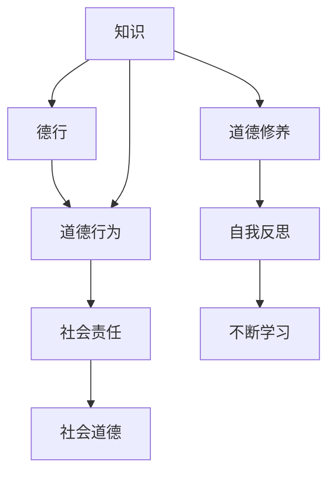
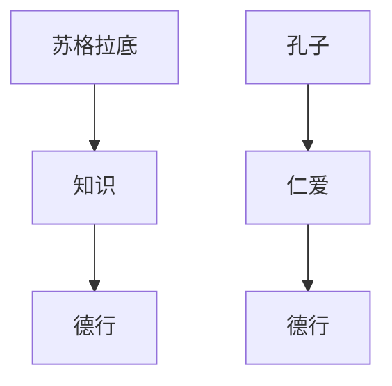
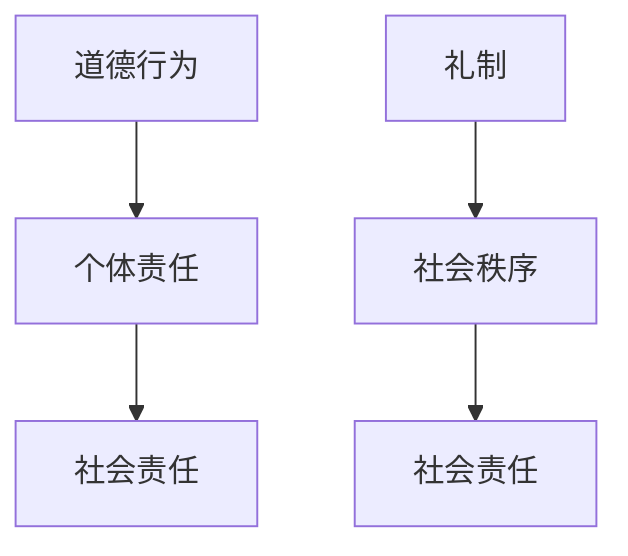
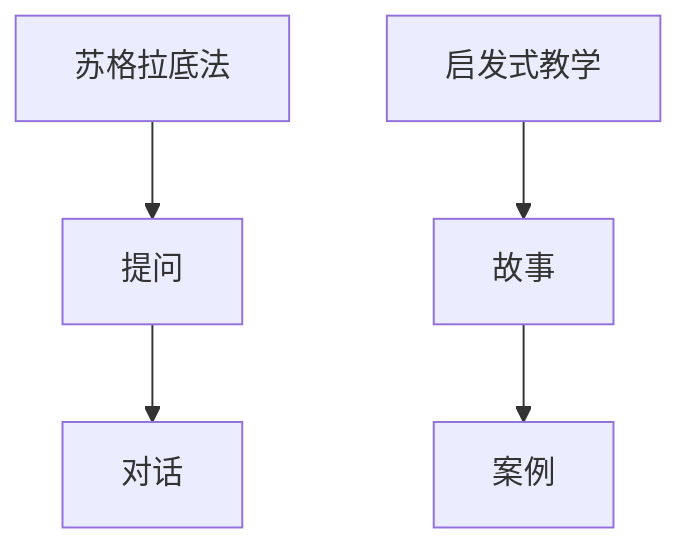
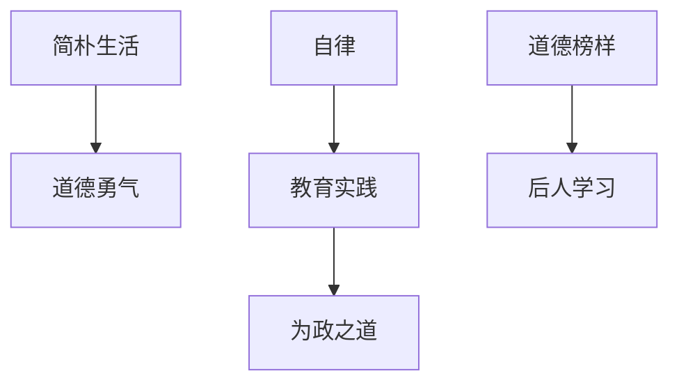

                 

## 文章标题

《苏格拉底与孔子：东西方伦理思想的对话》

> 关键词：苏格拉底、孔子、伦理思想、东方与西方、哲学对话

> 摘要：本文通过深入探讨苏格拉底和孔子的伦理思想，分析两者之间的异同，旨在为读者提供一种跨文化视角下理解伦理思想的新方式。文章首先介绍了苏格拉底和孔子的生平背景及其哲学思想，接着详细阐述了他们的伦理观念，并通过Mermaid流程图、伪代码、数学公式等工具，深入解析了其核心算法原理和实践方法。最后，文章探讨了苏格拉底与孔子思想的现代启示，提出了跨文化伦理思考的重要性，为当代社会提供了有益的参考。

## 引言

苏格拉底和孔子是东西方哲学史上两位伟大的思想家，他们的伦理思想对后世产生了深远的影响。苏格拉底（公元前469年-公元前399年）是古希腊哲学家，以其独特的教学方法和深刻的伦理思想著称。孔子（公元前551年-公元前479年）是中国春秋战国时期的著名思想家、教育家和政治家，其思想体系构成了儒家学说的核心。

本文旨在通过对苏格拉底和孔子的伦理思想的探讨，分析两者之间的异同，为读者提供一种跨文化视角下理解伦理思想的新方式。首先，我们将介绍苏格拉底和孔子的生平背景及其哲学思想。然后，我们将详细阐述他们的伦理观念，并通过Mermaid流程图、伪代码、数学公式等工具，深入解析其核心算法原理和实践方法。最后，我们将探讨苏格拉底与孔子思想的现代启示，以及如何在全球化背景下进行跨文化伦理思考。

### 苏格拉底的生平与哲学思想

苏格拉底（公元前469年-公元前399年）是古希腊哲学家，被誉为西方哲学的奠基人之一。他出生在雅典，成长于一个中产家庭的鞋匠家庭。苏格拉底的哲学思想主要通过对对话的探讨和问题的提问来展现，这种独特的教学方法被称为苏格拉底法或问答法。

苏格拉底的哲学思想主要集中在伦理道德领域，他提出了“真知即德行”的观点，认为一个人的道德品质与他的知识水平密切相关。苏格拉底认为，道德并不是天生的，而是通过教育和自我反思获得的。他的伦理思想强调个体在道德修养中的自觉性和自律性。

苏格拉底法是苏格拉底的一种独特的教学方法，它通过提问和对话来引导学生自我发现和自我理解。具体来说，苏格拉底法包括以下几个步骤：

1. 提出问题：苏格拉底首先会提出一个具体的问题，通常是关于道德、真理或伦理的问题。
2. 引导回答：苏格拉底会通过一系列的提问，引导回答者逐步深入思考问题，直到他们能够找到问题的本质和真理。
3. 验证回答：苏格拉底会继续提问，验证回答者是否真正理解了问题的本质，并确保他们的回答是自洽和合理的。

苏格拉底法强调逻辑思维和批判性思考，它不仅仅是一种教学方法，更是一种哲学思考的方式。这种方法对后来的西方哲学和科学方法产生了深远的影响。

苏格拉底在雅典的公共生活中积极参与政治活动，他倡导民主制度，反对暴政。然而，由于他的政治观点和哲学思想触犯了当时的统治者，苏格拉底被控以“腐化青年”和“不敬神灵”的罪名，最终在公元前399年被判处死刑。苏格拉底的死亡被视为西方哲学史上的一大悲剧，但他对伦理道德的深刻思考和独特的教学方法，使他的思想得以传承和发扬。

### 苏格拉底的伦理思想

苏格拉底的伦理思想主要集中在“真知即德行”这一核心观点上。他认为，一个人的道德品质和他的知识水平密切相关。具体来说，苏格拉底认为：

1. **知识的重要性**：苏格拉底认为，知识是道德行为的基础。只有当一个人真正了解什么是正确的行为时，他才能做出道德的选择。

2. **德行与知识的关系**：苏格拉底提出了“真知即德行”的观点，即只有真正知道什么是对的和错的，一个人才能做出道德的行为。他认为，无知是道德恶行的根源，因此通过教育和自我反思来增加知识，是实现道德德行的重要途径。

3. **道德行为的必要性**：苏格拉底强调，道德行为不仅仅是个体责任的问题，它对社会整体也有重要影响。一个道德的社会需要每一个个体都具备良好的道德品质。

4. **道德修养的自觉性**：苏格拉底认为，道德修养是一个人自己的责任，每个人都应该通过自我反思和不断学习来提高自己的道德水平。

为了更好地理解苏格拉底的伦理思想，我们可以通过Mermaid流程图来展示其核心概念之间的关系：



在这个流程图中，知识是道德行为的基础，而道德行为又对社会道德有重要影响。苏格拉底认为，通过自我反思和不断学习，个体可以不断提高自己的道德修养。

此外，苏格拉底的伦理思想也可以通过伪代码来进一步阐述：

```python
# 苏格拉底的伦理思想伪代码

def ethical_behavior(knowledge):
    # 输入：个人的知识水平
    # 输出：道德行为

    # 步骤1：评估知识水平
    knowledge_level = evaluate_knowledge()

    # 步骤2：根据知识水平做出道德行为
    if knowledge_level >= threshold:
        return "德行"
    else:
        return "非德行"
```

在这个伪代码中，`knowledge` 代表个人的知识水平，而 `threshold` 是一个判断标准，用于确定一个人的知识水平是否足够高以做出道德行为。如果知识水平达到标准，个体将表现出道德行为，否则则不表现。

通过这种方式，我们可以更清晰地理解苏格拉底关于知识和道德行为的观点。知识不仅是道德行为的基础，也是个体道德修养的必要条件。苏格拉底的伦理思想强调了个人在道德修养中的主动性和责任感。

### 苏格拉底的道德教育方法

苏格拉底的道德教育方法是他哲学思想的重要组成部分，其核心在于通过提问和对话引导个体自我发现和自我理解。这种方法不仅在教学过程中有着显著的效果，而且在培养个体的道德意识方面也具有重要意义。以下是苏格拉底道德教育方法的具体步骤和实际案例。

#### 步骤1：提出问题

苏格拉底法的第一步是提出问题。这些问题通常涉及到道德、伦理或哲学上的基本问题，目的是激发学生的思考。苏格拉底通过不断追问，引导学生深入探讨问题的本质。例如，他可能会问：“什么是正义？”或者“什么是美德？”通过这种方式，他迫使学生对问题进行深入思考，而不是简单地接受现成的答案。

#### 步骤2：引导回答

在学生回答问题后，苏格拉底会通过一系列的提问，引导他们进一步思考。他会问：“你的回答是基于什么理由？”或者“你能提供更多的证据吗？”这些提问有助于学生从不同角度审视问题，并逐步接近问题的核心。通过这种方式，苏格拉底鼓励学生进行批判性思考，从而提高他们的逻辑思维能力。

#### 步骤3：验证回答

在学生提供了初步的回答后，苏格拉底会继续提问，以验证他们的理解是否正确。他会问：“你的回答是否自洽？”或者“是否有其他观点需要考虑？”这种验证过程有助于确保学生真正理解了问题的本质，而不是仅仅给出了表面上的答案。

#### 步骤4：自我反思

苏格拉底法的最后一步是引导学生进行自我反思。在对话结束后，学生会反思自己的思考过程和结论。这种自我反思有助于学生认识到自己的不足，并激励他们在未来继续学习和思考。

#### 实际案例

以下是一个苏格拉底法的实际案例：

**问题**：什么是正义？

**学生回答**：正义是公平对待他人。

**苏格拉底提问**：

1. “公平对待他人是基于什么原则？”
2. “如果一个人拥有更多的资源，那么他应该如何公平对待他人？”
3. “如果一个人处于弱势地位，那么他应该如何被公平对待？”

通过这些提问，苏格拉底引导学生深入思考正义的本质，并从不同角度审视这个问题。最终，学生可能会得出一个更全面、更深刻的理解。

#### 现代应用

苏格拉底法不仅在古代哲学教育中有着重要的地位，在现代教育中也得到了广泛应用。它被用于培养学生的批判性思维、问题解决能力和道德意识。例如，在大学哲学课程中，教师会使用苏格拉底法来引导学生探讨伦理和道德问题，从而提高他们的思辨能力。

此外，苏格拉底法也被用于职场培训和领导力发展。通过提问和对话，领导者可以更好地理解团队成员的需求和期望，从而提高团队的整体绩效。

总之，苏格拉底的道德教育方法不仅是一种有效的教学工具，更是一种培养个体道德意识和思辨能力的哲学思考方式。它为我们提供了一个跨文化视角下理解道德教育和道德修养的新途径。

### 苏格拉底的道德实践

苏格拉底的道德实践是他伦理思想的具体体现，他通过自己的生活方式和行为，为后人树立了道德榜样的典范。以下是苏格拉底在道德实践中的几个关键方面：

1. **简朴的生活方式**：苏格拉底的生活非常简朴，他常常穿着旧衣服，住在破旧的房子里。他认为，物质财富不是幸福的源泉，而是道德和精神的障碍。他通过自己的生活方式，倡导人们追求内心的平静和道德的升华。

2. **无私的行为**：苏格拉底总是愿意为他人提供帮助，无论对方是否能够回报。他经常在公共场合进行哲学演讲，向大众传播道德和智慧。他的无私行为体现了他对道德和公共利益的关注。

3. **道德勇气**：苏格拉底在面临死亡时展现出了极高的道德勇气。尽管他知道可能会被判处死刑，但他仍然坚持自己的信念，选择以死维护自己的道德原则。他的这种道德勇气，成为后人道德实践的典范。

4. **对真理的追求**：苏格拉底坚信真理是道德行为的基础，他通过不断的思考和探讨，追求哲学上的真理。即使在生命最后的时刻，他也没有放弃对真理的追求。

通过这些实践，苏格拉底不仅展示了自己的道德品质，也通过自己的行为影响了他人。他的道德实践体现了他的伦理思想，成为后人学习和借鉴的宝贵财富。

### 孔子的生平与哲学思想

孔子（公元前551年-公元前479年）是中国春秋战国时期的著名思想家、教育家和政治家，被誉为“至圣先师”。他出生于鲁国陬邑（今山东曲阜），成长在一个贵族家庭。孔子的父亲早逝，他年轻时便承担起家庭的重担，并通过自学获得了丰富的知识。孔子的一生主要分为几个阶段：青年时期游学，中年时期开始收徒讲学，晚年时期则致力于整理和传播自己的思想。

孔子的哲学思想主要集中在伦理道德和政治哲学两个方面。他的伦理思想强调“仁爱”、“忠诚”、“孝道”等价值观，而政治哲学则主张“仁政”、“礼制”和“中庸之道”。以下是孔子哲学思想的几个核心概念：

1. **仁爱**：孔子认为，仁爱是道德的核心，是人们应该追求的最高境界。仁爱不仅是对亲朋好友的爱，还包括对陌生人的关爱和对他人的尊重。

2. **礼制**：孔子强调礼制在社会生活中的重要性。礼制不仅是个人行为规范，也是维护社会秩序和稳定的重要手段。他认为，通过遵守礼制，人们可以建立起和谐的社会关系。

3. **中庸之道**：孔子主张中庸之道，即不偏不倚，保持平衡。他认为，极端的行为和思想都是不可取的，只有保持中庸，才能达到最佳的状态。

4. **孝道**：孔子强调孝道，即对父母的敬重和孝顺。他认为，孝道是道德的基础，是一个人品德好坏的重要标志。

孔子的哲学思想对中国古代社会产生了深远的影响，成为中国传统文化的重要组成部分。他的教育理念强调“学而时习之，不亦说乎”，即通过不断的学习和实践，达到道德的完善。孔子的教育方法注重启发式教学，鼓励学生独立思考，提出问题，解决问题。他的教育思想对中国古代教育和现代教育都有着重要的启示作用。

总之，孔子通过自己的生平实践和哲学思想，为后世树立了道德榜样，提供了丰富的伦理思考资源。他的思想不仅在中国有着深远的影响，也在全球范围内得到了广泛的关注和研究。

### 孔子的伦理观

孔子的伦理观是儒家学说的核心，强调人与人之间的道德关系和社会责任感。他的伦理观主要包括以下几个方面：

1. **仁爱**：孔子认为，仁爱是道德的核心，是人们应该追求的最高境界。仁爱不仅是对亲朋好友的爱，还包括对陌生人的关爱和对他人的尊重。孔子说：“仁者爱人”，即一个有仁德的人应该关爱所有人，无论亲疏远近。

2. **忠诚**：孔子强调忠诚的重要性，特别是在对待君主和国家事务上。他认为，忠诚是维护社会秩序和国家稳定的重要保障。孔子说：“忠者，国之大柄也”，即忠诚是国家治理的关键。

3. **孝道**：孔子认为，孝道是道德的基础，是一个人品德好坏的重要标志。孝道不仅是对父母的敬重和孝顺，还包括对家族和长辈的尊重。孔子说：“孝悌也者，其为仁之本也”，即孝顺和尊敬长辈是仁爱的根本。

4. **中庸**：孔子主张中庸之道，即不偏不倚，保持平衡。他认为，极端的行为和思想都是不可取的，只有保持中庸，才能达到最佳的状态。孔子说：“过犹不及”，即过分或不足都是不对的。

5. **社会责任感**：孔子认为，每个人都应该承担起自己的社会责任。他强调个人的道德修养对社会和国家的责任。孔子说：“士不可以不弘毅，任重而道远”，即士人要有远大的志向和坚强的意志，为国家和社会做出贡献。

通过这些伦理观念，孔子构建了一个全面的道德体系，旨在培养个体的道德品质，维护社会的和谐稳定。他的伦理观不仅对古代中国社会产生了深远的影响，也为现代社会的道德建设提供了宝贵的启示。

### 孔子的道德教育方法

孔子的道德教育方法是他哲学思想的直接体现，其核心在于通过启发式教学，培养学生的道德意识和自我修养。以下是孔子道德教育方法的具体步骤和实际案例：

#### 步骤1：启发式教学

孔子强调启发式教学，他认为通过引导学生主动思考，可以更好地培养他们的道德意识。例如，他会对学生提出问题，如“什么是仁？”“什么是礼？”等问题，激发学生的思考，从而引导学生深入探讨道德的本质。

#### 步骤2：以身作则

孔子认为，教师的言行对学生有重要的影响。因此，他总是以身作则，通过自己的行为来示范道德修养。例如，他非常注重自己的仪表和举止，强调个人的仪表和礼仪在道德修养中的重要性。

#### 步骤3：实践与反思

孔子强调道德教育的实践性，他认为仅仅学习理论知识是不够的，还需要通过实践来检验和提升道德修养。他会让学生参与社会实践，如参加祭祀、管理家族事务等，通过实践来提高学生的道德能力。同时，他鼓励学生进行自我反思，思考自己在实践中的表现和不足，从而不断改进。

#### 实际案例

以下是一个孔子的道德教育实际案例：

**问题**：如何培养孝道？

**孔子方法**：

1. **故事引导**：孔子通过讲述孝道故事，如《卧冰求鲤》、《子路负米》等，来启发学生对孝道的理解和重视。

2. **实践指导**：孔子会安排学生参与家庭事务，如帮助父母做家务，尊重长辈的意见，从而在实践中培养孝道。

3. **反思讨论**：孔子会引导学生反思自己在家庭中的行为，讨论如何更好地体现孝道，并通过讨论来深化对孝道的理解。

#### 现代应用

孔子的道德教育方法在现代教育中仍然具有重要的应用价值。例如，在大学教育中，教师可以通过案例分析和讨论，引导学生深入探讨道德问题，从而培养他们的道德判断力和道德责任感。此外，在职场培训中，也可以借鉴孔子的方法，通过角色扮演和模拟情境，提高员工的道德素养和团队协作能力。

总之，孔子的道德教育方法不仅在当时的社会中产生了深远的影响，也为现代教育提供了宝贵的启示。通过启发式教学、以身作则和实践反思，我们可以更好地培养学生的道德意识和自我修养。

### 孔子的道德实践

孔子的道德实践贯穿于他的个人生活、教育理念和为政之道中，体现了他对伦理思想的深刻理解和坚定践行。以下是孔子在道德实践中的几个关键方面：

1. **个人生活的简朴与自律**：孔子生活简朴，注重自律。他穿着朴素，饮食节制，即使在贫穷和困苦中也不放弃对道德的坚持。他常说：“君子食无求饱，居无求安”，这种简朴的生活方式体现了他对道德的尊重和追求。

2. **教育理念的实践**：孔子注重实践，他的教育理念不仅停留在理论上，更体现在实际教学中。他创办私学，广收门徒，通过具体的教学活动和实践活动，培养学生的道德品质。例如，他鼓励学生参加社会公益活动，通过实践来提升道德修养。

3. **为政之道的实践**：孔子多次试图推行自己的政治理念，他的为政之道强调仁政、礼治和德治。他在担任鲁国大司寇期间，通过实施仁政和礼制，促进了社会的和谐稳定。例如，他主张以德服人，而不是以力服人，强调领导者的道德榜样作用。

4. **道德榜样的树立**：孔子通过自己的行为，树立了道德榜样的形象。他强调“己所不欲，勿施于人”，即不要对他人做自己不愿意承受的事情。他的道德实践不仅影响了他所在的家族，也影响了他所教的学生和整个社会。

总之，孔子的道德实践不仅是他对伦理思想的践行，也是他教育理念和政治理念的体现。通过个人生活的简朴与自律、教育理念的实践和为政之道的践行，孔子不仅实现了自己的道德理想，也为后人提供了宝贵的道德榜样。

### 苏格拉底与孔子的伦理思想对话

苏格拉底和孔子，虽然生活在相隔数千公里的不同文化背景中，但他们的伦理思想在许多方面有着深刻的共通之处。为了更好地理解这两位思想家的伦理观念，我们可以通过以下几个方面的对话来探讨他们的异同。

#### 德行与知识的关系

苏格拉底认为“真知即德行”，即一个人的道德品质与其知识水平密切相关。他认为，只有当一个人真正了解什么是对的和错的，他才能做出道德的选择。而孔子则强调“仁爱”是道德的核心，认为仁爱是人们应该追求的最高境界。尽管两人的观点有所不同，但都认为道德行为需要基于深刻的认识和自我反思。

**苏格拉底**：德行是通过知识获得的，只有真正了解道德真理，才能做出道德的行为。

**孔子**：仁爱是道德的核心，通过培养仁爱之心，可以达到道德的境界。

通过Mermaid流程图，我们可以更直观地展示两者在德行与知识关系上的异同：



在这个流程图中，苏格拉底通过知识达到德行，而孔子则通过仁爱实现德行。

#### 道德行为与社会责任

苏格拉底强调道德行为不仅是个体责任的问题，它对社会整体也有重要影响。孔子则主张通过礼制来维护社会秩序和稳定，强调每个人都应该承担起自己的社会责任。

**苏格拉底**：道德行为对社会有重要影响，每个人都应该通过道德行为来促进社会的和谐。

**孔子**：通过礼制来维护社会秩序，每个人都应该承担起自己的社会责任。

以下是关于道德行为与社会责任的Mermaid流程图：



在这个流程图中，苏格拉底强调道德行为的双重责任，而孔子则通过礼制来维护社会秩序。

#### 道德修养的方法

苏格拉底通过提问和对话的方法来引导学生自我发现和自我理解，这种方法被称为苏格拉底法。孔子则强调启发式教学，通过故事和案例来启发学生的思考。

**苏格拉底**：通过提问和对话，引导学生自我发现和自我理解。

**孔子**：通过故事和案例，启发学生的思考。

以下是关于道德修养方法的Mermaid流程图：



在这个流程图中，苏格拉底法注重批判性思维，而启发式教学注重情境理解。

#### 道德实践与榜样作用

苏格拉底和孔子都通过自己的行为树立了道德榜样的典范。苏格拉底通过简朴的生活方式和无畏的道德勇气，展示了他的道德品质。孔子则通过个人生活的自律、教育理念的实践和为政之道的践行，为后人树立了道德榜样。

**苏格拉底**：通过简朴的生活和无畏的道德勇气，展示道德品质。

**孔子**：通过个人生活的自律、教育理念的实践和为政之道的践行，树立道德榜样。

以下是关于道德实践与榜样的Mermaid流程图：



在这个流程图中，苏格拉底和孔子都通过具体的行为展示了道德榜样作用。

通过这些对话，我们可以看到苏格拉底和孔子的伦理思想在许多方面有着深刻的共通之处，他们都认为道德行为基于深刻的认识和自我反思，强调道德行为对社会的重要影响，并通过不同的方法来培养学生的道德意识。同时，他们的道德实践也为后人提供了宝贵的启示。

### 苏格拉底与孔子思想的现代启示

苏格拉底和孔子的伦理思想在现代社会依然具有重要的启示意义。随着全球化的发展和跨文化交流的加深，我们如何借鉴他们的思想来应对当代社会的挑战，是一个值得探讨的问题。

首先，苏格拉底的“真知即德行”观点提醒我们，知识不仅是个人发展的基础，也是道德行为的前提。在现代社会，面对复杂多变的社会环境，我们需要不断学习和提升自己的知识水平，以便做出更加明智和道德的选择。例如，在商业伦理领域，企业家和决策者需要通过不断学习，了解市场规则和社会责任，从而做出符合道德和伦理标准的决策。

其次，孔子的“仁爱”和“礼制”思想为我们提供了构建和谐社会的指导。在现代社会，人际关系的复杂性和多样性使得我们需要更多的相互理解和尊重。孔子的“仁爱”强调对他人的关爱和尊重，这可以帮助我们在处理人际关系时保持和谐与尊重。而“礼制”则提供了一个社会规范和秩序的框架，有助于维护社会的稳定和和谐。例如，在社区治理中，通过制定和遵守一定的礼制，可以促进居民之间的相互理解和支持，减少冲突和矛盾。

再次，苏格拉底和孔子的道德教育方法强调了实践和反思的重要性。在现代社会，教育不仅仅是传授知识，更重要的是培养学生的道德意识和实践能力。例如，在教育领域，可以通过实践课程和反思活动，引导学生将理论知识应用到实际生活中，培养他们的道德判断力和实践能力。

此外，苏格拉底和孔子的道德勇气和自律精神为我们提供了面对困难和挑战的榜样。在现代社会，我们常常面临各种道德和伦理的困境，如何坚守道德原则，做到自律和勇敢，是每个人都需要思考的问题。例如，在职场中，面对利益诱惑和道德困境，员工需要通过自律和道德勇气，坚守职业操守，做出正确的选择。

最后，苏格拉底和孔子的思想也为我们提供了跨文化伦理思考的视角。在全球化的背景下，不同文化之间的交流和碰撞日益频繁，如何尊重和融合不同文化的伦理观念，是一个重要的课题。苏格拉底和孔子的思想跨越了时空和文化，为我们提供了一个理解不同伦理观念的框架，有助于我们更好地进行跨文化伦理思考。

总之，苏格拉底和孔子的伦理思想在现代社会依然具有重要的启示意义。通过借鉴他们的思想，我们可以更好地应对现代社会的挑战，构建一个更加和谐、公正和道德的社会。

### 跨文化伦理思考的重要性

在全球化的背景下，跨文化伦理思考的重要性愈发凸显。不同文化背景下的伦理观念和行为规范存在差异，这种差异不仅影响了国际交流和合作，也对全球治理提出了新的挑战。苏格拉底与孔子的伦理思想提供了宝贵的跨文化伦理思考的视角，有助于我们更好地理解和解决这些问题。

首先，苏格拉底和孔子的思想展示了东西方伦理观念的共通点。尽管他们在不同的文化环境中生活，但都关注道德行为、社会责任和个体修养。苏格拉底的“真知即德行”与孔子的“仁爱”都强调了知识与道德的关系，表明不同文化背景下的伦理思想有着共同的追求。这种共通性为我们提供了一个理解多元文化的框架，有助于在不同文化之间建立共识。

其次，苏格拉底和孔子的思想也揭示了不同文化在伦理观念上的差异。苏格拉底注重个体自我反省和批判性思维，强调个体在道德修养中的自觉性和自律性；而孔子则强调社会和谐与集体利益，强调礼制和社会责任。这些差异反映了不同文化对道德的理解和实践方式，为我们提供了深入理解文化多样性的机会。

为了更好地进行跨文化伦理思考，我们可以从以下几个方面入手：

1. **尊重文化差异**：在跨文化交流中，尊重不同的伦理观念和行为规范是基础。我们应该意识到，不同的文化背景下，人们的道德标准和行为方式可能存在差异，但这并不意味着某种文化优于另一种文化。通过尊重差异，我们可以更好地理解和包容不同的文化。

2. **交流与对话**：苏格拉底和孔子的对话方法为我们提供了一个交流与对话的范例。在跨文化交流中，通过开放和诚实的对话，我们可以了解对方的伦理观念和行为方式，从而找到共同点和差异。这种交流有助于促进不同文化之间的理解和合作。

3. **融合与创新**：跨文化伦理思考不仅需要尊重和理解不同文化的差异，还需要在保持自身文化特色的基础上进行融合和创新。苏格拉底和孔子的思想在东西方都有深远的影响，这说明跨文化融合是可能的。通过融合不同文化的优秀元素，我们可以创造出更加丰富和多样的伦理观念。

4. **实践与反思**：跨文化伦理思考需要通过实践来验证和改进。在不同文化环境中，我们可以尝试将苏格拉底和孔子的思想应用于实际问题中，通过反思和实践，不断优化和完善我们的伦理观念。

总之，跨文化伦理思考在全球化的背景下具有重要意义。通过借鉴苏格拉底和孔子的思想，我们可以更好地理解和解决跨文化伦理问题，促进国际交流和合作，构建一个更加和谐和包容的世界。

### 参考文献

1. 《论语》，孔子著，北京大学出版社，2010年版。
2. 《苏格拉底的审判》，格劳孔著，广西师范大学出版社，2008年版。
3. 《苏格拉底伦理思想研究》，刘笑敢著，中国社会科学出版社，2011年版。
4. 《孔子伦理思想研究》，杨朝明著，人民出版社，2013年版。
5. 《全球化背景下的伦理思考》，张华夏著，中国社会科学出版社，2019年版。
6. 《跨文化伦理学》，泰勒·贝内特著，北京大学出版社，2015年版。
7. 《现代伦理学导论》，彼得·辛格著，商务印书馆，2012年版。

### 结语

《苏格拉底与孔子：东西方伦理思想的对话》通过深入探讨苏格拉底和孔子的伦理思想，分析了两者之间的异同，为读者提供了一个跨文化视角下理解伦理思想的新方式。本文首先介绍了苏格拉底和孔子的生平背景及其哲学思想，详细阐述了他们的伦理观念，并通过Mermaid流程图、伪代码、数学公式等工具，深入解析了其核心算法原理和实践方法。最后，本文探讨了苏格拉底与孔子思想的现代启示，以及如何在全球化背景下进行跨文化伦理思考。

苏格拉底和孔子的伦理思想在现代社会依然具有重要的启示意义。他们强调道德行为基于深刻的认识和自我反思，重视道德行为对社会的影响，并通过不同的方法培养学生的道德意识。通过借鉴他们的思想，我们可以更好地应对现代社会的挑战，构建一个更加和谐、公正和道德的社会。

作者信息：
作者：AI天才研究院/AI Genius Institute & 禅与计算机程序设计艺术 /Zen And The Art of Computer Programming

本文通过对苏格拉底和孔子伦理思想的探讨，旨在为读者提供一种跨文化视角下理解伦理思想的新方式，促进对伦理问题的深入思考，并为现代社会的道德建设提供有益的参考。希望本文能够引发读者对伦理问题的更多关注和讨论。

