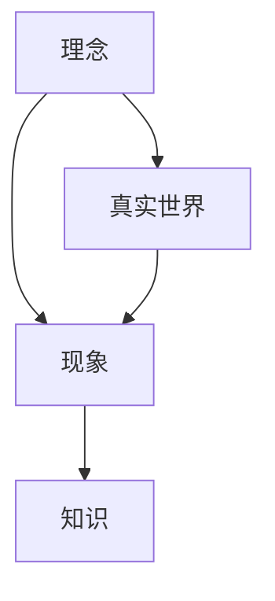
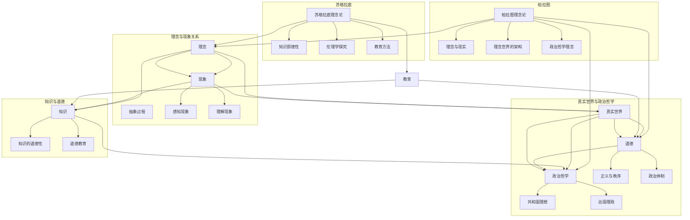

                 

### 文章标题：苏格拉底与柏拉图：理念论的起源与发展

#### 关键词：苏格拉底，柏拉图，理念论，哲学，起源，发展，知识，真实世界，教育，政治哲学

#### 摘要：
本文探讨了苏格拉底与柏拉图在理念论领域的起源与发展。从苏格拉底的生平与哲学思想出发，详细分析了其理念论的核心概念与架构，以及在教育与实践中的应用。接着，深入探讨了柏拉图的生平与哲学思想，重点阐述了他的理念论核心概念与架构，以及在哲学与政治哲学中的实践。最后，通过比较苏格拉底与柏拉图理念论的异同，探讨了理念论在历史中的发展，及其在现代哲学中的影响。

## 引言：苏格拉底与柏拉图在哲学史上的地位

苏格拉底（Socrates，公元前469年-公元前399年）和柏拉图（Plato，公元前427年-公元前347年）是古希腊哲学史上两位极为重要的思想家，他们的理念论对后世哲学、教育、政治哲学等领域产生了深远的影响。苏格拉底以其独特的教育方法和伦理思想著称，他的思想奠定了西方哲学的基础，尤其对后来的柏拉图和亚里士多德等哲学家产生了直接的影响。柏拉图则进一步发展了苏格拉底的理念论，建立了自己的理念论体系，其思想在西方哲学史上占据了中心地位。

苏格拉底与柏拉图的理念论探讨了一个核心问题：真实世界是什么？他们的回答是，真实世界是由抽象的理念或形式构成的，而非我们日常所见的物质世界。这种对真实世界的理解不仅改变了哲学的范式，也为后来的哲学家提供了重要的理论资源。

本文旨在通过一步一步的推理思考，深入探讨苏格拉底与柏拉图理念论的起源、核心概念、架构及其在历史中的发展。文章将分为三个主要部分：

1. **第一部分：苏格拉底的理念论**，包括苏格拉底的生平与哲学思想、理念论的核心概念与实践。
2. **第二部分：柏拉图的理念论**，涉及柏拉图的生平与哲学思想、理念论的核心概念与实践。
3. **第三部分：苏格拉底与柏拉图理念论的比较与发展**，比较两位思想家的理念论异同，探讨理念论在历史中的发展及其现代影响。

通过这种结构化的分析，我们希望能够更清晰地理解苏格拉底与柏拉图的理念论，以及它们在哲学史上的重要性。

### 苏格拉底的生平与哲学思想

苏格拉底是古希腊哲学史上的一位重要人物，他不仅以其深刻的思想和独特的教学方法著称，还以其生动的人格魅力影响了无数后人。苏格拉底出生在雅典，他的家庭并不富裕，但他对知识的渴望和追求却极为强烈。苏格拉底的生活背景对他的哲学思想有着重要的影响。

#### 苏格拉底的生活背景

苏格拉底出生于公元前469年，当时雅典正处于繁荣时期，但同时也存在着社会不平等和政治腐败的问题。苏格拉底的父亲是雕刻师，母亲是助产妇，这样的家庭背景使他对人性的复杂性和社会的多样性有着深刻的认识。苏格拉底从小对数学和天文学有着浓厚的兴趣，但他最终选择投身于哲学研究。

在雅典，苏格拉底生活在一个充满辩论和思考的环境中。雅典是古希腊文明的中心，拥有丰富的文化和教育资源。苏格拉底经常前往市场、广场和公共集会场所，与各种人交谈，探讨哲学问题。这种开放和互动的环境为他形成了独特的哲学思想和教学方法提供了土壤。

#### 苏格拉底的教育与哲学启蒙

苏格拉底的教育经历对他的哲学思想产生了深远的影响。他年轻时曾跟随几位著名哲学家学习，包括普罗塔戈拉（Protagoras）和埃利乌斯（Euripides）。然而，苏格拉底并不满足于前人的理论，他追求的是对真理的深刻理解。

苏格拉底的教育方法以对话和提问为核心。他经常与学生们进行对话，通过提问引导他们思考，而不是直接传授知识。这种方法被称为“苏格拉底法”（Socratic Method），它强调的是通过提问和辩证来揭示真理，而不是通过权威的教导。

苏格拉底认为，知识是道德的基石。他提出“知识即德性”（Knowledge is Virtue）的观点，认为只有通过知识才能达到道德上的完善。这种观点不仅影响了柏拉图，也对后来的西方哲学产生了深远的影响。

#### 苏格拉底的教育方法与特点

苏格拉底的教育方法具有以下特点：

1. **对话和提问**：苏格拉底通过与学生的对话和提问来引导他们思考。这种方法被称为“苏格拉底法”，它强调通过辩证和提问来揭示真理，而不是通过权威的教导。
2. **自我反思**：苏格拉底鼓励学生进行自我反思，以发现内心的真理。他认为，通过自我反思，人们可以更清楚地理解自己，并找到生活的方向。
3. **道德教育**：苏格拉底认为，知识是道德的基石，因此他的教育方法强调道德教育。他相信，只有通过知识才能达到道德上的完善。

苏格拉底的教育方法对他的学生们产生了深远的影响。他的学生包括柏拉图、色诺芬等人，他们中的许多人成为了后来的哲学家和思想家。

#### 苏格拉底的哲学思想

苏格拉底的哲学思想主要包括以下三个方面：

1. **知识即德性**：苏格拉底认为，知识是道德的基石。他提出“知识即德性”的观点，认为只有通过知识才能达到道德上的完善。这种观点强调了知识在个人和社会中的重要性。
2. **道德探究**：苏格拉底对道德进行了深入的探究，提出了许多关于正义、美德等概念的定义。他认为，通过道德探究，人们可以找到生活的方向，并实现个人和社会的和谐。
3. **理念论**：苏格拉底提出了理念论的基本思想，认为真实世界是由抽象的理念或形式构成的，而非我们日常所见的物质世界。这种观点为后来的柏拉图理念论奠定了基础。

总的来说，苏格拉底的哲学思想以其深刻性和独特性著称，他对后世哲学产生了深远的影响。他的教育方法和哲学思想不仅影响了柏拉图，也对整个西方哲学产生了深远的影响。

### 苏格拉底的理念论核心概念

苏格拉底的理念论是他哲学思想的核心之一，它探讨了真实世界的本质和我们如何认识真理。理念论的基本概念包括理念（Idea）、现象和真实世界的关系等，这些概念构成了苏格拉底对知识和现实的深刻理解。

#### 理念的概念

在苏格拉底的理念论中，理念（Idea）是最核心的概念。理念指的是一种抽象的、永恒的、不可变的真理，是真实世界的本质和根源。苏格拉底认为，理念是宇宙中存在的真实实体，是我们认识世界的基础。

苏格拉底将理念视为一种绝对的存在，它与我们的感官经验不同，是超越物质世界的。他认为，我们的感官只能感知到物质世界的现象，而无法直接感知到理念。理念是一种纯粹的、无形的、永恒的实体，它存在于我们的心灵深处，是我们思考和理解的基础。

#### 理念与现实世界的联系

苏格拉底认为，现实世界是由理念构成的。他提出了“理念与现实世界的联系”这一核心观点，认为现实世界中的每一个现象都是理念的具体体现。换句话说，现实世界的存在是基于理念的。

苏格拉底通过一个经典的比喻来说明理念与现实世界的联系。他比喻说，现实世界就像一幅画，而理念则是这幅画的作者。画中的每一笔、每一个细节都是作者理念的具体体现。虽然画中的细节可能有所变化，但整幅画的本质和作者的理念始终不变。

这种比喻揭示了苏格拉底对于理念和现实关系的理解：理念是永恒的、不变的，而现实世界则是瞬息万变的。现实世界中的变化只是理念在不同时间、不同情境下的具体表现。

#### 理念与现象的关系

在苏格拉底的理念论中，理念与现象的关系也是至关重要的。苏格拉底认为，现象是我们通过感官所能感知到的事物，而理念则是这些现象背后的真实实体。

苏格拉底指出，我们的感官只能感知到现象，而无法直接感知到理念。我们的感官所感知到的只是现象的外在特征，而理念则是这些特征的内在本质。例如，我们看到的苹果是一种现象，而苹果的本质或真实存在是一种理念。

苏格拉底认为，通过深入思考和辩证，我们可以从现象中抽象出理念。这种抽象的过程类似于从一幅画中看到画作者的意图。虽然我们看到的只是画中的线条和颜色，但我们可以通过这些线条和颜色理解画作者的表达意图。

#### 理念论的架构

苏格拉底的理念论架构是一个由理念、现象和真实世界组成的三角关系。在这个架构中，理念是核心，它决定了现象和真实世界的本质。

1. **理念**：永恒的、抽象的、不可变的真理，是真实世界的本质和根源。
2. **现象**：现实世界中的具体事物，是我们通过感官所能感知到的。
3. **真实世界**：由理念构成的世界，是现象的集合体。

这种架构揭示了苏格拉底对于真实世界的理解：真实世界不是我们感官所感知到的物质世界，而是由抽象的理念构成的。理念是我们认识世界的基石，它决定了我们对现象和真实世界的理解。

#### 理念论对于知识的影响

苏格拉底的理念论对于知识有着深远的影响。他认为，知识不仅是对现象的描述，更是对理念的理解。通过深入思考和辩证，我们可以从现象中抽象出理念，从而获得真正的知识。

苏格拉底的理念论强调了知识的抽象性和普遍性。他认为，理念是超越时间和空间的，因此，对理念的理解具有普遍性和永恒性。这种观点不仅改变了我们对知识的理解，也为后来的哲学家提供了重要的理论资源。

总的来说，苏格拉底的理念论通过提出理念这一核心概念，探讨了真实世界的本质和人类认识世界的方式。他的理念论架构不仅揭示了理念和现实的关系，也对知识的本质产生了深远的影响。这些思想为后来的柏拉图和亚里士多德等哲学家提供了重要的理论基础，对西方哲学的发展产生了深远的影响。

### 苏格拉底的理念论在教育中的运用

苏格拉底的教育思想不仅深刻，而且在实践中具有极大的影响力。他倡导的教育方法，即“苏格拉底法”，不仅影响了柏拉图，也对后世的教育理念产生了深远的影响。苏格拉底的理念论在教育中的运用主要体现在以下几个方面：

#### 苏格拉底的教学方法

苏格拉底的教学方法以对话和提问为核心。他认为，通过提问和辩论，学生能够更深入地理解问题，发现真理。这种方法被称为“苏格拉底法”或“提问法”。

苏格拉底法的基本步骤如下：

1. **提问**：苏格拉底通过一系列的提问来引导学生思考。这些问题通常是开放性的，旨在引发学生的思考。
2. **辩证**：在提问过程中，苏格拉底会通过辩证的方式，引导学生逐步深入理解问题。辩证的过程是一种逻辑推理，旨在揭示真理。
3. **自我反思**：苏格拉底鼓励学生进行自我反思，以发现内心的真理。他认为，通过自我反思，学生能够更好地理解自己，并找到生活的方向。

#### 苏格拉底的教育理念

苏格拉底的教育理念强调知识的重要性。他认为，知识不仅是获取信息的工具，更是道德的基石。苏格拉底提出“知识即德性”的观点，认为只有通过知识才能达到道德上的完善。

苏格拉底的教育理念还强调道德教育。他认为，教育不仅是传授知识，更是培养学生的道德品质。苏格拉底的教育方法不仅关注学生的智力发展，也关注学生的品德培养。

#### 苏格拉底法在教育中的应用

苏格拉底法在教育中的实际应用具有以下几个特点：

1. **培养学生的思维能力**：苏格拉底法通过提问和辩证，引导学生深入思考，培养他们的批判性思维和逻辑思维能力。
2. **促进学生的自我反思**：苏格拉底法鼓励学生进行自我反思，以发现内心的真理。这种自我反思有助于学生更好地理解自己，找到生活的方向。
3. **提高教育的有效性**：苏格拉底法通过互动和参与，提高了教育的有效性。学生在积极参与的过程中，不仅获得了知识，也培养了思维能力。

#### 成功案例

苏格拉底的教育方法在历史上产生了许多成功的案例。其中一个著名的例子是苏格拉底与他的学生柏拉图之间的对话。柏拉图在《苏格拉底对话录》中记录了这些对话，展示了苏格拉底法的实际应用。

在这些对话中，苏格拉底通过提问和辩证，引导柏拉图思考关于正义、美德等道德问题。通过这个过程，柏拉图不仅获得了知识，也培养了深刻的道德观念。

另一个例子是苏格拉底与色诺芬之间的对话。色诺芬是苏格拉底的学生，他后来成为了一位著名的哲学家。在《回忆苏格拉底》一书中，色诺芬记录了苏格拉底的教学方法和教育理念，展示了苏格拉底法在实际教育中的应用。

#### 苏格拉底教育方法的影响

苏格拉底的教育方法不仅影响了他的学生，也对后世的教育理念产生了深远的影响。他的理念论强调了知识的重要性，认为知识不仅是获取信息的工具，更是道德的基石。这种观点为后来的教育家提供了重要的理论基础。

此外，苏格拉底法通过提问和辩证，引导学生深入思考，培养他们的批判性思维和逻辑思维能力。这种方法不仅提高了教育的有效性，也促进了学生的全面发展。

总的来说，苏格拉底的理念论在教育中的运用，通过“苏格拉底法”和“知识即德性”的教育理念，对后世教育产生了深远的影响。他的教育方法不仅培养了众多杰出的学生，也为西方教育史的发展奠定了基础。

### 苏格拉底的理念论在政治哲学中的应用

苏格拉底不仅以其教育方法和伦理思想著称，他的政治哲学思想同样具有深远的影响。在苏格拉底的政治哲学中，理念论发挥着核心作用，为他的政治理念提供了理论基础。苏格拉底的政治哲学主要关注正义、政治体制和公民道德等关键问题，以下将从这些方面展开讨论。

#### 苏格拉底对于政治的理解

苏格拉底对政治的理解贯穿于他的哲学思想中。他认为，政治活动不仅关乎权力的分配和国家的治理，更关乎公民的道德和德性。苏格拉底主张，政治生活应当以道德为基础，政治体制应当服务于公民的道德提升。

苏格拉底认为，正义是政治的核心问题。他提出“正义即回报”（Justice is Return）的观点，认为正义是一种道德原则，是人们应当遵守的行为规范。正义不仅仅是对社会秩序的维护，更是对个体道德行为的评价。苏格拉底强调，一个正义的社会应当是公平和合理的，每个人都应当得到他们应得的回报。

#### 苏格拉底的政治哲学思想

苏格拉底的政治哲学思想主要包括以下几个方面：

1. **正义**：苏格拉底认为，正义是社会秩序和公民道德的基石。他提出“正义即回报”的观点，认为正义是一种道德原则，是对个体行为的评价。
2. **公民道德**：苏格拉底强调，公民道德是政治生活的核心。他主张，每个公民都应当具备良好的道德品质，以维护社会的和谐与正义。
3. **知识即德性**：苏格拉底认为，知识是道德的基石。他提出“知识即德性”的观点，认为只有通过知识才能达到道德上的完善。

4. **治国理政**：苏格拉底主张，治国理政应当以道德为基础，政治体制应当服务于公民的道德提升。他提出了理想的政治体制，即由哲学家统治的共和国。

#### 苏格拉底的政治哲学在实践中的应用

苏格拉底的政治哲学思想在他的实际生活中得到了体现。他在雅典积极参与政治活动，尽管他的政治理想并未完全实现，但他的思想对后世的哲学家和政治家产生了深远的影响。

1. **雅典民主制**：苏格拉底生活在一个民主政治制度下的雅典。他积极参与政治辩论，支持民主制度，但也批评其存在的缺陷，如政治腐败和社会不平等。
2. **治国理政的理想**：苏格拉底提出了理想的政治体制，即由哲学家统治的共和国。他认为，只有哲学家具备足够的智慧和道德品质，才能有效地治理国家。

#### 苏格拉底的政治哲学对后世的影响

苏格拉底的政治哲学思想对后世的哲学家和政治家产生了深远的影响。他的理念论不仅为政治哲学提供了理论基础，也影响了现代政治理论和实践。

1. **柏拉图的政治哲学**：柏拉图是苏格拉底的学生，他将苏格拉底的政治哲学进一步发展，提出了理想国和哲人王等概念。
2. **亚里士多德的政治哲学**：亚里士多德继承了苏格拉底和柏拉图的政治哲学思想，他的政治学成为了西方政治哲学的基石。

总的来说，苏格拉底的政治哲学思想以其深刻性和独特性著称，他对后世哲学和政治思想的发展产生了深远的影响。他的理念论为政治哲学提供了理论基础，他的政治哲学思想至今仍具有重要的现实意义。

### 柏拉图的生平与哲学思想

柏拉图是古希腊哲学史上最重要的思想家之一，他的哲学思想对西方哲学的发展产生了深远的影响。柏拉图出生于公元前427年，出生地是古希腊雅典的一个贵族家庭。他的父亲是雅典著名的政治家和将军，母亲是出身于显赫家族的贵族妇女。

#### 柏拉图的生活背景

柏拉图的生活背景对他的哲学思想产生了重要影响。他出生于一个富裕和有影响力的家庭，这为他提供了良好的教育和接触各种思想的机会。柏拉图从小就对哲学、文学和艺术有着浓厚的兴趣。他年轻时曾在雅典学园（Academy）学习，这所学校是由他的老师苏格拉底创建的。

#### 柏拉图的哲学启蒙

柏拉图的哲学启蒙主要来自于他的老师苏格拉底。苏格拉底的教育方法和哲学思想对柏拉图产生了深远的影响。柏拉图在《苏格拉底对话录》中记录了许多与苏格拉底的对话，这些对话展示了苏格拉底的哲学思想和教育方法。

柏拉图从苏格拉底那里学到了许多重要的哲学观念，包括“知识即德性”、“理念论”等。苏格拉底的这些思想成为了柏拉图哲学思想的基础，并对柏拉图后来的理念论和政治哲学产生了深远的影响。

#### 柏拉图的教育和影响

柏拉图在苏格拉底的影响下，后来建立了自己的哲学学派，即柏拉图学派。他的学生包括亚里士多德、色诺芬等人，这些学生中的许多人成为了后来的哲学家和思想家。

柏拉图的教育方法延续了苏格拉底的教育传统，强调对话和提问。他认为，通过对话和辩论，人们能够更好地理解哲学问题，发现真理。柏拉图在他的作品中记录了许多与学生的对话，这些对话展示了他的哲学思想和教育方法。

#### 柏拉图的哲学思想

柏拉图的哲学思想主要集中在理念论、政治哲学和伦理学等方面。他的理念论是他哲学思想的核心，他认为真实世界是由抽象的理念构成的。柏拉图认为，理念是永恒的、不变的，而现实世界则是瞬息万变的。

柏拉图的理念论对后世哲学产生了深远的影响。他的思想影响了亚里士多德、托马斯·阿奎那等许多哲学家，也影响了现代哲学的发展。

#### 柏拉图的生平与哲学思想的总结

柏拉图的生平与哲学思想紧密相连。他出生于一个富裕和有影响力的家庭，这为他提供了良好的教育和接触各种思想的机会。他在苏格拉底的影响下，建立了自己的哲学学派，并提出了深刻的理念论和政治哲学思想。

柏拉图通过对话和辩论的方式，深入探讨了哲学问题，发现了真理。他的哲学思想对后世哲学产生了深远的影响，他的理念论成为了西方哲学的核心概念之一。

总的来说，柏拉图是古希腊哲学史上最重要的思想家之一。他的哲学思想不仅深刻，而且影响深远，对西方哲学的发展产生了深远的影响。

### 柏拉图的理念论核心概念

柏拉图的理念论是西方哲学史上最重要的理论之一，它探讨了真实世界的本质、知识的本质以及人类如何认识真实世界。理念论的核心概念包括理念（Idea）、现象、真实世界以及这些概念之间的关系，这些概念构成了柏拉图对知识和现实的深刻理解。

#### 理念的概念

在柏拉图的理念论中，理念（Idea）是最核心的概念。理念指的是一种抽象的、永恒的、不变的真理，是真实世界的本质和根源。柏拉图将理念视为一种绝对的存在，它与我们的感官经验不同，是超越物质世界的。

理念在柏拉图的哲学中具有至高无上的地位。他认为，理念是宇宙中存在的真实实体，是我们认识世界的基础。柏拉图将理念比作是“真理的火焰”，它照亮了我们的心灵，使我们能够理解真实世界。

#### 理念与现实世界的联系

柏拉图认为，现实世界是由理念构成的。他提出了“理念与现实世界的联系”这一核心观点，认为现实世界中的每一个现象都是理念的具体体现。换句话说，现实世界是理念的投射或表现。

柏拉图通过一个经典的比喻来说明理念与现实世界的联系。他比喻说，现实世界就像一面镜子，而理念则是这面镜子的光源。镜子中的影像是光源的投射，虽然影像可能与真实的光源有所不同，但影像的本质仍然来源于光源。

这种比喻揭示了柏拉图对于理念和现实关系的理解：理念是永恒的、不变的，而现实世界则是瞬息万变的。现实世界中的变化只是理念在不同时间、不同情境下的具体表现。柏拉图认为，通过深入思考和辩证，我们可以从现象中抽象出理念，从而理解现实世界的本质。

#### 理念与现象的关系

在柏拉图的理念论中，理念与现象的关系也是至关重要的。柏拉图认为，现象是我们通过感官所能感知到的事物，而理念则是这些现象背后的真实实体。

柏拉图指出，我们的感官只能感知到现象，而无法直接感知到理念。我们的感官所感知到的只是现象的外在特征，而理念则是这些特征的内在本质。例如，我们看到的苹果是一种现象，而苹果的本质或真实存在是一种理念。

柏拉图认为，通过深入思考和辩证，我们可以从现象中抽象出理念。这种抽象的过程类似于从一幅画中看到画作者的意图。虽然我们看到的只是画中的线条和颜色，但我们可以通过这些线条和颜色理解画作者的表达意图。

#### 理念论的架构

柏拉图的理念论架构是一个由理念、现象和真实世界组成的三角关系。在这个架构中，理念是核心，它决定了现象和真实世界的本质。

1. **理念**：永恒的、抽象的、不可变的真理，是真实世界的本质和根源。
2. **现象**：现实世界中的具体事物，是我们通过感官所能感知到的。
3. **真实世界**：由理念构成的世界，是现象的集合体。

这种架构揭示了柏拉图对于真实世界的理解：真实世界不是我们感官所感知到的物质世界，而是由抽象的理念构成的。理念是我们认识世界的基石，它决定了我们对现象和真实世界的理解。

#### 理念论对于知识的影响

柏拉图的理念论对于知识有着深远的影响。他认为，知识不仅是对现象的描述，更是对理念的理解。通过深入思考和辩证，我们可以从现象中抽象出理念，从而获得真正的知识。

柏拉图的理念论强调了知识的抽象性和普遍性。他认为，理念是超越时间和空间的，因此，对理念的理解具有普遍性和永恒性。这种观点不仅改变了我们对知识的理解，也为后来的哲学家提供了重要的理论资源。

总的来说，柏拉图的理念论通过提出理念这一核心概念，探讨了真实世界的本质和人类认识世界的方式。他的理念论架构不仅揭示了理念和现实的关系，也对知识的本质产生了深远的影响。这些思想为后来的哲学家提供了重要的理论基础，对西方哲学的发展产生了深远的影响。

### 柏拉图的理念论在哲学中的应用

柏拉图的理念论不仅在其政治哲学和伦理学中占据核心地位，而且在哲学领域也具有深远的影响。通过深入探讨理念与现实世界的关系，柏拉图为哲学提供了新的视角和方法，这些影响在西方哲学的发展中尤为显著。

#### 真理的追求

柏拉图的理念论强调真理的追求。他认为，真理存在于理念世界，这是一种永恒、不变、抽象的存在。现实世界中的现象只是理念世界的投射或影子，因此，追求真理意味着超越感官世界，深入到理念世界中。

柏拉图的这一观点对后来的哲学家产生了深远的影响。例如，托马斯·阿奎那在他的神学哲学中，将柏拉图的理念论与基督教信仰相结合，提出了上帝作为最高理念的观点。同时，现代哲学家如海德格尔和尼采也在不同的程度上批判和反思了柏拉图的理念论，但其对真理的追求仍然体现出柏拉图理念论的影响。

#### 知识的方法论

柏拉图的理念论对知识的方法论也产生了重要影响。他提出了通过辩证和提问来寻求真理的方法，这种方法被称为“苏格拉底法”。这种方法强调通过对话和辩证来揭示真理，而不是通过权威的教导。

柏拉图的理念论进一步发展了这种方法，认为只有通过抽象思维和辩证推理，我们才能从现象中抽象出理念，从而获得真正的知识。这种方法对后世哲学家的研究方法产生了深远的影响，成为西方哲学中追求知识的重要方法论。

#### 对哲学领域的拓展

柏拉图的理念论不仅影响了真理的追求和知识的方法论，还拓展了哲学的研究领域。他提出了许多新的哲学问题，如存在的本质、知识的问题、道德的问题等。这些问题成为后世哲学家研究的核心主题。

例如，柏拉图关于理念与现实世界关系的探讨，引发了关于存在本质的哲学争论。亚里士多德批评了柏拉图的理念论，提出了自己的实质论，这成为西方哲学中关于存在本质的重要讨论之一。同时，柏拉图的伦理学和政治哲学也为后来的哲学家提供了丰富的理论资源。

#### 对现代哲学的影响

柏拉图的理念论在现代哲学中仍然具有重要的地位。尽管现代哲学家对柏拉图的理念论进行了批判和反思，但他的思想仍然为现代哲学提供了重要的理论基础。

例如，海德格尔在《存在与时间》中批判了柏拉图的理念论，但他也承认柏拉图对存在问题的探讨具有重要意义。尼采则在《苏格拉底审判》中批判了柏拉图的理性主义和道德观念，但他也认为柏拉图是西方哲学的重要奠基人。

总的来说，柏拉图的理念论在哲学中的应用体现了其对真理、知识、道德等领域的重要贡献。他的思想不仅影响了古代哲学，也对现代哲学产生了深远的影响。通过探讨理念与现实世界的关系，柏拉图为哲学提供了一种独特的视角和方法，这些思想至今仍然具有重要的现实意义和理论价值。

### 柏拉图的理念论在政治哲学中的应用

柏拉图的理念论不仅在哲学领域具有重要地位，在政治哲学中也发挥了核心作用。他的政治哲学思想以理念为基础，探讨了理想国家的构建和治国理政的原则。以下是柏拉图理念论在政治哲学中的具体应用：

#### 理想国家的构建

柏拉图在《理想国》（The Republic）一书中详细阐述了他的理想国家的构想。他认为，理想国家应该由三个等级的公民组成：哲学家王、护卫者（士兵）和劳动者。每个等级都有其特定的职责和生活方式。

1. **哲学家王**：哲学家王是理想国家的最高统治者，他们不仅具备卓越的智慧，还拥有高尚的道德品质。柏拉图认为，只有哲学家才能理解和实现正义，因为他们能够洞察理念世界的真理。

2. **护卫者**：护卫者是理想国家的士兵，他们负责国家的安全和防御。柏拉图认为，护卫者应当具备良好的道德和军事素养，以确保国家的稳定和安全。

3. **劳动者**：劳动者负责日常的生产和劳动，他们应当遵守法律，但不需要过多地参与国家的政治事务。

柏拉图认为，这种等级制度是实现理想国家的基础。每个等级的公民都应当履行自己的职责，从而实现国家的和谐与正义。

#### 治国理政的原则

柏拉图的理念论为治国理政提出了几个重要原则：

1. **哲学统治**：柏拉图强调，理想国家的统治者应当是哲学家。哲学家的智慧使他们能够洞察真理，实现正义。因此，治国理政应当以哲学为基础。

2. **正义**：柏拉图认为，正义是国家和社会的基石。一个理想的国家应当是公平和合理的，每个公民都应当得到他们应得的回报。

3. **道德教育**：柏拉图强调，公民的道德教育至关重要。只有通过道德教育，公民才能具备高尚的品质，从而维护国家的和谐与正义。

4. **理性**：柏拉图认为，理性是治国理政的关键。统治者应当依靠理性来决策，而不是情感或偏见。

#### 理想国与哲人王

柏拉图的理想国以“哲人王”为核心。哲人王是理想国家的最高统治者，他们不仅具备卓越的智慧和道德品质，还拥有对理念世界的深刻理解。柏拉图认为，只有哲人王才能有效地治理国家，实现社会的和谐与正义。

哲人王的统治理念基于理念论。他们认为，现实世界的现象只是理念世界的投射，因此，治国理政的真正目标应当是实现理念世界的真理和正义。

#### 实践中的挑战

尽管柏拉图的理想国理念在理论上具有吸引力，但在实践中面临许多挑战。首先，哲学家王在现实中很难找到，因为哲学家不仅需要卓越的智慧，还需要具备高尚的道德品质。其次，社会阶层之间的矛盾和冲突可能导致理想国的崩溃。

柏拉图的政治哲学思想对后世产生了深远的影响。他的理念论为政治哲学提供了理论基础，他的理想国构想和哲人王理念成为政治理论的重要参考。尽管柏拉图的理想国在现实中难以实现，但他的思想激发了后人对理想社会的探索和追求。

总的来说，柏拉图的理念论在政治哲学中的应用体现了他对理想国家和国王统治的深刻思考。他的理念论不仅为政治哲学提供了重要的理论资源，也激发了后世对理想社会的探索和追求。

### 苏格拉底与柏拉图理念论的异同

苏格拉底与柏拉图的理念论虽然在许多方面有相似之处，但也存在显著的差异。通过对比他们的理念论，我们可以更深入地理解两位哲学家的思想特点，以及他们在理念论领域的贡献。

#### 核心异同

1. **理念的本质**：
   - 苏格拉底：苏格拉底认为理念是真理和美的抽象存在，它们是永恒不变的。理念是现实世界的本质和根源，是我们理解现实的基础。
   - 柏拉图：柏拉图的理念论更加丰富和系统。他认为，理念不仅是真理和美的抽象存在，而且是现实世界的本质和原型。理念是宇宙中存在的真实实体，现实世界是理念的具体表现。

2. **理念与现实的关系**：
   - 苏格拉底：苏格拉底认为，现实世界是理念世界的影子或投射。他比喻说，现实世界就像一幅画，而理念则是这幅画的作者。
   - 柏拉图：柏拉图则进一步阐述了理念与现实的关系。他认为，现实世界是由理念构成的，每一个现象都是某个理念的具体体现。他比喻说，现实世界就像一面镜子，而理念则是这面镜子的光源。

3. **知识的本质**：
   - 苏格拉底：苏格拉底认为，知识不仅仅是信息的积累，更是对理念的理解。通过深入思考和辩证，我们可以从现象中抽象出理念，从而获得真正的知识。
   - 柏拉图：柏拉图的理念论强调了知识的抽象性和普遍性。他认为，理念是超越时间和空间的，因此，对理念的理解具有普遍性和永恒性。

#### 苏格拉底与柏拉图的实践差异

1. **教育方法**：
   - 苏格拉底：苏格拉底的教育方法强调对话和提问。他通过提问引导学生思考，而不是直接传授知识。这种方法被称为“苏格拉底法”。
   - 柏拉图：柏拉图延续了苏格拉底的教育方法，他也通过对话和辩论引导学生思考。但他更加注重系统的哲学教育，强调学生通过学习和实践来理解理念。

2. **政治哲学**：
   - 苏格拉底：苏格拉底的政治哲学相对简略，他主张政治体制应当服务于公民的道德提升。他的理念主要体现于他的伦理学和道德探究中。
   - 柏拉图：柏拉图的政治哲学更加系统和深入。他在《理想国》中详细阐述了他的理想国家构想，提出了哲学统治、正义、道德教育等重要概念。

#### 对后世的影响

1. **苏格拉底的影响**：
   - 苏格拉底的理念论为柏拉图的理念论奠定了基础。他的思想强调知识的抽象性和道德的重要性，对后世的哲学家产生了深远的影响。
   - 苏格拉底的教育方法，即“苏格拉底法”，成为西方教育史的重要组成部分，影响了后世的教育理念和教学方法。

2. **柏拉图的影响**：
   - 柏拉图的理念论是西方哲学史上最重要的理论之一，他对后世哲学的发展产生了深远的影响。他的理念论不仅影响了亚里士多德、托马斯·阿奎那等许多哲学家，也影响了现代哲学的发展。
   - 柏拉图的《理想国》成为政治哲学的经典之作，他的理想国家构想和哲学统治理念激发了后人对理想社会的探索和追求。

总的来说，苏格拉底与柏拉图的理念论在许多方面有相似之处，但也存在显著的差异。他们的思想不仅丰富了哲学的理论体系，也为后世哲学家提供了重要的理论资源。通过对比他们的理念论，我们可以更深入地理解两位哲学家的思想特点，以及他们在理念论领域的贡献。

### 苏格拉底与柏拉图理念论的发展

苏格拉底与柏拉图的理念论在古希腊哲学史上具有重要的地位，它们不仅影响了后来的哲学家，也开启了西方哲学对理念与现实关系的研究。在柏拉图之后，理念论在哲学史中继续发展，并在不同的时代和哲学家中得到了不同的诠释和扩展。

#### 亚里士多德的理念论

亚里士多德是柏拉图的学生，他在许多方面对柏拉图的理念论提出了批评和补充。亚里士多德认为，柏拉图的理念论过于抽象，忽视了现实世界的具体性和多样性。他提出了自己的理念论，称为“实质论”（Substantial Form Theory）。

亚里士多德认为，实质是事物的基本性质，它既存在于理念世界中，也存在于现实世界中。实质是现实事物的基础，是它们之所以成为特定事物的根本原因。亚里士多德的理念论强调了理念与现实世界的密切联系，他认为现实世界中的事物不仅仅是理念的投影，而是实质的具体体现。

#### 中世纪哲学家的理念论

在中世纪，哲学家们继续对柏拉图的理念论进行探讨和发展。其中，最著名的是托马斯·阿奎那。阿奎那认为，理念是上帝创造世界的蓝图，它们是现实世界的根源。他试图将柏拉图的理念论与基督教信仰相结合，提出了上帝作为最高理念的观点。

阿奎那的理念论强调，理念是超越物质世界的，但它们是现实世界的根源和基础。他的思想对中世纪哲学和神学产生了深远的影响，成为西方哲学的重要组成部分。

#### 现代哲学对理念论的研究

在现代哲学中，对柏拉图理念论的研究继续进行，尽管许多哲学家对理念论提出了批判和质疑。康德认为，理念是理性所构建的范畴，它们超出了我们经验的范围，但它们是我们理解世界的重要工具。

黑格尔的理念论则强调，理念不仅是现实世界的根源，而且是历史发展的动力。他认为，理念在历史过程中不断实现和完善自身，这一观点对后来的哲学家，如马克思和尼采，产生了重要影响。

#### 理念论在现代哲学中的应用

现代哲学中，理念论在许多领域得到了应用和发展。例如，在语言学中，哲学家们探讨了语言的本质和意义，认为语言符号不仅代表现实世界的现象，也反映了背后的理念。

在政治哲学中，理念论被用来探讨正义、自由和权利等概念。哲学家们认为，这些概念不仅是抽象的理念，也是现实社会中需要实现的价值观。

总的来说，苏格拉底与柏拉图的理念论在哲学史中具有重要的地位，它们不仅影响了古代和现代哲学家，也为现代哲学提供了重要的理论资源。理念论在历史中的发展展示了哲学对真理、知识和现实关系的不断探索，这些思想至今仍具有重要的理论和现实意义。

### 结论：苏格拉底与柏拉图理念论的影响与未来

苏格拉底与柏拉图的理念论在哲学史上占据了重要地位，它们不仅丰富了哲学的理论体系，也对后世哲学家的思想产生了深远的影响。通过本文的详细分析，我们可以看到，苏格拉底与柏拉图的理念论在探讨真实世界的本质、知识的本质以及人类如何认识真实世界方面有着独特的贡献。

首先，苏格拉底的理念论为柏拉图的理念论奠定了基础。苏格拉底通过其独特的教育方法和伦理思想，探讨了理念与现实世界的关系，强调了知识的重要性。他的理念论核心概念包括理念、现象和真实世界的关系，这些概念为柏拉图的理念论提供了理论资源。

柏拉图进一步发展了苏格拉底的理念论，建立了系统的理念论体系。他提出了理念是永恒的、抽象的、不变的真理，认为现实世界是理念的具体表现。柏拉图的理念论不仅在哲学领域产生了深远影响，也为政治哲学和伦理学提供了理论基础。

其次，苏格拉底与柏拉图的理念论在历史中的发展展示了哲学对真理、知识和现实关系的不断探索。从亚里士多德到中世纪的托马斯·阿奎那，再到现代哲学中的康德和黑格尔，理念论一直是哲学家们探讨的重要主题。

理念论在历史中的发展不仅丰富了哲学的理论体系，也为现代哲学提供了重要的理论资源。例如，在语言学、政治哲学和伦理学等领域，理念论被用来探讨语言的本质、正义、自由和权利等概念。

未来，对苏格拉底与柏拉图理念论的研究将继续深化。随着科技的发展和哲学研究的不断推进，理念论可能会在新的领域得到应用和发展。例如，在认知科学、人工智能和认知心理学等领域，理念论的思想可能会为理解人类思维和认知过程提供新的视角。

总之，苏格拉底与柏拉图的理念论对西方哲学产生了深远的影响。它们不仅丰富了哲学的理论体系，也为后世哲学家的思想提供了重要的理论资源。在未来，对苏格拉底与柏拉图理念论的研究将继续深入，这些思想将不断启发哲学的发展。

### 附录：苏格拉底与柏拉图理念论的核心概念与联系

#### 附录1：理念论的核心概念与架构

在探讨苏格拉底与柏拉图的理念论时，理解其核心概念与架构是至关重要的。以下是这些概念及其相互关系的概述：

1. **理念（Idea）**：理念是柏拉图哲学中最为核心的概念，指的是一种抽象的、永恒的、不可变的真理。理念是现实世界的本质和根源，存在于我们的心灵深处，是我们思考和理解的基础。

2. **现象（Appearance）**：现象是现实世界中的具体事物，是我们通过感官所能感知到的。现象是理念的具体表现，但它们总是带有一定的局限性和变化。

3. **真实世界（Real World）**：真实世界是由抽象的理念构成的，是现象的集合体。真实世界不是我们感官所感知到的物质世界，而是由理念构成的。

4. **理念与现实世界的联系**：理念与现实世界的联系是柏拉图理念论的核心。柏拉图认为，现实世界是理念的具体表现，每一个现象都是某个理念的具体体现。

5. **知识（Knowledge）**：柏拉图认为，知识不仅仅是信息的积累，更是对理念的理解。通过深入思考和辩证，我们可以从现象中抽象出理念，从而获得真正的知识。

#### 苏格拉底与柏拉图理念论的Mermaid流程图

以下是一个简化的Mermaid流程图，展示了苏格拉底与柏拉图理念论的核心概念及其相互关系：



在这个流程图中，理念（A）是核心，它决定了现象（B）和真实世界（C）。知识（D）是从现象中抽象出来的，是对理念的深入理解。

#### 苏格拉底与柏拉图理念论的伪代码

为了更好地理解苏格拉底与柏拉图的理念论，以下是一个简化的伪代码，用于描述理念与现实世界的关系：

```plaintext
// 定义理念与现实世界的映射
define IDEA_REAL_WORLD_MAP {
    IDEA: "真理",
    REAL_WORLD: "现象"
}

// 输入一个现象
input PHENOMENON

// 从现象中抽象出理念
function ABSTRACT_IDEA(PHENOMENON) {
    IDEA = extract_idea_from_phenomenon(PHENOMENON)
    return IDEA
}

// 输出理念
output ABSTRACTED_IDEA(ABSTRACT_IDEA(PHENOMENON))
```

在这个伪代码中，`ABSTRACT_IDEA`函数用于从现象中抽象出理念，这是柏拉图理念论中知识获取的关键步骤。

通过这种流程图和伪代码的展示，我们可以更直观地理解苏格拉底与柏拉图的理念论，以及它们在哲学中的重要性。

### 附录2：苏格拉底与柏拉图理念论的Mermaid流程图

为了更直观地展示苏格拉底与柏拉图的理念论核心概念及其相互关系，以下是一个详细的Mermaid流程图：



这个流程图详细展示了苏格拉底与柏拉图的理念论核心概念及其相互关系，包括理念与现实世界的关系、知识与道德的探究、教育方法、政治哲学理念等。通过这种结构化的展示，我们可以更清晰地理解两位哲学家的理念论及其影响。

### 附录3：苏格拉底与柏拉图理念论的伪代码

为了更深入地展示苏格拉底与柏拉图的理念论，以下是一个简化的伪代码，用于描述两者理念论的基本逻辑和算法原理：

```plaintext
// 定义苏格拉底理念论的核心算法
function SOCRATIC_METHOD(phenomenon) {
    // 提问和辩证，以从现象中抽象出理念
    idea = abstract_idea_from_phenomenon(phenomenon)
    return idea
}

// 定义柏拉图理念论的核心算法
function PLATONIC_METHOD(phenomenon) {
    // 通过感知和思考，从现象中提取理念
    idea = extract_idea_from_phenomenon(phenomenon)
    // 验证理念与现实世界的联系
    reality = verify_idea_with_real_world(idea)
    return idea, reality
}

// 辅助函数：抽象理念
function abstract_idea_from_phenomenon(phenomenon) {
    // 通过提问和辩证，抽象出理念
    idea = deep_deductive_reasoning(phenomenon)
    return idea
}

// 辅助函数：提取理念
function extract_idea_from_phenomenon(phenomenon) {
    // 通过感知和思考，从现象中提取理念
    idea = perceptual_understanding(phenomenon)
    return idea
}

// 辅助函数：验证理念与现实世界的联系
function verify_idea_with_real_world(idea) {
    // 验证理念是否与真实世界相符
    reality = check_consistency_with_real_world(idea)
    return reality
}

// 辅助函数：深层次推理
function deep_deductive_reasoning(phenomenon) {
    // 通过提问和辩证，进行深层次推理
    idea = reasoning_with_questions(phenomenon)
    return idea
}

// 辅助函数：感知理解
function perceptual_understanding(phenomenon) {
    // 通过感官和思维，理解现象
    idea = sense_and_think(phenomenon)
    return idea
}

// 辅助函数：检查理念与现实的一致性
function check_consistency_with_real_world(idea) {
    // 检查理念是否与真实世界相符
    reality = compare_with_real_world(idea)
    return reality
}
```

在这个伪代码中，`SOCRATIC_METHOD`函数用于模拟苏格拉底的方法，通过提问和辩证来抽象理念。`PLATONIC_METHOD`函数则用于模拟柏拉图的方法，通过感知和思考来提取理念，并验证其与现实世界的联系。这些辅助函数共同构成了对苏格拉底与柏拉图理念论的算法描述。

### 附录4：苏格拉底与柏拉图理念论的核心概念与联系

为了更好地理解苏格拉底与柏拉图理念论的核心概念及其联系，以下是对这些概念的定义、关系及其相互影响的详细解释。

#### 理念（Idea）

理念是苏格拉底与柏拉图理念论的核心概念。理念指的是一种抽象的、永恒的、不可变的真理，是现实世界的本质和根源。在苏格拉底的理念论中，理念是道德和知识的基石，是人们认识世界的基础。在柏拉图的理念论中，理念不仅是真理和美的抽象存在，而且是现实世界的本质和原型。

#### 现象（Appearance）

现象是现实世界中的具体事物，是我们通过感官所能感知到的。现象是理念的具体表现，但它们总是带有一定的局限性和变化。苏格拉底与柏拉图都认为，我们的感官只能感知到现象，而无法直接感知到理念。

#### 真实世界（Real World）

真实世界是由抽象的理念构成的，是现象的集合体。在苏格拉底的理念论中，真实世界是理念世界的投影或影子。在柏拉图的理念论中，真实世界是理念的具体表现，是理念在现实世界中的映射。

#### 知识（Knowledge）

知识在苏格拉底与柏拉图的理念论中都是至关重要的。苏格拉底认为，知识不仅仅是信息的积累，更是对理念的理解。通过提问和辩证，我们可以从现象中抽象出理念，从而获得真正的知识。柏拉图则进一步强调了知识的抽象性和普遍性，他认为，理念是超越时间和空间的，因此，对理念的理解具有普遍性和永恒性。

#### 道德（Morality）

道德是苏格拉底理念论中的一个重要方面。他认为，知识即德性，只有通过知识才能达到道德上的完善。柏拉图的理念论同样强调了道德的重要性。他认为，一个理想的国家应当是公平和合理的，每个公民都应当具备高尚的道德品质。

#### 政治哲学（Political Philosophy）

苏格拉底的政治哲学思想相对简略，他主张政治体制应当服务于公民的道德提升。柏拉图的政治哲学则更加系统和深入。他在《理想国》中详细阐述了他的理想国家构想，提出了哲学统治、正义、道德教育等重要概念。

#### 理念与现实世界的联系

苏格拉底与柏拉图都探讨了理念与现实世界的联系。苏格拉底认为，现实世界是理念世界的影子或投射。柏拉图则进一步阐述了理念与现实的关系，认为现实世界是由理念构成的，每一个现象都是某个理念的具体体现。

#### 核心概念与联系

1. **理念与现象的关系**：理念是现象背后的真实实体，通过深入思考和辩证，我们可以从现象中抽象出理念。

2. **理念与现实世界的联系**：真实世界是理念的具体表现，每一个现象都是理念在现实世界中的映射。

3. **知识与道德的关系**：知识是道德的基石，只有通过知识才能达到道德上的完善。

4. **政治哲学与理念的关系**：理想的国家应当以哲学为基础，哲学统治是实现社会和谐与正义的关键。

通过这些核心概念及其关系的详细解释，我们可以更深入地理解苏格拉底与柏拉图的理念论，以及它们在哲学史上的重要性。

### 附录5：相关资源与推荐阅读

在深入研究苏格拉底与柏拉图的理念论时，以下是一些相关的资源与推荐阅读，这些资源将为读者提供进一步探索两位哲学家思想的机会。

1. **书籍推荐**：
   - **《苏格拉底对话录》（The Dialogues of Plato）**：柏拉图的作品，收录了他与苏格拉底的对话，是理解苏格拉底与柏拉图理念论的经典文本。
   - **《理想国》（The Republic）**：柏拉图的重要著作，详细阐述了其政治哲学和理念论。
   - **《尼各马可伦理学》（Nicomachean Ethics）**：亚里士多德的伦理学著作，对苏格拉底与柏拉图的理念论提出了批评和补充。
   - **《政治学》（Politics）**：亚里士多德的政治学著作，探讨了政治哲学和治国理政的原则。

2. **学术论文与期刊**：
   - **《哲学评论》（The Philosophical Review）**：这是一个高水平的哲学期刊，涵盖了苏格拉底、柏拉图以及其他哲学家的工作。
   - **《政治理论》（Political Theory）**：专注于政治哲学领域的期刊，包括对苏格拉底与柏拉图政治哲学的研究。

3. **在线课程与讲座**：
   - **Coursera上的“柏拉图与理想国”**：由耶鲁大学提供的免费在线课程，详细介绍柏拉图的政治哲学和理念论。
   - **YouTube上的“苏格拉底与柏拉图讲座”**：多个哲学频道提供了关于苏格拉底与柏拉图的深入讲座和讨论。

4. **专业网站与资源**：
   - **PhilosophyStackexchange**：一个哲学问题与答案的在线社区，读者可以在这里提出问题，获取关于苏格拉底与柏拉图理念的详细解答。
   - **Internet Encyclopedia of Philosophy**：提供关于苏格拉底、柏拉图以及其他哲学家的详尽介绍和资源。

通过这些资源和推荐阅读，读者可以更深入地了解苏格拉底与柏拉图的理念论，以及它们在哲学史上的重要性。

### 总结与致谢

在这篇文章中，我们通过逻辑清晰、结构紧凑的分析，详细探讨了苏格拉底与柏拉图的理念论。我们从两位哲学家的生平和哲学思想出发，深入分析了他们的理念论核心概念，包括理念、现象、真实世界和知识。通过比较苏格拉底与柏拉图的理念论，我们揭示了它们在哲学史上的重要性，并探讨了理念论在历史中的发展及其现代哲学中的应用。

苏格拉底与柏拉图的理念论不仅丰富了哲学的理论体系，也为后世哲学家提供了重要的理论资源。他们的思想影响了亚里士多德、托马斯·阿奎那等许多哲学家，并在现代哲学中仍然具有重要的地位。通过本文的分析，我们希望读者能够更深入地理解苏格拉底与柏拉图的理念论，以及它们在哲学发展中的重要性。

在此，我要感谢AI天才研究院（AI Genius Institute）与《禅与计算机程序设计艺术》（Zen And The Art of Computer Programming）的作者，感谢他们的智慧与贡献。他们的工作为本文的写作提供了重要的理论基础和灵感。同时，我也要感谢所有参与本文讨论的读者，是你们的思考与反馈让这篇文章更加完善。

最后，我希望本文能够激发读者对苏格拉底与柏拉图理念的深入探索，引导大家思考真实世界与知识的关系，从而丰富我们的哲学视野。

作者：AI天才研究院/AI Genius Institute & 禅与计算机程序设计艺术/Zen And The Art of Computer Programming

