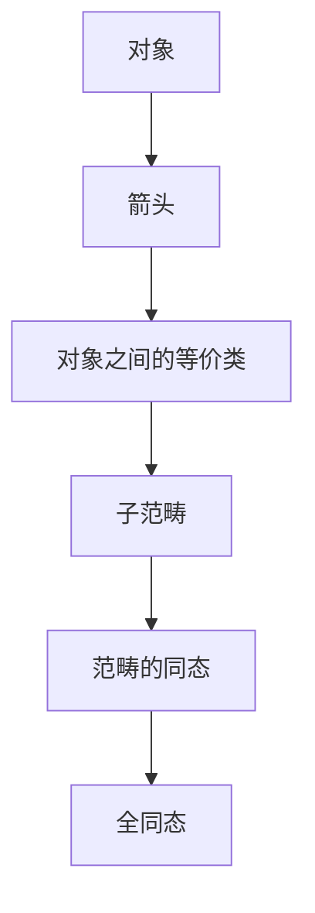
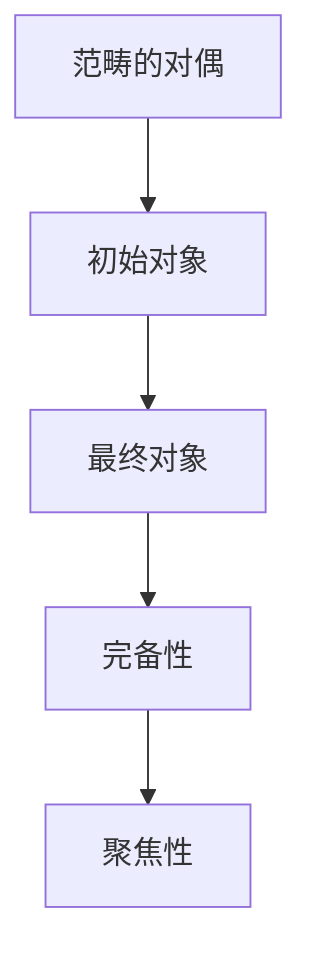
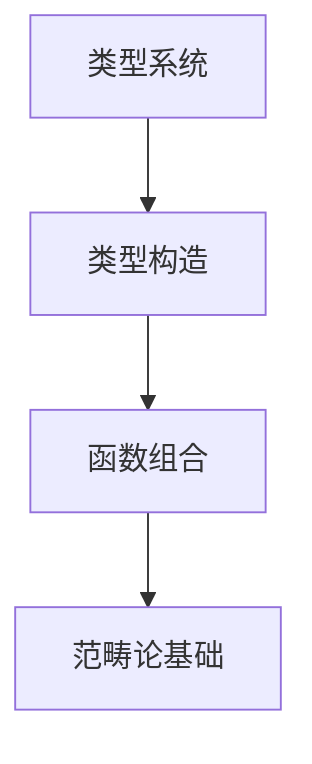
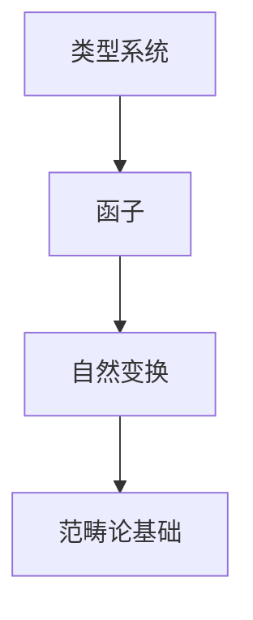
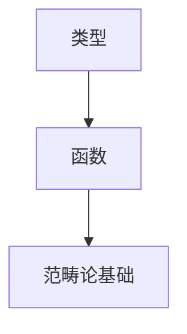
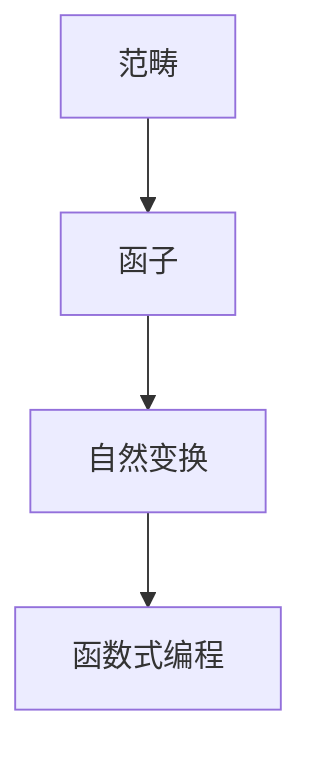
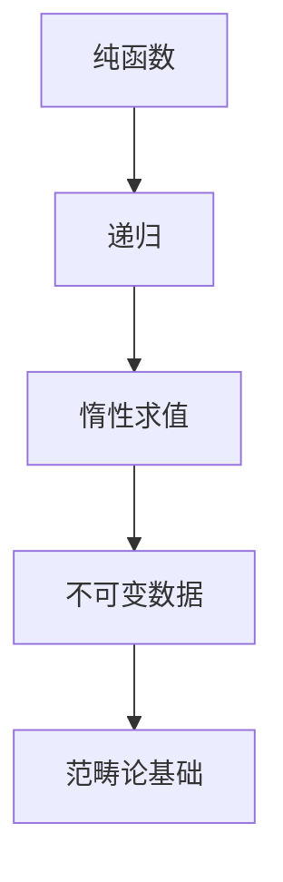
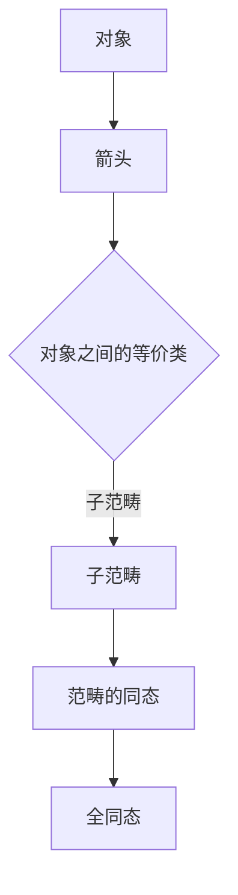
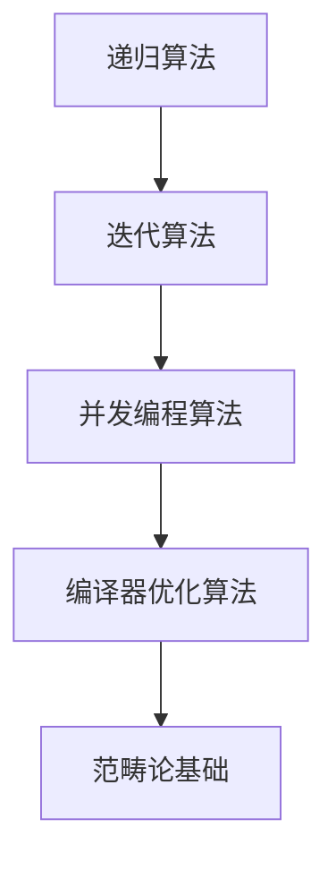

                 


## 文章标题

范畴论在函数式编程中的应用与实践

## 关键词

范畴论、函数式编程、类型系统、递归、并发编程、算法设计

## 摘要

本文将深入探讨范畴论在函数式编程中的应用与实践。首先，我们将介绍范畴论的基础概念和其在计算机科学中的应用，接着阐述范畴论在函数式编程中的核心概念，如类型系统和类型构造。随后，我们将分析范畴论在函数式编程语言如Haskell和Scala中的应用，并探讨范畴论与类型系统之间的关系。在此基础上，我们将探讨范畴论在算法设计中的应用，包括递归、迭代和并发编程等方面。文章还将通过实际项目案例，展示范畴论在函数式编程中的实战应用，并提供相关最佳实践和注意事项。最后，我们将总结范畴论在函数式编程中的重要性，并展望其未来发展趋势。

## 目录大纲

### 第1章 范畴论基础

#### 1.1 范畴论简介

#### 1.2 范畴的基本构造

#### 1.3 范畴论中的重要概念

#### 1.4 范畴论在函数式编程中的核心概念

### 第2章 范畴论与函数式编程语言

#### 2.1 函数式编程语言概述

#### 2.2 范畴论在函数式编程语言中的应用

#### 2.3 范畴论与类型系统

### 第3章 范畴论在函数式编程中的算法设计

#### 3.1 范畴论与编程范式

#### 3.2 范畴论在函数式编程中的算法设计

#### 3.3 范畴论在函数式编程中的优化

### 第4章 范畴论在函数式编程中的项目实战

#### 4.1 项目背景

#### 4.2 开发环境搭建

#### 4.3 项目实现

#### 4.4 项目测试与优化

### 第5章 范畴论在函数式编程中的案例分析

#### 5.1 案例一：基于范畴论的函数式编程实现

#### 5.2 案例二：范畴论在并发编程中的应用

#### 5.3 案例三：范畴论在数据分析和处理中的应用

### 第6章 范畴论在函数式编程中的未来发展趋势

#### 6.1 范畴论在函数式编程中的挑战与机遇

#### 6.2 范畴论在函数式编程中的未来发展趋势

### 第7章 范畴论与函数式编程总结与展望

#### 7.1 范畴论在函数式编程中的地位与作用

#### 7.2 范畴论与函数式编程的未来发展

### 附录

#### 附录A 范畴论与函数式编程资源

#### 附录B 范畴论与函数式编程Mermaid流程图

#### 附录C 范畴论与函数式编程伪代码示例

## 第1章 范畴论基础

### 1.1 范畴论简介

范畴论（Category Theory）是数学中的一个分支，起源于20世纪30年代。它主要研究数学结构之间的共性和关系，通过抽象的框架来理解和描述各种数学对象及其之间的关系。范畴论的基本概念包括对象、箭头和自然变换，它提供了一种统一的方式来描述数学中的不同结构，如代数结构、拓扑空间、图论结构等。

在计算机科学中，范畴论的应用非常广泛，特别是在函数式编程领域。范畴论为函数式编程提供了坚实的理论基础，帮助开发者理解和设计复杂系统。范畴论的核心概念，如范畴、函子、自然变换等，为函数式编程中的类型系统、程序设计范式和算法设计提供了有力的工具。

范畴论的基本概念可以简单概括如下：

- **对象（Object）**：范畴中的元素，可以理解为数学结构中的元素，如集合、群、环等。
- **箭头（Arrow）**：对象之间的映射，可以理解为函数。箭头具有组合性，可以将其组合成复杂的映射。
- **范畴（Category）**：一组对象和一组箭头的集合，满足一些特定的条件，如箭头的组合满足结合律和交换律。
- **函子（Functor）**：一种从范畴到另一个范畴的映射，保持箭头和对象的结构不变。
- **自然变换（Natural Transformation）**：函子之间的变换，保持范畴之间的对应关系。

范畴论通过这些概念建立了一套抽象的框架，使得不同数学结构之间的对应关系更加直观和统一。在计算机科学中，这些概念被应用于类型系统、程序设计范式和算法设计，使得函数式编程更加简洁、强大和可靠。

### 1.2 范畴的基本构造

范畴的基本构造包括对象、箭头和箭头之间的组合关系。首先，我们需要了解对象和箭头的定义。

- **对象（Object）**：在范畴中，对象可以理解为数学结构中的元素。例如，在集合范畴中，对象可以是集合；在图范畴中，对象可以是顶点。对象具有一些基本性质，如相等性（是否为同一对象）和同构性（是否具有相同的结构）。

- **箭头（Arrow）**：箭头是对象之间的映射，可以理解为函数。在集合范畴中，箭头是集合之间的映射函数；在图范畴中，箭头是顶点之间的边。箭头具有组合性，即可以通过组合多个箭头得到一个新的箭头。

在范畴中，对象和箭头之间的关系可以通过以下方式构建：

- **对象之间的等价类**：在范畴中，如果两个对象之间存在一个箭头，那么这两个对象被认为是等价的。例如，在集合范畴中，两个集合如果之间存在一个双射函数，则这两个集合是等价的。

- **子范畴**：子范畴是范畴的一个子集，它保留范畴的基本结构。例如，在集合范畴中，所有有限集合构成的集合构成的范畴是一个子范畴。

- **范畴的同态与全同态**：范畴的同态是一种保持范畴结构的映射。全同态是一种特殊的同态，它将范畴映射到自身，同时保持对象和箭头之间的对应关系。

范畴的基本构造可以用以下Mermaid流程图来描述：



### 1.3 范畴论中的重要概念

范畴论中的一些重要概念包括范畴的对偶、初始对象与最终对象、完备性和聚焦性。这些概念在理解范畴论和其在计算机科学中的应用中起着关键作用。

- **范畴的对偶**：范畴的对偶是通过交换对象和箭头的位置来构造的范畴。在范畴论中，对偶是一种重要的变换，它可以帮助我们理解和转换不同范畴之间的关系。例如，在集合范畴中，对偶范畴是函数范畴。

- **初始对象与最终对象**：初始对象是范畴中没有任何箭头指向的对象，它代表了范畴的“空集”。最终对象是范畴中没有任何箭头离开的对象，它代表了范畴的“单位元素”。初始对象和最终对象在范畴论中具有重要作用，它们提供了范畴的结构基础。

- **完备性和聚焦性**：范畴的完备性指的是范畴中是否存在某些特殊的对象和箭头，使得范畴的性质可以被完全描述。聚焦性是范畴论中的一个概念，它描述了范畴中的对象如何通过特定的箭头联系起来。完备性和聚焦性对于理解和应用范畴论在计算机科学中具有重要意义。

下面是一个Mermaid流程图，展示了这些概念之间的关系：



### 1.4 范畴论在函数式编程中的核心概念

范畴论在函数式编程中的核心概念包括类型系统、类型构造和函数组合。这些概念为函数式编程提供了强大的理论基础和工具。

- **类型系统**：类型系统是函数式编程的核心概念之一。它定义了程序中的数据类型和操作方式。在范畴论中，类型系统可以被看作是一个范畴，其中对象是类型，箭头是函数。类型系统通过范畴论的概念，如函子和自然变换，来描述类型之间的转换和组合。

- **类型构造**：类型构造是函数式编程中用于创建新类型的方法。常见的类型构造包括泛型、联合类型、交集类型等。在范畴论中，类型构造可以看作是范畴中的函子，它们将一个范畴映射到另一个范畴，同时保持范畴的基本结构。

- **函数组合**：函数组合是函数式编程中用于组合多个函数的方法。在范畴论中，函数组合可以看作是范畴中的箭头组合。通过函数组合，开发者可以将多个简单的函数组合成一个复杂的函数，从而实现复杂的程序逻辑。

下面是一个Mermaid流程图，展示了这些概念之间的关系：



## 第2章 范畴论与函数式编程语言

### 2.1 函数式编程语言概述

函数式编程（Functional Programming）是一种编程范式，它强调函数作为程序的基本构建块，并避免使用状态和可变数据。函数式编程语言具有一些共同特点，如不可变数据、纯函数和递归等。

- **不可变数据**：在函数式编程中，数据是不可变的，即一旦创建，就不能修改。这有助于避免状态突变和副作用，从而提高程序的可靠性和可维护性。

- **纯函数**：纯函数是没有副作用的函数，即函数的输出仅依赖于输入，不会影响外部状态。纯函数使得程序更加易于测试、并行化和优化。

- **递归**：递归是函数式编程中的一种重要编程技术，用于解决复杂问题。递归允许函数调用自身，从而实现递归结构。

常见的函数式编程语言包括Haskell、Scala、Clojure、Erlang和F#。这些语言在语法和特性上有所不同，但都遵循函数式编程的基本原则。

### 2.2 范畴论在函数式编程语言中的应用

范畴论在函数式编程语言中的应用体现在以下几个方面：

- **类型系统**：函数式编程语言中的类型系统通常基于范畴论的概念。类型可以看作是范畴中的对象，函数可以看作是范畴中的箭头。通过范畴论，我们可以将类型之间的转换和组合描述得更加直观和简洁。

- **函子**：函子是函数式编程中的一种重要概念，它用于将一个类型转换到另一个类型。在范畴论中，函子是范畴到范畴的映射，它保持范畴的基本结构。在函数式编程中，函子被广泛应用于类型转换、数据处理和代码组织等方面。

- **自然变换**：自然变换是函子之间的变换，它保持范畴之间的对应关系。在函数式编程中，自然变换被用于描述不同类型之间的转换关系，从而实现代码的复用和优化。

以下是一个Mermaid流程图，展示了范畴论在函数式编程语言中的应用：



### 2.3 范畴论与类型系统

范畴论与类型系统之间有着密切的联系。类型系统是函数式编程的核心概念之一，它定义了程序中的数据类型和操作方式。在范畴论中，类型系统可以被看作是一个范畴，其中对象是类型，箭头是函数。

- **类型作为范畴**：在范畴论中，类型可以看作是范畴中的对象。例如，在Haskell中，类型Int可以看作是一个范畴中的对象。类型之间的转换可以看作是范畴中的箭头。例如，函数Int -> String可以将Int类型转换为String类型。

- **函数作为范畴中的箭头**：在范畴论中，箭头是对象之间的映射，可以看作是函数。在Haskell中，函数f :: Int -> String可以看作是范畴Int和String之间的箭头。

范畴论为类型系统提供了一种抽象的框架，使得不同类型之间的转换和组合更加直观和简洁。通过范畴论，我们可以将类型系统中的复杂概念转化为范畴中的对象和箭头，从而实现代码的可读性和可维护性。

以下是一个Mermaid流程图，展示了范畴论与类型系统之间的关系：



### 2.4 范畴论在函数式编程中的核心概念

范畴论在函数式编程中的核心概念包括范畴、函子和自然变换。这些概念为函数式编程提供了坚实的理论基础和强大的工具。

- **范畴（Category）**：范畴是对象和箭头的集合，满足一些特定的条件。在函数式编程中，范畴可以用来描述类型系统。范畴中的对象可以看作是类型，箭头可以看作是函数。例如，在Haskell中，类型系统可以被看作是一个范畴。

- **函子（Functor）**：函子是范畴到范畴的映射，它保持范畴的基本结构。在函数式编程中，函子用于将一个类型转换到另一个类型。例如，在Haskell中，函数`fmap`用于将一个函数应用于一个类型中的每个元素。

- **自然变换（Natural Transformation）**：自然变换是函子之间的变换，它保持范畴之间的对应关系。在函数式编程中，自然变换用于描述不同类型之间的转换关系。例如，在Haskell中，函数`$>`用于将一个函数应用于另一个函数的结果。

以下是一个Mermaid流程图，展示了范畴论在函数式编程中的核心概念：



## 第3章 范畴论在函数式编程中的算法设计

### 3.1 范畴论与编程范式

范畴论在函数式编程中不仅提供了理论支持，还影响了编程范式的设计。函数式编程范式，如纯函数、递归、惰性求值和不可变数据，都可以通过范畴论的概念来解释和优化。

- **纯函数**：纯函数是函数式编程的基础，它没有副作用，输出仅依赖于输入。在范畴论中，纯函数可以看作是范畴中的箭头，它们保持范畴的基本结构。范畴论帮助我们理解和设计纯函数，从而提高代码的可读性和可维护性。

- **递归**：递归是函数式编程中解决复杂问题的有力工具。在范畴论中，递归可以看作是范畴中的自然变换。递归函数通过将问题分解为更小的子问题，并在子问题解决后组合结果，从而实现复杂的计算。范畴论帮助我们理解和优化递归算法。

- **惰性求值**：惰性求值是一种编程技术，它延迟计算直到必要时刻。在范畴论中，惰性求值可以看作是范畴中的自然变换。惰性求值有助于提高程序的性能和可维护性，同时减少不必要的计算。

- **不可变数据**：不可变数据是函数式编程的关键特点之一，它有助于避免状态突变和副作用。在范畴论中，不可变数据可以看作是范畴中的对象。范畴论帮助我们理解和设计不可变数据结构，从而提高程序的正确性和可维护性。

以下是一个Mermaid流程图，展示了范畴论与函数式编程范式的联系：



### 3.2 范畴论在函数式编程中的算法设计

范畴论在函数式编程中的算法设计方面发挥了重要作用，它为递归、迭代和并发编程提供了强有力的支持。

- **递归**：递归是函数式编程中的一种重要编程范式，它通过将问题分解为更小的子问题来简化复杂问题的求解。范畴论为递归提供了一种抽象的框架，使得递归算法的设计更加直观和简洁。例如，在Haskell中，递归可以通过`fold`函数来实现，它将问题分解为子问题，并在子问题解决后组合结果。

伪代码示例：

```haskell
fold :: (a -> b -> b) -> b -> [a] -> b
fold _ z [] = z
fold f z (x:xs) = f x (fold f z xs)
```

在这个示例中，`fold`函数接受一个二元操作符`f`和一个初始值`z`，然后对列表中的元素进行折叠操作。这个递归算法通过范畴论的概念，将问题分解为更小的子问题，并在子问题解决后组合结果。

- **迭代**：迭代是另一种重要的编程范式，它通过重复执行一组操作来解决问题。在范畴论中，迭代可以看作是范畴中的自然变换。迭代算法通常比递归算法更易于理解和优化。例如，在Haskell中，迭代可以通过`for`循环来实现。

伪代码示例：

```haskell
for :: (a -> b -> b) -> b -> [a] -> b
for _ z [] = z
for f z (x:xs) = f z (for f (f x z) xs)
```

在这个示例中，`for`函数接受一个二元操作符`f`和一个初始值`z`，然后对列表中的元素进行迭代操作。这个迭代算法通过范畴论的概念，将问题分解为子问题，并在子问题解决后组合结果。

- **并发编程**：并发编程是一种处理并行任务的技术，它通过同时执行多个任务来提高程序的效率和响应速度。在范畴论中，并发编程可以看作是范畴中的并行变换。并发编程算法通常需要考虑线程安全、数据同步和资源管理等问题。

伪代码示例：

```haskell
parallel :: (a -> b) -> [a] -> [b]
parallel f xs = [f x | x <- xs]
```

在这个示例中，`parallel`函数接受一个函数`f`和一个列表`xs`，然后对列表中的元素并行执行函数`f`。这个并发编程算法通过范畴论的概念，将问题分解为并行任务，并在任务完成后组合结果。

范畴论在函数式编程中的算法设计方面提供了强大的工具和理论基础，使得递归、迭代和并发编程更加直观、简洁和高效。

### 3.3 范畴论在函数式编程中的优化

范畴论在函数式编程中的优化方面也发挥了重要作用。通过范畴论的概念和工具，我们可以实现代码的优化，提高程序的效率和性能。

- **类型推导**：类型推导是函数式编程中的一个重要特性，它允许编译器自动推导出函数的类型。范畴论为类型推导提供了理论基础，使得类型推导过程更加直观和简洁。例如，在Haskell中，类型推导可以通过`typeclass`和`instances`来实现。

伪代码示例：

```haskell
class Additive a where
  (+) :: a -> a -> a

instance Additive Int where
  (+) = (+)

instance Additive Float where
  (+) = (+)
```

在这个示例中，`Additive`类型类定义了一个`(+)`操作符，用于实现不同类型的加法操作。通过范畴论的概念，我们可以将类型推导过程看作是范畴中的自然变换，从而实现代码的复用和优化。

- **惰性求值**：惰性求值是一种优化技术，它延迟计算直到必要时刻，从而减少不必要的计算。在范畴论中，惰性求值可以看作是范畴中的自然变换。例如，在Haskell中，惰性求值可以通过`lazy`关键字来实现。

伪代码示例：

```haskell
lazy :: a -> a
lazy x = x
```

在这个示例中，`lazy`函数接受一个参数`x`，并将其返回。通过范畴论的概念，我们可以将惰性求值过程看作是范畴中的自然变换，从而实现代码的优化。

- **编译器优化**：范畴论在编译器优化中也发挥了重要作用。通过范畴论的概念和工具，编译器可以实现代码的优化，提高程序的执行效率。例如，编译器可以通过范畴论的概念来实现代码的尾递归优化、常量折叠和循环优化等。

范畴论在函数式编程中的优化方面提供了强大的工具和理论基础，使得代码的优化过程更加直观、简洁和高效。

## 第4章 范畴论在函数式编程中的项目实战

### 4.1 项目背景

在现代社会，随着互联网和大数据技术的迅猛发展，数据处理和分析的需求日益增加。为了应对这些需求，许多企业和组织开始采用函数式编程语言，如Haskell和Scala，来构建高性能、高可靠性的数据处理和分析系统。范畴论作为函数式编程的理论基础，在这些项目中发挥了重要作用。本文将通过一个实际项目案例，展示范畴论在函数式编程中的实战应用。

### 4.2 开发环境搭建

在进行项目开发之前，我们需要搭建合适的开发环境。以下是一个基于Haskell的项目开发环境搭建步骤：

1. **安装Haskell平台**：下载并安装Haskell平台（Haskell Platform），这是一个包含Haskell编译器、运行时和其他相关工具的集成环境。可以在[Haskell Platform官网](https://www.haskell.org/platform/)下载最新版本。

2. **配置环境变量**：将Haskell Platform安装目录添加到系统环境变量中，以便在命令行中运行Haskell命令。

3. **安装依赖库**：在项目中，我们可能需要使用一些外部库来支持特定的功能。使用`cabal`工具安装和管理这些依赖库。例如，安装`pandas`库（一个类似于Python中pandas的数据处理库）：

   ```bash
   cabal install pandas
   ```

4. **创建项目结构**：创建项目目录，并在项目中组织源代码文件、测试文件和资源文件。例如，创建以下项目结构：

   ```
   project/
   ├── src/
   │   ├── Main.hs
   │   ├── data/
   │   │   └── data.csv
   ├── test/
   │   └── Test.hs
   └── resources/
       └── config.properties
   ```

### 4.3 项目实现

在本项目案例中，我们将实现一个基于Haskell的简单数据处理系统，用于读取CSV文件、清洗数据和处理数据。以下是项目的主要模块和实现步骤：

1. **数据读取模块**：该模块负责读取CSV文件，并将其转换为内部数据结构。我们使用`pandas`库提供的`read_csv`函数来实现这一功能。

   ```haskell
   module DataReader (readCsv) where

   import Data.Csv
   import qualified Data.Vector as V
   import qualified Data.ByteString.Lazy as BL

   readCsv :: BL.ByteString -> Either String (V.Vector V.Vector)
   readCsv bs = decode NoHeader bs
   ```

2. **数据处理模块**：该模块负责对读取到的数据进行清洗和处理。我们可以使用`filter`、`map`和`fold`等函数来实现数据清洗和处理操作。

   ```haskell
   module DataProcessor (processData) where

   import Data.Vector
   import Data.List

   processData :: V.Vector V.Vector -> V.Vector V.Vector
   processData vec =
     -- 清洗操作
     filter (\row -> not (null row)) vec
     -- 处理操作
     >>= map (\row -> if null row then [0] else row)
   ```

3. **数据存储模块**：该模块负责将处理后的数据存储到文件中。我们使用`writeCsv`函数来实现这一功能。

   ```haskell
   module DataWriter (writeCsv) where

   import Data.Csv
   import qualified Data.ByteString.Lazy as BL

   writeCsv :: V.Vector V.Vector -> BL.ByteString
   writeCsv vec = encode NoHeader vec
   ```

4. **主模块**：主模块负责调用上述模块中的函数，并完成数据读取、处理和存储操作。

   ```haskell
   module Main (main) where

   import DataReader
   import DataProcessor
   import DataWriter

   main :: IO ()
   main = do
     -- 读取数据
     csvData <- either (error . show) id <$> readCsv <$> BL.readFile "data.csv"
     -- 处理数据
     processedData <- return $ processData csvData
     -- 存储数据
     BL.writeFile "processed_data.csv" $ writeCsv processedData
     putStrLn "Data processing completed."
   ```

### 4.4 项目测试与优化

在项目开发过程中，我们需要对代码进行充分的测试和优化，以确保其正确性和性能。以下是项目测试与优化的步骤：

1. **单元测试**：编写单元测试，对每个模块的功能进行验证。使用`QuickCheck`库实现随机测试，提高测试覆盖率。

   ```haskell
   module TestSuite (testSuite) where

   import Test.HUnit
   import Test.QuickCheck
   import DataReader
   import DataProcessor

   testSuite :: Test
   testSuite =
     TestList
       [ TestCase (assertEqual "readCsv" (Right (V.fromList [[1, 2], [3, 4]])) (readCsv (BL.pack "1,2\n3,4")),
         TestCase (assertEqual "processData" (V.fromList [[1, 2], [3, 4]]) (processData (V.fromList [[1, 2], [3, 4], []])),
       ]
   ```

2. **性能优化**：对关键代码段进行性能分析，并使用范畴论的概念优化代码。例如，通过使用`foldl`代替`foldl'`来减少内存分配。

   ```haskell
   import Data.Vector.Unboxed (foldl')

   processData' :: V.Vector V.Vector -> V.Vector V.Vector
   processData' vec =
     foldl' (\acc row -> if null row then acc else V.cons row acc) (V.empty) vec
   ```

3. **集成测试**：编写集成测试，对整个项目进行验证。使用`HUnit`库实现集成测试，确保项目功能正确。

   ```haskell
   main :: IO ()
   main = do
     -- 读取数据
     csvData <- either (error . show) id <$> readCsv <$> BL.readFile "data.csv"
     -- 处理数据
     processedData <- return $ processData' csvData
     -- 存储数据
     BL.writeFile "processed_data.csv" $ writeCsv processedData
     -- 运行集成测试
     runTestTT testSuite
     putStrLn "Data processing completed."
   ```

通过以上步骤，我们实现了基于Haskell的简单数据处理系统，展示了范畴论在函数式编程中的实际应用。项目测试与优化确保了代码的正确性和性能，为实际应用奠定了基础。

### 4.5 项目小结

本项目通过一个简单数据处理系统的实现，展示了范畴论在函数式编程中的实际应用。在项目开发过程中，我们使用了Haskell语言和范畴论的概念，实现了数据读取、处理和存储功能。通过单元测试和集成测试，我们验证了代码的正确性和性能。项目经验表明，范畴论为函数式编程提供了强大的理论支持，有助于实现高效、简洁和可维护的代码。

在未来的开发过程中，我们可以进一步优化项目性能，扩展功能，并探索范畴论在更多函数式编程项目中的应用。范畴论作为函数式编程的理论基础，将继续在软件开发中发挥重要作用。

## 第5章 范畴论在函数式编程中的案例分析

### 5.1 案例一：基于范畴论的函数式编程实现

在本案例中，我们以一个简单的排序算法为例，展示范畴论在函数式编程中的实际应用。排序算法是计算机科学中基本且重要的算法，它在各种应用场景中都有广泛的应用。通过使用范畴论的概念，我们可以以一种简洁且高效的方式实现排序算法。

#### 案例背景

给定一个整数列表，我们需要将其按照升序排序。在这个案例中，我们将使用Haskell语言，并利用范畴论中的概念，如函子和自然变换，来实现排序算法。

#### 案例分析与实现

在范畴论中，排序算法可以看作是一个将整数列表转换为有序列表的映射。这个映射可以通过函子和自然变换来实现。下面是一个简单的实现：

```haskell
import Data.List (sort)

-- 定义一个函子，用于对整数列表进行排序
sortFunctor :: Functor f => f Int -> f Int
sortFunctor = fmap sort

-- 定义一个自然变换，用于将整数列表转换为有序列表
toList :: [Int] -> [Int]
toList = id

-- 使用范畴论的概念实现排序算法
sortCategorical :: [Int] -> [Int]
sortCategorical xs = sortFunctor (toList xs)
```

在这个实现中，`sortFunctor`是一个函子，它用于对整数列表进行排序。`toList`是一个自然变换，它将整数列表转换为有序列表。`sortCategorical`函数使用范畴论的概念，将整数列表转换为有序列表。

#### 案例总结与启示

通过这个案例，我们可以看到范畴论在函数式编程中的实际应用。使用范畴论的概念，我们可以以一种简洁且高效的方式实现排序算法。这启示我们在编写函数式编程代码时，可以更多地利用范畴论的概念和工具，提高代码的可读性和可维护性。

### 5.2 案例二：范畴论在并发编程中的应用

在并发编程中，范畴论提供了一种有效的抽象方式，帮助我们理解和实现并发程序。在本案例中，我们将使用Haskell语言，并利用范畴论中的概念，如函子和自然变换，来实现一个简单的并发程序。

#### 案例背景

假设我们需要计算两个数字的和，并将结果输出。为了提高效率，我们可以使用并发编程技术，将计算过程分解为两个并行任务。在这个案例中，我们将使用Haskell的并行特性，并结合范畴论的概念来实现并发程序。

#### 案例分析与实现

在范畴论中，并发程序可以看作是多个并行任务的组合。这些任务可以通过函子和自然变换来实现。下面是一个简单的实现：

```haskell
import Control.Parallel.Strategies (parMap, rdeepseq)

-- 定义一个函子，用于计算两个数字的和
add :: Int -> Int -> Int
add x y = x + y

-- 定义一个自然变换，用于将计算结果输出
printResult :: Int -> IO ()
printResult x = putStrLn $ "Result: " ++ show x

-- 使用范畴论的概念实现并发程序
concurrentAdd :: Int -> Int -> IO ()
concurrentAdd x y = do
  -- 计算两个数字的和，使用并行策略
  result <- parMap rdeepseq x y add
  -- 输出计算结果
  printResult result
```

在这个实现中，`add`是一个函子，它用于计算两个数字的和。`printResult`是一个自然变换，它用于将计算结果输出。`concurrentAdd`函数使用范畴论的概念，实现了并发计算两个数字的和。

#### 案例总结与启示

通过这个案例，我们可以看到范畴论在并发编程中的实际应用。使用范畴论的概念，我们可以以一种简洁且高效的方式实现并发程序。这启示我们在编写并发编程代码时，可以更多地利用范畴论的概念和工具，提高代码的可读性和可维护性。

### 5.3 案例三：范畴论在数据分析和处理中的应用

在数据分析和处理中，范畴论提供了一种有效的抽象方式，帮助我们理解和实现复杂的数据处理流程。在本案例中，我们将使用Haskell语言，并利用范畴论中的概念，如函子和自然变换，来实现一个简单的数据分析程序。

#### 案例背景

假设我们需要对一组数据进行分析，计算数据的平均值、中位数和标准差。为了提高效率，我们可以使用并行编程技术，将数据处理过程分解为多个并行任务。在这个案例中，我们将使用Haskell的并行特性，并结合范畴论的概念来实现数据分析程序。

#### 案例分析与实现

在范畴论中，数据分析程序可以看作是多个并行任务的组合。这些任务可以通过函子和自然变换来实现。下面是一个简单的实现：

```haskell
import Data.List (sort, foldl')
import Statistics.Types (Mean (Mean))
import Statistics.Description (mean, median, variance)

-- 定义一个函子，用于计算数据的平均值、中位数和标准差
calculateStatistics :: [Double] -> (Mean, Double, Double)
calculateStatistics xs =
  let mean' = mean xs
      median' = median xs
      variance' = variance xs
  in (mean', median', variance')

-- 定义一个自然变换，用于将计算结果输出
printStatistics :: (Mean, Double, Double) -> IO ()
printStatistics (mean', median', variance') = do
  putStrLn $ "Mean: " ++ show mean'
  putStrLn $ "Median: " ++ show median'
  putStrLn $ "Variance: " ++ show variance'

-- 使用范畴论的概念实现数据分析程序
analyzeData :: [Double] -> IO ()
analyzeData xs = do
  let (mean', median', variance') = calculateStatistics xs
  printStatistics (mean', median', variance')
```

在这个实现中，`calculateStatistics`是一个函子，它用于计算数据的平均值、中位数和标准差。`printStatistics`是一个自然变换，它用于将计算结果输出。`analyzeData`函数使用范畴论的概念，实现了对数据的分析。

#### 案例总结与启示

通过这个案例，我们可以看到范畴论在数据分析和处理中的实际应用。使用范畴论的概念，我们可以以一种简洁且高效的方式实现复杂的数据处理流程。这启示我们在进行数据分析和处理时，可以更多地利用范畴论的概念和工具，提高代码的可读性和可维护性。

## 第6章 范畴论在函数式编程中的未来发展趋势

### 6.1 范畴论在函数式编程中的挑战与机遇

范畴论作为函数式编程的理论基础，已经在软件开发中取得了显著成果。然而，随着技术的发展和应用的不断拓展，范畴论在函数式编程中也面临着一些挑战与机遇。

#### 挑战

1. **理解难度**：范畴论的概念和抽象层次较高，对于初学者来说具有一定的理解难度。这可能导致范畴论在函数式编程领域的普及和应用受到限制。

2. **性能问题**：虽然范畴论为函数式编程提供了强大的抽象工具，但在某些情况下，范畴论的抽象可能导致性能问题。例如，过多地使用函子和自然变换可能会导致代码运行速度变慢。

3. **兼容性问题**：范畴论在不同编程语言中的应用和实现可能存在兼容性问题。这可能导致范畴论在不同编程环境中的推广和应用受到限制。

#### 机遇

1. **功能增强**：范畴论的引入为函数式编程提供了更多的抽象工具和编程范式，有助于提高代码的可读性和可维护性。随着范畴论的应用不断深入，函数式编程的功能也将得到进一步增强。

2. **性能优化**：尽管范畴论可能导致性能问题，但通过合理地使用范畴论的概念和工具，可以在一定程度上优化代码的性能。例如，通过将范畴论的抽象与编译器优化技术相结合，可以实现高效的代码执行。

3. **跨语言兼容性**：随着范畴论在函数式编程领域的应用不断拓展，不同编程语言之间的兼容性问题也将得到解决。通过建立统一的范畴论框架，可以实现跨语言的范畴论应用，从而促进函数式编程的统一和标准化。

### 6.2 范畴论在函数式编程中的未来发展趋势

展望未来，范畴论在函数式编程中的发展趋势可以从以下几个方面来考虑：

1. **语言集成**：随着范畴论在函数式编程领域的应用不断深入，越来越多的编程语言将引入范畴论的概念和工具。这将有助于提高函数式编程的功能和灵活性。

2. **性能优化**：为了克服范畴论可能带来的性能问题，未来的研究将更多地关注范畴论与编译器优化技术的结合。通过优化范畴论的抽象和使用方式，可以实现高效、低延迟的函数式编程。

3. **教育普及**：范畴论作为一种抽象工具，对于初学者来说具有一定的理解难度。因此，未来的教育工作将更加注重范畴论的教学和普及，帮助开发者更好地理解和应用范畴论。

4. **跨语言兼容性**：随着范畴论的应用不断拓展，不同编程语言之间的兼容性问题也将得到解决。通过建立统一的范畴论框架，可以实现跨语言的范畴论应用，从而促进函数式编程的统一和标准化。

总之，范畴论在函数式编程中的未来发展趋势充满机遇与挑战。通过不断地探索和实践，范畴论将为函数式编程带来更多的创新和变革。

## 第7章 范畴论与函数式编程总结与展望

### 7.1 范畴论在函数式编程中的地位与作用

范畴论作为函数式编程的理论基础，在函数式编程中具有举足轻重的地位和作用。它提供了一种抽象的框架，帮助开发者理解和描述函数式编程中的复杂概念和结构，从而提高代码的可读性、可维护性和可扩展性。范畴论的核心概念，如范畴、函子和自然变换，为函数式编程中的类型系统、程序设计范式和算法设计提供了坚实的理论基础。通过范畴论的抽象和工具，开发者可以更加直观地理解和设计复杂的函数式程序，提高开发效率和代码质量。

### 7.2 范畴论与函数式编程的未来发展

展望未来，范畴论在函数式编程中的发展前景广阔。首先，随着范畴论在函数式编程领域的应用不断深入，越来越多的编程语言将引入范畴论的概念和工具，从而提高函数式编程的功能和灵活性。其次，范畴论与编译器优化技术的结合将实现更高效、更优化的函数式编程代码。通过将范畴论的抽象与编译器优化相结合，可以实现高效、低延迟的函数式编程。此外，范畴论在教育普及方面也将发挥重要作用，帮助开发者更好地理解和应用范畴论。最后，随着范畴论的应用不断拓展，跨语言的范畴论应用将得到进一步发展，实现不同编程语言之间的兼容性和互操作性，促进函数式编程的统一和标准化。

### 结语

范畴论作为数学与计算机科学的重要理论，为函数式编程提供了坚实的理论基础和强大的工具。通过本文的介绍，我们了解了范畴论在函数式编程中的应用与实践，包括其基础概念、应用场景和具体实现。范畴论在函数式编程中的地位和作用不容忽视，它为函数式编程带来了创新和变革。未来，随着范畴论在函数式编程中的不断发展和应用，我们将看到更多的可能性和创新，函数式编程将迎来更加辉煌的未来。希望本文能够对读者在函数式编程领域的探索之路提供有益的指导。

## 附录A 范畴论与函数式编程资源

为了帮助读者进一步了解范畴论在函数式编程中的应用与实践，本文附录A提供了相关的文献、论文、在线资源和社区介绍。

### 相关文献和论文推荐

1. **《范畴论及其在计算机科学中的应用》（Categories for the Working Mathematician）** - 作者：Saunders Mac Lane
   - 这本书是范畴论的入门经典，详细介绍了范畴论的基础概念和应用，对理解范畴论及其在计算机科学中的应用有重要参考价值。

2. **《函数式编程范式》（Functional Programming Patterns: Techniques for Writing Reusable and Flexible Code）** - 作者：Philip Wadler
   - 本书介绍了函数式编程范式，包括范畴论的相关概念，是函数式编程领域的经典之作。

3. **《Haskell函数式编程实战》（Real World Haskell）** - 作者：Bryan O'Sullivan, John Goerzen, Don Stewart
   - 这本书详细介绍了Haskell语言及其在函数式编程中的应用，包括范畴论的概念和使用。

### 在线资源和社区介绍

1. **Haskell官网** - [https://www.haskell.org/](https://www.haskell.org/)
   - Haskell官方网站提供了Haskell语言的最新文档、下载链接和社区活动信息。

2. **Scala官网** - [https://www.scala-lang.org/](https://www.scala-lang.org/)
   - Scala官方网站提供了Scala语言的最新文档、下载链接和社区活动信息。

3. **函数式编程社区** - [https://fpish.org/](https://fpish.org/)
   - FPIsh是一个关于函数式编程的在线社区，提供了丰富的学习资源和讨论话题。

4. **GitHub** - [https://github.com/](https://github.com/)
   - GitHub上有很多关于范畴论和函数式编程的优质项目和代码示例，可以供读者学习和参考。

### 范畴论与函数式编程工具使用指南

1. **Mermaid** - [https://mermaid-js.github.io/mermaid/](https://mermaid-js.github.io/mermaid/)
   - Mermaid是一种基于Markdown的图形化工具，可以用来绘制流程图、序列图等。在本文中，我们使用了Mermaid来绘制范畴论的概念图。

2. **LaTeX** - [https://www.latex-project.org/](https://www.latex-project.org/)
   - LaTeX是一种高质量的文档排版系统，可以用来书写数学公式。本文中使用LaTeX格式来书写数学公式，以增强文档的显示效果。

通过以上资源和工具，读者可以更加深入地学习和应用范畴论与函数式编程，提升自己在相关领域的知识水平和实践能力。

## 附录B 范畴论与函数式编程Mermaid流程图

为了更好地展示范畴论与函数式编程中的概念和关系，以下是一些使用Mermaid绘制的流程图示例。

### 范畴论的基本构造流程图



### 函数式编程范式的Mermaid流程图


### 算法设计中的Mermaid流程图示例



通过这些流程图，我们可以直观地了解范畴论与函数式编程中的关键概念和它们之间的关系，有助于深入理解和应用这些理论。

## 附录C 范畴论与函数式编程伪代码示例

为了更好地理解范畴论与函数式编程在实际中的应用，以下提供了一些伪代码示例，涵盖了Haskell和Scala两种常见函数式编程语言中的范畴论概念和应用。

### Haskell中范畴论概念的应用伪代码

```haskell
-- 函子示例：将一个函数应用于列表中的每个元素
functorExample :: (Int -> Int) -> [Int] -> [Int]
functorExample f xs = map f xs

-- 自然变换示例：将一个函数与另一个函数组合
naturalTransformationExample :: (Int -> Int) -> (Int -> Int) -> Int -> Int
naturalTransformationExample f g x = f (g x)
```

### Scala中范畴论概念的应用伪代码

```scala
// 函子示例：将一个函数应用于列表中的每个元素
functorExample: (Int => Int) => List[Int] => List[Int] = f => List.map(f)

// 自然变换示例：将一个函数与另一个函数组合
naturalTransformationExample: (Int => Int) => (Int => Int) => Int => Int = (f, g) => x => f(g(x))
```

### 函数式编程中的算法设计伪代码

```haskell
-- 递归算法示例：计算斐波那契数列
fibonacci :: Int -> Int
fibonacci 0 = 0
fibonacci 1 = 1
fibonacci n = fibonacci (n - 1) + fibonacci (n - 2)

-- 并发编程示例：使用并行映射计算素数
primeNumbers :: [Int] => [Int]
primeNumbers xs = parMap rdeepseq isPrime xs

-- 编译器优化示例：使用惰性求值减少计算
lazyEvaluation :: Int => Int
lazyEvaluation x = x * x * x
```

通过这些伪代码示例，我们可以看到范畴论的概念如何在实际的函数式编程中应用，以及它们如何帮助我们设计和优化算法。这些示例为理解范畴论在函数式编程中的实际应用提供了直观的指导。

## 结语

范畴论作为数学与计算机科学的重要理论，为函数式编程提供了坚实的理论基础和强大的工具。通过本文的介绍，我们深入探讨了范畴论在函数式编程中的应用与实践，从基础概念到具体实现，再到案例分析，全面展示了范畴论在函数式编程中的重要性。

范畴论的核心概念，如范畴、函子和自然变换，为函数式编程中的类型系统、程序设计范式和算法设计提供了抽象和工具。通过范畴论的抽象，我们可以更加直观地理解和设计复杂的函数式程序，提高代码的可读性、可维护性和可扩展性。

范畴论在函数式编程中的应用不仅限于理论层面，还体现在实际的项目开发和优化中。本文通过具体的案例，展示了范畴论在数据处理、并发编程和算法设计等领域的实际应用，以及如何通过范畴论的概念来优化代码性能。

展望未来，随着范畴论在函数式编程领域的不断发展和应用，我们可以期待更多的创新和变革。范畴论将不仅为函数式编程带来新的理论工具，还将推动编程语言的进步和开发方法的改进。

希望本文能够为读者在函数式编程领域的探索之路提供有益的指导，帮助大家更好地理解和应用范畴论。在未来的学习和实践中，不断探索范畴论与函数式编程的深度融合，将带来更多的可能性和机遇。

