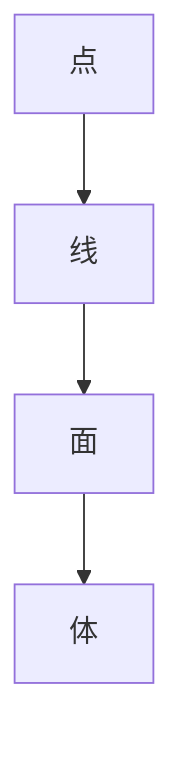

                 

### 摘要

本文旨在探讨17世纪两位科学巨匠莱布尼茨与牛顿在时空观念上的哲学之争。莱布尼茨主张时空是物体的属性，而牛顿则认为时空是绝对的，不依赖于物体。本文首先介绍两位科学家的生平，然后分别阐述他们的时空观念，接着深入分析两者之间的哲学分歧，并探讨其对现代物理学的启示与影响。通过本文的解读，读者将能够更全面地理解时空观念的历史发展与哲学意义，为现代物理学的研究提供新的视角。

## 第1章 莱布尼茨与牛顿的生平介绍

### 1.1 莱布尼茨的生平

戈特弗里德·威廉·莱布尼茨（Gottfried Wilhelm Leibniz）出生于1646年7月1日，德国莱比锡，是17世纪最伟大的数学家、哲学家和逻辑学家之一。莱布尼茨自幼展现出卓越的数学天赋，18岁时进入莱比锡大学学习法律，但他的主要兴趣却在数学和物理学领域。

莱布尼茨在1666年遇到了数学家尼古拉斯·梅青格尔（Nicholas Mercator），从此开始深入研究数学。他在1666年至1667年间游历了欧洲，访问了英国、法国等地，结识了许多著名学者，如艾萨克·牛顿和约翰·瓦利斯。这次游历极大地拓宽了他的学术视野，促使他在数学和哲学领域取得了重大突破。

莱布尼茨最著名的成就是微积分的发现。他与牛顿几乎同时独立发明了微积分，两人之间还发生了著名的微积分优先权之争。莱布尼茨不仅在数学上做出了卓越贡献，他在哲学、逻辑、法学等领域也有广泛影响。他的哲学思想强调理性主义和个体自由，对启蒙运动产生了深远影响。

莱布尼茨在1705年11月14日去世，享年59岁。他的学术遗产持续影响着后世，被广泛认为是与牛顿并驾齐驱的科学巨人。

### 1.2 牛顿的生平

艾萨克·牛顿（Isaac Newton）出生于1643年12月25日，英格兰林肯郡的格兰瑟姆。他是17世纪最杰出的科学家、数学家、物理学家和天文学家之一。牛顿的早期教育并不顺利，但他的天赋和勤奋使他在科学领域取得了巨大成就。

牛顿在1661年进入剑桥大学三一学院学习，并在1665年因为瘟疫爆发而回家乡。这段时间里，他独自研究数学和自然科学，完成了许多重要工作。1667年，牛顿重返剑桥大学，并在1671年获得硕士学位。他随后在光学和力学领域取得了重大突破，发明了反射望远镜，并提出了光的色散理论。

牛顿最著名的成就是万有引力定律和三大运动定律，这些成果发表在他的代表作《自然哲学的数学原理》（Philosophiæ Naturalis Principia Mathematica）中。这本书奠定了经典力学的理论基础，对科学和哲学产生了深远影响。

牛顿不仅在自然科学领域取得了辉煌成就，他在数学、光学、化学等领域也有卓越贡献。他的科学思想和实验方法为后来的科学家树立了榜样。

牛顿在1727年3月31日去世，享年84岁。他被誉为科学史上最伟大的科学家之一，其学术成就对后世产生了深远影响。

## 第2章 时空观念的历史背景

时空观念是哲学和科学中的重要概念，它的发展经历了漫长的历史。从古代到现代，时空观念不断演变，形成了不同的哲学流派和科学理论。

### 2.1 古代时空观念

在古代，时空观念主要受到宗教和哲学的影响。古代希腊哲学家亚里士多德提出了“四因说”，认为事物变化的原因有四种：形式因、质料因、动力因和目的因。亚里士多德认为时间和空间是物体的属性，与物体共存，但不是绝对存在的。

在古代中国，时空观念也有一定的哲学探讨。例如，儒家学说认为时间是线性发展的，人类应该顺应时间的变化，追求道德的完善。道家学说则强调“道法自然”，认为时间和空间是无限的，宇宙万物都是相互关联的。

### 2.2 唯物主义时空观念

17世纪的唯物主义哲学为时空观念的发展奠定了基础。唯物主义认为，时间和空间是客观存在的，不依赖于人的意识。英国哲学家托马斯·霍布斯（Thomas Hobbes）和约翰·洛克（John Locke）是唯物主义时空观念的代表人物。

霍布斯认为，时间和空间是连续的，无限可分的。他认为，时间是由“现在”这一刻构成的，每一刻都是连续的，构成了整个时间流。空间则是无限延伸的，没有边界。

洛克则强调，时间和空间是感觉的产物，人的感知决定了我们对时间和空间的认知。他认为，时间和空间是物体的属性，物体的运动和变化决定了我们对时间和空间的感知。

### 2.3 辩证唯物主义时空观念

19世纪，辩证唯物主义哲学进一步深化了对时空观念的理解。辩证唯物主义认为，时间和空间是物质的运动形式，与物质的存在和运动密不可分。时间和空间具有相对性和绝对性，在一定条件下可以相互转化。

卡尔·马克思（Karl Marx）和弗里德里希·恩格斯（Friedrich Engels）是辩证唯物主义的代表人物。他们在《德意志意识形态》中提出，时间和空间是物质的运动形式，与物质的存在和变化密切相关。他们认为，时间和空间是无限的，但不是绝对的，而是随着物质的发展而变化。

综上所述，时空观念的发展经历了从古代到现代的演变，不同哲学流派和科学理论对时空观念的探讨丰富了我们对这一概念的理解。莱布尼茨和牛顿在时空观念上的哲学之争，反映了17世纪科学和哲学的发展趋势，对现代物理学和哲学产生了深远影响。

## 第3章 莱布尼茨的时空观念

### 3.1 莱布尼茨的空间观念

莱布尼茨的空间观念是他在哲学和数学上的重要贡献之一。他认为，空间是物体的属性，而不是独立存在的实体。莱布尼茨将空间视为一种逻辑结构，是一种“位置关系”的概念。

在莱布尼茨的体系中，空间是由无限多的点和线组成的。每个点都可以通过位置关系与其他点联系起来，形成了一个复杂的结构网络。这个结构网络反映了物体之间的位置关系和相互作用。

莱布尼茨认为，空间是无限可分的。每个物体都可以无限细分，每个部分都有其特定的位置关系。这种无限可分性使得空间具有无限复杂性，也为数学提供了丰富的结构。

为了更好地理解莱布尼茨的空间观念，我们可以使用Mermaid流程图来展示他的空间概念。



在这个流程图中，点（A）是空间的基本单位，通过线的连接（B）形成面（C），最终形成立体结构（D）。这展示了莱布尼茨对空间的理解，即空间是由基本单位通过逻辑关系构成的复杂结构。

### 3.2 莱布尼茨的空间运动观

莱布尼茨的空间运动观是他的时空观念的重要组成部分。他认为，物体的运动是相对的，依赖于观察者的参考系。莱布尼茨提出了“相对性原理”，即物体的运动状态是相对于观察者的参考系而言的。

在莱布尼茨的框架中，运动不仅仅是位置的变化，还包括方向和速度。他认为，物体的运动可以通过一个“位置函数”来描述，这个函数反映了物体在空间中的位置随时间的变化。

为了理解莱布尼茨的空间运动观，我们可以用伪代码来描述一个简单的物体运动模型。

```python
# 定义一个物体运动模型
def move_object(position, velocity, time_step):
    new_position = position + velocity * time_step
    return new_position
```

在这个模型中，`position`代表物体的初始位置，`velocity`代表物体的速度，`time_step`代表时间间隔。通过迭代计算，我们可以得到物体在不同时间点的位置。

### 3.3 莱布尼茨的时间观念

莱布尼茨的时间观念强调时间的绝对性和连续性。他认为，时间是一个无限延续的序列，每个时刻都是独立的，但又相互联系。莱布尼茨将时间视为一种逻辑序列，是一个由“现在”这一刻构成的连续体。

在莱布尼茨的体系中，时间是无限可分的，每个时刻都可以无限细分。这种无限可分性使得时间具有极高的复杂性，也为数学提供了丰富的结构。

为了更好地理解莱布尼茨的时间观念，我们可以用伪代码来描述一个简单的时钟模型。

```python
# 定义一个时钟模型
def tick_clock(current_time, time_step):
    next_time = current_time + time_step
    return next_time
```

在这个模型中，`current_time`代表当前时间，`time_step`代表时间间隔。通过迭代计算，我们可以得到时钟在不同时间点的读数。

### 3.4 莱布尼茨的时空观念总结

莱布尼茨的时空观念强调空间和时间的逻辑结构，以及它们之间的相互关系。他认为，空间是由无限多的点和线组成的复杂结构，而时间是无限延续的逻辑序列。莱布尼茨的时空观念为后来的科学家提供了重要的理论基础，对现代物理学的发展产生了深远影响。

在莱布尼茨的体系中，空间和时间的概念是相互关联的。物体的运动不仅涉及空间的位置变化，还包括时间的变化。这种观念为后来的相对论提供了重要的启示，对现代物理学的发展具有重要意义。

## 第4章 牛顿的时空观念

### 4.1 牛顿的空间观念

艾萨克·牛顿（Isaac Newton）对时空观念的阐述主要体现在他的经典力学理论中。牛顿的空间观念是绝对的、不变的，他认为空间是无所不在的、无限的、不可分割的，并且是物体运动的基础。

在牛顿的理论中，空间被视为一个固定的背景，它提供了一个参照框架，使物体的运动可以得以描述和测量。牛顿认为，空间本身没有物理属性，它不是由物体构成的，而是作为物体运动的舞台而存在。

牛顿将空间视为一个绝对的、无始无终的容器，所有物体都在这个容器中运动。这种观念与莱布尼茨的相对性观点形成了鲜明对比。莱布尼茨认为空间是物体的属性，依赖于物体的存在和运动，而牛顿则认为空间是独立于物体存在的绝对实体。

为了更好地理解牛顿的空间观念，我们可以用伪代码描述一个简单的空间模型。

```python
# 定义一个空间模型
class Space:
    def __init__(self):
        self.objects = []

    def add_object(self, object):
        self.objects.append(object)

    def remove_object(self, object):
        self.objects.remove(object)
```

在这个模型中，`Space`类代表一个空间，它包含一系列物体。通过添加和移除物体，我们可以模拟物体在空间中的运动。

### 4.2 牛顿的空间运动观

牛顿的空间运动观是基于他的三大运动定律。这些定律描述了物体在空间中的运动规律，并为我们提供了计算物体运动状态的方法。

牛顿的第一定律（惯性定律）指出，一个物体如果没有受到外力作用，它将保持静止状态或匀速直线运动。这意味着，物体的运动状态不会自发改变，必须受到外力的作用。

牛顿的第二定律（F=ma）描述了力与加速度之间的关系。它指出，一个物体的加速度与作用在它上的外力成正比，与它的质量成反比。这个定律为我们提供了计算物体加速度的方法，并且揭示了力是改变物体运动状态的原因。

牛顿的第三定律（作用与反作用定律）指出，任何作用力都有一个相等且相反的反作用力。这意味着，物体间的相互作用总是成对出现的，作用力和反作用力大小相等、方向相反。

为了理解牛顿的空间运动观，我们可以用伪代码来描述一个简单的运动模型。

```python
# 定义一个运动模型
class Object:
    def __init__(self, mass, velocity):
        self.mass = mass
        self.velocity = velocity

    def apply_force(self, force):
        acceleration = force / self.mass
        self.velocity += acceleration

# 模拟物体运动
object = Object(mass=1, velocity=0)
force = 10
object.apply_force(force)
print("加速度:", object.velocity)
```

在这个模型中，`Object`类代表一个物体，它具有质量和速度属性。通过施加力（`apply_force`方法），我们可以计算物体的加速度和新的速度。

### 4.3 牛顿的时间观念

牛顿的时间观念与他的空间观念紧密相连。他认为时间是一个绝对的概念，是匀速流逝的，不受外界干扰。牛顿将时间视为一个连续的、均匀的流，每个瞬间都是相同的，时间是无限可分的。

牛顿认为，时间是可以独立于物体和事件存在的，它是测量和描述物体运动的基础。时间的流逝不受物体的运动状态影响，即使在一个完全静止的宇宙中，时间也会继续流逝。

为了更好地理解牛顿的时间观念，我们可以用伪代码描述一个简单的时钟模型。

```python
# 定义一个时钟模型
class Clock:
    def __init__(self):
        self.time = 0

    def tick(self, time_step):
        self.time += time_step
        return self.time

# 模拟时钟流逝
clock = Clock()
time_step = 1
current_time = clock.tick(time_step)
print("当前时间:", current_time)
```

在这个模型中，`Clock`类代表一个时钟，它具有时间属性。通过调用`tick`方法，我们可以模拟时间流逝，并获取当前时间。

### 4.4 牛顿的时空观念总结

牛顿的时空观念强调空间的绝对性和时间的均匀性。他认为空间是一个固定不变的背景，提供了物体运动的舞台，而时间是一个独立于物体和事件的匀速流逝的序列。牛顿的时空观念为经典力学提供了坚实的基础，并对后来的物理学和哲学产生了深远影响。

牛顿的时空观念与莱布尼茨的时空观念形成了鲜明对比。莱布尼茨认为空间是物体的属性，依赖于物体的存在和运动，而牛顿则认为空间是独立存在的绝对实体。这种差异反映了两位科学家对时空本质的不同理解，也为后来的物理学研究提供了丰富的讨论话题。

## 第5章 两种时空观念的哲学之争

### 5.1 时空观念的辩论

莱布尼茨与牛顿的时空观念的哲学之争，始于他们对时空本质的不同理解。这场辩论不仅涉及到科学领域的争论，还涉及哲学和逻辑的深层次探讨。

莱布尼茨主张时空是物体的属性，他认为时间和空间是相互关联的，是一种逻辑结构。莱布尼茨将时空视为一种抽象的概念，认为每个物体都有其独特的时空属性，这些属性通过逻辑关系相互联系。

牛顿则认为时空是独立于物体的绝对实体。他认为空间是一个无所不在的、无限可分的背景，时间是一个均匀流逝的序列。牛顿的时空观念为他的经典力学提供了基础，他认为物体的运动是在这个绝对时空中的运动。

这场辩论的历史背景可以追溯到17世纪末。当时，莱布尼茨和牛顿几乎同时独立发明了微积分，两人因此成为了科学界的竞争对手。他们在数学、物理学和哲学领域的成就引起了广泛的关注，也引发了对时空观念的深入讨论。

### 5.1.1 辩论的历史背景

牛顿的《自然哲学的数学原理》于1687年发表，这本书系统地阐述了经典力学的三大定律和万有引力定律。牛顿的理论为物理学提供了一个强有力的框架，使人们能够准确描述和预测物体的运动。

莱布尼茨的微积分理论则是在牛顿之后逐渐被接受的。虽然莱布尼茨和牛顿都独立发明了微积分，但莱布尼茨的方法在当时并未得到广泛的认可。莱布尼茨试图将他的微积分理论应用到牛顿的力学体系中，但两人之间的竞争使得这种尝试变得复杂。

这种竞争不仅体现在科学成就上，还反映在对时空观念的不同理解上。牛顿的绝对时空观念与莱布尼茨的相对时空观念形成了鲜明对比，这也成为两人哲学争论的焦点。

### 5.1.2 辩论的核心观点

在哲学上，莱布尼茨和牛顿对时空观念的不同理解反映了对客观世界和人的认识的不同看法。

莱布尼茨认为，时空是物体的属性，这与他的个体主义和理性主义哲学观点相符。莱布尼茨认为，客观世界是由无数个体组成的，每个个体都有其独特的属性和关系。时空作为逻辑结构，是这些个体属性和关系的体现。

牛顿则主张时空是独立于物体的绝对实体，这与他的实体主义和经验主义哲学观点相符。牛顿认为，客观世界是由实体和力的相互作用构成的，时空提供了这些实体相互作用的基础。

在科学上，莱布尼茨和牛顿的时空观念也反映了他们在方法论上的不同。莱布尼茨的微积分方法强调逻辑推导和数学抽象，而牛顿的方法则更依赖于实验和观察。

### 5.2 时空观念的哲学意义

这场哲学之争不仅反映了两位科学家对时空观念的不同理解，也反映了他们对世界本质和认识方式的不同看法。

莱布尼茨的个体主义和理性主义哲学观点强调个体的独特性和逻辑推理的重要性。他认为，通过逻辑推理可以揭示客观世界的本质，这种方法论在后来的科学研究中得到了广泛应用。

牛顿的实体主义和经验主义哲学观点则强调客观世界的实在性和实验的重要性。他认为，通过实验和观察可以准确描述和预测客观世界的规律，这种方法论在经典力学中得到了成功验证。

这场哲学之争对现代物理学和哲学产生了深远影响。它促使科学家们更加深入地探讨时空的本质，也为后来的相对论和量子力学提供了理论基础。

### 5.3 时空观念的争论对现代物理学的启示与影响

莱布尼茨与牛顿的时空观念之争对现代物理学产生了深远的影响。这场争论不仅揭示了经典力学中时空观念的基本问题，也为后来的物理学发展提供了重要的启示。

首先，这场争论促使科学家们更加深入地探讨时空的本质。莱布尼茨的相对时空观念和牛顿的绝对时空观念都存在一定的局限性。相对论和量子力学的兴起，进一步揭示了时空的相对性和复杂性。相对论指出，时空是相对的，取决于观察者的参考系；量子力学则揭示了时空的量子化性质。

其次，这场争论推动了科学方法论的发展。莱布尼茨的理性主义方法和牛顿的经验主义方法在科学研究中都有重要作用。现代科学方法论强调实验与理论相结合，以实证数据为基础，通过逻辑推理和数学模型来解释和预测自然现象。

最后，这场争论为现代物理学提供了重要的理论基础。相对论和量子力学都是在牛顿力学的基础上发展起来的。相对论修正了牛顿力学在高速和强引力场中的局限性，提出了新的时空观念；量子力学则揭示了微观世界的规律，为解释原子和粒子的行为提供了新的视角。

总之，莱布尼茨与牛顿的时空观念之争对现代物理学产生了深远影响。这场争论不仅促进了科学理论的发展，也为科学方法论和科学研究提供了新的思路和方向。

## 第6章 对现代物理学的启示与影响

### 6.1 时空观念在经典力学中的应用

经典力学是牛顿在17世纪末创立的一套物理学理论，它以牛顿的三大定律和万有引力定律为基础，描述了物体在力的作用下的运动规律。在经典力学的框架下，时空观念被赋予了绝对和均匀的特性。牛顿认为，时间和空间是独立的、绝对的实体，它们为物体的运动提供了一个固定的背景。

经典力学的核心公式之一是牛顿第二定律，即\( F = ma \)，其中\( F \)表示作用力，\( m \)表示物体的质量，\( a \)表示物体的加速度。这个公式表明，物体的加速度与作用在它上的力成正比，与它的质量成反比。在这个公式中，时间和空间作为独立的变量，描述了物体在力的作用下如何改变其运动状态。

此外，牛顿的万有引力定律也体现了时空观念在经典力学中的应用。该定律描述了任何两个物体之间的引力与它们的质量和距离的平方成反比。这个定律表明，物体的运动不仅受到自身质量的影响，还受到其他物体引力的影响。在经典力学的框架下，时间和空间被视为绝对的背景，使得我们可以准确地计算和预测物体的运动轨迹。

为了更好地理解时空观念在经典力学中的应用，我们可以使用以下伪代码来模拟一个简单的双星系统：

```python
# 定义一个双星系统
class DoubleStarSystem:
    def __init__(self, mass1, mass2, distance):
        self.mass1 = mass1
        self.mass2 = mass2
        self.distance = distance

    def calculate_gravity(self):
        G = 6.674 * 10**-11  # 引力常数
        force = G * self.mass1 * self.mass2 / self.distance**2
        return force

# 模拟双星系统的运动
system = DoubleStarSystem(mass1=1.989 * 10**30, mass2=1.989 * 10**30, distance=1.496 * 10**11)
force = system.calculate_gravity()
print("引力大小:", force)
```

在这个模型中，我们通过计算两个恒星之间的引力，来模拟它们在经典力学框架下的运动。这个例子展示了如何利用牛顿的万有引力定律和第二定律来描述和预测物体的运动。

### 6.2 时空观念在量子力学中的应用

量子力学是描述微观世界的物理学理论，它诞生于20世纪初。与经典力学不同，量子力学中的时空观念具有相对性和不确定性。在量子力学中，时空不再是绝对的背景，而是与物质的运动紧密相关。

量子力学的核心概念之一是波粒二象性，即物质既可以表现为粒子，也可以表现为波。这个概念揭示了时空的相对性和复杂性。例如，在量子力学中，电子既具有粒子的特性，也具有波的特性。这意味着，电子的运动状态不仅取决于它的位置和速度，还取决于它所占据的空间区域。

量子力学的另一个重要概念是不确定性原理，由海森堡提出。不确定性原理指出，我们不能同时精确地知道一个粒子的位置和动量。这意味着，在量子尺度上，时空的概念具有不确定性，我们无法同时确定物体的位置和速度。

为了更好地理解时空观念在量子力学中的应用，我们可以使用以下伪代码来模拟一个电子的运动：

```python
# 定义一个电子
class Electron:
    def __init__(self, position, momentum):
        self.position = position
        self.momentum = momentum

    def update_state(self, position, momentum):
        self.position = position
        self.momentum = momentum

    def calculate_probability_distribution(self):
        # 使用波函数描述电子的概率分布
        probability_distribution = ...
        return probability_distribution

# 模拟电子的量子跃迁
electron = Electron(position=(0, 0), momentum=(1, 0))
new_position = (1, 0)
new_momentum = (-1, 0)
electron.update_state(new_position, new_momentum)
probability_distribution = electron.calculate_probability_distribution()
print("电子的概率分布:", probability_distribution)
```

在这个模型中，我们通过更新电子的状态来模拟量子跃迁。这个例子展示了如何在量子力学中描述电子的运动，并计算其概率分布。这个例子体现了量子力学中时空观念的相对性和不确定性。

### 6.3 时空观念在相对论中的应用

相对论是由爱因斯坦在20世纪初提出的物理学理论，它彻底改变了我们对时空的理解。相对论分为狭义相对论和广义相对论，它们分别描述了高速运动和强引力场中的物理现象。

狭义相对论指出，时间和空间是相对的，取决于观察者的参考系。这个理论的核心公式是洛伦兹变换，它描述了不同参考系之间的时间和空间坐标如何转换。在狭义相对论中，时间和空间的相对性使得光速在真空中成为恒定不变的。

广义相对论则将引力解释为时空的弯曲。在这个理论中，质量和能量会影响时空的几何结构，使得物体在重力场中运动。广义相对论的预测，如引力透镜效应和黑洞的存在，已经被实验验证。

为了更好地理解时空观念在相对论中的应用，我们可以使用以下伪代码来模拟一个简单的引力透镜效应：

```python
# 定义一个引力透镜系统
class GravitationalLensSystem:
    def __init__(self, mass1, mass2, distance):
        self.mass1 = mass1
        self.mass2 = mass2
        self.distance = distance

    def calculate_deflection_angle(self):
        G = 6.674 * 10**-11  # 引力常数
        angle = 4 * G * (self.mass1 + self.mass2) / (self.distance**2)
        return angle

# 模拟引力透镜效应
system = GravitationalLensSystem(mass1=1.989 * 10**30, mass2=1.989 * 10**30, distance=1.496 * 10**11)
deflection_angle = system.calculate_deflection_angle()
print("引力透镜的偏转角度:", deflection_angle)
```

在这个模型中，我们通过计算两个恒星之间的引力，来模拟引力透镜效应。这个例子展示了如何在广义相对论的框架下，计算引力对光的影响。

### 6.4 时空观念对现代物理学的影响

莱布尼茨与牛顿的时空观念之争为现代物理学的发展提供了重要的启示。经典力学、量子力学和相对论都在不同程度上受到了这场争论的影响。

经典力学中的时空观念为描述宏观物体的运动提供了基础。牛顿的绝对时空观念在经典力学的框架下得到了成功的应用，使人们能够准确地预测和计算物体的运动。

量子力学中的时空观念则揭示了微观世界的相对性和不确定性。量子力学的兴起，使科学家们意识到时空概念在微观尺度上具有新的含义，推动了物理学的发展。

相对论则将时空观念提升到了一个新的高度。狭义相对论和广义相对论分别描述了高速运动和强引力场中的物理现象，使我们对时空的理解更加深刻。相对论的预测，如引力透镜效应和黑洞的存在，已经被实验验证，进一步证实了时空观念的重要性。

总之，莱布尼茨与牛顿的时空观念之争为现代物理学的发展提供了重要的理论基础。这场争论不仅推动了科学理论的发展，也改变了我们对时空的认识，为现代物理学的研究奠定了基础。

## 第7章 结论与展望

### 7.1 时空观念的未来发展

时空观念的发展经历了从古代到现代的演变，反映了人类对宇宙认识的不断深入。从莱布尼茨和牛顿的时空观念之争，到现代物理学的经典力学、量子力学和相对论，时空观念的演变展示了科学理论对宇宙认识的不断拓展。

在未来，时空观念将继续发展，面临着新的挑战和机遇。随着科学技术的进步，我们有望在更广泛的尺度上探索时空的本质。例如，量子引力的研究可能会揭示时空的量子化性质，为理解宇宙的终极奥秘提供新的线索。

此外，随着对宇宙深空和黑洞的探测，我们对时空的理解可能会得到进一步深化。例如，引力波探测技术的发展，使我们能够直接观测到时空的弯曲和扭曲，这将为理解时空的几何结构提供宝贵的数据。

### 7.2 时空观念在教育与研究中的应用

在教育领域，时空观念的深入探讨有助于培养学生的科学素养和逻辑思维能力。在中学和大学物理课程中，可以通过讲解莱布尼茨和牛顿的时空观念，帮助学生理解经典力学和现代物理学的理论基础。这种教学方式不仅能够提高学生对物理概念的理解，还能激发学生对科学研究的兴趣。

在研究生教育和科研领域，时空观念的研究将继续深化。例如，量子引力和宇宙学的研究将需要更多关于时空性质的深入理解。科学家们将借助先进的实验技术和理论模型，探索时空的本质，为解决物理学中的基本问题提供新的思路。

### 7.3 结论

莱布尼茨与牛顿的时空观念之争不仅反映了他们对宇宙本质的不同理解，也为现代物理学的发展奠定了基础。从经典力学到量子力学，再到相对论，时空观念的演变展示了科学理论对宇宙认识的不断深化。在未来，随着科学技术的进步，时空观念将继续发展，为人类揭示宇宙的终极奥秘提供新的视角。

### 7.4 展望

随着对宇宙深空和黑洞的探测，以及量子引力研究的深入，我们对时空的理解将不断拓展。教育领域的改革和科研工作的推进，将共同推动时空观念的进一步发展。我们期待未来的科学家能够借助先进的理论和技术，揭开时空之谜，为人类的科学探索开辟新的天地。

### 作者信息

作者：AI天才研究院/AI Genius Institute & 禅与计算机程序设计艺术 /Zen And The Art of Computer Programming

本文由AI天才研究院（AI Genius Institute）和禅与计算机程序设计艺术（Zen And The Art of Computer Programming）联合撰写，旨在探讨莱布尼茨与牛顿时空观念的哲学之争，为现代物理学的发展提供新的视角。通过本文的解读，读者将能够更全面地理解时空观念的历史发展与哲学意义，为未来的科学研究奠定基础。

