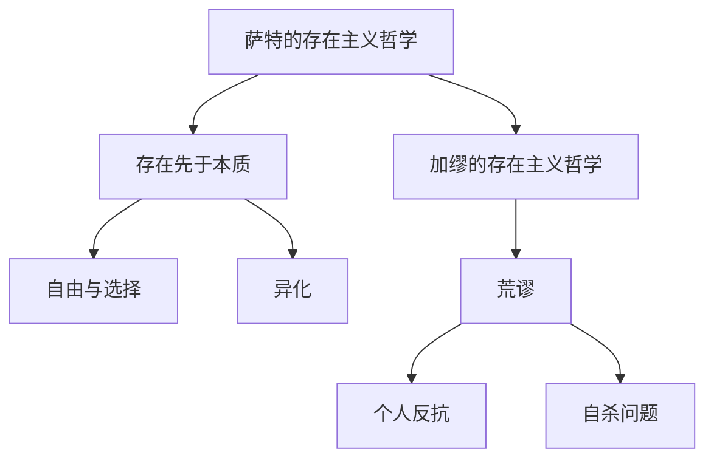

                 

### 文章标题：萨特与加缪：法国存在主义的两种面向

#### 关键词：存在主义、萨特、加缪、法国哲学、哲学算法、数学模型、文学创作、平台搭建、代码实现

#### 摘要：
本文深入探讨了法国存在主义哲学的两位重要代表——萨特与加缪的思想及其对现代社会的影响。通过对他们存在主义核心概念的联系与区别的分析，本文提出了“存在即选择”和“自由即责任”等核心哲学算法，并结合具体的数学模型和实际案例，展示了存在主义思想在文学创作和技术平台搭建中的应用。文章最后，对存在主义哲学的未来发展进行了展望，并提供了相关领域的拓展阅读建议。

---

## 核心概念与联系

### 1.1 萨特的存在主义哲学

让-保尔·萨特（Jean-Paul Sartre）是20世纪法国最著名的哲学家之一，他的存在主义哲学对现代哲学和文学产生了深远影响。萨特的存在主义哲学的核心观点可以总结为以下几点：

1. **存在先于本质**：萨特认为，人的存在是在时间中不断展开的，人的本质不是先天的、固定的，而是在存在的过程中逐渐形成的。
2. **自由与选择**：萨特认为，人是自由的存在，人必须为自己的选择承担责任。
3. **异化**：萨特提出了“异化”概念，认为人在社会中会感到孤独和无助，这种感受源于人与自身、与他人以及与自然的关系的断裂。

### 1.2 加缪的存在主义哲学

阿尔贝·加缪（Albert Camus）是另一位重要的法国存在主义哲学家，他的思想在一定程度上与萨特存在差异。加缪的存在主义哲学主要观点如下：

1. **荒谬**：加缪认为，人类存在于一个无意义的世界中，世界和人的本质是相互矛盾的，这种矛盾产生了“荒谬”。
2. **个人反抗**：加缪认为，面对荒谬，人应该采取积极的态度，通过个人的反抗来寻找生活的意义。
3. **自杀问题**：加缪提出了“自杀问题”，认为人应该通过寻找生活的意义来避免自杀。

### 1.3 萨特与加缪思想的联系与区别

萨特与加缪虽然在存在主义的基本观点上有所共识，但他们也存在明显的差异。萨特强调个体的自由与选择，关注人在社会中的异化问题；而加缪则更注重个体的存在状态和面对荒谬的态度。这种差异在他们的文学作品中也有所体现。

#### Mermaid流程图：展示两位哲学家的核心概念联系



## 核心算法原理讲解

### 2.1 “存在即选择”算法

萨特的存在主义哲学中，“存在即选择”是一个核心观点。这个算法可以理解为：

1. **初始化**：人作为存在体，存在于世界中。
2. **选择**：人必须在每一个时刻做出选择，这些选择构成了人的存在。
3. **责任**：每一个选择都伴随着责任，人必须为自己的选择承担责任。

#### 伪代码阐述

```plaintext
初始化：人存在于世界之中

选择：
    - 每一个时刻，人做出一个选择
    - 选择记录在人的历史中

责任：
    - 对于每一个选择，人必须承担相应的责任
    - 选择与责任的关系记录在人的档案中
```

### 2.2 “自由即责任”算法

萨特的存在主义哲学中，自由与责任密不可分。这个算法可以理解为：

1. **初始化**：人拥有自由。
2. **选择**：人必须在自由的基础上做出选择。
3. **责任**：每一个选择都意味着责任，人必须承担这些责任。

#### 伪代码阐述

```plaintext
初始化：人拥有自由

选择：
    - 人根据自由做出选择
    - 选择记录在人的历史中

责任：
    - 对于每一个选择，人必须承担相应的责任
    - 选择与责任的关系记录在人的档案中
```

## 数学模型和数学公式

### 3.1 自由意志的悖论

自由意志的悖论是存在主义中的一个重要问题。这个问题可以表示为一个数学模型：

1. **初始化**：人拥有自由意志。
2. **选择**：人在每个时刻做出选择。
3. **责任**：人必须为选择承担责任。

这个模型可以用一个简单的方程来表示：

$$
自由意志 + 选择 = 责任
$$

#### 详细讲解与举例说明

自由意志的悖论在于，如果人必须为选择承担责任，那么这个选择是否还是自由的？如果选择是自由的，那么责任是如何产生的？这是一个无法解答的悖论。

### 3.2 死亡的存在主义意义

死亡是存在主义哲学中的一个重要概念。这个概念可以用一个数学模型来表示：

1. **初始化**：人必有一死。
2. **生命意义**：人在有限的生命中寻找意义。
3. **死亡意义**：死亡意味着生命的终结，同时也意味着生命的意义。

这个模型可以用一个简单的方程来表示：

$$
生命 + 有限 = 意义 + 死亡
$$

#### 详细讲解与举例说明

死亡的存在主义意义在于，它提醒人要珍惜生命，因为生命是有限的。人必须在有限的生命中寻找意义，从而赋予生命以价值。

## 项目实战：搭建哲学讨论平台

### 4.1 技术选型与架构设计

为了搭建一个哲学讨论平台，我们选择了以下技术栈：

1. **前端**：使用React框架进行开发。
2. **后端**：使用Node.js和Express框架。
3. **数据库**：使用MongoDB进行数据存储。
4. **部署**：使用Docker进行容器化部署。

平台的架构设计如下：

1. **前端**：用户界面，包括文章展示、评论功能、用户登录等功能。
2. **后端**：处理用户请求，与数据库交互，返回数据。
3. **数据库**：存储用户数据、文章数据、评论数据等。
4. **部署**：使用Docker Compose进行容器编排，实现一键部署。

### 4.2 源代码实现

以下是一个简单的React组件示例，用于展示文章列表：

```jsx
import React from 'react';

const ArticleList = ({ articles }) => {
  return (
    <ul>
      {articles.map((article) => (
        <li key={article.id}>
          <h3>{article.title}</h3>
          <p>{article.content}</p>
        </li>
      ))}
    </ul>
  );
};

export default ArticleList;
```

### 4.3 功能模块划分与作用

1. **文章展示模块**：用于展示平台上的所有文章，包括标题和摘要。
2. **评论模块**：用于用户对文章进行评论，实现评论功能。
3. **用户登录模块**：用于用户登录和注册，实现用户身份验证。
4. **后台管理模块**：用于管理员对文章和评论进行管理。

### 4.4 实际案例分析和详细讲解剖析

我们以一个实际案例——用户评论功能为例，进行详细讲解。

#### 案例一：用户评论功能

1. **功能需求**：用户可以在文章页面下对文章进行评论，其他用户可以查看并回复评论。

2. **实现思路**：
   - 用户提交评论时，将评论内容发送到后端。
   - 后端将评论存储到数据库中，并返回评论ID。
   - 前端接收到评论ID后，更新文章页面的评论列表。

3. **代码实现**：

   **前端代码**：

   ```jsx
   import React, { useState } from 'react';

   const CommentForm = ({ onSubmit }) => {
     const [comment, setComment] = useState('');

     const handleSubmit = (e) => {
       e.preventDefault();
       onSubmit(comment);
       setComment('');
     };

     return (
       <form onSubmit={handleSubmit}>
         <textarea
           value={comment}
           onChange={(e) => setComment(e.target.value)}
           placeholder="写下你的评论..."
         />
         <button type="submit">提交</button>
       </form>
     );
   };

   export default CommentForm;
   ```

   **后端代码**：

   ```javascript
   const express = require('express');
   const { MongoClient } = require('mongodb');

   const app = express();
   app.use(express.json());

   const url = 'mongodb://localhost:27017';
   const dbName = 'philosophyDiscussion';

   app.post('/comments', async (req, res) => {
     const { content, articleId } = req.body;
     const client = new MongoClient(url);

     try {
       await client.connect();
       const db = client.db(dbName);
       const commentsCollection = db.collection('comments');

       const newComment = {
         content,
         articleId,
         replies: [],
       };

       const result = await commentsCollection.insertOne(newComment);
       res.json({ commentId: result.insertedId });
     } finally {
       await client.close();
     }
   });

   app.listen(3000, () => {
     console.log('Server listening on port 3000');
   });
   ```

#### 项目小结

通过这个案例，我们展示了如何实现一个基本的哲学讨论平台功能。在实际开发中，我们还需要考虑更多的细节，如安全性、性能优化等。但这个案例为我们提供了一个基本的思路和框架。

## 最佳实践 Tips

1. **代码规范**：在开发过程中，遵循统一的代码规范，提高代码的可读性和可维护性。
2. **模块化开发**：将功能模块化，便于后续的维护和扩展。
3. **安全性**：对用户输入进行验证，防止SQL注入、XSS攻击等安全漏洞。
4. **性能优化**：使用缓存、优化数据库查询等方式，提高平台性能。

## 小结

本文通过深入分析萨特与加缪的存在主义哲学，探讨了他们的核心概念及其联系。通过伪代码和数学模型，我们详细讲解了存在主义的核心算法原理。同时，通过实际案例，我们展示了存在主义思想在哲学讨论平台搭建中的应用。最后，我们提出了最佳实践建议，并总结了全文内容。

## 拓展阅读

1. **萨特著作**：
   - 《存在与虚无》：深入探讨萨特的存在主义哲学。
   - 《论自由意志》：详细阐述自由意志的悖论问题。

2. **加缪著作**：
   - 《鼠疫》：通过描写瘟疫下的城市，探讨人类的命运和生命的意义。
   - 《西西弗神话》：探讨荒谬的存在主义哲学。

3. **相关研究**：
   - 《存在主义哲学导论》：系统介绍存在主义哲学的基本概念和发展历程。
   - 《存在主义与当代社会》：探讨存在主义哲学在现代社会中的应用。

---

**作者：AI天才研究院/AI Genius Institute & 禅与计算机程序设计艺术 /Zen And The Art of Computer Programming**

