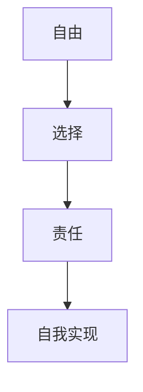
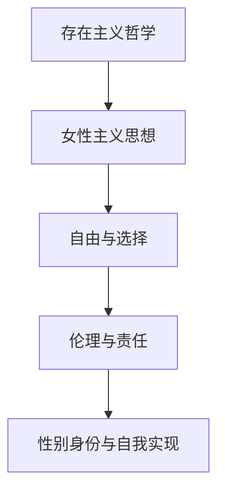

                 

# 《萨特与波伏瓦：存在主义与女性主义的结合》

## 关键词
存在主义、女性主义、哲学、自由、伦理、自我实现

## 摘要
本文旨在探讨法国哲学家让-保罗·萨特与西蒙娜·德·波伏瓦的思想结合，以及存在主义与女性主义之间的深刻联系。通过对两位思想家的生平、核心概念和理论观点的分析，本文揭示了存在主义与女性主义在自由、伦理和自我实现等领域的交汇点，并探讨了它们对现代社会的影响和批判。

## 引言

让-保罗·萨特（Jean-Paul Sartre）和西蒙娜·德·波伏瓦（Simone de Beauvoir）是20世纪最具影响力的哲学家和作家。他们的思想不仅对哲学领域产生了深远的影响，也为女性主义运动提供了理论基础。萨特的存在主义哲学强调个体的自由、选择和责任，而波伏瓦的女性主义则挑战了传统的性别角色和社会规范。本文将探讨这两位思想家的思想如何结合，以及存在主义与女性主义在哲学和当代社会中的地位。

### 萨特的存在主义哲学

### 1. 萨特的生平与著作

让-保罗·萨特（1905-1980）生于法国巴黎，他在哲学、文学、戏剧和批评等领域都有杰出的成就。萨特在二战期间发表了《存在与虚无》（"Being and Nothingness"），这部作品被认为是存在主义哲学的经典之作。此外，他还发表了大量的哲学论文、戏剧剧本和文学评论。

### 2. 存在主义的核心概念

萨特的存在主义哲学围绕几个核心概念展开，包括自由、选择和责任。他认为，人类是一种自由的存在，没有先天的本质或目的。每个个体都通过选择和行动来创造自己的本质。责任是自由的必然结果，因为每个选择都带来后果，个体必须为自己的行为承担责任。

### 3. 萨特的存在主义与20世纪哲学的关联

萨特的存在主义哲学是20世纪哲学的重要组成部分。它与其他哲学流派，如现象学、马克思主义和存在主义，有着广泛的对话和影响。萨特的作品不仅挑战了传统哲学的许多观点，也为后来的哲学思潮提供了灵感。

### 波伏瓦的女性主义思想

### 1. 波伏瓦的生平与著作

西蒙娜·德·波伏瓦（1908-1986）是萨特的女友和长期伴侣，也是一位杰出的哲学家和作家。她的代表作《第二性》（"The Second Sex"）是女性主义思想的经典之作，揭示了女性在历史和社会中的从属地位。波伏瓦的其他著作还包括哲学论文、小说和回忆录。

### 2. 女性主义的核心思想

波伏瓦的女性主义思想强调性别平等和女性解放。她认为，女性在历史和社会中被物化，被剥夺了自由和选择的权利。波伏瓦主张女性应该通过自我意识和行动来争取自己的权利，摆脱传统性别角色的束缚。

### 3. 波伏瓦与萨特的思想联系

波伏瓦和萨特的思想有许多共同点。他们都强调个体的自由和责任，都批评了传统的社会规范和价值观念。他们的合作和对话也为彼此的思想提供了重要的启发和反思。

### 自由与选择：存在主义与女性主义的交汇

### 1. 自由的哲学解读

萨特和波伏瓦都认为，自由是人类存在的基本特征。萨特认为，自由是绝对的，每个个体都有权利和责任去选择自己的生活方式。波伏瓦则强调，女性的自由受到社会和文化规范的限制，她们需要通过斗争来争取自由。

### 2. 女性在存在主义中的角色

在萨特的存在主义哲学中，女性通常被视为次要角色。然而，波伏瓦通过她的作品，强调了女性在存在主义哲学中的重要性。她认为，女性不仅是被观察的对象，也是积极的主体，能够在社会中发挥重要的作用。

### 3. 自由选择的伦理困境

自由选择带来的伦理困境是存在主义和女性主义共同关心的问题。萨特认为，每个选择都可能导致负面的后果，个体必须为自己的选择承担责任。波伏瓦则指出，女性的选择往往受到社会和文化的压力，她们在自由和责任之间面临着特殊的困境。

### 存在主义伦理观：道德与责任

### 1. 存在主义伦理学的特点

萨特的存在主义伦理学强调个体的道德自由和责任感。他认为，道德不是固有的，而是由个体通过选择和行动创造出来的。每个个体都有责任去创造自己的道德世界。

### 2. 女性主义伦理学的批判与回应

女性主义伦理学对萨特的存在主义伦理学提出了一些批判和回应。一些女性主义者认为，萨特的伦理观忽视了女性在历史和社会中的从属地位，没有考虑到性别平等的问题。

### 3. 萨特与波伏瓦对道德与责任的讨论

萨特和波伏瓦在道德与责任问题上有着不同的看法。萨特认为，道德责任是个体自由选择的必然结果。波伏瓦则强调，道德责任不仅是个体的责任，也是社会的责任。她们的合作和对话为道德责任的问题提供了丰富的哲学讨论。

### 性别身份与自我实现

### 1. 性别身份的存在主义分析

萨特和波伏瓦都对性别身份进行了存在主义分析。萨特认为，性别身份是个体通过选择和行动创造出来的。波伏瓦则指出，性别身份受到社会和文化的影响，女性需要通过自我意识和行动来改变传统的性别角色。

### 2. 女性主义对性别身份的挑战

女性主义对传统的性别身份进行了深刻的挑战。她们认为，性别身份是由社会和文化构建的，女性应该有权利去选择和定义自己的性别身份。

### 3. 萨特与波伏瓦对自我实现的看法

萨特和波伏瓦都认为，自我实现是个体自由选择的必然结果。萨特强调，自我实现是通过不断的行动和选择来实现的。波伏瓦则指出，自我实现不仅是个体的责任，也是社会的责任。她们的合作和对话为自我实现的问题提供了深刻的哲学思考。

### 萨特与波伏瓦的思想遗产

### 1. 存在主义与女性主义的影响与批判

萨特和波伏瓦的思想对当代社会产生了深远的影响，同时也受到了广泛的批判。存在主义和女性主义为哲学和现代社会提供了新的视角和思考方式。

### 2. 存在主义与女性主义的批判观点

一些批评者认为，萨特和波伏瓦的思想忽视了社会的结构性因素，过分强调个体的自由和选择。他们主张，个体的自由和选择必须与社会和历史的现实相结合。

### 3. 萨特与波伏瓦思想的现代解读

随着社会的发展和变化，萨特和波伏瓦的思想也在不断地被重新解读。现代学者们试图将他们的思想与当代社会的问题相结合，为哲学和现代社会提供新的思考方向。

### 结论

萨特和波伏瓦的思想结合为存在主义和女性主义提供了深刻的哲学基础。他们的思想不仅挑战了传统的哲学观念，也为当代社会提供了重要的思考和启示。通过对自由、伦理和自我实现等问题的探讨，萨特和波伏瓦为我们提供了一个关于个体和社会的全新视角。

## 附录

### 附录A：主要著作与文献推荐

- Sartre, J.-P. (1943). "Being and Nothingness."
- Beauvoir, S. de (1949). "The Second Sex."
- Sartre, J.-P. (1964). "Nausea."
- Beauvoir, S. de (1956). "The Mandarins."
- Sartre, J.-P. (1970). "Criticisms and Reflections."
- Beauvoir, S. de (1978). "Memoirs of a Dutiful Daughter."

### 附录B：存在主义与女性主义的流程图

B.1 存在主义核心概念流程图

B.2 女性主义核心思想流程图

B.3 存在主义与女性主义的结合流程图

## 参考文献

- Sartre, J.-P. (1943). "Being and Nothingness." Philosophical Library.
- Beauvoir, S. de (1949). "The Second Sex." Knopf.
- Sartre, J.-P. (1964). "Nausea." New Directions Publishing.
- Beauvoir, S. de (1956). "The Mandarins." Knopf.
- Sartre, J.-P. (1970). "Criticisms and Reflections." Pantheon.
- Beauvoir, S. de (1978). "Memoirs of a Dutiful Daughter." Knopf.

## 附录C：最佳实践 tips

- 在探讨存在主义和女性主义时，要注重个体与社会的关系，既要考虑个体的自由和选择，也要关注社会结构和历史背景。
- 理解萨特和波伏瓦的思想时，要关注他们的哲学背景和时代背景，这有助于更深入地理解他们的观点。
- 在撰写关于存在主义和女性主义的文章时，要注重逻辑性和条理性，使用清晰的论证和例子来支持观点。
- 拓展阅读可以包括其他存在主义哲学家和女性主义思想家的作品，以及当代学者对这些思想的解读和批判。

## 小结

萨特和波伏瓦的思想结合为存在主义和女性主义提供了深刻的哲学基础。他们的思想不仅挑战了传统的哲学观念，也为当代社会提供了重要的思考和启示。通过对自由、伦理和自我实现等问题的探讨，萨特和波伏瓦为我们提供了一个关于个体和社会的全新视角。他们的思想对哲学、文学和社会科学领域产生了深远的影响，为我们理解人类存在和社会关系提供了重要的参考。

### 作者

作者：AI天才研究院/AI Genius Institute & 禅与计算机程序设计艺术 /Zen And The Art of Computer Programming

### 结语

本文通过对让-保罗·萨特和西蒙娜·德·波伏瓦的思想结合的探讨，揭示了存在主义与女性主义在自由、伦理和自我实现等领域的深刻联系。萨特的存在主义哲学强调个体的自由、选择和责任，而波伏瓦的女性主义则挑战了传统的性别角色和社会规范。他们的合作和对话为哲学和现代社会提供了重要的思考和启示。通过理解他们的思想，我们不仅能够更深入地理解人类存在的本质，也能为当代社会中的性别平等和个体自由提供新的视角和思路。

