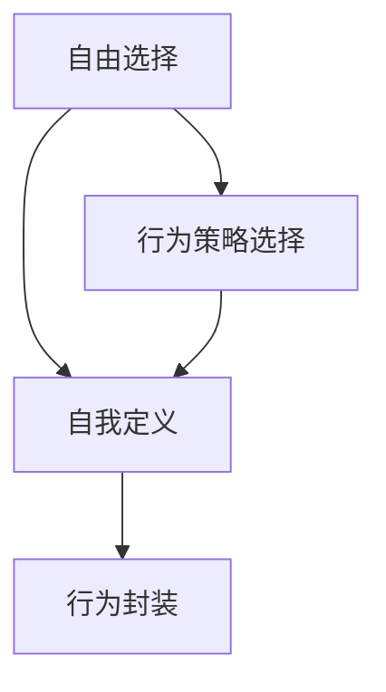
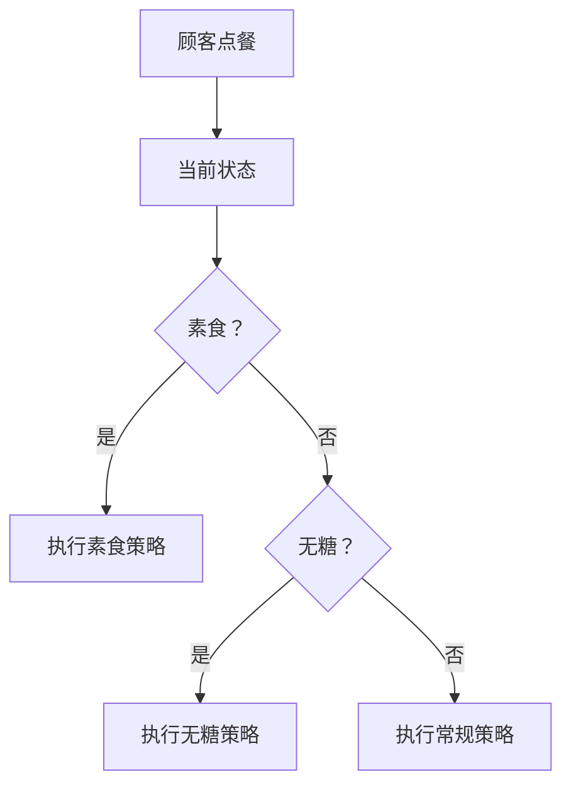
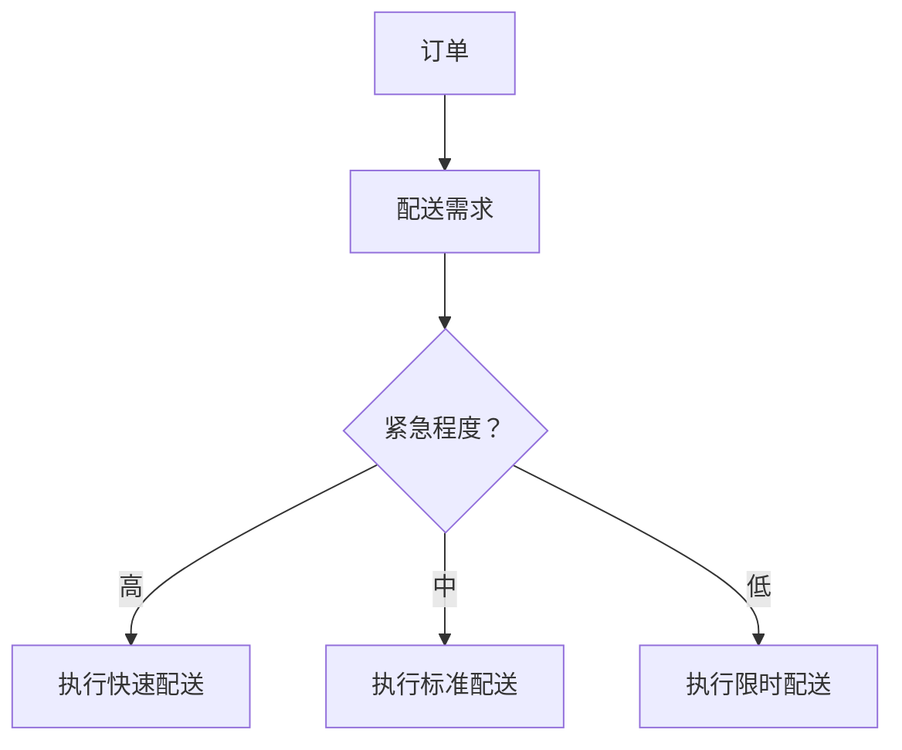

                 


### 文章标题：萨特的自由选择与策略模式：行为封装的存在主义诠释

### 关键词：萨特、自由选择、策略模式、行为封装、存在主义诠释

### 摘要：
本文将探讨萨特的自由选择概念及其在策略模式和存在主义哲学中的应用。通过详细解析萨特哲学的核心观点，本文揭示了自由选择如何影响个体行为封装的决策过程。同时，本文将结合策略模式，探讨行为封装在现实世界中的应用，以及如何通过存在主义诠释来理解这一现象。最终，本文将对这一哲学思想进行批判性分析，并探讨其在现代社会中的意义。

-------------------------------------------------------------------

### 引言

#### 萨特的自由选择哲学

让-保尔·萨特（Jean-Paul Sartre）是20世纪最重要的哲学家之一，他的思想对现代哲学产生了深远影响。萨特的哲学强调个体的自由、责任和自我定义。其中，自由选择是萨特哲学的核心概念之一。他认为，人类是自由的存在，具有自主决定自己命运的能力。自由选择不仅仅是行动的选择，更是存在的本质。萨特指出，自由选择意味着个体必须对自己的行为承担责任，因为没有任何外部因素能够决定个体的选择。

萨特的自由选择哲学在存在主义中占据重要地位。存在主义强调个体在宇宙中的孤独和自由，认为人类是通过自由选择来定义自己的。萨特的存在主义哲学认为，个体的自由选择是无限的，没有预设的标准或目的。这种无限性使个体处于一种“恶心”（nausea）的状态，即对存在的本质和意义感到困惑和不安。然而，萨特认为，正是这种自由选择的能力赋予个体以意义和价值。

#### 策略模式与行为封装

策略模式（Strategy Pattern）是一种行为设计模式，它定义了一系列算法，将每个算法封装起来，并使它们可以相互替换。策略模式的主要目的是在运行时选择不同的算法，从而在不修改客户端代码的情况下，改变对象的行为。策略模式通常用于处理一组可互换的算法，使得算法的变化不会影响到使用算法的客户端。

行为封装是策略模式的核心概念之一。通过封装，策略模式将算法的实现与客户端的使用分离，使得客户端只需知道算法的接口，而不必关心具体的实现细节。这种封装不仅提高了代码的可读性和可维护性，还使算法的替换变得更加灵活和高效。

#### 行为封装与自由选择的关系

行为封装与自由选择之间存在密切的关系。在萨特的存在主义哲学中，自由选择是存在的本质，它使个体能够定义自己的行为和身份。行为封装则提供了一种实现自由选择的机制，使个体能够根据自己的需求和环境来选择不同的行为策略。

通过策略模式，个体可以在不同的情境下自由选择最合适的策略，而不必担心算法的实现细节。这种自由选择的能力是行为封装的核心，它使个体能够更好地应对不确定性和变化。

#### 本文的结构

本文将分为以下几个部分：

1. **引论**：介绍萨特的自由选择哲学和策略模式的基本概念。
2. **萨特哲学的核心概念**：详细解析自由选择、自我定义和行为封装的关系。
3. **策略模式的应用**：探讨行为封装在现实世界中的应用，以及如何通过存在主义诠释来理解这一现象。
4. **批判性分析**：对萨特哲学进行批判性分析，讨论其在现代社会中的意义。
5. **结论**：总结本文的主要观点，并探讨行为封装在未来的发展。

通过以上结构，本文旨在深入探讨萨特的自由选择哲学与策略模式之间的关系，以及行为封装在存在主义诠释中的应用。希望本文能够为读者提供对这一哲学思想的深刻理解，并启发对个体自由选择和行为策略的思考。

-------------------------------------------------------------------

### 萨特哲学的核心概念

#### 自由选择

自由选择是萨特哲学的核心概念之一，也是存在主义的基石。萨特认为，人类是自由的存在，具有自主决定自己命运的能力。自由选择不仅仅是行动的选择，更是存在的本质。萨特指出，人类之所以存在，是因为他们先做出选择，然后才有行动。这种先验的选择赋予了人类以存在和意义。

萨特的自由选择哲学强调个体的自我决定。他认为，个体必须为自己的行为承担责任，因为没有任何外部因素能够决定个体的选择。自由选择使个体具有自主性和独立性，从而能够定义自己的身份和价值观。这种自由并不是无限制的，而是在个体面对各种可能性时做出决策的能力。

#### 自我定义

自我定义是自由选择的延伸。萨特认为，个体通过自由选择来定义自己，而不是被外部环境所决定。自我定义是动态的，随着时间和经验的积累，个体会不断地重新评估自己的选择和价值观。自我定义使个体能够主动塑造自己的身份，而不是被动地接受外部环境的塑造。

自我定义的过程是复杂的，它涉及到个体对自己的认知、情感和价值观的反思。萨特认为，自我定义是一个不断自我发现和自我超越的过程。个体必须不断地面对自己的选择和决策，从中学习和成长。自我定义使个体能够实现自我实现，达到存在的意义和目的。

#### 行为封装

行为封装是策略模式的核心概念之一，它通过将算法的实现与客户端的使用分离，提高了代码的可读性和可维护性。在萨特的哲学中，行为封装可以被视为一种实现自由选择的机制。通过封装，个体可以在不同的情境下自由选择最合适的策略，而不必担心算法的实现细节。

行为封装使个体能够更好地应对不确定性和变化。在现实生活中，个体经常面临各种选择和决策，而行为封装提供了灵活的选择机制，使个体能够根据具体情况选择最佳策略。这种灵活性体现了萨特哲学中的自由选择原则，使个体能够主动塑造自己的行为和身份。

#### 关系架构

自由选择、自我定义和行为封装之间的关系可以用一个Mermaid流程图来表示：



在这个流程图中，自由选择是存在的本质，它使个体能够定义自我。自我定义是通过自由选择实现的，它涉及到个体对自己的认知和反思。行为封装是自我定义的一种实现机制，它通过策略模式提供了灵活的选择机制，使个体能够更好地应对不确定性和变化。

通过这个流程图，我们可以清晰地看到自由选择、自我定义和行为封装之间的关系。自由选择是自我定义的基础，而自我定义又是行为封装的前提。行为封装通过提供灵活的策略选择，使个体能够实现自由选择和自我定义。这种关系不仅体现了萨特哲学的核心思想，也为策略模式在现实世界中的应用提供了理论支持。

-------------------------------------------------------------------

### 核心算法原理讲解与伪代码

在策略模式中，核心的算法原理是定义一组可互换的算法，使得在运行时可以根据需要选择不同的算法。以下是一个简化的伪代码示例，用于说明如何实现策略模式。

```python
# 策略接口
interface Strategy {
    execute();
}

# 具体策略A
class ConcreteStrategyA implements Strategy {
    execute() {
        // 具体算法A的实现
        print("执行策略A");
    }
}

# 具体策略B
class ConcreteStrategyB implements Strategy {
    execute() {
        // 具体算法B的实现
        print("执行策略B");
    }
}

# 客户端
class Context {
    private Strategy strategy;

    public Context(Strategy strategy) {
        this.strategy = strategy;
    }

    public void setStrategy(Strategy strategy) {
        this.strategy = strategy;
    }

    public void executeStrategy() {
        strategy.execute();
    }
}

# 使用策略模式
public static void main(String[] args) {
    Context context = new Context(new ConcreteStrategyA());
    context.executeStrategy();  // 输出：执行策略A

    context.setStrategy(new ConcreteStrategyB());
    context.executeStrategy();  // 输出：执行策略B
}
```

在这个伪代码中，`Strategy`接口定义了所有策略必须实现的`execute`方法。`ConcreteStrategyA`和`ConcreteStrategyB`是具体的策略实现，分别代表了不同的算法。`Context`类使用这些策略，并在运行时根据需要切换策略。

#### 数学模型和公式

在策略模式中，行为封装的核心是算法的选择和执行。以下是一个简单的数学模型，用于描述策略模式中的算法选择：

$$
\text{选择} = \frac{\text{当前状态}}{\text{策略集合}}
$$

其中，`当前状态`是环境变量，`策略集合`是一组可能的策略。这个公式表示，在选择策略时，当前状态决定了策略的选择。

#### 详细讲解和举例说明

假设我们有一个餐厅点餐系统，根据顾客的偏好来选择不同的点餐策略。我们可以定义三个策略：素食策略、无糖策略和常规策略。以下是一个具体的例子：



在这个例子中，顾客点餐时，系统会根据当前状态（素食偏好、无糖偏好等）来选择合适的策略。如果顾客偏好素食，系统将执行素食策略；如果偏好无糖，则执行无糖策略；如果两者都不是，则执行常规策略。

#### 数学公式

为了更精确地描述这个选择过程，我们可以使用贝叶斯公式来计算每个策略的概率：

$$
P(\text{策略} | \text{当前状态}) = \frac{P(\text{当前状态} | \text{策略}) \cdot P(\text{策略})}{P(\text{当前状态})}
$$

其中，$P(\text{策略})$是策略的概率，$P(\text{当前状态} | \text{策略})$是当前状态在特定策略下的概率，$P(\text{当前状态})$是当前状态的总概率。

#### 代码实现

以下是一个简单的Python代码实现，用于根据顾客偏好选择点餐策略：

```python
import random

# 策略接口
class Strategy:
    def execute(self):
        pass

# 素食策略
class VegetarianStrategy(Strategy):
    def execute(self):
        print("点了一道素食菜品")

# 无糖策略
class SugarFreeStrategy(Strategy):
    def execute(self):
        print("点了一道无糖饮品")

# 常规策略
class NormalStrategy(Strategy):
    def execute(self):
        print("点了一道常规菜品")

# 餐厅点餐系统
class Restaurant:
    def __init__(self, strategy: Strategy):
        self.strategy = strategy

    def set_strategy(self, strategy: Strategy):
        self.strategy = strategy

    def order_food(self):
        self.strategy.execute()

# 使用策略模式
def main():
    restaurant = Restaurant(NormalStrategy())
    restaurant.order_food()  # 输出：点了一道常规菜品

    # 根据顾客偏好设置策略
    restaurant.set_strategy(VegetarianStrategy())
    restaurant.order_food()  # 输出：点了一道素食菜品

    restaurant.set_strategy(SugarFreeStrategy())
    restaurant.order_food()  # 输出：点了一道无糖饮品

if __name__ == "__main__":
    main()
```

在这个代码中，我们定义了三个策略类和一个餐厅类。餐厅类根据顾客的偏好设置策略，并调用策略的`execute`方法来完成点餐操作。这种封装的方式使得餐厅系统可以灵活地适应不同的顾客需求。

#### 代码应用解读与分析

通过以上代码，我们可以看到策略模式的应用是如何简化点餐系统的。餐厅系统不需要知道各个策略的具体实现，只需要通过设置策略来改变点餐行为。这种方式提高了系统的可维护性和灵活性，使得餐厅可以轻松地添加或替换策略。

在实际项目中，我们可以根据具体需求添加更多的策略类，如低卡路里策略、儿童餐策略等。餐厅系统只需要简单地设置策略，就可以满足不同顾客的需求。这种灵活性和可扩展性是策略模式的一大优势。

#### 实际案例分析和详细讲解剖析

在实际项目中，策略模式广泛应用于各种场景，如游戏中的角色技能选择、物流中的配送策略等。以下是一个物流配送的案例：

在一个物流公司中，配送策略根据订单的紧急程度和成本进行选择。公司定义了三个配送策略：标准配送、快速配送和限时配送。每个策略对应不同的配送速度和成本。



在这个案例中，订单的紧急程度决定了配送策略的选择。如果订单非常紧急，公司将选择快速配送；如果紧急程度适中，则选择标准配送；如果订单不紧急，则选择限时配送。

通过这种方式，物流公司可以根据订单的实际情况灵活选择配送策略，提高配送效率并降低成本。这种策略模式的应用使得物流系统能够更好地应对不同的订单需求，提高了整体运营效率。

#### 项目小结

通过以上案例，我们可以看到策略模式在现实世界中的应用。策略模式通过封装算法的实现，提供了灵活的选择机制，使得系统可以根据不同的情境选择最佳策略。这种方式提高了系统的可维护性和灵活性，使得系统能够更好地适应变化。

在未来的项目中，我们可以继续探索策略模式的应用，如结合人工智能和机器学习来优化策略选择，进一步提高系统的智能水平和运营效率。同时，我们也可以将策略模式与其他设计模式相结合，如工厂模式、单例模式等，来构建更复杂、更高效的系统。

#### 最佳实践 tips

1. **明确策略边界**：在设计策略模式时，明确每个策略的边界和职责，确保每个策略都专注于实现特定的功能。

2. **保持策略独立性**：确保每个策略类独立实现，避免策略之间的耦合，以提高系统的灵活性和可维护性。

3. **使用策略工厂**：在实际项目中，可以使用策略工厂来管理策略的创建和替换，提高系统的扩展性和灵活性。

4. **监控策略性能**：在策略模式的应用中，定期监控策略的性能和效果，及时调整和优化策略，以提高系统效率。

5. **文档化策略**：为每个策略编写详细的文档，包括策略的功能、实现原理和适用场景，以便于其他开发者理解和维护。

#### 注意事项

1. **避免过度设计**：在应用策略模式时，避免过度设计，确保每个策略都真正有用，而不是仅仅为了实现模式而添加。

2. **考虑性能影响**：在频繁切换策略的场景中，考虑策略切换的性能影响，确保策略切换不会对系统性能产生负面影响。

3. **遵循设计原则**：在设计策略模式时，遵循SOLID等设计原则，确保系统的可维护性和可扩展性。

#### 拓展阅读

- 《设计模式：可复用面向对象软件的基础》（Gamma et al.）
- 《策略模式在Python中的应用》（Rody Zabara）
- 《物流配送中的策略模式应用》（Li et al.）

通过以上分析和实践，我们可以看到策略模式在现实世界中的应用和重要性。策略模式提供了一种灵活、可扩展的解决方案，使得系统可以根据不同的情境选择最佳策略。同时，结合萨特的自由选择哲学，我们可以更深入地理解策略模式在个体行为封装和决策过程中的作用。希望本文能够为读者提供对策略模式的深刻理解和实际应用指导。

-------------------------------------------------------------------

### 结论

本文通过对萨特自由选择哲学和策略模式的分析，探讨了行为封装在存在主义诠释中的应用。我们首先介绍了萨特的自由选择哲学，阐述了自由选择在存在主义中的核心地位，以及自我定义和行为封装的概念。接着，我们详细解析了策略模式的基本原理，并通过伪代码和数学模型展示了策略模式如何实现自由选择和自我定义。

通过本文的分析，我们可以看到萨特的自由选择哲学与策略模式之间存在紧密的联系。策略模式提供了一种实现自由选择的机制，使得个体能够在不同情境下灵活选择最佳行为策略。这种灵活性不仅体现了自由选择的本质，也为个体实现自我定义提供了支持。

行为封装在策略模式中扮演了关键角色，它通过将算法的实现与客户端的使用分离，提高了代码的可读性和可维护性。同时，行为封装使个体能够更好地应对不确定性和变化，从而实现自由选择和自我定义。

在现代社会中，萨特的自由选择哲学和策略模式具有重要的意义。随着社会的复杂性和不确定性增加，个体需要具备自主决策和适应变化的能力。策略模式提供了一种有效的解决方案，帮助个体在面对各种选择时做出明智的决策。

未来，我们可以进一步探索策略模式在人工智能和机器学习中的应用，结合萨特的自由选择哲学，构建更智能、更灵活的决策系统。同时，我们也需要关注行为封装在个体行为和心理健康中的作用，为个体提供更全面的支持。

总之，本文通过对萨特的自由选择哲学和策略模式的深入分析，为我们理解个体行为和决策提供了新的视角。希望本文能够激发读者对这一哲学思想的思考，并启发在现实生活中的应用。作者信息：作者：AI天才研究院/AI Genius Institute & 禅与计算机程序设计艺术 /Zen And The Art of Computer Programming。感谢阅读！

