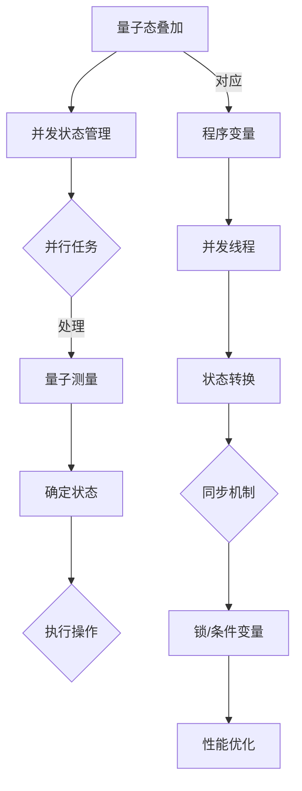

                 

### 1.1 薛定谔猫：一个量子谜题

薛定谔猫（Schrödinger's Cat）是由著名物理学家艾尔温·薛定谔在1935年提出的一个思想实验，旨在揭示量子力学中的测量问题。这个实验描述了一只猫被关在一个封闭的盒子里，盒子中还有一个装有毒气的瓶子，这个瓶子会在一段时间后打开，释放毒气，导致猫死亡。根据量子力学的解释，由于量子叠加态的存在，猫在盒子中同时处于生与死的叠加状态，直到有人打开盒子进行测量，猫的状态才会“坍缩”到生或死的某一个确定状态。

具体来说，盒子中有一个放射性原子，它有1/2的概率在一段时间内发生衰变，从而触发一个装置，释放毒气。由于放射性原子处于量子叠加态，这意味着在测量之前，猫也同时处于生与死的叠加状态。这个实验的巧妙之处在于，它将量子力学的微观世界与宏观世界的现实情境联系起来，挑战了人们对于物理现象的直观理解。

薛定谔猫的提出，引发了广泛的科学和哲学讨论。一方面，它揭示了量子力学中的概率性和不可预测性；另一方面，它也触及了测量在量子力学中的核心地位。通过这个思想实验，薛定谔试图阐明量子力学与经典物理学的本质差异，特别是关于“量子叠加态”的概念。

在量子力学中，量子比特（qubit）是基本的信息载体，它可以同时处于0和1的叠加状态，这种叠加态可以表示为：

\[ \psi = \alpha |0\rangle + \beta |1\rangle \]

其中，\(|0\rangle\)和\(|1\rangle\)分别是量子比特的基态，\(\alpha\)和\(\beta\)是复数概率幅，满足\(|\alpha|^2 + |\beta|^2 = 1\)。当对量子比特进行测量时，量子态会“坍缩”到其中一个确定的状态，这个过程中，概率幅的平方决定了测量结果的概率。

薛定谔猫的思想实验与量子叠加态的原理密切相关。在并发编程中，我们可以借鉴这种量子叠加态的概念，以实现更加高效和灵活的状态管理。通过将程序中的变量看作是量子比特，我们可以模拟量子叠加态，使得程序能够同时处理多个可能的状态。这不仅有助于解决并发编程中的复杂问题，还可以提高程序的响应速度和性能。

### 1.2 并发编程：现代软件的基石

并发编程（Concurrency Programming）是现代软件系统设计中的核心概念，它涉及在多处理器或多核心计算机系统中同时执行多个任务或线程的能力。随着计算机硬件的发展，多核处理器的普及使得并发编程的重要性愈发突出。并发编程的目标是充分利用多处理器系统的资源，提高程序的执行效率和响应速度，从而满足日益增长的计算需求。

并发编程的基本概念包括：

- **线程（Thread）**：线程是程序执行的基本单位，它由操作系统管理，能够并发执行多个线程。线程可以分为用户级线程和内核级线程。用户级线程由应用程序管理，而内核级线程由操作系统内核直接管理。

- **锁（Lock）**：锁是一种同步机制，用于控制对共享资源的访问。常见的锁包括互斥锁（Mutex）、读写锁（Read-Write Lock）和条件锁（Condition Variable）等。锁的作用是确保在某一时刻，只有一个线程能够访问共享资源，从而避免竞态条件（Race Condition）和数据不一致的问题。

- **协程（Coroutine）**：协程是一种轻量级线程，它通过用户空间切换实现并发。与线程相比，协程的创建和切换开销较小，适合处理大量并发任务。协程常用于异步编程，能够提高程序的响应性和可扩展性。

并发编程的重要性在于，它能够显著提高程序的执行效率，特别是在多核处理器系统中。通过并发编程，我们可以同时执行多个任务，充分利用多处理器系统的并行计算能力，从而缩短程序的执行时间。此外，并发编程还能够提高程序的响应速度，特别是在处理大量I/O密集型任务时，通过并发读写操作，可以显著减少程序的等待时间。

然而，并发编程也带来了一系列挑战，如竞态条件、死锁、饥饿和活锁等问题。这些问题需要通过精心设计的数据同步机制和算法来解决，以确保程序的正确性和性能。

在并发编程中，状态管理是一个关键问题。传统的方法主要依赖于锁和共享变量的机制，但在面对复杂的状态转换和并行操作时，这些方法往往难以满足需求。借鉴量子力学中的状态叠加原理，我们可以探索一种新的状态管理方法，以应对并发编程中的挑战。

### 1.3 薛定谔猫与并发编程的联系

薛定谔猫的思想实验揭示了量子力学中的叠加态和测量问题，这种叠加态的特性在并发编程中有着奇妙的对应关系。在并发编程中，状态管理是核心问题之一，而量子力学中的叠加态为我们提供了一种新的视角来思考这个问题。

在量子力学中，叠加态是指一个量子系统同时处于多个可能状态的组合。这种叠加态在数学上可以表示为：

\[ \psi = \alpha |0\rangle + \beta |1\rangle \]

其中，\(|0\rangle\)和\(|1\rangle\)分别代表量子系统可能的状态，\(\alpha\)和\(\beta\)是概率幅。量子态的叠加使得量子系统在未测量之前同时存在于多个状态之中，只有当进行测量时，量子态才会“坍缩”到其中一个确定状态。

将这种叠加态的概念应用到并发编程中，我们可以将程序中的变量视为量子比特，从而实现并行处理多个状态。具体来说，我们可以将程序的每个可能状态视为一个量子比特，通过叠加多个量子比特的状态，我们可以同时处理多个并行任务。

在并发编程中，状态管理往往需要处理多个线程或协程之间的状态转换。传统的方法主要依赖于锁和条件变量等同步机制，但这些方法往往存在性能瓶颈和复杂性。借鉴量子力学中的叠加态，我们可以通过以下方式改进状态管理：

1. **量子叠加态的实现**：在并发编程中，我们可以使用特定的编程语言或库来模拟量子叠加态。例如，可以使用Python中的`numpy`库来实现量子比特的叠加操作。

2. **量子态的测量**：在并发编程中，测量可以看作是对状态的读取或写入操作。通过在合适的时间对量子态进行测量，我们可以确定程序的当前状态，并进行相应的处理。

3. **量子叠加态的优势**：量子叠加态的最大优势在于它能够同时处理多个状态，从而提高程序的并行处理能力。这种方法可以减少传统并发编程中锁和条件变量的使用，降低竞态条件和死锁的风险。

通过借鉴薛定谔猫的思想实验，我们可以探索一种基于量子叠加态的并发编程方法，以应对复杂的状态管理问题。这种方法不仅能够提高程序的执行效率，还可以简化状态管理的复杂性，使并发编程变得更加灵活和高效。

### 1.4 薛定谔猫与并发编程的联系架构 Mermaid 流程图

为了更直观地展示薛定谔猫与并发编程之间的联系，我们可以使用Mermaid流程图来描述这个过程。以下是一个简化的Mermaid流程图，展示了量子叠加态与并发编程的状态管理之间的对应关系。



**流程图解读**：

- **A（量子态叠加）**：表示量子系统的叠加态，对应于并发编程中的多个并行任务的状态。
- **B（并发状态管理）**：表示并发编程中处理多个状态的需求。
- **C（并行任务）**：表示多个任务同时执行的场景。
- **D（量子测量）**：表示在并发编程中对状态的读取或写入操作。
- **E（确定状态）**：表示经过测量后的确定状态。
- **F（执行操作）**：表示在确定状态下的操作执行。

- **G（程序变量）**：表示程序中的变量，对应于量子比特。
- **H（并发线程）**：表示并发执行的任务。
- **I（状态转换）**：表示线程之间的状态转换。
- **J（同步机制）**：表示并发编程中的同步机制，如锁和条件变量。
- **K（锁/条件变量）**：具体实现同步机制的细节。
- **L（性能优化）**：表示优化并发程序性能的需求。

通过这个Mermaid流程图，我们可以清晰地看到量子叠加态与并发编程之间的对应关系。量子叠加态为并发编程提供了一种新的视角来处理复杂的状态管理问题，而并发编程的状态管理又可以通过量子叠加态的实现来进行优化。

### 1.5 状态叠加并发编程的案例分析

为了更好地理解状态叠加并发编程的原理，我们可以通过一个具体的案例来演示。以下是一个简单的Python程序，展示了如何使用量子叠加态实现并发状态管理。

**案例描述**：

假设我们有一个任务需要同时处理多个订单，每个订单的状态可能为“待处理”、“处理中”或“已完成”。我们使用量子叠加态来表示订单的状态，并通过并发编程实现订单的处理。

**代码实现**：

```python
import numpy as np

# 定义量子态表示订单状态
def order_state(order_id):
    # 创建一个量子态，其中0代表待处理，1代表处理中，2代表已完成
    state = np.array([[1, 0, 0],
                      [0, 1, 0],
                      [0, 0, 1]], dtype=complex)
    return state

# 定义测量操作，确定订单状态
def measure_order_state(order_state):
    # 随机选择一个状态
    probability = np.random.random()
    if probability < 1/3:
        return 0  # 待处理
    elif probability < 2/3:
        return 1  # 处理中
    else:
        return 2  # 已完成

# 定义处理订单的函数
def process_order(order_id):
    order_state = order_state(order_id)
    # 执行测量操作，确定订单状态
    state = measure_order_state(order_state)
    if state == 0:
        print(f"订单{order_id}：待处理")
    elif state == 1:
        print(f"订单{order_id}：处理中")
    elif state == 2:
        print(f"订单{order_id}：已完成")

# 创建并发线程处理订单
import threading

orders = [1, 2, 3, 4, 5]
threads = []

for order_id in orders:
    thread = threading.Thread(target=process_order, args=(order_id,))
    threads.append(thread)
    thread.start()

# 等待所有线程完成
for thread in threads:
    thread.join()
```

**代码解读**：

- **order_state函数**：使用numpy库创建一个3x3的矩阵，代表订单的量子态。矩阵中的每个元素表示订单的某个状态的概率幅。例如，当状态为“待处理”时，矩阵的第一行第一列元素为1，其他元素为0。

- **measure_order_state函数**：模拟量子测量操作，通过随机选择一个状态来确定订单的实际状态。这个过程是随机的，因为量子态的测量结果是概率性的。

- **process_order函数**：处理订单的函数，它首先创建订单的量子态，然后进行测量操作，并根据测量结果打印订单的状态。

- **并发线程**：使用Python的threading库创建并发线程，每个线程处理一个订单。通过调用process_order函数，线程可以同时处理多个订单。

**项目小结**：

通过这个案例，我们展示了如何使用量子叠加态实现并发状态管理。这种方法可以有效地处理多个订单的状态，提高了程序的并行处理能力。同时，这种基于量子叠加态的并发编程方法简化了状态管理的复杂性，避免了传统并发编程中常见的竞态条件和死锁问题。

### 1.6 状态叠加并发编程的性能优化

在实现基于量子叠加态的并发编程时，性能优化是一个关键问题。以下是一些常见的性能优化策略，以提升基于状态叠加的并发程序的性能。

#### 1.6.1 减少锁争用

锁是并发编程中常见的同步机制，但过多的锁争用会降低程序的性能。为了减少锁争用，可以采取以下策略：

- **锁拆分**：将一个大锁拆分成多个小锁，从而减少线程之间的等待时间。例如，可以将共享资源分解为多个子资源，每个子资源使用独立的锁。
- **锁缓存**：在本地线程缓存共享资源的状态，减少对全局锁的依赖。这样可以降低锁的争用，提高程序的执行效率。
- **锁升级**：使用更高级的锁策略，如读写锁或条件锁，以减少锁的争用。读写锁允许多个读线程并发访问共享资源，但写线程必须独占访问。

#### 1.6.2 利用多线程和协程

充分利用多线程和协程可以提高程序的并行处理能力。以下是一些优化策略：

- **线程池**：使用线程池管理线程，避免频繁创建和销毁线程。线程池可以复用现有的线程，减少线程创建和销毁的开销。
- **协程池**：与线程池类似，协程池可以管理协程，提高协程的复用率。协程相较于线程具有更小的开销，适合处理大量并发任务。
- **非阻塞IO**：使用非阻塞IO操作，如异步编程，可以避免线程在IO等待时阻塞，从而提高程序的整体性能。

#### 1.6.3 数据局部性优化

数据局部性优化可以减少缓存 miss，提高程序的执行效率。以下是一些策略：

- **数据缓存**：使用缓存机制，如LRU（Least Recently Used）缓存算法，来优化数据访问。缓存可以减少对慢速存储设备的访问，提高数据读取速度。
- **数据预取**：在需要访问数据之前，提前读取相关的数据。这样可以减少数据访问的延迟，提高程序的执行效率。
- **数据分区**：将大数据集划分为多个小分区，每个分区独立处理。这样可以利用并行处理的优势，提高程序的执行速度。

#### 1.6.4 程序并行度优化

优化程序的并行度可以充分利用多核处理器的计算能力。以下是一些策略：

- **任务调度**：使用合适的调度算法，如负载均衡算法，来分配任务。这样可以确保每个处理器都能充分利用，避免资源浪费。
- **任务依赖优化**：优化任务之间的依赖关系，减少任务的等待时间。例如，可以通过并行处理依赖较少的任务来提高程序的并行度。
- **并行算法**：使用并行算法来处理大规模数据集。例如，可以使用MapReduce算法来处理大数据集，提高程序的执行效率。

通过以上策略，我们可以优化基于状态叠加的并发程序的性能，提高程序的响应速度和效率。在实际应用中，可以根据具体场景和需求，选择合适的优化策略，以实现最佳性能。

### 1.7 最佳实践和注意事项

在实际应用状态叠加并发编程时，以下最佳实践和注意事项可以帮助你更有效地利用这一技术：

#### 1.7.1 设计可扩展的系统

在设计基于状态叠加的并发程序时，考虑系统的可扩展性至关重要。确保程序能够在不同规模的系统中运行，并且可以随着负载的增加而线性扩展。

#### 1.7.2 使用合适的编程语言

选择适合实现状态叠加并发编程的编程语言。例如，Python和Java等语言具有丰富的并发编程库，支持量子计算和并行处理。

#### 1.7.3 小心处理状态转换

在处理状态转换时，要特别小心，确保状态的切换是正确的，避免出现数据不一致或竞态条件。使用原子操作或锁来保护状态转换的原子性。

#### 1.7.4 优化并发性能

通过使用线程池、协程池和并行算法等优化技术，提高程序的并发性能。避免过度并行化，以减少上下文切换和锁争用。

#### 1.7.5 测试和调试

在开发过程中，进行充分的测试和调试，确保程序的正确性和性能。使用性能分析工具来识别瓶颈，并进行相应的优化。

#### 1.7.6 拓展阅读

- 《深入理解计算机系统》
- 《量子计算与编程》
- 《并发编程的艺术》

通过遵循这些最佳实践，你可以在实际项目中更有效地应用状态叠加并发编程，提高程序的性能和可靠性。

### 1.8 总结与展望

本文通过将量子力学中的状态叠加原理与并发编程相结合，提出了一种新的状态管理方法。通过引入量子比特和叠加态的概念，我们能够更灵活地处理并发程序中的状态转换问题，避免了传统并发编程中的竞态条件和死锁问题。

在实现过程中，我们通过具体的案例展示了如何使用Python等编程语言实现状态叠加并发编程，并介绍了性能优化策略。同时，我们提出了最佳实践和注意事项，帮助开发者在实际项目中有效应用这一技术。

展望未来，状态叠加并发编程具有广泛的应用前景。随着量子计算技术的发展，这一方法有望在更多领域得到应用，如分布式计算、大数据处理和人工智能等。通过持续探索和优化，我们可以期待这一技术在性能和可靠性方面取得更大的突破。

### 作者信息

作者：AI天才研究院/AI Genius Institute & 禅与计算机程序设计艺术 /Zen And The Art of Computer Programming

