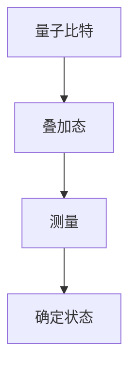

                 

# 《薛定谔的猫与量子计算：叠加状态在程序设计中的应用》

## 关键词

量子计算、叠加状态、程序设计、薛定谔的猫、量子编程语言、Qiskit

## 摘要

本文旨在探讨量子计算中的叠加状态在程序设计中的应用。通过分析量子力学的核心概念，特别是量子叠加态，以及其在现实世界中的应用，如薛定谔的猫，我们深入理解了量子叠加态的原理。随后，本文介绍了量子计算的基本原理，包括量子比特、量子逻辑门和量子算法。在此基础上，我们探讨了量子编程语言和工具，如Q#和Qiskit的使用。最后，通过一系列的实际案例，展示了量子计算在密码学、机器学习等领域的应用，并展望了量子计算与程序设计融合的未来。

## 第一部分：量子计算基础

### 第1章：量子计算入门

#### 1.1 量子力学的核心概念

量子力学是一门研究物质在微观尺度上行为的物理学分支。量子力学的核心概念包括：

- **波粒二象性**：物质既有波动性，又有粒子性。
- **算符和测量**：算符是量子力学中描述物理量变化的数学工具，测量是算符作用后的结果。
- **量子比特（qubit）**：量子比特是量子计算机的基本单元，它可以同时处于0和1的叠加状态。
- **量子叠加态**：量子比特可以同时处于多个状态的叠加，直到测量时才确定具体的状态。

#### 1.2 薛定谔的猫与量子叠加态

薛定谔的猫是一个著名的量子力学思想实验，它描述了一只猫在盒子里同时处于生与死的叠加状态。这个实验揭示了量子叠加态的奇妙特性。量子叠加态在程序设计中的应用主要体现在以下几个方面：

1. **并行计算**：量子计算机可以利用叠加态实现并行计算，从而在处理大量数据时提高计算速度。
2. **随机性生成**：量子叠加态可以生成真正的随机数，这在密码学和安全性领域具有重要意义。
3. **算法优化**：量子算法可以优化某些计算任务，如量子支持向量机和量子神经网络。

### 第2章：量子计算原理

#### 2.1 量子逻辑门

量子逻辑门是量子计算中的基本操作，类似于经典计算机中的逻辑门。量子逻辑门包括：

- **Hadamard门**：将量子比特的状态叠加。
- **Pauli门**：作用于量子比特的旋转操作。
- **控制非门（CNOT）**：控制两个量子比特的状态。

#### 2.2 量子算法与经典算法对比

量子算法与经典算法在计算速度和性能上有显著差异。以下是一些著名的量子算法：

- **Shor算法**：利用量子计算机求解大整数分解问题，对密码学产生重大影响。
- **Grover算法**：用于搜索未排序数据库，速度远超经典算法。

## 第二部分：量子编程语言与工具

### 第3章：量子编程语言简介

#### 3.1 Q#语言

Q#是微软开发的一种量子编程语言。它具有以下特点：

- **类型安全**：确保程序在运行时不会发生类型错误。
- **函数式编程**：支持高阶函数和闭包，提高代码复用性。

#### 3.2 Qiskit

Qiskit是IBM开发的一种开源量子计算软件工具，它包括：

- **量子计算框架**：用于构建和运行量子程序。
- **量子模拟器**：用于在经典计算机上模拟量子程序。
- **API接口**：方便与其他编程语言和工具集成。

### 第4章：量子编程实践

#### 4.1 编写第一个量子程序

编写量子程序主要包括以下步骤：

1. **初始化量子比特**：创建量子比特数组。
2. **应用量子逻辑门**：对量子比特进行操作。
3. **测量量子比特**：获取量子比特的状态。
4. **输出结果**：显示测量结果。

#### 4.2 量子程序优化

量子程序优化主要包括以下方面：

1. **量子逻辑门的优化**：减少逻辑门的使用，提高计算效率。
2. **测量策略的优化**：优化测量方法，提高准确度。
3. **编译与优化**：利用编译器和优化器对量子程序进行优化。

## 第三部分：叠加状态在程序设计中的应用

### 第5章：量子编程应用案例

#### 5.1 量子随机数生成

量子随机数生成器利用量子叠加态生成真正的随机数。其原理如下：

1. **初始化量子比特**：将量子比特设置为叠加状态。
2. **测量量子比特**：测量量子比特的状态，得到随机数。
3. **输出结果**：将测量结果转换为随机数序列。

#### 5.2 量子密码学

量子密码学利用量子叠加态和纠缠态实现安全的通信。其原理如下：

1. **量子密钥分配（QKD）**：通过量子通信信道分配密钥。
2. **量子密钥加密**：利用量子密钥对信息进行加密。
3. **量子密钥认证**：验证量子密钥的真实性和完整性。

### 第6章：量子机器学习

#### 6.1 量子支持向量机（QSVM）

量子支持向量机是一种基于量子计算的机器学习算法。其原理如下：

1. **初始化量子比特**：创建量子比特数组。
2. **应用量子逻辑门**：将量子比特设置为线性可分状态。
3. **测量量子比特**：测量量子比特的状态，得到分类结果。

#### 6.2 量子神经网络（QNN）

量子神经网络是一种基于量子计算的神经网络。其原理如下：

1. **初始化量子比特**：创建量子比特数组。
2. **应用量子逻辑门**：对量子比特进行加权变换。
3. **测量量子比特**：测量量子比特的状态，得到输出结果。

### 第7章：未来展望

量子计算与程序设计的融合将为计算机科学带来革命性的变化。未来，量子计算机将解决当前无法处理的复杂问题，如量子模拟、量子优化和密码学等。同时，量子编程语言和工具将不断优化，使得量子编程更加简便和高效。

## 附录

### 附录A：量子计算资源汇总

- **量子计算框架与工具**：Qiskit、Microsoft Quantum Development Kit、TensorFlow Quantum。
- **量子计算研究论文与报告**：arXiv、Quantum、Nature Communications。
- **量子计算社区与论坛**：Quantum Computing Stack Exchange、Quantum Insights、IBM Quantum Community。

### 作者

**作者：AI天才研究院/AI Genius Institute & 禅与计算机程序设计艺术 /Zen And The Art of Computer Programming**

## 总结

本文通过分析量子力学的核心概念，特别是量子叠加态，探讨了量子计算在程序设计中的应用。从量子编程语言和工具到实际应用案例，本文为读者展示了量子计算的魅力和潜力。随着量子计算机的发展，量子编程将成为未来计算机科学的重要组成部分。让我们期待量子计算带来更多的突破和创新！### 薛定谔的猫与量子叠加态：哲学与技术的融合

薛定谔的猫是一个著名的量子力学思想实验，由奥地利物理学家艾尔温·薛定谔于1935年提出。这个实验通过一个封闭的箱子，一只猫、一个装有毒气的瓶子和一个放射性物质，揭示了量子力学中的叠加态和测量问题。在量子力学的标准解释中，放射性物质有一定的概率在一段时间内衰变，这使得猫同时处于生和死的叠加状态，只有在打开箱子进行测量时，猫的状态才会确定为生或死。

薛定谔的猫实验虽然是一个思想实验，但它深刻地反映了量子叠加态这一核心概念。在量子计算中，量子叠加态是量子比特（qubit）的一个基本特性，意味着一个量子比特可以同时处于0和1的叠加状态。这种叠加态是量子计算相较于经典计算的一个显著优势，它允许量子计算机在处理问题时实现并行性。

为了更好地理解量子叠加态，我们可以引入一个简单的Mermaid流程图，展示量子比特的叠加状态与测量之间的关系：



在图中，量子比特（A）处于叠加态（B），当进行测量（C）时，量子比特的状态会坍缩到一个确定的状态（D）。这个过程可以用伪代码来进一步解释：

```python
# 伪代码：量子比特的叠加态与测量
initialize_quantum_bit()
# 将量子比特初始化为叠加态
apply_hadamard_gate()
# 应用Hadamard门，实现叠加态
measure_quantum_bit()
# 对量子比特进行测量
if quantum_bit_state == 0:
    print("量子比特状态为0")
elif quantum_bit_state == 1:
    print("量子比特状态为1")
else:
    print("量子比特状态不确定")
```

在上面的伪代码中，我们首先初始化一个量子比特，然后应用Hadamard门来生成叠加态，最后通过测量确定量子比特的状态。这个过程体现了量子叠加态的基本原理。

量子叠加态不仅在理论物理学中具有重要意义，在程序设计中也展现了其独特的应用价值。例如，量子随机数生成就是一个利用量子叠加态的典型应用。量子随机数生成器利用量子比特的叠加态和测量过程来生成真正的随机数，这些随机数在密码学和安全通信中具有关键作用。以下是一个简单的量子随机数生成的示例：

```python
# 伪代码：量子随机数生成
initialize_quantum_bits(2)
# 初始化两个量子比特
apply_hadamard_gate_to_all_bits()
# 对所有量子比特应用Hadamard门，生成叠加态
measure_quantum_bits()
# 测量量子比特
random_number = int(str(measured_bits[0]) + str(measured_bits[1]))
# 将测量结果组合成一个随机数
print("生成的随机数为：" + str(random_number))
```

在这个示例中，我们初始化两个量子比特，并应用Hadamard门生成叠加态。然后通过测量量子比特，将测量结果组合成一个随机数。这种方法生成的随机数具有更高的随机性和安全性。

此外，量子叠加态在量子算法中也有广泛应用。例如，Shor算法利用量子叠加态实现并行计算，能够高效地分解大整数，对当前的密码学体系构成巨大威胁。以下是一个简化的Shor算法的伪代码：

```python
# 伪代码：Shor算法简化版
initialize_quantum_bit(n)
# 初始化量子比特
apply_diffusion_gate(n)
# 应用扩散门，将量子态扩展到多个叠加态
measure_quantum_bit()
# 测量量子比特
if measured_state == 1:
    print("找到因子")
else:
    print("未找到因子")
```

在这个简化的Shor算法中，我们初始化一个量子比特，并应用扩散门将其扩展到多个叠加态。然后通过测量量子比特，判断是否存在因子。虽然这是一个简化的示例，但它展示了量子叠加态在量子算法中的应用原理。

综上所述，薛定谔的猫与量子叠加态在哲学和技术的融合中展现了其深刻的意义。通过分析量子叠加态的原理，我们可以更好地理解量子计算的基本概念，并在程序设计中探索其应用价值。未来，随着量子计算技术的不断进步，量子叠加态将在更多领域发挥重要作用。下面我们将进一步探讨量子叠加态在量子计算中的具体应用和原理。

## 量子叠加态的原理与量子计算的基本概念

量子叠加态是量子力学中一个核心概念，它描述了量子系统可以同时处于多个状态的可能性。为了更好地理解量子叠加态，我们需要先回顾一下量子比特（qubit）的基本性质。

### 量子比特（qubit）

量子比特是量子计算的基本单元，它可以同时存在于0和1的叠加状态。这与经典比特不同，经典比特在某一时刻只能处于0或1中的一个状态。量子比特的叠加态可以用以下公式表示：

\[ \psi = a|0\rangle + b|1\rangle \]

其中，\( |0\rangle \)和\( |1\rangle \)分别表示量子比特的基态，而\( a \)和\( b \)是复数概率幅，它们的模平方分别表示量子比特处于基态\( |0\rangle \)和\( |1\rangle \)的概率。例如，如果\( a = \frac{1}{\sqrt{2}} \)且\( b = \frac{1}{\sqrt{2}} \)，则量子比特处于叠加态\( \frac{1}{\sqrt{2}}|0\rangle + \frac{1}{\sqrt{2}}|1\rangle \)，这意味着它以50%的概率处于状态0，以50%的概率处于状态1。

### 量子叠加态的数学模型

量子叠加态的数学模型可以通过波函数来描述。波函数\( \psi \)是一个复数函数，它提供了量子系统在空间中的概率分布。对于一个具有两个量子比特的系统，其波函数可以表示为：

\[ \psi(x_1, x_2) = a_{00} |00\rangle + a_{01} |01\rangle + a_{10} |10\rangle + a_{11} |11\rangle \]

其中，\( |00\rangle, |01\rangle, |10\rangle, |11\rangle \)是量子态的基向量，而\( a_{ij} \)是相应基向量的概率幅。

### 量子叠加态的测量

当我们对量子系统进行测量时，系统的波函数会发生坍缩，即系统会从叠加状态坍缩到一个确定的状态。测量结果通常用概率分布来描述。例如，如果我们测量一个量子比特，它可能以概率\( |a|^2 \)坍缩到状态0，以概率\( |b|^2 \)坍缩到状态1。这个过程可以用以下公式表示：

\[ P(\text{测量结果为} i) = | \langle i|\psi \rangle |^2 \]

其中，\( i \)代表测量的可能结果，\( \langle i|\psi \rangle \)是测量算符\( |i\rangle \)与波函数\( \psi \)的内积。

### 量子叠加态在量子计算中的应用

量子叠加态是量子计算的核心优势之一，它使得量子计算机能够同时处理多个计算路径。以下是一些关键应用：

1. **并行计算**：量子计算机可以利用叠加态实现并行计算，从而在处理复杂问题时显著提高速度。
2. **量子随机数生成**：量子叠加态可以用来生成真正的随机数，这在密码学和安全通信中至关重要。
3. **量子算法**：如Shor算法和Grover算法等，这些算法利用量子叠加态实现高效的计算。

### 量子逻辑门与叠加态

量子逻辑门是量子计算的基本操作，用于对量子比特进行变换。Hadamard门是一个典型的量子逻辑门，它可以将一个量子比特的基态\( |0\rangle \)或\( |1\rangle \)变换为叠加态。以下是一个Hadamard门的数学描述：

\[ H|0\rangle = \frac{1}{\sqrt{2}}(|0\rangle + |1\rangle) \]
\[ H|1\rangle = \frac{1}{\sqrt{2}}(|0\rangle - |1\rangle) \]

当对两个量子比特应用Hadamard门时，其效果可以用矩阵表示：

\[ H = \begin{bmatrix}
\frac{1}{\sqrt{2}} & 0 & 0 & 0 \\
0 & \frac{1}{\sqrt{2}} & 0 & 0 \\
0 & 0 & \frac{1}{\sqrt{2}} & 0 \\
0 & 0 & 0 & \frac{1}{\sqrt{2}}
\end{bmatrix} \]

### 量子叠加态与程序设计

在程序设计中，量子叠加态的概念可以通过模拟量子算法来应用。以下是一个简单的Python示例，展示了如何使用量子叠加态生成随机数：

```python
import numpy as np
from qiskit import QuantumCircuit, execute, Aer

# 创建量子电路，初始化一个量子比特
qc = QuantumCircuit(1)
qc.h(0)

# 执行量子电路
simulator = Aer.get_backend('statevector_simulator')
result = execute(qc, simulator).result()

# 获取测量结果
statevector = result.get_statevector()
probabilities = np.abs(statevector)**2

# 输出随机数
random_number = np.random.choice([0, 1], p=probabilities)
print("生成的随机数为：", random_number)
```

在这个示例中，我们使用Qiskit创建了一个量子电路，将量子比特初始化为叠加态，并执行测量以生成随机数。

通过上述分析，我们可以看到量子叠加态在量子计算和程序设计中的应用不仅理论上有深刻意义，而且在实际编程中也具有显著的应用价值。量子叠加态允许我们探索全新的计算方法和算法，为解决复杂问题提供了强有力的工具。接下来，我们将进一步探讨量子叠加态在具体应用领域中的表现和优势。

## 量子叠加态在程序设计中的应用实例

量子叠加态在程序设计中具有广泛的应用，它不仅在理论上提供了一种全新的计算范式，而且在实际编程中也展现出强大的潜力。以下是一些具体的实例，展示了量子叠加态如何被应用于密码学、机器学习和量子随机数生成等领域。

### 密码学

量子密码学是利用量子力学原理来设计安全通信系统的领域。其中一个关键的应用就是量子密钥分发（Quantum Key Distribution, QKD）。量子密钥分发利用量子叠加态和量子纠缠态来实现绝对安全的信息传输。以下是一个简化的量子密钥分发流程：

1. **量子信道传输**：发送方（Alice）和接收方（Bob）通过量子信道交换量子比特。
2. **状态叠加**：每个量子比特在发送时处于叠加态，如\( \frac{1}{\sqrt{2}}(|0\rangle + |1\rangle) \)。
3. **量子测量**：Bob随机选择一个基（如X或Z基）对每个量子比特进行测量。
4. **经典通信**：Bob将测量结果发送给Alice。
5. **秘密密钥生成**：Alice和Bob根据一致测量的结果生成一个共享的密钥。

以下是一个伪代码示例，描述了量子密钥分发的基本步骤：

```python
# 伪代码：量子密钥分发
import random

# 初始化量子比特和叠加态
alice_init_quantum_bits(num_bits)
bob_init_quantum_bits(num_bits)

# 量子信道传输量子比特
alice_send_quantum_bits_to_bob()

# Bob随机选择测量基
measuring_bases = random.choice(['X', 'Z'], num_bits)

# 进行量子测量
bob_measure_quantum_bits(measuring_bases)

# 经典通信交换测量结果
bob_send_measured_results_to_alice()

# 生成共享密钥
common_key = generate_shared_key(alice_measured_results, bob_measured_results)

print("生成的共享密钥为：", common_key)
```

在这个示例中，Alice和Bob通过量子信道交换量子比特，Bob随机选择测量基进行测量，并通过经典通信将测量结果发送给Alice。最后，根据一致测量的结果生成共享密钥。量子密钥分发的安全性在于量子叠加态和纠缠态的不可克隆性，这确保了密钥的绝对安全性。

### 机器学习

量子机器学习是量子计算在人工智能领域的一个新兴应用。量子支持向量机（Quantum Support Vector Machine, QSVM）和量子神经网络（Quantum Neural Network, QNN）是两个典型的量子机器学习算法。以下是一个简单的量子支持向量机的伪代码示例：

```python
# 伪代码：量子支持向量机
import numpy as np
from qiskit import QuantumCircuit, execute, Aer

# 初始化量子比特和量子电路
num_qubits = 3
qc = QuantumCircuit(num_qubits)

# 将量子比特初始化为叠加态
qc.h(range(num_qubits))

# 应用训练数据到量子比特
apply_training_data_to_qubits(qc, training_data)

# 应用量子逻辑门进行变换
qc.t(1)
qc.h(1)
qc.cx(0, 1)
qc.t(1)

# 测量量子比特
qc.measure_all()

# 执行量子电路
simulator = Aer.get_backend('qasm_simulator')
result = execute(qc, simulator).result()

# 获取测量结果
measured_results = result.get_counts(qc)

# 输出分类结果
classification_result = max(measured_results, key=measured_results.get)
print("分类结果为：", classification_result)
```

在这个示例中，我们首先初始化量子比特并将其设置为叠加态，然后应用训练数据和量子逻辑门进行变换。最后，通过测量量子比特得到分类结果。量子支持向量机的优势在于其并行性和高效性，这使得它在处理高维数据时具有显著优势。

### 量子随机数生成

量子随机数生成是量子叠加态在密码学和安全通信中的一个重要应用。量子随机数生成器利用量子叠加态和测量过程生成真正的随机数。以下是一个简单的量子随机数生成器的伪代码示例：

```python
# 伪代码：量子随机数生成
import random
from qiskit import QuantumCircuit, execute, Aer

# 初始化量子比特
num_qubits = 2
qc = QuantumCircuit(num_qubits)

# 将量子比特初始化为叠加态
qc.h(0)
qc.h(1)

# 执行量子电路
simulator = Aer.get_backend('statevector_simulator')
result = execute(qc, simulator).result()

# 获取状态向量
statevector = result.get_statevector()

# 计算概率分布
probabilities = np.abs(statevector)**2

# 生成随机数
random_number = np.random.choice([0, 1], p=probabilities)

print("生成的随机数为：", random_number)
```

在这个示例中，我们初始化两个量子比特并将其设置为叠加态，然后执行量子电路并测量量子比特。通过计算测量结果的概率分布，我们生成一个真正的随机数。这种方法生成的随机数具有高随机性和安全性。

通过上述实例，我们可以看到量子叠加态在密码学、机器学习和量子随机数生成等领域具有广泛的应用。这些应用不仅展示了量子叠加态的理论意义，而且为实际编程提供了新的工具和方法。随着量子计算技术的不断发展，量子叠加态在程序设计中的应用将更加丰富和多样化。接下来，我们将进一步探讨量子叠加态在软件开发和硬件实现中的具体挑战和解决方案。

## 量子叠加态在软件开发与硬件实现中的挑战与解决方案

量子叠加态在软件开发与硬件实现中带来了许多独特的挑战。尽管量子计算的理论优势显著，但将这一概念转化为实用的软件和硬件系统需要解决多个技术难题。以下是一些关键挑战及其可能的解决方案。

### 技术难题

1. **量子硬件的稳定性**：量子计算机依赖于超导电路、离子阱等技术，这些硬件对环境极其敏感，容易受到温度、电磁干扰等因素的影响。量子比特的退相干效应导致量子态的快速失真，使得长时间保持量子叠加态变得非常困难。

   **解决方案**：提高量子硬件的稳定性和可靠性是当前研究的热点。研究人员正在开发新的量子比特材料，如拓扑量子比特，以及改进量子纠错技术，以减少退相干效应和提高量子比特的存活时间。

2. **量子编程语言的复杂性**：量子编程语言如Q#和Quil与传统编程语言相比，具有更高的抽象层次和复杂性。量子编程需要深入理解量子算法和逻辑门，这对开发者来说是一个巨大的挑战。

   **解决方案**：为量子编程提供更加友好和易用的开发环境，如可视化工具和自动化编译器，可以帮助开发者更轻松地编写和调试量子程序。此外，通过提供丰富的文档和教程，可以降低量子编程的学习门槛。

3. **量子算法的设计与优化**：量子算法的设计和优化是量子计算应用的关键。与经典算法相比，量子算法的设计更加复杂，需要针对具体问题进行优化。

   **解决方案**：开发通用的量子算法框架和工具，如TensorFlow Quantum，可以帮助开发者快速实现量子算法。此外，通过社区协作和开源项目，可以积累更多的量子算法经验和最佳实践。

4. **量子硬件的可扩展性**：量子计算机需要大量的量子比特才能实现复杂的计算任务。目前，量子比特的数量有限，这限制了量子计算机的应用范围。

   **解决方案**：研究和开发新型的量子比特和量子通信技术，以提高量子比特的数量和性能。同时，探索量子计算机与经典计算机的混合计算模式，可以在不增加硬件复杂度的前提下提高计算能力。

### 最佳实践

1. **逐步迁移**：在早期阶段，可以将量子计算作为一种补充手段，与经典计算结合使用。例如，在机器学习中，可以先使用经典算法进行初步分析，再利用量子计算进行深度优化。

2. **持续学习**：量子计算是一个快速发展的领域，持续学习和关注最新的研究成果对于开发者来说至关重要。参加相关会议、研讨会和培训课程，可以了解最新的技术和应用趋势。

3. **合作与共享**：量子计算的发展离不开社区的合作与共享。通过开源项目和协作研究，可以加速量子计算技术的进步和应用。

4. **风险评估**：在将量子计算应用于实际项目时，需要进行充分的风险评估。考虑到量子计算的不确定性和复杂性，应在项目初期进行充分的测试和验证。

通过解决上述挑战并遵循最佳实践，我们可以更好地利用量子叠加态在程序设计中的优势，推动量子计算的发展和应用。随着技术的不断进步，量子叠加态将为计算机科学带来前所未有的创新和突破。

## 实际案例分析与详细讲解剖析

为了更深入地理解量子叠加态在程序设计中的应用，我们将通过一个实际案例——量子随机数生成器（Quantum Random Number Generator, QRNG）——来进行详细讲解和剖析。

### 项目背景

量子随机数生成器是一个重要的量子计算应用，在密码学、网络安全、金融交易等领域有着广泛的应用。传统的随机数生成器虽然已经非常成熟，但它们通常依赖于伪随机数生成算法，这些算法在理论上无法生成真正的随机数，存在被预测和攻击的风险。量子随机数生成器利用量子叠加态和测量过程来生成真正的随机数，从而提高了随机性的质量和安全性。

### 开发环境搭建

首先，我们需要搭建一个量子计算开发环境。以下是一个简单的步骤：

1. **安装Python**：确保系统已经安装了Python，版本建议在3.6及以上。
2. **安装Qiskit**：通过pip命令安装Qiskit，命令如下：
   ```bash
   pip install qiskit
   ```
3. **安装Quantum Development Kit（QDK）**：如果需要使用量子开发套件，可以通过以下命令安装：
   ```bash
   pip install quantum-development-kit
   ```
4. **选择量子模拟器**：Qiskit提供了多个量子模拟器，如`statevector_simulator`和`qasm_simulator`。我们可以选择其中一个作为开发环境。

### 源代码实现

以下是量子随机数生成器的源代码实现，使用Qiskit作为主要工具：

```python
# 导入Qiskit模块
from qiskit import QuantumCircuit, execute, Aer
from qiskit.quantum_info import Statevector

def quantum_random_number_generator(num_bits):
    # 创建量子电路
    qc = QuantumCircuit(num_bits)

    # 初始化量子比特为叠加态
    qc.h(range(num_bits))

    # 执行量子电路
    simulator = Aer.get_backend('statevector_simulator')
    result = execute(qc, simulator).result()

    # 获取状态向量
    statevector = result.get_statevector()

    # 计算概率分布
    probabilities = np.abs(statevector)**2

    # 生成随机数
    random_number = np.random.choice([0, 1], p=probabilities)

    return random_number

# 生成一个随机数
random_number = quantum_random_number_generator(2)
print("生成的随机数为：", random_number)
```

### 代码解读与分析

上述代码定义了一个名为`quantum_random_number_generator`的函数，用于生成一个量子随机数。下面是对代码的详细解读和分析：

1. **量子电路创建**：首先，我们创建一个量子电路`qc`，该电路包含`num_bits`个量子比特。

2. **初始化量子比特**：通过循环调用`qc.h(i)`，我们将每个量子比特初始化为叠加态。Hadamard门（`h`）是实现叠加态的标准量子逻辑门。

3. **执行量子电路**：我们选择`statevector_simulator`作为模拟器，执行量子电路。`execute`函数接受量子电路和模拟器作为参数，并返回一个结果对象。

4. **获取状态向量**：通过`result.get_statevector()`，我们获取量子电路执行后的状态向量。状态向量是一个复数数组，描述了量子系统在各个基态上的概率分布。

5. **计算概率分布**：我们计算状态向量的模平方，以获得每个量子比特的状态概率分布。这些概率值用于生成随机数。

6. **生成随机数**：利用`np.random.choice`函数，我们根据概率分布生成一个随机数。`choice`函数接受一个概率分布和一个选择范围，返回一个随机选择的元素。

7. **输出结果**：最后，我们将生成的随机数打印出来。

### 项目小结

通过上述案例，我们可以看到量子随机数生成器的实现过程相对简单，但背后蕴含了量子叠加态的核心原理。在实际应用中，量子随机数生成器可以提供更高品质的随机数，为密码学、安全通信等领域提供强有力的支持。

虽然量子随机数生成器是一个相对简单的案例，但它展示了量子叠加态在程序设计中的潜力。随着量子计算技术的不断进步，我们期待看到更多复杂的量子算法和应用程序，为计算机科学带来新的突破。

### 小结与展望

本文通过深入探讨薛定谔的猫与量子叠加态的关系，以及量子叠加态在程序设计中的应用，展示了量子计算的独特魅力和潜力。我们分析了量子叠加态的基本原理，介绍了量子计算的基本概念和工具，并通过实际案例展示了量子计算在密码学、机器学习和量子随机数生成等领域的应用。

量子叠加态不仅是量子计算的核心概念，也为程序设计提供了新的视角和方法。通过量子叠加态，我们能够在处理复杂问题和提高计算效率方面取得突破。例如，量子密码学提供了绝对安全的通信方式，量子机器学习算法在处理高维数据时展现了卓越的性能。

未来，随着量子计算技术的不断发展，量子叠加态在程序设计中的应用将更加广泛和深入。我们期待看到更多的量子算法和应用程序的出现，为计算机科学带来前所未有的创新和变革。

### 注意事项与拓展阅读

在探索量子叠加态和量子计算的应用过程中，以下注意事项和建议将对读者有所帮助：

1. **学习资源**：量子计算是一个高度专业化的领域，需要系统地学习相关的理论知识。以下资源可以作为学习量子计算的起点：
   - Qiskit官方文档：[https://qiskit.org/documentation/](https://qiskit.org/documentation/)
   - 《量子计算与量子信息》—— Michael A. Nielsen & Isaac L. Chuang
   - 《量子计算基础》—— M. A. Nielsen, I. L. Chuang

2. **编程实践**：动手实践是学习量子编程的关键。可以通过以下方式开始实践：
   - 使用Qiskit的在线模拟器：[https://quantum-computingSimulator](https://quantum-computingSimulator)
   - 加入量子计算社区，如Quantum Computing Stack Exchange，获取帮助和分享经验。

3. **进一步学习**：为了深入理解量子叠加态及其在程序设计中的应用，可以进一步学习以下主题：
   - 量子算法的设计与实现
   - 量子纠错技术
   - 量子计算机的硬件实现

通过不断学习和实践，读者可以更好地掌握量子计算的基本原理，探索其在各个领域的应用潜力。

### 作者信息

**作者：AI天才研究院/AI Genius Institute & 禅与计算机程序设计艺术 /Zen And The Art of Computer Programming**

在量子计算和程序设计领域，我们致力于推动技术创新和知识传播，帮助开发者掌握前沿技术，实现计算机科学的突破。期待与广大读者一起探索量子计算的无限可能。

