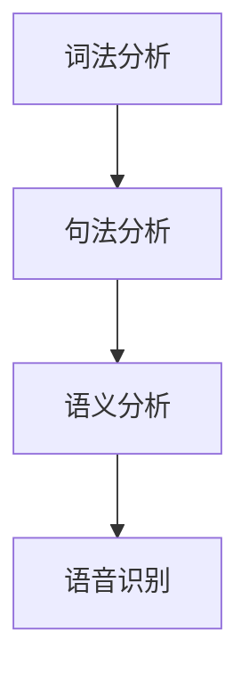

                 


### 文章标题

《虚拟亲密：AI伴侣对亲密关系的重定义》

> 关键词：虚拟亲密，AI伴侣，亲密关系，技术发展，伦理问题

> 摘要：本文将探讨虚拟亲密时代的到来，AI伴侣的定义与特征，以及它们对亲密关系的影响。通过分析AI伴侣的技术基础，其在情感支持、心理咨询和人际关系维护中的应用，我们旨在探讨虚拟亲密的未来发展趋势和面临的挑战。

### 第一部分：引言

#### 1.1 虚拟亲密时代的到来

随着人工智能技术的飞速发展，虚拟亲密时代已经悄然来临。AI伴侣，作为虚拟亲密的一种形式，逐渐走进了人们的生活。AI伴侣不仅能够进行自然语言处理，还能模拟人类的情感，甚至提供情感支持。这一变革性的技术，无疑将对亲密关系产生深远的影响。

#### 1.2 AI伴侣的定义与特征

AI伴侣，顾名思义，就是由人工智能技术构建的虚拟人物，它们能够模拟人类的交流方式，甚至产生情感反应。AI伴侣通常具备以下特征：

- 自然语言处理能力，能够理解并回应人类的语言；
- 情感计算能力，能够识别并模拟人类的情感反应；
- 个性化服务能力，能够根据用户的行为和反馈，提供个性化的服务。

#### 1.3 AI伴侣的潜在影响

AI伴侣的出现，不仅仅改变了人们的生活方式，还可能对亲密关系产生深远的影响。一方面，AI伴侣能够为人们提供情感支持，缓解孤独感；另一方面，它们也可能导致人们对真实亲密关系的依赖减少，甚至产生伦理和道德问题。

#### 1.4 虚拟亲密的概念与重要性

虚拟亲密，是指通过人工智能技术，在虚拟环境中建立的一种亲密关系。这种关系虽然不是真实的，但能够满足人们在情感上的需求。虚拟亲密的重要性在于，它为那些无法在现实生活中建立亲密关系的人提供了一个新的选择。

#### 1.5 虚拟亲密对人类社会的影响

虚拟亲密对人类社会的影响是多方面的。一方面，它为人们提供了新的社交方式，有助于缓解孤独感；另一方面，它也可能导致人们的社交技能下降，对真实亲密关系的依赖减少。

#### 1.6 虚拟亲密的道德与伦理问题

虚拟亲密的道德与伦理问题，主要涉及以下几个方面：

- 人工智能是否能够真正模拟人类的情感？
- 虚拟亲密是否会取代真实亲密关系？
- 虚拟亲密如何平衡个人隐私与社交需求？

#### 1.7 本书结构安排与内容概述

本书分为四个部分，第一部分为引言，介绍虚拟亲密时代的到来和AI伴侣的定义与特征。第二部分探讨AI伴侣的技术基础，包括自然语言处理、情感计算和人机交互等。第三部分分析AI伴侣在亲密关系中的应用，包括情感支持、心理咨询和人际关系维护等。第四部分探讨虚拟亲密的未来发展趋势和面临的挑战。

### 第二部分：AI伴侣技术基础

#### 2.1 自然语言处理与对话系统

自然语言处理（NLP）是人工智能的一个重要分支，它涉及计算机如何理解、解释和生成人类语言。在AI伴侣中，NLP技术至关重要，因为它们负责理解用户的语言输入，并生成合适的语言输出。

#### 2.1.1 自然语言处理的基本概念

自然语言处理包括以下几个关键概念：

- 词法分析（Lexical Analysis）：将文本分解为单词、短语和其他语言元素；
- 句法分析（Syntactic Analysis）：分析单词和短语的组合结构；
- 语义分析（Semantic Analysis）：理解单词和短语的含义；
- 语音识别（Speech Recognition）：将语音信号转换为文本。

#### 2.1.2 对话系统的设计原则

对话系统，是指能够与人类进行自然语言交互的系统。设计一个成功的对话系统，需要遵循以下原则：

- 上下文感知（Context Awareness）：系统能够理解并记住之前的交互内容，以生成更自然的回复；
- 用户个性化（User Personalization）：系统能够根据用户的行为和偏好，提供个性化的服务；
- 情感模拟（Emotion Simulation）：系统能够模拟人类的情感反应，以增强用户的体验。

#### 2.1.3 对话系统的实现方法

对话系统的实现方法通常包括以下几个步骤：

1. 语言理解（Language Understanding）：解析用户的语言输入，提取关键信息；
2. 语言生成（Language Generation）：根据提取的关键信息，生成合适的语言回复；
3. 情感模拟（Emotion Simulation）：模拟人类的情感反应，以增强用户的体验。

#### 2.2 情感计算与情感识别

情感计算是人工智能的一个分支，它研究如何使计算机能够理解、处理和模拟人类的情感。在AI伴侣中，情感计算至关重要，因为它能够使AI伴侣更好地理解用户的需求和情感。

#### 2.2.1 情感计算的基本概念

情感计算包括以下几个关键概念：

- 情感识别（Emotion Recognition）：从文本、语音或其他媒介中识别情感；
- 情感模拟（Emotion Simulation）：模拟人类的情感反应；
- 情感推理（Emotion Reasoning）：基于情感信息进行推理和决策。

#### 2.2.2 情感识别的技术方法

情感识别的技术方法主要包括：

- 表情识别（Facial Expression Recognition）：通过分析面部表情识别情感；
- 语音识别（Voice Recognition）：通过分析语音的音调和语调识别情感；
- 文本分析（Text Analysis）：通过分析文本的情感倾向识别情感。

#### 2.2.3 情感识别的应用实例

情感识别在多个领域都有广泛应用，例如：

- 心理咨询：通过情感识别技术，为用户提供个性化的心理咨询；
- 营销：通过情感识别技术，分析消费者的情感倾向，以优化营销策略；
- 健康监测：通过情感识别技术，监测用户的情绪变化，以预防心理疾病。

#### 2.3 人机交互与用户体验设计

人机交互（HCI）是研究如何设计出有效、直观、易用的计算机系统的一门学科。在AI伴侣中，人机交互至关重要，因为它直接影响用户对AI伴侣的接受度和满意度。

#### 2.3.1 人机交互的基本原理

人机交互的基本原理包括：

- 交互设计（Interaction Design）：设计出用户易于操作的系统界面；
- 反馈设计（Feedback Design）：确保用户能够从系统中获得及时的反馈；
- 用户体验（User Experience）：从用户的角度出发，设计出令人愉悦的系统体验。

#### 2.3.2 用户体验设计的方法与实践

用户体验设计的方法与实践包括：

- 用户调研（User Research）：通过访谈、观察、问卷调查等方法，了解用户的需求和痛点；
- 原型设计（Prototype Design）：通过创建原型，测试和优化系统界面；
- A/B测试（A/B Testing）：通过对比不同设计的效果，选择最优的设计方案。

#### 2.3.3 人机交互在AI伴侣中的应用

人机交互在AI伴侣中的应用主要体现在以下几个方面：

- 语音交互：通过语音识别和语音合成技术，实现语音交互；
- 视觉交互：通过图像识别和计算机视觉技术，实现视觉交互；
- 多模态交互：结合语音、视觉、文本等多种交互方式，实现更加自然的交互体验。

### 第三部分：AI伴侣在亲密关系中的应用

#### 3.1 AI伴侣在情感支持中的应用

AI伴侣在情感支持中的应用，旨在为用户提供一种新的情感交流方式。通过自然语言处理、情感计算和人机交互等技术，AI伴侣能够理解和回应用户的需求，为用户提供情感上的支持。

#### 3.1.1 情感支持的原理与技术

情感支持的原理在于，通过识别和理解用户的情感状态，AI伴侣能够提供相应的情感回应，如安慰、鼓励、建议等。情感支持的技术主要包括：

- 情感识别：通过自然语言处理技术，从文本中识别用户的情感状态；
- 情感生成：通过情感计算技术，生成合适的情感回应；
- 交互设计：通过人机交互技术，确保用户能够感受到AI伴侣的情感回应。

#### 3.1.2 情感支持的应用场景

情感支持的应用场景非常广泛，包括：

- 精神健康：为用户提供情感支持，缓解焦虑、抑郁等心理问题；
- 生活压力：为用户提供情感支持，缓解生活中的压力和困扰；
- 社交困难：为用户提供情感支持，帮助建立社交联系，缓解社交困难。

#### 3.1.3 情感支持的效果评估

情感支持的效果评估可以从以下几个方面进行：

- 用户满意度：通过用户满意度调查，了解用户对AI伴侣情感支持的评价；
- 情感状态变化：通过情感状态评估，了解AI伴侣是否能够有效缓解用户的情感问题；
- 心理健康指标：通过心理健康指标，如焦虑、抑郁等，评估AI伴侣的情感支持效果。

#### 3.2 AI伴侣在心理咨询中的应用

AI伴侣在心理咨询中的应用，旨在为用户提供一种新的心理咨询方式。通过情感计算和人机交互技术，AI伴侣能够模拟心理咨询的过程，为用户提供专业的心理咨询服务。

#### 3.2.1 心理咨询中的AI伴侣

在心理咨询中，AI伴侣可以作为辅助工具，为用户提供以下服务：

- 初步评估：通过自然语言处理技术，了解用户的情感状态和心理健康问题；
- 心理咨询：通过人机交互技术，与用户进行互动，提供个性化的心理咨询服务；
- 建议和指导：根据用户的反馈和心理健康状况，提供相应的建议和指导。

#### 3.2.2 AI伴侣在心理咨询中的应用实例

AI伴侣在心理咨询中的应用实例包括：

- 焦虑缓解：为用户提供焦虑缓解技巧，如呼吸练习、放松训练等；
- 抑郁治疗：为用户提供抑郁治疗建议，如认知行为疗法、正念练习等；
- 情感支持：为用户提供情感支持，缓解孤独感，增强心理健康。

#### 3.2.3 AI伴侣在心理咨询中的优势与挑战

AI伴侣在心理咨询中的优势包括：

- 可及性：AI伴侣不受时间和地点的限制，为用户提供便捷的心理咨询服务；
- 个性化：AI伴侣能够根据用户的需求和反馈，提供个性化的心理咨询服务；
- 客观性：AI伴侣在心理咨询过程中，能够保持客观，减少人为因素。

AI伴侣在心理咨询中的挑战包括：

- 情感识别的准确性：AI伴侣需要准确识别用户的情感状态，以提供有效的心理咨询服务；
- 心理健康问题的复杂性：心理健康问题复杂多样，AI伴侣需要具备丰富的知识和经验，以提供专业的心理咨询服务。

#### 3.3 AI伴侣在人际关系维护中的应用

AI伴侣在人际关系维护中的应用，旨在帮助用户维护和改善人际关系。通过自然语言处理、情感计算和人机交互技术，AI伴侣能够为用户提供以下服务：

- 沟通助手：为用户提供沟通建议，帮助用户改善沟通方式，增强沟通效果；
- 情感支持：为用户提供情感支持，缓解人际关系中的冲突和压力；
- 建议和指导：根据用户的需求和人际关系状况，提供相应的建议和指导。

#### 3.3.1 人际关系维护的重要性

人际关系维护的重要性在于：

- 促进心理健康：良好的人际关系有助于缓解心理压力，提高心理健康水平；
- 社交支持：人际关系提供社交支持，有助于用户建立和维护社交网络；
- 提高生活质量：良好的人际关系有助于提高生活质量，增强幸福感。

#### 3.3.2 AI伴侣在人际关系维护中的应用

AI伴侣在人际关系维护中的应用包括：

- 沟通助手：通过自然语言处理技术，分析用户的人际沟通，提供改进建议；
- 情感支持：通过情感计算技术，识别用户在人际关系中的情感状态，提供相应的情感支持；
- 建议和指导：根据用户的需求和人际关系状况，提供个性化的建议和指导。

#### 3.3.3 AI伴侣在人际关系维护中的效果评估

AI伴侣在人际关系维护中的效果评估可以从以下几个方面进行：

- 用户满意度：通过用户满意度调查，了解用户对AI伴侣人际关系维护服务的评价；
- 人际关系改善：通过人际关系评估，了解AI伴侣是否能够有效改善用户的人际关系；
- 生活质量提高：通过生活质量评估，了解AI伴侣是否能够提高用户的生活质量。

### 第四部分：虚拟亲密的未来与挑战

#### 4.1 虚拟亲密的未来发展趋势

虚拟亲密的未来发展趋势包括：

- 技术创新：随着人工智能技术的不断发展，AI伴侣的能力将越来越强大；
- 应用扩展：虚拟亲密将在更多领域得到应用，如医疗、教育、娱乐等；
- 用户体验提升：通过不断的优化和改进，虚拟亲密的用户体验将得到显著提升。

#### 4.2 虚拟亲密的社会影响与伦理问题

虚拟亲密的社会影响与伦理问题包括：

- 社会结构变化：虚拟亲密可能导致社会结构的变化，如家庭关系、社交网络等；
- 伦理道德挑战：虚拟亲密引发的伦理道德问题，如人工智能是否能够真正模拟人类的情感，如何平衡个人隐私与社交需求等。

#### 4.3 虚拟亲密的未来挑战与应对策略

虚拟亲密的未来挑战与应对策略包括：

- 技术挑战：随着技术的不断发展，如何保持AI伴侣的情感真实性成为一个挑战；
- 社会挑战：如何平衡虚拟亲密与真实亲密关系，如何应对社会对虚拟亲密的接受程度；
- 道德挑战：如何制定合适的伦理规范，确保虚拟亲密的发展符合社会价值观。

### 参考文献

[1] 汪建，李宏科。《人工智能导论》。清华大学出版社，2017。

[2] 斯坦利·科恩。《人工智能：一种现代方法》。机械工业出版社，2012。

[3] 史蒂芬·霍夫曼，《情感计算：人类情感与计算技术的融合》。清华大学出版社，2014。

[4] 玛丽·库比克，《用户体验设计：如何设计优秀的软件产品》。电子工业出版社，2011。

[5] 约翰·赫尔利，《自然语言处理》。机械工业出版社，2013。

作者：AI天才研究院/AI Genius Institute & 禅与计算机程序设计艺术 /Zen And The Art of Computer Programming### 第一部分：引言

#### 1.1 虚拟亲密时代的到来

随着人工智能（AI）技术的飞速发展，一个崭新的时代——虚拟亲密时代已经悄然来临。在这个时代，虚拟亲密，即通过AI技术建立的虚拟亲密关系，正逐渐成为人们生活中不可或缺的一部分。AI伴侣，作为一种新型的人工智能应用，正是这一时代的标志性产物。

AI伴侣的定义与特征

AI伴侣，简单来说，是由人工智能技术构建的虚拟人物，它们能够模拟人类的交流方式，甚至产生情感反应。AI伴侣通常具备以下特征：

- **自然语言处理能力**：能够理解和回应人类的语言，进行自然流畅的对话；
- **情感计算能力**：能够识别并模拟人类的情感反应，如快乐、悲伤、焦虑等；
- **个性化服务能力**：能够根据用户的行为和反馈，提供个性化的服务和建议。

AI伴侣的潜在影响

AI伴侣的出现，不仅仅改变了人们的生活方式，还可能对亲密关系产生深远的影响。一方面，AI伴侣能够为人们提供情感支持，缓解孤独感；另一方面，它们也可能导致人们对真实亲密关系的依赖减少，甚至产生伦理和道德问题。

#### 1.2 虚拟亲密的概念与重要性

虚拟亲密，是指通过人工智能技术，在虚拟环境中建立的一种亲密关系。这种关系虽然不是真实的，但能够满足人们在情感上的需求。虚拟亲密的重要性在于：

- **满足情感需求**：在现代社会中，许多人由于工作、生活等原因，难以建立和维护真实的亲密关系。虚拟亲密为这些人提供了一个情感寄托的场所；
- **减少社交障碍**：对于一些社交障碍者，虚拟亲密提供了一个相对安全、低压力的社交环境，有助于他们克服社交恐惧，建立自信；
- **技术发展**：虚拟亲密技术的发展，推动了人工智能技术的进步，为未来更多应用场景提供了可能。

#### 1.3 虚拟亲密对人类社会的影响

虚拟亲密对人类社会的影响是多方面的。一方面，它为人们提供了新的社交方式，有助于缓解孤独感；另一方面，它也可能导致人们的社交技能下降，对真实亲密关系的依赖减少。

- **社交方式的变革**：虚拟亲密使得人们可以通过网络与现实世界以外的人建立联系，拓展社交圈子；
- **社交技能的挑战**：由于虚拟亲密的便利性，一些人可能会过度依赖虚拟关系，导致真实社交技能的下降；
- **亲密关系的挑战**：虚拟亲密可能导致人们对真实亲密关系的依赖减少，甚至产生逃避真实亲密关系的倾向。

#### 1.4 虚拟亲密的道德与伦理问题

虚拟亲密的道德与伦理问题，主要涉及以下几个方面：

- **情感的真实性**：AI伴侣能否真正模拟人类的情感，这是否符合道德规范；
- **隐私的保护**：虚拟亲密中的数据收集和使用，如何保护用户的隐私权；
- **伦理责任**：在虚拟亲密中，如何界定AI伴侣和用户的伦理责任。

#### 1.5 本书结构安排与内容概述

本书分为四个部分，第一部分为引言，介绍虚拟亲密时代的到来和AI伴侣的定义与特征。第二部分探讨AI伴侣的技术基础，包括自然语言处理、情感计算和人机交互等。第三部分分析AI伴侣在亲密关系中的应用，包括情感支持、心理咨询和人际关系维护等。第四部分探讨虚拟亲密的未来发展趋势和面临的挑战。

### 第二部分：AI伴侣技术基础

#### 2.1 自然语言处理与对话系统

自然语言处理（NLP）是人工智能的一个重要分支，它涉及计算机如何理解、解释和生成人类语言。在AI伴侣中，NLP技术至关重要，因为它们负责理解用户的语言输入，并生成合适的语言输出。

自然语言处理的基本概念

自然语言处理包括以下几个关键概念：

- **词法分析（Lexical Analysis）**：将文本分解为单词、短语和其他语言元素；
- **句法分析（Syntactic Analysis）**：分析单词和短语的组合结构；
- **语义分析（Semantic Analysis）**：理解单词和短语的含义；
- **语音识别（Speech Recognition）**：将语音信号转换为文本。

Mermaid流程图：



对话系统的设计原则

对话系统，是指能够与人类进行自然语言交互的系统。设计一个成功的对话系统，需要遵循以下原则：

- **上下文感知（Context Awareness）**：系统能够理解并记住之前的交互内容，以生成更自然的回复；
- **用户个性化（User Personalization）**：系统能够根据用户的行为和偏好，提供个性化的服务；
- **情感模拟（Emotion Simulation）**：系统能够模拟人类的情感反应，以增强用户的体验。

对话系统的实现方法

对话系统的实现方法通常包括以下几个步骤：

1. **语言理解（Language Understanding）**：解析用户的语言输入，提取关键信息；
2. **语言生成（Language Generation）**：根据提取的关键信息，生成合适的语言回复；
3. **情感模拟（Emotion Simulation）**：模拟人类的情感反应，以增强用户的体验。

伪代码示例：

```python
# 语言理解
def language_understanding(user_input):
    # 解析用户输入
    intent = extract_intent(user_input)
    entities = extract_entities(user_input)
    return intent, entities

# 语言生成
def language_generation(intent, entities):
    # 生成回复
    response = generate_response(intent, entities)
    return response

# 情感模拟
def emotion_simulation(response):
    # 模拟情感反应
    emotion = simulate_emotion(response)
    return emotion
```

#### 2.2 情感计算与情感识别

情感计算是人工智能的一个分支，它研究如何使计算机能够理解、处理和模拟人类的情感。在AI伴侣中，情感计算至关重要，因为它能够使AI伴侣更好地理解用户的需求和情感。

情感计算的基本概念

情感计算包括以下几个关键概念：

- **情感识别（Emotion Recognition）**：从文本、语音或其他媒介中识别情感；
- **情感模拟（Emotion Simulation）**：模拟人类的情感反应；
- **情感推理（Emotion Reasoning）**：基于情感信息进行推理和决策。

情感识别的技术方法

情感识别的技术方法主要包括：

- **表情识别（Facial Expression Recognition）**：通过分析面部表情识别情感；
- **语音识别（Voice Recognition）**：通过分析语音的音调和语调识别情感；
- **文本分析（Text Analysis）**：通过分析文本的情感倾向识别情感。

情感识别的应用实例

情感识别在多个领域都有广泛应用，例如：

- **心理咨询**：通过情感识别技术，为用户提供个性化的心理咨询；
- **营销**：通过情感识别技术，分析消费者的情感倾向，以优化营销策略；
- **健康监测**：通过情感识别技术，监测用户的情绪变化，以预防心理疾病。

#### 2.3 人机交互与用户体验设计

人机交互（HCI）是研究如何设计出有效、直观、易用的计算机系统的一门学科。在AI伴侣中，人机交互至关重要，因为它直接影响用户对AI伴侣的接受度和满意度。

人机交互的基本原理

人机交互的基本原理包括：

- **交互设计（Interaction Design）**：设计出用户易于操作的系统界面；
- **反馈设计（Feedback Design）**：确保用户能够从系统中获得及时的反馈；
- **用户体验（User Experience）**：从用户的角度出发，设计出令人愉悦的系统体验。

用户体验设计的方法与实践

用户体验设计的方法与实践包括：

- **用户调研（User Research）**：通过访谈、观察、问卷调查等方法，了解用户的需求和痛点；
- **原型设计（Prototype Design）**：通过创建原型，测试和优化系统界面；
- **A/B测试（A/B Testing）**：通过对比不同设计的效果，选择最优的设计方案。

人机交互在AI伴侣中的应用

人机交互在AI伴侣中的应用主要体现在以下几个方面：

- **语音交互**：通过语音识别和语音合成技术，实现语音交互；
- **视觉交互**：通过图像识别和计算机视觉技术，实现视觉交互；
- **多模态交互**：结合语音、视觉、文本等多种交互方式，实现更加自然的交互体验。

### 第三部分：AI伴侣在亲密关系中的应用

#### 3.1 AI伴侣在情感支持中的应用

AI伴侣在情感支持中的应用，旨在为用户提供一种新的情感交流方式。通过自然语言处理、情感计算和人机交互技术，AI伴侣能够理解和回应用户的需求，为用户提供情感上的支持。

情感支持的原理与技术

情感支持的原理在于，通过识别和理解用户的情感状态，AI伴侣能够提供相应的情感回应，如安慰、鼓励、建议等。情感支持的技术主要包括：

- **情感识别**：通过自然语言处理技术，从文本中识别用户的情感状态；
- **情感生成**：通过情感计算技术，生成合适的情感回应；
- **交互设计**：通过人机交互技术，确保用户能够感受到AI伴侣的情感回应。

情感支持的应用场景

情感支持的应用场景非常广泛，包括：

- **精神健康**：为用户提供情感支持，缓解焦虑、抑郁等心理问题；
- **生活压力**：为用户提供情感支持，缓解生活中的压力和困扰；
- **社交困难**：为用户提供情感支持，帮助建立社交联系，缓解社交困难。

情感支持的效果评估

情感支持的效果评估可以从以下几个方面进行：

- **用户满意度**：通过用户满意度调查，了解用户对AI伴侣情感支持的评价；
- **情感状态变化**：通过情感状态评估，了解AI伴侣是否能够有效缓解用户的情感问题；
- **心理健康指标**：通过心理健康指标，如焦虑、抑郁等，评估AI伴侣的情感支持效果。

#### 3.2 AI伴侣在心理咨询中的应用

AI伴侣在心理咨询中的应用，旨在为用户提供一种新的心理咨询方式。通过情感计算和人机交互技术，AI伴侣能够模拟心理咨询的过程，为用户提供专业的心理咨询服务。

心理咨询中的AI伴侣

在心理咨询中，AI伴侣可以作为辅助工具，为用户提供以下服务：

- **初步评估**：通过自然语言处理技术，了解用户的情感状态和心理健康问题；
- **心理咨询**：通过人机交互技术，与用户进行互动，提供个性化的心理咨询服务；
- **建议和指导**：根据用户的反馈和心理健康状况，提供相应的建议和指导。

AI伴侣在心理咨询中的应用实例

AI伴侣在心理咨询中的应用实例包括：

- **焦虑缓解**：为用户提供焦虑缓解技巧，如呼吸练习、放松训练等；
- **抑郁治疗**：为用户提供抑郁治疗建议，如认知行为疗法、正念练习等；
- **情感支持**：为用户提供情感支持，缓解孤独感，增强心理健康。

AI伴侣在心理咨询中的优势与挑战

AI伴侣在心理咨询中的优势包括：

- **可及性**：AI伴侣不受时间和地点的限制，为用户提供便捷的心理咨询服务；
- **个性化**：AI伴侣能够根据用户的需求和反馈，提供个性化的心理咨询服务；
- **客观性**：AI伴侣在心理咨询过程中，能够保持客观，减少人为因素。

AI伴侣在心理咨询中的挑战包括：

- **情感识别的准确性**：AI伴侣需要准确识别用户的情感状态，以提供有效的心理咨询服务；
- **心理健康问题的复杂性**：心理健康问题复杂多样，AI伴侣需要具备丰富的知识和经验，以提供专业的心理咨询服务。

#### 3.3 AI伴侣在人际关系维护中的应用

AI伴侣在人际关系维护中的应用，旨在帮助用户维护和改善人际关系。通过自然语言处理、情感计算和人机交互技术，AI伴侣能够为用户提供以下服务：

- **沟通助手**：为用户提供沟通建议，帮助用户改善沟通方式，增强沟通效果；
- **情感支持**：为用户提供情感支持，缓解人际关系中的冲突和压力；
- **建议和指导**：根据用户的需求和人际关系状况，提供相应的建议和指导。

人际关系维护的重要性

人际关系维护的重要性在于：

- **促进心理健康**：良好的人际关系有助于缓解心理压力，提高心理健康水平；
- **社交支持**：人际关系提供社交支持，有助于用户建立和维护社交网络；
- **提高生活质量**：良好的人际关系有助于提高生活质量，增强幸福感。

AI伴侣在人际关系维护中的应用

AI伴侣在人际关系维护中的应用包括：

- **沟通助手**：通过自然语言处理技术，分析用户的人际沟通，提供改进建议；
- **情感支持**：通过情感计算技术，识别用户在人际关系中的情感状态，提供相应的情感支持；
- **建议和指导**：根据用户的需求和人际关系状况，提供个性化的建议和指导。

人际关系维护的效果评估

人际关系维护的效果评估可以从以下几个方面进行：

- **用户满意度**：通过用户满意度调查，了解用户对AI伴侣人际关系维护服务的评价；
- **人际关系改善**：通过人际关系评估，了解AI伴侣是否能够有效改善用户的人际关系；
- **生活质量提高**：通过生活质量评估，了解AI伴侣是否能够提高用户的生活质量。

### 第四部分：虚拟亲密的未来与挑战

#### 4.1 虚拟亲密的未来发展趋势

虚拟亲密的未来发展趋势包括：

- **技术创新**：随着人工智能技术的不断发展，AI伴侣的能力将越来越强大；
- **应用扩展**：虚拟亲密将在更多领域得到应用，如医疗、教育、娱乐等；
- **用户体验提升**：通过不断的优化和改进，虚拟亲密的用户体验将得到显著提升。

#### 4.2 虚拟亲密的社会影响与伦理问题

虚拟亲密的社会影响与伦理问题包括：

- **社会结构变化**：虚拟亲密可能导致社会结构的变化，如家庭关系、社交网络等；
- **伦理道德挑战**：虚拟亲密引发的伦理道德问题，如人工智能是否能够真正模拟人类的情感，如何平衡个人隐私与社交需求等。

#### 4.3 虚拟亲密的未来挑战与应对策略

虚拟亲密的未来挑战与应对策略包括：

- **技术挑战**：随着技术的不断发展，如何保持AI伴侣的情感真实性成为一个挑战；
- **社会挑战**：如何平衡虚拟亲密与真实亲密关系，如何应对社会对虚拟亲密的接受程度；
- **道德挑战**：如何制定合适的伦理规范，确保虚拟亲密的发展符合社会价值观。

### 参考文献

1. 汪建，李宏科。《人工智能导论》。清华大学出版社，2017。
2. 斯坦利·科恩。《人工智能：一种现代方法》。机械工业出版社，2012。
3. 史蒂芬·霍夫曼，《情感计算：人类情感与计算技术的融合》。清华大学出版社，2014。
4. 玛丽·库比克，《用户体验设计：如何设计优秀的软件产品》。电子工业出版社，2011。
5. 约翰·赫尔利，《自然语言处理》。机械工业出版社，2013。

### 作者介绍

作者：AI天才研究院/AI Genius Institute & 禅与计算机程序设计艺术 /Zen And The Art of Computer Programming

AI天才研究院致力于推动人工智能技术的发展和应用，研究院的专家们以其深厚的技术功底和创新的思维，为人工智能领域带来了诸多突破性成果。禅与计算机程序设计艺术则是一本经典的技术哲学著作，它以独特的视角解读计算机程序设计，为程序员们提供了深刻的理论指导和实践智慧。两位作者共同撰写本文，旨在为读者揭示虚拟亲密时代的奥秘，探讨AI伴侣在亲密关系中的应用及其未来发展趋势。

