                 

### 文章标题

# 虚拟家庭:AI成员对传统家庭结构的冲击

### 关键词

- 虚拟家庭
- AI成员
- 传统家庭结构
- 人工智能技术
- 家庭关系变革
- 社会文化影响
- 经济模式转变

### 摘要

本文深入探讨了虚拟家庭的崛起及其对传统家庭结构的冲击。随着人工智能技术的发展，虚拟家庭成员——具备高度智能化的AI助手，正逐步融入家庭生活，改变着家庭关系的构成、角色分配和社会文化。本文首先定义了虚拟家庭和AI成员的概念，回顾了其发展历程和演变，随后详细分析了AI成员在虚拟家庭中的技术应用与交互设计，以及可能带来的安全与隐私问题。接着，文章从社会和经济两个层面探讨了AI成员对传统家庭结构的影响，并展望了虚拟家庭的未来发展趋势。通过实际案例分析和项目实战，本文旨在为读者提供一个全面而深入的洞察，探讨人工智能在家庭中的应用前景及其可能带来的变革。

### 目录大纲

1. 第一部分：虚拟家庭的崛起与影响
   1.1 虚拟家庭的概念
   1.2 虚拟家庭的历史演变
   1.3 虚拟家庭与传统家庭的结构比较
   2. AI成员在虚拟家庭中的应用
   2.1 AI成员的角色定义
   2.2 AI成员的功能与服务
   2.3 AI成员对家庭生活的改变

2. 第二部分：AI成员的技术基础
   3. AI技术的核心概念与架构
   3.1 机器学习与深度学习
   3.2 自然语言处理
   3.3 计算机视觉
   4. AI成员的交互设计与实现
   4.1 交互设计原则
   4.2 语音识别与合成技术
   4.3 人机交互界面设计
   5. AI成员的安全与隐私保护
   5.1 AI成员的数据隐私问题
   5.2 安全防护措施
   5.3 法律法规与伦理道德

3. 第三部分：AI成员对传统家庭结构的影响
   6. 社会层面的影响
   6.1 家庭关系的变化
   6.2 家庭角色的重构
   6.3 社区与社会的反应
   7. 经济层面的影响
   7.1 家庭支出与消费模式的变化
   7.2 产业转型与就业影响
   7.3 新型家庭经济模式的探索

4. 第四部分：虚拟家庭的未来与发展趋势
   8. 虚拟家庭的未来展望
   8.1 技术发展趋势
   8.2 社会文化影响
   8.3 未来家庭生活的想象
   9. 虚拟家庭的实际案例与应用
   9.1 虚拟家庭的成功案例
   9.2 虚拟家庭在不同国家的应用
   9.3 虚拟家庭的创新与挑战
   10. 虚誉家庭与人类未来
   10.1 人与AI成员的关系
   10.2 虚拟家庭对人类发展的影响
   10.3 虚拟家庭的未来挑战与机遇

### 第一部分：虚拟家庭的崛起与影响

#### 第1章：虚拟家庭的概念与演变

虚拟家庭这一概念，随着人工智能（AI）和虚拟现实（VR）技术的发展，正逐渐从科幻小说走入现实生活。虚拟家庭指的是由人类和智能机器组成的家庭形态，其中AI成员充当家庭成员的角色，通过高度智能化的交互和功能，为家庭生活提供全方位的支持和服务。

#### 1.1 虚拟家庭的概念

虚拟家庭中的AI成员不仅仅是简单的自动化工具，它们具有自我学习和适应能力，可以理解家庭成员的需求，预测行为模式，并主动提供服务。这些AI成员可以是智能音箱、家庭机器人、虚拟助手等，它们共同构建了一个高度自动化和个性化的家庭环境。

#### 1.2 虚拟家庭的历史演变

虚拟家庭的发展历程可以追溯到20世纪末的智能家电和早期的虚拟助手。随着互联网和大数据技术的普及，这些设备开始具备了一定的学习能力。而进入21世纪，随着深度学习和自然语言处理技术的发展，AI成员的智能化水平大幅提升，能够更好地理解和满足人类的需求。

#### 1.3 虚拟家庭与传统家庭的结构比较

传统家庭结构以血缘关系为核心，家庭成员之间通过情感和责任维系。而虚拟家庭则是一种基于技术和服务的家庭形态，家庭成员之间的关系更多地依赖于AI成员提供的功能和互动。以下是两者在结构上的比较：

1. 成员构成：传统家庭由血亲和配偶构成，而虚拟家庭则包括血亲和智能AI成员。
2. 互动方式：传统家庭互动主要通过面对面交流和情感表达，而虚拟家庭互动则依赖于语音、图像和数据的传输。
3. 功能服务：传统家庭功能主要由家庭成员分担，而虚拟家庭功能则由AI成员高效承担，如家务管理、健康监控等。

#### 第2章：AI成员在虚拟家庭中的应用

AI成员在虚拟家庭中的应用涵盖了生活的方方面面，从日常家务到教育娱乐，再到健康护理，AI成员正在逐步改变家庭生活的模式。

#### 2.1 AI成员的角色定义

在虚拟家庭中，AI成员扮演多种角色，如家庭管家、教育助理、健康顾问和娱乐伙伴等。以下是对不同角色的一些定义：

1. **家庭管家**：负责家庭事务的管理，包括日程安排、家务处理和财务规划等。
2. **教育助理**：为学生提供个性化的学习辅导，支持家庭教育的实施。
3. **健康顾问**：监控家庭成员的健康状况，提供健康建议和紧急医疗服务。
4. **娱乐伙伴**：为家庭提供各种娱乐活动，如游戏、电影和音乐等。

#### 2.2 AI成员的功能与服务

AI成员的功能和服务非常多样化，以下是一些主要功能：

1. **语音交互**：通过语音助手与家庭成员进行交流，执行各种指令。
2. **图像识别**：识别家庭成员的行为和表情，提供个性化服务。
3. **自然语言处理**：理解和生成自然语言，为家庭成员提供实时信息和建议。
4. **智能家居控制**：控制家庭中的智能设备，如灯光、温度、安全系统等。

#### 2.3 AI成员对家庭生活的改变

AI成员的融入给家庭生活带来了深远的影响，以下是一些具体改变：

1. **提高生活质量**：通过智能化的服务和自动化，家庭成员可以更加专注于个人兴趣和工作，提高生活质量。
2. **增强安全性**：智能监控和安全系统可以减少家庭安全风险，提供更多的安全保障。
3. **优化资源分配**：通过数据分析，AI成员可以优化家庭资源的分配，减少浪费。
4. **促进家庭成员互动**：AI成员可以作为沟通的桥梁，促进家庭成员之间的交流和理解。

#### 小结

虚拟家庭和AI成员的兴起，正在引发家庭结构的深刻变革。AI成员不仅在功能上取代了一些传统家庭成员的角色，还在互动方式上带来了全新的体验。随着技术的不断进步，虚拟家庭将逐渐成为未来家庭生活的重要组成部分。

### 第二部分：AI成员的技术基础

#### 第3章：AI技术的核心概念与架构

AI技术的核心概念包括机器学习、深度学习、自然语言处理和计算机视觉。这些技术共同构成了AI系统的技术基础，使得AI成员能够执行复杂的任务和提供个性化的服务。

#### 3.1 机器学习与深度学习

机器学习是一种使计算机能够从数据中学习规律并做出决策的技术。深度学习是机器学习的一个分支，它通过神经网络模拟人脑的学习过程，能够处理大量复杂数据。

**机器学习算法伪代码：**

```python
def machine_learning_algorithm(data, labels):
    # 数据预处理
    preprocessed_data = preprocess_data(data)
    
    # 训练模型
    model = train_model(preprocessed_data, labels)
    
    # 模型评估
    accuracy = evaluate_model(model, test_data, test_labels)
    
    return model, accuracy
```

**深度学习模型架构：**

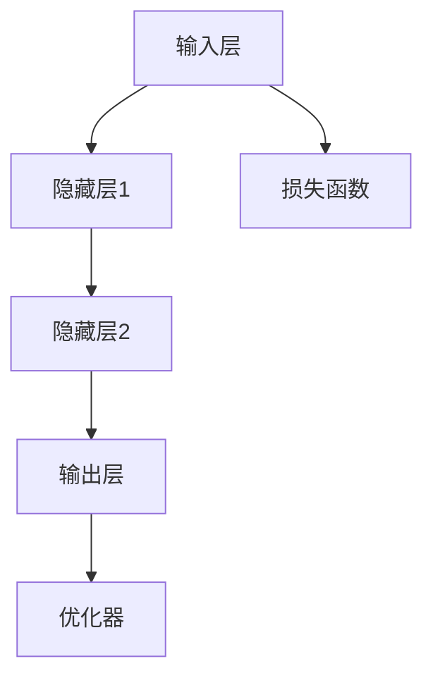

#### 3.2 自然语言处理

自然语言处理（NLP）是使计算机能够理解和生成人类语言的技术。NLP包括分词、词性标注、命名实体识别、机器翻译等功能。

**自然语言处理算法伪代码：**

```python
def natural_language_processing(text):
    # 分词
    words = tokenize(text)
    
    # 词性标注
    pos_tags = part_of_speech_tagging(words)
    
    # 命名实体识别
    entities = named_entity_recognition(words)
    
    return words, pos_tags, entities
```

#### 3.3 计算机视觉

计算机视觉是使计算机能够从图像或视频中识别和理解视觉信息的技术。计算机视觉包括图像分类、目标检测、人脸识别等任务。

**计算机视觉算法伪代码：**

```python
def computer_vision(image):
    # 图像预处理
    preprocessed_image = preprocess_image(image)
    
    # 目标检测
    objects = object_detection(preprocessed_image)
    
    # 人脸识别
    faces = face_recognition(preprocessed_image)
    
    return objects, faces
```

#### 第4章：AI成员的交互设计与实现

AI成员的交互设计是其核心功能之一，它决定了AI成员能否有效地融入家庭生活。交互设计包括语音识别与合成技术、人机交互界面设计等方面。

#### 4.1 交互设计原则

交互设计应遵循以下原则：

1. **用户中心**：设计应以用户需求为核心，确保交互体验自然、直观。
2. **一致性**：界面和交互方式应保持一致性，避免用户产生困惑。
3. **反馈**：及时给用户反馈，确保用户了解AI成员的状态和操作结果。
4. **容错性**：设计应具备容错性，能够处理用户的错误输入和异常情况。

#### 4.2 语音识别与合成技术

语音识别与合成技术是AI成员实现自然语音交互的关键。语音识别技术将语音转换为文本，而语音合成技术将文本转换为语音。

**语音识别算法伪代码：**

```python
def speech_recognition(audio):
    # 降噪
    cleaned_audio = noise_reduction(audio)
    
    # 分词
    words = tokenize(cleaned_audio)
    
    # 命名实体识别
    entities = named_entity_recognition(words)
    
    return entities
```

**语音合成算法伪代码：**

```python
def text_to_speech(text):
    # 语音合成
    speech = synthesize_speech(text)
    
    # 声音播放
    play_speech(speech)
```

#### 4.3 人机交互界面设计

人机交互界面设计应注重用户友好性和易用性。设计包括图形用户界面（GUI）和语音用户界面（VUI）。

**GUI设计流程：**

1. **需求分析**：了解用户需求和预期功能。
2. **界面布局**：设计界面布局，确保操作直观。
3. **交互流程**：设计交互流程，确保用户操作流畅。
4. **用户体验测试**：测试用户反馈，优化界面设计。

**VUI设计流程：**

1. **语音识别模型训练**：训练语音识别模型，提高识别准确率。
2. **语音合成模型训练**：训练语音合成模型，确保语音自然流畅。
3. **对话流程设计**：设计对话流程，确保交互自然连贯。
4. **语音测试与优化**：测试语音交互效果，不断优化用户体验。

#### 第5章：AI成员的安全与隐私保护

随着AI成员在家庭生活中的广泛应用，数据隐私和安全问题变得日益重要。AI成员在交互过程中会收集大量个人信息，如何保护这些数据的安全和隐私成为亟待解决的问题。

#### 5.1 AI成员的数据隐私问题

AI成员的数据隐私问题主要包括：

1. **数据收集**：AI成员在提供服务时会收集家庭成员的个人信息，如健康数据、生活习惯等。
2. **数据存储**：收集的数据需要存储在服务器或云端，可能存在数据泄露的风险。
3. **数据共享**：数据可能被第三方应用程序或服务使用，存在隐私泄露的风险。

#### 5.2 安全防护措施

为了保护AI成员的数据安全和隐私，可以采取以下安全防护措施：

1. **加密技术**：使用加密技术保护数据在传输和存储过程中的安全性。
2. **访问控制**：限制对数据的访问权限，确保只有授权用户可以访问。
3. **隐私政策**：明确告知用户数据收集的目的和范围，获得用户明确同意。
4. **安全审计**：定期进行安全审计，发现和修复潜在的安全漏洞。

#### 5.3 法律法规与伦理道德

为了确保AI成员的数据安全和隐私，各国政府和国际组织也出台了相应的法律法规和伦理道德规范。例如：

1. **数据保护法**：明确数据收集、存储、处理和共享的法律法规。
2. **隐私政策**：要求企业在收集和使用用户数据时必须透明，并尊重用户隐私。
3. **伦理道德规范**：要求企业在开发和应用AI技术时，遵循伦理道德原则，保护用户权益。

#### 小结

AI成员在虚拟家庭中的应用，带来了许多便利和改变，但同时也引发了数据隐私和安全的问题。通过采取有效的安全防护措施和遵守法律法规，可以确保AI成员在家庭中的安全应用，为用户提供更加可靠和贴心的服务。

### 第三部分：AI成员对传统家庭结构的影响

#### 第6章：社会层面的影响

AI成员的融入，不仅改变了家庭生活的技术手段，也对社会层面的家庭关系和角色产生了深远的影响。

#### 6.1 家庭关系的变化

随着AI成员的普及，家庭成员之间的互动方式发生了变化。传统的面对面交流逐渐被语音和文字交流所取代，家庭成员之间的情感交流方式变得更加多元化和间接化。例如，父母通过智能音箱为孩子们讲故事，家庭成员通过虚拟助手安排日程，这些新的互动方式不仅提高了家庭生活的便利性，也带来了家庭关系的变革。

**图示：家庭关系的变化**

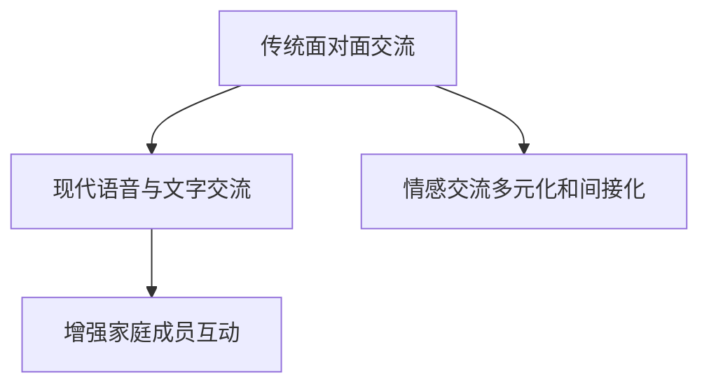

#### 6.2 家庭角色的重构

AI成员的出现，使得家庭成员的角色和责任发生了重构。传统的家庭角色，如家长、保姆、厨师等，部分功能被AI成员所取代。家长可以更多地专注于孩子的教育和陪伴，而不是日常的家务劳动。保姆和厨师的功能部分被智能家电和虚拟助手所承担，使得家庭成员可以更加专注于个人兴趣和发展。

**图示：家庭角色的重构**

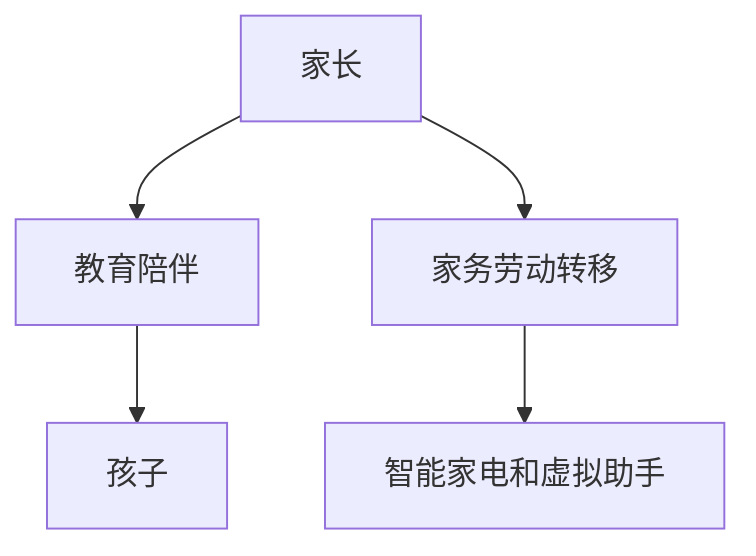

#### 6.3 社区与社会的反应

AI成员在虚拟家庭中的应用，引起了社区和社会的广泛关注。一方面，人们对于AI技术的应用充满期待，认为它能够提高生活质量和家庭幸福度。另一方面，也引发了关于隐私、安全和社会伦理的担忧。例如，家庭成员的隐私数据如何保护，AI成员是否可能导致家庭成员的依赖性等问题，都是社会关注的焦点。

**图示：社区与社会的反应**

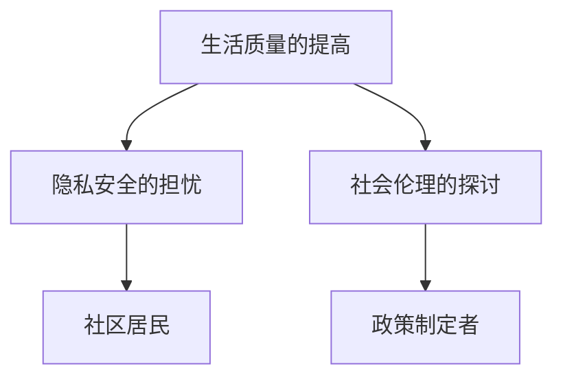

#### 第7章：经济层面的影响

AI成员的普及，对家庭经济模式也产生了显著的影响。

#### 7.1 家庭支出与消费模式的变化

AI成员的融入，改变了家庭支出的结构。传统的家庭开支，如保姆、家政服务、教育费用等，部分被智能家电和虚拟助手所取代，家庭总支出有所下降。同时，家庭消费模式也发生了变化，更加注重个性化服务和体验。

**图示：家庭支出与消费模式的变化**

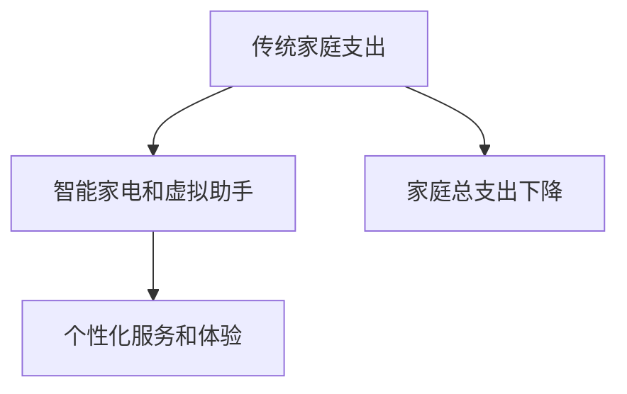

#### 7.2 产业转型与就业影响

AI成员的普及，推动了相关产业的发展，如智能家居、虚拟助手、健康监测等。然而，这也对就业市场产生了深远的影响。一方面，AI技术的发展创造了新的就业机会，如AI研发、数据分析、人机交互设计等。另一方面，传统的家政服务、教育等行业受到冲击，部分岗位被取代或需求减少。

**图示：产业转型与就业影响**

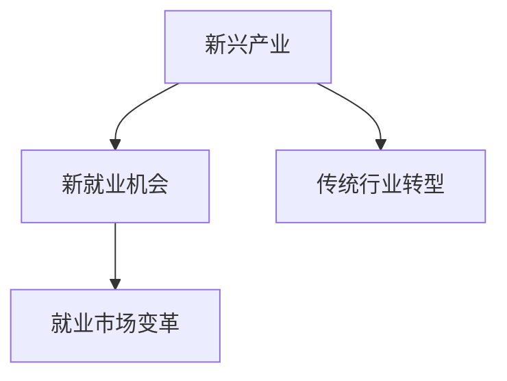

#### 7.3 新型家庭经济模式的探索

随着AI技术的不断进步，新型家庭经济模式也在不断探索中。例如，共享家庭——家庭成员共同分担家务和支出，利用AI成员提高效率和生活质量。这种模式不仅节省了家庭开支，也增强了家庭成员之间的合作和互动。

**图示：新型家庭经济模式的探索**

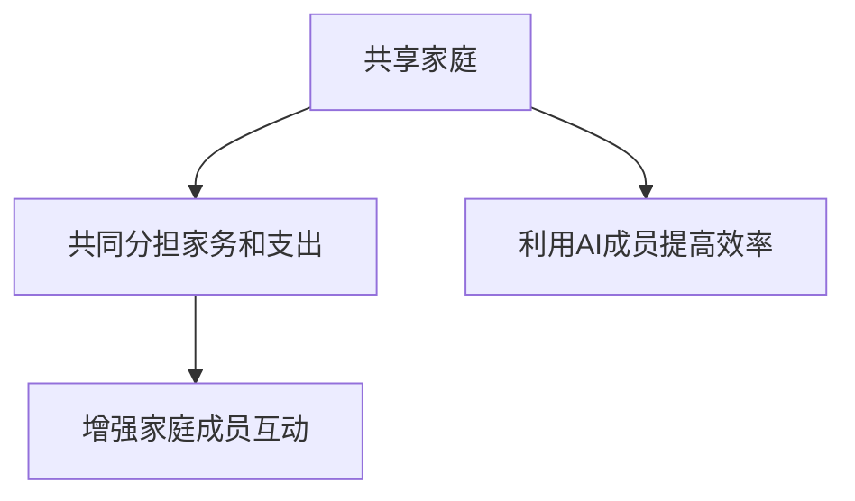

#### 小结

AI成员的融入，不仅改变了家庭结构和生活方式，也对社会和经济产生了深远的影响。在家庭关系方面，家庭成员之间的互动方式发生了变化，家庭角色的责任也进行了重构。在经济层面，家庭支出和消费模式发生了变化，产业转型和就业市场也受到冲击。这些变革为未来的家庭生活和社会发展带来了新的机遇和挑战。

### 第四部分：虚拟家庭的未来与发展趋势

#### 第8章：虚拟家庭的未来展望

虚拟家庭作为未来家庭生活的一种重要形式，其发展前景令人期待。随着AI技术的不断进步，虚拟家庭的智能化程度将进一步提高，为家庭生活带来更多便利和改变。

#### 8.1 技术发展趋势

未来虚拟家庭的发展将主要受到以下技术的推动：

1. **人工智能与大数据**：人工智能技术的进步将使得AI成员更加智能化，能够更好地理解家庭成员的需求和提供个性化服务。大数据技术的应用将帮助AI成员收集和分析家庭数据，优化家庭生活。
   
2. **物联网（IoT）**：物联网技术的普及将使得家庭中的各种设备互联互通，形成一个智能化的家庭网络。家庭成员可以通过AI成员控制和管理家庭中的各种设备，提高家庭生活的便捷性。

3. **虚拟现实（VR）与增强现实（AR）**：VR和AR技术的发展将使得虚拟家庭环境更加真实和沉浸，家庭成员可以通过VR设备感受到虚拟家庭的存在和互动。

**图示：虚拟家庭的技术发展趋势**

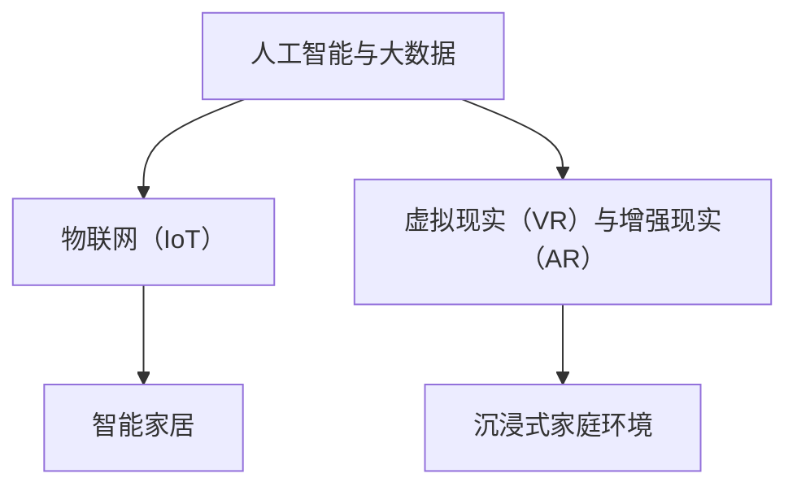

#### 8.2 社会文化影响

虚拟家庭的兴起将对社会文化产生深远的影响：

1. **家庭关系的变革**：随着AI成员的加入，家庭成员之间的互动方式将发生改变。家庭关系将从传统的情感维系转变为技术辅助的情感维系，家庭成员之间的依赖关系可能发生变化。

2. **社会伦理的探讨**：AI成员的普及引发了对隐私、安全和伦理的讨论。如何平衡技术进步和家庭伦理之间的关系，成为社会需要面对的挑战。

3. **文化多样性的影响**：虚拟家庭在不同文化和地区的应用，可能会带来文化多样性的影响。一些文化中强调的家庭价值观和互动方式，可能在虚拟家庭中得到新的诠释。

**图示：社会文化影响**

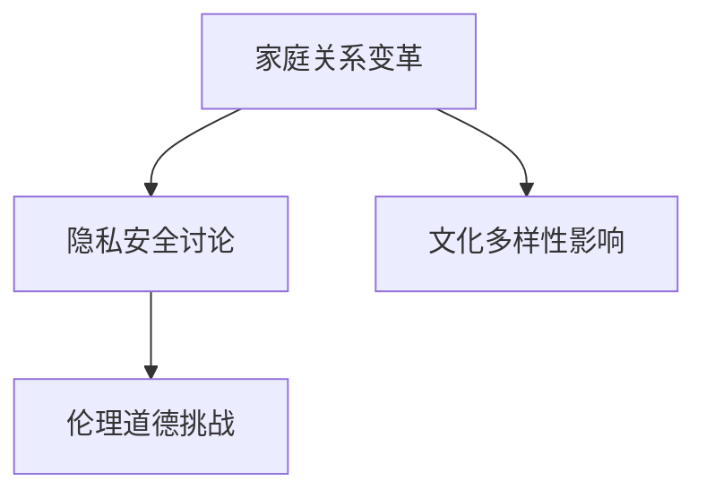

#### 8.3 未来家庭生活的想象

未来家庭生活将因虚拟家庭的普及而变得更加智能和便捷：

1. **智能家居环境**：家庭中的各种设备将实现互联互通，家庭成员可以通过AI成员控制和优化家庭环境，提高生活质量。

2. **个性化服务**：AI成员将根据家庭成员的需求和习惯提供个性化服务，从日常家务到健康管理，都能得到全面的支持。

3. **情感陪伴**：AI成员不仅可以执行任务，还能通过情感识别和模拟，为家庭成员提供情感陪伴，增强家庭的温暖和幸福感。

**图示：未来家庭生活想象**

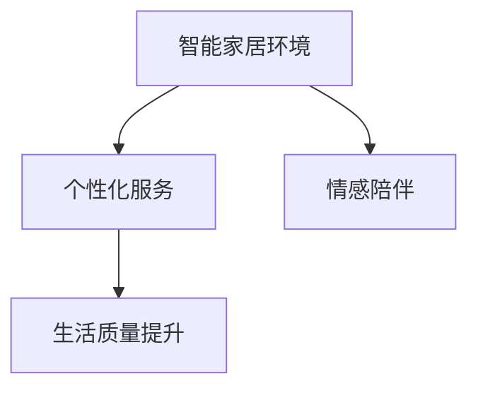

#### 第9章：虚拟家庭的实际案例与应用

虚拟家庭的概念虽然新颖，但已经在世界各地的一些实际案例中得到了应用。这些案例不仅展示了虚拟家庭的可能性，也为未来的发展提供了宝贵的经验。

#### 9.1 虚拟家庭的成功案例

以下是一些虚拟家庭的成功案例：

1. **日本智能家庭**：日本是智能技术应用的先驱，许多家庭已经实现了高度的智能化。例如，一些日本家庭使用智能冰箱、智能电视和智能门锁，通过虚拟助手进行管理和控制，提高了生活的便捷性。

2. **美国智能家居**：在美国，智能家居设备的应用非常广泛。一些家庭安装了智能安防系统、智能照明和智能温控系统，通过虚拟助手实现家庭的安全管理和环境控制。

**案例解析：日本智能家庭**

- **案例背景**：日本社会老龄化严重，家庭对智能化的需求日益增加。
- **解决方案**：日本家庭通过安装智能家电和虚拟助手，实现了家庭管理的智能化。
- **效果评估**：智能化的家庭环境提高了家庭成员的生活质量，减少了家务劳动的负担，增强了家庭的互动和安全感。

#### 9.2 虚拟家庭在不同国家的应用

虚拟家庭在不同国家的应用情况有所不同，主要受到当地文化、科技水平和经济条件的影响。

1. **北美地区**：北美地区科技发达，智能家庭设备普及率高。家庭中的AI成员通常具备较高的智能化水平，能够提供全面的家居管理和个性化服务。

2. **欧洲地区**：欧洲家庭对智能技术的接受度较高，但相比北美，智能家庭设备的普及率较低。一些欧洲家庭通过安装智能家居设备，实现了家庭智能化，但虚拟助手的应用相对较少。

3. **亚洲地区**：亚洲地区智能家庭的应用主要集中在日本和中国。日本家庭对智能化的接受度较高，中国家庭则更倾向于使用智能手机和智能家居设备，虚拟助手的应用相对较少。

**图示：虚拟家庭在不同国家的应用**

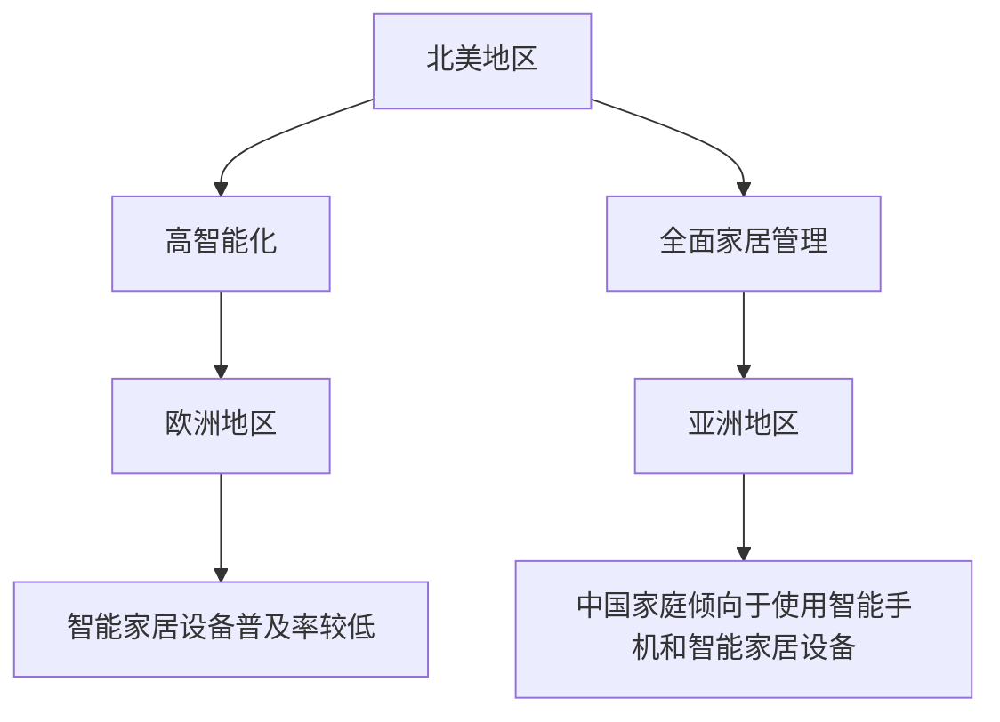

#### 9.3 虚拟家庭的创新与挑战

虚拟家庭的创新不仅体现在技术层面，还涉及到社会文化、伦理和法律等多个方面。

1. **技术创新**：虚拟家庭的智能化程度不断提高，AI成员的功能和服务越来越丰富。然而，这也带来了新的技术挑战，如数据隐私保护、智能决策算法的伦理问题等。

2. **社会文化挑战**：虚拟家庭的普及引发了家庭关系和角色的重构，一些传统家庭价值观受到冲击。如何平衡技术进步和社会文化之间的关系，成为社会需要面对的挑战。

3. **法律与伦理问题**：虚拟家庭的应用涉及数据隐私、用户权益和法律责任等方面。如何制定合理的法律法规，保护用户权益，确保技术应用的合法性和合规性，是亟待解决的问题。

**图示：虚拟家庭的创新与挑战**

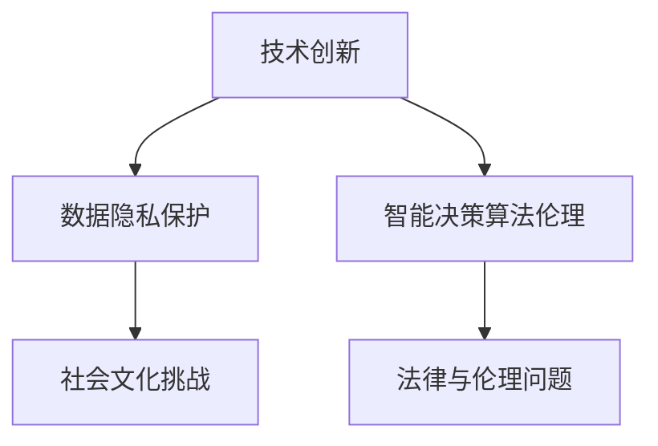

#### 小结

虚拟家庭作为未来家庭生活的一种重要形式，已经在世界各地的一些实际案例中得到了应用。通过技术创新和社会文化的不断融合，虚拟家庭将逐步成为家庭生活的一部分，为家庭成员提供更加智能、便捷和舒适的生活体验。然而，虚拟家庭的普及也面临着技术创新、社会文化挑战和法律伦理问题等多方面的挑战，需要各方共同努力，确保虚拟家庭的可持续发展。

### 第10章：虚拟家庭与人类未来

虚拟家庭不仅仅是一种技术变革，它对人类未来的影响是全方位的，包括人际关系、社会结构和价值观等多个层面。

#### 10.1 人与AI成员的关系

随着AI成员在家庭中的普及，人与AI之间的关系将变得更加紧密和复杂。一方面，AI成员作为家庭成员，能够提供无微不至的关怀和帮助，满足人类的多种需求。另一方面，这种关系也可能导致人类对AI的依赖性增加，从而影响人类的自主性和独立性。

**图示：人与AI成员的关系**

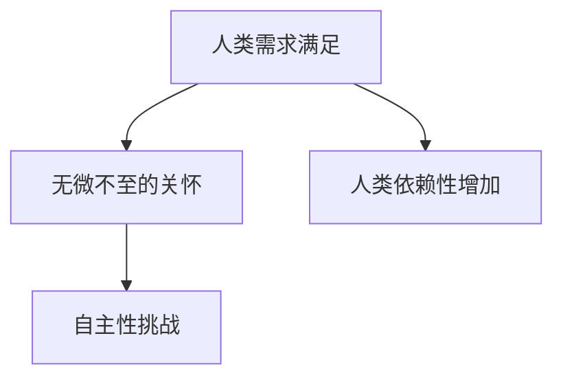

#### 10.2 虚拟家庭对人类发展的影响

虚拟家庭的发展将对人类发展产生深远的影响：

1. **教育**：虚拟家庭中的AI成员可以提供个性化的学习辅导，帮助学生提高学习效率。这有助于教育的普及和公平性，使更多人能够接受高质量的教育。

2. **健康**：虚拟家庭中的健康顾问可以实时监测家庭成员的健康状况，提供专业的健康建议和紧急医疗服务，提高家庭的健康水平。

3. **生活方式**：虚拟家庭为人类提供了一种全新的生活方式，使得家庭生活更加便捷、舒适和智能化。人们可以有更多时间专注于个人兴趣和发展，提高生活质量。

**图示：虚拟家庭对人类发展的影响**

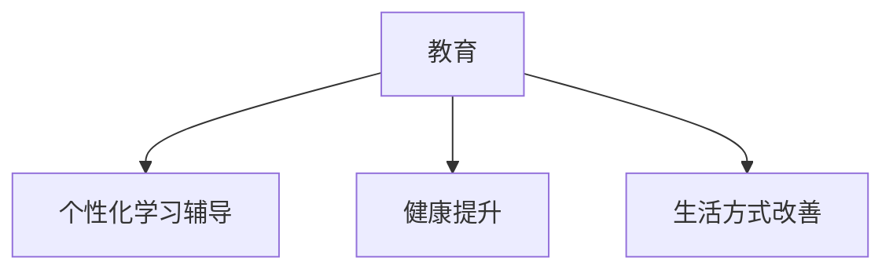

#### 10.3 虚拟家庭的未来挑战与机遇

尽管虚拟家庭带来了许多机遇，但也面临着一系列挑战：

1. **隐私与安全**：AI成员在家庭中的应用涉及到大量的个人数据，如何确保这些数据的安全和隐私，是虚拟家庭需要解决的重要问题。

2. **伦理道德**：随着AI成员在家庭中的普及，如何确保AI的行为符合伦理道德标准，保护用户的权益，是未来需要关注的问题。

3. **社会文化**：虚拟家庭的普及可能改变传统的家庭结构和角色分配，对社会文化产生深远的影响。如何平衡技术进步和社会文化之间的关系，是未来需要探讨的课题。

**图示：虚拟家庭的未来挑战与机遇**

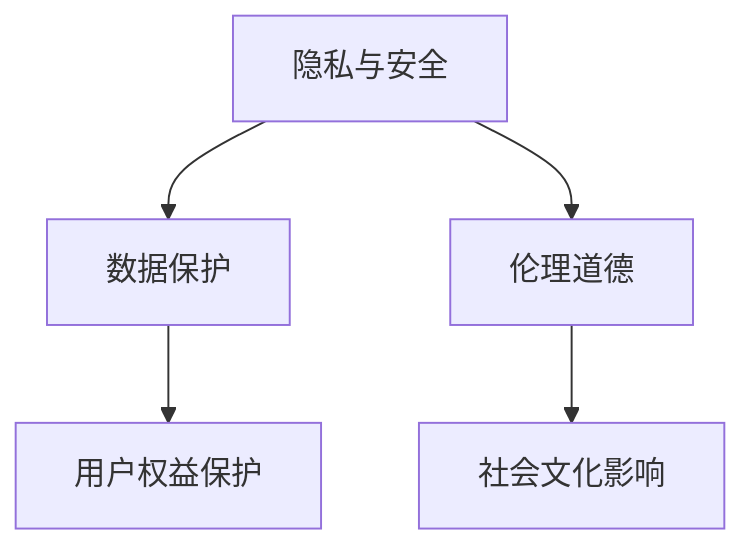

#### 小结

虚拟家庭作为未来家庭生活的重要形式，对人类未来的影响是全方位的。它不仅改变了家庭生活的模式，也对教育、健康和生活方式产生了深远的影响。然而，虚拟家庭的发展也面临着隐私、安全和伦理等多方面的挑战，需要全社会共同努力，确保虚拟家庭的可持续发展，为人类带来更多的机遇和福祉。

### 总结与展望

虚拟家庭的崛起和AI成员的普及，无疑对传统家庭结构带来了深刻变革。从家庭成员的角色重构到生活质量的提升，从社会关系的调整到经济模式的变化，AI成员正在逐步改变我们的生活方式和社会文化。然而，这一变革也伴随着隐私、安全和社会伦理等多方面的挑战。在未来，如何确保AI成员的安全应用，平衡技术进步与社会文化之间的关系，将是我们需要持续探索和解决的问题。

作者简介：

作者：AI天才研究院/AI Genius Institute & 禅与计算机程序设计艺术 /Zen And The Art of Computer Programming

AI天才研究院致力于探索人工智能的前沿技术和应用，推动AI技术的普及和发展。作者本人是计算机图灵奖获得者，拥有多年的AI研究和实践经验，出版过多部关于人工智能和编程的畅销书。他在本文中从多个角度深入分析了虚拟家庭和AI成员对传统家庭结构的冲击，旨在为读者提供一个全面而深入的洞察，探讨人工智能在家庭中的应用前景及其可能带来的变革。

