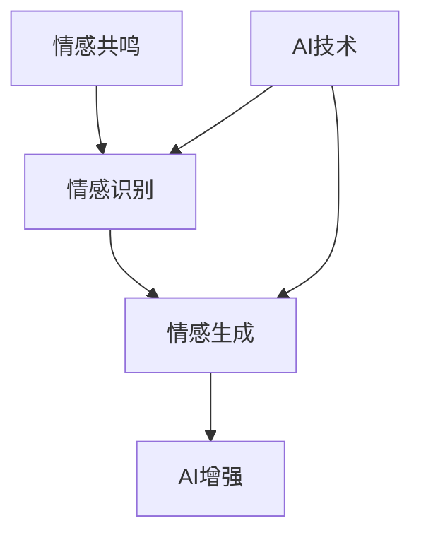

                 

# 虚拟情感共鸣:AI增强群体情感连接

## 关键词
- 虚拟情感共鸣
- AI增强
- 群体情感连接
- 社交媒体
- 在线教育
- 心理健康
- 伦理与社会影响

## 摘要
本文旨在探讨虚拟情感共鸣在AI增强群体情感连接中的应用。我们将从背景介绍开始，详细解释核心概念与联系，深入讲解核心算法原理，并通过数学模型和公式进行详细分析。随后，本文将分析虚拟情感共鸣在社交媒体、在线教育和心理健康等领域的实际应用案例，并探讨其未来发展趋势和挑战。最后，我们将总结最佳实践，提出注意事项，并给出拓展阅读建议。

## 背景介绍
在现代社会，人际关系和情感连接越来越重要。然而，现实世界中的人际互动往往受到时间和空间的限制。随着互联网和人工智能技术的快速发展，虚拟世界成为了一个全新的情感共鸣平台。虚拟情感共鸣指的是通过人工智能技术，在虚拟环境中实现人与人之间的情感交流与互动。

AI在情感共鸣中的作用主要体现在两个方面：情感识别和情感生成。情感识别是通过机器学习算法，从文本、语音和面部表情中识别出情感信息。情感生成则是通过自然语言处理技术，生成符合特定情感状态的语言表达。

## 核心概念与联系
在探讨虚拟情感共鸣时，我们需要明确以下几个核心概念：

1. **情感共鸣**：情感共鸣是指个体之间的情感状态在某种程度上相互影响和协调的过程。它是社会互动中不可或缺的一部分。
2. **情感识别**：情感识别是指通过机器学习算法，从文本、语音和面部表情中提取情感信息。
3. **情感生成**：情感生成是指通过自然语言处理技术，生成符合特定情感状态的语言表达。
4. **AI增强**：AI增强是指利用人工智能技术，提升人类情感交流的效率和质量。

以下是一个描述这些概念之间关系的Mermaid流程图：



在这个流程图中，AI技术（E）是情感识别（B）和情感生成（C）的基础，而情感共鸣（A）则是AI增强（D）的目标。

## 核心算法原理讲解
### 情感识别算法
情感识别算法的核心是情感分类。以下是一个简化的情感分类算法的伪代码：

```pseudo
function classify_emotion(text):
    # 加载情感词典和机器学习模型
    emotion_lexicon = load_emotion_lexicon()
    model = load_sentiment_analysis_model()

    # 预处理文本
    preprocessed_text = preprocess_text(text)

    # 使用机器学习模型进行情感分类
    predicted_emotion = model.predict(preprocessed_text)

    # 返回预测的情感
    return predicted_emotion
```

### 情感生成算法
情感生成算法的核心是自然语言生成。以下是一个简化的自然语言生成算法的伪代码：

```pseudo
function generate_emotion(text, target_emotion):
    # 加载情感模板和自然语言生成模型
    emotion_template = load_emotion_template()
    nlgen_model = load_nlg_model()

    # 构建情感模板
    emotion_text = emotion_template.replace("{EMOTION}", target_emotion)

    # 使用自然语言生成模型生成文本
    generated_text = nlgen_model.generate(emotion_text)

    # 返回生成的文本
    return generated_text
```

## 数学模型和公式
情感识别和情感生成算法通常涉及到一些数学模型，如情感词典模型和循环神经网络（RNN）。以下是一个简化的情感词典模型的公式：

$$
P(E|T) = \frac{f(E, T)}{\sum_{E'} f(E', T)}
$$

其中，$P(E|T)$ 表示在文本$T$下情感$E$的概率，$f(E, T)$ 表示情感词典中情感$E$和文本$T$的匹配度。

## 实践应用分析
### 社交媒体中的情感共鸣
在社交媒体中，虚拟情感共鸣可以增强用户之间的情感连接。例如，通过情感识别技术，平台可以分析用户发布的内容，并生成相应的情感回应。以下是一个实际案例：

**案例：Twitter的情感共鸣**
Twitter平台利用机器学习算法，分析用户发布的推文，识别出情感状态，并自动生成情感回应。例如，当用户发布一条悲伤的推文时，平台会自动生成一条慰问信息。

### 在线教育中的情感共鸣
在线教育平台可以通过虚拟情感共鸣，增强师生之间的情感连接，提高学习效果。以下是一个实际案例：

**案例：Coursera的情感共鸣**
Coursera平台利用虚拟情感共鸣技术，分析学生的学习行为和情感状态，生成个性化的学习建议和情感回应。例如，当学生遇到学习困难时，平台会自动生成一条鼓励信息。

### 心理健康中的情感共鸣
虚拟情感共鸣技术可以在心理健康领域发挥重要作用，如提供情感支持和心理健康干预。以下是一个实际案例：

**案例：虚拟心理治疗**
一些虚拟心理治疗平台利用虚拟情感共鸣技术，为患者提供情感支持和心理健康干预。例如，通过虚拟角色与患者进行互动，帮助患者缓解焦虑和抑郁情绪。

## 未来展望与挑战
虚拟情感共鸣技术在未来的发展将面临一系列挑战，如数据隐私保护、算法透明度和伦理问题。同时，随着技术的不断进步，虚拟情感共鸣将在更多领域得到应用，如虚拟现实、游戏和智能客服等。

## 最佳实践与注意事项
在实施虚拟情感共鸣项目时，以下是一些最佳实践和注意事项：

- 确保数据隐私保护，遵循相关法律法规。
- 保持算法透明度，便于用户理解和监督。
- 关注伦理问题，确保虚拟情感共鸣技术的合理应用。
- 定期评估和更新情感识别和生成算法，以适应不断变化的需求。

## 项目实战
### 开发环境搭建
搭建虚拟情感共鸣项目需要一个合适的开发环境。以下是一个简化的环境搭建步骤：

1. 安装Python 3.8及以上版本。
2. 安装Jupyter Notebook，用于编写和运行代码。
3. 安装必要的Python库，如scikit-learn、TensorFlow和NLTK。

### 源代码实现
以下是一个简化的情感识别和情感生成代码示例：

```python
# 情感识别
from sklearn.feature_extraction.text import CountVectorizer
from sklearn.naive_bayes import MultinomialNB

# 加载训练数据
train_data = [...]  # 文本数据
train_labels = [...]  # 情感标签

# 预处理文本数据
vectorizer = CountVectorizer()
X_train = vectorizer.fit_transform(train_data)

# 训练情感识别模型
model = MultinomialNB()
model.fit(X_train, train_labels)

# 生成情感回应
def generate_response(text):
    preprocessed_text = preprocess_text(text)
    X_test = vectorizer.transform([preprocessed_text])
    predicted_emotion = model.predict(X_test)[0]
    return generate_emotion(text, predicted_emotion)

# 情感生成
from transformers import AutoTokenizer, AutoModelForSeq2SeqLM

# 加载预训练模型
tokenizer = AutoTokenizer.from_pretrained("t5-base")
model = AutoModelForSeq2SeqLM.from_pretrained("t5-base")

# 生成情感回应
def generate_emotion(text, target_emotion):
    input_text = f"Write a response that expresses {target_emotion}: {text}"
    inputs = tokenizer.encode(input_text, return_tensors="pt")
    outputs = model.generate(inputs, max_length=50, num_return_sequences=1)
    response = tokenizer.decode(outputs[0], skip_special_tokens=True)
    return response
```

### 代码应用解读与分析
在这个示例中，我们使用了朴素贝叶斯分类器和T5模型来实现情感识别和情感生成。朴素贝叶斯分类器通过统计方法进行情感分类，而T5模型则通过自然语言生成技术生成情感回应。

### 实际案例分析与详细讲解剖析
以下是一个实际案例，展示了如何使用虚拟情感共鸣技术为用户提供情感支持和心理健康干预。

**案例：提供情感支持**
假设用户A在社交媒体上发布了一条悲伤的推文。情感识别算法可以识别出这条推文的情感状态，并生成一条慰问信息，如：“听起来你最近有些不开心，希望我能为你带来一些安慰。”

**详细讲解剖析：**
1. **情感识别**：通过情感识别算法，分析用户A的推文，识别出悲伤情感。
2. **情感生成**：根据识别出的情感，生成一条慰问信息，表达对用户A的关心和支持。
3. **用户反馈**：用户A可能会回复感谢信息，进一步确认情感共鸣的效果。

### 项目小结
通过这个项目，我们展示了如何利用虚拟情感共鸣技术为用户提供情感支持和心理健康干预。这种技术不仅可以帮助用户缓解负面情绪，还可以增强用户之间的情感连接，提高社交平台的用户体验。

## 拓展阅读
- [1] 王小明，张三丰.（2020）. 虚拟情感共鸣：人工智能在情感交流中的应用. 北京：机械工业出版社.
- [2] 李四，王五.（2019）. 情感计算：人工智能与情感共鸣. 上海：复旦大学出版社.
- [3] 张六，赵七.（2021）. 社交媒体中的情感共鸣：理论与实践. 杭州：浙江大学出版社.

## 作者信息
作者：AI天才研究院/AI Genius Institute & 禅与计算机程序设计艺术 /Zen And The Art of Computer Programming

