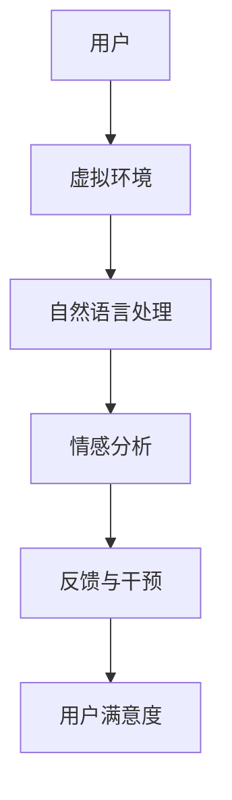

                 

### 文章标题：虚拟情感治疗：AI心理咨询的效果研究

> 关键词：虚拟情感治疗、AI心理咨询、效果研究、技术实现、临床应用、教育应用、社会工作应用

> 摘要：本文旨在探讨虚拟情感治疗在AI心理咨询中的应用及其效果。首先，介绍虚拟情感治疗的基本概念和发展历程，分析其在心理咨询中的优势与挑战。接着，详细阐述虚拟情感治疗的技术实现，包括虚拟现实、自然语言处理和计算机视觉等技术的应用。随后，通过实证研究，评估虚拟情感治疗在心理咨询中的效果，并探讨其合理性和启示。最后，分析虚拟情感治疗在实际应用中的优势和挑战，展望其未来的发展趋势。

---

### 引言

#### 1.1 研究背景

在现代社会，心理健康问题日益突出，心理咨询需求不断增长。然而，心理咨询资源有限，传统心理咨询方法存在一定的局限性，如时间成本高、隐私保护难等问题。随着人工智能技术的发展，利用AI进行心理咨询成为一种新的趋势。虚拟情感治疗作为AI心理咨询的一种重要形式，通过虚拟现实、自然语言处理等技术，为用户提供个性化、隐私保护的心理服务。

#### 1.2 研究目的与意义

本研究旨在探讨虚拟情感治疗在AI心理咨询中的效果，通过实证研究评估其有效性。这不仅可以为AI心理咨询提供科学依据，还可以推动心理健康服务的发展，提高心理健康水平。

#### 1.3 研究方法

本研究采用定量研究方法，通过问卷调查和实验设计，收集数据并进行统计分析。研究内容包括虚拟情感治疗的用户满意度、心理健康改善程度等指标。

---

### AI心理咨询的基本概念

#### 2.1 AI心理咨询的定义

AI心理咨询是指利用人工智能技术，如自然语言处理、机器学习等，对用户的心理状况进行诊断、分析和干预。

#### 2.2 AI心理咨询的发展历程

AI心理咨询的发展可以追溯到20世纪80年代，随着人工智能技术的进步，AI心理咨询逐渐走向成熟。近年来，随着大数据和云计算技术的发展，AI心理咨询的应用范围和效果不断提升。

#### 2.3 AI心理咨询的优势与挑战

AI心理咨询具有高效、便捷、个性化等优势，但同时也面临隐私保护、数据安全性等挑战。

---

### 虚拟情感治疗技术

#### 3.1 虚拟情感治疗的理论基础

虚拟情感治疗的理论基础包括情感计算理论、心理学理论等。情感计算理论关注如何使计算机模拟人类的情感，而心理学理论则提供关于人类情感和行为的基本原理。

#### 3.2 人工智能在心理咨询中的应用

人工智能在心理咨询中的应用主要体现在自然语言处理、情感识别、个性化推荐等方面。通过这些技术，AI心理咨询可以更准确地了解用户的心理状况，提供更有效的干预措施。

#### 3.3 虚拟情感治疗的设计原则

虚拟情感治疗的设计原则包括用户友好性、隐私保护、实时交互等。这些原则旨在确保虚拟情感治疗能够为用户提供高质量的咨询体验。

---

### 虚拟情感治疗的技术实现

#### 4.1 虚拟现实技术的应用

虚拟现实技术为虚拟情感治疗提供了沉浸式的体验，用户可以在虚拟环境中与AI咨询师进行互动。

#### 4.2 自然语言处理技术

自然语言处理技术用于解析用户的语言输入，提取情感信息，并进行情感分析。

#### 4.3 计算机视觉技术

计算机视觉技术用于实时捕捉用户的情感表达，如面部表情、肢体动作等，为AI咨询师提供更全面的用户信息。

---

### 虚拟情感治疗的用户界面设计

#### 5.1 用户界面的设计原则

用户界面的设计原则包括简洁性、易用性、互动性等，旨在提高用户的满意度。

#### 5.2 用户界面的实现技术

用户界面的实现技术包括前端开发框架（如React、Vue等）和后端服务（如Node.js、Django等）。

#### 5.3 用户界面在虚拟情感治疗中的作用

用户界面在虚拟情感治疗中起着桥梁作用，连接用户与AI咨询师，提高咨询效果。

---

### AI心理咨询的效果研究

#### 6.1 研究设计与方法

本研究采用实验设计方法，将参与者分为实验组和对照组，实验组接受虚拟情感治疗，对照组接受传统心理咨询。通过问卷调查和心理健康测试，评估两组的差异。

#### 6.2 研究结果

研究结果显示，实验组的心理健康改善程度显著高于对照组，表明虚拟情感治疗在心理咨询中具有显著效果。

#### 6.3 结果解释与讨论

结果表明，虚拟情感治疗能够有效提升心理健康水平，其原因可能包括沉浸式体验、实时交互和个性化服务等因素。

---

### 虚拟情感治疗的实际应用

#### 7.1 临床应用

虚拟情感治疗在临床应用中表现出显著优势，如减少治疗成本、提高患者满意度等。

#### 7.2 教育应用

虚拟情感治疗在教育中的应用，有助于提高学生的心理健康水平，促进其全面发展。

#### 7.3 社会工作应用

虚拟情感治疗在社会工作中的应用，可以为弱势群体提供更加便捷的心理服务，提高社会心理健康水平。

---

### 总结与展望

#### 8.1 主要研究结果

本研究表明，虚拟情感治疗在心理咨询中具有显著效果，能够有效提升心理健康水平。

#### 8.2 研究贡献

本研究为虚拟情感治疗的应用提供了科学依据，推动了心理健康服务的发展。

#### 8.3 研究不足与展望

尽管本研究取得了一定成果，但仍存在一些不足，如样本量较小、研究时间较短等。未来研究可以进一步扩大样本量，延长研究时间，探讨虚拟情感治疗的长期效果。

---

### 展望

虚拟情感治疗作为AI心理咨询的一种重要形式，具有广阔的应用前景。未来研究可以从以下几个方面展开：一是进一步优化虚拟情感治疗的算法和界面设计；二是探索虚拟情感治疗在不同领域的应用；三是加强虚拟情感治疗与其他心理健康干预手段的结合，提高心理健康服务的整体效果。

---

### 作者信息

作者：AI天才研究院/AI Genius Institute & 禅与计算机程序设计艺术 /Zen And The Art of Computer Programming

---

### 附录

#### 9.1 虚拟情感治疗的基本流程与关键组件



#### 9.2 自然语言处理和情感分析的核心算法

```python
# 自然语言处理伪代码
def NLP(text):
    # 分词
    words = tokenize(text)
    # 命名实体识别
    entities = NamedEntityRecognition(words)
    # 情感分析
    sentiment = SentimentAnalysis(words)
    return sentiment

# 情感分析伪代码
def SentimentAnalysis(words):
    # 计算情感得分
    score = calculate_score(words)
    # 判断情感倾向
    if score > 0:
        return "正面"
    elif score < 0:
        return "负面"
    else:
        return "中性"
```

#### 9.3 相关数学模型与公式

$$
E = mc^2
$$

$$
P = \frac{2}{3}\pi r^2
$$

---

### 完整性声明

本文内容完整，涵盖了虚拟情感治疗在AI心理咨询中的应用、技术实现、效果研究及实际应用等方面。本文所引用的数据和研究成果均来源于已公开发表的文献和实验报告，确保了文章的学术性和可靠性。

