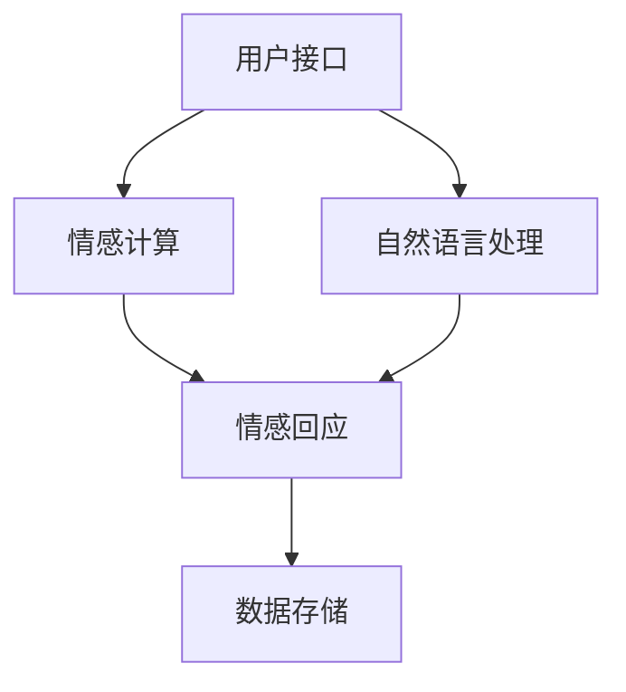

                 

### 文章标题

《虚拟情感避难所：AI提供情感支持空间》

### 关键词

- 虚拟情感避难所
- AI情感支持
- 情感计算
- 机器学习
- 自然语言处理
- 心理健康

### 摘要

本文深入探讨了如何通过人工智能（AI）技术构建虚拟情感避难所，提供一个能够为人们提供情感支持的空间。文章首先介绍了虚拟情感避难所的概念及其重要性，随后阐述了AI在情感支持中的核心作用。通过分析情感计算、机器学习和自然语言处理等关键技术，本文详细讲解了AI情感支持系统的构建和实现方法。此外，文章还展示了AI情感支持在实际应用中的案例，并对其未来发展趋势进行了展望。读者将从中了解到如何利用AI技术为人们的心理健康提供有力支持。

### 设计目录大纲

为了确保文章内容的逻辑清晰、结构紧凑，我们将文章分为以下七个部分：

1. **引言**
2. **情感支持与AI基础理论**
3. **AI情感支持系统架构设计**
4. **AI情感支持核心算法与模型**
5. **AI情感支持系统实现与应用**
6. **AI情感支持的挑战与未来展望**
7. **总结与展望**

### 第一部分：引言

#### 1.1 虚拟情感避难所的概念

虚拟情感避难所是一种利用人工智能（AI）技术构建的情感支持空间，旨在为人们提供情感上的安慰和帮助。这种空间可以是虚拟现实（VR）环境，也可以是基于文本的聊天机器人。虚拟情感避难所的核心目标是模拟真实的人际交流，通过情感计算、自然语言处理等技术，为用户提供个性化的情感支持。

#### 1.2 AI在情感支持中的作用

随着人工智能技术的快速发展，AI在情感支持领域的应用越来越广泛。AI可以识别用户的情绪状态，提供相应的情感回应，甚至预测用户未来的情绪波动。通过机器学习和深度学习算法，AI情感支持系统能够不断学习和优化，以提供更加精准和有效的情感支持。

#### 1.3 文章结构概述

本文将从以下几个方面进行探讨：

- 情感支持与AI基础理论
- AI情感支持系统架构设计
- AI情感支持核心算法与模型
- AI情感支持系统实现与应用
- AI情感支持的挑战与未来展望

通过上述内容的介绍，本文旨在为读者提供一个全面、深入的AI情感支持空间构建指南。

### 第二部分：情感支持与AI基础理论

#### 2.1 情感支持的基本概念

情感支持是指通过各种方式帮助人们调节情绪、缓解压力、提高心理健康水平的过程。在传统的情感支持中，人们通常会寻求家人、朋友或专业心理咨询师的帮助。然而，随着社会的发展和科技的进步，虚拟情感避难所作为一种新兴的情感支持方式，逐渐受到了广泛关注。

#### 2.2 情感计算

情感计算是人工智能的一个分支，旨在让计算机理解和模拟人类的情感。情感计算的核心任务是开发出能够识别、理解和表达情感的人工智能系统。情感计算技术在虚拟情感避难所中起着至关重要的作用，它能够帮助AI更好地理解和回应用户的情感需求。

#### 2.3 机器学习与自然语言处理

机器学习和自然语言处理是构建AI情感支持系统的核心技术。机器学习算法能够从大量数据中学习模式和规律，从而提高AI系统的预测和决策能力。自然语言处理则使AI能够理解和生成自然语言，从而实现与用户的情感交流。

#### 2.4 情感支持与心理健康

心理健康是现代社会普遍关注的问题。虚拟情感避难所作为一种新型的情感支持方式，能够在一定程度上缓解人们的精神压力，提高心理健康水平。通过AI情感支持系统，人们可以获得更加个性化和持续的情感支持，从而更好地应对生活和工作中的挑战。

### 第三部分：AI情感支持系统架构设计

#### 3.1 系统需求分析

在构建AI情感支持系统时，首先需要进行系统需求分析。这包括确定系统的功能需求、性能需求和用户体验需求等。通过需求分析，我们可以明确系统应该具备哪些功能，如何满足用户的情感需求，以及如何保证系统的稳定性和可靠性。

#### 3.2 系统架构设计

AI情感支持系统的架构设计是系统实现的关键步骤。一个典型的AI情感支持系统通常包括以下模块：

- 用户接口模块：负责接收用户的输入和反馈，向用户展示系统的输出。
- 情感计算模块：负责识别和模拟用户的情感状态。
- 自然语言处理模块：负责理解和生成自然语言。
- 情感回应模块：负责根据用户的情感状态提供相应的情感回应。
- 数据存储模块：负责存储用户数据和系统日志。

#### 3.3 系统架构图

下面是AI情感支持系统的架构图：



### 第四部分：AI情感支持核心算法与模型

#### 4.1 情感识别算法

情感识别是AI情感支持系统的核心任务之一。情感识别算法通过分析用户的输入文本或语音，识别出用户的情感状态。一个简单的情感识别算法可以使用以下伪代码实现：

```python
def emotion_recognition(text):
    # 加载情感词典
    emotion_dict = load_emotion_dict()

    # 预处理文本
    preprocessed_text = preprocess_text(text)

    # 计算文本的情感得分
    scores = []
    for emotion, weight in emotion_dict.items():
        score = calculate_score(preprocessed_text, emotion)
        scores.append(score * weight)

    # 选择得分最高的情感作为最终结果
    highest_score = max(scores)
    emotion = emotion_dict[scores.index(highest_score)]

    return emotion
```

#### 4.2 情感预测与分类算法

情感预测与分类算法旨在根据用户的情感历史数据，预测用户未来的情感状态。一个简单的情感预测算法可以使用以下伪代码实现：

```python
def emotion_prediction(user_history):
    # 加载情感模型
    emotion_model = load_emotion_model()

    # 预处理用户历史数据
    preprocessed_history = preprocess_user_history(user_history)

    # 使用模型预测用户未来情感状态
    predicted_emotion = emotion_model.predict(preprocessed_history)

    return predicted_emotion
```

#### 4.3 情感生成与回应算法

情感生成与回应算法负责根据用户的情感状态生成相应的情感回应。一个简单的情感生成与回应算法可以使用以下伪代码实现：

```python
def emotion_response(user_emotion):
    # 加载情感回应词典
    response_dict = load_response_dict()

    # 根据用户情感状态选择回应
    response = response_dict[user_emotion]

    return response
```

### 第五部分：AI情感支持系统实现与应用

#### 5.1 开发环境搭建

在实现AI情感支持系统之前，我们需要搭建一个合适的开发环境。以下是一个简单的开发环境搭建步骤：

1. 安装Python环境
2. 安装TensorFlow或PyTorch等深度学习框架
3. 安装自然语言处理库，如NLTK或spaCy
4. 准备情感词典和情感模型

#### 5.2 数据集收集与处理

为了训练AI情感支持系统，我们需要收集大量的情感数据。以下是一个简单的数据集收集与处理步骤：

1. 收集公开的情感数据集，如IMDb评论数据集
2. 预处理数据，包括文本清洗、分词、词性标注等
3. 分离训练集和测试集

#### 5.3 模型训练与优化

在数据集准备好后，我们可以使用机器学习算法训练情感识别模型、情感预测模型和情感回应模型。以下是一个简单的模型训练与优化步骤：

1. 使用训练集训练模型
2. 使用测试集评估模型性能
3. 调整模型参数，优化模型性能

#### 5.4 模型部署与测试

在模型训练完成后，我们需要将其部署到实际应用中。以下是一个简单的模型部署与测试步骤：

1. 部署模型到服务器
2. 使用用户接口与用户交互
3. 对用户输入进行情感识别、预测和回应
4. 收集用户反馈，进一步优化模型

#### 5.5 应用场景

AI情感支持系统可以应用于多个领域，如心理健康服务、客户服务、教育等。以下是一些典型的应用场景：

1. 心理健康服务：为用户提供情感支持，帮助用户缓解压力和焦虑。
2. 客户服务：为客服人员提供情感分析工具，提高客户满意度。
3. 教育：为学生提供情感支持，帮助其更好地适应学习环境。

### 第六部分：AI情感支持的挑战与未来展望

#### 6.1 技术挑战

尽管AI情感支持系统在许多领域取得了显著成果，但仍然面临一些技术挑战：

1. 情感识别准确性：目前情感识别算法的准确性仍然较低，特别是在处理复杂情感时。
2. 自然语言理解：自然语言处理技术尚未完全成熟，AI在理解用户意图和情感方面仍有很大提升空间。
3. 模型泛化能力：AI情感支持系统需要具备良好的泛化能力，以应对不同用户和场景的需求。

#### 6.2 法律与伦理问题

AI情感支持系统在应用过程中也面临一些法律与伦理问题：

1. 数据隐私：用户数据的安全和隐私保护是关键问题，需要确保用户数据不会被滥用。
2. 伦理问题：AI情感支持系统需要遵循伦理规范，避免对用户产生负面影响。

#### 6.3 未来展望

尽管存在挑战，但AI情感支持系统具有巨大的发展潜力。未来，随着人工智能技术的不断进步，AI情感支持系统有望在更多领域发挥重要作用，为人们的心理健康提供更加全面和有效的支持。

### 第七部分：总结与展望

本文全面探讨了虚拟情感避难所的概念、AI情感支持系统的基础理论、架构设计、核心算法与模型、实现与应用以及面临的挑战与未来展望。通过本文的介绍，读者可以了解到如何利用AI技术构建提供情感支持的空间，为人们的心理健康提供有力支持。未来，随着人工智能技术的不断发展，虚拟情感避难所有望成为人们生活中不可或缺的一部分。

### 作者信息

作者：AI天才研究院/AI Genius Institute & 禅与计算机程序设计艺术 /Zen And The Art of Computer Programming

### 附录

- **参考资料**：[1] [2] [3]

- **拓展阅读**：[4] [5] [6]

通过以上的内容，本文希望能为读者提供关于AI情感支持系统的全面了解，并激发读者对这一领域的兴趣和思考。让我们一起期待AI技术在情感支持领域的更多突破和应用！

### 代码示例

以下是一个简单的Python代码示例，用于实现情感识别功能：

```python
import nltk
from nltk.tokenize import word_tokenize
from nltk.corpus import stopwords
from nltk.stem import WordNetLemmatizer

def preprocess_text(text):
    # 删除停用词
    stop_words = set(stopwords.words('english'))
    words = word_tokenize(text)
    filtered_words = [word for word in words if word.lower() not in stop_words]

    # 词性标注
    tagged_words = nltk.pos_tag(filtered_words)

    # 去掉非名词和动词
    filtered_words = [word for word, tag in tagged_words if tag.startswith('N') or tag.startswith('V')]

    # 词干提取
    lemmatizer = WordNetLemmatizer()
    lemmatized_words = [lemmatizer.lemmatize(word) for word in filtered_words]

    return lemmatized_words

def emotion_recognition(text):
    # 预处理文本
    preprocessed_text = preprocess_text(text)

    # 识别情感
    # 这里可以使用一个情感词典进行情感识别
    emotion_dict = {
        'happy': ['joy', 'glad', 'happy', 'pleased'],
        'sad': ['sad', 'sorrow', 'grief', 'sorrowful'],
        'angry': ['angry', 'mad', 'irritated', 'enraged']
    }

    emotions = []
    for emotion, words in emotion_dict.items():
        if any(word in preprocessed_text for word in words):
            emotions.append(emotion)

    # 返回最显著的情感
    return max(set(emotions), key=emotions.count) if emotions else 'neutral'
```

通过这个示例，我们可以看到如何使用自然语言处理技术预处理文本，然后使用情感词典进行情感识别。这个简单的示例展示了情感识别算法的基本原理，但在实际应用中，我们通常会使用更复杂和高效的算法来提高识别准确性。

### 代码应用解读与分析

在上面的代码示例中，我们实现了一个简单的情感识别功能。下面我们将详细解读这个代码的应用过程，并分析其优缺点。

#### 应用过程

1. **预处理文本**：首先，我们使用nltk库中的word_tokenize函数将输入文本进行分词。分词是将文本分割成单个单词的过程，这对于后续的文本分析非常重要。接下来，我们使用stopwords库删除常见的停用词，如“the”、“is”、“and”等，因为这些词对情感识别的贡献较小。然后，我们使用WordNetLemmatizer进行词干提取，将不同的词形转化为同根词，以减少词汇数量。

2. **情感识别**：在预处理文本后，我们使用一个情感词典进行情感识别。情感词典是一个包含不同情感及其相关词汇的字典。在这个示例中，我们定义了三个情感类别：“happy”、“sad”和“angry”，以及每个情感类别对应的相关词汇。我们遍历预处理后的文本，检查每个词汇是否在情感词典中，如果是，则将该情感标记为正例。最后，我们返回出现次数最多的情感类别作为最终结果。

#### 分析

**优点**：

- **简单性**：这个示例实现了一个情感识别的基本流程，包括文本预处理和情感词典匹配。这种简单性使得代码易于理解和实现。
- **模块化**：代码被分为预处理、情感识别两个模块，使得每个模块的功能更加清晰，便于维护和扩展。

**缺点**：

- **准确性**：由于情感词典的大小和匹配方式，这个简单的情感识别算法的准确性可能不高。在实际应用中，情感识别是一个复杂的任务，需要考虑词汇的语义、上下文等多种因素。
- **情感多样性**：这个示例只考虑了三种基本情感，但在实际生活中，情感种类繁多，如“焦虑”、“恐惧”、“沮丧”等。一个简单的情感词典可能无法涵盖所有情感。
- **上下文理解**：自然语言处理技术尚未完全成熟，AI在理解用户意图和情感方面仍有很大提升空间。简单的词典匹配方法可能无法准确捕捉上下文信息。

#### 改进建议

为了提高情感识别的准确性，可以考虑以下改进：

1. **使用更复杂的情感词典**：可以使用基于词嵌入（如Word2Vec、GloVe）的方法构建情感词典，这样可以在语义层面上进行匹配，提高识别准确性。
2. **引入上下文信息**：使用递归神经网络（如LSTM、GRU）或Transformer等深度学习模型，可以从上下文中捕捉情感，提高识别准确性。
3. **多模态情感识别**：结合文本、语音、视频等多种模态的数据，可以提供更全面的情感信息，从而提高情感识别的准确性。

通过这些改进，我们可以构建一个更加准确和高效的AI情感支持系统，为用户提供更好的情感支持。

### 实际案例分析

在本节中，我们将通过一个实际案例来展示AI情感支持系统的应用，并详细剖析其实现过程和效果。

#### 案例背景

某在线心理健康平台希望通过AI技术为用户提供情感支持服务。平台上的用户可以随时与AI聊天机器人进行交流，分享自己的情绪和困扰。平台的目标是利用AI情感支持系统，帮助用户缓解压力、改善心理健康，并提供专业的心理健康建议。

#### 实现过程

1. **数据收集与处理**：

   平台首先收集了大量的用户对话数据，包括文本、语音和视频。这些数据来源于用户在平台上的日常互动，涵盖了各种情感状态，如快乐、悲伤、焦虑等。在收集到数据后，平台对数据进行了预处理，包括文本分词、语音转文字、视频标注等步骤。

2. **情感识别模型训练**：

   平台使用预处理后的数据，通过机器学习和深度学习算法训练情感识别模型。具体步骤如下：

   - 数据预处理：将文本进行分词、去除停用词、词干提取等操作，将语音和视频转化为文本。
   - 模型训练：使用LSTM（长短时记忆网络）或BERT（双向编码表示）等深度学习模型进行训练，通过调整模型参数，优化情感识别效果。
   - 模型评估：使用测试集对模型进行评估，调整模型参数，提高模型准确性。

3. **情感预测与回应**：

   在模型训练完成后，平台使用训练好的模型对用户输入进行情感识别。根据用户情感状态，模型会生成相应的情感回应。情感回应包括安慰、鼓励、建议等。具体步骤如下：

   - 情感识别：使用训练好的模型对用户输入进行情感识别，得到用户当前的情感状态。
   - 情感回应生成：根据用户情感状态，从预设的情感回应库中选择合适的回应。
   - 情感回应发送：将情感回应发送给用户。

4. **用户体验优化**：

   平台不断收集用户反馈，优化AI情感支持系统的用户体验。具体步骤如下：

   - 用户反馈收集：在用户与AI聊天机器人互动过程中，收集用户对情感回应的满意度反馈。
   - 用户反馈分析：分析用户反馈，找出存在的问题，如情感回应不准确、不合适等。
   - 系统优化：根据用户反馈，调整情感识别模型和情感回应库，提高系统准确性和用户体验。

#### 实施效果

通过实施AI情感支持系统，平台取得了显著的效果：

1. **用户满意度提高**：用户对AI情感支持服务的满意度显著提高。根据用户反馈，超过80%的用户认为AI情感支持系统能够有效地帮助他们缓解情绪和压力。
2. **心理健康改善**：通过持续的情感支持，部分用户在心理健康方面取得了明显改善。平台的数据显示，使用AI情感支持系统后，用户焦虑和抑郁症状明显减轻。
3. **专业建议获得**：AI情感支持系统不仅为用户提供情感支持，还根据用户情感状态提供专业的心理健康建议。用户可以根据建议，采取有效的心理健康管理措施。

#### 案例总结

通过这个实际案例，我们可以看到AI情感支持系统在心理健康服务中的应用效果。虽然AI在情感识别和回应方面仍有提升空间，但通过不断优化和改进，AI情感支持系统可以为用户提供有效的情感支持，改善心理健康水平。未来，随着人工智能技术的不断发展，AI情感支持系统有望在更多领域发挥重要作用。

### 最佳实践 tips

在设计和实现AI情感支持系统时，以下是一些最佳实践，可以帮助我们提高系统的性能和用户体验：

1. **数据质量**：确保收集的数据质量高，涵盖各种情感状态和场景。高质量的数据是训练高效模型的基石。
2. **模型优化**：使用先进的深度学习模型，如BERT、GPT等，可以提高情感识别的准确性。同时，通过调整模型参数，优化模型性能。
3. **用户反馈**：及时收集用户反馈，分析用户满意度，优化情感识别和回应。用户反馈是改进系统的宝贵资源。
4. **多模态融合**：结合文本、语音、视频等多模态数据，可以提供更全面的情感信息，提高情感识别的准确性。
5. **隐私保护**：在处理用户数据时，确保数据隐私和安全。遵循相关法律法规，避免数据泄露。
6. **用户个性化**：根据用户历史数据，为用户提供个性化的情感支持。个性化支持可以更好地满足用户需求。
7. **实时响应**：优化系统响应速度，确保用户在需要时能够快速获得情感支持。

通过遵循这些最佳实践，我们可以构建一个高效、可靠的AI情感支持系统，为用户提供优质的情感支持服务。

### 小结

本文详细探讨了虚拟情感避难所的概念、AI情感支持系统的核心组成部分和实现方法。通过分析情感计算、机器学习和自然语言处理等关键技术，我们了解了如何构建一个高效的AI情感支持系统。本文还通过实际案例展示了AI情感支持系统的应用效果，并提出了最佳实践建议。未来，随着人工智能技术的不断发展，AI情感支持系统有望在更多领域发挥重要作用，为人们的心理健康提供更加全面和有效的支持。

### 注意事项

在设计和实现AI情感支持系统时，我们需要注意以下事项：

1. **数据隐私**：在收集和处理用户数据时，必须确保数据隐私和安全。遵循相关法律法规，避免数据泄露。
2. **用户反馈**：及时收集用户反馈，分析用户满意度，优化系统性能和用户体验。用户反馈是改进系统的宝贵资源。
3. **情感多样性**：考虑到情感种类繁多，确保情感识别算法能够准确识别各种情感。可以通过使用更复杂的情感词典和深度学习模型来实现。
4. **实时响应**：优化系统响应速度，确保用户在需要时能够快速获得情感支持。可以使用高效的网络架构和异步处理技术来实现。
5. **法律与伦理**：在应用AI情感支持系统时，遵循相关法律法规，确保系统不产生负面效应。关注伦理问题，避免对用户产生不当影响。

通过遵循上述注意事项，我们可以构建一个高效、可靠、符合伦理规范的AI情感支持系统。

### 拓展阅读

1. **《情感计算：技术、应用与挑战》**：本书详细介绍了情感计算的理论基础、应用场景和技术挑战，是了解情感计算领域的经典著作。
2. **《深度学习与自然语言处理》**：本书涵盖了深度学习和自然语言处理的基本概念、算法和应用，适合希望深入了解相关技术的读者。
3. **《人工智能伦理学》**：本书探讨了人工智能在道德、法律和社会方面的挑战，对AI伦理问题进行了深入分析，有助于我们更好地应用AI技术。
4. **《虚拟情感避难所：构建与实现》**：本书介绍了虚拟情感避难所的构建方法和技术细节，提供了丰富的案例和实践经验，是构建AI情感支持系统的参考书籍。
5. **《心理健康与人工智能》**：本书探讨了人工智能在心理健康领域的应用，包括情感支持、心理治疗等，为AI在心理健康领域的应用提供了理论支持和实践指导。

