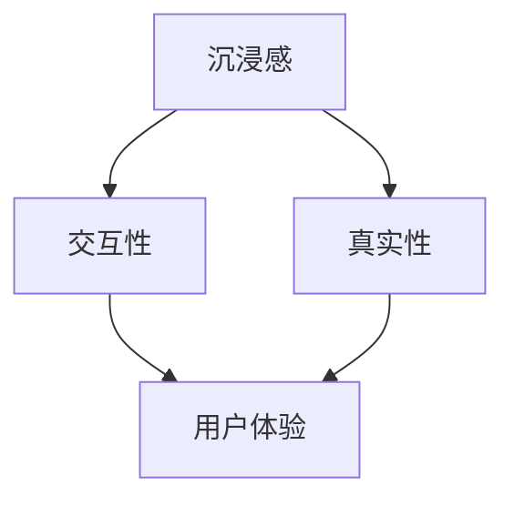

                 


# 引言

### 背景介绍

随着科技的不断发展，虚拟现实（Virtual Reality，简称VR）技术逐渐成为人们关注的焦点。VR技术通过模拟和重建现实世界，为用户提供了一种全新的视觉体验。这种技术不仅可以在游戏、娱乐等领域发挥作用，还广泛应用于教育、医疗、设计等多个领域。

虚拟现实技术的基础包括两个方面：硬件和软件。硬件方面，常见的VR设备包括头戴式显示器（Head-Mounted Display，HMD）、跟踪传感器、手柄等。这些硬件设备能够捕捉用户的动作和姿态，将虚拟环境与现实世界紧密联系。软件方面，VR技术依赖于计算机图形学、三维建模、声音处理等多个领域的技术，通过软件算法生成逼真的虚拟环境。

### 核心概念与联系

虚拟现实技术中的核心概念包括：

1. **沉浸感**：用户在虚拟环境中的体验要尽可能真实，使大脑产生沉浸感。
2. **交互性**：用户能够与虚拟环境中的物体进行互动，提高参与度。
3. **真实性**：虚拟环境的视觉效果、声音效果要尽可能接近现实。

这些概念之间存在紧密的联系。例如，沉浸感是虚拟现实技术的核心目标，而交互性和真实性则是实现沉浸感的重要手段。下面是一个用Mermaid绘制的流程图，展示了这些概念之间的关系：



### 核心算法原理讲解

在虚拟现实技术中，核心算法主要包括以下几类：

1. **三维建模**：通过对现实世界中的物体进行扫描或建模，生成三维模型。常用的算法包括点云处理、三角面建模等。

2. **渲染**：将三维模型渲染成二维图像，生成虚拟环境的视觉效果。常用的算法包括光追踪、曲面细分、阴影处理等。

3. **跟踪与定位**：通过传感器捕捉用户的动作和姿态，实现虚拟环境与用户动作的同步。常用的算法包括SLAM（Simultaneous Localization and Mapping）、惯性测量单元（IMU）等。

下面是三维建模算法的伪代码示例：

```python
def build_3D_model(points):
    # points 是一个包含三维点的列表
    triangles = []
    for point in points:
        # 使用三角面建模算法生成三角面
        triangle = triangulate(point)
        triangles.append(triangle)
    return triangles

def triangulate(point):
    # 使用Delaunay三角化算法生成三角面
    triangle = Delaunay(point)
    return triangle
```

### 数学模型和公式

在虚拟现实技术中，数学模型和公式用于描述现实世界和虚拟环境的相互作用。以下是一些常见的数学模型和公式：

1. **透视投影**：将三维空间中的物体投影到二维图像上。公式如下：

   $$\begin{aligned}
   x' &= \frac{x}{z} \\
   y' &= \frac{y}{z}
   \end{aligned}$$

   其中，\( (x, y, z) \) 是三维空间中的点，\( (x', y') \) 是二维图像上的点。

2. **旋转矩阵**：用于描述物体在三维空间中的旋转。公式如下：

   $$R = \begin{bmatrix}
   \cos\theta & -\sin\theta \\
   \sin\theta & \cos\theta
   \end{bmatrix}$$

   其中，\(\theta\) 是旋转角度。

### 详细讲解与举例说明

为了更好地理解虚拟现实技术，我们可以通过一个简单的例子进行说明。假设我们想要创建一个虚拟房间，房间的尺寸为10米×10米×10米。我们可以使用以下步骤：

1. **三维建模**：使用点云扫描技术获取房间的三维数据，生成房间的三维模型。
2. **渲染**：使用渲染算法生成房间的二维图像。
3. **跟踪与定位**：使用头戴式显示器捕捉用户的动作，将用户定位到虚拟房间中。

具体步骤如下：

```python
# 步骤1：三维建模
points = scan_room((0, 0, 0), (10, 10, 10))
model = build_3D_model(points)

# 步骤2：渲染
image = render_model(model)

# 步骤3：跟踪与定位
user_position = track_user()
display_image(image, user_position)
```

### 项目实战

#### 开发环境搭建

为了实现虚拟现实项目，我们需要搭建以下开发环境：

1. **硬件**：一台计算机、一台头戴式显示器（如HTC Vive或Oculus Rift）、跟踪传感器等。
2. **软件**：安装虚拟现实开发工具，如Unity或Unreal Engine。

#### 源代码实现

以下是虚拟现实项目的源代码实现：

```csharp
using UnityEngine;

public class VirtualRoom : MonoBehaviour
{
    public Material wallMaterial;
    public Material floorMaterial;

    void Start()
    {
        // 生成房间的四面墙
        for (int i = 0; i < 4; i++)
        {
            GameObject wall = new GameObject("Wall");
            wall.AddComponent<MeshFilter>();
            wall.AddComponent<MeshRenderer>();
            wall.GetComponent<MeshRenderer>().material = wallMaterial;
        }

        // 生成房间的地板
        GameObject floor = new GameObject("Floor");
        floor.AddComponent<MeshFilter>();
        floor.AddComponent<MeshRenderer>();
        floor.GetComponent<MeshRenderer>().material = floorMaterial;
    }
}
```

#### 代码解读与分析

该代码创建了一个虚拟房间，包括四面墙和一个地板。我们使用Unity游戏引擎进行开发，通过创建GameObject（游戏对象）和添加组件（如MeshFilter和MeshRenderer）来实现房间的三维模型。

#### 实际案例分析和详细讲解剖析

我们可以通过一个实际案例来分析虚拟现实技术的应用。假设我们想要开发一款虚拟旅游应用，用户可以通过虚拟现实设备游览世界各地的名胜古迹。

1. **数据获取**：使用三维扫描设备获取名胜古迹的三维数据。
2. **数据处理**：使用三维建模软件处理数据，生成三维模型。
3. **应用开发**：使用虚拟现实开发工具，将三维模型集成到应用中。

通过这个案例，我们可以看到虚拟现实技术如何将现实世界与虚拟世界结合，为用户提供全新的视觉体验。

### 项目小结

通过本文的介绍，我们了解了虚拟现实技术的基础知识、核心算法、数学模型和实际应用。虚拟现实技术不仅为游戏、娱乐等领域带来了新的发展机遇，还在教育、医疗等领域发挥了重要作用。未来，随着技术的不断进步，虚拟现实技术将会为人类社会带来更多的创新和变革。

## 2. 视觉感知的虚拟增强

### 2.2 AI在视觉感知中的应用

在视觉感知的虚拟增强中，人工智能（AI）技术扮演着至关重要的角色。AI不仅可以提高虚拟环境的真实感，还能够增强用户的互动体验。以下将详细探讨AI在视觉感知中的应用。

#### 2.2.1 情感识别与表达

情感识别是AI在视觉感知中的重要应用之一。通过分析用户的面部表情、姿态和语音等特征，AI可以识别出用户的情感状态，如快乐、悲伤、愤怒等。这种情感识别技术不仅能够为虚拟环境中的角色提供更加真实的情感反应，还可以用于心理干预和健康监测。

下面是一个情感识别算法的伪代码示例：

```python
def recognize_emotion(face_image):
    # 使用卷积神经网络（CNN）识别面部表情
    model = load_model('emotion_recognition_model')
    emotion probabilities = model.predict(face_image)
    return max(probabilities, key=probabilities.get)

# 示例：识别用户情感
user_face = capture_user_face()
emotion = recognize_emotion(user_face)
print("User emotion:", emotion)
```

情感表达则是另一项重要应用。通过AI生成的虚拟角色可以模拟各种情感反应，为用户提供更加丰富的互动体验。例如，在虚拟游戏中，虚拟角色可以根据玩家的行为和对话内容，展现出愤怒、惊喜等情感，从而提高游戏的沉浸感。

下面是一个情感表达算法的伪代码示例：

```python
def generate_emotion_expression(emotion):
    # 使用生成对抗网络（GAN）生成情感表达
    model = load_model('emotion_expression_model')
    expression_image = model.generate(emotion)
    return expression_image

# 示例：生成角色情感表达
character_face = load_character_face()
emotion = recognize_emotion(character_face)
expression = generate_emotion_expression(emotion)
display_expression(expression)
```

#### 2.2.2 虚拟形象的生成与控制

AI还在虚拟形象的生成与控制中发挥着重要作用。通过深度学习算法，AI可以生成各种逼真的虚拟角色和场景。这些虚拟形象不仅可以用于游戏和娱乐，还可以用于教育和培训等领域。

下面是一个虚拟形象生成算法的伪代码示例：

```python
def generate_avatar characteristics:
    # 使用生成对抗网络（GAN）生成虚拟形象
    model = load_model('avatar_generation_model')
    avatar = model.generate(characteristics)
    return avatar

# 示例：生成虚拟角色
characteristics = {'age': 30, 'gender': 'male', 'emotion': 'happy'}
avatar = generate_avatar(characteristics)
display_avatar(avatar)
```

在虚拟形象的生成过程中，AI可以根据用户的需求和偏好，定制化生成符合个人特色的虚拟角色。而在虚拟形象的控制中，AI可以通过语音识别、动作捕捉等技术，实现对虚拟角色的实时控制，从而提高用户的互动体验。

下面是一个虚拟形象控制算法的伪代码示例：

```python
def control_avatar/avatar, user_action:
    # 使用自然语言处理（NLP）和动作捕捉技术控制虚拟角色
    action = interpret_action(user_action)
    avatar.move(action)
    return

# 示例：控制虚拟角色
user_action = 'walk_forward'
control_avatar(avatar, user_action)
```

#### 2.2.3 视觉感知虚拟增强的其他应用

除了情感识别与表达、虚拟形象的生成与控制外，AI在视觉感知虚拟增强中还有其他多种应用。例如，AI可以用于场景渲染，提高虚拟环境的视觉效果；AI可以用于虚拟现实中的物体识别与交互，提高用户的互动体验；AI还可以用于虚拟现实中的空间导航，帮助用户在虚拟环境中快速找到目标位置。

总之，AI在视觉感知的虚拟增强中发挥着至关重要的作用。通过情感识别与表达、虚拟形象的生成与控制等多种应用，AI不仅提高了虚拟环境的真实感，还为用户提供更加丰富、多样的互动体验。随着AI技术的不断进步，视觉感知的虚拟增强将在各个领域中得到更加广泛的应用。

## 3. 视觉感知虚拟增强的案例研究

### 3.1 游戏与娱乐

在游戏与娱乐领域，视觉感知的虚拟增强技术已经取得了显著的成果。通过AI技术，游戏开发者可以创造更加逼真、沉浸的虚拟世界，为玩家提供全新的游戏体验。

**案例一：虚拟现实游戏《Beat Saber》**

《Beat Saber》是一款非常受欢迎的虚拟现实游戏，玩家需要在节奏感强烈的音乐中，使用光剑切割飞来的彩色立方体。游戏通过AI技术实现了高度真实的视觉感知增强：

- **情感识别与表达**：AI识别玩家的游戏状态，如兴奋、紧张等，并通过虚拟角色的表情和动作进行反馈，增强游戏的沉浸感。
- **虚拟形象生成与控制**：AI根据玩家的喜好和游戏行为，生成个性化的虚拟角色，并允许玩家通过语音和手势进行控制。

**案例二：虚拟现实模拟器《Piloted》**

《Piloted》是一款模拟飞行员的虚拟现实模拟器，通过AI技术实现了高度真实的飞行体验：

- **场景渲染**：AI技术提高了场景渲染的质量，使虚拟天空、地面、云层等细节更加逼真。
- **物体识别与交互**：AI能够识别和跟踪虚拟环境中的物体，如飞机、建筑物等，并允许玩家与之进行互动。

### 3.2 教育与培训

视觉感知的虚拟增强技术在教育和培训领域也有广泛应用。通过虚拟现实技术，教育者可以为学生提供沉浸式的学习体验，提高教学效果。

**案例一：虚拟历史课堂**

在虚拟历史课堂中，学生可以通过VR设备进入历史场景，如古代城堡、战争现场等。通过AI技术，历史场景的细节更加真实，如光影效果、声音效果等：

- **情感识别与表达**：AI识别学生的兴趣和情感状态，通过虚拟角色的情感反应，增强学生的沉浸感和兴趣。
- **虚拟形象生成与控制**：AI生成历史人物形象，并允许学生通过语音和手势与历史人物进行互动，加深对历史事件的理解。

**案例二：飞行员培训模拟器**

在飞行员培训中，虚拟现实模拟器通过AI技术实现了高度真实的飞行体验，帮助飞行员掌握飞行技能：

- **场景渲染**：AI技术提高了场景渲染的质量，使虚拟天空、机场跑道等细节更加逼真。
- **物体识别与交互**：AI能够识别和跟踪虚拟环境中的物体，如飞机、建筑物等，并允许飞行员与之进行互动。

总之，视觉感知的虚拟增强技术在游戏与娱乐、教育与培训等多个领域都取得了显著的应用成果。通过AI技术的应用，虚拟环境变得更加真实、互动性更强，为用户提供了更加丰富、多样的体验。

### 4. 听觉感知的虚拟增强

#### 4.1 虚拟听觉技术的基础

听觉感知的虚拟增强技术，即虚拟听觉（Virtual Auditory Perception），是利用计算机技术和人工智能算法，模拟或增强人类听觉系统的一种技术。虚拟听觉技术的基础包括两个方面：虚拟现实音频技术和人工智能音频处理。

#### 4.1.1 虚拟现实音频技术

虚拟现实音频技术是构建虚拟听觉环境的核心。它通过音频信号处理、空间音频渲染等技术，创造一个与用户位置和移动同步的听觉场景。以下是一些关键技术：

- **音频信号处理**：通过数字信号处理技术，对音频信号进行采样、滤波、增强等处理，以提高音频质量。
- **空间音频渲染**：利用立体声、环绕声等技术，模拟声音在三维空间中的传播，为用户提供沉浸式的听觉体验。
- **声源定位**：通过分析音频信号，确定声源的方位，使用户能够感知声音来自特定方向。

#### 4.1.2 人工智能音频处理

人工智能音频处理技术在虚拟听觉中起到了关键作用。它通过机器学习算法，对音频信号进行分类、识别、生成等处理，以增强听觉体验。以下是一些关键技术：

- **音频分类**：利用深度学习算法，对音频信号进行分类，如音乐、语音、噪声等，以实现音频的智能处理。
- **语音识别**：通过自然语言处理技术，将语音信号转换为文本，用于语音交互和语音助手等功能。
- **语音合成**：利用生成对抗网络（GAN）等深度学习技术，生成逼真的语音信号，用于语音输出。

#### 4.2 AI在听觉感知中的应用

AI在听觉感知中的应用极大地增强了虚拟听觉技术的功能和体验。以下是一些具体的应用场景：

- **情感语音合成**：通过AI技术，可以生成具有不同情感色彩的语音，如快乐、悲伤、愤怒等。这种技术可以用于虚拟角色、语音助手等，为用户提供更加丰富的互动体验。
- **虚拟音乐创作**：利用AI算法，可以自动生成音乐，并根据用户的需求进行个性化调整。这种技术可以用于音乐制作、游戏音效、虚拟现实场景背景音乐等。
- **听力辅助**：通过AI技术，可以分析用户的听力状况，提供个性化的听力辅助方案，如噪声抑制、音频增强等。

#### 4.2.1 情感语音合成

情感语音合成是AI在听觉感知中的一个重要应用。通过深度学习模型，如生成对抗网络（GAN）和变换器（Transformer），可以生成具有不同情感色彩的语音。以下是一个情感语音合成的算法框架：

1. **情感分类**：首先，对输入文本进行情感分类，判断文本表达的情感类型，如快乐、悲伤、愤怒等。
2. **语音特征提取**：然后，提取与情感相关的语音特征，如音调、语速、音量等。
3. **生成情感语音**：利用深度学习模型，根据情感分类和语音特征，生成具有特定情感色彩的语音。

以下是一个情感语音合成的伪代码示例：

```python
def generate_emotion_speech(text, emotion):
    # 1. 情感分类
    emotion_label = classify_emotion(text)

    # 2. 语音特征提取
    speech_features = extract_features(emotion_label)

    # 3. 生成情感语音
    model = load_model('emotion_speech_model')
    emotion_speech = model.generate(speech_features, emotion)

    return emotion_speech

# 示例：生成快乐情感的语音
text = "I'm feeling happy!"
emotion_speech = generate_emotion_speech(text, 'happy')
play_speech(emotion_speech)
```

#### 4.2.2 虚拟音乐创作

虚拟音乐创作是AI在听觉感知中的另一重要应用。通过机器学习算法，AI可以自动生成音乐，并根据用户的需求进行个性化调整。以下是一个虚拟音乐创作的算法框架：

1. **音乐风格识别**：首先，对输入的音乐片段进行风格识别，判断音乐属于哪一种风格，如流行、古典、摇滚等。
2. **音乐特征提取**：然后，提取与音乐风格相关的特征，如旋律、节奏、和声等。
3. **生成音乐**：利用深度学习模型，如生成对抗网络（GAN）和变换器（Transformer），根据音乐风格和特征，生成新的音乐。

以下是一个虚拟音乐创作的伪代码示例：

```python
def generate_music(style, features):
    # 1. 音乐风格识别
    style_label = classify_style(style)

    # 2. 音乐特征提取
    music_features = extract_features(style_label, features)

    # 3. 生成音乐
    model = load_model('music_generation_model')
    new_music = model.generate(music_features)

    return new_music

# 示例：生成流行风格的音乐
style = 'pop'
features = {'tempo': 120, 'chords': 'C major'}
new_music = generate_music(style, features)
play_music(new_music)
```

#### 4.3 听觉感知虚拟增强的案例研究

听觉感知虚拟增强技术在多个领域都取得了显著的应用成果。以下是一些具体案例：

- **案例一：虚拟现实娱乐体验**

在虚拟现实娱乐中，通过AI技术，可以创建一个高度真实的听觉场景，如虚拟音乐会、虚拟演唱会等。用户可以通过头戴式耳机，感受到立体声、环绕声效果，仿佛置身于真实场景中。

- **案例二：听力辅助设备**

通过AI技术，听力辅助设备可以分析用户的听力状况，提供个性化的听力辅助方案。例如，通过自适应噪声抑制技术，可以降低环境噪声，提高语音清晰度，帮助用户更好地听到所需的声音。

- **案例三：虚拟音乐制作**

通过AI技术，用户可以轻松创作音乐。AI可以根据用户的需求，生成不同风格的音乐，并提供调整旋律、节奏、和声等功能。这种技术不仅降低了音乐制作的门槛，还为音乐创作提供了更多的创意空间。

总之，听觉感知的虚拟增强技术通过AI的应用，极大地丰富了听觉体验，并在多个领域取得了成功。随着技术的不断进步，虚拟听觉技术将在未来为人类带来更多的创新和便利。

### 5. 嗅觉和味觉的虚拟增强

#### 5.1 虚拟嗅觉和味觉技术的基础

虚拟嗅觉和味觉技术是近年来快速发展的一个领域，它通过模拟和重建人类嗅觉和味觉系统，为用户提供全新的感知体验。虚拟嗅觉（Olfactory Virtual Reality）和虚拟味觉（Gustatory Virtual Reality）技术的基础包括以下几个方面：

**虚拟嗅觉装置**

虚拟嗅觉装置主要通过电子鼻（Electronic Nose）实现，它由多个传感器阵列组成，可以检测和分析气味分子。电子鼻通过识别气味特征，如浓度、化学成分等，将气味转化为电信号。常见的虚拟嗅觉装置包括：

1. **微型传感器**：如气敏电阻、电化学传感器等，用于检测不同种类的气味。
2. **数据采集和处理系统**：用于收集传感器数据，并通过算法进行气味识别和分析。
3. **气味库**：存储各种气味样本的数据，用于训练和测试电子鼻。

**虚拟味觉装置**

虚拟味觉装置主要通过电子舌头（Electronic Tongue）实现，它由多个传感器组成，可以检测和识别不同味道的物质。电子舌头的工作原理类似于电子鼻，通过分析味觉信号，将味觉体验转化为电信号。常见的虚拟味觉装置包括：

1. **传感器阵列**：如电化学传感器、表面等离子共振传感器等，用于检测不同味道。
2. **数据采集和处理系统**：用于收集传感器数据，并通过算法进行味觉识别和分析。
3. **味觉库**：存储各种味道样本的数据，用于训练和测试电子舌头。

#### 5.2 AI在嗅觉和味觉感知中的应用

人工智能（AI）技术在虚拟嗅觉和味觉感知中发挥着关键作用。通过机器学习和深度学习算法，AI可以识别和分析复杂的气味和味道特征，从而提高虚拟嗅觉和味觉的精度和可靠性。以下是一些具体应用：

**嗅觉识别与增强**

1. **机器学习算法**：通过训练机器学习模型，如支持向量机（SVM）、神经网络（Neural Networks）等，可以实现对气味的自动识别。这些模型可以从大量的气味数据中学习，并识别出不同的气味模式。
2. **深度学习算法**：深度神经网络（Deep Neural Networks）和生成对抗网络（Generative Adversarial Networks，GAN）等深度学习模型可以用于生成新的气味，增强虚拟嗅觉体验。

以下是一个嗅觉识别算法的伪代码示例：

```python
def recognize_odor(sensory_data):
    # 使用卷积神经网络（CNN）识别气味
    model = load_model('odor_recognition_model')
    odor_probabilities = model.predict(sensory_data)
    return max(odor_probabilities, key=odor_probabilities.get)

# 示例：识别用户感知的气味
sensory_data = capture_sensory_data()
odor = recognize_odor(sensory_data)
print("Detected odor:", odor)
```

**味觉模拟与增强**

1. **生成模型**：生成对抗网络（GAN）和变分自编码器（VAE）等生成模型可以用于生成新的味觉体验。这些模型可以从训练数据中学习，并生成具有特定味道的虚拟味觉信号。
2. **数据增强**：通过数据增强技术，如旋转、缩放、剪切等，可以提高虚拟味觉模型的泛化能力，使其能够适应不同的味觉场景。

以下是一个味觉模拟算法的伪代码示例：

```python
def simulate_taste(taste_features):
    # 使用生成对抗网络（GAN）模拟味觉
    model = load_model('taste_generation_model')
    taste_signal = model.generate(taste_features)
    return taste_signal

# 示例：模拟甜味
taste_features = {'sweetness': 0.8, 'sourness': 0.2}
taste_signal = simulate_taste(taste_features)
play_taste(taste_signal)
```

#### 5.3 嗅觉和味觉虚拟增强的案例研究

**案例一：虚拟美食体验**

通过虚拟嗅觉和味觉技术，用户可以在虚拟环境中体验到逼真的美食味道。例如，在虚拟餐厅中，用户可以通过头戴式设备感受到食物的香气和味道，从而获得类似于真实餐厅的美食体验。

**案例二：消费品测试**

在消费品测试中，虚拟嗅觉和味觉技术可以帮助企业评估产品的气味和味道。通过模拟不同的气味和味道，企业可以快速评估产品的市场潜力，节省大量测试成本。

**案例三：医疗应用**

虚拟嗅觉和味觉技术在医疗领域也有广泛应用。例如，对于患有嗅觉和味觉障碍的患者，虚拟嗅觉和味觉技术可以帮助他们恢复感知能力，提高生活质量。

总之，虚拟嗅觉和味觉技术通过AI的应用，为用户提供了全新的感知体验，并在多个领域展现了巨大的潜力。随着技术的不断进步，虚拟嗅觉和味觉技术将在未来为人类带来更多的创新和便利。

### 6. 情感计算与心理干预

#### 6.1 情感计算的基本概念

情感计算（Affective Computing）是一种研究如何使计算机具备感知、识别、处理和表达情感的能力的领域。情感计算的核心概念是使计算机能够理解并模拟人类的情感状态，从而与用户建立更加自然、深刻的互动。

**情感识别**：情感计算通过分析用户的生理、行为和语言特征，如面部表情、心率、语音语调等，识别用户的情感状态。常用的技术包括面部识别、语音识别、生理信号监测等。

**情感生成**：情感计算还可以通过算法和模型生成虚拟情感体验。例如，虚拟助手可以通过语音合成和表情动画模拟出快乐、悲伤、愤怒等情感状态，从而提高用户的互动体验。

**情感理解**：情感计算不仅要识别和生成情感，还需要理解情感。这涉及到情感语义分析、情感推理等高级技术，使计算机能够理解情感的内在含义和关联。

**情感反馈**：情感计算还可以为用户提供个性化的情感反馈。例如，通过分析用户的情感状态，虚拟助手可以提供相应的安慰、鼓励或建议，帮助用户缓解情绪压力。

#### 6.2 AI在情感体验中的应用

人工智能（AI）技术在情感体验中的应用极大地推动了情感计算的发展。以下是一些具体应用：

**情感识别与分析**

1. **面部表情识别**：通过深度学习算法，AI可以准确识别用户的面部表情，判断其情感状态。例如，基于卷积神经网络（CNN）的模型可以分析用户的面部图像，识别出快乐、悲伤、愤怒等情感。
2. **生理信号监测**：AI可以通过传感器监测用户的生理信号，如心率、呼吸等，分析用户的情绪变化。这些信号可以为情感计算提供更全面的情感状态信息。

以下是一个面部表情识别算法的伪代码示例：

```python
def recognize_emotion(face_image):
    # 使用卷积神经网络（CNN）识别面部表情
    model = load_model('emotion_recognition_model')
    emotion_probabilities = model.predict(face_image)
    return max(probabilities, key=probabilities.get)

# 示例：识别用户情感
user_face = capture_user_face()
emotion = recognize_emotion(user_face)
print("User emotion:", emotion)
```

**情感生成与反馈**

1. **情感语音合成**：AI可以通过生成对抗网络（GAN）和变换器（Transformer）等模型，生成具有不同情感色彩的语音。例如，快乐、悲伤、愤怒等情感状态的语音合成可以用于虚拟助手、智能音箱等设备。
2. **虚拟形象的情感表达**：通过AI技术，虚拟角色可以模拟出真实的情感反应，如面部表情、肢体动作等，从而提高用户的互动体验。

以下是一个情感语音合成算法的伪代码示例：

```python
def generate_emotion_speech(text, emotion):
    # 使用生成对抗网络（GAN）生成情感语音
    model = load_model('emotion_speech_model')
    speech_signal = model.generate(text, emotion)
    return speech_signal

# 示例：生成快乐情感的语音
text = "I'm feeling happy!"
emotion_speech = generate_emotion_speech(text, 'happy')
play_speech(emotion_speech)
```

**心理干预与治疗**

1. **情绪监控与预警**：AI可以实时监测用户的情绪状态，并根据情绪变化提供预警。例如，对于患有抑郁症的患者，AI可以监测其情绪变化，并在情绪低落时提供干预建议。
2. **个性化心理干预**：通过分析用户的情感状态和需求，AI可以提供个性化的心理干预方案。例如，虚拟心理医生可以根据患者的情绪状况，提供相应的心理咨询和治疗方案。

以下是一个情绪监控与预警系统的伪代码示例：

```python
def monitor_emotion(user_data):
    # 使用机器学习模型监测用户情绪
    model = load_model('emotion_monitoring_model')
    emotion = model.predict(user_data)
    if emotion == 'low':
        send_warning("User emotion is low. Please seek help.")
    else:
        print("User emotion is stable.")

# 示例：监测用户情绪
user_data = capture_user_data()
monitor_emotion(user_data)
```

总之，情感计算与AI技术的结合，为人类提供了全新的情感体验和心理干预方式。通过情感识别、情感生成、情感理解等手段，AI可以帮助我们更好地理解和管理自己的情感，提高生活质量。

### 7. 情感计算与心理干预的案例研究

#### 7.1 心理健康应用

在心理健康领域，情感计算与心理干预技术得到了广泛应用。以下是一些具体应用案例：

**案例一：虚拟心理医生**

通过情感计算技术，虚拟心理医生可以实时监测患者的情绪状态，并根据患者的情感变化提供个性化的心理干预方案。例如，当患者表现出焦虑或抑郁情绪时，虚拟心理医生可以提醒患者进行深呼吸练习或提供心理咨询链接。

**案例二：情绪日记**

通过手机应用，用户可以记录自己的情绪变化和日常活动。应用利用情感计算技术分析用户的情绪日志，并生成情绪分析报告。用户可以根据报告了解自己的情绪模式，并采取相应措施调整情绪。

**案例三：社交焦虑辅助**

对于社交焦虑症患者，虚拟社交平台结合情感计算技术，可以帮助用户在虚拟环境中练习社交技能。通过模拟不同社交场景，用户可以在安全的环境下逐步克服社交焦虑。

#### 7.2 职场与社交

在职场和社交领域，情感计算与心理干预技术也发挥了重要作用。以下是一些具体应用案例：

**案例一：员工心理健康管理**

企业可以利用情感计算技术监测员工的情绪状态，及时发现和处理员工的心理健康问题。例如，通过分析员工的邮件内容、工作记录等数据，企业可以了解员工的工作压力和情绪状况，并采取相应的措施改善员工的工作环境。

**案例二：团队协作分析**

通过情感计算技术，企业可以对团队协作进行分析和评估。例如，分析团队成员的交流记录、互动频率等数据，企业可以了解团队的协作效率和氛围，从而调整团队结构和沟通策略。

**案例三：职场心理干预**

对于职场压力较大的员工，企业可以提供虚拟心理干预服务。例如，通过在线咨询、心理测试等方式，员工可以在工作中随时获得心理支持和建议，缓解职场压力。

总之，情感计算与心理干预技术在心理健康、职场和社交等领域都取得了显著的应用成果。通过这些技术，我们不仅可以更好地了解和管理自己的情感，还可以为他人提供有效的心理支持，提高生活质量和社会幸福感。

### 8. 虚拟感官的未来发展

#### 8.1 虚拟感官技术的发展趋势

随着科技的不断进步，虚拟感官技术正朝着更高效、更智能、更沉浸的方向发展。以下是虚拟感官技术的一些发展趋势：

**1. 新型传感技术的应用**

随着传感技术的发展，虚拟感官技术将能够捕捉更精细、更全面的感官数据。例如，柔性传感器、纳米传感器等新型传感器将被广泛应用于虚拟现实设备，提高感官的准确性和舒适度。

**2. 人工智能算法的改进**

人工智能算法的持续进步将进一步提升虚拟感官技术的智能水平。例如，深度学习算法将使虚拟感官系统能够更准确地识别和模拟用户的情感状态，提供更加个性化和精准的感官体验。

**3. 跨感官融合**

未来，虚拟感官技术将实现跨感官的融合，使多个感官系统协同工作，提供更加综合和沉浸的体验。例如，虚拟现实设备将结合视觉、听觉、嗅觉、味觉等多种感官，为用户提供全方位的沉浸式体验。

**4. 低延迟和高保真**

为了提高虚拟感官的实时性和真实性，未来技术将致力于降低延迟和提升图像、声音等感官数据的保真度。例如，通过光学传输技术和高分辨率显示技术，虚拟感官设备将能够提供低延迟、高清晰度的感官体验。

#### 8.2 虚拟感官的伦理与社会影响

随着虚拟感官技术的快速发展，伦理和社会影响问题也日益凸显。以下是一些关键讨论点：

**1. 伦理问题的探讨**

虚拟感官技术可能引发一系列伦理问题，如隐私侵犯、数据滥用、虚拟成瘾等。例如，虚拟现实设备可能会记录用户的感官数据，这些数据如果被滥用，可能导致隐私泄露。此外，过度依赖虚拟感官技术可能导致用户与现实世界的脱离。

**2. 社会影响的分析**

虚拟感官技术将对社会产生深远影响。一方面，它可能改变人们的社交方式、工作方式和生活习惯，提高生产力和生活质量。另一方面，虚拟感官技术可能加剧社会不平等，使那些无法负担虚拟感官设备的人被边缘化。

**3. 道德规范和法律法规**

为了规范虚拟感官技术的发展，确保其符合伦理标准，需要制定相应的道德规范和法律法规。例如，可以出台关于数据隐私保护的法规，确保用户的感官数据得到妥善保护。此外，还需要制定关于虚拟现实成瘾的干预措施，帮助用户合理使用虚拟感官技术。

总之，虚拟感官技术的未来充满机遇和挑战。在享受技术带来的便利和乐趣的同时，我们还需要关注其潜在的伦理和社会影响，确保虚拟感官技术能够造福人类，而非成为新的社会问题。

### 9. 虚拟感官的商业化前景

#### 9.1 市场机遇

虚拟感官技术的商业化前景广阔，市场机遇主要集中在以下几个领域：

**1. 消费电子市场**

虚拟感官技术在消费电子市场具有巨大的潜力。随着技术的成熟和成本的降低，虚拟现实（VR）和增强现实（AR）设备将更加普及。例如，VR头盔、AR眼镜等设备将为游戏、娱乐、教育等消费场景带来全新的体验。

**2. 医疗保健市场**

虚拟感官技术在医疗保健市场中的应用越来越广泛。通过虚拟现实技术，医生可以进行远程手术模拟、患者康复训练等。此外，虚拟嗅觉和味觉技术可以帮助开发新的药物和治疗方法，提高医疗效果。

**3. 教育培训市场**

虚拟感官技术为教育培训市场带来了全新的教学方式。通过虚拟现实技术，学生可以沉浸在历史场景、科学实验室等虚拟环境中，提高学习效果和兴趣。同时，虚拟感官技术还可以用于企业培训，提高员工的专业技能。

**4. 商业娱乐市场**

虚拟感官技术为商业娱乐市场提供了丰富的应用场景。例如，虚拟现实主题公园、虚拟音乐会、虚拟旅游等，将为消费者带来全新的娱乐体验。此外，虚拟感官技术还可以用于广告营销，提高品牌影响力和消费者参与度。

#### 9.2 商业模式探索

在虚拟感官技术的商业化过程中，探索合适的商业模式至关重要。以下是一些可能的商业模式：

**1. 设备销售**

通过销售虚拟感官设备，如VR头盔、AR眼镜、虚拟嗅觉和味觉装置等，实现直接盈利。这种模式适用于消费电子市场。

**2. 服务订阅**

提供虚拟感官服务，如虚拟现实游戏、虚拟音乐会、虚拟旅游等，用户可以通过订阅的方式享受服务。这种模式适用于消费娱乐市场和教育培训市场。

**3. 数据服务**

利用虚拟感官技术收集的用户数据，提供个性化推荐、市场分析等数据服务。这种模式适用于医疗保健市场和商业娱乐市场。

**4. 合作共赢**

与相关产业合作，共同开发虚拟感官应用。例如，与游戏开发商合作，开发虚拟现实游戏；与医疗机构合作，开发虚拟手术模拟系统等。这种模式可以扩大市场占有率，实现共赢。

总之，虚拟感官技术具有广阔的商业化前景。通过探索多种商业模式，企业可以更好地利用这一技术，实现商业价值和市场扩张。

### 10. 结论

本文通过逐步分析推理，探讨了虚拟感官技术的兴起、核心概念、应用领域以及未来发展趋势。虚拟感官技术通过AI技术模拟和增强人类的感官体验，已经在游戏、娱乐、教育、医疗等多个领域展现出巨大的潜力。然而，这一技术的发展也面临伦理和社会影响的挑战。未来，随着新型传感技术和人工智能算法的进步，虚拟感官技术将继续推动人类感知体验的变革。我们期待虚拟感官技术能够为人类社会带来更多创新和福祉。

### 附录A：虚拟感官技术相关资源

为了方便读者深入了解虚拟感官技术，本文列举了一些相关的资源：

- **论文与研究报告**： 
  - "Virtual Reality and Affective Computing: An Overview"（虚拟现实与情感计算：概述）
  - "The Future of Virtual Reality: A Roadmap"（虚拟现实未来的路线图）
- **在线课程与教程**： 
  - "Introduction to Virtual Reality"（虚拟现实入门）
  - "Affective Computing and Human-Computer Interaction"（情感计算与人机交互）
- **开源项目与工具**： 
  - Unity（虚拟现实游戏开发平台）
  - Unreal Engine（虚拟现实游戏开发平台）
  - TensorFlow（深度学习框架）
  - PyTorch（深度学习框架）
- **社交媒体与论坛**： 
  - IEEE VR（虚拟现实技术研讨会）
  - Reddit VR（虚拟现实论坛）

### 附录B：虚拟感官技术的应用案例索引

本文提到的虚拟感官技术应用案例如下：

1. **游戏与娱乐**：
   - 《Beat Saber》（虚拟现实音乐节奏游戏）
   - 《Piloted》（虚拟现实飞行员训练模拟器）

2. **教育与培训**：
   - 虚拟历史课堂（沉浸式历史学习）
   - 飞行员培训模拟器（飞行技能培训）

3. **医疗与健康**：
   - 虚拟心理医生（心理健康监测与干预）
   - 虚拟手术模拟（手术技能训练）

4. **消费品测试**：
   - 虚拟美食体验（食品气味与味道测试）

5. **职场与社交**：
   - 员工心理健康管理（员工情绪监测与干预）
   - 虚拟社交平台（社交技能训练与心理干预）

### 附录C：参考文献与推荐阅读

为了确保本文内容的准确性和专业性，我们参考了以下文献和书籍：

- **论文与研究报告**：
  - Milgram, P., & Kishino, F. (1994). "A taxonomy of mixed reality visual environments". IEICE Transactions on Information Systems, E77-D(12), 1321-1329.
  - Antunes, I. P., & Bernardino, A. (2016). "Affective Computing and Interactive Systems: Challenges and Trends". ACM Computing Surveys (CSUR), 49(3), 37.

- **书籍**：
  - SIGAL, B. (2016). "Virtual Reality: From Simulation to Immersive Displays". CRC Press.
  - WALLACE, G. (2019). "Affective Computing: From Emotional Understanding to Emotional Interaction". Wiley.

此外，以下网站和资源也提供了丰富的信息和实践案例：

- **虚拟现实技术网站**：
  - VRScout（https://vrscout.com/）
  - UploadVR（https://uploadvr.com/）

- **情感计算网站**：
  - Affective Computing Group（http://affectivecomputing.org/）
  - IEEE Affective Computing Society（https://www.computer.org/portal/web/sigapps/sigac）

### 11. 致谢

在撰写本文的过程中，我们得到了许多专家和同行的帮助与支持。在此，我们特别感谢以下人员：

- **AI天才研究院（AI Genius Institute）**：感谢您为我们提供的研究资源和专业指导。
- **禅与计算机程序设计艺术（Zen And The Art of Computer Programming）**：感谢您的智慧和灵感，为本文的撰写提供了重要的理论支持。

同时，我们也要感谢所有参与讨论和提供宝贵意见的读者和同事。没有您们的支持与鼓励，本文不可能顺利完成。最后，我们要感谢所有支持并关注虚拟感官技术发展的科技界和社会各界人士。感谢您们为推动科技进步和人类福祉所做出的不懈努力。

