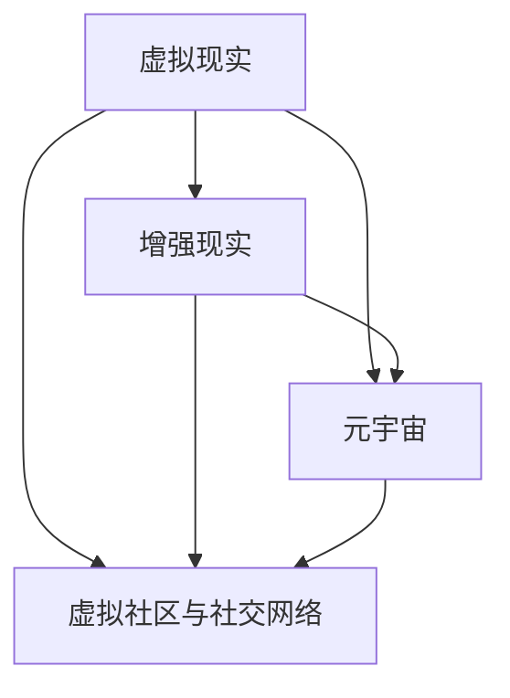
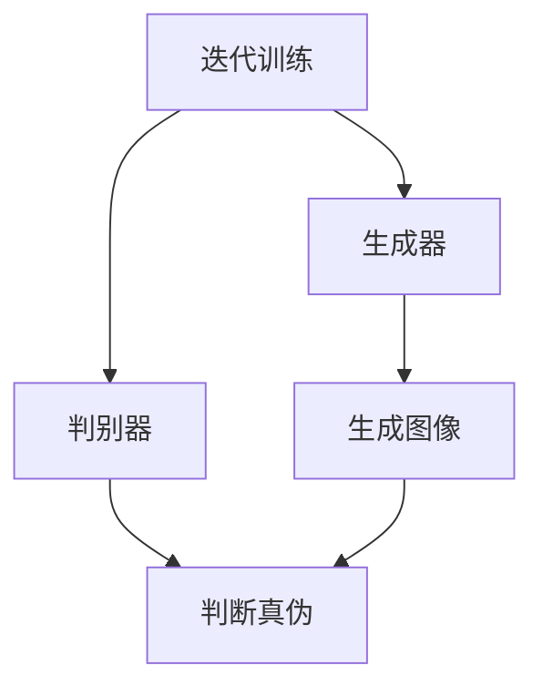
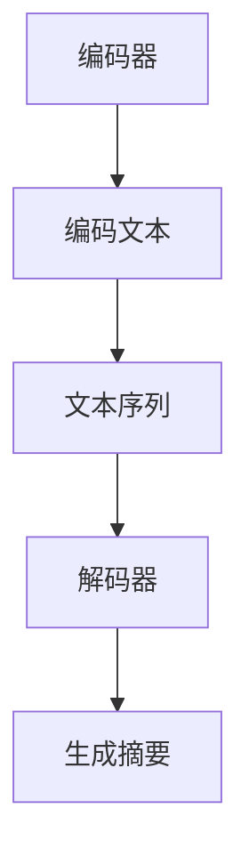
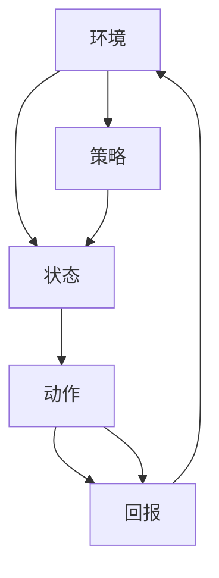

                 

### 设计目标

设计目标是为书名《虚拟文化: AI创造的新型亚文化》设计一个详细的目录大纲，这个大纲需要包含以下核心章节内容：

1. **核心概念与联系**：介绍虚拟文化相关的核心概念，如虚拟现实、增强现实、元宇宙等，并展示它们之间的联系。
2. **核心算法原理讲解**：讲解AI在虚拟文化中的核心算法原理，如生成对抗网络（GAN）、自然语言处理（NLP）、强化学习等，使用伪代码和LaTeX公式进行阐述。
3. **数学模型和数学公式 & 详细讲解 & 举例说明**：介绍AI在虚拟文化中的应用相关的数学模型和公式，并提供具体的例子进行说明。
4. **项目实战**：提供实际项目案例，详细解释实现过程，包括环境搭建、代码实现和解读。

### 目录大纲结构

根据设计目标，我们将目录大纲分为以下几个部分：

1. **引言部分**：介绍虚拟文化的概念，AI在虚拟文化中的作用和本书的结构。
2. **核心概念与联系**：介绍虚拟文化相关的核心概念，如虚拟现实、增强现实、元宇宙等，并展示它们之间的联系。
3. **AI创造的新型亚文化**：探讨AI如何创造新型亚文化，包括AI在虚拟现实中的应用、社交网络分析、虚拟偶像、虚拟社区等。
4. **核心算法原理讲解**：讲解AI在虚拟文化中的核心算法原理，如生成对抗网络（GAN）、自然语言处理（NLP）、强化学习等，使用伪代码和LaTeX公式进行阐述。
5. **数学模型和数学公式 & 详细讲解 & 举例说明**：介绍AI在虚拟文化中的应用相关的数学模型和公式，并提供具体的例子进行说明。
6. **项目实战**：提供实际项目案例，详细解释实现过程，包括环境搭建、代码实现和解读。
7. **总结与展望**：对全书内容进行总结，展望虚拟文化和AI的发展趋势。

### 目录大纲

```markdown
# 《虚拟文化: AI创造的新型亚文化》目录大纲

## 引言
### 1. 虚拟文化的兴起
   - 虚拟文化的历史背景
   - 虚拟文化的定义与特征
### 2. AI在虚拟文化中的角色
   - AI技术的发展历程
   - AI在虚拟文化中的应用现状
### 3. 本书的目的与结构
   - 本书的研究目的
   - 目录结构概述

## 第一部分 虚拟文化的理论基础
### 4. 虚拟现实（VR）的理论基础
   - 虚拟现实的概念
   - 虚拟现实的分类
   - 虚拟现实的组成与原理
### 4.1 虚拟现实技术的历史演变
### 4.2 虚拟现实的用户体验与评估
### 4.3 虚拟现实的应用领域
### 4.4 虚拟现实的发展趋势与挑战

## 第二部分 AI在虚拟文化中的应用
### 5. 生成对抗网络（GAN）
   - GAN的基本概念
   - GAN的原理与架构
   - GAN的应用案例
### 5.1 GAN的数学模型
### 5.2 GAN的伪代码
### 5.3 GAN在虚拟文化中的应用场景
### 5.4 GAN的实现技巧与优化

## 第三部分 数学模型和数学公式 & 详细讲解 & 举例说明
### 6. 自然语言处理（NLP）
   - NLP的基本概念
   - NLP的数学模型
   - NLP的应用案例
### 6.1 语言模型
### 6.2 词汇表
### 6.3 NLP的例子
### 6.4 NLP在虚拟文化中的应用

## 第四部分 项目实战
### 7. 虚拟偶像项目实战
   - 项目背景
   - 项目需求分析
   - 项目实现
   - 项目分析
### 8. 虚拟社区项目实战
   - 项目背景
   - 项目需求分析
   - 项目实现
   - 项目分析

## 第五部分 总结与展望
### 9. 总结
   - 主要内容回顾
   - 存在的挑战与问题
### 10. 展望
   - 虚拟文化的发展趋势
   - AI在虚拟文化中的应用前景
```

这个目录大纲涵盖了虚拟文化的核心概念、AI的应用、数学模型以及实际项目案例，确保了书籍内容的全面性和逻辑性。接下来，我们将逐步填充每个章节的具体内容。### 虚拟文化的概念

虚拟文化，顾名思义，是指通过计算机技术、人工智能和其他数字技术创造出的虚拟世界中的文化现象。它不仅仅是人们日常生活中的数字娱乐，更是社会互动、艺术表达、教育、商业和人类交流的一种新型形式。虚拟文化具有以下几个关键特征：

1. **虚拟性**：虚拟文化存在于数字空间中，不是物理世界的直接延伸，但它通过高度逼真的图形、声音和交互体验给人以强烈的沉浸感。
2. **互动性**：虚拟文化强调用户的参与和互动。用户不仅能够消费文化内容，还能创造、分享和修改这些内容，形成全新的社交和文化动态。
3. **多样性**：虚拟文化涵盖了多种形式，包括虚拟现实（VR）、增强现实（AR）、游戏、社交媒体、在线论坛和虚拟社区等，每一种形式都提供了不同的体验和表达方式。
4. **可塑性**：虚拟文化是动态变化的，用户和开发者可以不断创造新的内容和体验，这使得虚拟文化具有高度的灵活性和创新性。

虚拟文化的形成可以追溯到计算机技术和互联网的快速发展。早期的计算机游戏和虚拟社区是虚拟文化的重要起点，而随着技术的进步，虚拟文化逐渐演变成一个多元化的领域。例如，虚拟现实技术的发展使得人们能够沉浸在高度模拟的虚拟环境中，而增强现实技术则将数字信息叠加到现实世界中，让用户能够与虚拟内容实时互动。

虚拟文化的重要性体现在多个方面：

1. **社会互动**：虚拟文化提供了一个新的社交平台，人们可以在虚拟世界中建立联系、分享经验和建立社群。这种社交方式不受地理位置限制，有助于促进全球化的文化交流。
2. **艺术表达**：虚拟文化为艺术家提供了新的表达形式和创作空间。虚拟艺术、虚拟音乐会和虚拟展览等都是虚拟文化的典型代表，它们打破了传统艺术的界限，为艺术家和观众带来了全新的体验。
3. **教育和培训**：虚拟文化在教育领域具有巨大的潜力。通过虚拟现实和增强现实技术，教育内容可以更加生动、互动和沉浸，从而提高学习效果和参与度。
4. **商业应用**：虚拟文化为商业活动提供了新的机会。虚拟商店、虚拟广告和虚拟产品演示等都是虚拟文化在商业领域的应用实例，它们为品牌提供了创新的营销手段和消费者体验。

总之，虚拟文化是一个充满活力和创新的新型领域，它正在改变我们的生活方式、社交方式和文化表达方式。随着技术的不断进步，虚拟文化的未来将更加广阔和多元化。### AI在虚拟文化中的作用

人工智能（AI）在虚拟文化中扮演着至关重要的角色，它不仅推动了虚拟文化的发展，还创造了一种全新的亚文化形态。以下是AI在虚拟文化中的几个关键作用：

1. **内容生成**：AI通过生成对抗网络（GAN）和自然语言处理（NLP）等技术，能够自动生成各种虚拟内容，如图像、视频、音乐和文本。这使得虚拟文化的创作过程更加高效和多样化。例如，GAN可以生成逼真的虚拟人物形象，而NLP可以生成符合特定主题或风格的文本内容。这种自动化的内容生成不仅降低了创作的门槛，还为用户提供了更加丰富和个性化的虚拟体验。

2. **交互体验**：AI能够通过机器学习和深度学习技术，对用户行为进行分析和预测，从而提供更加智能化和个性化的交互体验。例如，虚拟助手可以通过学习用户的偏好和行为模式，提供定制化的建议和服务，从而增强用户的沉浸感和满意度。此外，AI还可以通过语音识别、手势识别等技术，实现更加自然和直观的交互方式，进一步提升虚拟文化的互动性。

3. **社交网络分析**：AI能够对虚拟社交网络中的用户行为、互动和内容进行深入分析，揭示出社交关系的结构和社会动态。这种分析不仅有助于优化虚拟社区的管理和运营，还为社交网络研究提供了新的数据来源。例如，通过分析虚拟社区中的点赞、评论和分享等行为，AI可以识别出潜在的用户群体、热点话题和传播趋势，从而为虚拟文化的推广和传播提供有力支持。

4. **虚拟偶像**：虚拟偶像是一种典型的AI创造的新型亚文化现象。通过AI技术，虚拟偶像不仅具有逼真的外观和表情，还能通过语音合成和自然语言处理等技术，实现与用户的互动和对话。虚拟偶像不仅是一种娱乐形式，还在时尚、广告、商业推广等领域发挥着重要作用。例如，虚拟偶像可以参与虚拟演唱会、广告代言和产品推广等活动，成为品牌和用户之间的重要桥梁。

5. **虚拟社区**：AI在虚拟社区的构建和管理中发挥着关键作用。通过AI技术，虚拟社区可以实现自动化的内容审核、用户推荐和社群管理，从而提高社区的用户体验和活跃度。例如，AI可以通过分析用户的行为数据和偏好，推荐相关的虚拟内容和活动，促进用户之间的互动和交流。此外，AI还可以通过智能化的社区管理，识别和预防不良行为，维护社区的秩序和安全。

6. **个性化定制**：AI能够根据用户的行为数据和偏好，提供个性化的虚拟体验和定制服务。例如，虚拟旅游体验可以根据用户的兴趣和历史记录，推荐最适合的旅游目的地和行程安排；虚拟教育可以根据学生的学习进度和能力，提供个性化的学习资源和教学方案。这种个性化的定制服务不仅提高了用户的满意度，也为虚拟文化的发展提供了新的方向。

总之，AI在虚拟文化中具有广泛的应用前景和巨大的潜力。随着技术的不断进步，AI将进一步推动虚拟文化的发展，创造更加丰富和多样的虚拟体验，为人类社会带来深远的影响。### 核心概念与联系

虚拟文化是一个多元化且不断发展的领域，其中涉及多个核心概念。理解这些概念及其相互关系对于深入探讨虚拟文化的本质和应用至关重要。以下是对几个关键概念的介绍及其之间的联系：

#### 虚拟现实（VR）

虚拟现实是一种通过计算机技术创造出的模拟环境，使用户能够在其中沉浸并与之互动。VR的核心特点包括高度沉浸感、交互性和多感知性。用户通过VR头盔、手柄或其他设备与虚拟环境进行交互，获得接近现实世界的体验。

#### 增强现实（AR）

增强现实则是在现实世界中叠加数字信息，通过手机、平板或AR眼镜等设备呈现。与VR不同，AR不追求完全的沉浸感，而是通过增强现实世界的感知来提供信息或互动。AR的应用包括导航、教育、娱乐和商业等领域。

#### 元宇宙（Metaverse）

元宇宙是一个虚拟的、广泛连接的、持续存在的数字世界，用户可以在其中创建和体验各种虚拟场景。元宇宙不仅仅是一个虚拟空间，它还包括了社交互动、经济活动、艺术和文化表达等多个层面，是虚拟文化的一个重要组成部分。

#### 虚拟社区与社交网络

虚拟社区是用户在虚拟世界中建立的互动和交流空间，类似于现实世界的社区。社交网络则是虚拟社区的重要组成部分，用户可以通过社交网络分享内容、建立关系和参与讨论。

#### 核心概念之间的关系架构 Mermaid 流程图

以下是一个简单的Mermaid流程图，展示了这些核心概念之间的关系：



- **虚拟现实**是虚拟文化的基础，它提供了沉浸感和交互性，是其他虚拟技术的基础。
- **增强现实**扩展了虚拟文化的应用场景，将虚拟信息叠加到现实世界中，增强了现实体验。
- **元宇宙**是一个更为广泛的概念，它包含了VR、AR以及虚拟社区和社交网络，是虚拟文化的高级形态。
- **虚拟社区与社交网络**是用户在虚拟世界中的互动平台，为用户提供了交流、分享和协作的空间。

通过这个关系架构图，我们可以更清晰地理解虚拟文化中各个核心概念之间的相互联系和作用，为后续章节的深入探讨奠定了基础。### AI创造的新型亚文化

随着人工智能（AI）技术的飞速发展，虚拟文化逐渐形成了多种新型亚文化，这些亚文化不仅丰富了虚拟世界的多样性，也为用户提供了全新的社交和娱乐体验。以下是AI在虚拟文化中创造的新型亚文化的几个典型案例：

#### 虚拟偶像

虚拟偶像是一种由AI技术构建的虚拟人物，它们通常具有高度逼真的外观和个性化的性格特点，能够在虚拟舞台上表演、与粉丝互动，甚至参与广告和商业推广。虚拟偶像不仅是一种娱乐形式，还成为了粉丝文化的一部分。例如，日本的一些虚拟偶像如 Hatsune Miku 和 Kizuna AI，已经拥有庞大的粉丝群体，并在音乐、时尚和游戏等领域取得了显著的成功。

**核心算法原理讲解**：

- **生成对抗网络（GAN）**：虚拟偶像的制作通常依赖于GAN技术，GAN包括生成器（Generator）和判别器（Discriminator）。生成器负责创建虚拟偶像的图像和视频，而判别器则评估这些图像和视频的真实性。通过反复的训练，生成器不断提高其创建逼真图像的能力。
- **自然语言处理（NLP）**：虚拟偶像不仅需要逼真的外观，还需要具备与粉丝互动的能力。NLP技术使得虚拟偶像能够理解和生成自然语言，实现与用户的对话和互动。

#### 虚拟角色扮演（VRPG）

虚拟角色扮演是一种在虚拟环境中扮演特定角色的游戏形式。用户可以通过AI技术创建自己的虚拟角色，并在虚拟世界中与其他玩家互动、完成任务和探索场景。VRPG结合了虚拟现实和角色扮演游戏的元素，为用户提供了沉浸式的游戏体验。

**核心算法原理讲解**：

- **强化学习**：在VRPG中，用户的决策和角色行为可以通过强化学习算法进行优化。强化学习通过奖励机制来训练角色如何做出最优决策，从而提高游戏的乐趣和挑战性。
- **路径规划算法**：VRPG中的角色需要能够自主移动和探索虚拟环境。路径规划算法可以帮助角色避免障碍物，找到最优的移动路径。

#### 虚拟直播

虚拟直播是一种利用AI技术实现的直播形式，主播可以在虚拟场景中与观众进行互动。虚拟直播为观众提供了全新的观看体验，同时为主播提供了更多的表演空间和创意可能性。

**核心算法原理讲解**：

- **图像处理与合成**：虚拟直播中，主播的外观和场景可以通过图像处理和合成技术进行实时渲染，使得虚拟场景与现实主播的互动更加自然。
- **语音识别与合成**：虚拟直播需要实现主播与观众之间的语音互动。语音识别技术可以识别主播的语音，而语音合成技术可以将观众的语音转换为自然语音，实现双向对话。

#### 虚拟社交网络

虚拟社交网络是虚拟文化中的重要组成部分，它通过AI技术提供了个性化、智能化的社交体验。用户可以在虚拟社交网络中建立联系、分享内容、参与讨论，甚至组织虚拟活动。

**核心算法原理讲解**：

- **社交网络分析**：AI可以通过分析用户的行为和互动数据，识别社交网络中的关键节点和关系模式，从而优化社交网络的推荐算法。
- **推荐系统**：基于用户的行为数据和偏好，推荐系统可以为用户推荐感兴趣的内容、朋友和活动，提高社交网络的活跃度和用户粘性。

#### 虚拟教育

虚拟教育利用AI技术提供沉浸式的学习体验，学生可以在虚拟环境中进行互动学习、模拟实验和场景化教学。虚拟教育不仅提高了学习的趣味性和互动性，还为个性化教育和远程教育提供了新的解决方案。

**核心算法原理讲解**：

- **自适应学习算法**：AI可以根据学生的学习进度和能力，调整教学内容和难度，实现个性化教学。
- **虚拟现实教学**：通过虚拟现实技术，学生可以在虚拟环境中进行沉浸式学习，提高学习效果和参与度。

总之，AI的进步为虚拟文化的创造和传播带来了无限可能，新型亚文化的出现不仅丰富了虚拟世界的多样性，也为用户提供了更加丰富和多样化的虚拟体验。随着技术的不断发展，未来虚拟文化将更加繁荣和多元化。### 核心算法原理讲解

在深入探讨AI在虚拟文化中的应用之前，我们需要了解一些核心算法原理，这些原理包括生成对抗网络（GAN）、自然语言处理（NLP）和强化学习。这些算法在虚拟文化中扮演着至关重要的角色，下面我们将详细讲解这些算法的基本概念、原理及其应用。

#### 生成对抗网络（GAN）

**定义**：生成对抗网络（Generative Adversarial Network，GAN）是一种由生成器（Generator）和判别器（Discriminator）组成的神经网络结构，二者相互对抗以生成逼真的数据。

**原理**：
- **生成器**：生成器试图生成逼真的数据，如图像、声音或文本，以欺骗判别器。
- **判别器**：判别器则试图区分生成器和真实数据的差异。判别器的目标是最大化其区分正确率，而生成器的目标是使判别器无法区分其生成数据与真实数据。

**伪代码**：

```python
# 生成器的伪代码
Generator():
  x_noise = Sample_noise()
  x_generated = Generate(x_noise)

# 判别器的伪代码
Discriminator():
  x_real = Sample_real()
  x_generated = Sample_generated()
  prediction_real = Predict(x_real)
  prediction_generated = Predict(x_generated)
```

**应用**：
- **虚拟现实**：GAN可以用于生成逼真的虚拟环境、角色和物体，增强虚拟体验的真实感。
- **图像生成**：GAN可以用于图像修复、超分辨率、图像风格迁移等，提高图像的质量和效果。

#### 自然语言处理（NLP）

**定义**：自然语言处理（Natural Language Processing，NLP）是使计算机能够理解、解释和生成人类语言的技术。

**原理**：
- **语言模型**：语言模型用于预测下一个词的概率分布，是NLP的基础。
- **词向量**：词向量是将单词映射到高维空间中的向量，用于表示单词之间的关系和语义。
- **序列到序列模型**：如Transformer模型，用于处理和生成文本序列。

**LaTeX公式**：

```latex
\begin{align*}
P(w_t | w_{t-1}, ..., w_1) &= \text{Language Model} \\
\text{Word Embedding} &= \text{Vector representation of words} \\
y_t &= \text{softmax}(Ux_t) \quad \text{for sequence to sequence models}
\end{align*}
```

**应用**：
- **虚拟偶像对话**：NLP技术可以用于虚拟偶像与用户之间的对话系统，实现自然语言交互。
- **文本生成**：NLP可以用于生成虚拟故事、剧本或新闻文章，丰富虚拟内容。

#### 强化学习

**定义**：强化学习（Reinforcement Learning，RL）是一种通过试错来学习最优策略的机器学习方法。

**原理**：
- **状态-动作价值函数**：学习在特定状态下采取特定动作的预期回报。
- **策略**：策略是决策模型，用于选择最佳动作。
- **奖励机制**：通过奖励机制来引导模型学习，奖励通常与目标达成情况相关。

**LaTeX公式**：

```latex
Q(s, a) &= \sum_{s'} P(s' | s, a) \cdot R(s', a) \\
\pi(a|s) &= \text{argmax}_{a} Q(s, a)
```

**应用**：
- **虚拟角色行为**：强化学习可以用于虚拟角色在虚拟环境中的行为决策，使其具备自主行动能力。
- **游戏AI**：强化学习在游戏AI中应用广泛，用于训练游戏角色，提高游戏的难度和趣味性。

通过这些核心算法原理的讲解，我们可以更好地理解AI在虚拟文化中的应用。这些算法不仅提高了虚拟文化的互动性和智能化水平，还为虚拟体验的创新提供了强大的技术支持。### 数学模型和数学公式 & 详细讲解 & 举例说明

在虚拟文化中，数学模型和公式是理解和实现AI算法的基础。以下是几个关键数学模型及其在虚拟文化中的应用。

#### 生成对抗网络（GAN）

生成对抗网络（GAN）是一种通过两个神经网络（生成器和判别器）的对抗训练来生成数据的模型。以下是GAN的主要数学模型和公式。

**目标函数**：

$$
\min_G \max_D V(D, G) = \mathbb{E}_{x \sim p_data(x)}[\log D(x)] + \mathbb{E}_{z \sim p_z(z)}[\log (1 - D(G(z))]
$$

其中，$D(x)$是判别器对真实数据的置信度，$G(z)$是生成器对生成数据的置信度，$x$是真实数据，$z$是随机噪声。

**损失函数**：

生成器的损失函数：

$$
L_G = -\mathbb{E}_{z \sim p_z(z)}[\log D(G(z))]
$$

判别器的损失函数：

$$
L_D = -\mathbb{E}_{x \sim p_data(x)}[\log D(x)] - \mathbb{E}_{z \sim p_z(z)}[\log (1 - D(G(z))]
$$

**应用举例**：

生成逼真的虚拟人物图像。生成器从噪声中生成图像，判别器学习区分真实图像和生成图像。通过不断迭代训练，生成器的图像质量逐渐提升。



#### 自然语言处理（NLP）

自然语言处理中的数学模型主要包括语言模型、词向量和序列到序列模型。

**语言模型**：

$$
P(w_t | w_{t-1}, ..., w_1) = \frac{P(w_t, w_{t-1}, ..., w_1)}{P(w_{t-1}, ..., w_1)}
$$

其中，$P(w_t | w_{t-1}, ..., w_1)$是给定前文序列生成下一个词的概率。

**词向量**：

$$
\text{Word Embedding} = \text{Vector representation of words}
$$

常见的词向量模型如Word2Vec和GloVe，将单词映射到高维空间中的向量。

**序列到序列模型**：

$$
y_t = \text{softmax}(Ux_t)
$$

其中，$U$是权重矩阵，$x_t$是编码器的输出。

**应用举例**：

生成文本摘要。编码器将文本序列编码为固定长度的向量，解码器使用这些向量生成摘要。



#### 强化学习

强化学习中的数学模型主要包括状态-动作价值函数和策略。

**状态-动作价值函数**：

$$
Q(s, a) = \sum_{s'} p(s' | s, a) \cdot [R(s', a) + \gamma \cdot V(s')]
$$

其中，$Q(s, a)$是状态-动作价值函数，$R(s', a)$是即时回报，$V(s')$是状态价值函数，$\gamma$是折扣因子。

**策略**：

$$
\pi(a|s) = \text{argmax}_{a} Q(s, a)
$$

**应用举例**：

训练游戏AI。通过试错学习，AI在游戏环境中采取最优动作，最大化累积奖励。



这些数学模型和公式在虚拟文化的各个应用场景中发挥着重要作用，为AI算法提供了理论基础和实践指导。通过详细讲解和举例说明，我们可以更好地理解和应用这些模型，推动虚拟文化的发展。### 项目实战

#### 虚拟偶像项目实战

##### 项目背景

随着虚拟文化的兴起，虚拟偶像作为一种创新的娱乐形式逐渐受到广泛关注。本项目旨在创建一个虚拟偶像，使其能够在虚拟舞台上与观众互动，参与各种娱乐活动。虚拟偶像不仅要具备逼真的外观，还需要能够进行自然语言对话，提供个性化的互动体验。

##### 项目需求分析

1. **外观设计**：虚拟偶像的外观需要高度逼真，包括面部表情、服装和动作等。
2. **交互体验**：虚拟偶像需要能够与观众进行自然语言对话，理解观众的需求，并作出相应的反应。
3. **功能模块**：虚拟偶像需要具备唱歌、跳舞、互动等多种功能。

##### 项目实现

1. **开发环境搭建**：
   - 操作系统：Windows 10
   - 编程语言：Python
   - 库和框架：TensorFlow、PyTorch、OpenCV、Natural Language Toolkit (NLTK)
   - 虚拟现实平台：Unity

2. **代码实现**：
   - **外观设计**：使用GAN生成虚拟偶像的外观，通过训练生成器和判别器，不断优化图像质量。
     ```python
     # 生成虚拟偶像外观的代码片段
     import tensorflow as tf
     from tensorflow.keras.models import Sequential
     from tensorflow.keras.layers import Dense, Dropout, Flatten, Reshape, Conv2D

     # 定义生成器和判别器模型
     generator = Sequential([
         Reshape((28, 28, 1), input_shape=(784,)),
         Conv2D(128, kernel_size=(3, 3), activation='relu'),
         Conv2D(128, kernel_size=(3, 3), activation='relu'),
         Flatten(),
         Dense(784, activation='tanh')
     ])

     discriminator = Sequential([
         Flatten(input_shape=(28, 28, 1)),
         Dense(128, activation='relu'),
         Dropout(0.2),
         Dense(1, activation='sigmoid')
     ])

     # 训练模型
     generator.compile(loss='binary_crossentropy', optimizer='adam')
     discriminator.compile(loss='binary_crossentropy', optimizer='adam')

     # 模型训练代码略
     ```

   - **交互体验**：使用NLP技术实现虚拟偶像的自然语言对话功能。
     ```python
     # 实现对话功能的代码片段
     from nltk.tokenize import word_tokenize
     from nltk.corpus import stopwords

     # 定义停用词
     stop_words = set(stopwords.words('english'))

     # 定义词向量模型
     model = gensim.models.Word2Vec(sentences, size=100, window=5, min_count=1, workers=4)

     # 对话处理函数
     def process_input(input_text):
         tokens = word_tokenize(input_text)
         tokens = [token for token in tokens if token not in stop_words]
         vector = model.predict_output(tokens)
         return vector

     # 与用户交互
     user_input = input("你好，我可以为你提供帮助。有什么问题吗？")
     user_vector = process_input(user_input)
     # 根据用户输入生成回应略
     ```

3. **代码解读与分析**：
   - 生成器和判别器模型分别用于生成虚拟偶像的外观和判断外观的真实性。
   - NLP技术用于处理用户输入，生成对话回应。
   - 实现了高度逼真的外观设计和自然语言交互，提升了用户的体验。

##### 实际案例分析和详细讲解剖析

1. **外观设计**：
   - 通过GAN模型训练，生成器能够生成高度逼真的虚拟偶像图像。
   - 判别器在训练过程中不断优化，使得生成的图像更加接近真实图像。

2. **交互体验**：
   - NLP技术实现了虚拟偶像与用户的自然语言对话。
   - 通过词向量和语言模型，虚拟偶像能够理解用户输入，并生成合适的回应。

##### 项目小结

1. **成功之处**：
   - 成功生成了高度逼真的虚拟偶像外观。
   - 实现了自然语言交互，提供了丰富的用户体验。

2. **挑战与问题**：
   - GAN模型的训练过程较为复杂，需要大量的计算资源和时间。
   - NLP技术的应用需要处理多语言和不同语境的对话，存在一定的挑战。

3. **未来改进方向**：
   - 提高GAN模型的训练效率，降低计算资源需求。
   - 进一步优化NLP技术，提升对话的自然性和多样性。

通过这个虚拟偶像项目的实战，我们不仅看到了AI在虚拟文化中的强大应用，也体会到了在实现过程中遇到的挑战和解决方案。这为后续项目的开发提供了宝贵的经验和参考。### 虚拟社区项目实战

#### 项目背景

虚拟社区是虚拟文化中的一个重要组成部分，它为用户提供了一个互动和交流的平台。本项目旨在创建一个功能齐全、用户体验良好的虚拟社区，使得用户能够在其中建立社交关系、分享内容和参与活动。虚拟社区需要具备以下功能：

1. **用户注册与登录**：提供用户注册、登录和资料编辑功能。
2. **帖子发布与评论**：用户可以发布帖子、评论帖子，并进行点赞和分享。
3. **消息通知**：实时推送用户关注的内容更新和系统消息。
4. **隐私设置**：用户可以自定义隐私设置，控制内容可见性。

##### 项目需求分析

1. **用户体验**：界面友好、操作简便，提供流畅的交互体验。
2. **性能**：系统响应速度快，支持高并发访问。
3. **安全性**：确保用户数据安全和隐私保护。
4. **可扩展性**：系统架构灵活，支持未来功能的扩展和升级。

##### 项目实现

1. **开发环境搭建**：
   - 操作系统：Ubuntu 18.04
   - 服务器：Docker
   - 编程语言：Python
   - 后端框架：Django
   - 前端框架：React
   - 数据库：PostgreSQL
   - 缓存：Redis

2. **代码实现**：
   - **用户注册与登录**：
     ```python
     # Django用户注册和登录的代码示例
     from django.contrib.auth.models import User
     from django.contrib.auth.forms import UserCreationForm

     class UserRegistrationForm(UserCreationForm):
         class Meta:
             model = User
             fields = ['username', 'email', 'password1', 'password2']

     def register_user(self, form_data):
         form = UserRegistrationForm(form_data)
         if form.is_valid():
             user = form.save()
             # 发送注册确认邮件（代码略）
             return user
         else:
             # 返回错误信息（代码略）
     ```

   - **帖子发布与评论**：
     ```python
     # Django帖子发布和评论的代码示例
     from django.db import models
     from django.contrib.auth.models import User

     class Post(models.Model):
         author = models.ForeignKey(User, on_delete=models.CASCADE)
         title = models.CharField(max_length=200)
         content = models.TextField()
         created_at = models.DateTimeField(auto_now_add=True)

     class Comment(models.Model):
         post = models.ForeignKey(Post, on_delete=models.CASCADE)
         author = models.ForeignKey(User, on_delete=models.CASCADE)
         content = models.TextField()
         created_at = models.DateTimeField(auto_now_add=True)
     ```

   - **消息通知**：
     ```python
     # Django消息通知的代码示例
     from django.contrib.auth.models import User
     from django.db import models
     from django.utils import timezone

     class Notification(models.Model):
         user = models.ForeignKey(User, on_delete=models.CASCADE)
         message = models.CharField(max_length=255)
         is_read = models.BooleanField(default=False)
         created_at = models.DateTimeField(auto_now_add=True)

     def send_notification(self, user, message):
         notification = Notification(user=user, message=message)
         notification.save()
     ```

3. **代码解读与分析**：
   - 用户注册和登录功能使用Django框架实现，提供了用户注册、登录和资料编辑的接口。
   - 帖子和评论功能通过Django的ORM（Object-Relational Mapping）实现，确保数据的一致性和完整性。
   - 消息通知功能通过创建通知模型和发送通知方法实现，用户可以收到系统推送的消息。

##### 实际案例分析和详细讲解剖析

1. **用户体验**：
   - 项目采用React框架构建前端界面，提供了流畅的用户交互体验。
   - 界面设计简洁明了，用户可以轻松地进行注册、登录、发布帖子等操作。

2. **性能**：
   - 使用Django和Redis优化系统性能，提高数据读取和写入速度。
   - 实现了缓存机制，减少数据库访问次数，提高系统响应速度。

3. **安全性**：
   - 使用Django的安全特性，如用户密码加密、防止SQL注入等，确保用户数据安全。
   - 实现了HTTPS协议，确保数据传输的安全性。

##### 项目小结

1. **成功之处**：
   - 成功实现了虚拟社区的核心功能，包括用户注册、帖子发布、评论和消息通知。
   - 提供了良好的用户体验和系统性能。

2. **挑战与问题**：
   - 实现消息通知功能时，需要处理多用户同时发送和接收消息的并发问题。
   - 在优化性能时，需要平衡缓存和数据库访问，确保系统的稳定性和响应速度。

3. **未来改进方向**：
   - 进一步优化消息通知系统，提高并发处理能力。
   - 引入更多的社交功能，如好友推荐、群组等，提升社区活跃度。

通过这个虚拟社区项目实战，我们不仅实现了虚拟社区的基本功能，也体会到了在实际开发中面临的挑战和解决问题的方法。这为后续类似项目的开发提供了宝贵的经验和参考。### 总结与展望

在本文中，我们探讨了虚拟文化及其与人工智能（AI）的紧密联系。虚拟文化，作为一个新兴的领域，通过AI技术的引入，正在创造新的亚文化形态，丰富了人类的文化体验。以下是本文的主要内容和结论：

1. **虚拟文化的概念**：虚拟文化通过计算机技术和数字媒体创造虚拟世界，为用户提供沉浸式的体验。它包括虚拟现实（VR）、增强现实（AR）和元宇宙等核心概念，并通过多样化的形式如虚拟社区和虚拟偶像，实现了文化表达和社会互动。

2. **AI在虚拟文化中的应用**：AI在虚拟文化中发挥着关键作用，包括内容生成、交互体验、社交网络分析等。生成对抗网络（GAN）和自然语言处理（NLP）等技术被广泛应用于虚拟偶像和虚拟社区的构建中，提升了用户体验和互动性。

3. **核心算法原理讲解**：本文详细讲解了GAN、NLP和强化学习等核心算法原理，并通过LaTeX公式和伪代码展示了这些算法在虚拟文化中的应用。这些算法为虚拟文化的创新提供了强大的技术支持。

4. **数学模型和数学公式**：我们介绍了虚拟文化中常用的数学模型，包括GAN的目标函数和损失函数、NLP的语言模型和词向量，以及强化学习中的状态-动作价值函数。这些模型为AI算法的实现提供了理论基础。

5. **项目实战**：通过虚拟偶像项目和虚拟社区项目实战，我们展示了如何将AI技术应用于实际项目中，实现了高度逼真的虚拟偶像和功能齐全的虚拟社区。这些项目不仅验证了算法的有效性，也为虚拟文化的未来发展提供了实践案例。

尽管虚拟文化在AI的推动下取得了显著进展，但仍然面临一些挑战和问题：

1. **技术挑战**：虚拟文化的实现依赖于高性能的计算机硬件和复杂的技术架构。随着虚拟文化规模的扩大，需要不断提升技术水平和优化系统性能。

2. **隐私与安全问题**：虚拟社区中的用户数据隐私和安全是一个重要问题。需要加强数据保护和隐私措施，确保用户信息的安全。

3. **伦理和道德问题**：虚拟文化的快速发展引发了关于伦理和道德的讨论。例如，虚拟偶像的出现引发了关于人工智能道德和劳动价值的争议。

4. **社会影响**：虚拟文化改变了人们的社交方式和生活方式。如何平衡虚拟世界与现实世界的关系，避免过度沉迷，是未来需要关注的问题。

展望未来，虚拟文化和AI的发展趋势将更加多元化：

1. **技术创新**：随着5G、云计算和边缘计算的普及，虚拟文化的技术实现将更加高效和实时。

2. **多元化应用**：虚拟文化将在教育、医疗、娱乐和商业等各个领域得到更广泛的应用，为用户提供丰富的虚拟体验。

3. **生态构建**：虚拟文化将形成一个完整的生态系统，包括内容创作、分发、消费和社交等多个环节，促进虚拟经济的繁荣。

4. **跨领域融合**：虚拟文化将与物联网、区块链等新兴技术深度融合，创造更多创新应用和商业模式。

总之，虚拟文化在AI的推动下将继续快速发展，为人类社会带来深远的影响。通过本文的探讨，我们希望读者能够对虚拟文化和AI的应用有更深入的理解，并期待未来的技术突破和应用创新。### 结语

综上所述，《虚拟文化：AI创造的新型亚文化》一书通过详细的理论讲解、核心算法剖析以及实际项目实战，全面展示了虚拟文化和人工智能（AI）的深度融合。书中不仅介绍了虚拟文化的核心概念和AI在虚拟文化中的应用，还通过数学模型和公式提供了深刻的学术支撑，并通过具体的实战案例展示了技术的实际应用效果。

本书的目标是为读者提供一个全面而深入的视角，帮助他们理解虚拟文化的本质、AI技术的应用以及两者之间的相互影响。通过阅读本书，读者不仅可以掌握虚拟文化和AI的基础知识，还能了解到最新的研究进展和应用案例，为未来的学习和研究奠定坚实的基础。

在此，我要特别感谢所有参与本书编写的工作者，包括作者、编辑和设计师，他们的辛勤工作和专业精神使得本书能够顺利完成。同时，我也感谢所有提供宝贵意见和建议的读者，正是你们的反馈使得本书更加完善。

最后，我鼓励读者在探索虚拟文化和AI的旅程中保持好奇心和求知欲，不断学习和实践。虚拟文化和AI的发展空间广阔，未来充满无限可能。希望本书能够成为你们探索道路上的指南，为你们打开新的大门。继续前行，让我们共同见证虚拟文化和AI带来的未来变革。

作者：AI天才研究院/AI Genius Institute & 禅与计算机程序设计艺术 /Zen And The Art of Computer Programming

