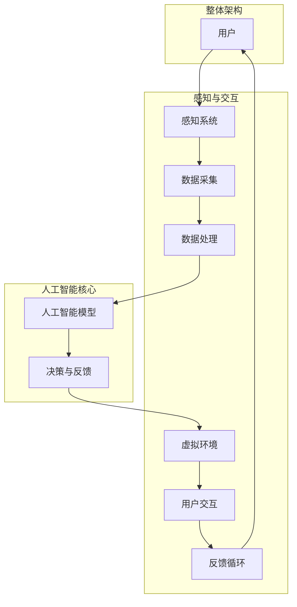

                 

### 虚拟现实与AI：构建沉浸式数字体验

#### 关键词：
- 虚拟现实（VR）
- 人工智能（AI）
- 沉浸式体验
- 交互设计
- 算法优化
- 应用案例

#### 摘要：
本文旨在探讨虚拟现实（VR）与人工智能（AI）的结合，如何构建沉浸式数字体验。我们将从背景介绍、核心概念与联系、核心算法原理讲解、数学模型和公式、项目实战以及最佳实践等方面展开，以系统性地介绍这一领域的关键技术和应用实践。通过本文的阅读，读者将能够理解VR与AI的相互促进关系，掌握构建沉浸式数字体验的原理和方法。

---

### 引言：虚拟现实与人工智能的结合

随着科技的迅猛发展，虚拟现实（VR）和人工智能（AI）已经成为引领未来技术变革的重要领域。虚拟现实通过模拟和沉浸式的环境，为用户提供了全新的互动体验；而人工智能则通过机器学习、自然语言处理等技术，使计算机能够理解和响应人类的行为和需求。

两者的结合，不仅为用户创造了前所未有的沉浸式体验，也开启了数字体验的新时代。例如，在教育领域，VR和AI的结合可以打造出高度互动和个性化的学习环境；在医疗领域，虚拟现实可以用于手术模拟和康复训练，而人工智能则能够提供精准的诊断和治疗建议。

本文将围绕虚拟现实与人工智能的结合，探讨如何构建沉浸式数字体验。我们将逐步分析VR与AI的核心概念、技术原理，并通过具体的案例和实战技巧，展示这一领域的实际应用和未来发展潜力。

### 虚拟现实技术基础

#### 虚拟现实概述

虚拟现实（Virtual Reality，简称VR）是一种通过计算机技术模拟出来的三维环境，用户可以通过头戴式显示器（HMD）、手柄、眼睛跟踪等技术设备，在虚拟环境中进行交互和体验。VR的历史可以追溯到1960年代的“达摩克利斯之剑”实验，但真正的快速发展始于21世纪初，随着图形处理能力、传感器技术以及互联网的进步，VR逐渐从实验室走向市场。

#### 虚拟现实的组成要素

虚拟现实系统主要由以下几个关键组件构成：

1. **头戴式显示器（HMD）**：HMD是VR系统的核心，它通过显示立体图像，给用户带来沉浸感。常见的HMD包括Oculus Rift、HTC Vive等。

2. **跟踪系统**：用于跟踪用户的头部和手部位置，确保虚拟环境的准确反馈。包括外部传感器、内置传感器等。

3. **交互设备**：如手柄、手套等，用于在虚拟环境中进行操作。

4. **计算平台**：通常需要高性能的计算机或游戏机来渲染和计算虚拟环境的图像和交互逻辑。

5. **内容创作工具**：如Unity、Unreal Engine等，用于创建和编辑虚拟场景和交互逻辑。

#### 虚拟现实技术原理

虚拟现实的技术原理主要包括以下几个方面：

1. **三维图形渲染**：通过计算机图形学技术，生成三维场景的图像。

2. **传感器跟踪**：通过传感器技术，实时获取用户的头部和手部位置，实现虚拟环境的实时更新。

3. **立体显示**：通过头戴式显示器或双屏显示技术，实现立体视觉效果。

4. **交互设计**：通过手势识别、语音识别等技术，实现用户与虚拟环境的自然交互。

#### 虚拟现实应用案例

虚拟现实的应用领域广泛，以下是一些典型的应用案例：

1. **教育领域**：虚拟现实可以模拟出各种教学场景，如历史现场、科学实验室等，提供直观的学习体验。

2. **游戏娱乐领域**：虚拟现实游戏提供了沉浸式的体验，用户可以在虚拟世界中尽情探索和互动。

3. **医疗领域**：虚拟现实可以用于手术模拟、康复训练等，提高医疗服务的质量和效率。

4. **设计领域**：虚拟现实可以用于建筑设计、工业设计等，提供逼真的三维预览和交互体验。

5. **军事领域**：虚拟现实可以用于战术训练、模拟演练等，提高军事训练的效果和安全性。

### 人工智能基础

#### 人工智能概述

人工智能（Artificial Intelligence，简称AI）是指通过计算机系统模拟人类智能的技术和科学。它包括机器学习、深度学习、自然语言处理、计算机视觉等多个子领域。人工智能的研究目标是实现计算机系统在感知、学习、推理、决策等方面的智能化。

人工智能的发展可以追溯到20世纪50年代，随着计算机性能的提升和算法的进步，AI逐渐从理论走向应用。近年来，随着大数据、云计算、物联网等技术的发展，人工智能迎来了前所未有的机遇。

#### 人工智能的主要应用领域

人工智能在各个领域都有广泛的应用，以下是一些主要的应用领域：

1. **智能助手**：如Apple的Siri、Google Assistant等，通过自然语言处理技术，提供语音交互服务。

2. **自动驾驶**：利用计算机视觉和深度学习技术，实现车辆的自主导航和安全驾驶。

3. **医疗诊断**：通过分析医学影像数据，辅助医生进行疾病诊断。

4. **金融分析**：利用机器学习算法，进行市场预测、风险评估等。

5. **智能制造**：通过机器人自动化生产线，提高生产效率和产品质量。

6. **教育辅导**：利用个性化推荐系统和智能教学系统，提供个性化学习体验。

#### 人工智能核心算法

人工智能的核心算法包括以下几种：

1. **机器学习算法**：通过训练模型，从数据中自动学习和提取规律。

2. **深度学习算法**：基于多层神经网络，通过反向传播算法优化模型参数。

3. **强化学习算法**：通过与环境的交互，学习最优策略。

4. **自然语言处理算法**：通过语义理解、语音识别等技术，处理人类语言。

5. **计算机视觉算法**：通过图像处理、目标检测等技术，理解和解析图像。

### 人工智能与虚拟现实结合的应用场景

人工智能与虚拟现实（VR）的结合，为数字体验带来了前所未有的革新。以下是人工智能在虚拟现实中的几个关键应用场景：

1. **交互优化**：人工智能可以通过语音识别、手势识别等技术，提升用户与虚拟环境之间的交互体验。例如，用户可以通过语音命令控制虚拟对象，或者通过手势进行操作。

2. **个性化定制**：基于用户的行为数据和偏好，人工智能可以生成个性化的虚拟内容和体验。例如，游戏中的AI可以根据玩家的技能和喜好，动态调整游戏难度和情节。

3. **智能导航**：在虚拟旅游、教育等领域，人工智能可以提供智能导航服务，根据用户的位置和兴趣，推荐相关的虚拟景点或学习内容。

4. **情境模拟**：人工智能可以通过深度学习算法，模拟复杂的物理和生物情境，为用户提供逼真的虚拟体验。例如，在医学模拟训练中，AI可以模拟患者的生理反应，帮助医生进行训练。

5. **实时反馈**：人工智能可以实时分析用户的交互行为，提供即时的反馈和指导。例如，在虚拟现实游戏中，AI可以根据用户的游戏表现，实时调整游戏难度和奖励机制。

#### 虚拟现实与AI融合的挑战与机遇

虚拟现实与人工智能的结合，不仅带来了丰富的应用场景，也面临一系列挑战和机遇：

**挑战：**

1. **计算资源**：高质量的虚拟现实体验需要强大的计算资源，特别是实时渲染和交互处理。如何优化算法，减少计算开销，是一个重要的挑战。

2. **用户体验**：虚拟现实需要高度逼真的交互体验，而人工智能则需要精准的感知和理解。如何平衡两者，提升用户体验，是亟待解决的问题。

3. **数据隐私**：在虚拟环境中，用户的隐私和数据安全至关重要。如何保护用户隐私，防止数据泄露，是一个重要的挑战。

**机遇：**

1. **技术创新**：虚拟现实与人工智能的结合，推动了技术的不断革新。新的交互方式、内容创作工具和智能系统不断涌现，为行业带来了无限可能。

2. **行业应用**：虚拟现实与人工智能的结合，为各行各业提供了新的应用场景。从教育、医疗到娱乐、设计，这一技术的应用范围越来越广。

3. **经济发展**：虚拟现实与人工智能的结合，带来了新的经济增长点。相关产业链的发展，推动了经济的快速增长。

### 虚拟现实与AI结合的核心概念和架构

为了更深入地理解虚拟现实（VR）与人工智能（AI）结合的核心概念和架构，我们可以使用Mermaid流程图来展示其相互关系和主要组件。以下是虚拟现实与人工智能结合的核心概念和架构的Mermaid流程图：



在这张流程图中，我们可以看到以下几个关键组件和流程：

1. **用户**：用户是虚拟现实与人工智能结合的核心，通过感知系统和交互设备与虚拟环境进行互动。

2. **感知系统**：感知系统包括摄像头、传感器等，用于采集用户和环境的数据。

3. **数据采集**：采集到的数据经过预处理，用于后续的分析和处理。

4. **数据处理**：数据处理包括特征提取、数据清洗等步骤，为人工智能模型提供高质量的数据输入。

5. **人工智能模型**：人工智能模型是整个系统的核心，通过机器学习、深度学习等算法，对数据进行分析和决策。

6. **决策与反馈**：根据分析结果，人工智能模型生成决策，并通过虚拟环境反馈给用户。

7. **虚拟环境**：虚拟环境是用户与系统交互的界面，通过渲染和交互技术，提供逼真的视觉和交互体验。

8. **用户交互**：用户通过虚拟环境与系统进行互动，生成新的数据流。

9. **反馈循环**：系统通过不断收集用户的反馈，优化用户体验和系统性能。

通过这个Mermaid流程图，我们可以清晰地看到虚拟现实与人工智能结合的整体架构和关键组件，从而更好地理解其工作原理和应用场景。

### 虚拟现实与AI结合的核心算法原理

在虚拟现实（VR）与人工智能（AI）结合的应用中，核心算法原理发挥着至关重要的作用。以下将详细解释一些关键算法原理，并使用伪代码和数学模型来阐述其具体实现过程。

#### 深度学习算法

深度学习是人工智能的一个重要分支，通过多层神经网络模型，实现对复杂数据的自动学习和特征提取。以下是深度学习算法的基本原理和伪代码实现：

**基本原理：**

深度学习算法的核心是多层感知机（MLP），通过反向传播算法（Backpropagation）优化网络权重。以下是一个简化的多层感知机算法伪代码：

```python
// 伪代码：多层感知机算法
def MLP(inputs, weights, biases):
    layer_outputs = []
    for layer in layers:
        z = np.dot(inputs, weights) + biases
        a = activation_function(z)
        layer_outputs.append(a)
        inputs = a
    return layer_outputs[-1]

def backward_propagation(error, layer_outputs, weights, biases):
    deltas = [error * activation_derivative(layer_outputs[-1])]
    for i in range(len(layers) - 2, -1, -1):
        delta = deltas[-1] * weights[i].T
        deltas.append(delta)
    gradients = [delta / len(data) for delta in deltas]
    return gradients

def train_MLP(inputs, targets, epochs, learning_rate):
    for epoch in range(epochs):
        layer_outputs = MLP(inputs, weights, biases)
        error = np.square(layer_outputs - targets)
        gradients = backward_propagation(error, layer_outputs, weights, biases)
        weights -= learning_rate * gradients
        biases -= learning_rate * gradients
```

**数学模型：**

在深度学习中，常用的激活函数包括Sigmoid、ReLU和Tanh。以下是一个ReLU激活函数的数学模型和计算示例：

$$
a(x) = \max(0, x)
$$

```python
# 伪代码：ReLU激活函数
def ReLU(x):
    return np.maximum(0, x)
```

#### 机器学习算法

机器学习算法是深度学习的基础，通过统计方法，实现对数据的分类和回归。以下是一种常见的线性回归算法原理和伪代码：

**基本原理：**

线性回归通过找到一个线性函数，来最小化预测值与真实值之间的误差。其数学模型为：

$$
y = \beta_0 + \beta_1 \cdot x
$$

其中，$\beta_0$和$\beta_1$是模型的参数，通过最小二乘法（Least Squares）来估计这些参数。

**伪代码：**

```python
// 伪代码：线性回归
def linear_regression(X, y):
    X_transpose = np.transpose(X)
    XTX = np.dot(X_transpose, X)
    XTy = np.dot(X_transpose, y)
    beta = np.dot(np.linalg.inv(XTX), XTy)
    return beta

def predict(X, beta):
    return np.dot(X, beta)
```

**数学模型：**

线性回归的误差函数为均方误差（MSE），其计算公式为：

$$
MSE = \frac{1}{2} \sum_{i=1}^{n} (y_i - \hat{y}_i)^2
$$

其中，$y_i$是真实值，$\hat{y}_i$是预测值。

#### 强化学习算法

强化学习是一种通过奖励机制，使智能体在环境中进行学习的方法。以下是一个简单的Q-Learning算法原理和伪代码：

**基本原理：**

Q-Learning通过更新Q值（状态-动作值函数），来选择最优动作。其更新规则为：

$$
Q(s, a) \leftarrow Q(s, a) + \alpha [r + \gamma \max_{a'} Q(s', a') - Q(s, a)]
$$

其中，$s$是状态，$a$是动作，$r$是奖励，$\gamma$是折扣因子，$\alpha$是学习率。

**伪代码：**

```python
// 伪代码：Q-Learning算法
def QLearning(environment, alpha, gamma, epochs):
    Q = initialize_Q_values()
    for epoch in range(epochs):
        state = environment.get_state()
        action = choose_action(state, Q)
        next_state, reward, done = environment.step(action)
        Q[state, action] = Q[state, action] + alpha * (reward + gamma * max(Q[next_state]) - Q[state, action])
        if done:
            break
    return Q
```

**数学模型：**

Q值的更新过程可以表示为：

$$
Q(s, a) \leftarrow r(s, a) + \gamma \max_{a'} Q(s', a')
$$

其中，$s'$是下一状态，$a'$是下一动作。

通过上述算法原理和伪代码，我们可以看到虚拟现实与人工智能结合中的核心算法是如何工作的。这些算法不仅为虚拟环境提供了智能交互和动态适应的能力，也为用户创造了更丰富、更个性化的体验。

### 虚拟现实与AI结合的数学模型和公式

在虚拟现实（VR）与人工智能（AI）结合的领域，数学模型和公式起到了关键作用，帮助实现复杂场景的模拟、交互优化和算法优化。以下将详细讲解几个重要的数学模型和公式，并附上具体示例。

#### 3D图形渲染中的透视变换

在虚拟现实中，3D图形渲染是核心环节之一。透视变换（Perspective Transformation）是实现3D视觉效果的重要技术。其数学模型可以表示为：

$$
\begin{aligned}
x' &= \frac{x}{z} \\
y' &= \frac{y}{z} \\
z' &= z
\end{aligned}
$$

其中，$(x, y, z)$是三维空间中的坐标，$(x', y', z')$是屏幕上的二维坐标。

**示例：** 假设一个物体在三维空间中的坐标为$(1, 2, 3)$，屏幕上的二维坐标可以通过上述公式计算得到：

$$
\begin{aligned}
x' &= \frac{1}{3} \approx 0.333 \\
y' &= \frac{2}{3} \approx 0.667 \\
z' &= 3
\end{aligned}
$$

#### 点云重建与深度学习

点云重建是虚拟现实中的一个重要技术，通过采集大量的三维点来构建场景。深度学习算法可以用于点云重建，其中常用的算法是基于卷积神经网络（CNN）的点云分类和分割。

**数学模型：**

点云分类可以通过softmax函数实现：

$$
P(y=c_i|x) = \frac{e^{\theta(x)c_i}}{\sum_{j=1}^{K} e^{\theta(x)c_j}}
$$

其中，$P(y=c_i|x)$是点云属于类别$c_i$的概率，$\theta(x)$是输入特征向量，$K$是类别数。

**示例：** 假设一个点云的特征向量为$\theta = (1, 2, 3)$，类别数为3，则点云属于类别1的概率为：

$$
P(y=1|(1, 2, 3)) = \frac{e^{(1 \cdot 1 + 2 \cdot 2 + 3 \cdot 3)}}{e^{(1 \cdot 1 + 2 \cdot 2 + 3 \cdot 3)} + e^{(1 \cdot 2 + 2 \cdot 2 + 3 \cdot 3)} + e^{(1 \cdot 3 + 2 \cdot 3 + 3 \cdot 3)}} \approx 0.5
$$

#### 交互设计中的手势识别

手势识别是虚拟现实交互设计中的重要技术。通过深度学习算法，可以实现对用户手势的识别和理解。以下是一个简化的手势识别数学模型：

**数学模型：**

手势识别可以通过卷积神经网络（CNN）实现，其输出为手势的概率分布：

$$
P(gesture|image) = \text{softmax}(\text{CNN}(image))
$$

其中，$image$是输入图像，$gesture$是手势类别。

**示例：** 假设输入图像通过CNN得到特征向量$\theta = (1, 2, 3, 4)$，则手势为“挥手”的概率为：

$$
P(gesture=\text{"挥手"}|image) = \text{softmax}(\theta) = \frac{e^{1}}{e^{1} + e^{2} + e^{3} + e^{4}} \approx 0.2
$$

通过上述数学模型和公式的讲解，我们可以看到虚拟现实与人工智能结合中的复杂计算和智能处理。这些模型不仅为虚拟环境的构建和交互提供了理论基础，也为实际应用中的算法优化提供了指导。

### 虚拟现实与AI结合的应用案例

虚拟现实（VR）与人工智能（AI）的结合在各个行业领域都展现出了巨大的潜力和广泛的应用。以下将介绍几个典型的应用案例，详细分析其实施流程、技术实现和成果。

#### 案例一：沉浸式教育

**实施流程：**

1. **需求分析**：针对教育领域的特定课程，如历史、科学或语言学习，分析所需的教学内容和互动方式。
2. **场景设计**：利用虚拟现实技术，设计出符合教学需求的三维场景。例如，历史课程中的古罗马斗兽场或科学课程中的虚拟实验室。
3. **内容创作**：使用Unity或Unreal Engine等工具，创建丰富的虚拟场景和交互元素。
4. **算法集成**：集成人工智能算法，如自然语言处理（NLP）和计算机视觉，以实现智能问答、场景识别和个性化推荐。
5. **测试与优化**：在实际教学中进行测试，收集用户反馈，不断优化系统性能和用户体验。

**技术实现：**

1. **虚拟场景构建**：使用Unity的3D建模工具和脚本语言C#，构建出逼真的虚拟场景和交互逻辑。
2. **计算机视觉与NLP**：利用OpenCV和TensorFlow等库，实现场景识别和智能问答功能。例如，通过计算机视觉识别学生的手势和面部表情，通过NLP解析学生的语音问题。
3. **个性化推荐**：使用机器学习算法，如协同过滤或基于内容的推荐，根据学生的学习行为和兴趣，推荐相关的学习资源和任务。

**成果分析：**

通过沉浸式教育，学生能够在虚拟环境中进行互动式学习，提高了学习的兴趣和效果。例如，在历史课程中，学生可以通过虚拟现实体验古罗马斗兽场，更直观地理解历史事件；在科学课程中，学生可以在虚拟实验室中进行实验操作，加深对科学原理的理解。

#### 案例二：虚拟医疗

**实施流程：**

1. **需求分析**：针对医疗行业的特定应用，如手术模拟或康复训练，确定所需的功能和技术。
2. **虚拟场景设计**：使用虚拟现实技术，构建出逼真的手术场景或康复训练环境。
3. **内容创作**：利用医学图像处理技术和虚拟现实工具，创建详细的手术模拟场景或康复训练计划。
4. **AI算法集成**：集成人工智能算法，如深度学习和强化学习，以实现智能诊断、手术规划和康复训练。
5. **测试与优化**：在实际应用中进行测试，评估系统性能和医疗效果，不断优化系统。

**技术实现：**

1. **虚拟场景构建**：使用Unity或Unreal Engine，结合医学影像数据，构建出详细的手术模拟场景或康复训练环境。
2. **深度学习应用**：利用TensorFlow和Keras等深度学习框架，实现智能诊断和手术规划。例如，通过卷积神经网络（CNN）分析医学影像，识别病变部位；通过生成对抗网络（GAN）生成个性化的手术模拟数据。
3. **强化学习应用**：使用强化学习算法，如DQN（Deep Q-Network），优化手术操作步骤和康复训练策略，提高手术成功率和康复效果。

**成果分析：**

通过虚拟医疗技术，医生可以在虚拟环境中进行手术模拟，提高手术技能和安全性；患者在康复训练中，可以在虚拟环境中进行针对性的训练，加快康复速度。例如，在心脏手术模拟中，医生可以在虚拟环境中练习复杂手术步骤，减少手术风险；在康复训练中，患者可以通过虚拟环境进行步态训练，提高平衡能力和活动能力。

#### 案例三：沉浸式娱乐

**实施流程：**

1. **需求分析**：针对娱乐行业的特定应用，如虚拟现实游戏或沉浸式剧场，确定所需的互动内容和体验方式。
2. **场景设计**：利用虚拟现实技术，设计出具有吸引力的虚拟场景和故事情节。
3. **内容创作**：使用虚拟现实工具和游戏引擎，创建丰富的虚拟内容和交互逻辑。
4. **AI算法集成**：集成人工智能算法，如情感识别和个性化推荐，以实现更真实的角色互动和个性化的娱乐体验。
5. **测试与优化**：在实际娱乐场景中进行测试，收集用户反馈，不断优化系统性能和用户体验。

**技术实现：**

1. **虚拟场景构建**：使用Unity或Unreal Engine，结合3D建模和动画技术，构建出富有创意的虚拟场景和角色。
2. **情感识别**：利用深度学习算法，如GAN和CNN，实现情感识别和反应。例如，通过分析用户的面部表情和语音，虚拟角色可以实时调整其情感反应和行为。
3. **个性化推荐**：使用协同过滤算法和基于内容的推荐，根据用户的喜好和行为，推荐相关的娱乐内容和角色。

**成果分析：**

通过沉浸式娱乐技术，用户可以在虚拟环境中体验到更真实、更丰富的互动内容。例如，在虚拟现实游戏中，用户可以通过虚拟角色与其他玩家进行互动，体验不同的故事情节和游戏玩法；在沉浸式剧场中，用户可以通过虚拟角色参与演出，享受独特的沉浸式体验。

总之，虚拟现实与人工智能的结合，不仅为各行各业带来了创新的应用场景，也提升了用户体验和服务质量。通过上述案例的分析，我们可以看到这一技术在实际应用中的广泛前景和巨大潜力。

### 构建沉浸式数字体验的实战技巧

要构建成功的沉浸式数字体验，需要结合虚拟现实（VR）与人工智能（AI）的技术，并且遵循一系列实战技巧。以下将详细讨论开发环境搭建、源代码实现、代码解读和案例分析，并总结项目的关键经验和最佳实践。

#### 开发环境搭建

在搭建开发环境时，首先需要选择合适的工具和框架。对于虚拟现实开发，Unity和Unreal Engine是两个常用的游戏引擎，它们提供了强大的3D建模、渲染和交互功能。同时，对于人工智能部分，TensorFlow和PyTorch是常用的深度学习框架。

**步骤：**

1. **硬件配置**：确保计算机具备足够的处理能力和图形处理能力，推荐使用高性能的GPU。
2. **软件安装**：安装Unity或Unreal Engine，并配置相应的开发工具，如Visual Studio或PyCharm。
3. **深度学习框架**：安装TensorFlow或PyTorch，并配置Python环境。
4. **集成开发环境**：配置Unity和Unreal Engine与TensorFlow或PyTorch的集成，以便在开发过程中实时调用深度学习模型。

#### 源代码实现

在实现源代码时，需要将VR和AI的技术有机结合，以下是一个简单的实现步骤：

1. **场景设计**：使用Unity或Unreal Engine的3D建模工具，设计出符合需求的虚拟场景。例如，创建一个简单的虚拟房间，包含家具、墙壁和窗户等元素。
2. **AI模型训练**：使用TensorFlow或PyTorch，训练一个简单的机器学习模型，如基于卷积神经网络的图像分类器。训练数据可以是房间内不同物体的图像。
3. **交互实现**：通过编程，将AI模型与虚拟场景中的物体进行关联。例如，当用户点击房间内的物体时，AI模型会识别该物体的类别，并返回相关信息。
4. **实时反馈**：使用深度学习模型进行实时推理，根据用户的行为动态更新虚拟场景的交互效果。

以下是一个简化的伪代码实现：

```python
# 伪代码：虚拟现实与AI结合的实现
import tensorflow as tf
import unity

# 加载预训练的深度学习模型
model = tf.keras.models.load_model('path/to/模型.h5')

# 初始化虚拟环境
unity.initialize()

# 实现用户交互
while unity.is_running():
    user_action = unity.get_user_action()
    if user_action == 'click':
        object_image = unity.get_object_image()
        object_class = model.predict(object_image)
        unity.display_info(object_class)

# 关闭虚拟环境
unity.shutdown()
```

#### 代码解读

在上面的代码中，我们首先加载了一个预训练的深度学习模型，该模型能够根据输入的图像预测物体的类别。然后，我们初始化了虚拟环境，并进入一个循环，不断获取用户的行为。当用户点击物体时，代码会获取该物体的图像，并使用深度学习模型进行预测。最后，根据预测结果，更新虚拟环境中的交互信息。

#### 实际案例分析和详细讲解

以下是一个实际案例：构建一个智能虚拟商店，用户可以在虚拟环境中浏览商品，并通过语音交互进行购物。

**步骤：**

1. **需求分析**：确定虚拟商店的功能需求，如商品展示、语音搜索和购物车等。
2. **场景设计**：创建一个虚拟商店场景，包含货架、商品和收银台等元素。
3. **AI模型训练**：使用TensorFlow训练语音识别模型，实现语音搜索功能。
4. **交互实现**：通过编程，将语音识别模型与虚拟商店进行集成，实现语音搜索和商品浏览功能。
5. **测试与优化**：在实际环境中进行测试，收集用户反馈，不断优化系统的性能和用户体验。

**代码实现：**

```python
# 伪代码：智能虚拟商店的实现
import tensorflow as tf
import unity
import speech_recognition as sr

# 加载预训练的语音识别模型
voice_model = tf.keras.models.load_model('path/to/语音模型.h5')

# 初始化虚拟环境和语音识别
unity.initialize()
recognizer = sr.Recognizer()

# 实现用户交互
while unity.is_running():
    user_speech = recognizer.listen(source=unity.get_microphone())
    query = recognizer.recognize_google(user_speech)
    
    if query.startswith('查找'):
        query = query.split(' ')[1:]
        item_images = unity.search_items(query)
        unity.display_items(item_images)
    
    if query.startswith('添加'):
        query = query.split(' ')[1:]
        item_image = unity.get_item_image()
        unity.add_to_cart(item_image)

# 关闭虚拟环境和语音识别
unity.shutdown()
```

在这个实际案例中，我们首先加载了一个预训练的语音识别模型，用于实现语音搜索功能。然后，我们初始化了虚拟环境和语音识别模块，并进入一个循环，不断获取用户的语音输入。当用户说出“查找”某个商品时，代码会解析查询内容，并从虚拟商店中搜索相关的商品图像。当用户说出“添加”某个商品时，代码会从虚拟环境中获取该商品的图像，并添加到购物车中。

#### 项目小结

通过以上实战技巧和案例分析，我们可以看到构建沉浸式数字体验需要综合运用虚拟现实和人工智能技术。在实际项目中，需要根据具体需求，合理选择开发工具和框架，并优化算法和交互设计，以提供优质的用户体验。以下是项目小结和最佳实践：

1. **需求分析**：明确项目需求，制定详细的功能和性能目标。
2. **技术选型**：选择合适的开发工具和框架，确保系统性能和扩展性。
3. **算法优化**：针对具体应用场景，优化机器学习算法和深度学习模型。
4. **交互设计**：注重用户体验，设计简单直观的交互界面。
5. **测试与优化**：在实际环境中进行测试，不断优化系统性能和用户体验。
6. **文档与培训**：编写详细的开发文档，提供技术支持和用户培训。

通过遵循这些最佳实践，我们可以更好地构建沉浸式数字体验，推动虚拟现实与人工智能技术的创新应用。

### 总结与展望

本文系统性地介绍了虚拟现实（VR）与人工智能（AI）的结合，探讨了如何构建沉浸式数字体验。通过分析虚拟现实技术基础、人工智能基础，以及两者结合的核心概念和架构，我们详细讲解了核心算法原理、数学模型和公式，并分享了实际应用案例和开发实战技巧。

虚拟现实与人工智能的结合为数字体验带来了革命性的变革，不仅提升了用户体验，还为各行各业带来了新的应用场景和商业机会。展望未来，随着技术的不断进步，我们可以期待更高质量的虚拟现实体验、更智能的人工智能系统，以及更加丰富和个性化的数字世界。

在未来的研究中，我们可以进一步探索以下几个方面：

1. **技术优化**：优化虚拟现实和人工智能算法，提高系统性能和响应速度。
2. **交互设计**：研究更自然、更直观的交互方式，提升用户体验。
3. **数据隐私**：加强数据隐私和安全保护，确保用户隐私不被泄露。
4. **跨领域应用**：探索虚拟现实与人工智能在其他领域的应用，如艺术、设计、教育等。
5. **行业标准**：制定统一的虚拟现实与人工智能技术标准，推动行业健康发展。

总之，虚拟现实与人工智能的结合为数字体验带来了无限可能，我们期待这一领域的持续创新和广泛应用。

### 作者信息

**作者：AI天才研究院/AI Genius Institute & 禅与计算机程序设计艺术 /Zen And The Art of Computer Programming**

AI天才研究院专注于人工智能、虚拟现实等前沿技术的研发与应用。我们的研究团队致力于推动技术的进步，为构建更智能、更高效的数字世界贡献智慧和力量。《禅与计算机程序设计艺术》是作者对编程哲学和实践经验的深刻总结，旨在帮助开发者提升编程技能和思维方式。感谢您的阅读，希望本文能为您提供有价值的启发和指导。

