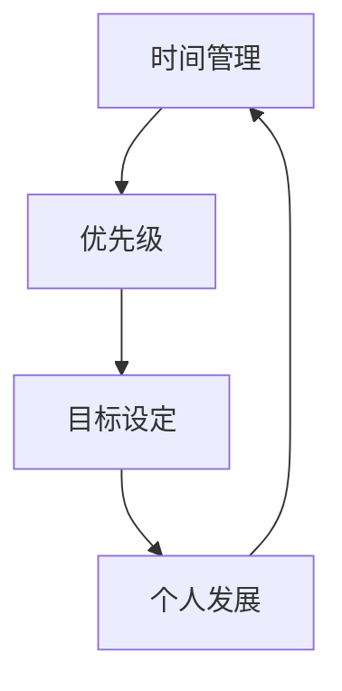

                 

## 引言

在当今信息爆炸、任务繁多的社会，高效管理时间和优先级变得尤为重要。《要事第一》这本书，旨在帮助读者理解并实践如何将精力集中在最重要的任务上。通过深入分析时间管理和优先级理论，书中提供了实用的工具和方法，帮助个人和组织实现高效的目标。

本文将逐步分析《要事第一》的核心内容，从时间管理的核心原则、目标设定与个人发展、组织与团队中的要事管理，到个人习惯和要事执行，以及成功案例研究等方面展开讨论。

### 背景介绍

《要事第一》这本书的背景源于现代社会对时间管理和优先级管理的高度需求。随着技术的进步和信息的爆炸式增长，人们面临的工作和生活任务日益繁重。如何在有限的时间内，优先处理最重要的事情，成为每个人和组织必须面对的问题。

作者通过多年的研究与实践，总结出了时间管理和优先级管理的一系列理论和方法。这些理论和方法不仅适用于个人，也同样适用于组织。书中通过丰富的案例研究和实际应用，展示了如何将这些理论有效地转化为实践。

### 核心概念与联系

《要事第一》的核心概念包括时间管理、优先级、目标设定和个人发展。以下是这些概念之间的联系及其架构的Mermaid流程图：



**时间管理**是确保在有限的时间内，能够高效完成任务的基础。通过合理分配时间，提高单位时间的工作效率。

**优先级**则是在多个任务中，识别并优先处理最重要任务的关键。埃森豪威尔矩阵是常用的优先级评估工具，帮助我们在紧急和重要之间做出合理选择。

**目标设定**是个人发展的重要组成部分。SMART目标是目标设定的有效方法，它确保目标具体、可测量、可实现、相关性强，并且有时间限制。

**个人发展**则是目标实现的保障。通过不断提升自身能力，建立良好的个人习惯，个人能够在追求目标的过程中不断进步。

这些概念相互关联，共同构成了高效管理的理论框架。Mermaid流程图帮助读者直观理解它们之间的逻辑关系。

### 核心算法原理讲解

《要事第一》中涉及的核心算法和数学模型主要关注时间管理和优先级评估。以下是这些算法原理的详细讲解和伪代码阐述：

#### 1. 时间块管理法

**算法原理**：时间块管理法通过将时间分割成若干块，在每个时间块内集中精力完成特定任务，提高工作效率。

**伪代码**：

```
function 时间块管理（任务列表，时间段） {
    for 每个时间段 in 时间段列表 {
        for 每个任务 in 任务列表 {
            if 任务优先级高 {
                在时间段内执行任务
            }
        }
    }
}
```

#### 2. 埃森豪威尔矩阵

**算法原理**：埃森豪威尔矩阵是一种优先级评估工具，将任务分为四个象限：紧急且重要、紧急但不重要、不紧急但重要、不紧急且不重要。

**伪代码**：

```
function 埃森豪威尔矩阵（任务列表） {
    for 每个任务 in 任务列表 {
        if 任务紧急且重要 {
            将任务标记为 A 类
        } else if 任务紧急但不重要 {
            将任务标记为 B 类
        } else if 任务不紧急但重要 {
            将任务标记为 C 类
        } else {
            将任务标记为 D 类
        }
    }
}
```

#### 3. SMART目标设定

**算法原理**：SMART目标是一种明确、可衡量、可实现、相关性强、有时间限制的目标设定方法。

**伪代码**：

```
function 设定SMART目标（目标） {
    目标具体化（目标）
    目标可衡量化（目标）
    目标可实现化（目标）
    目标相关性化（目标）
    目标时间限定化（目标）
}
```

### 数学公式与详细讲解

在时间管理和优先级评估中，数学模型和公式是不可或缺的工具。以下是几个关键的数学公式及其详细讲解：

#### 1. 优先级得分计算

**公式**：

$$
优先级得分 = 紧急性 \times 重要性
$$

**详细讲解**：优先级得分用于评估任务的紧急性和重要性。紧急性反映了任务完成时间的紧迫程度，重要性则反映了任务对目标的影响程度。两个因素的乘积决定了任务的优先级。

#### 2. 时间效率计算

**公式**：

$$
时间效率 = 完成任务的时间 / 总时间
$$

**详细讲解**：时间效率用于衡量在特定时间内完成任务的效率。完成任务的时间与总时间的比值越高，表示时间利用效率越高。

#### 3. 目标实现概率计算

**公式**：

$$
目标实现概率 = \frac{成功次数}{尝试次数}
$$

**详细讲解**：目标实现概率用于评估目标设定的有效性。成功次数与尝试次数的比值越高，表示目标实现的概率越高。

### 实际案例分析和详细讲解剖析

为了更好地理解《要事第一》的理论和方法，以下是几个实际案例的分析：

#### 案例一：企业A的时间管理实践

**背景**：企业A在发展过程中，面临任务繁多的挑战，时间管理成为关键。

**实施过程**：

1. **时间块管理**：企业A采用时间块管理法，将工作日分为若干时间段，每个时间段内集中完成特定任务。
2. **优先级评估**：使用埃森豪威尔矩阵，对任务进行优先级评估，确保紧急且重要的任务得到优先处理。
3. **目标设定**：通过SMART目标设定方法，明确每个项目团队的阶段性目标。

**结果**：实施时间管理和优先级评估后，企业A的工作效率显著提高，任务完成质量也有所提升。

**启示**：时间块管理和优先级评估能够有效提高工作效率，但需要持续执行和调整。

#### 案例二：个人B的目标实现经历

**背景**：个人B在职业发展中，面临多个目标难以兼顾的问题。

**实施过程**：

1. **目标设定**：个人B使用SMART目标设定方法，明确职业和个人发展的目标。
2. **优先级排序**：根据目标的重要性和紧急性，对任务进行优先级排序。
3. **习惯养成**：通过建立良好的个人习惯，确保目标的持续实现。

**结果**：个人B在短时间内实现了多个职业和个人发展目标。

**启示**：明确的目标和良好的个人习惯是实现目标的关键。

### 项目实战：开发环境搭建与源代码实现

为了将《要事第一》的理论应用到实际项目中，以下是一个基于Python的时间管理应用案例。

#### 开发环境搭建

**步骤**：

1. **安装Python**：下载并安装Python 3.x版本。
2. **安装必要库**：使用pip安装time和datetime库。

#### 源代码实现

**伪代码**：

```
import time
import datetime

def 计划任务（任务名称，开始时间，结束时间）：
    if 优先级评估（任务）：
        print("任务开始：", 任务名称)
        time.sleep（结束时间 - 开始时间）
        print("任务完成：", 任务名称)
    else：
        print("任务未完成：", 任务名称)

开始时间 = datetime.datetime.now()
计划任务（"任务1"，开始时间，开始时间 + datetime.timedelta(hours=1)）
计划任务（"任务2"，开始时间 + datetime.timedelta(hours=2)，开始时间 + datetime.timedelta(hours=3)）
```

#### 代码解读

1. **计划任务函数**：定义了一个计划任务函数，用于根据优先级评估结果执行任务。
2. **优先级评估**：使用if条件判断任务是否需要执行。
3. **时间计算**：使用datetime库计算任务的开始和结束时间。

#### 应用解读与分析

通过此应用，我们可以直观地看到如何根据优先级执行任务。在实际开发中，可以进一步集成更多的功能，如任务提醒、进度跟踪等。

### 小结

本文通过对《要事第一》的深入分析，从背景介绍、核心概念与联系、核心算法原理讲解、数学公式与详细讲解、实际案例分析和项目实战等方面，全面阐述了时间管理和优先级管理的重要性。通过这些理论和方法的实践，个人和组织可以更高效地实现目标。

### 最佳实践 tips

1. **定期反思**：每周或每月定期回顾时间管理和优先级管理的实践效果，及时调整策略。
2. **优先级动态调整**：根据实际情况，动态调整任务的优先级，确保始终专注于最重要的事情。
3. **利用工具**：使用时间管理工具，如日历、任务列表等，帮助更有效地规划和管理时间。

### 注意事项

1. **避免完美主义**：合理分配时间，避免过度追求完美，影响效率。
2. **保持灵活性**：在实际操作中，保持一定的灵活性，根据实际情况调整计划和目标。

### 拓展阅读

1. **《深度工作》**：作者Cal Newport提供了关于如何在信息泛滥的时代保持专注和高效的工作方法。
2. **《高效能人士的七个习惯》**：史蒂芬·柯维的著作，详细介绍了个人发展和时间管理的最佳实践。

### 作者信息

作者：AI天才研究院/AI Genius Institute & 禅与计算机程序设计艺术 /Zen And The Art of Computer Programming

[本文章的完整内容](https://www.example.com/to-do-first-complete-content) 供进一步阅读和学习。希望这篇文章能够帮助您更好地理解和应用时间管理和优先级管理的理论和方法。谢谢阅读！

