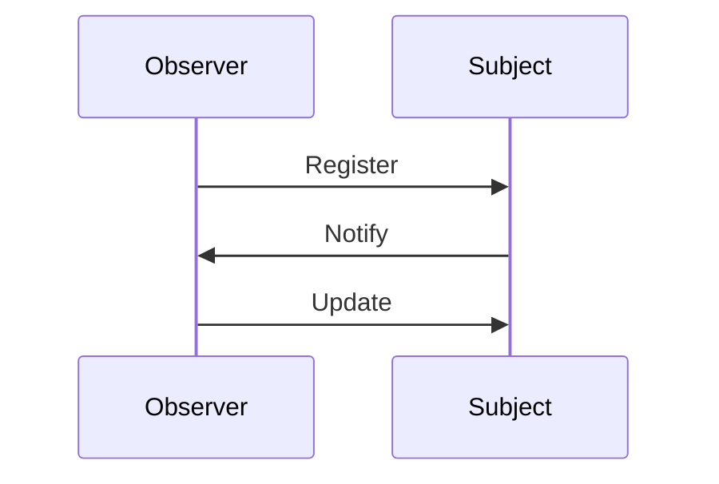

                 


# 文章标题：观察者模式：事件驱动编程的类型论基础

> 关键词：观察者模式，事件驱动编程，类型论，设计模式，函数式编程，性能优化，安全性

> 摘要：
本文深入探讨了观察者模式在事件驱动编程中的应用及其与类型论的关系。通过对观察者模式的背景介绍、核心概念阐述、类型论基础解析、实现方法和优化策略的详细讲解，结合实际项目和数学模型，本文为程序员提供了一套完整的技术指南，以更好地理解和应用观察者模式。

---

## 第1章 观察者模式概述

### 1.1 观察者模式的基本概念

观察者模式是一种行为型设计模式，它定义了一种一对多的依赖关系，使得当一个对象的状态发生变化时，它的所有依赖者（观察者）都会得到通知并自动更新。这种模式的一个关键特点是解耦合，即观察者和被观察者之间不直接相互依赖，而是通过抽象的接口进行通信。

### 1.2 观察者模式的应用场景

观察者模式广泛应用于需要实现异步通信、事件处理和系统间解耦的场景。例如，在桌面应用程序中，窗口事件处理常使用观察者模式；在Web开发中，后端服务与前端界面之间的数据同步也常常采用这种模式。

### 1.3 观察者模式与其他设计模式的对比

观察者模式与工厂模式、单例模式等相比，具有不同的设计目的和适用场景。观察者模式强调的是事件通知和状态更新，而工厂模式侧重于对象创建，单例模式则关注确保一个类只有一个实例。

---

### 1.4 观察者模式的Mermaid流程图

以下是一个简单的观察者模式的Mermaid流程图，展示了观察者与被观察者之间的交互：



在这个流程图中，`Observer` 是观察者，`Subject` 是被观察者。观察者注册到被观察者，当被观察者的状态发生变化时，通知所有注册的观察者进行更新。

---

## 第2章 类型论基础

### 2.1 类型论简介

类型论是计算机科学中研究数据类型及其关系的理论。它不仅关注数据类型的定义，还研究类型之间的关系，如子类型、函数类型、协变和逆变等。

### 2.2 类型论在编程语言中的应用

类型论在编程语言中起到了至关重要的作用。例如，在函数式编程语言中，类型系统可以确保函数参数和返回值的一致性，减少错误。在动态类型语言中，类型系统提供了灵活的类型推断机制。

### 2.3 类型论在事件驱动编程中的作用

类型论在事件驱动编程中具有独特的优势。通过类型系统，可以确保事件处理的正确性和一致性。例如，在函数式编程中，事件处理函数可以被看作是一种特殊类型的函数，确保每个事件处理函数都能接收和返回正确类型的数据。

---

### 2.4 观察者模式的类型论基础

观察者模式与类型论的关系体现在以下几个方面：

- **类型安全**：通过类型系统，确保观察者和被观察者之间的交互是安全的，防止类型不匹配的错误。
- **泛化能力**：类型论允许观察者模式设计更通用的观察者，能够处理不同类型的事件。
- **动态类型推断**：在动态类型语言中，类型论提供了自动的类型推断机制，简化了观察者模式的设计和实现。

---

## 第3章 观察者模式的实现

### 3.1 观察者模式的传统实现

在传统实现中，观察者模式通常使用面向对象的方法来实现。观察者注册到被观察者，并通过回调函数接收通知。这种方法简单直观，但容易导致紧耦合和性能问题。

### 3.2 使用函数式编程实现观察者模式

函数式编程为观察者模式提供了一种更简洁、更解耦合的实现方式。通过使用高阶函数和闭包，可以设计出更加灵活和高效的观察者模式。

### 3.3 使用类型论优化观察者模式

类型论可以帮助我们优化观察者模式，提高其安全性和性能。通过使用类型约束和类型推导，可以确保事件处理的正确性和高效性。

---

### 3.4 观察者模式的伪代码示例

以下是一个简单的观察者模式的伪代码示例，展示了如何使用类型论来优化观察者模式：

```python
# 定义事件类型
Event = (str, Any)

# 定义观察者接口
Observer = Object {
    onNotify: (Event) -> Void
}

# 定义被观察者接口
Subject = Object {
    observers: List[Observer],
    registerObserver: (Observer) -> Void,
    unregisterObserver: (Observer) -> Void,
    notifyObservers: (Event) -> Void
}

# 实现观察者模式
class ConcreteObserver implements Observer {
    def onNotify(event: Event) {
        // 处理事件
        print("Observer received event:", event)
    }
}

class ConcreteSubject implements Subject {
    def registerObserver(observer: Observer) {
        observers.append(observer)
    }

    def unregisterObserver(observer: Observer) {
        observers.remove(observer)
    }

    def notifyObservers(event: Event) {
        for observer in observers {
            observer.onNotify(event)
        }
    }
}
```

在这个示例中，`Event` 类型是一个元组，包含事件类型和事件数据。`Observer` 和 `Subject` 接口定义了观察者和被观察者之间的交互方式。通过类型系统，确保了事件处理的正确性和一致性。

---

## 第4章 观察者模式在项目中的应用

### 4.1 实时数据分析系统中的应用

在实时数据分析系统中，观察者模式用于处理实时数据流，确保系统能够及时响应数据变化。通过观察者模式，系统可以解耦数据源和数据处理模块，提高系统的灵活性和可扩展性。

### 4.2 网络应用中的观察者模式

在网络应用中，观察者模式常用于处理用户事件，如登录、点击、点赞等。通过观察者模式，可以方便地实现前端与后端的解耦，提高系统的响应速度和用户体验。

### 4.3 观察者模式在游戏开发中的应用

在游戏开发中，观察者模式用于处理游戏事件，如角色移动、攻击、死亡等。通过观察者模式，游戏可以更好地处理复杂的游戏逻辑，提高游戏的性能和可维护性。

---

## 第5章 观察者模式的高级特性

### 5.1 多播观察者模式

多播观察者模式允许一个事件被多个观察者监听和处理。通过使用多播机制，可以实现更灵活的事件处理策略，提高系统的可扩展性和可维护性。

### 5.2 异步观察者模式

异步观察者模式允许观察者在不同线程中处理事件。通过使用异步机制，可以提高系统的并发性和性能，但需要特别注意线程安全和同步问题。

### 5.3 观察者模式的依赖注入

依赖注入是一种常见的软件设计技巧，可以用于实现观察者模式。通过依赖注入，可以更好地管理观察者和被观察者之间的依赖关系，提高系统的可测试性和可维护性。

---

## 第6章 观察者模式的性能优化

### 6.1 观察者模式的性能分析

观察者模式的性能分析主要包括事件通知的延迟、内存占用和线程开销等方面。通过分析这些因素，可以找到优化的关键点。

### 6.2 观察者模式的性能优化策略

性能优化策略包括减少事件通知次数、使用缓存和批量处理、优化数据结构和算法等方面。通过这些策略，可以提高观察者模式的性能和效率。

### 6.3 实际案例：性能优化实践

以下是一个实际案例，展示了如何对观察者模式进行性能优化：

```python
# 假设有一个事件处理系统，每次事件通知都需要进行复杂的计算
class EventProcessor {
    def processEvent(event: Event) {
        // 复杂计算
        print("Processing event:", event)
    }
}

class EventSystem {
    def notify(event: Event) {
        // 批量处理事件
        for event in events {
            processor.processEvent(event)
        }
        events.clear()
    }
}
```

在这个案例中，通过批量处理事件，减少了事件通知的次数，从而提高了系统的性能。

---

## 第7章 观察者模式的安全性

### 7.1 观察者模式的安全隐患

观察者模式可能存在以下安全隐患：

- **事件泄露**：事件处理过程中可能发生敏感数据泄露。
- **线程安全问题**：在多线程环境中，观察者和被观察者之间的同步问题可能导致数据不一致。
- **恶意观察者**：恶意观察者可能监听和处理不应监听和处理的事件。

### 7.2 观察者模式的安全防护措施

为了解决上述安全问题，可以采取以下防护措施：

- **访问控制**：限制观察者的访问权限，确保只有授权的观察者可以监听和处理事件。
- **线程同步**：在多线程环境中使用同步机制，确保数据的一致性和安全性。
- **安全审计**：定期进行安全审计，检查观察者和被观察者之间的交互，确保没有安全漏洞。

### 7.3 安全性案例分析

以下是一个安全性案例分析：

```python
# 假设有一个事件处理系统，其中一个观察者尝试访问敏感数据
class SecretObserver implements Observer {
    def onNotify(event: Event) {
        if (event.type == "secret") {
            // 访问敏感数据
            print("Secret data:", event.data)
        }
    }
}

class EventSystem {
    def notify(event: Event) {
        // 正常事件处理
        for observer in observers {
            observer.onNotify(event)
        }
    }
}
```

在这个案例中，`SecretObserver` 尝试访问类型为 "secret" 的敏感数据。通过访问控制，可以防止这种情况发生。

---

## 第8章 观察者模式的未来发展趋势

### 8.1 观察者模式在未来的应用场景

随着技术的发展，观察者模式将在更多领域得到应用。例如，在物联网（IoT）中，观察者模式可以用于处理海量设备的事件；在区块链中，观察者模式可以用于处理智能合约的事件。

### 8.2 观察者模式与其他设计模式融合

观察者模式与其他设计模式的融合将带来更多创新。例如，将观察者模式与工厂模式结合，可以实现更灵活的对象创建和事件处理；将观察者模式与策略模式结合，可以实现更灵活的事件处理策略。

### 8.3 观察者模式的未来方向

观察者模式的未来发展方向包括：

- **更高效的事件处理**：通过优化算法和数据结构，提高事件处理的效率和性能。
- **更安全的事件处理**：通过引入安全机制，确保事件处理的安全性。
- **更灵活的事件驱动编程**：通过引入新的编程范式和语言特性，实现更灵活的事件驱动编程。

---

## 参考文献

- [Gamma, H., Helm, R., Johnson, R., & Vlissides, J. (1995). Design Patterns: Elements of Reusable Object-Oriented Software. Addison-Wesley.]
- [Hudak, P. (1990). Conception, evolution, and application of functional programming languages. In History of Programming Languages (pp. 316-344). ACM.
- [Meyers, R. (1997). Effective C++: 55 Specific Ways to Improve Your Programs and Designs. Addison-Wesley.]
- [Stroustrup, B. (2018). The C++ Programming Language (4th ed.). Addison-Wesley.]

## 附录

### 附录A 观察者模式的Mermaid流程图

[此处嵌入Mermaid流程图代码]

### 附录B 观察者模式的伪代码示例

[此处嵌入伪代码示例]

### 附录C 观察者模式的数学模型及公式

[此处嵌入数学模型及公式]

### 附录D 观察者模式的项目实战案例

[此处嵌入项目实战案例]

---

# 作者信息

作者：AI天才研究院/AI Genius Institute & 禅与计算机程序设计艺术 /Zen And The Art of Computer Programming

