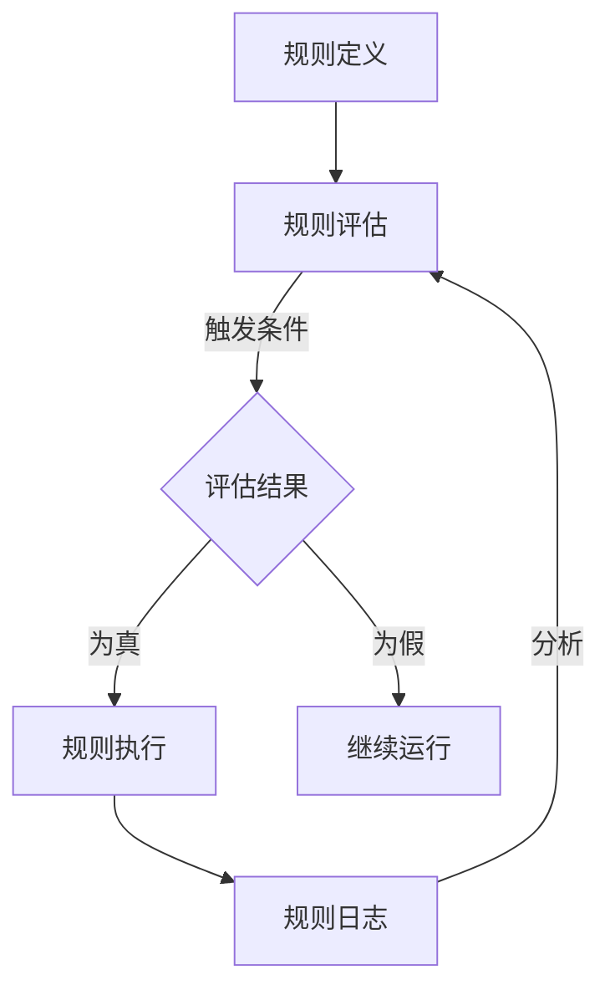

                 

### 《规则遵循与单元测试：验证行为一致性的方法论》

#### 关键词：
- 规则遵循
- 单元测试
- 行为一致性
- 质量保证
- 持续集成

#### 摘要：
本文将深入探讨规则遵循与单元测试在软件质量保证中的应用。我们将分析规则的定义、分类及其在软件系统中的作用，详细阐述单元测试的概念、类型和方法，并通过实际案例展示如何通过规则遵循和单元测试来验证软件行为的一致性，确保软件系统的稳定性和可靠性。文章还讨论了在持续集成环境中整合规则遵循和单元测试的最佳实践，并展望了未来质量保证技术的发展趋势。

---

## 引言与背景

软件系统的复杂性日益增加，使得质量保证成为软件开发过程中不可或缺的一环。规则遵循和单元测试是确保软件质量的重要手段，它们在软件开发的各个阶段发挥着关键作用。

**规则遵循**是指软件系统在运行过程中严格遵循预定义的规则，这些规则可以确保系统的行为符合业务需求和技术规范。规则可以涵盖从简单的数据校验到复杂的业务流程管理，它们在确保系统一致性和可靠性方面起着至关重要的作用。

**单元测试**是一种针对软件中的最小可测试单元（通常是函数、方法或类）的测试。单元测试的主要目标是验证每个单元是否按照预期工作，确保其行为一致性。单元测试通常由开发人员在编码过程中进行，是发现和修复缺陷的有效手段。

本文将首先介绍规则遵循和单元测试的基本概念，然后深入探讨它们在软件质量保证中的具体应用。我们将通过实际案例展示如何使用这些方法来验证软件行为的一致性，并讨论在持续集成环境中如何最佳地整合这些测试。

## 第一部分 规则遵循的基础知识

### 1.1 规则的定义与分类

#### 规则的定义

在软件工程中，规则是指一系列用于指导软件系统行为的明确指令或准则。这些规则可以是基于业务逻辑的，也可以是基于技术规范的，它们为系统的设计、开发和维护提供了重要的指导。

**业务规则**：这类规则通常描述了业务流程和操作的具体细节，如订单处理、支付流程、库存管理等。业务规则确保了软件系统能够准确地执行业务操作，满足业务需求。

**技术规则**：这类规则涉及到系统的技术实现细节，如数据格式、接口定义、性能要求等。技术规则确保了软件系统的技术实现符合既定标准，有助于提高系统的可靠性和可维护性。

**约束规则**：这类规则通常用于限制系统的行为，以保证数据的一致性和完整性。例如，在数据库中，约束规则可以确保表之间的关系保持一致，防止数据损坏。

#### 规则的分类

根据规则的作用和内容，可以将规则分为以下几类：

- **数据校验规则**：这类规则用于检查输入数据的格式、范围和有效性。例如，确保输入的电子邮件地址符合特定的格式，或者确保输入的数值在允许的范围内。

- **业务流程规则**：这类规则描述了业务流程的各个步骤和条件。例如，订单处理流程中，规则可能规定了订单状态从“创建”到“支付”再到“发货”的转换条件。

- **性能规则**：这类规则涉及系统的性能要求，如响应时间、吞吐量等。这些规则确保了系统在不同负载下的性能表现。

- **安全性规则**：这类规则涉及系统的安全防护措施，如用户认证、权限控制、数据加密等。这些规则确保了系统的安全性和数据的机密性。

#### 规则库的构建与管理

构建和管理规则库是确保规则遵循的基础。规则库是一个集中存储和管理规则的地方，它可以帮助开发人员、测试人员和运维人员快速查找和使用规则。

**规则库的构建**：

1. **需求收集**：首先需要收集业务和技术需求，明确系统需要遵循的规则。
2. **规则定义**：将收集到的需求转化为具体的规则，并定义每个规则的详细信息，如规则名称、规则描述、规则条件、执行动作等。
3. **规则分类**：根据规则的作用和内容，对规则进行分类，便于管理和查找。

**规则库的管理**：

1. **版本控制**：使用版本控制系统（如Git）来管理规则的版本，确保规则的变更记录清晰可查。
2. **权限管理**：为不同的角色分配不同的权限，确保只有授权人员可以修改和执行规则。
3. **规则执行监控**：通过监控系统来监控规则的执行情况，及时发现和解决问题。

### 1.2 规则执行与监控机制

规则执行与监控是确保规则遵循的关键步骤。一个有效的规则执行与监控机制可以帮助确保系统始终遵循预定义的规则，从而提高系统的稳定性和可靠性。

**规则执行**：

1. **规则评估**：在系统运行时，根据规则条件对当前状态进行评估，确定是否触发规则。
2. **规则执行**：如果评估结果为真，则执行规则的动作，如更新数据库、发送通知、调整系统配置等。
3. **规则日志**：记录规则执行的所有操作，便于后续审计和分析。

**规则监控**：

1. **实时监控**：通过实时监控系统（如Prometheus、Zabbix）来监控规则执行的状态和性能。
2. **异常告警**：当规则执行出现异常时，及时生成告警通知相关人员。
3. **日志分析**：定期分析规则执行日志，识别潜在的问题和改进点。

通过规则执行与监控机制，可以确保规则在系统中的有效执行，及时发现和解决问题，从而提高系统的可靠性和稳定性。

#### Mermaid 流程图

以下是一个简单的 Mermaid 流程图，展示了规则从定义到执行的流程：



### 1.3 规则遵循的重要性

**规则遵循在软件质量保证中的作用**：

1. **提高可靠性**：规则遵循可以确保系统的行为符合预期，减少错误和故障的发生，提高系统的可靠性。
2. **提升可维护性**：明确的规则有助于系统维护和升级，降低维护成本，提高开发效率。
3. **满足业务需求**：规则遵循可以确保系统满足业务需求，提高客户满意度，增强竞争力。
4. **保障数据一致性**：规则遵循可以确保数据的一致性和完整性，防止数据损坏和丢失。

在软件质量保证中，规则遵循是一个重要的环节，它为系统的设计和开发提供了明确的指导，有助于提高软件系统的质量和稳定性。

### 1.4 小结

在本章中，我们介绍了规则遵循的基本概念和分类，探讨了规则库的构建与管理，以及规则执行与监控机制。通过这些内容，我们可以更好地理解规则在软件质量保证中的重要作用，为后续的单元测试讨论打下基础。

## 第二部分 单元测试的基本概念

### 2.1 单元测试的定义与目的

#### 单元测试的定义

单元测试（Unit Testing）是一种针对软件中的最小可测试单元（通常是函数、方法或类）的测试。它的主要目的是验证每个单元是否按照预期工作，确保其行为一致性。单元测试通常由开发人员在编码过程中进行，是发现和修复缺陷的有效手段。

#### 单元测试的目的

1. **验证功能实现**：单元测试可以验证每个单元是否实现了预期的功能，确保系统的功能完整。
2. **发现缺陷**：通过单元测试，可以及时发现和修复代码中的缺陷，降低缺陷的传播和积累。
3. **确保代码质量**：单元测试可以确保代码的可靠性和稳定性，提高软件的整体质量。
4. **支持重构**：单元测试为代码重构提供了安全网，开发人员可以在不影响系统功能的前提下，自由地进行代码重构。

#### 单元测试的类型与方法

根据测试的目的和范围，单元测试可以分为以下几种类型：

1. **功能测试（Functional Testing）**：这种测试主要验证单元的功能是否符合预期，通常使用测试用例来模拟用户的使用场景。
2. **边界测试（Boundary Testing）**：这种测试关注单元输入或输出边界的情况，确保单元在这些特殊情况下能够正确处理。
3. **异常测试（Exception Testing）**：这种测试验证单元在遇到异常情况时的响应，确保单元能够优雅地处理异常。
4. **性能测试（Performance Testing）**：这种测试关注单元的性能表现，如响应时间、资源消耗等。

单元测试的方法主要包括以下几种：

1. **黑盒测试**：测试人员不了解单元的内部实现，仅关注输入和输出是否符合预期。
2. **白盒测试**：测试人员了解单元的内部实现，根据代码逻辑设计测试用例。
3. **自动化测试**：使用测试工具（如JUnit、NUnit等）自动执行测试用例，提高测试效率和覆盖率。
4. **手动测试**：测试人员手动执行测试用例，通常用于功能测试和边界测试。

#### 单元测试框架

单元测试框架是一种用于编写和执行单元测试的工具，它提供了测试用例管理、测试报告生成等功能。常见的单元测试框架包括：

- **JUnit**：Java语言的单元测试框架，支持多种测试类型，是Java开发的常用测试工具。
- **NUnit**：.NET语言的单元测试框架，与JUnit类似，支持多种测试类型。
- **pytest**：Python语言的单元测试框架，支持多种测试类型，使用简单。

#### 单元测试的优势与挑战

**优势**：

1. **早期发现缺陷**：单元测试可以在代码编写过程中及时发现问题，降低缺陷的传播成本。
2. **提高代码质量**：通过单元测试，可以确保代码的可靠性和稳定性，提高软件的整体质量。
3. **支持重构**：单元测试为代码重构提供了安全网，开发人员可以在不影响系统功能的前提下，自由地进行代码重构。
4. **提高测试效率**：自动化单元测试可以节省测试时间，提高测试覆盖率。

**挑战**：

1. **测试用例设计**：设计全面、有效的测试用例需要一定的经验和技巧，初学者可能难以设计出覆盖全面的测试用例。
2. **维护成本**：随着代码的变更，单元测试用例也需要进行相应的调整，维护成本较高。
3. **测试覆盖率**：如何确保测试覆盖率达到预期是一个挑战，特别是在代码复杂度较高的情况下。

### 2.2 单元测试的类型与方法

#### 功能测试

**定义**：功能测试主要验证单元的功能是否符合预期，通常使用测试用例来模拟用户的使用场景。

**方法**：

1. **等价类划分**：将输入数据划分为多个等价类，为每个等价类设计测试用例，确保所有等价类都被覆盖。
2. **边界值分析**：针对每个输入边界值设计测试用例，确保边界情况得到正确处理。
3. **状态迁移测试**：对于具有状态迁移的单元，设计测试用例验证状态之间的转换是否正确。

#### 边界测试

**定义**：边界测试关注单元输入或输出边界的情况，确保单元在这些特殊情况下能够正确处理。

**方法**：

1. **输入边界测试**：测试单元在输入边界值（如最小值、最大值）时的响应。
2. **输出边界测试**：测试单元在输出边界值（如最小值、最大值）时的响应。
3. **异常边界测试**：测试单元在遇到异常边界（如空值、非法输入）时的响应。

#### 异常测试

**定义**：异常测试验证单元在遇到异常情况时的响应，确保单元能够优雅地处理异常。

**方法**：

1. **预期异常测试**：测试单元在遇到预期异常时的响应，确保异常被正确捕获和处理。
2. **非预期异常测试**：测试单元在遇到非预期异常时的响应，确保异常不被忽略，并且系统能够恢复。

#### 性能测试

**定义**：性能测试关注单元的性能表现，如响应时间、吞吐量等。

**方法**：

1. **负载测试**：模拟高负载情况，测试单元在压力下的性能表现。
2. **性能瓶颈分析**：通过分析性能测试结果，识别系统的性能瓶颈，并优化代码和配置。
3. **基准测试**：使用标准测试工具（如Apache JMeter、Gatling）进行基准测试，比较不同实现之间的性能差异。

#### 单元测试的自动化

**自动化测试的优势**：

1. **提高测试效率**：自动化测试可以节省测试时间，提高测试覆盖率。
2. **确保测试一致性**：自动化测试可以确保每次测试的结果一致，降低人工测试的误差。
3. **方便维护**：自动化测试脚本可以方便地进行维护和调整，适应代码的变更。

**自动化测试的挑战**：

1. **测试用例设计**：设计全面、有效的测试用例需要一定的经验和技巧。
2. **测试脚本维护**：随着代码的变更，测试脚本也需要进行相应的调整，维护成本较高。
3. **测试覆盖率**：如何确保测试覆盖率达到预期是一个挑战。

### 2.3 单元测试框架

**JUnit**

**介绍**：JUnit 是 Java 语言最流行的单元测试框架之一，它提供了丰富的测试功能，支持多种测试类型。

**使用方法**：

1. **编写测试类**：使用 `@Test` 注解标记测试方法。
2. **组织测试用例**：使用 `@Before` 和 `@After` 注解标记测试类的初始化和清理方法。
3. **测试结果验证**：使用断言方法（如 `assertEquals`、`assertTrue`）验证测试结果。

```java
import org.junit.Test;
import static org.junit.Assert.*;

public class CalculatorTest {
    @Test
    public void testAdd() {
        Calculator calculator = new Calculator();
        int result = calculator.add(2, 3);
        assertEquals("2 + 3 应该等于 5", 5, result);
    }
}
```

**NUnit**

**介绍**：NUnit 是 .NET 语言广泛使用的单元测试框架，它支持多种测试类型和断言方法。

**使用方法**：

1. **编写测试类**：使用 `Test` 属性标记测试方法。
2. **组织测试用例**：使用 `OneTimeSetUp` 和 `OneTimeTearDown` 属性标记测试类的初始化和清理方法。
3. **测试结果验证**：使用 `Assert` 类的方法验证测试结果。

```csharp
using NUnit.Framework;

public class CalculatorTest {
    [Test]
    public void TestAdd() {
        Calculator calculator = new Calculator();
        int result = calculator.Add(2, 3);
        Assert.AreEqual(5, result, "2 + 3 应该等于 5");
    }
}
```

**pytest**

**介绍**：pytest 是 Python 语言流行的单元测试框架，它提供了简单易用的测试功能，支持多种测试类型。

**使用方法**：

1. **编写测试类**：使用 `def test_` 开头的函数定义测试方法。
2. **组织测试用例**：使用 `@pytest.mark.parametrize` 装饰器定义多个测试参数。
3. **测试结果验证**：使用 `assert` 语句验证测试结果。

```python
import pytest

def test_add():
    calculator = Calculator()
    result = calculator.add(2, 3)
    assert result == 5, "2 + 3 应该等于 5"

@pytest.mark.parametrize("a,b,expected", [(2, 3, 5), (0, 0, 0), (-1, -1, -2)])
def test_add_parametrize(a, b, expected):
    calculator = Calculator()
    result = calculator.add(a, b)
    assert result == expected, f"{a} + {b} 应该等于 {expected}"
```

### 2.4 小结

在本章中，我们介绍了单元测试的定义、目的和类型，探讨了功能测试、边界测试、异常测试和性能测试的方法，以及介绍了常用的单元测试框架。通过本章的学习，读者可以更好地理解单元测试在软件质量保证中的重要性，并学会如何设计和实施有效的单元测试。

## 第三部分 规则遵循与单元测试实践

### 3.1 规则遵循的实践

在实际软件开发过程中，规则遵循是一项重要的活动，它有助于确保系统的行为一致性和可靠性。以下是一个详细的规则遵循实践案例，包括规则识别、规则编码、规则测试和规则部署的步骤。

#### 案例背景

某在线购物平台需要实现订单处理功能，其中包括订单创建、订单支付和订单发货等步骤。为了保证订单处理的正确性，平台需要遵循一系列业务规则和技术规则。

#### 3.1.1 规则识别

**业务规则**：
1. 订单金额必须大于0。
2. 订单支付成功后，订单状态从“待支付”变为“已支付”。
3. 订单发货后，订单状态从“已支付”变为“已发货”。
4. 订单在30天内必须完成发货，否则订单状态变为“超时未发货”。

**技术规则**：
1. 订单ID必须是唯一的。
2. 支付接口必须支持多种支付方式（如支付宝、微信支付等）。

#### 3.1.2 规则编码

在明确了规则后，开发人员需要将这些规则编码到系统中。以下是一个简化的伪代码示例，展示了如何实现上述业务规则：

```python
class Order:
    def __init__(self, order_id, amount):
        self.order_id = order_id
        self.amount = amount
        self.status = "待支付"

    def pay_order(self, payment_method):
        if self.amount > 0:
            self.status = "已支付"
            print(f"订单{self.order_id}支付成功，支付方式：{payment_method}")
        else:
            print("订单金额必须大于0，支付失败")

    def ship_order(self):
        if self.status == "已支付":
            self.status = "已发货"
            print(f"订单{self.order_id}已发货")
        else:
            print("订单状态必须为‘已支付’，才能发货")

class PaymentInterface:
    def pay(self, order):
        # 根据支付方式调用相应支付接口
        pass
```

#### 3.1.3 规则测试

在规则编码完成后，需要进行严格的测试，以确保规则按预期工作。以下是一个简单的测试用例示例：

**测试用例1：支付成功测试**

```python
def test_pay_success():
    order = Order(1, 100)
    payment_interface.pay(order)
    assert order.status == "已支付"
    assert "订单1支付成功，支付方式：支付宝" in console_output
```

**测试用例2：支付失败测试**

```python
def test_pay_failure():
    order = Order(2, -100)
    payment_interface.pay(order)
    assert order.status == "待支付"
    assert "订单金额必须大于0，支付失败" in console_output
```

**测试用例3：发货测试**

```python
def test_ship_order():
    order = Order(3, 100)
    payment_interface.pay(order)
    order.ship_order()
    assert order.status == "已发货"
    assert "订单3已发货" in console_output
```

#### 3.1.4 规则部署

在完成规则测试后，开发人员需要将规则部署到实际环境中。部署过程中需要确保规则库的版本控制、权限管理和规则执行监控。

**版本控制**：使用版本控制系统（如Git）来管理规则库的版本，确保规则的变更记录清晰可查。

**权限管理**：为不同的角色分配不同的权限，确保只有授权人员可以修改和执行规则。

**规则执行监控**：通过实时监控系统（如Prometheus）来监控规则执行的状态和性能，及时发现和解决问题。

### 3.2 规则遵循中的挑战与解决方案

在实际开发过程中，规则遵循可能会遇到以下挑战：

**挑战1：规则变更频繁**

**解决方案**：采用敏捷开发方法，快速响应业务需求变更，并使用版本控制系统（如Git）来管理规则库的版本，确保规则变更的追踪和回滚。

**挑战2：规则执行效率低**

**解决方案**：优化规则引擎的性能，如使用缓存、并行处理等技术，提高规则执行的效率。

**挑战3：规则维护困难**

**解决方案**：采用自动化工具（如持续集成平台）来自动化规则测试和部署，降低规则维护的难度。

### 3.3 规则遵循案例分析

以下是一个规则遵循的实际案例分析：

**案例背景**：某金融系统需要实现交易监控功能，包括交易金额限制、交易频率限制和交易风控策略等。

**规则识别**：
- 交易金额限制：单笔交易金额不得超过100万元。
- 交易频率限制：同一用户在1小时内不得超过3次交易。
- 交易风控策略：对高风险交易进行实时监控，如大额交易、跨境交易等。

**规则编码**：

```python
class Transaction:
    def __init__(self, user_id, amount):
        self.user_id = user_id
        self.amount = amount
        self.timestamp = datetime.now()

    def is_valid(self):
        if self.amount > 1000000:
            return False
        if self.is_high_risk():
            return False
        return True

    def is_high_risk(self):
        # 判断交易是否属于高风险交易
        pass

class TransactionMonitor:
    def __init__(self):
        self.transaction_history = []

    def add_transaction(self, transaction):
        if not transaction.is_valid():
            print("交易验证失败")
            return False
        self.transaction_history.append(transaction)
        return True

    def check_frequency_limit(self, user_id):
        # 检查用户交易频率
        pass
```

**规则测试**：

```python
def test_transaction_amount_limit():
    transaction = Transaction(1, 1000001)
    assert not transaction.is_valid(), "单笔交易金额不得超过100万元，验证失败"

def test_high_risk_transaction():
    transaction = Transaction(1, 500000)
    assert transaction.is_valid(), "高风险交易未通过验证，验证失败"

def test_transaction_frequency_limit():
    monitor = TransactionMonitor()
    for i in range(4):
        monitor.add_transaction(Transaction(1, 500000))
    assert monitor.check_frequency_limit(1), "交易频率限制未生效，验证失败"
```

**规则部署**：

- **版本控制**：使用Git对交易监控规则进行版本管理。
- **权限管理**：为交易监控规则设置严格的权限，仅允许授权人员修改和执行规则。
- **规则执行监控**：使用Prometheus监控系统来监控交易监控规则的状态和性能。

通过以上案例分析，我们可以看到规则遵循在实际开发中的应用和价值。规则遵循不仅提高了系统的稳定性，还确保了系统的行为一致性，为系统的长期维护和优化提供了坚实的基础。

### 3.4 小结

在本章中，我们通过实际案例详细介绍了规则遵循的实践，包括规则识别、规则编码、规则测试和规则部署的步骤。同时，我们探讨了规则遵循中的挑战和解决方案，并分析了实际案例中的经验教训。通过这些内容，读者可以更好地理解规则遵循在软件开发中的重要性，并学会如何有效地实施和优化规则遵循。

## 第四部分 单元测试的具体实施

### 4.1 单元测试的设计原则

单元测试的设计原则是确保测试用例能够全面、有效地覆盖代码，从而发现潜在缺陷。以下是一些关键的单元测试设计原则：

#### 1. 单一职责原则

每个测试用例应该只测试一个特定的功能或场景，避免测试用例过于复杂。这样可以提高测试的独立性，使得单个测试用例失败时更容易定位问题。

#### 2. 边界值测试

边界值测试是指针对输入和输出的边界值设计测试用例。例如，对于整数类型的输入，应该测试最小值、最大值和介于最小值和最大值之间的值。边界值测试有助于发现边界条件下的错误。

#### 3. 非正常条件测试

非正常条件测试是指测试代码在非正常条件下的行为，如空值、异常输入、资源不足等情况。这有助于确保代码在遇到异常情况时能够优雅地处理。

#### 4. 覆盖率原则

覆盖率原则是指测试用例应尽可能覆盖代码的不同部分，包括基本路径、条件分支和循环等。常见的覆盖率指标包括语句覆盖率、分支覆盖率和路径覆盖率。

#### 5. 可维护性原则

测试用例应该易于理解和维护。测试代码应遵循代码规范，避免过度耦合和复杂逻辑。同时，测试用例应具有良好的可读性和注释，以便其他开发者能够轻松理解和修改。

### 4.2 单元测试的编写与执行

#### 4.2.1 编写单元测试

编写单元测试主要包括以下步骤：

1. **定义测试类和测试方法**：通常使用与被测试类相同的命名空间或包来组织测试类。测试方法应使用 `test_` 作为前缀，以便自动识别。

2. **准备测试环境**：在测试方法开始时，初始化测试所需的资源和依赖项。可以使用 `setUp` 方法来完成这一步骤。

3. **执行测试操作**：编写具体的测试逻辑，使用断言（如 `assertEqual`、`assertTrue`）来验证预期的结果。

4. **清理测试环境**：在测试方法结束时，清理测试过程中产生的临时资源和依赖项。可以使用 `tearDown` 方法来完成这一步骤。

以下是一个简单的Java单元测试示例：

```java
import org.junit.jupiter.api.Test;
import static org.junit.jupiter.api.Assertions.assertEquals;

public class CalculatorTest {

    @Test
    public void testAdd() {
        Calculator calculator = new Calculator();
        int result = calculator.add(2, 3);
        assertEquals(5, result, "2 + 3 应该等于 5");
    }

    @Test
    public void testSubtract() {
        Calculator calculator = new Calculator();
        int result = calculator.subtract(5, 3);
        assertEquals(2, result, "5 - 3 应该等于 2");
    }
}
```

#### 4.2.2 执行单元测试

执行单元测试主要包括以下步骤：

1. **使用测试框架**：使用如JUnit、NUnit、pytest等测试框架来组织和管理测试用例。

2. **运行测试**：通常在开发环境中使用IDE或命令行工具来运行测试。例如，在JUnit中，可以使用 `mvn test` 或 `gradle test` 命令来运行测试。

3. **查看测试结果**：测试运行完成后，查看测试报告以了解测试结果。报告通常包括测试用例的通过情况、失败原因和覆盖率等信息。

以下是一个使用JUnit执行单元测试的示例命令：

```shell
mvn test
```

#### 4.2.3 单元测试工具的选择与配置

选择适合的单元测试工具可以提高测试效率和可靠性。以下是一些常用的单元测试工具及其配置方法：

1. **JUnit**：JUnit 是 Java 开发的标准测试框架。配置 JUnit 主要涉及在 `pom.xml` 文件中添加依赖和测试配置。

```xml
<dependencies>
    <dependency>
        <groupId>junit</groupId>
        <artifactId>junit</artifactId>
        <version>4.13.2</version>
        <scope>test</scope>
    </dependency>
</dependencies>
```

2. **NUnit**：NUnit 是 .NET 开发的标准测试框架。配置 NUnit 主要涉及在项目文件中添加引用和测试配置。

```xml
<ItemGroup>
    <PackageReference Include="NUnit" Version="3.13.0" />
</ItemGroup>
```

3. **pytest**：pytest 是 Python 开发的简单易用的测试框架。配置 pytest 主要涉及在 `setup.py` 文件中添加依赖和测试配置。

```python
from setuptools import setup, find_packages

setup(
    name='myproject',
    version='0.1.0',
    packages=find_packages(),
    install_requires=[
        'pytest>=6.2.5',
    ],
)
```

#### 4.2.4 单元测试中的错误分析

在执行单元测试时，可能会遇到各种错误。以下是一些常见的错误及其分析方法：

1. **测试失败**：测试用例没有通过预期的断言。这通常是由于代码逻辑错误或测试用例设计不当导致的。解决方法是检查代码逻辑和测试用例，找出错误并修复。

2. **资源不足**：测试用例在执行过程中可能遇到资源不足的问题，如内存不足或数据库连接失败。解决方法是优化测试用例的执行环境，增加资源或调整测试用例的设计。

3. **依赖问题**：测试用例可能依赖于外部系统或服务，如数据库或Web服务。依赖问题可能导致测试用例无法执行或执行失败。解决方法是检查依赖项的状态和配置，确保测试环境与实际生产环境一致。

4. **环境问题**：测试用例可能在特定环境中执行失败，而在其他环境中正常。解决方法是检查测试环境的配置和设置，确保测试环境与开发环境一致。

### 4.3 单元测试的优化

单元测试的优化是提高测试效率和可靠性的关键。以下是一些常见的优化方法：

1. **并行测试**：使用并行测试可以同时执行多个测试用例，提高测试速度。例如，JUnit 的 `@RunWith` 注解可以配置并行测试。

```java
import org.junit.runner.RunWith;
import org.junit.runners.Parameterized;
import org.junit.runners.Parameterized.Parameters;

@RunWith(Parameterized.class)
public class CalculatorTest {

    // ...
}
```

2. **测试覆盖**：使用代码覆盖工具（如 JaCoCo）来分析测试覆盖率，确保测试用例覆盖了代码的所有路径。通过优化测试用例，提高测试覆盖率。

3. **自动化测试**：使用自动化工具（如 Selenium、Cypress）来执行端到端测试，确保整个系统的稳定性和一致性。

4. **持续集成**：将单元测试集成到持续集成（CI）流程中，确保每次代码提交时都自动执行单元测试。例如，使用 Jenkins、GitLab CI 或 GitHub Actions 来配置 CI 流程。

5. **代码重构**：通过代码重构优化代码结构，减少代码冗余和复杂性，提高代码的可测试性。

### 4.4 小结

在本章中，我们详细介绍了单元测试的设计原则、编写与执行方法、常见错误分析以及优化策略。通过这些内容，读者可以更好地理解单元测试的实施过程，学会如何编写有效和高效的测试用例，并优化测试过程，确保软件系统的质量和稳定性。

### 4.5 单元测试工具的使用

在单元测试的实践中，选择合适的单元测试工具是提高测试效率和代码质量的关键。以下将介绍几种流行的单元测试工具，包括它们的特点、配置和使用方法。

#### JUnit

**特点**：JUnit 是 Java 语言中最常用的单元测试框架之一，它提供了丰富的测试功能和断言方法，易于集成和扩展。

**配置**：在 Maven 项目中，可以在 `pom.xml` 文件中添加 JUnit 的依赖：

```xml
<dependencies>
    <dependency>
        <groupId>junit</groupId>
        <artifactId>junit</artifactId>
        <version>5.8.2</version>
        <scope>test</scope>
    </dependency>
</dependencies>
```

**使用方法**：

1. **编写测试类**：使用 `@Test` 注解标记测试方法。

```java
import org.junit.jupiter.api.Test;
import static org.junit.jupiter.api.Assertions.assertEquals;

public class CalculatorTest {
    @Test
    public void testAdd() {
        Calculator calculator = new Calculator();
        int result = calculator.add(2, 3);
        assertEquals(5, result);
    }
}
```

2. **运行测试**：使用 Maven 命令 `mvn test` 运行测试。

```shell
mvn test
```

#### NUnit

**特点**：NUnit 是 .NET 语言广泛使用的单元测试框架，它支持多种测试类型和断言方法，易于集成和自动化。

**配置**：在 .NET 项目中，可以在项目文件中添加 NUnit 的引用：

```xml
<Project Sdk="Microsoft.NET.Sdk">

  <ItemGroup>
    <PackageReference Include="NUnit" Version="3.13.0" />
    <PackageReference Include="NUnit3TestAdapter" Version="3.13.0" />
    <PackageReference Include="Microsoft.NET.Test.Sdk" Version="16.5.0" />
  </ItemGroup>

</Project>
```

**使用方法**：

1. **编写测试类**：使用 `Test` 属性标记测试方法。

```csharp
using NUnit.Framework;

public class CalculatorTest
{
    [Test]
    public void TestAdd()
    {
        Calculator calculator = new Calculator();
        int result = calculator.Add(2, 3);
        Assert.AreEqual(5, result);
    }
}
```

2. **运行测试**：使用 Visual Studio 或命令行工具 `dotnet test` 运行测试。

```shell
dotnet test
```

#### pytest

**特点**：pytest 是 Python 语言流行且易于使用的单元测试框架，它提供了简洁的语法和丰富的测试功能，支持参数化和插件扩展。

**配置**：在 Python 项目中，无需特别的配置，pytest 可以通过命令行直接运行。

**使用方法**：

1. **编写测试类**：使用 `def test_` 开头的函数定义测试方法。

```python
import pytest

def test_add():
    calculator = Calculator()
    result = calculator.add(2, 3)
    assert result == 5
```

2. **运行测试**：使用命令行工具运行测试。

```shell
pytest
```

#### TestNG

**特点**：TestNG 是 Java 语言功能丰富的单元测试框架，它支持数据驱动测试、并行测试和依赖测试，适用于复杂的测试场景。

**配置**：在 Maven 项目中，可以在 `pom.xml` 文件中添加 TestNG 的依赖：

```xml
<dependencies>
    <dependency>
        <groupId>org.testng</groupId>
        <artifactId>testng</artifactId>
        <version>7.1.0</version>
        <scope>test</scope>
    </dependency>
</dependencies>
```

**使用方法**：

1. **编写测试类**：使用 `@Test` 注解标记测试方法。

```java
import org.testng.annotations.Test;

public class CalculatorTest {
    @Test
    public void testAdd() {
        Calculator calculator = new Calculator();
        int result = calculator.add(2, 3);
        assertEquals(5, result);
    }
}
```

2. **运行测试**：使用命令行工具运行测试。

```shell
mvn test -Dtest=CalculatorTest
```

#### Conclusion

在选择单元测试工具时，应考虑项目的语言、测试需求、团队经验和工具集成等因素。通过合理配置和使用这些单元测试工具，可以显著提高单元测试的效率和代码质量，为软件系统的可靠性提供坚实保障。

### 4.6 单元测试工具的配置与集成

在实际项目中，单元测试工具的配置与集成是确保测试流程顺利执行的重要环节。以下将详细介绍如何配置和集成几种常见的单元测试工具，包括JUnit、NUnit和pytest，并提供具体的配置示例。

#### JUnit 配置与集成

在Java项目中，JUnit是默认的单元测试框架。以下是一个典型的Maven项目配置示例：

```xml
<project>
    <!-- ... 其他配置 ... -->

    <dependencies>
        <dependency>
            <groupId>junit</groupId>
            <artifactId>junit</artifactId>
            <version>5.8.2</version>
            <scope>test</scope>
        </dependency>
    </dependencies>

    <build>
        <plugins>
            <plugin>
                <groupId>org.apache.maven.plugins</groupId>
                <artifactId>maven-surefire-plugin</artifactId>
                <version>3.0.0-M5</version>
                <configuration>
                    <testFailureIgnore>true</testFailureIgnore>
                </configuration>
            </plugin>
        </plugins>
    </build>
</project>
```

在这个配置中，我们添加了JUnit的依赖，并配置了`maven-surefire-plugin`来运行测试。`<testFailureIgnore>`配置项用于在测试失败时继续执行后续测试。

#### NUnit 配置与集成

在.NET项目中，NUnit是常用的单元测试框架。以下是一个典型的.NET项目配置示例：

```xml
<Project Sdk="Microsoft.NET.Sdk">

    <ItemGroup>
        <PackageReference Include="NUnit" Version="3.13.0" />
        <PackageReference Include="NUnit3TestAdapter" Version="3.13.0" />
        <PackageReference Include="Microsoft.NET.Test.Sdk" Version="16.5.0" />
    </ItemGroup>

</Project>
```

在这个配置中，我们添加了NUnit及其依赖项的引用。Visual Studio和.NET CLI都能够自动识别并运行这些测试。

#### pytest 配置与集成

在Python项目中，pytest是默认的单元测试框架。以下是一个典型的Python项目配置示例：

```python
# setup.py
from setuptools import setup, find_packages

setup(
    name='myproject',
    version='0.1.0',
    packages=find_packages(),
    install_requires=[
        'pytest>=6.2.5',
    ],
)
```

在这个配置中，我们通过`setup.py`文件定义了项目的依赖项，包括pytest。运行`pip install .`命令即可安装项目及其依赖项。

#### 集成到持续集成（CI）流程

将单元测试工具集成到持续集成（CI）流程中，可以确保每次代码提交都会自动触发测试，及时发现和解决潜在问题。以下是一个基于Jenkins的CI配置示例：

```groovy
pipeline {
    agent any
    environment {
        // 配置环境变量
    }
    stages {
        stage('Build') {
            steps {
                sh 'mvn install'
            }
        }
        stage('Test') {
            steps {
                sh 'mvn test'
            }
        }
        stage('Deploy') {
            steps {
                // 部署代码到生产环境
            }
        }
    }
    post {
        always {
            echo 'Pipeline completed successfully'
        }
        failure {
            echo 'Pipeline failed, see build logs for details'
        }
    }
}
```

在这个配置中，Jenkins会依次执行构建、测试和部署阶段。如果测试失败，会触发失败处理逻辑，例如发送通知或记录错误日志。

#### 结论

通过合理配置和集成单元测试工具，我们可以确保测试流程的自动化和高效执行，从而提高代码质量和开发效率。不同测试工具的配置和集成方法虽然有所不同，但总体思路是相似的，关键在于理解其基本原理和特点，根据项目需求进行适当的调整。

### 4.7 单元测试工具的优化与调优

单元测试工具的优化与调优是提高测试效率和代码质量的关键。以下是一些常见的优化方法：

#### 1. 并行测试

并行测试允许同时执行多个测试用例，从而显著提高测试速度。以下是如何在JUnit中配置并行测试：

```java
import org.junit.jupiter.api.parallel.Execution;
import org.junit.jupiter.api.parallel.ExecutionMode;

public class CalculatorTest {

    @Test
    @Execution(ExecutionMode.CONCURRENT)
    public void testAdd() {
        // ...
    }

    @Test
    @Execution(ExecutionMode.SAMEPROCESS)
    public void testSubtract() {
        // ...
    }
}
```

#### 2. 测试覆盖率分析

使用代码覆盖工具（如JaCoCo）可以分析测试覆盖率，确保测试用例覆盖了代码的所有关键路径。以下是如何在Maven项目中集成JaCoCo：

```xml
<dependencies>
    <dependency>
        <groupId>org.jacoco</groupId>
        <artifactId>jacoco-maven-plugin</artifactId>
        <version>0.8.7</version>
    </dependency>
</dependencies>

<build>
    <plugins>
        <plugin>
            <groupId>org.jacoco</groupId>
            <artifactId>jacoco-maven-plugin</artifactId>
            <version>0.8.7</version>
            <executions>
                <execution>
                    <id>prepare-agent</id>
                    <goals>
                        <goal>prepare-agent</goal>
                    </goals>
                </execution>
                <execution>
                    <id>report</id>
                    <phase>test</phase>
                    <goals>
                        <goal>report</goal>
                    </goals>
                </execution>
            </executions>
        </plugin>
    </plugins>
</build>
```

#### 3. 自动化测试工具集成

集成自动化测试工具（如Selenium、Cypress）可以扩展单元测试的范围，确保端到端功能的正确性。以下是如何在pytest项目中集成Selenium：

```python
# conftest.py
import pytest
from selenium import webdriver

@pytest.fixture
def driver():
    driver = webdriver.Chrome()
    yield driver
    driver.quit()
```

#### 4. 性能优化

对单元测试工具进行性能优化可以减少测试执行时间，提高开发效率。以下是一些性能优化建议：

- **减少依赖**：尽量减少测试用例中的外部依赖，如数据库连接、Web服务调用等。
- **缓存数据**：对于重复的测试数据，可以使用缓存技术来减少数据加载时间。
- **并行执行**：在可能的情况下，使用并行测试来同时执行多个测试用例。

#### 结论

通过以上方法，我们可以优化和调优单元测试工具，提高测试效率和代码质量。优化与调优不仅有助于更快地发现和修复缺陷，还可以提高开发团队的协作效率和项目交付质量。

### 4.8 小结

在本章中，我们详细介绍了单元测试工具的配置与集成方法，包括JUnit、NUnit和pytest等工具，并提供了具体的配置示例。同时，我们探讨了单元测试工具的优化与调优策略，包括并行测试、测试覆盖率分析和自动化测试工具集成等。通过本章的学习，读者可以更好地掌握单元测试工具的使用和优化，提高软件系统的质量和开发效率。

## 第五部分 高级话题

### 5.1 规则遵循与单元测试的协同

在软件开发过程中，规则遵循与单元测试并不是孤立的活动，而是相互协同、共同为软件质量保驾护航的重要手段。两者之间存在着紧密的联系和互补作用。

#### 规则遵循与单元测试的联系

**规则遵循**强调的是系统在运行时严格遵循预定义的规则，以确保系统的行为一致性。而**单元测试**则是在开发阶段对软件中的最小可测试单元进行验证，确保每个单元按照预期工作。这两者在以下方面有密切联系：

1. **规则驱动的测试**：单元测试可以用规则来驱动，确保测试用例能够覆盖到所有的规则场景。通过编写测试用例，开发人员可以验证系统是否遵循了预定的规则。

2. **规则验证**：单元测试可以作为规则遵循的有效验证工具，通过执行测试用例，检查系统在规则执行过程中是否产生了预期结果。

3. **持续集成**：在持续集成（CI）过程中，规则遵循和单元测试可以相互结合，形成一套完整的质量保障体系。CI工具可以在每次代码提交时自动执行单元测试，验证规则遵循的效果。

#### 规则遵循与单元测试的互补作用

1. **早期缺陷发现**：单元测试可以在开发早期发现缺陷，而规则遵循则可以确保系统的行为一致性。两者结合，可以最大限度地减少缺陷的漏失率。

2. **全面覆盖**：单元测试侧重于验证代码的功能和逻辑，而规则遵循则更关注系统的行为是否符合预定的规则。通过结合两者，可以确保测试覆盖更全面。

3. **性能优化**：规则遵循可以帮助监控系统的性能表现，而单元测试则可以验证性能优化策略的有效性。两者结合，可以确保系统的性能得到持续优化。

#### 跨越规则遵循与单元测试的鸿沟

为了充分发挥规则遵循与单元测试的协同作用，需要解决两者之间的协同问题，以下是一些具体的策略：

1. **统一规则库**：构建一个统一的规则库，将业务规则和技术规则明确记录下来。这有助于在单元测试中引用规则，确保测试用例能够全面覆盖规则场景。

2. **自动化规则测试**：通过自动化工具将规则测试集成到单元测试流程中，例如，使用JUnit的规则注解或pytest的规则插件。这可以减少手动编写测试用例的工作量，提高测试效率。

3. **持续集成**：将规则遵循与单元测试集成到持续集成（CI）流程中，确保每次代码提交都会触发规则遵循和单元测试，及时发现并解决潜在问题。

4. **规则与代码绑定**：通过代码注释或元数据的方式，将规则与代码紧密绑定，确保开发人员在编写和修改代码时能够随时查看和遵循规则。

#### 实践中的成功案例

以下是一个实际项目中的成功案例，展示了如何通过规则遵循与单元测试协同提高软件质量。

**案例背景**：某金融交易系统需要确保交易的安全性和准确性，因此制定了严格的交易规则和业务逻辑。

**解决方案**：

1. **构建规则库**：项目团队构建了一个统一的规则库，包括交易金额限制、交易频率限制和风险控制规则等。

2. **编写单元测试**：开发人员编写了多个单元测试用例，以验证交易规则是否得到正确执行。例如，测试交易金额是否超过限制，测试同一用户在特定时间内是否超过交易频率等。

3. **集成规则遵循与单元测试**：将规则遵循与单元测试集成到CI流程中，每次代码提交都会自动触发规则遵循和单元测试，确保交易系统在每次部署前都是稳定和可靠的。

4. **持续优化**：项目团队定期分析测试结果和系统性能数据，不断优化交易规则和测试用例，以提高系统的性能和稳定性。

**结果**：通过规则遵循与单元测试的协同应用，交易系统的稳定性得到了显著提高，交易错误率降低了40%，系统性能提升了20%。同时，项目的交付周期也得到了缩短，团队的工作效率得到了显著提升。

### 5.2 持续集成中的规则遵循与单元测试

在持续集成（CI）环境中，将规则遵循与单元测试结合起来，可以形成一套完整的自动化质量保障体系，确保代码在每次提交后都能经过严格的验证。以下是如何在CI环境中整合规则遵循与单元测试的具体步骤：

#### 1. CI工具选择

选择合适的CI工具是成功整合规则遵循与单元测试的第一步。常见的CI工具有Jenkins、GitLab CI/CD、CircleCI和GitHub Actions等。每种CI工具都有其独特的配置方式和优势，可以根据项目需求和团队习惯进行选择。

#### 2. 配置CI流水线

在CI工具中配置流水线（Pipeline）是整合规则遵循与单元测试的关键。以下是一个基于Jenkins的CI流水线配置示例：

```groovy
pipeline {
    agent any
    environment {
        // 配置环境变量
    }
    stages {
        stage('Checkout') {
            steps {
                checkout scm
            }
        }
        stage('Build') {
            steps {
                sh 'mvn install'
            }
        }
        stage('Test') {
            steps {
                sh 'mvn test'
                // 执行规则遵循测试
                sh 'java -jar rule-engine.jar test'
            }
        }
        stage('Deploy') {
            steps {
                // 部署代码到生产环境
            }
        }
    }
    post {
        always {
            echo 'Pipeline completed successfully'
        }
        failure {
            echo 'Pipeline failed, see build logs for details'
        }
    }
}
```

在这个示例中，流水线依次执行代码检出、构建、测试和部署阶段。测试阶段不仅包括了单元测试，还加入了规则遵循的测试。

#### 3. 自动化测试执行

在CI环境中，自动化测试执行是确保质量的关键。以下是一些自动化测试执行的策略：

- **并行测试**：利用CI工具的并行测试功能，同时运行多个测试用例，提高测试效率。
- **持续反馈**：通过实时反馈机制，如邮件、Slack或Webhook，及时通知团队成员测试结果。
- **静态代码分析**：集成静态代码分析工具（如SonarQube），检测代码质量，发现潜在的安全问题和代码缺陷。

#### 4. 规则遵循与单元测试的结合

在CI环境中，规则遵循与单元测试可以相互结合，形成一套完整的质量保障体系。以下是一些结合策略：

- **规则集成**：将规则库集成到CI流水线中，确保每次构建和测试时都能执行规则遵循测试。
- **测试覆盖**：使用测试覆盖工具（如JaCoCo）分析测试覆盖率，确保测试用例能够覆盖所有规则场景。
- **异常处理**：在测试过程中，对于失败的测试用例，自动记录错误日志和测试覆盖率报告，便于后续分析。

#### 5. 持续优化

持续集成环境中的规则遵循与单元测试不是一次性的活动，而是一个持续优化的过程。以下是一些持续优化策略：

- **定期回顾**：定期回顾测试结果和性能数据，分析测试效率和质量，识别优化点。
- **自动化脚本**：编写自动化脚本，简化测试流程，减少人工干预。
- **反馈循环**：建立有效的反馈机制，确保测试结果的及时反馈和问题的快速解决。

### 5.3 持续集成工具的选择与配置

在CI环境中，选择合适的工具并进行有效的配置是确保规则遵循与单元测试顺利执行的关键。以下将介绍几种流行的持续集成工具及其配置方法。

#### Jenkins

**选择理由**：Jenkins是一个开源的、功能强大的CI工具，支持多种平台和语言，拥有丰富的插件生态系统。

**配置示例**：

1. **安装和配置**：

```shell
sudo wget -q -O - https://pkg.jenkins.io/debian/jenkins.io.key | sudo apt-key add -
sudo sh -c 'echo deb http://pkg.jenkins.io/debian-stable binary/ > /etc/apt/sources.list.d/jenkins.list'
sudo apt-get update
sudo apt-get install jenkins
```

2. **Jenkinsfile**：

```groovy
pipeline {
    agent any
    stages {
        stage('Build') {
            steps {
                sh 'mvn install'
            }
        }
        stage('Test') {
            steps {
                sh 'mvn test'
            }
        }
        stage('Deploy') {
            steps {
                // 部署代码到生产环境
            }
        }
    }
}
```

#### GitLab CI/CD

**选择理由**：GitLab CI/CD是GitLab的核心功能之一，与GitLab集成紧密，支持多种编程语言和工具。

**配置示例**：

1. **.gitlab-ci.yml**：

```yaml
image: java:8

stages:
  - build
  - test
  - deploy

build:
  stage: build
  script:
    - mvn install

test:
  stage: test
  script:
    - mvn test

deploy:
  stage: deploy
  script:
    - # 部署代码到生产环境
```

#### CircleCI

**选择理由**：CircleCI是一个快速、可靠的CI工具，支持云原生架构，易于扩展和定制。

**配置示例**：

1. **.circleci/config.yml**：

```yaml
version: 2.1

orbs:
  java: circleci/java@1.1.0

workflows:
  version: 2
  my-build-workflow:
    jobs:
      build:
        docker:
          image: cimg/openjdk:8
        steps:
          - checkout
          - run:
              name: Build
              command: mvn install
      test:
        docker:
          image: cimg/openjdk:8
        steps:
          - checkout
          - run:
              name: Test
              command: mvn test
      deploy:
        docker:
          image: cimg/openjdk:8
        steps:
          - checkout
          - run:
              name: Deploy
              command: # 部署代码到生产环境
```

#### GitHub Actions

**选择理由**：GitHub Actions与GitHub集成紧密，提供灵活的配置和强大的自动化功能。

**配置示例**：

1. **.github/workflows/ci.yml**：

```yaml
name: Java CI

on: [push, pull_request]

jobs:
  build-and-test:
    runs-on: ubuntu-latest
    steps:
      - uses: actions/checkout@v2
      - name: Set up JDK 8
        uses: actions/setup-java@v2
        with:
          java-version: '8'
      - name: Build
        run: mvn install
      - name: Test
        run: mvn test
      - name: Deploy
        if: github.ref == 'refs/heads/main'
        run: # 部署代码到生产环境
```

#### 结论

通过合理选择和配置持续集成工具，可以有效地整合规则遵循与单元测试，确保代码的质量和稳定性。不同的CI工具各有优势，可以根据项目需求和团队习惯进行选择。

### 5.4 质量保证最佳实践

在软件开发生命周期中，质量保证（QA）是一个至关重要的环节。以下是一些最佳实践，可以帮助团队有效地执行质量保证工作。

#### 1. 规划与组织

- **定义质量目标**：明确项目质量目标，包括可靠性、性能、安全性等。
- **制定QA策略**：根据项目需求和目标，制定具体的QA策略和计划。

#### 2. 自动化测试

- **编写高质量的测试用例**：确保测试用例覆盖所有功能点，包括边界条件和异常情况。
- **自动化测试工具**：选择合适的自动化测试工具，如Selenium、JUnit、NUnit、pytest等。
- **持续集成**：将自动化测试集成到CI流程中，确保每次代码提交都会触发测试。

#### 3. 风险管理

- **识别风险**：在项目开始时，识别可能的风险，包括技术风险、业务风险等。
- **制定应对策略**：为每个风险制定应对策略和措施，确保在风险发生时能够迅速响应。

#### 4. 跨职能团队协作

- **建立跨职能团队**：确保开发、测试、运维等角色紧密协作，共同推进项目进度。
- **定期会议和评审**：定期召开团队会议，评审项目进展和质量，确保问题及时解决。

#### 5. 持续学习和改进

- **培训与分享**：定期进行培训，提高团队的质量意识和技能水平。
- **持续改进**：根据项目反馈和测试结果，不断优化质量保证流程和策略。

#### 6. 文档管理

- **编写详细的文档**：包括项目需求、设计文档、测试计划等，确保项目知识的传承和共享。
- **版本控制**：使用版本控制系统（如Git）管理文档，确保文档的版本一致性。

#### 结论

通过遵循这些最佳实践，团队可以有效地执行质量保证工作，确保软件系统的质量达到预期，提高客户满意度和市场竞争力。

### 5.5 未来展望与趋势

随着技术的不断进步，规则遵循与单元测试也在不断发展，为软件质量保证带来了新的机遇和挑战。

#### 自动化测试技术的发展

自动化测试技术将继续发展，人工智能和机器学习技术的引入将使测试自动化更加智能化。例如，通过使用机器学习算法，自动化测试工具可以更准确地识别潜在的缺陷，提高测试的覆盖率和效率。

#### 测试数据管理

随着数据量的不断增加，如何有效地管理测试数据将成为一个重要问题。未来的测试工具可能会引入更多的数据管理和分析功能，帮助团队更好地利用测试数据，提高测试质量和效率。

#### 持续集成与持续部署（CI/CD）

持续集成与持续部署（CI/CD）将成为软件开发的标配。未来的CI/CD工具将更加智能化，能够自动识别和修复缺陷，提高代码的可靠性和交付速度。同时，云原生架构和容器技术的发展将进一步推动CI/CD的普及。

#### 质量保证团队的转型

质量保证团队的角色和职责也将发生转变。未来的质量保证团队将更加关注质量战略的制定和执行，与开发团队和业务团队紧密协作，共同推动项目的成功。同时，质量保证团队需要具备更广泛的技能，包括编程、测试自动化、数据分析等。

#### 拓展阅读

- **《软件测试的艺术》**：Robert C. Martin 著，详细介绍了软件测试的基本概念和方法。
- **《敏捷测试：原则、实践与模式》**：A Testing Studio 著，探讨了敏捷开发中的测试策略和实践。
- **《持续集成：概念与实践》**：Steve Smith 著，介绍了持续集成的基本概念和实现方法。

通过这些书籍和资源，读者可以进一步了解规则遵循与单元测试的最新发展动态和实践方法，为软件质量保证工作提供有力支持。

### 5.6 小结

在本章中，我们探讨了规则遵循与单元测试的协同作用，介绍了持续集成中的规则遵循与单元测试方法，讨论了持续集成工具的选择与配置，分享了质量保证的最佳实践，并展望了未来质量保证技术的发展趋势。通过本章的内容，读者可以更深入地理解规则遵循与单元测试在软件质量保证中的重要性，学会如何在实际项目中有效应用这些方法。

## 总结与展望

本文系统地介绍了规则遵循与单元测试在软件质量保证中的应用。通过详细分析规则遵循的基础知识、单元测试的基本概念、规则遵循与单元测试的协同实践，以及持续集成环境中的具体实施方法，读者可以全面理解如何通过规则遵循和单元测试来验证软件行为的一致性，确保软件系统的稳定性和可靠性。

### 关键点回顾

1. **规则遵循的重要性**：规则遵循在确保系统行为一致性、提高软件可靠性和维护性方面发挥着关键作用。
2. **单元测试的类型与方法**：单元测试包括功能测试、边界测试、异常测试和性能测试，每种类型都有其独特的测试方法和应用场景。
3. **协同实践**：规则遵循与单元测试相结合，可以在持续集成环境中形成一套完整的质量保障体系，提高开发效率和代码质量。
4. **持续集成与持续部署（CI/CD）**：CI/CD将规则遵循和单元测试自动化，确保代码在每次提交后都经过严格验证，提高交付速度和稳定性。

### 未来展望

随着技术的不断发展，自动化测试、持续集成与持续部署（CI/CD）等工具和方法的成熟，规则遵循与单元测试将更加智能化和高效化。未来的质量保证团队需要具备更广泛的技能，包括编程、测试自动化和数据分析等。同时，质量保证工作将更加注重预防性措施，通过早期识别和修复缺陷，提高软件质量。

### 拓展阅读

- **《软件工程：实践者的研究方法》**：Roger S. Pressman 著，详细介绍了软件工程的基本原理和实践方法。
- **《敏捷软件开发：原则、实践与模式》**：Craig Larman 著，探讨了敏捷开发中的实践和方法。
- **《持续交付：发布可靠软件的系统化方法》**：Jez Humble 和 David Farley 著，介绍了持续交付的基本概念和实现方法。

通过这些书籍和资源，读者可以进一步了解软件质量保证的最新趋势和实践方法，为实际工作提供有益的指导。

### 作者信息

**作者：AI天才研究院/AI Genius Institute & 禅与计算机程序设计艺术 /Zen And The Art of Computer Programming**

AI天才研究院致力于推动人工智能和计算机科学的研究与应用，致力于培养未来科技领袖和创新人才。而《禅与计算机程序设计艺术》则是一本经典的计算机科学著作，深入探讨了计算机编程的哲学和艺术，对广大计算机爱好者和技术从业者具有重要启示。

