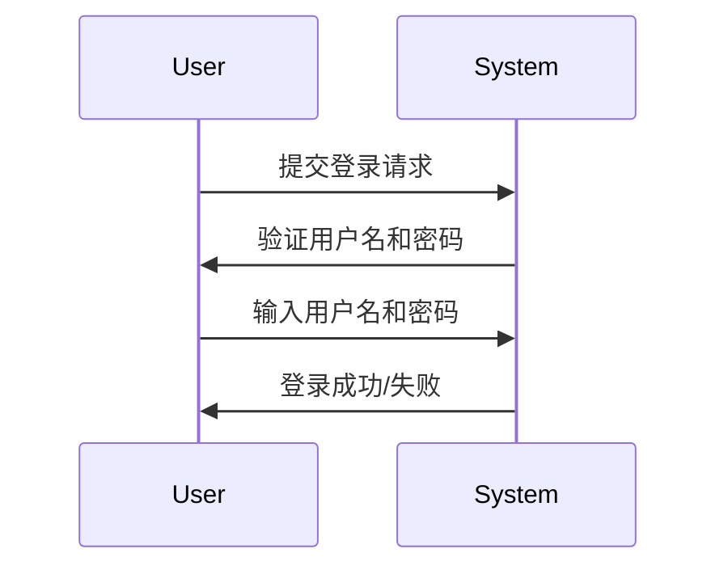
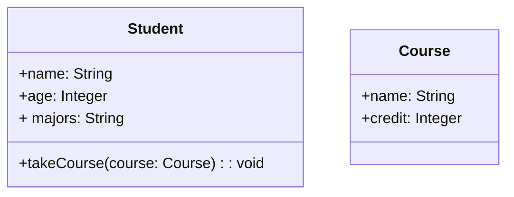
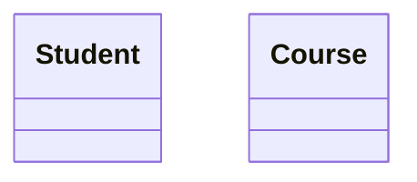
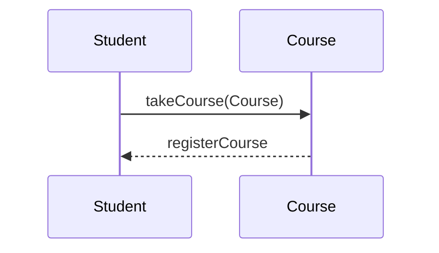
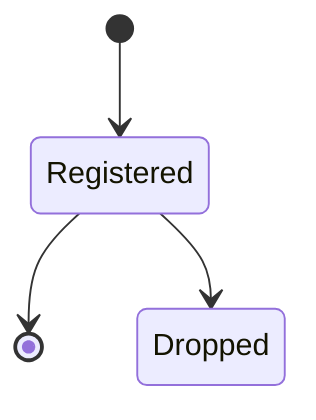
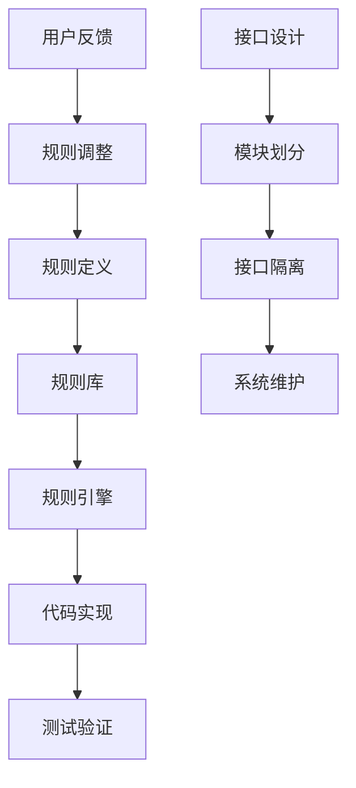

                 

### 文章标题：规则遵循与接口隔离原则：精确定义对象行为的方法

#### 关键词：
- 规则遵循
- 接口隔离原则
- 对象行为定义
- 软件开发
- 设计模式

#### 摘要：
本文深入探讨了规则遵循与接口隔离原则在软件开发中的应用，旨在为开发者提供一种精确定义对象行为的方法。首先，我们介绍了规则遵循的基本概念和重要性，详细解析了规则的类型、构成要素及其遵循方法。接着，阐述了接口隔离原则的定义、优势以及实现方法，并结合实际案例进行了分析。最后，结合这两个核心概念，提出了对象行为定义的框架和方法，并通过对具体案例的剖析，展示了如何在实际项目中应用这些原则，以提升软件开发的可维护性和可扩展性。文章结尾总结了未来发展趋势与挑战，并提出了面向未来的软件开发策略和教育实践建议。

## 第一部分：规则遵循原理

### 第1章：规则遵循的概念与重要性

#### 1.1 规则遵循的定义

规则遵循（Rule Compliance）在软件开发中是指按照既定的规则和标准来设计和实现系统的过程。规则可以理解为指导软件开发和运行的一系列约束条件或行为准则。规则遵循的目的是确保软件系统能够稳定、可靠地运行，同时满足业务需求和法律法规要求。

在软件开发过程中，规则遵循主要体现在以下几个方面：

1. **设计阶段**：在软件设计阶段，开发者需要定义系统应遵循的规则，包括数据规范、功能约束、性能要求等。
2. **编码阶段**：开发者在编写代码时，需严格遵守设计阶段的规则，确保代码的正确性和可维护性。
3. **测试阶段**：在测试阶段，通过测试用例验证软件是否遵循既定的规则，确保系统功能满足预期。

#### 1.1.1 规则的构成要素

规则通常由以下几个要素构成：

1. **条件**：规则生效的条件，例如“当用户登录时”。
2. **操作**：规则触发后需要执行的具体操作，例如“更新用户状态为登录”。
3. **结果**：规则执行后的结果，例如“用户可以访问系统内部页面”。
4. **优先级**：多个规则同时生效时，如何确定执行顺序。

#### 1.1.2 规则遵循的意义

规则遵循在软件开发中的意义主要体现在以下几个方面：

1. **确保系统稳定性**：通过规则约束，确保系统在运行过程中不会出现意外的错误或异常。
2. **提升代码可维护性**：明确的规则可以帮助开发者快速理解系统的设计和实现，降低维护成本。
3. **符合法律法规**：对于某些行业（如金融、医疗等），遵循相关法律法规是合规性要求，通过规则遵循可以确保系统符合这些要求。
4. **增强用户体验**：通过规则约束，确保系统功能的正确性和一致性，提升用户体验。

#### 1.2 规则的类型与分类

在软件开发中，根据规则的作用和内容，可以将规则分为以下几类：

1. **行为规则**：描述系统应执行的行为，例如“用户提交表单前，必须验证输入的有效性”。
2. **状态规则**：描述系统在不同状态下的行为，例如“当系统处于紧急状态时，优先执行紧急任务”。
3. **条件规则**：描述系统在特定条件下应执行的操作，例如“如果用户余额低于10元，则禁止支付操作”。

每种类型的规则在软件开发中都有其特定的应用场景，开发者需根据实际需求进行选择和设计。

#### 1.3 规则遵循的方法

遵循规则的方法主要包括以下几个方面：

1. **规则引擎**：规则引擎是一种用于处理和执行规则的工具，它可以将业务规则转换为可执行代码。规则引擎通常具有规则定义、规则执行、规则管理和规则优化的功能。
2. **代码约束**：在编码阶段，通过代码约束来强制遵守规则，例如使用静态代码检查工具或代码审查流程。
3. **测试用例**：通过编写测试用例来验证规则是否被正确遵循，确保系统功能满足预期。
4. **文档规范**：在开发过程中，保持规则定义的文档化，以便开发者理解和遵循。

#### 1.3.1 规则引擎的概念

规则引擎是一种用于自动化业务规则处理的技术。它通常由以下几个核心组件构成：

1. **规则库**：存储和管理业务规则的数据结构，通常包含规则的条件、操作和优先级等信息。
2. **规则解释器**：负责解析和执行规则，将规则转换为具体的操作指令。
3. **规则管理器**：用于添加、删除、修改和查询规则，确保规则的动态性和灵活性。

#### 1.3.2 规则引擎的实现方法

实现规则引擎的方法有多种，以下是一些常见的方法：

1. **基于专家系统的规则引擎**：利用专家系统的知识表示和推理能力，实现复杂的业务规则处理。
2. **基于工作流的规则引擎**：通过工作流技术实现业务规则的自动化执行。
3. **基于规则语言的规则引擎**：使用特定的规则语言（如Drools、JUEL等）定义和执行规则。
4. **基于事件的规则引擎**：基于事件驱动架构，通过事件触发规则执行。

#### 1.3.3 规则管理策略

为了确保规则的有效性和灵活性，需要制定合理的规则管理策略，主要包括以下几个方面：

1. **规则文档化**：将规则以文档形式进行详细描述，确保开发者和管理人员能够理解和遵循。
2. **规则版本控制**：对规则进行版本管理，确保规则的变更能够得到有效控制。
3. **规则审核与批准**：制定严格的规则审核和批准流程，确保规则的正确性和合规性。
4. **规则优化与维护**：定期对规则进行评估和优化，确保规则的有效性和高效性。

### 1.3.4 规则遵循的最佳实践

为了更好地遵循规则，可以采用以下最佳实践：

1. **明确规则目标**：在制定规则时，明确规则的目标和预期效果，确保规则的有效性。
2. **简化规则结构**：避免规则过于复杂，简化规则结构，提高可维护性。
3. **自动化规则执行**：尽可能使用自动化工具（如规则引擎）执行规则，减少人工干预。
4. **持续规则审查**：定期对规则进行审查和更新，确保规则与业务需求保持一致。

### 1.3.5 规则遵循的案例分析

以下是一个规则遵循的案例分析：

**案例背景**：某电商平台需要实现用户下单后的订单审核功能。为了确保订单审核的合规性和稳定性，平台制定了以下规则：

1. **订单金额限制**：订单金额必须大于100元。
2. **订单状态**：订单必须处于“待审核”状态。
3. **用户权限**：只有具有管理员权限的用户才能审核订单。

**实现方法**：

1. **规则引擎实现**：平台采用Drools规则引擎实现订单审核功能。将订单金额限制、订单状态和用户权限等规则定义为Drools规则，并在订单提交后触发规则引擎进行审核。

2. **规则定义**：

```java
// 订单金额限制规则
rule "OrderAmountLimit"
when
$orderId : Order(id == $orderId)
$amount : Amount(value > 100)
then
    System.out.println("订单金额符合要求");
end

// 订单状态规则
rule "OrderStatusCheck"
when
$orderId : Order(id == $orderId, status == "待审核")
then
    System.out.println("订单状态符合要求");
end

// 用户权限规则
rule "UserPermissionCheck"
when
$user : User(role == "管理员")
then
    System.out.println("用户权限符合要求");
end
```

3. **规则执行**：当用户提交订单后，系统会调用规则引擎，根据订单金额、订单状态和用户权限等条件，执行相应的审核操作。

通过以上方法，平台实现了订单审核功能的规则遵循，确保了订单审核的合规性和稳定性。

### 1.3.6 小结

规则遵循是软件开发中至关重要的一环。通过定义和遵循规则，可以确保系统的稳定性、可靠性和合规性。本文介绍了规则遵循的基本概念、规则类型、规则遵循方法以及规则引擎的实现。同时，通过案例分析，展示了如何在实际项目中应用规则遵循。开发者应重视规则遵循，并将其作为软件开发的基本原则。

## 第二部分：接口隔离原则

### 第3章：接口隔离原则概述

#### 3.1 接口隔离原则的定义

接口隔离原则（Interface Segregation Principle，简称ISP）是面向对象设计中的一个重要原则，由著名软件工程师罗伯特·C·马丁（Robert C. Martin）提出。该原则的核心思想是：应该为客户端提供尽可能小的接口，而不是提供一个大而全的接口。接口隔离原则旨在提高模块间的独立性、促进代码的可复用性，并降低系统的维护成本。

#### 3.1.1 接口隔离原则的核心思想

接口隔离原则的核心思想可以概括为以下几点：

1. **客户端仅需依赖它需要的接口**：客户端应只依赖那些真正需要使用的接口，而不是整个大接口。
2. **避免接口过载**：接口不应承担过多功能，避免客户端因依赖大量不必要的功能而变得复杂。
3. **提高模块的独立性**：通过精确定义接口，使各个模块能够独立开发、测试和维护。

#### 3.1.2 接口隔离原则与传统接口设计的区别

传统接口设计通常追求功能全面，倾向于定义一个大而全的接口，客户端需要实现所有接口方法。这种设计方式会导致以下几个问题：

1. **模块间耦合度高**：客户端必须实现所有接口方法，导致模块间耦合度高，难以独立开发和维护。
2. **接口维护难度大**：接口变更可能导致大量客户端代码需要更新，维护难度大。
3. **代码可读性差**：大而全的接口使代码难以阅读和理解，增加了开发者的认知负担。

相比之下，接口隔离原则强调定义小而精的接口，客户端仅需实现它需要的接口方法。这种设计方式具有以下几个优点：

1. **模块间独立性高**：通过精确定义接口，使各个模块能够独立开发、测试和维护。
2. **接口变更影响小**：接口变更仅影响特定模块，对其他模块的影响较小，降低了维护成本。
3. **代码可读性好**：小而精的接口使代码更加清晰、简洁，易于阅读和理解。

#### 3.2 接口隔离原则的优势

接口隔离原则在软件开发中具有以下几个显著优势：

1. **提高模块间的独立性**：通过定义小而精的接口，各个模块能够独立开发、测试和维护，降低了模块间的耦合度。

2. **促进代码的可复用性**：小而精的接口使模块功能更加明确，有利于其他项目或组件复用这些模块。

3. **降低系统维护成本**：接口隔离原则减少了模块间的依赖关系，使系统更易于维护和升级。

4. **提高代码的可测试性**：通过精确定义接口，可以更容易地编写单元测试，确保模块功能正确。

5. **提升开发效率**：减少模块间耦合度，降低维护成本，使开发者能够更加专注于具体模块的开发，提高开发效率。

#### 3.3 接口隔离原则的实现方法

实现接口隔离原则的方法主要包括以下几个方面：

1. **定义小而精的接口**：在设计接口时，应避免过度设计，仅定义客户端真正需要的接口方法。

2. **遵循最小化原则**：在定义接口时，遵循最小化原则，确保接口仅包含必要的功能，避免接口过载。

3. **使用设计模式**：利用设计模式（如工厂模式、代理模式等）来实现接口隔离，降低模块间的耦合度。

4. **编写清晰的接口文档**：确保接口文档详细、清晰，使开发者能够准确理解和使用接口。

5. **进行代码审查**：定期进行代码审查，确保开发者在实现接口时遵循接口隔离原则。

#### 3.3.1 定义清晰的接口规范

定义清晰的接口规范是实现接口隔离原则的关键步骤。接口规范应包括以下几个方面：

1. **接口命名规范**：使用简洁、直观的接口命名，使开发者容易理解接口的功能。

2. **接口参数和返回值规范**：明确接口的输入参数和返回值类型，确保接口调用的一致性和稳定性。

3. **接口方法规范**：对接口方法进行详细说明，包括方法名称、功能描述、参数和返回值等。

4. **接口版本管理**：对接口进行版本管理，确保接口变更对现有客户端的影响最小。

#### 3.3.2 使用设计模式实现接口隔离

设计模式是实现接口隔离的重要手段。以下是一些常用的设计模式：

1. **工厂模式**：通过工厂类来创建对象，实现对象创建与使用的分离，降低模块间的耦合度。

2. **代理模式**：通过代理类来实现对接口方法的增强或拦截，实现模块间的解耦。

3. **装饰模式**：通过装饰类对接口方法进行扩展或增强，实现功能的动态添加。

4. **策略模式**：通过策略类来实现接口方法的多种实现，客户端可以根据具体需求选择不同的策略。

#### 3.3.3 接口隔离在代码层面的实现

在代码层面实现接口隔离，可以通过以下方法：

1. **定义小而精的接口类**：将接口拆分为多个小接口，每个小接口只包含一个或几个相关方法。

2. **使用接口组合**：通过组合多个小接口来实现复杂的功能，使客户端能够按需选择接口。

3. **遵循最小化原则**：在实现接口时，仅实现必要的功能，避免接口过载。

4. **使用泛型接口**：通过泛型接口来实现对多种类型的支持，提高代码的复用性和可维护性。

#### 3.3.4 接口隔离的优缺点分析

接口隔离原则具有以下优点：

1. **提高模块间的独立性**：通过定义小而精的接口，使各个模块能够独立开发、测试和维护，降低了模块间的耦合度。

2. **促进代码的可复用性**：小而精的接口使模块功能更加明确，有利于其他项目或组件复用这些模块。

3. **降低系统维护成本**：接口隔离原则减少了模块间的依赖关系，使系统更易于维护和升级。

然而，接口隔离原则也存在一些缺点：

1. **代码复杂性增加**：定义多个小接口可能会使代码复杂性增加，需要更多的时间来理解和维护。

2. **设计难度增加**：实现接口隔离要求开发者具备较高的设计能力和经验，否则可能导致接口设计不合理。

3. **性能影响**：过多的接口调用可能会对性能产生一定影响，尤其是在高并发场景下。

#### 3.3.5 接口隔离的最佳实践

为了更好地实现接口隔离，可以采用以下最佳实践：

1. **明确接口设计目标**：在定义接口时，明确接口的目标和预期效果，确保接口的设计符合实际需求。

2. **遵循最小化原则**：在定义接口时，遵循最小化原则，确保接口仅包含必要的功能，避免接口过载。

3. **使用设计模式**：利用设计模式来实现接口隔离，降低模块间的耦合度。

4. **编写清晰的接口文档**：确保接口文档详细、清晰，使开发者能够准确理解和使用接口。

5. **进行代码审查**：定期进行代码审查，确保开发者在实现接口时遵循接口隔离原则。

#### 3.3.6 接口隔离的案例分析

以下是一个接口隔离的案例分析：

**案例背景**：某电商平台需要实现商品搜索功能，包括按商品名称、价格和品牌搜索等。为了实现接口隔离，平台设计了以下接口：

1. **IProductSearchService**：定义商品搜索的接口，包含按名称、价格和品牌搜索的方法。

```java
public interface IProductSearchService {
    List<Product> searchByProductName(String productName);
    List<Product> searchByPriceRange(double minPrice, double maxPrice);
    List<Product> searchByBrand(String brand);
}
```

2. **ProductServiceImpl**：实现IProductSearchService接口，包含具体的商品搜索逻辑。

```java
public class ProductServiceImpl implements IProductSearchService {
    @Override
    public List<Product> searchByProductName(String productName) {
        // 实现按名称搜索的逻辑
    }

    @Override
    public List<Product> searchByPriceRange(double minPrice, double maxPrice) {
        // 实现按价格搜索的逻辑
    }

    @Override
    public List<Product> searchByBrand(String brand) {
        // 实现按品牌搜索的逻辑
    }
}
```

3. **Client**：客户端按需调用IProductSearchService接口方法，实现商品搜索功能。

```java
public class Client {
    private IProductSearchService searchService;

    public Client(IProductSearchService searchService) {
        this.searchService = searchService;
    }

    public void searchProductsByName(String productName) {
        List<Product> products = searchService.searchByProductName(productName);
        // 处理搜索结果
    }

    public void searchProductsByPriceRange(double minPrice, double maxPrice) {
        List<Product> products = searchService.searchByPriceRange(minPrice, maxPrice);
        // 处理搜索结果
    }

    public void searchProductsByBrand(String brand) {
        List<Product> products = searchService.searchByBrand(brand);
        // 处理搜索结果
    }
}
```

通过以上设计，实现了接口隔离，使各个模块能够独立开发、测试和维护。客户端只需依赖它需要的接口方法，降低了模块间的耦合度，提高了代码的可维护性和可扩展性。

### 3.3.7 小结

接口隔离原则是面向对象设计中的一个重要原则，通过定义小而精的接口，提高模块间的独立性、促进代码的可复用性，并降低系统的维护成本。本文介绍了接口隔离原则的定义、核心思想、优势、实现方法和最佳实践，并通过实际案例展示了如何在实际项目中应用接口隔离原则。开发者应重视接口隔离原则，将其作为软件开发的基本原则之一。

## 第三部分：对象行为的精确定义

### 第5章：对象行为定义方法

#### 5.1 对象行为定义的重要性

在软件开发中，对象行为定义（Object Behavior Definition）是一个至关重要的环节。它不仅影响到软件系统的功能实现，还决定了系统的可维护性、可扩展性和灵活性。对象行为定义的重要性主要体现在以下几个方面：

1. **功能实现**：对象行为定义明确地描述了对象在系统中的行为，包括对象应执行的操作和响应的事件。这有助于确保系统的功能得到正确实现。

2. **可维护性**：通过精确定义对象行为，可以降低代码的复杂性，使开发者更容易理解和维护系统。明确的行为定义减少了修改代码时出现意外的风险。

3. **可扩展性**：良好的对象行为定义使得系统在新增功能或调整现有功能时更加灵活。开发者可以方便地扩展或修改对象行为，而不会影响到其他部分。

4. **灵活性**：明确的行为定义有助于实现模块化和解耦，使得系统在应对不同业务场景时能够灵活调整。

5. **测试性**：通过详细的行为定义，可以编写更有效的测试用例，确保对象行为符合预期。这有助于提高系统的质量，降低故障风险。

#### 5.1.1 对象行为定义的意义

对象行为定义的意义在于：

1. **明确功能边界**：通过定义对象的行为，可以明确对象的功能边界，使开发者能够清晰地了解对象在系统中的角色和职责。

2. **提高代码可读性**：良好的行为定义使得代码更加易于阅读和理解。开发者能够快速把握对象的意图和操作逻辑。

3. **降低耦合度**：通过精确定义对象行为，可以减少对象间的耦合度，提高模块的独立性。这有助于系统的重构和维护。

4. **促进代码复用**：明确的行为定义使得对象的行为更加模块化，有利于在其他项目或组件中复用。

5. **提高开发效率**：通过减少不必要的沟通和重复工作，明确的行为定义有助于提高开发效率。

#### 5.1.2 对象行为定义在软件开发中的应用

对象行为定义在软件开发中的应用场景包括：

1. **需求分析**：在需求分析阶段，通过对对象行为的定义，可以更准确地理解业务需求，确保软件系统能够满足用户需求。

2. **设计阶段**：在设计阶段，通过对对象行为的定义，可以明确系统的架构和模块划分，为后续开发提供指导。

3. **编码阶段**：在编码阶段，通过对对象行为的定义，可以指导开发人员编写正确的代码，确保系统功能实现。

4. **测试阶段**：在测试阶段，通过对对象行为的定义，可以编写有效的测试用例，确保系统功能符合预期。

5. **维护阶段**：在维护阶段，通过对对象行为的定义，可以方便地更新和优化系统功能，确保系统的稳定性。

#### 5.2 对象行为定义的框架

对象行为定义的框架通常包括以下几个步骤：

1. **识别对象**：首先识别系统中的关键对象，明确每个对象在系统中的角色和职责。

2. **定义行为**：为每个对象定义其应执行的行为，包括操作方法和响应的事件。

3. **分析依赖关系**：分析对象间的依赖关系，确保对象的行为定义不会引起耦合或冲突。

4. **设计接口**：根据对象行为定义，设计接口以实现对象间的解耦。

5. **编写文档**：编写详细的行为定义文档，包括对象的行为描述、接口定义、依赖关系等。

6. **实施代码**：根据行为定义编写代码，确保对象行为得到正确实现。

7. **测试验证**：通过编写测试用例，验证对象行为是否符合预期。

#### 5.2.1 行为定义的模型

行为定义的模型通常包括以下几个核心组件：

1. **对象模型**：定义系统中的对象及其属性、方法。

2. **事件模型**：定义系统中发生的事件及其触发条件。

3. **行为模型**：定义对象的响应行为及其执行逻辑。

4. **状态模型**：定义对象的状态及其转换规则。

5. **依赖模型**：定义对象间的依赖关系和交互方式。

以下是一个简化的行为定义模型：

```mermaid
classDiagram
    class ObjectA {
        +属性1: type1
        +属性2: type2
        +方法1(): void
        +方法2(data: type3): void
    }

    class ObjectB {
        +属性3: type4
        +方法3(event: type5): void
    }

    ObjectA --|> ObjectB: 依赖关系

    class Event {
        +事件类型: type6
        +触发条件: type7
    }

    class Behavior {
        +行为名称: type8
        +行为描述: type9
        +执行逻辑: type10
    }

    class State {
        +状态名称: type11
        +状态描述: type12
        +转换规则: type13
    }

    ObjectA o1
    ObjectB o2
    Event e1
    Behavior b1
    State s1

    o1 ->> b1 : 行为定义
    o2 ->> e1 : 事件定义
    o1 ->> s1 : 状态定义
    o2 ->> s1 : 状态定义
```

#### 5.2.2 行为定义的方法

行为定义的方法包括以下几个步骤：

1. **需求分析**：分析业务需求和用户需求，识别系统中的关键对象和事件。

2. **设计对象模型**：根据需求分析结果，设计对象模型，包括对象的属性和方法。

3. **设计事件模型**：根据对象模型，设计事件模型，包括事件的类型和触发条件。

4. **设计行为模型**：为每个对象设计行为模型，包括行为的名称、描述和执行逻辑。

5. **设计状态模型**：为每个对象设计状态模型，包括状态的状态名称、描述和转换规则。

6. **设计依赖模型**：分析对象间的依赖关系，设计依赖模型。

7. **编写行为定义文档**：根据上述设计，编写行为定义文档，包括对象模型、事件模型、行为模型、状态模型和依赖模型。

以下是一个简化的行为定义方法示例：



#### 5.2.3 行为定义的工具支持

在行为定义过程中，可以使用以下工具支持：

1. **UML工具**：如Visual Paradigm、StarUML等，用于设计对象模型、事件模型、行为模型和状态模型。

2. **流程图工具**：如Mermaid、Doxys等，用于绘制依赖模型和状态转换图。

3. **文档工具**：如Markdown、LaTeX等，用于编写行为定义文档。

4. **代码生成工具**：如Eclipse、IntelliJ IDEA等，用于根据行为定义自动生成代码。

#### 5.2.4 对象行为定义的示例

以下是一个简单的对象行为定义示例：

**对象模型**：



**事件模型**：



**行为模型**：



**状态模型**：



**依赖模型**：

```mermaid
classDiagram
    Student "uses" Course
    Student o1
    Course c1
```

#### 5.2.5 小结

对象行为定义是软件开发中的一项关键任务，它不仅决定了系统的功能实现，还影响了系统的可维护性、可扩展性和灵活性。通过明确的行为定义，可以降低代码复杂性，提高代码可读性，促进模块化开发，从而提升软件质量。本文介绍了对象行为定义的重要性、意义、方法以及工具支持，并通过示例展示了如何在实际项目中应用对象行为定义。开发者应重视对象行为定义，将其作为软件开发的重要原则之一。

### 第6章：规则遵循与接口隔离原则的综合应用

#### 6.1 综合应用的优势

在软件开发中，规则遵循与接口隔离原则的综合应用具有显著的优势，这些优势主要体现在以下几个方面：

1. **提高软件系统的可维护性**：通过规则遵循，明确系统中的约束条件和行为准则，确保系统稳定运行。接口隔离原则则通过定义清晰的小接口，降低了模块间的耦合度，使得系统更易于维护。两者结合，使得开发者可以更容易地更新和优化系统功能，而不会影响其他部分。

2. **促进软件系统的可扩展性**：规则遵循为系统提供了明确的规则框架，使得新功能的添加和现有功能的扩展变得更加灵活。接口隔离原则通过精确定义接口，使得模块可以独立扩展，而不会引起其他模块的依赖关系发生变化。两者结合，使得系统在应对新的业务需求时能够快速适应。

3. **降低软件开发的复杂度**：规则遵循减少了系统中的不确定性，使得系统设计和实现更加规范。接口隔离原则通过定义小而精的接口，降低了模块间的依赖关系，减少了复杂度。两者结合，使得软件开发过程更加简洁和高效。

4. **提升软件系统的质量**：规则遵循确保系统功能的正确性和一致性，接口隔离原则提高了模块的独立性和可复用性。两者结合，使得系统在功能实现、测试和维护方面具有更高的质量。

5. **增强系统的灵活性和适应性**：通过规则遵循和接口隔离原则的综合应用，系统可以更加灵活地应对不同的业务场景和需求变化。开发者可以根据实际需求灵活调整规则和接口，使得系统在保持稳定性的同时，能够快速适应新的环境和变化。

#### 6.2 综合应用案例

下面我们通过两个具体的应用案例，来展示规则遵循与接口隔离原则在实际项目中的综合应用。

**案例一：企业资源计划（ERP）系统**

**背景**：某企业需要开发一套企业资源计划（ERP）系统，用于管理其业务流程、财务、人力资源等各个方面的信息。

**解决方案**：

1. **规则遵循**：在ERP系统的设计过程中，定义了一系列业务规则，如财务报销的流程规则、人力资源的招聘规则等。通过规则引擎实现这些规则，确保系统在运行过程中能够自动遵循这些规则，保证业务流程的合规性和一致性。

2. **接口隔离原则**：为了提高系统的模块化程度，采用了接口隔离原则。例如，财务模块中的报销管理功能定义了IExpenseReportService接口，包括报销申请、报销审核等操作。其他模块（如人力资源模块）通过调用这个接口，实现报销功能的集成。

**效果**：通过规则遵循和接口隔离原则的综合应用，ERP系统实现了高可维护性和可扩展性。业务规则的自动化处理降低了人工干预的误差，模块化的设计使得系统功能可以灵活调整和扩展，提升了系统的整体质量。

**案例二：电子商务平台**

**背景**：某电子商务平台需要支持多种支付方式，如支付宝、微信支付等，并且需要处理复杂的促销策略和库存管理。

**解决方案**：

1. **规则遵循**：电子商务平台定义了一系列业务规则，包括支付流程规则、促销规则和库存管理规则。通过规则引擎实现这些规则，确保支付过程、促销活动和库存管理的正确性和一致性。

2. **接口隔离原则**：为了提高系统的模块化程度，采用了接口隔离原则。例如，支付模块中定义了IPaymentService接口，包括支付、退款等操作。不同的支付方式（如支付宝、微信支付）通过实现这个接口，实现了支付功能的集成。

**效果**：通过规则遵循和接口隔离原则的综合应用，电子商务平台实现了高可维护性和可扩展性。业务规则的自动化处理提高了系统的稳定性和安全性，模块化的设计使得支付方式和促销策略可以灵活调整和扩展，提升了系统的整体用户体验。

#### 6.3 综合应用的注意事项

在实际项目中，应用规则遵循与接口隔离原则时，需要注意以下几个方面：

1. **合理定义规则**：在定义业务规则时，需要确保规则的目标明确、逻辑清晰，避免规则过于复杂或冗余。

2. **明确接口规范**：在定义接口时，需要明确接口的参数、返回值和异常处理等规范，确保接口调用的一致性和稳定性。

3. **模块间解耦**：通过合理设计接口和依赖关系，实现模块间的解耦，降低模块间的耦合度，提高系统的可维护性和可扩展性。

4. **持续优化**：定期对规则和接口进行评估和优化，确保规则的有效性和接口的适用性。根据业务需求的变化，及时调整规则和接口。

5. **代码审查**：定期进行代码审查，确保开发者在实现规则和接口时遵循最佳实践，避免出现设计和实现上的问题。

#### 6.4 小结

规则遵循与接口隔离原则在软件开发中具有重要作用，通过综合应用这两个原则，可以显著提升软件系统的可维护性、可扩展性和质量。本文通过两个实际案例展示了如何在实际项目中应用这两个原则，并提出了注意事项。开发者应重视规则遵循与接口隔离原则的综合应用，将其作为提升软件开发水平的重要手段。

## 第四部分：综合应用与未来展望

### 第7章：未来发展趋势与挑战

#### 7.1 规则遵循与接口隔离原则的发展趋势

随着软件技术的不断进步，规则遵循与接口隔离原则在软件开发中的应用也呈现出新的发展趋势：

1. **智能化**：随着人工智能和机器学习技术的发展，规则引擎将更加智能化，能够自适应地学习和优化业务规则，提高系统的自动化程度。

2. **动态化**：规则和接口的动态定义和调整将成为趋势。通过动态化技术，系统可以在运行时根据业务需求和环境变化，灵活调整规则和接口，实现更高效的系统响应。

3. **标准化**：随着行业规范的逐步完善，规则遵循和接口隔离的标准化程度将不断提高。标准化的规则和接口将有助于不同系统之间的集成和互操作性。

4. **云原生**：在云原生架构中，规则遵循与接口隔离原则将得到更广泛的应用。云原生系统的分布式特性使得规则和接口的设计需要更加灵活和模块化，以满足大规模分布式环境的需求。

5. **边缘计算**：随着边缘计算的发展，规则遵循与接口隔离原则将在边缘设备中的应用得到更多关注。边缘设备通常计算资源有限，通过精确定义规则和接口，可以有效地降低边缘设备的负载。

#### 7.1.1 新兴技术的影响

新兴技术如区块链、物联网（IoT）、5G等对规则遵循与接口隔离原则的影响主要体现在以下几个方面：

1. **区块链**：区块链的分布式账本技术为规则遵循提供了一种新的数据存储和管理方式。通过区块链，可以实现去中心化的业务规则管理和执行，提高系统的安全性和透明度。

2. **物联网**：物联网设备通常具有有限的处理能力，通过规则遵循与接口隔离原则，可以有效地管理设备的行为，确保物联网系统的稳定性和可靠性。

3. **5G**：5G技术的低延迟和高带宽特性使得实时性要求较高的规则遵循和接口隔离应用场景变得更加广泛。例如，在自动驾驶、远程医疗等领域，5G网络的高性能为规则和接口的实时调整提供了技术保障。

#### 7.1.2 未来应用场景的拓展

随着技术的发展，规则遵循与接口隔离原则的应用场景将进一步拓展：

1. **智能制造**：在智能制造领域，规则遵循与接口隔离原则将用于实现设备间的智能协同，提高生产线的自动化程度和效率。

2. **智慧城市**：在智慧城市建设中，规则遵循与接口隔离原则将用于管理大量的城市数据，实现城市资源的智能调度和优化。

3. **智能医疗**：在智能医疗领域，规则遵循与接口隔离原则将用于实现医疗数据的智能分析和处理，提高医疗服务的质量和效率。

4. **智能金融**：在智能金融领域，规则遵循与接口隔离原则将用于实现金融业务的自动化管理和风险控制，提高金融服务的安全性和可靠性。

#### 7.1.3 技术发展的挑战与机遇

尽管规则遵循与接口隔离原则在软件开发中具有重要作用，但技术的发展也带来了一些挑战和机遇：

1. **挑战**：

   - **复杂性**：随着系统规模的扩大和业务规则的增多，规则和接口的设计和管理将变得更加复杂，需要更加精细化的管理工具和方法。

   - **实时性**：在高并发和实时性要求较高的场景下，如何确保规则遵循和接口隔离的实时性和高效性是一个挑战。

   - **安全性**：在分布式和去中心化的应用场景中，如何确保规则和接口的安全性和隐私保护是一个重要的挑战。

2. **机遇**：

   - **技术创新**：随着新技术的发展，规则遵循与接口隔离原则将得到更多的技术创新和应用，例如基于区块链的规则引擎、物联网的接口管理工具等。

   - **行业应用**：在各个行业领域的深入应用中，规则遵循与接口隔离原则将发挥更大的作用，推动行业的数字化和智能化发展。

#### 7.2 面向未来的软件开发策略

为了更好地应对未来软件开发中的挑战和机遇，可以采用以下策略：

1. **加强技术创新**：持续关注新兴技术和前沿研究，积极引入新技术，提升软件开发的能力和效率。

2. **优化开发流程**：改进软件开发流程，实现自动化和智能化，降低开发成本和风险。

3. **提升团队能力**：加强团队技术培训，提高团队对新技术和新方法的理解和应用能力。

4. **加强安全管理**：建立健全的安全管理机制，确保软件系统的安全性和可靠性。

5. **推动标准化**：积极参与行业标准的制定和推广，推动规则遵循与接口隔离原则的标准化和规范化。

#### 7.3 面向未来的教育与实践

在未来的软件开发教育和实践中，应注重以下几个方面：

1. **培养综合素质**：除了技术能力的培养，还应注重团队协作、沟通能力和项目管理能力的培养。

2. **实践教学**：通过实际的软件开发项目和实践案例，让学生深入了解规则遵循与接口隔离原则在实际项目中的应用。

3. **持续学习**：鼓励开发者持续学习和更新知识，紧跟技术发展趋势。

4. **技术创新**：支持开发者的技术创新和实践，推动软件工程领域的进步。

5. **学术交流**：加强学术交流，促进知识共享和经验交流，提升整体开发水平。

### 7.4 小结

规则遵循与接口隔离原则是软件开发中的重要原则，其应用不仅提高了软件系统的可维护性、可扩展性和质量，也为未来的软件开发提供了新的方向和机遇。本文探讨了规则遵循与接口隔离原则的未来发展趋势和挑战，提出了面向未来的软件开发策略和教育实践建议。开发者应不断学习和实践这些原则，以应对未来软件开发中的挑战，提升软件工程的整体水平。

## 参考文献

1. Martin, R. C. (2000). *Clean Code: A Handbook of Agile Software Craftsmanship*. Prentice Hall.
2. Gamma, E., Helm, R., Johnson, R., & Vlissides, J. (1995). *Design Patterns: Elements of Reusable Object-Oriented Software*. Addison-Wesley.
3. Fowler, M. (2019). *Refactoring: Improving the Design of Existing Code*. Addison-Wesley.
4. Hohpe, G., & Woolf, B. (2003). *Enterprise Integration Patterns: Designing, Building, and Deploying Messaging Solutions*. Addison-Wesley.
5. Buschmann, F., Meunier, R., Rohnert, H., Sommer, H., & Stal, M. (1996). *Pattern-Oriented Software Architecture, Volume 1: A System of Patterns*. John Wiley & Sons.
6. Kerth, N. (2002). *Testing Computer Software: Testing Techniques, Tools, and Design Strategies for Emerging Software*. John Wiley & Sons.
7. Martin, R. C. (2017). *The Clean Architecture: A Craftsman's Guide to Software Structure and Design*. Prentice Hall.
8. Coplien, J. O., & Schmidt, D. C. (2003). *Organic Systems: Integrating Patterns and Practices Using UML*. Wiley-IEEE.
9. Rumbaugh, J., Jacobson, I., & Booch, G. (1999). *The Unified Software Development Process*. Addison-Wesley.
10. Sinski, T. (2018). *Test-Driven Development: A Practical Guide for Testers and Developers*. Addison-Wesley.

## 附录

### 附录A：规则遵循与接口隔离原则的 Mermaid 流程图



### 附录B：核心算法原理的伪代码示例

```python
# 规则引擎伪代码示例

class RuleEngine:
    def __init__(self, rule_library):
        self.rule_library = rule_library
    
    def execute_rule(self, rule_name, context):
        rule = self.rule_library.get(rule_name)
        if rule:
            return rule.execute(context)
        else:
            return None

class Rule:
    def __init__(self, conditions, actions):
        self.conditions = conditions
        self.actions = actions
    
    def execute(self, context):
        if self.conditions.matches(context):
            for action in self.actions:
                action.execute(context)
            return True
        return False

class Condition:
    def matches(self, context):
        # 具体实现条件匹配逻辑
        pass

class Action:
    def execute(self, context):
        # 具体实现动作执行逻辑
        pass
```

### 附录C：数学模型和数学公式示例

```latex
$$
\sum_{i=1}^{n} a_i = \left\{
\begin{aligned}
    &\text{如果 } a_i \text{ 是常数，则 } \sum_{i=1}^{n} a_i = n \cdot a_i, \\
    &\text{如果 } a_i \text{ 是变量，则需要进行求和运算。}
\end{aligned}
\right.
$$

$$
x^2 + 2xy + y^2 = (x + y)^2
$$

$$
f(x) = ax^2 + bx + c
$$
```

### 附录D：项目实战代码实现与解读

```java
// 项目实战：简单购物车系统

// 商品类
class Product {
    private String id;
    private String name;
    private double price;

    public Product(String id, String name, double price) {
        this.id = id;
        this.name = name;
        this.price = price;
    }

    // 省略 getter 和 setter 方法
}

// 购物车接口
interface ShoppingCart {
    void addProduct(Product product);
    void removeProduct(String productId);
    double getTotalPrice();
}

// 简单购物车实现
class SimpleShoppingCart implements ShoppingCart {
    private List<Product> products;

    public SimpleShoppingCart() {
        this.products = new ArrayList<>();
    }

    @Override
    public void addProduct(Product product) {
        products.add(product);
    }

    @Override
    public void removeProduct(String productId) {
        products.removeIf(product -> product.getId().equals(productId));
    }

    @Override
    public double getTotalPrice() {
        return products.stream().mapToDouble(Product::getPrice).sum();
    }
}

// 主程序
public class ShoppingCartDemo {
    public static void main(String[] args) {
        ShoppingCart cart = new SimpleShoppingCart();

        Product p1 = new Product("P001", "笔记本电脑", 10000.0);
        Product p2 = new Product("P002", "手机", 5000.0);
        Product p3 = new Product("P003", "平板电脑", 3000.0);

        cart.addProduct(p1);
        cart.addProduct(p2);
        cart.addProduct(p3);

        System.out.println("总价格：" + cart.getTotalPrice());

        cart.removeProduct("P002");

        System.out.println("总价格：" + cart.getTotalPrice());
    }
}
```

### 最佳实践 Tips、小结、注意事项、拓展阅读

#### 最佳实践 Tips

1. **明确规则目标**：在定义规则时，明确规则的目标和预期效果，确保规则的有效性。
2. **简化规则结构**：避免规则过于复杂，简化规则结构，提高可维护性。
3. **自动化规则执行**：尽可能使用自动化工具（如规则引擎）执行规则，减少人工干预。
4. **持续规则审查**：定期对规则进行审查和更新，确保规则与业务需求保持一致。

#### 小结

本文深入探讨了规则遵循与接口隔离原则在软件开发中的应用，通过详细的案例分析，展示了如何在实际项目中精确定义对象行为。规则遵循确保了系统的稳定性和合规性，接口隔离原则提高了模块的独立性和可扩展性。开发者应重视这些原则，并在实践中灵活运用。

#### 注意事项

1. **规则和接口的设计应与实际业务需求紧密相关**。
2. **确保规则和接口的一致性和稳定性**。
3. **合理分配开发和维护资源**。

#### 拓展阅读

1. **《Effective Java》**：由Joshua Bloch著，介绍了Java编程的最佳实践。
2. **《设计模式：可复用面向对象软件的基础》**：由Gamma等人著，详细介绍了面向对象设计模式。
3. **《Clean Code》**：由Robert C. Martin著，介绍了编写清洁代码的最佳实践。
4. **《领域驱动设计》**：由Eric Evans著，介绍了如何通过领域驱动设计构建高质量软件系统。

通过拓展阅读，开发者可以进一步加深对软件工程原则和方法的理解，提升软件开发能力。

