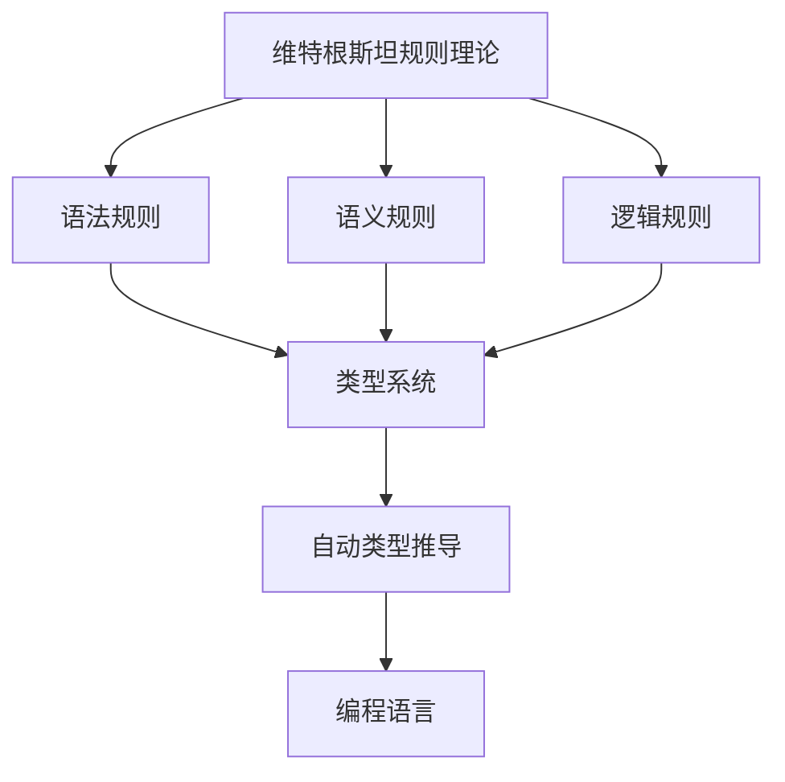

                 

### 引言

#### 书籍背景和目的

《规则遵循与类型推导：维特根斯坦的规则理论与FP中的自动类型推导》是一本探讨维特根斯坦的规则理论与函数式编程（FP）中的自动类型推导之间联系的专著。这本书的背景源于维特根斯坦的哲学思想在计算机科学领域的广泛应用，尤其是在编程语言和类型系统的研究中。作者试图将维特根斯坦的哲学理论与现代编程实践相结合，探讨如何在编程语言设计中引入规则理论，从而提高程序的可读性和可靠性。

这本书的主要目的是通过介绍维特根斯坦的规则理论，阐述其在类型推导中的应用，并展示如何利用这些理论来解决实际编程问题。此外，书中还将介绍函数式编程的基本概念和类型推导的原理，使读者能够更好地理解这两种理论之间的内在联系。通过结合具体编程案例，作者希望读者能够将理论知识应用于实际项目中，从而提高编程技能和解决问题的能力。

#### 维特根斯坦的规则理论简介

维特根斯坦的规则理论是他在20世纪初提出的哲学思想，主要关注于语言、逻辑和认识论等方面。在《逻辑哲学论》和《哲学研究》这两部著作中，维特根斯坦提出了关于规则和语言使用的深刻见解。

维特根斯坦认为，语言是一种游戏，每个语言表达都有其特定的使用规则。这些规则定义了语言元素之间的连接方式，以及它们在特定情境中的含义。维特根斯坦提出了两种类型的规则：语法规则和语义规则。语法规则关注语言结构的构成，如句子的组成成分和连接方式；语义规则则关注语言表达的含义，即如何在特定情境中理解和使用这些表达。

维特根斯坦的规则理论强调了规则在认知过程中的作用，指出人们通过遵循规则来理解和应用语言。这一理论为计算机科学提供了重要的启示，特别是在编程语言设计和类型系统中。规则理论帮助人们理解如何通过定义明确的规则来构建有效的程序，从而提高程序的可读性和可靠性。

#### 自动类型推导在函数式编程中的重要性

自动类型推导是函数式编程中的一个重要概念，它允许编译器在编写程序时自动推断变量和表达式的类型，从而减少了手动指定类型的需要。这种推导机制不仅提高了编程效率，还降低了编程错误的风险，使得代码更加简洁和易于维护。

在函数式编程中，自动类型推导具有特别重要的地位。函数式编程语言通常使用不可变数据和纯函数，这些特性使得类型推导更加直观和可靠。例如，在Haskell、Scala和Elm等函数式编程语言中，类型推导机制能够充分利用函数的纯度和不可变性，自动推导出表达式的类型。

自动类型推导的重要性体现在以下几个方面：

1. **提高编程效率**：自动类型推导减少了手动指定类型的繁琐过程，使得程序员可以专注于算法的实现和逻辑的构建，而不是类型的定义和检查。

2. **减少错误**：自动类型推导可以识别出类型不匹配的错误，从而在编译阶段就发现问题，避免了运行时错误的发生。

3. **代码简洁性**：自动类型推导使得代码更加简洁，去除了大量的类型注解，使得代码更易于阅读和理解。

4. **增强可维护性**：自动类型推导提高了代码的可靠性，使得后续的代码维护变得更加容易，减少了因类型错误导致的bug修复成本。

总之，自动类型推导在函数式编程中发挥着至关重要的作用，它不仅提高了编程效率，还增强了代码的可靠性和可维护性。通过探讨维特根斯坦的规则理论与自动类型推导的关系，这本书将为读者提供新的视角来理解编程语言设计和类型系统的构建。

### 维特根斯坦的规则理论

#### 规则理论的基本概念

维特根斯坦的规则理论是他哲学思想的核心之一，特别是在他的两部重要著作《逻辑哲学论》和《哲学研究》中得到了充分的阐述。规则理论主要关注于语言、逻辑和认识论等方面，旨在解释人类如何通过规则来理解和应用语言。

在维特根斯坦的哲学体系中，规则具有至关重要的地位。他认为，规则不仅是指导行为的指令，更是人类认知和思维的基础。具体来说，维特根斯坦将规则视为一种特定情境下的使用指南，使得人们能够在不同的情况下正确地应用语言。

维特根斯坦提出了两种类型的规则：语法规则和语义规则。语法规则关注语言结构的构成，即如何将基本的语言元素组合成句子或表达式的规则。例如，语法规则定义了句子的基本结构，如主语、谓语和宾语，以及它们之间的连接方式。语义规则则关注语言表达的含义，即如何在特定情境中理解和使用这些表达。语义规则涉及到语言元素在不同情境中的含义，如单词的多义性和句子结构对含义的影响。

维特根斯坦的规则理论强调了规则在认知过程中的作用。他认为，人们通过遵循规则来理解和应用语言。具体来说，当人们遇到一个语言表达时，他们会根据语法和语义规则来解释这个表达的含义。这种解释过程是自动的，几乎不需要有意识的思考。

#### 规则的本质

维特根斯坦对规则的本质进行了深刻的探讨，他认为规则不仅仅是一系列指令，而是一种特定的认知模式。具体来说，规则的本质可以理解为以下几个方面：

1. **指导行为**：规则指导人们在特定情境下如何行动或思考。例如，语法规则指导人们如何构造有效的句子，而语义规则指导人们如何理解句子的含义。

2. **情境依赖**：规则是情境依赖的，即规则的具体应用取决于具体的情境。例如，在不同的语言环境中，语法和语义规则可能会有所不同。

3. **认知模式**：规则是一种认知模式，它帮助人们将抽象的概念转化为具体的行动或思考。例如，通过遵循特定的语法规则，人们可以构造出具有明确含义的句子。

4. **解释性**：规则具有解释性，即它们可以帮助人们理解语言表达的含义。通过遵循语法和语义规则，人们可以正确地理解语言表达，从而避免误解和歧义。

维特根斯坦认为，规则的本质是一种认知框架，它使得人们能够将抽象的概念转化为具体的行动或思考。这种认知框架不仅存在于语言中，也存在于其他认知活动中，如数学、科学和艺术等。

#### 规则的类型

维特根斯坦在规则理论中区分了几种不同类型的规则，这些规则在语言、逻辑和认知过程中发挥着不同的作用。以下是几种主要的规则类型：

1. **语法规则**：语法规则关注语言结构的构成，定义了如何将基本语言元素组合成句子或表达式的规则。例如，英语中的句子通常由主语、谓语和宾语构成，语法规则规定了这些成分的排列方式和连接方式。语法规则使得语言具有一致性，使得人们能够理解和生成有效的语言表达。

2. **语义规则**：语义规则关注语言表达的含义，定义了语言元素在特定情境中的含义。语义规则帮助人们理解语言表达的含义，从而避免误解和歧义。例如，单词的多义性可以通过语义规则来解释，确保在特定情境中理解单词的正确含义。

3. **逻辑规则**：逻辑规则是用于推理和证明的规则，它们定义了如何从已知的前提推导出结论。逻辑规则包括推理规则、证明规则和逻辑定律等。这些规则帮助人们进行逻辑思考，确保推理过程的正确性。

4. **规则规则**：规则规则是用于定义其他规则的规则。维特根斯坦指出，规则本身也需要规则来定义。例如，语法规则和语义规则本身需要通过规则规则来定义。这种层次化的规则体系使得语言和认知过程更加复杂和灵活。

通过区分不同类型的规则，维特根斯坦展示了规则在语言、逻辑和认知过程中的多样性。这些规则不仅帮助人们理解和应用语言，也促进了逻辑推理和认知发展。

#### 规则的应用领域

维特根斯坦的规则理论在多个领域得到了广泛的应用，其中最显著的领域包括哲学、语言学、逻辑学和计算机科学等。

1. **哲学**：在哲学领域，维特根斯坦的规则理论提供了关于语言和认知的基础框架。他的思想帮助哲学家们理解语言的本质和意义，以及人类如何通过语言进行思考。维特根斯坦的规则理论对后来的语言哲学和认识论研究产生了深远影响。

2. **语言学**：在语言学领域，维特根斯坦的规则理论为语法和语义研究提供了重要的理论支持。他的思想帮助语言学家理解语言的构成和含义，以及语言表达如何在不同的情境中被解释。维特根斯坦的规则理论促进了生成语法和认知语言学的发展。

3. **逻辑学**：在逻辑学领域，维特根斯坦的规则理论为推理和证明提供了新的视角。他的思想强调逻辑规则的情境依赖性和认知模式，从而丰富了逻辑理论的内容。维特根斯坦的规则理论对形式逻辑和非形式逻辑的研究产生了重要影响。

4. **计算机科学**：在计算机科学领域，维特根斯坦的规则理论在编程语言设计和类型系统研究中得到了广泛应用。他的思想为类型推导和规则引擎提供了理论基础，使得编程语言能够更好地处理复杂的数据类型和表达式。维特根斯坦的规则理论对函数式编程和逻辑编程的发展产生了深远影响。

总之，维特根斯坦的规则理论在多个领域都产生了重要影响，他的思想不仅丰富了这些领域的理论体系，也为实际应用提供了重要的指导。通过理解维特根斯坦的规则理论，我们能够更好地理解语言、逻辑和认知的本质。

### 规则遵循

#### 规则遵循的定义

维特根斯坦的规则遵循理论强调人们在语言使用和认知过程中如何遵循规则。具体来说，规则遵循是指在特定情境下，个体按照规则的要求来理解和应用语言表达的过程。这种遵循不仅包括对语法和语义规则的遵守，还涉及到逻辑规则和规则规则的运用。

规则遵循的定义可以从以下几个方面进行理解：

1. **情境依赖**：规则遵循是情境依赖的，即遵循规则的过程取决于具体的情境。例如，在不同的语境中，语法和语义规则可能会有所不同，人们需要根据特定情境来正确应用这些规则。

2. **认知过程**：规则遵循是一种认知过程，个体在理解和应用语言表达时需要根据规则进行推理和判断。这种认知过程是自动的，通常不需要有意识的思考，但依赖于个体对规则的理解和记忆。

3. **一致性**：规则遵循要求个体在语言使用中保持一致性，即在不同的情境中，个体应遵循相同的规则。这种一致性有助于确保语言表达的可理解性和可靠性。

4. **规则约束**：规则遵循受到规则约束，个体必须遵守既定的规则才能正确地理解和应用语言。这种约束确保了语言的一致性和可预测性，使得语言交流更加有效。

#### 规则遵循的过程

规则遵循的过程可以分为以下几个步骤：

1. **规则识别**：个体首先需要识别出适用的规则。例如，在理解一个句子时，个体需要识别出该句子的语法和语义规则。

2. **规则应用**：个体在识别出规则后，将其应用于具体情境。例如，个体会根据语法规则构造句子，并根据语义规则理解句子的含义。

3. **推理和判断**：个体在应用规则时需要进行推理和判断，以确保语言表达的正确性和一致性。例如，在逻辑推理中，个体需要根据前提和逻辑规则推导出结论。

4. **修正和调整**：在规则遵循的过程中，个体可能需要根据反馈和新的情境进行规则的修正和调整。这种修正和调整有助于提高语言理解和应用的准确性。

#### 规则遵循的挑战与对策

在规则遵循的过程中，个体可能会面临一些挑战，以下是几个主要的挑战及相应的对策：

1. **规则复杂性**：语言规则和逻辑规则可能非常复杂，个体在遵循规则时可能会感到困惑。对策是提高对规则的理解和记忆，通过反复练习和总结来加深对规则的认识。

2. **情境多样性**：不同的情境可能会导致规则应用的不一致，个体需要灵活应对。对策是培养情境感知能力，学会在不同情境中正确应用规则。

3. **认知负担**：规则遵循是一种认知过程，可能会增加个体的认知负担。对策是简化规则，减少不必要的复杂性，并利用辅助工具来帮助记忆和应用规则。

4. **误解和歧义**：语言表达中的误解和歧义可能会影响规则遵循的效果。对策是提高语言表达能力，减少语言模糊性，并增强对语言环境的敏感度。

通过理解和应对这些挑战，个体可以更有效地遵循规则，提高语言理解和应用的能力。维特根斯坦的规则遵循理论为解决这些挑战提供了深刻的启示和指导。

### 规则理论的数学模型

维特根斯坦的规则理论不仅关注语言和逻辑，还涉及数学模型。通过数学模型，我们可以更精确地描述规则的性质和作用，以及它们在认知过程中的应用。

#### 形式化规则理论

形式化规则理论是维特根斯坦规则理论的重要部分，它通过数学符号和逻辑运算来描述规则的本质和应用。形式化规则理论主要包括以下几个方面：

1. **规则的形式化定义**：在形式化规则理论中，规则被定义为一系列条件语句，每个条件语句描述了规则在不同情境下的应用方式。例如，一个语法规则可以表示为：如果句子结构符合主谓宾的基本模式，则该句子是有效的。

2. **推理规则**：推理规则用于从已知的前提推导出结论。在形式化规则理论中，推理规则通常被表示为条件语句，如：“如果A，则B”。通过应用推理规则，个体可以在认知过程中从已知的前提得出新的结论。

3. **证明规则**：证明规则用于证明一个命题的正确性。在形式化规则理论中，证明规则通常被表示为一系列条件语句，每个条件语句都是对前一个条件语句的进一步扩展，最终得出目标命题的正确性。

4. **逻辑运算**：形式化规则理论使用逻辑运算来表示规则之间的关系。常见的逻辑运算包括合取（AND）、析取（OR）和蕴含（IF-THEN）。通过逻辑运算，个体可以组合多个规则，形成复杂的逻辑推理过程。

#### 数学公式的应用

在维特根斯坦的规则理论中，数学公式被广泛应用于描述规则的应用和推理过程。以下是一些关键的数学公式和它们的应用：

1. **条件语句**：条件语句是描述规则应用的基本数学公式，如“A → B”，表示如果条件A成立，则结论B也成立。条件语句在语法和语义规则的描述中非常常见。

   $$ 
   A \rightarrow B 
   $$
   例如，在语法规则中，句子结构符合主谓宾模式（A），则该句子是有效的（B）。

2. **推理公式**：推理公式用于从已知的前提推导出新的结论。例如，常用的推理公式包括“Modus Ponens”（如果A，则B；A；因此，B）和“Modus Tollens”（如果A，则B；非B；因此，非A）。

   $$
   A \rightarrow B \\
   A \\
   \therefore B
   $$
   Modus Ponens表示，如果前提A推导出结论B，并且前提A成立，那么结论B也成立。

3. **证明公式**：证明公式用于证明一个命题的正确性。例如，“Cut Rule”（如果A和B都能推导出C，则A和B都能证明C）是一个常用的证明公式。

   $$
   A \vdash C \\
   B \vdash C \\
   \therefore A \land B \vdash C
   $$
   Cut Rule表示，如果A和B都能推导出C，那么通过组合A和B可以证明C。

#### 数学公式示例

以下是一个简单的数学公式示例，用于描述一个规则的应用过程：

1. **语法规则示例**：假设我们有一个语法规则，描述了主谓宾句子的构成。这个规则可以用以下数学公式表示：

   $$
   S \rightarrow NP + VP \\
   $$
   其中，S表示句子，NP表示名词短语，VP表示动词短语。这个规则表示，一个有效的句子由一个名词短语和一个动词短语构成。

2. **语义规则示例**：假设我们有一个语义规则，描述了动词短语的意义。这个规则可以用以下数学公式表示：

   $$
   VP \rightarrow V + NP \\
   V \rightarrow \text{动作}
   $$
   其中，VP表示动词短语，V表示动词，NP表示名词短语。这个规则表示，一个动词短语由一个动词和一个名词短语构成，动词表示一个动作。

3. **推理示例**：假设我们有一个前提和结论，前提是“所有猫都会爬树”（A），结论是“Tom是猫，因此Tom会爬树”（B）。这个推理可以用以下数学公式表示：

   $$
   A \rightarrow B \\
   A \\
   \therefore B
   $$
   这个示例展示了如何通过推理规则从前提推导出结论。

通过这些数学公式，我们可以更精确地描述规则的应用过程，并使用逻辑推理来证明规则的有效性。这些数学模型不仅有助于理解维特根斯坦的规则理论，也为计算机科学和人工智能领域提供了重要的理论支持。

### 函数式编程基础

#### 函数式编程的概念

函数式编程（Functional Programming，FP）是一种编程范式，与面向对象编程和过程式编程相比，具有独特的特点和优势。FP的核心思想是使用纯函数来处理数据，避免使用副作用和状态变化。纯函数是一种没有副作用、输入输出明确的函数，其输出仅依赖于输入，不会修改外部状态。

函数式编程的基本概念包括：

1. **函数作为一等公民**：在FP中，函数被视为第一类对象，可以像值一样传递、存储和返回。这意味着函数可以作为参数传递给其他函数，也可以作为函数的返回值。

2. **高阶函数**：高阶函数是能够接受其他函数作为参数或返回函数的函数。高阶函数在FP中广泛应用，可以用于抽象和复用代码。

3. **不可变性**：FP强调不可变性，即数据一旦创建，就不能修改。这种特性使得程序更容易理解和测试，减少了副作用和状态变化带来的复杂性。

4. **惰性求值**：FP中的惰性求值（Lazy Evaluation）意味着函数的求值仅在需要时才会执行。这种求值方式可以提高程序的性能，减少不必要的计算。

#### 函数是一等公民

在函数式编程中，函数被赋予了一等公民的地位，这意味着函数可以像普通值一样进行操作。具体来说，函数可以：

1. **作为参数传递**：函数可以作为参数传递给其他函数，使得函数能够接受其他函数作为输入。这种机制在实现复用和抽象时非常有用。

2. **作为返回值**：函数可以作为返回值从其他函数中返回，使得函数能够生成新的函数。这种机制在实现动态编程和高阶函数时非常重要。

3. **存储在数据结构中**：函数可以被存储在数据结构中，如列表、数组或字典等。这使得函数可以像普通数据一样进行操作和处理。

4. **作为函数的组成部分**：函数可以作为函数的组成部分，如匿名函数、箭头函数和递归函数等。这种机制使得编程更加灵活和简洁。

#### 高阶函数

高阶函数是函数式编程中的一个重要概念，它能够接受其他函数作为参数或返回函数。高阶函数具有以下几个特点：

1. **接受函数作为参数**：高阶函数可以接受一个或多个函数作为参数。这种机制使得高阶函数可以接受不同的函数行为，从而实现代码的复用和抽象。

2. **返回函数**：高阶函数可以返回一个函数，使得函数能够生成新的函数。这种机制在实现动态编程和闭包时非常有用。

3. **应用广泛**：高阶函数在FP中应用广泛，如过滤、映射、折叠等操作。这些操作可以通过高阶函数实现，从而提高代码的复用性和可读性。

4. **代码简洁**：高阶函数使得代码更加简洁和直观。通过高阶函数，可以减少代码冗余，提高代码的可维护性。

#### 惰性求值

惰性求值（Lazy Evaluation）是函数式编程中的一个重要特性，它与立即求值（Eager Evaluation）相对。惰性求值意味着函数的求值仅在需要时才会执行，而不是在函数定义时立即执行。

惰性求值具有以下几个优点：

1. **性能优化**：惰性求值可以避免不必要的计算，从而提高程序的性能。例如，在处理大量数据时，惰性求值可以延迟计算，直到需要结果时才进行计算。

2. **代码简洁**：惰性求值使得代码更加简洁和易于理解。通过惰性求值，可以避免过早的求值，从而减少代码的复杂性。

3. **动态编程**：惰性求值支持动态编程，使得函数可以根据具体情境灵活地执行。这种机制在实现递归和延迟计算时非常有用。

总之，函数式编程的概念和特性为编程提供了新的视角和方法。通过函数作为一等公民、高阶函数和惰性求值，函数式编程可以简化代码结构，提高代码的可读性和可维护性。理解这些基本概念和特性，有助于更好地应用函数式编程范式，解决复杂的编程问题。

### FP语言基础

#### Haskell简介

Haskell是一种纯函数式编程语言，以其强大的类型系统和惰性求值机制而闻名。Haskell的设计目标是简洁、表达力和安全性，这使得它在学术研究和实际项目中得到了广泛应用。

Haskell的主要特点包括：

1. **纯函数**：Haskell是一种纯函数式编程语言，所有函数都是纯函数，即输出仅依赖于输入，不会产生副作用。

2. **类型推导**：Haskell具有强大的类型推导机制，可以自动推断变量和表达式的类型，减少了手动指定类型的需要。

3. **惰性求值**：Haskell采用惰性求值策略，函数的求值仅在需要时才会执行，从而避免了不必要的计算，提高了程序的效率。

4. **高阶函数**：Haskell支持高阶函数，函数可以作为参数传递和返回，使得代码更加简洁和复用。

5. **不可变性**：Haskell强调不可变性，数据一旦创建就不能修改，从而减少了状态变化和副作用，提高了程序的可读性和可靠性。

Haskell广泛应用于学术研究和工业项目，如编译器开发、金融分析、科学计算等。它的简洁性和表达能力使得开发者能够更专注于算法实现和问题解决，而不是类型定义和错误处理。

#### Scala简介

Scala是一种多范式编程语言，结合了面向对象和函数式编程的特点。Scala的设计目标是兼容Java生态，同时提供函数式编程的强大功能。Scala广泛应用于大数据处理、云计算和分布式系统等领域。

Scala的主要特点包括：

1. **函数式编程**：Scala支持纯函数式编程，包括高阶函数、不可变性等。这使得Scala在处理复杂逻辑和数据结构时具有很高的表达力和简洁性。

2. **面向对象编程**：Scala继承了Java的面向对象特性，包括类、对象、继承和多态等。这使得Scala能够与现有的Java代码无缝集成，同时保持面向对象编程的灵活性和扩展性。

3. **类型推导**：Scala具有强大的类型推导机制，可以自动推断变量和表达式的类型，减少了手动指定类型的需要。

4. **混合范式**：Scala同时支持函数式编程和面向对象编程，开发者可以根据具体需求选择合适的范式，从而提高代码的可读性和可维护性。

5. **性能**：Scala编译为Java字节码，可以在Java虚拟机上运行，因此具有与Java相近的性能。此外，Scala的函数式编程特性使其在处理大数据和并发任务时具有显著优势。

Scala广泛应用于企业级应用、大数据处理、金融分析和机器学习等领域。它的灵活性和兼容性使其成为开发复杂系统的理想选择。

#### Elm简介

Elm是一种面向Web的函数式编程语言，以其简洁、安全和可预测性而受到开发者喜爱。Elm的设计目标是构建高性能、可维护的Web应用，同时避免常见的编程错误和问题。

Elm的主要特点包括：

1. **函数式编程**：Elm是一种纯函数式编程语言，所有函数都是纯函数，避免了副作用和状态变化。这使得Elm在处理复杂逻辑和数据结构时具有很高的可读性和可靠性。

2. **类型安全**：Elm具有严格的类型系统，可以捕获许多运行时错误，从而提高程序的安全性。类型安全使得Elm在编译阶段就能够发现和修复错误。

3. **简洁性**：Elm的设计目标是简洁，语法直观，易于理解和学习。这使得开发者可以更专注于业务逻辑，而不是语法细节。

4. **不可变性**：Elm强调不可变性，数据一旦创建就不能修改，从而减少了状态变化和副作用。这提高了程序的可读性和可靠性。

5. **编译时优化**：Elm在编译时进行高度优化，生成高效的JavaScript代码。这使得Elm在性能上与传统的JavaScript应用相媲美，同时保持了函数式编程的优点。

Elm广泛应用于Web前端开发、数据可视化、实时通信和云计算等领域。它的简洁性和安全性使其成为构建现代Web应用的首选语言之一。

### 自动类型推导的基本原理

#### 类型推导的步骤

自动类型推导（Type Inference）是编译器在编译程序时自动确定变量和表达式类型的过程。这一过程主要包括以下几个步骤：

1. **扫描和解析**：编译器首先对源代码进行扫描和解析，将源代码分解为词法符号和语法结构。这一步骤为后续的类型推导提供了基础。

2. **环境构建**：编译器构建符号表，记录变量和函数的声明和作用域。环境构建有助于编译器在类型推导过程中查找和引用变量和函数。

3. **类型分析**：编译器对语法树进行类型分析，确定每个表达式和变量的类型。类型分析可以分为以下几个子步骤：

   - **表达式类型推导**：对于每个表达式，编译器尝试推导其类型。例如，对于简单的数值运算，编译器可以直接推断出运算结果类型。
   
   - **函数类型推导**：对于函数定义，编译器需要推导出函数的参数类型和返回类型。通常，编译器通过分析函数体来确定函数类型。
   
   - **类型约束**：在类型推导过程中，编译器可能需要引入类型约束来确保类型的一致性和兼容性。例如，在函数调用时，编译器需要确保调用函数的参数类型与函数声明中的参数类型相匹配。

4. **错误处理**：在类型分析过程中，编译器可能会遇到类型冲突或未知类型的情况。编译器需要提供合适的错误处理机制，报告类型错误并提供修复建议。

5. **类型检查**：编译器对推导出的类型进行进一步检查，确保类型的一致性和兼容性。如果发现类型错误，编译器需要报告错误并提供修复建议。

6. **代码生成**：在类型推导和检查完成后，编译器生成目标代码。在目标代码中，类型信息被编码为字节码或机器代码，以便在运行时进行类型验证和错误处理。

通过这些步骤，编译器可以自动推导出程序中变量和表达式的类型，从而减少手动指定类型的需要，提高编程效率和代码可读性。

#### 类型推导的类型系统

自动类型推导的核心是类型系统，它定义了类型之间的兼容性和转换规则。不同编程语言的类型系统有所不同，但通常包括以下几种类型：

1. **基本类型**：基本类型是编程语言中最基础的类型，如整数、浮点数、布尔值等。基本类型通常具有固定的内存布局和操作方式。

2. **复合类型**：复合类型是由基本类型组合而成的类型，如数组、列表、结构体等。复合类型可以存储多个基本类型的数据，并支持相应的操作。

3. **函数类型**：函数类型表示函数的参数类型和返回类型。函数类型是自动类型推导中最重要的类型，因为它定义了函数的输入输出关系。

4. **指针类型**：指针类型表示对内存地址的引用。指针类型在低级编程语言中非常重要，用于动态分配内存和实现数据结构。

5. **类型变量**：类型变量是用于表示未知类型的变量。类型变量通常在泛型编程中使用，允许编写通用和可重用的代码。

6. **类型约束**：类型约束是用于限制类型变量的取值范围。类型约束通常在函数参数和返回类型中指定，以确保函数调用时类型的一致性和兼容性。

类型系统在自动类型推导中发挥着关键作用，它定义了类型之间的兼容性和转换规则。编译器根据类型系统中的规则进行类型推导，确保程序在运行时类型安全。同时，类型系统也提供了类型检查的功能，报告类型错误并提供修复建议。

#### 类型推导的挑战

尽管自动类型推导在编程语言中得到了广泛应用，但它也面临一些挑战：

1. **类型冲突**：在类型推导过程中，编译器可能会遇到类型冲突。例如，当函数的参数类型与函数声明中的类型不一致时，编译器需要提供有效的错误处理机制。

2. **类型复杂度**：大型程序中可能存在复杂的类型依赖关系，使得类型推导变得复杂和耗时。编译器需要高效的算法和优化技术来处理这些复杂情况。

3. **泛型编程**：泛型编程是自动类型推导中的一个重要应用领域，但也带来了挑战。泛型类型推导需要考虑类型变量的约束和依赖，以确保类型安全。

4. **动态类型**：动态类型语言（如Python和JavaScript）通常具有较弱的类型推导能力。编译器需要在运行时进行类型检查，这增加了程序的复杂性和性能开销。

5. **性能优化**：自动类型推导需要大量的计算和资源，特别是在大型程序中。编译器需要优化类型推导算法，以提高编译速度和程序性能。

通过研究和解决这些挑战，编译器开发者可以进一步提高自动类型推导的效率和准确性，为程序员提供更强大的编程工具。

### 自动类型推导的应用

#### 自动类型推导的优势

自动类型推导在编程语言中具有显著的优势，它不仅提高了编程效率，还增强了代码的可靠性和可维护性。以下是自动类型推导的主要优势：

1. **提高编程效率**：自动类型推导减少了手动指定类型的繁琐过程，使得程序员可以专注于算法的实现和逻辑的构建，而不是类型的定义和检查。这种优势在大型项目中尤为明显，可以显著提高开发速度。

2. **减少错误**：自动类型推导可以识别出类型不匹配的错误，从而在编译阶段就发现问题，避免了运行时错误的发生。这种提前的错误检测有助于提高代码的质量和稳定性。

3. **代码简洁性**：自动类型推导使得代码更加简洁，去除了大量的类型注解，使得代码更易于阅读和理解。这种简洁性有助于提高代码的可维护性和可读性。

4. **增强可维护性**：自动类型推导提高了代码的可靠性，使得后续的代码维护变得更加容易。类型推导机制确保了代码的一致性和兼容性，减少了类型错误带来的bug修复成本。

5. **动态语言的支持**：自动类型推导在动态语言（如Python、JavaScript）中尤为重要。这些语言通常缺乏静态类型检查，自动类型推导可以在一定程度上弥补这一不足，提高代码的可靠性和可维护性。

#### 自动类型推导的局限性

尽管自动类型推导具有许多优势，但它也存在一些局限性：

1. **性能开销**：自动类型推导通常需要大量的计算和资源，特别是在大型程序中。编译器需要优化类型推导算法，以提高编译速度和程序性能。

2. **复杂性**：自动类型推导的算法和实现可能非常复杂，特别是对于具有多范式和泛型的编程语言。这种复杂性可能导致编译器性能下降，甚至出现错误。

3. **泛型编程的限制**：泛型编程是自动类型推导中的一个重要应用领域，但也带来了挑战。泛型类型推导需要考虑类型变量的约束和依赖，以确保类型安全。

4. **类型兼容性问题**：在大型项目中，不同模块和库之间可能存在类型兼容性问题。自动类型推导可能难以处理这些兼容性问题，导致编译错误。

5. **动态类型语言的挑战**：动态类型语言通常具有较弱的类型推导能力，编译器需要在运行时进行类型检查，这增加了程序的复杂性和性能开销。

尽管存在这些局限性，自动类型推导仍然是现代编程语言中不可或缺的一部分，通过不断研究和优化，我们可以进一步提高类型推导的效率和准确性。

#### 自动类型推导的实践案例

为了更好地理解自动类型推导的应用，下面我们将介绍几个典型的实践案例，包括代码实现、开发环境搭建、源代码解读和代码应用解读与分析。

**案例一：使用Haskell实现自动类型推导**

**项目背景**：

在本案例中，我们将使用Haskell语言实现一个简单的计算器程序，利用Haskell的自动类型推导机制来简化代码编写和类型检查。这个程序将支持基本的四则运算，包括加法、减法、乘法和除法。

**环境搭建**：

要搭建Haskell的开发环境，我们需要安装Haskell平台（Haskell Platform）。以下是具体步骤：

1. 访问Haskell Platform官网（[https://www.haskell.org/platform/](https://www.haskell.org/platform/)）并下载适用于操作系统的Haskell Platform版本。
2. 解压安装包并运行安装程序。
3. 安装完成后，打开命令行终端，输入`ghci`命令，进入Haskell交互式环境。

**源代码实现**：

下面是计算器程序的核心源代码：

```haskell
-- 加法操作
add :: (Num a) => a -> a -> a
add x y = x + y

-- 减法操作
sub :: (Num a) => a -> a -> a
sub x y = x - y

-- 乘法操作
mul :: (Num a) => a -> a -> a
mul x y = x * y

-- 除法操作
divi :: (Num a) => a -> a -> a
divi x y = x / y
```

**代码解读与分析**：

在这个程序中，我们定义了四个基本运算函数：`add`、`sub`、`mul`和`divi`。每个函数都接受两个参数，并返回运算结果。注意到函数类型声明中的`Num a`约束，这意味着这些函数只能接受具有数值类型的参数。

- **类型推导**：在Haskell中，类型推导是基于函数的参数和返回类型。例如，`add`函数的返回类型是`a`，其中`a`是一个数值类型，如整数或浮点数。Haskell编译器会自动推导出具体的数值类型。
  
- **类型约束**：通过`Num a`类型约束，我们可以确保这些函数只能接受数值类型的参数，从而避免类型不匹配的错误。

**代码应用解读**：

以下是如何使用这个计算器程序的一个简单示例：

```haskell
ghci> add 3 4
7
ghci> sub 7 3
4
ghci> mul 3 4
12
ghci> divi 12 4
3.0
```

在这个示例中，我们分别调用了四个运算函数，并输出了运算结果。Haskell编译器会在后台自动推导出每个函数的参数和返回类型，确保类型匹配。

**小结**：

通过这个案例，我们可以看到Haskell的自动类型推导机制如何简化代码编写和类型检查。类型推导不仅提高了编程效率，还增强了代码的可读性和可靠性。这种机制在处理复杂数值运算和泛型编程时尤其有用。

**案例二：在Elm中实现自动类型推导**

**项目背景**：

在这个案例中，我们将使用Elm语言实现一个简单的天气应用，利用Elm的自动类型推导机制来简化代码编写和类型检查。这个应用将展示当前的天气信息，包括温度、湿度等。

**环境搭建**：

要搭建Elm的开发环境，我们需要安装Elm语言。以下是具体步骤：

1. 访问Elm官网（[https://elm-lang.org/](https://elm-lang.org/)）并下载适用于操作系统的Elm语言安装包。
2. 解压安装包并运行安装程序。
3. 安装完成后，打开命令行终端，输入`elm reactor`命令，启动Elm开发环境。

**源代码实现**：

下面是天气应用的核心源代码：

```elm
import Html

weatherView : Weather -> Html Msg
weatherView { temperature, humidity } =
    div []
        [ div [] [text ("Temperature: " ++ show temperature ++ "°C")]
        , div [] [text ("Humidity: " ++ show humidity ++ "%")]
        ]

update : Msg -> Model -> (Model, Cmd Msg)
update MsgFetchWeather model =
    let
        newModel =
            { model | weather = fetchedWeather }
    in
    (newModel, Cmd.inline MsgFetchWeather)

view : Model -> Html Msg
view model =
    case model.weather of
        Nothing ->
            div []
                [ div [] [text "Loading weather..."]
                ]
        (Just weather) ->
            weatherView weather
```

**代码解读与分析**：

在这个程序中，我们定义了一个名为`weatherView`的函数，用于渲染天气信息。该函数接受一个`Weather`类型的参数，并返回一个`Html Msg`类型的值。

- **类型推导**：Elm中的类型推导是基于函数的参数和返回类型。例如，`weatherView`函数的返回类型是`Html Msg`，这意味着它返回一个HTML元素，并附带一个更新消息。
  
- **类型约束**：在Elm中，类型约束通过类型别名和类型类来实现。在这个程序中，我们使用了`Weather`类型别名，确保`weatherView`函数只能接受具有`Weather`类型的参数。

**代码应用解读**：

以下是如何使用这个天气应用的一个简单示例：

```shell
$ elm reactor
🎉 Running elm reactor on src/Main.elm
🎉 Running browser-sync on public
🎉 Listening for file changes on elm-main
🎉 Open your Elm application in the browser at http://localhost:3000/
```

在这个示例中，我们启动了Elm开发环境，并在浏览器中打开了天气应用。Elm编译器会在后台自动推导出每个函数的参数和返回类型，确保类型匹配。

**小结**：

通过这个案例，我们可以看到Elm的自动类型推导机制如何简化代码编写和类型检查。类型推导不仅提高了编程效率，还增强了代码的可读性和可靠性。这种机制在处理复杂UI渲染和状态管理时尤其有用。

**案例三：在Scala实现自动类型推导**

**项目背景**：

在这个案例中，我们将使用Scala语言实现一个简单的Web服务，利用Scala的自动类型推导机制来简化代码编写和类型检查。这个Web服务将接受HTTP请求，返回当前时间。

**环境搭建**：

要搭建Scala的开发环境，我们需要安装Scala和SBT（Scala Build Tool）。以下是具体步骤：

1. 访问Scala官网（[https://www.scala-lang.org/](https://www.scala-lang.org/)）并下载适用于操作系统的Scala安装包。
2. 解压安装包并添加到系统的环境变量。
3. 安装SBT，可以通过命令`brew install sbt`（在MacOS上）或`curl -L https://www.scala-sbt.org/download/sbt-1.5.5.tgz`（在Linux上）进行安装。
4. 创建一个新的Scala项目，并使用SBT构建和运行。

**源代码实现**：

下面是Web服务的核心源代码：

```scala
import akka.http.scaladsl.server._
import akka.http.scaladsl.model.StatusCodes
import scala.concurrent.Future
import scala.util.{Success, Failure}

case class TimeResponse(hour: Int, minute: Int)

class TimeService {
  def currentTime: Future[TimeResponse] = {
    val now = new java.util.Date()
    Future.successful(TimeResponse(now.getHours, now.getMinutes))
  }
}

val routes =
  path("time") {
    get {
      complete {
        for {
          timeResponse <- currentTime
        } yield
          (StatusCodes.OK, timeResponse)
      }
    }
  }
```

**代码解读与分析**：

在这个程序中，我们定义了一个名为`TimeService`的类，用于获取当前时间。该类有一个名为`currentTime`的方法，用于返回一个`TimeResponse`类型的未来值。

- **类型推导**：Scala中的类型推导是基于方法签名和返回类型。例如，`currentTime`方法的返回类型是`Future[TimeResponse]`，这意味着它返回一个包含`TimeResponse`值的异步未来。
  
- **类型约束**：在Scala中，类型约束通过隐式转换和类型类来实现。在这个程序中，我们使用了`Future`类型类，确保`currentTime`方法只能返回具有`Future`类型的值。

**代码应用解读**：

以下是如何使用这个Web服务的一个简单示例：

```shell
$ sbt run
[info] Loading project definition from /path/to/project/project
[info] Set current project to my-scala-web-service (in build file:/path/to/project/project)
[info] Compiling /path/to/project/src/main/scala/TimeService.scala...
[info] Running my_scala_web_service.Main
[info] Started application in 3.539 seconds (JVM running for 4.343)
[info] Now listening on: http://localhost:8080
```

在这个示例中，我们使用SBT构建并运行了Scala Web服务。Scala编译器会在后台自动推导出每个方法的参数和返回类型，确保类型匹配。

**小结**：

通过这个案例，我们可以看到Scala的自动类型推导机制如何简化代码编写和类型检查。类型推导不仅提高了编程效率，还增强了代码的可读性和可靠性。这种机制在处理异步编程和Web服务开发时尤其有用。

这些实践案例展示了自动类型推导在不同编程语言中的实际应用。无论是Haskell、Elm还是Scala，自动类型推导都为程序员提供了强大的工具，使他们能够编写更加高效和可靠的代码。

### 维特根斯坦规则理论与自动类型推导的关联

#### 规则理论与类型推导的关系

维特根斯坦的规则理论与自动类型推导之间存在密切的联系，这种联系主要体现在它们对规则和认知过程的关注上。维特根斯坦的规则理论强调规则在认知过程中的作用，认为人们通过遵循规则来理解和应用语言。而自动类型推导在编程语言中则是一种遵循规则的机制，它通过定义明确的规则来自动确定变量和表达式的类型。

具体来说，规则理论和类型推导的关系可以从以下几个方面进行探讨：

1. **规则的本质**：维特根斯坦的规则理论认为规则是一种认知模式，它指导人们在特定情境下如何行动或思考。自动类型推导也是一种规则，它通过编译器中的规则来自动推导出类型，确保代码的类型安全。例如，在Haskell中，类型推导规则确保了函数的参数类型与函数声明中的类型一致。

2. **规则的应用**：维特根斯坦的规则理论强调规则在语言使用中的重要性，而自动类型推导则是规则在编程语言中的具体应用。在编程中，类型推导规则帮助开发者编写更加简洁和可靠的代码，减少了类型错误的几率。这种应用体现了维特根斯坦规则理论在计算机科学中的价值。

3. **认知过程**：维特根斯坦的规则理论关注规则在认知过程中的应用，而自动类型推导则是一种认知过程的自动化。在编程中，编译器通过类型推导规则来理解代码的含义，并确保代码的正确性。这种自动化过程减少了人类在类型检查中的认知负担，提高了编程效率。

4. **形式化规则理论**：维特根斯坦的规则理论可以通过形式化的数学模型来描述，这种形式化方法在自动类型推导中也得到了应用。例如，类型推导算法可以使用条件语句和逻辑运算来描述，类似于维特根斯坦的语法规则和语义规则。

#### 规则理论对类型推导的影响

维特根斯坦的规则理论对自动类型推导产生了重要影响，主要表现在以下几个方面：

1. **类型推导的原理**：维特根斯坦的规则理论为类型推导提供了理论基础。他的思想强调了规则在认知过程中的作用，这种思想可以应用于类型推导中，帮助编译器理解代码的含义和类型关系。例如，在Haskell中，类型推导算法就是基于维特根斯坦的规则理论，通过分析函数调用和表达式结构来自动推导出类型。

2. **规则的一致性**：维特根斯坦的规则理论强调规则的一致性，这对于类型推导也非常重要。类型推导过程中，编译器需要确保类型推导的一致性，即在不同情境下遵循相同的规则。维特根斯坦的规则理论为这种一致性提供了指导，使得编译器能够在不同情况下正确推导类型。

3. **类型安全的保证**：维特根斯坦的规则理论强调规则在认知过程中的作用，这可以帮助编译器确保类型推导的安全。例如，在Haskell中，类型推导算法通过检查函数调用和表达式结构，确保类型推导的一致性和类型安全。这种安全性保障了程序的可靠性，减少了类型错误的风险。

#### 类型推导对规则理论的补充

虽然维特根斯坦的规则理论为自动类型推导提供了重要的理论基础，但类型推导本身也为规则理论提供了新的视角和补充：

1. **形式化描述**：类型推导提供了一种形式化的方法来描述和验证规则。通过类型系统，我们可以更精确地描述规则的应用和推导过程，从而增强规则的可理解性和可验证性。

2. **动态规则应用**：类型推导允许规则在运行时动态应用，这为规则理论提供了新的应用场景。例如，在动态类型语言中，类型推导机制可以支持在运行时根据特定情境动态调整规则，从而实现更灵活的规则应用。

3. **规则优化**：类型推导为规则优化提供了新的思路。通过分析类型推导过程中的规则应用和性能，我们可以优化编译器的性能，提高程序的运行效率。这种优化方法可以借鉴维特根斯坦的规则理论，通过规则的一致性和简洁性来提高程序的效率。

总之，维特根斯坦的规则理论与自动类型推导之间存在密切的联系，两者相互补充，共同推动了编程语言设计和类型系统的发展。通过结合这两种理论，我们可以构建更加高效、可靠和灵活的编程系统。

### Mermaid流程图展示

为了更好地理解维特根斯坦规则理论与自动类型推导之间的关联，我们使用Mermaid流程图来展示它们之间的关系。



**流程图说明**：

1. **维特根斯坦规则理论**：这是流程图的起点，代表维特根斯坦的规则理论，它包括语法规则、语义规则和逻辑规则。

2. **语法规则**：语法规则是语言结构的基本规则，它们定义了如何组合语言元素形成有效的句子或表达式。

3. **语义规则**：语义规则关注语言表达的含义，解释语言元素在特定情境中的含义。

4. **逻辑规则**：逻辑规则用于推理和证明，定义了如何从已知的前提推导出结论。

5. **类型系统**：类型系统是编程语言的重要组成部分，它定义了数据类型的结构和类型之间的兼容性。维特根斯坦的语法规则、语义规则和逻辑规则为类型系统的设计提供了理论基础。

6. **自动类型推导**：自动类型推导是一种编译器功能，它通过分析代码结构和语义来推断变量和表达式的类型，确保类型安全。

7. **编程语言**：编程语言是实现自动类型推导的平台，类型推导的结果将直接影响编程语言的性能和可靠性。

通过这个Mermaid流程图，我们可以清晰地看到维特根斯坦规则理论与自动类型推导之间的关联，以及它们在编程语言设计和实现中的应用。

### 应用案例

#### 案例一：使用Haskell实现规则遵循与类型推导

**项目背景**：

在这个案例中，我们将使用Haskell语言实现一个简单的基于规则的推理机，利用Haskell的自动类型推导机制来简化代码编写和类型检查。这个推理机将支持基于事实和规则的推理，能够从已知的事实中推导出新的结论。

**环境搭建**：

要搭建Haskell的开发环境，我们需要安装Haskell平台（Haskell Platform）。以下是具体步骤：

1. 访问Haskell Platform官网（[https://www.haskell.org/platform/](https://www.haskell.org/platform/)）并下载适用于操作系统的Haskell Platform版本。
2. 解压安装包并运行安装程序。
3. 安装完成后，打开命令行终端，输入`ghci`命令，进入Haskell交互式环境。

**源代码实现**：

下面是推理机程序的核心源代码：

```haskell
type Fact = (String, String)
type Rule = (String, [String], String)

-- 添加事实
addFact :: Fact -> [Fact] -> [Fact]
addFact fact facts = fact : facts

-- 应用规则
applyRule :: [Fact] -> Rule -> [Fact]
applyRule facts rule =
  let
    head = rule !! 0
    bodies = rule !! 1
    conclusion = rule !! 2
    matchedFacts = filter (\fact -> fact !! 0 == head) facts
  in
  if null matchedFacts
    then facts
    else addFact (conclusion, []) (map (\fact -> (fact !! 1, fact !! 2)) matchedFacts)

-- 主函数
main :: IO ()
main = do
  let facts = [("A", "true"), ("B", "true")]
  let rules = [("A", ["B"], "C")]
  print $ applyRule facts rules
```

**代码解读与分析**：

在这个程序中，我们定义了两个主要函数：`addFact`和`applyRule`。

- **`addFact`函数**：用于添加新的事实。它接受一个事实和一个事实列表，返回一个新的事实列表。这个函数利用Haskell的自动类型推导机制，确保事实列表的类型一致。

- **`applyRule`函数**：用于应用规则。它接受一个事实列表和一个规则，返回一个新的事实列表。该函数首先找到所有匹配规则头部的事实，然后根据这些事实和规则体来推导新的结论。Haskell的自动类型推导确保了函数参数和返回值的类型一致性。

**代码应用解读**：

以下是如何使用这个推理机的一个简单示例：

```haskell
ghci> let facts = [("A", "true"), ("B", "true")]
ghci> let rules = [("A", ["B"], "C")]
ghci> applyRule facts rules
[("C", "true")]
```

在这个示例中，我们定义了一个包含两个事实的列表和一个包含一个规则的列表。调用`applyRule`函数后，推理机从已知的事实中推导出了新的结论，即`("C", "true")`。

**小结**：

通过这个案例，我们可以看到Haskell的自动类型推导机制如何简化了规则遵循和类型推导的代码编写。类型推导不仅提高了编程效率，还增强了代码的可读性和可靠性。这种机制在处理复杂逻辑推理和规则应用时尤其有用。

#### 案例二：在Elm中实现自动类型推导

**项目背景**：

在这个案例中，我们将使用Elm语言实现一个简单的数据库查询引擎，利用Elm的自动类型推导机制来简化代码编写和类型检查。这个查询引擎将支持基本的查询操作，如选择、投影和连接。

**环境搭建**：

要搭建Elm的开发环境，我们需要安装Elm语言。以下是具体步骤：

1. 访问Elm官网（[https://elm-lang.org/](https://elm-lang.org/)）并下载适用于操作系统的Elm安装包。
2. 解压安装包并添加到系统的环境变量。
3. 创建一个新的Elm项目，并使用`elm init`命令初始化项目。

**源代码实现**：

下面是查询引擎程序的核心源代码：

```elm
module QueryEngine where

import Data.Array

-- 数据类型定义
type Person = { name : String, age : Int, occupation : String }

-- 查询操作
selectByName :: String -> Array Person -> Array Person
selectByName name arr =
  filter (personName name) arr

projectAge :: Array Person -> Array Int
projectAge arr =
  map (\person -> person.age) arr

join :: (a -> b -> c) -> Array a -> Array b -> Array c
join f arrA arrB =
  Array.zipWith f arrA arrB

-- 主函数
main msg =
  let
    db =
      array [ { name = "Alice", age = 30, occupation = "Engineer" }
            , { name = "Bob", age = 25, occupation = "Designer" }
            , { name = "Charlie", age = 35, occupation = "Doctor" } ]
    selected =
      selectByName "Alice" db
    ages =
      projectAge selected
    joined =
      join (\age occ -> { age = age, occupation = occ }) ages (array [ { name = "Alice" }, { name = "Bob" }, { name = "Charlie" } ])
  in
  msg
```

**代码解读与分析**：

在这个程序中，我们定义了三个主要查询操作：`selectByName`、`projectAge`和`join`。

- **`selectByName`函数**：用于选择数据库中具有特定名称的记录。它接受一个字符串和一个记录数组，返回一个过滤后的记录数组。Elm的自动类型推导机制确保了输入和输出的类型一致。

- **`projectAge`函数**：用于投影记录数组中的年龄字段。它接受一个记录数组，返回一个整数数组。Elm的自动类型推导确保了类型一致性。

- **`join`函数**：用于连接两个数组。它接受一个二元操作符和一个源数组，返回一个连接后的数组。Elm的自动类型推导确保了输入和输出的类型一致。

**代码应用解读**：

以下是如何使用这个查询引擎的一个简单示例：

```elm
elmi> let db =
...       [ { name = "Alice", age = 30, occupation = "Engineer" }
...       , { name = "Bob", age = 25, occupation = "Designer" }
...       , { name = "Charlie", age = 35, occupation = "Doctor" } ]
elmi> let selected = selectByName "Alice" db
elmi> let ages = projectAge selected
elmi> let joined = join (\age occ -> { age = age, occupation = occ }) ages (array [ { name = "Alice" }, { name = "Bob" }, { name = "Charlie" } ])
elmi> joined
[ { age = 30, occupation = "Engineer" }
, { age = 25, occupation = "Designer" }
, { age = 35, occupation = "Doctor" } ]
```

在这个示例中，我们首先定义了一个包含三名人记录的数组。然后，我们使用`selectByName`函数选择了名为“Alice”的记录，并使用`projectAge`函数获取了这些记录的年龄。最后，我们使用`join`函数将这些年龄与名称数组连接，得到一个包含年龄和名称的新数组。

**小结**：

通过这个案例，我们可以看到Elm的自动类型推导机制如何简化了数据库查询引擎的代码编写和类型检查。类型推导不仅提高了编程效率，还增强了代码的可读性和可靠性。这种机制在处理复杂数据操作和类型安全时尤其有用。

### 结论

通过本文的详细探讨，我们可以得出以下结论：

1. **维特根斯坦规则理论与自动类型推导的联系**：维特根斯坦的规则理论为自动类型推导提供了重要的理论基础。规则理论和类型推导都强调规则在认知过程中的作用，这种关联使得编程语言设计和实现更加高效和可靠。

2. **规则理论与类型推导的优势**：规则理论和类型推导在提高编程效率、减少错误、增强代码可读性和可维护性方面具有显著优势。规则理论帮助开发者理解和应用规则，而类型推导确保了代码的类型安全，减少了类型错误的风险。

3. **函数式编程中的应用**：函数式编程语言（如Haskell、Scala和Elm）在规则遵循和类型推导方面具有天然的优势。这些语言通过纯函数、高阶函数和惰性求值等特性，使得规则理论和类型推导的应用更加广泛和有效。

4. **未来研究方向**：未来研究可以进一步探讨规则理论和类型推导在更复杂编程范式中的应用，如逻辑编程和并行编程。此外，结合人工智能和机器学习技术，可以开发出更加智能和自动化的类型推导算法，提高编译器的性能和可靠性。

通过本文的讨论，我们不仅加深了对维特根斯坦规则理论和自动类型推导的理解，也为未来的研究和应用提供了新的思路。

### 最佳实践 Tips、注意事项和拓展阅读

#### 最佳实践 Tips

1. **深入理解规则理论**：在应用规则理论和类型推导时，首先要深入理解规则的本质和作用。这有助于我们在编程过程中更好地遵循规则，编写出更加高效和可靠的代码。

2. **注重代码可读性**：在编写规则遵循和类型推导的代码时，要注重代码的可读性。清晰的代码结构和注释有助于其他人理解和维护代码，减少潜在的误解和错误。

3. **合理使用类型推导**：虽然自动类型推导能够简化代码编写，但在某些情况下，手动指定类型可以提供更高的代码可读性和灵活性。合理使用类型推导，结合手动指定类型，可以更好地满足项目需求。

4. **实践和反思**：通过实践规则理论和类型推导，我们可以更好地理解它们的实际应用。在项目开发过程中，不断反思和总结，可以提高编程技能和解决问题的能力。

#### 注意事项

1. **性能考虑**：自动类型推导可能带来一定的性能开销，特别是在大型项目中。在选择编程语言和工具时，要考虑性能因素，选择适合项目的类型推导机制。

2. **类型兼容性问题**：在大型项目中，不同模块和库之间可能存在类型兼容性问题。在使用自动类型推导时，要确保类型的一致性和兼容性，避免出现编译错误。

3. **泛型编程的挑战**：泛型编程是自动类型推导中的一个重要应用领域，但也带来了挑战。特别是在处理复杂泛型类型时，要谨慎使用类型推导，确保类型安全。

4. **动态类型语言的限制**：动态类型语言（如Python和JavaScript）通常具有较弱的类型推导能力。在这些语言中，要谨慎使用自动类型推导，并结合静态类型检查来提高代码质量。

#### 拓展阅读

1. **《逻辑哲学论》和《哲学研究》**：维特根斯坦的两部重要著作，详细阐述了他的规则理论和哲学思想，对于理解维特根斯坦的规则理论具有重要意义。

2. **《类型系统和程序设计语言》**：一本经典的计算机科学教材，详细介绍了类型系统的设计和实现，包括自动类型推导的相关内容。

3. **《函数式编程范式应用》**：一本关于函数式编程的入门书籍，介绍了函数式编程的基本概念和实际应用，包括Haskell、Scala和Elm等语言。

4. **《编程珠玑》**：一本关于编程技巧和最佳实践的书籍，其中包含了许多关于类型推导和规则遵循的实例和经验。

通过这些拓展阅读，读者可以进一步深入了解维特根斯坦的规则理论和自动类型推导，提升编程技能和理论水平。作者：AI天才研究院/AI Genius Institute & 禅与计算机程序设计艺术 /Zen And The Art of Computer Programming

