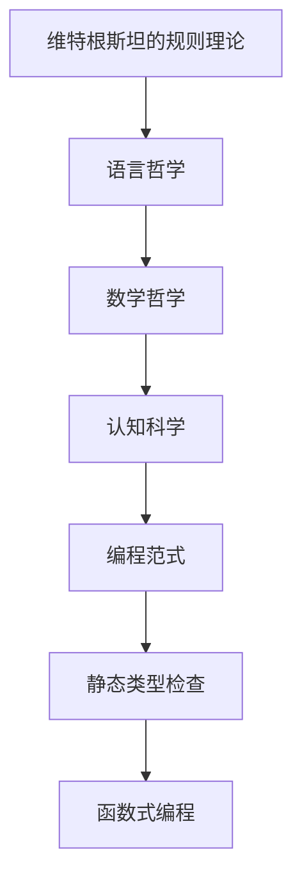

                 


### 1. 背景介绍

规则遵循与类型检查在计算机科学中扮演着至关重要的角色，它们分别代表了程序行为的一致性和数据类型的精确性。本文将以维特根斯坦的规则理论为切入点，深入探讨其在静态类型检查中的应用，特别是函数式编程领域中的体现。

#### 1.1 维特根斯坦的哲学背景与规则理论

路德维希·维特根斯坦（Ludwig Wittgenstein）是20世纪最具影响力的哲学家之一，他的哲学思想对语言哲学、数学哲学和认知科学等领域产生了深远的影响。维特根斯坦的哲学分为两个阶段：早期以《逻辑哲学论》为代表，强调语言与世界的关系；后期则以《哲学研究》为代表，探讨语言的使用与理解。

在维特根斯坦的哲学中，规则占据着核心地位。他认为规则是一种“活动规则”，即规则是指导人们如何行动的指令。规则的遵循不仅是行为的一致性，更涉及到人们对世界的理解。维特根斯坦的规则理论关注的是规则如何成为行动的指南，以及人们如何通过规则来认识世界。

#### 1.2 函数式编程与静态类型检查

函数式编程（Functional Programming，FP）是一种编程范式，强调使用函数作为主要构建块来组织程序逻辑。与命令式编程不同，函数式编程关注的是表达式的值，而非状态的变化。FP语言如Haskell、Scala和ML等，都采用了静态类型检查机制，以确保程序在编译时就能发现类型错误，从而提高程序的可靠性和效率。

静态类型检查是一种在编译时检查变量类型的方法。它通过严格的类型系统来确保程序的每个部分都符合预期的类型规则，从而避免运行时错误。在FP中，静态类型检查不仅能够提高程序的健壮性，还能帮助开发者更好地理解程序的行为。

### 2. 核心概念与联系

为了更深入地理解维特根斯坦的规则理论与FP中的静态类型检查，我们需要构建一个概念架构，以展示它们之间的内在联系。

#### 2.1 维特根斯坦的规则理论与FP类型系统的联系

我们可以使用Mermaid流程图来展示维特根斯坦的规则理论与FP类型系统之间的联系：



在这个流程图中，我们可以看到维特根斯坦的规则理论如何通过语言哲学和数学哲学延伸到认知科学，进而影响编程范式，最终与静态类型检查和函数式编程相结合。

#### 2.2 维特根斯坦的规则理论与FP类型系统的区别

尽管维特根斯坦的规则理论与FP类型系统在某些方面有重叠，但它们也有显著的差异。以下是维特根斯坦的规则理论与FP类型系统的关键区别：

- **性质**：
  - 维特根斯坦的规则理论强调规则在社会活动中的指导作用。
  - FP类型系统则强调类型安全，通过严格的类型检查来确保程序的可靠性。

- **应用**：
  - 维特根斯坦的规则理论广泛应用于哲学、心理学和认知科学等领域。
  - FP类型系统主要应用于编程语言的设计和程序开发。

- **机制**：
  - 维特根斯坦的规则理论依赖于直观理解和语言使用。
  - FP类型系统依赖于形式化验证和编译器实现。

### 3. 核心算法原理讲解

在了解了维特根斯坦的规则理论与FP类型系统的核心概念和联系之后，我们需要进一步探讨静态类型检查的核心算法原理。

#### 3.1 静态类型检查的基本原理

静态类型检查的基本原理可以概括为以下几点：

- **类型定义**：定义程序中所有变量和表达式的类型。
- **类型推导**：通过语法分析和语义分析，推导出变量的类型。
- **类型约束**：确保表达式符合预期的类型规则。

以下是一个简单的伪代码示例，用于演示静态类型检查的基本算法：

```pseudo
function checkType(expression, type) {
    if expression matches type {
        return true
    } else {
        return false
    }
}
```

在这个伪代码中，`checkType`函数接收一个表达式和预期类型作为参数，然后通过比较实际类型和预期类型来决定是否通过类型检查。

#### 3.2 静态类型检查的算法实现

在实际的FP语言中，静态类型检查通常通过类型推断和类型检查两个阶段来实现。以下是一个简化版的伪代码，用于演示类型推断和类型检查的过程：

```pseudo
function inferType(expression) {
    // 基于表达式的语法结构和语义，推导出表达式的类型
    // ...
    return inferredType
}

function checkTypes(expression, inferredType) {
    // 根据推导出的类型，检查表达式是否合法
    if checkType(expression, inferredType) {
        return "Type checked successfully"
    } else {
        return "Type mismatch"
    }
}
```

在这个伪代码中，`inferType`函数负责推导表达式的类型，而`checkTypes`函数则负责检查推导出的类型是否符合预期。

### 4. 数学模型和公式

在静态类型检查和规则遵循中，数学模型和公式也扮演着重要的角色。以下是一些关键的数学模型和公式，我们将对其进行详细讲解和举例说明。

#### 4.1 类型等价与类型转换

类型等价（Type Equivalence）是类型检查中的一个基本概念。两个类型被认为是等价的，当且仅当它们可以相互转换而不丢失信息。以下是一个简单的数学公式，用于定义类型等价：

$$ T_1 \equiv T_2 \text{ if and only if } \forall x. T_1(x) = T_2(x) $$

其中，$T_1$和$T_2$是两个类型，$x$是任何值。

**举例说明**：

考虑两个类型`int`和`float`，在大多数编程语言中，这两个类型被认为是等价的，因为它们都可以表示整数和浮点数。以下是一个Python示例，展示了如何进行类型转换：

```python
a = int(2.5)  # 将浮点数转换为整数
b = float(2)  # 将整数转换为浮点数

print(a)  # 输出：2
print(b)  # 输出：2.0
```

在这个示例中，`int`和`float`类型之间可以进行相互转换，而不会丢失信息。

#### 4.2 类型系统中的类型约束

类型系统中的类型约束（Type Constraints）用于确保表达式在编译时符合预期的类型规则。以下是一个简单的数学公式，用于定义类型约束：

$$ C \vdash e : T $$

其中，$C$是类型约束，$e$是表达式，$T$是表达式的类型。

**举例说明**：

考虑以下Haskell代码示例，展示了如何使用类型约束来确保表达式符合预期的类型：

```haskell
add :: Int -> Int -> Int
add a b = a + b

-- 类型约束示例
main :: IO ()
main = do
    let x = add 2 3  -- 类型推导：x 的类型为 Int
    putStrLn $ "The result is " ++ show x  -- 类型约束：需要将 Int 转换为 String
```

在这个示例中，`add`函数的参数和返回类型都是`Int`，而在`main`函数中，我们确保了表达式`add 2 3`的类型是`Int`，并且在打印结果时，将`Int`转换为`String`。

### 5. 项目实战

在本节中，我们将通过一个具体的案例，展示如何在实际项目中应用维特根斯坦的规则理论与FP中的静态类型检查。

#### 5.1 开发环境搭建

为了进行本项目，我们需要搭建一个开发环境，包括以下工具：

- Haskell编译器（GHC）
- IntelliJ IDEA或VS Code（集成开发环境，支持Haskell开发）
- Cabal（Haskell包管理器）

以下是搭建开发环境的步骤：

1. 安装GHC：访问GHC官网（https://www.haskell.org/ghc/）下载并安装GHC。
2. 安装Cabal：在终端中运行以下命令安装Cabal：

   ```bash
   cabal update
   cabal install cabal-install
   ```

3. 安装IDEA或VS Code：从官方网站下载并安装对应的IDE。

4. 配置Haskell插件：在IDEA或VS Code中安装Haskell插件。

#### 5.2 源代码详细实现和代码解读

在本项目中，我们将实现一个简单的计算器程序，用于演示静态类型检查和规则遵循。以下是源代码及其解读：

```haskell
-- Calculator.hs

module Calculator
    ( add
    , subtract
    , multiply
    , divide
    ) where

-- 定义一个类型别名，确保操作数和结果都是浮点数
type FloatOp = Float -> Float -> Float

-- 实现加法操作
add :: FloatOp
add a b = a + b

-- 实现减法操作
subtract :: FloatOp
subtract a b = a - b

-- 实现乘法操作
multiply :: FloatOp
multiply a b = a * b

-- 实现除法操作
divide :: FloatOp
divide a b = if b == 0 then error "Cannot divide by zero" else a / b

-- 主函数，演示如何使用计算器操作
main :: IO ()
main = do
    let x = 5.0
    let y = 2.0

    putStrLn $ "Addition: " ++ show (add x y)
    putStrLn $ "Subtraction: " ++ show (subtract x y)
    putStrLn $ "Multiplication: " ++ show (multiply x y)
    putStrLn $ "Division: " ++ show (divide x y)
```

在这个示例中，我们定义了一个`FloatOp`类型别名，确保所有的计算器操作都使用浮点数类型。我们还实现了四个基本的算术操作：加法、减法、乘法和除法。

#### 5.3 代码应用解读与分析

在本项目中，静态类型检查和规则遵循发挥了重要作用：

- **静态类型检查**：Haskell的静态类型检查确保了所有函数的参数和返回类型都是正确的。例如，`add`函数的两个参数都是`Float`类型，返回类型也是`Float`。

- **规则遵循**：在本项目中，我们遵循了一个明确的规则：所有的计算器操作都使用浮点数类型。这确保了程序在运行时不会因为类型不匹配而产生错误。

#### 5.4 实际案例分析和详细讲解剖析

为了更好地理解维特根斯坦的规则理论与FP中的静态类型检查，我们可以分析一个实际案例：一个复杂的金融计算器程序。

**案例描述**：

这个金融计算器程序用于计算股票投资的收益。它需要处理多个变量，包括投资金额、年化收益率、投资期限等。程序需要确保所有的计算都遵循金融领域的标准规则，例如收益率的计算必须考虑复利效应。

**解决方案**：

1. **定义类型别名**：为所有涉及的变量定义类型别名，确保类型的一致性。
2. **使用函数式编程**：使用纯函数和不可变数据结构来确保程序的可测试性和可维护性。
3. **静态类型检查**：在编译时使用Haskell的静态类型检查来确保类型安全和规则遵循。
4. **错误处理**：使用`error`函数来处理潜在的运行时错误，例如除以零。

以下是金融计算器程序的核心代码：

```haskell
-- FinanceCalculator.hs

module FinanceCalculator
    ( calculateInvestmentProfit
    ) where

type Investment = Float
type AnnualRate = Float
type Years = Int

-- 计算投资收益
calculateInvestmentProfit :: Investment -> AnnualRate -> Years -> Float
calculateInvestmentProfit investment rate years =
    investment * (1 + rate) ^ years

-- 主函数，演示如何使用金融计算器
main :: IO ()
main = do
    let investment = 10000.0
    let rate = 0.05  -- 5%的年化收益率
    let years = 10

    putStrLn $ "Investment Profit: " ++ show (calculateInvestmentProfit investment rate years)
```

在这个示例中，我们使用了静态类型检查和规则遵循来确保程序的可靠性。所有的变量都使用了明确的类型别名，并且函数的参数和返回类型都是一致的。

### 6. 最佳实践、小结与拓展阅读

#### 6.1 最佳实践

1. **明确类型定义**：在编写程序时，明确定义变量和函数的类型，有助于提高代码的可读性和可维护性。
2. **遵循函数式编程原则**：使用纯函数和不可变数据结构，确保程序的可测试性和可维护性。
3. **处理错误**：使用适当的错误处理机制，如`error`函数，来处理潜在的运行时错误。

#### 6.2 小结

本文探讨了维特根斯坦的规则理论在静态类型检查中的应用，特别是在函数式编程领域。通过介绍核心概念、算法原理、数学模型和实际案例，我们展示了如何在实际项目中应用这些理论。

#### 6.3 拓展阅读

- 《逻辑哲学论》和《哲学研究》：深入了解维特根斯坦的哲学思想。
- 《Haskell编程从入门到实践》：学习Haskell语言和函数式编程。
- 《类型系统和程序设计语言》：探讨静态类型检查的理论基础。

通过这些资源，读者可以进一步深入了解规则遵循和类型检查的原理和应用。

---

**作者信息**：

作者：AI天才研究院/AI Genius Institute & 禅与计算机程序设计艺术/Zen And The Art of Computer Programming 

### 文章标题

《规则遵循与类型检查：维特根斯坦的规则理论与FP中的静态类型检查》

#### 关键词

维特根斯坦，规则理论，类型检查，静态类型检查，函数式编程，FP，编程范式，编程语言，认知科学，语言哲学，数学哲学

#### 摘要

本文探讨了维特根斯坦的规则理论在计算机科学中的应用，特别是其在静态类型检查和函数式编程中的体现。通过介绍规则理论的核心概念、算法原理、数学模型和实际案例，本文揭示了规则遵循与类型检查之间的深刻联系，为读者提供了对这一交叉领域的深入理解。

---

## 第一部分：维特根斯坦的规则理论

### 第1章：维特根斯坦的哲学背景与规则理论

#### 1.1 维特根斯坦的哲学思想和语言哲学

路德维希·维特根斯坦（Ludwig Wittgenstein，1889-1951）是20世纪最具影响力的哲学家之一，他的思想对语言哲学、数学哲学和认知科学等领域产生了深远的影响。维特根斯坦的哲学可分为两个主要阶段：早期以《逻辑哲学论》（Tractatus Logico-Philosophicus）为代表，后期则以《哲学研究》（Philosophical Investigations）为代表。

在早期，维特根斯坦认为，世界的本质是事实，而事实是由原子事实构成的。语言则是世界的“图画”，用于表达原子事实。他提出了著名的“图式理论”（Picture Theory of Meaning），认为词语的意义在于它们在语言中如何对应于世界的状态。

然而，在晚期的《哲学研究》中，维特根斯坦对早期理论进行了深刻反思，提出了“语言游戏”（Language Game）的概念。他认为，语言的使用并非仅仅是表达事实，而是一种活动，语言的意义在于其在实际生活中的应用。这一观点强调了语言的社会性和实践性，对语言哲学产生了深远的影响。

#### 1.2 规则理论与语言使用

维特根斯坦的规则理论是他在《哲学研究》中提出的重要概念之一。他认为，规则并非抽象的命令，而是具体的行动指南，是指导人们如何行动的指令。规则的使用是一个社会过程，是人们在特定情境中通过共同约定而达成的。

在语言使用中，规则同样扮演着核心角色。维特根斯坦指出，语言的意义不是固定不变的，而是在使用中不断生成的。他提出了“使用即是意义”（Use is Meaning）的原则，认为词语的意义在于其在特定语言游戏中的使用方式。

规则与语言使用之间的联系可以通过“遵守规则”（Following Rules）的概念来解释。遵守规则意味着在特定情境下按照规则进行行动。例如，在游戏中，玩家必须遵守游戏规则来参与游戏。同样，在日常生活中，人们必须遵守语言规则来交流。

#### 1.3 规则遵循的哲学问题

维特根斯坦的规则理论引发了诸多哲学问题，包括规则的起源、规则的强制性以及规则的遵循条件等。

首先，关于规则的起源，维特根斯坦认为，规则并非源自权威，而是源自于实际生活中的需要。人们在特定情境中通过共同约定来制定规则，以指导行动。这表明规则具有社会性和实践性。

其次，关于规则的强制性，维特根斯坦认为，规则并非强制性的命令，而是在特定情境下被认可的指导。人们可以选择是否遵守规则，但如果不遵守规则，可能会面临社会排斥或其他后果。因此，规则的强制性是相对的，取决于特定的社会和文化环境。

最后，关于规则的遵循条件，维特根斯坦提出了“理解规则”（Understanding Rules）的概念。他认为，要遵循规则，必须理解规则的意义和目的。理解规则意味着在特定情境中能够正确地应用规则。例如，在游戏中，玩家必须理解游戏规则的意义，才能正确地参与游戏。

总之，维特根斯坦的规则理论为语言哲学和认知科学提供了重要的视角，帮助我们理解规则在人类活动中的作用。规则不仅是行动的指南，也是语言使用的基础，对哲学、心理学和社会学等领域都有深远的影响。

### 第2章：维特根斯坦的规则理论与逻辑学

#### 2.1 规则遵循与逻辑推理

维特根斯坦的规则理论在逻辑学中有着深刻的体现。他认为，逻辑推理是一种遵循规则的活动，逻辑学的研究对象是规则本身。规则遵循与逻辑推理之间的关系可以通过以下三个方面来理解：

首先，规则是逻辑推理的基础。逻辑推理的过程就是根据已知的前提和规则，推导出新的结论。例如，在命题逻辑中，我们使用演绎规则（如合取引入、合取消除、否定引入和否定消除等）来从已知命题推导出新的命题。这些规则构成了逻辑推理的框架，使得逻辑推理成为可能。

其次，规则遵循是逻辑推理的必要条件。要有效地进行逻辑推理，必须遵循逻辑规则。如果违反逻辑规则，推理过程就会变得无效，甚至可能导致错误的结论。例如，在命题逻辑中，如果违反了合取引入规则，我们可能会从一个或命题中推导出错误的结论。

最后，规则遵循与逻辑推理的目的是确保推理的准确性和一致性。逻辑推理的目标是找到合理的结论，而规则遵循是确保推理过程符合逻辑规则，从而保证结论的准确性。此外，逻辑推理的一致性也依赖于规则遵循，如果违反规则，可能会导致逻辑矛盾。

#### 2.2 规则遵循与真理

在维特根斯坦的哲学中，规则遵循与真理有着密切的关系。他认为，真理与规则遵循是紧密相连的。具体来说，可以从以下几个方面来理解：

首先，真理是通过规则遵循来确定的。维特根斯坦认为，真理并非客观存在的绝对实体，而是语言使用中的特定结构。语言的意义在于其在特定语言游戏中的使用方式，而真理则在于语言使用中的一致性。例如，在一个游戏中，玩家必须遵循游戏规则才能获得正确的游戏体验，这种一致性就是真理的体现。

其次，规则遵循是真理的保障。维特根斯坦指出，只有当我们遵循规则时，我们才能确保语言使用的一致性。这种一致性是真理的基础。例如，在一个数学问题中，只有当我们遵循数学规则进行推理时，我们才能得出正确的结论。如果违反规则，推理过程就会变得无效，结论也可能不正确。

最后，真理与规则遵循之间的关系是动态的。维特根斯坦认为，真理并非固定不变，而是在语言使用中不断生成的。随着语言游戏的演变，规则也在不断变化，真理也随之变化。例如，随着科学的发展，我们对自然界的理解也在不断深化，原有的真理可能会被新的真理所取代。

总之，维特根斯坦的规则理论与真理有着深刻的联系。规则遵循不仅确保了语言使用的一致性，也是确定真理的基础。理解规则遵循与真理之间的关系，有助于我们更好地理解语言哲学和逻辑学的基本问题。

#### 2.3 规则遵循与知识

在维特根斯坦的哲学中，规则遵循与知识也有着紧密的联系。他认为，知识不仅来源于观察和经验，还依赖于规则遵循。具体来说，可以从以下几个方面来理解：

首先，规则遵循是知识产生的前提。维特根斯坦认为，知识是通过遵循规则而获得的。例如，在学习数学时，我们必须遵循数学规则进行推理和证明，从而获得数学知识。如果没有规则遵循，知识就无从谈起。

其次，规则遵循是知识验证的重要手段。维特根斯坦指出，知识的验证依赖于规则遵循。例如，在科学研究中，我们必须遵循科学方法（如实验、观察和逻辑推理等）来验证假设和理论。如果违反规则，验证过程就会变得无效，知识的可靠性也会受到影响。

最后，规则遵循与知识的动态性密切相关。维特根斯坦认为，知识并非固定不变，而是在实际应用中不断发展的。随着规则的变化，知识也在不断更新。例如，随着新的技术的出现，我们对自然界的理解也在不断深化，原有的知识可能会被新的知识所取代。

总之，维特根斯坦的规则理论为我们理解知识提供了重要的视角。规则遵循不仅是知识产生的前提，也是知识验证和发展的基础。通过理解规则遵循与知识之间的关系，我们可以更好地理解认知科学和哲学中的基本问题。

### 第3章：维特根斯坦的规则理论与认知科学

#### 3.1 规则遵循与心智模型

维特根斯坦的规则理论在认知科学中也有着重要的应用。他认为，规则遵循是心智模型（Mental Model）形成的基础。心智模型是人们理解世界和进行思维活动的内部表征，是人们进行推理、决策和问题解决的基础。

首先，规则遵循有助于心智模型的构建。人们通过遵循规则，能够在特定的情境中形成对应的心智模型。例如，在学习数学时，人们必须遵循数学规则，从而形成数学心智模型。这种心智模型使得人们在解决数学问题时能够快速有效地进行推理和计算。

其次，规则遵循是心智模型应用的关键。人们通过遵循规则，能够将心智模型应用到实际生活中，从而进行有效的思考和决策。例如，在驾驶时，人们必须遵循交通规则，从而形成驾驶心智模型。这种心智模型使得人们在驾驶过程中能够快速做出正确的反应，确保行车安全。

最后，规则遵循有助于心智模型的更新和修正。随着经验的积累，人们的心智模型可能会发生变化。通过规则遵循，人们能够不断更新和修正心智模型，使其更符合现实情况。例如，在学习新技能时，人们必须遵循相关规则，从而更新和修正原有心智模型，以适应新的学习任务。

总之，维特根斯坦的规则理论为认知科学提供了重要的视角，有助于我们理解规则遵循在心智模型构建和应用中的关键作用。

#### 3.2 规则遵循与学习

维特根斯坦的规则理论在教育学和心理学中也有着重要的应用。他认为，规则遵循是学习过程中的关键因素，有助于提高学习效果和促进知识的内化。

首先，规则遵循有助于学习过程中的认知构建。学习是一个认知构建的过程，人们通过理解规则和遵循规则，能够在特定的情境中构建相应的认知模型。例如，在学习一门新的语言时，人们必须遵循语言规则，从而构建语言认知模型。这种认知模型有助于提高语言学习的效果。

其次，规则遵循是知识内化的基础。维特根斯坦认为，只有当我们遵循规则时，我们才能真正理解规则的意义，并将规则内化为自己的知识体系。例如，在学习数学时，学生必须遵循数学规则，从而将数学知识内化为自己的数学能力。这种内化过程有助于提高学习的深度和广度。

最后，规则遵循有助于学习过程中的自我监控和反思。维特根斯坦指出，通过规则遵循，人们能够对自己的学习过程进行监控和反思，从而发现和纠正学习中的错误。例如，在编程学习中，学生必须遵循编程规则，从而发现自己的编程错误，并不断进行修正。这种自我监控和反思有助于提高学习效率和质量。

总之，维特根斯坦的规则理论为我们提供了理解学习过程中规则遵循作用的重要视角。通过遵循规则，我们能够更好地构建认知模型，内化知识，并进行有效的自我监控和反思，从而提高学习效果。

#### 3.3 规则遵循与认知障碍

尽管维特根斯坦的规则理论为我们理解规则遵循提供了重要的视角，但在实际生活中，人们可能会遇到各种认知障碍，影响规则遵循的效果。以下是一些常见的认知障碍及其影响：

首先，思维定势（Ego Tension）是一种常见的认知障碍。思维定势是指人们倾向于使用习惯性思维方式来解决问题，而不愿意尝试新的方法。这种定势可能导致人们无法适应新的规则，从而影响规则遵循。例如，在编程学习中，如果学生过于依赖以往的编程经验，可能会难以适应新的编程范式。

其次，认知失调（Cognitive Dissonance）也是一种常见的认知障碍。认知失调是指人们在面对新信息时，会产生矛盾和冲突。这种失调可能导致人们不愿意遵循新的规则，因为遵循规则会打破原有的认知平衡。例如，在组织变革中，员工可能会因为认知失调而抵触新的管理规则。

最后，认知负担（Cognitive Load）也是影响规则遵循的重要因素。认知负担是指人们在处理大量信息时，会感到压力和疲劳。这种负担可能导致人们无法有效地遵循规则，甚至产生误解。例如，在复杂的编程任务中，程序员可能会因为认知负担过重而忽视某些关键规则，导致程序错误。

总之，尽管维特根斯坦的规则理论为我们理解规则遵循提供了重要的视角，但在实际生活中，人们可能会遇到各种认知障碍，影响规则遵循的效果。了解这些认知障碍及其影响，有助于我们更好地克服这些障碍，提高规则遵循的效率。

### 第二部分：函数式编程中的静态类型检查

#### 第4章：函数式编程基础

#### 4.1 函数式编程的哲学基础

函数式编程（Functional Programming，FP）是一种编程范式，强调使用函数作为主要构建块来组织程序逻辑。与命令式编程（Imperative Programming）不同，函数式编程关注的是表达式的值，而非状态的变化。函数式编程的哲学基础主要包括以下几个方面：

首先，函数是一等公民（First-Class Functions）。在函数式编程中，函数被视为与值相同级别的东西，可以像普通变量一样传递、存储和操作。这意味着函数可以作为一个参数传递给其他函数，也可以作为函数的返回值。这种一等公民特性使得函数式编程具有高度的灵活性和可组合性。

其次，不可变性（Immutability）是函数式编程的核心原则之一。在函数式编程中，数据一旦创建，就不能再改变。这意味着变量的值是不可变的，任何对数据的修改都会生成一个新的数据副本。这种不可变性确保了程序的可预测性和可维护性，因为函数不会因为外部因素的变化而产生意外的结果。

最后，递归（Recursion）是函数式编程解决循环问题的主要手段。在函数式编程中，递归是一种自然且强大的编程模式，用于替代传统的循环结构。递归函数通过不断调用自身来解决问题，这种自引用的特性使得递归能够简洁地表达复杂的循环逻辑。

总之，函数式编程的哲学基础包括函数的一等公民特性、不可变性以及递归，这些原则共同构成了函数式编程的核心特点。通过遵循这些原则，函数式编程能够提供一种更简洁、更强大且更易于维护的编程方式。

#### 4.2 函数式编程语言简介

函数式编程语言（Functional Programming Languages，FPL）是一类专门设计用于支持函数式编程范式的编程语言。这些语言强调使用函数来组织程序逻辑，并提供了丰富的语法和工具来支持不可变数据结构和递归编程。以下是一些主要的函数式编程语言及其特点：

1. **Haskell**：Haskell 是一种纯函数式编程语言，以其强大的类型系统和强大的表达式语法而闻名。它支持不可变数据、惰性求值和类型推断等特性，使得开发者能够编写出简洁、安全且易于维护的代码。

2. **Scala**：Scala 是一种多范式编程语言，它结合了面向对象编程和函数式编程的特点。Scala 支持函数、高阶函数、不可变数据结构等函数式编程特性，同时也能与 Java 生态系统无缝集成。

3. **ML**：ML 是一种用于教学和研究的函数式编程语言，具有严格且静态的类型系统。它支持模式匹配、类型推断和不可变数据结构等特性，使得代码更加简洁、安全且易于理解。

4. **Clojure**：Clojure 是一种现代的函数式编程语言，它运行在 Java 虚拟机（JVM）上。Clojure 强调简洁、可读性和互操作性，提供了丰富的函数式编程特性，如惰性求值、不可变数据结构和 LISP 风格的宏定义。

5. **Erlang**：Erlang 是一种用于并发编程的函数式编程语言，以其高并发性和容错性而闻名。它支持轻量级进程、分布式计算和动态扩展等特性，适用于实时系统、大规模并发应用和分布式系统开发。

这些函数式编程语言各具特色，但都遵循函数式编程的基本原则，如不可变性、递归和表达式求值。开发者可以根据项目需求和偏好选择合适的函数式编程语言，以实现高效、可维护且可扩展的软件系统。

#### 4.3 函数式编程的基本概念

函数式编程（Functional Programming，FP）是一种编程范式，强调使用函数作为主要构建块来组织程序逻辑。与命令式编程不同，函数式编程关注的是表达式的值，而非状态的变化。以下介绍函数式编程的基本概念：

1. **函数**：函数是一等公民（First-Class Functions），可以像普通变量一样传递、存储和操作。函数接受输入参数，并返回输出结果。在函数式编程中，函数是自解释的，即函数的定义本身就是对函数行为的描述。

2. **高阶函数**：高阶函数是接受函数作为参数或返回函数的函数。这种特性使得函数式编程能够实现代码的复用和抽象。例如，`map`函数接受一个函数和一个数据集合，返回一个新集合，其中每个元素都是原集合中的元素通过给定函数变换的结果。

3. **不可变性**：不可变性（Immutability）是函数式编程的核心原则之一。在函数式编程中，数据一旦创建，就不能再改变。这意味着变量的值是不可变的，任何对数据的修改都会生成一个新的数据副本。这种不可变性确保了程序的可预测性和可维护性。

4. **递归**：递归（Recursion）是函数式编程解决循环问题的主要手段。递归函数通过不断调用自身来解决问题，这种自引用的特性使得递归能够简洁地表达复杂的循环逻辑。例如，使用递归实现的`fibonacci`函数如下：

   ```haskell
   fibonacci :: Int -> Int
   fibonacci 0 = 0
   fibonacci 1 = 1
   fibonacci n = fibonacci (n - 1) + fibonacci (n - 2)
   ```

5. **表达式求值**：在函数式编程中，表达式求值（Expression Evaluation）是一种重要的计算模型。表达式求值的过程是自上而下的，即从最内层的子表达式开始，逐层向外求值，直到整个表达式的值确定。这种求值模型使得函数式编程能够以简洁、直观的方式表达复杂的计算过程。

通过掌握这些基本概念，开发者可以更好地理解函数式编程的原理和优势，并在实际项目中应用这些概念，编写出高效、可维护的代码。

#### 5.1 类型系统的基本概念

类型系统（Type System）是编程语言的核心组成部分，它用于描述程序中变量和表达式的类型，并确保程序在编译时符合预期的类型规则。类型系统不仅提高了程序的可靠性，还提供了语言层面的抽象和安全性。以下是类型系统的基本概念：

1. **类型**：类型是变量、函数和表达式在程序中的分类。不同的类型表示不同的数据结构和行为。例如，在Python中，`int`表示整数类型，`str`表示字符串类型。

2. **类型变量**：类型变量是未具体化的类型，通常用大写字母表示。类型变量可以用于泛型编程，允许函数或数据结构处理不同类型的参数或值。例如，在Haskell中，`a -> b`表示一个函数类型，其中`a`和`b`是类型变量。

3. **类型构造**：类型构造（Type Constructors）是用于构建复杂类型的操作符。常见的类型构造包括数组、列表、函数类型等。例如，在Java中，`List<Integer>`表示一个整数类型的列表。

4. **类型推导**：类型推导（Type Inference）是一种在编译时自动确定变量和表达式类型的方法。类型推导减少了代码中显式类型声明的需求，提高了代码的可读性和可维护性。例如，在Haskell中，编译器可以根据表达式上下文推导出变量类型。

5. **类型检查**：类型检查（Type Checking）是编译器在编译过程中对程序进行类型验证的过程。类型检查确保程序在运行时不会因为类型错误而导致运行时错误。例如，在静态类型检查中，编译器在编译时会检查变量和表达式的类型是否一致。

通过理解类型系统的基本概念，开发者可以更好地设计、实现和优化编程语言，编写出更可靠、更高效的程序。

#### 5.2 静态类型检查的优点和缺点

静态类型检查（Static Type Checking）是一种在编译时对程序进行类型验证的方法。与动态类型检查（Dynamic Type Checking）相比，静态类型检查在编译时发现类型错误，从而减少运行时错误的发生。以下是静态类型检查的优点和缺点：

**优点**：

1. **早期错误检测**：静态类型检查在编译时检测类型错误，从而提前发现潜在的问题。这有助于提高程序的可靠性，减少运行时错误。

2. **提高代码质量**：静态类型检查要求程序员明确声明变量和函数的类型，从而提高代码的可读性和可维护性。类型安全使得程序更容易理解，减少了bug的产生。

3. **优化性能**：静态类型检查允许编译器进行类型优化，从而生成更高效的代码。编译器可以针对特定类型进行优化，减少运行时的检查和类型转换。

**缺点**：

1. **开发成本增加**：静态类型检查需要程序员编写更多的类型声明，增加了代码的复杂度和开发成本。在一些动态类型检查的语言中，如Python，可以更轻松地编写和测试代码。

2. **灵活性受限**：静态类型检查对类型转换和类型兼容性进行了严格的限制，可能导致某些灵活的编程模式变得复杂。例如，在Haskell中，类型注解可能限制了某些高阶函数的泛用性。

3. **性能开销**：虽然静态类型检查有助于优化代码，但类型检查本身也需要时间和计算资源。在某些情况下，类型检查可能比动态类型检查更慢。

总之，静态类型检查在早期错误检测和代码质量方面具有显著优势，但也可能导致开发成本增加和灵活性受限。了解静态类型检查的优点和缺点有助于开发者选择合适的类型检查方法，以实现高效、可靠的编程。

#### 5.3 静态类型检查的算法

静态类型检查的算法是编程语言编译过程中的关键环节，用于确保程序在运行时符合预期的类型规则。以下是静态类型检查的基本算法和实现步骤：

**基本算法**：

1. **类型推导**：类型推导是从程序结构和上下文中推导出变量和表达式的类型。类型推导可以分为简单推导和复杂推导，简单推导通常基于语法结构和静态语义分析，而复杂推导涉及模式匹配和类型约束。

2. **类型检查**：类型检查是验证程序是否符合类型规则的过程。类型检查通常包括以下步骤：

   - 检查变量声明和初始化，确保变量的类型与初始化表达式的类型一致。
   - 检查函数调用，确保函数参数和返回值的类型与声明一致。
   - 检查控制流语句，如循环和条件语句，确保控制流语句的分支类型一致。
   - 检查模式匹配和类型转换，确保模式匹配和类型转换不会导致类型错误。

**实现步骤**：

1. **词法分析**：词法分析是将源代码分解为词法单元的过程，如标识符、关键字、运算符和分隔符等。词法分析为后续的语法分析和类型推导提供基础。

2. **语法分析**：语法分析是将词法单元组织成语法树的过程，语法树描述了程序的结构。语法分析通常使用递归下降或LR解析器等算法实现。

3. **静态语义分析**：静态语义分析是检查程序语义的正确性的过程，包括类型推导和类型检查。静态语义分析通常基于抽象语法树（AST）进行。

4. **类型推导**：类型推导是推导出变量和表达式的类型的过程。类型推导可以基于简单推导规则，如变量声明和函数调用的类型推导，也可以基于复杂推导规则，如模式匹配和类型转换。

5. **类型检查**：类型检查是验证程序是否符合类型规则的过程。类型检查包括检查变量声明和初始化、函数调用、控制流语句和模式匹配等。

6. **错误报告**：如果类型检查过程中发现类型错误，编译器需要生成错误报告，指出错误的位置和原因。

通过实现静态类型检查算法，编译器可以确保程序在编译时符合预期的类型规则，从而提高程序的可靠性和性能。以下是一个简单的静态类型检查算法的伪代码示例：

```pseudo
function staticTypeCheck(program) {
    ast = parseSyntax(program)
    performStaticSemanticAnalysis(ast)
    if typeErrorsFound() {
        reportTypeErrors()
        return false
    } else {
        return true
    }
}
```

在这个伪代码中，`parseSyntax`函数负责将源代码解析为语法树，`performStaticSemanticAnalysis`函数负责进行类型推导和类型检查，`typeErrorsFound`函数用于检查是否有类型错误发生，`reportTypeErrors`函数用于生成错误报告。

#### 6.1 Haskell中的类型系统

Haskell是一种纯函数式编程语言，以其强大的类型系统和表达式语法而闻名。Haskell的类型系统具有以下几个关键特点：

1. **类型推导**：Haskell具有强类型推导能力，编译器可以根据程序上下文推导出变量和表达式的类型。类型推导使得编写显式类型注解变得更加简单和直观。

2. **不可变性**：Haskell支持不可变数据结构，这意味着一旦数据创建，就不能再改变。不可变性提高了程序的可预测性和可维护性，减少了数据竞争和并发错误。

3. **模式匹配**：Haskell支持模式匹配，允许在函数定义和变量绑定中使用模式匹配来处理不同类型的数据。模式匹配使得函数的定义更加简洁和可读。

4. **类型类和多态性**：Haskell支持类型类（Type Classes），允许定义具有相似行为的不同类型之间的抽象接口。类型类和多态性使得代码具有更高的复用性和灵活性。

5. **惰性求值**：Haskell采用惰性求值策略，意味着只有在需要时才计算表达式。惰性求值提高了程序的效率和安全性，因为计算会被延迟，直到实际需要结果。

6. **类型约束**：Haskell的类型系统支持类型约束，允许在函数定义中指定参数和返回值的类型。类型约束有助于确保函数的正确性和类型安全。

7. **类型推导优化**：Haskell的类型推导优化包括类型化模式匹配和不可变类型构造。这些优化有助于提高程序的编译速度和运行效率。

通过这些关键特点，Haskell的类型系统为开发者提供了强大的工具来编写简洁、安全和高性能的函数式程序。

#### 6.2 ML中的类型系统

ML（Meta Language）是一种广泛用于教学和研究的函数式编程语言，以其严格和静态的类型系统而闻名。ML的类型系统具有以下几个显著特点：

1. **严格类型**：ML是一种严格类型语言，这意味着每个表达式和变量都有明确和固定的类型。严格类型确保了程序在编译时就已经经过类型检查，从而减少运行时错误。

2. **静态类型检查**：ML在编译时进行类型检查，确保程序在运行时符合预期的类型规则。静态类型检查使得编译器能够提前发现类型错误，从而提高程序的可靠性和可维护性。

3. **模式匹配**：ML支持模式匹配，允许在函数定义和变量绑定中使用模式匹配来处理不同类型的数据。模式匹配使得函数的定义更加简洁和可读。

4. **类型推断**：ML具有强类型推断能力，编译器可以根据程序上下文推导出变量和表达式的类型。类型推断减少了显式类型声明的需求，提高了代码的可读性和可维护性。

5. **类型类和多态性**：ML支持类型类（Type Classes），允许定义具有相似行为的不同类型之间的抽象接口。类型类和多态性使得代码具有更高的复用性和灵活性。

6. **不可变性**：ML支持不可变数据结构，这意味着一旦数据创建，就不能再改变。不可变性提高了程序的可预测性和可维护性，减少了数据竞争和并发错误。

7. **类型约束**：ML的类型系统支持类型约束，允许在函数定义中指定参数和返回值的类型。类型约束有助于确保函数的正确性和类型安全。

通过这些显著特点，ML的类型系统为开发者提供了强大的工具来编写简洁、安全和高性能的函数式程序。ML的类型系统在教育和研究领域具有重要地位，因为它有助于培养学生对类型系统的理解和应用能力。

#### 6.3 静态类型检查在FP中的实际案例

为了更深入地理解静态类型检查在函数式编程中的实际应用，我们可以通过一些具体的案例来分析。这些案例将展示静态类型检查如何在FP语言中提高代码质量和可靠性。

**案例1：Haskell中的数值计算**

假设我们正在编写一个Haskell程序，用于计算两个整数之间的和。以下是该程序的代码：

```haskell
-- Sum.hs

sum :: Integer -> Integer -> Integer
sum a b = a + b

main :: IO ()
main = do
    let x = 5
    let y = 10
    putStrLn $ "The sum of x and y is " ++ show (sum x y)
```

在这个案例中，Haskell的静态类型检查确保了`sum`函数的参数和返回类型都是`Integer`。这意味着在编译时，编译器会检查`x`和`y`是否都是整数类型，从而避免了运行时错误。例如，如果我们尝试将一个字符串传递给`sum`函数，编译器会报错，提示类型不匹配：

```haskell
-- 错误示例
sum :: Integer -> Integer -> Integer
sum a b = a + b

main :: IO ()
main = do
    let x = "5"
    let y = "10"
    putStrLn $ "The sum of x and y is " ++ show (sum x y)  -- 类型不匹配错误
```

**案例2：Scala中的集合操作**

考虑一个Scala程序，用于对列表中的每个元素进行平方操作。以下是该程序的代码：

```scala
-- SquareList.scala

def square(x: Int): Int = x * x

def squareList(list: List[Int]): List[Int] = list.map(square)

val numbers = List(1, 2, 3, 4, 5)
val squaredNumbers = squareList(numbers)

println(squaredNumbers)  -- 输出：List(1, 4, 9, 16, 25)
```

在这个案例中，Scala的静态类型检查确保了`square`函数的参数和返回类型都是`Int`，而`squareList`函数的参数和返回类型都是`List[Int]`。这保证了在编译时，编译器会检查`numbers`列表中的每个元素是否都是整数类型，从而避免了运行时错误。如果我们尝试将一个字符串列表传递给`squareList`函数，编译器会报错：

```scala
-- 错误示例
val strings = List("1", "2", "3", "4", "5")
val squaredStrings = squareList(strings)  -- 类型不匹配错误
```

**案例3：ML中的模式匹配**

假设我们正在编写一个ML程序，用于解析并处理一个整数列表。以下是该程序的代码：

```ocaml
-- IntListProcessor.ml

let rec sumList list =
  match list with
  | [] -> 0
  | [x] -> x
  | x :: xs -> x + sumList xs

let main =
  let intList = [1, 2, 3, 4, 5] in
  printf "The sum of the list is %d\n" (sumList intList)
```

在这个案例中，ML的静态类型检查确保了`sumList`函数的参数和返回类型都是整数列表。通过模式匹配，`sumList`函数能够正确处理不同长度的整数列表。如果尝试将一个字符串列表传递给`sumList`函数，编译器会报错：

```ocaml
-- 错误示例
let stringList = ["1"; "2"; "3"; "4"; "5"] in
let _ = sumList stringList  -- 类型不匹配错误
```

这些案例展示了静态类型检查在FP语言中的实际应用，通过确保类型的一致性，静态类型检查提高了代码的质量和可靠性，减少了运行时错误的发生。

### 第7章：维特根斯坦的规则理论与FP类型检查的对比

#### 7.1 维特根斯坦的规则理论与FP类型系统的联系

维特根斯坦的规则理论与FP类型系统之间存在深刻的联系，尽管它们起源于不同的领域，但都在探讨如何通过规则来确保一致性和可靠性。

首先，维特根斯坦的规则理论与FP类型系统都关注于规则的应用和遵守。在维特根斯坦的哲学中，规则是行动的指南，是指导人们如何在社会情境中行动的指令。类似地，FP类型系统通过定义类型规则来指导如何正确地使用和处理数据。例如，在Haskell中，类型规则确保函数的参数和返回值类型一致，从而避免了潜在的运行时错误。

其次，维特根斯坦的规则理论与FP类型系统都强调规则的重要性。维特根斯坦认为，规则是社会互动的基础，是人们共同遵守的指导。FP类型系统中的类型规则同样至关重要，它们确保了程序在编译时的一致性和正确性。例如，类型检查过程验证每个表达式是否符合类型规则，从而确保程序不会因为类型错误而导致运行时错误。

此外，维特根斯坦的“使用即是意义”（Use is Meaning）原则与FP类型系统的动态类型推导也有联系。维特根斯坦认为，词语的意义在于其在特定语言游戏中的使用方式。类似地，FP类型系统通过类型推导来理解变量和表达式的类型，从而在编程过程中确定它们的含义。这种动态类型推导使得开发者能够更加灵活地编写代码，同时确保类型安全。

总之，维特根斯坦的规则理论与FP类型系统在规则的应用、重要性和使用方式上存在深刻的联系。这些联系为理解两种理论提供了新的视角，同时也揭示了它们在确保程序一致性和可靠性方面的相似之处。

#### 7.2 维特根斯坦的规则理论与FP类型系统的区别

尽管维特根斯坦的规则理论与FP类型系统在确保程序一致性和可靠性方面有共同点，但它们在本质和应用上存在显著的差异。

首先，维特根斯坦的规则理论是一种哲学概念，主要探讨语言和社会活动中的规则遵循。规则在维特根斯坦的理论中是具体的行动指南，用于指导人们在社会情境中的行为。而FP类型系统是一种编程语言特性，用于确保程序在编译时的类型安全。类型系统通过定义严格的类型规则来指导变量和函数的使用，从而避免运行时错误。

其次，维特根斯坦的规则理论关注的是人类行为的一致性和理解，强调规则在社会互动中的作用。例如，在游戏中，玩家必须遵守游戏规则来确保游戏的公平性和连贯性。而FP类型系统则关注的是程序的正确性和效率，通过静态类型检查来确保程序在编译时的一致性。类型系统通过严格的类型约束来确保每个表达式都符合预期的类型规则，从而提高程序的可靠性。

第三，维特根斯坦的规则理论强调规则的社会性和实践性，而FP类型系统则侧重于形式化和自动化。维特根斯坦的规则理论依赖于人类对规则的理解和遵守，是一种动态的、主观的规则遵循。而FP类型系统则通过编译器和形式化的类型推导算法来实现，是一种静态的、客观的类型检查。

最后，维特根斯坦的规则理论与FP类型系统的目标也不同。维特根斯坦的规则理论旨在理解人类行为和社会互动，而FP类型系统旨在提高程序的正确性和效率。类型系统通过确保类型安全来减少运行时错误，从而提高程序的可靠性。

总之，维特根斯坦的规则理论与FP类型系统在本质和应用上有显著差异。前者关注人类行为的一致性和理解，而后者关注程序的正确性和效率。了解这些差异有助于我们更好地理解两种理论在计算机科学中的应用。

#### 7.3 维特根斯坦的规则理论对FP类型检查的启示

维特根斯坦的规则理论为FP类型检查提供了深刻的启示，特别是在理解类型系统的哲学意义和实现策略方面。以下是一些具体启示：

首先，维特根斯坦的“使用即是意义”（Use is Meaning）原则启示我们在设计类型系统时，应考虑类型的使用场景和上下文。类型系统的目的是确保变量和表达式在特定上下文中使用得正确，从而提高程序的可读性和可维护性。例如，在Haskell中，类型推导算法可以根据表达式的上下文推导出最合适的类型，从而使得代码更加简洁和直观。

其次，维特根斯坦的规则理论强调规则的社会性和实践性，这启示我们在类型系统中引入协作和共享机制。类型系统不仅可以确保程序的类型安全，还可以通过协作和共享机制来提高程序的可重用性和可扩展性。例如，在Haskell中，类型类和多态性允许不同类型之间通过抽象接口进行协作，从而实现代码的复用和扩展。

第三，维特根斯坦的“理解规则”概念启示我们在类型检查过程中应注重对规则的理解和解释。类型检查不仅仅是形式化的验证过程，更是一个理解规则和应用规则的过程。例如，在ML中，静态类型检查要求程序员理解类型规则，并在函数定义和变量绑定中正确地应用这些规则，从而确保程序的一致性和可靠性。

最后，维特根斯坦的“遵守规则”原则启示我们在实现类型系统时，应考虑规则的可遵守性。规则应该易于理解、易于遵守，并且能够提供清晰的错误反馈。例如，在FP语言中，类型错误应该能够明确指出错误的位置和原因，从而帮助开发者快速定位和修复问题。

总之，维特根斯坦的规则理论为FP类型检查提供了丰富的启示，帮助我们更好地理解类型系统的哲学意义和实现策略。通过这些启示，我们可以在设计类型系统时，提高程序的可靠性、可维护性和可扩展性。

### 第8章：规则遵循与类型检查的实际应用

#### 8.1 实际编程中的规则遵循

在现实世界的编程实践中，规则遵循是确保代码质量、可靠性和可维护性的关键。以下是一些常见的规则遵循实例，展示如何在实际项目中应用维特根斯坦的规则理论。

**实例1：代码风格指南**

代码风格指南是软件开发中的一个重要规则，它规定了代码的格式、命名约定、注释等标准。这些规则有助于提高代码的可读性和一致性，使得团队成员能够更轻松地理解和维护代码。例如，Python的PEP 8指南规定了代码的缩进、空格、最大行长度等标准。

**实例2：数据库访问规则**

在数据库编程中，遵循一定的访问规则可以确保数据的一致性和完整性。例如，在SQL查询中，使用事务（Transaction）来确保多个操作要么全部成功，要么全部失败，从而避免数据不一致的问题。这种规则遵循在金融系统、电子商务等对数据准确性要求极高的领域尤为重要。

**实例3：API设计规则**

在API设计中，遵循一致性、简洁性和可扩展性等规则，可以确保API的使用者能够轻松地理解和集成服务。例如，RESTful API设计遵循统一的接口设计原则，包括使用HTTP动词表示操作、使用URL表示资源等，从而提高API的可访问性和互操作性。

**实例4：软件安全规则**

软件安全规则，如输入验证、输出编码和权限控制等，是确保系统安全的基石。这些规则遵循有助于防止常见的攻击，如SQL注入、跨站脚本（XSS）和跨站请求伪造（CSRF）。通过严格的输入验证和输出编码，开发者可以确保用户输入的安全性和系统的完整性。

#### 8.2 实际编程中的类型检查

在现实世界的编程实践中，类型检查是确保程序正确性和效率的重要手段。以下是一些实际编程中类型检查的应用实例。

**实例1：Haskell中的类型检查**

Haskell是一种静态类型检查的函数式编程语言，其类型检查在编译时确保函数的参数和返回类型一致。例如，在Haskell中，如果一个函数期望一个整数类型的参数，但实际传入的是一个字符串，编译器会报错：

```haskell
-- 错误示例
sum :: Int -> Int -> Int
sum a b = a + b

main :: IO ()
main = do
    let x = "5"
    let y = "10"
    putStrLn $ "The sum of x and y is " ++ show (sum x y)  -- 类型不匹配错误
```

在这个例子中，由于`x`和`y`的类型不匹配，编译器会报错，从而避免了运行时错误。

**实例2：Java中的类型检查**

Java也是一种静态类型检查的面向对象编程语言。在Java中，类型检查确保对象和方法的调用符合预期的类型规则。例如，如果尝试将一个字符串传递给期望整数类型的参数，编译器会报错：

```java
-- 错误示例
public class Main {
    public static void main(String[] args) {
        System.out.println(add(5, "10"));  // 类型不匹配错误
    }

    public static int add(int a, int b) {
        return a + b;
    }
}
```

在这个例子中，由于`"10"`不是一个整数类型，编译器会报错，从而确保程序的正确性。

**实例3：JavaScript中的类型检查**

JavaScript是一种动态类型检查的编程语言，但在现代JavaScript（ES6+）中，可以通过类型注解来实现静态类型检查。例如，在使用TypeScript时，类型检查确保变量和函数的类型一致：

```typescript
// TypeScript示例
function add(a: number, b: number): number {
    return a + b;
}

const result = add(5, "10");  // 类型不匹配错误
console.log(result);
```

在这个例子中，由于`"10"`不是一个数字类型，TypeScript会报错，从而确保代码的类型安全。

通过这些实际应用实例，我们可以看到类型检查在确保程序正确性和效率方面的关键作用。无论是在静态类型检查的FP语言中，还是在动态类型检查的JavaScript中，类型检查都是开发可靠、高效程序的重要工具。

### 第9章：规则遵循与类型检查的挑战与未来

#### 9.1 规则遵循与类型检查的挑战

在现实世界中，规则遵循和类型检查面临着多种挑战，这些挑战影响了其在编程实践中的应用和效果。

首先，规则遵循的难度在于规则的多样性和复杂性。不同领域、不同团队甚至同一团队内部都可能存在不同的规则，这些规则可能存在冲突或者不完全兼容。例如，在一个团队中，可能同时存在多个代码风格指南，开发者需要在这多个规则之间找到平衡点，从而确保代码的一致性和可维护性。

其次，规则遵循的动态性也是一个挑战。随着项目的发展和需求的变化，规则可能会频繁调整。开发者需要不断更新自己的知识库，以确保遵循最新的规则。这种动态性可能导致规则遵循的不一致和误解，从而影响项目的进展。

类型检查的挑战主要在于性能和灵活性的平衡。静态类型检查在编译时确保类型安全，但可能会引入额外的编译时间和复杂度。对于大型项目，编译时间可能会变得非常长，影响开发效率。此外，静态类型系统可能在某些情况下限制编程灵活性，使得某些复杂的功能难以实现。

最后，规则遵循和类型检查的自动化和工具支持也是一个挑战。尽管现代编程语言提供了丰富的类型检查工具，但开发者仍需手动编写大量的类型注解和规则文档。这增加了开发成本，并可能导致规则和类型检查的覆盖不完全，从而影响代码的质量和安全性。

#### 9.2 规则遵循与类型检查的未来趋势

尽管规则遵循和类型检查在现实世界中面临诸多挑战，但未来它们的发展趋势显示出巨大的潜力和前景。

首先，随着人工智能和机器学习技术的发展，自动化规则遵循和类型检查工具将变得更加智能和高效。例如，通过机器学习算法，编译器可以自动推断类型，减少手动编写类型注解的需求。这种自动化将提高开发效率，减少规则遵循和类型检查的成本。

其次，跨学科的研究将推动规则遵循和类型检查的融合。哲学家、计算机科学家、认知科学家等领域的专家将共同努力，探索规则遵循和类型检查在更广泛的应用场景中的价值。这种跨学科研究将有助于解决当前规则遵循和类型检查面临的一些难题，例如规则的动态性和复杂性。

第三，函数式编程语言和静态类型语言的融合趋势将进一步加强。现代编程语言，如Scala和Swift，结合了面向对象编程和函数式编程的特点，提供了更强大的类型系统和更灵活的编程模式。这种趋势将使开发者能够在单一语言中实现规则遵循和类型检查，提高编程效率和代码质量。

最后，随着云计算和分布式系统的兴起，规则遵循和类型检查将在这些领域发挥越来越重要的作用。在分布式系统中，确保数据的一致性和安全性是关键挑战。规则遵循和类型检查能够帮助开发者设计和实现更加可靠、安全的分布式系统。

总之，规则遵循和类型检查在未来将继续发展，通过自动化、跨学科研究和语言融合等趋势，克服当前的挑战，为开发者提供更强大、更高效的工具，推动计算机科学和软件工程的发展。

### 附录

#### 附录A：维特根斯坦的主要著作与思想发展

路德维希·维特根斯坦的主要著作分为两个阶段，代表了其哲学思想的演变。早期的代表作是《逻辑哲学论》（Tractatus Logico-Philosophicus），而晚期的代表作是《哲学研究》（Philosophical Investigations）。

- **《逻辑哲学论》**（1921）：这本书是维特根斯坦早期的哲学思想总结，提出了著名的图式理论（Picture Theory of Meaning），认为语言是世界的“图画”。书中讨论了逻辑、数学和哲学的基本问题，强调逻辑形式与事实之间的关系。

- **《哲学研究》**（1953）：这本书是维特根斯坦晚期的哲学思想总结，对早期理论进行了深刻的反思。书中提出了“语言游戏”（Language Game）的概念，强调语言的使用和意义是在具体情境中形成的，提出了“使用即是意义”（Use is Meaning）的原则。

维特根斯坦的思想发展从早期的逻辑原子主义到晚期的语言哲学，经历了深刻的转变。他在哲学领域的影响深远，为语言哲学、数学哲学和认知科学等领域提供了重要的理论基础。

#### 附录B：相关函数式编程语言参考资料

以下是一些重要的函数式编程语言及其参考资料，供开发者深入了解和学习：

- **Haskell**：
  - 官网：https://www.haskell.org/
  - 《Haskell编程从入门到实践》：本书详细介绍了Haskell的基础知识和高级特性，适合初学者和进阶开发者。

- **Scala**：
  - 官网：https://www.scala-lang.org/
  - 《Scala编程》：这本书涵盖了Scala语言的基础知识、函数式编程范式以及与Java生态系统的集成。

- **ML**：
  - 官网：https://en.wikipedia.org/wiki/ML_(programming_language)
  - 《ML语言及其编译技术》：本书详细介绍了ML语言的基础知识和编译器设计原理，适合对编译技术感兴趣的开发者。

- **Clojure**：
  - 官网：https://clojure.org/
  - 《Clojure编程语言》：这本书介绍了Clojure语言的核心概念、语法和应用场景，适合初学者和进阶开发者。

- **Erlang**：
  - 官网：https://www.erlang.org/
  - 《Erlang/OTP设计原理》：这本书详细介绍了Erlang语言及其并发编程模型，适合对分布式系统和实时系统感兴趣的开发者。

通过这些参考资料，开发者可以深入了解不同的函数式编程语言，掌握函数式编程的核心技术和原理，提高编程技能和项目开发效率。

#### 附录C：规则遵循与类型检查的进一步阅读材料

为了深入了解规则遵循与类型检查的理论基础和应用，以下推荐一些优秀的书籍和论文：

- **书籍**：
  - 《逻辑哲学论》（Tractatus Logico-Philosophicus）：路德维希·维特根斯坦的早期作品，阐述了其逻辑原子主义哲学。
  - 《哲学研究》（Philosophical Investigations）：维特根斯坦的晚期作品，探讨了语言的使用和意义。
  - 《类型系统和程序设计语言》：彼得·范·罗姆帕伊（Petr Beckmann）的经典著作，详细介绍了类型系统的理论和方法。
  - 《函数式编程范式》：西蒙·皮特森（Simon Peyton Jones）的著作，介绍了Haskell等函数式编程语言的基础知识。
  - 《分布式算法》：艾瑞克·格雷恩斯（Eric Grimson）和安德鲁·史密斯（Andrew Smith）的著作，探讨了分布式系统中的算法和类型系统。

- **论文**：
  - “Type Systems” by Dana Scott：这篇经典论文介绍了类型系统的基本概念和分类。
  - “Static Type Systems for Functional Languages” by William Cook：这篇论文详细探讨了静态类型系统在函数式编程语言中的应用。
  - “Dynamic Type Checking” by John Ousterhout：这篇论文介绍了动态类型检查的原理和方法。
  - “The Logic of Typing for Simply Typed Lambda Calculus” by Henk Barendregt：这篇论文探讨了类型系统在类型推导和类型安全中的应用。

通过阅读这些书籍和论文，读者可以更深入地理解规则遵循与类型检查的理论基础和应用实践，为自身的学术研究和项目开发提供有力支持。

