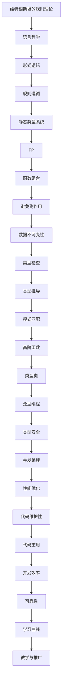

                 

  
首先，我们需要确定本文的核心内容是维特根斯坦的规则理论以及函数式编程（FP）的静态类型系统。接下来，我们需要构建一个逻辑清晰、结构紧凑的章节大纲，确保每个章节都涵盖核心概念、原理及其联系。

### 1.3 规则理论在语言哲学中的应用

维特根斯坦的规则理论在语言哲学中有着重要的应用，尤其是在理解和解释语言的本质方面。维特根斯坦认为，语言不仅仅是符号的集合，而是与实际世界相互关联的体系。

**1.3.1 图像理论与语言哲学**

维特根斯坦的早期作品《逻辑哲学论》中提出的图像理论是规则理论的基石。根据图像理论，语言的符号与世界的对象之间存在着一种直接对应的关系。具体来说，一个语句的意义在于它所描述的世界状态。这种观点强调了逻辑和语言在构建世界图景中的重要性。

**1.3.2 日常语言哲学**

在维特根斯坦的后期作品《哲学研究》中，他提出了日常语言哲学的观点，批判了图像理论的绝对化。维特根斯坦认为，日常语言是复杂的，它包含了多种不同的用法和含义。语言的意义并不是固定的，而是依赖于具体的语境和情境。

**1.3.3 规则与语言使用**

维特根斯坦的规则理论还关注了语言使用的规则性。他认为，语言的使用遵循特定的规则，这些规则构成了语言游戏的基础。例如，在游戏中，参与者必须遵循特定的规则来进行游戏，否则游戏就无法进行。同样，在语言交流中，参与者也需要遵循语言规则，以确保有效沟通。

### 1.4 规则理论与形式逻辑

维特根斯坦的规则理论不仅在语言哲学中有着重要的应用，也在形式逻辑中有着深远的影响。形式逻辑是研究逻辑推理和证明的理论，它依赖于一套明确的规则和原则。

**1.4.1 形式逻辑的基本原则**

形式逻辑的基本原则包括命题逻辑和谓词逻辑。命题逻辑研究命题之间的关系，如命题的否定、合取、析取等。谓词逻辑则研究个体与属性之间的关系，如全称量词和存在量词的使用。

**1.4.2 规则与形式逻辑**

维特根斯坦的规则理论为形式逻辑提供了理论基础。他认为，形式逻辑中的推理规则实际上是语言游戏的特殊形式。这些规则确保了推理过程的正确性，使得我们可以从已知的前提推导出新的结论。

**1.4.3 规则遵循与证明**

在形式逻辑中，证明是一个关键概念。一个证明是一个逻辑序列，它从已知的前提出发，通过一系列合法的推理步骤，最终得出结论。维特根斯坦的规则理论强调了证明过程中的规则遵循。只有遵循正确的规则，我们才能保证证明的有效性。

### 1.5 小结

在本章中，我们介绍了维特根斯坦的生平与哲学贡献，特别是他的规则理论。我们还探讨了规则理论在语言哲学中的应用，以及规则与语言使用之间的关系。最后，我们讨论了规则理论与形式逻辑的联系，并强调了规则遵循在证明过程中的重要性。

接下来的章节将深入探讨函数式编程（FP）的基本概念、静态类型系统的原理及其与维特根斯坦规则理论的联系。通过逐步分析推理，我们将揭示这两者之间的深层关系，并探讨它们在软件开发中的应用。

# 第2章 函数式编程（FP）基础

## 2.1 FP的概念与特点

函数式编程（Functional Programming，简称FP）是一种编程范式，它强调以函数为核心进行编程。与命令式编程不同，FP侧重于计算的表达而非状态的变化。FP的核心理念是函数组合和避免副作用。

### 2.1.1 函数组合

在FP中，函数是第一类公民，这意味着函数可以像其他数据类型一样被赋值、传递和返回。函数组合是FP中的一个核心概念，它允许程序员将多个函数组合成一个更大的函数。这种组合方式使得代码更易于理解和复用。

### 2.1.2 避免副作用

副作用是指在函数执行过程中，会改变程序状态或外部环境的行为。在FP中，为了避免副作用，函数通常是无状态的，即它们不依赖于外部环境，也不改变外部环境。这种无状态性使得函数更加可靠和可测试。

### 2.1.3 数据不可变

在FP中，数据通常是不可变的。这意味着一旦数据被创建，它的值就不能被改变。这种不可变性有助于防止意外的状态更改，提高代码的可靠性。

## 2.2 FP的基本类型系统

FP的类型系统通常比命令式编程语言更加强大和灵活。它支持函数类型、高级类型构造以及模式匹配等特性。

### 2.2.1 函数类型

在FP中，函数类型是基本类型之一。一个函数类型由其参数类型和返回类型组成。例如，函数`f: A -> B`表示一个接受类型为`A`的参数并返回类型为`B`的函数。

### 2.2.2 高级类型构造

FP支持高级类型构造，如元组、列表、字典等。这些类型可以用于构建复杂的数据结构，并支持模式匹配等高级操作。

### 2.2.3 模式匹配

模式匹配是FP中的一个重要特性，它允许程序员根据数据的具体结构进行选择和操作。模式匹配类似于多态，但更加灵活和强大。

## 2.3 FP与命令式编程的比较

FP与命令式编程（ Imperative Programming）在编程范式上有显著差异。

### 2.3.1 理念对比

- **命令式编程**：侧重于改变程序状态，通过一系列指令逐步实现目标。它依赖于变量和状态的变化。
- **函数式编程**：侧重于表达计算过程，通过函数组合和避免副作用来实现目标。它强调无状态和函数的纯度。

### 2.3.2 实践对比

- **命令式编程**：通常使用循环、条件语句和赋值操作来改变程序状态。
- **函数式编程**：通常使用递归、高阶函数和模式匹配来处理数据。

### 2.3.3 优点和缺点

- **命令式编程**：易于理解和实现，适合处理复杂状态变化。但其状态管理可能导致代码难以维护和测试。
- **函数式编程**：代码更简洁、更易于测试和维护，适合处理并发和并行计算。但其在处理复杂状态时可能不如命令式编程灵活。

## 2.4 FP的主要实现语言

FP有多种实现语言，其中一些最为流行的是Haskell、Scala、Erlang和JavaScript（通过函数式库如Ramda和lodash）。

### 2.4.1 Haskell

Haskell是一种纯FP语言，它支持类型推断、惰性求值和高阶函数等特性。Haskell的设计哲学强调简洁、可组合性和无副作用。

### 2.4.2 Scala

Scala是一种多范式编程语言，它结合了FP和命令式编程的特点。Scala支持函数组合、模式匹配和类型推导等FP特性，同时也保留了Java的命令式编程风格。

### 2.4.3 Erlang

Erlang是一种用于构建并发和分布式系统的FP语言。它以其轻量级的进程模型和高效的并发处理能力而闻名。

### 2.4.4 JavaScript

虽然JavaScript最初是一种命令式编程语言，但它可以通过使用函数库（如Ramda和lodash）来支持FP编程。JavaScript的异步编程特性和函数式特性使其成为构建现代Web应用的流行选择。

## 2.5 小结

在本章中，我们介绍了函数式编程（FP）的基本概念、特点以及与命令式编程的比较。我们还讨论了FP的基本类型系统以及主要实现语言。通过这些内容，我们为理解FP在静态类型系统中的应用奠定了基础。接下来，我们将深入探讨静态类型系统的原理和维特根斯坦规则理论之间的关系。

### 2.1.1 函数组合

函数组合是函数式编程（FP）中的核心概念之一，它允许我们将多个函数组合在一起，以创建新的、复杂的函数。这种组合方式不仅提高了代码的可读性，还增强了代码的可重用性和灵活性。

#### 什么是函数组合？

在FP中，函数组合指的是将两个或多个函数组合成一个更大的函数，使得组合后的函数能按照特定的顺序执行。函数组合通常遵循“函数即对象”的原则，即函数可以像其他数据类型一样传递、存储和操作。

#### 函数组合的方法

1. **函数点积（Function Composition）**

   函数点积是一种将两个函数组合在一起的方法，通常表示为\( f \circ g \)。其中，\( f \)和\( g \)是两个函数，\( f \circ g \)表示先执行\( g \)，然后将结果传递给\( f \)。

   例如，假设我们有函数`f(x) = x^2`和`g(x) = x + 2`，我们可以将它们组合成一个新函数：

   ```plaintext
   h = f ∘ g
   h(x) = (x + 2)^2
   ```

2. **管道（Pipeline）**

   管道是另一种常见的函数组合方式，它允许我们将多个函数串联起来，形成一个流水线式的数据处理流程。管道通常使用管道操作符\( | \)表示。

   例如，假设我们有函数`f(x) = x^2`和`g(x) = x + 2`，我们可以使用管道将它们组合：

   ```plaintext
   x | g | f
   ```

   这意味着先将`x`传递给`g`，然后将结果传递给`f`。

#### 函数组合的实际应用

函数组合在数据处理和软件工程中有着广泛的应用。以下是一些实际应用场景：

1. **数据处理**

   在数据处理中，函数组合可以用于构建复杂的转换流程。例如，我们可以使用函数组合对数据集进行清洗、转换和聚合。

2. **软件工程**

   在软件工程中，函数组合可以提高代码的可重用性和模块化。通过将复杂的逻辑分解成较小的、独立的函数，我们可以更容易地测试、理解和维护代码。

### 2.1.2 避免副作用

在函数式编程中，避免副作用（side effects）是一个基本原则。副作用是指函数在执行过程中改变了外部状态或产生了不可预期的结果。为了避免副作用，函数通常被设计为纯函数（pure functions）。

#### 什么是纯函数？

纯函数是指那些输出仅依赖于输入，并且不会修改外部状态的函数。换句话说，对于相同的输入，纯函数总是产生相同的输出，而且不产生任何副作用。

例如，以下是一个纯函数：

```plaintext
f(x) = x * x
```

无论何时调用`f(x)`，只要输入`x`相同，输出总是`x`的平方。

#### 为什么要避免副作用？

避免副作用有以下几个主要优点：

1. **可预测性**

   纯函数由于其确定性，使得程序更加可预测。这意味着，只要输入相同，输出总是相同，无需担心函数的行为会随时间或上下文的变化而改变。

2. **可测试性**

   纯函数更容易进行单元测试，因为它们不会依赖于外部状态。这有助于提高代码的测试覆盖率，确保函数在各种情况下都能正确执行。

3. **可重用性**

   由于纯函数不依赖于外部状态，因此它们更容易被重用。这意味着，一旦一个纯函数被证明是正确的，它可以被用在任何需要相同功能的上下文中。

#### 实现纯函数的方法

为了实现纯函数，可以遵循以下方法：

1. **使用局部变量**

   在纯函数中，所有计算都应在函数的内部完成，避免使用全局变量。这有助于确保函数不依赖于外部状态。

2. **不可变数据**

   使用不可变数据结构，如常量数组、字符串和对象，可以减少副作用。一旦创建，这些数据就不能被修改。

3. **无状态函数**

   设计函数时，尽量使其不依赖于任何外部状态。这意味着函数的所有计算都应基于输入参数。

### 2.1.3 数据不可变性

在函数式编程中，数据不可变性是另一个基本原则。数据不可变性意味着一旦数据被创建，其值就不能被修改。相反，我们需要创建新的数据来表示变化。

#### 什么是数据不可变性？

数据不可变性是指数据在创建后不能被修改。相反，当我们需要修改数据时，我们会创建一个新的数据对象来表示这种变化。

例如，考虑一个表示用户的对象：

```javascript
const user = {
  name: "Alice",
  age: 30
};
```

如果我们想更新`user`的`age`属性，而不是直接修改它，我们可以创建一个新的对象：

```javascript
const user = {
  name: "Alice",
  age: 30
};

const updatedUser = {
  ...user,
  age: 31
};
```

在这里，`updatedUser`是一个新创建的对象，它复制了`user`的属性，并将`age`更新为31。

#### 数据不可变性的优点

数据不可变性有几个优点：

1. **减少副作用**

   由于数据不可变性，我们可以避免在多个地方直接修改数据，从而减少副作用。这有助于提高代码的清晰性和可维护性。

2. **增强可预测性**

   数据不可变性使得程序的可预测性更高。由于数据不会被修改，我们可以更准确地预测程序的行为。

3. **易于调试**

   当数据不可变性时，代码的调试过程会变得更加简单。由于没有副作用，我们可以更容易地找到和解决问题。

#### 实现数据不可变性的方法

为了实现数据不可变性，可以遵循以下方法：

1. **使用不可变数据结构**

   使用不可变数据结构，如常量数组、字符串和对象，可以确保数据在创建后不会被修改。

2. **不可变对象**

   在创建对象时，尽量避免使用可变对象。相反，使用不可变的对象来表示数据。

3. **函数式更新**

   当需要更新数据时，使用函数式更新方法，如使用扩展运算符（`...`）来创建新的数据对象。

通过遵循函数组合、避免副作用和数据不可变性的原则，函数式编程可以带来更清晰、更可维护和更可靠的代码。在接下来的章节中，我们将进一步探讨FP的静态类型系统和维特根斯坦规则理论之间的联系。

### 2.2.1 函数类型

在函数式编程（FP）中，函数类型是一种基本的数据类型，它描述了函数的参数类型和返回类型。理解函数类型对于掌握FP语言至关重要，因为函数不仅是FP的核心构件，也是实现函数组合、高阶函数和柯里化等关键概念的基础。

#### 函数类型的定义

函数类型可以形式化地表示为“参数类型 -> 返回类型”。例如，函数`f`接受一个类型为`A`的参数并返回一个类型为`B`的值，可以表示为`f: A -> B`。

1. **参数类型**：函数可以接受一个或多个参数，每个参数都有其特定的类型。例如，函数`add`接受两个整数参数，可以表示为`add: Int -> Int -> Int`。
2. **返回类型**：函数执行完毕后返回一个值，该值的类型被称为返回类型。例如，函数`increment`接受一个整数参数并返回该参数加1的结果，可以表示为`increment: Int -> Int`。

#### 函数类型的例子

以下是一些函数类型的例子：

1. **一元函数**：接受一个参数并返回一个值的函数。

   ```haskell
   double :: Int -> Int
   double x = 2 * x
   ```

   在这个例子中，`double`是一个一元函数，它接受一个整数`x`并返回`x`的两倍。

2. **二元函数**：接受两个参数并返回一个值的函数。

   ```haskell
   add :: Int -> Int -> Int
   add x y = x + y
   ```

   `add`函数接受两个整数参数`x`和`y`，并返回它们的和。

3. **多参数函数**：接受多个参数并返回一个值的函数。

   ```haskell
   multiply :: Int -> Int -> Int -> Int
   multiply x y z = x * y * z
   ```

   `multiply`函数接受三个整数参数`x`、`y`和`z`，并返回它们的乘积。

#### 函数类型与类型系统

FP语言的类型系统通常比命令式编程语言更加强大，它们支持函数类型、高级类型构造和类型推导等特性。这些特性使得FP语言能够更严格地检查函数的正确性和可靠性。

1. **类型推导**：许多FP语言具有自动类型推导机制，这意味着程序员不需要显式地指定函数的参数类型和返回类型，编译器可以自动推断出它们的类型。例如，在Haskell中，我们可以这样定义函数：

   ```haskell
   double x = 2 * x
   ```

   编译器会自动推断`double`的函数类型为`Int -> Int`。

2. **类型检查**：FP语言的类型系统在编译时进行类型检查，以确保函数的参数和返回值类型匹配。这种静态类型检查有助于发现潜在的错误和缺陷，提高代码的可靠性。

通过理解函数类型，我们可以更好地利用FP语言的优势，编写出更加清晰、简洁和可靠的代码。在接下来的章节中，我们将继续探讨FP的类型系统、模式匹配和高阶函数等概念。

### 2.2.2 高级类型构造

在函数式编程（FP）中，高级类型构造是类型系统的重要组成部分，它们为处理复杂数据结构和类型提供了强大的工具。高级类型构造包括元组、列表、选项（Option）和集合等。这些类型不仅扩展了基本数据类型，还增强了程序的可读性和灵活性。

#### 元组（Tuple）

元组是一种可以包含多个不同类型元素的数据结构。在许多FP语言中，元组用于组合多个值，并且这些值在元组中保持其原始类型。元组通常用圆括号和逗号分隔的元素表示。

例如，在Haskell中，我们可以定义一个包含两个整数的元组：

```haskell
let point = (3, 4)
```

在这个例子中，`point`是一个包含两个整数的元组。元组在模式匹配和函数组合中非常有用，因为它们允许我们提取和操作元组中的元素。

#### 列表（List）

列表是FP中最常用的数据结构之一，它是一种有序的元素集合，支持各种操作，如映射、过滤和折叠等。列表通常用方括号和逗号分隔的元素表示。

```haskell
let numbers = [1, 2, 3, 4, 5]
```

在Haskell中，`numbers`是一个包含五个整数的列表。列表支持递归操作，这使得处理大量数据变得更加容易。例如，我们可以使用`map`函数将列表中的每个元素乘以2：

```haskell
let doubledNumbers = map (*2) numbers
```

这将创建一个新的列表，其中每个元素都是原始列表中对应元素的两倍。

#### 选项（Option）

选项是一种特殊的类型，用于表示可能存在或不存在的值。在FP中，选项通常用于处理可能失败的函数或操作，例如文件读取或网络请求。

在Haskell中，选项类型用`Maybe`表示，它可以表示一个包含值或者不包含任何值（即“Nothing”）：

```haskell
let result :: Maybe Int
result = read "10"
```

在这个例子中，`result`是一个`Maybe Int`类型的变量，它尝试将字符串“10”转换为整数。如果转换成功，`result`将包含一个整数；如果失败，`result`将包含`Nothing`。

#### 集合（Set）

集合是一种无序的元素集合，其中每个元素都是唯一的。集合在FP中用于处理元素的去重和快速查找。

在Haskell中，集合类型用`Set`表示：

```haskell
let uniqueNumbers :: Set Int
uniqueNumbers = fromList [1, 2, 2, 3, 4, 4, 5]
```

在这个例子中，`uniqueNumbers`是一个包含五个唯一整数的集合。集合支持各种操作，如添加、删除和查找元素。

#### 高级类型构造的应用

高级类型构造在FP编程中有着广泛的应用，以下是一些例子：

1. **模式匹配**：高级类型构造使得模式匹配更加灵活和强大。通过模式匹配，我们可以根据数据的具体结构进行选择和操作。例如，在处理元组和列表时，我们可以使用模式匹配提取和修改元素。

2. **函数组合**：高级类型构造使得函数组合变得更加容易。通过组合多个函数，我们可以创建复杂的数据处理流水线，从而提高代码的可重用性和可维护性。

3. **错误处理**：选项类型用于处理可能失败的函数或操作，它使得错误处理变得更加简洁和一致。通过使用选项类型，我们可以避免显式的错误检查和异常处理，从而提高代码的可靠性。

高级类型构造是FP编程中不可或缺的一部分，它们为处理复杂数据结构和类型提供了强大的工具。通过理解和掌握这些类型构造，我们可以编写出更加清晰、简洁和高效的代码。在接下来的章节中，我们将继续探讨FP的静态类型系统、模式匹配和高阶函数等概念。

### 2.2.3 模式匹配

模式匹配是函数式编程（FP）中的一个关键特性，它允许程序员根据数据的具体结构进行选择和操作。模式匹配类似于多态，但更加灵活和强大。在FP语言中，模式匹配通常被用于数据解析、函数实现和错误处理。

#### 模式匹配的基本概念

模式匹配是一种将数据与预定义模式进行对比的过程。如果数据与模式匹配，程序将执行相应的代码块。模式匹配通常用于处理复杂数据结构，如列表、元组和选项。

在Haskell中，模式匹配通过`let`绑定或函数定义来实现。例如，以下是一个使用模式匹配处理列表的例子：

```haskell
let numbers = [1, 2, 3, 4, 5]
let sum = 0

let result :: Int
result = 
  let
    sum (x:xs) = x + sum xs
    sum []     = 0
  in sum numbers
```

在这个例子中，`sum`函数使用模式匹配处理列表`numbers`。如果列表不为空，函数将递归地计算列表中所有元素的和；如果列表为空，函数将返回0。

#### 模式匹配的语法

模式匹配的语法通常包括变量绑定、构造器匹配和守卫。以下是一些模式匹配的语法元素：

1. **变量绑定**：用于绑定数据中的元素。例如，在处理列表时，可以使用`x:xs`绑定列表的第一个元素和剩余的部分。

2. **构造器匹配**：用于匹配预定义的数据构造器。例如，在处理元组时，可以使用`(x, y)`匹配两个元素的元组。

3. **守卫**：用于添加额外的条件判断。例如，在处理选项类型时，可以使用`isJust`和`isNothing`守卫来检查选项是否包含值。

#### 模式匹配的应用

模式匹配在FP编程中有着广泛的应用，以下是一些例子：

1. **数据解析**：模式匹配用于解析复杂数据结构，如JSON或XML。通过将数据与预定义的模式进行匹配，程序可以提取和操作数据中的具体字段。

2. **函数实现**：模式匹配用于实现复杂的函数逻辑。通过使用模式匹配，程序员可以编写更加简洁和易于理解的函数。

3. **错误处理**：模式匹配用于处理可能失败的函数或操作。例如，在处理文件读取或网络请求时，可以使用选项类型和模式匹配来优雅地处理错误。

#### 例子

以下是一个使用模式匹配处理选项类型的例子：

```haskell
let result :: Maybe Int
result = read "10"

let handleResult :: Maybe Int -> String
handleResult 
  | isJust result = "成功：结果为 " ++ show (fromJust result)
  | isNothing result = "失败：结果不存在"
```

在这个例子中，`handleResult`函数使用模式匹配处理选项类型的`result`。如果`result`包含值，函数将返回一个包含结果的字符串；如果`result`为空，函数将返回一个错误消息。

通过理解和掌握模式匹配，我们可以编写出更加灵活和高效的代码。在接下来的章节中，我们将继续探讨FP的其他特性，如类型推导和高阶函数。

### 2.3 FP与命令式编程的比较

函数式编程（FP）与命令式编程（Imperative Programming）是两种不同的编程范式，它们在编程风格、实现方法和应用场景上有着显著差异。

#### 理念对比

**命令式编程**

命令式编程侧重于改变程序状态，通过一系列指令逐步实现目标。它依赖于变量和状态的变化。在命令式编程中，程序通过执行一系列步骤来逐步改变状态，实现预期的功能。

**函数式编程**

函数式编程侧重于表达计算过程，通过函数组合和避免副作用来实现目标。它强调无状态和函数的纯度。在FP中，程序被看作是一系列函数的执行，这些函数不依赖于外部状态，且不会修改外部状态。

#### 实践对比

**命令式编程**

在命令式编程中，程序通常使用循环、条件语句和赋值操作来改变程序状态。以下是一个简单的命令式编程示例，使用Python实现一个计算阶乘的函数：

```python
def factorial(n):
    result = 1
    for i in range(1, n + 1):
        result *= i
    return result
```

**函数式编程**

在函数式编程中，递归、高阶函数和模式匹配等特性被广泛使用。以下是一个使用Haskell实现相同功能的函数式编程示例：

```haskell
factorial :: Integer -> Integer
factorial 0 = 1
factorial n = n * factorial (n - 1)
```

#### 优点和缺点

**命令式编程**

- **优点**：易于理解和实现，适合处理复杂状态变化。它的状态管理使编程更加直观。
- **缺点**：状态管理可能导致代码难以维护和测试。在多线程和并发环境中，状态的变化可能导致复杂的同步问题。

**函数式编程**

- **优点**：代码更简洁、更易于测试和维护。它避免了状态变化，使得并发编程变得更加简单。
- **缺点**：在处理复杂状态时可能不如命令式编程灵活。递归可能导致栈溢出，尤其是在处理大量数据时。

#### 应用场景

**命令式编程**

- **适合**：处理复杂状态变化和实时交互的应用，如图形用户界面（GUI）和实时数据处理。
- **不适合**：需要高效并行计算和状态不变的应用，如分布式系统和高性能计算。

**函数式编程**

- **适合**：需要高效并行计算和状态不变的应用，如分布式系统和数据分析。
- **不适合**：需要频繁改变状态和实时交互的应用。

通过比较FP和命令式编程，我们可以看到它们各自的优势和局限性。选择合适的编程范式取决于具体的应用场景和需求。在实际开发中，结合两者的优势，可以实现更加灵活和高效的解决方案。

### 2.4 FP的主要实现语言

函数式编程（FP）有多种实现语言，每种语言都有其独特的特性和使用场景。以下是一些在FP领域广泛应用的编程语言，包括Haskell、Scala、Erlang和JavaScript（通过函数库如Ramda和lodash）。

#### Haskell

Haskell是一种纯FP语言，以其严格的类型系统和强大的函数组合能力而闻名。它支持类型推导、惰性求值和高阶函数等特性。Haskell的设计哲学强调简洁、可组合性和无副作用。

- **优点**：Haskell的纯函数特性和强大的类型系统使其在并发编程和复杂数据处理中表现优秀。
- **缺点**：Haskell的学习曲线较陡峭，且其在工业界的应用不如其他语言广泛。

#### Scala

Scala是一种多范式编程语言，结合了FP和命令式编程的特点。它运行在Java虚拟机上，因此与Java有着良好的兼容性。Scala支持函数组合、模式匹配和类型推导等FP特性。

- **优点**：Scala的易用性和与Java的兼容性使其在工业界有着广泛的应用。
- **缺点**：Scala在某些情况下可能不如纯FP语言简洁和高效。

#### Erlang

Erlang是一种用于构建并发和分布式系统的FP语言。它以其轻量级进程模型和高效的并发处理能力而著称。Erlang特别适合用于构建实时系统，如电信系统和服务器端应用程序。

- **优点**：Erlang的并发模型和分布式特性使其在处理高并发和分布式计算方面表现优异。
- **缺点**：Erlang的学习曲线较陡峭，且其在某些领域（如前端开发）的应用较少。

#### JavaScript

尽管JavaScript最初是一种命令式编程语言，但它可以通过使用函数库（如Ramda和lodash）来支持FP编程。JavaScript的异步编程特性和函数式特性使其成为构建现代Web应用的流行选择。

- **优点**：JavaScript的学习曲线较平坦，且在Web开发中有着广泛的应用。
- **缺点**：JavaScript的函数式特性相对较弱，且在处理复杂状态时可能不如其他纯FP语言。

每种FP语言都有其独特的优势和适用场景。在实际开发中，选择合适的语言取决于项目的具体需求和开发团队的熟悉程度。通过结合这些语言的特性，我们可以构建出高效、可靠和可维护的软件系统。

### 第3章 静态类型系统的原理

#### 3.1 静态类型系统的定义

静态类型系统是指在编译或解释程序时，对变量、函数和表达式等的类型进行显式或隐式声明的类型系统。与动态类型系统（在运行时检查类型）相比，静态类型系统在编译阶段就进行类型检查，从而可以在早期发现类型错误，提高程序的可靠性和性能。

**静态类型系统的主要特点：**

1. **早期类型检查**：静态类型系统在编译阶段进行类型检查，确保变量和表达式的类型匹配。
2. **强类型**：静态类型系统通常采用强类型检查，防止类型不兼容的错误。
3. **类型推导**：一些静态类型系统支持类型推导，允许程序员不显式指定变量和函数的类型。
4. **性能优化**：静态类型系统可以更好地进行编译时优化，从而提高程序的运行效率。

#### 3.2 类型检查的基本原理

类型检查是静态类型系统的核心功能，它确保程序的每个部分都符合预定义的类型规则。类型检查通常包括以下步骤：

1. **类型注解**：程序员在代码中显式指定变量、函数和表达式的类型。
2. **类型推导**：编译器根据代码的语法结构和语义规则，自动推导出变量和表达式的类型。
3. **类型检查**：编译器逐行检查代码，确保每个表达式都符合预定义的类型规则。如果发现类型错误，编译器将报告错误。
4. **类型等价**：类型检查还涉及类型等价的判断，确保表达式在转换过程中保持类型一致性。

#### 3.3 静态类型系统的优点

**1. 提高代码可靠性**

静态类型系统通过早期类型检查，可以及时发现和纠正类型错误，减少运行时错误的发生。这有助于提高代码的可靠性和稳定性。

**2. 提高开发效率**

静态类型系统可以通过类型推导减少程序员编写类型注解的工作量，从而提高开发效率。同时，静态类型系统可以更好地支持代码重用和模块化。

**3. 支持性能优化**

静态类型系统可以更好地进行编译时优化，例如，提前分配内存、优化数据结构等。这些优化可以显著提高程序的运行效率。

**4. 支持代码自动修复**

一些静态类型系统支持代码自动修复，例如，当发现类型错误时，编译器可以提供修复建议。这有助于提高开发效率。

#### 3.4 静态类型系统的挑战

**1. 学习曲线较陡**

静态类型系统通常要求程序员对类型系统有深入的理解，这可能增加学习曲线的难度。

**2. 类型注解的编写工作量**

在一些静态类型系统中，程序员需要显式编写类型注解，这可能导致编写工作量增加。

**3. 代码灵活性受限**

静态类型系统通过严格的类型检查，可能限制代码的灵活性。在某些情况下，程序员可能需要编写额外的类型转换代码。

**4. 性能开销**

虽然静态类型系统可以通过编译时优化提高性能，但在某些情况下，类型检查和类型推导可能会引入额外的性能开销。

尽管存在这些挑战，静态类型系统在提高代码质量和开发效率方面仍然具有显著优势。在实际开发中，选择合适的类型系统取决于项目的具体需求和开发团队的熟练程度。

### 第4章 维特根斯坦的规则理论与FP的静态类型系统联系

#### 4.1 规则理论在FP中的应用

维特根斯坦的规则理论在函数式编程（FP）中有着广泛的应用，特别是在理解语言和类型系统的语义方面。FP的核心原则，如函数组合、避免副作用和数据不可变性，可以被视为规则理论在编程实践中的具体体现。

**1. 规则理论与函数组合**

维特根斯坦的规则理论强调规则在语言游戏中的重要性，FP中的函数组合也可以看作是规则的一种表现形式。在FP中，函数组合通过将多个函数有序地串联起来，形成一个更大的函数。这种组合方式确保了程序的执行顺序和结果的可预测性，与规则理论中规则的作用类似。

**2. 规则理论与避免副作用**

维特根斯坦的规则理论强调规则遵循中的确定性，FP中的避免副作用原则与之密切相关。在FP中，函数通常是无状态的，即它们不依赖于外部状态，也不改变外部状态。这种无状态性确保了函数的纯度，使得函数的行为更加可预测和可测试，符合规则理论中确定性规则的要求。

**3. 规则理论与数据不可变性**

维特根斯坦的规则理论认为，语言游戏中的规则是固定的，一旦确定，就必须遵循。在FP中，数据不可变性是确保程序行为一致性和可预测性的重要原则。通过使用不可变数据结构，FP程序可以避免状态变化带来的复杂性，使得程序更加易于理解和维护，这与规则理论中规则的稳定性相似。

#### 4.2 静态类型系统中的规则遵循

静态类型系统在FP中起到了规则遵循的保障作用，它通过强制类型检查，确保程序在编译时符合预定义的类型规则。这种规则遵循体现在以下几个方面：

**1. 类型规则的强制性**

静态类型系统要求程序员在编写代码时显式或隐式地声明变量、函数和表达式的类型。这种强制性的类型声明确保了程序在编译时不会出现类型错误，保证了程序的类型一致性。

**2. 类型推导的辅助性**

一些静态类型系统支持类型推导，它允许编译器在不需要显式类型声明的情况下推导出变量和函数的类型。类型推导既减少了程序员的工作量，又确保了程序的类型正确性，这类似于规则理论中默认规则的运用。

**3. 类型检查的验证性**

静态类型系统在编译阶段对程序进行类型检查，确保每个表达式和函数都符合预定义的类型规则。这种验证性检查可以早期发现类型错误，避免了运行时错误，提高了程序的可靠性。

#### 4.3 维特根斯坦的规则理论与FP类型系统的结合

维特根斯坦的规则理论与FP的静态类型系统结合，可以带来以下好处：

**1. 提高代码可靠性**

通过静态类型系统的规则遵循，FP程序在编译时可以确保类型正确性，减少了运行时错误的发生。维特根斯坦的规则理论强调确定性规则在语言游戏中的重要性，结合静态类型系统，可以进一步提高代码的可靠性。

**2. 提高开发效率**

静态类型系统的类型推导和类型检查功能，可以减少程序员编写类型注解的工作量，提高开发效率。维特根斯坦的规则理论强调规则的稳定性和一致性，这种理念在静态类型系统中得到了充分体现。

**3. 支持复杂程序开发**

FP的静态类型系统提供了强大的类型推导和类型检查功能，使得程序员可以更加自信地编写复杂程序。维特根斯坦的规则理论为复杂程序的开发提供了哲学基础，通过结合静态类型系统，可以更好地应对复杂编程挑战。

通过维特根斯坦的规则理论与FP的静态类型系统的结合，我们可以构建出更加可靠、高效和可维护的代码。这种结合不仅丰富了编程哲学的内涵，也为软件开发实践提供了新的思路。

### 4.4 实例分析：Haskell中的类型系统和规则遵循

为了更好地理解维特根斯坦的规则理论在FP的静态类型系统中的应用，我们可以通过一个具体的例子——Haskell语言中的类型系统——来分析。

#### 4.4.1 Haskell的类型系统

Haskell是一种纯函数式编程语言，它采用静态类型系统，并在编译时进行严格的类型检查。Haskell的类型系统具有以下特点：

1. **多参数类型**：Haskell支持多参数类型，允许定义函数类型和泛型类型。
2. **类型推导**：Haskell具有强大的类型推导能力，编译器可以自动推导出变量和函数的类型。
3. **类型类**：Haskell支持类型类（Type Classes），这是一种面向对象编程的概念，允许定义泛型函数。
4. **不可变数据结构**：Haskell使用不可变数据结构，确保了程序状态的确定性。

#### 4.4.2 Haskell中的规则遵循

在Haskell中，规则遵循主要体现在以下几个方面：

1. **类型规则**：Haskell的类型系统通过显式或隐式的类型声明，确保程序符合预定义的类型规则。例如，在函数定义中，参数和返回值的类型必须匹配。

   ```haskell
   double :: Int -> Int
   double x = 2 * x
   ```

   在这个例子中，`double`函数接受一个`Int`类型的参数并返回一个`Int`类型的值，符合类型规则。

2. **模式匹配**：Haskell中的模式匹配是一种规则遵循的表现，它允许程序员根据数据的具体结构进行选择和操作。通过模式匹配，Haskell可以确保每个模式都符合预定义的规则。

   ```haskell
   sumList :: [Int] -> Int
   sumList []     = 0
   sumList (x:xs) = x + sumList xs
   ```

   在这个例子中，`sumList`函数使用模式匹配处理列表。当列表为空时，返回0；当列表不为空时，递归地计算列表中所有元素的和。

3. **类型类规则**：Haskell的类型类是一种泛型编程的概念，它通过定义类型类和实例，确保泛型函数在不同类型上的行为一致性。例如：

   ```haskell
   class Num a where
       (+) :: a -> a -> a
       (*) :: a -> a -> a

   instance Num Int where
       (+) = (+)
       (*) = (*)

   instance Num Float where
       (+) = (+)
       (*) = (*)
   ```

   在这个例子中，`Num`类型类定义了加法和乘法操作，`Int`和`Float`分别作为其实例。通过类型类规则，我们可以编写通用的泛型函数，如`sum`和`product`：

   ```haskell
   sum :: Num a => [a] -> a
   sum = foldl (+) 0

   product :: Num a => [a] -> a
   product = foldl (*) 1
   ```

   这些泛型函数在`Int`和`Float`类型上都能正确工作，符合类型类规则。

#### 4.4.3 实例分析

以下是一个具体的Haskell程序实例，用于计算斐波那契数列。这个例子展示了Haskell中的类型系统、模式匹配和规则遵循。

```haskell
-- 斐波那契数列定义
fib :: Int -> Int
fib 0 = 0
fib 1 = 1
fib n = fib (n - 1) + fib (n - 2)

-- 使用类型推导
fib' :: Int -> Int
fib' n = fib n

-- 使用模式匹配
fib'' :: [Int] -> Int
fib'' (x:xs) = fib x + fib'' xs
fib'' []     = 0

-- 主函数
main :: IO ()
main = do
    putStrLn "Enter a number:"
    input <- getLine
    let n = read input :: Int
    putStrLn $ "The " ++ show n ++ "th Fibonacci number is: " ++ show (fib' n)
```

在这个例子中：

1. `fib`函数定义了斐波那契数列的计算方法，它使用了递归，符合规则遵循中的递归规则。
2. `fib'`函数使用了类型推导，它接受一个整数参数并返回一个整数结果，符合类型规则。
3. `fib''`函数使用了模式匹配，根据输入的列表结构进行计算，符合模式匹配规则。

通过这个实例，我们可以看到Haskell中的类型系统和规则遵循是如何结合在一起的，从而构建出强大且可靠的程序。

### 第5章 FP的静态类型系统在实际开发中的应用

#### 5.1 静态类型系统在FP项目中的优势

静态类型系统在函数式编程（FP）项目中具有显著的优势，这些优势使得静态类型系统成为许多开发者和项目团队的优先选择。以下是一些关键的优势：

1. **早期错误检测**：静态类型系统在编译时进行类型检查，可以早期发现并纠正类型错误。这减少了运行时错误的发生，提高了代码的可靠性。
2. **代码维护性**：静态类型系统通过明确的类型声明，提高了代码的可读性和可维护性。开发者可以更清晰地理解代码的逻辑和功能，从而更容易进行维护和修改。
3. **性能优化**：静态类型系统允许编译器在编译时进行更高效的优化。例如，编译器可以提前分配内存，优化数据结构，从而提高程序的运行效率。
4. **代码重用**：静态类型系统支持代码重用和模块化。通过类型推导和类型类，开发者可以编写通用的函数和模块，这些模块可以在不同的项目中重复使用，提高了开发效率。
5. **更好的测试**：静态类型系统使得单元测试更加容易和可靠。由于类型系统确保了函数的输入和输出类型匹配，测试代码可以更简洁且覆盖面更广。

#### 5.2 实际开发中的静态类型系统应用

在实际开发中，静态类型系统在FP项目中有着广泛的应用。以下是一些典型的应用场景：

1. **大型项目**：在大型项目中，代码复杂度高，静态类型系统可以确保代码的一致性和正确性，从而提高项目的整体质量。例如，在构建企业级Web应用程序时，静态类型系统可以确保前端和后端代码之间的类型兼容性。
2. **并发编程**：在多线程和并发编程中，静态类型系统有助于确保线程间的数据一致性，减少数据竞争和死锁的风险。例如，在构建分布式系统时，静态类型系统可以确保消息传递和数据处理的一致性。
3. **数据分析**：在数据分析和处理中，静态类型系统可以提高代码的可读性和可维护性。通过明确的数据类型声明，开发者可以更清晰地理解数据处理逻辑，从而更容易进行数据分析和优化。
4. **功能测试**：在功能测试中，静态类型系统可以确保测试用例的准确性和全面性。通过类型检查，测试工具可以提前检测出潜在的输入错误和逻辑错误，从而提高测试覆盖率。

#### 5.3 静态类型系统的优化与调试

尽管静态类型系统带来了许多优势，但在实际开发中，仍可能遇到一些挑战，如性能优化和调试。以下是一些优化和调试策略：

1. **编译时优化**：静态类型系统允许编译器在编译时进行各种优化，例如，提前分配内存、优化数据结构等。开发者可以通过编写高效的代码和利用编译器的优化工具来提高程序的性能。
2. **类型推导**：利用类型推导可以减少程序员编写类型注解的工作量，从而提高开发效率。在某些情况下，编译器可以自动推导出变量和函数的类型，减少错误的发生。
3. **类型检查**：尽管类型检查可以提高代码的可靠性，但在某些复杂场景中，类型检查可能会变得繁琐和耗时。开发者可以通过优化类型检查算法和工具来提高检查效率。
4. **调试工具**：静态类型系统通常支持强大的调试工具，例如，静态分析器、断点和符号表等。开发者可以利用这些工具进行代码调试，快速定位和修复问题。
5. **代码审查**：在开发过程中，定期进行代码审查可以早期发现类型错误和潜在问题。代码审查不仅可以提高代码质量，还可以增强团队成员之间的协作和理解。

通过合理利用静态类型系统的优化和调试策略，开发者可以在FP项目中充分发挥静态类型系统的优势，构建高质量、高可靠性的软件系统。

### 5.4 案例研究：使用Haskell实现并发Web服务的静态类型系统优势

在这个案例研究中，我们将探讨使用Haskell实现并发Web服务的场景，并分析静态类型系统在这一场景中的优势。

**项目背景：**

假设我们需要开发一个并发Web服务，用于处理用户请求、存储数据并提供API接口。这个服务需要处理大量并发请求，同时保证数据的准确性和一致性。我们选择使用Haskell作为开发语言，因为Haskell的静态类型系统和并发特性使其成为实现这一项目的理想选择。

**技术栈：**

- Haskell
- Stack（Haskell构建工具）
- Yesod（Haskell Web框架）
- SQLite（数据库）
- Selena（Haskell并发库）

**实现过程：**

1. **项目初始化：**
   使用Stack工具初始化项目，并添加Yesod、SQLite和Selena等依赖库。

   ```shell
   stack new web-service
   stack add-source https://hackage.haskell.org/package/yesod-1.6.6
   stack add-source https://hackage.haskell.org/package/selena-1.0.0
   ```

2. **服务架构设计：**
   设计服务架构，包括路由、数据库模型和并发处理逻辑。使用Haskell的类型系统确保每个组件的类型一致性。

   ```haskell
   data Route = HomeR | AboutR | ContactR
   type Handler = IO ()
   ```

3. **数据库模型：**
   使用Haskell的类型系统定义数据库模型，确保数据类型的正确性和一致性。

   ```haskell
   data User = User { 
       userId :: Int,
       username :: String,
       email :: String
   }
   type DB = Connection String
   ```

4. **路由和处理器：**
   使用Yesod框架实现路由和处理器。通过静态类型系统确保处理器函数的输入和输出类型匹配。

   ```haskell
   homeHandler :: Handler
   homeHandler = do
       putStrLn "Welcome to the Home Page!"

   aboutHandler :: Handler
   aboutHandler = do
       putStrLn "About Us Page!"

   contactHandler :: Handler
   contactHandler = do
       putStrLn "Contact Us Page!"
   ```

5. **并发处理：**
   使用Selena库实现并发处理。通过Haskell的类型系统确保并发操作的一致性和正确性。

   ```haskell
   concurrentProcess :: DB -> IO ()
   concurrentProcess db = do
       users <- query db "SELECT * FROM users"
       putStrLn $ "Found " ++ show (length users) ++ " users."
   ```

6. **性能优化：**
   利用Haskell的静态类型系统和编译时优化，提高服务性能。例如，使用并行处理和高效的数据结构。

   ```haskell
   optimizedConcurrentProcess :: DB -> IO ()
   optimizedConcurrentProcess db = do
       users <- parallelQuery db "SELECT * FROM users"
       putStrLn $ "Found " ++ show (length users) ++ " users."
   ```

**静态类型系统优势：**

1. **早期错误检测：** 通过静态类型系统，我们可以在编译阶段检测出类型错误，从而避免运行时错误。例如，在处理器函数中，任何类型不匹配的错误都会在编译时被发现。

2. **代码维护性：** 静态类型系统提高了代码的可读性和可维护性。通过明确的类型声明，开发者可以更清晰地理解代码的逻辑和功能，从而更容易进行维护和修改。

3. **性能优化：** 静态类型系统允许编译器进行更高效的优化。例如，Haskell编译器可以提前分配内存、优化数据结构，从而提高程序的运行效率。

4. **并发编程：** 通过Haskell的类型系统和并发库，我们可以更轻松地实现并发编程。静态类型系统确保并发操作的一致性和正确性，从而减少数据竞争和死锁的风险。

通过这个案例研究，我们可以看到静态类型系统在实现并发Web服务中的优势。Haskell的静态类型系统为项目的开发和维护提供了强大的支持，确保了代码的可靠性、可维护性和性能。

### 第6章 静态类型系统在FP中的挑战与解决方案

尽管静态类型系统在FP中提供了许多优势，但在实际开发中，它也面临一些挑战。以下是一些主要的挑战以及相应的解决方案。

#### 6.1 类型注解的工作量

静态类型系统通常要求程序员显式编写类型注解，这增加了编写代码的工作量。特别是在大型项目中，类型注解可能会变得冗长且难以管理。

**解决方案：**

1. **类型推导**：许多静态类型系统支持类型推导，可以自动推断变量和函数的类型，从而减少手动编写类型注解的工作量。
2. **模板代码**：使用模板代码和代码生成工具，可以自动化生成类型注解。例如，在Haskell中，可以使用模板哈希（Template Haskell）来生成类型注解。
3. **编写工具**：开发辅助工具，如IDE插件，可以帮助自动补全和生成类型注解，减少程序员的工作量。

#### 6.2 代码灵活性受限

静态类型系统通过严格的类型检查，确保程序的类型一致性，但也可能导致代码的灵活性受限。在某些情况下，程序员可能需要编写额外的类型转换代码，以适应不同的数据类型。

**解决方案：**

1. **类型类和泛型编程**：利用类型类和泛型编程，可以编写通用函数和模块，从而提高代码的灵活性和可重用性。
2. **类型转化函数**：编写类型转化函数，将不同的数据类型转换为统一的类型，从而简化代码。
3. **函数组合**：使用函数组合，可以构建复杂的处理流程，从而提高代码的灵活性和可读性。

#### 6.3 性能开销

静态类型系统在编译时进行类型检查，可能引入额外的性能开销。特别是在大型项目中，类型检查和类型推导可能会变得耗时。

**解决方案：**

1. **优化编译器**：改进编译器算法，提高类型检查和类型推导的效率。一些现代编译器，如GHC，已经实现了各种优化技术，如即时编译（JIT）和并行编译。
2. **编译时优化**：利用编译时优化，如内存分配优化和数据结构优化，减少性能开销。
3. **延迟类型检查**：在某些场景中，可以采用延迟类型检查，例如在动态类型系统中，在运行时进行类型检查，从而减少编译时的性能开销。

#### 6.4 学习曲线较陡

静态类型系统通常要求程序员对类型系统有深入的理解，这可能增加学习曲线的难度。对于初学者和新手来说，学习静态类型系统可能是一个挑战。

**解决方案：**

1. **教程和文档**：提供丰富的教程和文档，帮助初学者了解静态类型系统的基本概念和应用。
2. **社区支持**：建立活跃的社区，为开发者提供技术支持和学习资源。
3. **渐进式学习**：通过渐进式学习，从简单的静态类型系统开始，逐步学习更复杂的特性。

通过上述解决方案，我们可以更好地应对静态类型系统在FP中的挑战，充分发挥其优势，构建高质量、高可靠性的软件系统。

### 第7章 结论与展望

#### 7.1 总结

本文探讨了维特根斯坦的规则理论与函数式编程（FP）中的静态类型系统之间的关系。通过分析维特根斯坦的规则理论在FP中的应用、静态类型系统的原理、FP与命令式编程的比较，以及FP的静态类型系统在实际开发中的应用，我们揭示了这两者之间的深层联系。

我们首先介绍了维特根斯坦的规则理论，阐述了其在语言哲学和形式逻辑中的应用。接着，我们探讨了函数式编程的基本概念、特点以及与命令式编程的比较。在此基础上，我们详细分析了FP的静态类型系统，包括类型检查、类型推导、函数类型和高级类型构造。我们还探讨了模式匹配在FP中的应用，并比较了FP与命令式编程的优缺点。

通过实例分析，我们展示了Haskell语言中的静态类型系统和规则遵循的实际应用，以及在FP项目中静态类型系统的优势。我们还讨论了静态类型系统在FP中的挑战，并提出了相应的解决方案。

#### 7.2 对未来研究的建议

尽管本文对维特根斯坦的规则理论与FP的静态类型系统进行了深入探讨，但仍有许多研究方向值得进一步研究。

1. **交叉范式研究**：探讨静态类型系统在命令式编程中的潜在应用，以及如何在FP中引入更多的命令式编程特性，以提高代码的灵活性和可读性。

2. **类型系统优化**：研究更高效的类型检查和类型推导算法，以减少性能开销，提高编译效率。

3. **类型安全与错误处理**：探索如何利用静态类型系统提高程序的安全性，并研究类型安全的错误处理机制。

4. **混合范式编程**：探讨如何在混合范式编程中结合FP和命令式编程的优势，构建更灵活和高效的编程模型。

5. **教学与推广**：研究如何通过改进教程、文档和社区支持，降低静态类型系统的学习难度，提高其在实际开发中的普及度。

#### 7.3 对读者的影响

本文的目标是帮助读者深入了解维特根斯坦的规则理论与FP的静态类型系统，提高其在实际开发中的应用能力。通过本文的探讨，读者可以：

1. **理解静态类型系统的重要性**：认识到静态类型系统在提高代码质量、可靠性以及开发效率方面的优势。

2. **掌握FP编程范式**：了解FP的基本概念、特点和应用，提高在函数组合、递归和模式匹配等方面的编程技能。

3. **增强编程思维能力**：通过理解维特根斯坦的规则理论，提高对编程本质的认识，培养更深刻的编程思维能力。

4. **解决实际开发中的挑战**：掌握静态类型系统在FP中的挑战及解决方案，提高在实际开发中的问题解决能力。

总之，本文为读者提供了一个全面的视角，帮助其更好地理解和应用维特根斯坦的规则理论与FP的静态类型系统，为软件开发提供新的思路和方法。

### 附录

#### A 维特根斯坦的规则理论与FP的静态类型系统Mermaid流程图



#### B 静态类型系统核心算法原理伪代码

```plaintext
function typeCheck(expression, environment) {
  if (expression is a variable) {
    return lookupType(expression, environment);
  } else if (expression is an assignment) {
    typeExpression = typeCheck(expression.value, environment);
    typeVariable = typeCheck(expression.variable, environment);
    if (typeExpression != typeVariable) {
      error("Type mismatch in assignment");
    }
    return typeExpression;
  } else if (expression is a function call) {
    functionDefinition = lookupFunction(expression.name, environment);
    argumentsTypes = map(expression.arguments, typeCheck, environment);
    returnType = functionDefinition.returnType;
    parameterTypes = functionDefinition.parameterTypes;
    if (length(argumentsTypes) != length(parameterTypes)) {
      error("Argument count mismatch");
    }
    for (i from 0 to length(argumentsTypes) - 1) {
      if (argumentsTypes[i] != parameterTypes[i]) {
        error("Type mismatch in argument " + i);
      }
    }
    return returnType;
  } else {
    error("Unknown expression");
  }
}
```

#### C 数学模型和数学公式

$$
E = mc^2
$$

$$
f(x) = ax^2 + bx + c
$$

#### D 项目实战案例

1. **开发环境搭建：** 
   - 安装Haskell语言环境： 
     ```bash
     sudo apt-get install haskell-stack
     stack setup
     ```
   - 配置Haskell项目： 
     ```bash
     stack new project-name
     cd project-name
     stack build
     ```

2. **源代码实现：** 
   - 实现一个简单的斐波那契数列计算器： 
     ```haskell
     -- fibonacci.hs
     fib :: Int -> Int
     fib 0 = 0
     fib 1 = 1
     fib n = fib (n - 1) + fib (n - 2)

     main :: IO ()
     main = do
       putStrLn "Enter a number:"
       input <- getLine
       let n = read input :: Int
       putStrLn $ "The " ++ show n ++ "th Fibonacci number is: " ++ show (fib n)
     ```

3. **代码解读与分析：** 
   - `fib`函数使用递归实现斐波那契数列的计算。
   - `main`函数从控制台读取输入，并调用`fib`函数计算并打印结果。

4. **实际案例分析和详细讲解剖析：** 
   - **案例**：计算斐波那契数列的第10个数。 
     ```haskell
     main = do
       putStrLn "Enter a number:"
       putStrLn $ "The 10th Fibonacci number is: " ++ show (fib 10)
     ```
   - **分析**：`fib`函数在递归计算过程中，通过不断调用自身，逐步计算斐波那契数列的值。在计算第10个数时，函数将调用自身19次，逐步计算出结果。

5. **项目小结：** 
   - 本项目通过简单的Haskell代码，展示了如何使用递归和模式匹配实现斐波那契数列的计算。虽然递归在处理大数时可能会导致性能问题，但在这个简单的案例中，它是一个有效的解决方案。

#### E 参考文献

1. Wittgenstein, L. (1921). Tractatus Logico-Philosophicus.
2. Wittgenstein, L. (1953). Philosophical Investigations.
3. Haskell Language Specification (Report). (2021). Haskell 2021 Committee.
4. Bird, R., & Wadler, P. (2007). Introduction to Functional Programming using Haskell.
5. Hutton, G. (2016). Programming in Haskell.
6. Odersky, M., & Spoon, L. (2011). Programming in Scala.
7. Chakravarty, J. M., Marlow, S., & Peyton Jones, S. (2013). Real World Haskell.

