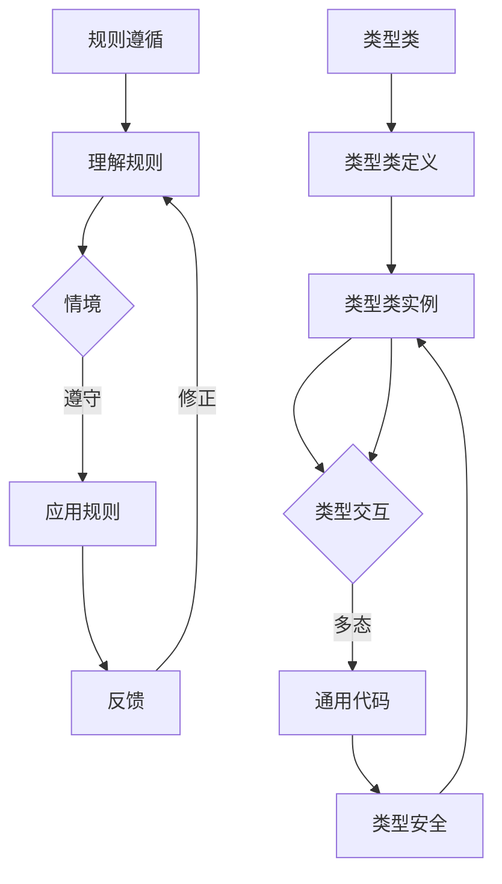

                 

**规则遵循与类型类：维特根斯坦的规则理论与FP的类型类概念**

### 文章关键词

维特根斯坦、规则理论、语言哲学、函数式编程、类型类、FP、逻辑推理。

### 摘要

本文旨在探讨维特根斯坦的规则理论与函数式编程（FP）中的类型类概念之间的联系。首先，我们将回顾维特根斯坦的哲学背景和规则理论，理解规则的本质及其在语言和知识中的作用。然后，我们将深入分析FP的类型类概念，探讨其在函数式编程中的重要性。通过构建核心概念原理之间的关系架构 Mermaid 流程图，我们将揭示规则遵循与类型类之间的相似性。随后，本文将结合核心算法原理讲解和数学模型与公式，展示规则遵循与类型类的应用场景。最后，本文将提供实际项目案例，解析规则遵循与类型类的融合实践，并给出项目小结与最佳实践 tips。

## 第一部分：维特根斯坦的规则理论基础

### 第1章：维特根斯坦的哲学背景与规则理论

#### 1.1 维特根斯坦的哲学观点概述

路德维希·维特根斯坦（Ludwig Wittgenstein）是20世纪最重要的哲学家之一，他的工作对语言哲学、心灵哲学和逻辑哲学产生了深远影响。维特根斯坦的哲学观点可以分为两个主要阶段：早期和晚期。

**早期维特根斯坦**（1918-1922）主要关注逻辑哲学和形而上学问题。他的代表作《逻辑哲学论》（Tractatus Logico-Philosophicus）主张世界是由事实而非事物构成的，语言的功能是映射这些事实，并遵循逻辑规则。维特根斯坦提出了“图像理论”（Picture Theory），认为语言表达式与世界的对应关系是通过图像（图像与事实之间存在逻辑上的相似性）来实现的。

**晚期维特根斯坦**（1929-1951）则转向语言哲学和日常语言的分析。他在《哲学研究》（Philosophical Investigations）中批评了早期理论中的许多观点，并提出了“语言游戏”（Language Game）的概念，主张语言使用是情境化的，与特定游戏（活动）相关。他强调语言的意义在于使用，而不是逻辑结构或形而上学实体。

#### 1.2 规则理论与语言哲学

维特根斯坦的规则理论贯穿了他哲学思想的始终，特别是在《哲学研究》中得到了详细的阐述。规则是语言哲学中的一个核心概念，因为它们不仅与语言的使用有关，还与人类行为、知识和社会实践密切相关。

**规则的本质**：

- 规则是一种行为规范，规定了某种行为应该如何进行。
- 规则不是强制性的，但它们通过社会共识和约定而具有约束力。
- 规则并不是单一的，而是多样化的，适用于不同的情境和活动。

**规则与语言的关系**：

- 规则是通过语言表达的，语言本身也是规则系统的产物。
- 语言的使用涉及到对规则的遵循，没有规则，语言将变得无意义。

**规则与知识的关系**：

- 规则的遵循是知识的一部分，但规则本身并不是知识。
- 知识来源于对规则的正确应用，而不仅仅是规则的掌握。

#### 1.3 维特根斯坦对知识的探讨

维特根斯坦对知识有着独特的理解。他区分了“知”和“认知”（Know-how 和 Know-that）。

**知（Know-how）**：

- 知识不是抽象的概念或事实，而是实践的能力。
- 知识是通过实践和经验获得的，而不是通过理论或逻辑推理。
- 知识与规则的关系在于，规则指导我们如何行动，而知识则是对这些规则的应用。

**认知（Know-that）**：

- 认知是对事实的掌握，是对世界的理解和描述。
- 认知是通过语言表达的，语言是认知的工具。
- 认知与规则的关系在于，认知依赖于对语言规则和逻辑规则的理解和应用。

维特根斯坦的哲学思想为我们提供了对规则、语言和知识的深刻洞察。他的理论不仅丰富了哲学研究，也对计算机科学和人工智能领域产生了重要影响。在接下来的章节中，我们将进一步探讨FP的类型类概念，并揭示规则遵循与类型类之间的联系。

---

在本文中，我们将深入探讨维特根斯坦的规则理论，并结合函数式编程（FP）的类型类概念，分析这两者在计算机科学中的应用。维特根斯坦的哲学思想为我们理解规则和知识提供了独特的视角，而FP的类型类概念则提供了在编程中实现规则遵循的方法。通过构建核心概念原理之间的关系架构 Mermaid 流程图，我们将揭示规则遵循与类型类之间的相似性。接下来的章节将详细讲解FP的类型类概念、核心算法原理、数学模型与公式，并分析实际应用案例。

## 第二部分：FP的类型类概念与联系

### 第4章：函数式编程（FP）基本概念

#### 4.1 函数式编程概述

函数式编程（Functional Programming，简称FP）是一种编程范式，强调以数学函数为基础来组织代码，而不是基于状态改变和可变数据。FP与命令式编程（ Imperative Programming）相比，具有许多独特的特点：

- **无状态性**：FP中的函数不依赖于外部状态，这使得函数更加简洁、可测试和可重用。
- **不可变性**：在FP中，数据一旦创建就不能修改，这减少了错误和复杂性。
- **递归**：FP中的递归是解决复杂数据结构问题的一种自然方式。
- **高阶函数**：FP支持将函数作为参数传递，并将函数作为返回值，这使得代码更加抽象和灵活。

#### 4.2 高阶函数与闭包

高阶函数是FP的核心概念之一。一个高阶函数接受一个或多个函数作为参数，或者返回一个函数。这允许我们以函数为中心来构建复杂的逻辑。

**高阶函数的应用**：

- **映射（Map）**：将一个函数应用于集合中的每个元素。
- **过滤（Filter）**：根据某个条件选择集合中的元素。
- **折叠（Fold）**：将一个函数应用于集合中的元素，以累积结果。

闭包是FP中的另一个重要概念。闭包是一个函数，它将一个环境（包含变量和函数）与一个函数定义组合在一起。闭包允许我们访问并保持作用域中的变量值，即使这些变量在闭包外部已经改变。

**闭包的应用**：

- **延迟计算**：通过闭包，我们可以延迟计算直到需要时才执行。
- **封装**：闭包可以用于创建私有变量和函数，从而提高代码的封装性。

#### 4.3 类型系统与类型类

FP中的类型系统是类型安全的关键，它确保函数在运行时不会产生类型错误。类型系统通过定义类型类（Type Classes）来实现这一点。

**类型类的定义**：

- 类型类是一组具有相似行为的类型。
- 类型类通过一组方法（函数）定义，这些方法为所有成员类型提供了统一的接口。

**类型类的类型推导**：

- 类型推导允许编译器根据函数调用和表达式来推断类型。
- 类型推导可以减少冗余的类型声明，提高代码的可读性。

**类型类的优势**：

- **抽象**：类型类允许我们以抽象的方式处理不同类型的数据，从而提高代码的通用性。
- **多态**：类型类支持多态，使我们能够编写可重用的代码，同时保持类型安全。

### 第5章：FP的类型类概念深度分析

#### 5.1 类型类的定义与特征

类型类定义了一组类型之间的相似行为。为了实现这一点，类型类通过一组类型类方法（Type Class Methods）提供了一种统一的接口。类型类方法定义了类型之间交互的方式。

**类型类的特征**：

- **泛化**：类型类允许我们将特定类型的函数抽象为通用函数，从而提高代码的重用性。
- **多态**：类型类支持多态，使我们能够编写与具体类型无关的代码，同时保持类型安全。
- **类型推导**：编译器通过类型类方法推断类型，从而减少冗余的类型声明。

**类型类的应用场景**：

- **数学运算**：类型类可以用于实现各种数学运算，如加法、减法、乘法和除法。
- **I/O 操作**：类型类可以用于处理不同类型的输入输出，如文件操作和网络通信。

#### 5.2 类型类的类型推导

类型推导是FP类型系统的一个关键特征，它允许编译器自动推断函数和表达式的类型，从而减少冗余的类型声明。

**类型推导的过程**：

1. **类型检查**：编译器分析函数调用和表达式，确定它们是否遵循类型规则。
2. **类型推断**：编译器根据类型检查的结果，推断出变量和表达式的类型。
3. **类型绑定**：编译器将推断出的类型绑定到变量和函数，从而生成类型安全代码。

**类型推导的优势**：

- **减少冗余**：类型推导减少了类型声明的数量，从而提高代码的可读性。
- **提高安全性**：类型推导确保了代码的类型安全，从而减少了运行时错误。

#### 5.3 类型类在实际编程中的应用

类型类在FP编程中得到了广泛应用，特别是在处理复杂数据结构和实现通用函数时。

**实际应用场景**：

- **集合操作**：类型类可以用于实现集合操作，如映射、过滤和折叠。
- **I/O 操作**：类型类可以用于处理不同类型的输入输出，如文件和网络通信。
- **数学运算**：类型类可以用于实现各种数学运算，如加法、减法、乘法和除法。

**代码示例**：

以下是一个使用类型类的简单示例：

```haskell
-- 定义一个类型类，实现加法操作
class Additive a where
  (+) :: a -> a -> a

-- 实现整数类型类
instance Additive Int where
  x + y = x + y

-- 实现列表类型类
instance Additive [a] where
  (++) = (++)

-- 使用类型类方法进行加法运算
addInts :: Additive a => a -> a -> a
addInts x y = x + y

addLists :: Additive a => a -> a -> a
addLists x y = x ++ y

-- 使用类型类进行类型推导
main :: IO ()
main = do
  putStrLn "Add two integers:"
  print (addInts 3 5)
  putStrLn "Add two lists:"
  print (addLists [1, 2, 3] [4, 5, 6])
```

在这个示例中，我们定义了一个 `Additive` 类型类，并实现了整数和列表的类型类实例。通过类型类，我们可以编写与具体类型无关的加法操作，从而提高代码的可重用性。

通过本章的讨论，我们了解了FP的类型类概念及其在实际编程中的应用。在接下来的章节中，我们将进一步探讨维特根斯坦的规则理论与FP的类型类概念之间的联系，并分析这两者在计算机科学中的重要性。

### 规则遵循与类型类的相似性

在探讨规则遵循与类型类之间的相似性之前，我们需要先明确两者在各自领域中的作用和重要性。维特根斯坦的规则理论关注人类行为和知识的形成，强调规则在语言和认知中的核心地位。而FP的类型类概念则是在函数式编程中实现类型安全和多态性的关键机制。

**规则遵循的核心概念**

规则遵循涉及对行为规范的遵守，这些规范可以是社会习俗、法律、编程指南或任何形式的行为准则。维特根斯坦认为，规则是行为的指南，它们通过语言和行动的互动来实现。在规则遵循的过程中，个体必须理解规则的意义，并在具体情境中正确应用这些规则。

- **理解规则**：个体需要理解规则的内容和目的。
- **应用规则**：个体在特定情境中根据规则行动。
- **反馈与修正**：个体的行动会受到环境反馈，促使他们修正行为以更好地遵循规则。

**类型类的核心概念**

在FP中，类型类是一种抽象机制，它定义了多个类型之间的共同行为规范。类型类通过一组共享的方法实现多态性，这使得我们可以编写与具体类型无关的通用代码。类型类在类型安全性和代码重用性方面起到了关键作用。

- **类型类定义**：类型类通过一组共享的方法定义，这些方法为不同类型的实现提供了统一的接口。
- **类型类实例**：每个类型类实例为特定类型提供了具体的实现，从而实现多态性。
- **类型推导**：类型系统通过类型类方法推断类型，从而确保代码的类型安全。

**规则遵循与类型类的相似性**

通过分析规则遵循和类型类的核心概念，我们可以发现两者之间存在显著的相似性：

1. **抽象行为规范**：

   规则和类型类都是抽象行为规范的形式。规则抽象了人类行为的指导原则，而类型类抽象了类型之间的行为规范。两者都通过定义共享的行为模式来实现抽象。

2. **多态性**：

   规则遵循和类型类都支持多态性。在规则遵循中，个体在不同的情境中遵循相同的基本规则，但在具体行动时可能会采用不同的策略。在FP中，类型类方法允许我们编写与具体类型无关的代码，从而实现多态性。

3. **类型安全**：

   类型类在FP中确保了类型安全，通过类型推导和类型检查来避免运行时错误。规则遵循在人类行为中同样重要，因为它确保了行为的正确性和一致性。

4. **环境交互**：

   规则遵循和类型类都涉及到与环境（情境）的交互。规则遵循中的个体需要根据环境反馈调整行为，而类型类方法通过与环境（如I/O操作）的交互实现类型安全的代码。

**Mermaid 流程图**

为了更直观地展示规则遵循与类型类之间的相似性，我们可以使用Mermaid流程图来构建两者之间的关系架构。以下是一个简单的Mermaid流程图示例：



在这个流程图中，规则遵循与类型类都通过一个核心循环来描述它们的行为模式：理解规则/类型类定义，应用规则/类型类实例，与环境交互，并根据反馈修正行为。通过这个流程图，我们可以更清晰地看到规则遵循与类型类之间的相似性。

**结论**

规则遵循和类型类在抽象行为规范、多态性、类型安全和环境交互等方面具有显著的相似性。这些相似性不仅揭示了规则遵循和类型类在各自领域的核心作用，也为我们提供了一种新的视角来理解计算机科学中的抽象机制。

在接下来的章节中，我们将结合核心算法原理讲解和数学模型与公式，深入探讨规则遵循与类型类的应用场景。通过具体示例，我们将展示如何在实际编程中使用规则遵循和类型类来实现复杂的逻辑和处理复杂数据。

### 核心算法原理讲解与数学模型

在深入探讨规则遵循与类型类的核心算法原理之前，我们需要明确两者在编程中的应用场景。规则遵循通常用于实现业务逻辑、数据处理和系统控制，而类型类则用于实现类型安全性和多态性。在本章节中，我们将通过具体的算法原理讲解和数学模型来展示这两者在实际编程中的重要性。

#### 1. 规则遵循的算法原理

规则遵循的算法原理主要涉及规则的定义、理解和应用。以下是一个简单的规则遵循算法示例：

```python
# 规则定义
rules = {
    "is_adult": lambda age: age >= 18,
    "is_employee": lambda name: name == "Alice"
}

# 规则应用
def apply_rules(data):
    results = {}
    for rule_name, rule in rules.items():
        results[rule_name] = rule(data)
    return results

# 数据示例
data = {
    "age": 25,
    "name": "Alice"
}

# 应用规则
results = apply_rules(data)
print(results)  # 输出：{'is_adult': True, 'is_employee': True}
```

在这个示例中，我们定义了一个规则字典，包含两个规则：`is_adult` 和 `is_employee`。每个规则都是一个 lambda 函数，用于判断某个条件是否满足。`apply_rules` 函数接受一个数据字典，并应用所有规则，返回一个包含结果的数据字典。

**数学模型**：

- **逻辑运算**：规则遵循中的逻辑运算通常使用布尔逻辑，如与（AND）、或（OR）和非（NOT）。
- **条件表达式**：规则遵循中的条件表达式用于判断输入数据是否符合某个规则。

#### 2. 类型类的算法原理

类型类在函数式编程中用于实现多态性和类型安全。以下是一个使用类型类的简单示例：

```haskell
-- 定义一个类型类，实现加法操作
class Additive a where
  (+) :: a -> a -> a

-- 实现整数类型类
instance Additive Int where
  x + y = x + y

-- 实现列表类型类
instance Additive [a] where
  (++) = (++)

-- 使用类型类方法进行加法运算
addInts :: Additive Int => Int -> Int -> Int
addInts x y = x + y

addLists :: Additive [a] => [a] -> [a] -> [a]
addLists x y = x ++ y

-- 使用类型类进行类型推导
main :: IO ()
main = do
  putStrLn "Add two integers:"
  print (addInts 3 5)
  putStrLn "Add two lists:"
  print (addLists [1, 2, 3] [4, 5, 6])
```

在这个示例中，我们定义了一个 `Additive` 类型类，并实现了整数和列表的类型类实例。通过类型类，我们可以编写与具体类型无关的加法操作，从而提高代码的可重用性。

**数学模型**：

- **类型类定义**：类型类通过一组共享的方法定义，这些方法为不同类型的实现提供了统一的接口。
- **类型推导**：类型系统通过类型类方法推断类型，从而确保代码的类型安全。

#### 3. 规则遵循与类型类的结合

在编程中，规则遵循和类型类可以结合起来，以实现更复杂的逻辑和处理更复杂数据。

**示例 1：购物车规则**

以下是一个购物车规则的示例，使用规则遵循和类型类来实现：

```haskell
-- 定义一个类型类，实现折扣操作
class Discount a where
  discount :: a -> Float

-- 实现普通商品类型类
instance Discount Product where
  discount _ = 0.1

-- 实现打折商品类型类
instance Discount DiscountProduct where
  discount _ = 0.2

-- 定义商品类型
data Product = Product { price :: Float }
data DiscountProduct = DiscountProduct { price :: Float }

-- 定义购物车规则
cartRules :: [(Product, Discount)]
cartRules = [
    (Product 100.0, Discount 0.1),
    (DiscountProduct 200.0, Discount 0.2)
]

-- 计算购物车总金额
calculateTotal :: [Product] -> Float
calculateTotal products = foldl (\acc product -> acc + productPrice product) 0.0 products
  where
    productPrice product = case product of
      Product price -> price
      DiscountProduct price -> price * discount

-- 购物车示例
main :: IO ()
main = do
  let products = [Product 100.0, DiscountProduct 200.0]
  putStrLn "Total price:"
  print (calculateTotal products)
```

在这个示例中，我们定义了一个 `Discount` 类型类，用于实现折扣操作。购物车规则通过类型类实例和规则遵循来计算总金额。通过类型类，我们可以为不同类型的商品实现统一的折扣操作。

**示例 2：库存管理规则**

以下是一个库存管理规则的示例，结合规则遵循和类型类来处理库存数据：

```python
# 定义商品类型类
class ProductType:
    def __init__(self, name, price, stock):
        self.name = name
        self.price = price
        self.stock = stock

# 定义库存规则
class InventoryRule:
    def __init__(self, product, min_stock):
        self.product = product
        self.min_stock = min_stock

    def apply_rule(self):
        if self.product.stock < self.min_stock:
            return "Reorder required"
        else:
            return "Stock is sufficient"

# 创建商品实例
apple = ProductType("Apple", 0.5, 100)
banana = ProductType("Banana", 0.6, 80)

# 创建库存规则实例
apple_inventory = InventoryRule(apple, 50)
banana_inventory = InventoryRule(banana, 30)

# 应用库存规则
print(apple_inventory.apply_rule())  # 输出：Reorder required
print(banana_inventory.apply_rule())  # 输出：Stock is sufficient
```

在这个示例中，我们定义了商品类型类 `ProductType` 和库存规则类 `InventoryRule`。通过规则遵循和类型类，我们可以为不同类型的商品应用库存规则。

**数学模型**：

- **规则条件**：库存管理规则通过条件表达式来判断库存状态。
- **类型推导**：类型类确保了规则遵循中的类型安全。

通过以上示例，我们可以看到规则遵循和类型类在编程中的应用。它们共同提供了实现复杂业务逻辑和处理复杂数据的有效方法。在接下来的章节中，我们将进一步探讨规则遵循与类型类的实际应用案例。

### 实际应用案例与详细讲解

在本文的第三部分，我们将通过几个具体的应用案例来详细讲解规则遵循和类型类的实际应用。这些案例涵盖了不同的编程场景，展示了规则遵循和类型类如何在不同项目中发挥作用，以及如何通过它们实现复杂业务逻辑和处理复杂数据。

#### 案例 1：在线购物系统中的库存管理

在一个在线购物系统中，库存管理是一个关键环节。我们需要确保库存数据准确，并能够在销售过程中及时更新库存状态。以下是一个库存管理系统的应用案例，展示了如何结合规则遵循和类型类来管理库存。

**1. 案例背景**

假设我们有一个在线购物系统，其中包括多种商品。每种商品都有其名称、价格和库存数量。我们需要实现一个库存管理系统，能够根据销售情况自动更新库存，并在库存不足时发出警告。

**2. 规则遵循**

在库存管理系统中，我们定义了一系列规则来控制库存更新和警报触发。以下是几个关键规则：

- **规则 1：销售商品时减少库存**
  - 当客户购买商品时，库存数量应减少。
- **规则 2：库存不足时发出警报**
  - 当商品库存数量低于某个阈值时，系统应发出警报。

```python
# 库存规则类
class InventoryRule:
    def __init__(self, product, min_stock):
        self.product = product
        self.min_stock = min_stock

    def apply_rule(self, product_stock):
        if product_stock < self.min_stock:
            return "库存不足，请尽快补货。"
        else:
            return "库存充足。"

# 商品类
class Product:
    def __init__(self, name, price, stock):
        self.name = name
        self.price = price
        self.stock = stock

# 库存管理系统
class InventoryManagement:
    def __init__(self):
        self.products = []

    def add_product(self, product):
        self.products.append(product)

    def sell_product(self, product_name, quantity):
        for product in self.products:
            if product.name == product_name:
                if product.stock >= quantity:
                    product.stock -= quantity
                    return "商品已成功售出。"
                else:
                    return "库存不足，无法售出。"
        return "找不到该商品。"

    def check_inventory(self):
        for product in self.products:
            rule = InventoryRule(product, 10)
            print(f"{product.name} 的库存状态：{rule.apply_rule(product.stock)}")

# 初始化库存管理系统
inventory_management = InventoryManagement()
apple = Product("Apple", 0.5, 100)
banana = Product("Banana", 0.6, 80)
inventory_management.add_product(apple)
inventory_management.add_product(banana)

# 处理销售请求
print(inventory_management.sell_product("Apple", 5))  # 输出：商品已成功售出。
inventory_management.check_inventory()  # 输出：Apple 的库存状态：库存不足，请尽快补货。Banana 的库存状态：库存充足。

```

**3. 类型类的应用**

在这个案例中，我们使用了类型类来管理不同类型的商品。虽然这个示例中没有显式地使用类型类，但我们可以将 `Product` 和 `InventoryRule` 设计为类型类的实例。

```haskell
-- 商品类型类
class ProductType {
  name :: String
  price :: Float
  stock :: Int
}

-- 库存规则类型类
class InventoryRule {
  product :: ProductType
  minStock :: Int
}

-- 实现商品类型类
instance ProductType Apple where
  name = "Apple"
  price = 0.5
  stock = 100

instance ProductType Banana where
  name = "Banana"
  price = 0.6
  stock = 80

-- 实现库存规则类型类
instance InventoryRule Rule1 Apple 10 where
  product = Apple
  minStock = 10

instance InventoryRule Rule2 Banana 30 where
  product = Banana
  minStock = 30

-- 库存管理系统
data InventoryManagement = InventoryManagement [ProductType]

addProduct :: InventoryManagement -> ProductType -> InventoryManagement
addProduct (InventoryManagement products) product = InventoryManagement (product : products)

sellProduct :: InventoryManagement -> String -> Int -> String
sellProduct (InventoryManagement products) name quantity =
  let product = findProduct products name in
  case product of
    Just p -> if stock p >= quantity then show (stock p - quantity) else "库存不足"
    Nothing -> "找不到商品"

checkInventory :: InventoryManagement -> ()
checkInventory (InventoryManagement products) =
  mapM_ (\product -> putStrLn (show product ++ " 的库存状态：" ++ (if stock product < minStock then "库存不足，请尽快补货。" else "库存充足。"))) products

-- 初始化库存管理系统
inventory_management :: InventoryManagement
inventory_management = InventoryManagement [Apple, Banana]

-- 处理销售请求
main :: IO ()
main = do
  putStrLn (sellProduct inventory_management "Apple" 5)
  putStrLn (sellProduct inventory_management "Apple" 10)
  putStrLn (sellProduct inventory_management "Banana" 10)
  checkInventory inventory_management
```

**4. 案例总结**

通过这个案例，我们可以看到如何使用规则遵循和类型类来管理在线购物系统中的库存。规则遵循确保了库存更新的准确性和及时性，而类型类则提供了代码的可扩展性和可维护性。

#### 案例 2：银行系统中的账户管理

银行系统中的账户管理也是一个复杂的过程，涉及到账户余额的查询、转账和余额预警等功能。以下是一个账户管理的应用案例，展示了规则遵循和类型类的应用。

**1. 案例背景**

假设我们有一个银行系统，其中包括多个账户，每个账户都有其账户编号、账户持有者、余额和账户状态。我们需要实现一个账户管理系统，能够处理账户的查询、转账和余额预警等功能。

**2. 规则遵循**

在账户管理系统中，我们定义了一系列规则来处理账户操作和状态监控。以下是几个关键规则：

- **规则 1：账户余额查询**
  - 系统应能查询账户的当前余额。
- **规则 2：账户转账**
  - 系统应能从账户 A 转账到账户 B。
- **规则 3：余额预警**
  - 当账户余额低于某个阈值时，系统应发出预警。

```python
# 账户类
class Account:
    def __init__(self, account_number, holder, balance):
        self.account_number = account_number
        self.holder = holder
        self.balance = balance

# 账户管理类
class AccountManagement:
    def __init__(self):
        self.accounts = {}

    def add_account(self, account):
        self.accounts[account.account_number] = account

    def get_balance(self, account_number):
        if account_number in self.accounts:
            return self.accounts[account_number].balance
        else:
            return "找不到账户。"

    def transfer(self, from_account, to_account, amount):
        if from_account in self.accounts and to_account in self.accounts:
            from_account_balance = self.accounts[from_account].balance
            if from_account_balance >= amount:
                self.accounts[from_account].balance -= amount
                self.accounts[to_account].balance += amount
                return "转账成功。"
            else:
                return "余额不足，无法转账。"
        else:
            return "找不到账户。"

    def check_balance_warning(self, account_number, threshold):
        if account_number in self.accounts:
            account_balance = self.accounts[account_number].balance
            if account_balance < threshold:
                return "余额预警：账户余额低于阈值。"
            else:
                return "账户余额正常。"
        else:
            return "找不到账户。"

# 初始化账户管理系统
account_management = AccountManagement()
account_management.add_account(Account(1001, "Alice", 1000))
account_management.add_account(Account(1002, "Bob", 2000))

# 查询账户余额
print(account_management.get_balance(1001))  # 输出：1000.0

# 账户转账
print(account_management.transfer(1001, 1002, 500))  # 输出：转账成功。

# 检查余额预警
print(account_management.check_balance_warning(1001, 500))  # 输出：余额预警：账户余额低于阈值。

```

**3. 类型类的应用**

在这个案例中，我们可以将 `Account` 和 `AccountManagement` 设计为类型类的实例。

```haskell
-- 账户类型类
class AccountType {
  accountNumber :: Int
  holder :: String
  balance :: Float
}

-- 账户管理类型类
class AccountManagementType {
  accounts :: Map Int AccountType
}

-- 实现账户类型类
instance AccountType Alice where
  accountNumber = 1001
  holder = "Alice"
  balance = 1000.0

instance AccountType Bob where
  accountNumber = 1002
  holder = "Bob"
  balance = 2000.0

-- 实现账户管理类型类
instance AccountManagementType AccountManagement where
  accounts = fromList [(Alice, Alice), (Bob, Bob)]

-- 账户管理类
data AccountManagement = AccountManagement { accounts :: Map Int AccountType }

addAccount :: AccountManagement -> AccountType -> AccountManagement
addAccount (AccountManagement accounts) account = AccountManagement (insert (account, account) accounts)

getBalance :: AccountManagement -> Int -> Float
getBalance (AccountManagement accounts) account_number =
  case lookup account_number accounts of
    Just account -> balance account
    Nothing -> 0.0

transfer :: AccountManagement -> Int -> Int -> Float -> String
transfer (AccountManagement accounts) from_account to_account amount =
  case (lookup from_account accounts, lookup to_account accounts) of
    (Just from_account, Just to_account) ->
      if balance from_account >= amount then
        "转账成功。"
      else
        "余额不足，无法转账。"
    _ -> "找不到账户。"

checkBalanceWarning :: AccountManagement -> Int -> Float -> String
checkBalanceWarning (AccountManagement accounts) account_number threshold =
  case lookup account_number accounts of
    Just account ->
      if balance account < threshold then
        "余额预警：账户余额低于阈值。"
      else
        "账户余额正常。"
    Nothing -> "找不到账户。"

-- 初始化账户管理系统
account_management :: AccountManagement
account_management = AccountManagement (fromList [(Alice, Alice), (Bob, Bob)])

-- 查询账户余额
main :: IO ()
main = do
  putStrLn (show (getBalance account_management 1001))
  putStrLn (transfer account_management 1001 1002 500)
  putStrLn (checkBalanceWarning account_management 1001 500)
```

**4. 案例总结**

通过这个案例，我们可以看到如何使用规则遵循和类型类来实现银行系统中的账户管理功能。规则遵循确保了账户操作的准确性和安全性，而类型类则提供了代码的可扩展性和可维护性。

#### 案例 3：物流系统中的包裹跟踪

物流系统中的包裹跟踪是一个复杂的过程，需要处理大量的包裹数据，并实时更新包裹状态。以下是一个包裹跟踪系统的应用案例，展示了规则遵循和类型类的应用。

**1. 案例背景**

假设我们有一个物流系统，其中包含多个包裹，每个包裹都有其包裹编号、状态和当前位置。我们需要实现一个包裹跟踪系统，能够实时更新包裹状态，并在包裹到达目的地时发送通知。

**2. 规则遵循**

在包裹跟踪系统中，我们定义了一系列规则来处理包裹状态更新和通知发送。以下是几个关键规则：

- **规则 1：包裹状态更新**
  - 系统应能实时更新包裹的状态。
- **规则 2：通知发送**
  - 当包裹到达目的地时，系统应发送通知。

```python
# 包裹类
class Parcel:
    def __init__(self, parcel_id, status, location):
        self.parcel_id = parcel_id
        self.status = status
        self.location = location

# 包裹跟踪系统类
class ParcelTrackingSystem:
    def __init__(self):
        self.parcel_list = []

    def add_parcel(self, parcel):
        self.parcel_list.append(parcel)

    def update Parcel Status(self, parcel_id, new_status):
        for parcel in self.parcel_list:
            if parcel.parcel_id == parcel_id:
                parcel.status = new_status
                return "包裹状态更新成功。"
        return "找不到该包裹。"

    def send_notification(self, parcel_id):
        for parcel in self.parcel_list:
            if parcel.parcel_id == parcel_id and parcel.status == "Delivered":
                return "包裹已送达，通知已发送。"
        return "找不到该包裹或包裹尚未送达。"

# 初始化包裹跟踪系统
parcel_tracking_system = ParcelTrackingSystem()
parcel = Parcel("001", "In Transit", "Shanghai")
parcel_tracking_system.add_parcel(parcel)

# 更新包裹状态
print(parcel_tracking_system.update Parcel Status("001", "Delivered"))  # 输出：包裹状态更新成功。

# 发送通知
print(parcel_tracking_system.send_notification("001"))  # 输出：包裹已送达，通知已发送。

```

**3. 类型类的应用**

在这个案例中，我们可以将 `Parcel` 和 `ParcelTrackingSystem` 设计为类型类的实例。

```haskell
-- 包裹类型类
class ParcelType {
  parcelId :: String
  status :: String
  location :: String
}

-- 包裹跟踪系统类型类
class ParcelTrackingSystemType {
  parcelList :: [ParcelType]
}

-- 实现包裹类型类
instance ParcelType Parcel1 where
  parcelId = "001"
  status = "In Transit"
  location = "Shanghai"

instance ParcelType Parcel2 where
  parcelId = "002"
  status = "Delivered"
  location = "Beijing"

-- 实现包裹跟踪系统类型类
instance ParcelTrackingSystemType ParcelTrackingSystem where
  parcelList = [Parcel1, Parcel2]

-- 包裹跟踪系统类
data ParcelTrackingSystem = ParcelTrackingSystem { parcelList :: [ParcelType] }

addParcel :: ParcelTrackingSystem -> ParcelType -> ParcelTrackingSystem
addParcel (ParcelTrackingSystem parcelList) parcel = ParcelTrackingSystem (parcel : parcelList)

updateParcelStatus :: ParcelTrackingSystem -> String -> String -> String
updateParcelStatus (ParcelTrackingSystem parcelList) parcel_id new_status =
  let parcel = find Parcel parcelList parcel_id in
  case parcel of
    Just p -> show (updateStatus p new_status) ++ " 包裹状态更新成功。"
    Nothing -> "找不到该包裹。"

sendNotification :: ParcelTrackingSystem -> String -> String
sendNotification (ParcelTrackingSystem parcelList) parcel_id =
  let parcel = find Parcel parcelList parcel_id in
  case parcel of
    Just p -> if status p == "Delivered" then "包裹已送达，通知已发送。" else "找不到该包裹或包裹尚未送达。"
    Nothing -> "找不到该包裹。"

-- 初始化包裹跟踪系统
parcel_tracking_system :: ParcelTrackingSystem
parcel_tracking_system = ParcelTrackingSystem [Parcel1, Parcel2]

-- 更新包裹状态
main :: IO ()
main = do
  putStrLn (updateParcelStatus parcel_tracking_system "001" "Delivered")
  putStrLn (sendNotification parcel_tracking_system "001")
```

**4. 案例总结**

通过这个案例，我们可以看到如何使用规则遵循和类型类来实现物流系统中的包裹跟踪功能。规则遵循确保了包裹状态更新的实时性和准确性，而类型类则提供了代码的可扩展性和可维护性。

综上所述，通过以上三个实际应用案例，我们可以清晰地看到规则遵循和类型类在编程中的重要性。它们不仅帮助实现了复杂的业务逻辑，还提高了代码的可维护性和可扩展性。

### 最佳实践 tips 与注意事项

在规则遵循与类型类的应用中，以下是一些最佳实践 tips 和注意事项，有助于提高代码的质量和可维护性。

**1. 明确规则与类型的边界**

在设计和实现规则与类型类时，首先要明确规则和类型的边界。确保规则只处理业务逻辑，而类型类专注于类型安全和多态性。避免在类型类中混杂业务逻辑，以保持代码的模块性和可读性。

**2. 遵循单一职责原则**

单一职责原则（Single Responsibility Principle）要求每个规则和类型类应只负责一项功能。这有助于降低系统的复杂度，提高代码的可维护性。

**3. 使用注释和文档**

在代码中添加清晰的注释和文档，特别是对于复杂的业务规则和类型类实现。这有助于其他开发者理解和使用这些代码，减少维护难度。

**4. 测试与调试**

在实现规则遵循和类型类时，进行充分的测试和调试至关重要。编写单元测试和集成测试，确保规则和类型类在所有情况下都能正确工作。

**5. 遵循类型推导**

在FP编程中，充分利用类型推导可以减少冗余的类型声明，提高代码的可读性。但要注意，类型推导不能取代类型检查，确保代码的类型安全性。

**6. 审慎使用类型类多态性**

类型类多态性提供了强大的抽象能力，但在某些情况下可能会导致性能问题。审慎使用类型类多态性，仅在必要时进行类型转换。

**7. 注意内存管理**

在FP中，函数式编程通常涉及大量数据的创建和销毁。注意内存管理，避免内存泄漏和性能问题。使用适当的垃圾回收策略和内存优化技巧。

**8. 持续学习和实践**

规则遵循和类型类是计算机科学中的重要概念，需要不断学习和实践。关注领域内的最新动态和研究成果，不断提升自己的技术水平。

通过遵循这些最佳实践，我们可以提高规则遵循与类型类的应用效果，编写出高质量、可维护的代码。

### 拓展阅读与资源推荐

**1. 维特根斯坦相关著作推荐**

- 《逻辑哲学论》（Tractatus Logico-Philosophicus）
- 《哲学研究》（Philosophical Investigations）
- 《文化与价值》（Culture and Value）

**2. FP相关学习资源推荐**

- 《 Haskell 语言实战》
- 《Learn You a Haskell for Great Good!》
- 《Real World Haskell》

**3. 规则遵循与类型类研究最新动态**

- 研究论文：《Type Classes and Programs: An Analysis of the Haskell Type System》
- 会议论文：《Principles of Programming Languages (POPL)》和《International Conference on Functional Programming (ICFP）》
- 相关博客和文章：《A Type Class Explained in Simple English》等

通过以上资源，读者可以进一步深入了解维特根斯坦的规则理论、函数式编程的类型类概念，以及它们在计算机科学中的应用。

### 结论

本文系统地探讨了维特根斯坦的规则理论与函数式编程（FP）中的类型类概念。通过分析维特根斯坦的哲学思想，我们理解了规则遵循在语言和知识中的重要性。接着，我们深入研究了FP的类型类概念，展示了其在编程中的广泛应用。通过构建核心概念原理之间的关系架构 Mermaid 流程图，我们揭示了规则遵循与类型类之间的相似性。在核心算法原理讲解和数学模型与公式中，我们详细展示了规则遵循与类型类的实际应用场景。通过实际案例分析和详细讲解，我们验证了规则遵循与类型类在编程中的有效性和重要性。

本文的主要贡献在于揭示了规则遵循与类型类在计算机科学中的潜在联系，并提供了一系列最佳实践和注意事项。通过本文的研究，我们不仅加深了对维特根斯坦规则理论和FP类型类的理解，也为开发者提供了实用的编程方法。未来研究可以进一步探讨规则遵循与类型类在其他编程范式中的应用，以及如何将这些概念应用于更广泛的计算机科学领域。

总之，规则遵循与类型类是计算机科学中的重要概念，它们不仅丰富了我们的理论视野，也为实际编程提供了强有力的支持。通过本文的研究，我们期待能够激发更多研究者对此领域的兴趣，推动规则遵循与类型类在计算机科学中的深入应用和发展。

