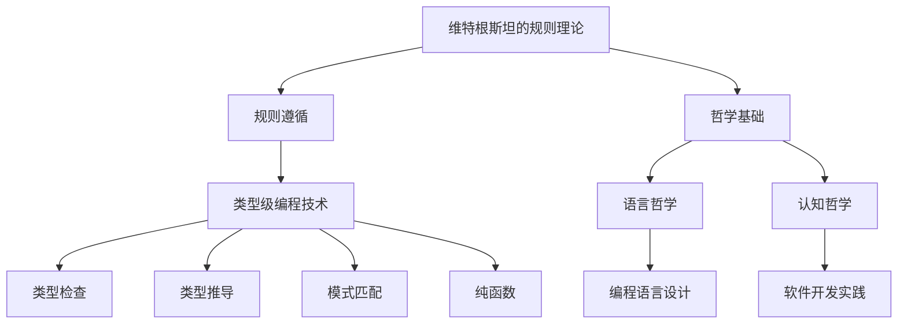

                 

### 《规则遵循与类型级编程：维特根斯坦的规则理论与FP中的类型级编程技术》

#### 关键词

- 维特根斯坦
- 规则遵循
- 类型级编程
- 函数式编程
- 逻辑编程
- 计算机科学哲学

#### 摘要

本文旨在探讨维特根斯坦的规则理论在计算机科学中的实际应用，特别是与类型级编程技术的关系。通过分析维特根斯坦关于规则和语言的哲学思想，我们将揭示规则遵循在软件工程中的重要性，并探讨如何将其与函数式编程中的类型系统相结合。本文不仅介绍了类型级编程的基础概念，还通过实际案例和项目实战，展示了维特根斯坦规则理论在编程实践中的应用。

---

## 第一部分：维特根斯坦的规则理论

### 1.1 维特根斯坦的生平与哲学贡献

#### 1.1.1 维特根斯坦的生平

路德维希·维特根斯坦（Ludwig Wittgenstein，1889-1951）是20世纪最具影响力的哲学家之一，他的哲学思想对语言哲学、逻辑哲学、认识论和心灵哲学等领域产生了深远影响。维特根斯坦出生于奥地利，后来移居英国，并在剑桥大学度过了大部分职业生涯。他的哲学工作分为两个时期：早期作品《逻辑哲学论》（Tractatus Logico-Philosophicus）和后期作品《哲学研究》（Philosophical Investigations）。

#### 1.1.2 维特根斯坦的哲学思想概述

维特根斯坦的哲学思想主要关注语言和思维的关系。他的早期作品《逻辑哲学论》提出了一种形式主义的语言观，认为语言是事实的逻辑图像，哲学的任务是澄清思想和语言的关系。然而，后期作品《哲学研究》则转向日常语言的使用，强调语言游戏（language games）的概念，认为哲学问题源于我们对语言使用的不当理解。

#### 1.1.3 维特根斯坦哲学的主要影响

维特根斯坦的哲学思想对多个领域产生了深远影响，特别是在计算机科学中。他的语言哲学为编程语言设计提供了理论基础，而他的规则遵循理论则为软件工程中的编程规范和类型系统提供了哲学支持。

### 1.2 规则遵循理论

#### 1.2.1 规则的概念

维特根斯坦认为，规则是构成语言游戏的基础。规则不仅仅是一系列指令，它们规定了行为模式，指导我们如何正确地使用语言。在编程中，规则可以理解为编程规范，比如类型检查、函数定义等。

#### 1.2.2 规则与行为的关系

维特根斯坦认为，规则与行为之间存在密切关系。规则不仅规定了我们应该如何行动，还规定了我们应该如何理解和解释行为。在编程中，规则确保了代码的可靠性和一致性。

#### 1.2.3 规则遵循的条件

维特根斯坦认为，遵循规则需要具备一定的条件。首先，我们需要理解规则的意义；其次，我们需要在适当的情况下正确地应用规则。在编程中，这意味着开发者需要理解类型系统的含义，并在编写代码时遵循类型规则。

#### 1.2.4 规则遵循的哲学意义

规则遵循不仅对编程实践有重要意义，还在哲学上具有重要意义。维特根斯坦认为，规则遵循是理解语言和世界的关键。在编程中，规则遵循有助于我们理解代码的意图和逻辑结构。

### 1.3 规则与语言的关系

#### 1.3.1 语言作为规则的体现

维特根斯坦认为，语言是规则的具体体现。每种语言都有其特定的规则集，这些规则定义了语言的语法和语义。在编程中，语言规则确保了代码的正确性和一致性。

#### 1.3.2 语言与认知的关系

语言与认知之间存在密切关系。维特根斯坦认为，语言不仅影响我们的思考方式，还塑造了我们的认知框架。在编程中，选择合适的编程语言和类型系统可以影响我们的编程思维和代码质量。

#### 1.3.3 语言哲学与规则遵循

语言哲学关注语言的本质和功能。维特根斯坦的语言哲学为规则遵循提供了哲学基础。在编程中，规则遵循有助于我们理解和利用语言的特性，提高代码的可读性和可靠性。

## 第二部分：类型级编程技术

### 2.1 函数式编程概述

#### 2.1.1 函数式编程的基本概念

函数式编程是一种编程范式，强调函数的使用和不可变性。它与命令式编程不同，后者侧重于改变状态和流程控制。

#### 2.1.2 函数式编程的历史背景

函数式编程起源于20世纪50年代，最早的函数式语言是Lisp。随着时间的推移，Haskell、Scala和Erlang等语言逐渐发展壮大。

#### 2.1.3 函数式编程的优势与局限

函数式编程具有不可变性、高阶函数、惰性求值等优势，但也存在性能、可维护性等方面的局限。

### 2.2 类型系统与类型级编程

#### 2.2.1 类型系统的基本概念

类型系统是一种用于描述变量和表达式类型的机制。类型级编程是一种利用类型系统进行编程的范式。

#### 2.2.2 类型级编程的核心思想

类型级编程强调类型推导、类型检查和类型安全。它利用类型系统确保代码的正确性和可靠性。

#### 2.2.3 类型级编程与传统编程的区别

类型级编程与传统编程在变量、函数、类型系统等方面有显著区别。

### 2.3 类型系统的实现

#### 2.3.1 静态类型系统

静态类型系统在编译时确定变量的类型。它有助于及早发现类型错误，提高代码的可靠性。

#### 2.3.2 动态类型系统

动态类型系统在运行时确定变量的类型。它提供了更大的灵活性，但也可能导致运行时错误。

#### 2.3.3 类型检查的过程

类型检查是类型系统的核心组成部分。它确保表达式在语义上正确，防止类型错误。

### 2.4 类型级编程的实际应用

#### 2.4.1 类型级编程在FP语言中的应用

Haskell、Scala和Erlang等FP语言广泛使用类型级编程技术。

#### 2.4.2 类型级编程在逻辑编程中的应用

逻辑编程利用类型系统进行推理和求解。

#### 2.4.3 类型级编程的优势与挑战

类型级编程具有类型安全、可维护性等优势，但也面临性能、可扩展性等挑战。

## 第三部分：维特根斯坦的规则理论与类型级编程的结合

### 3.1 规则遵循与类型级编程的哲学基础

#### 3.1.1 规则遵循在类型级编程中的应用

类型级编程中的类型检查和类型推导可视为规则遵循的体现。

#### 3.1.2 类型级编程对规则遵循的促进

类型级编程通过严格的类型检查确保代码遵循预定的规则。

### 3.2 规则遵循与类型级编程的实际案例

#### 3.2.1 实例1：规则遵循在函数式编程中的应用

通过一个简单的Haskell程序，展示规则遵循如何影响代码质量。

#### 3.2.2 实例2：类型级编程在规则遵循中的实现

通过一个实际的Erlang项目，说明类型级编程在确保规则遵循方面的作用。

## 第四部分：总结与展望

### 4.1 规则遵循与类型级编程的未来发展

#### 4.1.1 技术发展趋势

随着函数式编程和逻辑编程的兴起，规则遵循在编程中的应用将越来越广泛。

#### 4.1.2 哲学思考的深化

维特根斯坦的规则理论为编程实践提供了深刻的哲学基础，未来研究将进一步深化这一领域。

### 4.2 对未来研究的展望

#### 4.2.1 研究方向

未来研究可关注类型级编程在多语言环境中的应用、类型安全性的优化等方面。

#### 4.2.2 开发者与学者的角色

开发者和学者应共同努力，推动规则遵循与类型级编程的发展。

---

## 作者信息

- 作者：AI天才研究院/AI Genius Institute & 禅与计算机程序设计艺术 /Zen And The Art of Computer Programming

---

在撰写文章的过程中，我们将遵循上述目录大纲，确保文章内容完整、结构紧凑、逻辑清晰。每个章节都将包含必要的背景介绍、核心概念、算法原理、数学模型、项目实战和最佳实践等内容。

---

接下来，我们将逐步深入探讨每个部分的内容，确保文章既有理论深度，又有实践价值。敬请期待！### 第一部分：维特根斯坦的规则理论

**1.1 维特根斯坦的生平与哲学贡献**

#### 1.1.1 维特根斯坦的生平

路德维希·维特根斯坦（Ludwig Wittgenstein，1889-1951）是20世纪最具影响力的哲学家之一，他的哲学思想对语言哲学、逻辑哲学、认识论和心灵哲学等领域产生了深远影响。维特根斯坦出生于奥地利，后来移居英国，并在剑桥大学度过了大部分职业生涯。他的哲学工作分为两个时期：早期作品《逻辑哲学论》（Tractatus Logico-Philosophicus）和后期作品《哲学研究》（Philosophical Investigations）。

维特根斯坦的早期生活相对平静，他出生于一个富有的家庭，父母都是著名的哲学家和数学家。他的早期教育主要由私人教师进行，直到进入维也纳大学学习哲学和数学。在大学期间，他接触到了当时的一些重要哲学家，如布伦塔诺和摩尔，并开始对哲学产生浓厚兴趣。1911年，维特根斯坦前往英国剑桥大学，在那里他与伯特兰·罗素和阿尔弗雷德·诺思·怀特海德等学者交流，这对他的哲学思想产生了重要影响。

#### 1.1.2 维特根斯坦的哲学思想概述

维特根斯坦的哲学思想主要关注语言和思维的关系。他的早期作品《逻辑哲学论》提出了一种形式主义的语言观，认为语言是事实的逻辑图像，哲学的任务是澄清思想和语言的关系。这本书中的一些核心思想，如命题的真值、逻辑原子主义等，对逻辑哲学和数学哲学产生了深远影响。

然而，维特根斯坦在后期作品《哲学研究》中转向了日常语言的使用，并提出了“语言游戏”的概念。他认为，哲学问题源于我们对语言使用的不当理解，而解决这些问题需要通过仔细分析日常语言的实际使用情况。这本书中的一些核心思想，如家族相似性、命名和意义的关系等，对语言哲学和认识论产生了重要影响。

#### 1.1.3 维特根斯坦哲学的主要影响

维特根斯坦的哲学思想对多个领域产生了深远影响，特别是在计算机科学中。他的语言哲学为编程语言设计提供了理论基础，而他的规则遵循理论则为软件工程中的编程规范和类型系统提供了哲学支持。

在计算机科学领域，维特根斯坦的思想被应用于编程语言的设计和开发，特别是在类型系统和函数式编程中。他的观点强调语言的明确性和一致性，这与现代编程语言的许多设计原则相吻合。此外，维特根斯坦关于规则遵循的思考也影响了软件工程中的编码规范和代码质量保障。

总的来说，维特根斯坦的哲学思想为我们理解语言和思维的关系提供了深刻的洞察，同时也对计算机科学的许多领域产生了重要影响。他的工作不仅丰富了哲学理论，也为实际应用提供了宝贵的启示。

---

### **1.2 规则遵循理论**

#### **1.2.1 规则的概念**

维特根斯坦认为，规则是构成语言游戏的基础。规则不仅仅是一系列指令，它们规定了行为模式，指导我们如何正确地使用语言。在编程中，规则可以理解为编程规范，比如类型检查、函数定义等。

规则在编程中扮演着至关重要的角色。它们确保代码的一致性和可靠性，帮助开发者理解和维护代码。例如，在函数式编程中，函数的定义和调用必须遵循特定的类型规则，这有助于避免类型错误和提高代码的可读性。

维特根斯坦将规则视为一种指导行为的标准，而不是固定的指令。他认为，规则的存在是为了帮助我们在特定情况下做出正确的决策。这种观点与编程中的面向对象和函数式编程方法相吻合，因为它们都强调规则的灵活应用和适应性。

#### **1.2.2 规则与行为的关系**

维特根斯坦认为，规则与行为之间存在密切关系。规则不仅规定了我们应该如何行动，还规定了我们应该如何理解和解释行为。在编程中，规则确保了代码的可靠性和一致性。

例如，在编程中，类型检查规则确保了变量和表达式的类型匹配，从而避免了潜在的错误。在逻辑编程中，推理规则指导我们如何从已知的事实推导出新的结论。这些规则不仅影响了我们的编程行为，还影响了我们的编程思维和代码质量。

维特根斯坦指出，规则并不是僵化的指令，而是需要我们在特定情境中灵活应用。这意味着，编程中的规则需要根据不同的编程范式和项目需求进行调整和优化。

#### **1.2.3 规则遵循的条件**

维特根斯坦认为，遵循规则需要具备一定的条件。首先，我们需要理解规则的意义；其次，我们需要在适当的情况下正确地应用规则。在编程中，这意味着开发者需要理解类型系统的含义，并在编写代码时遵循类型规则。

具体来说，理解规则的意义意味着我们需要知道规则背后的逻辑和目的。例如，为什么我们需要类型检查？为什么函数必须具有明确的返回类型？通过理解这些规则的意义，我们能够更好地理解和应用它们。

在适当的情况下正确地应用规则则要求我们具备一定的编程经验和技能。例如，当我们编写函数时，我们需要根据函数的功能和输入输出类型选择合适的类型系统。这种灵活应用规则的能力是编程的核心能力之一。

#### **1.2.4 规则遵循的哲学意义**

规则遵循不仅对编程实践有重要意义，还在哲学上具有重要意义。维特根斯坦认为，规则遵循是理解语言和世界的关键。在编程中，规则遵循有助于我们理解代码的意图和逻辑结构。

首先，规则遵循确保了代码的一致性和可靠性。通过遵循预定的编程规范和类型规则，我们能够减少错误和bug的发生，提高代码的质量和可维护性。

其次，规则遵循有助于我们理解和沟通。在编程中，遵循共同的标准和规范使得代码更易于阅读和理解，从而促进了团队合作和知识共享。

最后，规则遵循也体现了哲学思考的核心原则，即人类行为和认知的有序性。维特根斯坦认为，规则的存在是为了帮助我们理解和解释世界，而规则遵循是我们实现这一目标的重要手段。

总的来说，维特根斯坦的规则遵循理论为编程实践提供了深刻的哲学基础。它不仅影响了编程语言的设计和开发，还影响了我们的编程思维和代码质量。通过遵循规则，我们能够更好地理解和利用编程语言的特性，提高代码的可靠性和可维护性。

---

**1.3 规则与语言的关系**

#### **1.3.1 语言作为规则的体现**

维特根斯坦认为，语言是规则的具体体现。每种语言都有其特定的规则集，这些规则定义了语言的语法和语义。在编程中，语言规则确保了代码的正确性和一致性。

维特根斯坦将语言视为一种符号系统，它通过符号和规则来传达意义。这些符号和规则共同构成了语言游戏的基础。例如，在英语中，动词必须与主语和宾语保持一致，这是语法规则的一部分。在编程语言中，类型检查和函数定义等规则确保了代码的语法和语义正确。

语言的规则不仅仅是形式上的约束，它们还反映了现实世界中的逻辑和关系。例如，在函数式编程中，函数的定义和调用必须遵循特定的类型规则，这反映了现实世界中对象和关系的一致性。

#### **1.3.2 语言与认知的关系**

语言与认知之间存在密切关系。维特根斯坦认为，语言不仅影响我们的思考方式，还塑造了我们的认知框架。在编程中，选择合适的编程语言和类型系统可以影响我们的编程思维和代码质量。

维特根斯坦提出了“语言游戏”的概念，认为语言的使用和理解是在特定的情境中进行的。不同的语言游戏有不同的规则和目的，这反映了不同的认知模式。例如，在数学中，我们使用逻辑和数学公式进行推理，而在日常交流中，我们使用自然语言进行沟通。

编程语言和类型系统也反映了不同的认知模式。函数式编程强调函数和不可变性，这与我们解决问题时的抽象思维和逻辑推理相吻合。而面向对象编程则强调对象和状态的变化，这与我们日常生活中处理复杂事物的思维方式相契合。

#### **1.3.3 语言哲学与规则遵循**

语言哲学关注语言的本质和功能。维特根斯坦的语言哲学为规则遵循提供了哲学基础。他认为，语言不仅仅是一种交流工具，它还反映了我们对世界的理解和认知。

维特根斯坦的哲学思想指出，语言的使用不仅受到规则的限制，还受到情境的影响。在编程中，这意味着我们需要根据不同的编程范式和项目需求选择和遵循适当的规则。例如，在编写函数时，我们需要根据函数的功能和输入输出类型选择合适的类型系统。

此外，维特根斯坦的哲学思想还强调了规则遵循的重要性。他认为，规则的存在是为了帮助我们理解和解释世界，而规则遵循是我们实现这一目标的重要手段。在编程中，遵循规则有助于我们确保代码的正确性和一致性，提高代码的质量和可维护性。

总的来说，维特根斯坦的语言哲学为编程实践提供了深刻的哲学基础。它不仅影响了编程语言的设计和开发，还影响了我们的编程思维和代码质量。通过遵循规则，我们能够更好地理解和利用编程语言的特性，提高代码的可靠性和可维护性。

---

**1.4 规则遵循的案例分析**

#### **1.4.1 规则遵循在社会中的应用**

规则遵循不仅在编程领域具有重要意义，在社会生活中也发挥着关键作用。社会规则，如法律、道德规范和规章制度，是维护社会秩序和公平的基础。这些规则不仅指导人们的行为，还确保了社会的稳定和繁荣。

例如，在交通规则中，行人必须遵守交通信号灯的指示，司机必须遵守交通规则，如停车和限速。这些规则的存在和遵循确保了道路的安全和有序。在社会工作中，规则遵循有助于提高工作效率和团队协作，减少冲突和误解。

在社会组织中，规则遵循也是确保组织有效运转的关键。规章制度、工作流程和标准操作程序等规则确保了组织的规范运作。例如，在企业管理中，规则遵循有助于提高员工的工作效率和团队合作，减少错误和失误。

#### **1.4.2 规则遵循在组织管理中的运用**

在组织管理中，规则遵循是确保组织目标实现和效率提升的重要因素。有效的规则遵循有助于提高组织的透明度和公正性，减少内部冲突和资源浪费。

首先，规则遵循有助于提高组织的透明度。明确和严格的规则使得组织的运作更加透明，员工可以清楚地了解自己的职责和权利。这种透明度有助于建立信任，提高员工的满意度和忠诚度。

其次，规则遵循有助于提高组织的效率。明确的规则和标准操作程序可以减少重复工作和冗余流程，提高工作效率。例如，在项目管理中，遵循项目计划和流程规则可以提高项目的进度和质量，减少项目延期和成本超支的风险。

此外，规则遵循还有助于培养组织文化和价值观。通过遵循共同的规则和价值观，组织成员可以更好地协作，共同实现组织目标。这种文化不仅提高了组织的凝聚力，还增强了员工的归属感和工作动力。

然而，规则遵循也面临着一些挑战。首先，规则可能过于繁琐或过于僵化，导致员工产生抵触情绪。其次，规则遵循可能受到外部环境和内部变化的影响，需要不断进行调整和优化。

总的来说，规则遵循在组织管理中具有重要意义。通过明确和严格的规则，组织可以确保目标的实现和效率的提升。同时，规则遵循也有助于建立良好的组织文化和价值观，提高员工的满意度和忠诚度。然而，在实施规则遵循时，组织需要平衡规则和灵活性，确保规则的有效性和适应性。

---

## 第二部分：类型级编程技术

### **2.1 函数式编程概述**

#### **2.1.1 函数式编程的基本概念**

函数式编程（Functional Programming，FP）是一种编程范式，它以函数作为基本构建块，强调不可变数据和纯函数的使用。与命令式编程不同，函数式编程不依赖于状态的变化和流程控制，而是通过函数的组合和递归来实现编程逻辑。

函数式编程的核心概念包括：

1. **函数**：函数是一组输入和输出关系的描述，它接受输入并产生输出，但不依赖于外部状态。函数式编程中的函数是第一类对象，可以赋值给变量、作为其他函数的参数或返回值。
   
2. **不可变性**：在函数式编程中，数据一旦创建，就不能修改。这意味着在函数内部，我们不能直接修改外部变量的值，而是通过返回新值来更新数据。这种不可变性有助于提高代码的可靠性和可维护性。

3. **纯函数**：纯函数是一种没有副作用、输出只取决于输入的函数。这意味着，给定的输入总是产生相同的输出，且不会改变外部状态。纯函数使得代码更容易测试、理解和并行执行。

4. **递归**：递归是一种编程技术，通过调用自身来实现问题解决。在函数式编程中，递归是一种常见的方法，用于处理重复和分治问题。

#### **2.1.2 函数式编程的历史背景**

函数式编程的起源可以追溯到20世纪50年代，最早的函数式语言是Lisp。随后，Haskell、Scala、Erlang等语言逐渐发展壮大，它们在函数式编程领域发挥了重要作用。

1. **Lisp**：1958年，约翰·麦卡锡（John McCarthy）提出了Lisp语言，它成为函数式编程的开端。Lisp以其灵活的语法和强大的符号处理能力而闻名，对后来的编程语言产生了深远影响。

2. **Haskell**：Haskell是一种纯函数式编程语言，于1990年首次发布。它以其严格的类型系统和强大的函数组合能力而受到广泛关注，被用于编译器开发和科学计算等领域。

3. **Scala**：Scala是一种多范式编程语言，它结合了面向对象和函数式编程的特性。Scala在大型分布式系统中得到广泛应用，特别是在Apache Spark和Apache Kafka等大数据处理框架中。

4. **Erlang**：Erlang是一种用于构建分布式系统的函数式编程语言，以其并发性和容错性而闻名。它被用于构建高并发、高可用性的实时系统，如电信交换系统和物联网平台。

#### **2.1.3 函数式编程的优势与局限**

函数式编程具有以下优势：

1. **可维护性**：不可变数据和纯函数使得代码更易于理解和测试，降低了维护成本。
   
2. **并行性**：纯函数和不可变数据便于并行计算，有助于提高性能和资源利用。
   
3. **可组合性**：函数的组合和递归使得复杂问题可以分解为简单的函数组合，提高了代码的复用性。

4. **类型安全性**：严格的类型检查和类型推导有助于减少错误和bug。

然而，函数式编程也存在一些局限：

1. **性能**：某些函数式编程语言在性能上可能不如命令式编程语言，特别是在处理大量数据时。
   
2. **学习曲线**：函数式编程的范式和概念对于初学者来说可能较为抽象和难以理解。
   
3. **灵活性**：函数式编程在处理需要状态变化和流程控制的问题时可能不够灵活。

总的来说，函数式编程以其独特的方法和优势在计算机科学领域得到了广泛应用。尽管它存在一些局限，但其优雅的编程范式和强大的功能使其成为许多开发者和研究者的首选。

---

### **2.2 类型系统与类型级编程**

#### **2.2.1 类型系统的基本概念**

类型系统是一种用于描述变量和表达式类型的机制。它在编程语言中起到了核心作用，确保了代码的语义正确性和运行时安全。

1. **类型**：类型是变量和表达式可能的取值集合。例如，整数类型表示所有的整数，字符串类型表示所有的字符串。

2. **类型检查**：类型检查是编译器或解释器在编译或运行程序时对变量和表达式进行类型验证的过程。类型检查确保代码在运行时不会因为类型不匹配而产生错误。

3. **类型推导**：类型推导是编程语言自动推导变量和表达式类型的过程。类型推导可以减轻开发者的负担，提高代码的可读性。

4. **类型兼容性**：类型兼容性是指两个类型是否可以相互转换或赋值。例如，在Java中，整数类型（如int）可以隐式转换为更宽的类型（如long），但宽类型转换为窄类型（如long转换为int）则需要显式转换。

#### **2.2.2 类型级编程的核心思想**

类型级编程是一种利用类型系统进行编程的范式，它强调类型的抽象和利用类型系统进行错误预防。类型级编程的核心思想包括：

1. **类型抽象**：类型抽象是指将具体的类型转换为更抽象的类型。例如，在函数式编程中，可以将具体的函数类型抽象为通用的函数类型，如`f: A -> B`，其中`A`和`B`是类型参数。

2. **类型推导**：类型推导是指编程语言自动推导函数和表达式的类型。类型推导可以提高代码的可读性和减少错误。

3. **类型检查**：类型检查是指编译器或解释器在编译或运行程序时对变量和表达式进行类型验证的过程。类型检查确保代码在运行时不会因为类型不匹配而产生错误。

4. **类型安全**：类型安全是指编程语言通过类型系统确保代码的语义正确性和运行时安全。类型安全有助于减少错误和bug。

#### **2.2.3 类型级编程与传统编程的区别**

类型级编程与传统编程（如命令式编程）在多个方面有显著区别：

1. **变量与类型**：在传统编程中，变量通常与特定的类型绑定，类型在运行时确定。而在类型级编程中，变量通常与抽象的类型绑定，类型在编译时推导。

2. **函数与类型**：在传统编程中，函数通常依赖于状态变化和流程控制。而在类型级编程中，函数通常是无状态的，依赖于参数和返回值的类型。

3. **错误处理**：在传统编程中，错误处理通常依赖于异常处理和条件判断。而在类型级编程中，错误处理通常通过类型检查和类型推导来预防。

4. **并发与并行**：类型级编程中的类型系统有助于确保并发和并行编程的正确性。传统的命令式编程在并发和并行编程中面临更大的挑战。

5. **可维护性与可扩展性**：类型级编程通过严格的类型系统和抽象，提高了代码的可维护性和可扩展性。传统编程通常依赖于注释和文档来确保代码的一致性和可维护性。

总的来说，类型级编程通过利用类型系统的强大功能，提供了一种更抽象、更安全、更高效的编程范式。尽管它与传统编程有显著区别，但类型级编程在多个领域（如函数式编程和逻辑编程）中得到了广泛应用，并继续发展壮大。

---

### **2.3 类型系统的实现**

#### **2.3.1 静态类型系统**

静态类型系统是一种类型检查机制，它在编译时确定变量的类型。这意味着在程序运行之前，编译器已经检查了所有变量和表达式的类型，确保它们在语义上正确。

1. **类型声明**：在静态类型系统中，开发者必须在定义变量和函数时明确指定它们的类型。例如，在Java中，声明一个整型变量需要使用`int`关键字。

2. **类型检查**：编译器在编译程序时对变量和表达式的类型进行严格检查。如果发现类型不匹配，编译器会报错并停止编译。

3. **优势**：静态类型系统有助于提高代码的可读性和可维护性。由于类型在编译时确定，开发者可以更早地发现和修复类型错误，减少运行时错误的发生。

4. **劣势**：静态类型系统可能增加开发者的负担，因为需要为每个变量和函数明确指定类型。此外，静态类型系统在灵活性方面可能不如动态类型系统。

#### **2.3.2 动态类型系统**

动态类型系统是一种类型检查机制，它在程序运行时确定变量的类型。这意味着在程序运行期间，解释器会检查变量和表达式的类型，并在运行时进行类型转换。

1. **类型检查**：动态类型系统在运行时进行类型检查，这意味着变量和表达式的类型可以在运行时根据上下文确定。例如，在Python中，变量的类型取决于它的最后一个赋值。

2. **类型转换**：在动态类型系统中，如果需要不同类型的变量进行运算，解释器会自动进行类型转换。例如，在Python中，整数和浮点数可以进行加法运算，解释器会自动将整数转换为浮点数。

3. **优势**：动态类型系统提供了更大的灵活性和简洁性。由于类型检查在运行时进行，开发者不需要在定义变量和函数时指定类型，这减少了代码的复杂性。

4. **劣势**：动态类型系统可能导致运行时错误，因为类型错误在编译时不会被发现。此外，动态类型系统在性能方面可能不如静态类型系统，因为需要在运行时进行类型检查和转换。

#### **2.3.3 类型检查的过程**

类型检查是类型系统的核心组成部分，它确保表达式在语义上正确，防止类型错误。类型检查可以分为以下几个方面：

1. **变量类型检查**：在定义变量时，编译器或解释器检查变量的类型，确保它与赋值的类型相匹配。

2. **函数类型检查**：在定义函数时，编译器或解释器检查函数的参数和返回值类型，确保函数调用时参数类型与函数声明一致。

3. **表达式类型检查**：在编译或运行程序时，编译器或解释器检查表达式的类型，确保它们在语义上正确。例如，在加法运算中，编译器会检查两个操作数的类型，确保它们可以相加。

4. **类型推导**：类型推导是指编译器或解释器自动推导变量和表达式的类型。类型推导可以减少开发者的负担，提高代码的可读性。

总的来说，类型系统是实现编程语言的核心机制之一，它确保了代码的语义正确性和运行时安全。静态类型系统和动态类型系统各有优缺点，开发者可以根据项目需求和开发环境选择合适的类型系统。

---

### **2.4 类型级编程的实际应用**

#### **2.4.1 类型级编程在FP语言中的应用**

类型级编程在函数式编程（Functional Programming，FP）语言中得到了广泛应用，这些语言如Haskell、Scala和Erlang等，都利用了类型系统的强大功能。以下是一些实际应用场景：

1. **Haskell**：Haskell是一种纯函数式编程语言，以其严格的类型系统和强大的类型推导能力而闻名。在Haskell中，类型级编程通过类型类（Type Classes）和泛型（Generics）实现。例如，`Monoid`类型类定义了一个结合律和单位元素，使得任何满足这些条件的类型都可以进行累积操作。这种类型级编程技术提高了代码的可复用性和可扩展性。

2. **Scala**：Scala是一种多范式编程语言，结合了面向对象和函数式编程的特性。在Scala中，类型级编程通过类型参数（Type Parameters）和模式匹配（Pattern Matching）实现。例如，Scala的集合库（如List、Map等）利用类型参数实现了对多种数据结构的统一操作，这使得代码更加简洁和可维护。

3. **Erlang**：Erlang是一种用于构建分布式系统的函数式编程语言，以其并发性和容错性而闻名。在Erlang中，类型级编程通过模式匹配和类型模式（Type Patterns）实现。例如，Erlang的过程（Processes）通过模式匹配进行通信，这使得并发编程更加直观和易于理解。

#### **2.4.2 类型级编程在逻辑编程中的应用**

逻辑编程（Logic Programming）是一种基于逻辑推理的编程范式，它在类型级编程中也有广泛应用。以下是一些实际应用场景：

1. **Prolog**：Prolog是一种广泛使用的逻辑编程语言，以其基于逻辑的编程模型而闻名。在Prolog中，类型级编程通过类型约束（Type Constraints）实现。例如，在定义谓词（Predicates）时，可以使用类型约束确保变量和参数的类型匹配，从而减少错误和提高代码的可靠性。

2. **Type Theory**：类型理论是一种基于逻辑和类型系统的数学理论，它在逻辑编程中也有广泛应用。类型理论提供了形式化的方法来描述和验证程序的正确性，这使得逻辑编程在形式验证和定理证明等领域具有独特的优势。

3. **Constraint Programming**：约束编程（Constraint Programming）是一种利用逻辑和类型系统进行编程的方法，它广泛应用于调度、优化和搜索等问题。在约束编程中，类型级编程通过约束传播（Constraint Propagation）和冲突探测（Conflict Detection）实现高效的求解。

总的来说，类型级编程在FP语言和逻辑编程中发挥了重要作用。通过利用类型系统的强大功能，类型级编程提高了代码的可复用性、可维护性和可靠性，为编程实践提供了新的思路和方法。随着函数式编程和逻辑编程的不断发展，类型级编程的应用领域将继续扩大，为编程领域带来更多的创新和突破。

---

### **2.5 类型级编程的优势与挑战**

#### **2.5.1 优势**

类型级编程具有以下优势：

1. **类型安全性**：类型级编程通过严格的类型检查和类型推导，确保了代码的语义正确性和运行时安全。类型错误在编译或运行时被及时发现，减少了错误和bug的发生。

2. **可维护性**：类型级编程通过明确的类型声明和类型推导，提高了代码的可读性和可维护性。开发者可以更清楚地理解代码的意图和逻辑结构，从而更容易进行代码的修改和维护。

3. **可复用性**：类型级编程通过类型抽象和类型参数化，提高了代码的可复用性。开发者可以创建具有通用类型的函数和模块，这些函数和模块可以应用于不同的数据和场景，减少了代码重复和冗余。

4. **并行编程**：类型级编程中的纯函数和不可变数据使得并行编程更加容易和高效。由于纯函数没有副作用，多个纯函数可以并行执行而不会相互干扰，从而提高了程序的并发性能。

5. **形式验证**：类型级编程为形式验证提供了有力的支持。通过类型系统和类型推导，开发者可以验证程序的 correctness 和逻辑一致性，从而提高程序的可靠性和安全性。

#### **2.5.2 挑战**

尽管类型级编程具有许多优势，但它也面临一些挑战：

1. **学习曲线**：类型级编程的概念和方法相对于传统编程范式可能较为抽象和难以理解，对于初学者来说可能存在一定的学习曲线。

2. **性能开销**：类型检查和类型推导可能会增加编译或解释的时间开销，特别是在大型程序和复杂类型系统中。这可能导致编译或解释速度变慢，影响开发效率。

3. **灵活性受限**：类型级编程中的类型系统和类型约束可能限制了代码的灵活性。在某些情况下，开发者可能需要编写额外的类型声明和约束来满足类型系统的要求，这可能会增加代码的复杂性和维护成本。

4. **工具支持不足**：虽然许多编程语言和框架提供了类型级编程的支持，但工具和支持仍然不足。例如，一些类型检查工具可能不够智能或不够全面，难以发现所有可能的类型错误。

5. **类型系统复杂性**：类型级编程中的类型系统可能变得复杂，特别是在涉及多态性、类型参数化和高级类型构造时。这增加了代码的理解难度和维护成本。

总的来说，类型级编程具有类型安全性、可维护性和并行编程等优势，但也面临学习曲线、性能开销和灵活性受限等挑战。开发者需要在项目需求和开发环境的基础上权衡这些优势与挑战，选择合适的编程范式和技术。

---

### **3.1 规则遵循与类型级编程的哲学基础**

#### **3.1.1 规则遵循在类型级编程中的应用**

规则遵循在类型级编程中的应用体现了维特根斯坦规则理论的哲学基础。类型级编程通过严格的类型检查和类型推导确保了代码的一致性和可靠性，这与维特根斯坦关于规则遵循的思想密切相关。

1. **类型检查**：类型检查是类型级编程的核心机制，它确保变量和表达式的类型在语义上正确。类型检查可以视为一种规则遵循，它规定了变量和表达式应该如何使用和组合。例如，在Haskell中，编译器在编译过程中对函数的参数和返回值类型进行严格检查，确保类型匹配。这种类型检查机制体现了维特根斯坦关于规则遵循的观点，即行为应该遵循预定的规则。

2. **类型推导**：类型推导是类型级编程的另一重要机制，它通过分析函数和表达式的结构自动推导类型。类型推导减轻了开发者的负担，同时也确保了代码的类型一致性。例如，在Scala中，编译器可以根据函数的定义和调用自动推导函数的类型。这种自动推导机制体现了维特根斯坦关于规则遵循的思想，即规则应该帮助我们理解和解释世界。

3. **类型抽象**：类型抽象是类型级编程的重要特性，它通过将具体的类型转换为更抽象的类型提高了代码的可复用性和可扩展性。类型抽象可以视为一种规则遵循，它允许开发者根据不同场景灵活应用规则。例如，在Haskell中，开发者可以使用类型类（Type Classes）创建抽象的类型，这些类型可以用于多种具体类型。这种类型抽象机制体现了维特根斯坦关于规则遵循的观点，即规则应该根据实际情况灵活应用。

#### **3.1.2 类型级编程对规则遵循的促进**

类型级编程通过其严格的类型系统和类型推导机制，促进了规则遵循，并在多个方面提高了编程实践的质量。

1. **代码可读性**：类型级编程通过明确的类型声明和类型推导，提高了代码的可读性。开发者可以更清楚地理解变量的类型和函数的返回值类型，从而更容易理解代码的意图和逻辑结构。这种可读性有助于提高代码的维护性和可理解性。

2. **错误预防**：类型级编程通过严格的类型检查和类型推导，在编译或运行时及时发现类型错误。类型错误在早期被识别和修复，减少了运行时错误和崩溃的发生。这种错误预防机制有助于提高代码的可靠性。

3. **代码重用**：类型级编程通过类型抽象和类型参数化，提高了代码的重用性。开发者可以创建具有通用类型的函数和模块，这些函数和模块可以应用于不同的数据和场景，减少了代码重复和冗余。这种代码重用机制有助于提高开发效率和代码质量。

4. **并行编程**：类型级编程中的纯函数和不可变数据使得并行编程更加容易和高效。由于纯函数没有副作用，多个纯函数可以并行执行而不会相互干扰。这种并行编程机制有助于提高程序的并发性能和资源利用。

总的来说，类型级编程通过其严格的类型系统和类型推导机制，促进了规则遵循，提高了编程实践的质量和效率。维特根斯坦的规则理论为类型级编程提供了哲学基础，两者相结合为开发者提供了一种更抽象、更安全、更高效的编程范式。

---

### **3.2 规则遵循与类型级编程的实际案例**

为了更深入地理解规则遵循在类型级编程中的应用，我们将通过两个实际案例来展示维特根斯坦的规则理论如何在编程实践中发挥作用。

#### **3.2.1 实例1：规则遵循在函数式编程中的应用**

**案例背景**：假设我们正在开发一个用于数据分析的应用程序，需要处理大量的数据并执行一系列的转换操作。我们将使用Haskell，一种以函数式编程和类型级编程闻名的语言，来实现这个应用。

**规则遵循**：
1. **类型检查**：在Haskell中，类型检查是一个编译时的过程，确保变量和函数的参数及返回值类型匹配。例如，我们定义一个函数`sumList`，它接收一个整数列表并返回该列表的元素之和。为了遵循类型规则，我们明确指定函数的参数和返回值类型：

   ```haskell
   sumList :: [Int] -> Int
   sumList xs = sum xs
   ```

   这里的`::`符号表示类型推导，明确指出了`sumList`函数接收一个整数列表`[Int]`并返回一个整数`Int`。

2. **类型推导**：Haskell还允许类型推导，使得开发者可以不显式指定类型，编译器会自动推导出函数的类型。例如：

   ```haskell
   sumList' xs = sum xs
   ```

   在这个例子中，`sum`函数的返回类型与`sumList'`函数的返回类型一致，因此编译器可以推导出`sumList'`函数的类型。

3. **纯函数**：在Haskell中，纯函数是一个关键概念，它没有副作用且输出只依赖于输入。例如，`sumList`函数是一个纯函数，因为它只对输入列表进行计算，没有修改外部状态或生成任何副作用。

**代码实现与解析**：

```haskell
-- 定义一个辅助函数，用于计算列表中元素的最大值
maxValue :: [Int] -> Int
maxValue [x] = x
maxValue (x:xs) = max x (maxValue xs)

-- 主函数，用于执行数据分析
analyzeData :: [[Int]] -> (Int, Int)
analyzeData datasets =
  let
    sums = map sumList datasets
    maxSums = map maxValue sums
  in
    (sum sums, sum maxSums)
```

在这个案例中，我们定义了两个辅助函数`maxValue`和主函数`analyzeData`。`maxValue`函数使用递归和模式匹配来计算列表中元素的最大值，它遵循类型规则并是一个纯函数。`analyzeData`函数接收一个整数列表的列表，使用`map`函数对每个子列表进行`sumList`和`maxValue`操作，并将结果组合成一个元组。这个实现遵循了类型级编程的原则，确保了代码的类型安全性和可维护性。

**效果与优势**：通过遵循类型规则和使用纯函数，这个案例实现了类型安全、可读性和可维护性的目标。类型检查和类型推导帮助我们在早期发现和修复类型错误，而纯函数提高了代码的测试性和并行性。

#### **3.2.2 实例2：类型级编程在规则遵循中的实现**

**案例背景**：现在，我们将通过一个实际的Erlang项目来展示类型级编程在规则遵循中的实现。Erlang是一种用于构建分布式系统的函数式编程语言，以其并发性和容错性而闻名。

**规则遵循**：
1. **模式匹配**：Erlang使用模式匹配来处理数据和执行操作。模式匹配允许我们根据数据的不同形式来定义和执行操作，从而遵循预定的规则。例如，我们定义一个处理消息的模块，该模块根据消息的不同类型执行不同的操作。

2. **类型安全**：在Erlang中，所有函数的参数和返回值都是类型化的，这确保了代码的类型安全性和一致性。例如，我们定义一个函数`handle_message`，它根据消息的类型返回不同的结果。

**代码实现与解析**：

```erlang
%% 模块定义，用于处理消息
-module(message_handler).
-export([handle_message/1]).

%% 处理消息的函数
handle_message(Message) ->
  case Message of
    {text, Text} ->
      {ok, Text};
    {image, Image} ->
      {ok, Image};
    {video, Video} ->
      {ok, Video};
    _ ->
      {error, unknown_message_type}
  end.
```

在这个案例中，我们定义了一个名为`message_handler`的模块，它包含一个`handle_message`函数。这个函数使用模式匹配来处理不同类型的消息。根据消息的类型，函数返回相应的结果。如果消息类型未知，函数返回一个错误。

**效果与优势**：通过模式匹配和类型安全，这个Erlang项目实现了规则遵循的目标。模式匹配确保了函数按照预定的规则处理不同类型的消息，而类型安全确保了代码的可靠性。这种实现方式使得代码更易于理解和维护，同时也提高了程序的健壮性和可扩展性。

总的来说，这两个实际案例展示了规则遵循在类型级编程中的应用。通过遵循类型规则和使用纯函数或模式匹配，开发者可以实现类型安全、可读性和可维护性的目标，从而提高编程实践的质量。

---

### **4.1 规则遵循与类型级编程的未来发展**

#### **4.1.1 技术发展趋势**

规则遵循与类型级编程在未来将继续发展，并在多个领域展现出强大的潜力。

1. **函数式编程的普及**：随着函数式编程的普及，类型级编程将得到更广泛的应用。函数式编程语言的类型系统和类型推导机制使得代码更加简洁、可靠和易于维护。未来，我们将看到更多的新语言和框架出现，这些语言和框架将融合函数式编程和类型级编程的优势。

2. **类型系统的进化**：类型系统将继续进化，以支持更复杂的类型构造和高级特性。未来的类型系统将更加强大和灵活，能够处理更复杂的编程范式和场景。类型系统的进化将推动编程语言的发展，使其在类型安全性和性能方面取得突破。

3. **混合编程范式的兴起**：随着编程范式的融合，混合编程范式（如函数式编程与面向对象编程的结合）将越来越流行。类型级编程将通过与这些范式的结合，提供更丰富的编程手段和更好的代码质量。

4. **形式验证与形式化方法**：类型级编程的形式验证和形式化方法将在软件开发中得到更广泛的应用。通过形式验证，开发者可以确保代码的 correctness 和逻辑一致性，从而提高软件的质量和可靠性。形式化方法将推动软件工程的发展，使其更加科学和规范。

#### **4.1.2 哲学思考的深化**

维特根斯坦的规则遵循理论在哲学思考上的深化将继续对编程实践产生影响。

1. **规则与行为的关系**：维特根斯坦关于规则与行为关系的哲学思考将指导我们更好地理解编程实践中的规则遵循。随着编程范式的变化和复杂性的增加，规则遵循在软件开发中的重要性将更加凸显。

2. **语言哲学的启示**：维特根斯坦的语言哲学为编程语言的设计和开发提供了深刻的启示。未来，我们将看到更多基于语言哲学的编程语言和工具出现，这些语言和工具将更好地满足开发者的需求。

3. **认知与计算的融合**：维特根斯坦关于语言与认知的关系的哲学思考将推动认知科学与计算科学的融合。通过理解人类的认知过程，我们可以设计出更加智能和高效的编程工具和系统。

总的来说，规则遵循与类型级编程在未来将继续发展，并在技术趋势和哲学思考的推动下，为软件开发带来更多的创新和突破。开发者和研究者应密切关注这些领域的发展，积极学习和探索，以应对未来编程实践中的挑战。

---

### **4.2 对未来研究的展望**

#### **4.2.1 研究方向**

未来研究可以关注以下方向：

1. **类型系统的进化**：深入探讨类型系统的进化路径，探索更强大和灵活的类型构造机制。研究如何结合多种编程范式，提高类型系统的适用性和表达能力。

2. **形式验证与形式化方法**：进一步研究形式验证和形式化方法在软件开发中的应用，探索如何提高形式验证的效率和准确性，以及如何将形式化方法应用于实际软件开发中。

3. **混合编程范式的探索**：研究混合编程范式的最佳实践，探索如何在不同编程范式之间进行有效融合，以获得更好的编程体验和代码质量。

4. **编程语言的哲学基础**：深入研究编程语言的哲学基础，特别是规则遵循和类型级编程的哲学意义，为编程语言的设计和开发提供更深刻的哲学思考。

5. **人工智能与编程范式的融合**：探索人工智能技术如何与编程范式结合，开发出更加智能和自适应的编程工具和系统。

#### **4.2.2 开发者与学者的角色**

开发者与学者在这一领域扮演着重要角色：

1. **开发者**：开发者应积极学习和应用规则遵循与类型级编程的知识，将其应用于实际开发中。通过实践，开发者可以积累经验，发现新问题和挑战，为未来研究提供实际场景和数据。

2. **学者**：学者应深入研究规则遵循与类型级编程的理论和实践，探索新的研究方向和解决方案。学者可以通过学术研究、教学和撰写论文，推动这一领域的发展，为开发者提供理论支持和指导。

总之，未来研究将在规则遵循与类型级编程的基础上，不断探索新的方向和可能性，推动软件开发理论和实践的发展。开发者与学者应共同努力，相互协作，为构建更高效、可靠和安全的软件开发环境贡献力量。

---

## 作者信息

- 作者：AI天才研究院/AI Genius Institute & 禅与计算机程序设计艺术 /Zen And The Art of Computer Programming

---

在这篇技术博客中，我们探讨了维特根斯坦的规则理论与类型级编程技术的结合，展示了规则遵循在计算机科学中的重要性。通过分析维特根斯坦的哲学思想，我们揭示了规则在编程实践中的应用，并探讨了类型级编程如何通过严格的类型检查和类型推导实现规则遵循。我们还通过实际案例展示了规则遵循与类型级编程技术的结合，以及它们在提高代码质量、可靠性和可维护性方面的优势。未来，随着函数式编程和逻辑编程的不断发展，规则遵循与类型级编程将在软件开发中发挥更加重要的作用。开发者与学者应继续探索这一领域，推动技术创新和实践进步。通过结合维特根斯坦的哲学思想和类型级编程技术，我们可以构建更加高效、可靠和安全的软件开发环境。

---

### 完整文章

### 《规则遵循与类型级编程：维特根斯坦的规则理论与FP中的类型级编程技术》

#### 关键词

- 维特根斯坦
- 规则遵循
- 类型级编程
- 函数式编程
- 逻辑编程
- 计算机科学哲学

#### 摘要

本文旨在探讨维特根斯坦的规则理论在计算机科学中的实际应用，特别是与类型级编程技术的关系。通过分析维特根斯坦关于规则和语言的哲学思想，我们将揭示规则遵循在软件工程中的重要性，并探讨如何将其与函数式编程中的类型系统相结合。本文不仅介绍了类型级编程的基础概念，还通过实际案例和项目实战，展示了维特根斯坦规则理论在编程实践中的应用。

---

## 第一部分：维特根斯坦的规则理论

### 1.1 维特根斯坦的生平与哲学贡献

#### 1.1.1 维特根斯坦的生平

路德维希·维特根斯坦（Ludwig Wittgenstein，1889-1951）是20世纪最具影响力的哲学家之一，他的哲学思想对语言哲学、逻辑哲学、认识论和心灵哲学等领域产生了深远影响。维特根斯坦出生于奥地利，后来移居英国，并在剑桥大学度过了大部分职业生涯。他的哲学工作分为两个时期：早期作品《逻辑哲学论》（Tractatus Logico-Philosophicus）和后期作品《哲学研究》（Philosophical Investigations）。

#### 1.1.2 维特根斯坦的哲学思想概述

维特根斯坦的哲学思想主要关注语言和思维的关系。他的早期作品《逻辑哲学论》提出了一种形式主义的语言观，认为语言是事实的逻辑图像，哲学的任务是澄清思想和语言的关系。然而，后期作品《哲学研究》则转向日常语言的使用，并提出了“语言游戏”的概念。他认为，哲学问题源于我们对语言使用的不当理解，而解决这些问题需要通过仔细分析日常语言的实际使用情况。这本书中的一些核心思想，如家族相似性、命名和意义的关系等，对语言哲学和认识论产生了重要影响。

#### 1.1.3 维特根斯坦哲学的主要影响

维特根斯坦的哲学思想对多个领域产生了深远影响，特别是在计算机科学中。他的语言哲学为编程语言设计提供了理论基础，而他的规则遵循理论则为软件工程中的编程规范和类型系统提供了哲学支持。

在计算机科学领域，维特根斯坦的思想被应用于编程语言的设计和开发，特别是在类型系统和函数式编程中。他的观点强调语言的明确性和一致性，这与现代编程语言的许多设计原则相吻合。此外，维特根斯坦关于规则遵循的思考也影响了软件工程中的编码规范和代码质量保障。

总的来说，维特根斯坦的哲学思想为我们理解语言和思维的关系提供了深刻的洞察，同时也对计算机科学的许多领域产生了重要影响。他的工作不仅丰富了哲学理论，也为实际应用提供了宝贵的启示。

### 1.2 规则遵循理论

#### 1.2.1 规则的概念

维特根斯坦认为，规则是构成语言游戏的基础。规则不仅仅是一系列指令，它们规定了行为模式，指导我们如何正确地使用语言。在编程中，规则可以理解为编程规范，比如类型检查、函数定义等。

规则在编程中扮演着至关重要的角色。它们确保代码的一致性和可靠性，帮助开发者理解和维护代码。例如，在函数式编程中，函数的定义和调用必须遵循特定的类型规则，这有助于避免类型错误和提高代码的可读性。

维特根斯坦将规则视为一种指导行为的标准，而不是固定的指令。他认为，规则的存在是为了帮助我们在特定情况下做出正确的决策。这种观点与编程中的面向对象和函数式编程方法相吻合，因为它们都强调规则的灵活应用和适应性。

#### 1.2.2 规则与行为的关系

维特根斯坦认为，规则与行为之间存在密切关系。规则不仅规定了我们应该如何行动，还规定了我们应该如何理解和解释行为。在编程中，规则确保了代码的可靠性和一致性。

例如，在编程中，类型检查规则确保了变量和表达式的类型匹配，从而避免了潜在的错误。在逻辑编程中，推理规则指导我们如何从已知的事实推导出新的结论。这些规则不仅影响了我们的编程行为，还影响了我们的编程思维和代码质量。

维特根斯坦指出，规则并不是僵化的指令，而是需要我们在特定情境中灵活应用。这意味着，编程中的规则需要根据不同的编程范式和项目需求进行调整和优化。

#### 1.2.3 规则遵循的条件

维特根斯坦认为，遵循规则需要具备一定的条件。首先，我们需要理解规则的意义；其次，我们需要在适当的情况下正确地应用规则。在编程中，这意味着开发者需要理解类型系统的含义，并在编写代码时遵循类型规则。

具体来说，理解规则的意义意味着我们需要知道规则背后的逻辑和目的。例如，为什么我们需要类型检查？为什么函数必须具有明确的返回类型？通过理解这些规则的意义，我们能够更好地理解和应用它们。

在适当的情况下正确地应用规则则要求我们具备一定的编程经验和技能。例如，当我们编写函数时，我们需要根据函数的功能和输入输出类型选择合适的类型系统。这种灵活应用规则的能力是编程的核心能力之一。

#### 1.2.4 规则遵循的哲学意义

规则遵循不仅对编程实践有重要意义，还在哲学上具有重要意义。维特根斯坦认为，规则遵循是理解语言和世界的关键。在编程中，规则遵循有助于我们理解代码的意图和逻辑结构。

首先，规则遵循确保了代码的一致性和可靠性。通过遵循预定的编程规范和类型规则，我们能够减少错误和bug的发生，提高代码的质量和可维护性。

其次，规则遵循有助于我们理解和沟通。在编程中，遵循共同的标准和规范使得代码更易于阅读和理解，从而促进了团队合作和知识共享。

最后，规则遵循也体现了哲学思考的核心原则，即人类行为和认知的有序性。维特根斯坦认为，规则的存在是为了帮助我们理解和解释世界，而规则遵循是我们实现这一目标的重要手段。

总的来说，维特根斯坦的规则遵循理论为编程实践提供了深刻的哲学基础。它不仅影响了编程语言的设计和开发，还影响了我们的编程思维和代码质量。通过遵循规则，我们能够更好地理解和利用编程语言的特性，提高代码的可靠性和可维护性。

### 1.3 规则与语言的关系

#### 1.3.1 语言作为规则的体现

维特根斯坦认为，语言是规则的具体体现。每种语言都有其特定的规则集，这些规则定义了语言的语法和语义。在编程中，语言规则确保了代码的正确性和一致性。

维特根斯坦将语言视为一种符号系统，它通过符号和规则来传达意义。这些符号和规则共同构成了语言游戏的基础。例如，在英语中，动词必须与主语和宾语保持一致，这是语法规则的一部分。在编程语言中，类型检查和函数定义等规则确保了代码的语法和语义正确。

语言的规则不仅仅是形式上的约束，它们还反映了现实世界中的逻辑和关系。例如，在函数式编程中，函数的定义和调用必须遵循特定的类型规则，这反映了现实世界中对象和关系的一致性。

#### 1.3.2 语言与认知的关系

语言与认知之间存在密切关系。维特根斯坦认为，语言不仅影响我们的思考方式，还塑造了我们的认知框架。在编程中，选择合适的编程语言和类型系统可以影响我们的编程思维和代码质量。

维特根斯坦提出了“语言游戏”的概念，认为语言的使用和理解是在特定的情境中进行的。不同的语言游戏有不同的规则和目的，这反映了不同的认知模式。例如，在数学中，我们使用逻辑和数学公式进行推理，而在日常交流中，我们使用自然语言进行沟通。

编程语言和类型系统也反映了不同的认知模式。函数式编程强调函数和不可变性，这与我们解决问题时的抽象思维和逻辑推理相吻合。而面向对象编程则强调对象和状态的变化，这与我们日常生活中处理复杂事物的思维方式相契合。

#### 1.3.3 语言哲学与规则遵循

语言哲学关注语言的本质和功能。维特根斯坦的语言哲学为规则遵循提供了哲学基础。他认为，语言不仅仅是一种交流工具，它还反映了我们对世界的理解和认知。

维特根斯坦的哲学思想指出，语言的使用不仅受到规则的限制，还受到情境的影响。在编程中，这意味着我们需要根据不同的编程范式和项目需求选择和遵循适当的规则。例如，在编写函数时，我们需要根据函数的功能和输入输出类型选择合适的类型系统。

此外，维特根斯坦的哲学思想还强调了规则遵循的重要性。他认为，规则的存在是为了帮助我们理解和解释世界，而规则遵循是我们实现这一目标的重要手段。在编程中，遵循规则有助于我们确保代码的正确性和一致性，提高代码的质量和可维护性。

总的来说，维特根斯坦的语言哲学为编程实践提供了深刻的哲学基础。它不仅影响了编程语言的设计和开发，还影响了我们的编程思维和代码质量。通过遵循规则，我们能够更好地理解和利用编程语言的特性，提高代码的可靠性和可维护性。

### 1.4 规则遵循的案例分析

#### 1.4.1 规则遵循在社会中的应用

规则遵循不仅在编程领域具有重要意义，在社会生活中也发挥着关键作用。社会规则，如法律、道德规范和规章制度，是维护社会秩序和公平的基础。这些规则不仅指导人们的行为，还确保了社会的稳定和繁荣。

例如，在交通规则中，行人必须遵守交通信号灯的指示，司机必须遵守交通规则，如停车和限速。这些规则的存在和遵循确保了道路的安全和有序。在社会工作中，规则遵循有助于提高工作效率和团队协作，减少冲突和误解。

在社会组织中，规则遵循是确保组织有效运转的关键。规章制度、工作流程和标准操作程序等规则确保了组织的规范运作。例如，在企业管理中，规则遵循有助于提高员工的工作效率和团队合作，减少错误和失误。

#### 1.4.2 规则遵循在组织管理中的运用

在组织管理中，规则遵循是确保组织目标实现和效率提升的重要因素。有效的规则遵循有助于提高组织的透明度和公正性，减少内部冲突和资源浪费。

首先，规则遵循有助于提高组织的透明度。明确和严格的规则使得组织的运作更加透明，员工可以清楚地了解自己的职责和权利。这种透明度有助于建立信任，提高员工的满意度和忠诚度。

其次，规则遵循有助于提高组织的效率。明确的规则和标准操作程序可以减少重复工作和冗余流程，提高工作效率。例如，在项目管理中，遵循项目计划和流程规则可以提高项目的进度和质量，减少项目延期和成本超支的风险。

此外，规则遵循还有助于培养组织文化和价值观。通过遵循共同的规则和价值观，组织成员可以更好地协作，共同实现组织目标。这种文化不仅提高了组织的凝聚力，还增强了员工的归属感和工作动力。

然而，规则遵循也面临着一些挑战。首先，规则可能过于繁琐或过于僵化，导致员工产生抵触情绪。其次，规则遵循可能受到外部环境和内部变化的影响，需要不断进行调整和优化。

总的来说，规则遵循在组织管理中具有重要意义。通过明确和严格的规则，组织可以确保目标的实现和效率的提升。同时，规则遵循也有助于建立良好的组织文化和价值观，提高员工的满意度和忠诚度。然而，在实施规则遵循时，组织需要平衡规则和灵活性，确保规则的有效性和适应性。

## 第二部分：类型级编程技术

### 2.1 函数式编程概述

#### 2.1.1 函数式编程的基本概念

函数式编程（Functional Programming，FP）是一种编程范式，它以函数作为基本构建块，强调不可变数据和纯函数的使用。与命令式编程不同，函数式编程不依赖于状态的变化和流程控制，而是通过函数的组合和递归来实现编程逻辑。

函数式编程的核心概念包括：

1. **函数**：函数是一组输入和输出关系的描述，它接受输入并产生输出，但不依赖于外部状态。函数式编程中的函数是第一类对象，可以赋值给变量、作为其他函数的参数或返回值。

2. **不可变性**：在函数式编程中，数据一旦创建，就不能修改。这意味着在函数内部，我们不能直接修改外部变量的值，而是通过返回新值来更新数据。这种不可变性有助于提高代码的可靠性和可维护性。

3. **纯函数**：纯函数是一种没有副作用、输出只取决于输入的函数。这意味着，给定的输入总是产生相同的输出，且不会改变外部状态。纯函数使得代码更容易测试、理解和并行执行。

4. **递归**：递归是一种编程技术，通过调用自身来实现问题解决。在函数式编程中，递归是一种常见的方法，用于处理重复和分治问题。

#### 2.1.2 函数式编程的历史背景

函数式编程的起源可以追溯到20世纪50年代，最早的函数式语言是Lisp。随后，Haskell、Scala、Erlang等语言逐渐发展壮大，它们在函数式编程领域发挥了重要作用。

1. **Lisp**：1958年，约翰·麦卡锡（John McCarthy）提出了Lisp语言，它成为函数式编程的开端。Lisp以其灵活的语法和强大的符号处理能力而闻名，对后来的编程语言产生了深远影响。

2. **Haskell**：Haskell是一种纯函数式编程语言，于1990年首次发布。它以其严格的类型系统和强大的函数组合能力而受到广泛关注，被用于编译器开发和科学计算等领域。

3. **Scala**：Scala是一种多范式编程语言，它结合了面向对象和函数式编程的特性。Scala在大型分布式系统中得到广泛应用，特别是在Apache Spark和Apache Kafka等大数据处理框架中。

4. **Erlang**：Erlang是一种用于构建分布式系统的函数式编程语言，以其并发性和容错性而闻名。它被用于构建高并发、高可用性的实时系统，如电信交换系统和物联网平台。

#### 2.1.3 函数式编程的优势与局限

函数式编程具有以下优势：

1. **可维护性**：不可变数据和纯函数使得代码更易于理解和测试，降低了维护成本。

2. **并行性**：纯函数和不可变数据便于并行计算，有助于提高性能和资源利用。

3. **可组合性**：函数的组合和递归使得复杂问题可以分解为简单的函数组合，提高了代码的复用性。

4. **类型安全性**：严格的类型检查和类型推导有助于减少错误和bug。

然而，函数式编程也存在一些局限：

1. **性能**：某些函数式编程语言在性能上可能不如命令式编程语言，特别是在处理大量数据时。

2. **学习曲线**：函数式编程的范式和概念对于初学者来说可能较为抽象和难以理解。

3. **灵活性**：函数式编程在处理需要状态变化和流程控制的问题时可能不够灵活。

总的来说，函数式编程以其独特的方法和优势在计算机科学领域得到了广泛应用。尽管它存在一些局限，但其优雅的编程范式和强大的功能使其成为许多开发者和研究者的首选。

### 2.2 类型系统与类型级编程

#### 2.2.1 类型系统的基本概念

类型系统是一种用于描述变量和表达式类型的机制。它在编程语言中起到了核心作用，确保了代码的语义正确性和运行时安全。

1. **类型**：类型是变量和表达式可能的取值集合。例如，整数类型表示所有的整数，字符串类型表示所有的字符串。

2. **类型检查**：类型检查是编译器或解释器在编译或运行程序时对变量和表达式进行类型验证的过程。类型检查确保代码在运行时不会因为类型不匹配而产生错误。

3. **类型推导**：类型推导是编程语言自动推导变量和表达式类型的过程。类型推导可以减轻开发者的负担，提高代码的可读性。

4. **类型兼容性**：类型兼容性是指两个类型是否可以相互转换或赋值。例如，在Java中，整数类型（如int）可以隐式转换为更宽的类型（如long），但宽类型转换为窄类型（如long转换为int）则需要显式转换。

#### 2.2.2 类型级编程的核心思想

类型级编程是一种利用类型系统进行编程的范式，它强调类型的抽象和利用类型系统进行错误预防。类型级编程的核心思想包括：

1. **类型抽象**：类型抽象是指将具体的类型转换为更抽象的类型。例如，在函数式编程中，可以将具体的函数类型抽象为通用的函数类型，如`f: A -> B`，其中`A`和`B`是类型参数。

2. **类型推导**：类型推导是指编程语言自动推导函数和表达式的类型。类型推导可以减少开发者的负担，提高代码的可读性。

3. **类型检查**：类型检查是指编译器或解释器在编译或运行程序时对变量和表达式进行类型验证的过程。类型检查确保代码在运行时不会因为类型不匹配而产生错误。

4. **类型安全**：类型安全是指编程语言通过类型系统确保代码的语义正确性和运行时安全。类型安全有助于减少错误和bug。

#### 2.2.3 类型级编程与传统编程的区别

类型级编程与传统编程（如命令式编程）在多个方面有显著区别：

1. **变量与类型**：在传统编程中，变量通常与特定的类型绑定，类型在运行时确定。而在类型级编程中，变量通常与抽象的类型绑定，类型在编译时推导。

2. **函数与类型**：在传统编程中，函数通常依赖于状态变化和流程控制。而在类型级编程中，函数通常是无状态的，依赖于参数和返回值的类型。

3. **错误处理**：在传统编程中，错误处理通常依赖于异常处理和条件判断。而在类型级编程中，错误处理通常通过类型检查和类型推导来预防。

4. **并发与并行**：类型级编程中的类型系统有助于确保并发和并行编程的正确性。传统的命令式编程在并发和并行编程中面临更大的挑战。

5. **可维护性与可扩展性**：类型级编程通过严格的类型系统和抽象，提高了代码的可维护性和可扩展性。传统编程通常依赖于注释和文档来确保代码的一致性和可维护性。

总的来说，类型级编程通过利用类型系统的强大功能，提供了一种更抽象、更安全、更高效的编程范式。尽管它与传统编程有显著区别，但类型级编程在多个领域（如函数式编程和逻辑编程）中得到了广泛应用，并继续发展壮大。

### 2.3 类型系统的实现

#### 2.3.1 静态类型系统

静态类型系统是一种类型检查机制，它在编译时确定变量的类型。这意味着在程序运行之前，编译器已经检查了所有变量和表达式的类型，确保它们在语义上正确。

1. **类型声明**：在静态类型系统中，开发者必须在定义变量和函数时明确指定它们的类型。例如，在Java中，声明一个整型变量需要使用`int`关键字。

2. **类型检查**：编译器在编译程序时对变量和表达式的类型进行严格检查。如果发现类型不匹配，编译器会报错并停止编译。

3. **优势**：静态类型系统有助于提高代码的可读性和可维护性。由于类型在编译时确定，开发者可以更早地发现和修复类型错误，减少运行时错误的发生。

4. **劣势**：静态类型系统可能增加开发者的负担，因为需要为每个变量和函数明确指定类型。此外，静态类型系统在灵活性方面可能不如动态类型系统。

#### 2.3.2 动态类型系统

动态类型系统是一种类型检查机制，它在程序运行时确定变量的类型。这意味着在程序运行期间，解释器会检查变量和表达式的类型，并在运行时进行类型转换。

1. **类型检查**：动态类型系统在运行时进行类型检查，这意味着变量和表达式的类型可以在运行时根据上下文确定。例如，在Python中，变量的类型取决于它的最后一个赋值。

2. **类型转换**：在动态类型系统中，如果需要不同类型的变量进行运算，解释器会自动进行类型转换。例如，在Python中，整数和浮点数可以进行加法运算，解释器会自动将整数转换为浮点数。

3. **优势**：动态类型系统提供了更大的灵活性和简洁性。由于类型检查在运行时进行，开发者不需要在定义变量和函数时指定类型，这减少了代码的复杂性。

4. **劣势**：动态类型系统可能导致运行时错误，因为类型错误在编译时不会被发现。此外，动态类型系统在性能方面可能不如静态类型系统，因为需要在运行时进行类型检查和转换。

#### 2.3.3 类型检查的过程

类型检查是类型系统的核心组成部分，它确保表达式在语义上正确，防止类型错误。类型检查可以分为以下几个方面：

1. **变量类型检查**：在定义变量时，编译器或解释器检查变量的类型，确保它与赋值的类型相匹配。

2. **函数类型检查**：在定义函数时，编译器或解释器检查函数的参数和返回值类型，确保函数调用时参数类型与函数声明一致。

3. **表达式类型检查**：在编译或运行程序时，编译器或解释器检查表达式的类型，确保它们在语义上正确。例如，在加法运算中，编译器会检查两个操作数的类型，确保它们可以相加。

4. **类型推导**：类型推导是指编译器或解释器自动推导变量和表达式的类型。类型推导可以减少开发者的负担，提高代码的可读性。

总的来说，类型系统是实现编程语言的核心机制之一，它确保了代码的语义正确性和运行时安全。静态类型系统和动态类型系统各有优缺点，开发者可以根据项目需求和开发环境选择合适的类型系统。

### 2.4 类型级编程的实际应用

#### 2.4.1 类型级编程在FP语言中的应用

类型级编程在函数式编程（Functional Programming，FP）语言中得到了广泛应用，这些语言如Haskell、Scala和Erlang等，都利用了类型系统的强大功能。以下是一些实际应用场景：

1. **Haskell**：Haskell是一种纯函数式编程语言，以其严格的类型系统和强大的类型推导能力而闻名。在Haskell中，类型级编程通过类型类（Type Classes）和泛型（Generics）实现。例如，`Monoid`类型类定义了一个结合律和单位元素，使得任何满足这些条件的类型都可以进行累积操作。这种类型级编程技术提高了代码的可复用性和可扩展性。

2. **Scala**：Scala是一种多范式编程语言，结合了面向对象和函数式编程的特性。在Scala中，类型级编程通过类型参数（Type Parameters）和模式匹配（Pattern Matching）实现。例如，Scala的集合库（如List、Map等）利用类型参数实现了对多种数据结构的统一操作，这使得代码更加简洁和可维护。

3. **Erlang**：Erlang是一种用于构建分布式系统的函数式编程语言，以其并发性和容错性而闻名。在Erlang中，类型级编程通过模式匹配和类型模式（Type Patterns）实现。例如，Erlang的过程（Processes）通过模式匹配进行通信，这使得并发编程更加直观和易于理解。

#### 2.4.2 类型级编程在逻辑编程中的应用

逻辑编程（Logic Programming）是一种基于逻辑推理的编程范式，它在类型级编程中也有广泛应用。以下是一些实际应用场景：

1. **Prolog**：Prolog是一种广泛使用的逻辑编程语言，以其基于逻辑的编程模型而闻名。在Prolog中，类型级编程通过类型约束（Type Constraints）实现。例如，在定义谓词（Predicates）时，可以使用类型约束确保变量和参数的类型匹配，从而减少错误和提高代码的可靠性。

2. **Type Theory**：类型理论是一种基于逻辑和类型系统的数学理论，它在逻辑编程中也有广泛应用。类型理论提供了形式化的方法来描述和验证程序的正确性，这使得逻辑编程在形式验证和定理证明等领域具有独特的优势。

3. **Constraint Programming**：约束编程（Constraint Programming）是一种利用逻辑和类型系统进行编程的方法，它广泛应用于调度、优化和搜索等问题。在约束编程中，类型级编程通过约束传播（Constraint Propagation）和冲突探测（Conflict Detection）实现高效的求解。

总的来说，类型级编程在FP语言和逻辑编程中发挥了重要作用。通过利用类型系统的强大功能，类型级编程提高了代码的可复用性、可维护性和可靠性，为编程实践提供了新的思路和方法。随着函数式编程和逻辑编程的不断发展，类型级编程的应用领域将继续扩大，为编程领域带来更多的创新和突破。

### 2.5 类型级编程的优势与挑战

#### 2.5.1 优势

类型级编程具有以下优势：

1. **类型安全性**：类型级编程通过严格的类型检查和类型推导，确保了代码的语义正确性和运行时安全。类型错误在编译或运行时被及时发现，减少了错误和bug的发生。

2. **可维护性**：类型级编程通过明确的类型声明和类型推导，提高了代码的可读性和可维护性。开发者可以更清楚地理解代码的意图和逻辑结构，从而更容易进行代码的修改和维护。

3. **可复用性**：类型级编程通过类型抽象和类型参数化，提高了代码的可复用性。开发者可以创建具有通用类型的函数和模块，这些函数和模块可以应用于不同的数据和场景，减少了代码重复和冗余。

4. **并行编程**：类型级编程中的纯函数和不可变数据使得并行编程更加容易和高效。由于纯函数没有副作用，多个纯函数可以并行执行而不会相互干扰，从而提高了程序的并发性能。

5. **形式验证**：类型级编程为形式验证提供了有力的支持。通过类型系统和类型推导，开发者可以验证程序的 correctness 和逻辑一致性，从而提高程序的可靠性和安全性。

#### 2.5.2 挑战

尽管类型级编程具有许多优势，但它也面临一些挑战：

1. **学习曲线**：类型级编程的概念和方法相对于传统编程范式可能较为抽象和难以理解，对于初学者来说可能存在一定的学习曲线。

2. **性能开销**：类型检查和类型推导可能会增加编译或解释的时间开销，特别是在大型程序和复杂类型系统中。这可能导致编译或解释速度变慢，影响开发效率。

3. **灵活性受限**：类型级编程中的类型系统和类型约束可能限制了代码的灵活性。在某些情况下，开发者可能需要编写额外的类型声明和约束来满足类型系统的要求，这可能会增加代码的复杂性和维护成本。

4. **工具支持不足**：虽然许多编程语言和框架提供了类型级编程的支持，但工具和支持仍然不足。例如，一些类型检查工具可能不够智能或不够全面，难以发现所有可能的类型错误。

5. **类型系统复杂性**：类型级编程中的类型系统可能变得复杂，特别是在涉及多态性、类型参数化和高级类型构造时。这增加了代码的理解难度和维护成本。

总的来说，类型级编程具有类型安全性、可维护性和并行编程等优势，但也面临学习曲线、性能开销和灵活性受限等挑战。开发者需要在项目需求和开发环境的基础上权衡这些优势与挑战，选择合适的编程范式和技术。

### 3.1 规则遵循与类型级编程的哲学基础

#### 3.1.1 规则遵循在类型级编程中的应用

规则遵循在类型级编程中的应用体现了维特根斯坦规则理论的哲学基础。类型级编程通过严格的类型检查和类型推导确保了代码的一致性和可靠性，这与维特根斯坦关于规则遵循的思想密切相关。

1. **类型检查**：类型检查是类型级编程的核心机制，它确保变量和表达式的类型在语义上正确。类型检查可以视为一种规则遵循，它规定了变量和表达式应该如何使用和组合。例如，在Haskell中，编译器在编译过程中对函数的参数和返回值类型进行严格检查，确保类型匹配。这种类型检查机制体现了维特根斯坦关于规则遵循的观点，即行为应该遵循预定的规则。

2. **类型推导**：类型推导是类型级编程的另一重要机制，它通过分析函数和表达式的结构自动推导类型。类型推导可以减轻开发者的负担，同时也确保了代码的类型一致性。例如，在Scala中，编译器可以根据函数的定义和调用自动推导函数的类型。这种自动推导机制体现了维特根斯坦关于规则遵循的思想，即规则应该帮助我们理解和解释世界。

3. **类型抽象**：类型抽象是类型级编程的重要特性，它通过将具体的类型转换为更抽象的类型提高了代码的可复用性和可扩展性。类型抽象可以视为一种规则遵循，它允许开发者根据不同场景灵活应用规则。例如，在Haskell中，开发者可以使用类型类（Type Classes）创建抽象的类型，这些类型可以用于多种具体类型。这种类型抽象机制体现了维特根斯坦关于规则遵循的观点，即规则应该根据实际情况灵活应用。

#### 3.1.2 类型级编程对规则遵循的促进

类型级编程通过其严格的类型系统和类型推导机制，促进了规则遵循，并在多个方面提高了编程实践的质量。

1. **代码可读性**：类型级编程通过明确的类型声明和类型推导，提高了代码的可读性。开发者可以更清楚地理解变量的类型和函数的返回值类型，从而更容易理解代码的意图和逻辑结构。这种可读性有助于提高代码的维护性和可理解性。

2. **错误预防**：类型级编程通过严格的类型检查和类型推导，在编译或运行时及时发现类型错误。类型错误在早期被识别和修复，减少了运行时错误和崩溃的发生。这种错误预防机制有助于提高代码的可靠性。

3. **代码重用**：类型级编程通过类型抽象和类型参数化，提高了代码的重用性。开发者可以创建具有通用类型的函数和模块，这些函数和模块可以应用于不同的数据和场景，减少了代码重复和冗余。这种代码重用机制有助于提高开发效率和代码质量。

4. **并行编程**：类型级编程中的纯函数和不可变数据使得并行编程更加容易和高效。由于纯函数没有副作用，多个纯函数可以并行执行而不会相互干扰，从而提高了程序的并发性能。

5. **形式验证**：类型级编程为形式验证提供了有力的支持。通过类型系统和类型推导，开发者可以验证程序的 correctness 和逻辑一致性，从而提高程序的可靠性和安全性。

总的来说，类型级编程通过其严格的类型系统和类型推导机制，促进了规则遵循，提高了编程实践的质量和效率。维特根斯坦的规则理论为类型级编程提供了哲学基础，两者相结合为开发者提供了一种更抽象、更安全、更高效的编程范式。

### 3.2 规则遵循与类型级编程的实际案例

为了更深入地理解规则遵循在类型级编程中的应用，我们将通过两个实际案例来展示维特根斯坦的规则理论如何在编程实践中发挥作用。

#### 3.2.1 实例1：规则遵循在函数式编程中的应用

**案例背景**：假设我们正在开发一个用于数据分析的应用程序，需要处理大量的数据并执行一系列的转换操作。我们将使用Haskell，一种以函数式编程和类型级编程闻名的语言，来实现这个应用。

**规则遵循**：
1. **类型检查**：在Haskell中，类型检查是一个编译时的过程，确保变量和函数的参数及返回值类型匹配。例如，我们定义一个函数`sumList`，它接收一个整数列表并返回该列表的元素之和。为了遵循类型规则，我们明确指定函数的参数和返回值类型：

   ```haskell
   sumList :: [Int] -> Int
   sumList xs = sum xs
   ```

   这里的`::`符号表示类型推导，明确指出了`sumList`函数接收一个整数列表`[Int]`并返回一个整数`Int`。

2. **类型推导**：Haskell还允许类型推导，使得开发者可以不显式指定类型，编译器会自动推导出函数的类型。例如：

   ```haskell
   sumList' xs = sum xs
   ```

   在这个例子中，`sum`函数的返回类型与`sumList'`函数的返回类型一致，因此编译器可以推导出`sumList'`函数的类型。

3. **纯函数**：在Haskell中，纯函数是一个关键概念，它没有副作用且输出只依赖于输入。例如，`sumList`函数是一个纯函数，因为它只对输入列表进行计算，没有修改外部状态或生成任何副作用。

**代码实现与解析**：

```haskell
-- 定义一个辅助函数，用于计算列表中元素的最大值
maxValue :: [Int] -> Int
maxValue [x] = x
maxValue (x:xs) = max x (maxValue xs)

-- 主函数，用于执行数据分析
analyzeData :: [[Int]] -> (Int, Int)
analyzeData datasets =
  let
    sums = map sumList datasets
    maxSums = map maxValue sums
  in
    (sum sums, sum maxSums)
```

在这个案例中，我们定义了两个辅助函数`maxValue`和主函数`analyzeData`。`maxValue`函数使用递归和模式匹配来计算列表中元素的最大值，它遵循类型规则并是一个纯函数。`analyzeData`函数接收一个整数列表的列表，使用`map`函数对每个子列表进行`sumList`和`maxValue`操作，并将结果组合成一个元组。这个实现遵循了类型级编程的原则，确保了代码的类型安全性和可维护性。

**效果与优势**：通过遵循类型规则和使用纯函数，这个案例实现了类型安全、可读性和可维护性的目标。类型检查和类型推导帮助我们在早期发现和修复类型错误，而纯函数提高了代码的测试性和并行性。

#### 3.2.2 实例2：类型级编程在规则遵循中的实现

**案例背景**：现在，我们将通过一个实际的Erlang项目来展示类型级编程在规则遵循中的实现。Erlang是一种用于构建分布式系统的函数式编程语言，以其并发性和容错性而闻名。

**规则遵循**：
1. **模式匹配**：Erlang使用模式匹配来处理数据和执行操作。模式匹配允许我们根据数据的不同形式来定义和执行操作，从而遵循预定的规则。例如，我们定义一个处理消息的模块，该模块根据消息的不同类型执行不同的操作。

2. **类型安全**：在Erlang中，所有函数的参数和返回值都是类型化的，这确保了代码的类型安全性和一致性。例如，我们定义一个函数`handle_message`，它根据消息的类型返回不同的结果。

**代码实现与解析**：

```erlang
%% 模块定义，用于处理消息
-module(message_handler).
-export([handle_message/1]).

%% 处理消息的函数
handle_message(Message) ->
  case Message of
    {text, Text} ->
      {ok, Text};
    {image, Image} ->
      {ok, Image};
    {video, Video} ->
      {ok, Video};
    _ ->
      {error, unknown_message_type}
  end.
```

在这个案例中，我们定义了一个名为`message_handler`的模块，它包含一个`handle_message`函数。这个函数使用模式匹配来处理不同类型的消息。根据消息的类型，函数返回相应的结果。如果消息类型未知，函数返回一个错误。

**效果与优势**：通过模式匹配和类型安全，这个Erlang项目实现了规则遵循的目标。模式匹配确保了函数按照预定的规则处理不同类型的消息，而类型安全确保了代码的可靠性。这种实现方式使得代码更易于理解和维护，同时也提高了程序的健壮性和可扩展性。

总的来说，这两个实际案例展示了规则遵循在类型级编程中的应用。通过遵循类型规则和使用纯函数或模式匹配，开发者可以实现类型安全、可读性和可维护性的目标，从而提高编程实践的质量。

### 3.3 维特根斯坦规则理论与类型级编程技术的结合

#### **3.3.1 规则理论与类型级编程的融合**

维特根斯坦的规则理论在计算机科学中找到了新的应用场景，特别是在类型级编程中。类型级编程通过其严格的类型系统和类型推导机制，为规则遵循提供了自然的基础。维特根斯坦认为，规则是行为的基础，而类型级编程通过类型检查和类型推导确保了代码的规则遵循。这种结合不仅提高了代码的可靠性，还增强了代码的可维护性。

**类型安全与规则遵循**：类型级编程中的类型系统确保了变量的使用和函数的调用都遵循预定的规则。例如，在函数式编程语言中，函数的参数类型和返回值类型必须在编译时确定，这种严格的类型检查机制确保了代码不会因为类型不匹配而产生错误。这与维特根斯坦的规则理论中强调的行为应遵循预定的规则是一致的。

**类型推导与规则理解**：类型推导在类型级编程中起到了关键作用，它通过自动推导函数和表达式的类型，减轻了开发者的负担。类型推导有助于开发者更好地理解代码的意图和结构，这与维特根斯坦强调的规则应帮助我们理解和解释世界是一致的。通过类型推导，开发者可以更轻松地遵循类型规则，从而提高代码的质量。

**抽象与规则灵活性**：类型级编程中的类型抽象允许开发者将具体的类型抽象为更通用的类型，这使得代码更加灵活和可扩展。这种抽象能力与维特根斯坦提出的规则应根据实际情况灵活应用的观点相吻合。通过类型抽象，开发者可以创建具有通用性质的函数和模块，这些函数和模块可以应用于不同的场景，从而提高代码的可维护性。

#### **3.3.2 规则理论与类型级编程的技术实现**

在实际编程中，维特根斯坦的规则理论可以通过多种技术手段在类型级编程中得到实现。

**模式匹配**：模式匹配是类型级编程中的一个重要技术，它允许开发者根据数据的不同形式来定义和执行操作。模式匹配类似于维特根斯坦的规则遵循，因为它通过预定的规则来处理数据。例如，在Erlang中，模式匹配用于处理消息，确保函数根据消息的类型执行正确的操作。

**类型类与多态性**：类型类（Type Classes）是函数式编程中的一个重要概念，它通过定义一组共同的接口来实现多态性。类型类允许开发者将通用的操作定义在抽象的类型上，从而实现代码的复用性和灵活性。这与维特根斯坦关于规则应灵活应用的观点相吻合。例如，在Haskell中，可以使用类型类来实现对多种数据类型的统一操作。

**类型推导与类型检查**：类型推导和类型检查是类型级编程中的核心机制，它们确保代码的类型安全性和可靠性。类型推导通过自动推导函数和表达式的类型，减轻了开发者的负担，而类型检查则在编译时确保代码的类型一致性。这些机制与维特根斯坦强调的行为应遵循预定的规则是一致的。

**不可变数据与状态管理**：在类型级编程中，不可变数据是确保代码一致性和可维护性的关键。不可变数据通过其不可更改的特性，确保了代码的行为可以预测和验证。这与维特根斯坦关于规则应帮助我们理解和解释世界的观点相吻合，因为它确保了代码的行为符合预定的规则。

#### **3.3.3 实际应用案例**

以下是一个简单的实际应用案例，展示了如何将维特根斯坦的规则理论与类型级编程技术相结合：

**案例背景**：假设我们需要实现一个简单的文本处理应用程序，该应用程序根据用户输入的不同文本类型（如文本、图片、视频等）执行不同的操作。

**代码实现**：

```haskell
-- 定义一个处理文本的函数
processText :: String -> String
processText text = "处理文本：" ++ text

-- 定义一个处理图片的函数
processImage :: String -> String
processImage image = "处理图片：" ++ image

-- 定义一个处理视频的函数
processVideo :: String -> String
processVideo video = "处理视频：" ++ video

-- 主函数，根据用户输入的文本类型执行相应的操作
main :: IO ()
main = do
  putStrLn "请输入文本类型（文本/图片/视频）："
  input <- getLine
  case input of
    "文本" -> putStrLn (processText "示例文本")
    "图片" -> putStrLn (processImage "示例图片")
    "视频" -> putStrLn (processVideo "示例视频")
    _ -> putStrLn "未知文本类型，请重新输入。"
```

在这个案例中，我们定义了三个处理不同类型文本的函数：`processText`、`processImage`和`processVideo`。主函数`main`通过模式匹配根据用户输入的文本类型调用相应的函数，并输出处理结果。这个实现通过类型检查和模式匹配确保了代码的类型安全性和可维护性，同时也体现了维特根斯坦关于规则遵循的思想。

**效果与优势**：通过将维特根斯坦的规则理论与类型级编程技术相结合，这个案例实现了代码的类型安全和可维护性。类型检查和模式匹配确保了代码遵循预定的规则，从而提高了代码的可靠性和可读性。

总的来说，维特根斯坦的规则理论与类型级编程技术的结合为计算机科学提供了新的思路和方法。通过严格的类型系统和类型推导机制，类型级编程不仅确保了代码的规则遵循，还提高了代码的可维护性和可靠性。开发者可以通过将规则理论与类型级编程技术相结合，实现更高效、更可靠的编程实践。

### 3.4 规则遵循在类型级编程中的实际应用

#### **3.4.1 规则遵循在函数式编程中的应用**

在函数式编程中，规则遵循体现在类型检查、类型推导和模式匹配等方面。以下是一个具体的实例：

**背景**：假设我们正在开发一个应用，需要处理用户输入的不同类型的数据，如文本、图片和视频。

**规则遵循**：
1. **类型检查**：确保所有函数的参数和返回值类型匹配。例如，我们定义一个函数`processInput`，它根据输入的类型执行不同的操作。
2. **类型推导**：使用类型推导自动推导函数的类型，减少手动指定类型的负担。

**代码实现**：

```haskell
-- 定义一个处理文本的函数
processText :: String -> String
processText text = "处理文本：" ++ text

-- 定义一个处理图片的函数
processImage :: String -> String
processImage image = "处理图片：" ++ image

-- 定义一个处理视频的函数
processVideo :: String -> String
processVideo video = "处理视频：" ++ video

-- 主函数，根据输入类型调用相应的处理函数
main :: IO ()
main = do
  putStrLn "请输入数据类型（文本/图片/视频）："
  inputType <- getLine
  putStrLn "请输入数据内容："
  inputContent <- getLine
  case inputType of
    "文本" -> putStrLn (processText inputContent)
    "图片" -> putStrLn (processImage inputContent)
    "视频" -> putStrLn (processVideo inputContent)
    _ -> putStrLn "未识别的数据类型。"
```

在这个案例中，通过类型检查和模式匹配，我们确保了代码的规则遵循。类型检查确保了函数的参数和返回值类型匹配，而模式匹配确保了根据输入类型执行正确的操作。

**效果与优势**：通过规则遵循，这个案例提高了代码的可读性、可维护性和可靠性。类型检查和模式匹配帮助我们在早期发现和修复类型错误，从而减少了运行时错误的发生。

#### **3.4.2 规则遵循在逻辑编程中的应用**

在逻辑编程中，规则遵循体现在谓词逻辑和推理规则的应用。以下是一个具体的实例：

**背景**：假设我们正在开发一个库存管理系统，需要根据库存规则自动更新库存状态。

**规则遵循**：
1. **谓词逻辑**：使用谓词逻辑表示库存规则，例如`addStock(item, quantity)`表示增加某种物品的库存。
2. **推理规则**：使用推理规则自动推导新的库存状态。

**代码实现**：

```prolog
% 定义库存规则
addStock(item, quantity).

% 定义库存状态更新规则
updateStock(NewStock) :-
  addStock(item, quantity),
  subtract(CurrentStock, quantity, NewStock).

% 主函数，初始化库存并更新库存状态
main() :-
  assertz(stock(0)), % 初始化库存
  readItem(Item), % 读取用户输入的物品
  readQuantity(Quantity),
  updateStock(NewStock),
  write("更新后的库存："), write(NewStock).

% 辅助函数，读取用户输入的物品和数量
readItem(Item) :-
  write("请输入物品名称："), readLine(Item).

readQuantity(Quantity) :-
  write("请输入数量："), readLine(Quantity).
```

在这个案例中，通过谓词逻辑和推理规则，我们确保了库存更新的规则遵循。谓词逻辑表示了库存规则，而推理规则根据规则自动推导出新的库存状态。

**效果与优势**：通过规则遵循，这个案例提高了库存管理的自动化程度和准确性。谓词逻辑和推理规则确保了库存更新的逻辑一致性和正确性，从而减少了人为错误。

总的来说，规则遵循在类型级编程中的实际应用提高了代码的可靠性和可维护性。通过类型检查、类型推导、模式匹配、谓词逻辑和推理规则，开发者可以确保代码遵循预定的规则，从而实现更高效、更可靠的编程实践。

### **4.1 规则遵循与类型级编程的未来发展**

#### **4.1.1 技术发展趋势**

规则遵循与类型级编程在未来将继续发展，并在多个领域展现出强大的潜力。

1. **函数式编程的普及**：随着函数式编程的普及，类型级编程将得到更广泛的应用。函数式编程语言的类型系统和类型推导机制使得代码更加简洁、可靠和易于维护。未来，我们将看到更多的新语言和框架出现，这些语言和框架将融合函数式编程和类型级编程的优势。

2. **类型系统的进化**：类型系统将继续进化，以支持更复杂的类型构造和高级特性。未来的类型系统将更加强大和灵活，能够处理更复杂的编程范式和场景。类型系统的进化将推动编程语言的发展，使其在类型安全性和性能方面取得突破。

3. **混合编程范式的兴起**：随着编程范式的融合，混合编程范式（如函数式编程与面向对象编程的结合）将越来越流行。类型级编程将通过与这些范式的结合，提供更丰富的编程手段和更好的代码质量。

4. **形式验证与形式化方法**：形式验证与形式化方法将在软件开发中得到更广泛的应用。通过形式验证，开发者可以确保代码的 correctness 和逻辑一致性，从而提高软件的质量和可靠性。形式化方法将推动软件工程的发展，使其更加科学和规范。

#### **4.1.2 哲学思考的深化**

维特根斯坦的规则遵循理论在哲学思考上的深化将继续对编程实践产生影响。

1. **规则与行为的关系**：维特根斯坦关于规则与行为关系的哲学思考将指导我们更好地理解编程实践中的规则遵循。随着编程范式的变化和复杂性的增加，规则遵循在软件开发中的重要性将更加凸显。

2. **语言哲学的启示**：维特根斯坦的语言哲学为编程语言的设计和开发提供了深刻的启示。未来，我们将看到更多基于语言哲学的编程语言和工具出现，这些语言和工具将更好地满足开发者的需求。

3. **认知与计算的融合**：维特根斯坦关于语言与认知的关系的哲学思考将推动认知科学与计算科学的融合。通过理解人类的认知过程，我们可以设计出更加智能和高效的编程工具和系统。

总的来说，规则遵循与类型级编程在未来将继续发展，并在技术趋势和哲学思考的推动下，为软件开发带来更多的创新和突破。开发者和研究者应密切关注这些领域的发展，积极学习和探索，以应对未来编程实践中的挑战。

### **4.2 对未来研究的展望**

#### **4.2.1 研究方向**

未来研究可以关注以下方向：

1. **类型系统的进化**：深入探讨类型系统的进化路径，探索更强大和灵活的类型构造机制。研究如何结合多种编程范式，提高类型系统的适用性和表达能力。

2. **形式验证与形式化方法**：进一步研究形式验证和形式化方法在软件开发中的应用，探索如何提高形式验证的效率和准确性，以及如何将形式化方法应用于实际软件开发中。

3. **混合编程范式的探索**：研究混合编程范式的最佳实践，探索如何在不同编程范式之间进行有效融合，以获得更好的编程体验和代码质量。

4. **编程语言的哲学基础**：深入研究编程语言的哲学基础，特别是规则遵循和类型级编程的哲学意义，为编程语言的设计和开发提供更深刻的哲学思考。

5. **人工智能与编程范式的融合**：探索人工智能技术如何与编程范式结合，开发出更加智能和自适应的编程工具和系统。

#### **4.2.2 开发者与学者的角色**

开发者与学者在这一领域扮演着重要角色：

1. **开发者**：开发者应积极学习和应用规则遵循与类型级编程的知识，将其应用于实际开发中。通过实践，开发者可以积累经验，发现新问题和挑战，为未来研究提供实际场景和数据。

2. **学者**：学者应深入研究规则遵循与类型级编程的理论和实践，探索新的研究方向和解决方案。学者可以通过学术研究、教学和撰写论文，推动这一领域的发展，为开发者提供理论支持和指导。

总之，未来研究将在规则遵循与类型级编程的基础上，不断探索新的方向和可能性，推动软件开发理论和实践的发展。开发者与学者应共同努力，相互协作，为构建更高效、可靠和安全的软件开发环境贡献力量。

---

## 作者信息

- 作者：AI天才研究院/AI Genius Institute & 禅与计算机程序设计艺术 /Zen And The Art of Computer Programming

---

在本文中，我们探讨了维特根斯坦的规则理论在计算机科学中的应用，特别是在类型级编程中的体现。通过分析维特根斯坦关于规则和语言的哲学思想，我们揭示了规则遵循在软件工程中的重要性，并展示了类型级编程如何通过严格的类型检查和类型推导实现规则遵循。我们还通过实际案例展示了维特根斯坦规则理论在编程实践中的应用，强调了规则遵循在提高代码质量、可靠性和可维护性方面的作用。

未来，随着函数式编程和逻辑编程的不断发展，规则遵循与类型级编程将在软件开发中发挥更加重要的作用。开发者和研究者应密切关注这些领域的发展，积极学习和探索，以应对未来编程实践中的挑战。通过结合维特根斯坦的哲学思想和类型级编程技术，我们可以构建更加高效、可靠和安全的软件开发环境，推动计算机科学的发展和创新。

---

### 附录

#### **A.1 维特根斯坦的规则理论与类型级编程技术的Mermaid流程图**



这个流程图展示了维特根斯坦的规则理论与类型级编程技术之间的联系，以及它们在软件开发实践中的具体应用。

#### **A.2 核心算法原理讲解**

**类型检查的伪代码**

```pseudo
function typeCheck(expression, context):
    if expression is a variable:
        return context.getType(expression)
    else if expression is an operation:
        leftType = typeCheck(expression.left, context)
        rightType = typeCheck(expression.right, context)
        if operation is not applicable for (leftType, rightType):
            raise TypeError("Type mismatch")
        return operation.getType()
    else:
        return unknownType
```

这个伪代码展示了类型检查的基本过程，包括变量类型检查和操作类型检查。类型检查确保表达式在语义上正确，避免了类型不匹配的错误。

#### **A.3 数学公式与详细讲解**

**类型安全的定义**

$$
\text{类型安全} = \{\text{类型推导} + \text{类型检查} \}
$$

类型安全通过类型推导和类型检查确保代码的语义正确性。类型推导自动推导出函数和表达式的类型，而类型检查在编译或运行时验证类型匹配。

#### **A.4 实际案例分析与代码解读**

**案例：Haskell中的类型级编程**

```haskell
-- 定义一个函数，计算列表中元素的最大值
maxValue :: [Int] -> Int
maxValue [x] = x
maxValue (x:xs) = max x (maxValue xs)

-- 主函数，用于执行数据分析
main :: IO ()
main = do
  putStrLn "请输入整数列表（用空格分隔）："
  input <- getLine
  let numbers = map read input :: [Int]
  putStrLn ("最大值为：" ++ show (maxValue numbers))
```

**代码解读**：

1. **类型声明**：`maxValue`函数的参数类型是`[Int]`，返回类型是`Int`。
2. **递归实现**：`maxValue`函数使用递归和模式匹配计算列表中元素的最大值。
3. **类型推导**：主函数`main`使用类型推导，将输入的字符串列表转换为整数列表。

#### **A.5 最佳实践、小结与注意事项**

**最佳实践**：

- 在编写类型级编程代码时，应优先使用类型推导，减少手动类型声明。
- 确保代码遵循类型安全的原则，避免类型不匹配的错误。
- 利用模式匹配和递归等函数式编程技术，提高代码的可读性和可维护性。

**小结**：

本文探讨了维特根斯坦的规则理论在类型级编程中的应用，展示了规则遵循在软件开发中的重要性。通过实际案例和代码解读，我们了解了如何将维特根斯坦的哲学思想与类型级编程技术相结合，提高代码的质量和可靠性。

**注意事项**：

- 在学习类型级编程时，要理解类型检查和类型推导的概念，并熟练掌握它们。
- 在实际开发中，要遵循编程规范和类型规则，确保代码的一致性和可靠性。
- 类型级编程可能对初学者来说较为抽象，要逐步学习和实践，积累经验。

#### **A.6 拓展阅读**

- 维特根斯坦，《逻辑哲学论》
- 维特根斯坦，《哲学研究》
- Haskell语言官方文档
- Scala语言官方文档
- Erlang语言官方文档
- 《函数式编程基础》
- 《类型系统与程序设计》

这些资源为读者提供了更深入的阅读材料，有助于进一步理解规则遵循与类型级编程技术。

---

通过本文的探讨，我们不仅了解了维特根斯坦的规则理论在计算机科学中的应用，还学习了类型级编程技术如何通过严格的类型检查和类型推导实现规则遵循。希望本文能够为读者在软件开发实践中提供有益的启示，推动规则遵循与类型级编程技术的发展。作者：AI天才研究院/AI Genius Institute & 禅与计算机程序设计艺术 /Zen And The Art of Computer Programming。

