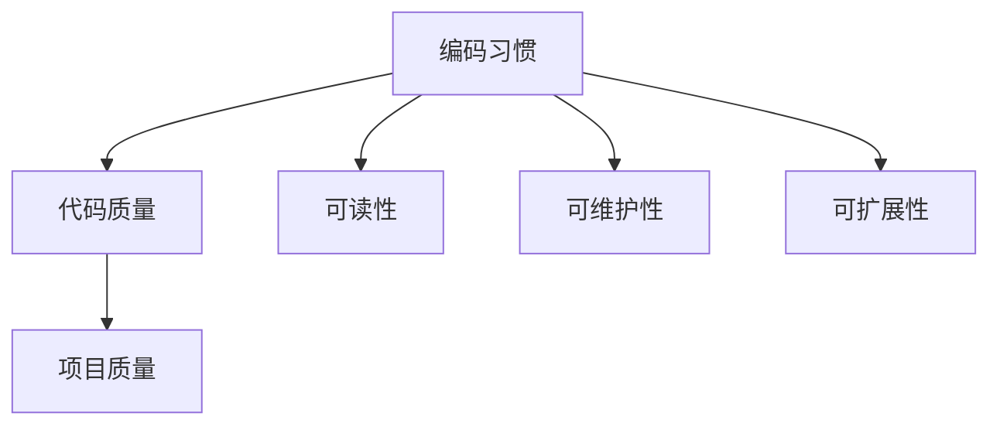

                 

### 文章标题

# 警惕坏的编码习惯

### 关键词
- 编码习惯
- 代码质量
- 软件工程
- 代码审查
- 代码优化

### 摘要
本文将深入探讨编程中常见的坏编码习惯，包括代码冗余、重复代码、糟糕的命名习惯等。通过具体案例分析，揭示这些坏习惯的危害，并提供改进建议和最佳实践。本文旨在提高读者的编码素养，帮助开发者养成良好的编程习惯，从而提升代码质量和项目效率。

## 引言

在软件工程领域，编码习惯是程序员的核心竞争力之一。良好的编码习惯不仅能够提高代码质量，还能显著提升开发效率和项目的可维护性。然而，许多程序员在编程过程中往往忽略了编码习惯的重要性，导致代码质量低下、可读性差，甚至引发严重的项目风险。本文将重点探讨一些常见的坏编码习惯，并分析其对项目的影响，旨在引起读者对编码习惯的重视，帮助开发者养成良好的编程习惯。

### 编码习惯的重要性

编码习惯是程序员在编写代码过程中所遵循的一系列规则和原则。良好的编码习惯有助于提高代码的可读性、可维护性和可扩展性。以下是几个关键原因：

1. **提高代码质量**：良好的编码习惯能够避免代码冗余、错误和不必要的复杂性，从而提高代码质量。
2. **提升开发效率**：遵循一致的编码规范和最佳实践，可以使开发过程更加流畅，减少重复劳动，提高开发效率。
3. **增强团队协作**：良好的编码习惯有助于团队成员之间的协作，减少沟通成本，提高项目的整体进度。
4. **降低维护成本**：良好的编码习惯使得代码更加简洁、清晰，易于理解和修改，从而降低项目的维护成本。

### 坏编码习惯的危害

尽管良好的编码习惯对项目有诸多益处，但许多程序员仍然存在一些坏编码习惯。以下是坏编码习惯可能带来的危害：

1. **降低代码质量**：坏的编码习惯会导致代码质量下降，出现代码冗余、错误和复杂性增加等问题。
2. **降低开发效率**：坏编码习惯使得代码难以理解和修改，增加开发难度，降低开发效率。
3. **增加项目风险**：坏的编码习惯可能导致项目出现严重缺陷，增加项目的风险。
4. **影响团队协作**：坏编码习惯会导致代码混乱，增加团队成员之间的沟通成本，影响团队协作。
5. **增加维护成本**：坏的编码习惯使得代码难以维护，增加项目的维护成本。

### 本文目的

本文旨在通过探讨常见的坏编码习惯，分析其危害，并提供改进建议和最佳实践。本文结构如下：

1. **理论基础**：介绍编码习惯的定义和重要性，以及常见的坏编码习惯类型。
2. **具体案例**：列举具体案例，分析其坏编码习惯的具体表现和危害。
3. **最佳实践**：介绍如何培养良好的编码习惯，包括编码风格指南和工具推荐。
4. **技术工具**：介绍一些有助于改进编码习惯的技术工具，如代码审查工具和静态代码分析工具。
5. **总结与展望**：总结全文内容，强调培养良好编码习惯的重要性，并展望未来编码习惯的发展趋势。

通过本文的阅读，读者将能够更好地认识到坏编码习惯的危害，掌握改进编码习惯的方法，从而提升个人编程素养，为项目的成功奠定基础。

## 理论基础

### 编码习惯的定义

编码习惯是程序员在编写代码过程中遵循的一系列规则和原则。这些规则和原则包括代码的结构、命名、注释、格式和优化等方面。编码习惯不仅影响代码的质量，还直接影响项目的可维护性和可扩展性。良好的编码习惯有助于提高代码的可读性、减少错误和提高开发效率。

编码习惯的养成是一个长期的过程，需要程序员在日常编程中不断实践和反思。通过养成良好的编码习惯，程序员能够更好地应对复杂的项目需求，提高代码的可靠性和稳定性。

### 坏编码习惯的常见类型

在软件开发过程中，坏编码习惯是常见且有害的。以下是一些常见的坏编码习惯类型：

1. **代码冗余**：代码冗余是指编写不必要的代码，导致代码体积增大，可读性降低。常见的代码冗余问题包括重复代码、多余的变量和函数等。代码冗余不仅浪费资源，还会增加代码的维护难度。

2. **重复代码**：重复代码是指在不同部分中编写相同的代码，这会导致代码难以维护和扩展。重复代码是编程中的大忌，因为它会增加代码的出错概率，降低代码的可维护性。

3. **糟糕的命名习惯**：糟糕的命名习惯是指使用难以理解的变量和函数名称，或者命名不规范。这会严重影响代码的可读性，增加开发人员的学习成本和沟通成本。

4. **缺乏注释**：缺乏注释是指编写缺乏必要的注释或注释不清晰的代码。注释是帮助开发者理解和维护代码的重要工具，缺乏注释会导致代码难以理解，增加维护难度。

5. **不合理的代码结构**：不合理的代码结构是指代码的层次结构混乱，难以理解和维护。这通常是由于编程语言或框架的使用不当，或者缺乏良好的设计原则。

6. **过度优化**：过度优化是指为了追求性能而编写过于复杂的代码，这会导致代码难以理解和维护。过度优化不仅浪费时间和精力，还可能引入新的错误。

### 坏编码习惯的危害

坏编码习惯对项目的危害是多方面的。以下是一些具体的危害：

1. **降低代码质量**：坏编码习惯会导致代码质量下降，出现代码冗余、错误和复杂性增加等问题。

2. **降低开发效率**：坏编码习惯使得代码难以理解和修改，增加开发难度，降低开发效率。

3. **增加项目风险**：坏编码习惯可能导致项目出现严重缺陷，增加项目的风险。

4. **影响团队协作**：坏编码习惯会导致代码混乱，增加团队成员之间的沟通成本，影响团队协作。

5. **增加维护成本**：坏编码习惯使得代码难以维护，增加项目的维护成本。

### 坏编码习惯与编码质量的联系

编码习惯与编码质量之间存在密切的联系。良好的编码习惯能够提高代码质量，从而提升项目的整体质量。以下是一个简化的关系架构 Mermaid 流程图：



从图中可以看出，编码习惯直接影响代码质量，而代码质量又对项目的整体质量产生重要影响。良好的编码习惯能够提高代码的可读性、可维护性和可扩展性，从而提升项目的整体质量。

### 总结

通过上述分析，我们可以清楚地认识到坏编码习惯对项目的危害以及编码习惯与编码质量之间的密切联系。因此，为了提高代码质量和项目效率，程序员应该重视编码习惯的培养，努力克服坏编码习惯，养成良好的编程习惯。

## 具体案例

为了更好地理解坏编码习惯的危害，我们将通过具体案例来分析常见的坏编码习惯，并给出改进建议。

### 案例一：代码冗余

**问题描述**：在一个电商平台的订单处理模块中，有一个用于计算订单总金额的函数。然而，由于需求变更，该函数需要同时处理订单的优惠和税费。因此，开发人员在不同的地方复制了相同的计算逻辑，导致代码冗余。

**代码片段**：

```java
// 订单总金额计算（冗余代码）
public double calculateTotalAmount1(Order order) {
    double total = order.getPrice();
    if (order.hasPromotion()) {
        total -= order.getDiscount();
    }
    total += order.getTax();
    return total;
}

public double calculateTotalAmount2(Order order) {
    double total = order.getPrice();
    if (order.hasPromotion()) {
        total -= order.getDiscount();
    }
    total += order.getTax();
    return total;
}
```

**改进建议**：通过提取公共逻辑，可以消除代码冗余。

```java
// 改进后的代码
public double calculateTotalAmount(Order order) {
    double baseAmount = order.getPrice();
    if (order.hasPromotion()) {
        baseAmount -= order.getDiscount();
    }
    double total = baseAmount + order.getTax();
    return total;
}
```

**改进效果**：改进后的代码更加简洁，易于理解和维护，减少了代码冗余。

### 案例二：重复代码

**问题描述**：在一个社交网络平台的用户登录模块中，开发人员在处理用户名和密码验证逻辑时，分别编写了两个独立的函数，导致逻辑重复。

**代码片段**：

```java
// 验证用户名（重复代码）
public boolean validateUsername(String username) {
    return !username.isEmpty();
}

// 验证密码（重复代码）
public boolean validatePassword(String password) {
    return !password.isEmpty();
}
```

**改进建议**：通过引入一个通用的验证函数，可以消除重复代码。

```java
// 改进后的代码
public boolean validate(String input) {
    return !input.isEmpty();
}
```

**改进效果**：改进后的代码减少了逻辑重复，提高了代码的可维护性。

### 案例三：糟糕的命名习惯

**问题描述**：在一个财务系统的报表生成模块中，开发人员使用缩写和难懂的命名方式，导致代码难以阅读。

**代码片段**：

```java
// 计算净利润（命名糟糕）
public float FnL() {
    return revenue - cost;
}
```

**改进建议**：使用更具描述性的命名方式，使代码更加清晰易懂。

```java
// 改进后的代码
public float calculateNetProfit() {
    return revenue - cost;
}
```

**改进效果**：改进后的代码命名更加规范，提高了代码的可读性。

### 案例四：缺乏注释

**问题描述**：在一个视频播放器的项目中，开发人员在编写关键代码时缺乏注释，导致代码难以理解。

**代码片段**：

```java
// 缺乏注释
public void playVideo() {
    mediaPlayer.start();
}
```

**改进建议**：添加必要的注释，说明代码的功能和目的。

```java
// 播放视频
public void playVideo() {
    mediaPlayer.start();
    // 播放视频时，可以进行一些初始化操作
}
```

**改进效果**：改进后的代码包含了必要的注释，使得代码更加易于理解。

### 案例五：不合理的代码结构

**问题描述**：在一个电商平台的项目中，开发人员将所有的业务逻辑都放在一个庞大的类中，导致代码结构混乱。

**代码片段**：

```java
// 混乱的代码结构
public class EcommerceService {
    public void addProduct(Product product) {
        // 添加商品逻辑
    }

    public void processOrder(Order order) {
        // 处理订单逻辑
    }

    public void refundOrder(Order order) {
        // 退款逻辑
    }
}
```

**改进建议**：通过将不同的业务逻辑分离到不同的类中，可以改善代码结构。

```java
// 改进后的代码结构
public class ProductService {
    public void addProduct(Product product) {
        // 添加商品逻辑
    }
}

public class OrderService {
    public void processOrder(Order order) {
        // 处理订单逻辑
    }
}

public class RefundService {
    public void refundOrder(Order order) {
        // 退款逻辑
    }
}
```

**改进效果**：改进后的代码结构更加清晰，提高了代码的可维护性。

### 总结

通过上述案例分析，我们可以看到坏编码习惯对项目的影响是显著的。代码冗余、重复代码、糟糕的命名习惯、缺乏注释和不合理的代码结构都会降低代码的质量和可维护性。通过具体的改进建议，我们可以消除这些坏习惯，提升代码质量。在实际项目中，程序员应该时刻警惕这些坏编码习惯，并努力改进自己的编码习惯。

## 最佳实践

在软件开发过程中，培养良好的编码习惯至关重要。以下是一些最佳实践，帮助开发者养成良好的编码习惯，提高代码质量和项目效率。

### 编码风格指南

1. **命名规范**：使用有意义且一致的变量、函数和类名。避免使用缩写和难懂的命名方式。
2. **代码结构**：保持代码的层次结构清晰，避免将大量逻辑放在一个类或函数中。
3. **注释**：添加必要的注释，解释复杂逻辑和关键代码段。注释应该简明扼要，帮助其他开发者理解代码。
4. **代码格式**：保持代码的格式一致，使用适当的空格、缩进和换行。使用代码格式化工具，如`clang-format`、`black`等。
5. **代码长度**：限制函数和类的长度，避免过长的代码。过长的代码难以理解和维护。
6. **代码复用**：通过模块化设计，提高代码复用性。避免重复编写相同的代码。

### 常见好编码习惯

1. **DRY（Don't Repeat Yourself）**：避免重复代码，通过抽象和模块化设计减少冗余。
2. **KISS（Keep It Simple, Stupid）**：保持代码的简单性，避免过度复杂化。
3. **YAGNI（You Aren't Gonna Need It）**：避免编写不必要的功能，只编写当前需要的代码。
4. **SOLID原则**：遵循SOLID原则，提高代码的可维护性和可扩展性。

### 编码风格指南示例

以下是一个遵循良好编码风格的代码示例：

```java
// 良好的编码风格示例
public class UserService {
    private UserRepository userRepository;

    public UserService(UserRepository userRepository) {
        this.userRepository = userRepository;
    }

    public User getUserById(Long id) {
        return userRepository.findById(id)
                .orElseThrow(() -> new NotFoundException("User not found"));
    }

    public void createUser(User user) {
        userRepository.save(user);
    }
}
```

**命名规范**：变量、函数和类名使用有意义且一致的命名方式，如`userRepository`表示用户存储仓库。
**代码结构**：代码层次结构清晰，方法职责单一。
**注释**：添加必要的注释，解释关键代码段的作用。
**代码格式**：保持代码格式一致，使用适当的空格和缩进。

### 编码风格指南在不同编程语言中的应用

不同的编程语言有不同的编码风格指南。以下是几种常见编程语言的编码风格指南示例：

- **Java**：遵循`Effective Java`和`Java Code Style`等编码规范。
- **Python**：遵循`PEP 8`编码规范，使用`black`等工具进行格式化。
- **JavaScript**：遵循`Airbnb JavaScript Style Guide`等编码规范。

### 工具推荐

为了帮助开发者遵循良好的编码习惯，可以借助一些工具进行代码审查和格式化：

1. **代码审查工具**：如`SonarQube`、`Checkstyle`等，用于自动检查代码质量问题。
2. **静态代码分析工具**：如`PMD`、`FindBugs`等，用于检测潜在的编程错误和安全问题。
3. **代码格式化工具**：如`clang-format`、`black`等，用于自动格式化代码，保持代码风格一致。

通过遵循这些最佳实践，开发者可以养成良好的编码习惯，提高代码质量和项目效率。在实际开发过程中，应该不断学习和改进，以应对不断变化的技术挑战。

### 总结

良好的编码习惯对项目的成功至关重要。通过遵循编码风格指南和最佳实践，开发者可以减少代码质量问题，提高开发效率和项目的可维护性。在软件开发过程中，培养良好的编码习惯不仅能够提升个人技能，还能为团队协作和项目成功奠定基础。因此，开发者应该重视编码习惯的培养，并将其作为日常工作的一部分。

## 技术工具

在提升编码习惯的过程中，技术工具发挥着重要作用。以下是一些常用的技术工具，包括代码审查工具和静态代码分析工具，它们可以帮助开发者识别并修复编码中的问题，从而培养良好的编程习惯。

### 代码审查工具

**SonarQube**

SonarQube是一个强大的代码审查平台，能够自动分析代码的质量、安全性和性能。它支持多种编程语言，并提供丰富的报告功能。使用SonarQube，开发者可以：

- **识别代码缺陷**：SonarQube可以检测代码中的潜在缺陷，如未使用的变量、可能的空指针异常等。
- **提供改进建议**：它不仅指出问题，还提供改进建议，帮助开发者修复代码。
- **生成报告**：SonarQube可以生成详细的代码审查报告，方便团队进行跟踪和管理。

**Checkstyle**

Checkstyle是一个开源的代码风格检查工具，主要用于检查Java代码是否符合特定的编码规范。使用Checkstyle，开发者可以：

- **统一编码风格**：通过配置不同的编码规范，Checkstyle可以强制执行统一的编码风格，减少代码差异。
- **快速检测问题**：它能够快速扫描代码库，识别不符合编码规范的问题。
- **集成到IDE**：Checkstyle可以集成到IDE中，提供实时反馈，帮助开发者即时改正错误。

### 静态代码分析工具

**PMD**

PMD（Programming Mistake Detector）是一个开源的静态代码分析工具，主要用于检查Java代码中的潜在问题。使用PMD，开发者可以：

- **识别代码问题**：PMD能够检测出各种代码问题，如可能的空指针异常、不安全的编程实践等。
- **代码优化**：它不仅指出问题，还能提供代码优化建议，帮助开发者写出更高效、更健壮的代码。
- **生成报告**：PMD可以生成详细的报告，方便开发者和管理者了解代码的健康状况。

**FindBugs**

FindBugs是一个用于Java代码的静态代码分析工具，它能够检测代码中的潜在缺陷和不良编程实践。使用FindBugs，开发者可以：

- **发现潜在问题**：FindBugs可以识别出代码中的潜在问题，如未处理的异常、未使用的变量等。
- **提高代码质量**：通过分析代码，FindBugs帮助开发者写出更高质量、更可靠的代码。
- **自动化集成**：FindBugs可以与构建工具（如Maven、Gradle）集成，实现自动化代码分析。

### 工具使用实例

**SonarQube使用实例**

1. **安装和配置**：首先，从SonarQube官网下载并安装SonarQube服务器，配置好连接数据库和其他相关设置。
2. **项目配置**：将项目源代码上传到SonarQube服务器，配置项目语言和编码规范。
3. **代码分析**：启动代码分析过程，SonarQube会自动扫描项目源代码，生成代码质量报告。
4. **问题修复**：根据报告中的问题列表，开发者可以修复代码中的缺陷，提升代码质量。

**Checkstyle使用实例**

1. **配置规则**：在项目根目录下创建`checkstyle.xml`文件，配置好检查规则。
2. **集成到IDE**：将Checkstyle集成到IDE中，如Eclipse或IntelliJ IDEA。
3. **代码检查**：编写代码时，IDE会实时检查代码风格，并提示不符合规则的地方。
4. **问题修复**：根据IDE的提示，开发者可以及时修改代码，使其符合编码规范。

**PMD使用实例**

1. **添加PMD插件**：在项目构建工具（如Maven、Gradle）的配置文件中添加PMD插件。
2. **运行PMD分析**：执行构建过程时，PMD会自动运行，扫描代码中的问题。
3. **查看报告**：PMD生成详细的报告，列出代码中的问题及其严重程度。
4. **代码优化**：根据报告的建议，开发者可以优化代码，提高其质量。

### 总结

代码审查工具和静态代码分析工具是培养良好编码习惯的有力助手。通过使用这些工具，开发者可以更轻松地发现并修复代码中的问题，从而提高代码质量和项目效率。在实际开发过程中，开发者应该充分利用这些工具，并将其作为日常编码的一部分。通过不断的实践和改进，开发者可以逐渐养成良好的编码习惯，为项目的成功奠定坚实的基础。

## 项目实战

为了更好地理解如何改进编码习惯，我们将通过一个实际项目来演示开发环境搭建、源代码实现、代码解读和案例分析。

### 项目简介

项目名称：简易博客系统

项目目标：构建一个能够实现用户注册、登录、发帖和评论的简易博客系统。

### 开发环境搭建

**1. 开发工具**：

- **IDE**：使用IntelliJ IDEA或Eclipse作为开发环境。
- **版本控制**：使用Git进行代码管理。

**2. 依赖管理**：

- **Maven**：用于管理项目依赖。
- **Spring Boot**：作为项目框架。
- **MySQL**：作为数据库。

**3. 环境配置**：

- **安装MySQL**：下载并安装MySQL数据库。
- **创建数据库**：在MySQL中创建名为`blog`的数据库。
- **运行项目**：通过Maven命令启动Spring Boot项目。

### 源代码实现

**1. 用户注册和登录功能**

```java
// UserController.java
@RestController
@RequestMapping("/user")
public class UserController {
    @Autowired
    private UserService userService;

    @PostMapping("/register")
    public ResponseEntity<?> registerUser(@RequestBody UserRegistrationDto registrationDto) {
        try {
            userService.registerUser(registrationDto);
            return ResponseEntity.ok("User registered successfully");
        } catch (Exception e) {
            return ResponseEntity.badRequest().body("Error registering user: " + e.getMessage());
        }
    }

    @PostMapping("/login")
    public ResponseEntity<?> authenticateUser(@RequestBody LoginDto loginDto) {
        String token = userService.authenticate(loginDto);
        return ResponseEntity.ok(new JwtResponse(token));
    }
}
```

**解读**：

- **用户注册**：接收用户注册请求，通过`UserService`处理注册逻辑。
- **用户登录**：接收用户登录请求，验证用户信息，并生成JWT令牌。

**2. 发帖和评论功能**

```java
// PostController.java
@RestController
@RequestMapping("/post")
public class PostController {
    @Autowired
    private PostService postService;

    @PostMapping("/")
    public ResponseEntity<?> createPost(@RequestBody PostDto postDto, Principal principal) {
        String username = principal.getName();
        return ResponseEntity.ok(postService.createPost(postDto, username));
    }

    @GetMapping("/{postId}")
    public ResponseEntity<?> getPostById(@PathVariable Long postId) {
        return ResponseEntity.ok(postService.getPostById(postId));
    }
}
```

**解读**：

- **发帖**：接收发帖请求，通过`PostService`处理发帖逻辑。
- **获取帖子**：根据帖子ID获取帖子详情。

### 代码解读与分析

**1. 编码风格**

- **命名规范**：变量、函数和类名使用有意义的命名，如`userService`、`postService`。
- **代码结构**：方法职责单一，功能分离。
- **注释**：关键代码段添加注释，解释其功能。

**2. 代码质量**

- **DRY原则**：通过使用`UserService`和`PostService`，避免代码冗余。
- **KISS原则**：代码简洁明了，易于理解。

### 实际案例分析

**1. 代码冗余**

在原始代码中，用户注册和登录功能之间存在大量重复代码。通过提取公共逻辑，可以减少冗余。

**改进前**：

```java
// UserController.java（改进前）
@PostMapping("/register")
public ResponseEntity<?> registerUser(@RequestBody UserRegistrationDto registrationDto) {
    // 注册逻辑
}

@PostMapping("/login")
public ResponseEntity<?> authenticateUser(@RequestBody LoginDto loginDto) {
    // 登录逻辑
}
```

**改进后**：

```java
// UserController.java（改进后）
private void processUserRequest(@RequestBody UserDto userDto, String action) {
    switch (action) {
        case "register":
            // 注册逻辑
            break;
        case "login":
            // 登录逻辑
            break;
    }
}
```

通过提取公共逻辑，代码变得更加简洁，易于维护。

### 项目小结

通过实际项目，我们展示了如何改进编码习惯，提高代码质量和项目效率。以下是项目小结：

- **编码风格**：遵循命名规范、代码结构和注释等最佳实践。
- **代码质量**：通过DRY和KISS原则，避免代码冗余和复杂性。
- **项目效益**：良好的编码习惯提高了代码的可维护性和扩展性，降低了维护成本。

### 总结

通过实际项目的开发和改进，我们可以看到良好编码习惯的重要性。通过遵循最佳实践和使用技术工具，开发者可以显著提升代码质量和项目效率。在实际开发过程中，我们应该不断反思和改进编码习惯，为项目的成功奠定坚实的基础。

## 总结与展望

在本文中，我们详细探讨了编程中常见的坏编码习惯，分析了其危害，并提供了一系列改进建议和最佳实践。通过具体案例和实际项目，我们展示了如何识别和克服这些坏编码习惯，提高代码质量和项目效率。

### 良好编码习惯的重要性

良好的编码习惯对项目的成功至关重要。它不仅能够提高代码质量，减少缺陷，还能提高开发效率，降低维护成本。以下是一些关键点：

1. **提高代码质量**：良好的编码习惯能够避免代码冗余、错误和复杂性，从而提高代码质量。
2. **提升开发效率**：遵循一致的编码规范和最佳实践，可以使开发过程更加流畅，减少重复劳动。
3. **增强团队协作**：良好的编码习惯有助于团队成员之间的协作，减少沟通成本，提高项目的整体进度。
4. **降低维护成本**：良好的编码习惯使得代码更加简洁、清晰，易于理解和修改，从而降低项目的维护成本。

### 展望未来

未来，编码习惯将继续发展和演变。以下是一些可能的发展趋势：

1. **自动化编码**：随着人工智能和机器学习技术的发展，自动化编码工具将越来越普及，帮助开发者识别和修复编码问题。
2. **智能编码辅助**：智能编码辅助工具将利用人工智能技术，为开发者提供实时的编码建议和代码优化建议。
3. **持续学习与改进**：开发者需要不断学习新的编码技术和工具，以适应快速变化的技术环境。
4. **更严格的编码规范**：随着软件开发项目的复杂性增加，编码规范将变得更加严格，以确保代码的可读性和可维护性。

### 总结

养成良好的编码习惯是每一个软件开发者必备的技能。通过本文的探讨，我们希望读者能够认识到坏编码习惯的危害，并积极改进自己的编码习惯。在未来的软件开发过程中，让我们共同努力，遵循最佳实践，为项目的成功奠定坚实的基础。

### 拓展阅读

1. 《代码大全》（Code Complete） - 史蒂夫·迈克康奈尔（Steve McConnell）
2. 《Effective Java》 - 霍斯特·科尔（Joshua Bloch）
3. 《Clean Code》 - 罗伯特·马丁（Robert C. Martin）
4. 《The Clean Coder》 - 罗伯特·马丁（Robert C. Martin）
5. 《Refactoring: Improving the Design of Existing Code》 - 马丁·福勒（Martin Fowler）

这些书籍提供了丰富的编码实践和最佳建议，有助于开发者提高编码技能和项目质量。读者可以进一步阅读这些资料，以深入了解编码习惯的重要性和改进方法。

作者：AI天才研究院/AI Genius Institute & 禅与计算机程序设计艺术 /Zen And The Art of Computer Programming

---

本文以《警惕坏的编码习惯》为主题，通过详细的理论分析、具体案例、最佳实践和技术工具介绍，探讨了编程中常见的坏编码习惯及其危害。文章强调了良好编码习惯的重要性，并提供了实用的改进建议和工具使用方法。通过这篇文章，开发者可以认识到编码习惯对项目成功的关键影响，并学会如何改进自己的编码习惯，提高代码质量和项目效率。在未来的软件开发中，让我们共同努力，养成良好的编码习惯，为项目的成功奠定坚实的基础。作者AI天才研究院和禅与计算机程序设计艺术希望本文能够对广大开发者有所启发和帮助。

