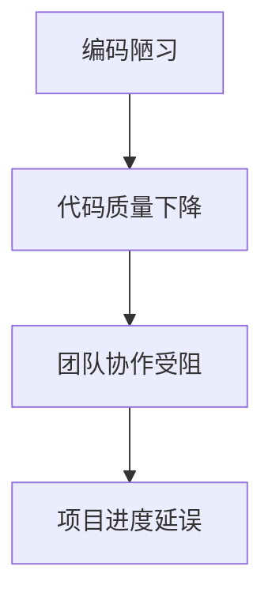

                 


### 文章标题：警惕这些坏习惯：让团队疲惫的编码陋习

#### 关键词：
- 编码陋习
- 团队协作
- 代码质量
- 编程最佳实践
- 代码审查
- 编程工具

#### 摘要：
本文将深入探讨编程中常见的陋习，这些陋习不仅影响代码质量，还会导致团队工作效率的下降。通过分析这些陋习的危害和解决方案，本文旨在帮助开发团队提升编码能力，打造更加高效和协作的编程环境。

---

## 第一部分：编码陋习的影响与危害

### 第1章：编码陋习的概念与分类

#### 背景介绍
编程作为一种高度复杂的工作，对代码的编写质量有着极高的要求。然而，在现实工作中，许多开发人员由于种种原因，养成了不良的编码习惯。这些陋习不仅降低了代码的可读性和可维护性，还会对团队协作产生负面影响。

#### 核心概念与联系

$$
\text{陋习} \rightarrow \text{代码质量下降} \\
\text{代码质量下降} \rightarrow \text{团队协作受阻} \\
\text{团队协作受阻} \rightarrow \text{项目进度延误}
$$

#### Mermaid 流程图



#### 核心算法原理讲解

伪代码：

```
function coding_habits_impact(habits):
    if habits contains redundant_code:
        quality_decrease()
    if habits contains lack_of_comments:
        quality_decrease()
    if habits contains overuse_of_globals:
        quality_decrease()
    if habits contains improper_naming_conventions:
        quality_decrease()
    if habits contains lack_of_unit_tests:
        quality_decrease()
    return quality_decrease_impact()
```

#### 详细讲解与举例说明

- **代码冗余**：代码冗余指的是重复编写相同的代码段。这不仅浪费了存储空间，还会导致代码的可读性下降，增加维护难度。

- **缺乏注释**：注释是提高代码可读性的重要手段。缺乏注释的代码使得后续的维护变得困难，增加了出错的可能性。

- **过度使用全局变量**：全局变量容易导致命名冲突和不可预测的行为，增加代码的复杂性。

- **不规范的命名约定**：不规范的命名习惯使得代码难以理解，增加了学习和维护的难度。

- **缺乏单元测试**：单元测试是确保代码质量的重要手段。缺乏单元测试会导致在后续的维护过程中难以发现和解决问题。

### 第2章：常见编码陋习分析

在本章中，我们将对几种常见的编码陋习进行深入分析，并探讨它们对代码质量和团队协作的负面影响。

#### 代码冗余

**定义**：代码冗余是指编写重复的代码段。

**危害**：
- **降低代码可读性**：重复的代码使得代码结构变得混乱，难以理解。
- **增加维护成本**：每当需要修改或更新某段重复代码时，都需要在多个位置进行修改，增加了维护成本。

**解决方案**：
- **代码重构**：将重复的代码段提取为独立函数或模块。
- **使用函数或方法**：通过定义函数或方法来复用代码。

#### 缺乏注释

**定义**：注释是对代码进行解释和说明的文本。

**危害**：
- **降低代码可读性**：缺乏注释的代码对于新手或其他人来说难以理解。
- **增加维护难度**：缺乏注释的代码在后续维护过程中容易出现误解和错误。

**解决方案**：
- **编写必要的注释**：在复杂或关键代码段前添加注释，解释其功能和目的。
- **文档化**：编写完整的文档，记录代码的设计和功能。

#### 过度使用全局变量

**定义**：全局变量是可以在程序中的任何地方访问和修改的变量。

**危害**：
- **命名冲突**：多个全局变量可能导致命名冲突，影响代码的执行。
- **不可预测的行为**：全局变量的修改可能导致不可预测的行为，增加代码的复杂性。

**解决方案**：
- **使用局部变量**：尽量使用局部变量，减少全局变量的使用。
- **模块化**：通过模块化设计，将功能相关的变量和代码封装在独立的模块中。

#### 不规范的命名约定

**定义**：命名约定是指代码中变量、函数和类的命名规则。

**危害**：
- **降低代码可读性**：不规范的命名习惯使得代码难以理解。
- **增加维护难度**：不规范的命名使得学习和维护代码变得更加困难。

**解决方案**：
- **遵循命名规范**：例如，采用驼峰命名法（CamelCase）或下划线命名法（snake_case）。
- **统一命名习惯**：在整个项目中保持一致的命名习惯。

#### 缺乏单元测试

**定义**：单元测试是对代码的最小功能单元进行测试，以确保其正确性。

**危害**：
- **降低代码质量**：缺乏单元测试的代码容易出现漏洞和错误。
- **增加维护成本**：缺乏单元测试的代码在后续维护过程中难以发现和解决问题。

**解决方案**：
- **编写单元测试**：为每个功能单元编写相应的单元测试。
- **自动化测试**：使用自动化测试工具，定期运行单元测试，确保代码的稳定性。

### 第3章：编码陋习的代价

在本章中，我们将探讨编码陋习所带来的各种代价，包括维护成本增加、代码质量下降、团队协作受阻以及项目进度延误。

#### 维护成本增加

**定义**：维护成本是指对现有代码进行修改、更新或修复所需的资源。

**影响**：
- **重复劳动**：由于代码冗余和不规范，每次修改或更新都需要在多个位置进行修改，增加了工作量。
- **错误修复**：缺乏注释和单元测试，使得在修复错误时需要花费更多的时间和精力。

**解决方案**：
- **代码重构**：定期进行代码重构，消除冗余和不规范的代码。
- **编写注释和单元测试**：增加代码的注释和单元测试，提高代码的可读性和稳定性。

#### 代码质量下降

**定义**：代码质量是指代码的可读性、可维护性和可靠性。

**影响**：
- **可读性下降**：缺乏注释和规范的命名习惯使得代码难以理解。
- **可维护性下降**：不规范的代码结构和缺乏单元测试使得代码的维护变得更加困难。
- **可靠性下降**：缺乏单元测试的代码容易出现漏洞和错误。

**解决方案**：
- **编写高质量的代码**：遵循编程最佳实践，编写高质量的代码。
- **代码审查**：定期进行代码审查，确保代码质量。

#### 团队协作受阻

**定义**：团队协作是指团队成员之间共同完成项目的过程。

**影响**：
- **沟通障碍**：缺乏注释和文档化的代码使得团队成员之间的沟通变得更加困难。
- **任务重复**：由于代码质量低下，团队成员可能需要重复完成任务。
- **进度延误**：代码质量低下导致项目进度延误，增加了项目的风险。

**解决方案**：
- **建立良好的沟通机制**：定期召开会议，确保团队成员之间的沟通畅通。
- **提高代码质量**：通过编写高质量的代码和进行代码审查，提高团队协作效率。

#### 项目进度延误

**定义**：项目进度延误是指项目实际进度落后于计划进度。

**影响**：
- **项目风险增加**：项目进度延误可能导致项目风险增加，影响项目的成功。
- **客户满意度下降**：项目进度延误可能导致客户对项目不满意，影响公司的声誉。
- **资源浪费**：项目进度延误可能导致资源的浪费，增加项目的成本。

**解决方案**：
- **提高代码质量**：通过提高代码质量，减少错误和漏洞，提高项目进度。
- **合理安排任务**：合理分配任务，确保项目进度的可控性。

---

## 第二部分：摆脱编码陋习的策略与方法

### 第4章：培养良好的编码习惯

在本章中，我们将探讨如何通过培养良好的编码习惯来摆脱陋习，提高代码质量和团队协作效率。

#### 坚持代码审查

**定义**：代码审查是一种团队成员相互检查代码的过程。

**好处**：
- **提高代码质量**：代码审查可以发现和纠正代码中的错误和缺陷。
- **知识共享**：代码审查促进团队成员之间的知识共享和技能提升。

**实施方法**：
- **定期审查**：定期组织代码审查会议，确保每个代码提交都经过审查。
- **详细记录**：对审查过程进行记录，包括发现的问题和解决方案。

#### 代码重构

**定义**：代码重构是指对现有代码进行改进，以提高其质量和可维护性。

**好处**：
- **消除冗余**：代码重构可以消除代码中的冗余，提高代码的可读性和可维护性。
- **提升性能**：代码重构可以优化代码的性能，提高程序的执行效率。

**实施方法**：
- **逐步重构**：逐步对代码进行重构，避免一次性重构导致的复杂性增加。
- **测试驱动**：在重构过程中，确保每个重构步骤都经过充分的测试。

#### 使用代码规范

**定义**：代码规范是指一组关于代码编写和格式的规则。

**好处**：
- **统一风格**：代码规范可以统一代码的编写风格，提高代码的可读性。
- **减少错误**：代码规范可以减少因格式错误导致的编译错误和运行错误。

**实施方法**：
- **制定规范**：根据项目需求，制定适合项目的代码规范。
- **自动化工具**：使用自动化工具检查和修复代码中的不规范之处。

#### 学习编程最佳实践

**定义**：编程最佳实践是指一组关于编程的方法和技巧。

**好处**：
- **提高技能**：学习编程最佳实践可以提升开发人员的编程技能。
- **优化代码**：编程最佳实践可以帮助开发人员编写更高效、更优化的代码。

**实施方法**：
- **阅读优秀代码**：阅读其他优秀开发人员的代码，学习他们的编程技巧和风格。
- **参加培训和研讨会**：参加编程相关的培训和研讨会，了解最新的编程趋势和最佳实践。

### 第5章：工具与技术支持

在本章中，我们将探讨如何利用工具和技术来支持摆脱编码陋习，提高代码质量和团队协作效率。

#### 版本控制工具

**定义**：版本控制工具是一种用于管理代码版本和变更的工具。

**好处**：
- **代码管理**：版本控制工具可以方便地管理代码的版本和变更历史。
- **协作支持**：版本控制工具支持多人协作开发，提高团队协作效率。

**推荐工具**：
- **Git**：Git 是最受欢迎的版本控制工具之一，具有强大的分支管理和协同工作能力。

#### 单元测试框架

**定义**：单元测试框架是一种用于编写和运行单元测试的工具。

**好处**：
- **代码质量保障**：单元测试框架可以确保代码的质量，及时发现和修复错误。
- **提高开发效率**：单元测试框架可以自动化测试流程，提高开发效率。

**推荐工具**：
- **JUnit**：JUnit 是 Java 语言的单元测试框架，广泛应用于 Java 项目。
- **pytest**：pytest 是 Python 语言的高效单元测试框架。

#### 代码分析工具

**定义**：代码分析工具是一种用于分析代码质量和性能的工具。

**好处**：
- **代码质量检查**：代码分析工具可以检查代码中的潜在问题和缺陷。
- **性能优化**：代码分析工具可以帮助开发人员优化代码性能。

**推荐工具**：
- **SonarQube**：SonarQube 是一款强大的代码分析工具，支持多种编程语言。
- **FindBugs**：FindBugs 是一款用于 Java 代码的静态代码分析工具。

### 第6章：团队文化建设

在本章中，我们将探讨如何通过团队文化建设来促进良好的编码习惯的形成和保持。

#### 建立反馈机制

**定义**：反馈机制是一种团队成员相互提供意见和建议的机制。

**好处**：
- **提高编码质量**：通过反馈机制，团队成员可以相互发现和纠正编码陋习。
- **促进团队协作**：反馈机制可以增强团队成员之间的沟通和协作。

**实施方法**：
- **定期反馈会议**：定期组织反馈会议，让团队成员分享编码经验和建议。
- **匿名反馈**：鼓励团队成员匿名提供反馈，消除顾虑和压力。

#### 定期编码培训

**定义**：编码培训是一种针对团队成员的编码技能培训。

**好处**：
- **提高编码技能**：编码培训可以帮助团队成员提升编码技能，减少编码陋习。
- **增强团队凝聚力**：编码培训可以增强团队成员之间的凝聚力和归属感。

**实施方法**：
- **内部培训**：组织内部培训，邀请有经验的开发人员分享编码技巧和经验。
- **外部培训**：参加外部编程培训和研讨会，了解最新的编程趋势和技术。

#### 推动技术分享

**定义**：技术分享是一种团队成员之间共享技术知识和经验的机制。

**好处**：
- **知识共享**：技术分享可以促进团队成员之间的知识共享和技能提升。
- **提高团队整体水平**：技术分享可以提高团队的整体技术水平，增强团队的竞争力。

**实施方法**：
- **技术分享会**：定期组织技术分享会，让团队成员分享自己的技术心得和经验。
- **内部博客**：鼓励团队成员撰写技术博客，分享自己的学习和实践经验。

---

## 第三部分：实战案例与解决方案

### 第7章：案例分析一：大型项目的编码陋习治理

#### 项目背景

某大型互联网公司的一个项目团队负责开发一个电商平台，随着项目规模的不断扩大，团队逐渐暴露出严重的编码陋习，导致项目进度严重滞后，代码质量急剧下降。

#### 编码陋习问题

- **代码冗余**：大量重复的代码段使得代码结构混乱，难以维护。
- **缺乏注释**：代码中的注释严重不足，导致后续维护困难。
- **过度使用全局变量**：全局变量使用频繁，导致代码不可维护。
- **不规范的命名约定**：变量和函数的命名不规范，增加了代码的可读性。
- **缺乏单元测试**：代码中几乎没有单元测试，导致错误难以发现和修复。

#### 解决方案与实施

- **代码重构**：对项目中的冗余代码进行重构，消除重复代码段。
- **编写注释**：要求开发人员在编写代码时添加必要的注释，提高代码的可读性。
- **限制全局变量使用**：制定规则，限制全局变量的使用，鼓励使用局部变量和模块化设计。
- **统一命名规范**：制定并推广统一的命名规范，提高代码的可读性。
- **引入单元测试**：引入单元测试框架，要求开发人员在编写代码时同时编写单元测试。

#### 成效评估

- **代码质量显著提高**：通过代码重构和注释的增加，代码的可读性和可维护性得到了显著提高。
- **项目进度恢复正常**：通过引入单元测试，项目中的错误得到了及时发现和修复，项目进度恢复正常。
- **团队协作更加顺畅**：通过规范化的编码习惯，团队成员之间的协作变得更加顺畅。

### 第8章：案例分析二：初创团队的编码习惯养成

#### 团队背景

某初创公司成立了一支由5名开发人员组成的小团队，负责开发一款社交应用。由于团队成员经验有限，在编码过程中逐渐暴露出一些编码陋习。

#### 面临的问题

- **代码冗余**：部分代码段存在重复，导致代码结构混乱。
- **缺乏注释**：代码中的注释不足，导致后续维护困难。
- **不规范的命名约定**：变量和函数的命名不规范，增加了代码的可读性。
- **缺乏单元测试**：代码中几乎没有单元测试，导致错误难以发现和修复。

#### 解决方案与实施

- **团队培训**：组织团队培训，向团队成员传授编码最佳实践和规范。
- **代码审查**：定期组织代码审查，鼓励团队成员相互学习和纠正陋习。
- **引入版本控制工具**：引入版本控制工具，提高代码管理的效率。
- **编写注释**：要求开发人员在编写代码时添加必要的注释，提高代码的可读性。
- **引入单元测试框架**：引入单元测试框架，要求开发人员在编写代码时同时编写单元测试。

#### 团队反馈与改进

- **编码习惯逐渐改善**：通过培训和代码审查，团队成员的编码习惯逐渐改善，代码质量得到提高。
- **项目进度加快**：通过引入单元测试，项目中的错误得到了及时发现和修复，项目进度加快。
- **团队协作增强**：通过规范化的编码习惯，团队成员之间的协作变得更加顺畅，团队凝聚力增强。

### 第9章：编码陋习的自我诊断与改进

#### 自我诊断工具

为了帮助开发人员识别和改进编码陋习，可以使用一些自我诊断工具，如：

- **FindBugs**：用于检查 Java 代码中的潜在缺陷。
- **SonarQube**：用于分析代码质量，包括可读性、效率和安全性。

#### 改进计划制定

为了有效改进编码陋习，可以制定以下改进计划：

1. **识别陋习**：使用自我诊断工具识别出代码中的陋习。
2. **制定改进方案**：根据识别出的陋习，制定具体的改进方案。
3. **实施改进**：逐步实施改进方案，确保改进措施得到有效执行。
4. **监督与反馈**：定期检查改进效果，及时调整改进方案。

#### 改进过程中的挑战与应对

在改进过程中，可能会遇到以下挑战：

- **习惯难以改变**：长期形成的陋习难以在短时间内改变，需要耐心和毅力。
- **资源不足**：改进过程中可能需要投入额外的资源和时间。

针对这些挑战，可以采取以下应对措施：

- **逐步改进**：避免一次性改变所有陋习，逐步改进，逐步提高。
- **团队支持**：争取团队成员的支持，共同推进改进过程。
- **持续学习**：通过学习新的编程技术和最佳实践，提高编码水平。

---

## 附录：编码陋习相关资源

### 编码规范参考

- **《阿里巴巴Java开发手册》**：针对 Java 编程的详细编码规范。
- **《Google Java Style Guide》**：Google 推出的 Java 编程风格指南。

### 编程书籍推荐

- **《代码大全》**：史蒂夫·麦库姆所著的经典编程书籍，涵盖了编程的最佳实践。
- **《Effective Java》**：由 Joshua Bloch 所著，提供了 Java 编程的有效方法。

### 在线学习资源

- **《freeCodeCamp》**：提供免费的编程课程和练习。
- **《Codecademy》**：提供互动式的编程学习资源。
- **《edX》**：提供由知名大学提供的在线编程课程。

---

### 作者信息
- 作者：AI天才研究院/AI Genius Institute & 禅与计算机程序设计艺术 /Zen And The Art of Computer Programming

本文通过深入分析编码陋习的概念、危害、常见陋习以及解决方案，旨在帮助开发团队摆脱陋习，提升编码能力和团队协作效率。通过实践案例和自我诊断工具，开发人员可以更好地识别和改进自己的编码习惯。希望本文能对您在编程道路上有所帮助。

---

### 注意事项

- **持续学习和实践**：编程是一门实践性很强的技术，持续学习和实践是提升编码能力的有效途径。
- **团队协作与沟通**：良好的团队协作和沟通是解决编码陋习的关键，鼓励团队成员之间的相互学习和支持。
- **定期回顾与反思**：定期回顾和反思自己的编码过程，识别和改进陋习，保持编码的最佳状态。

### 拓展阅读

- **《Clean Code: A Handbook of Agile Software Craftsmanship》**：Robert C. Martin 所著，关于编写清洁代码的权威指南。
- **《The Clean Coder: A Code of Conduct for Professional Programmers》**：同样由 Robert C. Martin 所著，提供了程序员职业行为的指导。
- **《Pragmatic Programming: From Personal Excellence to Team Effectiveness》**：Andrew Hunt 和 David Thomas 所著，关于实用编程方法和团队协作的指南。

通过不断学习和实践，开发人员可以逐步摆脱编码陋习，提升自己的编程技能，为团队和项目带来更大的价值。让我们一起努力，打造更加高效、协作和高质量的编程环境。

