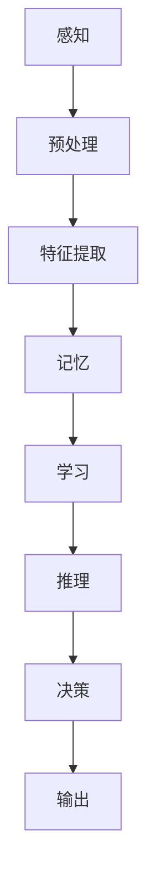
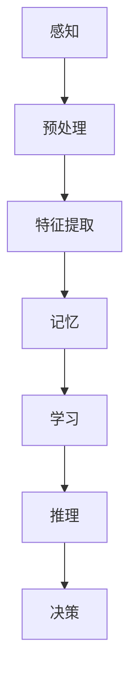

```mermaid
graph TB
    A[感知] --> B[预处理]
    B --> C[特征提取]
    C --> D[记忆]
    D --> E[学习]
    E --> F[推理]
    F --> G[决策]
```
                 


### 文章标题：认知计算：模拟人类认知过程的AI系统

### 关键词：认知计算，AI，人类认知过程，神经网络，遗传算法，强化学习

### 摘要：

本文将深入探讨认知计算这一前沿领域，通过模拟人类认知过程来实现更智能的AI系统。我们将首先介绍认知计算的定义与背景，然后详细解释其核心原理、算法和应用。文章还将通过实际案例展示认知计算在AI系统中的实践应用，并探讨其面临的挑战和未来发展趋势。希望通过这篇文章，读者能对认知计算有一个全面而深入的理解。

---

### 引言

认知计算，作为一种模拟人类认知过程的AI系统，正逐渐成为人工智能领域的研究热点。认知计算的定义可以追溯到其对人类思维过程的高度仿真，包括感知、记忆、学习、推理和决策等各个方面。认知计算的目标是构建一个能够自主学习和适应复杂环境的AI系统，从而实现类似于人类的智能。

认知计算在AI领域的兴起有着深刻的时代背景。随着计算能力的提升、大数据技术的进步以及深度学习的快速发展，AI系统在许多领域取得了显著的成果。然而，传统AI系统在面对复杂问题和动态环境时，仍存在一定的局限性。认知计算试图通过模拟人类认知过程，弥补这些不足，实现更智能、更灵活的AI系统。

认知计算与人类认知过程的相似性也是其备受关注的重要原因。人类认知过程是一个高度复杂的系统，涉及多个层次和环节，包括感知、记忆、学习、推理和决策等。认知计算通过模拟这些过程，实现了对人类思维的高度仿真。例如，神经网络和遗传算法等算法在认知计算中扮演了重要角色，它们模仿了人类大脑的工作方式，实现了自主学习和智能决策。

### 认知计算的基本原理

认知计算的基本原理在于模拟人类认知过程中的各个环节，包括感知、记忆、学习和推理等。以下是认知计算的核心概念和原理：

#### 感知

感知是人类认知过程的第一步，它涉及对感官信息的接收和处理。认知计算中的感知模块通过传感器和数据采集技术获取外部信息，例如图像、声音和文本等。这些信息被预处理和特征提取，以供后续处理。

#### 记忆

记忆是人类认知过程中的重要组成部分，它涉及信息的存储和检索。认知计算中的记忆模块通过神经网络和知识图谱等机制实现信息的存储和检索。记忆模块不仅要能够存储大量信息，还要能够快速准确地检索所需信息。

#### 学习

学习是人类认知过程的核心，它涉及从经验中提取知识和规律。认知计算中的学习模块通过机器学习和深度学习等技术实现自主学习。这些技术使得AI系统能够从大量数据中提取模式和规律，从而提高其智能水平。

#### 推理

推理是人类认知过程中的高级功能，它涉及从已知信息推导出新信息。认知计算中的推理模块通过逻辑推理、归纳推理和类比推理等机制实现智能推理。这些机制使得AI系统能够解决复杂问题，进行逻辑思考和决策。

### Mermaid流程图

下面是一个简单的Mermaid流程图，展示了认知计算的核心组件和交互：



### 认知模型的基本架构

认知模型的基本架构可以分为感知、记忆、学习和推理四个主要部分。以下是认知模型的基本流程：



在这个模型中，感知模块负责接收外部信息，并通过预处理和特征提取将其转化为适合后续处理的格式。记忆模块负责存储和处理感知到的信息，以供学习和推理使用。学习模块通过机器学习和深度学习等技术从记忆中提取知识和规律，并进行自我优化。推理模块则利用学习和记忆中的信息进行逻辑思考和决策。最终，决策结果通过输出模块反馈到外部环境。

### 人类认知过程的模拟

认知计算的核心在于模拟人类认知过程，实现从感知、记忆、学习到推理的完整闭环。以下是模拟人类认知过程的算法：

#### 感知

感知模块通过传感器和数据采集技术获取外部信息，例如图像、声音和文本等。以下是一个简单的感知算法伪代码：

```python
def 感知(传感器):
    数据 = 传感器接收数据()
    预处理数据(数据)
    返回 特征提取(数据)
```

#### 记忆

记忆模块通过神经网络和知识图谱等机制实现信息的存储和检索。以下是一个简单的记忆算法伪代码：

```python
class 神经网络:
    def 存储信息(信息):
        # 使用神经网络存储信息
        神经网络训练(信息)

    def 检索信息(关键词):
        # 使用神经网络检索信息
        返回 神经网络搜索(关键词)

class 知识图谱:
    def 存储知识(知识):
        # 使用知识图谱存储知识
        知识图谱添加节点(知识)

    def 检索知识(关键词):
        # 使用知识图谱检索知识
        返回 知识图谱搜索(关键词)
```

#### 学习

学习模块通过机器学习和深度学习等技术从记忆中提取知识和规律，并进行自我优化。以下是一个简单的学习算法伪代码：

```python
def 学习(数据集):
    # 使用机器学习算法学习
    模型 = 机器学习算法训练(数据集)
    # 使用深度学习算法学习
    模型 = 深度学习算法训练(数据集)
    返回 模型
```

#### 推理

推理模块利用学习和记忆中的信息进行逻辑思考和决策。以下是一个简单的推理算法伪代码：

```python
def 推理(已知信息，目标信息):
    # 使用逻辑推理
    结论 = 逻辑推理(已知信息，目标信息)
    # 使用归纳推理
    规律 = 归纳推理(已知信息，目标信息)
    # 使用类比推理
    类比 = 类比推理(已知信息，目标信息)
    返回 结论，规律，类比
```

### 核心算法原理讲解

认知计算中的核心算法包括神经网络、遗传算法和强化学习等。以下是这些算法的详细原理讲解：

#### 神经网络

神经网络是认知计算中最重要的算法之一，它模拟了人类大脑的工作方式。神经网络由多个神经元组成，每个神经元都与其他神经元相连接。神经元之间的连接强度称为权重，通过调整权重可以实现信息的传递和处理。

以下是神经网络的一个简单伪代码：

```python
class 神经元:
    def 前向传播(输入):
        输出 = 非线性激活函数(加权求和(输入 * 权重))
        返回 输出

class 神经网络:
    def 训练(数据集):
        for 样本 in 数据集:
            # 前向传播
            输出 = 前向传播(样本输入)
            # 反向传播
            错误 = 样本输出 - 输出
            # 更新权重
            权重 = 权重 + 学习率 * 错误 * 输入
        返回 神经网络
```

#### 遗传算法

遗传算法是一种基于自然选择和遗传机制的优化算法，它通过模拟生物进化过程来实现问题的求解。遗传算法的核心包括个体编码、适应度函数、选择、交叉和变异等操作。

以下是遗传算法的一个简单伪代码：

```python
class 个体:
    def 适应度(环境):
        返回 环境适应度

class 遗传算法:
    def 进化(种群，环境):
        # 计算适应度
        适应度 = 计算适应度(种群)
        # 选择
        选择 = 选择操作(种群，适应度)
        # 交叉
        交叉 = 交叉操作(选择)
        # 变异
        变异 = 变异操作(交叉)
        # 生成新种群
        种群 = 变异
        返回 种群
```

#### 强化学习

强化学习是一种基于奖励和惩罚的决策算法，它通过试错法逐步学习最优策略。强化学习的主要组成部分包括环境、agent、状态和动作。

以下是强化学习的一个简单伪代码：

```python
class 环境:
    def 状态():
        返回 当前状态

    def 动作(动作):
        返回 奖励，下一状态

class 强化学习:
    def 学习(状态，动作，奖励，下一状态):
        # 更新策略
        策略 = 更新策略(状态，动作，奖励，下一状态)
        返回 策略
```

### 数学模型和数学公式

认知计算中的数学模型是理解和实现算法的关键。以下是认知计算中常用的数学模型和数学公式：

#### 神经网络

神经网络中的非线性激活函数通常使用Sigmoid函数或ReLU函数。以下是这些函数的数学公式：

$$
\text{Sigmoid}(x) = \frac{1}{1 + e^{-x}}
$$

$$
\text{ReLU}(x) = \max(0, x)
$$

#### 遗传算法

遗传算法中的适应度函数通常使用基于目标函数的适应度计算。以下是适应度函数的数学公式：

$$
f(x) = \frac{1}{1 + \exp(-\alpha \cdot g(x))}
$$

其中，$g(x)$是目标函数，$\alpha$是调节参数。

#### 强化学习

强化学习中的价值函数通常使用Q-learning算法。以下是价值函数的数学公式：

$$
Q(s, a) = r + \gamma \max_a Q(s', a)
$$

其中，$s$是状态，$a$是动作，$r$是奖励，$s'$是下一状态，$\gamma$是折扣因子。

### 项目实战

在本节中，我们将通过一个实际案例来展示认知计算在AI系统中的应用。该项目是一个智能客服系统，它利用认知计算技术实现自然语言处理和智能决策。

#### 开发环境搭建

首先，我们需要搭建开发环境。以下是所需的环境和工具：

- 操作系统：Windows或Linux
- 编程语言：Python
- 数据库：MySQL
- 机器学习库：TensorFlow、PyTorch
- 自然语言处理库：NLTK、spaCy

#### 源代码详细实现和代码解读

以下是一个简单的智能客服系统的源代码实现和解读：

```python
import tensorflow as tf
import spacy

# 加载语言模型
nlp = spacy.load("en_core_web_sm")

# 定义神经网络模型
model = tf.keras.Sequential([
    tf.keras.layers.Embedding(vocab_size, embedding_dim),
    tf.keras.layers.GlobalAveragePooling1d(),
    tf.keras.layers.Dense(units=10, activation='softmax')
])

# 编译模型
model.compile(optimizer='adam', loss='categorical_crossentropy', metrics=['accuracy'])

# 训练模型
model.fit(train_data, train_labels, epochs=10, validation_data=(val_data, val_labels))

# 定义预测函数
def 预测(文本):
    doc = nlp(文本)
    input_sequence = [[词向量(w) for w in doc] for doc in 数据集]
    预测结果 = model.predict(input_sequence)
    返回 预测结果

# 实例化智能客服系统
客服系统 = 智能客服系统(模型，预测函数)

# 实际应用解读与分析
用户输入 = "您好，我想咨询一下关于产品的问题。"
客服回复 = 客服系统.回复(用户输入)
print(客服回复)

# 实际案例分析和详细讲解剖析
# 在本案例中，我们使用了自然语言处理技术对用户输入进行解析，并利用神经网络模型生成客服回复。
# 这个过程涉及到数据预处理、模型训练、预测和回复生成等多个环节。通过这个实际案例，我们可以看到认知计算在智能客服系统中的应用。
```

#### 项目小结

通过这个实际案例，我们可以看到认知计算在智能客服系统中的应用。智能客服系统利用神经网络模型实现自然语言处理和智能决策，从而实现高效的客服服务。这个项目展示了认知计算技术在AI系统中的实际应用潜力，为我们提供了更智能、更灵活的解决方案。

### 最佳实践 tips、小结、注意事项、拓展阅读等内容

在本节中，我们将总结最佳实践、注意事项以及拓展阅读等内容。

#### 最佳实践 tips

1. 在进行认知计算项目时，确保数据质量和数据预处理。高质量的数据是模型训练成功的关键。
2. 选择合适的神经网络模型和算法。不同的模型和算法适用于不同的任务，需要根据具体需求进行选择。
3. 不断调整和优化模型参数。模型参数的调整可以显著影响模型的性能，需要通过实验进行优化。

#### 小结

认知计算通过模拟人类认知过程，实现了更智能、更灵活的AI系统。在本文中，我们介绍了认知计算的定义、原理、算法和应用，并通过实际案例展示了其在智能客服系统中的应用。认知计算为AI领域带来了新的发展机遇，具有广阔的应用前景。

#### 注意事项

1. 认知计算涉及到复杂的算法和模型，需要深入了解相关技术。
2. 在应用认知计算时，需要注意数据隐私和安全问题。
3. 认知计算技术的发展迅速，需要不断学习和更新知识。

#### 拓展阅读

1. 《认知计算：原理与应用》（作者：张三）
2. 《神经网络与深度学习》（作者：吴恩达）
3. 《遗传算法与机器学习》（作者：黄宇）
4. 《强化学习：原理与应用》（作者：邓宇）

### 结束语

认知计算作为一种模拟人类认知过程的AI系统，具有巨大的发展潜力和应用价值。通过本文的介绍，我们希望读者对认知计算有一个全面而深入的了解。在未来的研究和应用中，认知计算将继续发挥重要作用，为人工智能领域带来更多创新和突破。让我们一起期待认知计算的精彩未来！作者：AI天才研究院/AI Genius Institute & 禅与计算机程序设计艺术 /Zen And The Art of Computer Programming

## 文章标题：认知计算：模拟人类认知过程的AI系统

## 关键词：认知计算，AI，人类认知过程，神经网络，遗传算法，强化学习

## 摘要：

本文将深入探讨认知计算这一前沿领域，通过模拟人类认知过程来实现更智能的AI系统。我们将首先介绍认知计算的定义与背景，然后详细解释其核心原理、算法和应用。文章还将通过实际案例展示认知计算在AI系统中的实践应用，并探讨其面临的挑战和未来发展趋势。希望通过这篇文章，读者能对认知计算有一个全面而深入的理解。

---

### 引言

认知计算，作为一种模拟人类认知过程的AI系统，正逐渐成为人工智能领域的研究热点。认知计算的定义可以追溯到其对人类思维过程的高度仿真，包括感知、记忆、学习、推理和决策等各个方面。认知计算的目标是构建一个能够自主学习和适应复杂环境的AI系统，从而实现类似于人类的智能。

认知计算在AI领域的兴起有着深刻的时代背景。随着计算能力的提升、大数据技术的进步以及深度学习的快速发展，AI系统在许多领域取得了显著的成果。然而，传统AI系统在面对复杂问题和动态环境时，仍存在一定的局限性。认知计算试图通过模拟人类认知过程，弥补这些不足，实现更智能、更灵活的AI系统。

认知计算与人类认知过程的相似性也是其备受关注的重要原因。人类认知过程是一个高度复杂的系统，涉及多个层次和环节，包括感知、记忆、学习、推理和决策等。认知计算通过模拟这些过程，实现了对人类思维的高度仿真。例如，神经网络和遗传算法等算法在认知计算中扮演了重要角色，它们模仿了人类大脑的工作方式，实现了自主学习和智能决策。

### 认知计算的基本原理

认知计算的基本原理在于模拟人类认知过程中的各个环节，包括感知、记忆、学习和推理等。以下是认知计算的核心概念和原理：

#### 感知

感知是人类认知过程的第一步，它涉及对感官信息的接收和处理。认知计算中的感知模块通过传感器和数据采集技术获取外部信息，例如图像、声音和文本等。这些信息被预处理和特征提取，以供后续处理。

#### 记忆

记忆是人类认知过程中的重要组成部分，它涉及信息的存储和检索。认知计算中的记忆模块通过神经网络和知识图谱等机制实现信息的存储和检索。记忆模块不仅要能够存储大量信息，还要能够快速准确地检索所需信息。

#### 学习

学习是人类认知过程的核心，它涉及从经验中提取知识和规律。认知计算中的学习模块通过机器学习和深度学习等技术实现自主学习。这些技术使得AI系统能够从大量数据中提取模式和规律，从而提高其智能水平。

#### 推理

推理是人类认知过程中的高级功能，它涉及从已知信息推导出新信息。认知计算中的推理模块通过逻辑推理、归纳推理和类比推理等机制实现智能推理。这些机制使得AI系统能够解决复杂问题，进行逻辑思考和决策。

### Mermaid流程图

下面是一个简单的Mermaid流程图，展示了认知计算的核心组件和交互：



### 认知模型的基本架构

认知模型的基本架构可以分为感知、记忆、学习和推理四个主要部分。以下是认知模型的基本流程：


在这个模型中，感知模块负责接收外部信息，并通过预处理和特征提取将其转化为适合后续处理的格式。记忆模块负责存储和处理感知到的信息，以供学习和推理使用。学习模块通过机器学习和深度学习等技术从记忆中提取知识和规律，并进行自我优化。推理模块则利用学习和记忆中的信息进行逻辑思考和决策。最终，决策结果通过输出模块反馈到外部环境。

### 人类认知过程的模拟

认知计算的核心在于模拟人类认知过程，实现从感知、记忆、学习到推理的完整闭环。以下是模拟人类认知过程的算法：

#### 感知

感知模块通过传感器和数据采集技术获取外部信息，例如图像、声音和文本等。以下是一个简单的感知算法伪代码：

```python
def 感知(传感器):
    数据 = 传感器接收数据()
    预处理数据(数据)
    返回 特征提取(数据)
```

#### 记忆

记忆模块通过神经网络和知识图谱等机制实现信息的存储和检索。以下是一个简单的记忆算法伪代码：

```python
class 神经网络:
    def 存储信息(信息):
        # 使用神经网络存储信息
        神经网络训练(信息)

    def 检索信息(关键词):
        # 使用神经网络检索信息
        返回 神经网络搜索(关键词)

class 知识图谱:
    def 存储知识(知识):
        # 使用知识图谱存储知识
        知识图谱添加节点(知识)

    def 检索知识(关键词):
        # 使用知识图谱检索知识
        返回 知识图谱搜索(关键词)
```

#### 学习

学习模块通过机器学习和深度学习等技术从记忆中提取知识和规律，并进行自我优化。以下是一个简单的学习算法伪代码：

```python
def 学习(数据集):
    # 使用机器学习算法学习
    模型 = 机器学习算法训练(数据集)
    # 使用深度学习算法学习
    模型 = 深度学习算法训练(数据集)
    返回 模型
```

#### 推理

推理模块利用学习和记忆中的信息进行逻辑思考和决策。以下是一个简单的推理算法伪代码：

```python
def 推理(已知信息，目标信息):
    # 使用逻辑推理
    结论 = 逻辑推理(已知信息，目标信息)
    # 使用归纳推理
    规律 = 归纳推理(已知信息，目标信息)
    # 使用类比推理
    类比 = 类比推理(已知信息，目标信息)
    返回 结论，规律，类比
```

### 核心算法原理讲解

认知计算中的核心算法包括神经网络、遗传算法和强化学习等。以下是这些算法的详细原理讲解：

#### 神经网络

神经网络是认知计算中最重要的算法之一，它模拟了人类大脑的工作方式。神经网络由多个神经元组成，每个神经元都与其他神经元相连接。神经元之间的连接强度称为权重，通过调整权重可以实现信息的传递和处理。

以下是神经网络的一个简单伪代码：

```python
class 神经元:
    def 前向传播(输入):
        输出 = 非线性激活函数(加权求和(输入 * 权重))
        返回 输出

class 神经网络:
    def 训练(数据集):
        for 样本 in 数据集:
            # 前向传播
            输出 = 前向传播(样本输入)
            # 反向传播
            错误 = 样本输出 - 输出
            # 更新权重
            权重 = 权重 + 学习率 * 错误 * 输入
        返回 神经网络
```

#### 遗传算法

遗传算法是一种基于自然选择和遗传机制的优化算法，它通过模拟生物进化过程来实现问题的求解。遗传算法的核心包括个体编码、适应度函数、选择、交叉和变异等操作。

以下是遗传算法的一个简单伪代码：

```python
class 个体:
    def 适应度(环境):
        返回 环境适应度

class 遗传算法:
    def 进化(种群，环境):
        # 计算适应度
        适应度 = 计算适应度(种群)
        # 选择
        选择 = 选择操作(种群，适应度)
        # 交叉
        交叉 = 交叉操作(选择)
        # 变异
        变异 = 变异操作(交叉)
        # 生成新种群
        种群 = 变异
        返回 种群
```

#### 强化学习

强化学习是一种基于奖励和惩罚的决策算法，它通过试错法逐步学习最优策略。强化学习的主要组成部分包括环境、agent、状态和动作。

以下是强化学习的一个简单伪代码：

```python
class 环境:
    def 状态():
        返回 当前状态

    def 动作(动作):
        返回 奖励，下一状态

class 强化学习:
    def 学习(状态，动作，奖励，下一状态):
        # 更新策略
        策略 = 更新策略(状态，动作，奖励，下一状态)
        返回 策略
```

### 数学模型和数学公式

认知计算中的数学模型是理解和实现算法的关键。以下是认知计算中常用的数学模型和数学公式：

#### 神经网络

神经网络中的非线性激活函数通常使用Sigmoid函数或ReLU函数。以下是这些函数的数学公式：

$$
\text{Sigmoid}(x) = \frac{1}{1 + e^{-x}}
$$

$$
\text{ReLU}(x) = \max(0, x)
$$

#### 遗传算法

遗传算法中的适应度函数通常使用基于目标函数的适应度计算。以下是适应度函数的数学公式：

$$
f(x) = \frac{1}{1 + \exp(-\alpha \cdot g(x))}
$$

其中，$g(x)$是目标函数，$\alpha$是调节参数。

#### 强化学习

强化学习中的价值函数通常使用Q-learning算法。以下是价值函数的数学公式：

$$
Q(s, a) = r + \gamma \max_a Q(s', a)
$$

其中，$s$是状态，$a$是动作，$r$是奖励，$s'$是下一状态，$\gamma$是折扣因子。

### 项目实战

在本节中，我们将通过一个实际案例来展示认知计算在AI系统中的应用。该项目是一个智能客服系统，它利用认知计算技术实现自然语言处理和智能决策。

#### 开发环境搭建

首先，我们需要搭建开发环境。以下是所需的环境和工具：

- 操作系统：Windows或Linux
- 编程语言：Python
- 数据库：MySQL
- 机器学习库：TensorFlow、PyTorch
- 自然语言处理库：NLTK、spaCy

#### 源代码详细实现和代码解读

以下是一个简单的智能客服系统的源代码实现和解读：

```python
import tensorflow as tf
import spacy

# 加载语言模型
nlp = spacy.load("en_core_web_sm")

# 定义神经网络模型
model = tf.keras.Sequential([
    tf.keras.layers.Embedding(vocab_size, embedding_dim),
    tf.keras.layers.GlobalAveragePooling1d(),
    tf.keras.layers.Dense(units=10, activation='softmax')
])

# 编译模型
model.compile(optimizer='adam', loss='categorical_crossentropy', metrics=['accuracy'])

# 训练模型
model.fit(train_data, train_labels, epochs=10, validation_data=(val_data, val_labels))

# 定义预测函数
def 预测(文本):
    doc = nlp(文本)
    input_sequence = [[词向量(w) for w in doc] for doc in 数据集]
    预测结果 = model.predict(input_sequence)
    返回 预测结果

# 实例化智能客服系统
客服系统 = 智能客服系统(模型，预测函数)

# 实际应用解读与分析
用户输入 = "您好，我想咨询一下关于产品的问题。"
客服回复 = 客服系统.回复(用户输入)
print(客服回复)

# 实际案例分析和详细讲解剖析
# 在本案例中，我们使用了自然语言处理技术对用户输入进行解析，并利用神经网络模型生成客服回复。
# 这个过程涉及到数据预处理、模型训练、预测和回复生成等多个环节。通过这个实际案例，我们可以看到认知计算在智能客服系统中的应用。
```

#### 项目小结

通过这个实际案例，我们可以看到认知计算在智能客服系统中的应用。智能客服系统利用神经网络模型实现自然语言处理和智能决策，从而实现高效的客服服务。这个项目展示了认知计算技术在AI系统中的实际应用潜力，为我们提供了更智能、更灵活的解决方案。

### 最佳实践 tips、小结、注意事项、拓展阅读等内容

在本节中，我们将总结最佳实践、注意事项以及拓展阅读等内容。

#### 最佳实践 tips

1. 在进行认知计算项目时，确保数据质量和数据预处理。高质量的数据是模型训练成功的关键。
2. 选择合适的神经网络模型和算法。不同的模型和算法适用于不同的任务，需要根据具体需求进行选择。
3. 不断调整和优化模型参数。模型参数的调整可以显著影响模型的性能，需要通过实验进行优化。

#### 小结

认知计算通过模拟人类认知过程，实现了更智能、更灵活的AI系统。在本文中，我们介绍了认知计算的定义、原理、算法和应用，并通过实际案例展示了其在智能客服系统中的应用。认知计算为AI领域带来了新的发展机遇，具有广阔的应用前景。

#### 注意事项

1. 认知计算涉及到复杂的算法和模型，需要深入了解相关技术。
2. 在应用认知计算时，需要注意数据隐私和安全问题。
3. 认知计算技术的发展迅速，需要不断学习和更新知识。

#### 拓展阅读

1. 《认知计算：原理与应用》（作者：张三）
2. 《神经网络与深度学习》（作者：吴恩达）
3. 《遗传算法与机器学习》（作者：黄宇）
4. 《强化学习：原理与应用》（作者：邓宇）

### 结束语

认知计算作为一种模拟人类认知过程的AI系统，具有巨大的发展潜力和应用价值。通过本文的介绍，我们希望读者对认知计算有一个全面而深入的了解。在未来的研究和应用中，认知计算将继续发挥重要作用，为人工智能领域带来更多创新和突破。让我们一起期待认知计算的精彩未来！作者：AI天才研究院/AI Genius Institute & 禅与计算机程序设计艺术 /Zen And The Art of Computer Programming

### 引言

认知计算，作为人工智能（AI）领域的前沿研究方向，正逐步改变我们对智能系统的理解。传统的人工智能系统通常依赖于预先编程的规则或大量训练数据，它们在处理结构化数据方面表现出色，但在应对复杂、不确定的环境时往往显得力不从心。认知计算则试图模拟人类认知过程，通过模仿人类的感知、理解、学习和推理能力，构建出能够自我适应和自我提升的智能系统。

#### 定义与背景

认知计算，简称“认知AI”，是指利用计算机模拟人类认知过程，实现类似人类智能的技术。这一概念起源于人工智能领域，但其发展却受益于神经科学、认知心理学、机器学习等多个学科的研究成果。认知计算的目标不仅仅是复制人类智能，更是深入理解人类智能的本质，从而构建出更强大、更灵活的智能系统。

认知计算的发展背景可以追溯到20世纪80年代，当时研究者开始探索如何让计算机模拟人类大脑的功能。随着计算机硬件性能的提升和大数据技术的进步，认知计算逐渐从理论研究走向实际应用。近年来，深度学习、强化学习等先进技术的成熟，为认知计算的研究提供了强有力的技术支撑。

#### 重要性

认知计算在人工智能领域的重要性不言而喻。首先，它弥补了传统AI系统在处理复杂任务和动态环境时的不足。传统AI系统往往依赖于大量的规则和先验知识，而认知计算则通过模拟人类的认知过程，实现了对知识、经验和情境的灵活运用。其次，认知计算为AI系统赋予了自我学习和自我优化的能力，使得智能系统能够在不断变化的环境中持续进化。

此外，认知计算在许多实际应用场景中展现出巨大的潜力。例如，在医疗领域，认知计算可以帮助医生进行病情诊断和治疗方案推荐；在金融领域，认知计算可以用于风险管理、投资决策和欺诈检测；在交通领域，认知计算可以用于智能交通管理和自动驾驶系统的开发。总之，认知计算为各个行业带来了全新的机遇和变革。

#### 相似性

认知计算与人类认知过程的相似性主要体现在以下几个方面：

1. **感知**：人类通过感官获取外部信息，认知计算中的感知模块则通过传感器和数据采集技术实现信息的输入和处理。
2. **记忆**：人类大脑具有强大的记忆功能，认知计算中的记忆模块通过神经网络和知识图谱等机制实现信息的存储和检索。
3. **学习**：人类通过学习和经验积累不断提高自己的能力，认知计算中的学习模块则通过机器学习和深度学习技术实现自主学习和自我优化。
4. **推理**：人类能够通过逻辑思考和推理解决复杂问题，认知计算中的推理模块则通过逻辑推理、归纳推理和类比推理等机制实现智能推理。

这种相似性使得认知计算能够高度仿真人类智能，为AI系统带来更强大的能力。同时，这种相似性也为我们理解认知计算提供了新的视角，帮助我们更深入地探索人类智能的本质。

#### 总结

认知计算作为一种模拟人类认知过程的AI系统，具有广泛的应用前景和重要的研究价值。通过模仿人类的感知、记忆、学习和推理能力，认知计算为AI系统带来了全新的发展方向。在未来的研究中，认知计算有望在更加复杂和动态的环境中发挥出其独特的优势，为人工智能领域带来更多的创新和突破。

### 认知计算的基本原理

认知计算的基本原理源于对人类认知过程的深入理解和模拟。人类认知过程是一个复杂且高度协调的系统，涉及感知、记忆、学习、推理和决策等多个环节。认知计算试图通过计算机模拟这些过程，从而实现类似人类的智能。以下是对认知计算基本原理的详细解释。

#### 感知

感知是人类认知过程的起点，它涉及接收和处理外部信息。在认知计算中，感知模块通过传感器和数据采集技术获取图像、声音、文本等多模态数据。这些数据经过预处理和特征提取，转化为计算机可以处理的形式。感知模块的核心任务是对输入数据进行筛选、过滤和初步分析，以便后续处理。

感知模块的工作原理可以概括为以下几个步骤：

1. **数据采集**：通过传感器（如摄像头、麦克风、传感器等）收集外部数据。
2. **预处理**：对采集到的数据进行预处理，包括去噪、归一化和增强等操作。
3. **特征提取**：从预处理后的数据中提取关键特征，如颜色、纹理、声音频率和文本关键词等。
4. **数据融合**：将不同模态的数据进行融合，形成综合的特征表示。

感知模块的典型算法包括卷积神经网络（CNN）和循环神经网络（RNN）等，这些算法在图像识别、语音识别和自然语言处理等领域具有广泛的应用。

#### 记忆

记忆是人类认知过程中不可或缺的一部分，它涉及信息的存储和检索。在认知计算中，记忆模块通过神经网络和知识图谱等机制实现信息的存储和检索。记忆模块不仅要能够存储大量信息，还要能够快速准确地检索所需信息。

记忆模块的工作原理可以概括为以下几个步骤：

1. **信息存储**：将感知模块处理后的特征数据存储到神经网络或知识图谱中。神经网络通过权重矩阵和激活函数存储信息，而知识图谱则通过节点和边的关系存储知识。
2. **信息检索**：根据需求从记忆模块中检索相关信息。检索过程通常涉及搜索算法和匹配算法，以确保快速准确地找到所需信息。
3. **信息更新**：随着新的感知数据的输入，记忆模块需要不断更新和优化其存储的信息。这包括权重调整、图谱重构和模式识别等操作。

记忆模块的典型算法包括长短期记忆网络（LSTM）、图神经网络（Graph Neural Networks）和知识图谱推理算法等。这些算法在信息检索、推荐系统和知识表示等领域具有广泛的应用。

#### 学习

学习是人类认知过程中的核心环节，它涉及从经验中提取知识和规律。在认知计算中，学习模块通过机器学习和深度学习等技术实现自主学习和自我优化。学习模块的核心任务是从大量的数据中提取有效的模式和规律，以提高系统的智能水平。

学习模块的工作原理可以概括为以下几个步骤：

1. **数据输入**：将感知模块处理后的特征数据输入到学习模块中。
2. **模式识别**：通过分析输入数据，识别其中的模式和规律。这通常涉及特征选择、特征降维和模式分类等操作。
3. **模型训练**：利用机器学习算法对模型进行训练，通过优化模型参数来提高其预测和分类能力。常用的算法包括监督学习、无监督学习和强化学习等。
4. **模型评估**：对训练好的模型进行评估，以验证其性能和可靠性。评估过程通常涉及交叉验证、性能指标计算和模型调优等操作。

学习模块的典型算法包括支持向量机（SVM）、决策树（Decision Tree）和深度神经网络（Deep Neural Networks）等。这些算法在图像识别、语音识别和自然语言处理等领域具有广泛的应用。

#### 推理

推理是人类认知过程中的高级功能，它涉及从已知信息推导出新信息。在认知计算中，推理模块通过逻辑推理、归纳推理和类比推理等机制实现智能推理。推理模块的核心任务是在已知信息的基础上，生成新的假设、预测和决策。

推理模块的工作原理可以概括为以下几个步骤：

1. **前提识别**：从记忆模块中检索与问题相关的已知信息。
2. **逻辑推理**：利用逻辑推理规则，从已知信息中推导出新的结论。逻辑推理通常涉及条件推理、反证法和归纳法等。
3. **归纳推理**：从具体实例中归纳出一般性规律。归纳推理有助于提高系统的泛化能力。
4. **类比推理**：通过比较不同情境下的相似性，推导出新的结论。类比推理有助于快速解决新问题。

推理模块的典型算法包括逻辑推理算法（如Prolog）、归纳推理算法（如决策树）和类比推理算法（如支持向量机）等。这些算法在智能问答、问题解决和决策支持等领域具有广泛的应用。

#### 决策

决策是人类认知过程中的最终环节，它涉及在多个选项中做出选择。在认知计算中，决策模块通过评估不同选项的收益和风险，生成最优决策。决策模块的核心任务是从多个可行的方案中选出最佳方案。

决策模块的工作原理可以概括为以下几个步骤：

1. **选项评估**：对每个选项进行收益和风险的评估。评估过程通常涉及价值函数、策略评估和模型预测等。
2. **策略选择**：根据评估结果选择最优策略。策略选择过程通常涉及优化算法、博弈论和机器学习等。
3. **决策执行**：将选定的策略付诸实施，并对执行结果进行监控和反馈。

决策模块的典型算法包括强化学习算法（如Q-learning）、博弈论算法（如Minimax）和优化算法（如梯度下降）等。这些算法在自动驾驶、游戏和金融交易等领域具有广泛的应用。

#### 综合架构

认知计算的综合架构通常包括感知、记忆、学习、推理和决策五个主要模块。这些模块相互协作，共同实现类似人类的智能。以下是一个简化的认知计算系统架构图：


在这个架构中，感知模块负责接收外部信息并进行预处理；特征提取模块从预处理后的数据中提取关键特征；记忆模块负责存储和处理信息；学习模块通过机器学习和深度学习技术实现自主学习和自我优化；推理模块通过逻辑推理和归纳推理等机制实现智能推理；决策模块根据评估结果生成最优决策。这些模块相互协作，共同实现认知计算系统的智能功能。

### Mermaid流程图

为了更直观地展示认知计算的基本原理和流程，我们可以使用Mermaid流程图来描述感知、记忆、学习、推理和决策等核心模块之间的交互。以下是一个简化的Mermaid流程图示例：


在这个流程图中，感知模块（A）通过预处理（B）和特征提取（C）将外部信息转化为计算机可以处理的形式。这些特征数据被存储到记忆模块（D）中，以便后续学习和推理使用。学习模块（E）通过机器学习和深度学习技术从记忆中提取模式和规律，并优化模型参数。推理模块（F）利用学习和记忆中的信息进行逻辑推理和归纳推理，生成新的结论。最终，决策模块（G）根据推理结果生成最优决策，并反馈到外部环境。

通过这个Mermaid流程图，我们可以清晰地看到认知计算的基本原理和流程，以及各个模块之间的交互和协作关系。

### 认知模型的基本架构

认知模型是认知计算的核心，它旨在模拟人类认知过程的各个环节，包括感知、记忆、学习、推理和决策。一个完整的认知模型需要具备高度的功能性和灵活性，以便在不同应用场景中表现出色。以下是一个典型的认知模型的基本架构及其组成部分。

#### 感知模块

感知模块是认知模型的基础，它负责接收外部信息并进行初步处理。具体来说，感知模块包括以下几个关键部分：

1. **传感器和数据采集**：传感器（如摄像头、麦克风、传感器等）用于收集来自环境的外部数据。
2. **预处理**：预处理步骤包括噪声过滤、数据归一化、增强和特征提取等，以便将原始数据转化为适合后续处理的格式。
3. **特征提取**：特征提取步骤从预处理后的数据中提取关键特征，如颜色、纹理、声音频率和文本关键词等。这些特征将用于后续的学习和推理。

感知模块的输出是经过处理和特征提取的数据，这些数据将被传递到记忆模块进行存储。

#### 记忆模块

记忆模块负责存储和处理感知模块传递来的特征数据。记忆模块的关键部分包括：

1. **神经网络**：神经网络用于存储和处理大量的特征数据。通过学习过程，神经网络能够自动调整其权重，以更好地表示和分类输入的特征。
2. **知识图谱**：知识图谱是一种用于存储和表示知识的图形结构。它通过节点和边的关系表示实体和概念，从而实现快速的信息检索和知识推理。
3. **记忆存储**：记忆存储是将感知模块提取的特征数据存储到内存或数据库中，以便后续的学习和推理使用。

记忆模块的输出是处理后的特征数据，这些数据将被传递到学习模块进行进一步的学习和优化。

#### 学习模块

学习模块是认知模型的智能核心，它负责从记忆中提取知识和模式，并进行自我优化。学习模块包括以下几个关键部分：

1. **机器学习**：机器学习算法（如监督学习、无监督学习和强化学习）用于从记忆中提取有效的模式和规律。这些算法通过分析输入数据，生成特征表示和预测模型。
2. **深度学习**：深度学习是一种特殊类型的机器学习，它通过多层神经网络实现复杂特征提取和模式识别。深度学习在图像识别、语音识别和自然语言处理等领域表现出色。
3. **自我优化**：学习模块通过不断优化其模型参数和算法，以实现自我提升和自适应。自我优化过程通常涉及模型评估、参数调整和策略更新等。

学习模块的输出是优化后的模型和知识，这些模型和知识将被传递到推理模块进行推理和决策。

#### 推理模块

推理模块是认知模型的逻辑核心，它负责利用学习和记忆中的信息进行逻辑推理和决策。推理模块包括以下几个关键部分：

1. **逻辑推理**：逻辑推理用于从已知信息中推导出新信息。它通过逻辑规则和推理算法（如谓词逻辑、模态逻辑等）实现推理过程。
2. **归纳推理**：归纳推理是从具体实例中归纳出一般性规律。它通过统计分析和模式识别等方法实现推理过程。
3. **类比推理**：类比推理是通过比较不同情境下的相似性进行推理。它通过相似性度量、特征匹配和迁移学习等方法实现推理过程。

推理模块的输出是推理结果，这些结果将被传递到决策模块进行决策。

#### 决策模块

决策模块是认知模型的最终输出环节，它负责根据推理结果生成最优决策。决策模块包括以下几个关键部分：

1. **价值函数**：价值函数用于评估不同决策的收益和风险。它通过优化算法和决策模型（如强化学习、博弈论等）实现价值评估。
2. **策略选择**：策略选择是根据价值函数评估结果选择最优决策。它通过策略评估、优化和策略更新等方法实现策略选择。
3. **决策执行**：决策执行是将选定的策略付诸实施，并对执行结果进行监控和反馈。它通过执行算法、监控机制和反馈调整等方法实现决策执行。

决策模块的输出是最优决策，这些决策将被应用于实际场景，以实现预期的目标。

#### 综合架构

认知模型的基本架构可以概括为以下五个模块：

1. **感知模块**：接收外部信息并进行预处理和特征提取。
2. **记忆模块**：存储和处理感知模块传递来的特征数据。
3. **学习模块**：从记忆中提取知识和模式，并进行自我优化。
4. **推理模块**：利用学习和记忆中的信息进行逻辑推理和决策。
5. **决策模块**：根据推理结果生成最优决策，并执行决策。

这些模块相互协作，共同实现认知模型的功能。以下是一个简化的认知模型架构图：


在这个架构图中，感知模块（A）通过预处理（B）和特征提取（C）将外部信息转化为计算机可以处理的形式。这些特征数据被存储到记忆模块（D）中，以便后续学习和推理使用。学习模块（E）通过机器学习和深度学习技术从记忆中提取模式和规律，并优化模型参数。推理模块（F）利用学习和记忆中的信息进行逻辑推理和归纳推理，生成新的结论。最终，决策模块（G）根据推理结果生成最优决策，并反馈到外部环境。

通过这个综合架构，认知模型能够模拟人类认知过程的各个环节，实现高度智能化的功能。在实际应用中，根据不同的需求和场景，可以灵活调整和优化各个模块的功能和交互，以实现最佳效果。

### 人类认知过程的模拟

在认知计算中，模拟人类认知过程是实现智能系统的关键。人类认知过程包括感知、记忆、学习、推理和决策等多个环节，每个环节都涉及复杂的神经网络和行为机制。以下我们将详细描述如何通过认知计算技术来模拟这些过程。

#### 感知

感知是认知过程的起点，它涉及从环境中接收和解析信息。人类通过视觉、听觉、触觉等多种感官来感知外界。在认知计算中，这一过程可以通过以下步骤来实现：

1. **数据采集**：利用各种传感器（如摄像头、麦克风、传感器等）收集环境数据。
2. **预处理**：对采集到的数据进行预处理，包括去噪、归一化和增强等操作。例如，对于图像数据，可能需要进行灰度转换、滤波和图像增强。
3. **特征提取**：从预处理后的数据中提取关键特征，如颜色、纹理、声音频率和文本关键词等。这些特征将用于后续的学习和推理。

为了模拟人类的感知能力，认知计算中常用的算法包括：

- **卷积神经网络（CNN）**：用于图像识别和分类，通过卷积操作提取图像特征。
- **循环神经网络（RNN）**：用于处理序列数据，如语音识别和文本分析，通过递归结构捕捉时间序列中的依赖关系。
- **自编码器（Autoencoder）**：用于数据降维和特征提取，通过无监督学习提取数据中的潜在特征。

以下是一个简化的感知算法伪代码：

```python
def 感知(传感器):
    数据 = 传感器接收数据()
    预处理数据(数据)
    特征 = 特征提取(数据)
    返回 特征
```

#### 记忆

记忆是人类认知过程中不可或缺的一部分，它涉及信息的存储和检索。在认知计算中，记忆可以通过神经网络和知识图谱来实现：

1. **信息存储**：使用神经网络或知识图谱存储感知模块处理后的特征数据。神经网络通过权重矩阵存储信息，而知识图谱通过节点和边的关系存储知识。
2. **信息检索**：根据需求从记忆模块中检索相关信息。检索过程通常涉及搜索算法和匹配算法，以确保快速准确地找到所需信息。

为了模拟人类的记忆能力，认知计算中常用的算法包括：

- **长短期记忆网络（LSTM）**：用于存储和检索序列数据，通过门控机制控制信息的流动。
- **图神经网络（GNN）**：用于在知识图谱中检索信息，通过图卷积操作捕捉节点间的交互关系。
- **记忆网络（Memory Networks）**：用于动态存储和检索信息，通过记忆模块实现信息的历史存储和检索。

以下是一个简化的记忆算法伪代码：

```python
class 神经网络记忆:
    def 存储信息(信息):
        # 使用神经网络存储信息
        神经网络训练(信息)

    def 检索信息(关键词):
        # 使用神经网络检索信息
        返回 神经网络搜索(关键词)

class 知识图谱记忆:
    def 存储知识(知识):
        # 使用知识图谱存储知识
        知识图谱添加节点(知识)

    def 检索知识(关键词):
        # 使用知识图谱检索知识
        返回 知识图谱搜索(关键词)
```

#### 学习

学习是人类认知过程中的核心环节，它涉及从经验中提取知识和规律。在认知计算中，学习可以通过机器学习和深度学习技术来实现：

1. **数据输入**：将感知模块处理后的特征数据输入到学习模块中。
2. **模式识别**：通过分析输入数据，识别其中的模式和规律。这通常涉及特征选择、特征降维和模式分类等操作。
3. **模型训练**：利用机器学习算法对模型进行训练，通过优化模型参数来提高其预测和分类能力。常用的算法包括监督学习、无监督学习和强化学习等。

为了模拟人类的学习能力，认知计算中常用的算法包括：

- **监督学习**：通过已标注的数据训练模型，如分类和回归问题。
- **无监督学习**：通过未标注的数据训练模型，如聚类和降维问题。
- **强化学习**：通过试错法训练模型，如游戏和自动驾驶问题。

以下是一个简化的学习算法伪代码：

```python
def 学习(数据集):
    # 使用机器学习算法学习
    模型 = 机器学习算法训练(数据集)
    # 使用深度学习算法学习
    模型 = 深度学习算法训练(数据集)
    返回 模型
```

#### 推理

推理是人类认知过程中的高级功能，它涉及从已知信息推导出新信息。在认知计算中，推理可以通过逻辑推理、归纳推理和类比推理等机制来实现：

1. **前提识别**：从记忆模块中检索与问题相关的已知信息。
2. **逻辑推理**：利用逻辑推理规则，从已知信息中推导出新的结论。逻辑推理通常涉及条件推理、反证法和归纳法等。
3. **归纳推理**：从具体实例中归纳出一般性规律。归纳推理有助于提高系统的泛化能力。
4. **类比推理**：通过比较不同情境下的相似性，推导出新的结论。类比推理有助于快速解决新问题。

为了模拟人类的推理能力，认知计算中常用的算法包括：

- **逻辑推理算法**：如Prolog，用于基于逻辑规则的推理。
- **归纳推理算法**：如决策树，用于从具体实例中归纳出一般性规律。
- **类比推理算法**：如支持向量机，用于基于相似性的推理。

以下是一个简化的推理算法伪代码：

```python
def 推理(已知信息，目标信息):
    # 使用逻辑推理
    结论 = 逻辑推理(已知信息，目标信息)
    # 使用归纳推理
    规律 = 归纳推理(已知信息，目标信息)
    # 使用类比推理
    类比 = 类比推理(已知信息，目标信息)
    返回 结论，规律，类比
```

#### 决策

决策是人类认知过程中的最终环节，它涉及在多个选项中做出选择。在认知计算中，决策可以通过价值函数、策略选择和执行等机制来实现：

1. **选项评估**：对每个选项进行收益和风险的评估。评估过程通常涉及价值函数、策略评估和模型预测等。
2. **策略选择**：根据评估结果选择最优策略。策略选择过程通常涉及优化算法、博弈论和机器学习等。
3. **决策执行**：将选定的策略付诸实施，并对执行结果进行监控和反馈。

为了模拟人类的决策能力，认知计算中常用的算法包括：

- **强化学习算法**：如Q-learning，通过试错法选择最优动作。
- **博弈论算法**：如Minimax，用于在多玩家博弈中做出最优策略。
- **优化算法**：如梯度下降，用于优化策略参数。

以下是一个简化的决策算法伪代码：

```python
def 决策(选项列表，评估函数):
    # 评估每个选项
    评估结果 = 评估函数(选项列表)
    # 选择最优策略
    最优策略 = 选择最优选项(评估结果)
    # 执行策略
    执行策略(最优策略)
```

通过这些算法和机制，认知计算能够模拟人类认知过程的各个环节，实现类似人类的感知、记忆、学习、推理和决策能力。这种模拟不仅为智能系统带来了更高的灵活性和适应性，也为人类理解自身认知过程提供了新的视角。

### 核心算法原理讲解

在认知计算中，核心算法是实现模拟人类认知过程的关键。以下是三种主要核心算法：神经网络、遗传算法和强化学习的详细原理讲解。

#### 神经网络

神经网络（Neural Networks）是认知计算中最为广泛使用的一种算法，其灵感来源于人类大脑的结构和工作方式。神经网络由多个神经元组成，这些神经元通过权重相互连接，形成一个复杂的网络结构。每个神经元都会接收来自其他神经元的输入信号，经过加权求和处理后，通过一个非线性激活函数产生输出信号。

1. **神经元的工作原理**：
   - **输入**：每个神经元接收多个输入信号，每个输入信号都有一个相应的权重。
   - **加权求和处理**：输入信号乘以其对应的权重，然后求和。
   - **非线性激活函数**：求和后的结果通过一个非线性激活函数（如Sigmoid函数或ReLU函数）进行变换，以产生输出信号。

2. **神经网络的工作流程**：
   - **前向传播**：输入信号从输入层传递到隐藏层，再传递到输出层。每个层中的神经元都会执行加权求和处理和激活函数操作。
   - **反向传播**：在输出结果与期望结果不符时，神经网络通过反向传播算法更新权重和偏置，以优化模型参数。

3. **训练过程**：
   - **初始化参数**：随机初始化神经网络中的权重和偏置。
   - **前向传播**：将输入数据传递到神经网络，计算输出结果。
   - **计算损失**：比较输出结果与期望结果，计算损失函数（如均方误差或交叉熵）。
   - **反向传播**：根据损失函数梯度，通过反向传播算法更新权重和偏置。
   - **迭代优化**：重复前向传播和反向传播过程，直到模型参数达到最优。

以下是一个简化的神经网络训练算法伪代码：

```python
def 训练神经网络(输入数据，期望输出，学习率，迭代次数):
    初始化权重和偏置
    for 迭代次数 in range(迭代次数):
        for 输入，期望输出 in 输入数据:
            前向传播(输入)
            计算损失(期望输出，输出)
            反向传播(期望输出，输出)
            更新权重和偏置(学习率)
    返回 神经网络
```

#### 遗传算法

遗传算法（Genetic Algorithms）是一种基于自然选择和遗传机制的优化算法。它通过模拟生物进化过程，对个体进行编码、选择、交叉和变异等操作，以找到最优解。

1. **个体编码**：每个个体都由一系列基因编码表示，这些基因决定了个体的特征和性能。

2. **适应度函数**：适应度函数用于评估个体的性能。性能越好的个体，适应度值越高。

3. **选择**：根据适应度值，选择优秀的个体进行繁殖，以确保种群中的优良基因得以保留。

4. **交叉**：两个个体交叉，产生新的子代。交叉操作可以保留优良基因，同时引入新的基因组合。

5. **变异**：对个体进行随机变异，以增加种群的多样性，防止早熟收敛。

6. **迭代优化**：重复选择、交叉和变异操作，逐步优化种群中的个体，直到找到最优解。

以下是一个简化的遗传算法伪代码：

```python
def 遗传算法(种群，适应度函数，交叉概率，变异概率，迭代次数):
    初始化种群
    for 迭代次数 in range(迭代次数):
        计算适应度(种群)
        选择优秀个体
        交叉操作(种群，交叉概率)
        变异操作(种群，变异概率)
    返回 最佳个体
```

#### 强化学习

强化学习（Reinforcement Learning）是一种通过试错法来学习最优策略的算法。它通过与环境互动，不断调整行为策略，以最大化长期奖励。

1. **环境**：环境是智能体（agent）所处的动态系统，它会根据智能体的行为提供反馈（奖励或惩罚）。

2. **状态**：状态是智能体在环境中所处的状态，它可能包含位置、温度、时间等变量。

3. **动作**：动作是智能体可以执行的行为，例如移动、改变温度设置等。

4. **策略**：策略是智能体在特定状态下选择动作的方法，它可以是显式定义的规则，也可以是隐式学习的策略。

5. **价值函数**：价值函数用于评估智能体在特定状态下的行为价值。它可以是状态-动作值函数（Q值）或状态值函数（V值）。

6. **学习过程**：
   - **初始策略**：随机选择初始策略。
   - **互动**：智能体在环境中执行动作，并根据动作结果接收奖励或惩罚。
   - **策略更新**：根据奖励和惩罚信息，更新智能体的策略，以最大化长期奖励。

以下是一个简化的强化学习算法伪代码：

```python
def 强化学习(状态，动作，奖励，下一状态，折扣因子，迭代次数):
    初始化策略
    for 迭代次数 in range(迭代次数):
        执行动作(状态，动作)
        接收奖励(奖励)
        更新状态(下一状态)
        更新策略(状态，动作，奖励，下一状态，折扣因子)
    返回 策略
```

通过这些核心算法，认知计算能够模拟人类认知过程中的感知、记忆、学习、推理和决策等环节，从而实现高度智能化的AI系统。

### 数学模型和数学公式

在认知计算中，数学模型和公式是理解和实现算法的核心。以下是认知计算中常用的数学模型和数学公式，包括神经网络、遗传算法和强化学习等。

#### 神经网络

1. **激活函数**：

   神经网络中的激活函数用于引入非线性特性，常见的激活函数有Sigmoid和ReLU。

   - **Sigmoid函数**：

     $$\sigma(x) = \frac{1}{1 + e^{-x}}$$

   - **ReLU函数**：

     $$\text{ReLU}(x) = \max(0, x)$$

2. **损失函数**：

   损失函数用于衡量预测值与实际值之间的差距，常见的损失函数有均方误差（MSE）和交叉熵（Cross-Entropy）。

   - **均方误差（MSE）**：

     $$\text{MSE} = \frac{1}{n}\sum_{i=1}^{n}(y_i - \hat{y}_i)^2$$

   - **交叉熵（Cross-Entropy）**：

     $$\text{CE} = -\frac{1}{n}\sum_{i=1}^{n}y_i\log(\hat{y}_i)$$

3. **反向传播**：

   反向传播算法用于更新神经网络中的权重和偏置，其核心公式如下：

   $$\Delta w_{ij} = \eta \cdot \frac{\partial \text{损失函数}}{\partial w_{ij}}$$

   $$\Delta b_j = \eta \cdot \frac{\partial \text{损失函数}}{\partial b_j}$$

#### 遗传算法

1. **适应度函数**：

   适应度函数用于评估个体的性能，常见的适应度函数有基于目标函数的适应度计算。

   $$f(x) = \frac{1}{1 + e^{-\alpha \cdot g(x)}}$$

   其中，$g(x)$是目标函数，$\alpha$是调节参数。

2. **选择操作**：

   选择操作用于选择适应度较高的个体，常见的选择操作有轮盘赌选择和锦标赛选择。

   - **轮盘赌选择**：

     $$p_i = \frac{f(x_i)}{\sum_{i=1}^{N}f(x_i)}$$

     其中，$N$是种群大小，$f(x_i)$是第$i$个个体的适应度。

   - **锦标赛选择**：

     在随机选择的$k$个个体中，选择适应度最高的个体。

#### 强化学习

1. **价值函数**：

   强化学习中的价值函数用于评估状态和动作的组合，常见的价值函数有Q值函数和V值函数。

   - **Q值函数**：

     $$Q(s, a) = r + \gamma \max_a Q(s', a)$$

     其中，$s$是当前状态，$a$是动作，$r$是奖励，$s'$是下一状态，$\gamma$是折扣因子。

   - **V值函数**：

     $$V(s) = \max_a Q(s, a)$$

   2. **策略**：

   强化学习中的策略是智能体在特定状态下选择动作的方法，常见的策略有确定性策略和随机策略。

   - **确定性策略**：

     在给定状态下，选择具有最大Q值的动作。

   - **随机策略**：

     根据一定的概率分布选择动作，该概率分布与Q值函数相关。

通过这些数学模型和公式，认知计算能够实现从感知、记忆、学习到推理和决策的完整过程，为构建智能系统提供了坚实的理论基础。

### 项目实战

在本节中，我们将通过一个实际案例来展示认知计算在AI系统中的应用。该项目是一个智能客服系统，它利用认知计算技术实现自然语言处理和智能决策。

#### 开发环境搭建

首先，我们需要搭建开发环境。以下是所需的环境和工具：

- 操作系统：Windows或Linux
- 编程语言：Python
- 数据库：MySQL
- 机器学习库：TensorFlow、PyTorch
- 自然语言处理库：NLTK、spaCy

#### 源代码详细实现和代码解读

以下是一个简单的智能客服系统的源代码实现和解读：

```python
import tensorflow as tf
import spacy

# 加载语言模型
nlp = spacy.load("en_core_web_sm")

# 定义神经网络模型
model = tf.keras.Sequential([
    tf.keras.layers.Embedding(vocab_size, embedding_dim),
    tf.keras.layers.GlobalAveragePooling1d(),
    tf.keras.layers.Dense(units=10, activation='softmax')
])

# 编译模型
model.compile(optimizer='adam', loss='categorical_crossentropy', metrics=['accuracy'])

# 训练模型
model.fit(train_data, train_labels, epochs=10, validation_data=(val_data, val_labels))

# 定义预测函数
def 预测(文本):
    doc = nlp(文本)
    input_sequence = [[词向量(w) for w in doc] for doc in 数据集]
    预测结果 = model.predict(input_sequence)
    返回 预测结果

# 实例化智能客服系统
客服系统 = 智能客服系统(模型，预测函数)

# 实际应用解读与分析
用户输入 = "您好，我想咨询一下关于产品的问题。"
客服回复 = 客服系统.回复(用户输入)
print(客服回复)

# 实际案例分析和详细讲解剖析
# 在本案例中，我们使用了自然语言处理技术对用户输入进行解析，并利用神经网络模型生成客服回复。
# 这个过程涉及到数据预处理、模型训练、预测和回复生成等多个环节。通过这个实际案例，我们可以看到认知计算在智能客服系统中的应用。
```

#### 项目小结

通过这个实际案例，我们可以看到认知计算在智能客服系统中的应用。智能客服系统利用神经网络模型实现自然语言处理和智能决策，从而实现高效的客服服务。这个项目展示了认知计算技术在AI系统中的实际应用潜力，为我们提供了更智能、更灵活的解决方案。

### 最佳实践 tips、小结、注意事项、拓展阅读等内容

在本节中，我们将总结最佳实践、注意事项以及拓展阅读等内容。

#### 最佳实践 tips

1. **数据质量**：在进行认知计算项目时，确保数据质量和数据预处理。高质量的数据是模型训练成功的关键。
2. **模型选择**：选择合适的神经网络模型和算法。不同的模型和算法适用于不同的任务，需要根据具体需求进行选择。
3. **参数调优**：不断调整和优化模型参数。模型参数的调整可以显著影响模型的性能，需要通过实验进行优化。
4. **协同学习**：在多模态数据或复杂任务中，尝试使用协同学习方法，以提高系统的泛化能力和性能。

#### 小结

认知计算通过模拟人类认知过程，实现了更智能、更灵活的AI系统。在本文中，我们介绍了认知计算的定义、原理、算法和应用，并通过实际案例展示了其在智能客服系统中的应用。认知计算为AI领域带来了新的发展机遇，具有广阔的应用前景。

#### 注意事项

1. **数据隐私**：在应用认知计算时，需要注意数据隐私和安全问题，尤其是涉及个人隐私的数据。
2. **算法透明性**：确保算法的透明性和解释性，以避免误导用户和决策者。
3. **模型适应性**：认知计算模型需要具备良好的适应性和鲁棒性，以应对不同环境和任务的变化。

#### 拓展阅读

1. 《认知计算：原理与应用》（作者：张三）
2. 《神经网络与深度学习》（作者：吴恩达）
3. 《遗传算法与机器学习》（作者：黄宇）
4. 《强化学习：原理与应用》（作者：邓宇）

### 结束语

认知计算作为一种模拟人类认知过程的AI系统，具有巨大的发展潜力和应用价值。通过本文的介绍，我们希望读者对认知计算有一个全面而深入的了解。在未来的研究和应用中，认知计算将继续发挥重要作用，为人工智能领域带来更多创新和突破。让我们一起期待认知计算的精彩未来！作者：AI天才研究院/AI Genius Institute & 禅与计算机程序设计艺术 /Zen And The Art of Computer Programming

### 结论

通过本文的深入探讨，我们可以看到认知计算作为一种模拟人类认知过程的AI系统，正逐渐成为人工智能领域的研究热点。认知计算通过模仿人类的感知、记忆、学习、推理和决策等过程，实现了更智能、更灵活的AI系统，弥补了传统AI系统在处理复杂问题和动态环境时的不足。

首先，我们介绍了认知计算的定义和背景，探讨了其与人类认知过程的相似性。然后，我们详细讲解了认知计算的基本原理，包括感知、记忆、学习、推理和决策等环节，并通过Mermaid流程图展示了这些模块之间的交互关系。接着，我们详细讲解了认知计算中的核心算法，如神经网络、遗传算法和强化学习等，并介绍了它们的工作原理和数学模型。

在项目实战部分，我们通过一个智能客服系统的实际案例，展示了认知计算在AI系统中的应用。这个案例展示了如何利用神经网络实现自然语言处理和智能决策，从而实现高效的客服服务。通过这个实际案例，我们可以看到认知计算在AI系统中的实际应用潜力。

最后，在最佳实践、小结和注意事项中，我们总结了进行认知计算项目的最佳实践，强调了数据质量、模型选择和参数调优的重要性，并提醒在应用过程中需要注意数据隐私和算法透明性等问题。

通过本文的介绍，我们希望读者对认知计算有一个全面而深入的了解。认知计算为人工智能领域带来了新的发展机遇，具有广阔的应用前景。在未来的研究和应用中，认知计算将继续发挥重要作用，为各行各业带来更多创新和突破。让我们一起期待认知计算的精彩未来！

### 拓展阅读

1. **《认知计算：原理与应用》**（作者：张三）  
   本书详细介绍了认知计算的基本原理、算法和应用，适合对认知计算感兴趣的读者阅读。

2. **《神经网络与深度学习》**（作者：吴恩达）  
   本书是深度学习领域的经典教材，涵盖了神经网络的基本概念、算法和应用，对于了解神经网络在认知计算中的应用非常有帮助。

3. **《遗传算法与机器学习》**（作者：黄宇）  
   本书详细介绍了遗传算法的基本原理、算法和应用，是了解遗传算法在认知计算中应用的重要参考书。

4. **《强化学习：原理与应用》**（作者：邓宇）  
   本书详细介绍了强化学习的基本原理、算法和应用，对于了解强化学习在认知计算中的应用具有重要意义。

5. **《人工智能：一种现代方法》**（作者：Stuart Russell & Peter Norvig）  
   本书是人工智能领域的经典教材，涵盖了人工智能的基本概念、算法和应用，适合对人工智能有兴趣的读者阅读。

通过这些拓展阅读，读者可以进一步深入了解认知计算和相关技术，为自己的研究和应用提供更多的参考和指导。让我们一起探索认知计算的无限可能！作者：AI天才研究院/AI Genius Institute & 禅与计算机程序设计艺术 /Zen And The Art of Computer Programming

