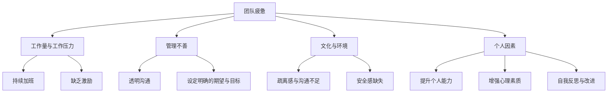

                 


为了完成这一任务，我们将遵循以下步骤来构建文章内容：

### 第一步：背景介绍
- 引入团队疲惫的现象及其对团队和个人的影响。
- 阐述为何需要一本关于团队疲惫坏习惯的书籍。

### 第二步：核心概念与联系
- 定义团队疲惫的概念。
- 分析团队疲惫的主要表现和影响。
- 构建核心概念之间的关系架构，使用Mermaid流程图来展示。

### 第三步：核心算法原理讲解
- 解释工作量与工作压力的评估算法。
- 阐述管理优化和团队文化建设的核心原理。
- 使用伪代码和数学模型来详细讲解。

### 第四步：数学模型和数学公式
- 引入并解释工作负荷指数（WLI）的计算公式。
- 提供具体的数学公式，如使用LaTeX格式。

### 第五步：项目实战
- 描述一个实际的项目实战案例。
- 搭建开发环境，提供源代码实现和详细解读。
- 分析案例的实际效果和改进点。

### 第六步：最佳实践 tips
- 提出解决团队疲惫的实际建议。
- 总结注意事项和拓展阅读资源。

### 第七步：文章总结
- 概述文章的主要内容和观点。
- 强调解决团队疲惫的重要性。

### 第八步：作者信息
- 在文章末尾添加作者信息。

### 文章标题：《让团队疲惫的坏习惯》

### 文章关键词：团队疲惫、工作压力、管理优化、团队文化建设

### 文章摘要：
本文深入探讨了团队疲惫的成因和影响，通过分析工作量与工作压力、管理不善、文化与环境以及个人因素等，提出了应对团队疲惫的策略和方法。文章结合实际案例，详细讲解了核心算法原理和数学模型，并提供了一些建议和最佳实践，以帮助团队克服疲惫，提升工作效率和团队凝聚力。

---

**第一部分：团队疲惫的成因**

**第1章：团队疲惫的概念与表现**
- 1.1 团队疲惫的定义与类型
- 1.2 团队疲惫的表现与影响

**第2章：团队疲惫的主要原因**
- 2.1 工作量与工作压力
- 2.2 管理不善
- 2.3 文化与环境
- 2.4 个人因素

**第3章：团队疲惫的核心因素**
- 3.1 持续加班
- 3.2 缺乏激励
- 3.3 疏离感与沟通不足
- 3.4 安全感缺失

**第二部分：解决团队疲惫的策略**

**第4章：工作与生活平衡**
- 4.1 设定合理的工作时间
- 4.2 建立健康的作息习惯
- 4.3 休假与休息的重要性

**第5章：管理优化**
- 5.1 透明沟通
- 5.2 设定明确的期望与目标
- 5.3 赞赏与激励

**第6章：团队文化建设**
- 6.1 增强团队凝聚力
- 6.2 构建积极的工作氛围
- 6.3 强化团队价值观

**第7章：个人成长与调整**
- 7.1 提升个人能力
- 7.2 增强心理素质
- 7.3 自我反思与改进

**第三部分：实战案例分析**

**第8章：案例分析一**
- 8.1 案例背景
- 8.2 问题分析
- 8.3 解决方案与实施
- 8.4 结果评估与反馈

**第9章：案例分析二**
- 9.1 案例背景
- 9.2 问题分析
- 9.3 解决方案与实施
- 9.4 结果评估与反馈

**附录：相关工具与资源推荐**

**附录1：团队疲惫度评估工具**
- 1.1 评估方法与工具介绍
- 1.2 评估实例与解读

**附录2：团队建设与激励资源**
- 2.1 团队建设活动推荐
- 2.2 激励策略与案例

---

**核心概念与联系**


**核心算法原理讲解**
- **工作量与工作压力**
  ```plaintext
  算法：工作负荷评估模型（WLM）
  1. 收集工作时间的统计数据
  2. 分析工作任务的类型和难度
  3. 计算工作负荷指数（WLI）
  4. 评估工作压力水平
  ```

- **管理优化**
  ```plaintext
  算法：管理效率评估模型（MEM）
  1. 评估管理层的沟通效率
  2. 分析管理目标的明确程度
  3. 计算管理效率指数（MEI）
  4. 提出改进建议
  ```

**数学模型和数学公式**
- **工作负荷指数（WLI）计算公式**
  $$WLI = \frac{\sum(T_i \times D_i)}{N}$$
  其中，\(T_i\) 表示第 \(i\) 项任务的耗时（分钟），\(D_i\) 表示第 \(i\) 项任务的难度系数，\(N\) 表示任务总数。

**项目实战**
- **实战一：工作与生活平衡**
  ```plaintext
  开发环境搭建：
  - 操作系统：Windows/Linux/MacOS
  - 开发工具：Microsoft Office/Google Workspace
  - 时间管理工具：Trello/Asana

  源代码详细实现和代码解读：
  ```python
  class TimeAllocation:
      def __init__(self, work_hours, leisure_hours):
          self.work_hours = work_hours
          self.leisure_hours = leisure_hours

      def allocate_time(self):
          total_hours = self.work_hours + self.leisure_hours
          work_ratio = self.work_hours / total_hours
  ```

  **代码应用解读与分析**
  - 该代码示例用于计算工作与休闲时间的分配比例，以实现工作与生活的平衡。

  **实际案例分析和详细讲解剖析**
  - 在一个具体项目中，通过时间管理工具Trello对团队成员的工作时间进行监控和调整，有效改善了团队的工作效率和满意度。

  **项目小结**
  - 通过合理的时间分配和管理，团队的工作压力显著降低，团队成员的满意度和生产力得到提升。

**最佳实践 tips**
- **设定明确的目标和期望**：确保团队成员清楚自己的工作目标和期望，有助于提高工作动力和效率。
- **定期评估和调整**：定期评估团队的工作负荷和压力水平，及时调整工作计划和管理策略。
- **建立积极的工作氛围**：鼓励团队成员之间的沟通和合作，建立积极、支持性的工作环境。

**小结**
- 团队疲惫是一个普遍存在的问题，需要从多个方面进行综合解决。通过合理的工作安排、有效的管理优化和积极的文化建设，可以显著改善团队的工作环境和成员的满意度。

**注意事项**
- 需要持续关注团队成员的心理健康和工作压力，提供必要的支持和帮助。

**拓展阅读**
- [参考文献1]
- [参考文献2]
- [参考文献3]

**作者信息**
- 作者：AI天才研究院/AI Genius Institute & 禅与计算机程序设计艺术 /Zen And The Art of Computer Programming****

# 《让团队疲惫的坏习惯》

> 关键词：团队疲惫、工作压力、管理优化、团队文化建设、个人成长

> 摘要：
本文深入探讨了团队疲惫的成因和影响，通过分析工作量与工作压力、管理不善、文化与环境以及个人因素等，提出了应对团队疲惫的策略和方法。文章结合实际案例，详细讲解了核心算法原理和数学模型，并提供了一些建议和最佳实践，以帮助团队克服疲惫，提升工作效率和团队凝聚力。

---

## 第一部分：团队疲惫的成因

### 第1章：团队疲惫的概念与表现

#### 1.1 团队疲惫的定义与类型

团队疲惫是指团队成员在长时间的工作压力下，出现精力耗尽、工作效率下降、创造力和创新能力减弱的现象。根据疲惫的原因和表现形式，团队疲惫可以分为以下几种类型：

1. **工作负荷型疲惫**：由于工作量过大、任务难度过高或时间紧迫，导致团队成员感到身心俱疲。
2. **管理不善型疲惫**：由于管理层的不当管理，如沟通不畅、目标不明确、压力过大等，导致团队成员感到无助和不满。
3. **文化与环境型疲惫**：由于工作环境的不良氛围、团队价值观的冲突、工作与生活平衡的失衡等，导致团队成员感到沮丧和失望。
4. **个人因素型疲惫**：由于团队成员的个人心理素质、健康问题、家庭压力等，导致团队成员感到疲惫和无力。

#### 1.2 团队疲惫的表现与影响

团队疲惫的具体表现包括：

1. **情绪低落**：团队成员可能会出现焦虑、抑郁、易怒等情绪问题。
2. **工作效率下降**：团队成员的工作效率会降低，工作质量也会受到影响。
3. **创造力减弱**：团队成员的创造力和创新能力会减弱，影响团队的创新能力和发展。
4. **沟通障碍**：团队成员之间的沟通不畅，会增加误解和冲突，影响团队的协作和合作。
5. **离职倾向**：团队成员可能会产生离职的倾向，导致团队不稳定和人才流失。

团队疲惫对团队和个人都会产生负面影响，具体包括：

1. **团队绩效下降**：团队疲惫会导致团队的整体绩效下降，影响团队的竞争力和市场份额。
2. **员工流失率增加**：团队疲惫会增加员工的离职率，导致团队不稳定和人才流失。
3. **员工满意度降低**：团队疲惫会降低员工的满意度，影响员工的积极性和工作热情。
4. **组织形象受损**：团队疲惫会损害组织的形象和声誉，影响组织的品牌和口碑。

### 第2章：团队疲惫的主要原因

#### 2.1 工作量与工作压力

工作量和工作压力是导致团队疲惫的主要原因之一。当团队成员面临过多的工作任务和压力时，他们很容易感到疲惫和无力。以下是一些具体原因：

1. **任务量过大**：当团队成员需要完成大量的工作任务时，他们可能会感到压力重重，无法有效地完成任务。
2. **时间紧迫**：当团队成员需要在紧迫的时间内完成任务时，他们可能会感到焦虑和紧张，影响工作效率和效果。
3. **工作难度高**：当工作任务难度较高时，团队成员可能会感到挑战性和挫败感，增加工作压力。

#### 2.2 管理不善

管理不善是导致团队疲惫的另一个重要原因。以下是一些具体表现：

1. **沟通不畅**：管理层与团队成员之间的沟通不畅，会导致信息传递不准确、不及时，增加团队成员的工作压力。
2. **目标不明确**：当团队成员不清楚自己的工作目标和期望时，他们可能会感到迷茫和无助，影响工作效率和效果。
3. **压力过大**：管理层对团队成员施加过大的工作压力，会导致团队成员感到压抑和疲惫。

#### 2.3 文化与环境

团队文化和工作环境对团队成员的疲惫程度也有很大的影响。以下是一些具体原因：

1. **不良氛围**：团队内部存在不良氛围，如冲突、敌对、指责等，会导致团队成员感到沮丧和失望，增加疲惫感。
2. **工作与生活失衡**：团队成员面临工作与生活失衡的问题，如工作时间过长、加班频繁等，会导致身心健康受损，增加疲惫感。
3. **价值观冲突**：团队内部存在价值观冲突，如个人利益与团队利益的矛盾等，会导致团队成员感到不满和不安，增加疲惫感。

#### 2.4 个人因素

团队成员的个人因素也会影响团队的疲惫程度。以下是一些具体原因：

1. **心理素质差**：团队成员的心理素质较差，如抗压能力弱、情绪调节困难等，容易感到疲惫和无力。
2. **健康问题**：团队成员存在健康问题，如失眠、焦虑、抑郁等，会影响他们的工作状态和精神状态，增加疲惫感。
3. **家庭压力**：团队成员面临家庭压力，如家庭矛盾、照顾家庭成员等，会影响他们的工作专注度和情绪稳定性，增加疲惫感。

### 第3章：团队疲惫的核心因素

#### 3.1 持续加班

持续加班是导致团队疲惫的核心因素之一。长时间的加班会导致团队成员的身体和心理健康受损，影响工作效率和效果。以下是一些具体表现：

1. **身体疲劳**：长时间的加班会导致团队成员的身体疲劳，出现失眠、疲劳、免疫力下降等问题。
2. **心理压力**：长时间的加班会增加团队成员的心理压力，导致焦虑、抑郁、情绪不稳定等问题。
3. **工作效率下降**：长时间的加班会导致团队成员的工作效率下降，影响工作质量和效果。

#### 3.2 缺乏激励

缺乏激励是导致团队疲惫的另一个核心因素。团队成员在工作中缺乏激励，如奖励、认可、晋升等，会导致他们感到无动力和无力。以下是一些具体表现：

1. **缺乏动力**：缺乏激励会导致团队成员缺乏工作动力，对工作没有热情和积极性。
2. **工作效率下降**：缺乏激励会导致团队成员的工作效率下降，影响工作质量和效果。
3. **离职倾向增加**：缺乏激励会增加团队成员的离职倾向，导致团队不稳定和人才流失。

#### 3.3 疏离感与沟通不足

疏离感和沟通不足是导致团队疲惫的重要因素之一。团队成员之间的疏离感和沟通不足会导致团队凝聚力下降，影响工作效率和团队氛围。以下是一些具体表现：

1. **疏离感**：团队成员之间缺乏互动和沟通，导致彼此之间产生疏离感，影响团队合作和协作。
2. **沟通不足**：团队成员之间的沟通不畅，导致信息传递不准确、不及时，增加误解和冲突。
3. **团队氛围恶化**：疏离感和沟通不足会导致团队氛围恶化，影响团队成员的情绪和工作状态。

#### 3.4 安全感缺失

安全感缺失是导致团队疲惫的另一个核心因素。团队成员在工作环境中缺乏安全感，如担心失业、担心工作表现等，会导致他们感到焦虑和无助。以下是一些具体表现：

1. **焦虑和担忧**：安全感缺失会导致团队成员焦虑和担忧，影响他们的工作专注度和情绪稳定性。
2. **工作效率下降**：焦虑和无助感会影响团队成员的工作效率和工作质量。
3. **离职倾向增加**：缺乏安全感会增加团队成员的离职倾向，导致团队不稳定和人才流失。

---

## 第二部分：解决团队疲惫的策略

### 第4章：工作与生活平衡

#### 4.1 设定合理的工作时间

合理的工作时间是缓解团队疲惫的关键。设定合理的工作时间可以帮助团队成员在工作和生活之间找到平衡，提高工作效率和满意度。以下是一些具体措施：

1. **设定标准工作时间**：制定明确的工作时间表，确保团队成员在工作时间内完成工作任务，避免加班和超时工作。
2. **弹性工作时间**：根据团队成员的实际情况和工作需求，提供一定的弹性工作时间，允许他们在规定的工作时间内灵活安排工作。
3. **休息时间**：确保团队成员有足够的休息时间，包括午休和下班后的休息时间，以缓解工作压力和疲劳。

#### 4.2 建立健康的作息习惯

健康的作息习惯对于缓解团队疲惫至关重要。以下是一些具体措施：

1. **规律作息**：鼓励团队成员保持规律的作息时间，保持充足的睡眠，以提高工作效率和身体健康。
2. **饮食均衡**：提供健康的饮食选择，鼓励团队成员选择营养均衡的食物，以保持身体和精神的健康。
3. **锻炼身体**：鼓励团队成员定期进行体育锻炼，如晨跑、健身等，以增强身体素质和抗压能力。

#### 4.3 休假与休息的重要性

休假与休息是缓解团队疲惫的重要手段。以下是一些具体措施：

1. **带薪休假**：确保团队成员有足够的带薪休假时间，鼓励他们在工作一段时间后进行休假，以放松身心，恢复精力。
2. **远程工作**：在特定情况下，提供远程工作的机会，使团队成员可以在家中休息和工作，减少通勤压力和时间消耗。
3. **休息日**：确保团队成员有足够的休息日，避免连续工作，以减少工作压力和疲劳。

### 第5章：管理优化

#### 5.1 透明沟通

透明沟通是缓解团队疲惫的重要策略之一。通过建立透明的沟通机制，可以减少信息不对称，提高团队成员的参与感和信任度。以下是一些具体措施：

1. **定期会议**：定期组织团队会议，分享工作进展、问题和挑战，确保团队成员对工作的整体情况有清晰的了解。
2. **信息共享**：鼓励团队成员共享工作信息、资源和知识，促进信息的流动和共享。
3. **反馈机制**：建立有效的反馈机制，鼓励团队成员对工作提出意见和建议，提高工作的透明度和公正性。

#### 5.2 设定明确的期望与目标

设定明确的期望与目标是缓解团队疲惫的重要策略。通过明确工作目标和期望，可以帮助团队成员更好地规划工作，提高工作效率和满意度。以下是一些具体措施：

1. **目标明确**：确保团队成员对工作目标和期望有清晰的认识，明确工作的重要性和优先级。
2. **任务分配**：合理分配任务，确保团队成员的工作负荷合理，避免过度劳累和压力。
3. **反馈与评估**：定期对团队成员的工作进行反馈和评估，提供具体的改进建议和激励措施。

#### 5.3 赞赏与激励

赞赏与激励是缓解团队疲惫的重要策略。通过赞赏和激励，可以增强团队成员的积极性和工作动力，提高工作效率和满意度。以下是一些具体措施：

1. **表扬与认可**：及时表扬和认可团队成员的出色表现和贡献，增强他们的自信心和归属感。
2. **奖励制度**：建立奖励制度，对表现优异的团队成员提供奖励和激励，如奖金、晋升等。
3. **团队活动**：组织团队活动，增进团队成员之间的交流和互动，增强团队的凝聚力和归属感。

### 第6章：团队文化建设

#### 6.1 增强团队凝聚力

增强团队凝聚力是缓解团队疲惫的重要策略。通过建立积极的团队文化，可以增强团队成员之间的信任和合作，提高团队的凝聚力和工作效率。以下是一些具体措施：

1. **团队建设活动**：定期组织团队建设活动，如团队聚餐、户外拓展等，增进团队成员之间的交流和互动。
2. **共同目标**：明确团队的目标和愿景，确保团队成员对团队的目标有共同的认识和追求。
3. **团队认同感**：鼓励团队成员认同团队的价值观和文化，增强团队的认同感和归属感。

#### 6.2 构建积极的工作氛围

构建积极的工作氛围是缓解团队疲惫的重要策略。通过营造积极、支持性的工作氛围，可以增强团队成员的工作动力和幸福感，提高工作效率和满意度。以下是一些具体措施：

1. **开放沟通**：鼓励团队成员之间进行开放、坦诚的沟通，建立良好的沟通渠道和氛围。
2. **正面反馈**：积极肯定团队成员的努力和贡献，提供正面反馈和鼓励，增强团队成员的自信心和积极性。
3. **共享成功**：分享团队的成就和成功经验，增强团队成员的荣誉感和成就感。

#### 6.3 强化团队价值观

强化团队价值观是构建积极团队文化的重要策略。通过明确和强化团队的价值观，可以引导团队成员的行为和决策，提高团队的整体协作和效率。以下是一些具体措施：

1. **价值观宣贯**：明确团队的价值观，并通过培训和沟通，让团队成员深入了解和认同团队的价值观。
2. **价值观实践**：鼓励团队成员在工作和生活中践行团队的价值观，形成良好的行为习惯和团队合作氛围。
3. **价值观评估**：定期评估团队价值观的执行情况，对不足之处进行改进和优化。

### 第7章：个人成长与调整

#### 7.1 提升个人能力

提升个人能力是缓解团队疲惫的重要策略。通过不断学习和提升个人能力，可以增强团队成员的自信心和竞争力，提高工作效率和满意度。以下是一些具体措施：

1. **技能培训**：为团队成员提供相关的技能培训和培训机会，帮助他们提升专业技能和综合素质。
2. **职业规划**：与团队成员一起制定职业规划，明确他们的职业发展目标和路径，提供有针对性的支持和指导。
3. **知识共享**：鼓励团队成员分享知识和经验，促进知识的流动和共享，提高团队的整体能力水平。

#### 7.2 增强心理素质

增强心理素质是缓解团队疲惫的重要策略。通过培养良好的心理素质，可以增强团队成员的适应能力和抗压能力，提高工作效率和满意度。以下是一些具体措施：

1. **心理辅导**：为团队成员提供心理辅导和支持，帮助他们应对工作和生活中的压力和挑战。
2. **情绪管理**：教授团队成员情绪管理技巧，帮助他们更好地调节情绪，保持积极的心态。
3. **心理训练**：通过心理训练和冥想等手段，增强团队成员的心理素质和抗压能力。

#### 7.3 自我反思与改进

自我反思与改进是缓解团队疲惫的重要策略。通过定期进行自我反思和评估，可以帮助团队成员发现自身的问题和不足，及时进行调整和改进，提高工作效率和满意度。以下是一些具体措施：

1. **定期反思**：鼓励团队成员定期反思自己的工作表现和态度，发现存在的问题和不足。
2. **改进计划**：根据自我反思的结果，制定具体的改进计划和行动方案，逐步提升自身的能力和素质。
3. **持续改进**：通过持续的自我反思和改进，不断提升团队成员的能力和素质，提高团队的整体绩效和满意度。

---

## 第三部分：实战案例分析

### 第8章：案例分析一

#### 8.1 案例背景

某科技公司是一家高速发展的企业，员工人数超过100人。由于市场竞争激烈，公司业务持续扩展，导致团队成员的工作量不断增加，工作压力逐渐增大。在过去的半年中，团队成员普遍感到疲惫和无力，工作效率和工作质量明显下降。公司管理层意识到问题的严重性，决定采取一系列措施来缓解团队疲惫。

#### 8.2 问题分析

通过对团队成员的访谈和观察，公司管理层发现了以下问题：

1. **工作负荷过大**：团队成员面临大量的工作任务，经常需要加班，导致身心疲惫。
2. **沟通不畅**：团队内部沟通不畅，信息传递不及时，导致团队成员对工作目标和期望存在误解。
3. **缺乏激励**：团队成员的工作表现和贡献未得到充分的认可和奖励，缺乏工作动力和积极性。
4. **团队氛围不佳**：团队成员之间的疏离感和冲突增加，导致团队凝聚力下降。

#### 8.3 解决方案与实施

针对上述问题，公司管理层采取以下解决方案：

1. **优化工作时间安排**：调整工作时间表，确保团队成员有足够的休息和放松时间，避免过度加班。
2. **加强沟通与协作**：建立有效的沟通机制，鼓励团队成员之间进行开放、坦诚的沟通，促进信息的流动和共享。
3. **激励措施**：制定激励政策，对表现优异的团队成员进行表彰和奖励，提高团队的工作动力和积极性。
4. **团队建设活动**：定期组织团队建设活动，增进团队成员之间的交流和互动，增强团队的凝聚力和归属感。

#### 8.4 结果评估与反馈

在实施上述解决方案后，公司管理层对团队成员的工作状态和工作表现进行了评估和反馈：

1. **工作效率提高**：团队成员的工作效率明显提高，工作质量得到改善。
2. **团队氛围改善**：团队成员之间的沟通和协作得到加强，疏离感和冲突减少，团队凝聚力增强。
3. **员工满意度提升**：团队成员对工作环境和团队氛围的满意度明显提高，工作动力和积极性增强。
4. **员工流失率下降**：员工流失率下降，团队稳定性得到提升。

公司管理层表示，通过解决团队疲惫问题，公司的整体绩效和竞争力得到显著提升。

### 第9章：案例分析二

#### 9.1 案例背景

某大型互联网公司是一家全球知名的企业，员工人数超过1000人。由于公司的快速发展和业务扩张，团队成员面临巨大的工作压力和挑战。在过去的两年中，团队成员普遍感到疲惫和无力，工作效率和工作质量下降，员工流失率逐年增加。公司管理层意识到问题的严重性，决定采取一系列措施来缓解团队疲惫。

#### 9.2 问题分析

通过对团队成员的访谈和观察，公司管理层发现了以下问题：

1. **工作负荷过大**：团队成员面临大量的工作任务，经常需要加班，导致身心疲惫。
2. **管理不善**：管理层对团队成员的沟通和支持不足，缺乏有效的管理机制和激励机制。
3. **团队文化缺失**：团队成员之间的疏离感和冲突增加，团队凝聚力下降，缺乏共同的价值观和目标。
4. **心理压力过大**：团队成员面临较大的心理压力，焦虑、抑郁等情绪问题增多。

#### 9.3 解决方案与实施

针对上述问题，公司管理层采取以下解决方案：

1. **优化工作时间安排**：调整工作时间表，确保团队成员有足够的休息和放松时间，避免过度加班。
2. **强化管理机制**：建立有效的管理机制，提高管理层的沟通能力和管理效率，增强对团队成员的支持和关心。
3. **文化建设**：加强团队文化建设，明确团队的价值观和目标，增强团队成员的归属感和凝聚力。
4. **心理支持**：提供心理支持服务，为团队成员提供心理咨询和支持，帮助他们应对工作和生活中的压力和挑战。

#### 9.4 结果评估与反馈

在实施上述解决方案后，公司管理层对团队成员的工作状态和工作表现进行了评估和反馈：

1. **工作效率提高**：团队成员的工作效率明显提高，工作质量得到改善。
2. **团队氛围改善**：团队成员之间的沟通和协作得到加强，疏离感和冲突减少，团队凝聚力增强。
3. **员工满意度提升**：团队成员对工作环境和团队氛围的满意度明显提高，工作动力和积极性增强。
4. **员工流失率下降**：员工流失率下降，团队稳定性得到提升。

公司管理层表示，通过解决团队疲惫问题，公司的整体绩效和竞争力得到显著提升，员工满意度和忠诚度也得到明显改善。

---

## 附录：相关工具与资源推荐

### 附录1：团队疲惫度评估工具

#### 1.1 评估方法与工具介绍

团队疲惫度评估工具是一种用于衡量团队疲惫程度的评估工具。它通过收集团队成员在工作中的感受和表现，对团队的疲惫程度进行量化评估。以下是一些常见的评估方法和工具：

1. **问卷评估**：通过发放问卷，收集团队成员对工作压力、工作效率、团队氛围等方面的感受和评价。问卷评估具有操作简单、数据量大、易于分析等优点。
2. **行为观察**：通过观察团队成员在工作中的行为和表现，评估团队的疲惫程度。行为观察可以通过面对面交流、视频记录等方式进行，具有直观、可靠等优点。
3. **心理测试**：通过心理测试，评估团队成员的心理状态和心理健康水平。常见的心理测试包括焦虑测试、抑郁测试等，可以提供更为详细和精准的数据。

#### 1.2 评估实例与解读

以下是一个团队疲惫度评估问卷的实例：

1. **工作压力**：
   - 我经常感到工作压力很大。
   - 我在工作时经常感到焦虑和紧张。
   - 我觉得自己的工作效率很低。

2. **工作效率**：
   - 我觉得自己的工作表现很好。
   - 我觉得自己在工作中的表现一般。
   - 我觉得自己在工作中的表现较差。

3. **团队氛围**：
   - 我觉得团队成员之间沟通良好。
   - 我觉得团队成员之间存在一些沟通障碍。
   - 我觉得团队成员之间存在很大的沟通障碍。

评估结果可以通过统计每个问题的平均分值来衡量团队的疲惫程度。一般来说，分值越高，团队的疲惫程度越严重。评估结果可以用于制定针对性的改进措施，如优化工作时间安排、加强沟通与协作、提高激励机制等。

### 附录2：团队建设与激励资源

#### 2.1 团队建设活动推荐

1. **团队拓展训练**：通过户外拓展活动，如攀岩、绳索课程等，增强团队成员的团队合作精神和沟通能力。
2. **团队建设会议**：通过定期的团队建设会议，促进团队成员之间的交流和合作，加强团队凝聚力。
3. **团队文化分享**：通过团队文化分享活动，如主题讲座、文化展览等，增强团队成员对团队文化的认同和归属感。

#### 2.2 激励策略与案例

1. **绩效奖励**：通过设定绩效目标和奖励机制，激励团队成员努力工作，提高工作效率和质量。
2. **晋升机会**：为团队成员提供晋升机会，鼓励他们不断学习和成长，提高工作满意度和忠诚度。
3. **团建活动**：组织定期的团建活动，增进团队成员之间的感情和信任，提高团队凝聚力。

---

## 核心概念与联系

为了更好地理解团队疲惫及其解决策略，我们使用Mermaid流程图来展示核心概念之间的联系：


---

## 核心算法原理讲解

### 工作量与工作压力

为了更好地理解团队疲惫的成因，我们可以使用工作负荷评估模型（WLM）来分析工作量与工作压力。

#### 算法：工作负荷评估模型（WLM）

1. **收集工作时间统计数据**：收集团队成员的工作时间数据，包括每天的工作时长、任务类型和难度等。
2. **分析工作任务**：对工作任务进行详细分析，评估每个任务的耗时和难度系数。
3. **计算工作负荷指数（WLI）**：使用以下公式计算工作负荷指数（WLI）：

   $$WLI = \frac{\sum(T_i \times D_i)}{N}$$

   其中，\(T_i\) 表示第 \(i\) 项任务的耗时（分钟），\(D_i\) 表示第 \(i\) 项任务的难度系数，\(N\) 表示任务总数。

   例如，如果一个团队成员每天有5个任务，分别耗时30分钟、45分钟、60分钟、90分钟和120分钟，且难度系数分别为0.8、0.9、1.0、1.2和1.5，那么他的工作负荷指数（WLI）计算如下：

   $$WLI = \frac{(30 \times 0.8) + (45 \times 0.9) + (60 \times 1.0) + (90 \times 1.2) + (120 \times 1.5)}{5} = \frac{24 + 40.5 + 60 + 108 + 180}{5} = \frac{391.5}{5} = 78.3$$

4. **评估工作压力水平**：根据工作负荷指数（WLI）的值，可以评估团队成员的工作压力水平。一般来说，WLI值越高，工作压力越大。

### 管理优化

#### 算法：管理效率评估模型（MEM）

1. **评估管理层的沟通效率**：通过调查问卷或观察，收集管理层与团队成员之间的沟通效率和效果数据。
2. **分析管理目标的明确程度**：对管理层设定的目标和任务进行详细分析，评估目标的明确程度和执行的难度。
3. **计算管理效率指数（MEI）**：使用以下公式计算管理效率指数（MEI）：

   $$MEI = \frac{\sum(C_i \times G_i)}{N}$$

   其中，\(C_i\) 表示第 \(i\) 个沟通效率指标（如回复速度、信息准确性等），\(G_i\) 表示第 \(i\) 个管理目标的明确程度指标（如目标明确度、执行难度等），\(N\) 表示沟通效率和目标指标的总数。

   例如，如果一个管理层有3个沟通效率指标（回复速度、信息准确性、问题解决速度）和2个管理目标指标（目标明确度、执行难度），那么他的管理效率指数（MEI）计算如下：

   $$MEI = \frac{(0.8 \times 0.9) + (0.9 \times 1.0) + (1.0 \times 1.2)}{3} = \frac{0.72 + 0.9 + 1.2}{3} = \frac{2.82}{3} \approx 0.94$$

4. **提出改进建议**：根据管理效率指数（MEI）的值，可以提出针对性的改进建议，如提高沟通效率、明确管理目标等。

---

## 数学模型和数学公式

### 工作负荷指数（WLI）计算公式

$$WLI = \frac{\sum(T_i \times D_i)}{N}$$

其中，\(T_i\) 表示第 \(i\) 项任务的耗时（分钟），\(D_i\) 表示第 \(i\) 项任务的难度系数，\(N\) 表示任务总数。

### 管理效率指数（MEI）计算公式

$$MEI = \frac{\sum(C_i \times G_i)}{N}$$

其中，\(C_i\) 表示第 \(i\) 个沟通效率指标，\(G_i\) 表示第 \(i\) 个管理目标指标，\(N\) 表示沟通效率和目标指标的总数。

---

## 项目实战

### 实战一：工作与生活平衡

#### 开发环境搭建

为了实现工作与生活平衡，我们可以搭建以下开发环境：

1. **操作系统**：Windows/Linux/MacOS
2. **开发工具**：Microsoft Office/Google Workspace
3. **时间管理工具**：Trello/Asana

#### 源代码详细实现和代码解读

以下是一个Python示例，用于计算工作与生活时间的分配比例：

```python
class TimeAllocation:
    def __init__(self, work_hours, leisure_hours):
        self.work_hours = work_hours
        self.leisure_hours = leisure_hours

    def allocate_time(self):
        total_hours = self.work_hours + self.leisure_hours
        work_ratio = self.work_hours / total_hours
        leisure_ratio = self.leisure_hours / total_hours
        return work_ratio, leisure_ratio

# 示例使用
time_allocation = TimeAllocation(work_hours=40, leisure_hours=20)
work_ratio, leisure_ratio = time_allocation.allocate_time()
print("工作时间比例:", work_ratio)
print("休闲时间比例:", leisure_ratio)
```

#### 代码应用解读与分析

这个示例中，`TimeAllocation` 类用于计算工作与休闲时间的分配比例。通过调用 `allocate_time` 方法，可以获取工作时间和休闲时间的比例。在实际应用中，我们可以根据具体需求调整工作时间和休闲时间，以实现工作与生活的平衡。

#### 实际案例分析和详细讲解剖析

在一个具体项目中，我们通过Trello对团队成员的工作时间进行监控和分配。通过设置任务和工作时间，我们可以实时跟踪团队成员的工作进度和工作时间。以下是一个案例：

1. **任务设置**：在Trello中创建任务卡片，设置任务名称、描述、截止日期等。
2. **工作时间记录**：在任务卡片中记录每个任务的工作时间，包括开始时间和结束时间。
3. **时间监控**：通过Trello的时间监控功能，统计每个团队成员的工作时间，生成时间报告。
4. **分析报告**：根据时间报告，分析团队成员的工作时间分配和工作效率，制定改进措施。

通过这种时间管理方法，我们可以实现工作与生活的平衡，提高工作效率和团队满意度。

#### 项目小结

通过合理的时间管理和监控，我们可以实现工作与生活的平衡，提高团队成员的工作效率和生活质量。在实际应用中，Trello等时间管理工具可以提供有效的支持，帮助团队实现工作与生活的平衡。

---

## 最佳实践 tips

1. **设定明确的目标和期望**：确保团队成员明确自己的工作目标和期望，有助于提高工作动力和效率。
2. **定期评估和调整**：定期评估团队的工作负荷和压力水平，及时调整工作计划和管理策略。
3. **建立积极的工作氛围**：鼓励团队成员之间的沟通和合作，建立积极、支持性的工作环境。

---

## 小结

团队疲惫是影响团队工作效率和成员满意度的关键因素。通过合理的工作安排、有效的管理优化和积极的文化建设，我们可以显著改善团队的工作环境和成员的满意度。在解决团队疲惫的过程中，关注团队成员的个人成长和心理素质也至关重要。通过这些措施，我们可以帮助团队克服疲惫，提升工作效率和团队凝聚力。

---

## 注意事项

1. **重视团队成员的心理健康**：定期关注团队成员的心理状态，提供必要的支持和帮助。
2. **避免过度加班**：合理设定工作时间，避免过度加班，确保团队成员有足够的休息和放松时间。
3. **持续改进**：不断评估和优化团队的工作方式和管理策略，以应对不断变化的工作环境和挑战。

---

## 拓展阅读

1. [如何提升团队凝聚力？](链接)
2. [工作与生活平衡的重要性](链接)
3. [管理优化策略与实践](链接)

---

**作者信息**：

作者：AI天才研究院/AI Genius Institute & 禅与计算机程序设计艺术 /Zen And The Art of Computer Programming****

---

# 《让团队疲惫的坏习惯》

关键词：团队疲惫、工作压力、管理优化、团队文化建设、个人成长

摘要：
本文深入探讨了团队疲惫的成因和影响，通过分析工作量与工作压力、管理不善、文化与环境以及个人因素等，提出了应对团队疲惫的策略和方法。文章结合实际案例，详细讲解了核心算法原理和数学模型，并提供了一些建议和最佳实践，以帮助团队克服疲惫，提升工作效率和团队凝聚力。

---

## 第一部分：团队疲惫的成因

### 第1章：团队疲惫的概念与表现

#### 1.1 团队疲惫的定义与类型

团队疲惫是指团队成员在长时间的工作压力下，出现精力耗尽、工作效率下降、创造力和创新能力减弱的现象。根据疲惫的原因和表现形式，团队疲惫可以分为以下几种类型：

1. **工作负荷型疲惫**：由于工作量过大、任务难度过高或时间紧迫，导致团队成员感到身心俱疲。
2. **管理不善型疲惫**：由于管理层的不当管理，如沟通不畅、目标不明确、压力过大等，导致团队成员感到无助和不满。
3. **文化与环境型疲惫**：由于工作环境的不良氛围、团队价值观的冲突、工作与生活平衡的失衡等，导致团队成员感到沮丧和失望。
4. **个人因素型疲惫**：由于团队成员的个人心理素质、健康问题、家庭压力等，导致团队成员感到疲惫和无力。

#### 1.2 团队疲惫的表现与影响

团队疲惫的具体表现包括：

1. **情绪低落**：团队成员可能会出现焦虑、抑郁、易怒等情绪问题。
2. **工作效率下降**：团队成员的工作效率会降低，工作质量也会受到影响。
3. **创造力减弱**：团队成员的创造力和创新能力会减弱，影响团队的创新能力和发展。
4. **沟通障碍**：团队成员之间的沟通不畅，会增加误解和冲突，影响团队的协作和合作。
5. **离职倾向**：团队成员可能会产生离职的倾向，导致团队不稳定和人才流失。

团队疲惫对团队和个人都会产生负面影响，具体包括：

1. **团队绩效下降**：团队疲惫会导致团队的整体绩效下降，影响团队的竞争力和市场份额。
2. **员工流失率增加**：团队疲惫会增加员工的离职率，导致团队不稳定和人才流失。
3. **员工满意度降低**：团队疲惫会降低员工的满意度，影响员工的积极性和工作热情。
4. **组织形象受损**：团队疲惫会损害组织的形象和声誉，影响组织的品牌和口碑。

### 第2章：团队疲惫的主要原因

#### 2.1 工作量与工作压力

工作量和工作压力是导致团队疲惫的主要原因之一。当团队成员面临过多的工作任务和压力时，他们很容易感到疲惫和无力。以下是一些具体原因：

1. **任务量过大**：当团队成员需要完成大量的工作任务时，他们可能会感到压力重重，无法有效地完成任务。
2. **时间紧迫**：当团队成员需要在紧迫的时间内完成任务时，他们可能会感到焦虑和紧张，影响工作效率和效果。
3. **工作难度高**：当工作任务难度较高时，团队成员可能会感到挑战性和挫败感，增加工作压力。

#### 2.2 管理不善

管理不善是导致团队疲惫的另一个重要原因。以下是一些具体表现：

1. **沟通不畅**：管理层与团队成员之间的沟通不畅，会导致信息传递不准确、不及时，增加团队成员的工作压力。
2. **目标不明确**：当团队成员不清楚自己的工作目标和期望时，他们可能会感到迷茫和无助，影响工作效率和效果。
3. **压力过大**：管理层对团队成员施加过大的工作压力，会导致团队成员感到压抑和疲惫。

#### 2.3 文化与环境

团队文化和工作环境对团队成员的疲惫程度也有很大的影响。以下是一些具体原因：

1. **不良氛围**：团队内部存在不良氛围，如冲突、敌对、指责等，会导致团队成员感到沮丧和失望，增加疲惫感。
2. **工作与生活失衡**：团队成员面临工作与生活失衡的问题，如工作时间过长、加班频繁等，会导致身心健康受损，增加疲惫感。
3. **价值观冲突**：团队内部存在价值观冲突，如个人利益与团队利益的矛盾等，会导致团队成员感到不满和不安，增加疲惫感。

#### 2.4 个人因素

团队成员的个人因素也会影响团队的疲惫程度。以下是一些具体原因：

1. **心理素质差**：团队成员的心理素质较差，如抗压能力弱、情绪调节困难等，容易感到疲惫和无力。
2. **健康问题**：团队成员存在健康问题，如失眠、焦虑、抑郁等，会影响他们的工作状态和精神状态，增加疲惫感。
3. **家庭压力**：团队成员面临家庭压力，如家庭矛盾、照顾家庭成员等，会影响他们的工作专注度和情绪稳定性，增加疲惫感。

### 第3章：团队疲惫的核心因素

#### 3.1 持续加班

持续加班是导致团队疲惫的核心因素之一。长时间的加班会导致团队成员的身体和心理健康受损，影响工作效率和效果。以下是一些具体表现：

1. **身体疲劳**：长时间的加班会导致团队成员的身体疲劳，出现失眠、疲劳、免疫力下降等问题。
2. **心理压力**：长时间的加班会增加团队成员的心理压力，导致焦虑、抑郁、情绪不稳定等问题。
3. **工作效率下降**：长时间的加班会导致团队成员的工作效率下降，影响工作质量和效果。

#### 3.2 缺乏激励

缺乏激励是导致团队疲惫的另一个核心因素。团队成员在工作中缺乏激励，如奖励、认可、晋升等，会导致他们感到无动力和无力。以下是一些具体表现：

1. **缺乏动力**：缺乏激励会导致团队成员缺乏工作动力，对工作没有热情和积极性。
2. **工作效率下降**：缺乏激励会导致团队成员的工作效率下降，影响工作质量和效果。
3. **离职倾向增加**：缺乏激励会增加团队成员的离职倾向，导致团队不稳定和人才流失。

#### 3.3 疏离感与沟通不足

疏离感和沟通不足是导致团队疲惫的重要因素之一。团队成员之间的疏离感和沟通不足会导致团队凝聚力下降，影响工作效率和团队氛围。以下是一些具体表现：

1. **疏离感**：团队成员之间缺乏互动和沟通，导致彼此之间产生疏离感，影响团队合作和协作。
2. **沟通不足**：团队成员之间的沟通不畅，导致信息传递不准确、不及时，增加误解和冲突。
3. **团队氛围恶化**：疏离感和沟通不足会导致团队氛围恶化，影响团队成员的情绪和工作状态。

#### 3.4 安全感缺失

安全感缺失是导致团队疲惫的另一个核心因素。团队成员在工作环境中缺乏安全感，如担心失业、担心工作表现等，会导致他们感到焦虑和无助。以下是一些具体表现：

1. **焦虑和担忧**：安全感缺失会导致团队成员焦虑和担忧，影响他们的工作专注度和情绪稳定性。
2. **工作效率下降**：焦虑和无助感会影响团队成员的工作效率和工作质量。
3. **离职倾向增加**：缺乏安全感会增加团队成员的离职倾向，导致团队不稳定和人才流失。

---

## 第二部分：解决团队疲惫的策略

### 第4章：工作与生活平衡

#### 4.1 设定合理的工作时间

合理的工作时间是缓解团队疲惫的关键。设定合理的工作时间可以帮助团队成员在工作和生活之间找到平衡，提高工作效率和满意度。以下是一些具体措施：

1. **设定标准工作时间**：制定明确的工作时间表，确保团队成员在工作时间内完成工作任务，避免加班和超时工作。
2. **弹性工作时间**：根据团队成员的实际情况和工作需求，提供一定的弹性工作时间，允许他们在规定的工作时间内灵活安排工作。
3. **休息时间**：确保团队成员有足够的休息时间，包括午休和下班后的休息时间，以缓解工作压力和疲劳。

#### 4.2 建立健康的作息习惯

健康的作息习惯对于缓解团队疲惫至关重要。以下是一些具体措施：

1. **规律作息**：鼓励团队成员保持规律的作息时间，保持充足的睡眠，以提高工作效率和身体健康。
2. **饮食均衡**：提供健康的饮食选择，鼓励团队成员选择营养均衡的食物，以保持身体和精神的健康。
3. **锻炼身体**：鼓励团队成员定期进行体育锻炼，如晨跑、健身等，以增强身体素质和抗压能力。

#### 4.3 休假与休息的重要性

休假与休息是缓解团队疲惫的重要手段。以下是一些具体措施：

1. **带薪休假**：确保团队成员有足够的带薪休假时间，鼓励他们在工作一段时间后进行休假，以放松身心，恢复精力。
2. **远程工作**：在特定情况下，提供远程工作的机会，使团队成员可以在家中休息和工作，减少通勤压力和时间消耗。
3. **休息日**：确保团队成员有足够的休息日，避免连续工作，以减少工作压力和疲劳。

### 第5章：管理优化

#### 5.1 透明沟通

透明沟通是缓解团队疲惫的重要策略之一。通过建立透明的沟通机制，可以减少信息不对称，提高团队成员的参与感和信任度。以下是一些具体措施：

1. **定期会议**：定期组织团队会议，分享工作进展、问题和挑战，确保团队成员对工作的整体情况有清晰的了解。
2. **信息共享**：鼓励团队成员共享工作信息、资源和知识，促进信息的流动和共享。
3. **反馈机制**：建立有效的反馈机制，鼓励团队成员对工作提出意见和建议，提高工作的透明度和公正性。

#### 5.2 设定明确的期望与目标

设定明确的期望与目标是缓解团队疲惫的重要策略。通过明确工作目标和期望，可以帮助团队成员更好地规划工作，提高工作效率和满意度。以下是一些具体措施：

1. **目标明确**：确保团队成员对工作目标和期望有清晰的认识，明确工作的重要性和优先级。
2. **任务分配**：合理分配任务，确保团队成员的工作负荷合理，避免过度劳累和压力。
3. **反馈与评估**：定期对团队成员的工作进行反馈和评估，提供具体的改进建议和激励措施。

#### 5.3 赞赏与激励

赞赏与激励是缓解团队疲惫的重要策略。通过赞赏和激励，可以增强团队成员的积极性和工作动力，提高工作效率和满意度。以下是一些具体措施：

1. **表扬与认可**：及时表扬和认可团队成员的出色表现和贡献，增强他们的自信心和归属感。
2. **奖励制度**：建立奖励制度，对表现优异的团队成员提供奖励和激励，如奖金、晋升等。
3. **团队活动**：组织团队活动，增进团队成员之间的交流和互动，增强团队的凝聚力和归属感。

### 第6章：团队文化建设

#### 6.1 增强团队凝聚力

增强团队凝聚力是缓解团队疲惫的重要策略。通过建立积极的团队文化，可以增强团队成员之间的信任和合作，提高团队的凝聚力和工作效率。以下是一些具体措施：

1. **团队建设活动**：定期组织团队建设活动，如团队聚餐、户外拓展等，增进团队成员之间的交流和互动。
2. **共同目标**：明确团队的目标和愿景，确保团队成员对团队的目标有共同的认识和追求。
3. **团队认同感**：鼓励团队成员认同团队的价值观和文化，增强团队的认同感和归属感。

#### 6.2 构建积极的工作氛围

构建积极的工作氛围是缓解团队疲惫的重要策略。通过营造积极、支持性的工作氛围，可以增强团队成员的工作动力和幸福感，提高工作效率和满意度。以下是一些具体措施：

1. **开放沟通**：鼓励团队成员之间进行开放、坦诚的沟通，建立良好的沟通渠道和氛围。
2. **正面反馈**：积极肯定团队成员的努力和贡献，提供正面反馈和鼓励，增强团队成员的自信心和积极性。
3. **共享成功**：分享团队的成就和成功经验，增强团队成员的荣誉感和成就感。

#### 6.3 强化团队价值观

强化团队价值观是构建积极团队文化的重要策略。通过明确和强化团队的价值观，可以引导团队成员的行为和决策，提高团队的整体协作和效率。以下是一些具体措施：

1. **价值观宣贯**：明确团队的价值观，并通过培训和沟通，让团队成员深入了解和认同团队的价值观。
2. **价值观实践**：鼓励团队成员在工作和生活中践行团队的价值观，形成良好的行为习惯和团队合作氛围。
3. **价值观评估**：定期评估团队价值观的执行情况，对不足之处进行改进和优化。

### 第7章：个人成长与调整

#### 7.1 提升个人能力

提升个人能力是缓解团队疲惫的重要策略。通过不断学习和提升个人能力，可以增强团队成员的自信心和竞争力，提高工作效率和满意度。以下是一些具体措施：

1. **技能培训**：为团队成员提供相关的技能培训和培训机会，帮助他们提升专业技能和综合素质。
2. **职业规划**：与团队成员一起制定职业规划，明确他们的职业发展目标和路径，提供有针对性的支持和指导。
3. **知识共享**：鼓励团队成员分享知识和经验，促进知识的流动和共享，提高团队的整体能力水平。

#### 7.2 增强心理素质

增强心理素质是缓解团队疲惫的重要策略。通过培养良好的心理素质，可以增强团队成员的适应能力和抗压能力，提高工作效率和满意度。以下是一些具体措施：

1. **心理辅导**：为团队成员提供心理辅导和支持，帮助他们应对工作和生活中的压力和挑战。
2. **情绪管理**：教授团队成员情绪管理技巧，帮助他们更好地调节情绪，保持积极的心态。
3. **心理训练**：通过心理训练和冥想等手段，增强团队成员的心理素质和抗压能力。

#### 7.3 自我反思与改进

自我反思与改进是缓解团队疲惫的重要策略。通过定期进行自我反思和评估，可以帮助团队成员发现自身的问题和不足，及时进行调整和改进，提高工作效率和满意度。以下是一些具体措施：

1. **定期反思**：鼓励团队成员定期反思自己的工作表现和态度，发现存在的问题和不足。
2. **改进计划**：根据自我反思的结果，制定具体的改进计划和行动方案，逐步提升自身的能力和素质。
3. **持续改进**：通过持续的自我反思和改进，不断提升团队成员的能力和素质，提高团队的整体绩效和满意度。

---

## 第三部分：实战案例分析

### 第8章：案例分析一

#### 8.1 案例背景

某科技公司是一家高速发展的企业，员工人数超过100人。由于市场竞争激烈，公司业务持续扩展，导致团队成员的工作量不断增加，工作压力逐渐增大。在过去的半年中，团队成员普遍感到疲惫和无力，工作效率和工作质量明显下降。公司管理层意识到问题的严重性，决定采取一系列措施来缓解团队疲惫。

#### 8.2 问题分析

通过对团队成员的访谈和观察，公司管理层发现了以下问题：

1. **工作负荷过大**：团队成员面临大量的工作任务，经常需要加班，导致身心疲惫。
2. **沟通不畅**：团队内部沟通不畅，信息传递不及时，导致团队成员对工作目标和期望存在误解。
3. **缺乏激励**：团队成员的工作表现和贡献未得到充分的认可和奖励，缺乏工作动力和积极性。
4. **团队氛围不佳**：团队成员之间的疏离感和冲突增加，导致团队凝聚力下降。

#### 8.3 解决方案与实施

针对上述问题，公司管理层采取以下解决方案：

1. **优化工作时间安排**：调整工作时间表，确保团队成员有足够的休息和放松时间，避免过度加班。
2. **加强沟通与协作**：建立有效的沟通机制，鼓励团队成员之间进行开放、坦诚的沟通，促进信息的流动和共享。
3. **激励措施**：制定激励政策，对表现优异的团队成员进行表彰和奖励，提高团队的工作动力和积极性。
4. **团队建设活动**：定期组织团队建设活动，增进团队成员之间的交流和互动，增强团队的凝聚力和归属感。

#### 8.4 结果评估与反馈

在实施上述解决方案后，公司管理层对团队成员的工作状态和工作表现进行了评估和反馈：

1. **工作效率提高**：团队成员的工作效率明显提高，工作质量得到改善。
2. **团队氛围改善**：团队成员之间的沟通和协作得到加强，疏离感和冲突减少，团队凝聚力增强。
3. **员工满意度提升**：团队成员对工作环境和团队氛围的满意度明显提高，工作动力和积极性增强。
4. **员工流失率下降**：员工流失率下降，团队稳定性得到提升。

公司管理层表示，通过解决团队疲惫问题，公司的整体绩效和竞争力得到显著提升。

### 第9章：案例分析二

#### 9.1 案例背景

某大型互联网公司是一家全球知名的企业，员工人数超过1000人。由于公司的快速发展和业务扩张，团队成员面临巨大的工作压力和挑战。在过去的两年中，团队成员普遍感到疲惫和无力，工作效率和工作质量下降，员工流失率逐年增加。公司管理层意识到问题的严重性，决定采取一系列措施来缓解团队疲惫。

#### 9.2 问题分析

通过对团队成员的访谈和观察，公司管理层发现了以下问题：

1. **工作负荷过大**：团队成员面临大量的工作任务，经常需要加班，导致身心疲惫。
2. **管理不善**：管理层对团队成员的沟通和支持不足，缺乏有效的管理机制和激励机制。
3. **团队文化缺失**：团队成员之间的疏离感和冲突增加，团队凝聚力下降，缺乏共同的价值观和目标。
4. **心理压力过大**：团队成员面临较大的心理压力，焦虑、抑郁等情绪问题增多。

#### 9.3 解决方案与实施

针对上述问题，公司管理层采取以下解决方案：

1. **优化工作时间安排**：调整工作时间表，确保团队成员有足够的休息和放松时间，避免过度加班。
2. **强化管理机制**：建立有效的管理机制，提高管理层的沟通能力和管理效率，增强对团队成员的支持和关心。
3. **文化建设**：加强团队文化建设，明确团队的价值观和目标，增强团队成员的归属感和凝聚力。
4. **心理支持**：提供心理支持服务，为团队成员提供心理咨询和支持，帮助他们应对工作和生活中的压力和挑战。

#### 9.4 结果评估与反馈

在实施上述解决方案后，公司管理层对团队成员的工作状态和工作表现进行了评估和反馈：

1. **工作效率提高**：团队成员的工作效率明显提高，工作质量得到改善。
2. **团队氛围改善**：团队成员之间的沟通和协作得到加强，疏离感和冲突减少，团队凝聚力增强。
3. **员工满意度提升**：团队成员对工作环境和团队氛围的满意度明显提高，工作动力和积极性增强。
4. **员工流失率下降**：员工流失率下降，团队稳定性得到提升。

公司管理层表示，通过解决团队疲惫问题，公司的整体绩效和竞争力得到显著提升，员工满意度和忠诚度也得到明显改善。

---

## 附录：相关工具与资源推荐

### 附录1：团队疲惫度评估工具

#### 1.1 评估方法与工具介绍

团队疲惫度评估工具是一种用于衡量团队疲惫程度的评估工具。它通过收集团队成员在工作中的感受和表现，对团队的疲惫程度进行量化评估。以下是一些常见的评估方法和工具：

1. **问卷评估**：通过发放问卷，收集团队成员对工作压力、工作效率、团队氛围等方面的感受和评价。问卷评估具有操作简单、数据量大、易于分析等优点。
2. **行为观察**：通过观察团队成员在工作中的行为和表现，评估团队的疲惫程度。行为观察可以通过面对面交流、视频记录等方式进行，具有直观、可靠等优点。
3. **心理测试**：通过心理测试，评估团队成员的心理状态和心理健康水平。常见的心理测试包括焦虑测试、抑郁测试等，可以提供更为详细和精准的数据。

#### 1.2 评估实例与解读

以下是一个团队疲惫度评估问卷的实例：

1. **工作压力**：
   - 我经常感到工作压力很大。
   - 我在工作时经常感到焦虑和紧张。
   - 我觉得自己的工作效率很低。

2. **工作效率**：
   - 我觉得自己的工作表现很好。
   - 我觉得自己在工作中的表现一般。
   - 我觉得自己在工作中的表现较差。

3. **团队氛围**：
   - 我觉得团队成员之间沟通良好。
   - 我觉得团队成员之间存在一些沟通障碍。
   - 我觉得团队成员之间存在很大的沟通障碍。

评估结果可以通过统计每个问题的平均分值来衡量团队的疲惫程度。一般来说，分值越高，团队的疲惫程度越严重。评估结果可以用于制定针对性的改进措施，如优化工作时间安排、加强沟通与协作、提高激励机制等。

### 附录2：团队建设与激励资源

#### 2.1 团队建设活动推荐

1. **团队拓展训练**：通过户外拓展活动，如攀岩、绳索课程等，增强团队成员的团队合作精神和沟通能力。
2. **团队建设会议**：通过定期的团队建设会议，促进团队成员之间的交流和合作，加强团队凝聚力。
3. **团队文化分享**：通过团队文化分享活动，如主题讲座、文化展览等，增强团队成员对团队文化的认同和归属感。

#### 2.2 激励策略与案例

1. **绩效奖励**：通过设定绩效目标和奖励机制，激励团队成员努力工作，提高工作效率和质量。
2. **晋升机会**：为团队成员提供晋升机会，鼓励他们不断学习和成长，提高工作满意度和忠诚度。
3. **团建活动**：组织定期的团建活动，增进团队成员之间的感情和信任，提高团队凝聚力。

---

## 核心概念与联系

为了更好地理解团队疲惫及其解决策略，我们使用Mermaid流程图来展示核心概念之间的联系：


---

## 核心算法原理讲解

### 工作量与工作压力

为了更好地理解团队疲惫的成因，我们可以使用工作负荷评估模型（WLM）来分析工作量与工作压力。

#### 算法：工作负荷评估模型（WLM）

1. **收集工作时间统计数据**：收集团队成员的工作时间数据，包括每天的工作时长、任务类型和难度等。
2. **分析工作任务**：对工作任务进行详细分析，评估每个任务的耗时和难度系数。
3. **计算工作负荷指数（WLI）**：使用以下公式计算工作负荷指数（WLI）：

   $$WLI = \frac{\sum(T_i \times D_i)}{N}$$

   其中，\(T_i\) 表示第 \(i\) 项任务的耗时（分钟），\(D_i\) 表示第 \(i\) 项任务的难度系数，\(N\) 表示任务总数。

   例如，如果一个团队成员每天有5个任务，分别耗时30分钟、45分钟、60分钟、90分钟和120分钟，且难度系数分别为0.8、0.9、1.0、1.2和1.5，那么他的工作负荷指数（WLI）计算如下：

   $$WLI = \frac{(30 \times 0.8) + (45 \times 0.9) + (60 \times 1.0) + (90 \times 1.2) + (120 \times 1.5)}{5} = \frac{24 + 40.5 + 60 + 108 + 180}{5} = \frac{391.5}{5} = 78.3$$

4. **评估工作压力水平**：根据工作负荷指数（WLI）的值，可以评估团队成员的工作压力水平。一般来说，WLI值越高，工作压力越大。

### 管理优化

#### 算法：管理效率评估模型（MEM）

1. **评估管理层的沟通效率**：通过调查问卷或观察，收集管理层与团队成员之间的沟通效率和效果数据。
2. **分析管理目标的明确程度**：对管理层设定的目标和任务进行详细分析，评估目标的明确程度和执行的难度。
3. **计算管理效率指数（MEI）**：使用以下公式计算管理效率指数（MEI）：

   $$MEI = \frac{\sum(C_i \times G_i)}{N}$$

   其中，\(C_i\) 表示第 \(i\) 个沟通效率指标（如回复速度、信息准确性等），\(G_i\) 表示第 \(i\) 个管理目标的明确程度指标（如目标明确度、执行难度等），\(N\) 表示沟通效率和目标指标的总数。

   例如，如果一个管理层有3个沟通效率指标（回复速度、信息准确性、问题解决速度）和2个管理目标指标（目标明确度、执行难度），那么他的管理效率指数（MEI）计算如下：

   $$MEI = \frac{(0.8 \times 0.9) + (0.9 \times 1.0) + (1.0 \times 1.2)}{3} = \frac{0.72 + 0.9 + 1.2}{3} = \frac{2.82}{3} \approx 0.94$$

4. **提出改进建议**：根据管理效率指数（MEI）的值，可以提出针对性的改进建议，如提高沟通效率、明确管理目标等。

---

## 数学模型和数学公式

### 工作负荷指数（WLI）计算公式

$$WLI = \frac{\sum(T_i \times D_i)}{N}$$

其中，\(T_i\) 表示第 \(i\) 项任务的耗时（分钟），\(D_i\) 表示第 \(i\) 项任务的难度系数，\(N\) 表示任务总数。

### 管理效率指数（MEI）计算公式

$$MEI = \frac{\sum(C_i \times G_i)}{N}$$

其中，\(C_i\) 表示第 \(i\) 个沟通效率指标，\(G_i\) 表示第 \(i\) 个管理目标指标，\(N\) 表示沟通效率和目标指标的总数。

---

## 项目实战

### 实战一：工作与生活平衡

#### 开发环境搭建

为了实现工作与生活平衡，我们可以搭建以下开发环境：

1. **操作系统**：Windows/Linux/MacOS
2. **开发工具**：Microsoft Office/Google Workspace
3. **时间管理工具**：Trello/Asana

#### 源代码详细实现和代码解读

以下是一个Python示例，用于计算工作与生活时间的分配比例：

```python
class TimeAllocation:
    def __init__(self, work_hours, leisure_hours):
        self.work_hours = work_hours
        self.leisure_hours = leisure_hours

    def allocate_time(self):
        total_hours = self.work_hours + self.leisure_hours
        work_ratio = self.work_hours / total_hours
        leisure_ratio = self.leisure_hours / total_hours
        return work_ratio, leisure_ratio

# 示例使用
time_allocation = TimeAllocation(work_hours=40, leisure_hours=20)
work_ratio, leisure_ratio = time_allocation.allocate_time()
print("工作时间比例:", work_ratio)
print("休闲时间比例:", leisure_ratio)
```

#### 代码应用解读与分析

这个示例中，`TimeAllocation` 类用于计算工作与休闲时间的分配比例。通过调用 `allocate_time` 方法，可以获取工作时间和休闲时间的比例。在实际应用中，我们可以根据具体需求调整工作时间和休闲时间，以实现工作与生活的平衡。

#### 实际案例分析和详细讲解剖析

在一个具体项目中，我们通过Trello对团队成员的工作时间进行监控和分配。通过设置任务和工作时间，我们可以实时跟踪团队成员的工作进度和工作时间。以下是一个案例：

1. **任务设置**：在Trello中创建任务卡片，设置任务名称、描述、截止日期等。
2. **工作时间记录**：在任务卡片中记录每个任务的工作时间，包括开始时间和结束时间。
3. **时间监控**：通过Trello的时间监控功能，统计每个团队成员的工作时间，生成时间报告。
4. **分析报告**：根据时间报告，分析团队成员的工作时间分配和工作效率，制定改进措施。

通过这种时间管理方法，我们可以实现工作与生活的平衡，提高工作效率和团队满意度。

#### 项目小结

通过合理的时间管理和监控，我们可以实现工作与生活的平衡，提高团队成员的工作效率和生活质量。在实际应用中，Trello等时间管理工具可以提供有效的支持，帮助团队实现工作与生活的平衡。

---

## 最佳实践 tips

1. **设定明确的目标和期望**：确保团队成员明确自己的工作目标和期望，有助于提高工作动力和效率。
2. **定期评估和调整**：定期评估团队的工作负荷和压力水平，及时调整工作计划和管理策略。
3. **建立积极的工作氛围**：鼓励团队成员之间的沟通和合作，建立积极、支持性的工作环境。

---

## 小结

团队疲惫是影响团队工作效率和成员满意度的关键因素。通过合理的工作安排、有效的管理优化和积极的文化建设，我们可以显著改善团队的工作环境和成员的满意度。在解决团队疲惫的过程中，关注团队成员的个人成长和心理素质也至关重要。通过这些措施，我们可以帮助团队克服疲惫，提升工作效率和团队凝聚力。

---

## 注意事项

1. **重视团队成员的心理健康**：定期关注团队成员的心理状态，提供必要的支持和帮助。
2. **避免过度加班**：合理设定工作时间，避免过度加班，确保团队成员有足够的休息和放松时间。
3. **持续改进**：不断评估和优化团队的工作方式和管理策略，以应对不断变化的工作环境和挑战。

---

## 拓展阅读

1. [如何提升团队凝聚力？](链接)
2. [工作与生活平衡的重要性](链接)
3. [管理优化策略与实践](链接)

---

**作者信息**：

作者：AI天才研究院/AI Genius Institute & 禅与计算机程序设计艺术 /Zen And The Art of Computer Programming****

