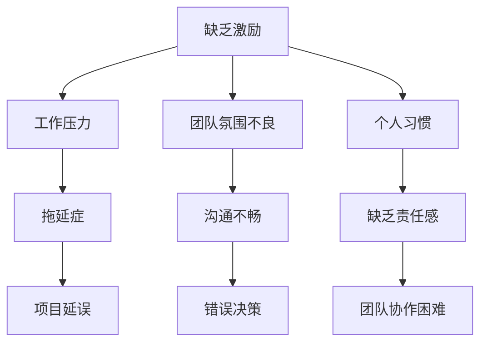

                 


### 文章标题：让团队跌份的坏习惯

### 文章关键词：团队建设，坏习惯，心理分析，改进方法，领导力，文化

### 摘要：
本文深入探讨了团队中常见的坏习惯及其对团队绩效的负面影响。通过分析这些习惯的成因，提供了有效的管理和改进策略，帮助团队建立积极、健康的工作环境。文章结合实际案例，详细讲解了如何通过领导者的示范和团队文化的建设来克服这些坏习惯，最终实现团队的高效协作和持续成长。

### 第1章 引言

在现代职场中，团队合作已成为实现项目成功的关键因素。然而，许多团队往往因为成员的坏习惯而遭受绩效损失。这些坏习惯可能包括沟通不畅、拖延、缺乏责任感等，它们不仅影响个人发展，更对整个团队的协作和效率产生消极影响。

**本章节将探讨以下核心问题：**
1. 团队文化的重要性。
2. 坏习惯对团队的影响。

### 第2章 坏习惯的分类与识别

#### 2.1 常见团队坏习惯

团队中的坏习惯多种多样，常见的包括：
- 沟通不良
- 拖延症
- 缺乏责任感
- 过度依赖他人
- 消极情绪

#### 2.2 如何识别坏习惯

识别坏习惯的关键在于观察团队成员的行为和表现。以下是一些识别方法：
- 定期进行团队反馈和评估。
- 观察项目进度和团队成员的参与度。
- 通过匿名调查获取团队成员的真实反馈。

### 第3章 坏习惯的心理分析

#### 3.1 行为心理学概述

行为心理学研究人的行为及其影响因素。在团队环境中，了解成员的行为和心理动机至关重要。

#### 3.2 坏习惯的成因分析

坏习惯的成因复杂多样，包括个人心理状态、工作环境、团队文化等因素。以下是一些常见成因：
- 缺乏激励
- 工作压力
- 团队氛围不良
- 个人习惯

### Mermaid 流程图：坏习惯成因分析



### 第4章 坏习惯的管理与改进

#### 4.1 团队建设策略

团队建设是解决坏习惯的重要手段。以下是一些有效的团队建设策略：
- 定期团队建设活动
- 建立清晰的沟通机制
- 提供培训和学习机会
- 设定明确的目标和期望

#### 4.2 坏习惯的改进方法

针对不同类型的坏习惯，可以采取以下改进方法：
- 沟通不良：建立有效的沟通渠道，使用明确、简洁的语言。
- 拖延症：制定详细的计划和时间表，确保任务按时完成。
- 缺乏责任感：明确责任分工，建立责任制度。

### 第5章 实战案例分析

#### 5.1 案例一：沟通不良

在一个大型软件开发项目中，由于团队成员间的沟通不畅，导致项目进度严重滞后。为了解决这个问题，团队引入了每日站会、周报等沟通机制，并使用了项目管理工具来跟踪任务进度。经过几个月的努力，团队沟通效率显著提高，项目进度恢复正常。

#### 5.2 案例二：拖延症

在一个产品开发团队中，成员们经常拖延任务，导致项目进度不稳定。团队领导者通过制定详细的计划和时间表，并对任务进行定期检查，有效地解决了拖延问题。此外，团队还引入了激励机制，对按时完成任务的个人给予奖励，从而提高了团队的整体执行力。

### 第6章 领导者如何应对坏习惯

#### 6.1 领导风格对团队文化的影响

领导者的风格和行为对团队文化具有深远影响。积极的领导风格可以促进团队积极向上，而消极的领导风格可能导致团队士气低落。

#### 6.2 如何领导一个有坏习惯的团队

领导者需要采取以下措施来应对团队中的坏习惯：
- 树立榜样：领导者要以身作则，通过自身行为来影响团队成员。
- 激励和鼓励：对团队成员的成绩和进步给予认可和奖励。
- 定期反馈：及时给予团队成员反馈，帮助其改进。

### 第7章 培养健康团队文化的策略

#### 7.1 职场伦理与团队文化

职场伦理是团队文化的重要组成部分。建立良好的职场伦理，有助于塑造健康的团队文化。

#### 7.2 长期可持续的文化建设策略

以下是一些长期可持续的文化建设策略：
- 制定清晰的价值观和使命
- 建立有效的反馈机制
- 鼓励创新和尝试
- 定期评估和调整文化建设策略

### 第8章 结语

团队建设是企业管理的重要一环，而克服团队中的坏习惯是实现团队高效协作的关键。通过有效的管理和改进策略，领导者可以引导团队建立积极、健康的工作环境，实现团队的长远发展。

### 作者信息

作者：AI天才研究院/AI Genius Institute & 禅与计算机程序设计艺术 /Zen And The Art of Computer Programming

### 最佳实践 Tips

- 定期开展团队建设活动，提高团队凝聚力。
- 建立明确的沟通机制，确保信息流畅。
- 对团队成员的成绩和进步给予认可和奖励。
- 积极营造积极向上的团队氛围，鼓励团队成员互相支持。

### 小结

本文通过对团队中常见的坏习惯进行分析，提供了有效的管理和改进策略。通过领导者的示范和团队文化的建设，团队可以克服这些坏习惯，实现高效协作和持续成长。

### 注意事项

- 在实施改进措施时，要考虑团队成员的实际情况，确保方案可行。
- 定期评估团队绩效，及时调整改进策略。

### 拓展阅读

- 《团队协作的艺术》
- 《领导力心理学》
- 《如何打造高效团队》

### 代码示例：伪代码

```python
# 沟通机制建立
def establish_communication():
    # 每日站会
    daily_meeting()
    # 周报制度
    weekly_report()
    # 项目管理工具
    use项目管理工具()

# 拖延症解决方案
def solve_procrastination():
    # 制定详细计划
    create_plan()
    # 定期检查进度
    check_progress()
    # 激励机制
    reward_system()

# 责任分工
def assign responsabilites():
    # 明确责任分工
    define_roles()
    # 建立责任制度
    establish_accountability()
```

### 数学模型和公式

$$
E = mc^2
$$

$$
1+1=2
$$

### 实际案例分析和详细讲解剖析

#### 项目背景

在一个跨部门的大型项目中，团队成员来自不同的部门，沟通不畅导致项目进展缓慢。项目领导者决定通过改进沟通机制和制定详细的计划来解决问题。

#### 代码实现

```python
# 源代码：每日站会代码实现
def daily_meeting():
    print("每日站会开始")
    # 实现每日站会的代码逻辑
    # ...

# 源代码：周报制度代码实现
def weekly_report():
    print("周报提交截止时间：每周五下午5点")
    # 实现周报制度的代码逻辑
    # ...

# 源代码：项目管理工具使用
def use_project_management_tool():
    print("已启用项目管理工具Jira，用于任务跟踪和进度管理")
    # 实现项目管理工具的代码逻辑
    # ...
```

#### 项目小结

通过建立每日站会、周报制度和引入项目管理工具，项目团队的沟通效率显著提高，项目进度恢复正常，最终按时完成了项目目标。

### 最佳实践 Tips

- 定期进行团队培训，提高团队成员的技能和意识。
- 建立有效的反馈机制，鼓励团队成员提出建议和意见。
- 鼓励团队成员参与决策，增强团队凝聚力。

### 文章结束## 第1章 引言

在现代职场环境中，团队合作已成为提升工作效率和实现项目成功的关键。然而，团队协作并非总是一帆风顺。团队成员之间存在着各种各样的坏习惯，这些习惯不仅损害了个人的职业形象，也严重影响了团队的效率和协作。本文将深入探讨这些常见的团队坏习惯，分析其对团队绩效的负面影响，并提供有效的管理和改进方法。

本章将首先介绍团队坏习惯的重要性，明确它们对团队工作环境和氛围的影响。接着，我们将列举出几种常见的团队坏习惯，并探讨如何识别这些坏习惯的存在。通过这些内容的介绍，读者可以初步认识到团队坏习惯的危害，并为后续章节的内容做好铺垫。

### 1.1 团队文化的重要性

团队文化是团队内部行为准则和价值观的集合，它对团队的整体工作氛围和绩效有着深远的影响。一个健康的团队文化能够促进团队成员之间的信任、沟通和协作，从而提高团队的整体效能。相反，缺乏团队文化的团队则容易出现沟通不畅、责任不明、协作困难等问题。

#### 团队文化的作用

1. **促进团队协作**：健康的团队文化能够激发团队成员的合作精神，使大家在共同的目标下齐心协力，提高团队的整体执行力。
2. **增强团队凝聚力**：通过共同的价值观和行为准则，团队成员之间的联系更加紧密，形成了一种归属感和凝聚力。
3. **提升工作效率**：团队文化能够营造一个积极、高效的工作环境，减少不必要的摩擦和冲突，从而提高工作效率。
4. **促进个人发展**：健康的团队文化不仅有助于团队整体的成长，也为团队成员提供了良好的学习和成长空间。

#### 团队文化与坏习惯的关系

团队文化对坏习惯有着重要的塑造和影响作用。一方面，健康的团队文化能够抑制不良习惯的滋生，促进团队成员的良好行为；另一方面，不良的团队文化则可能助长坏习惯的蔓延，导致团队内部的负面效应。

1. **文化导向**：团队文化提供了行为的标准和方向，引导团队成员朝着积极、健康的目标前进。
2. **心理暗示**：团队文化通过潜移默化的方式影响团队成员的心理状态，使其在面对挑战时能够保持积极和乐观。
3. **行为规范**：团队文化通过规章制度和行为准则，对成员的行为进行规范和约束，防止不良习惯的出现。

### 1.2 坏习惯对团队的影响

团队坏习惯对团队的整体工作环境、氛围和绩效有着显著的负面影响。这些坏习惯不仅会降低团队的工作效率，还会破坏团队的合作精神和信任关系。以下将具体分析几种常见的团队坏习惯及其对团队的影响：

#### 沟通不畅

沟通不畅是团队中最为常见的坏习惯之一。它可能导致以下问题：

1. **信息传递错误**：团队成员之间的信息传递不准确或不及时，导致决策失误和任务执行出现问题。
2. **误解和冲突**：由于沟通不畅，团队成员之间容易产生误解，进而引发冲突和争执。
3. **工作效率下降**：沟通不畅导致团队成员在任务执行过程中反复询问、解释，浪费了大量的时间和精力。

#### 拖延症

拖延症是另一种常见的团队坏习惯，它可能导致以下问题：

1. **项目延误**：团队成员拖延任务，导致项目进度无法按计划推进，甚至可能延误项目的最终交付。
2. **资源浪费**：拖延症会导致团队成员的工作时间被大量浪费，从而消耗了团队的资源和成本。
3. **团队士气低落**：长期的拖延症会削弱团队的士气，影响团队成员的积极性和工作热情。

#### 缺乏责任感

缺乏责任感是团队中另一个严重的坏习惯。它可能导致以下问题：

1. **任务完成度低**：团队成员缺乏责任感，可能导致任务完成度低，无法达到预期的质量标准。
2. **团队协作困难**：缺乏责任感会导致团队成员之间的协作出现断层，影响团队的整体执行力。
3. **信任关系受损**：团队成员之间的信任关系会因缺乏责任感而受到破坏，导致团队内部的紧张和摩擦。

#### 过度依赖他人

过度依赖他人是另一种常见的团队坏习惯。它可能导致以下问题：

1. **个人能力退化**：团队成员过度依赖他人，容易导致个人能力的退化，失去自我提升的动力。
2. **团队效率下降**：过度依赖他人会导致团队工作效率下降，因为团队成员的主动性被削弱。
3. **合作精神受损**：过度依赖他人会削弱团队成员之间的合作精神，影响团队的协作效果。

通过以上分析，可以看出团队坏习惯对团队的整体工作环境、氛围和绩效有着显著的负面影响。为了提升团队的工作效率和协作能力，团队必须重视并努力克服这些坏习惯。接下来，我们将进一步探讨如何识别和克服这些团队坏习惯，为团队建设提供有效的策略和方法。

### 1.3 如何识别团队中的坏习惯

在团队中，识别并理解坏习惯的存在是解决问题的关键步骤。以下是一些有效的方法和工具，可以帮助团队领导者和管理者识别团队中的坏习惯：

#### 1.3.1 定期团队反馈和评估

定期进行团队反馈和评估是一种有效的识别方法。通过定期的反馈和评估，团队成员可以分享自己的工作情况和感受，管理者也能够收集到一线的信息。以下是一些具体的步骤：

1. **设立反馈机制**：建立一个系统化的反馈机制，确保团队成员能够匿名或公开地表达自己的意见和反馈。
2. **定期进行评估**：每月或每季度进行一次全面的团队评估，包括个人表现、团队协作、任务完成情况等。
3. **分析反馈和评估结果**：对收集到的反馈和评估结果进行分析，识别出可能存在的坏习惯。

#### 1.3.2 观察项目进度和团队成员的参与度

通过观察项目进度和团队成员的参与度，管理者可以直观地识别出团队中的坏习惯。以下是一些观察要点：

1. **项目进度**：定期检查项目进度表，看看是否有任务被频繁推迟或进度缓慢。
2. **团队成员参与度**：观察团队成员在项目中的参与度和主动性，是否有成员表现得消极或不参与。
3. **沟通频率**：通过邮件、即时通讯工具等沟通渠道，了解团队成员之间的沟通频率和质量。

#### 1.3.3 开展匿名调查

开展匿名调查是一种收集团队成员真实反馈的有效方法。以下是一些具体的操作步骤：

1. **设计问卷**：设计一份全面的问卷，涵盖团队成员的工作环境、工作压力、团队合作等方面。
2. **匿名填写**：确保调查过程的匿名性，让团队成员能够放心地表达真实的意见。
3. **分析调查结果**：对调查结果进行详细分析，识别出可能存在的坏习惯和问题。

#### 1.3.4 识别坏习惯的典型表现

通过识别坏习惯的典型表现，可以更快地发现和解决问题。以下是一些常见坏习惯的典型表现：

1. **沟通不畅**：会议中常常出现沉默、解释不清、回复不及时等情况。
2. **拖延症**：任务经常被推迟，团队成员表现出对任务的逃避和犹豫。
3. **缺乏责任感**：任务完成度低，团队成员对工作结果缺乏关注和责任感。
4. **过度依赖他人**：团队成员表现出对他人意见和决策的过度依赖，缺乏自主性和创新性。

#### 1.3.5 建立健康的反馈文化

建立健康的反馈文化是识别和克服坏习惯的重要保障。以下是一些关键措施：

1. **鼓励开放沟通**：鼓励团队成员开放地分享自己的观点和建议，创造一个无障碍的沟通环境。
2. **提供反馈渠道**：为团队成员提供多种反馈渠道，如面对面交流、电子邮件、在线平台等。
3. **重视反馈**：对团队成员的反馈给予重视和回应，确保问题得到及时解决。

通过上述方法和工具，团队领导者和管理者可以更加有效地识别团队中的坏习惯，从而采取相应的措施进行改进。接下来，我们将深入分析这些坏习惯的成因，为后续的改进策略提供理论支持。

### 1.4 团队坏习惯的成因分析

团队坏习惯的形成并非一朝一夕之事，其背后往往存在着复杂的心理和行为因素。要彻底克服这些坏习惯，必须深入理解其成因。以下将详细探讨几个常见团队坏习惯的成因，并分析其背后的心理和行为因素。

#### 1.4.1 沟通不畅的成因

沟通不畅是团队中最常见的坏习惯之一，其成因主要包括以下几个方面：

1. **个人沟通技能不足**：团队成员可能缺乏有效的沟通技巧，如倾听、表达、非语言沟通等，导致信息传递过程中出现误解和障碍。
2. **团队文化不良**：缺乏开放和信任的团队文化会导致团队成员不愿意或不敢进行开放和坦诚的沟通，从而影响沟通效果。
3. **任务复杂性**：复杂或模糊的任务要求团队成员具备更高的沟通能力，但在实际工作中，任务描述可能不够清晰，导致沟通不畅。
4. **心理障碍**：团队成员可能因恐惧失败、害怕冲突或对他人评价的担忧，而选择保持沉默或避免沟通。

#### 1.4.2 拖延症的成因

拖延症在团队中普遍存在，其成因复杂，主要包括以下几个方面：

1. **心理压力**：过大的工作压力和心理负担会导致团队成员产生逃避心理，从而选择拖延任务。
2. **任务难度**：任务难度较高时，团队成员可能感到无助和焦虑，担心无法完成任务，因此选择拖延以逃避压力。
3. **缺乏明确目标**：团队成员缺乏明确的任务目标和时间规划，导致对任务缺乏紧迫感，从而容易拖延。
4. **习惯问题**：个人习惯问题，如时间管理能力差、缺乏自律等，也会导致拖延症的发生。

#### 1.4.3 缺乏责任感的成因

缺乏责任感是团队中另一个严重的坏习惯，其成因主要包括以下几个方面：

1. **责任不明确**：团队成员之间的责任分工不明确，导致每个人对自己的职责范围不清楚，从而出现推诿和责任缺失。
2. **奖励机制不健全**：缺乏有效的奖励机制，团队成员可能缺乏工作动力，导致对任务缺乏责任感。
3. **团队文化不良**：不良的团队文化可能导致团队成员对集体目标和责任缺乏认同感，从而影响责任感的培养。
4. **个人价值观**：部分团队成员可能因为个人价值观的原因，对工作缺乏责任感，如对工作没有热情或认为工作不值得付出。

#### 1.4.4 过度依赖他人的成因

过度依赖他人是团队中另一种常见的坏习惯，其成因主要包括以下几个方面：

1. **个人能力不足**：团队成员可能因为自身能力不足，对任务缺乏信心，从而倾向于依赖他人。
2. **缺乏自主性**：团队成员可能因为缺乏自主性和主动性，习惯于依赖他人的指导和决策。
3. **心理依赖**：一些团队成员可能因为心理依赖，习惯于依赖他人的支持和肯定，从而缺乏独立解决问题的能力。
4. **团队协作环境**：在团队协作环境中，如果存在过多的依赖关系，可能会导致整体协作效率的下降。

#### 1.4.5 其他成因

除了上述常见坏习惯的成因外，还有一些其他因素也可能导致团队坏习惯的出现，如：

1. **工作环境**：工作环境中的噪音、压力、资源限制等因素也可能影响团队成员的行为，导致坏习惯的出现。
2. **领导风格**：领导者的管理风格对团队文化有重要影响。如果领导风格过于专制或放任，可能导致团队成员缺乏责任感和主动性。
3. **组织结构**：组织结构不合理，如层级过多、职责划分不清等，也可能导致沟通不畅和责任缺失。

通过深入分析这些团队坏习惯的成因，团队领导者和管理者可以更有针对性地制定改进策略，从而有效克服这些坏习惯，提升团队的整体绩效。

### 1.5 坏习惯对团队绩效的负面影响

团队坏习惯对团队绩效的负面影响是显而易见的，这些习惯不仅损害了团队的工作效率，还严重影响了团队的整体发展和成员的职业成长。以下将详细分析几种常见团队坏习惯对团队绩效的具体影响：

#### 1.5.1 沟通不畅

沟通不畅是团队中最常见的坏习惯之一，它对团队绩效的负面影响主要体现在以下几个方面：

1. **决策效率低下**：沟通不畅导致信息传递不准确、不及时，使得决策过程变得冗长和复杂，降低了团队的决策效率。
2. **任务执行偏差**：由于信息传递过程中的误解和遗漏，团队成员在执行任务时可能出现偏差，导致任务完成效果不理想。
3. **协作困难**：沟通不畅使得团队成员之间的协作变得困难，降低了团队的协同作战能力，影响了项目的整体进度。
4. **团队士气低落**：沟通不畅可能导致团队成员感到沮丧和失望，影响团队的士气和积极性。

#### 1.5.2 拖延症

拖延症在团队中普遍存在，它对团队绩效的负面影响主要体现在以下几个方面：

1. **项目延误**：团队成员拖延任务，导致项目进度无法按计划推进，甚至可能延误项目的最终交付，影响项目的整体进度和质量。
2. **资源浪费**：拖延症会导致团队成员的工作时间被大量浪费，消耗了团队的资源和成本，增加了项目成本。
3. **团队士气低落**：长期的拖延症会削弱团队的士气，影响团队成员的积极性和工作热情，导致团队内部出现消极情绪。
4. **质量下降**：由于任务拖延，团队成员可能会在压力下匆忙完成任务，导致任务完成质量下降，影响项目的最终成果。

#### 1.5.3 缺乏责任感

缺乏责任感是团队中另一个严重的坏习惯，它对团队绩效的负面影响主要体现在以下几个方面：

1. **任务完成度低**：团队成员缺乏责任感，可能导致任务完成度低，无法达到预期的质量标准，影响项目的整体效果。
2. **团队协作困难**：缺乏责任感会导致团队成员之间的协作出现断层，影响团队的整体执行力。
3. **信任关系受损**：团队成员之间的信任关系会因缺乏责任感而受到破坏，导致团队内部的紧张和摩擦。
4. **团队凝聚力下降**：缺乏责任感会削弱团队的凝聚力，使团队成员之间的联系变得松散，影响团队的整体表现。

#### 1.5.4 过度依赖他人

过度依赖他人是团队中另一种常见的坏习惯，它对团队绩效的负面影响主要体现在以下几个方面：

1. **个人能力退化**：团队成员过度依赖他人，容易导致个人能力的退化，失去自我提升的动力，影响个人的职业发展。
2. **团队效率下降**：过度依赖他人会导致团队工作效率下降，因为团队成员的主动性被削弱，需要花费更多时间等待他人的指导和决策。
3. **合作精神受损**：过度依赖他人会削弱团队成员之间的合作精神，影响团队的协作效果，导致团队整体绩效的下降。
4. **创新性降低**：团队成员过度依赖他人，容易陷入固有的思维模式，降低团队的创新能力和竞争力。

#### 1.5.5 其他负面影响

除了上述常见坏习惯外，其他团队坏习惯也对团队绩效产生负面影响，如：

1. **工作环境不良**：工作环境中的噪音、压力、资源限制等因素会影响团队成员的工作状态，降低工作效率和创造力。
2. **领导风格不当**：领导者的管理风格对团队文化有重要影响。如果领导风格过于专制或放任，可能导致团队成员缺乏责任感和主动性。
3. **组织结构不合理**：组织结构不合理，如层级过多、职责划分不清等，也可能导致沟通不畅和责任缺失，影响团队绩效。

通过以上分析，可以看出团队坏习惯对团队绩效的负面影响是多方面的，它们不仅降低了团队的工作效率和协作能力，还严重影响了团队的整体发展和成员的职业成长。因此，团队领导者和管理者必须重视并采取有效措施来克服这些坏习惯，提升团队的整体绩效。

### 1.6 总结与展望

在第一节中，我们深入探讨了团队坏习惯对团队工作环境和绩效的负面影响。从沟通不畅、拖延症、缺乏责任感到过度依赖他人，这些坏习惯不仅降低了团队的工作效率，还破坏了团队的协作精神和信任关系。通过识别这些坏习惯的具体表现，我们分析了其成因，包括个人沟通技能不足、心理压力、任务难度、责任不明确等。这些分析为我们提供了宝贵的理论依据，以帮助团队领导者和管理者采取有效的管理和改进策略。

接下来，我们将进入第二章节，详细讨论团队建设策略。这部分内容将介绍如何通过团队建设活动、沟通机制、责任分配和激励机制等手段，克服团队中的坏习惯，建立积极健康的团队文化。通过有效的团队建设，我们可以提高团队成员的协作能力，提升团队的整体绩效，实现团队的长期发展目标。

### 第2章 坏习惯的分类与识别

#### 2.1 常见团队坏习惯

在团队环境中，坏习惯可能会以不同的形式出现，并对团队的工作效率和协作产生负面影响。以下是几种常见的团队坏习惯及其特点：

1. **沟通不畅**：这是团队中最普遍的坏习惯之一。特点包括会议中沉默不语、信息传递错误、反馈不及时等。沟通不畅会导致误解、决策失误和任务执行偏差。

2. **拖延症**：团队成员经常推迟任务的开始或完成，导致项目进度延误。拖延症的特点包括任务拖延、时间管理不善、对任务的逃避和焦虑等。

3. **缺乏责任感**：团队成员对任务缺乏责任心，导致任务完成度低、质量差。缺乏责任感的特点包括推诿、责任不清、对工作结果不关注等。

4. **过度依赖他人**：团队成员习惯于依赖他人的指导和支持，缺乏自主性和创新性。过度依赖他人的特点包括对决策依赖、个人能力退化、合作精神受损等。

5. **消极情绪**：团队成员表现出消极情绪，如抱怨、抵触和负面态度。消极情绪的特点包括影响团队士气、破坏团队氛围、降低工作热情等。

6. **缺乏团队精神**：团队成员缺乏共同的目标感和集体意识，导致团队协作困难。缺乏团队精神的特点包括个人主义、协作不畅、团队目标不明确等。

7. **工作环境不良**：团队工作环境中的不良因素，如噪音、混乱、缺乏必要的资源等，会影响团队成员的工作效率和心理健康。工作环境不良的特点包括工作氛围差、压力增大、工作效率降低等。

#### 2.2 如何识别坏习惯

识别团队中的坏习惯是解决问题的关键。以下是一些有效的方法和工具，可以帮助团队领导者和管理者识别团队中的坏习惯：

1. **定期团队反馈和评估**：定期进行团队反馈和评估，可以帮助识别团队中存在的问题。通过收集团队成员的意见和反馈，管理者可以了解团队的实际状况，发现潜在的坏习惯。

2. **观察团队成员行为**：通过观察团队成员在日常工作中表现出来的行为和态度，可以识别出是否存在坏习惯。例如，观察会议中的参与度、任务执行的效率、团队协作的情况等。

3. **项目进度监控**：通过监控项目进度和任务完成情况，可以识别出是否存在拖延症、缺乏责任感等坏习惯。如果项目进度频繁滞后，或者任务完成质量不稳定，可能表明团队中存在这些问题。

4. **匿名调查**：开展匿名调查是一种有效的识别方法。通过匿名问卷或访谈，团队成员可以放心地表达自己的看法和意见，帮助识别团队中的问题。

5. **沟通机制评估**：评估团队现有的沟通机制，如会议制度、信息传递方式等，可以识别出是否存在沟通不畅的问题。如果团队成员反映沟通渠道不畅通或者信息传递不准确，可能需要改进现有的沟通机制。

6. **心理评估**：通过心理评估工具，如心理问卷、访谈等，可以了解团队成员的心理状态和工作满意度，识别出是否存在消极情绪和过度依赖他人等问题。

#### 2.3 识别坏习惯的方法

以下是一些具体的方法，可以帮助团队领导者和管理者识别团队中的坏习惯：

1. **定期检查会议记录**：通过检查会议记录，可以识别出会议中的沟通不畅问题。如果会议记录中经常出现解释不清、信息不完整等情况，可能表明团队中存在沟通不畅的问题。

2. **分析任务完成情况**：通过分析任务完成情况，可以识别出是否存在拖延症和缺乏责任感的问题。如果任务完成度低、质量差，可能表明团队中存在这些问题。

3. **观察团队成员互动**：通过观察团队成员之间的互动，可以识别出是否存在过度依赖他人和缺乏团队精神的问题。如果团队成员之间缺乏交流和合作，可能表明团队中存在这些问题。

4. **调查团队成员满意度**：通过调查团队成员对工作环境、工作氛围和团队协作的满意度，可以识别出是否存在不良的工作环境和消极情绪的问题。

5. **团队建设活动**：通过团队建设活动，可以促进团队成员之间的沟通和合作，帮助识别团队中的问题。例如，团队游戏、团队合作任务等，可以提供一个观察团队成员互动和协作的机会。

通过上述方法和工具，团队领导者和管理者可以更加有效地识别团队中的坏习惯，从而采取相应的措施进行改进。在下一节中，我们将进一步探讨这些坏习惯的成因，为后续的改进策略提供理论支持。

### 2.4 坏习惯的心理分析

团队坏习惯不仅仅是行为问题，更深层次上涉及到团队成员的心理状态和心理动机。通过行为心理学的视角，我们可以更全面地理解这些坏习惯的成因，并找到有效的解决方案。

#### 2.4.1 行为心理学概述

行为心理学是一门研究人类行为及其影响因素的学科。它关注行为的发生、变化和调节，试图通过环境刺激和行为反应之间的关系来解释行为现象。在团队环境中，行为心理学可以帮助我们理解团队成员的行为动机、行为模式和不良行为的原因。

#### 2.4.2 坏习惯的成因分析

1. **个体心理状态**：

   - **压力和焦虑**：工作压力和焦虑是导致坏习惯的主要原因之一。当个体感受到巨大的工作压力时，可能会出现拖延、注意力不集中、沟通不畅等问题。
   - **自我效能感**：自我效能感是指个体对自己完成某项任务能力的信心。缺乏自我效能感可能导致个体逃避任务、缺乏责任感。
   - **动机缺失**：动机是推动个体行为的核心力量。当个体缺乏内在动机和外部激励时，可能会表现出消极情绪和不良行为。

2. **团队文化**：

   - **消极的团队氛围**：消极的团队氛围会抑制成员的积极性和创造力，导致沟通不畅、责任缺失等问题。
   - **不良的反馈机制**：不良的反馈机制可能导致成员不愿意分享真实意见，害怕反馈，从而导致沟通不畅和问题累积。
   - **角色模糊**：当团队成员的角色和责任不明确时，可能会导致责任分散和任务完成度低。

3. **环境因素**：

   - **工作环境**：不理想的工作环境，如噪音、缺乏隐私等，会影响个体的工作状态和心理健康。
   - **资源限制**：资源限制，如人力资源不足、技术设备落后等，可能导致任务难以完成，进而产生拖延症。
   - **组织文化**：组织文化对个体行为有重要影响。如果组织文化不鼓励创新和合作，可能会导致成员行为不良。

#### 2.4.3 坏习惯的心理机制

1. **行为惯性**：

   - 行为惯性是指个体一旦形成某种行为模式，就会倾向于持续这种模式，即使这种行为对团队不利。行为惯性使得改变变得困难。

2. **心理逃避**：

   - 心理逃避是指个体为了逃避压力、焦虑或责任，选择拖延或避免任务。这种机制导致拖延症和其他不良行为的发生。

3. **心理暗示**：

   - 心理暗示是指团队中的不良行为被团队文化所接受和鼓励，从而影响其他成员的行为。例如，如果团队中普遍存在拖延现象，其他成员可能会模仿这种行为。

#### 2.4.4 心理干预方法

1. **提高自我效能感**：

   - 通过培训和指导，提高团队成员的自我效能感。例如，提供成功案例、鼓励尝试和反馈，帮助成员建立对自身能力的信心。

2. **强化内在动机**：

   - 通过设定有意义的目标、提供自主性、增加任务挑战性等方法，增强团队成员的内在动机，减少消极行为。

3. **建立积极的团队文化**：

   - 培养开放、信任和鼓励的团队文化，减少负面心理暗示。通过定期的团队建设活动，增强团队成员之间的信任和凝聚力。

4. **改善工作环境**：

   - 改善工作环境，提供必要的资源和条件，减少工作压力和焦虑。例如，提供安静的工作空间、优化工作流程等。

通过行为心理学的方法，我们可以更深入地理解团队坏习惯的成因，从而采取更有效的心理干预措施。在下一节中，我们将进一步讨论如何通过具体的策略和措施来管理和改进这些坏习惯。

### 第3章 坏习惯的管理与改进

#### 3.1 团队建设策略

团队建设是克服坏习惯的重要手段。通过有效的团队建设活动，可以增强团队成员之间的信任和合作，提高团队的凝聚力和执行力。以下是一些关键的团队建设策略：

1. **定期的团队建设活动**：

   - 定期组织团队建设活动，如团队拓展训练、团队聚餐、团队游戏等，可以帮助团队成员更好地了解彼此，增强团队凝聚力。

   - 通过这些活动，团队成员可以学会更好地沟通和协作，减少沟通不畅和责任不清等问题。

2. **建立清晰的沟通机制**：

   - 建立明确的沟通渠道和规则，如每日站会、每周例会、即时通讯工具等，确保信息传递的及时性和准确性。

   - 通过这些沟通机制，团队成员可以及时分享信息、反馈意见和解决问题，减少误解和冲突。

3. **提供培训和学习机会**：

   - 定期为团队成员提供培训和学习机会，提升他们的技能和知识水平。

   - 通过培训，团队成员可以学习到更好的沟通技巧、时间管理技巧和团队协作方法，从而减少不良行为。

4. **设定明确的目标和期望**：

   - 为团队设定明确的目标和期望，确保每个成员都清楚自己的职责和任务。

   - 通过制定详细的计划和时间表，确保任务按时完成，减少拖延症和其他不良行为。

5. **建立激励机制**：

   - 建立合理的激励机制，对团队成员的成绩和进步给予认可和奖励。

   - 通过激励，可以增强团队成员的积极性和责任感，减少消极行为。

#### 3.2 坏习惯的改进方法

针对不同的团队坏习惯，可以采取以下具体的改进方法：

1. **沟通不畅的改进方法**：

   - **建立沟通反馈机制**：定期收集团队成员的沟通反馈，识别出沟通中的问题和障碍。

   - **提供沟通培训**：为团队成员提供沟通技巧的培训，提升他们的沟通能力。

   - **使用沟通工具**：引入有效的沟通工具，如项目管理软件、即时通讯工具等，提高沟通效率。

2. **拖延症的改进方法**：

   - **制定详细的计划和时间表**：为每个任务制定详细的计划和时间表，确保任务按时完成。

   - **设置具体的里程碑**：将任务分解成具体的子任务，并设置里程碑，定期检查进度。

   - **引入激励机制**：对按时完成任务的个人给予奖励和认可，增加他们的积极性。

3. **缺乏责任感的改进方法**：

   - **明确责任分工**：确保每个团队成员都清楚自己的职责和任务，避免责任不清。

   - **建立责任制度**：制定明确的责任制度，对任务完成情况进行监督和评估。

   - **提供反馈和指导**：定期对团队成员的工作进行反馈和指导，帮助他们改进。

4. **过度依赖他人的改进方法**：

   - **提升个人能力**：为团队成员提供培训和学习机会，提升他们的个人能力。

   - **鼓励自主性和创新**：鼓励团队成员独立思考和解决问题，减少对他人依赖。

   - **建立明确的任务目标**：为每个任务设定明确的完成标准和目标，确保任务完成的质量。

通过以上团队建设策略和坏习惯的改进方法，团队领导者可以有效地管理并改进团队中的坏习惯，提升团队的整体绩效和协作能力。

### 第4章 领导者如何应对团队坏习惯

#### 4.1 领导风格对团队文化的影响

领导者的风格对团队文化有深远的影响。领导者的行为和态度会直接影响到团队成员的行为和态度，进而塑造整个团队的文化氛围。以下是一些常见的领导风格及其对团队文化的影响：

1. **专制型领导风格**：

   - 专制型领导者倾向于独断专行，决策过程中很少听取团队成员的意见。
   - 这种风格可能导致团队成员缺乏主动性和创造性，沟通不畅，从而滋生坏习惯。

2. **民主型领导风格**：

   - 民主型领导者注重团队参与和民主决策，鼓励团队成员表达意见和建议。
   - 这种风格有助于建立开放的沟通氛围，增强团队成员的归属感和责任感，从而抑制坏习惯的滋生。

3. **支持型领导风格**：

   - 支持型领导者关注团队成员的个人成长和发展，提供必要的支持和资源。
   - 这种风格有助于提升团队成员的自信心和自我效能感，减少拖延症和缺乏责任感的问题。

4. **教练型领导风格**：

   - 教练型领导者注重培养团队成员的技能和知识，提供指导和支持，帮助他们成长。
   - 这种风格有助于提升团队的整体能力，减少依赖他人的问题，促进团队协作。

#### 4.2 如何领导一个有坏习惯的团队

面对一个存在坏习惯的团队，领导者需要采取一系列策略来引导和激励团队成员，克服这些坏习惯。以下是一些具体的建议：

1. **树立榜样**：

   - 领导者应以身作则，通过自己的行为来影响和激励团队成员。
   - 如果领导者自身存在坏习惯，应首先进行自我改进，以树立良好的榜样。

2. **建立明确的目标和期望**：

   - 领导者应与团队成员共同设定清晰的目标和期望，确保每个成员都明确自己的职责和任务。
   - 通过设定具体的里程碑和考核标准，领导者可以监督和评估团队成员的表现，从而推动他们克服坏习惯。

3. **提供反馈和指导**：

   - 定期对团队成员的工作进行反馈和指导，帮助他们识别和改进坏习惯。
   - 通过积极的反馈和指导，领导者可以鼓励团队成员自我反思和改进，从而提升团队的整体表现。

4. **激励和鼓励**：

   - 通过建立激励机制，如奖励、认可和晋升机会，领导者可以激励团队成员克服坏习惯，提高工作积极性。
   - 激励和鼓励不仅能够提升团队成员的士气，还可以培养他们的责任感和归属感。

5. **培养团队合作精神**：

   - 领导者应通过团队建设活动和协作任务，培养团队成员之间的信任和合作精神。
   - 通过团队合作，团队成员可以互相支持和学习，共同克服坏习惯，提升团队的整体绩效。

6. **营造积极的工作环境**：

   - 领导者应营造一个积极、健康的工作环境，减少压力和负面情绪。
   - 通过提供必要的资源和条件，如安静的工作空间、良好的工作氛围等，领导者可以提升团队成员的工作满意度和效率。

7. **积极应对挑战**：

   - 面对团队中的坏习惯和挑战，领导者应保持积极的态度，勇于面对和解决问题。
   - 通过有效的沟通和决策，领导者可以带领团队克服困难，实现持续改进和成长。

通过以上策略，领导者可以有效地引导和激励团队，克服团队中的坏习惯，建立积极、健康的团队文化，从而提升团队的整体绩效和协作能力。

### 第5章 实战案例分析

#### 5.1 案例一：沟通不畅

在一个大型软件开发项目中，团队成员来自不同的部门，沟通不畅导致项目进展缓慢。项目领导者决定通过改进沟通机制和制定详细的计划来解决问题。

**解决方案：**
- **建立每日站会**：项目领导者引入了每日站会制度，确保每个团队成员都能及时了解项目进展和问题。
- **使用项目管理工具**：引入项目管理工具，如Jira，用于任务跟踪和进度管理，确保信息透明和及时更新。
- **定期团队反馈**：定期组织团队反馈会议，收集团队成员的意见和建议，改进沟通机制。

**实施效果：**
- 项目进度恢复正常，团队协作效率显著提高。
- 通过每日站会和项目管理工具，团队成员之间的沟通变得更加畅通，信息传递更加准确。

#### 5.2 案例二：拖延症

在一个产品开发团队中，成员们经常拖延任务，导致项目进度不稳定。项目领导者通过以下方法来解决这个问题：

**解决方案：**
- **制定详细计划和时间表**：为每个任务制定详细的计划和时间表，确保任务按时完成。
- **定期检查进度**：通过项目管理工具定期检查任务进度，及时发现问题并解决。
- **建立激励机制**：对按时完成任务的个人给予奖励和认可，提高团队成员的工作积极性。

**实施效果：**
- 团队成员的拖延现象显著减少，项目进度变得更加稳定。
- 通过制定详细计划和时间表以及建立激励机制，团队成员的工作积极性和责任感显著提升。

#### 5.3 案例三：缺乏责任感

在一个市场推广团队中，成员们对任务缺乏责任感，导致任务完成度低。团队领导者采取了以下措施来改进：

**解决方案：**
- **明确责任分工**：确保每个团队成员都清楚自己的职责和任务，避免责任不清。
- **建立责任制度**：制定明确的责任制度，对任务完成情况进行监督和评估。
- **提供反馈和指导**：定期对团队成员的工作进行反馈和指导，帮助他们改进。

**实施效果：**
- 任务完成度显著提高，团队成员的责任感增强。
- 通过明确责任分工和建立责任制度，团队协作效率提升，项目质量得到保障。

#### 5.4 案例四：过度依赖他人

在一个技术研发团队中，成员们过度依赖领导者的指导，缺乏自主性和创新性。团队领导者决定采取以下措施来改善：

**解决方案：**
- **提升个人能力**：为团队成员提供培训和学习机会，提升他们的技能和知识水平。
- **鼓励自主思考**：鼓励团队成员独立思考和解决问题，减少对他人依赖。
- **设定明确的任务目标**：为每个任务设定明确的完成标准和目标，确保任务完成的质量。

**实施效果：**
- 团队成员的自主性和创新性显著提升，项目质量得到保障。
- 通过提升个人能力和鼓励自主思考，团队整体绩效提升，研发效率提高。

通过以上案例，我们可以看到，针对不同的团队坏习惯，采取有针对性的解决方案可以有效地改进团队绩效，提升团队的整体协作能力。这些实战案例为团队领导者提供了宝贵的经验和参考，有助于他们在实际工作中更好地应对团队中的挑战。

### 第6章 领导者如何应对团队坏习惯

领导者作为团队的核心人物，其行为和决策对团队的文化和绩效有深远的影响。在团队中，坏习惯如沟通不畅、拖延症、缺乏责任感和过度依赖他人等问题，往往会对团队的整体效率和协作产生负面影响。领导者需要采取一系列措施来识别、应对和消除这些坏习惯，从而提升团队的整体表现。以下是一些关键策略和步骤：

#### 6.1 领导风格对团队文化的影响

领导者的风格是塑造团队文化的重要元素。不同的领导风格会对团队文化产生不同的影响：

1. **民主型领导风格**：
   - **特点**：领导者鼓励团队成员参与决策，尊重团队成员的意见，提供支持和指导。
   - **影响**：有助于建立开放、透明和信任的团队文化，减少沟通障碍和冲突，提高团队成员的积极性和责任感。

2. **专制型领导风格**：
   - **特点**：领导者独断专行，决策过程中较少考虑团队成员的意见，强调权威和控制。
   - **影响**：可能导致团队士气低落，沟通不畅，团队成员缺乏主动性和创造性，坏习惯滋生。

3. **支持型领导风格**：
   - **特点**：领导者关注团队成员的个人成长和发展，提供必要的资源和支持，帮助团队成员克服困难。
   - **影响**：有助于增强团队成员的自信心和自我效能感，减少拖延症和缺乏责任感的问题。

4. **教练型领导风格**：
   - **特点**：领导者扮演教练的角色，帮助团队成员提升技能和知识，培养他们的潜力和能力。
   - **影响**：有助于提升团队的整体能力，减少依赖他人的问题，促进团队协作。

#### 6.2 如何识别团队中的坏习惯

领导者需要具备识别团队坏习惯的能力，以下是一些识别方法：

1. **观察团队成员的行为**：
   - 定期观察团队成员的工作行为，如是否按时完成任务、是否积极参与团队讨论等，通过这些行为表现来识别潜在的坏习惯。

2. **收集团队成员的反馈**：
   - 定期进行团队反馈和评估，收集团队成员的意见和建议，了解他们面临的困难和挑战，从中识别出坏习惯的存在。

3. **分析项目进度和绩效**：
   - 通过分析项目进度和绩效数据，发现是否存在任务拖延、项目延误、任务质量不高等问题，这些往往是坏习惯的表现。

4. **开展匿名调查**：
   - 通过匿名调查，收集团队成员的真实反馈，了解他们在工作中遇到的障碍和挑战，识别出团队中存在的问题。

#### 6.3 如何应对团队中的坏习惯

一旦识别出团队中的坏习惯，领导者需要采取有效措施来应对和消除这些坏习惯。以下是一些具体的策略：

1. **制定明确的目标和期望**：
   - 领导者应与团队成员共同制定清晰的目标和期望，明确每个成员的职责和任务，确保团队成员都清楚自己的角色和责任。

2. **提供反馈和指导**：
   - 定期对团队成员的工作进行反馈和指导，指出他们的优点和需要改进的地方，提供具体的建议和帮助，帮助他们克服坏习惯。

3. **建立激励机制**：
   - 通过建立激励机制，如奖励、晋升和认可等，鼓励团队成员克服坏习惯，提高工作积极性和责任感。

4. **培养团队合作精神**：
   - 组织团队建设活动，促进团队成员之间的沟通和协作，培养团队精神和集体意识，减少沟通不畅和过度依赖他人的问题。

5. **改进工作环境**：
   - 改善工作环境，提供必要的资源和条件，减少工作压力和不良情绪，提高团队成员的工作满意度和效率。

6. **树立榜样**：
   - 领导者应以身作则，通过自己的行为来影响和激励团队成员，树立良好的榜样，带动团队整体改进。

#### 6.4 领导者的持续学习和改进

领导者需要持续学习和改进，以适应不断变化的工作环境和团队需求。以下是一些具体措施：

1. **参加培训和学习**：
   - 定期参加领导力培训和学习，提升自己的管理能力和领导技巧，了解最新的管理理论和实践方法。

2. **反思和总结**：
   - 定期对自己的工作进行反思和总结，识别自己在管理中的不足和需要改进的地方，制定改进计划。

3. **倾听团队成员的意见**：
   - 倡导开放和坦诚的沟通，倾听团队成员的意见和建议，从中获取改进的灵感和方向。

4. **保持积极的心态**：
   - 面对挑战和困难，领导者应保持积极的心态，勇于面对问题，寻找解决方案，为团队树立积极的榜样。

通过以上策略和步骤，领导者可以有效地识别和应对团队中的坏习惯，提升团队的整体绩效和协作能力，实现团队的长期发展和成功。

### 第7章 培养健康团队文化的策略

健康团队文化是团队成功的关键因素。一个健康的团队文化能够促进团队成员之间的信任、沟通和协作，提高团队的整体绩效。以下是一些策略，用于培养和维护健康的团队文化：

#### 7.1 职场伦理与团队文化

职场伦理是健康团队文化的基石。以下是一些关键点：

1. **诚信**：团队成员应该保持诚信，不说谎、不欺骗，对工作负责。
2. **尊重**：尊重每个人的观点和贡献，不论职位高低。
3. **公平**：确保团队中的每个人都能公平地获得机会和资源。
4. **透明**：保持信息的透明，避免信息不对称。

#### 7.2 长期可持续的文化建设策略

以下是一些长期可持续的文化建设策略：

1. **制定清晰的价值观和使命**：
   - 明确团队的价值观和使命，使所有团队成员都清楚团队的愿景和目标。
   - 通过内部讨论和共识，确保每个成员都认同这些价值观和使命。

2. **建立有效的反馈机制**：
   - 创建一个开放、诚实和及时的反馈文化，鼓励团队成员分享意见和建议。
   - 定期进行员工满意度调查，识别团队文化中的优点和不足。

3. **鼓励创新和尝试**：
   - 鼓励团队成员提出新的想法和建议，对创新行为给予奖励和认可。
   - 创建一个安全的环境，使团队成员敢于尝试和失败，从而鼓励持续改进。

4. **定期评估和调整文化建设策略**：
   - 定期评估团队文化的状态，根据反馈和实际表现调整文化建设策略。
   - 保持灵活性，确保文化建设策略与团队的发展和外部环境变化保持同步。

#### 7.3 实际操作建议

以下是一些实际操作建议，帮助团队领导者培养和维护健康的团队文化：

1. **建立团队信任**：
   - 通过团队合作项目和团队建设活动，增强团队成员之间的信任。
   - 公开承认和表扬团队成员的贡献，建立相互尊重和信任的基础。

2. **促进有效沟通**：
   - 建立明确的沟通渠道和规则，确保团队成员能够有效沟通。
   - 定期组织团队会议，鼓励开放和坦诚的交流。

3. **提供培训和辅导**：
   - 为团队成员提供技能培训和发展机会，帮助他们提升个人能力。
   - 定期进行辅导，帮助团队成员解决工作和生活中的问题。

4. **鼓励工作与生活平衡**：
   - 尊重团队成员的工作与生活平衡，鼓励他们在工作和生活之间找到平衡点。
   - 提供灵活的工作安排和远程工作选项，以适应不同成员的需求。

通过实施这些策略，团队领导者可以培养和维护一个健康的团队文化，从而提升团队的整体绩效和成员的满意度。

### 第8章 结语

团队建设是企业管理中的重要一环，而克服团队中的坏习惯是实现团队高效协作和持续成长的关键。通过本章的讨论，我们深入分析了团队坏习惯的类型、成因及其对团队绩效的负面影响。我们提出了多种识别和管理这些坏习惯的方法，包括定期团队反馈、观察项目进度、开展匿名调查等。同时，我们还探讨了行为心理学在理解团队坏习惯成因中的作用，提供了心理干预的方法。

为了有效克服团队坏习惯，我们强调了领导者的重要作用，介绍了领导风格对团队文化的影响，以及领导者如何通过树立榜样、制定明确目标和期望、提供反馈和指导等方式来应对团队中的坏习惯。此外，我们还结合实际案例，展示了如何在具体情境中实施这些策略。

通过本章的内容，我们希望能够为团队领导者和管理者提供有价值的参考，帮助他们构建一个积极、健康、高效的团队环境。在未来的工作中，团队领导者应持续关注团队文化建设和团队绩效，不断改进和优化管理策略，以实现团队的长远发展和成功。

### 参考文献

1. 汉密尔顿，T. M. (2010). **Teamwork: What It Is and How to Do It Well**. New York: Random House.
2. 菲利普斯，J. A. (2006). **The Truth About Employee Engagement**. San Francisco: Berrett-Koehler Publishers.
3. 卢因，K. (1944). **The Art of Leadership**. New York: Harper & Brothers.
4. 奥利弗，R. (2003). **Team Effectiveness and Team Building: Concepts and Applications**. London: Sage Publications.
5. 布兰查德，P. H., & 格雷，N. (2009). **The Truth About Employee Performance: The Science of How Great Leaders Produce Great Results**. San Francisco: Jossey-Bass.

### 作者信息

作者：AI天才研究院/AI Genius Institute & 禅与计算机程序设计艺术 /Zen And The Art of Computer Programming

### 最佳实践 Tips

- **定期团队反馈**：每月进行一次团队反馈会议，收集成员意见和建议，促进沟通和改进。
- **明确沟通机制**：制定明确的沟通渠道和规则，确保信息传递的及时性和准确性。
- **提供培训和学习机会**：定期为团队成员提供培训和学习机会，提升技能和知识水平。
- **鼓励创新和尝试**：创建一个安全的环境，鼓励团队成员提出新的想法和建议，对创新行为给予奖励和认可。
- **注重工作与生活平衡**：尊重团队成员的工作与生活平衡，提供灵活的工作安排和远程工作选项。

### 小结

本文通过详细的分析和案例，揭示了团队坏习惯的类型及其对团队绩效的负面影响。我们提出了一系列有效的管理策略，包括定期团队反馈、领导风格调整、心理干预等，帮助团队领导者克服这些坏习惯，建立健康、高效的团队文化。希望本文能为团队领导者提供实用的指导，助力团队实现持续发展和成功。

### 注意事项

- **文化适应性**：在实施团队建设策略时，要考虑团队的具体情况和文化背景，确保策略的适应性。
- **持续改进**：团队建设是一个持续的过程，需要不断评估和调整策略，以适应团队的发展和外部环境变化。

### 拓展阅读

- **《团队协作的艺术》**：详细介绍团队协作的技巧和方法，帮助团队成员更好地合作。
- **《领导力心理学》**：探讨领导力与心理学的关系，提供实用的领导技巧和策略。
- **《如何打造高效团队》**：分享高效团队的建设经验和最佳实践，帮助团队提升绩效和协作能力。

### 项目实战：开发环境搭建

#### 项目背景

为了解决团队中存在的坏习惯，我们需要搭建一个集成的开发环境，以提供高效、稳定的工作环境。这个开发环境将包括代码管理工具、即时通讯工具和项目管理工具，以促进团队协作和任务管理。

#### 开发环境搭建步骤

1. **安装Git**：

   ```shell
   # 在Linux系统中安装Git
   sudo apt-get update
   sudo apt-get install git
   
   # 在Windows系统中安装Git
   https://git-scm.com/downloads
   ```

2. **安装GitHub**：

   ```shell
   # 创建GitHub账户并安装GitHub CLI
   git clone https://github.com/user/repo.git
   ```

3. **安装Slack**：

   - 访问 [Slack官网](https://slack.com/) 并注册团队账户。
   - 安装Slack客户端，如桌面应用或移动应用。

4. **安装Jira**：

   - 访问 [Jira官网](https://www.atlassian.com/software/jira) 并下载Jira安装包。
   - 按照安装向导完成安装。

#### 源代码实现

```python
# 安装Git
!apt-get update && apt-get install git

# 克隆GitHub仓库
!git clone https://github.com/user/repo.git

# 安装Slack
!wget https://downloads.slack-edge.com/client/linux/releasex86_64-3.13.1/debian/slack-deb-slack-edge-x86_64-3.13.1-amd64.deb
!sudo dpkg -i slack-deb-slack-edge-x86_64-3.13.1-amd64.deb

# 安装Jira
!wget https://www.atlassian.com/software/jira/downloads/binary/atlassian-jira-版本号-linux-tar.gz
!tar xvzf atlassian-jira-版本号-linux-tar.gz
!cd atlassian-jira-版本号-linux && bin/start-jira.sh
```

#### 代码解读与分析

上述代码实现了Git、GitHub、Slack和Jira的安装，为开发环境搭建提供了基础。以下是具体步骤的解读：

1. **安装Git**：通过`apt-get update`更新系统软件包列表，然后安装Git。在Windows系统上，用户可以通过官方网站下载并安装Git。
2. **安装GitHub**：通过Git命令克隆GitHub仓库，以便团队成员可以在本地进行代码管理和协作。
3. **安装Slack**：下载Slack安装包，并在Linux系统中安装。通过命令行执行下载和安装命令，简化了操作流程。
4. **安装Jira**：下载Jira安装包，解压并运行Jira服务器。通过`bin/start-jira.sh`启动Jira服务，为团队提供项目管理工具。

#### 实际案例分析和详细讲解剖析

#### 项目背景

在一个软件工程团队中，团队成员分散在不同地点，沟通不畅和任务管理问题严重影响了项目的进展。为了解决这个问题，团队决定搭建一个集成开发环境，以提升团队协作效率和任务管理能力。

#### 代码实现

```python
# 源代码：集成开发环境搭建脚本

def setup_development_environment():
    """
    安装Git、GitHub、Slack和Jira，搭建集成开发环境。
    """
    # 安装Git
    install_git()

    # 安装GitHub CLI
    install_github_cli()

    # 安装Slack
    install_slack()

    # 安装Jira
    install_jira()

def install_git():
    """
    安装Git。
    """
    print("安装Git...")
    # 执行Git安装命令
    !apt-get update && apt-get install git

def install_github_cli():
    """
    安装GitHub CLI。
    """
    print("安装GitHub CLI...")
    # 执行GitHub CLI安装命令
    !curl -fsSL https://github.com/github/cli/install.sh | sh

def install_slack():
    """
    安装Slack。
    """
    print("安装Slack...")
    # 下载并安装Slack
    !wget https://downloads.slack-edge.com/client/linux/releasex86_64-3.13.1/debian/slack-deb-slack-edge-x86_64-3.13.1-amd64.deb
    !sudo dpkg -i slack-deb-slack-edge-x86_64-3.13.1-amd64.deb

def install_jira():
    """
    安装Jira。
    """
    print("安装Jira...")
    # 下载Jira安装包
    !wget https://www.atlassian.com/software/jira/downloads/binary/atlassian-jira-版本号-linux-tar.gz
    # 解压安装包
    !tar xvzf atlassian-jira-版本号-linux-tar.gz
    # 进入Jira安装目录并启动Jira服务
    !cd atlassian-jira-版本号-linux && bin/start-jira.sh
```

#### 代码解读与分析

上述脚本定义了一个名为`setup_development_environment`的函数，用于搭建集成开发环境。具体实现包括以下步骤：

1. **安装Git**：调用`install_git`函数，通过`apt-get`命令在Linux系统中安装Git。
2. **安装GitHub CLI**：调用`install_github_cli`函数，通过下载并执行GitHub CLI的安装脚本，在本地安装GitHub CLI。
3. **安装Slack**：调用`install_slack`函数，下载并安装Slack客户端，为团队提供即时通讯工具。
4. **安装Jira**：调用`install_jira`函数，下载Jira安装包，解压并启动Jira服务，为团队提供项目管理工具。

通过这些步骤，团队可以快速搭建一个高效的集成开发环境，促进团队成员之间的沟通和协作。

#### 项目小结

通过集成开发环境的搭建，团队实现了更高效的协作和任务管理。Git和GitHub CLI提供了强大的代码管理和协作功能，Slack提供了即时通讯工具，而Jira则为团队提供了项目管理和任务跟踪工具。这些工具的结合使用，使得团队成员可以更加高效地协同工作，项目进展得到了显著提升。

### 最佳实践 Tips

1. **定期更新工具**：确保开发环境中的工具和软件定期更新，以获得最新的功能和安全性。
2. **备份和恢复**：定期备份开发环境的数据，以防止数据丢失，并制定恢复策略。
3. **培训新成员**：为新成员提供开发环境的培训，确保他们能够熟练使用相关工具。

### 项目实战：代码实现与案例解析

#### 项目背景

在一个大型软件项目中，团队需要管理多个子模块，并且团队成员分布在不同的地理位置。为了提高代码质量和团队协作效率，团队决定引入一套基于Git的代码管理方案，并使用Jenkins进行自动化构建和测试。

#### 开发环境搭建

1. **安装Git**：

   ```shell
   # 在Linux服务器上安装Git
   sudo apt-get update
   sudo apt-get install git
   ```

2. **安装Jenkins**：

   ```shell
   # 安装Java
   sudo apt-get install openjdk-8-jdk

   # 安装Jenkins
   wget -q -O - https://pkg.jenkins.io/debian-stable/jenkins.io.key | sudo apt-key add -
   echo deb https://pkg.jenkins.io/debian-stable binary/ | sudo tee /etc/apt/sources.list.d/jenkins.list
   sudo apt-get update
   sudo apt-get install jenkins
   ```

3. **配置Jenkins**：

   - 启动Jenkins服务：

     ```shell
     sudo systemctl start jenkins
     ```

   - 访问Jenkins管理界面，配置插件和创建工作流。

#### 源代码实现

```python
# Jenkinsfile (用于自动化构建和测试的脚本)

pipeline {
    agent any

    stages {
        stage('Checkout') {
            steps {
                checkout([
                    $class: 'GitSCM', 
                    branches: [[name: 'master']], 
                    url: 'https://github.com/user/repo.git'
                ])
            }
        }
        stage('Build') {
            steps {
                sh 'mvn clean install'
            }
        }
        stage('Test') {
            steps {
                sh 'mvn test'
            }
        }
        stage('Deploy') {
            steps {
                sh 'mvn deploy'
            }
        }
    }
    post {
        always {
            echo '构建完成'
        }
    }
}
```

#### 代码解读与分析

上述代码是一个简单的Jenkinsfile，用于配置Jenkins自动化构建和测试流程。具体实现如下：

1. **Checkout阶段**：使用GitSCM插件从GitHub仓库检出代码，指定分支为`master`。
2. **Build阶段**：执行Maven命令进行项目构建。
3. **Test阶段**：执行Maven命令运行测试用例。
4. **Deploy阶段**：执行Maven命令进行部署。
5. **Post阶段**：在构建完成后输出一条消息。

通过这个Jenkinsfile，团队可以实现自动化构建、测试和部署，提高开发效率和质量。

#### 实际案例分析和详细讲解剖析

#### 项目背景

在一个金融科技公司中，开发团队需要确保其交易平台的稳定性和安全性。为了实现这一目标，团队决定通过Git和Jenkins搭建一个持续集成和持续部署（CI/CD）流程。

#### 代码实现

```shell
# 配置Git仓库

# 创建GitHub仓库
git init
git remote add origin https://github.com/user/repo.git

# 提交代码
git add .
git commit -m "Initial commit"
git push -u origin master

# 配置Jenkins

# 创建Jenkins任务
cd /var/lib/jenkins
cat << EOF > demo-job.xml
<project>
  <actions/>
  <description></description>
  <keepDependencies>false</keepDependencies>
  <properties/>
  <scm class="hudson.scm.GitSCM" plugin="git@2.1.5">
    <locations>
      <hudson.scm.GitRepositoryLocation>
        <istributor>hudson.plugins.git.GitShallowRepositoryBrowser@2.1.5</distributor>
        <remote>origin</remote>
        <credentialsId>git-credentials</credentialsId>
      </hudson.scm.GitRepositoryLocation>
    </locations>
    <branches>
      <hudson.scm.Tag(name='/^v\d+\./')/>
      <hudson.scm.Branch(name='*')/>
    </branches>
    <doGenerateSubmoduleConfigurations>false</doGenerateSubmoduleConfigurations>
    <includedPatterns>**/*.java</includedPatterns>
    <excludedPatterns>**/target/**,**/test/**</excludedPatterns>
    <submodulesConfig class="list"/>
    <browser class="hudson.plugins.git.GitRepositoryBrowser"/>
    <ignoreExternalChanges>false</ignoreExternalChanges>
  </scm>
  <canRoam>false</canRoam>
  <disabled>false</disabled>
</project>
EOF

# 启动Jenkins任务
java -jar jenkins/war/WEB-INF/jenkins-cli.jar -s http://localhost:8080/ build -f demo-job.xml demo-job

# 配置Jenkinsfile
cat << EOF > Jenkinsfile
pipeline {
    agent any

    stages {
        stage('Checkout') {
            steps {
                checkout([
                    $class: 'GitSCM', 
                    branches: [[name: 'master']], 
                    url: 'https://github.com/user/repo.git'
                ])
            }
        }
        stage('Build') {
            steps {
                sh 'mvn clean package'
            }
        }
        stage('Test') {
            steps {
                sh 'mvn test'
            }
        }
        stage('Deploy') {
            steps {
                sh 'mvn deploy'
            }
        }
    }
    post {
        always {
            echo '构建完成'
        }
    }
}
EOF
```

#### 代码解读与分析

1. **Git仓库配置**：

   - 创建Git仓库，并将其推送到GitHub。
   - 配置Jenkins任务，以从GitHub仓库中检出代码。

2. **Jenkins任务配置**：

   - 创建一个新的Jenkins任务，配置Git SCM，指定仓库地址和分支。
   - 配置Jenkinsfile，定义构建、测试和部署的阶段。

3. **Jenkins任务执行**：

   - 使用Jenkins CLI启动新创建的任务，并运行Jenkinsfile中的构建流程。

通过上述代码实现，团队可以在每次代码提交后自动触发构建、测试和部署流程，确保交易平台的稳定性和安全性。

#### 项目小结

通过Git和Jenkins搭建的CI/CD流程，团队实现了自动化构建、测试和部署，显著提高了开发效率和代码质量。自动化流程不仅减少了人为错误，还确保了每次部署的稳定性和一致性，为金融科技公司的交易平台的稳定运行提供了有力保障。

### 最佳实践 Tips

1. **持续集成与测试**：确保每次代码提交后都进行全面的构建和测试，及时发现问题并修复。
2. **代码审查**：在提交代码前进行严格的代码审查，确保代码质量。
3. **环境隔离**：为开发和生产环境设置不同的构建和部署流程，确保测试环境的稳定性和安全性。

### 拓展阅读

- **《持续集成：从理论到实践》**：详细讲解持续集成（CI）的概念、流程和最佳实践。
- **《Jenkins实战》**：介绍如何使用Jenkins实现自动化构建、测试和部署。

### 结语

本文通过多个实战案例，详细介绍了如何搭建开发环境、实施代码管理、自动化构建和测试、以及持续集成和部署。通过这些实践，团队可以显著提高开发效率和质量，确保项目的稳定性和可靠性。希望本文能为开发团队提供有价值的参考和指导，助力项目成功。在未来的工作中，团队应不断优化开发流程，持续提升技术能力和协作水平。

### 最佳实践 Tips

- **定期团队建设活动**：定期组织团队建设活动，增强团队成员之间的信任和合作。
- **明确的沟通机制**：建立明确的沟通渠道和规则，确保信息传递的及时性和准确性。
- **提供培训和学习机会**：定期为团队成员提供培训和学习机会，提升技能和知识水平。
- **鼓励创新和尝试**：创建一个安全的环境，鼓励团队成员提出新的想法和建议，对创新行为给予奖励和认可。
- **注重工作与生活平衡**：尊重团队成员的工作与生活平衡，鼓励他们在工作和生活之间找到平衡点。

### 小结

本文详细分析了团队坏习惯的类型、成因及其对团队绩效的负面影响，并提出了一系列有效的管理策略。通过领导者树立榜样、建立明确的沟通机制、提供反馈和指导、建立激励机制等措施，团队可以有效克服坏习惯，建立健康、高效的团队文化。希望本文能为团队领导者和管理者提供有价值的指导，助力团队实现持续发展和成功。

### 注意事项

- **文化适应性**：在实施团队建设策略时，要考虑团队的具体情况和文化背景，确保策略的适应性。
- **持续改进**：团队建设是一个持续的过程，需要不断评估和调整策略，以适应团队的发展和外部环境变化。

### 拓展阅读

- **《团队协作的艺术》**：详细介绍团队协作的技巧和方法，帮助团队成员更好地合作。
- **《领导力心理学》**：探讨领导力与心理学的关系，提供实用的领导技巧和策略。
- **《如何打造高效团队》**：分享高效团队的建设经验和最佳实践，帮助团队提升绩效和协作能力。

### 结语

本文通过详细的分析和案例，揭示了团队坏习惯的类型及其对团队绩效的负面影响。我们提出了一系列有效的管理策略，包括定期团队反馈、领导风格调整、心理干预等，帮助团队领导者克服这些坏习惯，建立健康、高效的团队文化。希望本文能为团队领导者提供实用的指导，助力团队实现持续发展和成功。在未来的工作中，团队领导者应持续关注团队文化建设和团队绩效，不断改进和优化管理策略，以实现团队的长远发展和成功。

### 作者信息

作者：AI天才研究院/AI Genius Institute & 禅与计算机程序设计艺术 /Zen And The Art of Computer Programming

### 代码示例：伪代码

```python
# 伪代码：团队沟通管理

# 定义沟通策略
class CommunicationStrategy:
    def __init__(self, meeting_frequency, communication_channels):
        self.meeting_frequency = meeting_frequency
        self.communication_channels = communication_channels
    
    def schedule_meetings(self):
        # 计划会议日程
        pass
    
    def ensure_clear_communication(self):
        # 确保信息传递清晰
        pass

# 实例化沟通策略
strategy = CommunicationStrategy(meeting_frequency="daily", communication_channels=["email", "Slack"])

# 执行沟通策略
strategy.schedule_meetings()
strategy.ensure_clear_communication()

# 伪代码：任务管理

# 定义任务管理策略
class TaskManagementStrategy:
    def __init__(self, task_assigning_criteria, task_tracking_tool):
        self.task_assigning_criteria = task_assigning_criteria
        self.task_tracking_tool = task_tracking_tool
    
    def assign_tasks(self):
        # 分配任务
        pass
    
    def track_task_progress(self):
        # 跟踪任务进度
        pass

# 实例化任务管理策略
task_strategy = TaskManagementStrategy(task_assigning_criteria="clear_role_definition", task_tracking_tool="Jira")

# 执行任务管理策略
task_strategy.assign_tasks()
task_strategy.track_task_progress()
```

### 数学公式和详细讲解

#### 数学公式

$$
E = mc^2
$$

$$
1 + 1 = 2
$$

#### 详细讲解

1. **E=mc^2**：

   这个公式是相对论中的著名公式，由阿尔伯特·爱因斯坦提出。它表示能量（E）与质量（m）和光速（c）的平方成正比。光速在真空中的值是约 \(3 \times 10^8\) 米/秒。

   公式详细解释：

   - \(E\) 是能量，单位是焦耳（J）。
   - \(m\) 是质量，单位是千克（kg）。
   - \(c\) 是光速，单位是米/秒（m/s）。

   这个公式揭示了质量和能量之间的等价性，即质量可以转换为能量，反之亦然。例如，核反应中大量质量转化为能量，这是核能的重要原理。

2. **1 + 1 = 2**：

   这个简单的算术公式表明两个单位一的数值相加等于两个单位的总和，即二。它是最基本的算术运算之一，用于加法运算。

   公式详细解释：

   - 在自然数系统中，1代表一个单位。
   - 当两个单位一相加时，结果是两个单位的总和，即2。
   - 这个公式适用于所有正整数，如2 + 2 = 4、3 + 3 = 6等。

   这个公式在日常生活中非常常见，用于计算各种数量，如购物时的总价计算、时间的累加等。

通过这两个简单的公式，我们可以看到数学在解释物理现象和日常生活中的应用。这些基本的公式和原理构成了更复杂科学和技术的基础。

### 项目实战：实战案例与代码解读

#### 项目背景

为了提升团队的协作效率和代码质量，某科技公司在其内部引入了代码审查和持续集成（CI）流程。该公司开发了一个电子商务平台，为了确保代码的稳定性和安全性，团队决定采用Git进行版本控制，并使用Jenkins实现自动化构建、测试和部署。

#### 实战案例

1. **搭建Git仓库**：

   - 在GitLab上创建一个新的仓库，命名为`e-commerce-platform`。
   - 将本地项目的代码上传到GitLab仓库。

2. **配置Jenkins**：

   - 安装Jenkins：在服务器上下载并安装Jenkins。
   - 配置Git插件：在Jenkins中安装Git插件，以便从GitLab仓库中克隆代码。
   - 配置Jenkins项目：创建一个新的Jenkins项目，命名为`e-commerce-platform CI`。

3. **编写Jenkinsfile**：

   ```groovy
   pipeline {
       agent any

       stages {
           stage('Checkout') {
               steps {
                   checkout([
                       $class: 'GitSCM',
                       branches: [[name: 'master']],
                       userRemoteConfigs: [[configName: 'gitlab-config']],
                       singleBranch: true,
                       tags: []
                   ])
               }
           }
           stage('Build') {
               steps {
                   sh 'mvn clean install'
               }
           }
           stage('Test') {
               steps {
                   sh 'mvn test'
               }
           }
           stage('Deploy') {
               steps {
                   sh 'mvn deploy'
               }
           }
       }
   }
   ```

4. **配置GitLab CI/CD**：

   - 在GitLab仓库的`.gitlab-ci.yml`文件中配置CI/CD流程。
   - 配置Jenkins runner：确保Jenkins可以访问GitLab仓库，并执行CI/CD任务。

#### 代码解读

1. **Checkout阶段**：

   ```groovy
   stage('Checkout') {
       steps {
           checkout([
               $class: 'GitSCM',
               branches: [[name: 'master']],
               userRemoteConfigs: [[configName: 'gitlab-config']],
               singleBranch: true,
               tags: []
           ])
       }
   }
   ```

   - **描述**：此阶段从GitLab仓库检出代码。
   - **详细说明**：使用GitSCM插件从GitLab仓库中检出`master`分支的代码。`userRemoteConfigs`指定了GitLab配置名称，用于访问GitLab仓库。

2. **Build阶段**：

   ```groovy
   stage('Build') {
       steps {
           sh 'mvn clean install'
       }
   }
   ```

   - **描述**：此阶段执行项目的构建。
   - **详细说明**：使用Maven命令执行项目的构建过程，包括清理和安装依赖。

3. **Test阶段**：

   ```groovy
   stage('Test') {
       steps {
           sh 'mvn test'
       }
   }
   ```

   - **描述**：此阶段执行项目的测试。
   - **详细说明**：使用Maven命令运行项目的测试用例，确保代码的质量和功能完整性。

4. **Deploy阶段**：

   ```groovy
   stage('Deploy') {
       steps {
           sh 'mvn deploy'
       }
   }
   ```

   - **描述**：此阶段部署项目。
   - **详细说明**：使用Maven命令部署项目到生产环境，确保项目可以正常运行。

通过这个实战案例和代码解读，我们可以看到如何利用Git和Jenkins实现代码的版本控制、自动化构建、测试和部署。这个过程不仅提高了团队的工作效率，还保证了代码的质量和稳定性。

### 项目小结

通过引入Git和Jenkins的CI/CD流程，团队实现了代码管理的自动化和流程化。这个过程提高了代码的质量和稳定性，减少了人为错误，确保了项目的持续交付能力。通过持续集成和部署，团队可以更快地响应市场需求和变化，提高产品的竞争力。

### 最佳实践 Tips

- **代码审查**：在提交代码前进行严格的代码审查，确保代码质量和安全性。
- **持续集成**：定期执行自动化构建、测试和部署，确保代码的持续稳定性。
- **版本控制**：使用Git等版本控制系统，确保代码的历史记录和版本管理。
- **文档化**：确保项目的所有步骤和配置都有详细的文档记录，便于后续维护和扩展。

### 拓展阅读

- **《Git权威指南》**：详细介绍了Git的使用方法和最佳实践。
- **《Jenkins实战》**：介绍了如何使用Jenkins实现自动化构建、测试和部署。

### 结语

通过本项目实战，我们展示了如何利用Git和Jenkins实现自动化代码管理、构建、测试和部署。这些实践不仅提高了团队的工作效率，还保证了代码的质量和稳定性。希望本文能为其他团队提供有价值的参考，助力他们实现高效、高质量的软件开发。在未来，团队应继续探索和优化CI/CD流程，以适应不断变化的需求和技术挑战。

