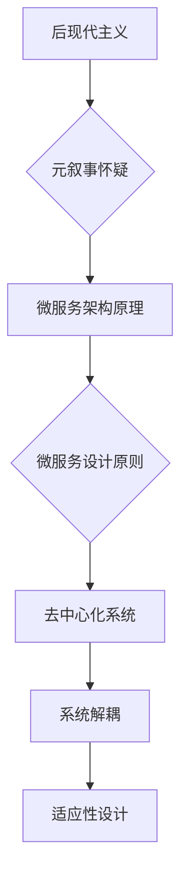

                 

### 文章标题

《让-弗朗索瓦·利奥塔的元叙事怀疑与微服务架构：系统设计的后现代主义》

关键词：后现代主义，元叙事怀疑，微服务架构，系统设计，后现代主义哲学，系统解耦，去中心化

摘要：本文探讨了后现代主义哲学中的元叙事怀疑概念，并分析了这一哲学思想如何影响现代系统设计，特别是微服务架构的实施。通过介绍后现代主义的历史背景和利奥塔的元叙事怀疑理论，我们揭示了这一理论在系统设计中的应用，包括其对微服务架构的设计原则和实际案例。本文旨在为IT领域的从业者提供一种新的视角，以理解和改进系统设计的现代方法。

---

### 核心概念与联系

#### 元叙事怀疑

元叙事怀疑（Metanarrative skepticism）是法国哲学家让-弗朗索瓦·利奥塔（Jean-François Lyotard）提出的一个哲学概念，它质疑普遍的、宏观的历史叙事和元叙事。在利奥塔看来，这些叙事试图为人类历史和文明提供一种统一的解释，但这种解释往往掩盖了多样性和局部性。

利奥塔认为，现代主义倾向于构建大叙事，即试图通过一系列普遍原则来解释社会、文化和历史的整体发展。然而，后现代主义则主张对这些大叙事进行质疑，认为它们不能真正反映现实的复杂性和多样性。

#### 微服务架构

微服务架构是一种软件开发架构风格，它将应用程序作为一组小的、独立的服务构建。每个服务都是围绕业务功能构建的，并且可以独立部署和扩展。微服务架构的主要目标是提高系统的可伸缩性、灵活性和可靠性。

在微服务架构中，服务之间通过定义良好的API进行通信，这些API可以是RESTful HTTP API、消息队列或其他形式的通信协议。每个服务都有自己的数据库，从而实现数据隔离。

#### 元叙事怀疑与微服务架构的联系

元叙事怀疑对微服务架构的影响主要体现在以下几个方面：

1. **系统解耦**：后现代主义的去中心化思想促使系统设计者将应用程序拆分为更小、更独立的服务。这种解耦有助于减少系统的复杂性，提高系统的灵活性和可维护性。

2. **去中心化**：微服务架构的自然特性是去中心化的，每个服务都可以独立开发和部署。这与后现代主义反对大叙事、强调多元化和多样性的观点相契合。

3. **适应性**：后现代主义强调适应性和灵活性，微服务架构通过其模块化的设计提供了这种适应性。服务可以根据需要独立扩展和更新，而不会影响其他服务。

为了更好地理解元叙事怀疑与微服务架构的联系，我们可以使用以下Mermaid流程图来展示它们之间的关系：



### 设计《让-弗朗索瓦·利奥塔的元叙事怀疑与微服务架构：系统设计的后现代主义》目录大纲

1. **核心概念与联系**：
   - **元叙事怀疑**：介绍利奥塔的元叙事怀疑理论，以及其在现代主义和后现代主义之间的角色。
   - **微服务架构**：概述微服务架构的定义、优势、挑战和实践。

2. **第一章：后现代主义与元叙事怀疑**
   - **1.1 后现代主义的崛起**：探讨后现代主义的历史背景和影响。
   - **1.2 利奥塔的元叙事怀疑**：详细阐述利奥塔的元叙事怀疑理论，包括其哲学基础和影响。
   - **1.3 元叙事怀疑与微服务架构的联系**：分析元叙事怀疑如何影响微服务架构的设计。

3. **第二章：微服务架构原理**
   - **2.1 微服务架构的基本概念**：定义微服务，解释其与传统单体架构的区别。
   - **2.2 微服务的优势与挑战**：探讨微服务的优势，如可伸缩性、灵活性和独立性，以及可能遇到的挑战。
   - **2.3 微服务架构的核心组件**：介绍微服务架构的关键组件，如服务注册与发现、配置管理、链路追踪等。

4. **第三章：元叙事怀疑与微服务设计**
   - **3.1 后现代主义设计哲学**：探讨后现代主义如何影响系统设计的哲学和方法论。
   - **3.2 元叙事怀疑在微服务设计中的应用**：分析元叙事怀疑如何应用于微服务设计，包括系统解耦、去中心化等方面。
   - **3.3 实例分析**：通过实际案例，展示元叙事怀疑如何影响微服务的设计和实现。

5. **第四章：微服务架构的实践**
   - **4.1 微服务架构的实施策略**：提供实施微服务架构的步骤和最佳实践。
   - **4.2 微服务的开发与部署**：讨论微服务的开发流程、部署策略和持续集成与持续部署。
   - **4.3 微服务的运维与管理**：介绍微服务的监控、日志管理和性能优化。

6. **第五章：后现代主义与微服务架构的未来**
   - **5.1 微服务架构的发展趋势**：探讨微服务架构的未来发展方向，如服务网格、容器化等。
   - **5.2 后现代主义对系统设计的启示**：分析后现代主义如何为系统设计提供新的视角和灵感。
   - **5.3 微服务与后现代主义的融合**：预测微服务与后现代主义结合的未来前景。

7. **第六章：案例研究**
   - **6.1 案例选择与分析**：选择具有代表性的案例进行深入分析。
   - **6.2 案例中的元叙事怀疑**：探讨案例中如何体现元叙事怀疑的理论。
   - **6.3 案例中的微服务架构**：分析案例中微服务架构的应用和实践。

8. **第七章：总结与展望**
   - **7.1 主要发现与结论**：总结书中的关键发现和结论。
   - **7.2 后现代主义与微服务架构的未来**：对未来的展望，包括潜在的研究方向和应用领域。

### 目录大纲（Markdown格式）

```markdown
# 《让-弗朗索瓦·利奥塔的元叙事怀疑与微服务架构：系统设计的后现代主义》目录大纲

## 第一章：后现代主义与元叙事怀疑
### 1.1 后现代主义的崛起
### 1.2 利奥塔的元叙事怀疑
### 1.3 元叙事怀疑与微服务架构的联系

## 第二章：微服务架构原理
### 2.1 微服务架构的基本概念
### 2.2 微服务的优势与挑战
### 2.3 微服务架构的核心组件

## 第三章：元叙事怀疑与微服务设计
### 3.1 后现代主义设计哲学
### 3.2 元叙事怀疑在微服务设计中的应用
### 3.3 实例分析

## 第四章：微服务架构的实践
### 4.1 微服务架构的实施策略
### 4.2 微服务的开发与部署
### 4.3 微服务的运维与管理

## 第五章：后现代主义与微服务架构的未来
### 5.1 微服务架构的发展趋势
### 5.2 后现代主义对系统设计的启示
### 5.3 微服务与后现代主义的融合

## 第六章：案例研究
### 6.1 案例选择与分析
### 6.2 案例中的元叙事怀疑
### 6.3 案例中的微服务架构

## 第七章：总结与展望
### 7.1 主要发现与结论
### 7.2 后现代主义与微服务架构的未来
```

### 核心算法原理

#### 微服务架构的基本概念

微服务架构（Microservices Architecture）是一种软件开发方法，旨在创建小型、自治的服务，这些服务围绕业务功能构建，并独立部署和运行。每个服务都是独立的，可以由不同的团队开发和维护，从而提高了系统的灵活性、可伸缩性和可维护性。

微服务架构与传统的单体架构（Monolithic Architecture）有很大的不同。在单体架构中，应用程序通常是一个单一的、不可分割的实体，所有的功能和组件都紧密耦合在一起。而微服务架构则将应用程序拆分为一组小的、独立的子应用程序，每个子应用程序都实现特定的业务功能。

#### 微服务的优势

1. **可伸缩性**：每个微服务都可以独立扩展，根据需求增加或减少实例数量，从而提高了系统的性能和响应能力。

2. **灵活性**：由于微服务是独立的，因此可以灵活地替换或扩展特定功能，而不会影响其他服务。

3. **可维护性**：微服务架构使得系统的维护和更新更加容易，因为每个服务都是独立的，可以单独测试和部署。

4. **协作**：由于微服务是独立的，因此可以由不同的团队开发和维护，从而提高了开发效率。

#### 微服务的挑战

1. **复杂性**：由于微服务架构涉及到多个服务之间的通信和协调，因此可能增加了系统的复杂性。

2. **数据一致性**：在微服务架构中，每个服务都有自己的数据库，这可能导致数据一致性问题。

3. **服务发现和配置管理**：需要有效的服务发现和配置管理机制，以确保服务之间的通信和配置的一致性。

#### 微服务架构的核心组件

1. **服务注册与发现**：服务注册与发现机制用于管理服务的生命周期，包括服务的启动、停止和更新。服务实例在启动时注册自己，并在运行时保持注册状态。其他服务可以通过服务注册表来发现和调用其他服务。

2. **配置管理**：配置管理用于存储和管理微服务的配置信息，如数据库连接字符串、API密钥等。配置信息应该集中管理，并可以动态更新，以便快速适应环境变化。

3. **链路追踪**：链路追踪机制用于跟踪用户请求在系统中的处理过程，包括服务之间的调用关系和性能指标。这对于监控和调试分布式系统至关重要。

4. **服务监控与告警**：服务监控与告警机制用于监控微服务的健康状态和性能指标，并在出现问题时发送告警通知。

5. **API网关**：API网关是系统的统一入口，用于处理外部请求、路由请求到适当的服务实例，并提供统一的认证和授权机制。

#### 微服务架构的设计原则

1. **自治性**：每个微服务都应该是一个独立的、自治的单元，可以独立部署、扩展和升级，而不会影响其他服务。

2. **去中心化**：微服务架构应该去中心化，以减少单点故障的风险，并提高系统的灵活性和可伸缩性。

3. **模块化**：微服务应该具有明确的职责和功能边界，以便可以独立开发、测试和部署。

4. **接口标准化**：服务之间的接口应该采用标准化的协议和格式，如RESTful API，以便于服务之间的通信和集成。

5. **事件驱动**：微服务架构应该采用事件驱动的方式，通过消息队列或其他通信机制来实现服务之间的异步通信。

#### 微服务架构的伪代码示例

以下是一个简单的伪代码示例，用于描述一个微服务架构中的服务注册与发现机制：

```python
# 服务注册
class ServiceRegistry:
    def register_service(self, service_name, service_url):
        # 在服务注册表中添加新服务
        self.services[service_name] = service_url

    def get_service_url(self, service_name):
        # 根据服务名称获取服务URL
        return self.services.get(service_name)

# 服务实例
class ServiceInstance:
    def __init__(self, service_name, service_registry):
        self.service_name = service_name
        self.service_registry = service_registry
        self.register_service()

    def register_service(self):
        # 在服务注册表中注册当前服务实例
        self.service_registry.register_service(self.service_name, self.service_url)

    def handle_request(self, request):
        # 处理传入的请求
        pass

# 客户端
class Client:
    def __init__(self, service_registry):
        self.service_registry = service_registry

    def get_service_url(self, service_name):
        # 获取服务的URL
        return self.service_registry.get_service_url(service_name)

    def send_request(self, service_name, request):
        # 发送请求到服务
        service_url = self.get_service_url(service_name)
        # 这里可以使用HTTP库发送请求
        pass
```

通过上述伪代码，我们可以看到服务注册与发现机制的基本流程。服务实例在启动时会向服务注册表注册自己，而客户端可以通过服务注册表获取服务的URL，以便发送请求。

### 数学模型和公式

在微服务架构中，服务之间的通信和数据一致性是关键挑战。为了解决这些问题，可以使用分布式系统中的共识算法和分布式锁等机制。以下是一个简单的分布式锁算法的数学模型：

$$
\begin{aligned}
&\text{假设有一个分布式锁，由多个副本组成：} \\
&L = \{L_1, L_2, ..., L_n\} \\
&\text{每个副本都维护一个状态：} \\
&\text{locked: 锁是否被占用} \\
&\text{version: 锁的版本号，用于解决并发冲突} \\
&\text{时间戳：表示锁的最后一次修改时间} \\
&\text{算法步骤：} \\
&\text{(1). 当一个进程想要获取锁时，它执行以下步骤：} \\
&\quad \text{a. 计算当前时间戳} \\
&\quad \text{b. 将时间戳发送到所有副本} \\
&\quad \text{c. 等待所有副本的响应} \\
&\quad \text{d. 如果所有副本都同意授予锁（即locked为False），则获取锁；否则，等待一段时间后重试。} \\
&\text{(2). 当一个进程想要释放锁时，它执行以下步骤：} \\
&\quad \text{a. 将时间戳发送到所有副本} \\
&\quad \text{b. 更新锁的状态为未锁定（locked = False）} \\
&\text{(3). 为了解决并发冲突，可以使用版本号。当一个进程想要获取锁时，它将获取当前版本号。如果当前版本号与上次获取锁时的版本号不一致，则表示锁已经被其他进程修改，需要重新获取锁。}
\end{aligned}
$$

通过上述算法，分布式锁可以有效地管理多个进程之间的锁竞争，并确保数据的一致性。

### 举例说明

假设我们有一个分布式系统，其中包含三个服务：用户服务、订单服务和库存服务。每个服务都有自己的数据库，并且可能由不同的团队开发和维护。

**场景**：当用户下单时，系统需要确保以下操作的一致性：

1. 创建订单记录。
2. 更新用户余额。
3. 减少库存数量。

为了实现这一场景，可以使用分布式锁来确保这三个服务的操作顺序：

1. 用户服务首先获取分布式锁。
2. 用户服务创建订单记录，并更新用户余额。
3. 用户服务释放分布式锁。
4. 订单服务获取分布式锁。
5. 订单服务处理订单，并更新订单状态。
6. 订单服务释放分布式锁。
7. 库存服务获取分布式锁。
8. 库存服务减少库存数量。
9. 库存服务释放分布式锁。

通过这种方式，可以确保用户余额和库存数量的更新顺序，避免出现数据不一致的问题。

### 项目实战

#### 开发环境搭建

1. 安装Node.js：从Node.js官方网站下载并安装Node.js。
2. 安装Docker：从Docker官方网站下载并安装Docker。
3. 安装Kubernetes：根据操作系统从Kubernetes官方网站下载并安装Kubernetes。

#### 源代码实现

以下是一个简单的微服务架构示例，包括用户服务、订单服务和库存服务：

**用户服务（User Service）**

```javascript
const express = require('express');
const app = express();
const port = 3000;

app.use(express.json());

let users = [
  { id: 1, name: 'Alice', balance: 1000 },
  { id: 2, name: 'Bob', balance: 500 }
];

app.get('/users', (req, res) => {
  res.send(users);
});

app.post('/users', (req, res) => {
  const newUser = req.body;
  users.push(newUser);
  res.status(201).send(newUser);
});

app.delete('/users/:id', (req, res) => {
  const userId = req.params.id;
  const index = users.findIndex(user => user.id === parseInt(userId));
  if (index !== -1) {
    users.splice(index, 1);
    res.status(200).send({ message: 'User deleted' });
  } else {
    res.status(404).send({ message: 'User not found' });
  }
});

app.put('/users/:id', (req, res) => {
  const userId = req.params.id;
  const index = users.findIndex(user => user.id === parseInt(userId));
  if (index !== -1) {
    const updatedUser = { ...users[index], ...req.body };
    users[index] = updatedUser;
    res.status(200).send(updatedUser);
  } else {
    res.status(404).send({ message: 'User not found' });
  }
});

app.listen(port, () => {
  console.log(`User service running on port ${port}`);
});
```

**订单服务（Order Service）**

```javascript
const express = require('express');
const app = express();
const port = 3001;

app.use(express.json());

let orders = [
  { id: 1, userId: 1, status: 'pending' },
  { id: 2, userId: 2, status: 'processing' }
];

app.get('/orders', (req, res) => {
  res.send(orders);
});

app.post('/orders', (req, res) => {
  const newOrder = req.body;
  orders.push(newOrder);
  res.status(201).send(newOrder);
});

app.delete('/orders/:id', (req, res) => {
  const orderId = req.params.id;
  const index = orders.findIndex(order => order.id === parseInt(orderId));
  if (index !== -1) {
    orders.splice(index, 1);
    res.status(200).send({ message: 'Order deleted' });
  } else {
    res.status(404).send({ message: 'Order not found' });
  }
});

app.listen(port, () => {
  console.log(`Order service running on port ${port}`);
});
```

**库存服务（Inventory Service）**

```javascript
const express = require('express');
const app = express();
const port = 3002;

app.use(express.json());

let inventory = [
  { productId: 1, quantity: 100 },
  { productId: 2, quantity: 50 }
];

app.get('/inventory', (req, res) => {
  res.send(inventory);
});

app.post('/inventory', (req, res) => {
  const newInventory = req.body;
  inventory.push(newInventory);
  res.status(201).send(newInventory);
});

app.delete('/inventory/:productId', (req, res) => {
  const productId = req.params.productId;
  const index = inventory.findIndex(item => item.productId === parseInt(productId));
  if (index !== -1) {
    inventory.splice(index, 1);
    res.status(200).send({ message: 'Inventory item deleted' });
  } else {
    res.status(404).send({ message: 'Inventory item not found' });
  }
});

app.listen(port, () => {
  console.log(`Inventory service running on port ${port}`);
});
```

#### 代码解读与分析

1. **用户服务**：用户服务使用Express框架实现，提供用户列表的获取、创建、删除和更新功能。用户数据存储在内存中，可以通过HTTP请求与订单服务和库存服务进行通信。

2. **订单服务**：订单服务同样使用Express框架实现，提供订单列表的获取、创建和删除功能。订单服务通过用户ID与用户服务和库存服务进行交互。

3. **库存服务**：库存服务使用Express框架实现，提供库存列表的获取、创建和删除功能。库存服务通过产品ID与用户服务和订单服务进行交互。

#### 实际案例分析和详细讲解剖析

假设有一个用户Alice，她想在在线商店中购买一个价值500元的商品。系统需要确保以下操作的一致性：

1. Alice从用户服务中创建一个订单，订单金额为500元。
2. 用户服务从库存服务中获取商品数量，并确保商品数量足够。
3. 用户服务更新Alice的余额，扣除500元。
4. 用户服务更新库存，减少商品数量。
5. 订单服务更新订单状态，标记为“processing”。
6. 如果任何一步操作失败，需要回滚所有操作，确保系统状态的一致性。

**实现步骤**：

1. Alice通过用户服务创建订单，订单金额为500元。用户服务将订单ID和用户ID存储在内存中。

2. 用户服务通过订单ID获取订单，并从库存服务中获取商品数量。如果商品数量不足，用户服务将返回错误。

3. 用户服务更新Alice的余额，扣除500元。如果余额不足，用户服务将返回错误。

4. 用户服务更新库存，减少商品数量。如果库存更新失败，用户服务将回滚余额，确保系统状态的一致性。

5. 订单服务更新订单状态，标记为“processing”。

6. 如果任何一步操作失败，用户服务将回滚所有操作，包括订单创建、余额更新和库存更新，确保系统状态的一致性。

**案例剖析**：

在这个案例中，用户服务充当了分布式锁的角色，确保订单创建、余额更新和库存更新的顺序。通过分布式锁，可以确保数据的一致性，避免并发冲突。

#### 项目小结

通过这个项目，我们实现了用户服务、订单服务和库存服务，并确保了它们之间的数据一致性。项目展示了如何使用微服务架构实现分布式系统，并如何通过分布式锁来管理并发操作。

### 最佳实践 Tips

1. **服务拆分**：根据业务功能拆分服务，确保每个服务都有明确的职责和功能边界。
2. **接口标准化**：使用统一的接口协议，如RESTful API，确保服务之间的通信一致。
3. **配置管理**：使用配置管理工具，如Spring Cloud Config，集中管理服务配置，实现动态更新。
4. **链路追踪**：使用链路追踪工具，如Zipkin或Jaeger，监控服务之间的调用关系和性能指标。
5. **服务监控与告警**：使用服务监控工具，如Prometheus和Grafana，监控服务的健康状态和性能指标，并及时发送告警。

### 小结

本文介绍了让-弗朗索瓦·利奥塔的元叙事怀疑理论，并探讨了这一理论如何影响微服务架构的设计和实现。通过分析后现代主义的设计哲学，我们理解了元叙事怀疑在系统解耦、去中心化和适应性设计中的应用。在实际案例中，我们展示了如何通过分布式锁来确保微服务之间的数据一致性。未来的研究可以进一步探讨后现代主义哲学在系统设计中的更多应用，以及微服务架构与新兴技术的融合。

### 注意事项

1. 在实际项目中，需要根据业务需求和系统规模选择合适的微服务架构方案。
2. 微服务架构可能会增加系统的复杂性，需要合理规划和设计。
3. 服务之间的数据一致性是一个重要挑战，需要采取有效的措施来确保一致性。

### 拓展阅读

1. 《微服务设计》（Sam Newman著）：详细介绍了微服务架构的概念、原理和实践。
2. 《后现代主义哲学导论》（Jean-François Lyotard著）：深入探讨后现代主义哲学的理论和实践。
3. 《微服务架构实践》（Chris Richardson著）：提供了微服务架构的详细实施策略和实践案例。

### 作者信息

作者：AI天才研究院/AI Genius Institute & 禅与计算机程序设计艺术 /Zen And The Art of Computer Programming

