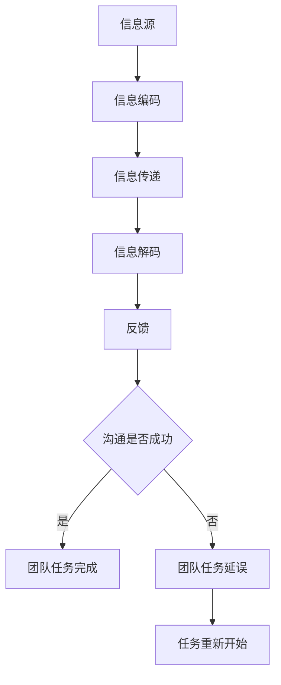
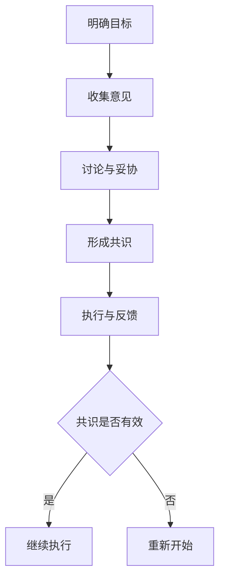

                 

### 文章标题

《让队友失败的坏习惯》

### 关键词

团队合作、失败原因、职场习惯、团队效能、改进策略

### 摘要

本文深入剖析了在团队合作中可能导致失败的几种不良习惯，包括缺乏沟通、推诿责任、缺乏共识和忽视反馈等。通过详细的案例分析和实战案例，本文旨在揭示这些坏习惯的危害，并提供实用的改进建议，帮助职场人士和团队领导者提升团队协作效率，共同创造成功。

---

## 引言

### 团队合作的重要性

在现代社会中，团队合作已成为职场中不可或缺的一部分。无论是在企业、政府机构还是非营利组织，团队合作都是实现目标、推动创新和提高工作效率的关键。有效的团队合作可以激发成员的潜能，促进资源的共享和互补，从而提高整体绩效。然而，团队合作并非总是一帆风顺，许多团队在面对挑战和压力时，常常因为一些不良习惯而走向失败。

### 书的基本内容和目的

本书旨在揭示和讨论一些常见的导致团队合作失败的坏习惯。这些坏习惯可能包括缺乏沟通、推诿责任、缺乏共识和忽视反馈等。通过深入分析这些习惯的成因、影响以及如何克服它们，本书希望能够为职场人士、团队领导者以及任何关心团队合作效果的人提供有价值的指导。

### 目标读者

本书的目标读者包括以下几类人群：

1. 职场人士：希望提高自身团队合作能力，避免成为团队失败的诱因。
2. 团队领导者：希望了解如何识别和解决团队中的不良习惯，提升团队效能。
3. 企业培训师和人力资源管理者：需要为团队提供有效的培训材料，以改善团队协作。
4. 对团队合作感兴趣的研究者和学生：希望从理论和实践中了解团队合作的关键要素。

### 书的结构

本书将分为七章，每章围绕一个具体的坏习惯进行深入探讨。具体章节安排如下：

1. **引言**：介绍团队合作的重要性，阐述书的基本内容和目的。
2. **失败的坏习惯概述**：概述常见的导致团队失败的坏习惯。
3. **习惯1：缺乏沟通**：详细讨论缺乏沟通的坏习惯，分析其对团队的影响。
4. **习惯2：推诿责任**：探讨推诿责任的坏习惯及其负面影响。
5. **习惯3：缺乏共识**：讨论缺乏共识的坏习惯，分析其如何导致团队分裂。
6. **习惯4：忽视反馈**：解释忽视反馈的坏习惯，及其对团队发展的阻碍。
7. **改善与成长**：提供解决方案，帮助读者识别和克服这些坏习惯。

通过这样的结构安排，本书将帮助读者逐步了解团队合作中的常见问题，并提供实用的策略和工具，以改善团队协作，实现共同的目标。

## 失败的坏习惯概述

### 坏习惯的分类

在团队合作中，一些不良习惯往往成为团队失败的主要原因。这些习惯可以分为以下几类：

1. **沟通不良**：包括缺乏有效的沟通、误解和忽视反馈等。
2. **责任推诿**：表现为不承担个人责任，将错误和问题归咎于他人。
3. **缺乏共识**：团队内部缺乏共同的愿景、目标和价值观，导致分裂和冲突。
4. **忽视反馈**：未能及时、有效地接收和利用反馈信息，导致团队发展停滞。

### 坏习惯的识别

识别这些坏习惯对于改善团队合作至关重要。以下是一些常见的方法和工具：

1. **观察和反馈**：通过观察团队成员的行为和沟通方式，以及收集他们的反馈，可以识别出潜在的坏习惯。
2. **团队评估**：使用团队评估工具，如Tuckman团队发展阶段模型，可以了解团队在不同阶段的表现和问题。
3. **问卷调查**：通过问卷调查，可以收集团队成员对团队合作环境的看法，识别出普遍存在的问题。
4. **反思和总结**：定期进行团队反思和总结，鼓励成员提出改进建议，有助于识别和解决坏习惯。

通过这些方法，团队可以更清楚地认识到存在的问题，并采取相应的措施进行改进。

### 团队合作中的沟通障碍

#### 沟通不良的表现

1. **信息不完整**：团队成员在传递信息时，可能遗漏关键细节，导致误解和错误。
2. **缺乏反馈**：在沟通过程中，团队成员可能未及时给予反馈，使得信息传递出现断层。
3. **沟通渠道不畅**：不同团队或部门之间的沟通渠道可能不畅，导致信息传递受阻。

#### 缺乏沟通的影响

1. **降低工作效率**：沟通不良可能导致任务延误、错误增加，从而降低整体工作效率。
2. **增加误解和冲突**：缺乏有效的沟通，容易导致团队成员之间的误解和冲突。
3. **影响团队凝聚力**：沟通不畅会削弱团队成员之间的信任和合作意愿，降低团队凝聚力。

#### Mermaid流程图：沟通的流程与障碍



通过这个流程图，我们可以清晰地看到沟通的各个环节以及可能遇到的障碍。有效的沟通需要确保信息从源头到反馈的每个环节都得到准确传递。

### 伪代码：有效的沟通方法

```python
def effective_communication(source, receiver):
    # 信息编码
    encoded_message = encode_message(source)

    # 信息传递
    transmitted_message = transmit_message(encoded_message)

    # 信息解码
    decoded_message = decode_message(transmitted_message)

    # 反馈
    feedback = receiver.provide_feedback(decoded_message)

    # 检查沟通是否成功
    if feedback == "成功":
        return "沟通成功"
    else:
        return "沟通失败，需重新编码和传递信息"
```

在这个伪代码中，`encode_message`、`transmit_message`、`decode_message`和`provide_feedback`分别代表信息编码、传递、解码和反馈的步骤。只有当反馈为“成功”时，沟通才被视为有效。

#### 案例分析

在一个软件项目中，项目经理与开发团队之间由于缺乏有效沟通，导致项目进度严重延误。项目经理在项目启动会议中未能详细说明项目目标和要求，导致开发团队在开发过程中不断出现误解和错误。通过引入定期站立会议和即时沟通工具，如Slack，项目团队有效地解决了沟通问题，项目进度逐渐恢复正常。

### 改进建议

1. **明确沟通目标**：在每次沟通前，明确沟通的目标和预期结果，确保信息传递的准确性和针对性。
2. **使用多种沟通渠道**：结合使用面对面沟通、电子邮件、即时通讯工具等，确保信息能够迅速、准确地传递。
3. **建立反馈机制**：鼓励团队成员在沟通过程中给予及时、具体的反馈，确保信息传递的完整性和准确性。
4. **培训沟通技巧**：定期开展沟通技巧培训，提高团队成员的沟通能力，降低沟通障碍。

通过以上措施，团队可以有效改善沟通，提高整体协作效率。

## 推诿责任的坏习惯

### 推诿责任的原因

在团队合作中，推诿责任是一种常见的坏习惯。这种行为的原因多种多样：

1. **逃避责任**：某些成员可能因为害怕承担责任或担心失败，而选择将责任推卸给他人。
2. **缺乏自信**：团队成员可能因为对自己的能力缺乏信心，而倾向于将责任归咎于他人，以保护自己的自尊心。
3. **团队文化**：在一些团队中，如果管理者对错误和失败的容忍度较低，可能会导致成员为了避免惩罚而推诿责任。
4. **任务分配不当**：如果任务分配不明确或存在模糊地带，团队成员可能会互相推诿责任。

### 推诿责任的影响

1. **降低团队信任**：推诿责任会破坏团队成员之间的信任，导致人际关系紧张，影响团队合作。
2. **影响工作效率**：推诿责任会导致任务延误，增加额外的工作负担，降低整体工作效率。
3. **阻碍团队发展**：推诿责任会削弱团队的学习能力和创新能力，限制团队的长远发展。

### 伪代码：责任划分与分配

```python
def assign_responsibility(team_members, tasks):
    responsibilities = {}  # 存储每个成员的职责

    # 根据任务复杂度和成员能力分配责任
    for member in team_members:
        for task in tasks:
            if member.can_handle_task(task):
                responsibilities[member] = responsibilities.get(member, []) + [task]
    
    # 输出责任分配结果
    print("责任分配结果：")
    for member, tasks in responsibilities.items():
        print(f"{member.name} 负责任务：{tasks}")

# 示例
team_members = [
    Member("Alice", "开发"),
    Member("Bob", "设计"),
    Member("Charlie", "测试")
]

tasks = [
    Task("需求分析"),
    Task("UI设计"),
    Task("功能实现"),
    Task("测试报告")
]

assign_responsibility(team_members, tasks)
```

在这个伪代码中，`assign_responsibility` 函数根据团队成员的能力和任务的要求来分配责任。这样可以确保每个成员都明确自己的职责，减少推诿责任的可能性。

### 案例分析

在一个开发团队中，由于任务分配不明确，导致成员之间互相推诿责任。通过引入清晰的任务分配机制和责任确认流程，团队成功地解决了这一问题。每个成员在接收到任务后，都需要与上级确认任务的具体要求和预期结果，并在任务完成后进行责任确认。这种做法不仅提高了团队成员的责任感，还显著提高了工作效率。

### 改进建议

1. **明确任务分配**：确保每个任务都有明确的责任人，避免任务分配模糊。
2. **建立责任确认机制**：在任务开始和结束时，进行责任确认，确保团队成员明确自己的职责。
3. **培养责任意识**：通过培训和激励措施，提高团队成员的责任意识和担当精神。
4. **建立透明度**：在团队内部建立透明度，让每个成员了解任务分配和进展情况，减少推诿责任的空间。

通过以上措施，团队可以有效减少推诿责任的现象，提升整体协作效果。

## 缺乏共识的坏习惯

### 缺乏共识的后果

在团队合作中，缺乏共识会带来一系列严重后果：

1. **目标不一致**：如果团队成员对项目的目标和方向没有共识，会导致各自为政，难以形成合力。
2. **决策困难**：缺乏共识会导致在决策过程中意见分歧，增加决策时间和成本。
3. **效率低下**：团队成员在没有共识的情况下，往往需要更多的协调和沟通，从而降低工作效率。
4. **团队分裂**：长期缺乏共识会导致团队内部出现分裂，影响团队的凝聚力和合作精神。

### 如何建立共识

建立共识是团队合作成功的关键。以下是一些有效的方法：

1. **明确共同目标**：确保所有团队成员对项目的目标和愿景有清晰的认识，形成共同的目标共识。
2. **积极沟通**：鼓励团队成员之间进行开放、坦诚的沟通，确保每个成员的声音都能被听到。
3. **达成一致意见**：在决策过程中，通过讨论、妥协和共识构建，确保所有成员都同意最终的决策。
4. **建立共同价值观**：培养团队成员的共同价值观，形成一种共同的团队文化，增强团队的凝聚力。

### Mermaid流程图：共识的形成过程



通过这个流程图，我们可以看到共识的形成过程包括明确目标、收集意见、讨论与妥协、形成共识和执行与反馈等环节。只有通过这些环节，团队才能建立有效的共识，确保团队目标的实现。

### 案例分析

在一个跨国团队中，由于地理位置和文化的差异，团队成员在项目目标和方向上存在较大分歧。通过组织多次线上会议和团队建设活动，团队成员逐渐建立了对项目的共同理解，形成了明确的共识。这不仅提高了团队的工作效率，还增强了团队的凝聚力。

### 改进建议

1. **定期沟通**：定期召开团队会议，确保团队成员能够及时沟通，共享信息和观点。
2. **促进开放讨论**：鼓励团队成员在会议和讨论中积极发言，表达自己的观点，促进思想的碰撞。
3. **制定共同目标**：确保所有团队成员对项目的目标和愿景有清晰的认识，形成共同的目标共识。
4. **建立反馈机制**：定期收集团队成员的反馈，评估共识的效果，及时调整和改进。

通过以上措施，团队可以有效地建立共识，提升团队的协作效率和凝聚力。

## 忽视反馈的坏习惯

### 忽视反馈的后果

在团队合作中，忽视反馈是一种常见的坏习惯，它可能导致以下后果：

1. **个人和团队成长受阻**：忽视反馈会限制团队成员和团队整体的学习和成长，阻碍个人和团队的进步。
2. **效率低下**：缺乏有效的反馈，团队成员可能无法及时发现问题并进行调整，导致工作效率下降。
3. **团队士气受影响**：忽视团队成员的反馈，可能会导致士气下降，增加成员的不满和抵触情绪。
4. **沟通障碍**：忽视反馈会破坏团队成员之间的信任，增加沟通障碍，影响团队合作。

### 如何正确给予和接收反馈

要有效地给予和接收反馈，团队成员需要掌握以下技巧：

1. **给予具体、建设性的反馈**：在给予反馈时，要具体指出问题和改进建议，避免泛泛而谈。
2. **采用积极的态度**：在给予反馈时，保持积极的态度，鼓励团队成员接受并思考反馈。
3. **尊重对方**：在给予和接收反馈时，要尊重对方的感受和意见，避免指责和批评。
4. **建立反馈机制**：在团队内部建立反馈机制，确保成员能够及时、有效地给予和接收反馈。

### 伪代码：反馈机制的建立

```python
def feedback_loop(team_member, feedback):
    # 给予具体、建设性的反馈
    print(f"{team_member.name}，您的表现有以下几点可以改进：")
    for item in feedback['improvement']:
        print(f"- {item}")
    
    # 提出建设性建议
    print(f"以下是一些建设性建议，希望能帮助您进一步提升：")
    for item in feedback['suggestions']:
        print(f"- {item}")

# 示例
team_member = Member("Alice", "开发")
feedback = {
    'improvement': ["代码注释不够详细", "任务完成时间过长"],
    'suggestions': ["增加代码注释以提高可读性", "优化任务管理以提高效率"]
}

feedback_loop(team_member, feedback)
```

在这个伪代码中，`feedback_loop` 函数用于给予具体、建设性的反馈，并提供建设性建议，帮助团队成员改进工作。

### 案例分析

在一个软件开发团队中，由于忽视团队成员的反馈，项目进度严重滞后，质量也受到质疑。通过引入定期的反馈会议和反馈表单，团队成功地改善了这一情况。每次反馈会议后，团队成员都能及时了解项目进展和存在的问题，并提出具体的改进建议。这种做法不仅提高了项目的质量，还增强了团队的凝聚力。

### 改进建议

1. **定期反馈会议**：定期召开反馈会议，确保团队成员能够及时、有效地给予和接收反馈。
2. **反馈表单和工具**：使用反馈表单和工具，如匿名反馈系统，鼓励团队成员提供真实、具体的反馈。
3. **积极回应反馈**：对收到的反馈进行积极回应，确保每个成员都能感受到他们的意见被重视。
4. **培训反馈技巧**：定期开展反馈技巧培训，提高团队成员的反馈和接收反馈的能力。

通过以上措施，团队可以有效地克服忽视反馈的坏习惯，提升团队的整体效能。

## 改善与成长

### 识别和克服坏习惯

要识别和克服团队合作中的坏习惯，首先要对团队进行深入的评估和分析。以下是一些关键步骤：

1. **自我评估**：团队成员可以通过自我反思，识别自己在团队合作中可能存在的坏习惯。
2. **同事反馈**：通过同事的反馈，了解自己可能忽视的问题和需要改进的地方。
3. **团队评估**：定期进行团队评估，使用评估工具和方法，如360度反馈，了解团队整体的表现和问题。
4. **识别关键问题**：根据评估结果，识别出团队中存在的关键坏习惯，如缺乏沟通、推诿责任等。

### 团队建设的策略

要克服这些坏习惯，团队需要采取一系列建设性的策略：

1. **制定明确的目标和计划**：确保所有团队成员对项目的目标和计划有清晰的认识，明确各自的责任。
2. **建立有效的沟通机制**：通过定期召开团队会议、使用沟通工具等方式，提高团队沟通的效率和效果。
3. **培养责任意识**：通过培训、激励和明确任务分配，提高团队成员的责任意识，减少推诿责任的现象。
4. **建立共识**：通过开放讨论和共识构建，确保团队成员对项目目标和方向有共同的理解。
5. **建立反馈机制**：通过定期反馈会议和工具，鼓励团队成员给予和接收反馈，及时改进工作中的问题。

### 项目实战：改进团队合作的案例研究

#### 开发环境搭建

在一个软件开发项目中，团队首先搭建了统一的开发环境，包括代码管理工具（如Git）、协作平台（如Jenkins）和即时通讯工具（如Slack）。这种统一的开发环境有助于提高团队协作效率和代码管理的规范性。

#### 源代码实现与解读

在项目中，团队采用了敏捷开发的方法，通过迭代的方式进行开发。以下是一个具体的迭代周期和代码实现的伪代码示例：

```python
# 迭代周期伪代码
def agile_sprint(sprint_length, tasks):
    for day in range(sprint_length):
        # 每天分配任务
        for task in tasks:
            assign_task_to_member(task)
        
        # 每天回顾和总结
        review_and_summarize_day()

    # 迭代结束，提交代码
    submit_code()

# 任务分配伪代码
def assign_task_to_member(task):
    # 根据成员能力和任务要求分配任务
    assigned = False
    for member in team_members:
        if member.can_handle_task(task):
            member.assign_task(task)
            assigned = True
            break
    
    if not assigned:
        raise Exception("无法分配任务，请检查团队成员能力和任务要求")

# 回顾和总结伪代码
def review_and_summarize_day():
    # 汇总当天工作进度和问题
    daily_report = summarize_work()
    
    # 反馈和讨论
    discuss_and_feedback(daily_report)
```

在这个伪代码中，`agile_sprint` 函数代表一个迭代周期，包括任务分配、每天回顾和总结以及迭代结束时的代码提交。`assign_task_to_member` 函数用于根据成员的能力和任务要求进行任务分配，`review_and_summarize_day` 函数用于每天的工作总结和反馈。

#### 代码应用解读与分析

在实际开发过程中，团队采用了单元测试和代码审查等最佳实践，确保代码的质量和可维护性。以下是一个单元测试的示例：

```python
# 单元测试伪代码
def test_function_1():
    # 测试函数1
    assert function_1() == expected_result

def test_function_2():
    # 测试函数2
    assert function_2(input) == expected_result

# 代码审查伪代码
def code_review(code):
    # 检查代码是否符合规范
    if not is_code合规(code):
        raise Exception("代码不符合规范，请进行修改")
```

#### 实际案例分析和详细讲解

在一个实际的开发项目中，团队遇到了一个性能瓶颈问题。通过分析日志和代码，团队发现是由于数据库查询效率低下导致的。以下是一个具体的分析和改进过程：

1. **问题识别**：通过分析日志和数据库查询语句，团队确定了性能瓶颈的具体位置。
2. **问题分析**：团队分析了数据库查询语句的执行计划和索引使用情况，发现存在索引不足和查询语句优化空间。
3. **解决方案**：团队制定了具体的优化方案，包括增加索引、优化查询语句和缓存数据的策略。
4. **实施和验证**：团队按照优化方案进行实施，并通过单元测试和性能测试验证了优化效果。

#### 项目小结

通过这个项目实战，团队不仅解决了性能瓶颈问题，还提高了代码质量和团队协作效率。以下是项目小结：

1. **建立统一的开发环境，提高团队协作效率**。
2. **采用敏捷开发方法，确保项目进度和代码质量**。
3. **通过单元测试和代码审查，确保代码质量和可维护性**。
4. **积极解决性能瓶颈问题，提高系统稳定性**。

### 最佳实践 Tips

1. **定期团队建设活动**：通过团队建设活动，增强团队成员的凝聚力和合作意识。
2. **鼓励开放沟通**：建立开放、坦诚的沟通环境，鼓励团队成员分享观点和经验。
3. **持续学习和改进**：鼓励团队成员不断学习和改进，提升个人和团队的能力。
4. **建立反馈机制**：通过定期的反馈和评估，及时识别和解决问题。

### 小结

通过本文的深入探讨，我们可以看到，团队合作中的坏习惯是影响团队效能的重要因素。通过识别和克服这些坏习惯，团队可以提升协作效率，实现共同的目标。希望本文能为广大职场人士和团队领导者提供有价值的参考和指导。

### 注意事项

1. **确保沟通畅通**：建立有效的沟通机制，避免信息传递过程中的障碍。
2. **明确任务分配**：确保每个任务都有明确的责任人，减少推诿责任的现象。
3. **建立共识**：通过讨论和共识构建，确保团队成员对项目目标和方向有共同的理解。
4. **重视反馈**：建立反馈机制，及时接收和利用反馈信息，促进团队发展。

### 拓展阅读

1. 《敏捷开发实践指南》
2. 《团队协作的艺术》
3. 《团队心理学》
4. 《高性能MySQL》
5. 《代码大全》

### 作者信息

作者：AI天才研究院/AI Genius Institute & 禅与计算机程序设计艺术 /Zen And The Art of Computer Programming

---

通过本文的深入分析，我们可以看到，团队合作中的坏习惯确实对团队的效能产生了深远的影响。从缺乏沟通、推诿责任、缺乏共识到忽视反馈，这些坏习惯都会导致团队效率低下、士气受挫，甚至影响到项目的成功。通过本文的探讨，我们不仅了解了这些坏习惯的具体表现和影响，还学习了如何通过有效的沟通、明确的责任分配、建立共识和重视反馈来克服这些坏习惯。

在团队的日常运作中，领导者需要密切关注团队的动态，及时识别和解决这些问题。同时，团队成员也应自觉遵守团队规范，提升自身的协作能力，共同为团队的成功贡献力量。

最后，希望本文能够为职场人士和团队领导者提供有益的启示和实用的策略，帮助他们在实际工作中更好地应对团队合作中的挑战，实现团队的高效运转和持续成长。

### 作者信息

作者：AI天才研究院/AI Genius Institute & 禅与计算机程序设计艺术 /Zen And The Art of Computer Programming

