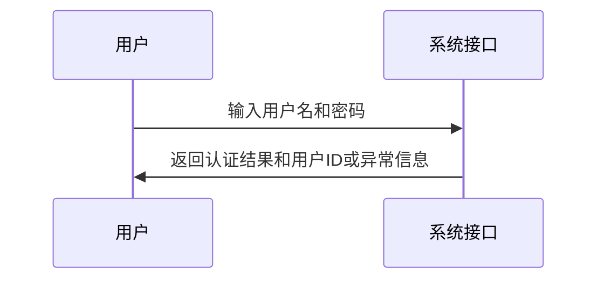
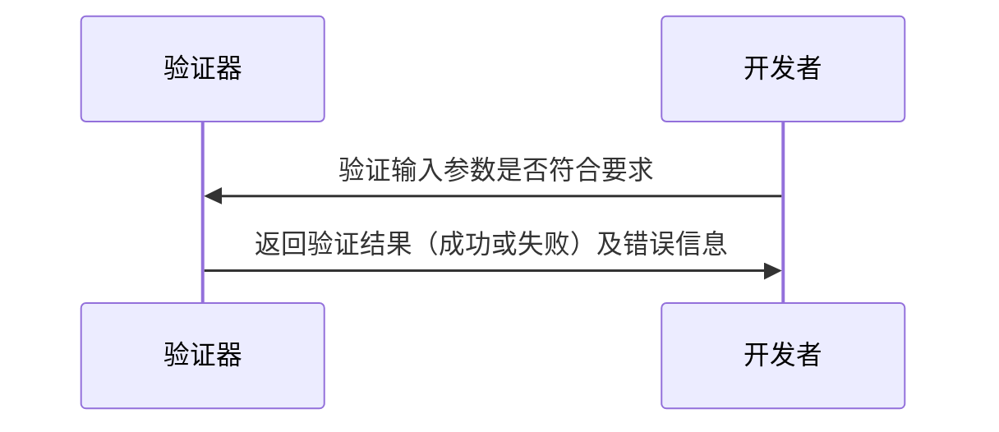
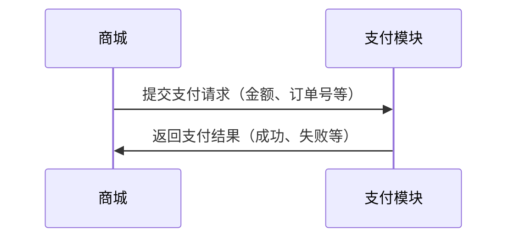
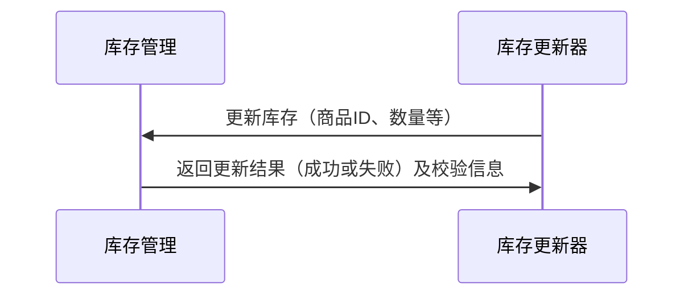
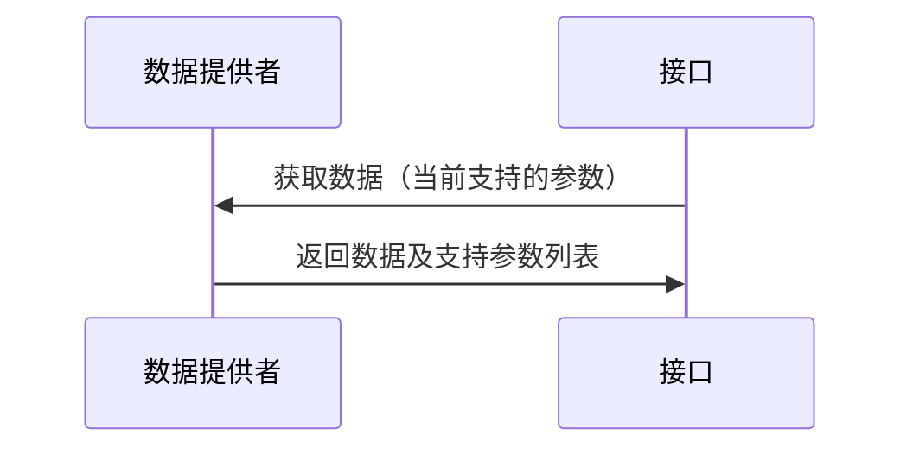
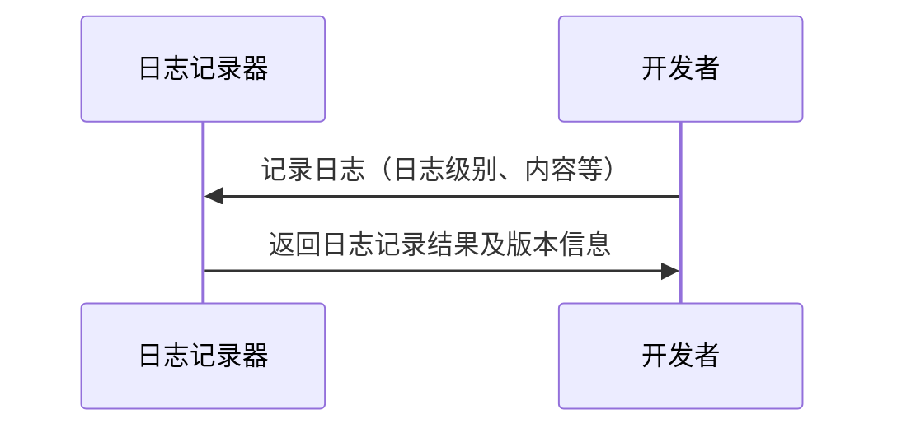
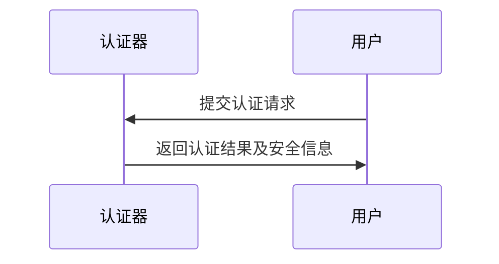

                 


### 引入

设计by Contract（DbC）是一种软件工程方法，其核心思想是在软件开发过程中，通过明确而具体的契约来规范软件组件之间的交互和职责。这种契约不仅仅是对功能的描述，更是对组件之间交互的承诺和预期结果的定义。DbC的出现，旨在提高软件的可理解性、可维护性和可靠性。

DbC的核心理念可以追溯到编程语言中的类型论。类型论是一种研究程序语言中变量和表达式类型的理论，其基本思想是确保程序中的变量在使用前已经被正确声明并经过类型检查。DbC借鉴了类型论的思想，通过在接口契约中引入类型约束，来保证软件组件之间的交互符合预期，从而减少因接口错误导致的故障。

类型论在接口契约中的作用主要体现在以下几个方面：

1. **明确的接口规范**：通过类型论，可以为接口契约定义明确的输入输出类型，从而确保接口的使用者能够正确地使用这些接口。

2. **静态类型检查**：类型论提供了静态类型检查机制，可以在编译时发现类型错误，从而避免运行时错误。

3. **契约验证**：类型论可以帮助实现契约验证，确保组件之间的交互符合契约规定。

4. **代码可读性**：清晰的类型定义和契约规则，可以提高代码的可读性和可维护性。

5. **模块化设计**：类型论支持模块化设计，使得软件组件之间可以独立开发、测试和维护。

### 契约设计原则

契约设计需要遵循一系列核心原则，以确保契约的规范性和可执行性。以下是一些主要的契约设计原则：

1. **完整性**：契约必须涵盖组件的所有交互细节，包括输入、输出、异常处理等。

2. **明确性**：契约的表述必须清晰明确，避免模糊和歧义。

3. **一致性**：契约内部和契约之间必须保持一致性，避免冲突和矛盾。

4. **可验证性**：契约必须支持自动化验证，以确保契约在运行时得到正确执行。

5. **灵活性**：契约设计应该具有一定的灵活性，以适应未来可能的变更和扩展。

6. **可维护性**：契约应该易于维护和更新，以适应软件需求的变化。

7. **安全性**：契约需要确保系统安全，避免因契约不完整或不严谨导致的安全漏洞。

### 契约模板设计

契约模板是契约设计过程中的重要工具，它提供了一个标准化的框架来定义契约。以下是一个简单的契约模板示例：

```
契约名称：用户登录接口

输入参数：
- 用户名（String）：用户的唯一标识符
- 密码（String）：用户登录的密码

输出参数：
- 认证结果（Boolean）：表示登录是否成功
- 用户ID（Integer）：成功登录后的用户ID

异常处理：
- 用户名或密码错误：抛出AuthenticationException
- 系统错误：抛出SystemException

契约约束：
- 用户名长度必须在4-20个字符之间
- 密码长度必须在6-20个字符之间
- 用户名和密码不能为空
```

这个契约模板清晰地定义了用户登录接口的输入输出参数、异常处理和契约约束，为接口实现和验证提供了明确的指导。

### 契约实现

接口契约的实现是确保契约规范得到执行的关键步骤。在实现过程中，需要考虑以下几个方面：

1. **输入验证**：确保输入参数满足契约约束，如长度、格式、非空等。

2. **输出验证**：确保输出结果符合契约定义，如返回类型、异常处理等。

3. **接口实现**：根据契约规范实现具体的接口功能。

4. **契约验证**：使用自动化工具或手动测试来验证契约是否得到正确执行。

5. **异常处理**：在契约实现中，需要合理处理可能出现的异常情况，确保系统稳定运行。

### 契约应用

契约设计不仅仅是一个技术问题，它对软件开发过程有着深远的影响。以下是一些契约在实际软件开发中的应用场景：

1. **模块化开发**：通过契约，可以将软件系统划分为多个模块，每个模块独立开发、测试和部署，提高了开发效率。

2. **接口标准化**：契约设计有助于实现接口标准化，使得不同模块之间的交互更加统一和规范。

3. **测试驱动开发**：契约可以作为测试用例的依据，驱动开发过程，确保软件质量。

4. **文档自动化**：契约设计可以生成自动化的文档，减少文档编写的工作量。

5. **项目协作**：契约为团队成员提供了明确的接口规范，减少了沟通成本和误解。

6. **性能优化**：通过契约，可以更准确地定位性能瓶颈，进行针对性优化。

### 契约与类型论的关系

契约设计与类型论有着密切的联系。类型论为契约提供了坚实的理论基础，确保契约的准确性和可执行性。类型论中的类型系统可以帮助实现契约中的类型约束，确保输入输出参数的类型匹配。同时，类型论提供了静态类型检查机制，可以在编译时发现类型错误，从而避免运行时错误。

通过结合类型论，契约设计可以更加严谨和高效，确保软件组件之间的交互符合预期，提高软件系统的可靠性和可维护性。

### 总结

设计by Contract是一种通过明确契约来规范软件组件交互的软件工程方法。它利用类型论的思想，通过定义输入输出类型、异常处理和契约约束，来提高软件的可理解性、可维护性和可靠性。契约设计需要遵循一系列原则，并使用契约模板来规范契约的定义。在实际应用中，契约设计有助于模块化开发、接口标准化和测试驱动开发。通过结合类型论，契约设计可以更加严谨和高效，为软件开发提供强有力的支持。

接下来，我们将深入探讨类型论的基础概念，以及如何在契约设计中应用这些概念。

### 类型论基础

类型论是计算机科学中的一个重要理论，它研究程序语言中变量和表达式的类型系统。类型论的核心思想是确保程序中的变量在使用前已经被正确声明并经过类型检查。类型论的基础概念包括类型系统、类型检查和类型推断。

#### 类型系统

类型系统是类型论的核心组成部分，它定义了程序中变量和表达式的类型，以及类型之间的兼容性和转换规则。类型系统的主要目标是防止无效操作和潜在的错误，提高程序的正确性和可靠性。

在面向对象编程中，类型系统通常包括以下几种类型：

1. **基本类型**：如整数、浮点数、布尔值等，这些类型在编程语言中有固定的定义和操作方法。

2. **复合类型**：如数组、结构体、类等，这些类型是由基本类型组合而成的，可以包含多个成员变量和方法。

3. **引用类型**：如指针、引用等，这些类型用于表示变量的内存地址，允许对内存的直接访问。

4. **函数类型**：表示函数或方法，这些类型的变量可以存储函数的引用。

5. **接口类型**：表示一组方法的集合，接口为对象提供了标准化的行为规范。

#### 类型检查

类型检查是类型系统中的一个重要环节，它确保程序中的变量和表达式在使用时类型正确。类型检查可以分为静态类型检查和动态类型检查。

1. **静态类型检查**：在编译时对代码进行类型检查，确保代码在运行前类型正确。静态类型检查可以早期发现类型错误，提高程序的正确性。

2. **动态类型检查**：在运行时对代码进行类型检查，确保代码在运行时类型正确。动态类型检查通常在解释型语言或动态类型语言中应用，它允许在运行时动态确定变量的类型。

类型检查的目的是确保程序的类型安全，防止无效操作和潜在的错误。例如，在Java中，如果一个方法期望接收一个整数类型的参数，但实际传入了一个字符串类型的参数，编译器会在编译时报告类型错误。

#### 类型推断

类型推断是类型系统中的另一个重要概念，它允许编程语言自动确定变量或表达式的类型，从而减少显式类型声明的需求。类型推断可以分为静态类型推断和动态类型推断。

1. **静态类型推断**：在编译时自动推断变量的类型。例如，在Python中，如果一个变量被赋值为一个数字，编译器会推断该变量的类型为整数或浮点数。

2. **动态类型推断**：在运行时自动推断变量的类型。例如，在JavaScript中，变量的类型可以在运行时根据赋值动态确定。

类型推断可以提高代码的可读性和开发效率，减少类型声明的繁琐。

#### 类型论在面向对象编程中的应用

在面向对象编程中，类型论的应用主要体现在接口和类的定义上。

1. **接口**：接口是一组方法的集合，它定义了对象的标准行为规范。接口类型可以看作是函数类型的扩展，它定义了对象需要实现的方法。通过接口，可以确保对象之间交互的一致性和规范性。

2. **类**：类是具有相同属性和行为的一组对象的抽象。类定义了对象的类型，包括属性和方法。类可以实现接口，从而满足接口定义的行为规范。

3. **泛型**：泛型是类型论在面向对象编程中的一个重要应用，它允许在定义类或方法时指定参数类型。泛型可以提高代码的复用性和灵活性，避免类型转换和类型错误。

通过类型论，面向对象编程可以实现更清晰、更规范的接口设计，提高软件的可维护性和可扩展性。

### 契约设计与类型论的关系架构

契约设计与类型论之间的关系可以用一个简化的Mermaid流程图来表示：

```
flow
st1[类型系统] --> st2[接口定义]
st2 --> st3[契约模板设计]
st3 --> st4[契约实现]
st4 --> st5[契约验证]
st5 --> st6[类型检查]
st6 --> st7[静态类型检查]
st7 --> st8[动态类型检查]
st8 --> st9[类型推断]
st9 --> st10[类型安全]
st10 --> st11[代码质量]
st11 --> st12[可维护性]
st12 --> st13[可靠性]
st13 --> st14[软件工程]
st14 --> st15[面向对象编程]
st15 --> st16[模块化设计]
st16 --> st17[接口标准化]
st17 --> st18[测试驱动开发]
st18 --> st19[项目协作]
st19 --> st20[性能优化]
st20 --> st21[可靠性]
st21 --> st22[安全性]
st22 --> st23[契约设计原则]
st23 --> st1
```

这个流程图展示了契约设计与类型论之间的交互关系，从类型系统到契约设计原则，再到具体的应用场景，涵盖了契约设计的全生命周期。

通过上述内容，我们了解了类型论的基础概念以及在面向对象编程中的应用。接下来，我们将进一步探讨契约设计原则，并详细讲解如何在契约设计中应用类型论。

### 契约设计原则

契约设计是软件工程中的一个重要环节，它通过明确而具体的契约来规范软件组件之间的交互和职责。契约设计原则是一系列指导性准则，用于确保契约的规范性和可执行性。以下是一些主要的契约设计原则：

#### 完整性

完整性原则要求契约必须涵盖组件的所有交互细节，包括输入、输出、异常处理等。契约的完整性是确保软件组件之间交互无误的基础。例如，一个用户登录接口的契约不仅需要定义用户名和密码的输入参数，还需要明确输出参数（如认证结果和用户ID），以及可能的异常处理（如用户名或密码错误）。



#### 明确性

明确性原则强调契约的表述必须清晰明确，避免模糊和歧义。模糊的契约会导致开发人员误解接口功能，增加开发成本和错误率。例如，一个数据验证接口的契约应明确指定输入参数的数据类型、长度和格式要求。



#### 一致性

一致性原则要求契约内部和契约之间必须保持一致性，避免冲突和矛盾。不一致的契约会导致系统功能的混乱和不可预测的行为。例如，一个支付接口的契约应确保支付金额、支付状态等关键信息在不同模块间保持一致。



#### 可验证性

可验证性原则要求契约必须支持自动化验证，以确保契约在运行时得到正确执行。自动化验证可以减少人工验证的工作量，提高开发效率和契约的执行质量。例如，一个库存接口的契约可以定义库存更新的校验规则，确保库存数据的一致性和正确性。



#### 灵活性

灵活性原则要求契约设计应该具有一定的灵活性，以适应未来可能的变更和扩展。灵活的契约可以减少因需求变更导致的重写工作量，提高系统的可维护性和扩展性。例如，一个数据接口的契约应允许在不改变接口功能的前提下，增加或修改输入输出参数。



#### 可维护性

可维护性原则要求契约必须易于维护和更新，以适应软件需求的变化。可维护的契约可以减少维护成本，提高开发效率。例如，一个日志记录接口的契约可以通过版本管理机制，实现契约的逐步更新和优化。



#### 安全性

安全性原则要求契约设计必须确保系统安全，避免因契约不完整或不严谨导致的安全漏洞。例如，一个认证接口的契约应确保认证过程中的用户信息不被泄露，防止未授权访问。



### 总结

契约设计原则是确保契约规范性和可执行性的关键。完整性、明确性、一致性、可验证性、灵活性和可维护性等原则，共同构成了契约设计的基础。通过遵循这些原则，可以设计出高质量、可靠的契约，提高软件系统的可靠性和可维护性。在实际开发过程中，应结合具体需求和应用场景，灵活运用这些原则，确保契约的有效性和实用性。

在了解了契约设计原则后，我们将进一步探讨契约模板设计，为契约的实现提供明确的指导。

### 契约模板设计

契约模板是契约设计过程中的重要工具，它提供了一个标准化的框架来定义契约。契约模板可以帮助开发人员快速理解接口功能，减少沟通成本和误解，提高开发效率。以下是一个典型的契约模板设计过程，包括契约模板的构建和常见契约模板实例。

#### 契约模板的构建

契约模板的构建通常包括以下几个步骤：

1. **确定接口名称**：为契约接口定义一个清晰、简洁的名称，例如“用户登录接口”、“支付接口”等。

2. **定义输入参数**：明确接口的输入参数，包括参数名称、类型、默认值和参数约束。例如，用户登录接口可能需要用户名和密码作为输入参数。

3. **定义输出参数**：明确接口的输出参数，包括参数名称、类型和可能的返回值。例如，用户登录接口的输出参数可以是认证结果和用户ID。

4. **定义异常处理**：明确接口可能抛出的异常类型，包括异常名称、原因和解决方案。例如，用户登录接口可能抛出“认证失败异常”和“系统异常”。

5. **契约约束**：定义契约约束条件，包括输入参数的验证规则、输出参数的验证规则和接口的行为规范。例如，用户名和密码的长度限制、数据格式要求等。

6. **契约验证**：明确契约验证方法，包括静态验证和动态验证。静态验证通常在编译时进行，动态验证在运行时进行。

#### 常见契约模板实例

以下是一个用户登录接口的契约模板实例：

```
契约名称：用户登录接口

输入参数：
- 用户名（String）：用户的唯一标识符
- 密码（String）：用户登录的密码

输出参数：
- 认证结果（Boolean）：表示登录是否成功
- 用户ID（Integer）：成功登录后的用户ID

异常处理：
- 用户名或密码错误：抛出AuthenticationException
- 系统错误：抛出SystemException

契约约束：
- 用户名长度必须在4-20个字符之间
- 密码长度必须在6-20个字符之间
- 用户名和密码不能为空

契约验证：
- 静态验证：使用编译器验证输入参数类型和契约约束
- 动态验证：在运行时验证输入参数和输出结果
```

#### 契约模板的应用

契约模板在软件开发中具有广泛的应用，以下是一些常见场景：

1. **接口标准化**：通过契约模板，可以定义一系列标准化的接口，使得不同模块之间的交互更加统一和规范。

2. **文档自动化**：契约模板可以生成自动化的接口文档，减少文档编写的工作量，提高开发效率。

3. **测试驱动开发**：契约模板可以作为测试用例的依据，驱动开发过程，确保软件质量。

4. **模块化开发**：契约模板有助于模块化设计，使得每个模块都可以独立开发、测试和维护。

5. **项目协作**：契约模板为团队成员提供了明确的接口规范，减少了沟通成本和误解，提高了项目协作效率。

#### 契约模板的优缺点

**优点**：

- **标准化**：契约模板提供了一种标准化的接口定义方式，有助于统一接口规范。
- **可维护性**：契约模板使得契约定义更加清晰和易于维护。
- **可扩展性**：契约模板支持扩展和更新，以适应未来的需求变化。
- **文档自动化**：契约模板可以生成自动化的文档，提高文档编写效率。

**缺点**：

- **初始开发成本**：契约模板的初始开发需要一定的时间和精力，可能增加开发成本。
- **实施难度**：在实施过程中，可能需要对现有系统进行修改，以适应契约模板的要求。
- **过度依赖**：如果契约模板设计不当，可能导致过度依赖，限制系统的灵活性和扩展性。

### 总结

契约模板设计是契约设计过程中的关键环节，它提供了一个标准化的框架来定义接口契约。通过契约模板，可以明确接口的功能、输入输出参数、异常处理和契约约束，提高软件系统的可理解性、可维护性和可靠性。在实际应用中，应根据具体需求和场景，灵活运用契约模板，并持续优化和更新，以适应不断变化的开发需求。

接下来，我们将探讨接口契约的具体实现过程，包括输入验证、输出验证、接口实现和契约验证等方面。

### 接口契约的具体实现

接口契约的具体实现是确保契约规范得到执行的关键步骤。在实现过程中，需要考虑输入验证、输出验证、接口实现和契约验证等多个方面。以下将详细阐述这些步骤，并提供相关示例。

#### 输入验证

输入验证是确保输入参数满足契约约束的重要环节。在实现过程中，通常需要检查输入参数的类型、长度、格式等，以确保参数的有效性和合法性。以下是一个用户登录接口的输入验证示例：

```java
public class UserLoginValidator {
    public ValidationResult validate(String username, String password) {
        ValidationResult result = new ValidationResult();

        // 检查用户名长度
        if (username == null || username.length() < 4 || username.length() > 20) {
            result.addError("用户名长度必须在4-20个字符之间");
        }

        // 检查密码长度
        if (password == null || password.length() < 6 || password.length() > 20) {
            result.addError("密码长度必须在6-20个字符之间");
        }

        return result;
    }
}
```

在上面的示例中，`UserLoginValidator` 类提供了 `validate` 方法，用于验证用户名和密码的合法性。如果输入参数不满足契约约束，该方法将返回一个包含错误信息的 `ValidationResult` 对象。

#### 输出验证

输出验证是确保输出结果符合契约定义的过程。在实现过程中，需要检查返回值的数据类型、格式和可能的异常情况。以下是一个用户登录接口的输出验证示例：

```java
public class UserLoginVerifier {
    public LoginResult verifyLoginResult(ValidationResult validationResult) {
        if (validationResult.hasErrors()) {
            return new LoginResult(false, "登录失败", null);
        }

        // 假设通过验证的用户ID为1001
        int userId = 1001;
        return new LoginResult(true, "登录成功", userId);
    }
}
```

在上面的示例中，`UserLoginVerifier` 类提供了 `verifyLoginResult` 方法，用于验证登录结果的合法性。如果验证过程中出现错误，该方法将返回一个表示登录失败的 `LoginResult` 对象。

#### 接口实现

接口实现是具体实现接口功能的过程。在实现过程中，需要根据契约定义的输入输出参数和异常处理机制，编写具体的接口逻辑。以下是一个用户登录接口的实现示例：

```java
public class UserLoginService {
    private UserLoginValidator validator = new UserLoginValidator();
    private UserLoginVerifier verifier = new UserLoginVerifier();

    public LoginResult login(String username, String password) {
        ValidationResult validationResult = validator.validate(username, password);
        if (validationResult.hasErrors()) {
            return verifier.verifyLoginResult(validationResult);
        }

        // 假设用户登录成功后，进行一些后续操作
        performPostLoginOperations();

        return verifier.verifyLoginResult(validationResult);
    }

    private void performPostLoginOperations() {
        // 后续操作，如生成用户会话、记录日志等
    }
}
```

在上面的示例中，`UserLoginService` 类实现了用户登录接口的功能。首先，通过 `validator` 对输入参数进行验证，然后根据验证结果返回相应的 `LoginResult` 对象。

#### 契约验证

契约验证是确保接口契约在运行时得到正确执行的过程。在实现过程中，可以使用自动化工具或手动测试来验证契约是否得到正确执行。以下是一个用户登录接口的契约验证示例：

```java
public class UserLoginContractVerifier {
    public boolean verify(String username, String password, LoginResult expectedResult) {
        LoginResult actualResult = new UserLoginService().login(username, password);
        return actualResult.equals(expectedResult);
    }
}
```

在上面的示例中，`UserLoginContractVerifier` 类提供了一个 `verify` 方法，用于验证用户登录接口的实际执行结果与预期结果是否一致。

#### 实现总结

接口契约的具体实现是一个复杂的过程，需要考虑输入验证、输出验证、接口实现和契约验证等多个方面。通过明确而具体的契约规范，可以确保接口的功能、输入输出参数和异常处理得到正确实现，提高软件系统的可靠性、可维护性和可扩展性。

接下来，我们将探讨契约约束与异常处理机制，以确保接口契约在实现过程中得到正确执行。

### 契约约束与异常处理

契约约束和异常处理是确保接口契约在实现过程中得到正确执行的重要机制。契约约束通过定义明确的规则和条件，来限制接口输入和输出的范围，从而确保系统的一致性和可靠性。异常处理则用于处理接口在执行过程中可能遇到的错误和异常情况，以保障系统的稳定运行。

#### 契约约束的概念与实现

契约约束是指在接口契约中定义的一系列限制条件和规则，用于确保输入和输出的合法性和一致性。契约约束通常包括以下几个方面：

1. **输入参数约束**：定义输入参数的类型、长度、格式等，确保输入参数符合预期。
2. **输出参数约束**：定义输出参数的类型、格式等，确保输出参数符合预期。
3. **异常约束**：定义接口可能抛出的异常类型和原因，确保异常处理机制得到正确实现。

以下是一个用户注册接口的契约约束示例：

```java
public class UserRegistrationContract {
    public static void validate(String username, String password) {
        if (username == null || username.isEmpty()) {
            throw new IllegalArgumentException("用户名不能为空");
        }
        if (password == null || password.isEmpty()) {
            throw new IllegalArgumentException("密码不能为空");
        }
        if (username.length() < 4 || username.length() > 20) {
            throw new IllegalArgumentException("用户名长度必须在4-20个字符之间");
        }
        if (password.length() < 6 || password.length() > 20) {
            throw new IllegalArgumentException("密码长度必须在6-20个字符之间");
        }
    }
}
```

在上面的示例中，`UserRegistrationContract` 类提供了 `validate` 方法，用于验证用户名和密码的合法性。如果输入参数不满足契约约束，该方法将抛出 `IllegalArgumentException` 异常。

#### 异常处理机制

异常处理机制用于处理接口在执行过程中可能遇到的错误和异常情况。合理的异常处理可以保障系统的稳定运行，提高系统的可靠性和用户体验。以下是一个用户注册接口的异常处理示例：

```java
public class UserRegistrationService {
    public RegistrationResult register(String username, String password) {
        try {
            UserRegistrationContract.validate(username, password);
            // 注册用户
            // ...
            return new RegistrationResult(true, "注册成功");
        } catch (IllegalArgumentException e) {
            return new RegistrationResult(false, e.getMessage());
        } catch (Exception e) {
            return new RegistrationResult(false, "注册失败，系统异常");
        }
    }
}
```

在上面的示例中，`UserRegistrationService` 类提供了 `register` 方法，用于处理用户注册的逻辑。在处理过程中，如果输入参数不满足契约约束，将抛出 `IllegalArgumentException` 异常；如果发生其他异常，将捕获并返回一个包含错误信息的 `RegistrationResult` 对象。

#### 异常处理的最佳实践

1. **区分不同类型的异常**：根据异常的性质和影响，区分不同的异常类型，例如业务异常、系统异常等，以便于针对不同类型的异常进行相应的处理。

2. **提供详细的错误信息**：在捕获异常时，应提供详细的错误信息，以便于定位问题和跟踪日志。

3. **避免异常堆积**：避免在一个方法中连续抛出多个异常，以简化异常处理逻辑。

4. **使用日志记录**：合理使用日志记录异常信息，有助于问题定位和系统监控。

5. **统一异常处理**：在系统层面定义统一的异常处理机制，确保所有异常都得到妥善处理。

#### 总结

契约约束和异常处理是接口契约实现中的重要环节，通过契约约束可以确保输入输出的合法性，通过异常处理可以保障系统的稳定运行。在实际开发中，应根据具体需求和场景，合理设计契约约束和异常处理机制，以提高系统的可靠性、可维护性和用户体验。

接下来，我们将探讨契约在软件开发中的应用，了解契约如何在不同阶段和场景中发挥重要作用。

### 契约在软件开发中的应用

契约在软件开发中扮演着至关重要的角色，它不仅有助于提高代码的可理解性、可维护性和可靠性，还能有效地降低开发和测试成本。契约的应用贯穿于软件开发的整个生命周期，从需求分析到设计、实现、测试，再到部署和维护，每个阶段都能感受到契约带来的好处。

#### 契约在开发过程中的作用

1. **需求分析**：在需求分析阶段，契约可以帮助明确系统的功能需求和非功能需求，确保需求的准确性和完整性。通过契约，开发人员可以清楚地了解每个接口的输入输出参数、功能行为和预期结果，从而减少误解和遗漏。

2. **设计阶段**：在设计阶段，契约为接口设计提供了明确的规范和指导。开发人员可以根据契约来设计系统架构、模块划分和接口定义，确保系统的模块化、高内聚和低耦合。契约还帮助制定测试策略和测试用例，确保测试覆盖全面。

3. **实现阶段**：在实现阶段，契约是开发人员的指南针。通过契约，开发人员可以按照契约的要求编写代码，确保每个模块的功能和行为符合预期。契约还提供了输入输出验证和异常处理机制，有助于提高代码的可靠性和健壮性。

4. **测试阶段**：在测试阶段，契约是测试用例的基础。通过契约，测试人员可以编写针对接口功能的测试用例，验证每个接口的行为是否符合契约规范。契约还支持自动化测试，提高测试效率和覆盖率。

#### 契约驱动开发

契约驱动开发（Contract-Driven Development，简称CDD）是一种以契约为核心的开发方法，它强调通过契约来驱动整个软件开发过程。契约驱动开发的主要特点包括：

1. **先契约后代码**：在编写代码之前，首先定义契约，明确接口的功能、输入输出参数和约束条件。然后根据契约来编写代码，确保代码符合契约要求。

2. **持续契约验证**：在开发过程中，持续验证契约是否得到正确执行。通过静态分析和动态测试，确保契约的规范性和一致性。

3. **自动化测试**：利用契约生成自动化测试用例，提高测试效率和覆盖率。自动化测试可以及时发现和修复契约不满足的情况。

4. **模块化开发**：契约有助于实现模块化开发，每个模块独立开发、测试和部署，提高了开发效率。

#### 契约在项目协作中的应用

契约在项目协作中发挥着重要作用，它有助于减少沟通成本和误解，提高团队协作效率。以下是一些具体应用：

1. **接口定义**：契约为团队成员提供了清晰的接口定义，确保每个模块的功能和行为符合预期。开发人员可以根据契约来编写代码，测试人员可以根据契约编写测试用例。

2. **代码审查**：契约可以作为代码审查的依据，确保代码实现符合契约规范。代码审查人员可以依据契约检查代码的正确性和一致性。

3. **项目文档**：契约可以生成自动化的项目文档，包括接口定义、测试用例和契约约束等。文档自动化减少了文档编写的工作量，提高了文档的准确性和及时性。

4. **版本管理**：契约可以作为版本管理的一部分，确保契约与代码版本同步。在版本管理系统中，可以记录契约的历史变更和版本信息，方便追溯和管理。

#### 契约在系统测试中的应用

契约在系统测试中扮演着关键角色，它有助于提高测试效率和测试覆盖率。以下是一些具体应用：

1. **测试用例生成**：契约可以生成自动化测试用例，提高测试效率和覆盖率。测试人员可以根据契约的要求编写测试脚本，自动化执行测试用例。

2. **接口验证**：契约提供了接口验证的基础，测试人员可以依据契约验证接口的功能和行为是否符合预期。

3. **缺陷追踪**：契约可以与缺陷追踪系统集成，当发现缺陷时，测试人员可以将缺陷与相应的契约关联，方便缺陷的定位和修复。

4. **性能测试**：契约可以用于定义性能测试的基准和约束条件，测试人员可以根据契约设计性能测试用例，评估系统的性能和响应时间。

#### 契约在持续集成中的应用

契约在持续集成（Continuous Integration，简称CI）中发挥着重要作用，它有助于确保代码质量、提高交付速度。以下是一些具体应用：

1. **自动化测试**：契约可以集成到CI流程中，自动化执行测试用例，确保每次代码提交都经过充分的测试。

2. **静态分析**：契约可以与静态分析工具集成，进行代码质量检查和类型检查，确保代码符合契约规范。

3. **部署验证**：契约可以用于验证部署过程的正确性，确保系统部署后功能和行为符合预期。

4. **反馈机制**：CI流程可以根据契约的验证结果提供即时反馈，帮助开发人员快速发现和修复问题。

#### 总结

契约在软件开发中的应用是多方面的，从需求分析、设计、实现、测试到部署和维护，每个阶段都能感受到契约带来的好处。通过契约，可以明确系统功能、规范接口交互、提高代码质量、降低测试成本、提高团队协作效率。在实际开发中，应充分利用契约的优势，设计出高质量、可靠的软件系统。

接下来，我们将通过几个实际案例，进一步探讨契约在不同应用场景中的设计和实现过程。

### 案例研究

在本节中，我们将通过三个实际案例，深入探讨契约在电子商务平台、金融系统和企业内部接口设计中的应用。这些案例将展示契约设计在不同领域中的具体实施过程，以及如何通过契约来提高系统性能和可靠性。

#### 案例一：电子商务平台接口契约设计

**背景**：电子商务平台是一个复杂的系统，涉及用户注册、商品浏览、购物车管理、订单处理等多个功能模块。为了保证系统的稳定性和用户体验，需要对各个接口进行详细的设计和契约化规范。

**契约设计过程**：

1. **需求分析**：首先，与业务团队和开发团队进行深入讨论，明确各功能模块的需求和预期效果。例如，用户注册接口需要处理用户名、密码、邮箱等信息的验证和存储。

2. **接口定义**：根据需求分析结果，定义各接口的输入输出参数、异常处理和契约约束。以下是一个用户注册接口的示例契约：

   ```java
   契约名称：用户注册接口

   输入参数：
   - 用户名（String）：用户的唯一标识符，长度4-20个字符
   - 密码（String）：用户登录密码，长度6-20个字符
   - 邮箱（String）：用户的电子邮箱地址

   输出参数：
   - 注册结果（Boolean）：表示注册是否成功
   - 用户ID（Integer）：成功注册后的用户ID

   异常处理：
   - 用户名已存在：抛出UserExistsException
   - 密码格式错误：抛出InvalidPasswordException
   - 系统错误：抛出SystemException

   契约约束：
   - 用户名长度必须在4-20个字符之间
   - 密码长度必须在6-20个字符之间
   - 邮箱格式必须符合标准电子邮件格式

   ```

3. **契约验证**：实现契约验证逻辑，确保输入参数和输出结果符合契约定义。可以使用静态分析和动态测试相结合的方法，对契约进行验证。

4. **接口实现**：根据契约定义，实现用户注册接口的具体逻辑。在实现过程中，严格遵循契约约束，确保输入验证和异常处理得到正确执行。

5. **测试用例编写**：根据契约，编写详细的测试用例，覆盖各种可能的输入情况，包括正常情况和异常情况。

**案例分析**：通过契约设计，电子商务平台接口实现了清晰的功能规范，提高了系统的稳定性和可维护性。契约验证机制确保了输入参数和输出结果的合法性，降低了错误发生的概率。在实际开发中，契约驱动开发模式显著提高了开发效率和质量。

#### 案例二：金融系统接口契约设计

**背景**：金融系统是一个高度敏感和复杂的系统，涉及用户账户管理、交易处理、资金划转等功能模块。为了保证资金安全和交易可靠性，金融系统的接口契约设计尤为重要。

**契约设计过程**：

1. **需求分析**：金融系统的需求分析需要充分考虑安全性、可靠性和合规性。例如，账户查询接口需要确保查询结果的准确性和安全性。

2. **接口定义**：根据需求分析结果，定义各接口的输入输出参数、异常处理和契约约束。以下是一个账户查询接口的示例契约：

   ```java
   契约名称：账户查询接口

   输入参数：
   - 账户ID（String）：用户的唯一标识符

   输出参数：
   - 账户余额（BigDecimal）：用户的账户余额
   - 账户状态（String）：账户的状态，如“正常”、“冻结”

   异常处理：
   - 账户不存在：抛出AccountNotFoundException
   - 系统错误：抛出SystemException

   契约约束：
   - 账户ID必须为有效的账户标识符
   - 账户状态必须在“正常”、“冻结”之间选择

   ```

3. **契约验证**：实现契约验证逻辑，确保输入参数和输出结果符合契约定义。在金融系统中，契约验证尤为重要，因为任何错误都可能导致严重的财务损失。

4. **接口实现**：根据契约定义，实现账户查询接口的具体逻辑。在实现过程中，严格遵循契约约束，确保输入验证和异常处理得到正确执行。

5. **安全性和合规性验证**：在接口实现过程中，需要充分考虑安全性和合规性。例如，使用加密算法保护用户信息，确保交易过程符合相关法律法规。

**案例分析**：通过契约设计，金融系统接口实现了严格的安全和合规要求，提高了系统的可靠性和安全性。契约验证机制确保了接口的正确性和一致性，降低了潜在的风险和错误。在实际开发中，契约驱动开发模式有助于提高开发效率和质量，确保金融系统的稳定运行。

#### 案例三：企业内部接口契约设计

**背景**：企业内部系统通常涉及多个部门之间的数据共享和业务协同，接口契约的设计对于提高企业内部系统的整合度和工作效率至关重要。

**契约设计过程**：

1. **需求分析**：企业内部系统的需求分析需要充分考虑各部门的业务流程和数据需求。例如，库存管理系统和采购管理系统之间的接口需要定义库存查询和库存调整的契约。

2. **接口定义**：根据需求分析结果，定义各接口的输入输出参数、异常处理和契约约束。以下是一个库存查询接口的示例契约：

   ```java
   契约名称：库存查询接口

   输入参数：
   - 商品ID（String）：商品的唯一标识符

   输出参数：
   - 库存数量（Integer）：商品的库存数量
   - 库存状态（String）：库存的状态，如“充足”、“不足”

   异常处理：
   - 商品不存在：抛出ProductNotFoundException
   - 系统错误：抛出SystemException

   契约约束：
   - 商品ID必须为有效的商品标识符
   - 库存状态必须在“充足”、“不足”之间选择

   ```

3. **契约验证**：实现契约验证逻辑，确保输入参数和输出结果符合契约定义。在企业内部系统中，契约验证有助于确保数据的一致性和准确性。

4. **接口实现**：根据契约定义，实现库存查询接口的具体逻辑。在实现过程中，严格遵循契约约束，确保输入验证和异常处理得到正确执行。

5. **协作和沟通**：契约不仅为开发人员提供了明确的接口规范，也为各部门之间的协作提供了统一的沟通语言。通过契约，各部门可以更好地理解彼此的需求和流程，提高协作效率。

**案例分析**：通过契约设计，企业内部系统实现了高效的数据共享和业务协同。契约验证机制确保了接口的正确性和一致性，减少了由于数据不一致导致的错误和冲突。在实际开发中，契约驱动开发模式有助于提高开发效率和质量，确保企业内部系统的稳定运行。

### 总结

通过以上三个案例，我们可以看到契约设计在电子商务平台、金融系统和企业内部接口设计中的重要性。契约不仅为接口提供了明确的规范，确保了系统的稳定性和可靠性，还提高了开发效率和协作效果。在实际开发中，应充分利用契约的优势，设计出高质量、可靠的软件系统。

在契约设计过程中，需要遵循一系列原则，如完整性、明确性、一致性和可验证性等。同时，契约的实现和验证也是确保契约得到正确执行的关键步骤。通过结合类型论和契约设计原则，可以构建出更加严谨和高效的接口契约。

### 第五部分：总结与展望

#### 契约设计的重要性

契约设计在软件开发中具有不可替代的重要性。它不仅为接口提供了明确的规范，确保了系统的稳定性和可靠性，还提高了开发效率和协作效果。通过契约设计，开发人员可以更清晰地理解接口的功能和行为，减少误解和遗漏。契约设计还支持模块化开发，使得每个模块可以独立开发、测试和维护，提高了软件的可维护性和可扩展性。此外，契约设计有助于提高系统的安全性和用户体验，降低系统的复杂性和风险。

#### 契约设计的未来发展趋势

随着软件工程的发展，契约设计也在不断演进。以下是契约设计的未来发展趋势：

1. **自动化契约验证**：未来的契约设计将更加依赖自动化工具，实现契约验证的自动化。自动化验证可以减少人为错误，提高验证效率，确保契约得到正确执行。

2. **智能契约设计**：随着人工智能技术的发展，契约设计将更加智能化。智能契约设计工具可以帮助开发人员自动生成契约，根据需求变化动态调整契约，提高契约的适应性和灵活性。

3. **契约驱动开发**：契约驱动开发（CDD）将成为主流开发模式。CDD模式强调以契约为核心，先定义契约再编写代码，确保代码实现与契约一致，提高开发质量和效率。

4. **跨语言契约设计**：随着多语言开发的普及，未来的契约设计将支持跨语言契约设计。通过标准化和统一化的契约规范，可以实现不同语言间的接口互操作性，提高开发效率和协作效果。

5. **契约持续集成**：契约将集成到持续集成（CI）和持续交付（CD）流程中。通过契约验证和自动化测试，确保每次代码提交都经过充分的验证，提高代码质量和交付速度。

#### 契约设计工具与框架

目前，已有一些流行的契约设计工具和框架，如下所述：

1. **Swagger**：Swagger是一个流行的API设计工具，支持自动化契约验证和文档生成。它提供了丰富的注解和配置选项，可以方便地定义接口契约。

2. **Postman**：Postman是一个API测试工具，也可以用于契约设计。通过Postman，可以编写详细的测试用例，验证接口契约是否得到正确执行。

3. **JAX-RS**：JAX-RS是Java API for RESTful Web Services的缩写，提供了一个标准化的接口契约定义框架。JAX-RS支持注解驱动的方式，可以方便地定义RESTful接口契约。

4. **Spring REST Docs**：Spring REST Docs是一个与Spring框架集成的契约设计工具，支持自动化契约验证和文档生成。它可以通过简单的注解和配置，实现契约的自动化验证。

#### 契约设计最佳实践

为了确保契约设计的高质量和可维护性，以下是一些契约设计的最佳实践：

1. **明确契约规范**：在定义契约时，确保契约规范明确、完整，涵盖接口的所有交互细节。

2. **一致性**：保持契约内部和契约之间的一致性，避免冲突和矛盾。

3. **自动化验证**：使用自动化工具进行契约验证，确保契约得到正确执行。

4. **版本管理**：对契约进行版本管理，确保契约与代码版本同步，方便追溯和管理。

5. **协作与沟通**：通过契约设计，提高团队成员之间的协作和沟通，确保契约得到有效执行。

6. **持续优化**：定期回顾和优化契约设计，适应需求变化和新技术的发展。

### 总结与展望

契约设计在软件开发中具有不可替代的重要性。通过明确而具体的契约，可以规范软件组件之间的交互和职责，提高系统的可理解性、可维护性和可靠性。随着技术的发展，契约设计将更加自动化、智能化和标准化。未来的契约设计将更加注重跨语言支持、持续集成和自动化验证，为软件开发提供更加高效、可靠的支持。

在实际应用中，应遵循契约设计最佳实践，确保契约的高质量和可维护性。通过合理运用契约设计工具和框架，可以显著提高开发效率和系统质量，为软件开发的成功奠定坚实基础。

作者：AI天才研究院/AI Genius Institute & 禅与计算机程序设计艺术 /Zen And The Art of Computer Programming

## 结语

《设计by Contract:用类型论规范化接口契约》一文，通过对契约设计与类型论的深入探讨，展示了契约在软件开发中的重要性和实际应用价值。契约不仅为接口提供了明确的规范，确保了系统的稳定性和可靠性，还提高了开发效率和团队协作效果。通过结合类型论，契约设计可以更加严谨和高效，为软件开发提供了强有力的支持。

契约设计涉及多个方面，包括契约设计原则、契约模板设计、契约实现和契约验证等。在实际应用中，需要遵循一系列最佳实践，确保契约的高质量和可维护性。随着技术的发展，契约设计工具和框架也在不断演进，为开发者提供了更多的便利和可能性。

在未来的软件开发中，契约设计将继续发挥重要作用。随着自动化验证、智能契约设计和跨语言契约设计等新技术的应用，契约设计将变得更加智能化和高效化。契约驱动的开发模式也将成为主流，为软件工程带来新的变革。

本文旨在为开发者提供一份全面的契约设计指南，帮助他们更好地理解和应用契约设计。希望读者能够通过本文的学习，深入理解契约设计的原理和实践，将契约设计方法应用于实际开发中，为构建高质量、可靠的软件系统贡献力量。

最后，感谢读者对本文的关注，也期待读者在实践过程中不断探索和总结，为契约设计领域的发展贡献智慧和经验。作者：AI天才研究院/AI Genius Institute & 禅与计算机程序设计艺术 /Zen And The Art of Computer Programming。再次感谢您的阅读和支持！

