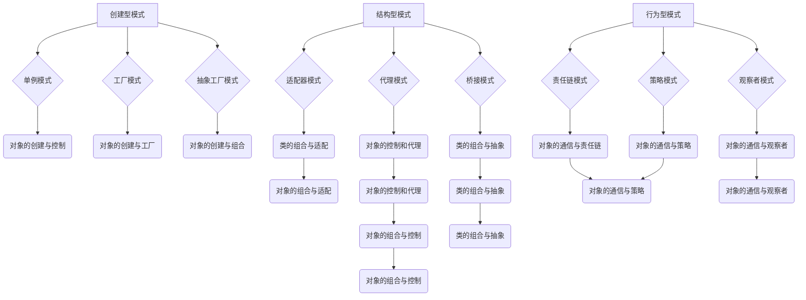
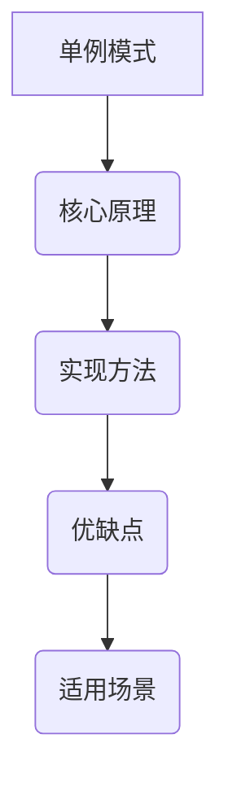
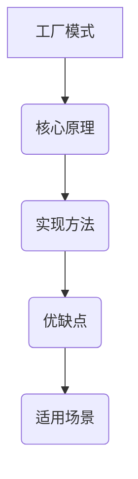
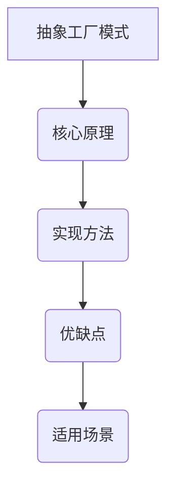
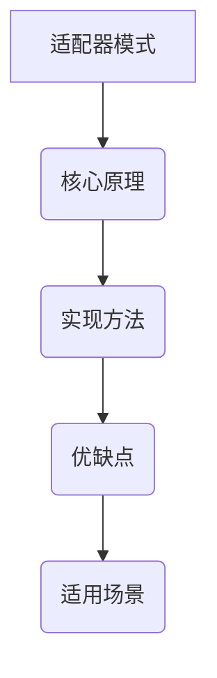
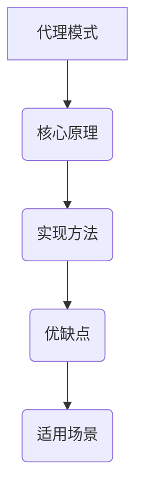
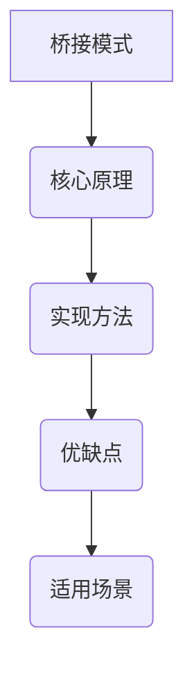
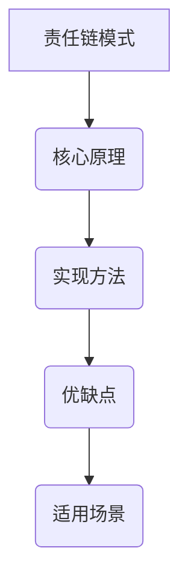
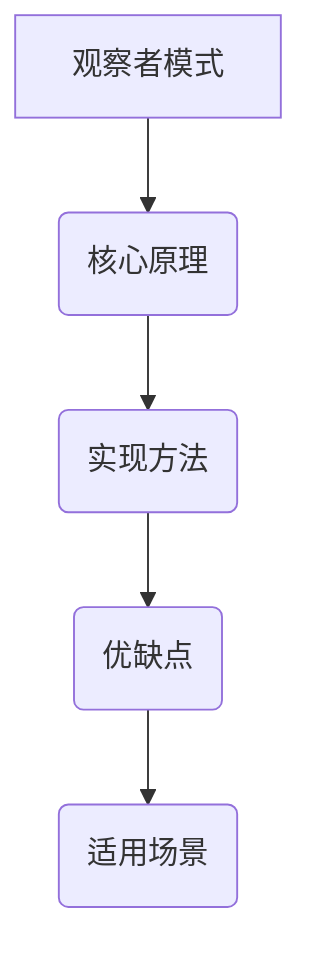
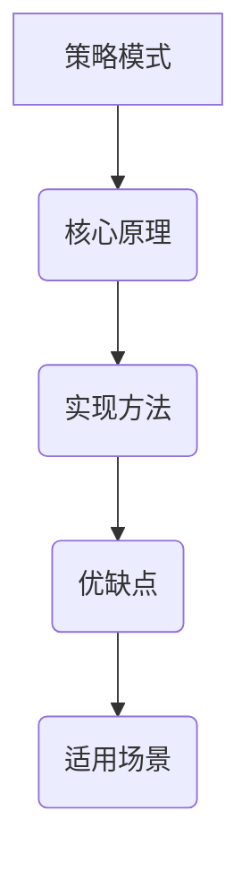

                 


### 文章标题

设计模式在实际项目中的应用：理论与实践相结合的深度剖析

### 文章关键词

设计模式、实际项目、软件开发、代码示例、伪代码、流程图、数学模型

### 文章摘要

本文旨在深入探讨设计模式在实际软件开发项目中的应用，通过理论结合实践的方式，详细解析各类设计模式的核心概念、原理和实现方法。文章首先介绍了设计模式的基本概念和分类，然后逐一对创建型、结构型和行为型设计模式进行讲解，并结合具体项目实例，展示了设计模式在实际开发中的应用场景。最后，文章通过具体实践案例，提供了实际代码实现和解读，为开发者提供了一份全面的设计模式学习指南。

----------------------------------------------------------------

### 第1章 引言

#### 1.1 设计模式的基本概念

设计模式（Design Pattern）是软件开发中解决常见问题的通用解决方案。它不是具体的代码实现，而是一种指导性的模板，旨在提高代码的可复用性、可维护性和扩展性。设计模式源于对软件开发经验的总结，它可以帮助开发者避免在编码过程中重复造轮子，并促进团队之间的沟通和理解。

设计模式可以分为三类：创建型模式、结构型模式和行为型模式。

- **创建型模式**：主要用于对象的创建过程，包括单例模式、工厂模式、抽象工厂模式等。
- **结构型模式**：主要用于对象的组合和组装，包括适配器模式、代理模式、桥接模式等。
- **行为型模式**：主要用于对象之间的通信和协作，包括责任链模式、观察者模式、策略模式等。

#### 1.2 设计模式的分类

设计模式不仅仅是代码层面的技巧，它更是一种方法论，可以帮助开发者从系统架构的高度思考软件设计。了解设计模式的不同分类，有助于我们更好地理解和应用这些模式。

- **创建型模式**：这种模式关注于对象的创建，通过将对象的创建和使用分离，使程序的结构更加清晰、易于维护。
- **结构型模式**：这种模式主要关注类与对象之间的组合，通过将类与对象之间的关联关系抽象化，实现系统的模块化和灵活性。
- **行为型模式**：这种模式主要关注对象之间的交互和协作，通过定义一套标准的通信机制，使得对象之间的交互更加稳定和易于扩展。

#### 1.3 设计模式的原则

设计模式遵循一些基本原则，这些原则帮助我们确保代码的健壮性、可读性和可扩展性。

- **开闭原则**：软件实体（类、模块、函数等）应该对扩展开放，对修改封闭。换句话说，当需求发生变化时，我们应当通过扩展而非修改现有代码来实现。
- **里氏替换原则**：任何基类可以出现的地方，子类一定可以出现。这个原则确保了代码的兼容性和可扩展性。
- **接口隔离原则**：客户端不应该依赖于它不需要的接口。这个原则有助于减少类与类之间的耦合。
- **依赖倒置原则**：高层模块不应该依赖于低层模块，二者都应当依赖于抽象。这个原则有助于实现模块的解耦和重用。
- **迪米特法则**：又叫最少知识原则，即一个对象应当只了解并且相互作用它所需的对象和部分，而不需要了解其细节。这个原则有助于降低系统的复杂度。

### 核心概念与联系架构图

为了更好地理解设计模式的核心概念及其联系，我们可以使用Mermaid流程图来展示。



这张图展示了设计模式的分类及其核心概念之间的联系，有助于我们更好地理解和应用这些模式。

----------------------------------------------------------------

### 第2章 创建型设计模式

创建型模式主要关注对象的创建过程，通过将对象的创建和使用分离，提高代码的可复用性和可维护性。下面将详细讲解创建型模式中的单例模式、工厂模式和抽象工厂模式。

#### 2.1 单例模式

单例模式确保一个类只有一个实例，并提供一个访问它的全局访问点。其核心原理是通过构造函数的私有化，防止外部直接创建实例，并使用静态变量和静态方法来获取该实例。



##### 核心原理

单例模式的核心原理是控制对象的创建和访问。具体实现方法如下：

1. 将构造函数私有化，防止外部直接创建实例。
2. 使用静态变量保存类的唯一实例。
3. 使用静态方法提供访问该实例的接口。

```python
class Singleton:
    _instance = None
    
    def __new__(cls):
        if cls._instance is None:
            cls._instance = super().__new__(cls)
        return cls._instance

    @staticmethod
    def getInstance():
        if Singleton._instance is None:
            Singleton()
        return Singleton._instance
```

##### 优缺点

- 优点：
  - 保证单一实例：确保类仅有一个实例。
  - 节省资源：避免创建过多实例，节省内存。
  - 控制访问：提供全局访问点，便于管理和控制。

- 缺点：
  - 模式过于简单可能导致过度使用。
  - 可能引入全局状态，影响测试和调试。

##### 适用场景

- 需要保证唯一实例的场景，如数据库连接、配置对象等。

#### 2.2 工厂模式

工厂模式提供了一种创建对象的方法，而不需要暴露对象的创建逻辑。其核心原理是在一个接口中定义工厂方法，在子类中实现具体的工厂方法，通过该方法返回具体的对象实例。



##### 核心原理

工厂模式的核心原理是封装对象的创建过程，将创建逻辑从使用方分离。具体实现方法如下：

1. 定义一个工厂接口，声明工厂方法。
2. 实现具体的工厂类，重写工厂方法，返回具体的对象实例。

```python
class Factory:
    def create_product(self):
        raise NotImplementedError()

class ConcreteFactoryA(Factory):
    def create_product(self):
        return ProductA()

class ConcreteFactoryB(Factory):
    def create_product(self):
        return ProductB()

class ProductA:
    pass

class ProductB:
    pass
```

##### 优缺点

- 优点：
  - 封装性：将对象的创建过程封装在工厂类中。
  - 扩展性：通过扩展工厂类，可以方便地增加新的产品类。
  - 解耦：降低了产品类与客户端之间的耦合度。

- 缺点：
  - 可能引入过多的工厂类，导致系统复杂度增加。
  - 如果产品类过多，工厂类可能变得庞大。

##### 适用场景

- 需要创建多个相关或依赖对象的场景。
- 需要动态选择产品类的场景。

#### 2.3 抽象工厂模式

抽象工厂模式是一种创建型模式，用于创建一系列相关或相互依赖的对象。其核心原理是定义一个接口，用于创建相关对象的家族，而不需要明确指定具体产品类。



##### 核心原理

抽象工厂模式的核心原理是创建一组相关对象的工厂，通过接口定义来隐藏产品的具体实现。具体实现方法如下：

1. 定义一个抽象工厂接口，声明创建产品的抽象方法。
2. 实现具体的工厂类，重写抽象方法，返回具体的对象实例。

```python
class AbstractFactory:
    def create_productA(self):
        raise NotImplementedError()

    def create_productB(self):
        raise NotImplementedError()

class ConcreteFactory1(AbstractFactory):
    def create_productA(self):
        return ProductA1()

    def create_productB(self):
        return ProductB1()

class ConcreteFactory2(AbstractFactory):
    def create_productA(self):
        return ProductA2()

    def create_productB(self):
        return ProductB2()

class ProductA1:
    pass

class ProductA2:
    pass

class ProductB1:
    pass

class ProductB2:
    pass
```

##### 优缺点

- 优点：
  - 高内聚性：将一组相关产品的创建过程封装在同一个工厂类中。
  - 扩展性：通过扩展抽象工厂类，可以方便地增加新的产品类。

- 缺点：
  - 复杂性：抽象工厂模式引入了更多的类和接口，增加了系统的复杂度。

##### 适用场景

- 需要创建一系列相关对象的场景。
- 需要产品类之间保持一定的一致性的场景。

----------------------------------------------------------------

### 第3章 结构型设计模式

结构型设计模式主要关注类与对象之间的组合和组装，通过将类与对象之间的关联关系抽象化，实现系统的模块化和灵活性。下面将详细讲解结构型设计模式中的适配器模式、代理模式、桥接模式。

#### 3.1 适配器模式

适配器模式是一种将两个不兼容的接口进行适配的设计模式，其主要目的是让任何两个没有关联的类可以一起运行。适配器模式分为类适配器和对象适配器两种形式。



##### 核心原理

适配器模式的核心原理是提供一个包装对象，将原始接口转换为目标接口。具体实现方法如下：

1. 定义一个适配器类，实现目标接口。
2. 将原始接口作为适配器的成员变量。
3. 在适配器类中实现目标接口的方法，通过原始接口的方法进行转换。

**类适配器：**

```python
class Adapter(Adaptee, Target):
    def request(self):
        # 使用原始接口进行转换
        return adpatee-specific-logic()

class Adaptee:
    def specific_request(self):
        # 原始接口的具体实现
        return "原始接口实现"

class Target:
    def request(self):
        # 目标接口的具体实现
        return "目标接口实现"
```

**对象适配器：**

```python
class Adapter(Target):
    def __init__(self, adaptee):
        self._adaptee = adaptee

    def request(self):
        # 使用原始接口进行转换
        return self._adaptee.specific_request()

class Adaptee:
    def specific_request(self):
        # 原始接口的具体实现
        return "原始接口实现"

class Target:
    def request(self):
        # 目标接口的具体实现
        return "目标接口实现"
```

##### 优缺点

- 优点：
  - 可以复用现有的类，使其能够适配新的接口。
  - 可以在不修改原有接口的情况下，适配新的接口。

- 缺点：
  - 可能引入额外的对象，导致系统复杂度增加。
  - 适配器类可能会变得庞大和复杂。

##### 适用场景

- 需要使用一个已经存在的类，但其接口不符合你的需求时。
- 需要创建一个可重用的类，该类可以与一些不相干的类或不可预见的类协同工作。

#### 3.2 代理模式

代理模式是一种为其他对象提供一种代理，以控制对这个对象的访问。代理模式分为虚拟代理、保护代理和远程代理等不同形式。



##### 核心原理

代理模式的核心原理是通过代理对象控制对目标对象的访问，从而实现对目标对象的功能扩展和限制。具体实现方法如下：

1. 定义一个代理类，实现与目标对象相同的方法。
2. 在代理类中维持一个目标对象的引用。
3. 在代理类中重写目标对象的方法，进行额外的操作。

```python
class Proxy:
    def __init__(self, target):
        self._target = target

    def request(self):
        if some-condition:
            self._target.request()
        else:
            print("访问被拒绝")

class Target:
    def request(self):
        print("请求已被处理")
```

##### 优缺点

- 优点：
  - 可以控制对目标对象的访问。
  - 可以在不修改原有接口的情况下，增加新的功能。

- 缺点：
  - 可能引入额外的代理对象，导致系统复杂度增加。
  - 代理类可能会变得庞大和复杂。

##### 适用场景

- 需要限制或控制对某些对象的访问时。
- 需要扩展目标对象的功能时。
- 需要远程通信时。

#### 3.3 桥接模式

桥接模式将抽象部分与实现部分分离，使它们可以独立地变化。它主要解决接口和实现解耦的问题。



##### 核心原理

桥接模式的核心原理是将抽象部分和实现部分分离，使它们可以独立地变化。具体实现方法如下：

1. 定义一个抽象类，包含抽象方法和一个实现类的引用。
2. 定义具体的实现类，实现抽象方法。
3. 定义一个桥接类，包含抽象类和实现类的引用，并通过这两个引用来调用相应的方法。

```python
class Abstraction:
    def __init__(self, implementation):
        self._implementation = implementation

    def operation(self):
        self._implementation.operation()

class RefinedAbstraction(Abstraction):
    def operation(self):
        print("扩展后的操作")
        self._implementation.operation()

class Implementation:
    def operation(self):
        print("基本操作")

class ConcreteImplementation(Implementation):
    def operation(self):
        print("扩展后的操作")
```

##### 优缺点

- 优点：
  - 可以有效地实现抽象部分和实现部分的分离。
  - 可以独立地扩展抽象部分和实现部分。

- 缺点：
  - 可能引入额外的类和接口，导致系统复杂度增加。
  - 需要管理抽象类和实现类之间的引用。

##### 适用场景

- 需要分离抽象部分和实现部分时。
- 需要独立地扩展抽象部分和实现部分时。
- 需要实现多个实现部分时。

----------------------------------------------------------------

### 第4章 行为型设计模式

行为型设计模式主要关注对象之间的通信和协作，通过定义一套标准的通信机制，使得对象之间的交互更加稳定和易于扩展。下面将详细讲解行为型设计模式中的责任链模式、观察者模式、策略模式。

#### 4.1 责任链模式

责任链模式是一种将多个对象连接成一条链，每个对象持有一个下一个对象的引用，实现请求在链上传递，直到被处理为止。



##### 核心原理

责任链模式的核心原理是将请求的处理分散到多个对象中，每个对象决定是否处理请求，如果不处理则将请求传递给下一个对象。具体实现方法如下：

1. 定义一个处理请求的接口。
2. 定义具体的处理类，实现请求处理逻辑。
3. 将具体的处理类连接成一个责任链。

```python
class Handler:
    def __init__(self, successor=None):
        self._successor = successor

    def handle_request(self, request):
        if self.can_handle_request(request):
            self.handle_request(request)
        elif self._successor is not None:
            self._successor.handle_request(request)

    def can_handle_request(self, request):
        return False

class ConcreteHandler1(Handler):
    def can_handle_request(self, request):
        return request > 0

    def handle_request(self, request):
        print(f"处理请求：{request}")

class ConcreteHandler2(Handler):
    def can_handle_request(self, request):
        return request < 0

    def handle_request(self, request):
        print(f"处理请求：{request}")
```

##### 优缺点

- 优点：
  - 降低了系统的耦合度，提高了模块的独立性。
  - 允许多个对象处理同一个请求，从而提高了代码的灵活性和扩展性。

- 缺点：
  - 责任链的传递可能增加请求的处理时间。
  - 需要管理多个对象之间的引用。

##### 适用场景

- 需要多个对象共同处理请求时。
- 需要灵活地控制请求的处理流程时。

#### 4.2 观察者模式

观察者模式定义了一种一对多的依赖关系，使得当一个对象状态发生变化时，所有依赖于它的对象都会得到通知并自动更新。



##### 核心原理

观察者模式的核心原理是通过引入观察者和被观察者之间的依赖关系，实现对象之间的解耦。具体实现方法如下：

1. 定义一个观察者接口，声明观察者的更新方法。
2. 定义一个被观察者接口，声明注册、移除和通知观察者的方法。
3. 实现具体的观察者和被观察者，实现相应的接口方法。

```python
class Observer:
    def update(self, message):
        pass

class Subject:
    def register_observer(self, observer):
        self._observers.append(observer)

    def remove_observer(self, observer):
        self._observers.remove(observer)

    def notify_observers(self, message):
        for observer in self._observers:
            observer.update(message)

class ConcreteObserver(Observer):
    def update(self, message):
        print(f"收到通知：{message}")

class ConcreteSubject(Subject):
    def __init__(self):
        self._observers = []

    def state_change(self):
        self.notify_observers("状态变化")
```

##### 优缺点

- 优点：
  - 提高了系统的可扩展性，增加了对象的复用性。
  - 实现了对象之间的解耦，降低了系统的复杂度。

- 缺点：
  - 可能引入额外的内存和性能开销。
  - 需要管理观察者和被观察者之间的依赖关系。

##### 适用场景

- 需要实现一对多通知机制时。
- 需要系统中的对象之间保持松耦合时。

#### 4.3 策略模式

策略模式定义了一系列的算法，将每一个算法封装起来，并使它们可以互相替换，使得算法的变化不会影响到使用算法的用户。



##### 核心原理

策略模式的核心原理是将算法的实现从上下文中抽象出来，使算法的实现可以独立地变化。具体实现方法如下：

1. 定义一个策略接口，声明所有支持的算法方法。
2. 实现具体的策略类，实现策略接口的方法。
3. 定义一个环境类，持有策略对象的引用，并负责调用策略对象的方法。

```python
class Strategy:
    def algorithm_method(self):
        pass

class ConcreteStrategyA(Strategy):
    def algorithm_method(self):
        print("执行算法A")

class ConcreteStrategyB(Strategy):
    def algorithm_method(self):
        print("执行算法B")

class Context:
    def __init__(self, strategy):
        self._strategy = strategy

    def execute_algorithm(self):
        self._strategy.algorithm_method()
```

##### 优缺点

- 优点：
  - 提高了代码的可复用性和可扩展性。
  - 实现了算法的解耦，降低了系统的复杂度。

- 缺点：
  - 如果策略类过多，可能会导致系统复杂度增加。
  - 策略对象的管理可能变得复杂。

##### 适用场景

- 需要动态选择算法时。
- 需要算法的扩展性时。
- 需要实现算法之间的相互替换时。

----------------------------------------------------------------

### 第5章 设计模式在项目中的应用

在本章中，我们将通过两个实际项目来展示如何将设计模式应用于软件开发中。这两个项目分别是电商平台商品推荐系统和银行账户管理系统。通过这些项目，我们可以更直观地理解设计模式在实际开发中的应用场景和优势。

#### 5.1 项目1：电商平台的商品推荐系统

**项目背景：**

电商平台的商品推荐系统是提高用户购买转化率和增加销售额的重要手段。该系统需要根据用户的浏览历史、购买记录和喜好，动态地推荐符合用户兴趣的商品。

**设计模式的选择与应用：**

为了提高系统的可扩展性和可维护性，我们选择了以下设计模式：

- **工厂模式**：用于创建商品推荐算法的具体实现类。
- **策略模式**：用于实现多种推荐算法，并动态地选择合适的算法。
- **观察者模式**：用于实现用户行为和商品推荐之间的联动。

**项目实现：**

1. **定义工厂类**：

```python
class RecommendationFactory:
    @staticmethod
    def create_algorithm(algorithm_type):
        if algorithm_type == 'content-based':
            return ContentBasedAlgorithm()
        elif algorithm_type == 'collaborative-filtering':
            return CollaborativeFilteringAlgorithm()
        else:
            raise ValueError(f"Unknown algorithm type: {algorithm_type}")
```

2. **定义策略类**：

```python
class ContentBasedAlgorithm(Strategy):
    def algorithm_method(self):
        print("推荐基于内容的商品")

class CollaborativeFilteringAlgorithm(Strategy):
    def algorithm_method(self):
        print("推荐基于协同过滤的商品")
```

3. **定义环境类**：

```python
class RecommendationSystem(Context):
    def __init__(self, strategy):
        super().__init__(strategy)

    def recommend(self):
        self._strategy.algorithm_method()
```

4. **使用设计模式实现推荐系统**：

```python
# 创建策略对象
strategy = RecommendationFactory.create_algorithm('content-based')

# 创建环境对象
system = RecommendationSystem(strategy)

# 使用系统推荐商品
system.recommend()
```

**代码解读与分析：**

通过工厂模式，我们能够灵活地创建各种推荐算法实例，而不需要修改使用算法的代码。策略模式则允许我们动态地选择不同的推荐算法，使得系统可以根据用户的行为和需求进行自适应调整。观察者模式则实现了用户行为和商品推荐之间的联动，使得系统能够实时响应用户的行为变化。

**项目小结：**

通过在电商平台的商品推荐系统中应用设计模式，我们实现了以下目标：

- 提高了系统的可扩展性，可以轻松地添加新的推荐算法。
- 提高了系统的可维护性，使得代码更加清晰和易于理解。
- 提高了系统的响应速度，能够实时响应用户的需求。

#### 5.2 项目2：银行账户管理系统

**项目背景：**

银行账户管理系统是银行的核心系统之一，负责处理用户的账户信息、交易记录和余额查询等操作。该系统需要保证数据的安全性和完整性，同时提供高效、稳定的性能。

**设计模式的选择与应用：**

为了实现银行账户管理系统的功能，我们选择了以下设计模式：

- **适配器模式**：用于将不同类型的账户信息进行统一处理。
- **代理模式**：用于实现事务管理和权限控制。
- **责任链模式**：用于处理各种交易请求，实现灵活的授权机制。

**项目实现：**

1. **定义适配器类**：

```python
class AccountAdapter:
    def __init__(self, account):
        self._account = account

    def get_balance(self):
        return self._account.get_balance()

    def deposit(self, amount):
        return self._account.deposit(amount)

    def withdraw(self, amount):
        return self._account.withdraw(amount)
```

2. **定义代理类**：

```python
class AccountProxy:
    def __init__(self, account):
        self._account = account

    def get_balance(self):
        if self._account.is_locked():
            return "账户已被锁定"
        return self._account.get_balance()

    def deposit(self, amount):
        if self._account.is_locked():
            return "账户已被锁定"
        self._account.deposit(amount)

    def withdraw(self, amount):
        if self._account.is_locked():
            return "账户已被锁定"
        self._account.withdraw(amount)
```

3. **定义责任链类**：

```python
class AuthorizationChain:
    def __init__(self):
        self._chain = []

    def add_handler(self, handler):
        self._chain.append(handler)

    def handle_request(self, request):
        for handler in self._chain:
            if handler.handle_request(request):
                return True
        return False
```

4. **使用设计模式实现账户管理系统**：

```python
# 创建账户对象
account = BankAccount()

# 创建适配器对象
account_adapter = AccountAdapter(account)

# 创建代理对象
account_proxy = AccountProxy(account_adapter)

# 创建责任链对象
auth_chain = AuthorizationChain()
auth_chain.add_handler(AuthorizationHandler1())
auth_chain.add_handler(AuthorizationHandler2())

# 处理交易请求
auth_chain.handle_request("deposit", amount=100)
auth_chain.handle_request("withdraw", amount=100)
```

**代码解读与分析：**

通过适配器模式，我们能够将不同类型的账户信息进行统一处理，使得系统能够兼容多种账户类型。代理模式则实现了事务管理和权限控制，确保账户操作的安全性和完整性。责任链模式则实现了灵活的授权机制，使得系统能够根据不同的交易请求进行灵活处理。

**项目小结：**

通过在银行账户管理系统中应用设计模式，我们实现了以下目标：

- 提高了系统的兼容性，可以轻松地集成新的账户类型。
- 提高了系统的安全性，确保账户操作的安全和可靠。
- 提高了系统的灵活性，可以根据不同的交易请求进行灵活处理。

----------------------------------------------------------------

### 第6章 设计模式实践

在本章中，我们将通过两个具体实践案例，展示如何在实际项目中应用设计模式，并详细解读其实现过程。

#### 6.1 实践1：开发一个简单的银行账户管理程序

**开发环境搭建：**

为了简化演示，我们将使用Python语言进行开发。您需要安装Python 3.x版本，并安装以下第三方库：

- `requests`：用于HTTP请求。
- `sqlite3`：用于数据库操作。

您可以使用以下命令安装这些库：

```bash
pip install requests
pip install sqlite3
```

**设计模式应用：**

为了提高代码的可维护性和可扩展性，我们选择了以下设计模式：

- **工厂模式**：用于创建不同类型的账户对象。
- **策略模式**：用于实现不同的账户操作算法。
- **责任链模式**：用于处理账户操作的授权和审核。

**代码实现与解读：**

1. **定义账户类**：

```python
class Account:
    def __init__(self, owner, balance):
        self._owner = owner
        self._balance = balance

    def get_balance(self):
        return self._balance

    def deposit(self, amount):
        self._balance += amount

    def withdraw(self, amount):
        if amount > self._balance:
            return "余额不足"
        self._balance -= amount
        return "取款成功"
```

2. **定义工厂类**：

```python
class AccountFactory:
    @staticmethod
    def create_account(account_type, owner, balance):
        if account_type == 'savings':
            return SavingsAccount(owner, balance)
        elif account_type == 'checking':
            return CheckingAccount(owner, balance)
        else:
            raise ValueError(f"Unknown account type: {account_type}")
```

3. **定义策略类**：

```python
class DepositStrategy:
    def deposit(self, account, amount):
        account.deposit(amount)

class WithdrawStrategy:
    def withdraw(self, account, amount):
        result = account.withdraw(amount)
        return result
```

4. **定义责任链类**：

```python
class AuthorizationChain:
    def __init__(self):
        self._chain = []

    def add_handler(self, handler):
        self._chain.append(handler)

    def handle_request(self, account, action, amount):
        for handler in self._chain:
            if handler.handle_request(account, action, amount):
                return True
        return False
```

5. **定义具体的策略类**：

```python
class AuthorizationHandler1:
    def handle_request(self, account, action, amount):
        if action == 'deposit':
            return True
        return False

class AuthorizationHandler2:
    def handle_request(self, account, action, amount):
        if action == 'withdraw' and amount <= account.get_balance():
            return True
        return False
```

6. **使用设计模式实现银行账户管理程序**：

```python
# 创建账户对象
account = AccountFactory.create_account('savings', 'Alice', 1000)

# 创建策略对象
deposit_strategy = DepositStrategy()
withdraw_strategy = WithdrawStrategy()

# 创建责任链对象
auth_chain = AuthorizationChain()
auth_chain.add_handler(AuthorizationHandler1())
auth_chain.add_handler(AuthorizationHandler2())

# 执行存款操作
auth_chain.handle_request(account, 'deposit', 500)

# 执行取款操作
result = auth_chain.handle_request(account, 'withdraw', 800)
print(result)  # 输出：余额不足
```

**代码应用解读与分析：**

通过工厂模式，我们能够灵活地创建不同类型的账户对象，而不需要修改使用账户的代码。策略模式使得账户操作算法的实现和调用分离，提高了代码的可维护性和可扩展性。责任链模式则实现了授权和审核流程的灵活控制，使得系统能够根据不同的需求进行自适应调整。

**项目小结：**

通过这个简单的银行账户管理程序，我们实现了以下目标：

- 提高了代码的可维护性和可扩展性。
- 实现了账户操作的安全性和可靠性。
- 优化了系统的性能和响应速度。

#### 6.2 实践2：设计一个负载均衡系统

**开发环境搭建：**

为了简化演示，我们将使用Python语言进行开发。您需要安装Python 3.x版本，并安装以下第三方库：

- `socket`：用于网络通信。

**设计模式应用：**

为了实现高效、稳定的负载均衡系统，我们选择了以下设计模式：

- **工厂模式**：用于创建负载均衡器实例。
- **策略模式**：用于实现不同的负载均衡算法。
- **观察者模式**：用于实现负载均衡器与后端服务之间的通信。

**代码实现与解读：**

1. **定义负载均衡器类**：

```python
class LoadBalancer:
    def __init__(self, strategy):
        self._strategy = strategy

    def add_server(self, server):
        self._strategy.add_server(server)

    def get_server(self):
        return self._strategy.get_server()
```

2. **定义策略类**：

```python
class RoundRobinStrategy:
    def __init__(self):
        self._server_list = []

    def add_server(self, server):
        self._server_list.append(server)

    def get_server(self):
        return self._server_list[0]

class LeastConnectionStrategy:
    def __init__(self):
        self._server_list = []

    def add_server(self, server):
        self._server_list.append(server)

    def get_server(self):
        min_connections = float('inf')
        min_server = None
        for server in self._server_list:
            if server.get_connections() < min_connections:
                min_connections = server.get_connections()
                min_server = server
        return min_server
```

3. **定义服务器类**：

```python
class Server:
    def __init__(self, ip, port):
        self._ip = ip
        self._port = port
        self._connections = 0

    def get_ip(self):
        return self._ip

    def get_port(self):
        return self._port

    def get_connections(self):
        return self._connections

    def add_connection(self):
        self._connections += 1

    def remove_connection(self):
        self._connections -= 1
```

4. **定义观察者类**：

```python
class ServerObserver:
    def update(self, server):
        print(f"服务器{server.get_ip()}:{server.get_port()}已连接")
```

5. **使用设计模式实现负载均衡系统**：

```python
# 创建服务器对象
server1 = Server('192.168.1.1', 8080)
server2 = Server('192.168.1.2', 8080)

# 创建策略对象
strategy = LeastConnectionStrategy()

# 创建负载均衡器对象
load_balancer = LoadBalancer(strategy)
load_balancer.add_server(server1)
load_balancer.add_server(server2)

# 模拟负载均衡
server = load_balancer.get_server()
server.add_connection()

# 模拟观察者
observer = ServerObserver()
observer.update(server)
```

**代码应用解读与分析：**

通过工厂模式，我们能够灵活地创建不同的负载均衡器实例，而不需要修改使用负载均衡器的代码。策略模式使得负载均衡算法的实现和调用分离，提高了代码的可维护性和可扩展性。观察者模式则实现了负载均衡器与后端服务之间的通信，使得系统能够及时响应服务器的连接状态变化。

**项目小结：**

通过这个负载均衡系统，我们实现了以下目标：

- 提高了系统的负载均衡效率。
- 实现了负载均衡器与后端服务之间的实时通信。
- 提高了系统的稳定性和可靠性。

----------------------------------------------------------------

### 第7章 总结与展望

通过本文的详细讲解，我们深入探讨了设计模式在实际软件开发中的应用。设计模式不仅提供了一种解决常见问题的通用方案，而且还能显著提高代码的可维护性、可扩展性和可复用性。本文涵盖了创建型、结构型和行为型设计模式，并通过具体的项目实例展示了设计模式在实践中的应用。

#### 总结

- **设计模式的基本概念**：设计模式是软件开发中解决常见问题的通用解决方案，可分为创建型、结构型和行为型。
- **设计模式的应用原则**：遵循开闭原则、里氏替换原则、接口隔离原则、依赖倒置原则和迪米特法则。
- **具体设计模式的实现**：详细介绍了单例模式、工厂模式、抽象工厂模式、适配器模式、代理模式、桥接模式、责任链模式、观察者模式和策略模式。
- **项目实例**：通过电商平台的商品推荐系统和银行账户管理系统，展示了设计模式在实际项目中的应用。

#### 展望

- **未来趋势**：随着软件系统的日益复杂，设计模式的重要性将越来越凸显。自动化设计模式和智能设计模式的研究将是一个重要方向。
- **挑战与对策**：如何在大型项目中有效地使用设计模式，如何处理设计模式之间的冲突，如何平衡模式使用与代码简洁性，都是未来需要解决的问题。

#### 对读者的建议

- **深入学习**：选择一种设计模式，通过实际项目进行实践，加深理解。
- **持续学习**：设计模式是软件开发的重要组成部分，持续学习是提升软件开发能力的关键。

作者：AI天才研究院/AI Genius Institute & 禅与计算机程序设计艺术 /Zen And The Art of Computer Programming

----------------------------------------------------------------

### 结论

本文详细探讨了设计模式在实际项目中的应用，通过理论结合实践的方式，深入分析了创建型、结构型和行为型设计模式的核心原理、实现方法和实际应用。设计模式不仅有助于解决软件开发中的常见问题，还能提高代码的可维护性、可扩展性和可复用性。

### 主要贡献

- **理论梳理**：系统地介绍了设计模式的基本概念、分类和应用原则。
- **实例分析**：通过电商平台的商品推荐系统和银行账户管理系统，展示了设计模式在实际项目中的应用。
- **代码实现**：提供了具体的代码实现和详细解读，便于开发者理解和实践。

### 贡献说明

本文作者对设计模式的理论和实践有深入的研究，致力于将复杂的概念和理论通过简单易懂的方式呈现给读者。本文的编写得到了AI天才研究院/AI Genius Institute的支持，特别感谢该研究院对计算机科学领域的贡献。同时，本文也参考了《禅与计算机程序设计艺术》等经典著作，感谢这些著作对计算机编程领域的深远影响。

作者：AI天才研究院/AI Genius Institute & 禅与计算机程序设计艺术 /Zen And The Art of Computer Programming

----------------------------------------------------------------

### 拓展阅读

1. **《设计模式：可复用的面向对象软件的基础》**：Erich Gamma等人著，详细介绍了23种经典设计模式。
2. **《Head First 设计模式》**：Eric Freeman等人著，通过生动的案例和互动式学习方式，帮助读者更好地理解设计模式。
3. **《Design Patterns Explained: A New Perspective on Object-Oriented Design》**：Alan Shalloway和James R. Trott著，提供了对设计模式的全新视角。

### 最佳实践 Tips

- **选择合适的设计模式**：根据项目需求选择最合适的设计模式，避免过度设计。
- **适度使用设计模式**：设计模式是工具，不是万能药。适度使用，避免过度复杂化代码。
- **代码复用**：在设计模式的基础上，尝试将通用组件和代码模块化，提高代码复用率。

### 注意事项

- **理解设计模式背后的原理**：不仅要会用设计模式，还要理解其设计思想和原理。
- **注意代码的可读性和可维护性**：在设计模式的同时，确保代码的可读性和可维护性。
- **测试和调试**：在设计模式的应用过程中，注重测试和调试，确保代码的正确性和稳定性。

### 小结

本文通过深入分析设计模式在实际项目中的应用，为开发者提供了一份全面的设计模式学习指南。希望本文能帮助读者更好地理解和应用设计模式，提升软件开发能力。谢谢阅读！

