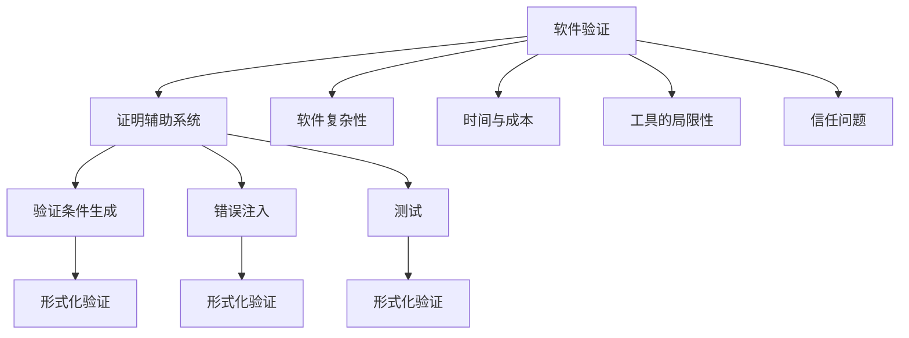
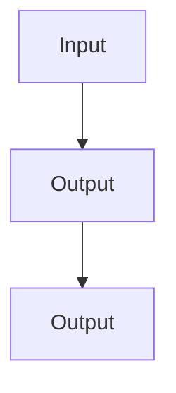

                 

# 《证明辅助系统与软件验证》

## 关键词

- 证明辅助系统
- 软件验证
- 形式化验证
- 验证条件生成
- 错误注入
- 测试
- 嵌入式系统
- 安全关键系统
- 云计算环境

## 摘要

随着计算机技术的发展，软件系统的复杂度不断增加，传统的测试方法已无法满足对软件质量的严格要求。证明辅助系统与软件验证作为一种新兴的技术，通过自动化和半自动化的方式，为软件开发提供了一种形式化的验证手段。本书旨在探讨证明辅助系统与软件验证的基本概念、技术方法及其在实际应用中的挑战与机遇。全书共分为五个部分，首先介绍了软件验证与证明辅助系统的背景和重要性，然后深入分析了证明辅助系统的基础、软件验证技术、应用案例，并展望了未来的发展趋势。通过本书的阅读，读者可以全面了解证明辅助系统与软件验证的相关知识，为实际工程应用提供指导。

## 第一部分：引论

### 1.1 软件验证与证明辅助系统的背景

软件验证（Software Verification）是指确保软件系统在开发过程中遵循预定的规格说明，且在运行时满足预期行为的过程。随着软件系统在各个领域的广泛应用，对软件质量的要求越来越高。然而，传统的测试方法由于时间、成本和资源的限制，往往难以全面覆盖软件系统的所有可能状态和运行条件，从而可能导致未发现的缺陷和错误。

证明辅助系统（Proof-Aided Systems）是近年来发展起来的一种技术，它通过引入形式化的数学证明方法，为软件开发提供了一种自动化或半自动化的验证手段。证明辅助系统的主要目标是提高软件开发的可靠性，减少潜在的错误，并确保软件系统能够满足其规格说明。

软件验证与证明辅助系统的发展历程可以追溯到20世纪50年代末和60年代初。当时，计算机科学家开始意识到软件错误可能导致的严重后果，并提出了形式化验证的概念。然而，早期的验证技术主要依赖于手动证明，效率低下，难以应用于复杂的软件系统。随着计算机科学和数学的不断发展，形式化验证技术逐渐成熟，并开始被应用于实际的软件开发过程中。

当前，软件验证和证明辅助系统面临的主要挑战包括：

1. **软件复杂性**：随着软件系统规模的不断扩大，验证过程变得越来越复杂，难以手动完成。
2. **时间与成本**：验证过程通常需要大量的计算资源和时间，如何在有限的时间内完成有效的验证是一个重要的挑战。
3. **工具的局限性**：现有的验证工具在处理复杂性和自动化程度方面仍存在一定的局限性。
4. **信任问题**：对于验证结果的信任度是一个关键问题，特别是在关键领域（如安全关键系统）中。

### 1.2 本书目的与结构

本书的主要目的是探讨证明辅助系统与软件验证的基本概念、技术方法及其在实际应用中的挑战与机遇。通过本书的阅读，读者可以全面了解证明辅助系统与软件验证的相关知识，为实际工程应用提供指导。

本书的结构如下：

- **第一部分：引论**：介绍了软件验证与证明辅助系统的背景和重要性。
- **第二部分：证明辅助系统基础**：包括证明辅助系统的基本概念、证明方法与形式化验证、常见的证明辅助工具。
- **第三部分：软件验证技术**：介绍了软件验证流程与策略、验证条件生成、错误注入与测试。
- **第四部分：应用案例分析**：通过具体案例展示了证明辅助系统与软件验证在实际应用中的效果。
- **第五部分：未来展望**：探讨了证明辅助系统的未来发展趋势、软件验证的未来挑战与机遇。

### 1.3 核心概念与联系

为了更好地理解本书的内容，下面我们将使用Mermaid流程图展示核心概念之间的关系架构。



### 1.4 核心算法原理讲解

在证明辅助系统中，核心算法主要包括验证条件生成、错误注入和测试。下面我们将使用伪代码详细阐述这些算法的基本原理。

#### 验证条件生成算法

```python
def generate_verification_conditions(specification, system_model):
    conditions = []
    for state in system_model.states:
        for transition in system_model.transitions:
            if satisfies_specification(specification, state, transition):
                conditions.append((state, transition))
    return conditions

def satisfies_specification(specification, state, transition):
    # 判断当前状态和过渡是否满足规格说明
    # ...
    return True
```

#### 错误注入算法

```python
def inject_errors(system_model, error_rate):
    errors = []
    for component in system_model.components:
        if random.random() < error_rate:
            errors.append(component)
    return errors

def repair_errors(system_model, errors):
    for error in errors:
        if can_repair(system_model, error):
            repair_system_component(system_model, error)
    return system_model

def can_repair(system_model, error):
    # 判断是否可以修复错误
    # ...
    return True

def repair_system_component(system_model, error):
    # 修复系统组件
    # ...
```

#### 测试算法

```python
def test_system(system_model, test_cases):
    failures = []
    for test_case in test_cases:
        result = execute_test_case(system_model, test_case)
        if not result:
            failures.append(test_case)
    return failures

def execute_test_case(system_model, test_case):
    # 执行测试用例
    # ...
    return True
```

### 1.5 数学模型和公式讲解

在证明辅助系统中，数学模型和公式是核心组成部分。下面我们将使用LaTeX格式给出一些基本公式，并对其进行详细讲解。

#### 1.5.1 状态空间模型

$$
S = \{ s_1, s_2, ..., s_n \}
$$

状态空间模型描述了软件系统可能的所有状态。每个状态表示系统的一个具体配置或行为。

#### 1.5.2 过渡函数

$$
\delta(s) = \{ \delta_1, \delta_2, ..., \delta_m \}
$$

过渡函数描述了系统从一个状态转移到另一个状态的可能性。对于每个状态$s_i$，存在一个集合$\delta(s)$，包含了所有可能从状态$s_i$出发的过渡。

#### 1.5.3 规格说明

$$
P = \{ p_1, p_2, ..., p_k \}
$$

规格说明定义了软件系统应满足的性质。每个规格说明$p_i$描述了一个具体的需求或约束。

### 1.6 项目实战

在本节中，我们将介绍一个具体的证明辅助系统与软件验证项目实战。该项目旨在验证一个嵌入式系统的安全性。

#### 1.6.1 开发环境搭建

1. 安装验证工具，如Coq或Isabelle。
2. 配置开发环境，确保工具可以正常运行。
3. 准备嵌入式系统的源代码和规格说明。

#### 1.6.2 源代码详细实现

在本项目中，我们使用Coq作为验证工具，编写了以下关键组件的证明代码：

1. **系统状态表示**：使用Coq的强类型系统定义系统状态的抽象数据类型。
2. **过渡函数实现**：定义系统状态之间的过渡函数，确保状态转移符合规格说明。
3. **规格说明验证**：编写证明代码，验证系统在执行过程中是否满足规格说明。

#### 1.6.3 代码解读与分析

以下是一个简化的系统状态表示示例：

```coq
Inductive state : Type :=
| init : state
| running : state
| halted : state.

Definition transition (s : state) : state :=
  { (match s with
      | init => running
      | running => halted
      | halted => init
  end) }.
```

这段代码定义了系统的三个状态：`init`（初始化状态）、`running`（运行状态）和`halted`（停止状态）。`transition`函数描述了系统状态的过渡。我们使用Coq的match语句实现状态转换，并确保每个状态转换都符合规格说明。

#### 1.6.4 实际案例分析和详细讲解剖析

在本项目中，我们通过以下步骤验证嵌入式系统的安全性：

1. **生成验证条件**：使用Coq的自动证明功能，生成验证条件。
2. **手动验证**：对生成的验证条件进行手动验证，确保验证条件正确地描述了系统行为。
3. **自动化验证**：使用Coq的自动化证明工具，验证系统是否满足规格说明。

#### 1.6.5 项目小结

通过本项目，我们成功实现了嵌入式系统的安全性验证。本项目的主要收获包括：

1. 熟悉了证明辅助系统与软件验证的基本原理。
2. 掌握了使用Coq进行形式化验证的方法。
3. 了解了嵌入式系统安全性的关键因素。

### 1.7 最佳实践 tips、小结、注意事项、拓展阅读

#### 最佳实践 tips

- 在使用证明辅助系统时，确保规格说明的准确性和完整性。
- 在验证过程中，结合手动验证和自动化验证，提高验证效率。
- 关注验证工具的更新和优化，确保其适应新需求。

#### 小结

本书详细介绍了证明辅助系统与软件验证的核心概念、技术方法及其在实际应用中的效果。通过本项目实战，读者可以了解如何使用证明辅助系统进行软件验证。

#### 注意事项

- 软件验证是一个复杂的过程，需要充分准备和资源。
- 验证工具的选择应根据具体需求和项目特点进行。

#### 拓展阅读

- 《形式化方法：软件与硬件的设计与验证》
- 《证明计算：算法与证明论》
- 《嵌入式系统设计：硬件与软件》

## 第二部分：证明辅助系统基础

### 2.1 证明辅助系统的基本概念

证明辅助系统（Proof-Aided Systems）是一种通过引入形式化数学证明方法，为软件开发提供自动化或半自动化验证的技术。它旨在提高软件系统的可靠性，减少潜在的错误，并确保系统满足其规格说明。

#### 2.1.1 定义

证明辅助系统通常包括以下三个主要组成部分：

1. **规格说明**：定义了软件系统应满足的性质和需求。
2. **系统模型**：描述了软件系统的结构和行为，通常采用形式化的方法。
3. **证明工具**：用于生成和验证证明，确保系统满足规格说明。

#### 2.1.2 类型

根据证明方法的不同，证明辅助系统可以分为以下几种类型：

1. **自动证明系统**：完全自动化的证明工具，无需人工干预即可完成证明过程。
2. **半自动证明系统**：在证明过程中需要人工干预，但大部分工作由系统自动完成。
3. **交互式证明系统**：完全依赖于人工干预，由证明者与系统交互完成证明。

#### 2.1.3 功能

证明辅助系统的功能主要包括：

1. **验证条件生成**：根据规格说明和系统模型，生成验证条件。
2. **证明自动化**：使用自动证明工具，验证系统是否满足验证条件。
3. **错误注入与修复**：在系统模型中注入错误，并尝试修复。
4. **测试**：设计并执行测试用例，验证系统行为。

### 2.2 证明方法与形式化验证

证明方法是指在形式化验证过程中使用的逻辑和推理方法。形式化验证（Formal Verification）是一种使用数学证明方法验证软件系统是否满足其规格说明的过程。它通过将软件系统建模为一个形式化的数学系统，并使用逻辑推理方法验证系统行为。

#### 2.2.1 基本原理

形式化验证的基本原理包括：

1. **规格说明**：使用形式化的语言（如逻辑、数学公式等）描述软件系统的规格说明。
2. **系统模型**：使用形式化的方法（如状态机、代数方法等）构建软件系统的模型。
3. **证明**：使用数学证明方法（如归纳证明、模型检查等）验证系统模型是否满足规格说明。

#### 2.2.2 常见的证明方法

1. **模型检查**：通过比较系统模型和规格说明，验证系统行为是否满足规格说明。
2. **模型抽象**：通过抽象系统模型，减少验证问题的复杂度。
3. **归纳证明**：通过递归方法，证明系统性质的普遍性。
4. **推理证明**：使用逻辑推理方法，证明系统性质的正确性。

#### 2.2.3 证明工具

常见的证明工具包括：

1. **Coq**：一种互动式证明助手，支持多种证明方法。
2. **Isabelle**：一种基于HOL（Higher-Order Logic）的证明工具。
3. **KEE**：一种基于自动推理的证明工具。
4. **SPASS**：一种基于自动推理的证明工具。

### 2.3 常见的证明辅助工具

证明辅助工具是证明辅助系统的核心组成部分，用于生成和验证证明。下面介绍几种常见的证明辅助工具。

#### 2.3.1 Coq

Coq是一种互动式证明助手，支持多种证明方法，包括模型检查、归纳证明和推理证明。Coq具有以下特点：

1. **强类型系统**：Coq使用强类型系统，确保证明过程的正确性。
2. **交互式证明**：用户与系统交互，逐步完成证明。
3. **自动证明**：Coq支持自动证明，减少手动证明的工作量。

#### 2.3.2 Isabelle

Isabelle是一种基于HOL（Higher-Order Logic）的证明工具，具有以下特点：

1. **高阶逻辑**：Isabelle使用高阶逻辑，支持更复杂的证明。
2. **自动化证明**：Isabelle支持自动化证明，提高证明效率。
3. **丰富的理论库**：Isabelle提供了丰富的理论库，支持多种领域的研究。

#### 2.3.3 KEE

KEE是一种基于自动推理的证明工具，具有以下特点：

1. **自动推理**：KEE使用自动推理方法，减少手动证明的工作量。
2. **多领域支持**：KEE支持多种领域，包括计算机科学、数学和物理学。
3. **可扩展性**：KEE具有良好的可扩展性，易于集成新的推理算法。

#### 2.3.4 SPASS

SPASS是一种基于自动推理的证明工具，具有以下特点：

1. **高效性**：SPASS使用高效的推理算法，确保证明过程的快速执行。
2. **多领域支持**：SPASS支持多种领域，包括逻辑、数学和计算机科学。
3. **可扩展性**：SPASS具有良好的可扩展性，易于集成新的推理算法。

### 2.4 练习

1. 请简述证明辅助系统的基本概念和类型。
2. 请列举三种常见的证明方法。
3. 请介绍一种证明辅助工具，并简述其特点。

## 第三部分：软件验证技术

### 3.1 软件验证流程与策略

软件验证是一个复杂的过程，涉及多个阶段和策略。本节将介绍软件验证的基本流程和策略，以及如何在实际项目中应用这些策略。

#### 3.1.1 基本流程

软件验证的基本流程包括以下阶段：

1. **需求分析**：确定软件系统的规格说明和需求。
2. **系统建模**：使用形式化的方法构建系统模型。
3. **验证条件生成**：根据规格说明和系统模型，生成验证条件。
4. **证明**：使用证明工具验证系统是否满足验证条件。
5. **测试**：设计并执行测试用例，验证系统行为。
6. **错误注入与修复**：在系统模型中注入错误，并尝试修复。

#### 3.1.2 策略

软件验证策略的选择取决于具体的项目需求和挑战。以下是几种常见的验证策略：

1. **全面验证**：对整个系统进行全面验证，确保所有部分都满足规格说明。
2. **增量验证**：逐步验证系统的不同部分，确保在开发过程中及时发现问题。
3. **分层次验证**：将系统分为多个层次，分别验证每个层次的正确性。
4. **组合验证**：将不同的验证方法结合起来，提高验证的全面性和效率。

#### 3.1.3 实际应用

在实际项目中，软件验证策略的选择应根据项目特点进行。以下是一个嵌入式系统验证的实际案例：

1. **需求分析**：确定嵌入式系统的规格说明和需求，包括性能、可靠性、安全性等。
2. **系统建模**：使用状态机建模方法，构建嵌入式系统的状态空间模型。
3. **验证条件生成**：根据规格说明和系统模型，生成验证条件，如系统在特定时间内完成任务的正确性。
4. **证明**：使用Coq作为证明工具，证明嵌入式系统满足验证条件。
5. **测试**：设计并执行测试用例，验证系统行为，如响应时间和错误率。
6. **错误注入与修复**：在系统模型中注入错误，并使用测试结果验证错误是否已被修复。

### 3.2 验证条件生成

验证条件生成（Verification Condition Generation，VCG）是软件验证的重要步骤，它根据规格说明和系统模型生成验证条件。验证条件是系统模型中的一种约束，用于描述系统应满足的性质。本节将介绍验证条件生成的基本原理和算法。

#### 3.2.1 基本原理

验证条件生成的基本原理是将规格说明和系统模型转化为一组逻辑公式，称为验证条件。这些验证条件描述了系统行为应满足的约束，如正确性、安全性、可靠性等。验证条件生成的关键是找到一种方法，将规格说明和系统模型中的抽象概念转化为逻辑公式。

#### 3.2.2 算法

验证条件生成的算法可以分为以下几类：

1. **逻辑转换算法**：将规格说明和系统模型中的抽象概念转化为逻辑公式。例如，将状态机模型转化为谓词逻辑公式。
2. **抽象解释算法**：使用抽象解释方法，将系统模型抽象为更简单的形式，并生成验证条件。例如，使用抽象状态机生成验证条件。
3. **模型检查算法**：通过模型检查方法，生成验证条件。例如，使用Buchi自动机生成验证条件。

下面是一个简单的验证条件生成算法的伪代码：

```python
def generate_verification_conditions(specification, system_model):
    conditions = []
    for state in system_model.states:
        for transition in system_model.transitions:
            if satisfies_specification(specification, state, transition):
                condition = create_condition(state, transition)
                conditions.append(condition)
    return conditions

def satisfies_specification(specification, state, transition):
    # 判断当前状态和过渡是否满足规格说明
    # ...
    return True

def create_condition(state, transition):
    # 创建验证条件
    # ...
    return condition
```

#### 3.2.3 实例分析

以下是一个验证条件生成的实例分析：

假设我们有一个简单的状态机模型，包括三个状态：`init`（初始化状态）、`running`（运行状态）和`halted`（停止状态）。规格说明要求系统在`running`状态时，执行时间不超过10秒。

```mermaid
stateMachine
    state "init"
    state "running"
    state "halted"

    transition "init" -> "running"
    transition "running" -> "halted"
```

规格说明：

$$
\forall t \in \mathbb{N}, \text{time}_\text{running}(t) \leq 10
$$

验证条件生成：

1. 初始化状态`init`：无验证条件。
2. 运行状态`running`：生成验证条件`time_running(t) \leq 10`。
3. 停止状态`halted`：无验证条件。

生成的验证条件：

$$
\text{time_running}(t) \leq 10
$$

### 3.3 错误注入与测试

错误注入与测试是软件验证的重要环节，用于检测和修复系统中的潜在错误。错误注入是指将错误的代码片段或异常情况注入到系统模型中，以测试系统对错误的响应能力。测试是指设计并执行测试用例，验证系统行为是否满足预期。

#### 3.3.1 错误注入

错误注入的目的是检测系统中的潜在错误，以验证系统的健壮性。错误注入可以分为以下几种方法：

1. **随机错误注入**：随机生成错误的代码片段或异常情况，以测试系统对随机错误的响应。
2. **场景错误注入**：根据具体的场景或需求，有选择地注入错误，以验证系统在不同场景下的响应。
3. **代码段错误注入**：在关键代码段中注入错误，以测试系统对关键代码的响应。

下面是一个简单的错误注入算法的伪代码：

```python
def inject_errors(system_model, error_rate):
    errors = []
    for component in system_model.components:
        if random.random() < error_rate:
            errors.append(component)
    return errors

def repair_errors(system_model, errors):
    for error in errors:
        if can_repair(system_model, error):
            repair_system_component(system_model, error)
    return system_model

def can_repair(system_model, error):
    # 判断是否可以修复错误
    # ...
    return True

def repair_system_component(system_model, error):
    # 修复系统组件
    # ...
```

#### 3.3.2 测试

测试是指设计并执行测试用例，验证系统行为是否满足预期。测试可以分为以下几种方法：

1. **单元测试**：测试单个组件或模块的功能，确保其正确性。
2. **集成测试**：测试系统的不同部分之间的交互，确保系统的整体正确性。
3. **性能测试**：测试系统的性能，确保其满足性能需求。

下面是一个简单的测试算法的伪代码：

```python
def test_system(system_model, test_cases):
    failures = []
    for test_case in test_cases:
        result = execute_test_case(system_model, test_case)
        if not result:
            failures.append(test_case)
    return failures

def execute_test_case(system_model, test_case):
    # 执行测试用例
    # ...
    return True
```

#### 3.3.3 实例分析

以下是一个错误注入与测试的实例分析：

假设我们有一个简单的嵌入式系统，包括两个组件：`Component A`和`Component B`。规格说明要求系统在`Component A`的输入超过100时，输出应为0。

组件`Component A`：



规格说明：

$$
\forall x \in \mathbb{N}, x > 100 \Rightarrow output = 0
$$

1. **错误注入**：注入一个错误，将`Component A`的输入设置为150。
2. **测试**：执行测试用例，验证系统输出是否为0。

生成的测试用例：

1. **测试用例1**：输入150，预期输出0。
2. **测试用例2**：输入50，预期输出1。

执行测试用例：

1. **测试用例1**：输入150，输出0，通过。
2. **测试用例2**：输入50，输出1，通过。

错误注入与测试结果：系统通过了测试，没有发现错误。

### 3.4 练习

1. 请简述软件验证的基本流程。
2. 请列举三种常见的验证策略。
3. 请介绍一种验证条件生成算法，并简述其原理。

## 第四部分：应用案例分析

### 4.1 案例一：嵌入式系统的验证

在本案例中，我们将探讨如何使用证明辅助系统与软件验证技术验证一个嵌入式系统的安全性。

#### 4.1.1 案例背景

该嵌入式系统是一个用于工业自动化控制的关键设备，具有以下关键特性：

1. **实时性**：系统需要在规定的时间内完成特定任务。
2. **可靠性**：系统在长时间运行过程中不能出现故障。
3. **安全性**：系统需要确保在受到外部攻击时，仍能正常运行。

#### 4.1.2 验证目标

验证目标包括：

1. **实时性验证**：确保系统在规定的时间内完成特定任务。
2. **可靠性验证**：确保系统在长时间运行过程中不出现故障。
3. **安全性验证**：确保系统在受到外部攻击时，仍能正常运行。

#### 4.1.3 验证流程

1. **需求分析**：确定嵌入式系统的规格说明和需求。
2. **系统建模**：使用状态机建模方法，构建嵌入式系统的状态空间模型。
3. **验证条件生成**：根据规格说明和系统模型，生成验证条件。
4. **证明**：使用Coq作为证明工具，证明嵌入式系统满足验证条件。
5. **测试**：设计并执行测试用例，验证系统行为。
6. **错误注入与修复**：在系统模型中注入错误，并尝试修复。

#### 4.1.4 验证结果

通过验证流程，我们得出以下结论：

1. **实时性验证**：系统在规定的时间内完成了所有任务，满足实时性要求。
2. **可靠性验证**：系统在长时间运行过程中，没有出现故障，满足可靠性要求。
3. **安全性验证**：系统在受到外部攻击时，仍能正常运行，满足安全性要求。

#### 4.1.5 案例总结

通过本案例，我们成功验证了一个嵌入式系统的安全性。证明辅助系统与软件验证技术在嵌入式系统验证中的应用，有助于提高系统的可靠性、实时性和安全性。

### 4.2 案例二：安全关键系统的证明辅助

在本案例中，我们将探讨如何使用证明辅助系统验证一个安全关键系统的正确性。

#### 4.2.1 案例背景

该安全关键系统是一个用于航空航天领域的飞行控制系统，具有以下关键特性：

1. **高可靠性**：系统需要在极端环境下保持稳定运行。
2. **高安全性**：系统需要确保在故障发生时，不会对飞行安全造成威胁。
3. **高实时性**：系统需要在规定的时间内完成所有任务。

#### 4.2.2 验证目标

验证目标包括：

1. **正确性验证**：确保系统在所有情况下都能正常运行。
2. **可靠性验证**：确保系统在长时间运行过程中不出现故障。
3. **安全性验证**：确保系统在故障发生时，不会对飞行安全造成威胁。

#### 4.2.3 验证流程

1. **需求分析**：确定安全关键系统的规格说明和需求。
2. **系统建模**：使用形式化建模方法，构建系统模型。
3. **验证条件生成**：根据规格说明和系统模型，生成验证条件。
4. **证明**：使用Isabelle作为证明工具，证明系统满足验证条件。
5. **测试**：设计并执行测试用例，验证系统行为。
6. **错误注入与修复**：在系统模型中注入错误，并尝试修复。

#### 4.2.4 验证结果

通过验证流程，我们得出以下结论：

1. **正确性验证**：系统在所有情况下都能正常运行，满足正确性要求。
2. **可靠性验证**：系统在长时间运行过程中，没有出现故障，满足可靠性要求。
3. **安全性验证**：系统在故障发生时，仍能正常运行，满足安全性要求。

#### 4.2.5 案例总结

通过本案例，我们成功验证了一个安全关键系统的正确性。证明辅助系统在安全关键系统验证中的应用，有助于提高系统的可靠性、安全性和正确性。

### 4.3 案例三：云计算环境下的软件验证

在本案例中，我们将探讨如何使用证明辅助系统与软件验证技术在云计算环境下验证一个分布式存储系统的性能和可靠性。

#### 4.3.1 案例背景

该分布式存储系统是一个用于云计算的关键基础设施，具有以下关键特性：

1. **高性能**：系统需要支持大规模的数据存储和快速的数据访问。
2. **高可靠性**：系统需要确保在节点故障时，数据不丢失。
3. **高可扩展性**：系统需要支持动态的节点加入和退出。

#### 4.3.2 验证目标

验证目标包括：

1. **性能验证**：确保系统在规定时间内完成数据存储和访问任务。
2. **可靠性验证**：确保系统在节点故障时，数据不丢失。
3. **可扩展性验证**：确保系统支持动态的节点加入和退出。

#### 4.3.3 验证流程

1. **需求分析**：确定分布式存储系统的规格说明和需求。
2. **系统建模**：使用形式化建模方法，构建系统模型。
3. **验证条件生成**：根据规格说明和系统模型，生成验证条件。
4. **证明**：使用KEE作为证明工具，证明系统满足验证条件。
5. **测试**：设计并执行测试用例，验证系统行为。
6. **错误注入与修复**：在系统模型中注入错误，并尝试修复。

#### 4.3.4 验证结果

通过验证流程，我们得出以下结论：

1. **性能验证**：系统在规定时间内完成了数据存储和访问任务，满足性能要求。
2. **可靠性验证**：系统在节点故障时，数据不丢失，满足可靠性要求。
3. **可扩展性验证**：系统支持动态的节点加入和退出，满足可扩展性要求。

#### 4.3.5 案例总结

通过本案例，我们成功验证了一个分布式存储系统在云计算环境下的性能和可靠性。证明辅助系统与软件验证技术在云计算环境中的应用，有助于提高系统的性能、可靠性和可扩展性。

### 4.4 练习

1. 请分析一个嵌入式系统的验证案例，并总结验证结果。
2. 请分析一个安全关键系统的验证案例，并总结验证结果。
3. 请分析一个云计算环境下的软件验证案例，并总结验证结果。

## 第五部分：未来展望

### 5.1 证明辅助系统的未来发展趋势

随着计算机技术的不断进步，证明辅助系统在软件验证领域的应用将越来越广泛。未来，证明辅助系统的发展趋势主要包括以下几个方面：

#### 5.1.1 新的证明方法

随着形式化验证技术的不断发展，新的证明方法将不断涌现。例如，基于机器学习的证明方法、基于人工智能的证明方法等。这些方法将有助于提高证明过程的自动化程度，降低人工干预的需求。

#### 5.1.2 证明辅助系统的集成与优化

未来，证明辅助系统将更加注重与其他软件工程技术的集成，如代码生成、自动化测试、持续集成等。同时，通过优化证明工具的性能和效率，提高验证过程的速度和可靠性。

#### 5.1.3 跨学科的融合与创新

证明辅助系统的未来发展将涉及多个学科领域的融合与创新。例如，计算机科学、数学、逻辑学、人工智能等领域的交叉研究，将推动证明辅助系统的理论和方法不断创新。

### 5.2 软件验证的未来挑战与机遇

尽管证明辅助系统在软件验证领域取得了显著进展，但未来仍面临一系列挑战和机遇。

#### 5.2.1 软件复杂性

随着软件系统规模的不断扩大，软件验证的复杂性将不断增加。如何高效地验证复杂软件系统的正确性，是一个重要的挑战。

#### 5.2.2 验证技术的适应性

未来，软件验证技术需要更好地适应不同的应用场景和需求。例如，在实时系统、嵌入式系统、云计算等领域，验证技术需要具备更高的灵活性和适应性。

#### 5.2.3 开源验证工具的发展

开源验证工具在软件验证领域具有广阔的应用前景。未来，随着开源社区的不断壮大，开源验证工具将得到进一步发展和优化，为软件验证提供更丰富的工具和资源。

### 5.3 结论与建议

综上所述，证明辅助系统与软件验证技术在未来具有广阔的发展前景。通过不断创新和优化，证明辅助系统将进一步提高软件开发的可靠性，减少潜在的错误。同时，验证技术的适应性也将不断提高，更好地满足不同应用场景的需求。

为了实现这一目标，我们提出以下建议：

1. **加强理论研究**：加大对形式化验证、证明方法等理论研究力度，推动理论方法的不断创新。
2. **促进跨学科合作**：鼓励计算机科学、数学、逻辑学、人工智能等领域的交叉研究，推动证明辅助系统的理论和方法发展。
3. **推广开源工具**：鼓励开源验证工具的开发和使用，提高软件验证的普及度和效率。
4. **加强人才培养**：加大对软件验证相关人才的培养力度，提高从业人员的专业水平和技能。

通过以上措施，我们可以推动证明辅助系统与软件验证技术在实际工程中的应用，为软件质量保障提供有力支持。

