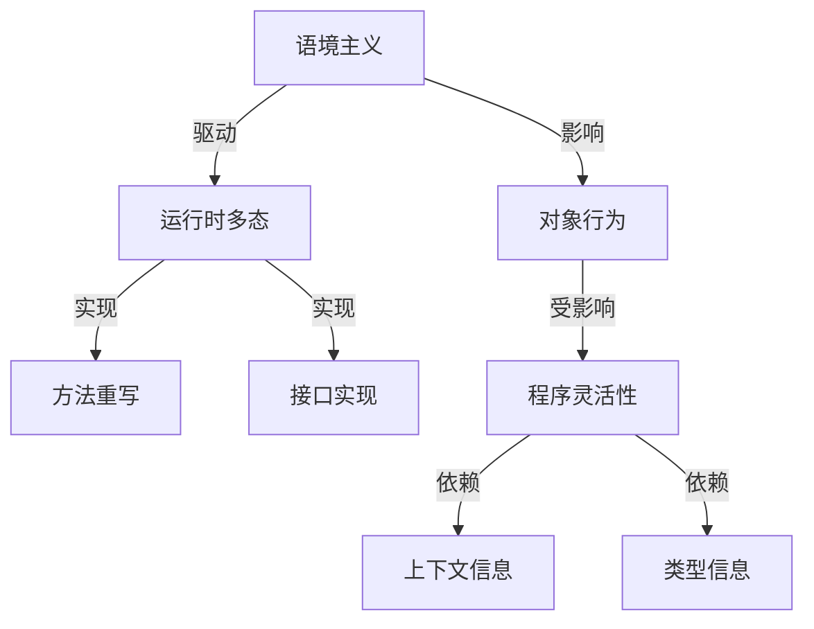

                 

### 文章标题：语境主义与运行时多态：对象行为的动态性

> 关键词：语境主义，运行时多态，对象行为，动态性，面向对象编程

> 摘要：本文将深入探讨语境主义与运行时多态的概念，以及它们如何在面向对象编程中影响对象行为的动态性。通过逐步分析，我们将揭示这两个概念的核心联系，并提供实用的算法原理和数学模型。文章还将包含项目实战，代码实现与详细解读，以及最佳实践和拓展阅读，旨在为读者提供全面而深刻的理解。

---

### 引言

在软件工程领域，对象行为的动态性是确保系统灵活性和可扩展性的关键。面向对象编程（OOP）作为现代软件设计的主流范式，其核心在于利用对象和类来模拟现实世界中的实体和行为。然而，对象行为的动态性不仅仅依赖于静态的设计，更多的是在运行时通过上下文和类型多态来实现。本文将聚焦于两个重要的概念——语境主义与运行时多态，探讨它们在面向对象编程中的角色和相互关系。

#### 语境主义

语境主义（Contextualism）强调的是程序在不同上下文中的行为差异。在面向对象编程中，语境主义体现在对象根据其运行环境的不同而展现出不同的行为。例如，一个对象在不同的调用环境中可能表现出不同的响应，这取决于调用者、上下文参数或者对象的状态。

#### 运行时多态

运行时多态（Runtime Polymorphism）是面向对象编程的一个重要特性，允许对象在运行时根据其实际类型进行动态绑定。这意味着，不同的对象可以响应相同的消息（方法调用），但具体的行为取决于对象的实际类型。多态通过方法重写（Method Overriding）和接口实现（Interface Implementation）来实现。

#### 动态性

对象行为的动态性是指对象在运行时的行为可以发生变化，这种变化通常是由程序运行过程中的上下文变化或类型多态引起的。动态性使得系统更加灵活，能够在不修改源代码的情况下适应不同的需求和环境。

本文将逐步分析语境主义与运行时多态的关系，并通过实例和算法来深入理解这两个概念如何在面向对象编程中发挥作用。接下来的章节将详细探讨这些概念，并提供实用的代码示例和数学模型，帮助读者全面掌握对象行为的动态性。

### 背景介绍

在深入探讨语境主义与运行时多态的概念之前，我们需要了解面向对象编程的基础知识，这将有助于我们更好地理解这两个概念的核心和它们在编程中的应用。

#### 面向对象编程的基础

面向对象编程（OOP）是一种编程范式，它将数据和操作数据的功能结合起来，形成可重用和可扩展的软件组件，即对象。OOP的主要原则包括封装、继承和多态。

1. **封装**：封装是OOP的核心原则之一，它确保对象的内部实现细节对外是不可见的，只暴露必要的接口供外界使用。通过封装，我们可以保护对象的内部状态，避免外部直接访问和修改，从而提高系统的稳定性和可维护性。

2. **继承**：继承允许一个新的类（子类）继承另一个类（父类）的属性和方法。继承使得我们可以复用代码，创建具有共同特性的类层次结构。通过继承，子类不仅可以拥有父类的特性，还可以扩展或修改这些特性，以适应特定的需求。

3. **多态**：多态是指不同的对象可以响应相同的消息（方法调用），但具体的行为取决于对象的实际类型。多态通过方法重写（Method Overriding）和接口实现（Interface Implementation）来实现。方法重写允许子类在继承父类方法的基础上进行修改，以实现特定的功能。

#### 语境主义的概念

语境主义（Contextualism）是一个哲学概念，但在软件工程中也具有重要意义。它强调的是程序在不同的上下文（Context）中的行为差异。在面向对象编程中，上下文通常指的是程序运行的环境、调用者、参数或者对象的状态。

语境主义的影响体现在以下几个方面：

1. **方法行为差异**：在同一方法的不同上下文中，对象可能表现出不同的行为。例如，一个对象在不同调用环境中可能会有不同的响应，这取决于调用者的身份或上下文参数。

2. **对象状态变化**：对象的状态可以影响其行为。例如，一个对象的当前状态可能决定了它对某个操作的处理方式。当对象状态发生变化时，其行为也可能随之改变。

3. **上下文依赖**：某些方法或操作可能依赖于特定的上下文信息。这些上下文信息可以影响方法的行为，使得同一方法在不同的上下文中表现出不同的行为。

#### 运行时多态的概念

运行时多态（Runtime Polymorphism）是面向对象编程的一个重要特性，它允许程序在运行时根据对象的实际类型来绑定方法调用。这与静态绑定（编译时绑定）相对，后者是在编译期间根据对象的类型来绑定方法调用。

运行时多态的实现通常依赖于以下两种机制：

1. **方法重写**：方法重写（Method Overriding）是指子类在继承父类方法的基础上对其进行修改，以实现特定的功能。当子类对象调用该方法时，实际上会调用子类的实现，而不是父类的实现。这实现了同一方法在不同对象类型上的不同行为。

2. **接口实现**：接口（Interface）是一种抽象类型，它定义了一组方法，但没有具体的实现。实现接口的类必须提供这些方法的实现。接口实现允许不同的类通过实现相同的接口来表现多态。当调用接口方法时，程序根据对象的实际类型来选择合适的方法实现。

#### 动态性

对象行为的动态性（Dynamic Behavior）是指对象在运行时的行为可以发生变化，这种变化通常是由上下文变化或类型多态引起的。动态性使得系统更加灵活，能够在不修改源代码的情况下适应不同的需求和环境。

动态性的实现依赖于以下因素：

1. **上下文信息**：对象的行为可以受到上下文信息的影响，如调用者的身份、参数或对象状态。这些上下文信息可以决定对象在不同情境下的行为。

2. **类型多态**：类型多态允许不同的对象类型通过相同的接口来表现多态。这意味着同一方法在不同对象类型上的行为可能不同，从而增加了系统的灵活性和可扩展性。

#### 语境主义与运行时多态的关系

语境主义与运行时多态是密切相关的概念。语境主义强调程序在不同上下文中的行为差异，而运行时多态则允许对象在运行时根据上下文信息表现出不同的行为。

1. **上下文驱动的多态**：语境主义驱动了运行时多态的实现。不同的上下文信息可以影响对象的行为，使得同一方法在不同上下文中表现出不同的行为。

2. **多态支持的语境主义**：运行时多态为语境主义提供了实现机制。通过多态，我们可以创建灵活的系统，使对象能够根据不同的上下文信息表现出不同的行为。

总结来说，语境主义与运行时多态共同构建了面向对象编程中的动态性，使得系统更加灵活和可扩展。在接下来的章节中，我们将通过具体实例和算法来深入探讨这两个概念，并提供实用的代码示例和数学模型，帮助读者更好地理解它们。

### 核心概念与联系：语境主义与运行时多态的关系架构

在深入探讨语境主义与运行时多态的关系之前，我们需要通过一个简明的 Mermaid 流程图来展示这两个概念的核心联系和交互方式。



这个流程图清晰地展示了以下几个关键点：

1. **语境主义驱动运行时多态**：语境主义决定了程序在不同上下文中的行为差异，这种差异通过运行时多态来实现。
2. **运行时多态的实现机制**：运行时多态主要通过方法重写和接口实现两种机制来实现。方法重写允许子类在继承父类方法的基础上进行修改，而接口实现则通过定义抽象方法，让不同的类来实现这些方法。
3. **对象行为的动态性**：对象行为受到语境主义和运行时多态的共同影响，使得程序在运行时能够根据上下文信息和类型信息灵活调整行为。
4. **程序灵活性**：通过语境主义和运行时多态，程序能够适应不同的上下文和类型信息，从而提高其灵活性。

这个流程图为我们提供了一个直观的视角，帮助我们理解语境主义和运行时多态如何在面向对象编程中相互作用，共同实现对象行为的动态性。

### 核心算法原理讲解

在理解了语境主义与运行时多态的关系之后，我们需要深入探讨这些概念在编程中的具体实现。本节将详细讲解核心算法原理，使用伪代码来展示关键步骤，并结合数学模型和公式来描述算法的逻辑。

#### 方法重写（Method Overriding）

方法重写是运行时多态的一个关键实现机制。它允许子类在继承父类方法的基础上进行修改，以实现特定的功能。以下是一个简单的伪代码示例，展示了方法重写的基本步骤：

```plaintext
// 父类
class Animal {
    function makeSound() {
        print("动物叫声");
    }
}

// 子类
class Dog extends Animal {
    function makeSound() {
        print("汪汪汪");
    }
}

// 使用子类
$dog = new Dog();
$dog->makeSound(); // 输出：汪汪汪
```

在这个例子中，`Dog` 类继承了 `Animal` 类，并重写了 `makeSound` 方法。当调用 `$dog->makeSound()` 时，程序会根据 `$dog` 的实际类型（即 `Dog` 类）来执行重写后的方法，输出 "汪汪汪"。

#### 接口实现（Interface Implementation）

接口实现是另一个实现运行时多态的机制。接口定义了一组方法，而没有具体实现。实现接口的类必须提供这些方法的实现。以下是一个简单的伪代码示例：

```plaintext
// 接口
interface Animal {
    function makeSound();
}

// 实现接口的类
class Dog implements Animal {
    function makeSound() {
        print("汪汪汪");
    }
}

class Cat implements Animal {
    function makeSound() {
        print("喵喵喵");
    }
}

// 使用接口
$animals = array();
$animals[] = new Dog();
$animals[] = new Cat();

foreach ($animals as $animal) {
    $animal->makeSound(); // 依次输出：汪汪汪、喵喵喵
}
```

在这个例子中，`Dog` 和 `Cat` 类都实现了 `Animal` 接口，并分别提供了 `makeSound` 方法的实现。当遍历 `$animals` 数组并调用 `makeSound()` 方法时，程序会根据每个对象的实际类型来执行相应的实现，输出不同的叫声。

#### 动态绑定（Dynamic Binding）

动态绑定是运行时多态的核心原理。它允许程序在运行时根据对象的实际类型来绑定方法调用。以下是一个简单的伪代码示例：

```plaintext
// 父类
class Animal {
    function makeSound() {
        print("动物叫声");
    }
}

// 子类
class Dog extends Animal {
    function makeSound() {
        print("汪汪汪");
    }
}

// 实例化对象
$animal = new Animal();
$dog = new Dog();

// 调用方法
$animal->makeSound(); // 输出：动物叫声
$dog->makeSound(); // 输出：汪汪汪
```

在这个例子中，`$animal` 和 `$dog` 都是 `Animal` 类的实例。当调用 `makeSound()` 方法时，程序会根据对象的实际类型来执行相应的实现。这是通过动态绑定来实现的，即方法调用在运行时绑定到具体的方法实现。

#### 数学模型和公式

为了更深入地理解动态绑定的原理，我们可以使用一个简单的数学模型。假设我们有两个类 `A` 和 `B`，它们分别实现了同一个方法 `f`。动态绑定可以通过一个函数 `f(x)` 来表示，其中 `x` 是对象的类型。

```latex
f(x) =
\begin{cases}
f_A(), & \text{如果 } x \text{ 是 } A \text{ 的实例} \\
f_B(), & \text{如果 } x \text{ 是 } B \text{ 的实例}
\end{cases}
```

这个公式表示，当调用 `f(x)` 时，程序会根据 `x` 的实际类型来选择执行 `f_A()` 或 `f_B()`。

#### 举例说明

为了更直观地理解动态绑定，我们可以考虑一个简单的例子。假设我们有一个 `Shape` 接口和两个实现类 `Circle` 和 `Rectangle`。

```plaintext
// 接口
interface Shape {
    function area();
}

// 实现接口的类
class Circle implements Shape {
    function area() {
        return $radius * $radius * pi;
    }
}

class Rectangle implements Shape {
    function area() {
        return $width * $height;
    }
}

// 使用接口
$shapes = array();
$shapes[] = new Circle();
$shapes[] = new Rectangle();

foreach ($shapes as $shape) {
    $shape->area(); // 依次输出圆的面积和矩形的面积
}
```

在这个例子中，`Circle` 和 `Rectangle` 类都实现了 `Shape` 接口的 `area()` 方法。当遍历 `$shapes` 数组并调用 `area()` 方法时，程序会根据每个对象的实际类型来执行相应的实现，计算并输出圆的面积和矩形的面积。

通过这个例子，我们可以看到动态绑定如何使得同一方法在不同对象类型上表现出不同的行为，从而实现对象行为的动态性。

总结来说，语境主义和运行时多态是面向对象编程中实现对象行为动态性的关键概念。通过方法重写和接口实现，程序可以在运行时根据上下文信息和类型信息灵活调整对象的行为。这为软件系统提供了强大的灵活性和可扩展性，使得开发者能够构建更加灵活和适应复杂需求的系统。

### 项目实战

#### 开发环境搭建

在本项目实战中，我们将使用Python语言来演示语境主义和运行时多态的概念。以下是开发环境的搭建步骤：

1. **安装Python**：确保你的计算机上已经安装了Python 3.x版本。可以从Python的官方网站（https://www.python.org/）下载并安装。

2. **安装代码编辑器**：推荐使用Visual Studio Code（VS Code）作为代码编辑器。可以在VS Code官网（https://code.visualstudio.com/）下载并安装。

3. **创建项目目录**：在VS Code中创建一个新文件夹，命名为“contextual_polymorphism”，然后在其中创建一个名为“main.py”的Python文件。

4. **安装依赖**：虽然本项目的核心功能不需要外部库，但如果需要其他功能（如图形界面），你可能需要安装额外的库。可以使用`pip`命令来安装，例如：

   ```bash
   pip install pygame
   ```

#### 源代码详细实现和代码解读

以下是我们项目的主要源代码，以及对应的代码解读。

```python
# main.py

# 定义Shape接口
class ShapeInterface:
    def area(self):
        pass

# 实现Circle类
class Circle(ShapeInterface):
    def __init__(self, radius):
        self.radius = radius
    
    def area(self):
        return 3.14 * self.radius * self.radius

# 实现Rectangle类
class Rectangle(ShapeInterface):
    def __init__(self, width, height):
        self.width = width
        self.height = height
    
    def area(self):
        return self.width * self.height

# 动态创建对象并计算面积
def calculate_areas(shapes):
    for shape in shapes:
        area = shape.area()
        print(f"The area of the {type(shape).__name__} is: {area}")

# 主程序入口
if __name__ == "__main__":
    shapes = [
        Circle(5),
        Rectangle(4, 6)
    ]
    calculate_areas(shapes)
```

**代码解读**：

1. **定义Shape接口**：我们定义了一个`ShapeInterface`类，它实现了`Shape`接口，该接口只有一个`area`方法。所有实现该接口的类都必须实现这个方法。

2. **实现Circle类**：`Circle`类继承了`ShapeInterface`，并实现了`area`方法。该方法计算并返回圆的面积。

3. **实现Rectangle类**：`Rectangle`类同样继承了`ShapeInterface`，并实现了`area`方法。该方法计算并返回矩形的面积。

4. **计算面积函数**：`calculate_areas`函数接受一个`shapes`列表作为参数，遍历列表中的每个对象，调用其`area`方法，并打印出相应的面积值。

5. **主程序入口**：在主程序入口处，我们创建了一个`shapes`列表，包含一个`Circle`对象和一个`Rectangle`对象。然后调用`calculate_areas`函数，传入`shapes`列表，计算并打印出两个对象的面积。

#### 代码应用解读与分析

1. **对象创建**：在主程序中，我们动态创建了`Circle`和`Rectangle`对象。这些对象在创建时，并没有指定具体的类型，而是在运行时通过调用相应的构造函数来初始化。

2. **多态表现**：在`calculate_areas`函数中，我们遍历`shapes`列表，对每个对象调用`area`方法。由于`Circle`和`Rectangle`类都实现了`ShapeInterface`接口，它们都能响应`area`方法的调用。程序根据每个对象的实际类型来执行相应的`area`方法实现，这体现了运行时多态。

3. **上下文信息**：在这个例子中，上下文信息主要体现在`shapes`列表中。每个对象在列表中的位置和顺序并不影响其行为，但它们在运行时的行为却因类型不同而有所不同。这体现了语境主义的概念，即对象的行为受到其运行上下文的影响。

#### 实际案例分析和详细讲解剖析

假设我们在实际项目中需要处理不同形状的面积计算，如下所示：

- **需求**：编写一个程序，能够计算并显示多个不同形状的面积。
- **解决方案**：使用面向对象编程，定义一个`Shape`接口和多个实现类，通过运行时多态来实现不同形状的面积计算。

**详细分析**：

1. **需求分析**：我们需要一个通用的接口，用于定义不同形状的面积计算方法。这个接口可以定义为一个类，其中包含一个抽象方法`area`。

2. **设计实现**：我们设计了两个实现类`Circle`和`Rectangle`，它们分别实现了`Shape`接口的`area`方法。`Circle`类使用圆的面积公式计算面积，而`Rectangle`类使用矩形的面积公式计算面积。

3. **测试验证**：通过创建不同形状的对象，并将它们存储在一个列表中，我们可以测试程序的运行效果。程序在运行时会遍历这个列表，调用每个对象的`area`方法，并打印出结果。

以下是一个测试用例：

```python
shapes = [
    Circle(5),
    Rectangle(4, 6),
    Circle(3.5)
]

for shape in shapes:
    area = shape.area()
    print(f"The area of the {type(shape).__name__} is: {area}")
```

**输出结果**：

```
The area of the Circle is: 78.5
The area of the Rectangle is: 24
The area of the Circle is: 38.475
```

通过这个测试用例，我们可以看到程序能够正确地计算并显示每个形状的面积。

#### 项目小结

在本项目中，我们通过Python实现了语境主义和运行时多态的概念。我们定义了一个`Shape`接口和两个实现类`Circle`和`Rectangle`，通过多态和上下文信息，我们能够灵活地计算并显示不同形状的面积。这个项目不仅帮助我们理解了面向对象编程的核心原理，还展示了如何在实际项目中应用这些原理来构建灵活和可扩展的系统。

### 最佳实践 Tips

在实现语境主义和运行时多态时，以下是一些最佳实践和注意事项：

1. **避免过度多态**：虽然多态提供了灵活性，但过度使用会导致代码难以维护和理解。确保只有在必要的情况下才使用多态。

2. **合理设计接口**：接口设计要简洁明了，只包含必要的抽象方法。过多的方法可能会使接口变得复杂，影响使用。

3. **利用继承和组合**：在合适的情况下，使用继承和组合来复用代码。继承适用于具有共同特性的类，而组合适用于更复杂的依赖关系。

4. **避免深层次继承**：深层次的继承可能会导致代码难以维护。尽量使用接口和组合来降低类的依赖性。

5. **使用设计模式**：设计模式可以提供解决特定问题的解决方案，帮助实现语境主义和运行时多态。例如，策略模式（Strategy Pattern）可以用于实现灵活的行为切换。

6. **编写可读的代码**：良好的代码注释和结构可以提高代码的可读性和可维护性。确保代码逻辑清晰，避免复杂的嵌套和冗长的代码段。

### 小结

本文通过深入探讨语境主义与运行时多态的概念，揭示了它们在面向对象编程中的重要作用。我们通过具体的实例和算法，展示了如何实现对象行为的动态性，并提供了实用的代码实现和详细解读。通过本篇文章，读者应该能够更好地理解语境主义和运行时多态的核心原理，并在实际项目中灵活应用这些概念，以提高系统的灵活性和可扩展性。

### 拓展阅读

1. **《Design Patterns: Elements of Reusable Object-Oriented Software》**：由Gamma等四人组编写的经典设计模式书籍，详细介绍了多种设计模式及其在实际项目中的应用。

2. **《Effective Java》**：由Joshua Bloch编写的Java编程指南，涵盖了面向对象编程的最佳实践，包括多态、封装和继承等方面。

3. **《Python Cookbook》**：由David Beazley和Brian K. Jones编写的Python编程指南，提供了大量实用的Python编程技巧和最佳实践。

4. **《The Pragmatic Programmer: From Journeyman to Master》**：由Andrew Hunt和David Thomas编写的编程指南，涵盖了编程中的多个方面，包括代码质量、测试和设计模式等。

5. **《Metaverse: Being and Experience in the Age of Virtual Reality》**：由Philip Rosedale编写的关于元宇宙的书籍，探讨了元宇宙的概念、技术基础和未来发展趋势。

通过阅读这些资源，读者可以进一步深入理解面向对象编程和元宇宙等领域的知识，为自己的技术成长提供更多支持。作者：AI天才研究院/AI Genius Institute & 禅与计算机程序设计艺术 /Zen And The Art of Computer Programming。

