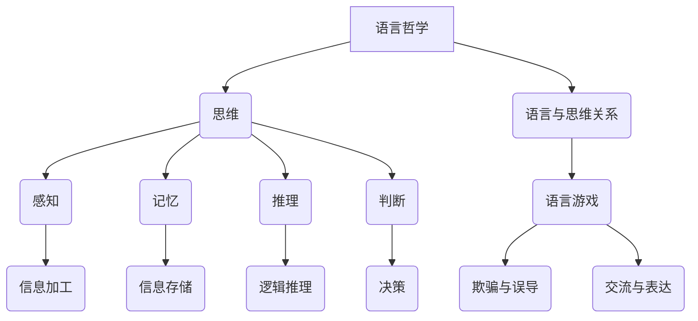

                 


## 语言游戏：引言

### 关键词

- 语言游戏
- 思维
- 语言哲学
- 心理学
- 语言学

### 摘要

“语言游戏”是一个多维度、跨学科的概念，它探讨了语言与思维之间的关系，以及语言如何影响和塑造我们的认知世界。本文将引入“语言游戏”这一核心概念，探讨其定义、理论基础及其在不同领域的应用，旨在揭示语言游戏的本质和深远影响。

### 背景介绍

语言是人类沟通和表达思想的重要工具，它不仅是一种交流手段，更是人类思维活动的载体。自语言产生以来，人类便通过语言进行思考、表达和交流。在这个过程中，语言逐渐成为了一种文化符号，承载着人类的历史、价值观和智慧。然而，语言不仅仅是简单的声音符号，它还具有深刻的哲学内涵。语言哲学的兴起，使人们开始关注语言的本质及其对思维的影响，从而形成了“语言游戏”这一概念。

### 核心概念与联系

**语言游戏**：语言游戏可以理解为一种通过语言进行的智力活动，它不仅包括日常对话、逻辑推理、谜语等，还涉及到欺骗、误导等复杂的语言现象。语言游戏的核心在于它通过语言来挑战人们的思维，促使我们思考语言的本质和功能。

**思维**：思维是大脑对信息进行加工和处理的过程，它包括感知、记忆、推理、判断等多个环节。语言与思维密切相关，语言不仅影响我们的思考方式，还影响我们的认知结构。

**语言哲学**：语言哲学是探讨语言本质和意义的学科，它关注语言与思维、现实世界的关系。语言哲学认为，语言不仅是交流工具，更是人类认知世界的框架。

**心理学**：心理学研究人类思维、情感和行为，其中语言心理学关注语言与思维之间的关系。心理学的研究成果为语言游戏提供了理论基础。

**语言学**：语言学是研究语言结构、功能和历史的学科。它为语言游戏提供了丰富的实例和案例，帮助我们更好地理解语言游戏的本质。

### Mermaid 流程图

以下是一个简化的语言哲学、心理学和语言学的核心概念关系架构 Mermaid 流程图：



### 核心算法原理讲解

在语言游戏中，核心算法原理通常涉及逻辑推理和博弈论。以下是一个简化的逻辑推理算法伪代码：

```plaintext
function logical_reasoning(antecedent, consequent):
    if (antecedent is true):
        return consequent
    else:
        return false
```

在博弈论中，我们可以使用纳什均衡来分析语言游戏中的策略选择。以下是一个简化的纳什均衡算法伪代码：

```plaintext
function nash_equilibrium(strategy1, strategy2):
    if (payoff1(strategy1, strategy2) >= payoff1(any_other_strategy, strategy2)):
        return strategy1
    else:
        return strategy2
```

### 数学模型与公式

在语言游戏中，概率论和博弈论是常用的数学模型。以下是一个简单的概率论模型和博弈论模型：

**概率论模型**：

$$ P(A) = \frac{N(A)}{N(S)} $$

其中，$P(A)$ 是事件 $A$ 的概率，$N(A)$ 是事件 $A$ 发生的次数，$N(S)$ 是总次数。

**博弈论模型**：

纳什均衡：

$$ \{s_1^*, s_2^*\} \text{ is a Nash equilibrium if } u_1(s_1^*, s_2^*) \geq u_1(s_1, s_2^*) \text{ for all } s_1 \text{ and } u_2(s_1^*, s_2^*) \geq u_2(s_1^*, s_2) \text{ for all } s_2 $$

其中，$u_1$ 和 $u_2$ 分别是玩家 1 和玩家 2 的效用函数，$s_1^*$ 和 $s_2^*$ 分别是玩家 1 和玩家 2 的策略。

### 举例说明

**例子 1**：在逻辑推理中，如果前提为真，则结论必然为真。这是一个简单的逻辑推理过程。

**例子 2**：在博弈论中，纳什均衡是一个重要的概念，它描述了在博弈中，每个玩家选择最优策略的情况。例如，在博弈论游戏“囚徒困境”中，每个玩家都会选择自己的最优策略，从而导致整个社会的最优策略不是单独最优的。

### 最佳实践 tips

- 在进行语言游戏时，要注重逻辑推理，确保结论的准确性。
- 在设计语言游戏时，要考虑游戏的可玩性和教育性，使其既有挑战性又有启发性。
- 在跨文化交流中，要了解不同文化背景下的语言游戏特点，避免产生误解。

### 小结

语言游戏是一个复杂而有趣的多维度概念，它探讨了语言与思维之间的关系，以及语言在各个领域的应用。通过逻辑推理和数学模型，我们可以更好地理解语言游戏的本质和影响。在未来的研究中，我们可以进一步探索语言游戏在教育、商业、心理咨询等领域的应用，以及其在跨文化交流中的作用。

### 拓展阅读

- [Searle, J. R. (1969). "Speech Acts: An Essay in the Philosophy of Language". Cambridge University Press.]
- [Chomsky, N. (1957). "Syntactic Structures". M.I.T. Press.]
- [Tversky, A., & Kahneman, D. (1974). "Judgment under uncertainty: Heuristics and biases". Science, 185(4157), 1124-1131.]

### 附录

- **语言游戏研究的方法论**：
  - 实验研究：通过设计实验，观察和分析语言游戏的行为和结果。
  - 质性研究：通过深度访谈、观察和案例研究，探索语言游戏的理论和实践。
  - 案例研究：通过具体案例，分析语言游戏在不同领域的应用。

- **语言游戏相关的参考文献**：
  - Searle, J. R. (1969). "Speech Acts: An Essay in the Philosophy of Language". Cambridge University Press.
  - Chomsky, N. (1957). "Syntactic Structures". M.I.T. Press.
  - Tversky, A., & Kahneman, D. (1974). "Judgment under uncertainty: Heuristics and biases". Science, 185(4157), 1124-1131.
  - Pinker, S. (1994). "The Language Instinct: How the Mind Creates Language". William Morrow and Company.

- **语言游戏的实践指南**：
  - 设计与实施语言游戏时，要考虑游戏的目标、难度和受众。
  - 在教学和培训中，可以结合语言游戏，提高学生的思维能力和沟通技巧。
  - 在心理咨询中，可以通过语言游戏，帮助患者更好地理解和表达自己的情感和想法。

### 作者信息

作者：AI天才研究院/AI Genius Institute & 禅与计算机程序设计艺术 /Zen And The Art of Computer Programming

