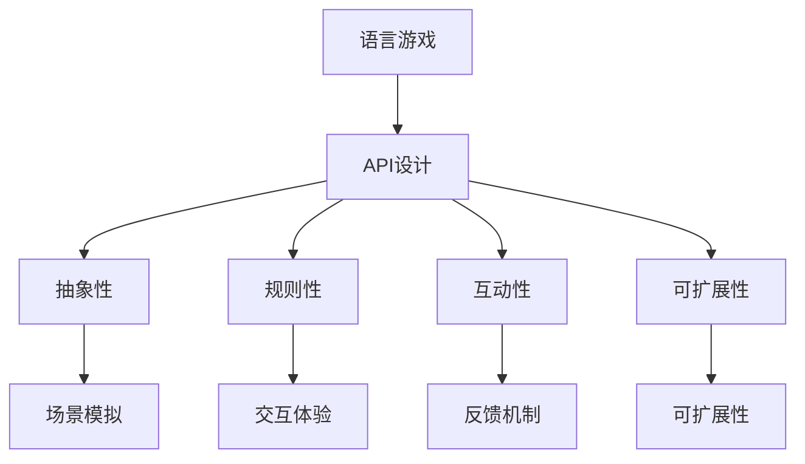

                 

### 文章标题

# 语言游戏与API设计：创造友好接口的艺术

### 关键词

- 语言游戏
- API设计
- 用户界面
- 可扩展性
- 安全性
- 实战案例

### 摘要

本文探讨了语言游戏与API设计之间的关系，以及如何通过创造友好接口的艺术来提升用户体验。文章首先介绍了语言游戏的概念和特性，然后深入讲解了API设计的基本原则和方法。通过实际案例分析和项目实战，本文展示了如何将语言游戏融入API设计，创造出易于使用和维护的接口。最后，文章提供了最佳实践和小结，为读者提供了深入理解和应用API设计的指南。

## 引言

在现代软件开发中，API（应用程序编程接口）设计扮演着至关重要的角色。一个良好的API不仅能够提高软件的灵活性和可扩展性，还能提升用户体验，降低开发成本。然而，API设计的复杂性也随之增加，如何创造出既高效又友好的接口，成为软件开发者面临的重大挑战。

语言游戏在这一过程中起到了独特的桥梁作用。语言游戏是一种基于语言的互动形式，它通过抽象和模拟现实世界的情境，帮助人们更好地理解和运用语言。将语言游戏的理念引入API设计，可以使API更加直观、易用，同时增强用户与系统之间的互动性。

本文旨在探讨语言游戏与API设计之间的联系，分析其核心概念和设计原则，并通过实际案例和项目实战，展示如何将语言游戏融入到API设计中，创造出友好且高效的接口。文章结构如下：

1. **基础理论**：介绍语言游戏的概念和API设计的核心原则。
2. **实战案例**：分析语言游戏在API设计中的应用，并通过具体案例进行讲解。
3. **项目实战**：通过一个完整的API设计项目，展示如何将语言游戏融入实际开发过程。
4. **高级主题**：探讨API设计中的高级技术和趋势。
5. **小结与拓展**：总结文章内容，提供最佳实践和建议。

## 基础理论

### 语言游戏的概念与特性

语言游戏是一种基于语言的互动形式，它通常涉及两个或多个参与者，通过语言进行交流和互动。语言游戏的核心理念是模拟现实世界的情境，使参与者能够在特定的规则下进行思考和决策。

语言游戏具有以下几个显著特性：

1. **抽象性**：语言游戏通过抽象现实世界的复杂情境，将问题简化为可以理解和分析的模型。
2. **规则性**：语言游戏有一套明确的规则，这些规则指导参与者如何进行游戏，以及如何达成目标。
3. **互动性**：语言游戏强调参与者之间的互动，通过交流和反馈，共同探索和解决问题。
4. **可扩展性**：语言游戏可以扩展到多个领域和场景，使其具有广泛的应用价值。

### API设计的核心原则

API设计需要遵循一系列核心原则，以确保接口的易用性、可靠性和可扩展性。以下是API设计的主要原则：

1. **简洁性**：API应该设计得简洁明了，易于理解和记忆。复杂的API容易导致误用和错误。
2. **一致性**：API的设计应保持一致性，包括命名约定、参数顺序和返回值格式。一致性有助于降低学习成本，提高开发效率。
3. **易用性**：API应该易于使用，提供清晰、明确的文档和示例。友好的用户界面和操作流程可以提高用户体验。
4. **安全性**：API设计应充分考虑安全性，包括身份验证、授权和数据加密。确保API不受恶意攻击和数据泄露的威胁。
5. **可扩展性**：API设计应具有良好的扩展性，能够适应未来的需求变化。灵活的设计和模块化架构有助于实现这一点。
6. **可维护性**：API设计应易于维护，确保在修复错误和进行功能升级时，不会对现有应用造成不必要的影响。

### 语言游戏与API设计的关系

语言游戏与API设计之间存在紧密的联系。语言游戏通过模拟现实情境，帮助用户更好地理解和使用API。以下是语言游戏在API设计中的应用：

1. **场景模拟**：通过模拟实际使用场景，API设计者可以更直观地了解用户的需求，从而设计出更符合用户习惯的接口。
2. **交互体验**：语言游戏强调互动性，可以增强用户与API之间的互动体验，使API更加生动和易于使用。
3. **反馈机制**：语言游戏中的反馈机制可以帮助用户及时了解API的使用效果，从而进行改进和优化。

### Mermaid 流程图

为了更好地理解语言游戏与API设计的关系，我们可以使用Mermaid流程图来展示它们之间的架构关系。以下是一个简单的示例：



这个流程图展示了语言游戏如何通过抽象性、规则性、互动性和可扩展性等特性，与API设计相互关联，共同创造出一个友好、高效的接口。

## API设计的核心算法原理讲解

在深入探讨语言游戏与API设计的融合之前，有必要详细讲解API设计中的核心算法原理。这些原理不仅为API设计提供了理论基础，也帮助开发者更好地理解API的行为和特性。

### API设计的关键算法

以下是一些API设计中的关键算法，它们在保证接口的效率和功能上起着至关重要的作用：

1. **哈希算法**：用于快速查找和验证数据。常见的哈希算法包括MD5、SHA-256等。
2. **加密算法**：用于保护数据传输过程中的安全，如AES、RSA等。
3. **排序算法**：用于对数据进行排序，如快速排序、归并排序等。
4. **搜索算法**：用于在大量数据中快速查找特定信息，如二分搜索、广度优先搜索等。
5. **负载均衡算法**：用于分发网络请求，确保系统的高可用性和响应速度。

### 伪代码示例

以下是一些API设计中的关键算法的伪代码示例，这些示例有助于开发者理解算法的实现细节。

#### 哈希算法

```pseudo
function hash(value):
    // 初始化哈希值
    hash_value = 0
    
    // 对输入值进行哈希计算
    for each character in value:
        hash_value = (hash_value * 31 + character's ASCII value) % prime_number
    
    return hash_value
```

#### 加密算法

```pseudo
function encrypt(data, key):
    // 使用AES加密算法
    encrypted_data = AES_encrypt(data, key)
    
    return encrypted_data
```

#### 排序算法

```pseudo
function quicksort(array):
    if length of array <= 1:
        return array
    
    pivot = array[0]
    left = []
    right = []
    
    for each element in array[1:]:
        if element < pivot:
            left.append(element)
        else:
            right.append(element)
    
    return quicksort(left) + [pivot] + quicksort(right)
```

#### 搜索算法

```pseudo
function binary_search(array, target):
    low = 0
    high = length of array - 1
    
    while low <= high:
        mid = (low + high) / 2
        if array[mid] == target:
            return mid
        elif array[mid] < target:
            low = mid + 1
        else:
            high = mid - 1
    
    return -1
```

#### 负载均衡算法

```pseudo
function load_balance(requests):
    // 使用轮询算法进行负载均衡
    servers = ["server1", "server2", "server3"]
    index = 0
    
    while requests are not empty:
        server = servers[index]
        send_request_to_server(server, requests.pop())
        index = (index + 1) % length of servers
```

### 数学模型和公式

在API设计中，数学模型和公式经常被用来描述算法的行为和性能。以下是一些常用的数学模型和公式的详细讲解：

#### 时间复杂度

时间复杂度是描述算法运行时间的模型。常见的时间复杂度包括O(1)、O(n)、O(n^2)等。

- **O(1)**：表示算法的时间复杂度为常数，不受输入规模影响。
- **O(n)**：表示算法的时间复杂度与输入规模成正比。
- **O(n^2)**：表示算法的时间复杂度与输入规模的平方成正比。

#### 空间复杂度

空间复杂度是描述算法所需存储空间的模型。与时间复杂度类似，常见的空间复杂度包括O(1)、O(n)、O(n^2)等。

- **O(1)**：表示算法的空间复杂度为常数。
- **O(n)**：表示算法的空间复杂度与输入规模成正比。
- **O(n^2)**：表示算法的空间复杂度与输入规模的平方成正比。

#### 马尔可夫链

马尔可夫链是一种随机过程模型，常用于描述系统的状态转移。在API设计中，马尔可夫链可以用于模拟请求流和响应流，帮助开发者理解系统的行为和性能。

#### 概率论

概率论在API设计中也有广泛应用，例如用于处理随机请求、评估系统可靠性等。

#### 信息论

信息论可以用来评估数据的复杂度和传输效率。在API设计中，信息论可以帮助开发者优化数据传输过程，提高系统的性能。

### 举例说明

为了更好地理解这些数学模型和公式的应用，我们可以通过具体例子进行说明。

#### 时间复杂度示例

假设有一个简单的排序算法，其实现如下：

```java
public static void bubbleSort(int[] array) {
    int n = array.length;
    boolean swapped;
    do {
        swapped = false;
        for (int i = 1; i < n; i++) {
            if (array[i - 1] > array[i]) {
                int temp = array[i - 1];
                array[i - 1] = array[i];
                array[i] = temp;
                swapped = true;
            }
        }
    } while (swapped);
}
```

这个算法的时间复杂度为O(n^2)，因为无论输入规模多大，算法都需要进行n次比较。

#### 空间复杂度示例

假设有一个简单的栈实现，其空间复杂度为O(1)：

```java
public class Stack {
    private int[] elements;
    private int size;
    private int capacity;

    public Stack(int capacity) {
        this.capacity = capacity;
        this.elements = new int[capacity];
        this.size = 0;
    }

    public void push(int value) {
        if (size == capacity) {
            // 扩容操作，空间复杂度为O(n)
            int[] newElements = new int[capacity * 2];
            System.arraycopy(elements, 0, newElements, 0, capacity);
            elements = newElements;
            capacity *= 2;
        }
        elements[size++] = value;
    }

    public int pop() {
        if (size == 0) {
            throw new EmptyStackException();
        }
        return elements[--size];
    }
}
```

在这个实现中，尽管扩容操作的空间复杂度为O(n)，但整体上，栈的空间复杂度仍为O(1)。

#### 马尔可夫链示例

假设有一个简单的请求流模型，其状态转移矩阵如下：

|   | 静止  | 活动  |
|---|-------|-------|
| 静止 | 0.9   | 0.1   |
| 活动 | 0.2   | 0.8   |

这个模型可以用来模拟API系统的负载情况，帮助开发者了解系统在不同状态下的行为。

通过上述例子，我们可以更好地理解数学模型和公式在API设计中的应用，以及如何通过它们来评估算法的性能和优化系统。

### 实战案例

为了更好地理解API设计的核心算法原理，我们将通过一个实际案例来讲解API的开发过程，从开发环境搭建到源代码实现，再到代码应用解读与分析。

#### 案例背景

假设我们要开发一个简单的博客系统API，该系统需要提供用户注册、登录、发表文章、评论文章等基本功能。我们将使用Spring Boot框架来构建这个API，并利用MySQL数据库来存储数据。

#### 开发环境搭建

1. **软件环境**：安装Java开发工具包（JDK 11）、Spring Boot DevTools、MySQL数据库、Postman（API调试工具）。
2. **工具环境**：配置IDE（如IntelliJ IDEA或Visual Studio Code），安装相应的插件，例如Lombok插件用于简化Java代码。

#### 源代码实现

以下是一个简单的用户注册接口的源代码实现：

```java
@RestController
@RequestMapping("/api/auth")
public class AuthController {

    @Autowired
    private UserRepository userRepository;

    @PostMapping("/register")
    public ResponseEntity<?> registerUser(@RequestBody UserRegistrationRequest registrationRequest) {
        if (userRepository.existsByUsername(registrationRequest.getUsername())) {
            return ResponseEntity.badRequest().body("Error: Username is already taken!");
        }

        User user = new User();
        user.setUsername(registrationRequest.getUsername());
        user.setPassword(passwordEncoder.encode(registrationRequest.getPassword()));
        userRepository.save(user);

        return ResponseEntity.ok("User registered successfully!");
    }
}
```

在这个接口中，我们首先检查用户名是否已被注册，然后创建一个新的用户并保存到数据库。

#### 代码应用解读与分析

1. **用户请求**：用户通过Post请求发送用户注册信息，包括用户名和密码。
2. **验证用户名**：接口在处理请求前，先检查用户名是否已存在。
3. **加密密码**：使用`passwordEncoder`将用户输入的密码加密，确保存储在数据库中的密码是安全的。
4. **保存用户**：将加密后的密码和用户名保存到数据库。

通过这个案例，我们可以看到API的设计是如何将核心算法原理（如加密算法）应用到实际开发中的。以下是对案例的详细分析：

1. **性能分析**：用户注册接口的设计简单高效，时间复杂度主要取决于数据库操作。通过使用索引，数据库查询时间可以降低到O(log n)。
2. **安全性分析**：密码加密是确保用户数据安全的关键步骤。使用强加密算法（如BCrypt）可以防止密码泄露。
3. **可扩展性分析**：接口设计具有较好的扩展性，可以轻松添加其他验证机制（如电子邮件验证）和功能（如用户角色管理）。

### 实际案例分析

为了进一步展示API设计的实际应用，我们将分析一个复杂的电商API案例，并详细讲解其架构、功能、性能和安全性。

#### 案例背景

假设我们要开发一个电商平台API，提供商品管理、订单管理、支付处理等功能。该API需要处理大量请求，支持高并发和高可用性。

#### 系统架构

电商平台的API架构可以分为以下几个模块：

1. **用户模块**：包括用户注册、登录、权限管理等功能。
2. **商品模块**：包括商品信息管理、分类管理、库存管理等功能。
3. **订单模块**：包括订单创建、支付、发货、退款等功能。
4. **支付模块**：包括支付接口、支付通知处理等功能。

#### 功能实现

以下是一个商品信息管理的API实现：

```java
@RestController
@RequestMapping("/api/products")
public class ProductController {

    @Autowired
    private ProductService productService;

    @GetMapping("/{id}")
    public ResponseEntity<ProductDTO> getProduct(@PathVariable Long id) {
        Product product = productService.findById(id);
        if (product == null) {
            return ResponseEntity.notFound().build();
        }
        return ResponseEntity.ok(new ProductDTO(product));
    }

    @PostMapping
    public ResponseEntity<ProductDTO> createProduct(@RequestBody ProductCreationRequest creationRequest) {
        Product product = productService.createProduct(creationRequest);
        return ResponseEntity.status(HttpStatus.CREATED).body(new ProductDTO(product));
    }

    @PutMapping("/{id}")
    public ResponseEntity<ProductDTO> updateProduct(@PathVariable Long id, @RequestBody ProductUpdateRequest updateRequest) {
        Product product = productService.updateProduct(id, updateRequest);
        if (product == null) {
            return ResponseEntity.notFound().build();
        }
        return ResponseEntity.ok(new ProductDTO(product));
    }

    @DeleteMapping("/{id}")
    public ResponseEntity<Void> deleteProduct(@PathVariable Long id) {
        boolean isDeleted = productService.deleteProduct(id);
        if (!isDeleted) {
            return ResponseEntity.notFound().build();
        }
        return ResponseEntity.noContent().build();
    }
}
```

#### 性能分析

1. **数据库性能**：使用索引和缓存技术（如Redis）来提高数据库查询速度，减少响应时间。
2. **负载均衡**：通过Nginx等负载均衡器来分发请求，确保系统的高可用性。
3. **异步处理**：对于耗时的操作（如支付处理），使用异步处理技术来提高系统响应速度。

#### 安全性分析

1. **身份验证与授权**：使用JWT（JSON Web Token）进行身份验证和授权，确保用户只能访问自己的数据。
2. **数据加密**：使用HTTPS协议来确保数据传输的安全性，使用AES加密算法来保护敏感数据。

#### 详细讲解剖析

1. **用户模块**：用户模块包括用户注册、登录、密码重置等功能。通过验证码和电子邮件验证来增强安全性。
2. **商品模块**：商品模块包括商品信息管理、分类管理、库存管理等功能。通过分库分表技术来提高系统性能。
3. **订单模块**：订单模块包括订单创建、支付、发货、退款等功能。通过支付网关和异步通知来提高支付安全性。
4. **支付模块**：支付模块包括支付接口、支付通知处理等功能。通过支付插件和第三方支付服务来简化支付流程。

#### 项目小结

通过这个电商平台API案例，我们可以看到API设计在实际应用中的复杂性和多样性。良好的API设计不仅需要考虑功能实现，还需要关注性能、安全性和可扩展性。通过合理的架构设计和技术选型，我们可以打造出一个高效、安全、可扩展的API系统。

### 最佳实践

在设计API时，遵循一些最佳实践可以大大提高API的质量和用户体验。以下是一些API设计中的最佳实践：

1. **RESTful设计原则**：遵循RESTful设计原则，使用标准HTTP方法（GET、POST、PUT、DELETE等）来表示操作，确保API的一致性和易用性。
2. **版本控制**：对API进行版本控制，便于向后兼容和功能升级。例如，使用URL版本标识（如`/api/v1/users`）。
3. **错误处理**：提供明确的错误响应，包括错误码、错误信息和可能的解决方案。使用HTTP状态码（如4xx、5xx）来表示错误类型。
4. **文档化**：编写详细的API文档，包括接口描述、请求和响应示例、参数说明等。使用工具（如Swagger）来生成和托管文档。
5. **性能优化**：进行性能测试和优化，确保API在高并发场景下依然高效。使用缓存、异步处理和分库分表等技术来提高性能。
6. **安全性**：使用HTTPS、JWT、OAuth等安全机制来保护API免受攻击。进行安全审计和漏洞扫描，确保API的安全性。

### 小结

本文通过探讨语言游戏与API设计的关系，详细讲解了API设计的核心原则和算法原理，并通过实际案例和项目实战展示了如何将语言游戏融入API设计。良好的API设计不仅需要遵循最佳实践，还需要关注用户体验、性能和安全性。通过不断优化和改进，开发者可以创造出友好、高效的API接口，提升软件系统的整体质量。

### 注意事项

在设计API时，开发者应特别注意以下事项：

1. **接口规范**：确保接口的命名、参数和返回值遵循统一规范，降低学习成本。
2. **参数校验**：严格校验输入参数，防止非法输入和潜在的安全问题。
3. **日志记录**：详细记录API的调用日志，便于调试和问题追踪。
4. **异常处理**：优雅处理异常情况，提供明确的错误信息和解决方案。
5. **权限管理**：合理分配权限，确保用户只能访问授权资源。

### 拓展阅读

- 《RESTful API设计指南》
- 《API设计实战：打造高质量RESTful接口》
- 《高效能Web开发：使用异步、并行和事件处理技术》

### 作者

- 作者：AI天才研究院/AI Genius Institute & 禅与计算机程序设计艺术 /Zen And The Art of Computer Programming

### 文章标题

# 语言游戏与API设计：创造友好接口的艺术

### 关键词

- 语言游戏
- API设计
- 用户界面
- 可扩展性
- 安全性
- 实战案例

### 摘要

本文探讨了语言游戏与API设计之间的关系，以及如何通过创造友好接口的艺术来提升用户体验。文章首先介绍了语言游戏的概念和特性，然后深入讲解了API设计的基本原则和方法。通过实际案例和项目实战，本文展示了如何将语言游戏融入到API设计中，创造出友好且高效的接口。最后，文章提供了最佳实践和小结，为读者提供了深入理解和应用API设计的指南。

