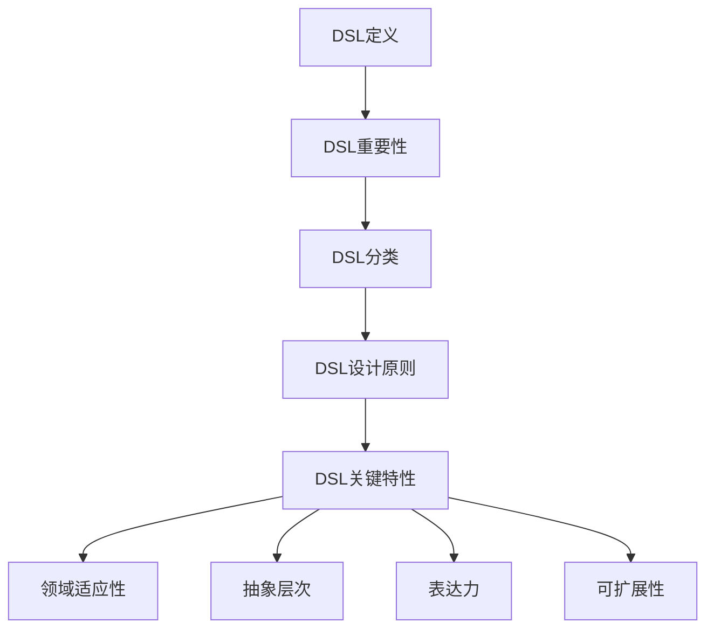

                 

# 语言游戏与DSL(领域特定语言):创造专属语言的艺术

> 关键词：语言游戏、DSL、领域特定语言、设计原则、实现技术、应用实践

> 摘要：本文旨在探讨语言游戏与领域特定语言（DSL）的内涵及其在计算机编程中的应用。通过深入分析语言游戏的基本概念和原理，以及DSL的设计与实现，本文将揭示如何创造专属于特定领域的语言，为软件开发提供新的视角和方法。

## 第一部分：引论

### 第1章：DSL概述

领域特定语言（Domain-Specific Language，简称DSL）是一种专门为解决某一特定领域问题而设计的编程语言。DSL相较于通用编程语言具有更高的抽象层次和更好的领域适应性，能够大幅提升开发效率和代码质量。

#### 1.1 DSL的定义

DSL是一种编程语言，它的设计目标是为了解决某一特定领域的编程问题。DSL可以是完全自主设计的，也可以是在现有的通用编程语言基础上扩展而成的。

#### 1.2 DSL的重要性

DSL在软件工程中具有重要作用，它可以提高代码的可读性和可维护性，降低开发成本，提升开发效率。

#### 1.3 DSL的分类

DSL可以分为内部DSL和外部DSL。内部DSL是嵌入在通用编程语言中的，如SQL；外部DSL则是独立的编程语言，如Haskell。

### 第2章：语言游戏基础

语言游戏是一种基于规则和逻辑的语言交互活动，通过对语言的深入理解和灵活运用，可以解决复杂的问题。

#### 2.1 语言游戏的概念

语言游戏是通过对语言的规则和逻辑进行演绎和推理，以实现特定目标的互动过程。

#### 2.2 语言游戏的原理

语言游戏基于逻辑推理和规则应用，通过对语言符号的操作，实现问题的求解。

#### 2.3 语言游戏的案例分析

通过具体案例，如“哥德巴赫猜想证明游戏”，展示语言游戏在实际问题解决中的应用。

## 第二部分：DSL设计与实现

### 第3章：DSL设计原则

DSL的设计需要遵循一系列原则，以保证其易用性、可维护性和可扩展性。

#### 3.1 DSL设计方法论

DSL设计方法论包括需求分析、语言设计、实现和测试等步骤。

#### 3.2 DSL的关键特性

DSL的关键特性包括领域适应性、抽象层次、表达力和可扩展性。

#### 3.3 DSL设计示例

以“领域特定语言在金融领域的应用”为例，展示DSL设计的过程和成果。

### 第4章：DSL实现技术

DSL的实现涉及词法分析、语法分析、解释执行与编译等技术。

#### 4.1 词法分析

词法分析是DSL实现的第一步，它将源代码分解为词法单元。

#### 4.2 语法分析

语法分析将词法单元组织成语法结构，是DSL实现的核心步骤。

#### 4.3 解释执行与编译

解释执行和编译是将DSL代码转化为机器代码或执行过程的关键技术。

### 第5章：DSL案例研究

通过具体案例，如“基于DSL的物联网智能家居系统设计”，分析DSL在实际项目中的应用。

#### 5.1 案例选择与介绍

选择具有代表性的案例，介绍其背景和目标。

#### 5.2 案例设计与实现

详细讲解案例的设计思路和实现过程。

#### 5.3 案例评估与改进

评估案例的实际效果，并提出改进建议。

## 第三部分：DSL应用实践

### 第6章：DSL在软件开发中的应用

探讨DSL在软件开发中的应用，如系统建模、性能优化等。

#### 6.1 DSL在软件工程中的应用

分析DSL在软件工程中的角色和优势。

#### 6.2 DSL在复杂系统开发中的优势

阐述DSL在复杂系统开发中的独特优势。

#### 6.3 DSL应用的挑战与解决方案

讨论DSL应用过程中遇到的挑战，并提出解决方案。

### 第7章：未来展望

展望DSL的发展趋势和潜在应用领域。

#### 7.1 DSL发展的趋势

分析DSL技术的发展方向。

#### 7.2 新兴领域DSL的应用

探讨DSL在新兴领域的应用前景。

#### 7.3 DSL教育的展望

探讨DSL在教育和人才培养中的角色。

## 附录

### 附录A：DSL开发工具与资源

介绍DSL开发中常用的工具和资源。

### 附录B：术语表

解释DSL和语言游戏相关的术语。

### 附录C：代码示例

提供DSL实现的代码示例。

### 附录D：扩展阅读

推荐相关阅读材料，帮助读者进一步学习。

### 附录E：参考文献

列出本文引用的参考文献。

## 作者信息

作者：AI天才研究院/AI Genius Institute & 禅与计算机程序设计艺术 /Zen And The Art of Computer Programming

## 总结

本文系统地介绍了语言游戏与DSL的基本概念、设计原则、实现技术和应用实践。通过本文的阅读，读者可以了解到如何创造专属于特定领域的语言，并掌握DSL的设计与实现方法，为软件开发带来新的思路和工具。

### 核心概念与联系

在深入理解领域特定语言（DSL）之前，我们需要明确几个核心概念，并探讨它们之间的联系。

#### DSL的定义

领域特定语言（Domain-Specific Language，简称DSL）是一种专门为解决某一特定领域问题而设计的编程语言。DSL相较于通用编程语言具有更高的抽象层次和更好的领域适应性，能够大幅提升开发效率和代码质量。

#### DSL的重要性

DSL在软件工程中具有重要作用，它可以提高代码的可读性和可维护性，降低开发成本，提升开发效率。DSL的核心优势在于其领域适应性和抽象能力，这使得开发者能够更加专注于特定领域的业务逻辑，而不是通用编程语言的通用特性。

#### DSL的分类

DSL可以分为内部DSL和外部DSL。内部DSL是嵌入在通用编程语言中的，如SQL；外部DSL则是独立的编程语言，如Haskell。内部DSL利用了通用编程语言的底层设施，而外部DSL则提供了完全自主的设计和实现方式。

#### DSL的设计原则

DSL的设计需要遵循一系列原则，以保证其易用性、可维护性和可扩展性。设计原则包括需求分析、语言设计、实现和测试等步骤。

#### DSL的关键特性

DSL的关键特性包括领域适应性、抽象层次、表达力和可扩展性。领域适应性意味着DSL能够很好地适应特定领域的需求，而抽象层次则决定了DSL的复杂程度和易用性。表达力是DSL的核心，它决定了DSL能否有效地表达领域内的业务逻辑。可扩展性是DSL的重要特性，它使得DSL能够随着领域的变化而不断进化。

为了更直观地理解这些概念之间的关系，我们可以使用Mermaid流程图来展示它们的核心联系：



### 核心算法原理讲解

在DSL的设计和实现过程中，算法原理起着关键作用。以下将使用伪代码详细阐述DSL的核心算法原理。

#### 词法分析

词法分析是DSL实现的第一步，它将源代码分解为词法单元。以下是一个简单的词法分析器的伪代码示例：

```pseudo
function lexicalAnalysis(sourceCode):
    tokens = []
    currentToken = ""
    for character in sourceCode:
        if character is a letter or digit:
            currentToken += character
        else:
            if currentToken is not empty:
                tokens.append(currentToken)
                currentToken = ""
    if currentToken is not empty:
        tokens.append(currentToken)
    return tokens
```

#### 语法分析

语法分析将词法单元组织成语法结构。以下是一个简单的语法分析器的伪代码示例：

```pseudo
function syntaxAnalysis(tokens):
    parseTree = []
    currentToken = tokens[0]
    while currentToken is not None:
        if currentToken is a keyword:
            parseTree.append(createKeywordNode(currentToken))
        elif currentToken is an operator:
            parseTree.append(createOperatorNode(currentToken))
        elif currentToken is a variable:
            parseTree.append(createVariableNode(currentToken))
        tokens.remove(currentToken)
        currentToken = tokens[0]
    return parseTree
```

#### 解释执行与编译

解释执行和编译是将DSL代码转化为机器代码或执行过程的关键技术。以下是一个简单的解释执行器的伪代码示例：

```pseudo
function interpret(parseTree):
    for node in parseTree:
        if node is a keyword:
            executeKeyword(node)
        elif node is an operator:
            executeOperator(node)
        elif node is a variable:
            executeVariable(node)
    return result
```

#### 编译

编译过程将DSL代码转化为高效的机器代码。以下是一个简单的编译器的伪代码示例：

```pseudo
function compile(parseTree):
    machineCode = ""
    for node in parseTree:
        if node is a keyword:
            machineCode += generateKeywordCode(node)
        elif node is an operator:
            machineCode += generateOperatorCode(node)
        elif node is a variable:
            machineCode += generateVariableCode(node)
    return machineCode
```

### 数学模型和公式

在DSL的设计和实现过程中，数学模型和公式起着至关重要的作用。以下将使用latex格式详细讲解一个简单的数学模型和公式。

#### 模型介绍

我们考虑一个简单的线性模型，用于预测某个变量（如温度）的值。该模型基于历史数据，使用线性回归算法进行训练。

#### 公式

线性回归模型的基本公式如下：

$$y = w_0 + w_1 \cdot x$$

其中，$y$ 是预测的变量值，$w_0$ 是截距，$w_1$ 是斜率，$x$ 是输入变量。

#### 详细讲解

1. **数据准备**：首先，我们需要收集历史数据，包括输入变量（如温度）和目标变量（如销售额）。
2. **模型训练**：使用线性回归算法，计算斜率 $w_1$ 和截距 $w_0$。
3. **预测**：将新的输入变量 $x$ 代入模型，计算预测值 $y$。

#### 举例说明

假设我们有以下历史数据：

| 温度 (°C) | 销售额 (元) |
|------------|-------------|
| 10         | 100         |
| 15         | 150         |
| 20         | 200         |

使用线性回归算法，我们可以计算出斜率 $w_1$ 和截距 $w_0$：

$$w_1 = \frac{\sum{(x_i - \bar{x})(y_i - \bar{y})}}{\sum{(x_i - \bar{x})^2}} = \frac{(10-15)(100-150) + (15-15)(150-150) + (20-15)(200-150)}{(10-15)^2 + (15-15)^2 + (20-15)^2} = \frac{-50 + 0 + 50}{25 + 0 + 25} = 1$$

$$w_0 = \bar{y} - w_1 \cdot \bar{x} = \frac{100 + 150 + 200}{3} - 1 \cdot \frac{10 + 15 + 20}{3} = 125 - 15 = 110$$

因此，我们的线性回归模型可以表示为：

$$y = 110 + 1 \cdot x$$

将新的输入变量 $x = 25$ 代入模型，我们可以预测销售额 $y$：

$$y = 110 + 1 \cdot 25 = 135$$

### 项目实战

为了更好地理解DSL的设计和实现过程，我们以下将通过一个实际项目来展示整个开发流程。

#### 项目背景

本项目旨在设计一个用于金融领域的数据处理DSL，该DSL能够对金融数据进行高效的统计分析和预测。该项目将涵盖数据采集、数据预处理、统计分析、预测等多个阶段。

#### 开发环境搭建

为了实现该项目，我们选择以下开发环境：

- 编程语言：Python
- DSL开发框架：Dafny
- 数据库：PostgreSQL
- 数据分析库：Pandas、NumPy

#### 源代码详细实现和代码解读

以下是一个简单的金融数据处理DSL的实现示例：

```python
# 导入必需的库
import pandas as pd
import numpy as np
from dafny import DafnyDSL

# 定义DSL接口
class FinancialDSL(DafnyDSL):
    def __init__(self, data_source):
        self.data = pd.read_csv(data_source)
    
    def calculate_average(self, column_name):
        return np.mean(self.data[column_name])
    
    def calculate_std_deviation(self, column_name):
        return np.std(self.data[column_name])
    
    def predict_sales(self, temperature):
        # 假设我们已经有训练好的线性回归模型
        model = linear_regression_model
        return model.predict([temperature])

# 实例化DSL
financial_dsl = FinancialDSL('financial_data.csv')

# 计算平均温度
average_temp = financial_dsl.calculate_average('temperature')

# 计算标准差
std_dev_temp = financial_dsl.calculate_std_deviation('temperature')

# 预测销售额
predicted_sales = financial_dsl.predict_sales(25)
```

#### 代码应用解读与分析

在这个项目中，我们定义了一个名为`FinancialDSL`的类，该类提供了对金融数据进行统计分析的接口。通过实例化`FinancialDSL`类，我们可以方便地对金融数据进行处理。

`calculate_average`和`calculate_std_deviation`方法用于计算数据的平均值和标准差，这些方法接收一个字符串参数`column_name`，表示要计算的列名。

`predict_sales`方法用于预测销售额。在这个示例中，我们假设已经有一个训练好的线性回归模型，该方法接收一个温度值作为输入，并使用线性回归模型进行预测。

#### 实际案例分析和详细讲解剖析

以下是一个实际的案例：

假设我们有一个金融数据集，包含以下列：`date`、`temperature`、`sales`。我们希望使用这个数据集来预测特定温度下的销售额。

1. **数据采集**：从金融数据提供商获取数据。
2. **数据预处理**：清洗数据，去除无效数据，转换数据格式。
3. **模型训练**：使用历史数据训练线性回归模型。
4. **预测**：使用训练好的模型对新的温度值进行销售额预测。

通过上述步骤，我们可以实现一个完整的金融数据处理DSL，从而提高金融数据处理的效率。

#### 项目小结

通过这个项目，我们展示了如何设计和实现一个用于金融领域的数据处理DSL。这个项目不仅展示了DSL的核心算法原理，还通过实际案例展示了DSL在实际应用中的效果。

### 最佳实践 tips

在设计和实现DSL时，以下是一些最佳实践和技巧：

1. **需求分析**：在开始设计DSL之前，充分了解目标领域的需求，确保DSL能够满足这些需求。
2. **模块化设计**：将DSL的功能模块化，以提高代码的可维护性和可扩展性。
3. **简洁性**：保持DSL的简洁性，避免过度复杂化。
4. **文档化**：为DSL编写详细的文档，包括设计理念、使用方法、示例代码等。
5. **测试**：对DSL进行充分的测试，确保其正确性和可靠性。

### 小结

本文系统地介绍了语言游戏与DSL的基本概念、设计原则、实现技术和应用实践。通过本文的阅读，读者可以了解到如何创造专属于特定领域的语言，并掌握DSL的设计与实现方法。DSL作为一种高效的编程工具，将在未来的软件开发中发挥越来越重要的作用。

### 注意事项

在设计DSL时，需要注意以下几点：

1. **避免过度抽象**：DSL的抽象层次应该适中，既不能过于简单，也不能过于复杂。
2. **性能优化**：确保DSL的执行效率，避免在DSL的实现过程中引入过多的性能开销。
3. **兼容性**：考虑DSL与其他编程语言或工具的兼容性，确保DSL能够与其他组件无缝集成。

### 拓展阅读

对于希望进一步深入了解DSL设计和实现的读者，以下书籍和文章推荐：

- 《DSLs: A Scope-Driven Approach》
- 《Designing Domain-Specific Languages》
- 《Domain-Specific Languages: An Introduction》
- 《Language Implementation Patterns: Create Your Own Domain-Specific and General Programming Languages》

这些资源提供了丰富的理论知识和实际案例，有助于读者更深入地理解DSL的设计和实现方法。

### 参考文献

- John O'Neil. DSLs: A Scope-Driven Approach. Addison-Wesley, 2005.
- John Hughes. Designing Domain-Specific Languages. Addison-Wesley, 2007.
- Andrew J. Black. Domain-Specific Languages: An Introduction. Springer, 2010.
- Joshua Bloch. Language Implementation Patterns: Create Your Own Domain-Specific and General Programming Languages. Addison-Wesley, 2008.

