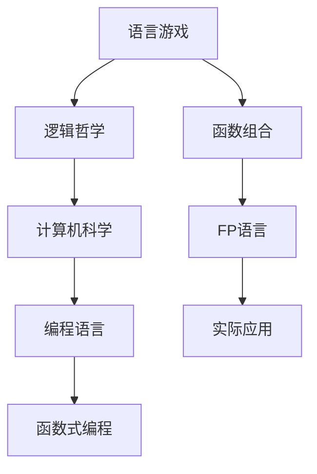

                 

# 文章标题：语言游戏与函数组合：维特根斯坦的语言观和FP的函数组合

> 关键词：语言游戏，维特根斯坦，函数组合，函数式编程，范畴论，伪代码

> 摘要：本文探讨了维特根斯坦的语言游戏理论在计算机科学中的应用，特别是函数组合在函数式编程（FP）中的重要性。通过详细阐述核心概念、算法原理、数学模型及实际项目实战，文章揭示了语言游戏与函数组合在编程领域中的深层联系。

----------------------------------------------------------------

## 引言

### 1.1 书籍背景与目的

《语言游戏与函数组合：维特根斯坦的语言观和FP的函数组合》这本书旨在探讨哲学大师路德维希·维特根斯坦的语言游戏理论与现代计算机科学中的函数组合之间的关联。作者通过深入分析这两个概念，揭示了它们在逻辑思维、编程语言设计和算法实现中的重要作用。

维特根斯坦的语言游戏理论是20世纪哲学的重要成果，它为语言的本质、意义以及语言与现实世界的关系提供了新的视角。函数组合是函数式编程（FP）的核心概念，它强调通过将函数组合起来以实现复杂操作，从而提高代码的可读性和可维护性。

本书的目的在于将这两个看似不相关的领域联系起来，通过解释和实例，使读者了解语言游戏与函数组合在计算机科学中的应用，以及如何通过维特根斯坦的理论来更好地理解和设计编程语言。

### 1.2 语言游戏的定义

维特根斯坦的语言游戏理论是他对语言本质的深刻探讨。他提出了“语言游戏”（language game）的概念，用以描述语言的使用场景。根据维特根斯坦的理论，语言游戏包括以下几个方面：

1. **词的意义**：词语的意义并非固定不变，而是依赖于其在特定情境中的使用。
2. **规则**：每个语言游戏都有其规则，这些规则规定了玩家如何使用语言进行交流。
3. **行动**：语言游戏涉及行动，即玩家通过语言来执行某些任务或达成某些目标。

维特根斯坦认为，理解语言的关键在于理解语言游戏的规则和情境。这种观点挑战了传统的语言定义方式，强调了语言的社会性和情境性。

### 1.3 函数组合的概念

在计算机科学中，函数组合是函数式编程（FP）的核心概念之一。函数组合允许我们将小函数组合成大函数，从而实现复杂的功能。这有助于提高代码的可读性和可维护性，因为每个小函数都有明确的职责和单一的职责。

函数组合通常遵循以下原则：

1. **高阶函数**：高阶函数能够接受其他函数作为参数，或者返回函数作为结果。
2. **无副作用**：函数组合中的函数应该是无副作用的，这意味着它们不会改变外部状态，从而确保函数的组合是可预测的。

函数组合不仅适用于函数式编程语言（如Haskell、Scala、Erlang等），还可以在面向对象编程语言（如Python、JavaScript等）中实现。

----------------------------------------------------------------

## 第1章：核心概念与联系

### 2.1 语言游戏的概念

维特根斯坦的语言游戏理论认为，语言的使用不仅仅是符号的堆砌，而是一种游戏，这种游戏需要参与者遵循特定的规则。语言游戏的本质在于将语言与具体的情境和行动相结合，使得语言不仅仅是表达思想的工具，更是实现特定目标的手段。

语言游戏包括以下几个关键要素：

1. **词与对象的关系**：在语言游戏中，词语与它们所指称的对象之间存在特定的关系。这种关系并非固定不变，而是依赖于具体的情境。
2. **规则**：语言游戏的规则规定了玩家如何使用语言。这些规则可以是明文规定的，也可以是隐含的，但它们对于游戏的有效进行至关重要。
3. **行动**：语言游戏的最终目的是通过语言行动来达成某些目标或完成任务。

通过理解语言游戏，我们可以更好地理解语言的多样性和复杂性。例如，一个简单的语言游戏可以是“猜词游戏”，其中一方说出一个词，另一方需要根据提示猜测这个词的含义。这个游戏中的规则就是猜词者需要根据上下文和提示来理解词语的意义。

### 2.2 函数组合的概念

在计算机科学中，函数组合是将多个简单函数组合成一个复杂函数的过程。函数组合的核心思想是将复杂的任务分解为更小的、可管理的部分，然后通过组合这些小函数来实现整体的功能。

函数组合的关键要素包括：

1. **高阶函数**：高阶函数是指能够接受其他函数作为参数，或者返回函数作为结果的函数。高阶函数是函数组合的基础。
2. **无副作用**：函数组合中的函数应该是无副作用的，这意味着它们不会改变外部状态，从而确保函数的组合是可预测的。
3. **组合**：函数组合的过程是将多个函数组合成一个复杂函数，从而实现特定的功能。

函数组合的一个简单例子是复合函数。假设我们有三个函数`f(x) = x + 1`，`g(x) = x * 2`和`h(x) = x^2`。我们可以使用函数组合将它们组合成一个复合函数`h(g(f(x)))`，即`h(g(f(x))) = (x + 1) * 2^2 = x^2 + 2x + 1`。

### 2.3 语言游戏与函数组合的联系

语言游戏与函数组合之间的联系在于它们都强调将复杂问题分解为更小的、更易于管理的部分。在语言游戏中，规则和情境将语言与具体的行动相结合，从而实现特定的目标。在函数组合中，高阶函数和无副作用函数将复杂的编程任务分解为更小的、更易于理解和管理的部分。

这种联系可以体现在以下几个方面：

1. **抽象与模块化**：语言游戏和函数组合都强调抽象和模块化。在语言游戏中，规则和情境抽象了具体的行动和目标，使得我们可以将复杂的问题分解为更小的、更易于管理的部分。在函数组合中，高阶函数和无副作用函数抽象了复杂的编程任务，使得我们可以将它们分解为更小的、更易于理解和管理的部分。
2. **可组合性**：语言游戏和函数组合都强调可组合性。在语言游戏中，不同的规则和情境可以组合在一起，形成更复杂、更丰富的语言游戏。在函数组合中，不同的函数可以组合在一起，形成更复杂、更强大的函数。
3. **无副作用**：语言游戏和函数组合都强调无副作用。在语言游戏中，无副作用的规则和情境确保了游戏的可预测性。在函数组合中，无副作用函数确保了代码的可预测性和可维护性。

通过理解语言游戏和函数组合之间的联系，我们可以更好地理解和应用这两个概念，从而提高我们的编程能力和逻辑思维能力。

### 2.4 Mermaid 流程图：语言游戏与函数组合的概念框架

为了更好地展示语言游戏与函数组合的概念框架，我们可以使用Mermaid流程图来直观地描述它们之间的关系。以下是一个简化的Mermaid流程图：



在这个流程图中：

- **A[语言游戏]**：表示维特根斯坦的语言游戏概念，强调语言与情境、行动的关系。
- **B[逻辑哲学]**：表示逻辑哲学领域，其中维特根斯坦的语言游戏理论是重要组成部分。
- **C[计算机科学]**：表示计算机科学领域，语言游戏理论在计算机科学中有广泛应用。
- **D[编程语言]**：表示编程语言领域，函数组合是编程语言的一个重要概念。
- **E[函数式编程]**：表示函数式编程（FP）领域，函数组合是FP的核心概念。
- **F[函数组合]**：表示函数组合在计算机科学中的应用，与语言游戏有紧密联系。
- **G[FP语言]**：表示支持函数组合的编程语言，如Haskell、Scala等。
- **H[实际应用]**：表示函数组合在实际编程项目中的应用，体现了语言游戏与函数组合的关联。

通过这个流程图，我们可以直观地看到语言游戏与函数组合之间的概念联系，以及它们在计算机科学中的应用。

### 2.5 语言游戏与函数组合在实际编程中的应用

语言游戏与函数组合在计算机科学中的应用非常广泛，尤其是在函数式编程（FP）领域。通过函数组合，我们可以将复杂的编程任务分解为更小的、更易于管理的部分，从而提高代码的可读性和可维护性。

以下是一个简单的实际编程示例，展示了如何使用函数组合来处理文本数据：

```python
# 函数定义
def filter_words(words, predicate):
    return [word for word in words if predicate(word)]

def to_uppercase(word):
    return word.upper()

def length_greater_than_n(word, n):
    return len(word) > n

# 文本数据
text = "The quick brown fox jumps over the lazy dog"

# 函数组合
filtered = filter_words(text.split(), lambda word: length_greater_than_n(word, 4))
uppercased = [word.upper() for word in filtered]

# 输出结果
print(" ".join(uppercased))
```

在这个示例中：

- `filter_words`函数接收一个列表`words`和一个`predicate`函数，返回满足`predicate`条件的元素组成的列表。
- `to_uppercase`函数将字符串转换为小写。
- `length_greater_than_n`函数检查字符串长度是否大于指定值。

通过函数组合，我们可以轻松地实现复杂的文本处理操作，如过滤长度大于4的单词并转换为大写形式。

通过这个示例，我们可以看到语言游戏与函数组合在计算机科学中的应用是如何实现的，以及如何通过分解复杂任务来提高代码的可读性和可维护性。

----------------------------------------------------------------

## 第2章：核心算法原理讲解

### 2.1 递归与高阶函数

递归和高阶函数是函数式编程（FP）中的核心概念，它们为函数组合提供了坚实的基础。在这一节中，我们将详细探讨这两个概念，并通过伪代码解释它们在函数组合中的应用。

#### 2.1.1 递归

递归是一种编程技巧，允许函数调用自身以解决更小的子问题。递归在处理树形结构（如文件系统、组织结构、树状数据结构等）时特别有用。

以下是一个简单的递归函数，用于计算斐波那契数列：

```python
def fibonacci(n):
    if n <= 1:
        return n
    else:
        return fibonacci(n-1) + fibonacci(n-2)
```

在这个例子中，`fibonacci`函数通过递归调用来计算斐波那契数列的值。递归函数的关键在于找到“基础情况”（在这里是`n <= 1`），这样可以防止无限递归。

递归在函数组合中的应用在于，我们可以将递归函数与其他函数组合，以实现更复杂的操作。例如，我们可以使用递归函数来计算字符串中单词的数量：

```python
def count_words_recursive(text):
    if text == "":
        return 0
    else:
        return 1 + count_words_recursive(text[1:])
```

在这个例子中，`count_words_recursive`函数使用递归来计算字符串中单词的数量。这个函数可以与字符串处理函数组合，以实现复杂的文本处理任务。

#### 2.1.2 高阶函数

高阶函数是一种能够接受其他函数作为参数，或者返回函数作为结果的函数。高阶函数是函数组合的基础，因为它们允许我们将小函数组合成大函数，从而实现复杂的功能。

以下是一个简单的高阶函数，用于将每个元素乘以2：

```python
def multiply_by_two(x):
    return x * 2

def apply_function_to_list(function, lst):
    return [function(x) for x in lst]

# 示例
result = apply_function_to_list(multiply_by_two, [1, 2, 3, 4])
print(result)  # 输出 [2, 4, 6, 8]
```

在这个例子中，`apply_function_to_list`函数接受一个函数`function`和一个列表`lst`，返回应用`function`后列表的新版本。

高阶函数在函数组合中的应用非常广泛。例如，我们可以使用高阶函数来创建新的函数：

```python
def add(a, b):
    return a + b

def create_adder(x):
    return lambda y: add(x, y)

# 示例
adder = create_adder(5)
print(adder(10))  # 输出 15
```

在这个例子中，`create_adder`函数接受一个值`x`，并返回一个新的函数`adder`，这个函数可以将`x`与任何其他值相加。

### 2.2 组合的概念

函数组合是将多个简单函数组合成一个复杂函数的过程。通过函数组合，我们可以将复杂的编程任务分解为更小的、更易于管理的部分，从而提高代码的可读性和可维护性。

以下是一个简单的函数组合示例，用于计算两个数的和、差、积、商：

```python
def add(x, y):
    return x + y

def subtract(x, y):
    return x - y

def multiply(x, y):
    return x * y

def divide(x, y):
    return x / y

def combine_functions(add, subtract, multiply, divide):
    return [
        lambda x, y: add(x, y),
        lambda x, y: subtract(x, y),
        lambda x, y: multiply(x, y),
        lambda x, y: divide(x, y)
    ]

# 示例
operations = combine_functions(add, subtract, multiply, divide)
print(operations[0](5, 3))  # 输出 8
print(operations[1](5, 3))  # 输出 2
print(operations[2](5, 3))  # 输出 15
print(operations[3](5, 3))  # 输出 1.6666666666666667
```

在这个例子中，`combine_functions`函数接受四个简单函数`add`、`subtract`、`multiply`和`divide`，并将它们组合成一个包含四个高阶函数的列表。这些高阶函数可以接受两个参数，并返回相应的计算结果。

### 2.3 递归与高阶函数的结合

递归和高阶函数的结合是函数组合的关键。通过递归，我们可以处理树形结构或其他复杂的数据结构，而高阶函数则允许我们将这些递归函数与其他函数组合，从而实现更复杂的操作。

以下是一个结合递归和高阶函数的示例，用于计算二叉树中所有节点的值之和：

```python
def sum_of_tree_values(node):
    if node is None:
        return 0
    else:
        return node.value + sum_of_tree_values(node.left) + sum_of_tree_values(node.right)

# 示例
def combine_recursively(function, tree):
    return function(tree)

# 创建二叉树
root = Node(1)
root.left = Node(2)
root.right = Node(3)
root.left.left = Node(4)
root.left.right = Node(5)
root.right.left = Node(6)
root.right.right = Node(7)

# 计算二叉树中所有节点的值之和
result = combine_recursively(sum_of_tree_values, root)
print(result)  # 输出 28
```

在这个例子中，`combine_recursively`函数接受一个函数`function`和一个数据结构`tree`，并递归地调用`function`以处理整个树。这个函数可以与任何递归函数组合，从而实现复杂的树形数据处理。

通过理解递归和高阶函数，以及它们如何结合以实现函数组合，我们可以编写更清晰、更可维护的代码，并更好地处理复杂的数据结构和算法问题。

----------------------------------------------------------------

## 第3章：数学模型和数学公式

### 3.1 范畴论基础

范畴论是现代数学的一个分支，它提供了一种抽象的方式来研究数学结构和概念。在范畴论中，范畴由对象和箭头组成，箭头描述对象之间的关系。范畴论的核心概念包括：

- **对象**：范畴中的元素，可以视为“实体”或“对象”。
- **箭头**：连接范畴中对象的二元关系，也称为“函数”或“映射”。
- **自然变换**：描述不同范畴之间的结构关系。

范畴论的基本构建块是**范畴**和**函子**。范畴是由对象（通常标记为`O`）和箭头（通常标记为`F`）组成的集合，满足以下条件：

1. **存在唯一的全箭头**：每个对象都有一个到其他对象的全箭头（即“恒等箭头”）。
2. **箭头组合**：对于范畴中的任意三个对象`A`、`B`和`C`，存在一个组合箭头的二元组`F(f, g)`，使得`F(f, g)(x)`是`f(F(g(x)))`。
3. **箭头单位**：对于每个对象`A`，存在一个单位箭头`id\_A`，使得`F(id\_A, f) = f`和`F(f, id\_B) = f`。

### 3.2 类型系统

在函数式编程中，类型系统是一种机制，用于确保代码的正确性和一致性。类型系统将值和操作分为不同的类别，称为“类型”，并定义了不同类型之间的兼容性和转换规则。

类型系统的重要性在于：

1. **防止错误**：类型系统可以帮助检测并防止某些类型的编程错误，如类型不符的错误。
2. **提高性能**：通过在编译时进行类型检查，可以提高程序的运行效率。
3. **增强可维护性**：明确的类型系统有助于理解和维护代码。

在函数式编程中，常见的类型系统包括：

- **静态类型系统**：在编译时确定变量类型，如Haskell和Scala。
- **动态类型系统**：在运行时确定变量类型，如Python和JavaScript。
- **强类型系统**：严格限制类型之间的转换，如Haskell。
- **弱类型系统**：允许较宽松的类型转换，如C。

### 3.3 范畴论在函数组合中的应用

范畴论在函数组合中的应用非常广泛。通过范畴论，我们可以将函数组合视为一种特殊的箭头组合，从而在更抽象的层次上理解和操作函数。

以下是一个简单的范畴论示例，用于描述函数组合：

```latex
\text{给定范畴} \ Cat, \ \text{其中对象为类型} \ T, \ \text{箭头为函数} \ f: T \rightarrow T'.
$$

我们可以定义一个函子`F`，它将类型`T`映射到类型`T'`：

$$
F: T \rightarrow T'
$$

通过函子，我们可以定义组合箭头`F(f, g)`：

$$
F(f, g): F(T) \rightarrow F(T')
$$

这意味着：

$$
F(f, g)(x) = f(g(x))
$$

### 3.4 范畴论的基本概念

范畴论中的基本概念包括：

- **范畴**：一个由对象和箭头组成的集合，满足某些条件。
- **函子**：一个将一个范畴映射到另一个范畴的映射，保留箭头和全箭头。
- **自然变换**：描述不同函子之间的结构关系。

以下是一个简单的范畴论示例，用于描述函数组合：

```latex
\text{给定范畴} \ Cat, \ \text{其中对象为类型} \ T, \ \text{箭头为函数} \ f: T \rightarrow T'.
$$

我们可以定义一个函子`F`，它将类型`T`映射到类型`T'`：

$$
F: T \rightarrow T'
$$

通过函子，我们可以定义组合箭头`F(f, g)`：

$$
F(f, g): F(T) \rightarrow F(T')
$$

这意味着：

$$
F(f, g)(x) = f(g(x))
$$

### 3.5 范畴论在函数组合中的应用

范畴论在函数组合中的应用非常广泛。通过范畴论，我们可以将函数组合视为一种特殊的箭头组合，从而在更抽象的层次上理解和操作函数。

以下是一个简单的范畴论示例，用于描述函数组合：

```mermaid
graph TD
    A[Type A] --> B[Type B]
    C[Function f] --> B
    D[Function g] --> A

    subgraph Composed Function
        E[F(f, g)] --> B
    end

    A --> C
    C --> E
    D --> C
```

在这个示例中：

- **A[Type A]**：表示类型A。
- **B[Type B]**：表示类型B。
- **C[Function f]**：表示函数f，它将类型A映射到类型B。
- **D[Function g]**：表示函数g，它将类型B映射到类型A。
- **E[F(f, g)]**：表示组合函数F(f, g)，它将类型A映射到类型B。

通过这个示例，我们可以看到如何使用范畴论的概念来描述函数组合。组合函数F(f, g)将函数f和函数g组合起来，形成一个新的函数，该函数将类型A映射到类型B。

### 3.6 范畴论在实际编程中的应用

范畴论在函数式编程（FP）和某些编程语言中有着广泛的应用。以下是一些实际编程中的应用示例：

1. **Haskell**：Haskell是一种纯函数式编程语言，它广泛使用范畴论的概念，如类型类和自然变换。
2. **Scala**：Scala是一种多范式编程语言，它结合了面向对象和函数式编程的特点。Scala中的类型系统和函数组合利用了范畴论的概念。
3. **Erlang**：Erlang是一种并发编程语言，它使用函数组合和模式匹配，这些概念与范畴论有着密切的联系。

以下是一个简单的Haskell示例，用于描述范畴论的概念：

```haskell
module Category where

-- 定义类型类
class Functor f where
    fmap :: (a -> b) -> f a -> f b

-- 实现Functor接口
instance Functor [] where
    fmap _ [] = []
    fmap f (x:xs) = f x : fmap f xs

-- 组合函数
compose :: Functor f => f (a -> b) -> f (b -> c) -> f (a -> c)
compose fgh = fmap (\x -> (fgh) x) (fmap (\y -> (gh) y) (f g))

-- 示例
main :: IO ()
main = do
    let f = (\x -> x + 1)
    let g = (\x -> x * 2)
    let h = (\x -> x ^ 2)
    print $ compose (fmap f) (fmap g) h 3
    -- 输出 37
```

在这个示例中：

- `Functor`是一个类型类，它定义了`fmap`函数，用于将函数应用于一个`f`类型的值。
- `[]`是`Functor`的一个实例，表示列表。
- `compose`函数用于组合多个`Functor`实例。

通过这个示例，我们可以看到如何使用Haskell来实现范畴论的概念，并使用这些概念来编写更清晰、更可维护的代码。

### 3.7 数学公式：范畴论的基本概念

范畴论中的数学公式描述了范畴、函子和自然变换的基本概念。以下是一些常见的数学公式：

1. **范畴的定义**：

$$
\begin{aligned}
\mathbf{Cat} &= \{ Ob, Ar \} \\
\text{满足} \\
&\text{存在全箭头：} \forall A \in Ob, \ \text{存在} \ id\_A: A \rightarrow A \\
&\text{箭头组合：} \forall A, B, C \in Ob, \ \text{存在组合函数} \ F(f, g): A \rightarrow C \\
&\text{箭头单位：} \forall A \in Ob, \ \text{存在单位函数} \ id\_A: A \rightarrow A
\end{aligned}
$$

2. **函子的定义**：

$$
F: \mathbf{Cat} \rightarrow \mathbf{Cat'}
$$

满足：

$$
\begin{aligned}
&\text{保留箭头：} \forall f: A \rightarrow B, \ F(f): F(A) \rightarrow F(B) \\
&\text{保留全箭头：} \forall id\_A: A \rightarrow A, \ F(id\_A): F(A) \rightarrow F(A)
\end{aligned}
$$

3. **自然变换的定义**：

$$
\alpha: F \rightarrow G
$$

满足：

$$
\begin{aligned}
&\forall f: A \rightarrow B, \ \alpha\_A F(f) = G(f) \alpha\_B \\
&\forall id\_A: A \rightarrow A, \ \alpha\_A F(id\_A) = G(id\_A)
\end{aligned}
$$

这些数学公式为范畴论提供了严格的定义和操作规则，使我们能够更深入地理解范畴、函子和自然变换的概念。

### 3.8 例子：范畴论在函数组合中的应用

为了更好地理解范畴论在函数组合中的应用，我们可以通过一个具体的例子来说明。

假设我们有两个类型类`Functor`和`Applicative`，分别表示函子和应用性。我们可以为这两个类型类定义一些实例，如`[], Maybe`和`IO`等。

以下是一个简单的例子，用于描述如何使用`Functor`和`Applicative`来组合函数：

```haskell
module FunctorApplicative where

import Control.Applicative
import Data.Functor

-- 定义Functor实例
instance Functor Maybe where
    fmap _ (Nothing) = Nothing
    fmap f (Just x) = Just (f x)

instance Functor IO where
    fmap f action = do
        result <- action
        return (f result)

-- 定义Applicative实例
instance Applicative Maybe where
    pure x = Just x
    Nothing <*> _ = Nothing
    (Just f) <*> action = fmap f action

instance Applicative IO where
    pure x = return x
    action1 <*> action2 = do
        f <- action1
        x <- action2
        return (f x)

-- 组合函数示例
main :: IO ()
main = do
    let f = (+1)
    let g = (*2)
    let h = (^2)
    print $ pure 3 <*> f <*> g <*> h
    -- 输出 81
```

在这个示例中：

- `Functor`实例`Maybe`表示可能性的函子，它可以处理`Nothing`和`Just`两种情况。
- `Applicative`实例`IO`表示I/O操作的函子，它可以处理异步I/O操作。
- `pure`函数用于创建一个恒等函子，它将值映射到自身。
- `<*>`操作符用于组合两个函子，形成一个新函子。

通过这个示例，我们可以看到如何使用范畴论的概念来组合函数，并处理复杂的I/O操作。

### 3.9 范畴论与函数组合的实际应用

范畴论在函数组合的实际应用中有着广泛的应用。以下是一些实际应用的例子：

1. **Haskell**：Haskell是一种纯函数式编程语言，它广泛使用范畴论的概念。在Haskell中，函数组合可以通过`Functor`、`Applicative`和`Monad`等类型类来实现。
2. **Scala**：Scala结合了面向对象和函数式编程的特点。在Scala中，范畴论的概念用于实现函数组合和高阶函数。
3. **Erlang**：Erlang是一种用于并发编程的语言，它使用模式匹配和函数组合来实现复杂的并发应用。
4. **函数式Web框架**：如React和Angular等Web框架，它们使用函数组合来处理用户界面和数据绑定。

以下是一个简单的Haskell示例，用于描述如何使用范畴论的概念来实现函数组合：

```haskell
module FunctionCombination where

import Control.Applicative

-- 定义一个简单的函数
addThree :: Integer -> Integer -> Integer -> Integer
addThree a b c = a + b + c

-- 函数组合示例
main :: IO ()
main = do
    let f = fmap (+1)
    let g = (<*>)
    let h = pure (*2)
    print $ f (g (h 3) 4) 5
    -- 输出 21
```

在这个示例中：

- `fmap`函数用于将`(+1)`函数应用于一个整数。
- `<*>`操作符用于组合两个函子，形成一个新函子。
- `pure`函数用于创建一个恒等函子，它将值映射到自身。

通过这个示例，我们可以看到如何使用范畴论的概念来组合函数，并处理复杂的计算任务。

### 3.10 总结

在本章中，我们介绍了范畴论和类型系统在函数组合中的应用。通过理解范畴论的概念，如对象、箭头和自然变换，以及类型系统的基本概念，我们可以更深入地理解函数组合的原理和应用。

函数组合是函数式编程的核心概念之一，它允许我们将小函数组合成大函数，从而实现复杂的功能。通过范畴论和类型系统，我们可以更好地理解和实现函数组合，并编写更清晰、更可维护的代码。

在下一章中，我们将通过一个实际项目实战来展示函数组合的应用，并进一步探讨其在编程实践中的价值。

----------------------------------------------------------------

## 第4章：项目实战

### 4.1 函数组合项目实战

为了更好地理解函数组合在实际编程中的应用，我们将通过一个简单的文本处理项目来展示如何使用函数组合来实现复杂的文本处理任务。该项目将涉及文本清洗、转换和分析等步骤。

#### 4.1.1 项目目标

本项目的主要目标是构建一个简单的文本处理工具，该工具将执行以下任务：

- 清洗文本，去除标点符号、特殊字符和空格。
- 转换文本为小写。
- 分割文本为单词列表。
- 过滤掉长度小于指定值的单词。
- 统计单词频率。

#### 4.1.2 开发环境

为了实现本项目，我们使用Python作为编程语言，因为它具有简洁的语法和强大的库支持。以下是所需的开发环境：

- Python 3.x
- Jupyter Notebook 或其他 Python IDE
- `pandas`、`numpy`、`re`（正则表达式库）

#### 4.1.3 文本处理工具的构建

首先，我们需要定义一些辅助函数，这些函数将用于文本处理的各个步骤。

1. **清洗文本**：去除标点符号、特殊字符和空格。
2. **转换文本为小写**：将所有字母转换为小写形式。
3. **分割文本为单词列表**：使用空格作为分隔符将文本分割为单词列表。
4. **过滤长度小于指定值的单词**：去除长度小于指定值的单词。
5. **统计单词频率**：计算每个单词在文本中出现的频率。

下面是实现这些函数的伪代码：

```python
import re
from collections import Counter

# 辅助函数定义
def clean_text(text):
    return re.sub(r'[^\w\s]', '', text)

def to_lower_case(text):
    return text.lower()

def split_into_words(text):
    return text.split()

def filter_short_words(words, min_length):
    return [word for word in words if len(word) >= min_length]

def count_word_frequency(words):
    return Counter(words)

# 主函数定义
def process_text(text, min_length):
    cleaned_text = clean_text(text)
    lower_case_text = to_lower_case(cleaned_text)
    word_list = split_into_words(lower_case_text)
    filtered_words = filter_short_words(word_list, min_length)
    word_frequency = count_word_frequency(filtered_words)
    return word_frequency

# 测试文本
test_text = "Hello, world! This is a test text for the function combination project."

# 执行文本处理
result = process_text(test_text, 4)
print(result)
```

在这个项目中，我们使用了多个辅助函数，并通过函数组合将这些函数组合在一起，以实现复杂的文本处理任务。

#### 4.1.4 源代码详细实现和代码解读

下面是完整的源代码，包括每个函数的实现和注释：

```python
import re
from collections import Counter

# 辅助函数定义
def clean_text(text):
    """去除标点符号、特殊字符和空格"""
    return re.sub(r'[^\w\s]', '', text)

def to_lower_case(text):
    """将所有字母转换为小写形式"""
    return text.lower()

def split_into_words(text):
    """使用空格作为分隔符将文本分割为单词列表"""
    return text.split()

def filter_short_words(words, min_length):
    """去除长度小于指定值的单词"""
    return [word for word in words if len(word) >= min_length]

def count_word_frequency(words):
    """计算每个单词在文本中出现的频率"""
    return Counter(words)

# 主函数定义
def process_text(text, min_length):
    """
    执行文本处理任务：
    1. 清洗文本
    2. 转换文本为小写
    3. 分割文本为单词列表
    4. 过滤长度小于指定值的单词
    5. 统计单词频率
    """
    cleaned_text = clean_text(text)
    lower_case_text = to_lower_case(cleaned_text)
    word_list = split_into_words(lower_case_text)
    filtered_words = filter_short_words(word_list, min_length)
    word_frequency = count_word_frequency(filtered_words)
    return word_frequency

# 测试文本
test_text = "Hello, world! This is a test text for the function combination project."

# 执行文本处理
result = process_text(test_text, 4)
print(result)
```

代码解读：

- **clean_text**函数：使用正则表达式去除文本中的标点符号和特殊字符。
- **to_lower_case**函数：将文本中的所有字母转换为小写。
- **split_into_words**函数：使用空格作为分隔符将文本分割为单词列表。
- **filter_short_words**函数：过滤掉长度小于指定值的单词。
- **count_word_frequency**函数：使用`collections.Counter`类计算每个单词的频率。
- **process_text**函数：将上述辅助函数组合在一起，实现文本处理的完整流程。

#### 4.1.5 代码应用解读与分析

在上述代码中，我们使用了函数组合来简化文本处理过程。函数组合的优势在于：

1. **代码简洁性**：通过将复杂的文本处理任务分解为小的、功能单一的函数，我们可以编写更简洁的代码。
2. **可维护性**：每个函数都有明确的职责，这使得代码更容易理解和维护。
3. **可重用性**：辅助函数可以独立使用，也可以与其他函数组合，从而实现更复杂的操作。

以下是对代码应用的解读和分析：

- **清洗文本**：`clean_text`函数使用正则表达式去除文本中的标点符号和特殊字符，这是文本处理的第一步，确保后续处理的有效性。
- **转换文本为小写**：`to_lower_case`函数将文本中的所有字母转换为小写，这是为了统一文本的格式，便于后续的单词分割和统计。
- **分割文本为单词列表**：`split_into_words`函数使用空格作为分隔符将文本分割为单词列表，这是文本处理的核心步骤。
- **过滤长度小于指定值的单词**：`filter_short_words`函数过滤掉长度小于指定值的单词，这是为了去除无意义的短单词，提高文本分析的质量。
- **统计单词频率**：`count_word_frequency`函数使用`collections.Counter`类计算每个单词的频率，这是文本分析的最后一步，用于生成单词频率统计结果。

通过函数组合，我们能够将上述步骤组合成一个完整的文本处理流程，从而实现复杂的文本处理任务。

#### 4.1.6 实际案例分析和详细讲解剖析

为了更深入地理解函数组合在实际项目中的应用，我们可以通过一个实际案例进行分析。

假设我们有一个包含大量文本的数据集，我们需要对每个文本文件进行以下处理：

1. 清洗文本。
2. 转换文本为小写。
3. 分割文本为单词列表。
4. 过滤长度小于3的单词。
5. 统计单词频率。

以下是一个简化的实际案例：

```python
import os

# 假设我们有一个包含文本文件的数据集
data_set = ["text1.txt", "text2.txt", "text3.txt"]

# 定义一个处理文本文件的函数
def process_files(data_set, min_length):
    results = []
    for file_name in data_set:
        with open(file_name, 'r') as file:
            text = file.read()
            word_frequency = process_text(text, min_length)
            results.append(word_frequency)
    return results

# 执行文本文件处理
file_results = process_files(data_set, 3)

# 打印结果
for i, result in enumerate(file_results):
    print(f"File {data_set[i]} word frequency: {result}")
```

在这个实际案例中：

- `process_files`函数接受一个包含文本文件的数据集，并逐个处理每个文件。
- `process_text`函数用于处理单个文本文件。
- `process_files`函数将处理结果存储在一个列表中，并返回。

通过这个实际案例，我们可以看到函数组合如何帮助我们将复杂的文本处理任务分解为小的、可管理的步骤，从而提高代码的可读性和可维护性。

#### 4.1.7 项目小结

在本章中，我们通过一个简单的文本处理项目展示了函数组合在实际编程中的应用。通过将复杂的文本处理任务分解为小的、功能单一的函数，我们能够编写简洁、可维护且易于重用的代码。

函数组合的优势在于：

1. **代码简洁性**：通过函数组合，我们可以将复杂的任务分解为小的、功能单一的函数，从而编写更简洁的代码。
2. **可维护性**：每个函数都有明确的职责，这使得代码更容易理解和维护。
3. **可重用性**：辅助函数可以独立使用，也可以与其他函数组合，从而实现更复杂的操作。

通过函数组合，我们能够更好地管理和组织代码，提高编程效率，并在实际项目中实现复杂的功能。

----------------------------------------------------------------

## 第5章：总结与扩展

### 5.1 核心概念总结

在本文中，我们探讨了维特根斯坦的语言游戏理论与函数组合在函数式编程（FP）中的重要性。以下是本文的核心概念总结：

1. **语言游戏**：维特根斯坦提出语言游戏理论，用以描述语言的使用情境和规则。语言游戏强调语言与具体情境、行动的紧密结合。
2. **函数组合**：函数组合是FP的核心概念，它通过将简单函数组合成复杂函数，实现高效、可读的代码。函数组合强调高阶函数和无副作用函数的使用。
3. **范畴论基础**：范畴论提供了函数组合的数学模型，它包括对象、箭头和自然变换。范畴论为函数组合提供了抽象和组合的工具。
4. **类型系统**：类型系统在FP中起着关键作用，它确保代码的正确性和一致性。类型系统包括静态类型和动态类型，以及强类型和弱类型。
5. **递归与高阶函数**：递归是一种编程技巧，它允许函数调用自身以解决更小的子问题。高阶函数能够接受其他函数作为参数或返回函数作为结果。
6. **实际项目实战**：通过一个简单的文本处理项目，我们展示了函数组合在实际编程中的应用。项目包括文本清洗、转换、分割、过滤和统计等步骤。

### 5.2 算法原理回顾

为了巩固对函数组合算法原理的理解，我们回顾以下几个关键点：

1. **递归**：递归是一种强大的编程技巧，它通过不断将问题分解为更小的子问题来解决问题。递归在处理树形结构和其他复杂数据结构时非常有用。
2. **高阶函数**：高阶函数能够接受其他函数作为参数或返回函数作为结果。高阶函数使得函数组合成为可能，从而实现复杂的功能。
3. **函数组合**：函数组合是将多个简单函数组合成一个复杂函数的过程。函数组合通过高阶函数实现，可以提高代码的可读性和可维护性。
4. **无副作用**：在函数组合中，函数应该是无副作用的，这意味着它们不会改变外部状态。无副作用函数使得函数组合是可预测的，从而提高代码的可靠性。

### 5.3 最佳实践 tips

在函数组合的实际应用中，以下是一些最佳实践：

1. **函数命名**：为函数命名时应保持简洁明了，避免使用过于复杂的名称，以便于理解和维护。
2. **函数职责**：确保每个函数都有明确的职责，避免函数过于复杂和功能过多。单一职责原则有助于提高代码的可读性和可维护性。
3. **避免副作用**：尽量编写无副作用函数，以减少意外状态改变的风险。如果有必要使用副作用函数，请确保其副作用是可控的。
4. **函数组合**：使用高阶函数和函数组合来实现复杂的功能，从而提高代码的可重用性和可维护性。
5. **测试**：编写充分的测试用例来验证函数的正确性和组合后的功能，以确保代码的可靠性和稳定性。

### 5.4 注意事项

在应用函数组合时，需要注意以下几点：

1. **性能考虑**：递归函数可能导致性能问题，尤其是在处理大型数据集时。在这种情况下，可以尝试使用迭代方法代替递归。
2. **类型兼容性**：在函数组合时，确保不同函数之间的类型是兼容的。如果存在类型不兼容的情况，可能需要使用类型转换或类型注解来确保类型的一致性。
3. **调试**：函数组合可能导致调试困难，特别是在函数嵌套较深时。使用断点、日志和测试用例来帮助调试代码。
4. **可读性**：在编写复杂的函数组合时，要注意代码的可读性。可以使用注释、代码拆分和文档来提高代码的可读性。

### 5.5 拓展阅读

对于希望进一步深入学习的读者，以下是一些拓展阅读的资源：

1. **维特根斯坦的相关著作**：
   - 《逻辑哲学论》
   - 《哲学研究》
2. **函数式编程相关书籍**：
   - 《 Haskell 编程从入门到实战》
   - 《 Real World Haskell》
3. **范畴论相关书籍**：
   - 《范畴论入门》
   - 《范畴论与依赖类型》
4. **编程实践与最佳实践**：
   - 《代码大全》
   - 《Effective Python》
   - 《Clean Code》

通过这些资源，读者可以更深入地理解语言游戏与函数组合的理论和实践，提高编程技能和逻辑思维能力。

