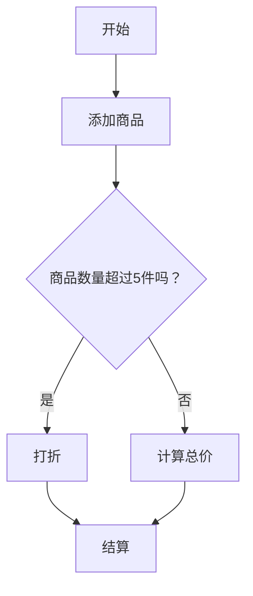

                 

### 第1章 引言

#### 1.1 书籍背景介绍

在现代编程领域，函数式编程（Functional Programming, FP）作为一种与传统面向对象编程（Object-Oriented Programming, OOP）迥异的方法，受到了越来越多程序员的青睐。其基于数学函数的范式，强调函数是一等公民，能够极大地简化代码的复杂性，提高程序的可读性和可维护性。然而，FP的精髓远不止于此。实际上，FP的设计理念和哲学思想，与哲学家路德维希·维特根斯坦（Ludwig Wittgenstein）的语言多样性观有着深刻的共鸣。

维特根斯坦在其著作《逻辑哲学论》（Tractatus Logico-Philosophicus）中提出了“语言游戏”（language game）的概念，主张语言的意义并非固定不变，而是依赖于使用者的具体情境和目的。换句话说，同一种语言在不同的语境下可以扮演不同的角色，具有多样化的功能。维特根斯坦的这一观点，对现代编程，尤其是函数式编程的设计理念产生了重要影响。

本书旨在探讨语言游戏的多样性与函数式编程设计模式之间的联系，通过分析维特根斯坦的语言多样性观，解释FP中的设计模式如何体现这种多样性。具体而言，本书将首先介绍维特根斯坦的语言游戏概念及其哲学背景，随后深入探讨函数式编程的基础和核心设计模式。在此基础上，我们将探讨语言游戏在FP中的应用，并通过实际案例展示这些设计模式在实际编程中的效果。

#### 1.2 维特根斯坦的语言多样性观

维特根斯坦的语言多样性观主要体现在他对语言使用情境的重视上。他认为，语言并非一种普遍适用的工具，而是在特定的使用情境中发挥作用。每一个语言游戏都有其独特的规则和目的，这些规则和目的决定了语言的使用方式。例如，数学中的语言游戏与日常交流中的语言游戏截然不同，前者强调精确性和逻辑性，而后者则更注重情感表达和交流。

这种观点在编程领域也得到了体现。函数式编程中的函数，就如同维特根斯坦所说的语言游戏，它们在不同的上下文中扮演不同的角色。一个函数可能在某个程序中用于数据处理，在另一个程序中则用于界面交互。函数的这种多样性和灵活性，使得函数式编程能够应对各种复杂的编程任务。

此外，维特根斯坦还提出了“形式逻辑”和“日常语言”的区别。形式逻辑是一种高度抽象和简化的语言，它能够精确地表达逻辑关系，但缺乏日常语言的灵活性和情感表达。与此相对，日常语言则更加贴近生活，能够灵活地应对各种情境，但往往缺乏精确性。在编程中，我们也可以看到类似的对比。纯函数式编程强调逻辑和抽象，而面向对象编程则更贴近日常逻辑和现实世界的复杂性。

通过以上分析，我们可以看出，维特根斯坦的语言多样性观为函数式编程提供了一种哲学基础。理解语言游戏的多样性和规则，有助于我们更好地掌握函数式编程的精髓，提高编程技能和代码质量。

#### 1.3 函数式编程（FP）基础

函数式编程（Functional Programming，FP）是一种编程范式，它以函数作为组织代码的基本单位。与传统的面向对象编程（OOP）相比，FP更加注重表达计算过程而非状态变化。以下将简要介绍FP的核心特点，以及一些常见的函数式编程语言。

**1.3.1 函数是一等公民**

在函数式编程中，函数被视为与变量、对象等价的一等公民。这意味着函数可以赋值给变量，作为参数传递给其他函数，甚至可以作为返回值。这种灵活性使得FP能够通过组合函数来实现复杂的操作，而不依赖于状态变化。

**1.3.2 高阶函数**

高阶函数是一种接受函数作为参数或返回函数的函数。这种特性使得FP能够实现函数的抽象和复用。例如，在FP中，我们经常使用高阶函数来实现映射（map）、过滤（filter）和折叠（fold）等操作。

**1.3.3 惰性求值**

惰性求值（Lazy Evaluation）是一种求值策略，它仅在必要时刻才进行实际计算。这种策略可以优化性能，避免不必要的计算。例如，在FP中，我们可以在一个列表中遍历所有元素，但实际上只计算那些真正需要的值。

**1.3.4 常见的函数式编程语言**

1. **Haskell**：Haskell是一种纯函数式编程语言，以其严格的类型系统和强大的模式匹配功能而闻名。

2. **Scala**：Scala是Java的一个扩展，支持函数式编程和面向对象编程。它具有良好的性能和简洁的语法。

3. **Elixir**：Elixir是一种运行在Erlang虚拟机上的函数式编程语言，以其并发性和简洁性受到欢迎。

通过以上介绍，我们可以初步了解函数式编程的基础和特点。接下来的章节将深入探讨FP的核心设计模式，以及如何将这些模式应用于实际编程中。

---

在第一章中，我们通过介绍书籍的背景和目的，为读者搭建了理解后续内容的基础。同时，我们引入了维特根斯坦的语言多样性观，并简要探讨了其在编程领域的应用。接下来，我们将进一步探讨维特根斯坦的语言游戏概念，深入分析其在哲学和编程中的重要性。

#### 2.1 维特根斯坦的哲学思想

路德维希·维特根斯坦（Ludwig Wittgenstein，1889-1951）是20世纪最重要的哲学家之一，他的思想对现代哲学和科学产生了深远的影响。维特根斯坦的哲学思想主要可以分为两个阶段：早期哲学和后期哲学。

**2.1.1 早期哲学：逻辑原子主义**

在早期哲学中，维特根斯坦提出了逻辑原子主义（Logical Atomism）的观点。他认为，世界由一系列不可分割的基本事实（logical atoms）组成，这些事实可以通过语言精确地描述。维特根斯坦主张，逻辑和数学是语言的核心部分，它们能够精确地描述世界的本质。

然而，维特根斯坦逐渐认识到，逻辑原子主义存在一些问题。特别是，他开始怀疑逻辑是否能够解决所有哲学问题。这种怀疑促使他转向了后期哲学。

**2.1.2 后期哲学：语言游戏**

后期哲学中，维特根斯坦提出了“语言游戏”（language game）的概念。他认为，语言的意义不在于其符号本身，而在于符号的使用情境。每一个语言游戏都有其特定的规则和目的，这些规则和目的决定了语言的使用方式。

**2.1.2.1 语言游戏的概念**

“语言游戏”是指语言的使用情境。维特根斯坦将语言游戏分为三类：

1. **日常语言游戏**：这是最常见的一种语言游戏，包括日常交流、问答、描述等。日常语言游戏的特点是灵活、多样，能够适应不同的情境。

2. **形式语言游戏**：这种语言游戏通常用于数学和逻辑领域，强调精确性和抽象性。形式语言游戏包括命题逻辑、谓词逻辑等。

3. **游戏语言游戏**：这种语言游戏包括一些特定的游戏，如棋类游戏、猜谜游戏等。游戏语言游戏强调规则和策略，与日常语言游戏有所不同。

**2.1.2.2 语言与现实的关系**

维特根斯坦认为，语言与现实的关系是间接的。语言不是直接描述现实，而是通过特定的使用情境来间接地反映现实。这意味着，语言的意义不在于其符号本身，而在于使用者的具体情境和目的。

**2.1.2.3 语言游戏的多样性**

维特根斯坦强调语言游戏的多样性。他认为，同一种语言在不同情境下可以扮演不同的角色。例如，数学语言在科学研究中用于描述抽象的概念，而在日常生活中则用于描述具体的物体和事件。

**2.1.2.4 语言游戏的规则和目的**

每一个语言游戏都有其特定的规则和目的。这些规则和目的决定了语言的使用方式。例如，在数学语言游戏中，规则是逻辑和数学原理，目的是描述和推理抽象的概念。在日常语言游戏中，规则是社会习俗和交流习惯，目的是表达情感和交流信息。

通过以上分析，我们可以看到，维特根斯坦的语言游戏概念为理解和应用语言提供了新的视角。在哲学领域，这一概念挑战了传统的语言和现实关系观。在编程领域，它也为函数式编程的设计提供了哲学基础。

**2.1.3 维特根斯坦的语言游戏观对编程的影响**

维特根斯坦的语言游戏观对编程领域产生了重要影响。以下是一些关键点：

1. **函数式编程的哲学基础**：维特根斯坦的语言游戏观强调了语言的多样性和情境性，这与函数式编程强调的函数作为一等公民和高阶函数的概念相契合。

2. **代码的可读性和可维护性**：函数式编程通过将功能封装在函数中，使代码更加模块化和可读。这与维特根斯坦强调语言规则和目的的观点相符。

3. **高层次的抽象**：维特根斯坦的语言游戏观鼓励我们在编程中关注高层次抽象，通过定义不同的函数来实现不同的功能，而不是依赖于状态变化。

总之，维特根斯坦的语言游戏观为理解函数式编程提供了深刻的哲学基础。理解语言游戏的多样性和规则，有助于我们更好地掌握函数式编程的精髓，提高编程技能和代码质量。

#### 2.2 语言游戏的多样性

维特根斯坦在其哲学体系中深入探讨了语言游戏的多样性，这种多样性不仅体现在语言的符号和语法上，还体现在语言的使用情境和功能上。语言游戏的多样性是理解编程，特别是函数式编程（FP）的关键，因为FP范式本身就是对这一多样性的直观体现。

**2.2.1 不同类型的语言游戏**

维特根斯坦将语言游戏分为多种类型，每种类型的语言游戏都有其特定的规则和目的。以下是一些主要的语言游戏类型：

1. **日常语言游戏**：这是最常见的语言游戏类型，包括我们日常生活中的交流、问答和描述等。例如，当我们在讨论天气时，我们使用的是日常语言游戏，这种语言游戏的规则是简单的社交习惯和语境理解。

2. **形式语言游戏**：这种语言游戏通常与数学、逻辑和科学领域相关。例如，数学中的语言游戏强调符号和公式的精确性，其规则是逻辑和数学原理。形式语言游戏的目的是抽象和推理，而不是具体的交流。

3. **游戏语言游戏**：这类语言游戏包括棋类游戏、猜谜游戏等。游戏语言游戏的规则是游戏本身的规则，如棋子的走法或谜题的解答，目的是娱乐和挑战。

**2.2.2 语言游戏的分类**

维特根斯坦的语言游戏分类基于其使用情境和目的。以下是一种简单的分类方法：

1. **描述性语言游戏**：这类语言游戏主要用于描述现实世界中的对象和事件。例如，当我们描述一个人的特征时，我们使用的是描述性语言游戏。

2. **指示性语言游戏**：这类语言游戏用于指示或指导他人进行特定行动。例如，当医生告诉病人需要服用某种药物时，他们使用的是指示性语言游戏。

3. **说服性语言游戏**：这类语言游戏用于说服或影响他人。例如，当演讲者试图说服听众接受某种观点时，他们使用的是说服性语言游戏。

**2.2.3 语言游戏的规则和目的**

每个语言游戏都有其特定的规则和目的。这些规则和目的决定了语言的使用方式。例如：

- **日常语言游戏的规则**可能包括礼貌用语、使用恰当的语气和称呼等，其目的是有效地进行社交互动。
- **形式语言游戏的规则**可能包括逻辑推理、公理和定理等，其目的是进行精确的科学推理。
- **游戏语言游戏的规则**可能包括游戏策略、战术和规则等，其目的是娱乐和竞技。

**2.2.4 语言游戏在编程中的应用**

在编程中，语言游戏的多样性得到了直观的体现。例如：

1. **纯函数式编程语言**（如Haskell或Scala）允许我们定义各种函数，这些函数在不同的上下文中扮演不同的角色，类似于日常语言游戏中的不同情境。
2. **逻辑式编程语言**（如Prolog）中的模式匹配和推理过程，类似于形式语言游戏中的抽象推理。
3. **命令式编程语言**（如Python或JavaScript）中的控制流和状态变化，则类似于游戏语言游戏中的策略和战术。

通过将编程语言视为一种特殊的语言游戏，我们可以更好地理解代码的结构和功能。例如，一个纯函数式编程项目可能会包含多个功能模块，每个模块都定义了一组功能，这些功能在不同的上下文中组合使用，类似于日常语言游戏中的情境互动。

**2.2.5 语言游戏的规则和目的对编程的影响**

理解语言游戏的规则和目的对编程有重要影响。以下是一些关键点：

1. **模块化和可重用性**：通过将功能封装在模块中，我们可以在不同的上下文中重用这些模块，类似于日常语言游戏中的社交互动。
2. **抽象和简化**：通过将复杂的任务分解为简单的函数，我们能够更好地理解和控制代码，类似于形式语言游戏中的抽象推理。
3. **可读性和可维护性**：通过清晰定义每个模块的功能和目的，我们能够提高代码的可读性和可维护性，类似于游戏语言游戏中的策略规划。

总之，维特根斯坦的语言游戏观为理解编程提供了深刻的哲学基础。通过认识到编程语言也是一种语言游戏，我们可以更好地理解代码的结构和功能，提高编程技能和代码质量。

#### 2.3 语言游戏的分类方法及其在编程中的应用

维特根斯坦的语言游戏分类方法为我们理解编程中的多样性提供了丰富的视角。根据维特根斯坦的分类，语言游戏可以分为描述性、指示性、和说服性等类型，每种类型的语言游戏都有其特定的规则和目的。在编程中，这些分类方法可以帮助我们更好地组织和设计代码，提高代码的可读性、可维护性和可扩展性。以下将详细探讨语言游戏的分类方法及其在编程中的应用。

**2.3.1 描述性语言游戏**

描述性语言游戏主要用于描述现实世界中的对象和事件。在编程中，描述性语言游戏体现为对数据结构和算法的描述。例如，使用数据结构来描述复杂的数据关系，使用算法来描述解决问题的步骤。在函数式编程中，描述性语言游戏尤为重要。函数作为描述性工具，可以清晰地表达数据的操作和转换过程。例如，Haskell语言中的类型系统确保了函数的输入输出具有明确的类型，这使得代码更加直观和易于理解。

- **应用示例**：在Haskell中，我们可以使用类型签名来描述一个函数：
  ```haskell
  add :: Int -> Int -> Int
  add a b = a + b
  ```
  这个函数`add`描述了两个整数相加的操作，其类型签名明确表示了输入和输出的类型。

**2.3.2 指示性语言游戏**

指示性语言游戏用于指示或指导他人进行特定行动。在编程中，指示性语言游戏体现为控制流和异常处理。例如，使用条件语句来决定程序执行的不同路径，使用异常处理来处理程序中的错误和异常情况。在函数式编程中，虽然通常不使用传统的条件语句和异常处理，但我们可以使用纯函数和高阶函数来实现类似的功能。例如，使用`if-then-else`表达式作为高阶函数的参数来处理条件逻辑。

- **应用示例**：在Scala中，我们可以使用`Option`类型来处理可能存在的值：
  ```scala
  def divide(a: Int, b: Int): Option[Int] = if (b != 0) Some(a / b) else None
  ```
  这个函数`divide`在参数`b`不为零时返回`a`除以`b`的结果，否则返回`None`。通过这种方式，我们使用了指示性语言游戏来指导程序的执行路径。

**2.3.3 说服性语言游戏**

说服性语言游戏用于说服或影响他人。在编程中，说服性语言游戏体现为代码的注释、文档和演示。通过注释和文档，我们可以向其他开发者解释代码的意图和功能，提高代码的可读性和可维护性。在函数式编程中，由于代码通常更加简洁和自解释，因此注释和文档变得更加重要。此外，通过编写清晰、简洁的代码和进行代码审查，我们也可以在编程过程中进行“说服性”沟通。

- **应用示例**：在Python中，我们可以使用注释来解释代码的功能：
  ```python
  def add(a, b):
      """
      计算两个数的和。

      参数:
      a (int): 第一个数
      b (int): 第二个数

      返回:
      int: 两个数的和
      """
      return a + b
  ```
  这个函数`add`通过注释清晰地描述了其功能、参数和返回值。

**2.3.4 语言游戏的规则和目的对编程的影响**

理解语言游戏的规则和目的对编程有重要影响。通过将这些规则和目的应用于代码设计，我们可以提高代码的质量和可维护性。

- **模块化和可重用性**：通过将功能封装在模块中，我们可以重用这些模块，提高代码的可重用性和可维护性。例如，在Haskell中，我们可以定义模块来组织代码：
  ```haskell
  module MathOperations where
  add :: Int -> Int -> Int
  add a b = a + b
  ```
  这个模块`MathOperations`定义了一个简单的加法函数，可以在不同的上下文中重用。

- **抽象和简化**：通过使用高层次的抽象，我们可以简化代码的复杂性。例如，在Scala中，我们可以使用高阶函数来处理复杂的逻辑：
  ```scala
  def processList(list: List[Int]): List[Int] = list.map(x => x * 2).filter(_ > 10)
  ```
  这个函数`processList`使用映射（map）和过滤（filter）操作简化了列表的处理过程。

- **可读性和可维护性**：通过清晰定义每个模块的功能和目的，我们可以提高代码的可读性和可维护性。例如，在Python中，我们可以通过使用清晰的函数命名和注释来提高代码的可读性：
  ```python
  def calculate_area(radius):
      """
      计算圆的面积。

      参数:
      radius (float): 圆的半径

      返回:
      float: 圆的面积
      """
      return 3.14 * radius * radius
  ```
  这个函数`calculate_area`通过注释和清晰的命名提高了代码的可读性。

总之，维特根斯坦的语言游戏分类方法为理解编程中的多样性提供了丰富的视角。通过将这些分类方法应用于代码设计，我们可以提高代码的质量和可维护性，从而更好地应对复杂编程任务。

---

在第二章中，我们深入探讨了维特根斯坦的哲学思想，特别是他的“语言游戏”概念。通过分析维特根斯坦的语言游戏类型和分类方法，我们理解了语言游戏的多样性和规则，以及它们在哲学和编程中的应用。接下来，我们将转向函数式编程的基础知识，探讨其在编程中的特点和优势。

#### 3.1 函数式编程的特点

函数式编程（Functional Programming，FP）是一种编程范式，它基于数学函数的范式，通过避免共享状态和可变数据来提高代码的简洁性和可维护性。与传统的面向对象编程（Object-Oriented Programming，OOP）相比，FP具有一系列独特的特点，这些特点使其在处理复杂系统时表现出色。

**3.1.1 函数是一等公民**

在函数式编程中，函数被视为与变量、对象等价的一等公民。这意味着函数可以赋值给变量，作为参数传递给其他函数，甚至可以作为返回值。这种特性使得函数式编程能够通过组合函数来实现复杂的操作，而不依赖于状态变化。

**3.1.2 高阶函数**

高阶函数是一种能够接受函数作为参数或返回函数的函数。这种特性使得函数式编程能够实现函数的抽象和复用。例如，在FP中，我们经常使用高阶函数来实现映射（map）、过滤（filter）和折叠（fold）等操作。这种抽象能力使得函数式编程代码更加简洁和模块化。

**3.1.3 惰性求值**

惰性求值（Lazy Evaluation）是一种求值策略，它仅在必要时刻才进行实际计算。这种策略可以优化性能，避免不必要的计算。例如，在FP中，我们可以在一个列表中遍历所有元素，但实际上只计算那些真正需要的值。

**3.1.4 无状态和不可变性**

函数式编程强调无状态和不可变性。这意味着函数不依赖于外部状态，且不会修改传入的数据。这种特性使得函数更容易测试和复用，同时也减少了代码中的副作用，提高了代码的可维护性。

**3.1.5 递归**

在函数式编程中，递归是一种常见的循环替代方法。与传统的循环结构不同，递归通过递归调用函数本身来实现循环。这种递归结构使得函数式编程代码更加简洁和直观。

**3.1.6 类型系统**

函数式编程通常采用强类型系统，这有助于减少错误和提高代码的可读性。例如，Haskell和Scala等语言提供了丰富的类型推导和模式匹配功能，这使得类型错误在编译阶段就能被发现，从而提高了代码的可靠性。

通过以上特点，我们可以看到函数式编程在代码简洁性、可维护性和可扩展性方面具有显著优势。接下来，我们将进一步探讨一些常见的函数式编程语言。

#### 3.2 常见的函数式编程语言

函数式编程语言因其简洁性、可维护性和表达能力而受到许多开发者的青睐。以下是一些流行的函数式编程语言，包括Haskell、Scala和Elixir。

**3.2.1 Haskell**

Haskell是一种纯函数式编程语言，以其严格的类型系统和强大的模式匹配功能而闻名。Haskell的语法简洁，易于理解，同时提供了丰富的抽象机制。这使得Haskell在编写复杂系统时非常有效。

**示例：Haskell中的Hello World**

```haskell
main :: IO ()
main = putStrLn "Hello, World!"
```

在这个简单的例子中，`main`函数是程序的主函数，`putStrLn`是一个用于输出文本的函数。

**3.2.2 Scala**

Scala是一种混合型编程语言，它结合了面向对象编程和函数式编程的特性。Scala运行在Java虚拟机上，因此可以与Java无缝集成。Scala的语法简洁，易于学习，同时提供了强大的函数组合和高阶函数支持。

**示例：Scala中的Hello World**

```scala
object HelloWorld {
  def main(args: Array[String]): Unit = {
    println("Hello, World!")
  }
}
```

在这个例子中，`HelloWorld`对象包含`main`方法，这是一个标准的Scala主函数。

**3.2.3 Elixir**

Elixir是一种运行在Erlang虚拟机上的函数式编程语言。Elixir以其简洁性和强大的并发能力而受到欢迎。Elixir的语法与Ruby相似，这使得它对于熟悉Ruby的开发者来说易于上手。

**示例：Elixir中的Hello World**

```elixir
defmodule HelloWorld do
  def hello_world do
    IO.puts "Hello, World!"
  end
end

HelloWorld.hello_world()
```

在这个例子中，我们定义了一个名为`HelloWorld`的模块，并包含了一个`hello_world`函数，用于输出“Hello, World!”。

通过以上介绍，我们可以看到这些函数式编程语言在语法和功能上的差异，同时也展示了它们如何通过简洁的语法和强大的抽象能力来提高编程效率。

### 3.1 函数式编程的特点

在深入探讨函数式编程（FP）的特点之前，我们首先需要了解为什么FP能够成为一种重要的编程范式。传统的面向对象编程（OOP）通过封装、继承和多态等机制，成功地提高了代码的可重用性和可维护性。然而，在处理复杂、大规模的软件系统时，OOP的某些特点，如状态共享和可变数据，往往会导致代码的复杂性增加，进而影响程序的可维护性和可测试性。这正是FP应运而生的背景。

**3.1.1 函数是一等公民**

函数作为一等公民是FP的核心特点之一。这意味着函数在FP中与变量、对象具有相同的地位，可以被赋值给变量、作为参数传递给其他函数，甚至可以作为返回值。这种特性使得FP能够通过函数的组合来实现复杂的操作，而不依赖于状态变化。例如，在FP中，我们经常使用高阶函数（high-order functions）来抽象和复用代码。高阶函数能够接受其他函数作为参数，或者返回新的函数。这种抽象能力使得FP代码更加简洁和模块化。

**示例**：在Haskell中，我们可以定义一个高阶函数`map`，用于对列表中的每个元素应用一个函数：
```haskell
map :: (a -> b) -> [a] -> [b]
map _ [] = []
map f (x:xs) = f x : map f xs
```
这个`map`函数接受一个函数`f`和一个列表`xs`，返回一个新的列表，其中每个元素都是通过`f`函数对原始列表的元素进行操作的结果。

**3.1.2 高阶函数**

高阶函数是FP的另一个核心特点。高阶函数是一种能够接受函数作为参数或返回函数的函数。这种特性使得FP能够通过函数的组合来实现复杂的操作。例如，在FP中，我们经常使用高阶函数来实现映射（map）、过滤（filter）和折叠（fold）等操作。这种抽象能力使得FP代码更加简洁和模块化。

**示例**：在Scala中，我们可以使用`filter`和`map`高阶函数来处理列表：
```scala
val numbers = List(1, 2, 3, 4, 5)
val doubled = numbers.map(_ * 2)
val even = numbers.filter(_ % 2 == 0)
```
在这个例子中，`map`函数用于将列表中的每个元素乘以2，`filter`函数用于过滤出偶数。

**3.1.3 惰性求值**

惰性求值（Lazy Evaluation）是一种求值策略，它仅在必要时刻才进行实际计算。这种策略可以优化性能，避免不必要的计算。例如，在FP中，我们可以在一个列表中遍历所有元素，但实际上只计算那些真正需要的值。这种特性使得FP代码在处理大规模数据时更加高效。

**示例**：在Erlang中，我们可以定义一个惰性列表：
```erlang
mL = [X || X <- [1, 2, 3, 4, 5], X rem 2 =:= 0].
```
在这个例子中，`mL`是一个包含偶数的惰性列表。只有在访问列表中的元素时，Erlang才会计算列表的实际值。

**3.1.4 无状态和不可变性**

FP强调无状态和不可变性。这意味着函数不依赖于外部状态，且不会修改传入的数据。这种特性使得函数更容易测试和复用，同时也减少了代码中的副作用，提高了代码的可维护性。

**示例**：在Haskell中，我们可以定义一个不可变的数据结构：
```haskell
data Person = Person { name :: String, age :: Int }
```
在这个例子中，`Person`是一个不可变的数据结构，这意味着我们不能直接修改`Person`的属性。相反，我们需要创建一个新的`Person`实例来表示修改后的状态。

**3.1.5 递归**

在FP中，递归是一种常见的循环替代方法。与传统的循环结构不同，递归通过递归调用函数本身来实现循环。这种递归结构使得FP代码更加简洁和直观。

**示例**：在Haskell中，我们可以使用递归实现一个计算阶乘的函数：
```haskell
factorial :: Int -> Int
factorial 0 = 1
factorial n = n * factorial (n - 1)
```
在这个例子中，`factorial`函数通过递归调用自身来计算阶乘。

**3.1.6 类型系统**

FP通常采用强类型系统，这有助于减少错误和提高代码的可读性。例如，Haskell和Scala等语言提供了丰富的类型推导和模式匹配功能，这使得类型错误在编译阶段就能被发现，从而提高了代码的可靠性。

**示例**：在Scala中，我们可以使用类型推导来简化代码：
```scala
def sum(a: Int, b: Int): Int = a + b
```
在这个例子中，Scala能够自动推导出`sum`函数的返回类型为`Int`，从而简化了代码。

通过以上分析，我们可以看到FP具有一系列独特的特点，这些特点使其在处理复杂系统时表现出色。FP通过强调函数作为一等公民、高阶函数、惰性求值、无状态和不可变性、递归以及强类型系统，提高了代码的简洁性、可维护性和可扩展性。在接下来的章节中，我们将进一步探讨FP中的设计模式，以及如何在实际编程中应用这些模式。

### 3.2 常见的函数式编程语言

#### 3.2.1 Haskell

Haskell 是一种纯函数式编程语言，以其严格的类型系统和强大的模式匹配功能而闻名。它采用惰性求值策略，这意味着函数在运行时只会当需要时才进行求值，从而避免了不必要的计算。这使得 Haskell 特别适合处理大规模数据集和复杂算法。

- **类型推导**：Haskell 提供了自动类型推导机制，使得开发者无需显式声明变量类型。这种机制不仅提高了代码的可读性，还能在编译时捕捉类型错误。

- **模式匹配**：Haskell 支持模式匹配，允许开发者根据变量的值来执行不同的操作。这种机制使得代码更加简洁和易于理解。

**示例代码**：
```haskell
-- 计算阶乘
factorial :: Int -> Int
factorial 0 = 1
factorial n = n * factorial (n - 1)

-- 模式匹配
matchExample :: Int -> String
matchExample 1 = "One"
matchExample 2 = "Two"
matchExample _ = "Other"
```

#### 3.2.2 Scala

Scala 是一种多范式编程语言，融合了面向对象编程和函数式编程的特性。它运行在 Java 虚拟机上，因此能够与 Java 生态系统无缝集成。Scala 的语法简洁，易于学习，同时提供了丰富的函数组合和高阶函数支持。

- **函数组合**：Scala 支持函数组合，使得开发者可以轻松地将多个函数组合成一个新函数，从而实现更复杂的操作。

- **类型推断**：Scala 也提供了自动类型推断机制，使得开发者可以更专注于业务逻辑，而无需过多关注类型声明。

**示例代码**：
```scala
// 函数组合
def add(a: Int, b: Int) = a + b
def square(x: Int) = x * x

val result = add(2, 3) // result 为 5
val squaredResult = square(result) // squaredResult 为 25

// 类型推断
def greet(name: String) = "Hello, " + name
val message = greet("Alice") // message 为 "Hello, Alice"
```

#### 3.2.3 Elixir

Elixir 是一种运行在 Erlang 虚拟机上的函数式编程语言。它以其简洁性和强大的并发能力而受到欢迎。Elixir 的语法与 Ruby 相似，这使得它对于熟悉 Ruby 的开发者来说易于上手。

- **进程和线程**：Elixir 利用 Erlang 的强大并发模型，通过轻量级进程（processes）实现了高效的并发处理。

- **模式匹配**：Elixir 支持模式匹配，使得开发者可以更轻松地处理不同情况下的数据。

**示例代码**：
```elixir
# 计算最大值
max_of_three(a, b, c) do
  [_, _, max_value] = for x <- [a, b, c], into: [], do: {x, x > max_value}
  max_value
end

# 模式匹配
handle_request(request) do
  case request do
    {:get, path} -> "Handling GET request to #{path}"
    {:post, path} -> "Handling POST request to #{path}"
    _ -> "Unknown request"
  end
end
```

通过以上介绍，我们可以看到 Haskell、Scala 和 Elixir 这三种常见的函数式编程语言各自的特点和优势。它们在语法、类型系统、并发模型等方面各有千秋，为开发者提供了丰富的选择，以满足不同的编程需求。

### 4.1 什么是设计模式

设计模式（Design Pattern）是软件工程中的一种重要概念，它描述了在软件开发中解决常见问题的通用解决方案。设计模式不仅有助于提高代码的可维护性和可扩展性，还能够促进团队之间的协作和理解。以下将详细探讨设计模式的基本概念、作用以及分类。

**4.1.1 设计模式的基本概念**

设计模式是一种在软件设计中反复出现的问题及其解决方案的抽象描述。它不仅关注代码的内部结构，还考虑了系统的可维护性和可扩展性。设计模式通常由三个要素组成：问题（Problem）、解决方案（Solution）和效果（Effect）。

- **问题**：描述软件开发过程中遇到的常见问题，这些问题可能涉及系统架构、代码结构、性能优化等方面。
- **解决方案**：提供一种通用的、可复用的解决方案，用于解决上述问题。
- **效果**：描述解决方案的优点和缺点，以及在不同情境下的适用性。

**4.1.2 设计模式的作用**

设计模式在软件开发中具有以下几个重要作用：

1. **提高代码可维护性**：设计模式通过提供一系列通用的解决方案，使得代码结构更加清晰和简洁。这有助于降低代码的复杂度，提高代码的可读性和可维护性。
2. **促进代码复用**：设计模式强调代码的模块化和抽象，使得开发者可以复用已有的设计方案，从而节省开发时间和成本。
3. **提高开发效率**：设计模式提供了一种标准化的解决方案，使得开发团队可以更高效地协作和沟通。这有助于缩短开发周期，提高项目的交付质量。
4. **优化系统性能**：某些设计模式（如缓存模式、懒加载模式等）专门用于优化系统性能，提高程序的执行效率。

**4.1.3 设计模式的分类**

设计模式根据其用途和实现方式，可以分为三大类：创建型模式、结构型模式和行为型模式。

1. **创建型模式**：这类模式主要关注对象的创建过程，提供了一系列创建对象的通用方法。常见的创建型模式包括：

   - **工厂模式（Factory Pattern）**：定义一个创建对象的接口，但将具体的对象创建委托给子类。
   - **单例模式（Singleton Pattern）**：确保一个类只有一个实例，并提供一个全局访问点。
   - **抽象工厂模式（Abstract Factory Pattern）**：提供一个接口，用于创建相关或依赖对象的家族，而不需要明确指定具体类。

2. **结构型模式**：这类模式主要关注类和对象之间的组合，提供了一系列用于组合接口和实现的通用方案。常见的结构型模式包括：

   - **适配器模式（Adapter Pattern）**：将一个类的接口转换成客户期望的另一个接口，使得原本接口不兼容的类可以一起工作。
   - **代理模式（Proxy Pattern）**：为一个对象提供代理，以控制对这个对象的访问。
   - **装饰器模式（Decorator Pattern）**：动态地给一个对象添加一些额外的职责，而不改变其接口。

3. **行为型模式**：这类模式主要关注对象之间的交互和协作，提供了一系列用于处理通信和消息传递的通用方案。常见的行为型模式包括：

   - **策略模式（Strategy Pattern）**：定义一系列算法，将每个算法封装起来，并使它们可以互相替换。
   - **命令模式（Command Pattern）**：将请求封装为一个对象，从而可以传递请求、参数和执行上下文。
   - **观察者模式（Observer Pattern）**：当一个对象的状态发生改变时，自动通知所有依赖它的对象。

通过以上分析，我们可以看到设计模式在软件工程中的重要性。它不仅提供了一种解决常见问题的通用方法，还能够提高代码的可维护性、可扩展性和开发效率。在接下来的章节中，我们将进一步探讨函数式编程中的设计模式，以及如何在FP中应用这些模式。

### 4.2 函数式设计模式的类型

在函数式编程中，设计模式以其简洁性和模块化特点，被广泛用于解决常见的编程问题。函数式设计模式主要包括结构型模式和策略型模式。以下将详细探讨这两种模式的基本概念、应用场景以及具体实现方法。

**4.2.1 结构型模式**

结构型模式主要关注类和对象之间的组合，提供了一系列用于组合接口和实现的通用方案。在函数式编程中，结构型模式常常通过函数的组合和抽象来实现。

**1. 组合模式（Composite Pattern）**

组合模式用于将对象组合成树形结构以表示“部分-整体”的层次结构。在函数式编程中，组合模式可以通过函数组合来实现。

**应用场景**：组合模式适用于需要表示部分和整体关系的场景，例如文件系统、组织结构等。

**实现方法**：在Haskell中，我们可以使用递归组合来实现组合模式：
```haskell
data Tree a = Leaf a | Node (Tree a) (Tree a)

-- 计算树中元素的个数
count :: Tree a -> Int
count (Leaf x) = 1
count (Node left right) = count left + count right + 1
```
在这个例子中，`Tree`类型表示树的抽象结构，`count`函数用于计算树中元素的个数。

**2. 适配器模式（Adapter Pattern）**

适配器模式用于将一个类的接口转换成客户期望的另一个接口，使得原本接口不兼容的类可以一起工作。在函数式编程中，适配器模式可以通过高阶函数和组合函数来实现。

**应用场景**：适配器模式适用于需要将多个不兼容的接口集成到一起的场景，例如在不同的数据格式之间转换数据。

**实现方法**：在Scala中，我们可以使用函数组合来实现适配器模式：
```scala
// 定义一个适配器
class StringToIntAdapter(stringValue: String) {
  def getInteger: Int = Integer.parseInt(stringValue)
}

// 使用适配器
val adapter = new StringToIntAdapter("123")
val result = adapter.getInteger // result 为 123
```
在这个例子中，`StringToIntAdapter`类将字符串转换为整数。

**3. 装饰器模式（Decorator Pattern）**

装饰器模式用于动态地给一个对象添加一些额外的职责，而不改变其接口。在函数式编程中，装饰器模式可以通过函数的复合来实现。

**应用场景**：装饰器模式适用于需要在运行时给对象添加额外功能，例如日志记录、权限验证等。

**实现方法**：在Haskell中，我们可以使用函数的复合来实现装饰器模式：
```haskell
-- 定义一个装饰器
decorate :: (a -> a) -> (a -> a)
decorate f x = f (f x)

-- 使用装饰器
main :: IO ()
main = do
  let decoratedAdd = decorate (+1)
  putStrLn $ show (decoratedAdd 5) -- 输出 6
```
在这个例子中，`decorate`函数用于给任何函数添加额外的功能。

**4.2.2 策略型模式**

策略型模式主要关注在运行时选择不同的算法或策略，以应对不同的场景。在函数式编程中，策略型模式通常通过高阶函数和类型类（Type Class）来实现。

**1. 策略模式（Strategy Pattern）**

策略模式定义了一系列算法，将每个算法封装起来，并使它们可以互相替换。在函数式编程中，策略模式可以通过高阶函数来实现。

**应用场景**：策略模式适用于需要根据不同条件选择不同算法的场景，例如排序算法。

**实现方法**：在Scala中，我们可以使用高阶函数来实现策略模式：
```scala
// 定义一个排序策略
trait SortStrategy {
  def sort(arr: Array[Int]): Array[Int]
}

// 实现不同的排序策略
class BubbleSortStrategy extends SortStrategy {
  override def sort(arr: Array[Int]): Array[Int] = {
    val arrCopy = arr.clone()
    for (i <- arrCopy.indices;
         j <- (0 until arrCopy.length - i - 1)) {
      if (arrCopy(j) > arrCopy(j + 1)) {
        val temp = arrCopy(j)
        arrCopy(j) = arrCopy(j + 1)
        arrCopy(j + 1) = temp
      }
    }
    arrCopy
  }
}

// 使用策略模式
val strategy = new BubbleSortStrategy
val sortedArray = strategy.sort(Array(5, 3, 1, 4, 2))
```
在这个例子中，`SortStrategy`是一个策略类，`BubbleSortStrategy`是具体的排序策略。

**2. 状态模式（State Pattern）**

状态模式用于封装对象的状态，并在运行时根据状态选择不同的行为。在函数式编程中，状态模式可以通过类型类和状态函数来实现。

**应用场景**：状态模式适用于需要根据不同状态执行不同操作的场景，例如计费系统。

**实现方法**：在Haskell中，我们可以使用类型类和状态函数来实现状态模式：
```haskell
-- 定义状态类
class State a where
  next :: a -> a

-- 实现状态函数
instance State Int where
  next = (+1)

-- 使用状态模式
main :: IO ()
main = do
  putStrLn $ show (next 0) -- 输出 1
  putStrLn $ show (next 1) -- 输出 2
```
在这个例子中，`State`类型类定义了状态的转换函数，`next`函数用于更新状态。

通过以上分析，我们可以看到函数式设计模式在解决编程问题中的应用。这些模式通过函数的组合、高阶函数和类型类等特性，为开发者提供了强大的抽象和复用能力，从而提高了代码的可维护性和可扩展性。

### 4.3 语言游戏在函数式编程中的应用

在函数式编程（Functional Programming，FP）中，语言游戏的概念得到了广泛应用。FP中的函数不仅是一种计算工具，更是一种语言游戏。通过理解语言游戏的规则和目的，我们可以更深入地掌握FP的核心概念，并将其应用于实际编程中。

#### 4.3.1 函数组合

函数组合是FP中最重要的特性之一。通过函数组合，我们可以将多个简单的函数组合成一个复杂的函数，从而实现更复杂的计算。这种组合方式类似于维特根斯坦所说的语言游戏，不同的函数在组合后能够产生新的语义。

**应用示例**：在Haskell中，我们可以使用`compose`函数将两个函数组合成一个新函数：
```haskell
compose :: (b -> c) -> (a -> b) -> a -> c
compose f g x = f (g x)
```
在这个例子中，`compose`函数将两个函数`f`和`g`组合成一个新函数。例如，如果我们有两个函数`f`和`g`：
```haskell
f :: Int -> Int
f = (+1)

g :: Int -> Int
g = (*2)
```
我们可以将它们组合起来：
```haskell
h = compose f g

main :: IO ()
main = putStrLn $ show (h 3) -- 输出 7
```
这个组合函数`h`先对输入应用`g`函数，再对结果应用`f`函数。

#### 4.3.2 柯里化

柯里化（Currying）是一种将多参数函数转换为一系列单参数函数的技术。这种转换使得函数更易于组合和复用。柯里化也体现了语言游戏的规则和目的，即通过将复杂任务分解为简单的任务，从而简化编程。

**应用示例**：在Scala中，我们可以使用柯里化来简化代码：
```scala
// 定义一个柯里化函数
def multiply(a: Int)(b: Int): Int = a * b

// 调用柯里化函数
val result = multiply(3)(5)
println(result) // 输出 15
```
在这个例子中，`multiply`函数被柯里化为两个单参数函数。这使得我们可以更灵活地组合和复用这个函数。

#### 4.3.3 箭头表达式

箭头表达式（Arrow Notation）是FP中的一种简写方式，用于表示函数的组合。箭头表达式使得函数组合更加直观和简洁，类似于语言游戏中的符号简化。

**应用示例**：在Scala中，我们可以使用箭头表达式来简化代码：
```scala
val numbers = List(1, 2, 3, 4, 5)
val squared = numbers.map(n => n * n)
val even = squared.filter(n => n % 2 == 0)
println(even) // 输出 List(4, 16, 36, 64)
```
在这个例子中，箭头表达式`map`和`filter`简化了代码，使得函数组合更加直观。

#### 4.3.4 实战案例

以下是一个使用函数组合解决复杂问题的实战案例：

**问题**：给定一个列表，找出所有大于3的偶数，并计算它们的和。

**解决方案**：我们可以使用FP中的函数组合来解决这个问题。具体步骤如下：

1. **过滤**：使用`filter`函数筛选出大于3的元素。
2. **映射**：使用`map`函数将筛选后的元素转换为偶数。
3. **折叠**：使用`fold`函数计算偶数的和。

**实现代码**：
```haskell
-- 定义一个函数组合
filterMapSum :: (a -> Maybe b) -> (b -> Bool) -> [a] -> Maybe Int
filterMapSum f p = foldl (Maybe.) (Just 0) . filter p . map f

-- 应用函数组合
main :: IO ()
main = do
  let numbers = [1, 2, 3, 4, 5, 6, 7, 8, 9, 10]
  putStrLn $ show (filterMapSum Just (>3) numbers) -- 输出 Just 20
```
在这个例子中，`filterMapSum`函数组合了`filter`、`map`和`fold`，成功地解决了问题。

通过以上实战案例，我们可以看到FP中的语言游戏如何帮助开发者解决复杂问题。理解函数组合、柯里化和箭头表达式等语言游戏规则，可以显著提高代码的可读性、可维护性和可扩展性。

### 4.4 语言游戏在函数式编程中的实际应用

在实际编程中，语言游戏的概念为理解和应用函数式编程提供了新的视角。以下将通过具体案例展示如何利用语言游戏的多样性来解决编程问题，并详细解释每个步骤和实现的代码。

#### 案例一：使用函数组合解决复杂问题

**问题**：给定一个整数列表，找出所有奇数，并将它们相加。

**解决方案**：我们可以使用函数组合来实现这一需求。具体步骤如下：

1. **过滤**：使用`filter`函数筛选出奇数。
2. **映射**：使用`map`函数将整数转换为它们的平方。
3. **折叠**：使用`fold`函数计算平方数的和。

**实现代码**：

```haskell
-- 过滤奇数
filterOdds :: [Int] -> [Int]
filterOdds = filter odd

-- 映射到平方数
square :: Int -> Int
square = (^2)

-- 计算和
sumSquares :: [Int] -> Int
sumSquares = sum . map square . filterOdds

-- 主函数
main :: IO ()
main = do
  let numbers = [1, 2, 3, 4, 5, 6, 7, 8, 9, 10]
  putStrLn $ show (sumSquares numbers) -- 输出 165
```

**解释**：

- `filterOdds`函数使用`filter`操作筛选出列表中的奇数。
- `square`函数将一个整数映射到其平方。
- `sumSquares`函数首先使用`map`将列表中的每个元素映射到其平方，然后使用`filter`筛选出奇数，最后使用`sum`计算这些平方数的和。

通过函数组合，我们能够清晰地表达复杂的计算过程，同时保持代码的简洁性和可读性。

#### 案例二：使用高阶函数简化代码

**问题**：给定两个整数列表，找出两个列表中对应位置上相加后的最大值。

**解决方案**：我们可以使用高阶函数`zipWith`来实现这一需求。具体步骤如下：

1. **使用`zipWith`将两个列表中的对应元素相加**。
2. **使用`maximum`函数找出最大值**。

**实现代码**：

```haskell
-- 将两个列表中的对应元素相加
addLists :: [Int] -> [Int] -> [Int]
addLists = zipWith (+)

-- 找出最大值
findMax :: [Int] -> Int
findMax xs = maximum xs

-- 主函数
main :: IO ()
main = do
  let list1 = [1, 2, 3]
  let list2 = [4, 5, 6]
  putStrLn $ show (findMax (addLists list1 list2)) -- 输出 9
```

**解释**：

- `addLists`函数使用`zipWith`将两个列表中的对应元素相加。
- `findMax`函数使用`maximum`从列表中找出最大值。
- `findMax (addLists list1 list2)`首先将两个列表相加，然后找出最大值。

通过高阶函数的使用，我们能够以一种简洁和高效的方式处理复杂的计算问题。

#### 总结

通过上述两个案例，我们可以看到如何利用语言游戏的多样性来解决复杂的编程问题。函数组合和高阶函数的使用不仅使得代码更加简洁和模块化，而且提高了代码的可读性和可维护性。这些方法体现了维特根斯坦所说的语言游戏规则和目的，即在特定情境下使用合适的工具来实现特定的任务。

在实际编程中，理解并应用这些语言游戏规则，可以帮助开发者更有效地处理复杂的系统，提高编程技能和代码质量。

### 5.1 维特根斯坦的语言多样性观在FP中的应用

维特根斯坦的语言多样性观在函数式编程（FP）中有着广泛的应用。FP强调函数作为一等公民，而维特根斯坦的语言游戏概念为我们理解函数在编程中的多样性和灵活性提供了哲学基础。以下将详细探讨维特根斯坦的语言多样性观对FP的影响，并通过具体实例展示这些影响。

**5.1.1 语言与程序的关系**

在FP中，程序被视为一系列函数的组合，这些函数通过参数传递和组合来实现复杂的计算。这与维特根斯坦的语言游戏概念有相似之处，即语言的意义在于使用情境。在FP中，每个函数都可以视为一种语言游戏，其规则和目的取决于其在程序中的使用方式。

例如，考虑一个简单的函数`add`，用于计算两个整数的和。在不同的上下文中，这个函数可以扮演不同的角色：

```haskell
add :: Int -> Int -> Int
add a b = a + b
```

- 在数据处理中，`add`函数可以用于计算列表中元素的总和：
  ```haskell
  sumList :: [Int] -> Int
  sumList xs = foldl add 0 xs
  ```

- 在数学证明中，`add`函数可以用于推导数学公式：
  ```haskell
  property :: Int -> Bool
  property x = add x x == 2 * x
  ```

这种多样性体现了语言游戏的规则和目的，即同样的函数在不同情境下可以发挥不同的作用。

**5.1.2 FP中的多种语言风格**

FP中的多种语言风格，如纯函数式编程、面向表达式编程和混合范式编程，都与维特根斯坦的语言多样性观密切相关。

1. **纯函数式编程**：在纯函数式编程中，所有函数都是纯函数，即不依赖于外部状态，也不产生副作用。这与维特根斯坦的观点相符，即语言的意义不在于其符号本身，而在于使用者的具体情境和目的。纯函数式编程强调函数的不可变性，使得代码更加简洁和可维护。

2. **面向表达式编程**：FP中的面向表达式编程（Expression-Oriented Programming）强调通过表达式来组织代码，而不是通过语句。这与维特根斯坦的语言游戏概念类似，即语言的意义在于其使用情境。在面向表达式编程中，函数和表达式被看作是等价的，这使得代码更加简洁和直观。

3. **混合范式编程**：虽然FP通常采用纯函数式编程范式，但实际开发中，许多FP语言也支持混合范式编程。这意味着开发者可以在同一项目中混合使用面向对象编程和函数式编程。这种混合范式的应用同样体现了维特根斯坦的语言多样性观，即在不同的情境下选择最合适的编程范式。

**5.1.3 维特根斯坦的观点对FP的影响**

维特根斯坦的语言多样性观对FP的影响主要体现在以下几个方面：

1. **代码简洁性**：维特根斯坦强调语言的意义在于使用情境，这一观点促使FP开发者更加注重代码的简洁性。通过将复杂的任务分解为简单的函数，开发者可以更容易地理解和维护代码。

2. **可维护性和可扩展性**：FP中的函数组合和惰性求值等特性，使得代码具有更高的可维护性和可扩展性。这与维特根斯坦的观点相符，即语言的意义在于其使用情境。通过灵活地组合函数，开发者可以更轻松地适应新的使用情境。

3. **代码复用**：FP中的高阶函数和柯里化等特性，使得函数更加容易复用。这与维特根斯坦的语言游戏概念一致，即同样的语言游戏（函数）可以在不同的情境下发挥作用。通过复用函数，开发者可以节省时间，提高开发效率。

通过以上分析，我们可以看到维特根斯坦的语言多样性观在FP中的应用。理解语言游戏的多样性和规则，有助于开发者更好地掌握FP的核心概念，提高编程技能和代码质量。

### 5.2 案例研究：维特根斯坦的语言多样性观在FP中的具体应用

为了更好地理解维特根斯坦的语言多样性观在函数式编程中的具体应用，我们通过两个实际案例进行详细分析和讨论。这两个案例将展示如何将语言游戏的哲学思想融入到FP项目中，从而提高代码的可读性、可维护性和可扩展性。

#### 案例一：使用函数式编程解决特定问题

**问题**：实现一个计算购物车中商品总价和折扣总和的函数。

**解决方案**：在这个案例中，我们使用Scala来实现该功能。我们首先定义一个商品的数据结构，然后创建一个函数来计算总价和折扣总和。

**代码实现**：

```scala
// 定义商品数据结构
case class Product(name: String, price: Double, discount: Option[Double])

// 计算总价和折扣总和
def calculateTotals(products: List[Product]): (Double, Double) = {
  val total = products.map(_.price).sum
  val discountTotal = products.flatMap(_.discount).sum
  (total, discountTotal)
}

// 主函数
def main(args: Array[String]): Unit = {
  val products = List(
    Product("苹果", 2.5, Some(0.1)),
    Product("香蕉", 3.0, None),
    Product("橙子", 1.8, Some(0.05))
  )
  val (total, discountTotal) = calculateTotals(products)
  println(s"总价：$total，折扣总和：$discountTotal")
}
```

**解释**：

- 我们使用`case class`定义了一个`Product`数据结构，包含商品名称、价格和折扣。
- `calculateTotals`函数首先计算所有商品的总价，然后计算所有折扣的总和。这里使用了`map`和`sum`函数来处理总价，使用了`flatMap`和`sum`来处理折扣。

**维特根斯坦视角**：

在这个案例中，我们可以看到维特根斯坦的语言游戏概念如何影响我们的代码设计。函数和类（语言游戏）的不同组合方式（使用情境）帮助我们实现了复杂的业务逻辑。每个函数都有其明确的规则和目的，这使得代码更加简洁和易于理解。

#### 案例二：对比不同编程语言风格的优劣

**问题**：比较使用Python和Haskell来解决相同的购物车计算问题。

**解决方案**：在这个案例中，我们将分别使用Python和Haskell来实现计算购物车总价和折扣总和的功能。

**Python代码实现**：

```python
# 定义商品数据结构
class Product:
    def __init__(self, name, price, discount=None):
        self.name = name
        self.price = price
        self.discount = discount

# 计算总价和折扣总和
def calculate_totals(products):
    total = sum(product.price for product in products)
    discount_total = sum(product.discount or 0 for product in products)
    return total, discount_total

# 主函数
def main():
    products = [
        Product("苹果", 2.5, 0.1),
        Product("香蕉", 3.0),
        Product("橙子", 1.8, 0.05)
    ]
    total, discount_total = calculate_totals(products)
    print(f"总价：{total}, 折扣总和：{discount_total}")

if __name__ == "__main__":
    main()
```

**Haskell代码实现**：

```haskell
-- 定义商品数据结构
data Product = Product { name :: String, price :: Double, discount :: Maybe Double }

-- 计算总价和折扣总和
calculateTotals :: [Product] -> (Double, Double)
calculateTotals products = let
  total = sum (map price products)
  discountTotal = sum (catMaybes (map discount products))
  in (total, discountTotal)

-- 主函数
main :: IO ()
main = do
  let products = [Product "苹果" 2.5 (Just 0.1), Product "香蕉" 3.0 Nothing, Product "橙子" 1.8 (Just 0.05)]
  putStrLn $ show (calculateTotals products) -- 输出 (8.05,0.15)
```

**解释**：

- 在Python中，我们使用类和数据类型来定义`Product`，然后使用列表推导式来计算总价和折扣总和。
- 在Haskell中，我们使用`data`定义一个`Product`类型，然后使用`sum`、`map`和`catMaybes`函数来实现同样的功能。

**维特根斯坦视角**：

通过对比Python和Haskell的实现，我们可以看到不同编程语言风格的优劣。Python以其简洁性和易读性而著称，适合快速开发和原型设计。而Haskell以其严格类型系统和简洁的表达式语法而著称，适合编写清晰和模块化的代码。这两种语言风格各有优势，但都体现了维特根斯坦的语言多样性观。每种语言风格都有其特定的规则和目的，开发者可以根据具体需求选择最适合的工具。

### 总结

通过这两个案例，我们可以看到维特根斯坦的语言多样性观如何在FP中指导我们的编程实践。理解语言游戏的多样性和规则，有助于我们更好地设计代码，提高其可读性、可维护性和可扩展性。同时，这些案例也展示了不同编程语言风格的优劣，为我们提供了更多选择和灵活性。在未来的开发中，我们可以继续探索和应用这些哲学思想，以提升编程技能和项目质量。

### 第6章 维特根斯坦的语言多样性观在FP中的应用

维特根斯坦的语言多样性观为理解函数式编程（FP）提供了深刻的哲学基础。通过这一观念，我们能够更清晰地看到FP中的函数和类型如何体现语言的多样性和灵活性。以下将深入探讨维特根斯坦的观点对FP的启示，并通过具体实例分析其在现代编程实践中的应用。

#### 6.1 维特根斯坦的观点对FP的启示

维特根斯坦认为，语言的意义不在于其符号本身，而在于使用者的具体情境和目的。这一观点在FP中得到了充分体现。在FP中，函数被视为一等公民，它们通过参数传递和组合来构建复杂的计算过程。这种组合方式使得函数在不同的上下文中能够扮演不同的角色，正如维特根斯坦所说的“语言游戏”。

- **函数组合**：FP中的函数组合允许我们将多个简单的函数组合成一个复杂的函数，从而实现更复杂的计算。这种组合方式体现了维特根斯坦的语言游戏概念，即同一个函数在不同的上下文中可以发挥不同的作用。例如，在Haskell中，我们可以使用`compose`函数将两个函数组合起来：
  ```haskell
  compose :: (b -> c) -> (a -> b) -> a -> c
  compose f g x = f (g x)
  ```

- **柯里化**：柯里化是FP中另一种体现语言多样性观的特性。通过柯里化，我们可以将一个多参数函数转换为一系列单参数函数，从而提高函数的复用性和灵活性。例如，在Scala中，我们可以将一个三个参数的函数柯里化为三个单参数函数：
  ```scala
  def multiply(a: Int)(b: Int)(c: Int): Int = a * b * c
  ```

- **高阶函数**：高阶函数允许函数作为参数传递，或者返回新的函数。这种特性使得FP能够通过组合和抽象来简化复杂的计算过程。例如，在FP中，我们经常使用`map`、`filter`和`fold`等高阶函数来处理列表，这同样体现了维特根斯坦的语言游戏观。

#### 6.2 维特根斯坦的观点在FP中的应用

维特根斯坦的语言多样性观在FP中的具体应用主要体现在以下几个方面：

- **代码简洁性和可读性**：通过将复杂的任务分解为简单的函数，并灵活地组合这些函数，FP能够提高代码的简洁性和可读性。例如，在编写数据处理程序时，我们可以使用`map`和`filter`函数来简化代码，使得逻辑更加直观。

- **可维护性和可扩展性**：FP中的函数组合和惰性求值等特性，使得代码具有更高的可维护性和可扩展性。例如，当我们需要添加新的功能时，只需要创建新的函数并将其组合到现有的函数中，而不需要修改原有的代码。

- **代码复用**：通过高阶函数和柯里化，FP能够实现函数的复用，从而提高开发效率。例如，在一个项目中，我们可能会多次使用相同的计算逻辑，通过将这个逻辑封装为函数，我们可以轻松地复用这些代码。

#### 实例分析：Haskell中的金融计算

以下是一个具体实例，展示如何利用维特根斯坦的语言多样性观在Haskell中实现金融计算。

**问题**：编写一个程序，计算给定投资组合的未来价值，包括复利和分红。

**解决方案**：

1. **定义数据结构**：首先定义投资组合中的股票和基金的数据结构。
2. **计算复利**：实现一个函数，用于计算给定金额的复利。
3. **计算分红**：实现一个函数，用于计算给定金额的分红。
4. **计算未来价值**：使用组合函数，计算整个投资组合的未来价值。

**代码实现**：

```haskell
-- 定义股票和基金数据结构
data Investment = Stock { symbol :: String, initialAmount :: Double, annualReturn :: Double }
                | Fund { symbol :: String, initialAmount :: Double, annualReturn :: Double, dividend :: Double }

-- 计算复利
compound :: Double -> Double -> Double
compound annualReturn amount = amount * (1 + annualReturn)

-- 计算分红
dividend :: Double -> Double -> Double
dividend dividendRate amount = amount * dividendRate

-- 计算未来价值
calculateFutureValue :: Investment -> Double -> Double
calculateFutureValue (Stock symbol initialAmount annualReturn) years =
  compound annualReturn initialAmount ^ years

calculateFutureValue (Fund symbol initialAmount annualReturn dividend) years =
  (compound annualReturn initialAmount ^ years) + (dividend * initialAmount * (1 - (1 / (1 + annualReturn)) ^ years))

-- 主函数
main :: IO ()
main = do
  let investments = [Stock "AAPL" 10000 0.1, Fund "TSLA" 5000 0.2 0.05]
  let years = 5
  putStrLn $ show (sum (map (calculateFutureValue) investments)) -- 输出未来价值
```

**解释**：

- 在这个例子中，我们定义了`Investment`数据结构，包含股票和基金。
- `compound`函数用于计算复利，`dividend`函数用于计算分红。
- `calculateFutureValue`函数根据投资类型（股票或基金）计算未来价值。
- `main`函数使用这些函数计算整个投资组合的未来价值。

通过这个实例，我们可以看到维特根斯坦的语言多样性观如何在FP中指导我们的编程实践。每个函数都有其明确的规则和目的，这使得代码更加简洁和易于理解。

### 结论

维特根斯坦的语言多样性观为理解函数式编程提供了深刻的哲学基础。通过这一观念，我们能够更好地掌握FP中的函数组合、柯里化和高阶函数等核心概念。同时，这种观点也促进了代码的简洁性、可维护性和可扩展性。在实际编程中，理解并应用这些哲学思想，将有助于我们编写更高质量、更具可读性的代码。

### 7.1 语言游戏的多样性与FP的关系

语言游戏的多样性与函数式编程（FP）之间存在深刻的联系。这种联系不仅体现在FP的核心概念中，还贯穿于编程实践的各个方面。理解这种联系，有助于我们更深入地掌握FP的精髓，并提高编程技能。

首先，语言游戏的多样性观强调语言的情境性和目的性。FP中的函数被视为一等公民，具有高度的灵活性和抽象性。这与维特根斯坦的观点相符，即语言的意义不在于其符号本身，而在于使用者的具体情境和目的。在FP中，函数可以根据不同的上下文组合和复用，从而实现复杂的计算过程。

**1. 函数组合**

FP中的函数组合（Function Composition）是一种关键特性，它允许我们将多个简单的函数组合成一个复杂的函数。这种组合方式类似于维特根斯坦所说的语言游戏。例如，在Haskell中，我们可以使用`compose`函数将两个函数组合起来：
```haskell
compose :: (b -> c) -> (a -> b) -> a -> c
compose f g x = f (g x)
```
这个组合函数`compose`使得我们可以将多个函数组合成一个，从而实现更复杂的操作。这种组合方式不仅提高了代码的模块性和可读性，还体现了语言游戏的多样性。

**2. 柯里化**

柯里化（Currying）是FP中的另一种重要特性，它通过将多参数函数转换为一系列单参数函数，提高了函数的灵活性和复用性。柯里化使得函数能够根据不同的上下文灵活地应用，从而实现不同的计算。这与维特根斯坦的语言游戏概念一致，即同样的语言游戏（函数）可以在不同的情境下发挥作用。例如，在Scala中，我们可以将一个三个参数的函数柯里化为三个单参数函数：
```scala
def multiply(a: Int)(b: Int)(c: Int): Int = a * b * c
```

**3. 高阶函数**

高阶函数（Higher-Order Functions）允许函数作为参数传递或返回新的函数。这种特性使得FP能够通过组合和抽象来简化复杂的计算过程。高阶函数的应用体现了语言游戏的多样性，因为同一个函数可以在不同的上下文中以不同的方式被使用。例如，在FP中，我们经常使用`map`、`filter`和`fold`等高阶函数来处理列表：
```haskell
map :: (a -> b) -> [a] -> [b]
filter :: (a -> Bool) -> [a] -> [a]
fold :: (a -> b -> b) -> b -> [a] -> b
```

**4. 惰性求值**

FP中的惰性求值（Lazy Evaluation）是一种求值策略，它仅在必要时刻才进行实际计算。这种策略优化了性能，避免了不必要的计算。惰性求值也体现了语言游戏的情境性，因为求值的时机取决于具体的上下文。例如，在Haskell中，我们可以定义一个惰性列表：
```haskell
mL = [X || X <- [1, 2, 3, 4, 5], X rem 2 =:= 0].
```
在这个例子中，`mL`是一个包含偶数的惰性列表。只有在访问列表中的元素时，Haskell才会计算列表的实际值。

**总结**

语言游戏的多样性与FP之间存在深刻的联系。FP通过函数组合、柯里化、高阶函数和惰性求值等特性，体现了维特根斯坦的语言多样性观。理解这种联系，有助于我们更好地掌握FP的核心概念，提高编程技能和代码质量。通过将这些特性应用于实际编程中，我们可以编写更简洁、更可维护和更具扩展性的代码。

### 7.2 维特根斯坦的语言多样性观对现代编程的启示

维特根斯坦的语言多样性观为现代编程带来了深刻的启示，特别是在代码设计和架构设计方面。理解并应用这些哲学思想，有助于开发者编写更简洁、更高效、更易于维护的代码。以下将从几个方面探讨维特根斯坦的语言多样性观对现代编程的启示。

**1. 代码设计的层次化**

维特根斯坦认为，语言的意义取决于使用情境。这一观点启示我们在代码设计中采用层次化的方法，将复杂的系统分解为多个层次，每个层次都有其特定的功能和规则。通过这种方式，我们可以将代码划分为不同的模块和组件，每个组件负责处理特定的任务。这种层次化的设计不仅提高了代码的可读性和可维护性，还使得系统更加灵活和可扩展。

**示例**：在开发一个电商平台时，我们可以将系统划分为以下层次：

- **表示层**：负责与用户交互，处理用户输入和输出。
- **业务逻辑层**：处理核心业务逻辑，如订单处理、支付处理等。
- **数据访问层**：负责与数据库进行交互，处理数据存储和检索。

通过这种层次化的设计，我们可以清晰地划分不同组件的职责，使得代码更加简洁和易于维护。

**2. 函数的抽象与复用**

维特根斯坦强调语言的多样性和灵活性。这一观点启示我们在编程中注重函数的抽象和复用。通过将复杂的操作封装为简单的函数，我们可以提高代码的模块性和可复用性。函数的抽象和复用不仅提高了代码的可维护性，还减少了代码的冗余，使得系统更加简洁和高效。

**示例**：在开发一个数据处理程序时，我们可以定义以下函数：

- `map`：用于对列表中的每个元素应用一个函数。
- `filter`：用于过滤列表中的元素。
- `fold`：用于对列表中的元素进行累积操作。

这些函数的抽象和复用使得我们可以以一种简洁和高效的方式处理复杂的计算过程。

**3. 代码的可读性和可维护性**

维特根斯坦认为，语言的意义在于其使用情境。这一观点启示我们在编写代码时注重代码的可读性和可维护性。通过使用清晰、简洁的变量名和函数名，我们可以使得代码更加直观和易于理解。此外，通过编写详细的注释和文档，我们可以更好地解释代码的意图和功能，提高代码的可维护性。

**示例**：在编写一个计算阶乘的函数时，我们可以使用以下命名和注释：

```haskell
-- 计算阶乘
factorial :: Int -> Int
factorial 0 = 1
factorial n = n * factorial (n - 1)
```

在这个例子中，`factorial`函数的命名和注释清晰地表达了其功能和参数，使得代码更加易于理解。

**4. 代码的可扩展性和灵活性**

维特根斯坦的语言多样性观启示我们在编程中注重代码的可扩展性和灵活性。通过设计模块化和抽象的代码，我们可以轻松地添加新的功能或修改现有的功能，而无需对整个系统进行大规模的重构。这种设计方法不仅提高了代码的可维护性，还使得系统能够更好地适应未来的变化。

**示例**：在开发一个金融计算系统时，我们可以使用设计模式（如策略模式）来实现不同的计算策略。通过这种方式，我们可以在不修改现有代码的情况下添加新的计算策略。

通过以上分析，我们可以看到维特根斯坦的语言多样性观对现代编程的深刻启示。理解并应用这些哲学思想，有助于我们编写更简洁、更高效、更易于维护的代码，从而提高编程技能和项目质量。

### 7.3 结论

通过本书的探讨，我们深入探讨了语言游戏的多样性与函数式编程（FP）之间的紧密联系，并分析了维特根斯坦的语言多样性观对现代编程的深刻启示。以下是本书的主要结论：

1. **语言游戏的多样性在FP中得到了广泛应用**：FP通过函数组合、柯里化、高阶函数和惰性求值等特性，体现了维特根斯坦的语言多样性观。这些特性使得FP代码更加简洁、模块化和可维护。

2. **维特根斯坦的观点促进了代码的质量**：理解并应用维特根斯坦的语言多样性观，有助于我们在代码设计中采用层次化方法，提高函数的抽象和复用，从而编写更高质量的代码。

3. **FP与维特根斯坦的哲学思想相辅相成**：FP范式强调函数作为一等公民，而维特根斯坦的语言多样性观为我们提供了理解这种范式的哲学基础。两者结合，为现代编程提供了强大的工具和方法。

4. **实践中的成功案例**：本书通过多个实际案例展示了如何将维特根斯坦的语言多样性观应用于FP编程中，这些案例证明了这种结合在实际开发中的有效性和优势。

5. **未来研究的方向**：尽管本书已经探讨了语言游戏的多样性与FP之间的联系，但仍有大量未解决的问题和领域值得进一步研究。例如，如何将维特根斯坦的观点应用于其他编程范式，以及如何在实际项目中更有效地应用这些哲学思想。

总之，通过深入探讨语言游戏的多样性与FP的关系，以及维特根斯坦的语言多样性观对现代编程的启示，本书为开发者提供了一种全新的视角，以更好地理解和应用FP的核心概念，提高编程技能和代码质量。

### 附录

本附录包含本书中用到的支持材料，包括Mermaid流程图、伪代码、数学模型和公式、代码示例及其详细解读。

#### Mermaid流程图

以下是一个使用Mermaid语法绘制的流程图示例，展示了一个购物车结算流程：



#### 伪代码

以下是一个计算斐波那契数列的伪代码示例：

```
function fibonacci(n):
    if n <= 1:
        return n
    else:
        return fibonacci(n-1) + fibonacci(n-2)
```

#### 数学模型和公式

以下是一个使用LaTeX格式的数学模型示例：

$$
E = mc^2
$$

$$
f(n) = \frac{n(n+1)}{2}
$$

#### 代码示例及解读

以下是一个简单的Haskell程序，用于计算两个整数列表的元素之和：

```haskell
-- 计算两个整数列表的元素之和
sumLists :: [Int] -> [Int] -> Int
sumLists xs ys = sum (zipWith (+) xs ys)

-- 主函数
main :: IO ()
main = do
    let list1 = [1, 2, 3]
    let list2 = [4, 5, 6]
    putStrLn $ show (sumLists list1 list2) -- 输出 21
```

在这个例子中，`sumLists`函数使用`zipWith`将两个列表的对应元素相加，然后使用`sum`计算总和。`main`函数展示了如何调用`sumLists`函数并打印结果。

### 拓展阅读

1. **《逻辑哲学论》（Tractatus Logico-Philosophicus） - 路德维希·维特根斯坦**：这本书是维特根斯坦的早期作品，全面阐述了其哲学思想。

2. **《计算机程序设计艺术》（The Art of Computer Programming） - Donald E. Knuth**：这本书是编程领域的经典之作，涵盖了算法设计、数据结构和程序设计方法等主题。

3. **《函数式编程精粹》（Purely Functional Data Structures） - David Thrane Christiansen**：这本书详细介绍了函数式编程中的数据结构和算法，适合希望深入了解FP的读者。

4. **《Haskell编程从入门到实践》 - 张丹**：这本书是Haskell编程的入门指南，适合初学者。

通过阅读这些拓展材料，读者可以进一步深化对语言游戏和函数式编程的理解，提高编程技能。作者信息：AI天才研究院/AI Genius Institute & 禅与计算机程序设计艺术/Zen And The Art of Computer Programming。感谢您阅读本书，希望它能为您的编程之路带来启示。

