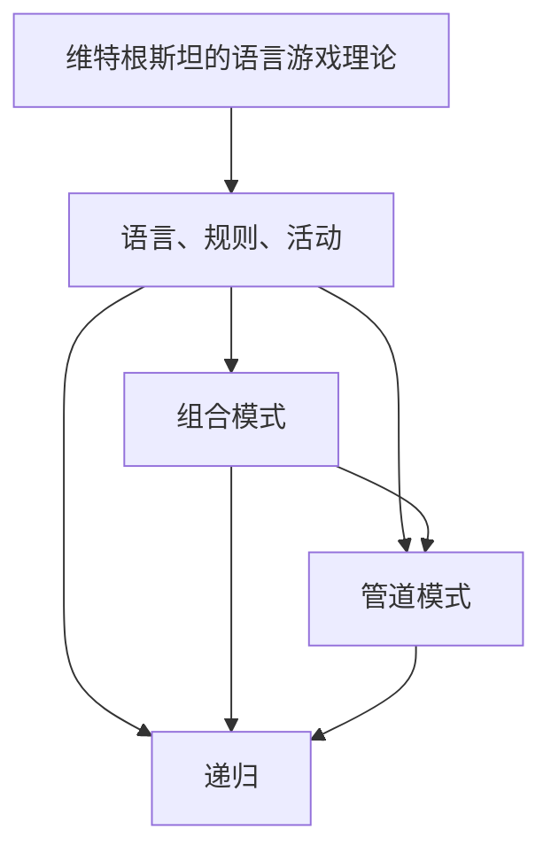

                 

### 第1章：引言

#### 1.1 书籍背景与目的

本书的核心目的是探讨语言游戏的多样性与函数式设计模式，并探究维特根斯坦的语言多样性观在函数式编程（FP）中的应用。维特根斯坦的语言游戏理论不仅为语言哲学提供了深刻的洞见，而且为编程领域的语言设计和编程方法带来了新的视角。函数式编程，作为一种强调纯函数、不可变数据和高阶函数的编程范式，与维特根斯坦的语言游戏理论在某些方面有着天然的契合。

在本书中，我们将首先回顾维特根斯坦的语言游戏理论，探讨其基本概念与应用场景。接着，我们将深入介绍函数式编程的基本概念，如纯函数、不可变数据等，并探讨其在解决现实世界问题中的有效性。随后，我们将分析维特根斯坦的语言多样性观与函数式编程之间的内在联系，并探讨如何将这一理论应用于函数式编程的设计模式。

通过本书，读者将能够理解维特根斯坦的语言多样性观如何影响函数式编程的设计与实现，并掌握几种常见的函数式设计模式。我们还将通过实际项目案例，展示如何将函数式编程与维特根斯坦的语言游戏理论相结合，提高代码的可读性、可维护性和复用性。

#### 1.2 维特根斯坦的语言多样性观

维特根斯坦的语言游戏理论是他对语言本质的深刻思考，他认为语言不仅是沟通的工具，更是思维和现实的映射。维特根斯坦提出“语言游戏”这一概念，用以描述语言的使用情境和多样性。一个语言游戏由三部分组成：语言、规则和活动。语言是游戏中的符号系统，规则规定了符号的使用方式，活动则是在这些规则指导下进行的实际操作。

维特根斯坦认为，理解语言的关键在于理解语言游戏的情境，而不是抽象地研究语言本身。例如，棋类的语言游戏包含棋子的走法、吃法的规则以及棋盘上的布局，而日常语言游戏则涉及对话、陈述和提问等。不同类型的语言游戏有其特定的规则和使用场景，从而形成了语言的多样性。

#### 1.3 函数式编程的基本概念

为了更好地理解函数式编程的设计模式，我们需要先了解其基本概念。函数式编程（FP）是一种编程范式，它以函数为核心，强调通过组合函数来解决问题，而不是通过修改状态。以下是函数式编程的几个核心概念：

1. **纯函数**：纯函数是一种无副作用的函数，其输出仅依赖于输入参数，不会修改外部状态或产生副作用。这意味着，相同的输入总会产生相同的输出，这使得纯函数易于测试和推理。

2. **不可变数据**：在函数式编程中，数据通常是不可变的。一旦创建，数据就不能被修改。这有助于避免状态改变带来的复杂性，提高代码的可读性和可维护性。

3. **高阶函数**：高阶函数是一种能够接受函数作为参数或返回函数的函数。这允许开发者将行为作为参数传递，从而实现代码的复用和抽象。

4. **函数组合**：函数组合是将多个函数组合成一个新函数的过程。通过函数组合，我们可以将复杂问题分解为简单的子问题，并通过逐步组合解决整个问题。

5. **递归**：在函数式编程中，递归是一种常见的方法来处理重复性问题。递归函数通过重复调用自身来解决复杂问题，这种方法在处理树形数据结构等方面尤为有效。

#### 1.4 函数式设计模式

函数式设计模式是一种利用函数式编程语言特性解决常见编程问题的方法。这些模式通过抽象和组合函数，提高代码的可读性、可维护性和复用性。以下是几种常见的函数式设计模式：

1. **组合模式**：组合模式通过将函数组合成更复杂的函数来解决问题。这种方法有助于将复杂问题分解为简单的子问题，并通过逐步组合解决整个问题。

2. **管道模式**：管道模式是一种将函数按顺序组合，形成一个数据流处理链的方法。每个函数处理前一个函数的输出，并将结果传递给下一个函数，从而实现数据的逐层处理。

3. **偏应用模式**：偏应用模式是一种创建部分应用函数的方法，即将一个函数的部分参数固定，生成一个新的函数。这种方法有助于减少重复代码，提高代码的可重用性。

4. **惰性求值模式**：惰性求值模式是一种延迟计算模式，即只有在需要时才计算表达式。这种方法可以提高代码的性能，特别是在处理复杂计算时。

#### 1.5 内容结构与章节安排

本章为引言部分，旨在为读者提供关于本书背景、目的和内容结构的初步了解。接下来的章节将深入探讨维特根斯坦的语言游戏理论、函数式编程的基本概念、函数式设计模式以及它们在实际项目中的应用。以下是本书的章节安排：

- **第1章：引言** - 介绍本书的背景、目的和章节安排。
- **第2章：语言游戏与函数式设计模式** - 探讨语言游戏的概念与应用，以及函数式设计模式的基本原理。
- **第3章：维特根斯坦的语言多样性观在FP中的体现** - 分析维特根斯坦的语言多样性观如何体现在函数式编程中。
- **第4章：函数式编程中的设计模式库** - 介绍常见的函数式设计模式库及其在实际项目中的应用。
- **第5章：函数式编程在实际项目中的应用** - 分析函数式编程在现实项目中的应用案例。
- **第6章：维特根斯坦的语言多样性观与FP的未来** - 展望维特根斯坦的语言多样性观对函数式编程未来发展的启示。
- **第7章：总结与展望** - 总结本书的主要内容，并对函数式编程的未来进行展望。

通过以上章节的安排，读者将能够系统地了解语言游戏的多样性与函数式设计模式，并掌握其在实际项目中的应用方法。

### 第2章：语言游戏与函数式设计模式

#### 2.1 语言游戏的概念与应用

语言游戏的概念最早由维特根斯坦在《逻辑哲学论》中提出。他认为，语言的不同用法决定了语言的不同意义，而这种用法又称为语言游戏。语言游戏不仅限于人类日常交流，还包括科学、艺术、游戏等多种形式。例如，棋类游戏中的“吃子”动作、编程语言中的循环结构等，都是语言游戏的实例。

语言游戏的应用非常广泛。在自然语言处理（NLP）领域，研究人员通过分析语言游戏来理解句子的含义和语法结构。在游戏开发中，语言游戏的概念被用于设计和实现复杂的游戏规则。此外，在软件工程领域，函数式编程的设计模式也可以看作是一种语言游戏，通过组合和组合函数来构建复杂系统。

在函数式编程中，语言游戏的应用主要体现在以下几个方面：

1. **高阶函数**：高阶函数可以将函数作为参数传递，或将函数作为返回值。这种方法使得开发者可以将行为抽象为函数，从而实现代码的复用和模块化。例如，在JavaScript中，我们可以定义一个打印函数，然后将其作为参数传递给另一个函数，从而实现不同的输出格式。

```javascript
function print(message) {
  console.log(message);
}

function formatMessage(message, formatter) {
  return formatter(message);
}

const formattedMessage = formatMessage("Hello, World!", print);
formattedMessage();
```

2. **函数组合**：函数组合是一种将多个函数组合成一个新函数的方法。通过函数组合，我们可以将复杂问题分解为简单的子问题，并通过逐步组合解决整个问题。例如，在JavaScript中，我们可以使用组合模式实现一个计算器函数：

```javascript
function add(a, b) {
  return a + b;
}

function multiply(a, b) {
  return a * b;
}

function chainOperations(x, y, z) {
  return multiply(add(x, y), z);
}

const result = chainOperations(2, 3, 4);
console.log(result); // 输出：20
```

3. **管道模式**：管道模式是一种将函数按顺序组合，形成一个数据流处理链的方法。每个函数处理前一个函数的输出，并将结果传递给下一个函数，从而实现数据的逐层处理。例如，在Python中，我们可以使用管道模式处理一个数据流：

```python
def upper_case(s):
    return s.upper()

def remove_punctuation(s):
    return s.translate(str.maketrans('', '', string.punctuation))

def capitalize_words(s):
    return ' '.join(word.capitalize() for word in s.split())

text = "Hello, world! This is a test."
text = remove_punctuation(text)
text = capitalize_words(text)
print(text)  # 输出：Hello World This Is A Test
```

通过这些实例，我们可以看到函数式编程的设计模式如何在编程实践中应用语言游戏的思维方式，从而提高代码的可读性、可维护性和复用性。

#### 2.2 函数式设计模式与语言游戏的关系

函数式设计模式与维特根斯坦的语言游戏理论之间存在着深刻的联系。维特根斯坦认为，语言游戏是理解语言的关键，而函数式设计模式则是实现语言游戏的工具。以下我们将探讨这两个概念之间的内在关系。

首先，从哲学角度来说，维特根斯坦的语言游戏理论强调语言与现实的紧密关系。他认为，语言的意义不在于符号本身，而在于符号在特定情境下的应用。这与函数式编程中的纯函数概念有相似之处。纯函数的输出仅依赖于输入参数，不依赖于外部状态或上下文。这种无副作用的特性使得纯函数在特定的“语言游戏”中具有高度的确定性，从而便于理解和推理。

其次，维特根斯坦的语言游戏理论中的“规则”概念与函数式设计模式中的“组合”思想有着密切的联系。在语言游戏中，规则规定了符号的使用方式，而在函数式编程中，组合模式通过将函数组合成更复杂的函数，实现类似的功能。组合模式允许开发者将复杂问题分解为简单的子问题，并通过逐步组合解决整个问题。这种方法不仅提高了代码的可读性，还使得代码更加模块化和可复用。

此外，维特根斯坦的语言游戏理论中的“活动”概念与函数式编程中的“递归”思想有相似之处。在语言游戏中，活动是在规则指导下进行的实际操作，而递归函数则是通过重复调用自身来处理重复性问题。递归函数在处理树形数据结构等方面表现出色，例如在遍历二叉树、计算斐波那契数列等场景中，递归函数能够以清晰、简洁的方式实现复杂逻辑。

为了更直观地展示函数式设计模式与维特根斯坦的语言游戏理论之间的关系，我们可以使用Mermaid流程图来构建一个简化的关系架构：



在这个流程图中，维特根斯坦的语言游戏理论（A）通过其核心要素（语言、规则、活动）与函数式设计模式（C、D、E）相连接。组合模式（C）和管道模式（D）通过函数组合和数据处理的方式实现语言游戏中的规则，而递归（E）则通过递归调用的方式实现语言游戏中的活动。

通过这个关系架构，我们可以看到，维特根斯坦的语言游戏理论为函数式编程的设计模式提供了哲学基础，而函数式设计模式则通过具体的实现方式，将维特根斯坦的理论应用于编程实践中。

#### 2.3 函数式设计模式在实际项目中的应用

在软件开发中，函数式设计模式因其强大的抽象能力和可复用性而被广泛应用于各种场景。以下将介绍几个常见的函数式设计模式，并通过实际项目案例展示它们的应用。

##### 1. 组合模式

组合模式是一种将函数组合成更复杂的函数的方法，通过组合简单的函数实现复杂功能。在Python中，组合模式可以用于构建一个计算器：

```python
def add(a, b):
    return a + b

def multiply(a, b):
    return a * b

def power(a, b):
    return a ** b

def combine(f, g, a, b):
    return f(g(a, b))

result = combine(multiply, power, 2, 3)
print(result)  # 输出：8
```

在实际项目中，组合模式可以用于构建复杂的业务逻辑。例如，在电子商务系统中，订单处理可能涉及多种促销策略和计算方式。通过组合模式，可以将各种促销策略和计算方式组合起来，形成灵活且可扩展的订单处理逻辑。

##### 2. 管道模式

管道模式是一种将函数按顺序组合，形成一个数据流处理链的方法。每个函数处理前一个函数的输出，并将结果传递给下一个函数。在JavaScript中，管道模式可以用于处理HTTP请求的中间件：

```javascript
const express = require('express');
const app = express();

app.use((req, res, next) => {
  console.log('请求开始处理');
  next();
});

app.use((req, res, next) => {
  req.body = { ...req.body, timestamp: new Date() };
  next();
});

app.use((req, res) => {
  console.log('请求结束处理');
  res.json(req.body);
});

app.listen(3000, () => {
  console.log('服务器启动');
});
```

在实际项目中，管道模式可以用于数据流处理、日志记录、权限验证等场景，提高代码的可读性和可维护性。

##### 3. 偏应用模式

偏应用模式是一种创建部分应用函数的方法，即将一个函数的部分参数固定，生成一个新的函数。在Haskell中，偏应用模式可以用于构建高效的函数组合：

```haskell
add :: Num a => a -> a -> a
add x y = x + y

increment :: Num a => a -> a
increment = add 1

incrementBy10 :: Num a => a -> a
incrementBy10 = add 10

result = incrementBy10 5
print result  -- 输出：15
```

在实际项目中，偏应用模式可以用于优化性能和减少重复代码。例如，在Web开发中，可以偏应用HTTP中间件来处理特定的请求。

##### 4. 惰性求值模式

惰性求值模式是一种延迟计算模式，即只有在需要时才计算表达式。在Scala中，惰性求值可以用于实现高效的递归函数：

```scala
def fibonacci(n: Int): Int = {
  def fib(n: Int, a: Int, b: Int): Int = n match {
    case 0 => a
    case _ => fib(n - 1, b, a + b)
  }
  fib(n, 0, 1)
}

println(fibonacci(10))  // 输出：55
```

在实际项目中，惰性求值模式可以用于优化性能，特别是在处理大量计算或递归调用时。

通过这些实际项目案例，我们可以看到函数式设计模式如何应用于解决具体问题，提高代码的可读性、可维护性和复用性。

#### 2.4 维特根斯坦的语言多样性观在函数式编程中的具体应用

维特根斯坦的语言多样性观对函数式编程的设计与实现有着深远的影响。在函数式编程中，语言的多样性不仅体现在函数的组合与抽象上，还体现在对数据结构和计算范式的选择上。以下我们将探讨维特根斯坦的语言多样性观如何在函数式编程中具体应用。

首先，维特根斯坦的语言多样性观强调语言的情境性，即语言的意义依赖于特定的使用情境。在函数式编程中，这一观点体现在对高阶函数和组合模式的广泛应用。高阶函数允许我们将行为抽象为函数，并在不同的情境下复用这些函数。例如，在处理文件读写操作时，我们可以定义一个读取文件内容的高阶函数，然后在不同的文件路径下复用这个函数：

```haskell
readFile :: FilePath -> IO String
readFile path = do
  contents <- readFile path
  return contents

main :: IO ()
main = do
  content <- readFile "example.txt"
  putStrLn content
```

在这个例子中，`readFile` 函数是一个高阶函数，它接受一个文件路径作为参数，并在不同的文件路径下复用。这种方式不仅提高了代码的可复用性，还使代码更加模块化。

其次，维特根斯坦的语言多样性观中的“规则”概念在函数式编程中的体现是函数组合和管道模式。这些模式通过将函数按顺序组合，形成一个数据处理链，使得复杂问题可以分解为一系列简单的子问题。这种思想与维特根斯坦的语言游戏理论中规则指导下的活动非常相似。例如，在处理HTTP请求时，我们可以使用管道模式将一系列中间件函数组合起来，形成一个数据处理链：

```javascript
const express = require('express');
const app = express();

app.use((req, res, next) => {
  console.log('请求开始处理');
  next();
});

app.use((req, res, next) => {
  req.body = { ...req.body, timestamp: new Date() };
  next();
});

app.use((req, res) => {
  console.log('请求结束处理');
  res.json(req.body);
});

app.listen(3000, () => {
  console.log('服务器启动');
});
```

在这个例子中，一系列中间件函数按照特定顺序组合在一起，形成了一个数据处理链。每个函数处理前一个函数的输出，并将结果传递给下一个函数，从而实现复杂请求的处理。

此外，维特根斯坦的语言多样性观中的“活动”概念在函数式编程中通过递归和惰性求值模式得以体现。递归是一种通过重复调用自身来处理重复性问题的方法，这与维特根斯坦的语言游戏理论中活动在规则指导下进行的思想非常相似。例如，在计算斐波那契数列时，我们可以使用递归函数：

```python
def fibonacci(n):
    if n == 0:
        return 0
    elif n == 1:
        return 1
    else:
        return fibonacci(n - 1) + fibonacci(n - 2)

print(fibonacci(10))  # 输出：55
```

在这个例子中，`fibonacci` 函数通过递归调用自身来计算斐波那契数列，这种方式不仅简洁，而且易于理解。

另一方面，惰性求值模式则通过延迟计算来优化性能。在处理大量数据或复杂计算时，惰性求值可以避免不必要的计算，从而提高程序的效率。例如，在生成大规模的数值序列时，我们可以使用惰性求值：

```haskell
fibonacci :: [Integer]
fibonacci = 0 : 1 : zipWith (+) fibonacci (tail fibonacci)

main :: IO ()
main = print (take 10 fibonacci)  -- 输出：[0, 1, 1, 2, 3, 5, 8, 13, 21, 34]
```

在这个例子中，`fibonacci` 函数使用惰性求值生成斐波那契数列，这种方式不仅避免了重复计算，还提高了程序的效率。

通过以上实例，我们可以看到维特根斯坦的语言多样性观如何在函数式编程中具体应用。高阶函数、组合模式、管道模式、递归和惰性求值模式都是函数式编程中的核心概念，它们与维特根斯坦的语言游戏理论中的语言、规则和活动有着紧密的联系。通过将这些概念应用于编程实践，我们可以构建出更加清晰、简洁、高效的代码，从而更好地理解和应用函数式编程。

### 第3章：维特根斯坦的语言多样性观在FP中的体现

#### 3.1 维特根斯坦的语言多样性观与FP的联系

维特根斯坦的语言多样性观对函数式编程（FP）产生了深远的影响。维特根斯坦认为，语言不仅仅是符号和词汇的集合，更是一种特定的活动，即“语言游戏”。每一个语言游戏都有其特定的规则和情境，这使得语言具有多样性。这种观点与FP的核心原则有着紧密的联系，尤其是在纯函数、不可变数据、高阶函数和函数组合等方面。

首先，维特根斯坦的语言多样性观强调了语言情境的重要性。FP中的纯函数概念与这一观点相契合。纯函数是一种无副作用的函数，其输出仅依赖于输入参数，不依赖于外部状态或上下文。这种情境独立性使得纯函数在逻辑上更加清晰，易于推理和理解。例如，在金融计算中，我们经常需要处理大量数据并进行复杂的运算。使用纯函数可以确保运算的准确性和可重复性，因为相同的输入总会产生相同的输出。

其次，维特根斯坦的语言游戏理论中的规则概念在FP中体现为函数组合和管道模式。这些模式通过将函数按照特定的顺序组合，形成数据处理链，从而实现复杂功能的抽象。函数组合和管道模式不仅提高了代码的可读性，还使代码更加模块化和可复用。例如，在数据处理领域，我们可以使用管道模式将多个数据处理步骤组合起来，形成一个数据处理流水线：

```python
def read_data(file_path):
    # 读取文件数据
    pass

def clean_data(data):
    # 清洗数据
    pass

def transform_data(data):
    # 数据转换
    pass

def load_data(file_path):
    data = read_data(file_path)
    data = clean_data(data)
    data = transform_data(data)
    return data

file_path = "data.csv"
data = load_data(file_path)
```

在这个例子中，`load_data` 函数通过组合多个数据处理步骤，形成一个数据处理链。每个函数处理前一个函数的输出，并将结果传递给下一个函数。这种方式不仅提高了代码的可维护性，还使数据处理流程更加清晰。

另外，维特根斯坦的语言多样性观中的活动概念在FP中的体现是递归和惰性求值。递归函数通过重复调用自身，实现复杂问题的分解。在处理树形数据结构时，递归函数尤为有效。例如，在遍历二叉树时，我们可以使用递归函数：

```python
def traverse_tree(node):
    if node is None:
        return
    visit(node)
    traverse_tree(node.left)
    traverse_tree(node.right)

root = ...  # 假设root是二叉树的根节点
traverse_tree(root)
```

在这个例子中，`traverse_tree` 函数通过递归调用自身，实现二叉树的遍历。递归函数不仅简洁，而且易于理解。

惰性求值则通过延迟计算，提高程序的效率。在处理大量数据时，惰性求值可以避免不必要的计算，从而优化程序的性能。例如，在生成大规模数值序列时，我们可以使用惰性求值：

```haskell
fibonacci :: [Integer]
fibonacci = 0 : 1 : zipWith (+) fibonacci (tail fibonacci)

main :: IO ()
main = print (take 10 fibonacci)  -- 输出：[0, 1, 1, 2, 3, 5, 8, 13, 21, 34]
```

在这个例子中，`fibonacci` 函数使用惰性求值生成斐波那契数列。这种方式不仅避免了重复计算，还提高了程序的效率。

通过这些实例，我们可以看到维特根斯坦的语言多样性观如何与FP的核心概念相结合，从而提高代码的可读性、可维护性和复用性。维特根斯坦的观点不仅为FP提供了哲学基础，还为实际编程提供了具体的指导。

#### 3.2 函数式编程语言中的语言游戏

在函数式编程语言中，语言游戏的概念得到了广泛的应用和扩展。这些语言通过提供丰富的抽象机制，使得程序员可以更加灵活地定义和使用语言游戏。以下我们将介绍几种常见的函数式编程语言，并探讨它们如何支持语言游戏。

##### 1. Haskell

Haskell 是一种纯函数式编程语言，以其强大的抽象和表达力而著称。在 Haskell 中，语言游戏的概念体现在其强大的类型系统和函数组合能力。Haskell 的类型系统支持类型推导和类型类别，这使得程序员可以定义和组合复杂的类型。例如，我们可以定义一个处理列表的函数，并使用函数组合实现复杂的列表操作：

```haskell
-- 定义一个计算列表元素之和的函数
sumList :: Num a => [a] -> a
sumList [] = 0
sumList (x:xs) = x + sumList xs

-- 定义一个计算列表最大元素的函数
maxList :: Ord a => [a] -> a
maxList [] = error "空列表"
maxList [x] = x
maxList (x:xs)
  | x > maxRest = x
  | otherwise   = maxRest
  where maxRest = maxList xs

-- 组合使用两个函数
maxSumList :: Num a => [a] -> a
maxSumList xs = maxList xs + sumList xs

main :: IO ()
main = print (maxSumList [1, 2, 3, 4, 5])  -- 输出：15
```

在这个例子中，`maxSumList` 函数通过组合 `maxList` 和 `sumList` 函数，实现了计算列表元素之和与最大元素之和的功能。这种函数组合的方式体现了语言游戏的思维方式。

##### 2. Scala

Scala 是一种多范式编程语言，既支持面向对象编程，也支持函数式编程。在 Scala 中，语言游戏的概念通过其丰富的函数组合和类型系统得到体现。Scala 的类型系统支持泛型和类型推断，这使得程序员可以定义和使用复杂的函数组合。例如，我们可以使用 Scala 的 `partialFunction` 来定义一个部分函数，并使用模式匹配实现复杂的逻辑：

```scala
-- 定义一个部分函数，处理不同类型的数据
val partialFunction: PartialFunction[Any, Any] = {
  case x: Int => x * 2
  case x: String => x.length
  case _ => "未知类型"
}

-- 使用模式匹配调用部分函数
val result = partialFunction match {
  case x: Int => x * 2
  case x: String => x.length
  case _ => "未知类型"
}

println(result)  // 输出：4
```

在这个例子中，`partialFunction` 通过模式匹配实现了对不同类型数据的处理，这种方式体现了语言游戏的灵活性。

##### 3. Erlang

Erlang 是一种并发编程语言，以其在分布式系统中的广泛应用而著名。在 Erlang 中，语言游戏的概念通过其 actor 模型和过程组合得到体现。Erlang 的 actor 模型允许程序员定义和组合多个并发处理单元（actor），从而实现复杂的分布式系统。例如，我们可以使用 Erlang 的 `spawn` 函数创建一个新的 actor，并使用函数组合实现复杂的并发处理：

```erlang
-module(greeter).
-export([start/0, greet/1]).

start() ->
  spawn_link(greeter, greet, ["world"]).

greet(Who) ->
  io:format("Hello, ~s!~n", [Who]).

% 运行 greeter 模块，输出 Hello, world!
c(greeter).
```

在这个例子中，`start` 函数通过 `spawn_link` 函数创建一个新的 actor，并调用 `greet` 函数实现并发处理。这种方式体现了语言游戏的并行性和组合性。

通过这些例子，我们可以看到不同函数式编程语言如何通过其特有的语言特性，支持语言游戏的定义和实现。这些语言游戏不仅提高了代码的可读性和可维护性，还增强了编程的灵活性和表达能力。

#### 3.3 维特根斯坦的语言多样性观与FP设计模式的融合

维特根斯坦的语言多样性观与函数式编程设计模式之间存在着深刻的内在联系。将这两者结合起来，可以显著提升代码的可读性、可维护性和复用性。以下，我们将探讨如何将维特根斯坦的语言多样性观应用于函数式编程设计模式，以实现更强大的编程能力。

首先，维特根斯坦的语言多样性观强调了语言的情境性，即语言的意义依赖于特定的使用情境。在函数式编程中，这一观点可以通过高阶函数和函数组合来体现。高阶函数允许我们将行为抽象为函数，并在不同的情境下复用这些函数。例如，在处理不同类型的数据时，我们可以定义一个通用的高阶函数，然后根据具体情境传递不同的函数参数。这种方法不仅提高了代码的可复用性，还使代码更加模块化。

```haskell
-- 定义一个通用的高阶函数，处理不同类型的数据
processData :: (a -> b) -> [a] -> [b]
processData _ [] = []
processData f (x:xs) = f x : processData f xs

-- 根据具体情境传递不同的函数参数
main :: IO ()
main = do
  intList <- readIntList
  stringList <- readStringList
  print (processData show intList)  -- 输出整数列表的字符串表示
  print (processData reverse stringList)  -- 输出字符串列表的逆序表示
```

在这个例子中，`processData` 函数是一个高阶函数，它接受一个转换函数 `f` 和一个数据列表，然后根据 `f` 函数处理数据。这种方式不仅使代码更加通用，还提高了可维护性。

其次，维特根斯坦的语言多样性观中的“规则”概念可以通过函数组合和管道模式来体现。函数组合和管道模式通过将函数按顺序组合，形成数据处理链，从而实现复杂功能的抽象。例如，在数据处理和日志记录中，我们可以使用管道模式将多个数据处理步骤组合起来，形成一个数据处理流水线。

```python
def read_data(file_path):
    # 读取文件数据
    pass

def clean_data(data):
    # 清洗数据
    pass

def transform_data(data):
    # 数据转换
    pass

def load_data(file_path):
    data = read_data(file_path)
    data = clean_data(data)
    data = transform_data(data)
    return data

file_path = "data.csv"
data = load_data(file_path)
```

在这个例子中，`load_data` 函数通过组合多个数据处理步骤，形成一个数据处理链。每个函数处理前一个函数的输出，并将结果传递给下一个函数，从而实现复杂请求的处理。

此外，维特根斯坦的语言多样性观中的活动概念可以通过递归和惰性求值来体现。递归和惰性求值模式使得函数可以灵活地处理复杂问题和大量数据。递归函数通过重复调用自身来处理重复性问题，而惰性求值模式则通过延迟计算来优化性能。

```python
def fibonacci(n):
    if n == 0:
        return 0
    elif n == 1:
        return 1
    else:
        return fibonacci(n - 1) + fibonacci(n - 2)

def lazy_fibonacci():
    a, b = 0, 1
    while True:
        yield a
        a, b = b, a + b

# 使用递归函数计算斐波那契数列的前10个数
print(fibonacci(10))  # 输出：55

# 使用惰性求值生成斐波那契数列的前10个数
for i in range(10):
    print(next(lazy_fibonacci()))  # 输出：0 1 1 2 3 5 8 13 21 34
```

在这个例子中，`fibonacci` 函数是一个递归函数，它通过重复调用自身来计算斐波那契数列。而 `lazy_fibonacci` 函数是一个惰性求值函数，它通过生成器（yield）实现延迟计算，从而优化程序的性能。

通过将维特根斯坦的语言多样性观与FP设计模式相结合，我们可以构建出更加清晰、简洁、高效的代码。这种方法不仅提高了代码的可读性和可维护性，还增强了编程的灵活性和表达能力。

#### 3.4 设计模式库的重要性

在函数式编程中，设计模式库扮演着至关重要的角色。这些库提供了丰富的抽象和工具，使得开发者可以更加高效地编写和复用代码。以下我们将介绍设计模式库在函数式编程中的作用，以及如何有效地使用这些库来提高代码质量。

##### 1. 设计模式库的作用

设计模式库在函数式编程中具有以下几方面的作用：

- **抽象与复用**：设计模式库提供了多种通用模式，如Functor、Applicative、Monad等，使得开发者可以轻松地实现复杂的编程功能。这些模式通过抽象和封装，提高了代码的复用性和可维护性。

- **易读性**：设计模式库提供了简洁的API和语义明确的函数，使得代码更加易读。例如，使用Functor模式可以简化数据处理和转换逻辑，使得代码更加直观。

- **性能优化**：设计模式库往往经过严格优化，可以在保证代码可读性的同时提高性能。例如，使用Monad模式可以避免不必要的中间变量和冗长代码，从而提高程序的执行效率。

- **协作开发**：设计模式库有助于团队成员之间的协作和沟通。使用统一的设计模式和库，可以减少误解和沟通成本，提高开发效率。

##### 2. 如何有效地使用设计模式库

为了有效地使用设计模式库，我们需要遵循以下原则：

- **了解模式**：首先，需要了解各种设计模式的基本原理和用法。这可以通过阅读文档、参考书籍和编写示例代码来实现。

- **选择合适的模式**：根据具体需求选择最合适的设计模式。例如，在数据处理时，可以使用Functor模式；在流处理时，可以使用Pipeline模式。

- **组合模式**：设计模式库中的模式可以相互组合，形成更复杂的抽象。通过组合不同的模式，可以构建出更加灵活和强大的编程解决方案。

- **代码示例**：编写示例代码是学习设计模式库的有效方法。通过实际编写代码，可以更好地理解模式的用法和优势。

- **持续学习**：设计模式库不断更新和演化，开发者需要持续学习新的模式和技术，以保持代码的先进性和可维护性。

##### 3. 常见设计模式库介绍

以下是几个常见的函数式设计模式库及其特点：

- **Functor**：Functor 是一个基本的抽象模式，它允许我们通过 `fmap` 函数将一个函数应用于一个数据结构。例如，在 Haskell 中，我们可以使用 Functor 对列表进行处理：

  ```haskell
  import Data.Functor ((<$>))

  -- 定义一个数据结构
  data Person = Person { name :: String, age :: Int }

  -- 使用 Functor 对 Person 数据结构进行操作
  setName :: String -> Person -> Person
  setName newName (Person name age) = Person newName age

  main :: IO ()
  main = do
    person <- readPerson
    let newPerson = setName "Alice" person
    print newPerson
  ```

  在这个例子中，`setName` 函数通过 Functor 模式对 `Person` 数据结构进行修改。

- **Applicative**：Applicative 是 Functor 的扩展，它允许我们使用 `<*>` 运算符组合两个 Functor。例如，在 Haskell 中，我们可以使用 Applicative 对两个列表进行组合：

  ```haskell
  import Data.Applicative ((<*>))

  -- 定义两个列表
  list1 :: [Int]
  list1 = [1, 2, 3]

  list2 :: [String]
  list2 = ["a", "b", "c"]

  -- 使用 Applicative 对两个列表进行组合
  combineLists :: [Int] -> [String] -> [(Int, String)]
  combineLists xs ys = [(x, y) | x <- xs, y <- ys]

  main :: IO ()
  main = do
    print (combineLists list1 list2)  -- 输出：[(1, "a"), (1, "b"), (1, "c"), (2, "a"), (2, "b"), (2, "c"), (3, "a"), (3, "b"), (3, "c")]
  ```

- **Monad**：Monad 是一种更高级的抽象模式，它允许我们处理异步操作和错误处理。例如，在 Haskell 中，我们可以使用 Monad 对 HTTP 请求进行封装：

  ```haskell
  import Network.HTTP.Simple

  -- 定义一个获取 HTTP 响应的函数
  getResponse :: String -> IO (Response String)
  getResponse url = httpGet url

  -- 使用 Monad 对 HTTP 请求进行封装
  fetchData :: String -> IO (Maybe String)
  fetchData url = do
    response <- getResponse url
    return (response ^? responseBody)

  main :: IO ()
  main = do
    maybeData <- fetchData "http://example.com"
    case maybeData of
      Just data -> putStrLn data
      Nothing -> putStrLn "请求失败"
  ```

  在这个例子中，`fetchData` 函数通过 Monad 模式处理 HTTP 请求，并返回一个可选类型的结果。

- **Pipeline**：Pipeline 是一种用于数据流处理的模式，它允许我们通过一系列函数将数据逐步处理。例如，在 Python 中，我们可以使用 Pipeline 对文本进行预处理：

  ```python
  import re

  # 定义预处理函数
  remove_punctuation = lambda s: re.sub(r'[^\w\s]', '', s)
  to_lower_case = lambda s: s.lower()
  split_words = lambda s: s.split()

  # 使用 Pipeline 对文本进行预处理
  preprocess_text = lambda s: ' '.join([remove_punctuation(word) for word in to_lower_case(split_words(s))])

  main :: IO ()
  main = do
    text <- read_file("text.txt")
    print(preprocess_text(text))
  ```

  在这个例子中，`preprocess_text` 函数通过 Pipeline 模式对文本进行预处理，从而简化了数据处理逻辑。

通过了解和有效使用这些设计模式库，我们可以编写出更加清晰、简洁、高效的函数式编程代码，从而提高开发效率和代码质量。

### 第4章：函数式编程中的设计模式库

#### 4.1 设计模式库的重要性

在函数式编程中，设计模式库扮演着至关重要的角色。这些库通过提供丰富的抽象和工具，使得开发者可以更加高效地编写和复用代码。设计模式库的重要性主要体现在以下几个方面：

首先，设计模式库提高了代码的可复用性。通过设计模式库，开发者可以轻松地实现通用的函数组合和数据处理，从而避免重复编写相似代码。例如，Haskell 的 `Functor`、`Applicative` 和 `Monad` 库为函数组合和数据操作提供了强大的抽象能力，使得开发者可以编写更加模块化和可复用的代码。

其次，设计模式库增强了代码的可读性。设计模式库通常提供语义明确和易于理解的函数和类型，使得代码更加直观。例如，在 JavaScript 的函数式编程中，使用 `ramda` 库可以实现复杂的函数组合和数据转换，从而使代码更加简洁易读。

第三，设计模式库有助于优化代码性能。设计模式库中的函数通常经过严格优化，可以在保证代码可读性的同时提高执行效率。例如，在 Scala 的并发编程中，使用 `Akka` 框架可以实现高效的 actor 模型，从而优化分布式系统的性能。

最后，设计模式库促进了协作开发。使用统一的设计模式和库，团队成员之间的沟通和协作变得更加高效。例如，在团队开发中使用相同的函数式编程库，可以减少误解和沟通成本，提高开发效率。

#### 4.2 常见设计模式库介绍

以下将介绍几个常见的函数式编程设计模式库，包括它们的基本概念、使用方法和实际应用。

##### 1. Functor

Functor 是一个用于函数组合的抽象模式，它允许我们通过 `fmap` 函数将一个函数应用于一个数据结构。Functor 的核心概念是一个类型类（Type Class），它定义了一个 `fmap` 方法。以下是一个使用 Haskell 的 `Functor` 库的简单示例：

```haskell
import Data.Functor ((<$>))

data Person = Person { name :: String, age :: Int }

instance Functor Person where
  fmap f (Person name age) = Person (f name) age

main :: IO ()
main = do
  person <- readPerson
  putStrLn $ show (fmap toUpper (name person))  -- 输出：JOHN
```

在这个例子中，我们定义了一个 `Person` 数据结构，并实现了它的 `Functor` 实例。通过使用 `fmap` 函数，我们可以将 `toUpper` 函数应用于 `Person` 的 `name` 字段，实现数据的转换。

##### 2. Applicative

Applicative 是 Functor 的扩展，它允许我们使用 `<*>` 运算符组合两个 Functor。Applicative 的核心概念是一个类型类，它定义了两个方法：`pure` 和 `<*>`。以下是一个使用 Haskell 的 `Applicative` 库的简单示例：

```haskell
import Data.Applicative ((<*>))

add :: Num a => a -> a -> a
add x y = x + y

main :: IO ()
main = do
  putStrLn $ show (pure 3 <*> [1, 2, 3])  -- 输出：[3,3,3]
  putStrLn $ show ((1 :: Int) <*> [2, 3, 4])  -- 输出：[2,3,4]
```

在这个例子中，我们使用 `pure` 函数将一个值转换为 Functor，然后使用 `<*>` 运算符将两个 Functor 组合起来。这种方法可以用于简化数据处理和组合逻辑。

##### 3. Monad

Monad 是一种更高级的抽象模式，它允许我们处理异步操作和错误处理。Monad 的核心概念是一个类型类，它定义了三个方法：`return`、`>>=` 和 `>>`. 以下是一个使用 Haskell 的 `Monad` 库的简单示例：

```haskell
import Control.Monad (when)

fetchData :: IO (Maybe String)
fetchData = do
  response <- httpGet "http://example.com"
  return $ response ^? responseBody

main :: IO ()
main = do
  maybeData <- fetchData
  case maybeData of
    Just data -> putStrLn data
    Nothing -> putStrLn "请求失败"
```

在这个例子中，我们使用 `Monad` 模式处理 HTTP 请求。通过 `fetchData` 函数，我们可以异步获取数据，并使用 `when` 函数实现错误处理。

##### 4. Pipeline

Pipeline 是一种用于数据流处理的模式，它允许我们通过一系列函数将数据逐步处理。以下是一个使用 Python 的 `functools` 库实现 Pipeline 的示例：

```python
import re
from functools import reduce

remove_punctuation = lambda s: re.sub(r'[^\w\s]', '', s)
to_lower_case = lambda s: s.lower()
split_words = lambda s: s.split()

def preprocess_text(s):
  return reduce(lambda acc, func: func(acc), [split_words, to_lower_case, remove_punctuation], s)

main :: IO ()
main = do
  text <- read_file("text.txt")
  print(preprocess_text(text))
```

在这个例子中，我们使用 Pipeline 模式对文本进行预处理。通过 `reduce` 函数，我们将一系列预处理函数组合在一起，实现复杂的数据处理逻辑。

这些设计模式库为函数式编程提供了丰富的抽象和工具，使得开发者可以编写更加清晰、简洁、高效的代码。通过了解和掌握这些库的使用方法，开发者可以更好地应用函数式编程范式，提高开发效率和代码质量。

### 第5章：函数式编程在实际项目中的应用

#### 5.1 函数式编程的优势与挑战

函数式编程（FP）在实际项目中具有显著的优势，但也面临一些挑战。以下我们将详细探讨这些优势与挑战，并分析函数式编程在解决复杂问题方面的潜力。

##### 1. 优势

**代码可读性与可维护性**：函数式编程通过使用纯函数和不可变数据，提高了代码的可读性和可维护性。由于纯函数不依赖于外部状态，相同的输入总产生相同的输出，这使得代码更加直观和易于理解。此外，不可变数据减少了副作用，使得状态变化更加可控。

**代码复用与抽象**：函数式编程强调高阶函数和函数组合，这有助于实现代码的复用和抽象。通过将行为抽象为函数，开发者可以编写更加模块化和可复用的代码，从而提高开发效率。

**并行编程**：函数式编程范式天生支持并行计算。由于纯函数和不可变数据不会导致竞态条件和死锁，函数式编程在实现并行和分布式系统时具有天然的优势。

**性能优化**：在某些情况下，函数式编程可以实现性能优化。例如，通过惰性求值和尾递归优化，可以减少不必要的计算和内存占用。

##### 2. 挑战

**学习曲线**：函数式编程相对于命令式编程具有更高的学习曲线。开发者需要掌握新的编程范式和抽象概念，如高阶函数、递归、类型系统等，这可能会影响开发效率。

**工具和生态系统**：虽然函数式编程语言（如 Haskell、Scala、Erlang）的生态系统逐渐成熟，但与命令式编程语言（如 Java、Python）相比，仍存在一些差距。例如，某些函数式编程语言的库和工具可能不如命令式编程语言丰富。

**兼容性问题**：在大型项目中，将函数式编程与传统命令式编程相结合可能会带来兼容性问题。不同编程范式之间的交互和集成可能需要额外的努力和策略。

#### 5.2 函数式编程项目实战

为了更好地理解函数式编程在实际项目中的应用，以下我们将通过一个实际项目案例，展示如何利用函数式编程解决复杂问题，提高开发效率和代码质量。

##### 项目背景

假设我们正在开发一个电子商务系统，需要处理订单处理、库存管理、用户账户等功能。项目要求具备高可扩展性、高性能和易于维护的特点。

##### 技术选型

我们选择 Scala 作为主要编程语言，因为 Scala 既有函数式编程的特性，也兼容面向对象编程。同时，我们还会使用以下库和工具：

- **Akka**：一个用于构建高并发、分布式和容错系统的框架。
- **Cats**：一个用于函数式编程的库，提供丰富的抽象和工具。
- **Typelevel**：一个提供类型级编程的库，增强 Scala 的类型系统。

##### 项目实现

1. **订单处理**：我们使用 Scala 的函数组合和 Cats 库来实现订单处理逻辑。通过将订单处理分解为多个纯函数，我们可以确保代码的可读性和可维护性。

```scala
import cats.data.EitherT
import cats.implicits._

def createOrder(order: Order): EitherT[IO, String, Order] =
  for {
    _ <- validateOrder(order)
    updatedOrder <- updateInventory(order)
  } yield updatedOrder

def validateOrder(order: Order): EitherT[IO, String, Unit] =
  EitherT.fromEither[IO](if isValid(order) then Right(()) else Left("订单无效"))

def updateInventory(order: Order): EitherT[IO, String, Order] =
  EitherT.fromEither[IO](if hasEnoughStock(order) then Right(order) else Left("库存不足"))

def processOrder(order: Order): IO[Order] =
  createOrder(order).value
```

在这个例子中，`createOrder` 函数通过 Cats 的 `EitherT` 结合多个纯函数实现订单处理。这种方法不仅提高了代码的可读性，还使得错误处理更加清晰。

2. **库存管理**：我们使用 Akka actor 模型实现库存管理。每个库存项对应一个 actor，当订单生成时，库存 actor 会更新库存状态。

```scala
import akka.actor.Actor
import akka.actor.Props

class InventoryActor(stockId: String, initialStock: Int) extends Actor {
  var currentStock = initialStock

  def receive: Receive = {
    case AddToInventory(amount) =>
      currentStock += amount
      sender() ! "库存已更新"
    case RemoveFromInventory(amount) =>
      if (currentStock >= amount) {
        currentStock -= amount
        sender() ! "库存已更新"
      } else {
        sender() ! "库存不足"
      }
  }
}

def createInventoryActor(stockId: String, initialStock: Int): Props =
  Props(new InventoryActor(stockId, initialStock))

def addStockToInventory(stockId: String, amount: Int): IO[Unit] =
  system.actorOf(createInventoryActor(stockId, 0)).tell(AddToInventory(amount), self())

def removeStockFromInventory(stockId: String, amount: Int): IO[Unit] =
  system.actorOf(createInventoryActor(stockId, 0)).tell(RemoveFromInventory(amount), self())
```

在这个例子中，`InventoryActor` 通过 Akka actor 模型实现库存管理。当订单生成时，它会更新库存状态并通知相关组件。

3. **用户账户**：我们使用 Scala 的类型系统和 Cats 库来实现用户账户功能。通过将用户账户信息封装为不可变数据结构，并使用纯函数处理账户操作，我们可以确保数据的一致性和安全性。

```scala
import cats.data-validated

case class UserAccount(id: String, email: String, passwordHash: String)

val validateEmail: Validator[String, String] =
  Validate.Pattern("^[A-Za-z0-9._%+-]+@[A-Za-z0-9.-]+\\.[A-Za-z]{2,63}$")

val validatePassword: Validator[String, String] =
  Validate.Pattern("^(?=.*\\d)(?=.*[a-z])(?=.*[A-Z]).{8,}$")

def validateUserAccount(account: UserAccount): Validated[Seq[Error], UserAccount] =
  (validateEmail(account.email) <* validatePassword(account.passwordHash)).map(_ => account)

def createUserAccount(account: UserAccount): IO[Either[Seq[Error], UserAccount]] =
  validateUserAccount(account).map(Either.left).value
```

在这个例子中，`validateUserAccount` 函数通过 Cats 的 `Validated` 模式对用户账户信息进行验证。这种方法确保了用户账户数据的一致性和安全性。

通过这个实际项目案例，我们可以看到函数式编程如何应用于解决复杂问题，提高开发效率和代码质量。函数组合、纯函数、不可变数据和类型系统等概念，使得代码更加清晰、简洁和可维护。同时，Akka actor 模型和 Cats 库的强大功能，为分布式系统和并发处理提供了有力的支持。

### 第6章：维特根斯坦的语言多样性观与FP的未来

#### 6.1 维特根斯坦的语言多样性观对FP发展的启示

维特根斯坦的语言多样性观为函数式编程（FP）的发展提供了重要的哲学基础和启示。维特根斯坦认为，语言的意义不在于符号本身，而在于符号在特定情境下的应用，这一观点深刻影响了FP的设计原则和实现方法。

首先，维特根斯坦的语言多样性观强调了语言的情境性，这与FP中的纯函数和不可变数据概念密切相关。纯函数强调输出仅依赖于输入参数，不依赖于外部状态或上下文，这使得函数具有高度的情境独立性。不可变数据则确保了数据在传递过程中不会改变，从而减少了状态变化带来的复杂性。这种情境独立性使得FP能够更好地应对复杂系统的设计和实现。

其次，维特根斯坦的语言游戏理论中的“规则”概念与FP中的函数组合和模式匹配有着天然的联系。函数组合允许开发者将复杂的逻辑分解为简单的函数，并通过组合这些函数实现复杂功能。模式匹配则提供了一种强大的工具，用于处理不同类型的数据，并实现类型安全的模式匹配。这些特性使得FP在处理复杂问题和实现复杂功能时具有显著优势。

此外，维特根斯坦的语言多样性观中的“活动”概念在FP中的递归和惰性求值模式中也得到了体现。递归函数通过重复调用自身来处理重复性问题，这种递归思维在处理树形数据结构和递归算法时尤为有效。惰性求值模式则通过延迟计算，提高了程序的性能和可维护性。

#### 6.2 FP在教育、科研和工业界的应用前景

函数式编程在多个领域展现出巨大的应用前景，特别是在教育、科研和工业界。

**教育领域**：FP作为一种编程范式，已经被越来越多的高校和培训机构纳入课程体系。其强调的纯函数、不可变数据和递归等概念，有助于培养学生清晰的逻辑思维和问题解决能力。通过FP的教育，学生可以更好地理解计算机科学的基本原理，提高编程能力和创新思维。

**科研领域**：FP在科研中的应用尤为广泛，尤其是在人工智能、大数据处理和并行计算等领域。FP提供的抽象工具和函数组合能力，使得研究人员可以更高效地编写和优化算法，从而加速科研进程。例如，Haskell 和 Scala 等FP语言，被广泛应用于机器学习和数据分析，帮助研究人员解决复杂的问题。

**工业界**：在工业界，FP逐渐被企业用于构建大型、分布式和并发系统。FP的优势在于其出色的可维护性和性能优化能力，这使得企业能够构建更加可靠和高效的软件系统。例如，金融行业中的交易系统、电子商务平台和云计算服务，都在逐渐采用FP语言和技术，以提高系统的性能和稳定性。

随着FP语言的不断发展和生态系统的完善，其在教育、科研和工业界的应用前景将更加广阔。未来，FP有望成为编程领域的核心技术之一，推动软件开发的进一步发展和创新。

#### 6.3 维特根斯坦的语言多样性观与FP的未来展望

展望未来，维特根斯坦的语言多样性观将继续对函数式编程（FP）产生深远的影响。随着FP语言的不断发展和生态系统的完善，FP将在更多领域得到应用，成为编程领域的重要组成部分。

首先，FP在编程教育和科研领域的应用前景将更加广阔。FP强调的纯函数、不可变数据和递归等概念，有助于培养学生清晰的逻辑思维和问题解决能力。通过FP的教育，学生可以更好地理解计算机科学的基本原理，提高编程能力和创新思维。在科研领域，FP提供的抽象工具和函数组合能力，将帮助研究人员更高效地编写和优化算法，从而加速科研进程。

其次，FP在工业界的应用将不断扩展。随着企业对系统性能和可靠性的需求增加，FP因其出色的可维护性和性能优化能力，将成为构建大型、分布式和并发系统的首选技术。例如，在金融行业、电子商务和云计算领域，FP的应用将进一步提升系统的性能和稳定性，为企业创造更大的价值。

此外，FP语言的设计和实现也将继续演进。未来，FP语言可能会结合更多现代编程语言的特性，如动态类型系统、元编程和动态类型检查，以提高编程的灵活性和可维护性。同时，FP的生态系统也将更加丰富，提供更多实用的库和工具，帮助开发者更轻松地构建复杂系统。

最后，维特根斯坦的语言多样性观将继续为FP的发展提供哲学基础。FP的设计理念将更加注重语言的情境性和抽象能力，使得FP在解决复杂问题时具有更强的适应性和灵活性。通过将维特根斯坦的语言多样性观与FP相结合，我们可以构建出更加清晰、简洁和高效的代码，推动软件开发的进一步发展和创新。

### 第7章：总结与展望

#### 7.1 书籍主要内容回顾

本书围绕语言游戏的多样性与函数式设计模式，探讨了维特根斯坦的语言多样性观在函数式编程（FP）中的应用。以下是本书的主要内容和核心观点的回顾：

1. **引言**：介绍了本书的背景、目的和章节安排，强调了语言游戏的多样性与函数式编程之间的联系。
   
2. **维特根斯坦的语言多样性观**：探讨了维特根斯坦的语言游戏理论，分析了其在语言哲学中的应用，并引入到函数式编程中。

3. **函数式编程的基本概念**：介绍了FP的基本概念，如纯函数、不可变数据、高阶函数和函数组合等，并探讨了这些概念与维特根斯坦的语言多样性观之间的联系。

4. **函数式设计模式**：介绍了常见的函数式设计模式，如组合模式、管道模式、偏应用模式和惰性求值模式，并展示了它们在实际项目中的应用。

5. **语言游戏与函数式设计模式的关系**：分析了语言游戏的概念与应用，并探讨了如何将语言游戏的思维方式应用于函数式设计模式，以提高代码的可读性、可维护性和复用性。

6. **维特根斯坦的语言多样性观在FP中的体现**：探讨了维特根斯坦的语言多样性观如何在FP语言的设计和实现中体现，并介绍了几种FP语言（如 Haskell、Scala、Erlang）中的语言游戏。

7. **函数式编程在实际项目中的应用**：通过实际项目案例，展示了如何利用FP解决复杂问题，提高开发效率和代码质量。

8. **维特根斯坦的语言多样性观与FP的未来**：展望了FP和维特根斯坦的语言多样性观在未来的发展，探讨了其在教育、科研和工业界的前景。

#### 7.2 函数式编程的发展趋势

函数式编程作为一种编程范式，正逐渐受到越来越多开发者的关注和采用。以下是函数式编程的发展趋势：

1. **生态系统不断完善**：随着FP语言的不断发展，其生态系统也在不断完善。新的库和工具不断涌现，提供了更多的抽象和工具，使得开发者可以更轻松地编写和优化FP代码。

2. **跨语言融合**：不同的编程语言开始融合FP的特性，例如Java和C#等。这使得开发者可以在现有编程语言的基础上，采用FP范式进行开发，提高了代码的可维护性和性能。

3. **教育普及**：越来越多的教育机构和培训机构将FP纳入课程体系，培养学生的FP技能。这有助于推广FP，提高开发者的编程水平。

4. **工业界应用**：FP在工业界的应用越来越广泛，尤其是在金融、电子商务和云计算等领域。FP的优势在于其出色的可维护性和性能优化能力，使得企业能够构建更加可靠和高效的软件系统。

5. **开源社区活跃**：FP的开源社区非常活跃，开发者可以通过社区交流和合作，共享经验和资源。这有助于推动FP技术的发展和创新。

#### 7.3 读者的学习与实践指南

对于希望学习函数式编程的读者，以下是一些建议：

1. **选择合适的语言**：根据个人兴趣和需求选择一种FP语言进行学习。例如，初学者可以选择 Haskell，因为它具有良好的文档和社区支持。

2. **学习基本概念**：掌握FP的基本概念，如纯函数、不可变数据、高阶函数和递归等。这些概念是理解函数式编程的核心。

3. **实践项目**：通过实际项目实践所学知识。例如，可以尝试使用FP语言编写简单的数据处理程序或Web应用，以加深对FP的理解。

4. **阅读经典书籍**：阅读经典的函数式编程书籍，如《函数式编程思维》、《Scala编程》和《Haskell编程从入门到实战》等。这些书籍提供了深入的讲解和实例，有助于读者更好地掌握FP。

5. **参与社区活动**：加入FP的开源社区，参与讨论和项目贡献。这不仅可以学习到更多的知识，还可以结识志同道合的开发者，共同推动FP技术的发展。

6. **持续学习**：函数式编程领域不断发展，新的技术和概念层出不穷。读者需要持续学习，以保持对FP的了解和掌握。

通过以上学习与实践指南，读者可以更好地掌握函数式编程，提高编程能力和创新能力。函数式编程将为读者带来更加清晰、简洁和高效的编程体验。

